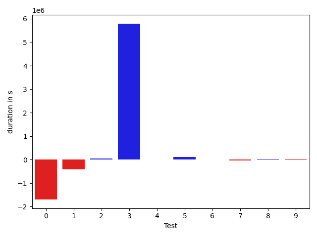
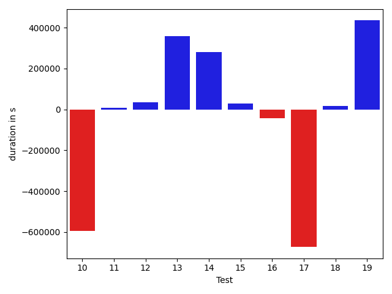
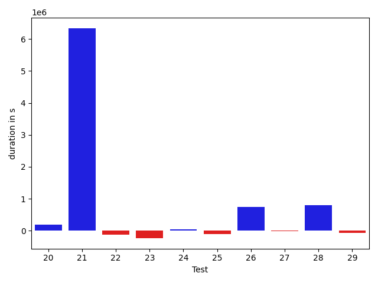
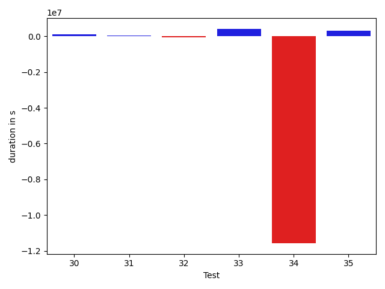

# gson d8c12a

https://github.com/google/gson/commit/d8c12a

## Delta Energy per test method

| ID | EnergyV1 | EnergyV2 | DeltaEnergy |
| --- | --- | --- | --- |
| 0 | 61390.643826851185 | 40405.54047808988 | -20985.103348761302 |
| 1 | 49725.761583833024 | 42785.13903660049 | -6940.622547232531 |
| 2 | 35962.515637397766 | 38293.68005001545 | 2331.1644126176834 |
| 3 | 45172.0232856567 | 271207.8611329242 | 226035.8378472675 |
| 4 | 39694.33467257023 | 38391.77747344971 | -1302.5571991205215 |
| 5 | 38631.621420025826 | 37385.93134307861 | -1245.6900769472122 |
| 6 | 34349.16618804075 | 39340.2743627131 | 4991.10817467235 |
| 7 | 40295.350605010986 | 36433.527879714966 | -3861.8227252960205 |
| 8 | 34555.07885932922 | 37758.007135700434 | 3202.928276371211 |
| 9 | 38315.638624191284 | 37565.50176298618 | -750.136861205101 |
| 10 | 34916.559839844704 | 37084.67098039389 | 2168.111140549183 |
| 11 | 37822.02655120974 | 35899.6495205894 | -1922.3770306203369 |
| 12 | 42480.62872314453 | 36956.17611503601 | -5524.4526081085205 |
| 13 | 46186.60246402025 | 42414.672129154205 | -3771.930334866047 |
| 14 | 35272.70528478015 | 34015.810470907236 | -1256.8948138729174 |
| 15 | 37528.99174433934 | 38981.175716748956 | 1452.1839724096135 |
| 16 | 36928.16661062083 | 39108.51131698594 | 2180.344706365111 |
| 17 | 34020.12388469862 | 40734.256277373635 | 6714.132392675012 |
| 18 | 39410.50500488281 | 32206.682624816895 | -7203.822380065918 |
| 19 | 40147.07022585953 | 38025.73553463817 | -2121.33469122136 |
| 20 | 37460.03464418987 | 36575.97062078118 | -884.0640234086895 |
| 21 | 124721.03289124146 | 352468.5892017204 | 227747.55631047892 |
| 22 | 45666.94113732818 | 38728.507064636506 | -6938.434072691671 |
| 23 | 31592.490334610826 | 36701.6721839658 | 5109.181849354973 |
| 24 | 37147.15108495951 | 57991.07690804551 | 20843.925823086 |
| 25 | 35211.326581954956 | 38895.56601715088 | 3684.239435195923 |
| 26 | 46565.8258539401 | 48792.61582949106 | 2226.789975550957 |
| 27 | 36336.23806428909 | 37175.81417274475 | 839.576108455658 |
| 28 | 42622.76407744415 | 37180.56553638897 | -5442.198541055186 |
| 29 | 33676.70995044708 | 33906.55873844959 | 229.8487880025059 |
| 30 | 35502.95723078924 | 37713.01980871832 | 2210.062577929086 |
| 31 | 36178.85099029541 | 37298.21197540313 | 1119.36098510772 |
| 32 | 42086.372961997986 | 38754.67084503174 | -3331.7021169662476 |
| 33 | 38385.22155570984 | 43327.840337082744 | 4942.618781372905 |
| 34 | 373880.9235349223 | 33943.462824329734 | -339937.46071059257 |
| 35 | 68643.09192478657 | 71622.59497094154 | 2979.503046154976 |

## Delta Duration per test method

| ID | DurationV1 | DurationsV2 | DeltaDuration |
| --- | --- | --- | --- |
| 0 | 2863175.6950655202 | 1166727.9259512248 | -1696447.7691142955 |
| 1 | 1005190.1090348223 | 588029.0670309584 | -417161.04200386396 |
| 2 | 520582.7257528305 | 574224.3851824999 | 53641.65942966938 |
| 3 | 755013.9157747853 | 6543272.709127714 | 5788258.793352929 |
| 4 | 535580.0442587137 | 531143.0855712891 | -4436.95868742466 |
| 5 | 498327.5802576542 | 598144.136256218 | 99816.55599856377 |
| 6 | 688915.3604520652 | 694474.222416088 | 5558.861964022741 |
| 7 | 669714.7417984009 | 628097.0711460114 | -41617.67065238953 |
| 8 | 597389.7427134514 | 628035.853418339 | 30646.11070488766 |
| 9 | 536703.0025596619 | 517811.78945562243 | -18891.21310403943 |
| 10 | 1315005.6326971054 | 721344.7570704818 | -593660.8756266236 |
| 11 | 710032.9806588631 | 717808.6169475503 | 7775.6362886872375 |
| 12 | 487875.19065856934 | 523729.2097053528 | 35854.01904678345 |
| 13 | 722302.2841572762 | 1080040.9626146555 | 357738.67845737934 |
| 14 | 966674.3475857066 | 1247074.5989433276 | 280400.25135762093 |
| 15 | 701163.7516730637 | 730765.8843664356 | 29602.132693371852 |
| 16 | 1145312.6479639478 | 1101601.9115075846 | -43710.73645636323 |
| 17 | 1268235.340771205 | 594612.7121316759 | -673622.6286395291 |
| 18 | 519075.39556884766 | 536745.7691230774 | 17670.373554229736 |
| 19 | 540903.6965821534 | 976323.3830107069 | 435419.6864285534 |
| 20 | 679738.5535280127 | 870039.352519244 | 190300.79899123125 |
| 21 | 4053466.805960154 | 10391384.235476805 | 6337917.429516651 |
| 22 | 1200501.8496825323 | 1073832.7487517511 | -126669.1009307811 |
| 23 | 1254340.976688032 | 1021468.2020117503 | -232872.77467628173 |
| 24 | 1660429.4586584866 | 1699983.3205423534 | 39553.86188386683 |
| 25 | 624816.9319927692 | 526805.3396835327 | -98011.59230923653 |
| 26 | 924566.8178930059 | 1673368.6168222735 | 748801.7989292676 |
| 27 | 572398.9121294022 | 550421.0542240143 | -21977.85790538788 |
| 28 | 831926.4147660848 | 1631766.984311958 | 799840.5695458733 |
| 29 | 603778.1351385117 | 538041.9566982305 | -65736.17844028119 |
| 30 | 640056.0607792942 | 760313.5122268769 | 120257.45144758269 |
| 31 | 627646.6048736572 | 688190.5111528188 | 60543.90627916157 |
| 32 | 587434.973405838 | 524237.5631637573 | -63197.41024208069 |
| 33 | 598992.7916755676 | 1015515.2193124592 | 416522.4276368916 |
| 34 | 12105552.786633298 | 529494.3586304188 | -11576058.428002879 |
| 35 | 1400275.4460412264 | 1719356.3885429204 | 319080.94250169396 |

## Misc.

| ID | Test Class | Test Method |
| --- | --- | --- |
| 0 | com.google.gson.functional.StreamingTypeAdaptersTest | testFromJsonTree |
| 1 | com.google.gson.internal.bind.JsonElementReaderTest | testLenientNansAndInfinities |
| 2 | com.google.gson.internal.bind.JsonElementReaderTest | testSkipValue |
| 3 | com.google.gson.internal.bind.JsonElementReaderTest | testStrictNansAndInfinities |
| 4 | com.google.gson.internal.bind.JsonElementReaderTest | testNestedArrays |
| 5 | com.google.gson.internal.bind.JsonElementReaderTest | testEarlyClose |
| 6 | com.google.gson.internal.bind.JsonElementReaderTest | testNumbers |
| 7 | com.google.gson.internal.bind.JsonElementReaderTest | testNulls |
| 8 | com.google.gson.internal.bind.JsonElementReaderTest | testBooleans |
| 9 | com.google.gson.internal.bind.JsonElementReaderTest | testStrings |
| 10 | com.google.gson.internal.bind.JsonElementReaderTest | testNumbersFromStrings |
| 11 | com.google.gson.internal.bind.JsonElementReaderTest | testWrongType |
| 12 | com.google.gson.internal.bind.JsonElementReaderTest | testStringsFromNumbers |
| 13 | com.google.gson.internal.bind.JsonElementReaderTest | testArray |
| 14 | com.google.gson.functional.MapTest | testCustomSerializerForSpecificMapType |
| 15 | com.google.gson.functional.JsonParserTest | testBadFieldTypeForCustomDeserializerCustomTree |
| 16 | com.google.gson.functional.JsonParserTest | testBadFieldTypeForDeserializingCustomTree |
| 17 | com.google.gson.functional.JsonParserTest | testBadTypeForDeserializingCustomTree |
| 18 | com.google.gson.JsonParserTest | testParseInvalidJson |
| 19 | com.google.gson.JsonParserTest | testParseMixedArray |
| 20 | com.google.gson.JsonParserTest | testParseUnquotedStringArrayFails |
| 21 | com.google.gson.functional.TypeHierarchyAdapterTest | testTypeHierarchy |
| 22 | com.google.gson.functional.InheritanceTest | testClassWithBaseCollectionFieldSerialization |
| 23 | com.google.gson.functional.InheritanceTest | testClassWithBaseArrayFieldSerialization |
| 24 | com.google.gson.JsonArrayTest | testSet |
| 25 | com.google.gson.JsonArrayTest | testRemove |
| 26 | com.google.gson.JsonArrayTest | testEqualsNonEmptyArray |
| 27 | com.google.gson.JsonArrayTest | testDeepCopy |
| 28 | com.google.gson.functional.CustomSerializerTest | testSubClassSerializerInvokedForBaseClassFieldsHoldingArrayOfSubClassInstances |
| 29 | com.google.gson.functional.DefaultTypeAdaptersTest | testJsonArraySerialization |
| 30 | com.google.gson.functional.DefaultTypeAdaptersTest | testJsonArrayDeserialization |
| 31 | com.google.gson.JsonObjectTest | testDeepCopy |
| 32 | com.google.gson.internal.bind.JsonTreeWriterTest | testWriteAfterClose |
| 33 | com.google.gson.internal.bind.JsonTreeWriterTest | testLenientNansAndInfinities |
| 34 | com.google.gson.internal.bind.JsonTreeWriterTest | testArray |
| 35 | com.google.gson.internal.bind.JsonTreeWriterTest | testNestedArray |

| Test | IterationV1 | IterationV2 | DeltaIteration |
| --- | --- | --- | --- |
| 0 | 40 | 38 | -2 |
| 1 | 30 | 39 | 9 |
| 2 | 20 | 24 | 4 |
| 3 | 34 | 43 | 9 |
| 4 | 24 | 18 | -6 |
| 5 | 24 | 21 | -3 |
| 6 | 30 | 28 | -2 |
| 7 | 20 | 21 | 1 |
| 8 | 22 | 29 | 7 |
| 9 | 20 | 26 | 6 |
| 10 | 25 | 25 | 0 |
| 11 | 34 | 38 | 4 |
| 12 | 17 | 20 | 3 |
| 13 | 25 | 24 | -1 |
| 14 | 70 | 65 | -5 |
| 15 | 41 | 42 | 1 |
| 16 | 60 | 59 | -1 |
| 17 | 42 | 47 | 5 |
| 18 | 14 | 19 | 5 |
| 19 | 33 | 32 | -1 |
| 20 | 35 | 26 | -9 |
| 21 | 99 | 99 | 0 |
| 22 | 77 | 77 | 0 |
| 23 | 69 | 71 | 2 |
| 24 | 26 | 44 | 18 |
| 25 | 23 | 18 | -5 |
| 26 | 30 | 31 | 1 |
| 27 | 22 | 21 | -1 |
| 28 | 54 | 66 | 12 |
| 29 | 21 | 31 | 10 |
| 30 | 35 | 35 | 0 |
| 31 | 18 | 29 | 11 |
| 32 | 22 | 18 | -4 |
| 33 | 20 | 26 | 6 |
| 34 | 28 | 26 | -2 |
| 35 | 24 | 25 | 1 |

| Time Label | Time (s) |
| --- | --- |
| Selection | 27.488807678222656 |
| Injection | 12.864572048187256 |
| Total | 1036.3794174194336 |

