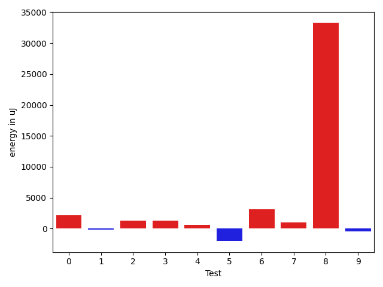
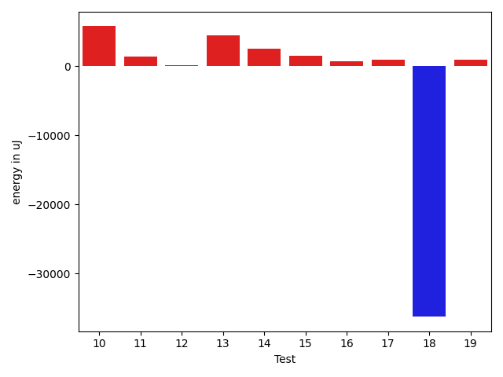
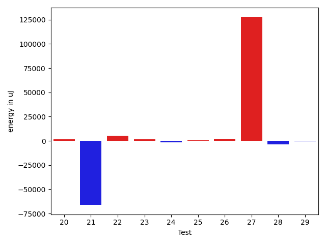
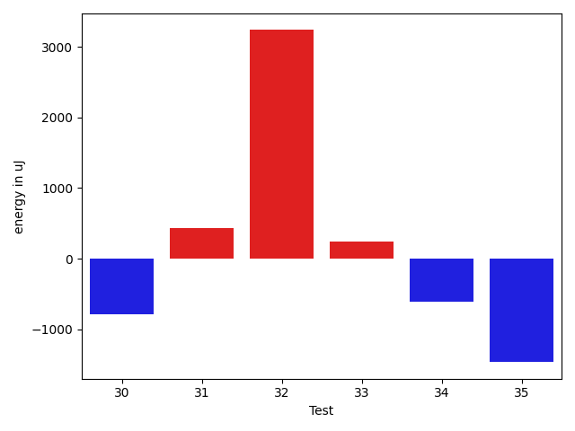
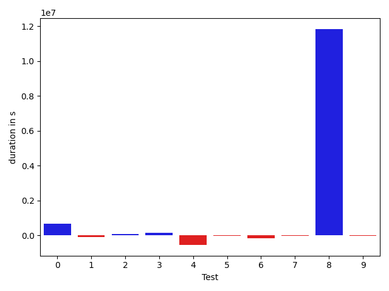
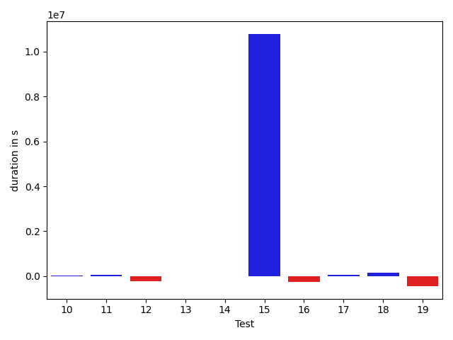
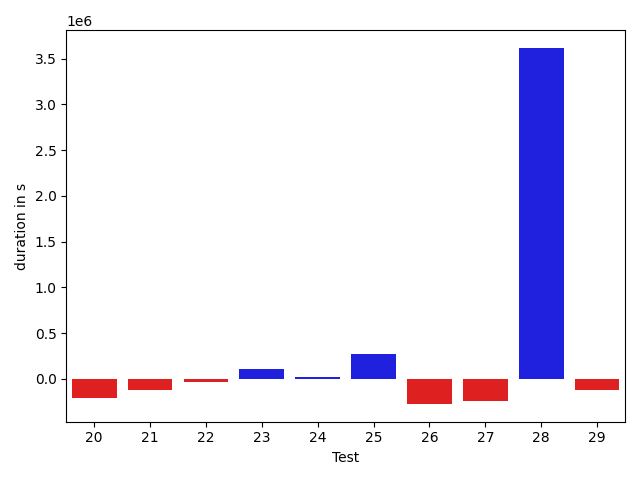
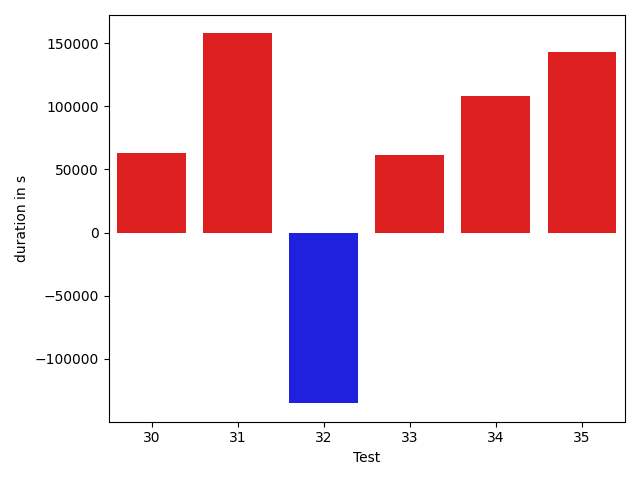

# gson 6960eb

https://github.com/google/gson/commit/6960eb

## Delta Energy per test method

| ID | EnergyV1 | EnergyV2 | DeltaEnergy |
| --- | --- | --- | --- |
| 0 | 41022.855163772816 | 69917.68315186189 | 28894.82798808907 |
| 1 | 37255.21549997007 | 36674.3040108391 | -580.9114891309728 |
| 2 | 41294.909123843725 | 38085.045974100656 | -3209.863149743069 |
| 3 | 37343.39121949652 | 36498.090905133235 | -845.3003143632886 |
| 4 | 51465.32938521019 | 35549.34389705497 | -15915.985488155224 |
| 5 | 35225.646642923355 | 35689.65606880188 | 464.0094258785248 |
| 6 | 39587.336893081665 | 40298.19347143173 | 710.8565783500671 |
| 7 | 35489.50795732265 | 35586.34496360354 | 96.83700628088991 |
| 8 | 36740.16145263612 | 431073.27249165997 | 394333.11103902385 |
| 9 | 39398.98066961765 | 37466.99969482422 | -1931.9809747934341 |
| 10 | 37933.455474853516 | 40017.408935546875 | 2083.9534606933594 |
| 11 | 39329.08725450933 | 42743.048124616034 | 3413.9608701067045 |
| 12 | 33752.877643585205 | 39828.9211114496 | 6076.043467864394 |
| 13 | 38451.288803100586 | 38532.83187007904 | 81.54306697845459 |
| 14 | 39256.694983005524 | 41953.974498040974 | 2697.2795150354505 |
| 15 | 59685.73173946142 | 456758.71714475006 | 397072.98540528864 |
| 16 | 32461.072578430176 | 38391.2424621582 | 5930.169883728027 |
| 17 | 39219.65170240402 | 42749.65788164176 | 3530.0061792377383 |
| 18 | 37672.53168773651 | 38327.54370212555 | 655.0120143890381 |
| 19 | 41514.1347258091 | 43107.98646097444 | 1593.8517351653427 |
| 20 | 44360.461519899094 | 38932.34795579499 | -5428.113564104104 |
| 21 | 40394.84118652344 | 40398.53283137083 | 3.691644847393036 |
| 22 | 42742.555107624794 | 44585.21072231978 | 1842.655614694988 |
| 23 | 43381.4069519043 | 38931.881991654634 | -4449.524960249662 |
| 24 | 41249.95486613265 | 38596.90882760219 | -2653.0460385304614 |
| 25 | 40805.58596931189 | 43928.622144881796 | 3123.036175569905 |
| 26 | 34265.45262841345 | 37444.086744899534 | 3178.634116486086 |
| 27 | 35752.64764404297 | 39846.859503269196 | 4094.211859226227 |
| 28 | 229670.80579985253 | 324963.32758031646 | 95292.52178046393 |
| 29 | 37977.58350211129 | 39903.69541646233 | 1926.111914351044 |
| 30 | 37067.73548901081 | 41425.82181799412 | 4358.086328983307 |
| 31 | 38396.23400402814 | 35619.94406890869 | -2776.28993511945 |
| 32 | 37567.37692682445 | 38005.911972910166 | 438.5350460857153 |
| 33 | 37398.998847961426 | 43880.45304107666 | 6481.454193115234 |
| 34 | 48103.8891792015 | 60680.13981331226 | 12576.250634110758 |
| 35 | 38158.832429885864 | 39582.55346286297 | 1423.7210329771042 |

## Delta Duration per test method

| ID | DurationV1 | DurationsV2 | DeltaDuration |
| --- | --- | --- | --- |
| 0 | 1475350.9636884853 | 2140893.8052618783 | 665542.841573393 |
| 1 | 929303.9193126713 | 846676.3783657168 | -82627.54094695451 |
| 2 | 909546.5359805758 | 980083.5936337552 | 70537.05765317939 |
| 3 | 823680.354110416 | 965543.4281039173 | 141863.07399350125 |
| 4 | 1456431.703406676 | 916980.8889478544 | -539450.8144588216 |
| 5 | 674565.9912707806 | 655970.2862968445 | -18595.70497393608 |
| 6 | 692005.0117044449 | 531155.4145622253 | -160849.59714221954 |
| 7 | 681047.2095753464 | 662758.4762523584 | -18288.73332298803 |
| 8 | 514278.22873081267 | 12352509.819408521 | 11838231.590677708 |
| 9 | 557141.2850028723 | 520858.95191955566 | -36282.333083316684 |
| 10 | 530448.9832763672 | 547266.634765625 | 16817.651489257812 |
| 11 | 668465.3513877466 | 728988.3410792667 | 60522.98969152011 |
| 12 | 794849.6818695068 | 560376.3002733141 | -234473.38159619272 |
| 13 | 558678.8251037598 | 555353.0529470444 | -3325.772156715393 |
| 14 | 556846.8363130093 | 543176.6362257451 | -13670.20008726418 |
| 15 | 1204239.857351303 | 11987124.403114758 | 10782884.545763455 |
| 16 | 785239.4101448059 | 542202.7668609619 | -243036.643283844 |
| 17 | 591875.2624139786 | 657698.7352763303 | 65823.47286235169 |
| 18 | 536905.9321947098 | 700210.7441530228 | 163304.811958313 |
| 19 | 1003070.1119296253 | 558908.7191812154 | -444161.3927484099 |
| 20 | 967996.7392302797 | 756009.3630898268 | -211987.37614045292 |
| 21 | 650432.0658569336 | 530251.8506124616 | -120180.21524447203 |
| 22 | 825369.5834934496 | 788085.518321909 | -37284.0651715406 |
| 23 | 471741.51320648193 | 582745.7791081741 | 111004.26590169221 |
| 24 | 934248.7360433021 | 959471.3638541454 | 25222.62781084329 |
| 25 | 1018448.6895891167 | 1288074.700359106 | 269626.01076998934 |
| 26 | 797649.3310010501 | 523495.58934034465 | -274153.7416607054 |
| 27 | 772741.1244659424 | 534485.0142657757 | -238256.1102001667 |
| 28 | 6391664.917235536 | 10009187.649720652 | 3617522.7324851165 |
| 29 | 1016418.7503421092 | 889376.961105228 | -127041.78923688119 |
| 30 | 539738.9439752102 | 637901.3735874891 | 98162.42961227894 |
| 31 | 683521.7932541631 | 703665.8280611038 | 20144.034806940705 |
| 32 | 634373.2332524359 | 544944.4024535418 | -89428.83079889417 |
| 33 | 755180.0742034912 | 461616.31157684326 | -293563.76262664795 |
| 34 | 2098692.3354914803 | 2462844.554170142 | 364152.2186786616 |
| 35 | 748199.6038975716 | 704695.1576063633 | -43504.44629120827 |

## Misc.

| ID | Test Class | Test Method |
| --- | --- | --- |
| 0 | com.google.gson.functional.StreamingTypeAdaptersTest | testFromJsonTree |
| 1 | com.google.gson.functional.JsonParserTest | testBadTypeForDeserializingCustomTree |
| 2 | com.google.gson.functional.JsonParserTest | testBadFieldTypeForDeserializingCustomTree |
| 3 | com.google.gson.functional.JsonParserTest | testBadFieldTypeForCustomDeserializerCustomTree |
| 4 | com.google.gson.internal.bind.JsonElementReaderTest | testStrictNansAndInfinities |
| 5 | com.google.gson.internal.bind.JsonElementReaderTest | testNumbersFromStrings |
| 6 | com.google.gson.internal.bind.JsonElementReaderTest | testNulls |
| 7 | com.google.gson.internal.bind.JsonElementReaderTest | testWrongType |
| 8 | com.google.gson.internal.bind.JsonElementReaderTest | testNumbers |
| 9 | com.google.gson.internal.bind.JsonElementReaderTest | testEarlyClose |
| 10 | com.google.gson.internal.bind.JsonElementReaderTest | testStringsFromNumbers |
| 11 | com.google.gson.internal.bind.JsonElementReaderTest | testLenientNansAndInfinities |
| 12 | com.google.gson.internal.bind.JsonElementReaderTest | testNestedArrays |
| 13 | com.google.gson.internal.bind.JsonElementReaderTest | testSkipValue |
| 14 | com.google.gson.internal.bind.JsonElementReaderTest | testBooleans |
| 15 | com.google.gson.internal.bind.JsonElementReaderTest | testArray |
| 16 | com.google.gson.internal.bind.JsonElementReaderTest | testStrings |
| 17 | com.google.gson.JsonParserTest | testParseUnquotedStringArrayFails |
| 18 | com.google.gson.JsonParserTest | testParseInvalidJson |
| 19 | com.google.gson.JsonParserTest | testParseMixedArray |
| 20 | com.google.gson.JsonArrayTest | testSet |
| 21 | com.google.gson.JsonArrayTest | testDeepCopy |
| 22 | com.google.gson.JsonArrayTest | testEqualsNonEmptyArray |
| 23 | com.google.gson.JsonArrayTest | testRemove |
| 24 | com.google.gson.functional.InheritanceTest | testClassWithBaseArrayFieldSerialization |
| 25 | com.google.gson.functional.InheritanceTest | testClassWithBaseCollectionFieldSerialization |
| 26 | com.google.gson.functional.DefaultTypeAdaptersTest | testJsonArrayDeserialization |
| 27 | com.google.gson.functional.DefaultTypeAdaptersTest | testJsonArraySerialization |
| 28 | com.google.gson.functional.TypeHierarchyAdapterTest | testTypeHierarchy |
| 29 | com.google.gson.functional.CustomSerializerTest | testSubClassSerializerInvokedForBaseClassFieldsHoldingArrayOfSubClassInstances |
| 30 | com.google.gson.internal.bind.JsonTreeWriterTest | testNestedArray |
| 31 | com.google.gson.internal.bind.JsonTreeWriterTest | testLenientNansAndInfinities |
| 32 | com.google.gson.internal.bind.JsonTreeWriterTest | testArray |
| 33 | com.google.gson.internal.bind.JsonTreeWriterTest | testWriteAfterClose |
| 34 | com.google.gson.functional.MapTest | testCustomSerializerForSpecificMapType |
| 35 | com.google.gson.JsonObjectTest | testDeepCopy |

| Test | IterationV1 | IterationV2 | DeltaIteration |
| --- | --- | --- | --- |
| 0 | 39 | 33 | -6 |
| 1 | 40 | 38 | -2 |
| 2 | 65 | 66 | 1 |
| 3 | 38 | 43 | 5 |
| 4 | 42 | 43 | 1 |
| 5 | 22 | 20 | -2 |
| 6 | 20 | 22 | 2 |
| 7 | 39 | 35 | -4 |
| 8 | 26 | 28 | 2 |
| 9 | 27 | 17 | -10 |
| 10 | 16 | 13 | -3 |
| 11 | 28 | 31 | 3 |
| 12 | 20 | 27 | 7 |
| 13 | 18 | 21 | 3 |
| 14 | 23 | 28 | 5 |
| 15 | 25 | 29 | 4 |
| 16 | 19 | 17 | -2 |
| 17 | 21 | 30 | 9 |
| 18 | 20 | 21 | 1 |
| 19 | 27 | 30 | 3 |
| 20 | 36 | 40 | 4 |
| 21 | 14 | 27 | 13 |
| 22 | 35 | 28 | -7 |
| 23 | 19 | 27 | 8 |
| 24 | 72 | 68 | -4 |
| 25 | 77 | 74 | -3 |
| 26 | 33 | 38 | 5 |
| 27 | 19 | 23 | 4 |
| 28 | 99 | 99 | 0 |
| 29 | 63 | 51 | -12 |
| 30 | 25 | 24 | -1 |
| 31 | 29 | 23 | -6 |
| 32 | 27 | 26 | -1 |
| 33 | 18 | 20 | 2 |
| 34 | 66 | 72 | 6 |
| 35 | 23 | 24 | 1 |

| Time Label | Time (s) |
| --- | --- |
| Selection | 27.127505779266357 |
| Injection | 12.465412378311157 |
| Total | 1034.6935045719147 |

