# gson 8bf294

https://github.com/google/gson/commit/8bf294

## Delta Energy per test method

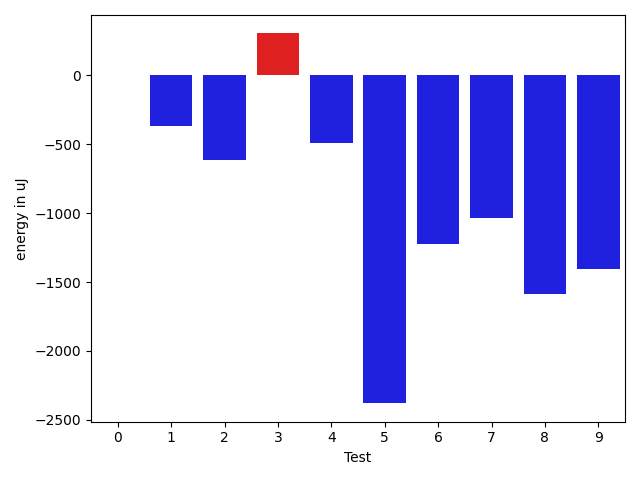

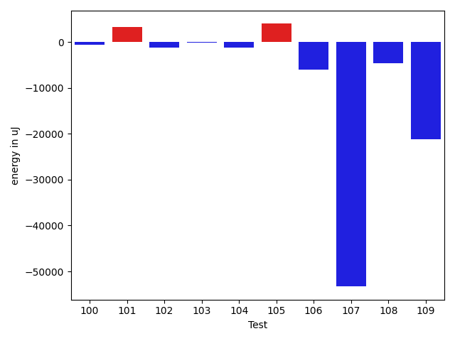

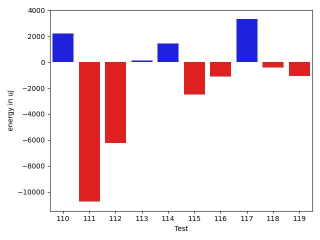

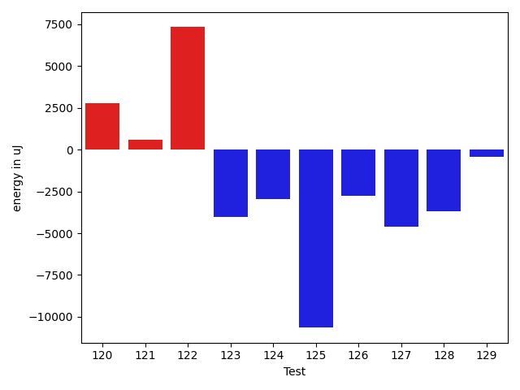

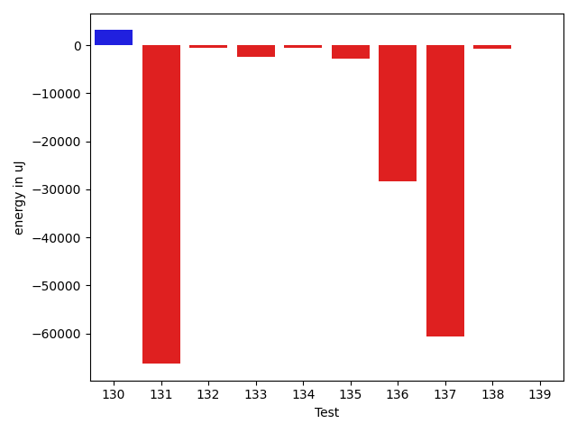

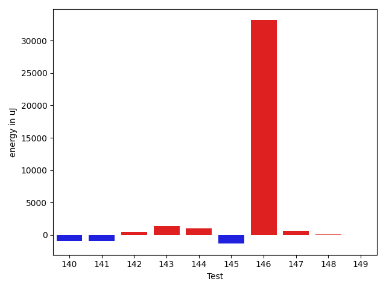

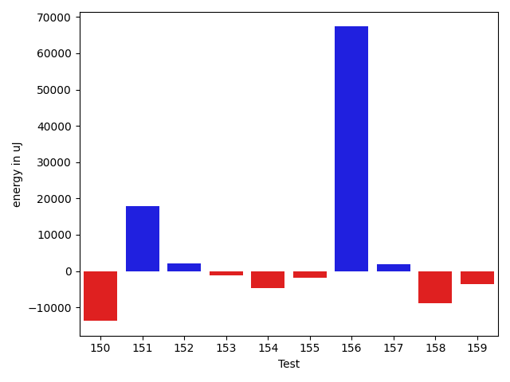

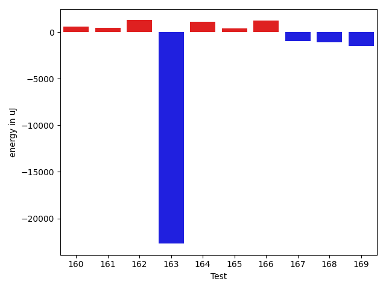

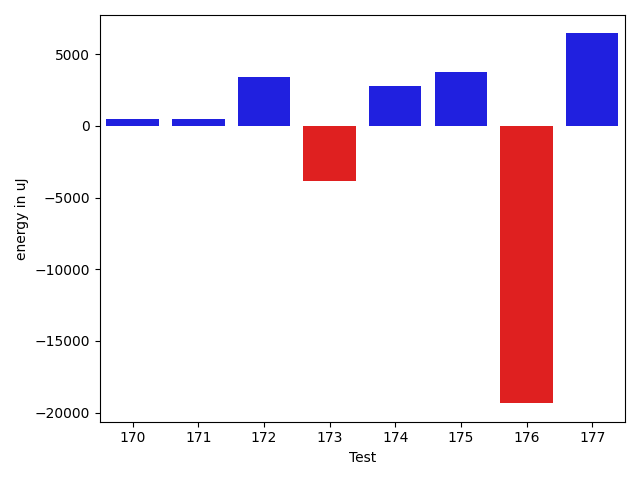

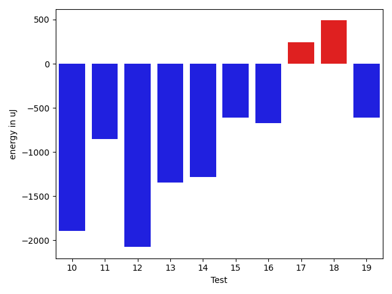

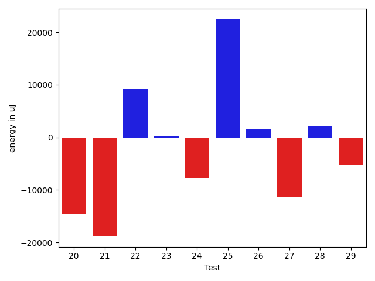

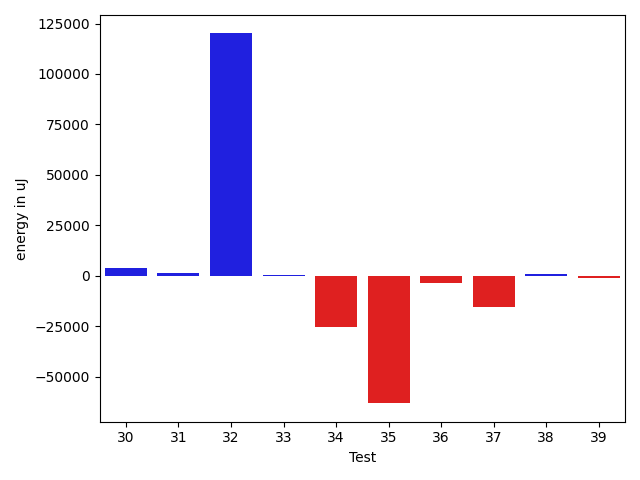

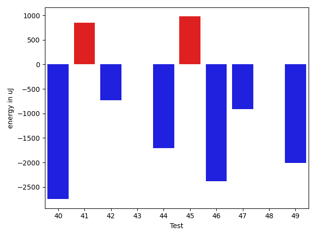

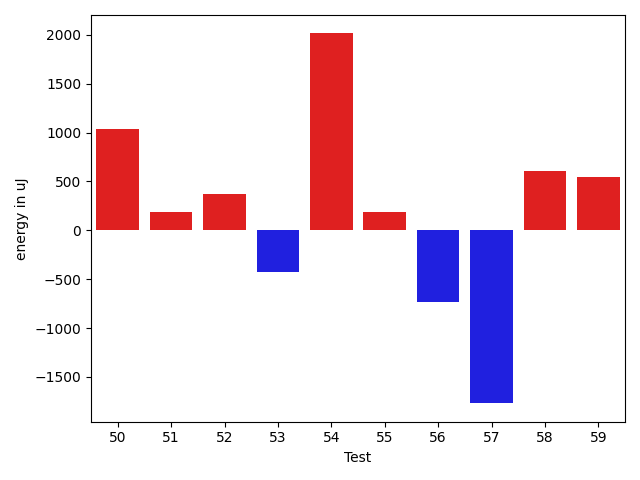

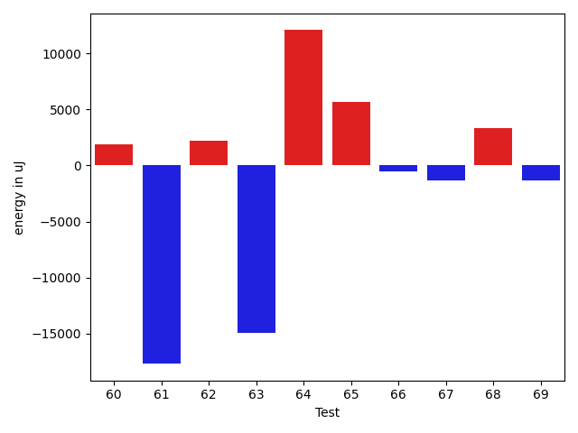

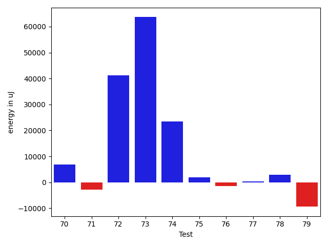

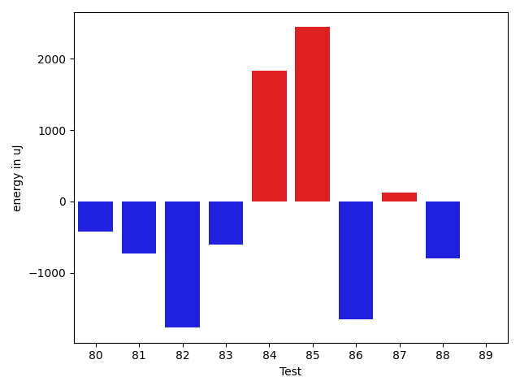

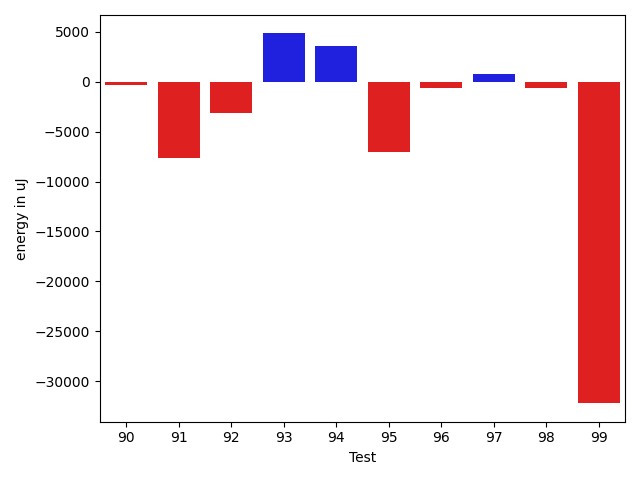

| ID | EnergyV1 | EnergyV2 | DeltaEnergy |
| --- | --- | --- | --- |
| 0 | 65068.377937318364 | 42126.990935320224 | -22941.38700199814 |
| 1 | 63772.32348508476 | 38968.73606228672 | -24803.58742279804 |
| 2 | 42815.27203280489 | 39760.143798789715 | -3055.128234015174 |
| 3 | 56491.80811124845 | 79873.5321361245 | 23381.72402487605 |
| 4 | 42404.47927916515 | 40403.406071449994 | -2001.0732077151551 |
| 5 | 61079.139787509026 | 42095.35546536738 | -18983.784322141648 |
| 6 | 92046.64539193065 | 55874.648681676976 | -36171.996710253676 |
| 7 | 49402.32084481008 | 55463.48096766543 | 6061.160122855355 |
| 8 | 62647.63608313324 | 40731.14940937809 | -21916.48667375515 |
| 9 | 44314.23417265897 | 44834.84306214086 | 520.6088894818895 |
| 10 | 42415.13654284252 | 41908.81705555686 | -506.31948728566203 |
| 11 | 43416.93943398787 | 40674.5450063409 | -2742.39442764697 |
| 12 | 64843.97817390685 | 39711.18468766712 | -25132.79348623973 |
| 13 | 43849.5094843626 | 39152.90736223018 | -4696.602122132419 |
| 14 | 42763.50862219001 | 38677.60303127726 | -4085.9055909127565 |
| 15 | 44804.25168361142 | 38359.12046129673 | -6445.131222314696 |
| 16 | 42806.044610348705 | 47345.96144830083 | 4539.916837952129 |
| 17 | 43992.18566083908 | 42829.26488290727 | -1162.9207779318094 |
| 18 | 40605.06285748827 | 42114.224393424825 | 1509.1615359365533 |
| 19 | 39815.103706459806 | 44529.224985472145 | 4714.121279012339 |
| 20 | 65827.01014500168 | 51285.66576261714 | -14541.344382384537 |
| 21 | 63620.316130523395 | 44823.18070436482 | -18797.135426158573 |
| 22 | 38050.38186177006 | 47192.95754336193 | 9142.575681591872 |
| 23 | 40262.64168740371 | 40478.021135032235 | 215.37944762852567 |
| 24 | 51015.16286265192 | 43219.66926881917 | -7795.493593832754 |
| 25 | 43044.5097053489 | 65441.94375598713 | 22397.43405063823 |
| 26 | 41538.29286003113 | 43131.13488769531 | 1592.8420276641846 |
| 27 | 53010.34516510175 | 41637.76347658481 | -11372.58168851694 |
| 28 | 41343.48109436035 | 43381.341064453125 | 2037.8599700927734 |
| 29 | 46735.55861258507 | 41552.55309486389 | -5183.005517721176 |
| 30 | 39131.1812210083 | 42821.00552368164 | 3689.82430267334 |
| 31 | 39456.191162109375 | 41082.497297525406 | 1626.3061354160309 |
| 32 | 42991.407470703125 | 163048.7922668457 | 120057.38479614258 |
| 33 | 40672.047607421875 | 41055.7021484375 | 383.654541015625 |
| 34 | 91032.92955203001 | 65872.3970167033 | -25160.53253532671 |
| 35 | 159937.50563588593 | 96910.35324902569 | -63027.15238686024 |
| 36 | 45736.957329974175 | 42044.02505518152 | -3692.9322747926562 |
| 37 | 79875.26440912444 | 64393.62751152175 | -15481.636897602693 |
| 38 | 43111.81666251365 | 44143.91046623967 | 1032.0938037260203 |
| 39 | 43334.478607177734 | 42145.73962402344 | -1188.7389831542969 |
| 40 | 44641.316239073996 | 44782.019216620654 | 140.70297754665808 |
| 41 | 44579.91095685959 | 41791.36341759667 | -2788.547539262916 |
| 42 | 42201.60894346237 | 42444.70889145136 | 243.09994798898697 |
| 43 | 47453.2939453125 | 44378.00231933594 | -3075.2916259765625 |
| 44 | 41991.67077636719 | 42185.977294921875 | 194.3065185546875 |
| 45 | 44575.63537597656 | 42456.59375 | -2119.0416259765625 |
| 46 | 41919.97265625 | 43965.36328125 | 2045.390625 |
| 47 | 46598.35546875 | 40642.68444442749 | -5955.67102432251 |
| 48 | 41686.35258483887 | 42315.71955871582 | 629.3669738769531 |
| 49 | 45901.699845314026 | 43882.593185424805 | -2019.1066598892212 |
| 50 | 43135.348388671875 | 41423.75305175781 | -1711.5953369140625 |
| 51 | 42083.47700500488 | 43582.201171875 | 1498.7241668701172 |
| 52 | 43171.5556640625 | 42636.48046875 | -535.0751953125 |
| 53 | 45495.14806365967 | 42535.24206542969 | -2959.9059982299805 |
| 54 | 45672.12841796875 | 44029.56066894531 | -1642.5677490234375 |
| 55 | 44943.4609375 | 44484.833984375 | -458.626953125 |
| 56 | 42968.6494140625 | 40101.79296875 | -2866.8564453125 |
| 57 | 41756.67578125 | 43323.296875 | 1566.62109375 |
| 58 | 39508.658447265625 | 45732.67919921875 | 6224.020751953125 |
| 59 | 43159.26296043396 | 44416.56799316406 | 1257.3050327301025 |
| 60 | 43443.54296875 | 44272.59814453125 | 829.05517578125 |
| 61 | 43668.146484375 | 43489.4657125473 | -178.68077182769775 |
| 62 | 40418.80645168491 | 45492.227653265 | 5073.421201580088 |
| 63 | 169652.69123760692 | 67081.1009346375 | -102571.59030296942 |
| 64 | 51957.19837082461 | 42205.10234459651 | -9752.0960262281 |
| 65 | 41321.29734244943 | 45752.60787169635 | 4431.310529246926 |
| 66 | 44017.2132105599 | 43967.63595303769 | -49.577257522214495 |
| 67 | 40996.89528042078 | 46925.32603798351 | 5928.430757562732 |
| 68 | 99766.85843128846 | 45030.43792500758 | -54736.42050628088 |
| 69 | 56748.639309747334 | 63617.99639166601 | 6869.357081918679 |
| 70 | 83468.97198235973 | 90214.61858574086 | 6745.64660338113 |
| 71 | 47010.909452425694 | 44187.982602842785 | -2822.926849582909 |
| 72 | 100690.26672020993 | 141927.5357268163 | 41237.26900660638 |
| 73 | 46039.68229994687 | 109680.72227879702 | 63641.03997885015 |
| 74 | 44752.61306419913 | 68125.50608159494 | 23372.893017395807 |
| 75 | 41880.587759955255 | 43695.30109472226 | 1814.7133347670024 |
| 76 | 119742.03031410238 | 118243.96814990856 | -1498.0621641938196 |
| 77 | 45881.97817993164 | 46214.1185874939 | 332.14040756225586 |
| 78 | 40504.04052734375 | 43310.1875 | 2806.14697265625 |
| 79 | 54586.92572466829 | 45184.28574920952 | -9402.63997545877 |
| 80 | 42234.22022988823 | 66909.32679170936 | 24675.10656182113 |
| 81 | 89486.31370371464 | 113492.62274137391 | 24006.309037659274 |
| 82 | 45445.48177517932 | 41569.40981317109 | -3876.071962008231 |
| 83 | 81384.21138309271 | 85970.595104273 | 4586.383721180289 |
| 84 | 64249.84865673918 | 40717.08938772145 | -23532.759269017733 |
| 85 | 147637.4848644657 | 140127.16287811814 | -7510.321986347553 |
| 86 | 42390.89932394028 | 40952.911193847656 | -1437.9881300926208 |
| 87 | 42021.8349609375 | 42722.48839569092 | 700.653434753418 |
| 88 | 40822.95703125 | 41266.3984375 | 443.44140625 |
| 89 | 43571.93326950073 | 40638.71242523193 | -2933.220844268799 |
| 90 | 43785.227783203125 | 43458.88153076172 | -326.34625244140625 |
| 91 | 59559.01575279236 | 51898.37097167969 | -7660.644781112671 |
| 92 | 43153.86995124817 | 40049.96716308594 | -3103.9027881622314 |
| 93 | 41428.66431064438 | 46257.81487214159 | 4829.150561497212 |
| 94 | 37076.31452178955 | 40612.81869888306 | 3536.504177093506 |
| 95 | 56521.79996275902 | 49464.45496559143 | -7057.344997167587 |
| 96 | 42742.9638671875 | 42148.15625 | -594.8076171875 |
| 97 | 42339.186896935105 | 43081.22674019668 | 742.0398432615766 |
| 98 | 43121.099609375 | 42513.96875 | -607.130859375 |
| 99 | 74537.5818522738 | 42334.211438302715 | -32203.370413971083 |
| 100 | 184784.07953591264 | 111836.93926769054 | -72947.1402682221 |
| 101 | 73824.48285597572 | 46641.287845262734 | -27183.19501071298 |
| 102 | 46850.3423815494 | 41382.48348049517 | -5467.858901054235 |
| 103 | 38450.076416015625 | 43786.789154052734 | 5336.712738037109 |
| 104 | 42305.33425551653 | 43577.92307949066 | 1272.5888239741325 |
| 105 | 45673.15735447864 | 42621.950367110876 | -3051.206987367761 |
| 106 | 43769.91543164849 | 55380.059414982796 | 11610.143983334303 |
| 107 | 42242.84623768367 | 40917.43243598938 | -1325.4138016942888 |
| 108 | 59391.264499351164 | 49901.182136889096 | -9490.082362462068 |
| 109 | 44789.30329908355 | 50487.10873255309 | 5697.805433469541 |
| 110 | 42868.3258600235 | 45061.47373040859 | 2193.147870385088 |
| 111 | 46983.400173187256 | 36213.59849882126 | -10769.801674365997 |
| 112 | 43887.58389759064 | 37637.58579516411 | -6249.998102426529 |
| 113 | 43340.81090927124 | 43478.91919326782 | 138.10828399658203 |
| 114 | 40424.114292881364 | 41872.23761512758 | 1448.1233222462179 |
| 115 | 42011.04553222656 | 39520.45959472656 | -2490.5859375 |
| 116 | 44986.165214538574 | 43858.566955566406 | -1127.598258972168 |
| 117 | 39077.37890625 | 42388.1650390625 | 3310.7861328125 |
| 118 | 41892.29209494591 | 41465.064796447754 | -427.2272984981537 |
| 119 | 41315.0600031279 | 40254.52937546279 | -1060.53062766511 |
| 120 | 47398.98378229141 | 43568.25253504515 | -3830.7312472462654 |
| 121 | 43819.115674614906 | 41881.824280854315 | -1937.2913937605917 |
| 122 | 43944.834486722946 | 45089.99002914131 | 1145.1555424183607 |
| 123 | 43512.19474482536 | 40302.78415757418 | -3209.4105872511864 |
| 124 | 40645.73425127566 | 109656.88825643063 | 69011.15400515497 |
| 125 | 40936.08354187012 | 41296.24411773682 | 360.1605758666992 |
| 126 | 42855.952367852646 | 47153.00194051187 | 4297.049572659227 |
| 127 | 42757.01102872145 | 42205.684976920435 | -551.3260518010138 |
| 128 | 39042.913919048115 | 40710.41243303043 | 1667.4985139823184 |
| 129 | 77596.48037681718 | 86268.65355836117 | 8672.173181543985 |
| 130 | 40928.4686450866 | 44042.8787681358 | 3114.4101230492015 |
| 131 | 154273.71933253694 | 87964.58009517378 | -66309.13923736317 |
| 132 | 43224.91627082157 | 42745.937554836295 | -478.97871598527854 |
| 133 | 42059.20583770246 | 39691.33214522913 | -2367.873692473331 |
| 134 | 42622.90018381027 | 42025.83242284786 | -597.0677609624108 |
| 135 | 45001.951209545135 | 42273.2580980286 | -2728.6931115165353 |
| 136 | 69092.7334675742 | 40737.195285126 | -28355.538182448203 |
| 137 | 126163.9136431326 | 65454.79598757863 | -60709.11765555397 |
| 138 | 43469.816062927246 | 42813.239703178406 | -656.5763597488403 |
| 139 | 42425.490234375 | 42440.86199951172 | 15.37176513671875 |
| 140 | 42791.6064453125 | 39917.58935546875 | -2874.01708984375 |
| 141 | 40670.333355903625 | 45270.70104980469 | 4600.367693901062 |
| 142 | 43807.295007259294 | 61326.8957024213 | 17519.600695162007 |
| 143 | 43496.59863871032 | 40971.729635723255 | -2524.869002987063 |
| 144 | 48765.84827038012 | 43768.23102954052 | -4997.617240839601 |
| 145 | 105315.1898324791 | 50549.624390170866 | -54765.56544230823 |
| 146 | 49072.12975965734 | 44340.473910490444 | -4731.655849166898 |
| 147 | 56182.153581811566 | 67582.60540840408 | 11400.451826592514 |
| 148 | 65349.357051860774 | 319552.70838808734 | 254203.35133622657 |
| 149 | 45319.71297548829 | 44000.29827163718 | -1319.4147038511146 |
| 150 | 70494.54021206689 | 56750.335058938304 | -13744.205153128583 |
| 151 | 45935.32793996297 | 63846.23103283261 | 17910.903092869645 |
| 152 | 44500.60649456708 | 46535.89123460582 | 2035.28474003874 |
| 153 | 45690.848876953125 | 44488.75714429328 | -1202.0917326598428 |
| 154 | 45546.75135231018 | 40856.07873535156 | -4690.672616958618 |
| 155 | 44485.94169756955 | 42576.70936848939 | -1909.2323290801578 |
| 156 | 46634.9123593839 | 113965.66526398249 | 67330.75290459859 |
| 157 | 42669.333861258056 | 44631.80193235364 | 1962.4680710955872 |
| 158 | 94200.48740128224 | 85262.20365625803 | -8938.283745024208 |
| 159 | 42839.64893722534 | 39170.220458984375 | -3669.428478240967 |
| 160 | 43100.50213813782 | 43499.15417480469 | 398.6520366668701 |
| 161 | 43464.283203125 | 44062.62109375 | 598.337890625 |
| 162 | 42175.897846221924 | 40995.59375 | -1180.3040962219238 |
| 163 | 377077.4463081767 | 225356.12179939233 | -151721.32450878434 |
| 164 | 41270.735976070166 | 40255.726370869204 | -1015.0096052009612 |
| 165 | 46866.47228182724 | 39035.17417233158 | -7831.298109495663 |
| 166 | 45385.605728149414 | 45158.87578201294 | -226.7299461364746 |
| 167 | 82965.74559783936 | 46557.09800450504 | -36408.64759333432 |
| 168 | 182754.16994166374 | 67656.03606016561 | -115098.13388149813 |
| 169 | 44725.3876683712 | 46533.100116729736 | 1807.7124483585358 |
| 170 | 43238.86176701251 | 43712.3791885376 | 473.51742152508814 |
| 171 | 43153.4462890625 | 43629.611572265625 | 476.165283203125 |
| 172 | 37661.389739990234 | 41037.731444358826 | 3376.3417043685913 |
| 173 | 45756.25 | 41937.9128036499 | -3818.3371963500977 |
| 174 | 40947.20765018463 | 43740.589302539825 | 2793.381652355194 |
| 175 | 41719.36252146959 | 45505.674243927 | 3786.311722457409 |
| 176 | 63373.44462108612 | 44024.374771118164 | -19349.069849967957 |
| 177 | 38160.95683865063 | 44604.533391952515 | 6443.576553301886 |

## Delta Duration per test method

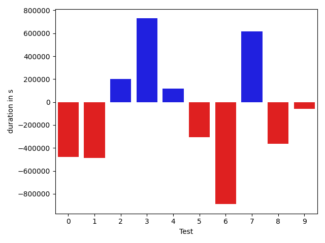

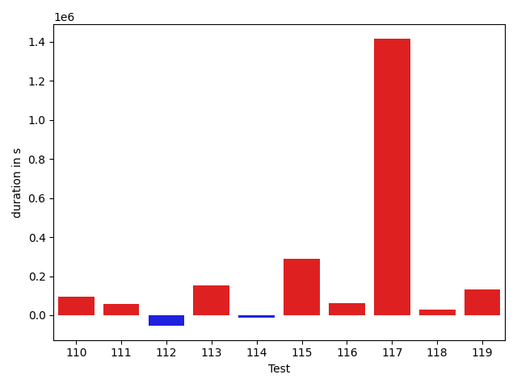

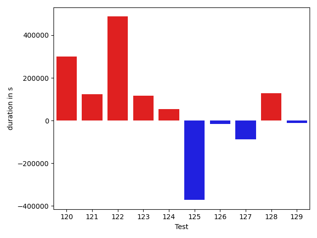

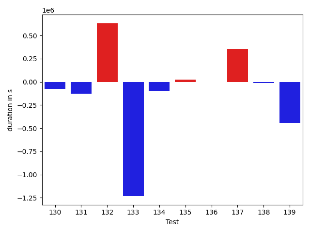

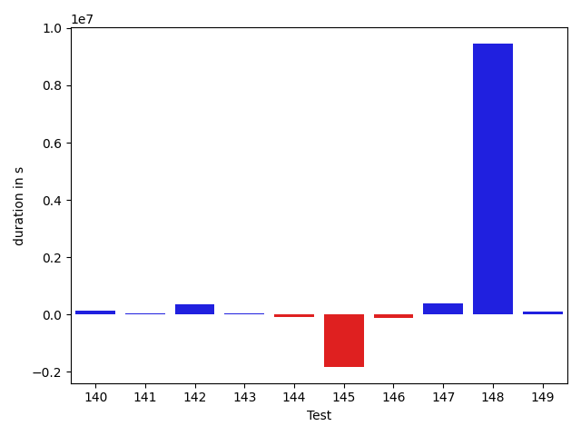

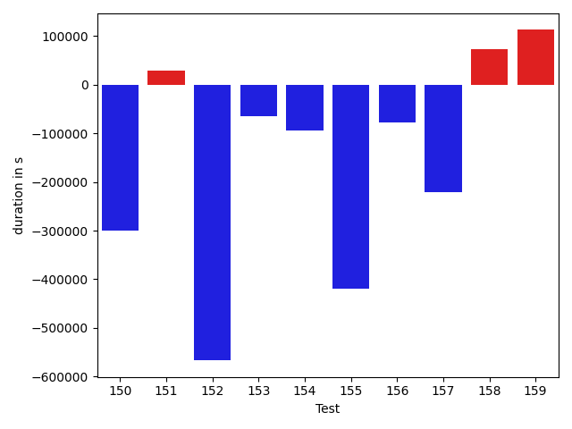

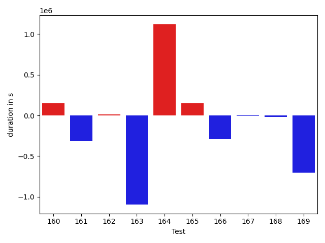

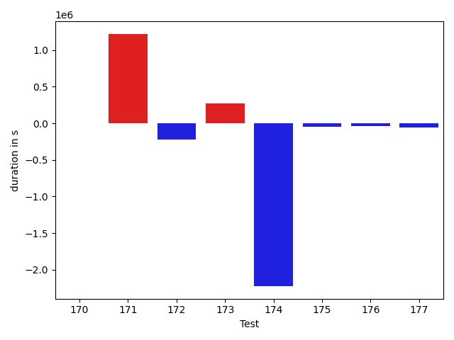

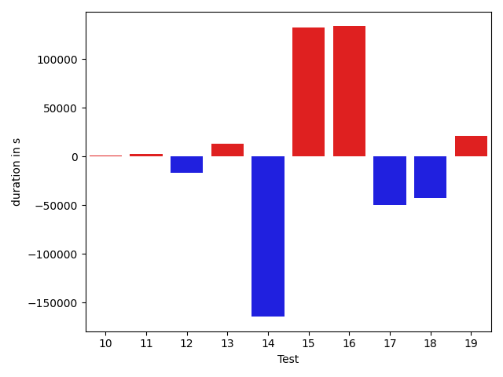

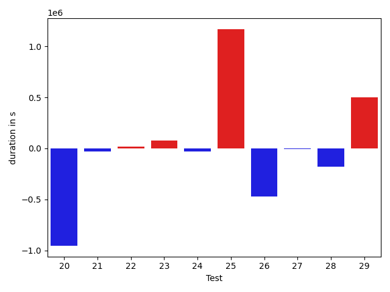

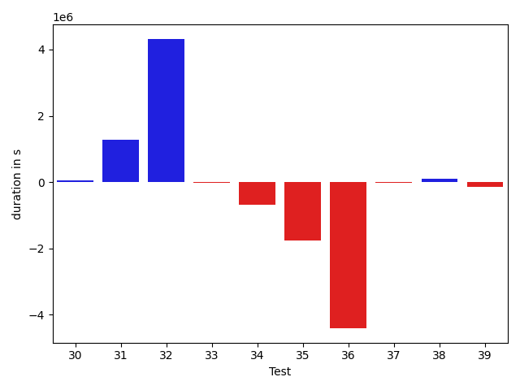

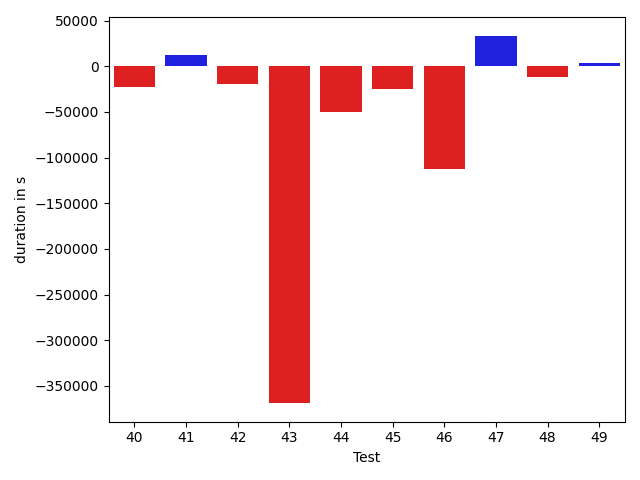

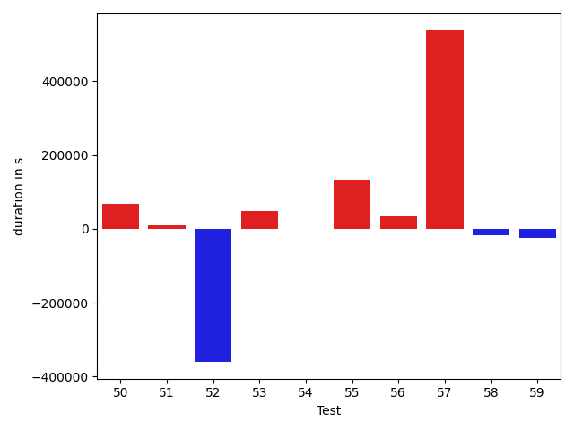

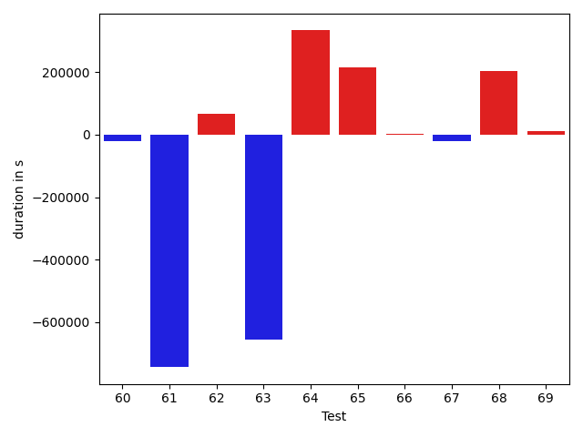

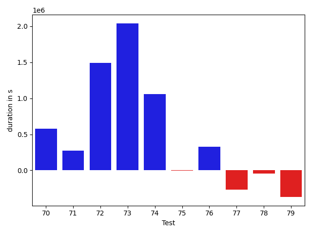

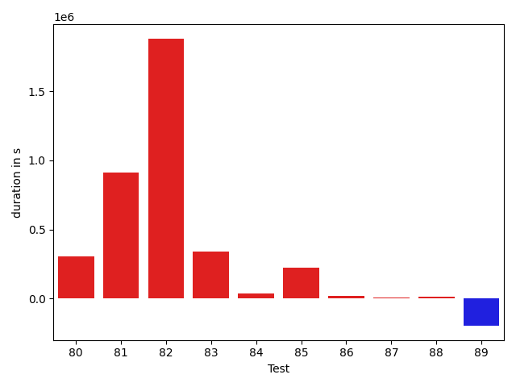

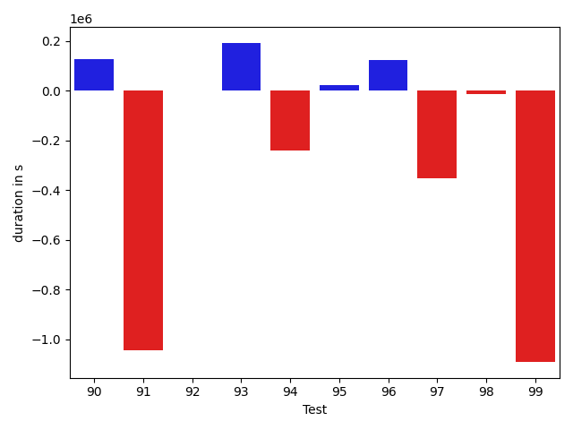

| ID | DurationV1 | DurationsV2 | DeltaDuration |
| --- | --- | --- | --- |
| 0 | 1563699.9169078716 | 1087122.470615661 | -476577.4462922106 |
| 1 | 1514251.3492454924 | 1029244.7925279102 | -485006.55671758216 |
| 2 | 891301.667413435 | 1093037.222624375 | 201735.55521094007 |
| 3 | 1454163.8269340286 | 2185454.386129089 | 731290.5591950605 |
| 4 | 844911.931358072 | 962454.0959830282 | 117542.1646249562 |
| 5 | 1729256.7172131129 | 1422807.533783525 | -306449.18342958787 |
| 6 | 2418532.000475458 | 1528203.0654252903 | -890328.9350501676 |
| 7 | 802768.5619717378 | 1419100.6890517105 | 616332.1270799728 |
| 8 | 1503511.7746070707 | 1141318.8981997254 | -362192.8764073453 |
| 9 | 671648.0486714914 | 611643.1158628437 | -60004.93280864775 |
| 10 | 1091914.6481503367 | 752073.4962801829 | -339841.15187015384 |
| 11 | 1189620.3921833243 | 1284871.6700661797 | 95251.27788285539 |
| 12 | 1214679.3605555422 | 888844.4165900812 | -325834.943965461 |
| 13 | 699588.9544547008 | 625820.550288415 | -73768.40416628576 |
| 14 | 665481.2223458041 | 751828.1547859118 | 86346.93244010769 |
| 15 | 826842.2371765459 | 674524.0499280652 | -152318.18724848074 |
| 16 | 665329.3788334721 | 669093.1963993652 | 3763.817565893056 |
| 17 | 552197.7591178417 | 399719.5527702216 | -152478.20634762011 |
| 18 | 911153.733520162 | 833817.410562485 | -77336.32295767695 |
| 19 | 962540.3761531729 | 961181.023208889 | -1359.352944283979 |
| 20 | 1991816.040831957 | 1552814.401560057 | -439001.63927190006 |
| 21 | 1380791.1781869968 | 947639.2787485751 | -433151.8994384217 |
| 22 | 1171433.1977425192 | 866414.8342445312 | -305018.363497988 |
| 23 | 731156.7657417333 | 629630.8927692779 | -101525.87297245534 |
| 24 | 1276482.5088198162 | 728213.9623378903 | -548268.5464819259 |
| 25 | 1281637.6163214399 | 1478743.2600851657 | 197105.64376372588 |
| 26 | 408997.93651771545 | 450655.15393066406 | 41657.21741294861 |
| 27 | 1093057.3268031874 | 805158.4097799463 | -287898.91702324105 |
| 28 | 341040.3038482666 | 370330.5939941406 | 29290.290145874023 |
| 29 | 500205.50606775284 | 530700.9012374878 | 30495.395169734955 |
| 30 | 428537.6114730835 | 466794.7305908203 | 38257.11911773682 |
| 31 | 590153.2615966797 | 1869820.8721610904 | 1279667.6105644107 |
| 32 | 416266.6155090332 | 4735968.037841797 | 4319701.422332764 |
| 33 | 433273.6557312012 | 421689.546875 | -11584.108856201172 |
| 34 | 2597558.5579707017 | 1913059.574474344 | -684498.9834963577 |
| 35 | 4026330.338002767 | 2261678.9640044286 | -1764651.3739983384 |
| 36 | 5623455.282981113 | 1210196.0406525573 | -4413259.242328555 |
| 37 | 1830516.307375764 | 1811769.8050214264 | -18746.5023543376 |
| 38 | 743312.0379870567 | 850896.0496239014 | 107584.01163684472 |
| 39 | 466816.2780456543 | 312066.32263183594 | -154749.95541381836 |
| 40 | 652806.0705783705 | 629601.4213978198 | -23204.64918055071 |
| 41 | 528552.76623106 | 540663.7614731205 | 12110.995242060511 |
| 42 | 494852.8981922716 | 475971.8055971265 | -18881.092595145106 |
| 43 | 829107.45703125 | 460037.1730957031 | -369070.2839355469 |
| 44 | 379873.5951843262 | 329417.8239746094 | -50455.7712097168 |
| 45 | 314716.9482421875 | 290166.09375 | -24550.8544921875 |
| 46 | 472858.1533203125 | 360619.52734375 | -112238.6259765625 |
| 47 | 328428.6796875 | 362049.62555122375 | 33620.945863723755 |
| 48 | 372658.9519805908 | 360925.05502319336 | -11733.896957397461 |
| 49 | 405815.4032101035 | 409878.9470062256 | 4063.543796122074 |
| 50 | 386723.8991699219 | 349980.43212890625 | -36743.467041015625 |
| 51 | 413897.15299987793 | 378603.2705078125 | -35293.88249206543 |
| 52 | 318861.76513671875 | 343590.5078125 | 24728.74267578125 |
| 53 | 361619.78008270264 | 471753.33868408203 | 110133.5586013794 |
| 54 | 372823.28076171875 | 477429.08752441406 | 104605.80676269531 |
| 55 | 310651.001953125 | 264955.7080078125 | -45695.2939453125 |
| 56 | 447039.6611328125 | 456223.47265625 | 9183.8115234375 |
| 57 | 280329.13671875 | 347179.3125 | 66850.17578125 |
| 58 | 400165.8732910156 | 358262.69970703125 | -41903.173583984375 |
| 59 | 339041.01863098145 | 400995.25939941406 | 61954.24076843262 |
| 60 | 390376.8359375 | 346916.76904296875 | -43460.06689453125 |
| 61 | 341846.7275390625 | 327608.63424015045 | -14238.093298912048 |
| 62 | 566662.2152883473 | 460612.1701388359 | -106050.04514951142 |
| 63 | 5718020.046281955 | 1438684.5642454606 | -4279335.482036495 |
| 64 | 1180443.0603805538 | 880695.0377809937 | -299748.0225995601 |
| 65 | 454527.7961382866 | 557406.3035725672 | 102878.50743428059 |
| 66 | 907834.926902508 | 1076272.5400162404 | 168437.61311373243 |
| 67 | 648611.7077099681 | 744730.7247540257 | 96119.0170440576 |
| 68 | 3016685.849053791 | 1717922.3554886666 | -1298763.4935651242 |
| 69 | 1556065.64655426 | 1364540.1525044607 | -191525.4940497994 |
| 70 | 1957669.9625785383 | 2533095.852547177 | 575425.8899686388 |
| 71 | 1158925.0682267067 | 1434098.3418899826 | 275173.2736632759 |
| 72 | 2451072.8544121156 | 3944632.2770178723 | 1493559.4226057567 |
| 73 | 1106699.7927245558 | 3146717.585438517 | 2040017.792713961 |
| 74 | 996163.3965827945 | 2054454.470386285 | 1058291.0738034905 |
| 75 | 797876.2379940673 | 794501.291958104 | -3374.9460359632503 |
| 76 | 2714527.5814977167 | 3045181.7086142288 | 330654.12711651204 |
| 77 | 715398.9738464355 | 451056.9158668518 | -264342.05797958374 |
| 78 | 397987.98046875 | 351539.0858154297 | -46448.89465332031 |
| 79 | 1135074.1890686927 | 766734.9464212267 | -368339.242647466 |
| 80 | 1091395.6142376105 | 1466128.599110967 | 374732.98487335653 |
| 81 | 2532740.544339392 | 2945834.650854019 | 413094.1065146271 |
| 82 | 1066460.0944135454 | 1196795.5662142388 | 130335.47180069331 |
| 83 | 2199675.5104304967 | 2042943.4267462925 | -156732.08368420415 |
| 84 | 1539799.117147871 | 1381615.7745498824 | -158183.34259798867 |
| 85 | 3770317.4214780144 | 3564401.388672079 | -205916.03280593548 |
| 86 | 535023.1669616699 | 436198.322265625 | -98824.84469604492 |
| 87 | 325090.2099609375 | 377447.9249420166 | 52357.7149810791 |
| 88 | 505241.5172729492 | 3892225.30859375 | 3386983.791320801 |
| 89 | 342406.1224575043 | 635766.1450386047 | 293360.02258110046 |
| 90 | 340450.7421875 | 466454.1638183594 | 126003.42163085938 |
| 91 | 1996247.0429000854 | 952381.7874755859 | -1043865.2554244995 |
| 92 | 494218.09856987 | 495127.6864013672 | 909.5878314971924 |
| 93 | 723904.521467295 | 915649.3994703442 | 191744.87800304918 |
| 94 | 1056935.3173675537 | 816800.0259246826 | -240135.2914428711 |
| 95 | 1612549.354122281 | 1635713.5609297752 | 23164.206807494164 |
| 96 | 349719.1416015625 | 472936.8056640625 | 123217.6640625 |
| 97 | 979339.7818169147 | 628241.4473995477 | -351098.334417367 |
| 98 | 330973.0517578125 | 317023.4296875 | -13949.6220703125 |
| 99 | 1835212.1517691384 | 745457.8903744257 | -1089754.2613947126 |
| 100 | 4913545.467570253 | 2658937.3858893197 | -2254608.081680933 |
| 101 | 1952298.0424961292 | 1948895.1112254937 | -3402.931270635454 |
| 102 | 1289403.352837386 | 1096837.899098986 | -192565.4537384 |
| 103 | 606068.9456787109 | 376180.65824890137 | -229888.28742980957 |
| 104 | 429066.65957945585 | 438696.4434366226 | 9629.783857166767 |
| 105 | 723885.5201536515 | 600799.1999189509 | -123086.32023470057 |
| 106 | 625668.6046719849 | 1378914.2881057262 | 753245.6834337413 |
| 107 | 525211.4075103067 | 818469.2808771133 | 293257.87336680666 |
| 108 | 976152.7826007875 | 1551847.913921754 | 575695.1313209666 |
| 109 | 632654.8912050703 | 1762240.6515540606 | 1129585.7603489903 |
| 110 | 549028.015329361 | 441073.8381160805 | -107954.17721328046 |
| 111 | 358349.19117355347 | 727825.8791060448 | 369476.6879324913 |
| 112 | 442017.7903251648 | 507072.09046435356 | 65054.30013918877 |
| 113 | 408580.7074813843 | 422055.8006706238 | 13475.093189239502 |
| 114 | 715484.1239482269 | 575197.075009413 | -140287.04893881397 |
| 115 | 350857.5834350586 | 418067.8260498047 | 67210.2426147461 |
| 116 | 418704.6726837158 | 473999.07958984375 | 55294.40690612793 |
| 117 | 492293.61328125 | 494626.3486328125 | 2332.7353515625 |
| 118 | 478240.55566859245 | 420080.45428466797 | -58160.101383924484 |
| 119 | 897930.5912853591 | 463978.53367898054 | -433952.05760637857 |
| 120 | 449234.53019857407 | 417628.2348000407 | -31606.295398533344 |
| 121 | 535317.1062625647 | 705636.4094473124 | 170319.3031847477 |
| 122 | 420881.69473206997 | 1070129.5077728704 | 649247.8130408004 |
| 123 | 631936.1661345959 | 482165.0022813082 | -149771.1638532877 |
| 124 | 512998.78161355853 | 3985089.580680251 | 3472090.7990666926 |
| 125 | 542093.6396484375 | 387106.0260620117 | -154987.61358642578 |
| 126 | 900726.9198163267 | 715446.1432361393 | -185280.77658018738 |
| 127 | 738050.3030732927 | 1183963.6500602285 | 445913.3469869358 |
| 128 | 778603.9061677828 | 1029924.6147597965 | 251320.7085920137 |
| 129 | 2016796.7995088636 | 2228666.207654078 | 211869.40814521443 |
| 130 | 759946.8941743628 | 706495.1138090768 | -53451.78036528593 |
| 131 | 3767574.0892462265 | 2106181.40542498 | -1661392.6838212465 |
| 132 | 865082.4320221483 | 732934.4858536022 | -132147.9461685461 |
| 133 | 541541.5528763384 | 614727.5589559542 | 73186.00607961579 |
| 134 | 888757.8720806108 | 698553.5611529099 | -190204.31092770095 |
| 135 | 562807.8970586061 | 823486.0755013302 | 260678.17844272405 |
| 136 | 1746594.1330678952 | 1484854.8871607687 | -261739.24590712646 |
| 137 | 3387075.7456792276 | 5754638.020236027 | 2367562.2745568 |
| 138 | 491176.4563598633 | 430271.76689624786 | -60904.68946361542 |
| 139 | 450142.6290283203 | 474132.68572998047 | 23990.056701660156 |
| 140 | 453717.2646484375 | 575719.9465332031 | 122002.68188476562 |
| 141 | 328131.5452699661 | 353824.9794921875 | 25693.434222221375 |
| 142 | 1285479.5027577793 | 1652933.4443429573 | 367453.941585178 |
| 143 | 749880.4654242208 | 801460.9276647423 | 51580.46224052156 |
| 144 | 1080149.2931231086 | 983175.2846444908 | -96974.00847861776 |
| 145 | 3439358.7689808626 | 1612760.9541451056 | -1826597.814835757 |
| 146 | 959934.6878115477 | 832011.8440985796 | -127922.84371296805 |
| 147 | 1404350.7513796259 | 1778742.6722996216 | 374391.92091999575 |
| 148 | 1810277.9966839254 | 11266757.435098398 | 9456479.438414473 |
| 149 | 1186831.397316562 | 1275985.522216261 | 89154.12489969889 |
| 150 | 1405113.6656203987 | 1735642.410213954 | 330528.74459355534 |
| 151 | 1133893.5770614808 | 1684794.6534538406 | 550901.0763923598 |
| 152 | 754945.0808720111 | 724595.4060715239 | -30349.674800487235 |
| 153 | 1090541.4911499023 | 390965.7699086829 | -699575.7212412194 |
| 154 | 440745.21378183365 | 510052.81213378906 | 69307.59835195541 |
| 155 | 909686.3868272253 | 938296.8236069125 | 28610.43677968718 |
| 156 | 939683.51742594 | 3600260.2474203254 | 2660576.7299943855 |
| 157 | 718978.7821435761 | 625933.8023358951 | -93044.97980768094 |
| 158 | 2482352.637538538 | 2100313.5120081976 | -382039.12553034024 |
| 159 | 557756.9105796814 | 407739.2900390625 | -150017.6205406189 |
| 160 | 809726.1177453995 | 382195.9871826172 | -427530.1305627823 |
| 161 | 337640.3134765625 | 316209.9716796875 | -21430.341796875 |
| 162 | 446802.4613609314 | 528581.71875 | 81779.2573890686 |
| 163 | 10020379.991358932 | 5375186.686816363 | -4645193.304542569 |
| 164 | 528532.801418528 | 514941.2951558102 | -13591.506262717769 |
| 165 | 626454.5157969452 | 896235.8011602834 | 269781.2853633382 |
| 166 | 335243.48754119873 | 386276.2444758415 | 51032.75693464279 |
| 167 | 2898526.5062828064 | 661358.3031690568 | -2237168.2031137496 |
| 168 | 4508036.839845419 | 979649.6096617654 | -3528387.2301836535 |
| 169 | 474216.2104460001 | 503623.15652275085 | 29406.946076750755 |
| 170 | 444542.6176317399 | 499586.29659867287 | 55043.67896693299 |
| 171 | 499714.267578125 | 417192.4582519531 | -82521.80932617188 |
| 172 | 510035.0494995117 | 471766.8105201721 | -38268.2389793396 |
| 173 | 448492.6875 | 364553.8794326782 | -83938.80806732178 |
| 174 | 1034602.7741680145 | 483747.90103912354 | -550854.873128891 |
| 175 | 421317.012648046 | 661879.384440422 | 240562.37179237604 |
| 176 | 1439752.861896515 | 447642.6077003479 | -992110.254196167 |
| 177 | 1395220.6968911774 | 683914.0045990944 | -711306.692292083 |

## Misc.

| ID | Test Class | Test Method |
| --- | --- | --- |
| 0 | com.google.gson.functional.CustomTypeAdaptersTest | testCustomAdapterInvokedForCollectionElementDeserialization |
| 1 | com.google.gson.functional.CustomTypeAdaptersTest | testCustomAdapterInvokedForMapElementSerializationWithType |
| 2 | com.google.gson.functional.CustomTypeAdaptersTest | testCustomNestedSerializers |
| 3 | com.google.gson.functional.CustomTypeAdaptersTest | testCustomSerializers |
| 4 | com.google.gson.functional.CustomTypeAdaptersTest | testCustomNestedDeserializers |
| 5 | com.google.gson.functional.CustomTypeAdaptersTest | testRegisterHierarchyAdapterForDate |
| 6 | com.google.gson.functional.CustomTypeAdaptersTest | testCustomAdapterInvokedForCollectionElementSerializationWithType |
| 7 | com.google.gson.functional.CustomTypeAdaptersTest | testCustomDeserializers |
| 8 | com.google.gson.functional.CustomTypeAdaptersTest | testEnsureCustomSerializerNotInvokedForNullValues |
| 9 | com.google.gson.functional.CustomTypeAdaptersTest | testCustomTypeAdapterAppliesToSubClassesSerializedAsBaseClass |
| 10 | com.google.gson.functional.CustomTypeAdaptersTest | testCustomAdapterInvokedForMapElementDeserialization |
| 11 | com.google.gson.functional.CustomTypeAdaptersTest | testCustomTypeAdapterDoesNotAppliesToSubClasses |
| 12 | com.google.gson.functional.CustomTypeAdaptersTest | testCustomByteArrayDeserializerAndInstanceCreator |
| 13 | com.google.gson.functional.CustomTypeAdaptersTest | testCustomDeserializerInvokedForPrimitives |
| 14 | com.google.gson.functional.CustomTypeAdaptersTest | testCustomSerializerInvokedForPrimitives |
| 15 | com.google.gson.functional.CustomTypeAdaptersTest | testCustomAdapterInvokedForCollectionElementSerialization |
| 16 | com.google.gson.functional.CustomTypeAdaptersTest | testCustomByteArraySerializer |
| 17 | com.google.gson.functional.CustomTypeAdaptersTest | testCustomAdapterInvokedForMapElementSerialization |
| 18 | com.google.gson.functional.CustomDeserializerTest | testDefaultConstructorNotCalledOnField |
| 19 | com.google.gson.functional.CustomDeserializerTest | testCustomDeserializerReturnsNullForArrayElementsForArrayField |
| 20 | com.google.gson.functional.CustomDeserializerTest | testJsonTypeFieldBasedDeserialization |
| 21 | com.google.gson.functional.CustomDeserializerTest | testCustomDeserializerReturnsNull |
| 22 | com.google.gson.functional.CustomDeserializerTest | testCustomDeserializerReturnsNullForArrayElements |
| 23 | com.google.gson.functional.CustomDeserializerTest | testCustomDeserializerReturnsNullForTopLevelObject |
| 24 | com.google.gson.functional.CustomDeserializerTest | testDefaultConstructorNotCalledOnObject |
| 25 | com.google.gson.functional.StreamingTypeAdaptersTest | testFromJsonTree |
| 26 | com.google.gson.JsonParserTest | testParseUnquotedSingleWordStringFails |
| 27 | com.google.gson.JsonParserTest | testReadWriteTwoObjects |
| 28 | com.google.gson.JsonParserTest | testParseReader |
| 29 | com.google.gson.JsonParserTest | testParseUnquotedMultiWordStringFails |
| 30 | com.google.gson.JsonParserTest | testParseMixedArray |
| 31 | com.google.gson.JsonParserTest | testParseUnquotedStringArrayFails |
| 32 | com.google.gson.JsonParserTest | testParseString |
| 33 | com.google.gson.JsonParserTest | testParseEmptyString |
| 34 | com.google.gson.functional.JsonAdapterSerializerDeserializerTest | testJsonSerializerDeserializerBasedJsonAdapterOnFields |
| 35 | com.google.gson.functional.JsonAdapterSerializerDeserializerTest | testDifferentJsonAdaptersForGenericFieldsOfSameRawType |
| 36 | com.google.gson.functional.JsonAdapterSerializerDeserializerTest | testJsonSerializerDeserializerBasedJsonAdapterOnClass |
| 37 | com.google.gson.JsonPrimitiveTest | testParsingStringAsNumber |
| 38 | com.google.gson.JsonPrimitiveTest | testEquals |
| 39 | com.google.gson.JsonPrimitiveTest | testFloatEqualsBigDecimal |
| 40 | com.google.gson.JsonPrimitiveTest | testEqualsIntegerAndBigInteger |
| 41 | com.google.gson.JsonPrimitiveTest | testValidJsonOnToString |
| 42 | com.google.gson.JsonPrimitiveTest | testExponential |
| 43 | com.google.gson.JsonPrimitiveTest | testDeepCopy |
| 44 | com.google.gson.JsonPrimitiveTest | testStringsAndChar |
| 45 | com.google.gson.JsonPrimitiveTest | testDoubleEqualsBigDecimal |
| 46 | com.google.gson.JsonPrimitiveTest | testIntegerEqualsBigInteger |
| 47 | com.google.gson.JsonPrimitiveTest | testByteEqualsInteger |
| 48 | com.google.gson.JsonPrimitiveTest | testEqualsDoesNotEquateStringAndNonStringTypes |
| 49 | com.google.gson.JsonPrimitiveTest | testNulls |
| 50 | com.google.gson.JsonPrimitiveTest | testByteEqualsShort |
| 51 | com.google.gson.JsonPrimitiveTest | testShortEqualsBigInteger |
| 52 | com.google.gson.JsonPrimitiveTest | testByteEqualsLong |
| 53 | com.google.gson.JsonPrimitiveTest | testEqualsAcrossTypes |
| 54 | com.google.gson.JsonPrimitiveTest | testByteEqualsBigInteger |
| 55 | com.google.gson.JsonPrimitiveTest | testIntegerEqualsLong |
| 56 | com.google.gson.JsonPrimitiveTest | testLongEqualsBigInteger |
| 57 | com.google.gson.JsonPrimitiveTest | testParsingStringAsBoolean |
| 58 | com.google.gson.JsonPrimitiveTest | testShortEqualsInteger |
| 59 | com.google.gson.JsonPrimitiveTest | testBoolean |
| 60 | com.google.gson.JsonPrimitiveTest | testShortEqualsLong |
| 61 | com.google.gson.JsonPrimitiveTest | testFloatEqualsDouble |
| 62 | com.google.gson.functional.InheritanceTest | testBaseSerializedAsSubWhenSpecifiedWithExplicitType |
| 63 | com.google.gson.functional.InheritanceTest | testClassWithBaseFieldSerialization |
| 64 | com.google.gson.functional.InheritanceTest | testClassWithBaseArrayFieldSerialization |
| 65 | com.google.gson.functional.InheritanceTest | testBaseSerializedAsSub |
| 66 | com.google.gson.functional.InheritanceTest | testClassWithBaseCollectionFieldSerialization |
| 67 | com.google.gson.functional.InheritanceTest | testBaseSerializedAsBaseWhenSpecifiedWithExplicitType |
| 68 | com.google.gson.functional.ReadersWritersTest | testReadWriteTwoObjects |
| 69 | com.google.gson.functional.ReadersWritersTest | testReadWriteTwoStrings |
| 70 | com.google.gson.functional.MapTest | testInterfaceTypeMapWithSerializer |
| 71 | com.google.gson.functional.MapTest | testGeneralMapField |
| 72 | com.google.gson.functional.MapTest | testInterfaceTypeMap |
| 73 | com.google.gson.functional.MapTest | testMapNamePromotionWithJsonElementReader |
| 74 | com.google.gson.functional.MapTest | testCustomSerializerForSpecificMapType |
| 75 | com.google.gson.functional.TypeHierarchyAdapterTest | testRegisterSuperTypeFirst |
| 76 | com.google.gson.functional.TypeHierarchyAdapterTest | testTypeHierarchy |
| 77 | com.google.gson.LongSerializationPolicyTest | testDefaultLongSerialization |
| 78 | com.google.gson.LongSerializationPolicyTest | testStringLongSerialization |
| 79 | com.google.gson.functional.NullObjectAndFieldTest | testCustomTypeAdapterPassesNullDesrialization |
| 80 | com.google.gson.functional.NullObjectAndFieldTest | testCustomSerializationOfNulls |
| 81 | com.google.gson.functional.EnumTest | testEnumSubclassWithRegisteredTypeAdapter |
| 82 | com.google.gson.functional.MapAsArrayTypeAdapterTest | testMultipleEnableComplexKeyRegistrationHasNoEffect |
| 83 | com.google.gson.functional.MapAsArrayTypeAdapterTest | testSerializeComplexMapWithTypeAdapter |
| 84 | com.google.gson.functional.MapAsArrayTypeAdapterTest | testMapWithTypeVariableSerialization |
| 85 | com.google.gson.functional.RuntimeTypeAdapterFactoryFunctionalTest | testSubclassesAutomaticallySerialized |
| 86 | com.google.gson.JsonObjectTest | testAddingNullOrEmptyPropertyName |
| 87 | com.google.gson.JsonObjectTest | testDeepCopy |
| 88 | com.google.gson.JsonObjectTest | testAddingStringProperties |
| 89 | com.google.gson.JsonObjectTest | testAddingCharacterProperties |
| 90 | com.google.gson.JsonObjectTest | testAddingNullPropertyValue |
| 91 | com.google.gson.JsonObjectTest | testAddingAndRemovingObjectProperties |
| 92 | com.google.gson.JsonObjectTest | testWritePropertyWithEmptyStringName |
| 93 | com.google.gson.JsonObjectTest | testKeySet |
| 94 | com.google.gson.JsonObjectTest | testPropertyWithQuotes |
| 95 | com.google.gson.JsonObjectTest | testReadPropertyWithEmptyStringName |
| 96 | com.google.gson.JsonObjectTest | testSize |
| 97 | com.google.gson.JsonObjectTest | testEqualsNonEmptyObject |
| 98 | com.google.gson.JsonObjectTest | testAddingBooleanProperties |
| 99 | com.google.gson.functional.ExclusionStrategyFunctionalTest | testExclusionStrategyWithMode |
| 100 | com.google.gson.functional.ExclusionStrategyFunctionalTest | testExclusionStrategyDeserialization |
| 101 | com.google.gson.functional.ParameterizedTypesTest | testParameterizedTypeWithCustomSerializer |
| 102 | com.google.gson.functional.ParameterizedTypesTest | testParameterizedTypesWithCustomDeserializer |
| 103 | com.google.gson.JsonArrayTest | testDeepCopy |
| 104 | com.google.gson.JsonArrayTest | testRemove |
| 105 | com.google.gson.JsonArrayTest | testSet |
| 106 | com.google.gson.functional.DefaultTypeAdaptersTest | testJsonObjectSerialization |
| 107 | com.google.gson.functional.DefaultTypeAdaptersTest | testJsonArrayDeserialization |
| 108 | com.google.gson.functional.DefaultTypeAdaptersTest | testJsonPrimitiveDeserialization |
| 109 | com.google.gson.functional.DefaultTypeAdaptersTest | testJsonPrimitiveSerialization |
| 110 | com.google.gson.functional.DefaultTypeAdaptersTest | testJsonObjectDeserialization |
| 111 | com.google.gson.functional.DefaultTypeAdaptersTest | testJsonArraySerialization |
| 112 | com.google.gson.functional.DefaultTypeAdaptersTest | testJsonElementTypeMismatch |
| 113 | com.google.gson.internal.bind.JsonElementReaderTest | testEarlyClose |
| 114 | com.google.gson.internal.bind.JsonElementReaderTest | testWrongType |
| 115 | com.google.gson.internal.bind.JsonElementReaderTest | testStringsFromNumbers |
| 116 | com.google.gson.internal.bind.JsonElementReaderTest | testStrictNansAndInfinities |
| 117 | com.google.gson.internal.bind.JsonElementReaderTest | testStrings |
| 118 | com.google.gson.internal.bind.JsonElementReaderTest | testBooleans |
| 119 | com.google.gson.internal.bind.JsonElementReaderTest | testNumbers |
| 120 | com.google.gson.internal.bind.JsonElementReaderTest | testSkipValue |
| 121 | com.google.gson.internal.bind.JsonElementReaderTest | testLenientNansAndInfinities |
| 122 | com.google.gson.internal.bind.JsonElementReaderTest | testNumbersFromStrings |
| 123 | com.google.gson.internal.bind.JsonElementReaderTest | testObject |
| 124 | com.google.gson.internal.bind.JsonElementReaderTest | testArray |
| 125 | com.google.gson.internal.bind.JsonElementReaderTest | testNestedObjects |
| 126 | com.google.gson.functional.JsonParserTest | testBadFieldTypeForCustomDeserializerCustomTree |
| 127 | com.google.gson.functional.JsonParserTest | testBadFieldTypeForDeserializingCustomTree |
| 128 | com.google.gson.functional.JsonParserTest | testBadTypeForDeserializingCustomTree |
| 129 | com.google.gson.functional.JsonParserTest | testDeserializingCustomTree |
| 130 | com.google.gson.functional.JsonParserTest | testChangingCustomTreeAndDeserializing |
| 131 | com.google.gson.functional.CustomSerializerTest | testSubClassSerializerInvokedForBaseClassFieldsHoldingSubClassInstances |
| 132 | com.google.gson.functional.CustomSerializerTest | testBaseClassSerializerInvokedForBaseClassFieldsHoldingSubClassInstances |
| 133 | com.google.gson.functional.CustomSerializerTest | testBaseClassSerializerInvokedForBaseClassFields |
| 134 | com.google.gson.functional.CustomSerializerTest | testSubClassSerializerInvokedForBaseClassFieldsHoldingArrayOfSubClassInstances |
| 135 | com.google.gson.functional.JsonArrayTest | testDoublePrimitiveAddition |
| 136 | com.google.gson.functional.JsonArrayTest | testMixedPrimitiveAddition |
| 137 | com.google.gson.functional.JsonArrayTest | testSameAddition |
| 138 | com.google.gson.functional.JsonArrayTest | testBooleanPrimitiveAddition |
| 139 | com.google.gson.functional.JsonArrayTest | testIntegerPrimitiveAddition |
| 140 | com.google.gson.functional.JsonArrayTest | testCharPrimitiveAddition |
| 141 | com.google.gson.functional.JsonArrayTest | testStringPrimitiveAddition |
| 142 | com.google.gson.functional.JsonAdapterAnnotationOnClassesTest | testRegisteredSerializerOverridesJsonAdapter |
| 143 | com.google.gson.functional.JsonAdapterAnnotationOnClassesTest | testRegisteredDeserializerOverridesJsonAdapter |
| 144 | com.google.gson.functional.CollectionTest | testUserCollectionTypeAdapter |
| 145 | com.google.gson.functional.UncategorizedTest | testReturningDerivedClassesDuringDeserialization |
| 146 | com.google.gson.DefaultMapJsonSerializerTest | testNonEmptyMapSerialization |
| 147 | com.google.gson.functional.MoreSpecificTypeSerializationTest | testMapOfParameterizedSubclassFields |
| 148 | com.google.gson.functional.MoreSpecificTypeSerializationTest | testMapOfSubclassFields |
| 149 | com.google.gson.functional.TreeTypeAdaptersTest | testDeserializeId |
| 150 | com.google.gson.functional.TreeTypeAdaptersTest | testSerializeId |
| 151 | com.google.gson.functional.TypeAdapterPrecedenceTest | testNonstreamingFollowedByNonstreaming |
| 152 | com.google.gson.functional.TypeAdapterPrecedenceTest | testStreamingFollowedByNonstreaming |
| 153 | com.google.gson.functional.TypeAdapterPrecedenceTest | testNonstreamingHierarchicalFollowedByNonstreaming |
| 154 | com.google.gson.functional.TypeAdapterPrecedenceTest | testStreamingHierarchicalFollowedByNonstreaming |
| 155 | com.google.gson.functional.JsonTreeTest | testToJsonTreeObjectType |
| 156 | com.google.gson.functional.JsonTreeTest | testToJsonTree |
| 157 | com.google.gson.functional.JsonTreeTest | testJsonTreeNull |
| 158 | com.google.gson.functional.JsonTreeTest | testJsonTreeToString |
| 159 | com.google.gson.JsonStreamParserTest | testParseTwoStrings |
| 160 | com.google.gson.JsonStreamParserTest | testIterator |
| 161 | com.google.gson.JsonStreamParserTest | testNoSideEffectForHasNext |
| 162 | com.google.gson.JsonStreamParserTest | testCallingNextBeyondAvailableInput |
| 163 | com.google.gson.functional.CircularReferenceTest | testSelfReferenceCustomHandlerSerialization |
| 164 | com.google.gson.functional.PrimitiveTest | testPrimitiveClassLiteral |
| 165 | com.google.gson.internal.bind.JsonTreeReaderTest | testSkipValue_filledJsonObject |
| 166 | com.google.gson.functional.PrintFormattingTest | testJsonObjectWithNullValuesSerialized |
| 167 | com.google.gson.functional.PrintFormattingTest | testJsonObjectWithNullValues |
| 168 | com.google.gson.MixedStreamTest | testWriteNulls |
| 169 | com.google.gson.GsonTypeAdapterTest | testTypeAdapterProperlyConvertsTypes |
| 170 | com.google.gson.GsonTypeAdapterTest | testTypeAdapterThrowsException |
| 171 | com.google.gson.internal.bind.JsonTreeWriterTest | testPrematureClose |
| 172 | com.google.gson.internal.bind.JsonTreeWriterTest | testWriteAfterClose |
| 173 | com.google.gson.internal.bind.JsonTreeWriterTest | testNestedObject |
| 174 | com.google.gson.internal.bind.JsonTreeWriterTest | testObject |
| 175 | com.google.gson.internal.bind.JsonTreeWriterTest | testArray |
| 176 | com.google.gson.internal.bind.JsonTreeWriterTest | testSerializeNullsTrue |
| 177 | com.google.gson.internal.bind.JsonTreeWriterTest | testLenientNansAndInfinities |

| Test | IterationV1 | IterationV2 | DeltaIteration |
| --- | --- | --- | --- |
| 0 | 72 | 70 | -2 |
| 1 | 66 | 55 | -11 |
| 2 | 78 | 69 | -9 |
| 3 | 57 | 61 | 4 |
| 4 | 64 | 59 | -5 |
| 5 | 99 | 99 | 0 |
| 6 | 94 | 96 | 2 |
| 7 | 49 | 53 | 4 |
| 8 | 87 | 90 | 3 |
| 9 | 52 | 42 | -10 |
| 10 | 57 | 56 | -1 |
| 11 | 90 | 89 | -1 |
| 12 | 66 | 62 | -4 |
| 13 | 39 | 35 | -4 |
| 14 | 49 | 49 | 0 |
| 15 | 31 | 35 | 4 |
| 16 | 53 | 43 | -10 |
| 17 | 23 | 30 | 7 |
| 18 | 53 | 60 | 7 |
| 19 | 63 | 74 | 11 |
| 20 | 99 | 99 | 0 |
| 21 | 66 | 56 | -10 |
| 22 | 53 | 55 | 2 |
| 23 | 45 | 40 | -5 |
| 24 | 46 | 59 | 13 |
| 25 | 95 | 98 | 3 |
| 26 | 19 | 14 | -5 |
| 27 | 75 | 80 | 5 |
| 28 | 16 | 13 | -3 |
| 29 | 24 | 20 | -4 |
| 30 | 18 | 16 | -2 |
| 31 | 14 | 24 | 10 |
| 32 | 16 | 15 | -1 |
| 33 | 16 | 11 | -5 |
| 34 | 99 | 99 | 0 |
| 35 | 99 | 99 | 0 |
| 36 | 97 | 96 | -1 |
| 37 | 99 | 98 | -1 |
| 38 | 45 | 36 | -9 |
| 39 | 15 | 14 | -1 |
| 40 | 47 | 57 | 10 |
| 41 | 23 | 34 | 11 |
| 42 | 26 | 25 | -1 |
| 43 | 12 | 16 | 4 |
| 44 | 16 | 13 | -3 |
| 45 | 14 | 7 | -7 |
| 46 | 11 | 9 | -2 |
| 47 | 10 | 20 | 10 |
| 48 | 17 | 18 | 1 |
| 49 | 25 | 17 | -8 |
| 50 | 13 | 14 | 1 |
| 51 | 17 | 11 | -6 |
| 52 | 12 | 12 | 0 |
| 53 | 18 | 15 | -3 |
| 54 | 12 | 14 | 2 |
| 55 | 10 | 11 | 1 |
| 56 | 11 | 10 | -1 |
| 57 | 9 | 7 | -2 |
| 58 | 13 | 12 | -1 |
| 59 | 21 | 14 | -7 |
| 60 | 9 | 11 | 2 |
| 61 | 11 | 21 | 10 |
| 62 | 33 | 23 | -10 |
| 63 | 69 | 74 | 5 |
| 64 | 71 | 78 | 7 |
| 65 | 26 | 30 | 4 |
| 66 | 75 | 71 | -4 |
| 67 | 25 | 39 | 14 |
| 68 | 66 | 80 | 14 |
| 69 | 46 | 66 | 20 |
| 70 | 99 | 99 | 0 |
| 71 | 91 | 92 | 1 |
| 72 | 99 | 99 | 0 |
| 73 | 75 | 82 | 7 |
| 74 | 58 | 65 | 7 |
| 75 | 59 | 42 | -17 |
| 76 | 99 | 99 | 0 |
| 77 | 16 | 19 | 3 |
| 78 | 12 | 15 | 3 |
| 79 | 57 | 64 | 7 |
| 80 | 57 | 51 | -6 |
| 81 | 99 | 99 | 0 |
| 82 | 82 | 82 | 0 |
| 83 | 99 | 99 | 0 |
| 84 | 98 | 96 | -2 |
| 85 | 99 | 99 | 0 |
| 86 | 21 | 16 | -5 |
| 87 | 10 | 19 | 9 |
| 88 | 14 | 8 | -6 |
| 89 | 20 | 20 | 0 |
| 90 | 14 | 15 | 1 |
| 91 | 20 | 14 | -6 |
| 92 | 20 | 14 | -6 |
| 93 | 48 | 54 | 6 |
| 94 | 18 | 19 | 1 |
| 95 | 24 | 21 | -3 |
| 96 | 11 | 11 | 0 |
| 97 | 27 | 37 | 10 |
| 98 | 12 | 10 | -2 |
| 99 | 55 | 69 | 14 |
| 100 | 99 | 99 | 0 |
| 101 | 99 | 99 | 0 |
| 102 | 86 | 79 | -7 |
| 103 | 13 | 17 | 4 |
| 104 | 25 | 21 | -4 |
| 105 | 39 | 41 | 2 |
| 106 | 25 | 25 | 0 |
| 107 | 30 | 20 | -10 |
| 108 | 40 | 56 | 16 |
| 109 | 39 | 38 | -1 |
| 110 | 21 | 30 | 9 |
| 111 | 19 | 22 | 3 |
| 112 | 21 | 23 | 2 |
| 113 | 18 | 19 | 1 |
| 114 | 44 | 34 | -10 |
| 115 | 14 | 14 | 0 |
| 116 | 18 | 15 | -3 |
| 117 | 9 | 11 | 2 |
| 118 | 23 | 18 | -5 |
| 119 | 29 | 31 | 2 |
| 120 | 22 | 24 | 2 |
| 121 | 24 | 28 | 4 |
| 122 | 24 | 28 | 4 |
| 123 | 23 | 25 | 2 |
| 124 | 28 | 24 | -4 |
| 125 | 17 | 19 | 2 |
| 126 | 44 | 45 | 1 |
| 127 | 69 | 67 | -2 |
| 128 | 47 | 50 | 3 |
| 129 | 49 | 52 | 3 |
| 130 | 49 | 58 | 9 |
| 131 | 69 | 64 | -5 |
| 132 | 46 | 52 | 6 |
| 133 | 43 | 36 | -7 |
| 134 | 43 | 49 | 6 |
| 135 | 24 | 28 | 4 |
| 136 | 66 | 54 | -12 |
| 137 | 59 | 55 | -4 |
| 138 | 18 | 21 | 3 |
| 139 | 14 | 15 | 1 |
| 140 | 11 | 14 | 3 |
| 141 | 21 | 15 | -6 |
| 142 | 98 | 97 | -1 |
| 143 | 62 | 55 | -7 |
| 144 | 81 | 82 | 1 |
| 145 | 99 | 99 | 0 |
| 146 | 68 | 72 | 4 |
| 147 | 99 | 99 | 0 |
| 148 | 98 | 98 | 0 |
| 149 | 93 | 97 | 4 |
| 150 | 99 | 99 | 0 |
| 151 | 88 | 84 | -4 |
| 152 | 50 | 61 | 11 |
| 153 | 17 | 32 | 15 |
| 154 | 22 | 14 | -8 |
| 155 | 66 | 70 | 4 |
| 156 | 66 | 60 | -6 |
| 157 | 43 | 35 | -8 |
| 158 | 88 | 84 | -4 |
| 159 | 19 | 12 | -7 |
| 160 | 22 | 14 | -8 |
| 161 | 11 | 11 | 0 |
| 162 | 20 | 8 | -12 |
| 163 | 99 | 99 | 0 |
| 164 | 28 | 31 | 3 |
| 165 | 35 | 30 | -5 |
| 166 | 18 | 22 | 4 |
| 167 | 19 | 27 | 8 |
| 168 | 24 | 28 | 4 |
| 169 | 24 | 20 | -4 |
| 170 | 35 | 24 | -11 |
| 171 | 11 | 13 | 2 |
| 172 | 16 | 21 | 5 |
| 173 | 7 | 17 | 10 |
| 174 | 21 | 23 | 2 |
| 175 | 26 | 21 | -5 |
| 176 | 21 | 19 | -2 |
| 177 | 30 | 22 | -8 |

| Time Label | Time (s) |
| --- | --- |
| Selection | 36.58700895309448 |
| Injection | 20.298529863357544 |
| Total | 1633.1625261306763 |

