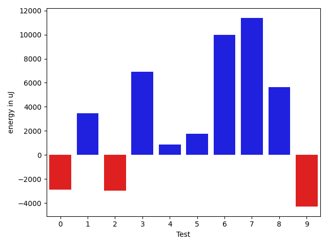
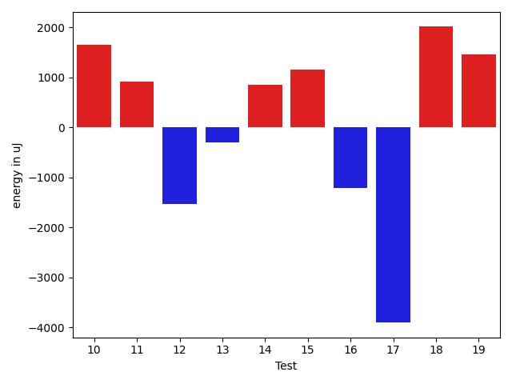
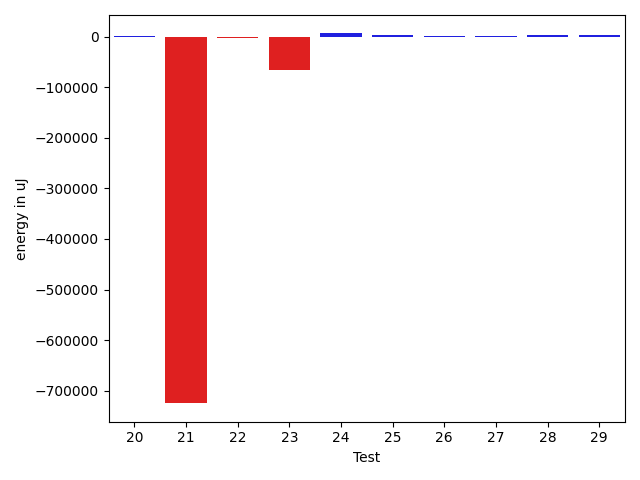
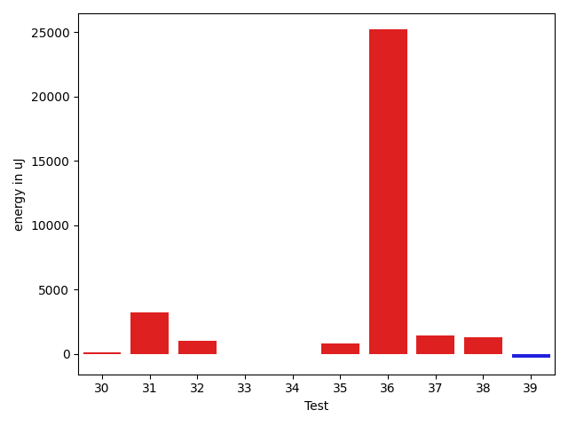
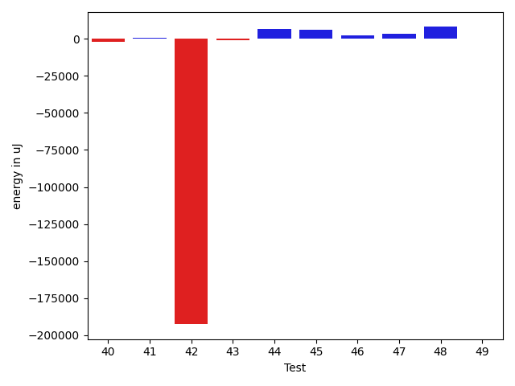
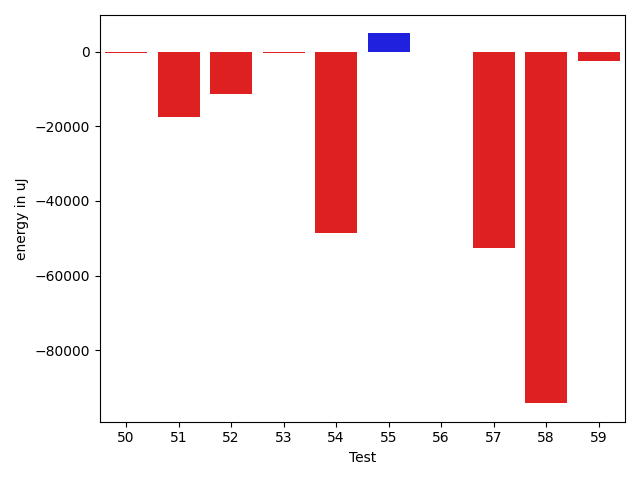
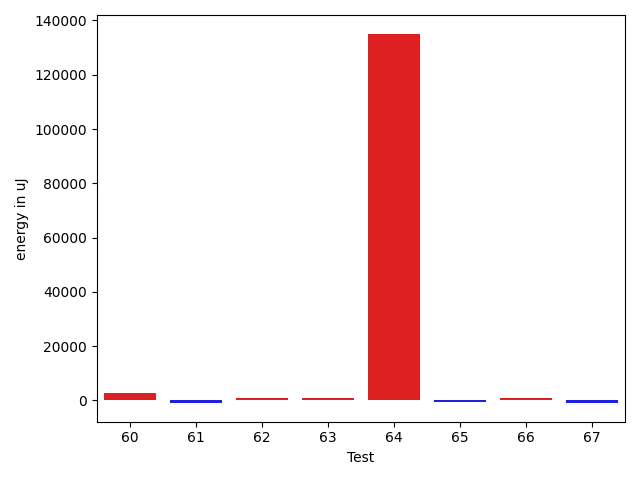

# gson f7abd5

https://github.com/google/gson/commit/f7abd5

## Delta Energy per test method

| ID | EnergyV1 | EnergyV2 | DeltaEnergy | σV1 | σV2 |
| --- | --- | --- | --- | --- | --- |
| 0 | 38635 | 38391 | -244 | 11146.139477330686 | 12637.32418831682 |
| 1 | 35827 | 35462 | -365 | 4827.081221513952 | 3986.0866818027803 |
| 2 | 39062 | 36926 | -2136 | 4006.3547230202503 | 4570.000462455458 |
| 3 | 41382 | 35645 | -5737 | 5219.103349938929 | 4601.499283312015 |
| 4 | 37598 | 37598 | 0 | 9369.974444766043 | 11431.255787170909 |
| 5 | 37476 | 37353 | -123 | 11124.37431669245 | 15791.844135629912 |
| 6 | 37353 | 38086 | 733 | 9205.723251502439 | 13593.209067474945 |
| 7 | 37537 | 36682 | -855 | 9329.07010839428 | 12819.181040531823 |
| 8 | 37903 | 38391 | 488 | 11419.345090289762 | 12020.446054561256 |
| 9 | 37903 | 38208 | 305 | 6123.837364905965 | 6796.463361353626 |
| 10 | 39307 | 40955 | 1648 | 17298.66713167806 | 21474.944750815775 |
| 11 | 36987 | 37903 | 916 | 4382.05281967243 | 3993.976016652783 |
| 12 | 67260 | 65734 | -1526 | 44369.42305700003 | 39988.01978292542 |
| 13 | 40283 | 39978 | -305 | 18699.081687072125 | 20600.059749082 |
| 14 | 37170 | 38025 | 855 | 4376.43700863825 | 4680.425802224528 |
| 15 | 36865 | 38025 | 1160 | 5523.3802186641615 | 13524.097226723483 |
| 16 | 38208 | 36988 | -1220 | 4750.130555648983 | 4322.69947357653 |
| 17 | 117676 | 113769 | -3907 | 123818.8792153628 | 116282.08406491565 |
| 18 | 37781 | 39795 | 2014 | 60231.436860343616 | 45858.348898338016 |
| 19 | 42602 | 44067 | 1465 | 86090.64806255916 | 127910.36431975 |
| 20 | 39734 | 38513 | -1221 | 3879.166646030415 | 3982.6734323365076 |
| 21 | 38879 | 37109 | -1770 | 4970.593030283442 | 3422.038068159172 |
| 22 | 37780 | 36927 | -853 | 4083.712098929351 | 4224.0584288908185 |
| 23 | 41382 | 38208 | -3174 | 34983.07377721181 | 44079.14132369992 |
| 24 | 35584 | 36743 | 1159 | 3988.3482709736504 | 5301.638591621728 |
| 25 | 41016 | 40406 | -610 | 491540.01097943477 | 356347.9328044573 |
| 26 | 40405 | 39673 | -732 | 23112.806846443116 | 21386.839523873463 |
| 27 | 39794 | 38574 | -1220 | 4636.79468838642 | 4636.680503135219 |
| 28 | 37476 | 36621 | -855 | 4250.794562168738 | 4214.668112293824 |
| 29 | 36438 | 36072 | -366 | 4169.160280547866 | 4312.4283064212095 |
| 30 | 37963 | 38086 | 123 | 4800.252636165221 | 6849.002937952562 |
| 31 | 38269 | 41503 | 3234 | 58989.543217473496 | 42016.470829779 |
| 32 | 35461 | 36499 | 1038 | 4065.6623052432847 | 4498.588304986887 |
| 33 | 37353 | 37354 | 1 | 10625.30119776979 | 10981.421240512413 |
| 34 | 37232 | 37231 | -1 | 4070.4716743394742 | 3702.408612270919 |
| 35 | 36743 | 37536 | 793 | 4983.226257907621 | 24324.282125376907 |
| 36 | 43518 | 68725 | 25207 | 58924.613467568866 | 68339.12564165595 |
| 37 | 35950 | 37414 | 1464 | 3646.2674576165205 | 6140.241320088653 |
| 38 | 38757 | 40039 | 1282 | 28164.405433437252 | 25180.09377701863 |
| 39 | 36865 | 36560 | -305 | 13473.485222995645 | 12177.417148325801 |
| 40 | 155334 | 155334 | 0 | 267665.0668740859 | 283176.69068040117 |
| 41 | 36743 | 37598 | 855 | 3706.6402082233435 | 2834.5614058679985 |
| 42 | 38818 | 38208 | -610 | 5059.18743629557 | 5111.2178566751645 |
| 43 | 38330 | 38147 | -183 | 4369.695337447982 | 4617.742674021186 |
| 44 | 41198 | 40527 | -671 | 122977.53945668352 | 93646.73339813382 |
| 45 | 42785 | 40466 | -2319 | 32024.13144480854 | 30882.37430352892 |
| 46 | 38941 | 38269 | -672 | 3681.9368530429624 | 2918.584577790451 |
| 47 | 37232 | 37415 | 183 | 3704.0680489118163 | 4570.188500446417 |
| 48 | 35706 | 36194 | 488 | 3880.953033906607 | 4466.830032131032 |
| 49 | 41077 | 41626 | 549 | 40269.26771958695 | 74453.24033201984 |
| 50 | 36682 | 36316 | -366 | 4348.641194356332 | 3626.5331381896276 |
| 51 | 39794 | 40772 | 978 | 70945.74958187796 | 70175.30551244541 |
| 52 | 38207 | 35888 | -2319 | 3206.188466387224 | 4579.982148164843 |
| 53 | 39734 | 41687 | 1953 | 13796.211303591046 | 13022.947559435324 |
| 54 | 38635 | 36316 | -2319 | 4474.974039448678 | 3449.7959575546392 |
| 55 | 37231 | 39611 | 2380 | 4161.330122419405 | 4358.540202163742 |
| 56 | 40527 | 39428 | -1099 | 4617.179613167211 | 5695.805242540052 |
| 57 | 37781 | 40344 | 2563 | 5060.368273043329 | 3038.8034403413576 |
| 58 | 38696 | 38208 | -488 | 49117.61287459272 | 40774.392417584844 |
| 59 | 38880 | 39123 | 243 | 4359.78967488163 | 4227.128685720308 |
| 60 | 36377 | 38940 | 2563 | 3262.6935967345817 | 3824.830112421843 |
| 61 | 38513 | 39124 | 611 | 5271.907942991323 | 4090.32627888147 |
| 62 | 38513 | 39245 | 732 | 4981.919740379884 | 3522.163983410349 |
| 63 | 42420 | 39185 | -3235 | 37365.18997133793 | 42995.53713567213 |
| 64 | 39673 | 40467 | 794 | 17161.953028428903 | 345921.3725697463 |
| 65 | 38208 | 37292 | -916 | 5287.758010503664 | 4718.369629486212 |
| 66 | 39611 | 40100 | 489 | 4505.191425294458 | 4246.870162078624 |
| 67 | 39246 | 38513 | -733 | 3914.8849084173403 | 3280.644781475468 |

## Delta Duration per test method

| ID | DurationV1 | DurationsV2 | DeltaDuration |
| --- | --- | --- | --- |
| 0 | 1327125.358695652 | 1404313.0222222223 | 77187.66352657019 |
| 1 | 725557.3695652174 | 794071.0256410256 | 68513.65607580822 |
| 2 | 562941.1666666666 | 552176.4347826086 | -10764.731884057983 |
| 3 | 494460.5625 | 519739.72222222225 | 25279.159722222248 |
| 4 | 1234347.2921348314 | 1296009.9777777777 | 61662.68564294628 |
| 5 | 1264362.1011235956 | 1375450.4318181819 | 111088.33069458627 |
| 6 | 1299472.6705882354 | 1298035.3626373627 | -1437.307950872695 |
| 7 | 1227560.894117647 | 1305684.7303370787 | 78123.8362194316 |
| 8 | 1279462.7865168538 | 1375986.5111111111 | 96523.7245942573 |
| 9 | 1011330.2372881356 | 1040041.5438596491 | 28711.30657151353 |
| 10 | 1631455.3232323232 | 1674319.175257732 | 42863.85202540876 |
| 11 | 625107.9761904762 | 649213.3846153846 | 24105.40842490841 |
| 12 | 2290185.765957447 | 2235415.2783505153 | -54770.48760693148 |
| 13 | 1279325.2571428572 | 1358140.9393939395 | 78815.68225108227 |
| 14 | 805905.3272727273 | 848929.3265306122 | 43023.99925788492 |
| 15 | 1116389.1944444445 | 1176051.7692307692 | 59662.57478632475 |
| 16 | 884732.8775510204 | 894124.2653061225 | 9391.387755102129 |
| 17 | 4111553.5319148935 | 3879995.2592592593 | -231558.2726556342 |
| 18 | 1270666.3469387756 | 1463541.779661017 | 192875.43272224138 |
| 19 | 2381791.9677419355 | 2791772.5081967213 | 409980.5404547858 |
| 20 | 553460.6086956522 | 588864.641025641 | 35404.03232998878 |
| 21 | 588926.5555555555 | 609043.875 | 20117.319444444496 |
| 22 | 696628.9056603773 | 697157.2978723404 | 528.3922119630734 |
| 23 | 1359929.7073170731 | 1411443.9696969697 | 51514.262379896594 |
| 24 | 898475.3454545455 | 877222.2592592592 | -21253.086195286247 |
| 25 | 7174525.741935484 | 4428539.15 | -2745986.5919354837 |
| 26 | 1640034.606060606 | 1617917.4848484849 | -22117.1212121211 |
| 27 | 702559.2564102564 | 738556.3939393939 | 35997.137529137544 |
| 28 | 601284.4230769231 | 592599.3478260869 | -8685.075250836206 |
| 29 | 573837.6857142857 | 602367.9354838709 | 28530.249769585207 |
| 30 | 872495.4117647059 | 892639.8846153846 | 20144.47285067872 |
| 31 | 1794553.75 | 1479201.8863636365 | -315351.86363636353 |
| 32 | 784320.9487179487 | 808074.6486486486 | 23753.69993069989 |
| 33 | 1133630.014925373 | 1142315.1746031747 | 8685.159677801654 |
| 34 | 909147.12 | 909213.6037735849 | 66.48377358494326 |
| 35 | 468010.6875 | 735420.25 | 267409.5625 |
| 36 | 2543970.159574468 | 2909018.2291666665 | 365048.06959219836 |
| 37 | 1061715.8448275863 | 1069698.9104477612 | 7983.065620174864 |
| 38 | 1562149.6231884058 | 1497327.7974683545 | -64821.8257200513 |
| 39 | 1366649.6323529412 | 1327340.3846153845 | -39309.247737556696 |
| 40 | 9643242.111111112 | 10263010.545454545 | 619768.434343433 |
| 41 | 496721.70588235295 | 429607.7272727273 | -67113.97860962566 |
| 42 | 551330.7058823529 | 566151.4444444445 | 14820.738562091603 |
| 43 | 929418.3962264151 | 994468.7884615385 | 65050.392235123436 |
| 44 | 2387054.964285714 | 2119449.5733333332 | -267605.39095238084 |
| 45 | 1494101.0 | 1371518.75 | -122582.25 |
| 46 | 511740.9285714286 | 546531.8235294118 | 34790.894957983226 |
| 47 | 949144.5535714285 | 922233.7346938775 | -26910.818877551006 |
| 48 | 926695.2083333334 | 861676.6666666666 | -65018.541666666744 |
| 49 | 1846324.808080808 | 2135145.432989691 | 288820.6249088829 |
| 50 | 810780.0645161291 | 771998.8787878788 | -38781.185728250304 |
| 51 | 1949173.5161290322 | 2074641.914893617 | 125468.39876458468 |
| 52 | 472671.0 | 497485.82352941175 | 24814.823529411748 |
| 53 | 749537.75 | 720878.7777777778 | -28658.972222222248 |
| 54 | 459813.15789473685 | 485463.0909090909 | 25649.93301435403 |
| 55 | 434073.28571428574 | 520433.0 | 86359.71428571426 |
| 56 | 497410.1666666667 | 609456.8461538461 | 112046.67948717944 |
| 57 | 441658.0588235294 | 541285.4736842106 | 99627.41486068117 |
| 58 | 1435902.4615384615 | 1239612.5609756098 | -196289.9005628517 |
| 59 | 814900.8717948718 | 780479.8780487805 | -34420.99374609126 |
| 60 | 537514.7222222222 | 520951.4166666667 | -16563.305555555562 |
| 61 | 543573.09375 | 441804.9166666667 | -101768.17708333331 |
| 62 | 690972.6363636364 | 539987.4545454546 | -150985.18181818177 |
| 63 | 1521529.322580645 | 1479844.65625 | -41684.666330645094 |
| 64 | 701866.65 | 4330338.2272727275 | 3628471.5772727276 |
| 65 | 738127.3448275862 | 775205.4193548387 | 37078.074527252465 |
| 66 | 641211.4117647059 | 588726.0909090909 | -52485.32085561496 |
| 67 | 610519.3461538461 | 628095.1333333333 | 17575.787179487175 |

## Misc.

| ID | Test Class | Test Method |
| --- | --- | --- |
| 0 | com.google.gson.functional.StreamingTypeAdaptersTest | testNullSafe |
| 1 | com.google.gson.functional.StreamingTypeAdaptersTest | testSerializeRecursive |
| 2 | com.google.gson.functional.StreamingTypeAdaptersTest | testSerializeNullField |
| 3 | com.google.gson.functional.StreamingTypeAdaptersTest | testSerializeNullObject |
| 4 | com.google.gson.functional.ParameterizedTypesTest | testParameterizedTypeGenericArraysSerialization |
| 5 | com.google.gson.functional.ParameterizedTypesTest | testVariableTypeArrayDeserialization |
| 6 | com.google.gson.functional.ParameterizedTypesTest | testParameterizedTypeGenericArraysDeserialization |
| 7 | com.google.gson.functional.ParameterizedTypesTest | testParameterizedTypeWithVariableTypeDeserialization |
| 8 | com.google.gson.functional.ParameterizedTypesTest | testVariableTypeDeserialization |
| 9 | com.google.gson.functional.MapTest | testMapSerializationWithNullValues |
| 10 | com.google.gson.functional.MapTest | testInterfaceTypeMapWithSerializer |
| 11 | com.google.gson.functional.MapTest | testMapSerializationWithNullValuesSerialized |
| 12 | com.google.gson.functional.MapTest | testInterfaceTypeMap |
| 13 | com.google.gson.functional.MapTest | testMapSerializationWithWildcardValues |
| 14 | com.google.gson.functional.MapTest | testMapSerializationWithNullValueButSerializeNulls |
| 15 | com.google.gson.functional.MapTest | testSerializeMaps |
| 16 | com.google.gson.functional.MapTest | testMapSerializationWithNullValue |
| 17 | com.google.gson.functional.ExposeFieldsTest | testNullExposeFieldSerialization |
| 18 | com.google.gson.functional.ExposeFieldsTest | testArrayWithOneNullExposeFieldObjectSerialization |
| 19 | com.google.gson.functional.InheritanceTest | testBaseSerializedAsBaseWhenSpecifiedWithExplicitTypeForToJsonMethod |
| 20 | com.google.gson.functional.InheritanceTest | testBaseSerializedAsSubForToJsonMethod |
| 21 | com.google.gson.functional.InheritanceTest | testBaseSerializedAsSubWhenSpecifiedWithExplicitTypeForToJsonMethod |
| 22 | com.google.gson.functional.NullObjectAndFieldTest | testExplicitSerializationOfNullStringMembers |
| 23 | com.google.gson.functional.NullObjectAndFieldTest | testCustomSerializationOfNulls |
| 24 | com.google.gson.functional.NullObjectAndFieldTest | testPrintPrintingObjectWithNulls |
| 25 | com.google.gson.functional.NullObjectAndFieldTest | testTopLevelNullObjectSerialization |
| 26 | com.google.gson.functional.NullObjectAndFieldTest | testExplicitSerializationOfNullArrayMembers |
| 27 | com.google.gson.functional.NullObjectAndFieldTest | testExplicitSerializationOfNullCollectionMembers |
| 28 | com.google.gson.functional.NullObjectAndFieldTest | testCustomTypeAdapterPassesNullSerialization |
| 29 | com.google.gson.functional.NullObjectAndFieldTest | testPrintPrintingArraysWithNulls |
| 30 | com.google.gson.functional.NullObjectAndFieldTest | testNullWrappedPrimitiveMemberSerialization |
| 31 | com.google.gson.functional.NullObjectAndFieldTest | testExplicitSerializationOfNulls |
| 32 | com.google.gson.functional.ObjectTest | testNullFieldsSerialization |
| 33 | com.google.gson.functional.ObjectTest | testAnonymousLocalClassesCustomSerialization |
| 34 | com.google.gson.functional.ObjectTest | testAnonymousLocalClassesSerialization |
| 35 | com.google.gson.functional.ObjectTest | testNullSerialization |
| 36 | com.google.gson.functional.ThrowableFunctionalTest | testSerializedNameOnExceptionFields |
| 37 | com.google.gson.functional.MoreSpecificTypeSerializationTest | testListOfParameterizedSubclassFields |
| 38 | com.google.gson.functional.MoreSpecificTypeSerializationTest | testListOfSubclassFields |
| 39 | com.google.gson.functional.DefaultTypeAdaptersTest | testUrlNullSerialization |
| 40 | com.google.gson.functional.DefaultTypeAdaptersTest | testNullSerialization |
| 41 | com.google.gson.functional.DefaultTypeAdaptersTest | testNullJsonElementSerialization |
| 42 | com.google.gson.functional.DefaultTypeAdaptersTest | testJsonNullSerialization |
| 43 | com.google.gson.functional.NamingPolicyTest | testDeprecatedNamingStrategy |
| 44 | com.google.gson.functional.PrintFormattingTest | testCompactFormattingLeavesNoWhiteSpace |
| 45 | com.google.gson.functional.PrintFormattingTest | testJsonObjectWithNullValues |
| 46 | com.google.gson.functional.PrintFormattingTest | testJsonObjectWithNullValuesSerialized |
| 47 | com.google.gson.functional.CollectionTest | testCollectionOfObjectWithNullSerialization |
| 48 | com.google.gson.functional.CollectionTest | testNullsInListSerialization |
| 49 | com.google.gson.ObjectTypeAdapterTest | testSerialize |
| 50 | com.google.gson.ObjectTypeAdapterTest | testSerializeNullValue |
| 51 | com.google.gson.functional.TreeTypeAdaptersTest | testSerializeId |
| 52 | com.google.gson.stream.JsonWriterTest | testNulls |
| 53 | com.google.gson.stream.JsonWriterTest | testPrettyPrintObject |
| 54 | com.google.gson.stream.JsonWriterTest | testPrettyPrintArray |
| 55 | com.google.gson.stream.JsonWriterTest | testNullStringValue |
| 56 | com.google.gson.functional.ReadersWritersTest | testTopLevelNullObjectSerializationWithWriter |
| 57 | com.google.gson.functional.ReadersWritersTest | testTopLevelNullObjectSerializationWithWriterAndSerializeNulls |
| 58 | com.google.gson.functional.UncategorizedTest | testObjectEqualButNotSameSerialization |
| 59 | com.google.gson.functional.VersioningTest | testIgnoreLaterVersionClassSerialization |
| 60 | com.google.gson.functional.ArrayTest | testArrayOfNullSerialization |
| 61 | com.google.gson.functional.ArrayTest | testNullsInArrayWithSerializeNullPropertySetSerialization |
| 62 | com.google.gson.functional.ArrayTest | testNullsInArraySerialization |
| 63 | com.google.gson.functional.ArrayTest | testSingleNullInArraySerialization |
| 64 | com.google.gson.internal.bind.JsonTreeWriterTest | testSerializeNullsTrue |
| 65 | com.google.gson.MixedStreamTest | testWriteNulls |
| 66 | com.google.gson.functional.ExclusionStrategyFunctionalTest | testExcludeTopLevelClassSerialization |
| 67 | com.google.gson.functional.FieldExclusionTest | testInnerClassExclusion |

| Test | IterationV1 | IterationV2 | DeltaIteration |
| --- | --- | --- | --- |
| 0 | 92 | 90 | -2 |
| 1 | 46 | 39 | -7 |
| 2 | 12 | 23 | 11 |
| 3 | 16 | 18 | 2 |
| 4 | 89 | 90 | 1 |
| 5 | 89 | 88 | -1 |
| 6 | 85 | 91 | 6 |
| 7 | 85 | 89 | 4 |
| 8 | 89 | 90 | 1 |
| 9 | 59 | 57 | -2 |
| 10 | 99 | 97 | -2 |
| 11 | 42 | 26 | -16 |
| 12 | 94 | 97 | 3 |
| 13 | 70 | 66 | -4 |
| 14 | 55 | 49 | -6 |
| 15 | 72 | 65 | -7 |
| 16 | 49 | 49 | 0 |
| 17 | 94 | 81 | -13 |
| 18 | 49 | 59 | 10 |
| 19 | 62 | 61 | -1 |
| 20 | 23 | 39 | 16 |
| 21 | 27 | 24 | -3 |
| 22 | 53 | 47 | -6 |
| 23 | 41 | 33 | -8 |
| 24 | 55 | 54 | -1 |
| 25 | 31 | 20 | -11 |
| 26 | 99 | 99 | 0 |
| 27 | 39 | 33 | -6 |
| 28 | 26 | 23 | -3 |
| 29 | 35 | 31 | -4 |
| 30 | 51 | 52 | 1 |
| 31 | 36 | 44 | 8 |
| 32 | 39 | 37 | -2 |
| 33 | 67 | 63 | -4 |
| 34 | 50 | 53 | 3 |
| 35 | 16 | 24 | 8 |
| 36 | 94 | 96 | 2 |
| 37 | 58 | 67 | 9 |
| 38 | 69 | 79 | 10 |
| 39 | 68 | 78 | 10 |
| 40 | 99 | 99 | 0 |
| 41 | 17 | 11 | -6 |
| 42 | 17 | 18 | 1 |
| 43 | 53 | 52 | -1 |
| 44 | 84 | 75 | -9 |
| 45 | 40 | 24 | -16 |
| 46 | 28 | 17 | -11 |
| 47 | 56 | 49 | -7 |
| 48 | 48 | 51 | 3 |
| 49 | 99 | 97 | -2 |
| 50 | 31 | 33 | 2 |
| 51 | 93 | 94 | 1 |
| 52 | 19 | 17 | -2 |
| 53 | 24 | 18 | -6 |
| 54 | 19 | 11 | -8 |
| 55 | 14 | 14 | 0 |
| 56 | 18 | 13 | -5 |
| 57 | 17 | 19 | 2 |
| 58 | 39 | 41 | 2 |
| 59 | 39 | 41 | 2 |
| 60 | 18 | 12 | -6 |
| 61 | 32 | 24 | -8 |
| 62 | 22 | 22 | 0 |
| 63 | 31 | 32 | 1 |
| 64 | 20 | 22 | 2 |
| 65 | 29 | 31 | 2 |
| 66 | 17 | 22 | 5 |
| 67 | 26 | 30 | 4 |

| Time Label | Time (s) |
| --- | --- |
| Selection | 27.79333209991455 |
| Injection | 14.912148237228394 |
| Total | 1071.2848603725433 |

