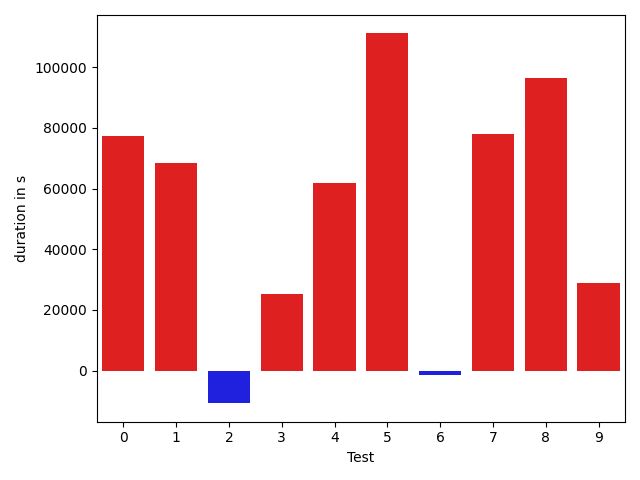
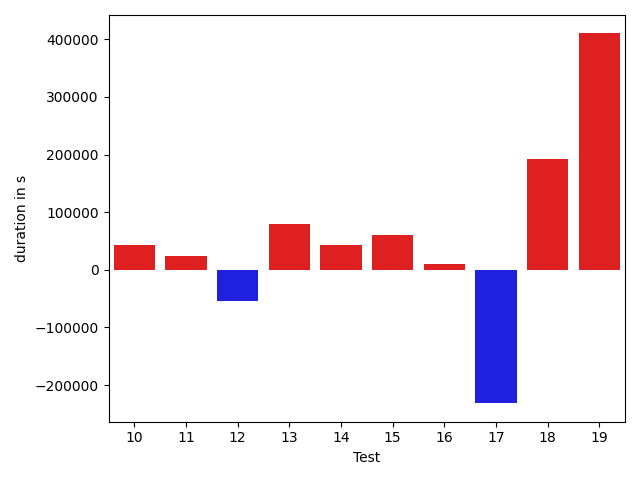
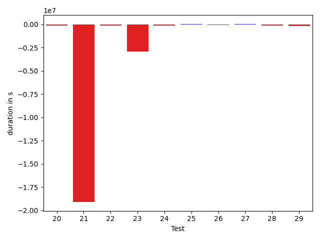
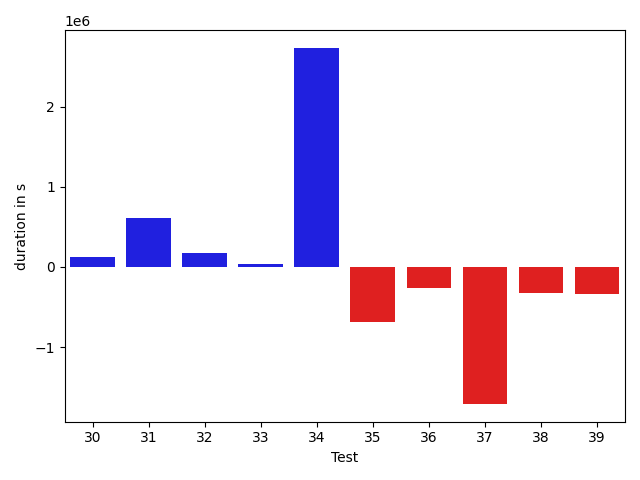
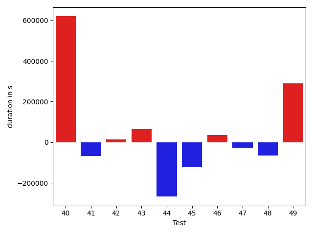
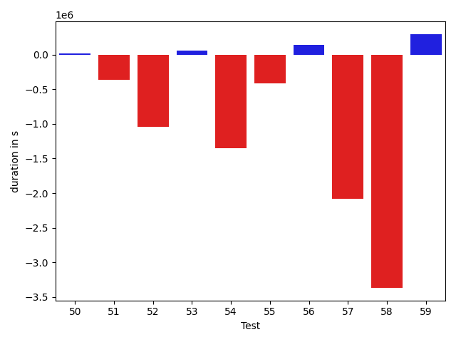
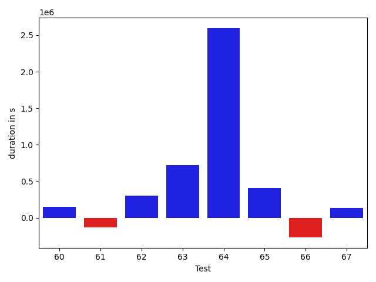

# gson f7abd5

https://github.com/google/gson/commit/f7abd5

## Delta Energy per test method

| ID | EnergyV1 | EnergyV2 | DeltaEnergy |
| --- | --- | --- | --- |
| 0 | 40442.44506645203 | 37542.95153808594 | -2899.493528366089 |
| 1 | 38661.3375800848 | 42141.333057403564 | 3479.9954773187637 |
| 2 | 40330.97469711304 | 37344.865234375 | -2986.109462738037 |
| 3 | 34582.82727050781 | 41511.82452392578 | 6928.997253417969 |
| 4 | 36317.62561848854 | 37178.17165488578 | 860.5460363972379 |
| 5 | 37128.01298812061 | 38891.66436489351 | 1763.6513767729048 |
| 6 | 35813.42760839848 | 45805.33373400513 | 9991.906125606649 |
| 7 | 32875.50601441874 | 44283.26097416141 | 11407.75495974267 |
| 8 | 30745.99443985658 | 36393.17197247724 | 5647.1775326206625 |
| 9 | 38381.584716003985 | 34078.00899362961 | -4303.575722374371 |
| 10 | 39236.41231111012 | 39734.72194121283 | 498.3096301027108 |
| 11 | 39552.30735404008 | 41807.97150550636 | 2255.664151466277 |
| 12 | 46023.39553222134 | 57546.36267467978 | 11522.967142458445 |
| 13 | 37843.68583614072 | 34431.18403574908 | -3412.501800391641 |
| 14 | 37808.640848018375 | 38317.48598468304 | 508.8451366646623 |
| 15 | 58125.128443609574 | 40882.196431722135 | -17242.93201188744 |
| 16 | 36235.79104794968 | 36784.45117276923 | 548.6601248195511 |
| 17 | 50864.87029269188 | 110224.35061805719 | 59359.48032536531 |
| 18 | 35790.63692398236 | 44565.31765082346 | 8774.6807268411 |
| 19 | 38252.87700789985 | 37694.85091195291 | -558.0260959469379 |
| 20 | 36863.985923646134 | 37446.28132319222 | 582.2953995460848 |
| 21 | 774458.2710327106 | 49615.09908390045 | -724843.1719488101 |
| 22 | 43520.62720726522 | 39896.17618684716 | -3624.4510204180624 |
| 23 | 108107.18237569787 | 41907.8925158467 | -66199.28985985117 |
| 24 | 46219.859295167946 | 52356.979592992226 | 6137.12029782428 |
| 25 | 40878.24765828024 | 43094.09711073956 | 2215.849452459319 |
| 26 | 35883.06659191847 | 36780.33347058296 | 897.2668786644936 |
| 27 | 37810.021872230864 | 38552.949538314715 | 742.9276660838514 |
| 28 | 37072.38176677555 | 40647.76366298612 | 3575.3818962105724 |
| 29 | 36007.28168840519 | 39035.02753808188 | 3027.745849676685 |
| 30 | 35454.86114377348 | 34490.07631422297 | -964.78482955051 |
| 31 | 35333.464883864945 | 42077.62628614518 | 6744.161402280239 |
| 32 | 34679.01571125278 | 36707.21510300592 | 2028.1993917531363 |
| 33 | 33576.30485148472 | 35761.05081842122 | 2184.7459669365053 |
| 34 | 37198.26107788086 | 99884.65533542633 | 62686.39425754547 |
| 35 | 89112.7851174332 | 64085.21045260722 | -25027.57466482598 |
| 36 | 35978.41037097573 | 39167.0559566021 | 3188.6455856263638 |
| 37 | 94788.88945977291 | 57061.76315804677 | -37727.12630172614 |
| 38 | 37737.79335689545 | 38601.464346921246 | 863.6709900257993 |
| 39 | 35907.58310097245 | 39019.395535286254 | 3111.8124343138043 |
| 40 | 41785.27400246176 | 39532.951163582205 | -2252.322838879554 |
| 41 | 36428.28048403302 | 37261.40131454238 | 833.1208305093605 |
| 42 | 386213.6269679299 | 193578.36974615912 | -192635.25722177076 |
| 43 | 35478.61003112793 | 34737.701171875 | -740.9088592529297 |
| 44 | 36186.69013977051 | 43001.13967895508 | 6814.44953918457 |
| 45 | 38086.00325012207 | 44156.729707717896 | 6070.726457595825 |
| 46 | 37801.53072357178 | 39945.720458984375 | 2144.1897354125977 |
| 47 | 32253.194105774688 | 35576.99270098814 | 3323.798595213455 |
| 48 | 33825.75099999973 | 41808.971074520305 | 7983.220074520577 |
| 49 | 36963.8349609375 | 36837.5479927063 | -126.28696823120117 |
| 50 | 39919.477935791016 | 39612.14588928223 | -307.33204650878906 |
| 51 | 57037.74243972474 | 39502.13249702257 | -17535.60994270217 |
| 52 | 46879.93443908007 | 35487.40571832657 | -11392.5287207535 |
| 53 | 37142.39061356336 | 36877.63784790039 | -264.75276566296816 |
| 54 | 94657.54406641197 | 45919.24197084483 | -48738.30209556714 |
| 55 | 36997.16477136128 | 41840.74485216651 | 4843.58008080523 |
| 56 | 39113.24208920669 | 38955.143367306686 | -158.0987219000017 |
| 57 | 95463.02638423258 | 42897.15593171068 | -52565.8704525219 |
| 58 | 133775.82771984654 | 39556.13626349431 | -94219.69145635223 |
| 59 | 41144.22601737398 | 38510.0877839696 | -2634.138233404381 |
| 60 | 36648.26564788818 | 36378.95068359375 | -269.3149642944336 |
| 61 | 41317.438645282295 | 35869.89689195156 | -5447.541753330734 |
| 62 | 42479.10169363022 | 36255.23858308792 | -6223.863110542297 |
| 63 | 40842.97370986268 | 58368.161959590856 | 17525.188249728177 |
| 64 | 57147.0357875824 | 157338.9643239975 | 100191.9285364151 |
| 65 | 40950.40566503629 | 35336.76504037855 | -5613.640624657739 |
| 66 | 35098.23922729492 | 40989.7803940773 | 5891.541166782379 |
| 67 | 43626.65101659298 | 37670.43402326107 | -5956.216993331909 |

## Delta Duration per test method

| ID | DurationV1 | DurationsV2 | DeltaDuration |
| --- | --- | --- | --- |
| 0 | 441351.2852783203 | 359447.88246154785 | -81903.40281677246 |
| 1 | 589716.8527253866 | 597941.325592041 | 8224.472866654396 |
| 2 | 501782.69131469727 | 478516.09765625 | -23266.593658447266 |
| 3 | 399182.89111328125 | 595313.958190918 | 196131.06707763672 |
| 4 | 1055517.7044309683 | 1371236.5671513567 | 315718.86272038845 |
| 5 | 1094220.5667416456 | 1391871.3293619044 | 297650.76262025884 |
| 6 | 1112028.7868748843 | 1425708.1961011295 | 313679.40922624525 |
| 7 | 1075977.0373171212 | 1359667.8390867056 | 283690.8017695844 |
| 8 | 1017953.3297902037 | 1302306.3314672308 | 284353.0016770271 |
| 9 | 1192290.8184869413 | 928228.7868512017 | -264062.0316357396 |
| 10 | 954986.5478774671 | 915142.3250298676 | -39844.222847599536 |
| 11 | 1410260.284487508 | 1412330.2364627335 | 2069.951975225471 |
| 12 | 1345362.3675582705 | 1969995.0161915065 | 624632.6486332361 |
| 13 | 745180.4616297395 | 765800.1235244521 | 20619.661894712597 |
| 14 | 601376.3027906525 | 577299.5595889688 | -24076.74320168374 |
| 15 | 1257008.3416216592 | 889222.2115832332 | -367786.130038426 |
| 16 | 777803.0797507805 | 724442.895799165 | -53360.18395161547 |
| 17 | 1648128.0497018541 | 2938450.2557845972 | 1290322.2060827431 |
| 18 | 1231576.1567791584 | 875213.7681001478 | -356362.38867901056 |
| 19 | 716855.6343077541 | 685107.393501979 | -31748.24080577516 |
| 20 | 899377.5991406466 | 787448.7680539249 | -111928.83108672174 |
| 21 | 20027661.58395376 | 920870.8021974564 | -19106790.781756304 |
| 22 | 1536675.3760895233 | 1425150.4691095476 | -111524.90697997576 |
| 23 | 3539315.5546333883 | 644202.1186897808 | -2895113.4359436072 |
| 24 | 1080608.2182226223 | 965534.4837773367 | -115073.73444528563 |
| 25 | 723541.4966507914 | 762033.6938210509 | 38492.19717025955 |
| 26 | 655221.1030929387 | 563474.8984131813 | -91746.20467975736 |
| 27 | 529322.3550004222 | 561370.8449492529 | 32048.489948830684 |
| 28 | 939857.7739887205 | 810965.8993376566 | -128891.87465106393 |
| 29 | 919222.5695670282 | 740995.8884205989 | -178226.68114642927 |
| 30 | 782762.2519253292 | 912827.7085738727 | 130065.45664854348 |
| 31 | 823849.7113419787 | 1437389.837837428 | 613540.1264954493 |
| 32 | 605924.8417316605 | 782915.669786148 | 176990.82805448747 |
| 33 | 948647.3572840729 | 988942.6788750037 | 40295.321590930806 |
| 34 | 434132.90325927734 | 3164717.004475236 | 2730584.1012159586 |
| 35 | 2674018.9849444176 | 1993553.2366877138 | -680465.7482567038 |
| 36 | 744960.9416510016 | 481223.60968625546 | -263737.3319647461 |
| 37 | 3326444.0008975267 | 1619243.6699728302 | -1707200.3309246965 |
| 38 | 804701.1509084702 | 482261.4332487602 | -322439.71765971 |
| 39 | 1119858.585240093 | 784273.8310454977 | -335584.7541945954 |
| 40 | 1271117.4443869013 | 1294055.4948921667 | 22938.05050526536 |
| 41 | 1364657.418692401 | 1443571.0592154725 | 78913.64052307163 |
| 42 | 11350480.009752912 | 5154556.427958677 | -6195923.581794236 |
| 43 | 535687.9963989258 | 442520.255859375 | -93167.74053955078 |
| 44 | 540292.9905395508 | 518388.4278717041 | -21904.56266784668 |
| 45 | 520283.4994354248 | 493242.2745323181 | -27041.22490310669 |
| 46 | 627469.1211471558 | 519562.1145019531 | -107907.00664520264 |
| 47 | 640488.9727262288 | 718550.7173782564 | 78061.74465202761 |
| 48 | 1288285.271811124 | 1317028.5990306842 | 28743.327219560277 |
| 49 | 523868.5341796875 | 538183.4180240631 | 14314.88384437561 |
| 50 | 466696.3659057617 | 481934.72623062134 | 15238.36032485962 |
| 51 | 1500559.1106943148 | 1143227.3931066245 | -357331.71758769033 |
| 52 | 1495596.297760135 | 457906.06691110134 | -1037690.2308490337 |
| 53 | 538860.6583100855 | 596746.7974700928 | 57886.13916000724 |
| 54 | 2947005.7761090635 | 1599661.8543193997 | -1347343.9217896638 |
| 55 | 1042805.1777911661 | 628486.6370029196 | -414318.54078824655 |
| 56 | 844408.1625637169 | 984082.3350100606 | 139674.1724463437 |
| 57 | 3468575.0117115234 | 1384501.8101028153 | -2084073.2016087081 |
| 58 | 4214607.98184703 | 846292.2094509343 | -3368315.772396096 |
| 59 | 827626.4327443059 | 1124571.0957051413 | 296944.6629608354 |
| 60 | 515847.39278411865 | 662341.2524414062 | 146493.8596572876 |
| 61 | 602426.5120213465 | 467957.55123353004 | -134468.96078781644 |
| 62 | 673962.7779598236 | 973853.726436615 | 299890.9484767914 |
| 63 | 776105.949972352 | 1499296.1513632932 | 723190.2013909412 |
| 64 | 1274496.4050636292 | 3870090.9053993225 | 2595594.5003356934 |
| 65 | 529126.9954961203 | 938753.9120195853 | 409626.91652346496 |
| 66 | 877155.1504974365 | 609177.4978928566 | -267977.6526045799 |
| 67 | 476916.35969623923 | 608237.6631855834 | 131321.3034893442 |

## Misc.

| ID | Test Class | Test Method |
| --- | --- | --- |
| 0 | com.google.gson.stream.JsonWriterTest | testNulls |
| 1 | com.google.gson.stream.JsonWriterTest | testPrettyPrintObject |
| 2 | com.google.gson.stream.JsonWriterTest | testPrettyPrintArray |
| 3 | com.google.gson.stream.JsonWriterTest | testNullStringValue |
| 4 | com.google.gson.functional.ParameterizedTypesTest | testParameterizedTypeGenericArraysSerialization |
| 5 | com.google.gson.functional.ParameterizedTypesTest | testVariableTypeArrayDeserialization |
| 6 | com.google.gson.functional.ParameterizedTypesTest | testVariableTypeDeserialization |
| 7 | com.google.gson.functional.ParameterizedTypesTest | testParameterizedTypeGenericArraysDeserialization |
| 8 | com.google.gson.functional.ParameterizedTypesTest | testParameterizedTypeWithVariableTypeDeserialization |
| 9 | com.google.gson.functional.MapTest | testSerializeMaps |
| 10 | com.google.gson.functional.MapTest | testMapSerializationWithNullValues |
| 11 | com.google.gson.functional.MapTest | testInterfaceTypeMapWithSerializer |
| 12 | com.google.gson.functional.MapTest | testInterfaceTypeMap |
| 13 | com.google.gson.functional.MapTest | testMapSerializationWithNullValue |
| 14 | com.google.gson.functional.MapTest | testMapSerializationWithNullValuesSerialized |
| 15 | com.google.gson.functional.MapTest | testMapSerializationWithWildcardValues |
| 16 | com.google.gson.functional.MapTest | testMapSerializationWithNullValueButSerializeNulls |
| 17 | com.google.gson.functional.ExposeFieldsTest | testNullExposeFieldSerialization |
| 18 | com.google.gson.functional.ExposeFieldsTest | testArrayWithOneNullExposeFieldObjectSerialization |
| 19 | com.google.gson.functional.NullObjectAndFieldTest | testExplicitSerializationOfNullStringMembers |
| 20 | com.google.gson.functional.NullObjectAndFieldTest | testPrintPrintingObjectWithNulls |
| 21 | com.google.gson.functional.NullObjectAndFieldTest | testTopLevelNullObjectSerialization |
| 22 | com.google.gson.functional.NullObjectAndFieldTest | testExplicitSerializationOfNullArrayMembers |
| 23 | com.google.gson.functional.NullObjectAndFieldTest | testExplicitSerializationOfNulls |
| 24 | com.google.gson.functional.NullObjectAndFieldTest | testCustomSerializationOfNulls |
| 25 | com.google.gson.functional.NullObjectAndFieldTest | testExplicitSerializationOfNullCollectionMembers |
| 26 | com.google.gson.functional.NullObjectAndFieldTest | testCustomTypeAdapterPassesNullSerialization |
| 27 | com.google.gson.functional.NullObjectAndFieldTest | testPrintPrintingArraysWithNulls |
| 28 | com.google.gson.functional.NullObjectAndFieldTest | testNullWrappedPrimitiveMemberSerialization |
| 29 | com.google.gson.functional.CollectionTest | testNullsInListSerialization |
| 30 | com.google.gson.functional.CollectionTest | testCollectionOfObjectWithNullSerialization |
| 31 | com.google.gson.functional.ObjectTest | testAnonymousLocalClassesCustomSerialization |
| 32 | com.google.gson.functional.ObjectTest | testNullFieldsSerialization |
| 33 | com.google.gson.functional.ObjectTest | testAnonymousLocalClassesSerialization |
| 34 | com.google.gson.functional.ObjectTest | testNullSerialization |
| 35 | com.google.gson.functional.ThrowableFunctionalTest | testSerializedNameOnExceptionFields |
| 36 | com.google.gson.functional.InheritanceTest | testBaseSerializedAsSubWhenSpecifiedWithExplicitTypeForToJsonMethod |
| 37 | com.google.gson.functional.InheritanceTest | testBaseSerializedAsBaseWhenSpecifiedWithExplicitTypeForToJsonMethod |
| 38 | com.google.gson.functional.InheritanceTest | testBaseSerializedAsSubForToJsonMethod |
| 39 | com.google.gson.functional.MoreSpecificTypeSerializationTest | testListOfParameterizedSubclassFields |
| 40 | com.google.gson.functional.MoreSpecificTypeSerializationTest | testListOfSubclassFields |
| 41 | com.google.gson.functional.DefaultTypeAdaptersTest | testUrlNullSerialization |
| 42 | com.google.gson.functional.DefaultTypeAdaptersTest | testNullSerialization |
| 43 | com.google.gson.functional.DefaultTypeAdaptersTest | testNullJsonElementSerialization |
| 44 | com.google.gson.functional.DefaultTypeAdaptersTest | testJsonNullSerialization |
| 45 | com.google.gson.functional.ReadersWritersTest | testTopLevelNullObjectSerializationWithWriterAndSerializeNulls |
| 46 | com.google.gson.functional.ReadersWritersTest | testTopLevelNullObjectSerializationWithWriter |
| 47 | com.google.gson.functional.StreamingTypeAdaptersTest | testSerializeRecursive |
| 48 | com.google.gson.functional.StreamingTypeAdaptersTest | testNullSafe |
| 49 | com.google.gson.functional.StreamingTypeAdaptersTest | testSerializeNullField |
| 50 | com.google.gson.functional.StreamingTypeAdaptersTest | testSerializeNullObject |
| 51 | com.google.gson.functional.PrintFormattingTest | testCompactFormattingLeavesNoWhiteSpace |
| 52 | com.google.gson.functional.PrintFormattingTest | testJsonObjectWithNullValues |
| 53 | com.google.gson.functional.PrintFormattingTest | testJsonObjectWithNullValuesSerialized |
| 54 | com.google.gson.ObjectTypeAdapterTest | testSerialize |
| 55 | com.google.gson.ObjectTypeAdapterTest | testSerializeNullValue |
| 56 | com.google.gson.functional.NamingPolicyTest | testDeprecatedNamingStrategy |
| 57 | com.google.gson.functional.TreeTypeAdaptersTest | testSerializeId |
| 58 | com.google.gson.functional.UncategorizedTest | testObjectEqualButNotSameSerialization |
| 59 | com.google.gson.functional.VersioningTest | testIgnoreLaterVersionClassSerialization |
| 60 | com.google.gson.functional.ArrayTest | testArrayOfNullSerialization |
| 61 | com.google.gson.functional.ArrayTest | testNullsInArrayWithSerializeNullPropertySetSerialization |
| 62 | com.google.gson.functional.ArrayTest | testNullsInArraySerialization |
| 63 | com.google.gson.functional.ArrayTest | testSingleNullInArraySerialization |
| 64 | com.google.gson.internal.bind.JsonTreeWriterTest | testSerializeNullsTrue |
| 65 | com.google.gson.MixedStreamTest | testWriteNulls |
| 66 | com.google.gson.functional.ExclusionStrategyFunctionalTest | testExcludeTopLevelClassSerialization |
| 67 | com.google.gson.functional.FieldExclusionTest | testInnerClassExclusion |

| Test | IterationV1 | IterationV2 | DeltaIteration |
| --- | --- | --- | --- |
| 0 | 19 | 17 | -2 |
| 1 | 24 | 18 | -6 |
| 2 | 19 | 11 | -8 |
| 3 | 14 | 14 | 0 |
| 4 | 89 | 90 | 1 |
| 5 | 89 | 88 | -1 |
| 6 | 89 | 90 | 1 |
| 7 | 85 | 91 | 6 |
| 8 | 85 | 89 | 4 |
| 9 | 72 | 65 | -7 |
| 10 | 59 | 57 | -2 |
| 11 | 99 | 97 | -2 |
| 12 | 94 | 97 | 3 |
| 13 | 49 | 49 | 0 |
| 14 | 42 | 26 | -16 |
| 15 | 70 | 66 | -4 |
| 16 | 55 | 49 | -6 |
| 17 | 94 | 81 | -13 |
| 18 | 49 | 59 | 10 |
| 19 | 53 | 47 | -6 |
| 20 | 55 | 54 | -1 |
| 21 | 31 | 20 | -11 |
| 22 | 99 | 99 | 0 |
| 23 | 36 | 44 | 8 |
| 24 | 41 | 33 | -8 |
| 25 | 39 | 33 | -6 |
| 26 | 26 | 23 | -3 |
| 27 | 35 | 31 | -4 |
| 28 | 51 | 52 | 1 |
| 29 | 48 | 51 | 3 |
| 30 | 56 | 49 | -7 |
| 31 | 67 | 63 | -4 |
| 32 | 39 | 37 | -2 |
| 33 | 50 | 53 | 3 |
| 34 | 16 | 24 | 8 |
| 35 | 94 | 96 | 2 |
| 36 | 27 | 24 | -3 |
| 37 | 62 | 61 | -1 |
| 38 | 23 | 39 | 16 |
| 39 | 58 | 67 | 9 |
| 40 | 69 | 79 | 10 |
| 41 | 68 | 78 | 10 |
| 42 | 99 | 99 | 0 |
| 43 | 17 | 11 | -6 |
| 44 | 17 | 18 | 1 |
| 45 | 17 | 19 | 2 |
| 46 | 18 | 13 | -5 |
| 47 | 46 | 39 | -7 |
| 48 | 92 | 90 | -2 |
| 49 | 12 | 23 | 11 |
| 50 | 16 | 18 | 2 |
| 51 | 84 | 75 | -9 |
| 52 | 40 | 24 | -16 |
| 53 | 28 | 17 | -11 |
| 54 | 99 | 97 | -2 |
| 55 | 31 | 33 | 2 |
| 56 | 53 | 52 | -1 |
| 57 | 93 | 94 | 1 |
| 58 | 39 | 41 | 2 |
| 59 | 39 | 41 | 2 |
| 60 | 18 | 12 | -6 |
| 61 | 32 | 24 | -8 |
| 62 | 22 | 22 | 0 |
| 63 | 31 | 32 | 1 |
| 64 | 20 | 22 | 2 |
| 65 | 29 | 31 | 2 |
| 66 | 17 | 22 | 5 |
| 67 | 26 | 30 | 4 |

| Time Label | Time (s) |
| --- | --- |
| Selection | 27.79333209991455 |
| Injection | 14.912148237228394 |
| Total | 1071.2848603725433 |

