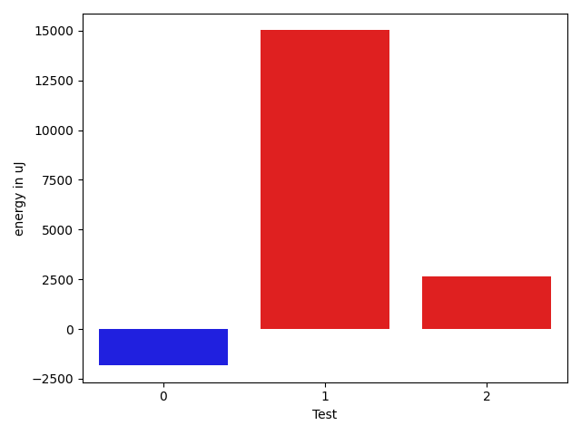

# gson 23288e

https://github.com/google/gson/commit/23288e

## Delta Energy per test method

| ID | EnergyV1 | EnergyV2 | DeltaEnergy | σV1 | σV2 |
| --- | --- | --- | --- | --- | --- |
| 0 | 205858.0375 | 196671.87209302327 | -9186.16540697674 | 101957.883263194 | 121212.26550087964 |
| 1 | 272514.49494949495 | 282878.64646464644 | 10364.15151515149 | 110640.1463495506 | 110361.13238115476 |
| 2 | 79386.27272727272 | 99893.81481481482 | 20507.542087542097 | 67128.8883382682 | 70574.48345885519 |

## Delta Duration per test method

| ID | DurationV1 | DurationsV2 | DeltaDuration |
| --- | --- | --- | --- |
| 0 | 7372308.175 | 6708552.883720931 | -663755.2912790691 |
| 1 | 8895645.393939395 | 9200766.02020202 | 305120.6262626257 |
| 2 | 2435498.5757575757 | 3340305.3333333335 | 904806.7575757578 |

## Misc.

| ID | Test Class | Test Method |
| --- | --- | --- |
| 0 | com.google.gson.ObjectTypeAdapterTest | testSerializeNullValue |
| 1 | com.google.gson.ObjectTypeAdapterTest | testSerialize |
| 2 | com.google.gson.ObjectTypeAdapterTest | testSerializeObject |

| Test | IterationV1 | IterationV2 | DeltaIteration |
| --- | --- | --- | --- |
| 0 | 80 | 86 | 6 |
| 1 | 99 | 99 | 0 |
| 2 | 33 | 27 | -6 |

| Time Label | Time (s) |
| --- | --- |
| Selection | 27.22110629081726 |
| Injection | 10.606208801269531 |
| Total | 988.1209163665771 |

