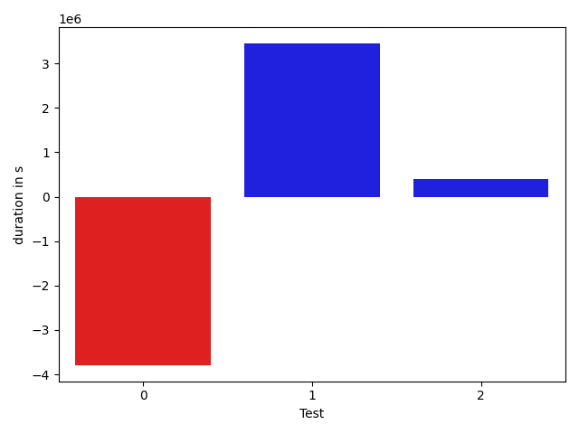

# gson 23288e

https://github.com/google/gson/commit/23288e

## Delta Energy per test method

| ID | EnergyV1 | EnergyV2 | DeltaEnergy |
| --- | --- | --- | --- |
| 0 | 206149.8342817804 | 144952.25914538102 | -61197.57513639939 |
| 1 | 245746.4089572368 | 327895.5737405085 | 82149.16478327173 |
| 2 | 34079.32904442493 | 47459.86273671687 | 13380.533692291938 |

## Delta Duration per test method

| ID | DurationV1 | DurationsV2 | DeltaDuration |
| --- | --- | --- | --- |
| 0 | 8165209.225471634 | 4371961.168955837 | -3793248.056515797 |
| 1 | 8311328.39311939 | 11761862.599652665 | 3450534.2065332746 |
| 2 | 726830.2026526483 | 1132605.7042121738 | 405775.5015595255 |

## Misc.

| ID | Test Class | Test Method |
| --- | --- | --- |
| 0 | com.google.gson.ObjectTypeAdapterTest | testSerializeNullValue |
| 1 | com.google.gson.ObjectTypeAdapterTest | testSerialize |
| 2 | com.google.gson.ObjectTypeAdapterTest | testSerializeObject |

| Test | IterationV1 | IterationV2 | DeltaIteration |
| --- | --- | --- | --- |
| 0 | 80 | 86 | 6 |
| 1 | 99 | 99 | 0 |
| 2 | 33 | 27 | -6 |

| Time Label | Time (s) |
| --- | --- |
| Selection | 27.22110629081726 |
| Injection | 10.606208801269531 |
| Total | 988.1209163665771 |

