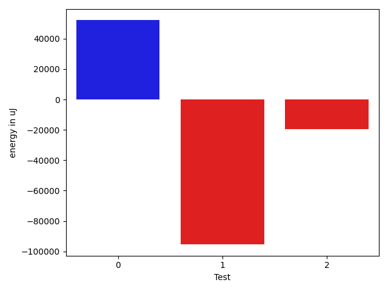
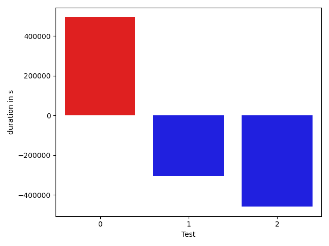

# gson cd3805

https://github.com/google/gson/commit/cd3805

## Delta Energy per test method

| ID | EnergyV1 | EnergyV2 | DeltaEnergy |
| --- | --- | --- | --- |
| 0 | 179507.94693723612 | 231578.2156714705 | 52070.268734234385 |
| 1 | 323855.7410460753 | 228441.7295573207 | -95414.0114887546 |
| 2 | 53819.045569125636 | 34338.77392944461 | -19480.27163968103 |

## Delta Duration per test method

| ID | DurationV1 | DurationsV2 | DeltaDuration |
| --- | --- | --- | --- |
| 0 | 6252232.406699055 | 7915193.185023317 | 1662960.7783242622 |
| 1 | 10136075.561432956 | 7926990.980274051 | -2209084.5811589044 |
| 2 | 1424749.9898014106 | 719847.8807783108 | -704902.1090230998 |

## Misc.

| ID | Test Class | Test Method |
| --- | --- | --- |
| 0 | com.google.gson.ObjectTypeAdapterTest | testSerializeNullValue |
| 1 | com.google.gson.ObjectTypeAdapterTest | testSerialize |
| 2 | com.google.gson.ObjectTypeAdapterTest | testSerializeObject |

| Test | IterationV1 | IterationV2 | DeltaIteration |
| --- | --- | --- | --- |
| 0 | 80 | 88 | 8 |
| 1 | 99 | 99 | 0 |
| 2 | 41 | 31 | -10 |

| Time Label | Time (s) |
| --- | --- |
| Selection | 27.314132928848267 |
| Injection | 10.394243955612183 |
| Total | 994.8642072677612 |

