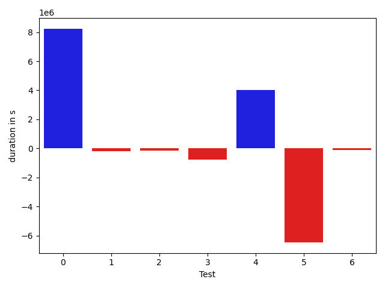

# gson 032847

https://github.com/google/gson/commit/032847

## Delta Energy per test method

| ID | EnergyV1 | EnergyV2 | DeltaEnergy |
| --- | --- | --- | --- |
| 0 | 233437.99931313546 | 584698.7316744463 | 351260.7323613108 |
| 1 | 35574.22345857185 | 32815.63695727438 | -2758.586501297468 |
| 2 | 32541.789738404073 | 34719.82091876327 | 2178.031180359194 |
| 3 | 50904.48449623456 | 34254.02895371411 | -16650.455542520453 |
| 4 | 42247.59135355963 | 139948.59284788684 | 97701.00149432721 |
| 5 | 372955.3369779874 | 193897.45043757 | -179057.88654041738 |
| 6 | 34128.48486325145 | 36212.456897735596 | 2083.972034484148 |

## Delta Duration per test method

| ID | DurationV1 | DurationsV2 | DeltaDuration |
| --- | --- | --- | --- |
| 0 | 7745630.993248055 | 15977417.090789806 | 8231786.097541751 |
| 1 | 1089589.6205191126 | 909100.4617059401 | -180489.1588131725 |
| 2 | 985509.2463697833 | 843255.5067525038 | -142253.7396172795 |
| 3 | 1610728.5998489105 | 844679.0884087867 | -766049.5114401238 |
| 4 | 1603944.5365483023 | 5627889.133118579 | 4023944.5965702767 |
| 5 | 13676644.196895376 | 7212571.51377936 | -6464072.683116016 |
| 6 | 747342.4183905721 | 628236.2004776001 | -119106.21791297197 |

## Misc.

| ID | Test Class | Test Method |
| --- | --- | --- |
| 0 | com.google.gson.functional.NamingPolicyTest | testGsonWithLowerCaseDashPolicyDeserialiation |
| 1 | com.google.gson.functional.NamingPolicyTest | testGsonWithLowerCaseUnderscorePolicySerialization |
| 2 | com.google.gson.functional.NamingPolicyTest | testGsonWithLowerCaseUnderscorePolicyDeserialiation |
| 3 | com.google.gson.functional.NamingPolicyTest | testGsonWithLowerCaseDashPolicySerialization |
| 4 | com.google.gson.ObjectTypeAdapterTest | testSerializeNullValue |
| 5 | com.google.gson.ObjectTypeAdapterTest | testSerialize |
| 6 | com.google.gson.ObjectTypeAdapterTest | testSerializeObject |

| Test | IterationV1 | IterationV2 | DeltaIteration |
| --- | --- | --- | --- |
| 0 | 97 | 97 | 0 |
| 1 | 45 | 51 | 6 |
| 2 | 52 | 49 | -3 |
| 3 | 61 | 59 | -2 |
| 4 | 74 | 75 | 1 |
| 5 | 99 | 99 | 0 |
| 6 | 26 | 19 | -7 |

| Time Label | Time (s) |
| --- | --- |
| Selection | 27.585728645324707 |
| Injection | 10.332905292510986 |
| Total | 992.6439065933228 |

