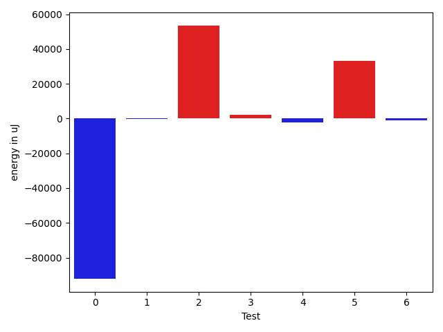

# gson 032847

https://github.com/google/gson/commit/032847

## Delta Energy per test method

| ID | EnergyV1 | EnergyV2 | DeltaEnergy | σV1 | σV2 |
| --- | --- | --- | --- | --- | --- |
| 0 | 825447.4329896907 | 733182.6907216494 | -92264.74226804124 | 666663.5819400765 | 661949.7847692443 |
| 1 | 34969.044444444444 | 34754.01960784314 | -215.02483660130383 | 3375.252306325858 | 3840.9741844862797 |
| 2 | 37804.737704918036 | 91439.83050847458 | 53635.092803556545 | 15080.88736996691 | 277858.5899279542 |
| 3 | 34448.42307692308 | 36472.836734693876 | 2024.4136577707977 | 3635.874999682141 | 12020.203521905873 |
| 4 | 102403.56756756757 | 100159.32 | -2244.247567567567 | 107739.65433082897 | 116800.19810921098 |
| 5 | 196899.61616161617 | 230206.78787878787 | 33307.1717171717 | 135110.82180881244 | 145931.5709415206 |
| 6 | 34689.03846153846 | 33652.84210526316 | -1036.1963562753008 | 3873.077215071412 | 2971.5616001507196 |

## Delta Duration per test method

| ID | DurationV1 | DurationsV2 | DeltaDuration |
| --- | --- | --- | --- |
| 0 | 23812229.969072163 | 21567939.463917527 | -2244290.5051546358 |
| 1 | 1027935.6 | 965415.2352941176 | -62520.364705882384 |
| 2 | 1137692.5737704919 | 2594834.0677966103 | 1457141.4940261184 |
| 3 | 872884.5 | 987497.2040816327 | 114612.70408163266 |
| 4 | 3529210.5675675673 | 3330448.6133333333 | -198761.95423423406 |
| 5 | 6670889.05050505 | 7554963.626262627 | 884074.5757575762 |
| 6 | 657544.7307692308 | 613822.052631579 | -43722.67813765176 |

## Misc.

| ID | Test Class | Test Method |
| --- | --- | --- |
| 0 | com.google.gson.functional.NamingPolicyTest | testGsonWithLowerCaseDashPolicyDeserialiation |
| 1 | com.google.gson.functional.NamingPolicyTest | testGsonWithLowerCaseUnderscorePolicySerialization |
| 2 | com.google.gson.functional.NamingPolicyTest | testGsonWithLowerCaseDashPolicySerialization |
| 3 | com.google.gson.functional.NamingPolicyTest | testGsonWithLowerCaseUnderscorePolicyDeserialiation |
| 4 | com.google.gson.ObjectTypeAdapterTest | testSerializeNullValue |
| 5 | com.google.gson.ObjectTypeAdapterTest | testSerialize |
| 6 | com.google.gson.ObjectTypeAdapterTest | testSerializeObject |

| Test | IterationV1 | IterationV2 | DeltaIteration |
| --- | --- | --- | --- |
| 0 | 97 | 97 | 0 |
| 1 | 45 | 51 | 6 |
| 2 | 61 | 59 | -2 |
| 3 | 52 | 49 | -3 |
| 4 | 74 | 75 | 1 |
| 5 | 99 | 99 | 0 |
| 6 | 26 | 19 | -7 |

| Time Label | Time (s) |
| --- | --- |
| Selection | 27.585728645324707 |
| Injection | 10.332905292510986 |
| Total | 992.6439065933228 |

