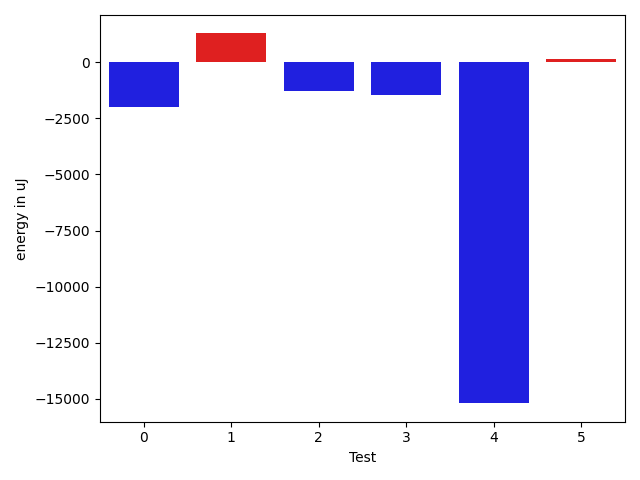

# gson 6e57df

https://github.com/google/gson/commit/6e57df

## Delta Energy per test method

| ID | EnergyV1 | EnergyV2 | DeltaEnergy | σV1 | σV2 |
| --- | --- | --- | --- | --- | --- |
| 0 | 44488.90909090909 | 64796.2 | 20307.29090909091 | 45030.71946905609 | 201495.94084531275 |
| 1 | 40789.59574468085 | 39113.66 | -1675.93574468085 | 36881.52218189481 | 33869.14932478228 |
| 2 | 38051.09090909091 | 35548.0 | -2503.0909090909117 | 17751.915877164283 | 11943.934170686149 |
| 3 | 37474.35849056604 | 33982.897959183676 | -3491.460531382363 | 13024.88098246328 | 4352.032784450804 |
| 4 | 678094.8111111111 | 629919.9647058824 | -48174.846405228716 | 825615.846459786 | 822674.0048582385 |
| 5 | 149297.9605263158 | 171982.82142857142 | 22684.860902255634 | 425981.6213112165 | 483464.4320307722 |

## Delta Duration per test method

| ID | DurationV1 | DurationsV2 | DeltaDuration |
| --- | --- | --- | --- |
| 0 | 1222796.7727272727 | 1739161.088888889 | 516364.31616161624 |
| 1 | 1096126.1276595744 | 1038007.26 | -58118.867659574375 |
| 2 | 939537.0227272727 | 954494.447368421 | 14957.424641148304 |
| 3 | 1288035.6226415094 | 1285495.0612244897 | -2540.561417019693 |
| 4 | 19174545.7 | 17732814.411764707 | -1441731.2882352918 |
| 5 | 4538646.5 | 4985441.44047619 | 446794.9404761903 |

## Misc.

| ID | Test Class | Test Method |
| --- | --- | --- |
| 0 | com.google.gson.functional.NamingPolicyTest | testGsonWithLowerCaseDashPolicyDeserialiation |
| 1 | com.google.gson.functional.NamingPolicyTest | testGsonWithLowerCaseUnderscorePolicySerialization |
| 2 | com.google.gson.functional.NamingPolicyTest | testGsonWithLowerCaseUnderscorePolicyDeserialiation |
| 3 | com.google.gson.functional.NamingPolicyTest | testGsonWithLowerCaseDashPolicySerialization |
| 4 | com.google.gson.functional.FieldNamingTest | testLowerCaseWithUnderscores |
| 5 | com.google.gson.functional.FieldNamingTest | testLowerCaseWithDashes |

| Test | IterationV1 | IterationV2 | DeltaIteration |
| --- | --- | --- | --- |
| 0 | 44 | 45 | 1 |
| 1 | 47 | 50 | 3 |
| 2 | 44 | 38 | -6 |
| 3 | 53 | 49 | -4 |
| 4 | 90 | 85 | -5 |
| 5 | 76 | 84 | 8 |

| Time Label | Time (s) |
| --- | --- |
| Selection | 27.788150787353516 |
| Injection | 10.767716884613037 |
| Total | 994.6839666366577 |

