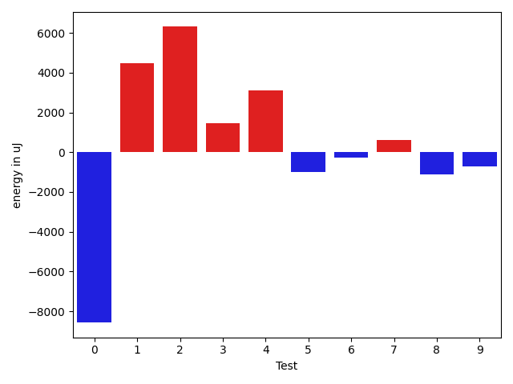
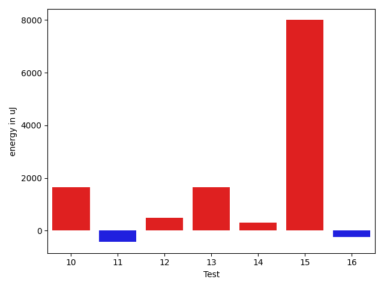
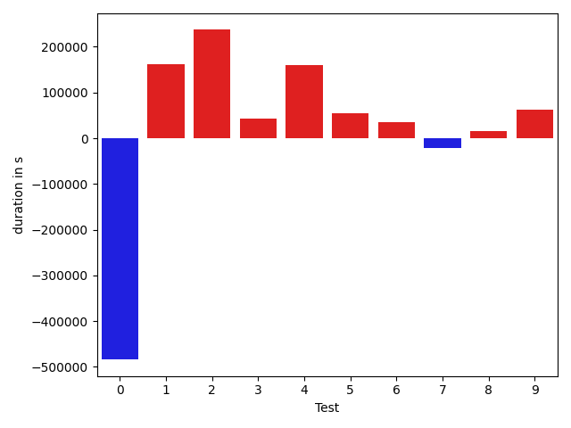
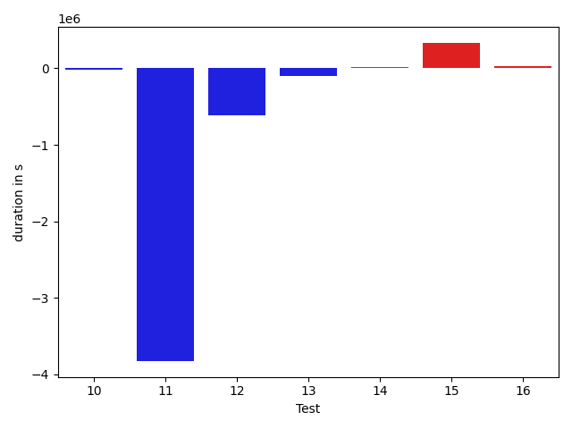

# gson f2591b

https://github.com/google/gson/commit/f2591b

## Delta Energy per test method

| ID | EnergyV1 | EnergyV2 | DeltaEnergy | σ |
| --- | --- | --- | --- | --- |
| 0 | 53560.83050847457 | 44993.96666666667 | -8566.863841807906 | 70155.99783826852 | 27001.427124608723 |
| 1 | 117993.20430107527 | 122447.29787234042 | 4454.093571265155 | 118545.75280479279 | 133197.21678540946 |
| 2 | 33833.84126984127 | 40137.77777777778 | 6303.936507936509 | 3724.611611610588 | 56573.567710602925 |
| 3 | 42100.9175257732 | 43560.93877551021 | 1460.0212497370085 | 12772.173470002557 | 14061.167836087403 |
| 4 | 54460.13157894737 | 57572.49206349206 | 3112.360484544697 | 30151.883755126928 | 35756.62887366015 |
| 5 | 36834.583333333336 | 35849.574468085106 | -985.00886524823 | 4281.273177552833 | 3820.321350773768 |
| 6 | 36671.756097560974 | 36389.6976744186 | -282.0584231423709 | 4158.9150307735945 | 4468.281942005271 |
| 7 | 35569.755102040814 | 36185.90740740741 | 616.1523053665951 | 4493.188888640737 | 3346.040309184256 |
| 8 | 37436.18571428571 | 36328.80327868852 | -1107.3824355971883 | 7180.009441483759 | 4525.059542474561 |
| 9 | 44275.73611111111 | 43573.83098591549 | -701.9051251956189 | 13472.196859533686 | 17613.55464438882 |
| 10 | 94900.78787878787 | 93051.22222222222 | -1849.5656565656536 | 43964.793290727735 | 38749.521771061525 |
| 11 | 336654.82558139536 | 212893.4239130435 | -123761.40166835187 | 592950.2334446383 | 468275.9802561908 |
| 12 | 127073.35 | 97220.31034482758 | -29853.039655172426 | 379400.7942522359 | 300438.927051062 |
| 13 | 36160.75 | 37585.97619047619 | 1425.2261904761908 | 4088.21068490442 | 4787.235550264769 |
| 14 | 37872.23684210526 | 37641.5 | -230.7368421052597 | 4102.348810095905 | 3773.100175916351 |
| 15 | 244899.62626262626 | 254933.30303030304 | 10033.676767676778 | 205418.22654506814 | 210699.2224166451 |
| 16 | 37220.36 | 37038.0625 | -182.29750000000058 | 3681.8521358685757 | 7307.775742905207 |

## Delta Duration per test method

| ID | DurationV1 | DurationsV2 | DeltaDuration |
| --- | --- | --- | --- |
| 0 | 1700922.9152542374 | 1217003.2 | -483919.7152542374 |
| 1 | 3852134.010752688 | 4013807.6063829786 | 161673.59563029045 |
| 2 | 1033972.9841269841 | 1270956.492063492 | 236983.50793650793 |
| 3 | 1485847.3711340206 | 1527971.6224489796 | 42124.25131495902 |
| 4 | 1931340.355263158 | 2090758.349206349 | 159417.99394319113 |
| 5 | 807776.5277777778 | 862085.5744680851 | 54309.046690307325 |
| 6 | 809746.1219512195 | 845504.1860465116 | 35758.064095292124 |
| 7 | 972122.7346938775 | 950311.9444444445 | -21810.79024943302 |
| 8 | 1094219.6857142858 | 1109003.6721311475 | 14783.986416861648 |
| 9 | 1488710.5833333333 | 1550511.8450704226 | 61801.26173708937 |
| 10 | 3157556.707070707 | 3138718.373737374 | -18838.333333333023 |
| 11 | 10185531.662790697 | 6361186.619565218 | -3824345.0432254793 |
| 12 | 3046999.225 | 2427940.4827586208 | -619058.7422413793 |
| 13 | 801042.3333333334 | 695635.2142857143 | -105407.11904761905 |
| 14 | 701933.9736842106 | 718237.5625 | 16303.588815789437 |
| 15 | 7497178.98989899 | 7829253.868686869 | 332074.8787878789 |
| 16 | 913653.72 | 938146.125 | 24492.405000000028 |

## Misc.

| ID | Test Class | Test Method |
| --- | --- | --- |
| 0 | com.google.gson.functional.CustomDeserializerTest | testDefaultConstructorNotCalledOnField |
| 1 | com.google.gson.functional.CustomDeserializerTest | testDefaultConstructorNotCalledOnObject |
| 2 | com.google.gson.functional.DefaultTypeAdaptersTest | testDateSerializationWithPatternNotOverridenByTypeAdapter |
| 3 | com.google.gson.functional.ExclusionStrategyFunctionalTest | testExclusionStrategyWithMode |
| 4 | com.google.gson.functional.ExclusionStrategyFunctionalTest | testExclusionStrategySerializationDoesNotImpactDeserialization |
| 5 | com.google.gson.functional.ExclusionStrategyFunctionalTest | testExcludeTopLevelClassDeserializationDoesNotImpactSerialization |
| 6 | com.google.gson.functional.ExclusionStrategyFunctionalTest | testExcludeTopLevelClassSerializationDoesNotImpactDeserialization |
| 7 | com.google.gson.functional.ExclusionStrategyFunctionalTest | testExclusionStrategySerializationDoesNotImpactSerialization |
| 8 | com.google.gson.functional.JsonAdapterAnnotationOnClassesTest | testRegisteredDeserializerOverridesJsonAdapter |
| 9 | com.google.gson.functional.JsonAdapterAnnotationOnClassesTest | testRegisteredSerializerOverridesJsonAdapter |
| 10 | com.google.gson.GsonTypeAdapterTest | testDeserializerForAbstractClass |
| 11 | com.google.gson.functional.TypeAdapterPrecedenceTest | testNonstreamingFollowedByNonstreaming |
| 12 | com.google.gson.functional.TypeAdapterPrecedenceTest | testStreamingHierarchicalFollowedByNonstreaming |
| 13 | com.google.gson.functional.TypeAdapterPrecedenceTest | testStreamingFollowedByNonstreaming |
| 14 | com.google.gson.functional.TypeAdapterPrecedenceTest | testNonstreamingHierarchicalFollowedByNonstreaming |
| 15 | com.google.gson.functional.DelegateTypeAdapterTest | testDelegateInvoked |
| 16 | com.google.gson.functional.DelegateTypeAdapterTest | testDelegateInvokedOnStrings |

| Test | IterationV1 | IterationV2 | DeltaIteration |
| --- | --- | --- | --- |
| 0 | 59 | 60 | 1 |
| 1 | 93 | 94 | 1 |
| 2 | 63 | 63 | 0 |
| 3 | 97 | 98 | 1 |
| 4 | 76 | 63 | -13 |
| 5 | 36 | 47 | 11 |
| 6 | 41 | 43 | 2 |
| 7 | 49 | 54 | 5 |
| 8 | 70 | 61 | -9 |
| 9 | 72 | 71 | -1 |
| 10 | 99 | 99 | 0 |
| 11 | 86 | 92 | 6 |
| 12 | 40 | 29 | -11 |
| 13 | 24 | 42 | 18 |
| 14 | 38 | 32 | -6 |
| 15 | 99 | 99 | 0 |
| 16 | 50 | 48 | -2 |

| Time Label | Time (s) |
| --- | --- |
| Selection | 28.03425931930542 |
| Injection | 11.41769552230835 |
| Total | 1013.7438170909882 |

