# gson 117d8e

https://github.com/google/gson/commit/117d8e

## Delta Energy per test method

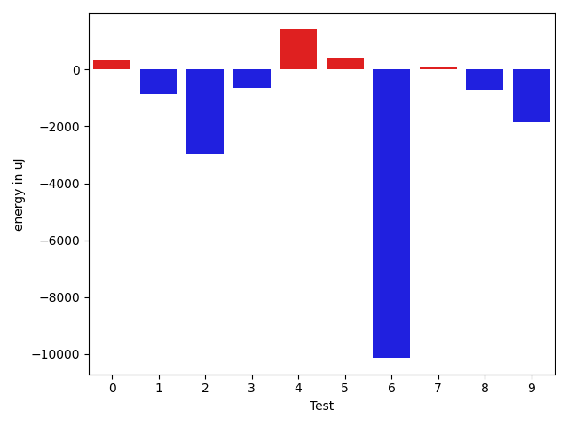

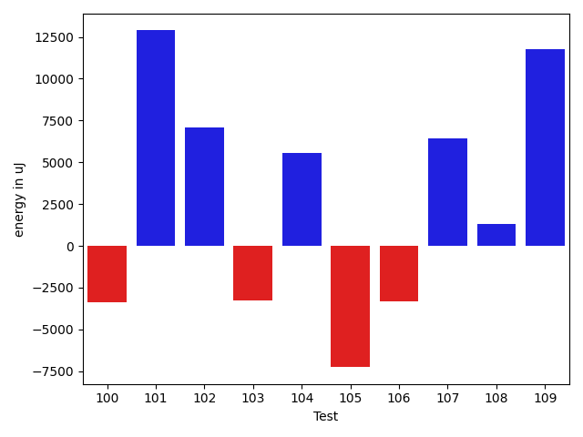

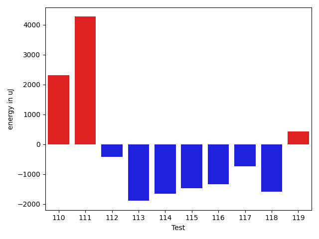

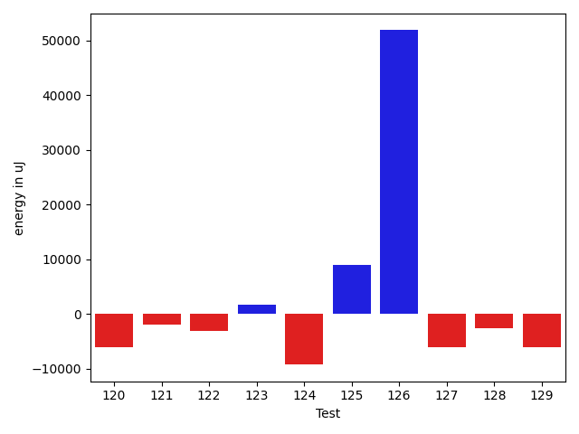

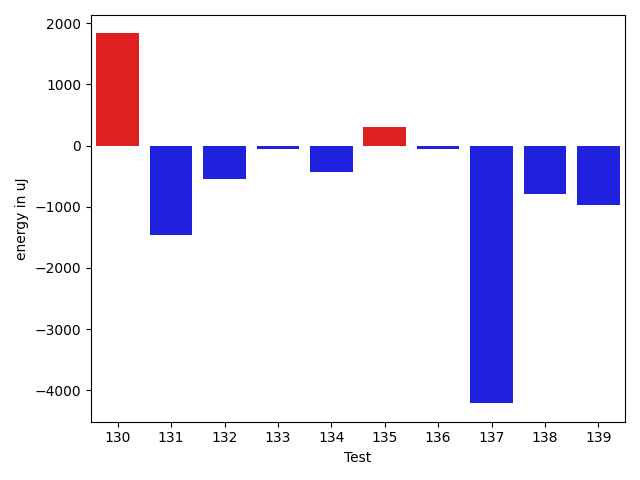

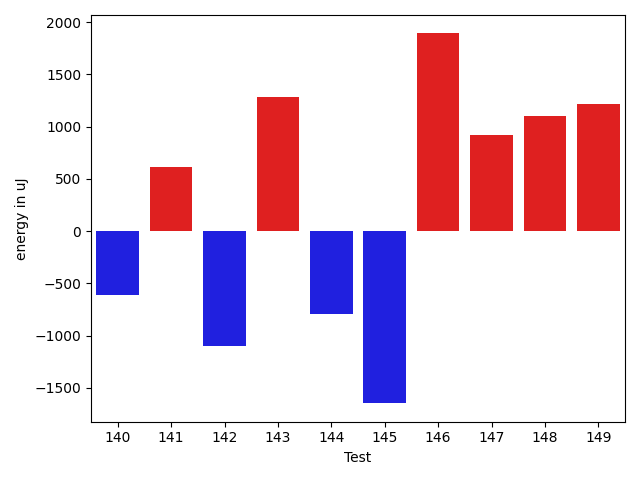

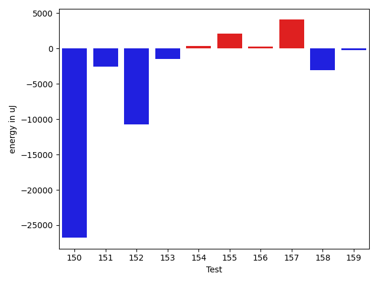

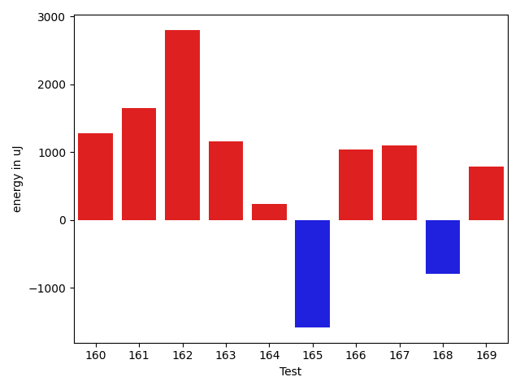

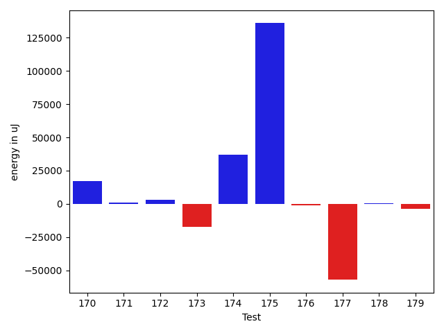

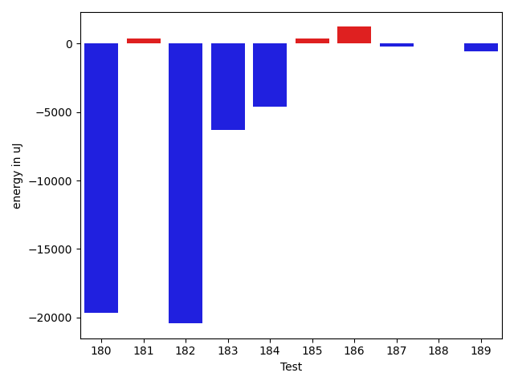

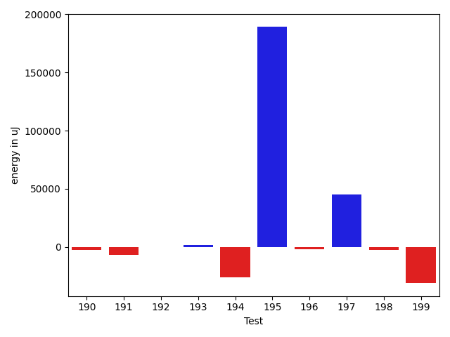

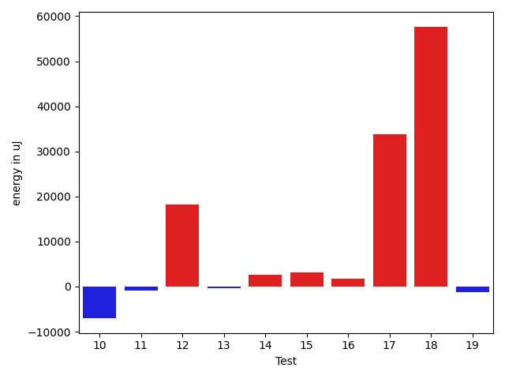

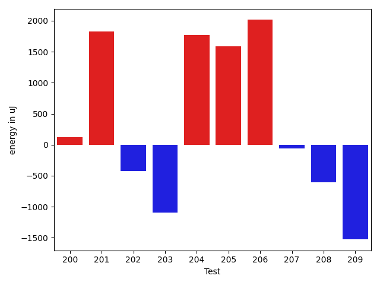

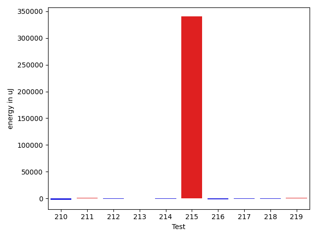

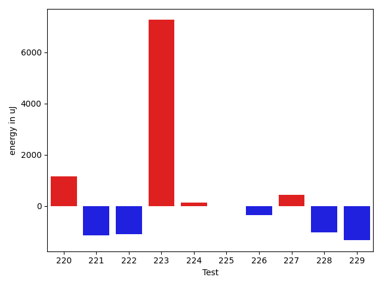

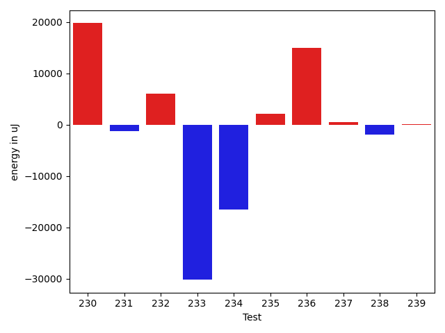

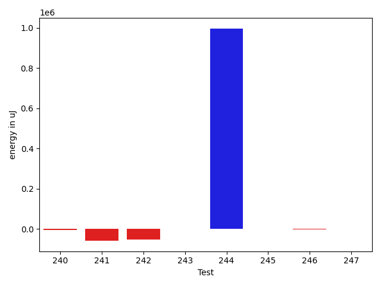

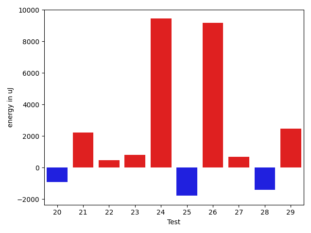

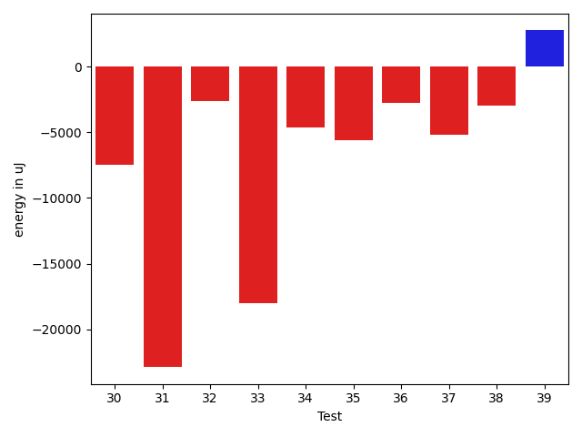

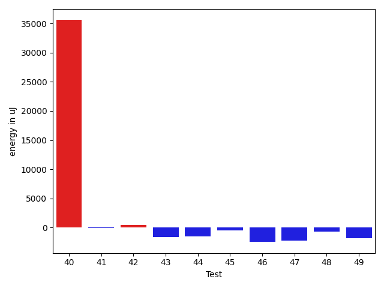

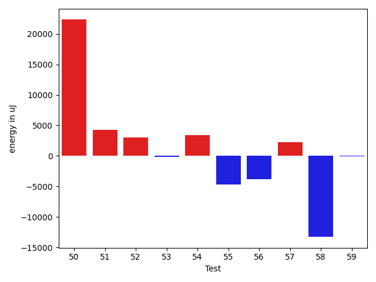

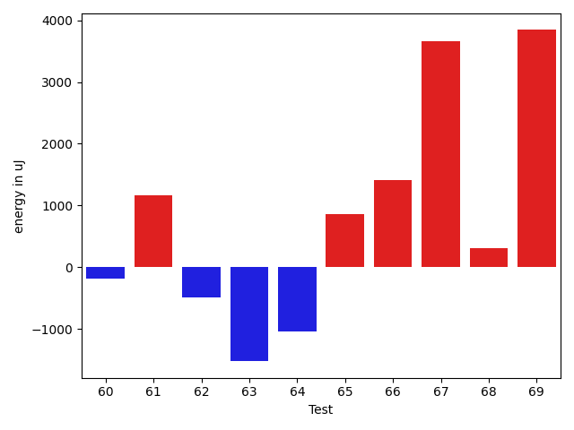

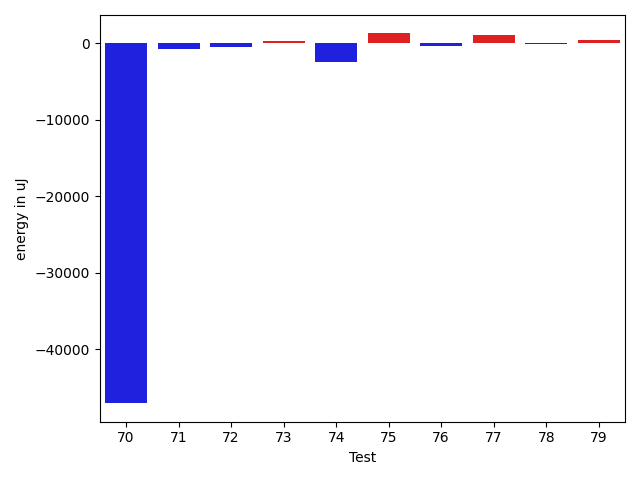

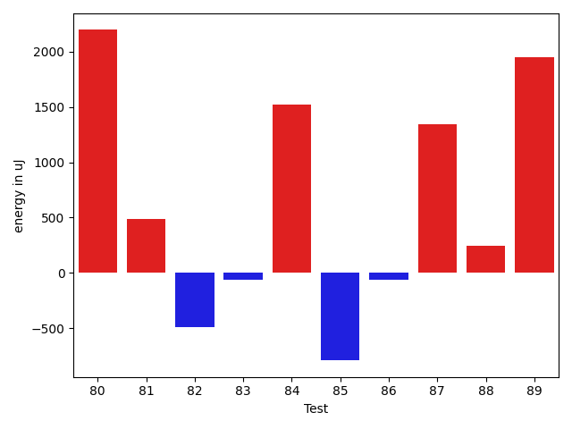

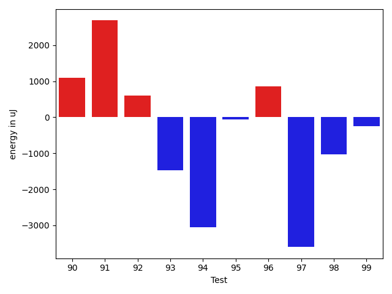

| ID | EnergyV1 | EnergyV2 | DeltaEnergy |
| --- | --- | --- | --- |
| 0 | 46868.4816781056 | 42823.23800595527 | -4045.2436721503327 |
| 1 | 43484.09897770652 | 40116.3345233752 | -3367.7644543313218 |
| 2 | 41974.559665000066 | 38302.22895283997 | -3672.3307121600956 |
| 3 | 39006.589571880875 | 37433.083247024566 | -1573.5063248563092 |
| 4 | 67255.65324442732 | 116823.90046393865 | 49568.24721951134 |
| 5 | 40681.102093017274 | 38518.680111092806 | -2162.421981924468 |
| 6 | 43279.47203548532 | 35658.71252156931 | -7620.759513916011 |
| 7 | 40696.80589582919 | 40147.63660279714 | -549.1692930320496 |
| 8 | 40913.00335727405 | 39423.151526908776 | -1489.8518303652745 |
| 9 | 37255.83293782285 | 53892.05445548167 | 16636.22151765882 |
| 10 | 35699.24440799483 | 39717.05528289118 | 4017.8108748963496 |
| 11 | 40538.29912690823 | 32762.48249913605 | -7775.816627772176 |
| 12 | 35710.76325727638 | 31183.193432564938 | -4527.569824711445 |
| 13 | 33465.93556463286 | 33251.16143715818 | -214.77412747468043 |
| 14 | 36428.64482571557 | 40190.369077682495 | 3761.7242519669235 |
| 15 | 36927.45705124746 | 38616.86142077396 | 1689.404369526499 |
| 16 | 41220.89791249466 | 40880.417362271095 | -340.48055022356857 |
| 17 | 37136.360710680485 | 41313.23101043701 | 4176.870299756527 |
| 18 | 37695.59795689583 | 37485.47588355772 | -210.1220733381051 |
| 19 | 40706.12420509223 | 42093.6105184053 | 1387.4863133130712 |
| 20 | 120395.64779179168 | 171905.79668876575 | 51510.148896974075 |
| 21 | 40459.8718682177 | 42104.95626518496 | 1645.0843969672642 |
| 22 | 35288.21274812832 | 41550.86632310359 | 6262.653574975273 |
| 23 | 40032.569841788354 | 37566.07297282119 | -2466.496868967166 |
| 24 | 41500.33446087796 | 36182.635854073545 | -5317.698606804413 |
| 25 | 42163.31488764916 | 34620.845633512705 | -7542.469254136457 |
| 26 | 70650.11572880307 | 67959.2988053964 | -2690.816923406659 |
| 27 | 42179.28241206599 | 36520.3112349321 | -5658.971177133892 |
| 28 | 83077.94389452269 | 62138.09590221909 | -20939.8479923036 |
| 29 | 41800.20424456267 | 36203.32499025173 | -5596.879254310945 |
| 30 | 42349.26714902808 | 34884.42663581128 | -7464.840513216797 |
| 31 | 58703.44249923168 | 35819.12793133751 | -22884.314567894166 |
| 32 | 40205.920823300425 | 37603.01068855446 | -2602.9101347459655 |
| 33 | 67329.03236527403 | 49349.676870178 | -17979.35549509603 |
| 34 | 41950.64660661349 | 37314.66500103359 | -4635.981605579902 |
| 35 | 42058.946868795465 | 36466.391722397675 | -5592.55514639779 |
| 36 | 40314.19727470478 | 37568.530509193195 | -2745.6667655115816 |
| 37 | 39683.54657019923 | 34538.51903427357 | -5145.027535925656 |
| 38 | 39964.32092992254 | 36973.26150330225 | -2991.0594266202897 |
| 39 | 34728.46358165554 | 37492.50368897649 | 2764.0401073209505 |
| 40 | 159581.59800139753 | 39348.67077786202 | -120232.92722353552 |
| 41 | 59198.90642471727 | 41603.68020665862 | -17595.226218058655 |
| 42 | 33040.71260304749 | 35302.69179226458 | 2261.9791892170906 |
| 43 | 36675.789622068405 | 33565.68247125088 | -3110.107150817523 |
| 44 | 33971.91782394968 | 36952.91244326062 | 2980.9946193109354 |
| 45 | 37902.78195191175 | 41978.679241500795 | 4075.8972895890474 |
| 46 | 36503.61978510022 | 38318.43842750788 | 1814.8186424076557 |
| 47 | 37497.64845833441 | 39819.549320184466 | 2321.900861850052 |
| 48 | 37199.635227680206 | 34073.04945039749 | -3126.585777282715 |
| 49 | 35448.82690405846 | 37112.433089350816 | 1663.6061852923594 |
| 50 | 38761.310618400574 | 43330.77464475925 | 4569.464026358677 |
| 51 | 35277.88647706807 | 37098.57126617432 | 1820.6847891062498 |
| 52 | 151846.80173561507 | 371651.3789510399 | 219804.57721542486 |
| 53 | 111628.48072227024 | 150811.74171997258 | 39183.26099770234 |
| 54 | 88648.67870403975 | 148386.1845007693 | 59737.50579672956 |
| 55 | 39975.33218146363 | 41337.815213857684 | 1362.483032394055 |
| 56 | 37964.29414662323 | 63364.45854688808 | 25400.164400264854 |
| 57 | 35430.57100809924 | 36472.49997092597 | 1041.9289628267288 |
| 58 | 36765.7159909051 | 38718.68770535075 | 1952.9717144456517 |
| 59 | 33066.3634894135 | 40393.95762275951 | 7327.594133346007 |
| 60 | 35848.419223849596 | 35184.93377926097 | -663.4854445886231 |
| 61 | 35410.6666123867 | 36857.27627801895 | 1446.609665632248 |
| 62 | 37975.58935415745 | 39375.19353103638 | 1399.6041768789291 |
| 63 | 39985.133109880786 | 38252.55182578801 | -1732.5812840927756 |
| 64 | 303986.4410480786 | 356813.9490316959 | 52827.50798361731 |
| 65 | 37619.87553015351 | 41933.196588635445 | 4313.321058481932 |
| 66 | 35487.001388549805 | 37105.84302902222 | 1618.841640472412 |
| 67 | 35507.46205341816 | 37406.47193002701 | 1899.0098766088486 |
| 68 | 56513.11932500504 | 34725.38547819959 | -21787.73384680545 |
| 69 | 40041.14177584648 | 36799.23869607225 | -3241.9030797742307 |
| 70 | 34877.46631900955 | 36924.206003815125 | 2046.7396848055723 |
| 71 | 37675.13713234433 | 46949.18957890185 | 9274.052446557522 |
| 72 | 38333.825814686716 | 39219.31152906269 | 885.4857143759727 |
| 73 | 32918.37847431749 | 36215.593387113884 | 3297.214912796393 |
| 74 | 33346.796904563904 | 34845.32152121153 | 1498.5246166476281 |
| 75 | 37471.47221039981 | 37396.22379699076 | -75.24841340904823 |
| 76 | 32726.01385572483 | 35040.448234882024 | 2314.4343791571955 |
| 77 | 33748.381451046094 | 38846.940064907074 | 5098.55861386098 |
| 78 | 38870.77290344238 | 36647.69379666075 | -2223.0791067816317 |
| 79 | 34026.05480957031 | 35337.38450241089 | 1311.3296928405762 |
| 80 | 37434.40628899634 | 35413.03183746338 | -2021.37445153296 |
| 81 | 36577.98315306609 | 36971.498674280534 | 393.51552121444547 |
| 82 | 35713.1444422858 | 37735.22047449574 | 2022.076032209945 |
| 83 | 34438.856247127886 | 35930.78675623245 | 1491.930509104568 |
| 84 | 34616.633284814656 | 35159.08117693663 | 542.4478921219707 |
| 85 | 37325.808837890625 | 35990.01666164398 | -1335.792176246643 |
| 86 | 33478.99760532379 | 37438.50636460498 | 3959.5087592811906 |
| 87 | 32735.378269195557 | 37442.789141476154 | 4707.410872280598 |
| 88 | 37226.84108428657 | 39959.689796447754 | 2732.8487121611834 |
| 89 | 38351.39572954178 | 33290.94297167659 | -5060.4527578651905 |
| 90 | 32217.370976999402 | 34996.46919890866 | 2779.098221909255 |
| 91 | 40193.830354146296 | 38884.76590286195 | -1309.0644512843428 |
| 92 | 34889.117360196775 | 34373.382060874894 | -515.735299321881 |
| 93 | 37257.15998840332 | 36511.61618185043 | -745.543806552887 |
| 94 | 42141.10653806492 | 84617.77235426675 | 42476.66581620183 |
| 95 | 54858.22618370995 | 37764.69531766081 | -17093.530866049143 |
| 96 | 37660.87118717247 | 37189.25820085872 | -471.61298631375394 |
| 97 | 55516.99216073052 | 91442.21943145216 | 35925.22727072164 |
| 98 | 37324.875910052964 | 40699.66533927606 | 3374.7894292230994 |
| 99 | 40627.11401443466 | 55035.92473759499 | 14408.810723160335 |
| 100 | 40803.78253634414 | 37423.62324413657 | -3380.159292207565 |
| 101 | 90630.3047711438 | 103517.27268692596 | 12886.967915782167 |
| 102 | 34237.01270031929 | 41332.39434814453 | 7095.381647825241 |
| 103 | 40052.09202612061 | 36783.837963278405 | -3268.2540628422066 |
| 104 | 33927.65099862218 | 39500.48268971499 | 5572.8316910928115 |
| 105 | 42807.022046178 | 35551.52702996472 | -7255.495016213274 |
| 106 | 39309.57893222214 | 35990.97448433253 | -3318.6044478896074 |
| 107 | 36765.71543836546 | 43178.21828169836 | 6412.502843332899 |
| 108 | 41068.92453751736 | 42370.65296204155 | 1301.72842452419 |
| 109 | 92875.04818132141 | 104624.8564349932 | 11749.808253671785 |
| 110 | 36617.68896961212 | 35199.5062482357 | -1418.182721376419 |
| 111 | 38074.737937882805 | 34676.87160586924 | -3397.8663320135674 |
| 112 | 53299.798993742865 | 34409.26524376118 | -18890.53374998168 |
| 113 | 39832.920950522646 | 42249.97898557782 | 2417.0580350551754 |
| 114 | 39513.22802734375 | 32991.37703704834 | -6521.85099029541 |
| 115 | 42683.151859174366 | 63631.92570126217 | 20948.7738420878 |
| 116 | 39992.88095288854 | 42875.05534236148 | 2882.174389472937 |
| 117 | 38983.41262158814 | 35178.621761283706 | -3804.7908603044343 |
| 118 | 41096.237826122975 | 34413.96139150721 | -6682.276434615764 |
| 119 | 37597.62377478555 | 37452.79159069061 | -144.83218409493566 |
| 120 | 38592.44704627991 | 32494.847322940826 | -6097.599723339081 |
| 121 | 38270.594230101444 | 36365.930368418325 | -1904.6638616831187 |
| 122 | 41698.09943227733 | 38555.85836258864 | -3142.2410696886946 |
| 123 | 39061.530827330425 | 40760.860536538064 | 1699.329709207639 |
| 124 | 60084.580904364586 | 50812.89895056782 | -9271.681953796768 |
| 125 | 38988.684229049744 | 47881.4485679112 | 8892.764338861452 |
| 126 | 44622.92282266252 | 96520.64671309688 | 51897.72389043436 |
| 127 | 42106.78867073066 | 36045.07712747084 | -6061.711543259822 |
| 128 | 37711.67309714656 | 35076.43411860707 | -2635.2389785394917 |
| 129 | 41712.592073128166 | 35611.58271492343 | -6101.009358204734 |
| 130 | 44821.582159588834 | 67021.73825203217 | 22200.156092443336 |
| 131 | 42284.60247382451 | 36064.72755184095 | -6219.874921983559 |
| 132 | 40745.61377575761 | 35527.73206296936 | -5217.88171278825 |
| 133 | 39010.59504009411 | 36567.38985061168 | -2443.2051894824253 |
| 134 | 41507.08782179476 | 38650.54910384263 | -2856.5387179521276 |
| 135 | 40438.26466681586 | 39329.14578198548 | -1109.1188848303864 |
| 136 | 39959.02134245706 | 35371.72518728445 | -4587.296155172611 |
| 137 | 45605.96353915203 | 35618.25182772959 | -9987.711711422438 |
| 138 | 35269.24673128128 | 33548.50130227208 | -1720.7454290091991 |
| 139 | 44912.1104794126 | 40990.564327585555 | -3921.546151827046 |
| 140 | 42035.07561445236 | 41134.05481130071 | -901.0208031516522 |
| 141 | 41020.00678092241 | 42096.252554535866 | 1076.245773613453 |
| 142 | 83794.55772410629 | 40973.55132747654 | -42821.006396629746 |
| 143 | 41776.76426423341 | 37590.236336456495 | -4186.527927776915 |
| 144 | 40286.04338845278 | 58626.24662943843 | 18340.203240985647 |
| 145 | 99572.13922110939 | 81585.85000204609 | -17986.2892190633 |
| 146 | 47264.79129178852 | 45339.49399429035 | -1925.2972974981676 |
| 147 | 34755.931441109 | 38913.79425007198 | 4157.862808962978 |
| 148 | 38522.11948401333 | 35777.126895554204 | -2744.9925884591285 |
| 149 | 65321.81753730774 | 110096.42553529143 | 44774.607997983694 |
| 150 | 41745.94221153612 | 39225.30429888323 | -2520.637912652892 |
| 151 | 33003.610694885254 | 37453.9808819294 | 4450.370187044144 |
| 152 | 129740.08432995071 | 128180.6817037029 | -1559.4026262478146 |
| 153 | 40178.74100912234 | 38009.5932204699 | -2169.1477886524444 |
| 154 | 37289.82974682138 | 40369.30885820781 | 3079.479111386434 |
| 155 | 51827.65436218679 | 39578.80523949396 | -12248.84912269283 |
| 156 | 38246.90012759103 | 36302.23985493821 | -1944.6602726528145 |
| 157 | 37856.77798718125 | 41431.383979744 | 3574.6059925627487 |
| 158 | 37098.40412655519 | 37466.788561521214 | 368.3844349660212 |
| 159 | 39970.60275913103 | 38636.650447370484 | -1333.9523117605422 |
| 160 | 41133.44921531234 | 56533.061012766484 | 15399.611797454141 |
| 161 | 38811.39897709617 | 53174.8645091386 | 14363.465532042428 |
| 162 | 100703.02703614547 | 131329.82993648254 | 30626.80290033706 |
| 163 | 39644.27149015618 | 59173.88937822798 | 19529.6178880718 |
| 164 | 40581.1470727229 | 39037.55756206516 | -1543.5895106577445 |
| 165 | 38844.18909330154 | 39755.65471432358 | 911.4656210220419 |
| 166 | 68996.66732088466 | 43343.16794395342 | -25653.499376931242 |
| 167 | 36712.99151348678 | 40179.51414252876 | 3466.5226290419814 |
| 168 | 35310.32868330103 | 38360.31398899429 | 3049.9853056932625 |
| 169 | 40431.78299886249 | 47490.74808597565 | 7058.96508711316 |
| 170 | 37353.514789264664 | 54315.10840177536 | 16961.593612510696 |
| 171 | 38182.61411749502 | 38916.95821130276 | 734.3440938077401 |
| 172 | 33680.107895048335 | 36720.654206547886 | 3040.546311499551 |
| 173 | 58271.90770543966 | 40893.21945054244 | -17378.68825489722 |
| 174 | 219526.97186404618 | 256539.0403326193 | 37012.068468573125 |
| 175 | 268926.0385712333 | 404809.16194383835 | 135883.12337260507 |
| 176 | 42813.85347449122 | 41747.166555491625 | -1066.6869189995923 |
| 177 | 101881.64610337687 | 44816.26278488828 | -57065.383318488595 |
| 178 | 36474.517038863894 | 36882.02826267808 | 407.51122381418827 |
| 179 | 40446.87626090319 | 36480.87833371555 | -3965.9979271876437 |
| 180 | 37303.176615694596 | 35166.62718586973 | -2136.549429824867 |
| 181 | 34810.52292071143 | 30235.412435770035 | -4575.110484941397 |
| 182 | 39480.24379734571 | 38205.16578593774 | -1275.0780114079753 |
| 183 | 39222.17536356825 | 38733.91965337649 | -488.2557101917555 |
| 184 | 38375.09343166229 | 37155.71606439679 | -1219.3773672655007 |
| 185 | 34731.211399072716 | 37063.14898815997 | 2331.9375890872543 |
| 186 | 42700.72560677398 | 70569.48157108841 | 27868.755964314434 |
| 187 | 36732.18701879346 | 42734.05439641074 | 6001.86737761728 |
| 188 | 39165.755593348586 | 39804.39862839356 | 638.6430350449737 |
| 189 | 36720.426389178036 | 40957.75705457365 | 4237.330665395617 |
| 190 | 39679.16459897402 | 36992.09768151256 | -2687.0669174614595 |
| 191 | 47797.96183484298 | 40977.68085441818 | -6820.280980424803 |
| 192 | 41133.32981932163 | 40807.05419638008 | -326.2756229415536 |
| 193 | 39168.79682739405 | 41088.85943158828 | 1920.0626041942305 |
| 194 | 96405.1631165118 | 70288.69269607187 | -26116.47042043993 |
| 195 | 37673.09692870273 | 226900.83751641415 | 189227.74058771142 |
| 196 | 39829.17040471537 | 37648.084170314454 | -2181.0862344009147 |
| 197 | 38464.38584774875 | 83601.79863564207 | 45137.41278789332 |
| 198 | 38444.1705087868 | 36201.95772163015 | -2242.2127871566554 |
| 199 | 72919.79705484254 | 41731.31329734437 | -31188.483757498165 |
| 200 | 41174.11839190591 | 38350.36393399909 | -2823.75445790682 |
| 201 | 40016.7025885582 | 43165.41491103172 | 3148.712322473526 |
| 202 | 39885.7843647548 | 41053.47685670853 | 1167.6924919537269 |
| 203 | 36433.21403193474 | 36789.49914237484 | 356.2851104401052 |
| 204 | 731593.0597589093 | 48278.446650488426 | -683314.6131084209 |
| 205 | 77361.16634446103 | 39159.226263955235 | -38201.940080505796 |
| 206 | 36798.39206576347 | 44413.56663894653 | 7615.17457318306 |
| 207 | 38020.364319571294 | 38775.50328499079 | 755.1389654194936 |
| 208 | 36492.84049987793 | 37356.19017255306 | 863.3496726751328 |
| 209 | 116902.48293331485 | 39977.63470076856 | -76924.8482325463 |
| 210 | 39427.16238392051 | 37066.902188739914 | -2360.260195180599 |
| 211 | 44661.26957311644 | 34813.09743233963 | -9848.172140776813 |
| 212 | 41370.17327595921 | 36524.564072601905 | -4845.609203357308 |
| 213 | 41678.12567973937 | 46564.461454724915 | 4886.335774985542 |
| 214 | 37905.86887048546 | 40775.892934302334 | 2870.024063816876 |
| 215 | 38168.718416661024 | 35207.294237867 | -2961.4241787940264 |
| 216 | 38820.26283479482 | 37968.895897248294 | -851.3669375465252 |
| 217 | 38266.3917589677 | 34985.97940349003 | -3280.412355477667 |
| 218 | 498732.1855549002 | 194116.92884619464 | -304615.25670870556 |
| 219 | 55335.81164528847 | 37499.20916152575 | -17836.60248376272 |
| 220 | 36248.15354787209 | 30931.147708684206 | -5317.005839187885 |
| 221 | 36276.80001847336 | 37879.50351276063 | 1602.7034942872706 |
| 222 | 35608.410917282104 | 36652.83463859558 | 1044.4237213134766 |
| 223 | 36805.121696342714 | 36701.460182150826 | -103.66151419188827 |
| 224 | 37873.12900725007 | 37635.19215256069 | -237.93685468938202 |
| 225 | 117509.02083273217 | 99440.9445767664 | -18068.076255965774 |
| 226 | 49678.600173868086 | 33465.72493262979 | -16212.875241238296 |
| 227 | 56939.21087841757 | 34477.639723844964 | -22461.571154572608 |
| 228 | 39233.19453160505 | 36649.78991752781 | -2583.4046140772407 |
| 229 | 38584.43782541228 | 54688.00215531833 | 16103.564329906054 |
| 230 | 38394.541587977874 | 36683.20833045313 | -1711.3332575247405 |
| 231 | 38539.71026860138 | 38659.78001903738 | 120.0697504359996 |
| 232 | 38862.105920292925 | 41692.91784114787 | 2830.811920854947 |
| 233 | 40518.49885388755 | 40593.5210168405 | 75.02216295295511 |
| 234 | 108338.50637429267 | 53117.921534003755 | -55220.58484028892 |
| 235 | 149786.49150941547 | 38027.32633281001 | -111759.16517660546 |
| 236 | 43914.0097584786 | 70930.48451992904 | 27016.474761450445 |
| 237 | 41025.02070623623 | 40710.97094767568 | -314.04975856054807 |
| 238 | 39294.470161448255 | 44577.00469523784 | 5282.534533789585 |
| 239 | 77357.33982596523 | 70043.45761899622 | -7313.882206969007 |
| 240 | 52196.1678992963 | 46405.72367620365 | -5790.444223092651 |
| 241 | 98622.05884311863 | 40996.73943250424 | -57625.31941061439 |
| 242 | 94067.17017111492 | 41178.96596323047 | -52888.20420788445 |
| 243 | 37874.360812589526 | 38708.78880458325 | 834.4279919937253 |
| 244 | 42348.909850278746 | 1038915.7828455075 | 996566.8729952287 |
| 245 | 40314.8464415203 | 40515.00919242179 | 200.1627509014943 |
| 246 | 41321.021262018476 | 39697.20785273114 | -1623.813409287337 |
| 247 | 39994.22272503376 | 42375.91952690063 | 2381.6968018668704 |

## Delta Duration per test method

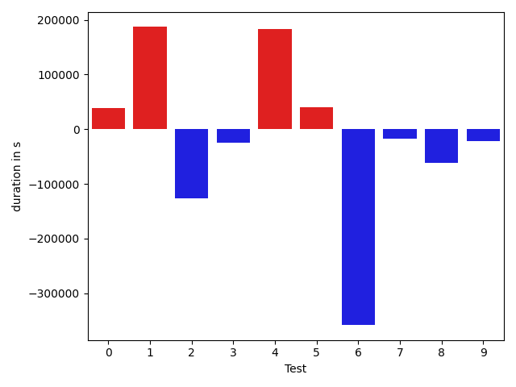

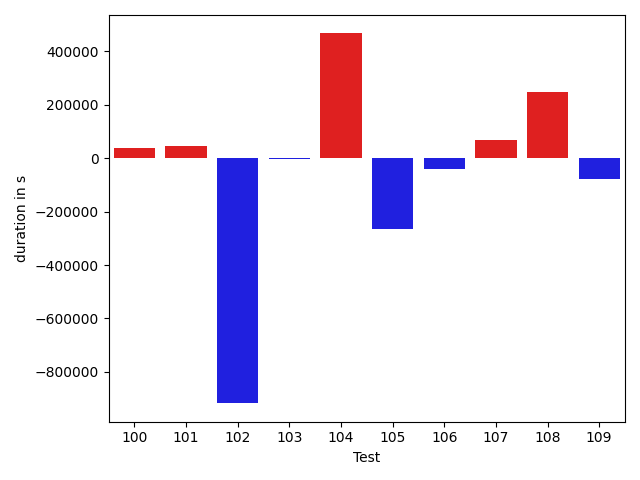

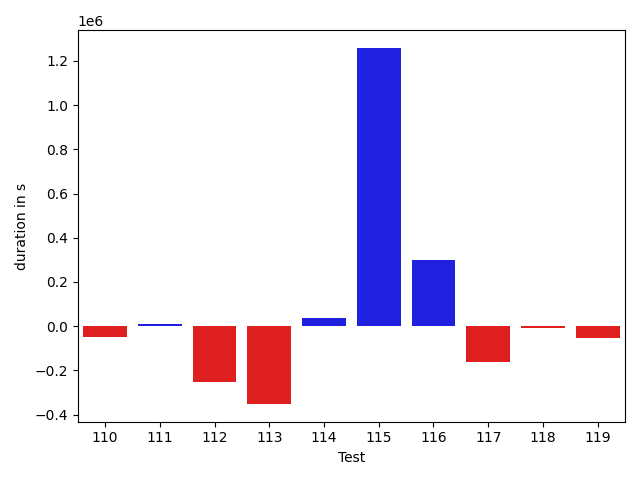

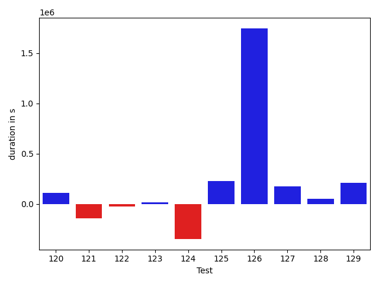

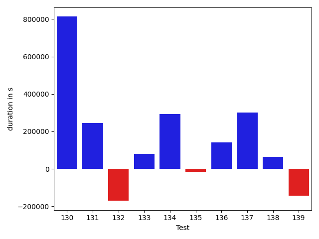

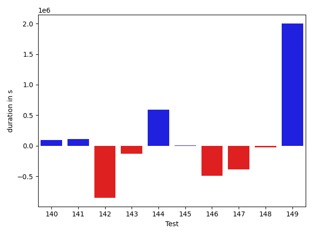

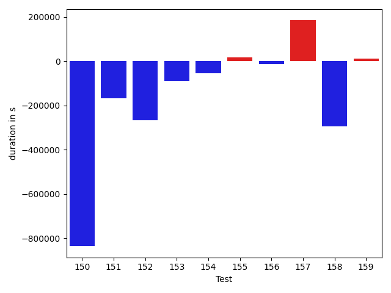

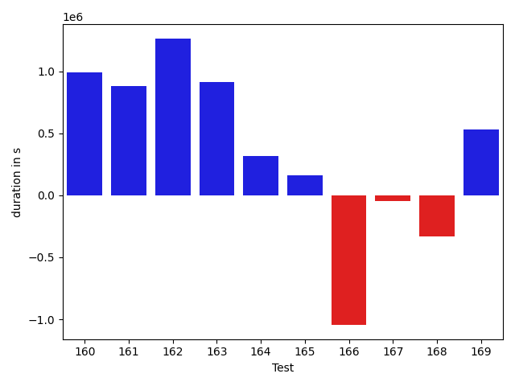

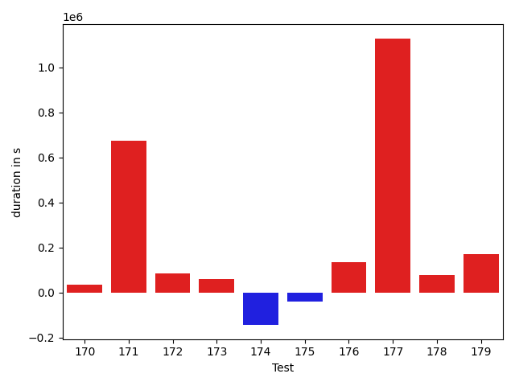

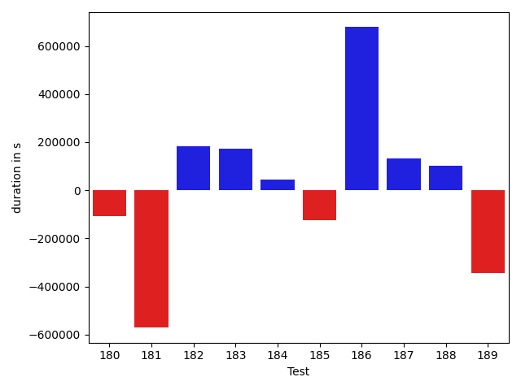

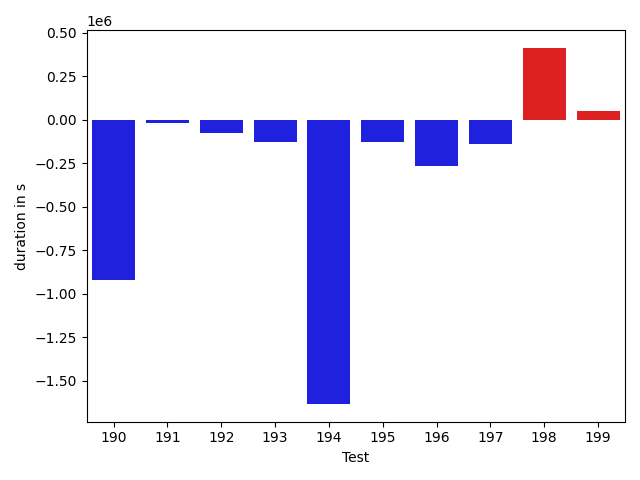

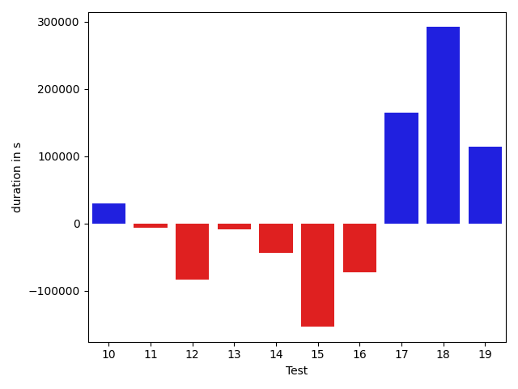

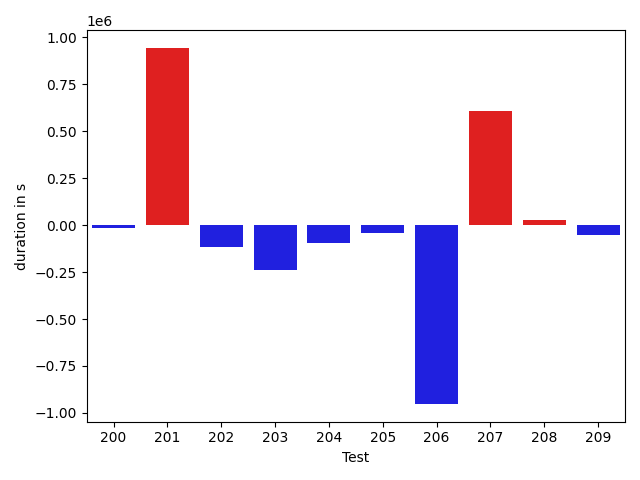

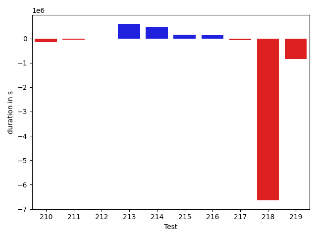

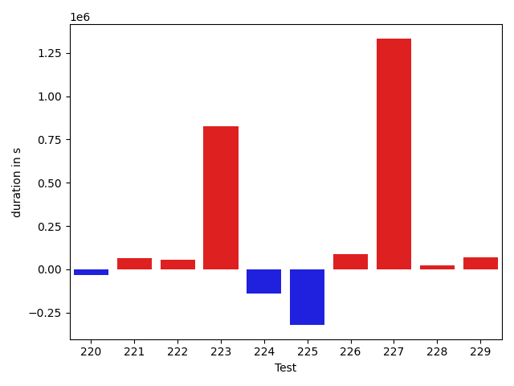

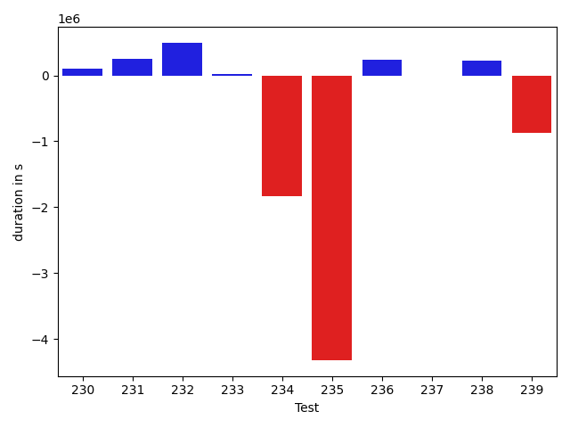

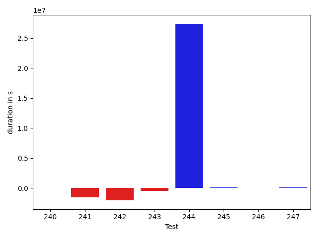

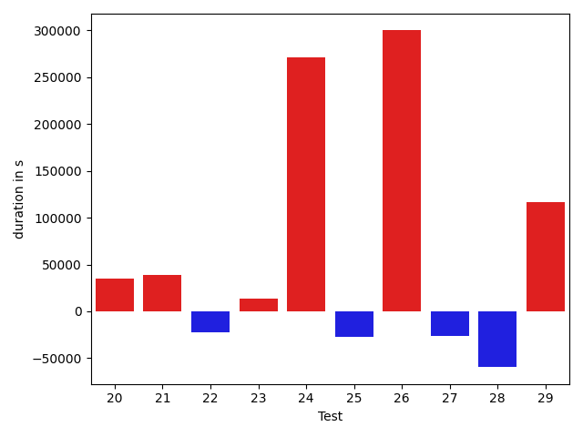

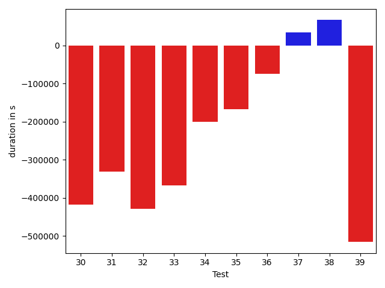

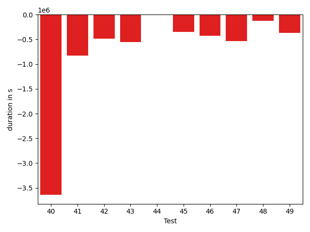

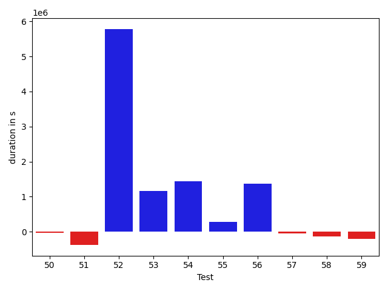

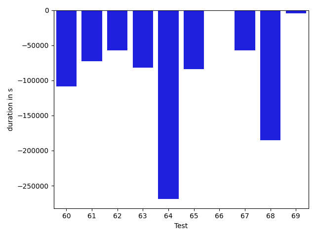

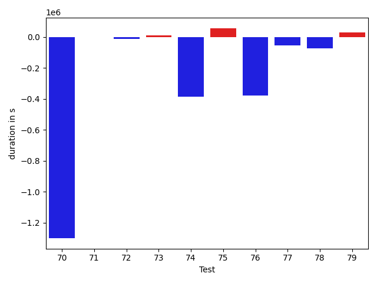

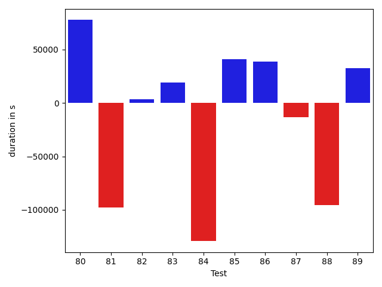

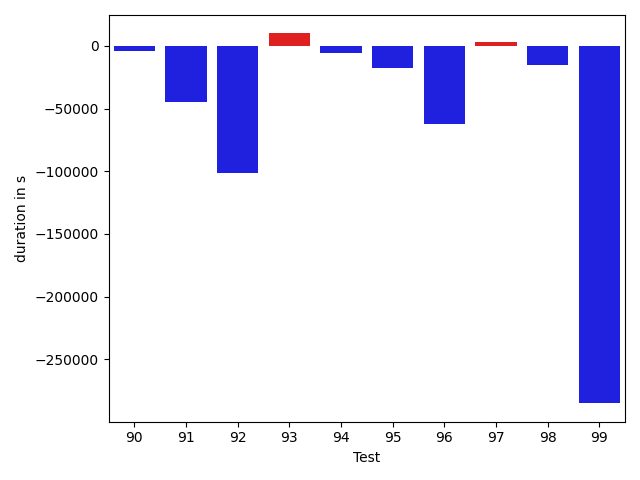

| ID | DurationV1 | DurationsV2 | DeltaDuration |
| --- | --- | --- | --- |
| 0 | 1338470.4552990906 | 1278057.500149895 | -60412.95514919562 |
| 1 | 768587.5113238061 | 801890.8000567975 | 33303.28873299132 |
| 2 | 545866.6203997284 | 609309.4836410582 | 63442.86324132979 |
| 3 | 519591.672767058 | 646234.1916465089 | 126642.51887945086 |
| 4 | 2217423.5434099976 | 2721290.6909872857 | 503867.1475772881 |
| 5 | 970613.7872309512 | 644711.615957555 | -325902.17127339623 |
| 6 | 705869.0959865402 | 598272.9335744086 | -107596.16241213155 |
| 7 | 636013.0693622 | 726641.9156157821 | 90628.84625358216 |
| 8 | 782208.1880523069 | 534103.4868030434 | -248104.70124926348 |
| 9 | 1473174.8138932239 | 1533491.7664972204 | 60316.9526039965 |
| 10 | 778681.6226168341 | 808342.6658738032 | 29661.043256969075 |
| 11 | 1060170.3933023135 | 1053722.131615691 | -6448.261686622631 |
| 12 | 669052.492129344 | 584994.8624406803 | -84057.62968866376 |
| 13 | 817163.0881244619 | 808220.0388020682 | -8943.049322393723 |
| 14 | 592552.293407768 | 548513.9443674088 | -44038.34904035926 |
| 15 | 1007397.610737312 | 853484.7733496769 | -153912.83738763514 |
| 16 | 913814.422375504 | 840712.4442223833 | -73101.97815312073 |
| 17 | 409124.1734361276 | 574017.8595161438 | 164893.6860800162 |
| 18 | 614592.2474435568 | 906332.7512064547 | 291740.5037628979 |
| 19 | 832302.1815116722 | 945687.8990393778 | 113385.7175277056 |
| 20 | 3365292.674254209 | 4268499.465229278 | 903206.7909750696 |
| 21 | 679505.8744789469 | 798364.6142547128 | 118858.73977576592 |
| 22 | 740499.8194042945 | 596853.6741630712 | -143646.14524122328 |
| 23 | 1142095.3795452537 | 1058276.536937089 | -83818.84260816476 |
| 24 | 1230020.5003167018 | 1071134.6300801523 | -158885.87023654953 |
| 25 | 1147223.4516571378 | 891382.2709560904 | -255841.18070104741 |
| 26 | 2183494.1785429018 | 1770398.4372077545 | -413095.7413351473 |
| 27 | 1165873.5153768524 | 1029374.0880268461 | -136499.4273500063 |
| 28 | 2446175.5075828875 | 1954665.8622430903 | -491509.64533979725 |
| 29 | 1209645.7344667504 | 1024877.8701819812 | -184767.86428476917 |
| 30 | 1338315.2341530356 | 920478.1237599411 | -417837.1103930945 |
| 31 | 1567957.6261386024 | 1236498.9871882303 | -331458.6389503721 |
| 32 | 1347910.358347896 | 919562.3615709051 | -428347.99677699094 |
| 33 | 2347013.869329288 | 1979364.3215380884 | -367649.54779119976 |
| 34 | 1207076.1500673525 | 1007159.2655350093 | -199916.88453234313 |
| 35 | 913706.4766398309 | 746279.3211898569 | -167427.155449974 |
| 36 | 781561.7668110086 | 707358.8440705977 | -74202.9227404109 |
| 37 | 521370.7422095776 | 554950.3512088774 | 33579.60899929982 |
| 38 | 680206.8591580916 | 746347.2430969931 | 66140.38393890148 |
| 39 | 1282021.4962285585 | 766511.2006501956 | -515510.2955783629 |
| 40 | 4326242.954087453 | 686108.9778956345 | -3640133.9761918187 |
| 41 | 1622222.469428197 | 798819.0922805462 | -823403.3771476508 |
| 42 | 908405.7176685184 | 423444.4192313552 | -484961.29843716323 |
| 43 | 957849.8319786787 | 404350.6249186911 | -553499.2070599876 |
| 44 | 798176.9513800526 | 790261.3774385059 | -7915.573941546725 |
| 45 | 712457.9102413822 | 360308.2375065014 | -352149.6727348808 |
| 46 | 904933.1438253373 | 474163.11671823263 | -430770.02710710466 |
| 47 | 1095647.0571745136 | 559260.0068850007 | -536387.0502895128 |
| 48 | 559340.5064611435 | 434513.2775499821 | -124827.22891116142 |
| 49 | 820415.1152582169 | 447132.93284533964 | -373282.1824128772 |
| 50 | 395603.7019376755 | 367626.4619260556 | -27977.24001161987 |
| 51 | 763820.5598083064 | 389078.90447998047 | -374741.6553283259 |
| 52 | 4877285.158980902 | 10658942.622112572 | 5781657.46313167 |
| 53 | 3029177.8857062645 | 4198309.591815645 | 1169131.7061093803 |
| 54 | 2628144.6099022473 | 4066185.114943745 | 1438040.5050414978 |
| 55 | 526741.6656770606 | 808200.5401507639 | 281458.8744737033 |
| 56 | 523522.0073201349 | 1888132.7784056533 | 1364610.7710855184 |
| 57 | 509538.86586502194 | 460708.55940673314 | -48830.306458288804 |
| 58 | 1161391.3061779402 | 1028721.3059068371 | -132670.0002711031 |
| 59 | 758174.4635081006 | 552369.8027095508 | -205804.66079854977 |
| 60 | 912700.4640272825 | 952728.5144869108 | 40028.050459628226 |
| 61 | 532701.503834486 | 472836.3373503685 | -59865.16648411751 |
| 62 | 468486.00354099274 | 445811.49475455284 | -22674.508786439896 |
| 63 | 791132.7290057957 | 781001.3994822591 | -10131.32952353661 |
| 64 | 8367849.767655249 | 10288139.819908608 | 1920290.052253359 |
| 65 | 392812.8415335119 | 417195.7476438284 | 24382.906110316515 |
| 66 | 397688.8813714981 | 501202.5851135254 | 103513.70374202728 |
| 67 | 450641.12770843506 | 496463.58971214294 | 45822.462003707886 |
| 68 | 1181478.3077789969 | 655631.1804490386 | -525847.1273299583 |
| 69 | 405568.40170007944 | 490221.05791060627 | 84652.65621052682 |
| 70 | 611146.3843215627 | 571403.5119475506 | -39742.872374012135 |
| 71 | 1512427.9189298656 | 1687986.1639278578 | 175558.24499799218 |
| 72 | 485714.00642017706 | 508248.4765890015 | 22534.470168824424 |
| 73 | 502760.3911220096 | 729363.7182196174 | 226603.32709760778 |
| 74 | 467324.6059360504 | 555428.2633605411 | 88103.65742449067 |
| 75 | 561826.6610328332 | 566505.7432001559 | 4679.082167322747 |
| 76 | 678923.4162518787 | 614086.0950366762 | -64837.321215202566 |
| 77 | 544247.6553076096 | 416132.94595885277 | -128114.70934875682 |
| 78 | 370231.97661590576 | 518301.73089954257 | 148069.7542836368 |
| 79 | 360788.48046875 | 435145.2319793701 | 74356.75151062012 |
| 80 | 451704.87789176404 | 529360.3111114502 | 77655.43321968615 |
| 81 | 812072.2034095116 | 714153.1088278481 | -97919.09458166349 |
| 82 | 654879.6358758665 | 658110.3399208477 | 3230.704044981161 |
| 83 | 795248.9372066879 | 814485.4670578416 | 19236.529851153726 |
| 84 | 651644.890192356 | 522294.97420447133 | -129349.91598788463 |
| 85 | 380439.2001953125 | 421487.15332221985 | 41047.95312690735 |
| 86 | 464255.6937036514 | 502834.1727209219 | 38578.479017270496 |
| 87 | 404892.73540115356 | 391645.37153726816 | -13247.363863885403 |
| 88 | 549597.2046881616 | 454105.7586669922 | -95491.44602116942 |
| 89 | 412746.7898478508 | 445226.7794656046 | 32479.989617753774 |
| 90 | 567577.7774315923 | 542629.1129194684 | -24948.664512123913 |
| 91 | 479651.5620598664 | 698490.3470653072 | 218838.78500544082 |
| 92 | 767937.736061792 | 828208.7526631764 | 60271.016601384385 |
| 93 | 429616.7365472317 | 518905.74993020296 | 89289.01338297129 |
| 94 | 1226504.6760810807 | 1957643.1040350553 | 731138.4279539746 |
| 95 | 1345165.1550252647 | 1130764.247731026 | -214400.90729423868 |
| 96 | 921658.9302537077 | 1183493.9792224986 | 261835.0489687909 |
| 97 | 1476405.3765577408 | 2757333.0996898073 | 1280927.7231320664 |
| 98 | 815618.9867374311 | 925437.8413734229 | 109818.85463599174 |
| 99 | 918644.8541614109 | 1706212.297305236 | 787567.4431438252 |
| 100 | 482283.3738118615 | 762157.272829324 | 279873.8990174625 |
| 101 | 2945058.774563524 | 2958836.0711654355 | 13777.296601911541 |
| 102 | 520663.1590781212 | 1121828.446838379 | 601165.2877602577 |
| 103 | 644987.2452146973 | 625087.992779199 | -19899.25243549829 |
| 104 | 739185.8783460855 | 449640.68756025005 | -289545.1907858355 |
| 105 | 779829.1524766937 | 559489.9444044064 | -220339.20807228738 |
| 106 | 650113.0938127118 | 628528.4090629404 | -21584.684749771375 |
| 107 | 748743.5597746294 | 563503.545691603 | -185240.01408302644 |
| 108 | 419851.4074871886 | 540331.2813325603 | 120479.87384537177 |
| 109 | 2466108.1127656233 | 2883466.8758671293 | 417358.76310150605 |
| 110 | 506126.6880633831 | 456898.9630033374 | -49227.72506004572 |
| 111 | 809402.7040171707 | 817693.5419661279 | 8290.837948957225 |
| 112 | 1164292.8250010773 | 909619.2727373198 | -254673.55226375745 |
| 113 | 1153480.2919319011 | 801613.1193246841 | -351867.172607217 |
| 114 | 371171.5319213867 | 409323.4490070343 | 38151.91708564758 |
| 115 | 597849.0398813684 | 1856232.2885106448 | 1258383.2486292764 |
| 116 | 1060291.792079009 | 1360109.1515778252 | 299817.3594988161 |
| 117 | 856901.9950587094 | 695942.8661613469 | -160959.1288973625 |
| 118 | 580099.2060615332 | 571123.6465269483 | -8975.55953458487 |
| 119 | 444537.7457808517 | 392585.03411483765 | -51952.711666014045 |
| 120 | 525139.6590003967 | 632290.0393698215 | 107150.38036942482 |
| 121 | 674435.5086909044 | 532492.2218980452 | -141943.2867928592 |
| 122 | 845308.9272125537 | 822350.6236209786 | -22958.303591575124 |
| 123 | 433794.1300537661 | 450521.8188300561 | 16727.688776290044 |
| 124 | 1740460.916198194 | 1391541.8132547718 | -348919.1029434223 |
| 125 | 919310.8008182849 | 1143828.3822054672 | 224517.58138718235 |
| 126 | 1477299.8705551864 | 3222975.7509227716 | 1745675.8803675852 |
| 127 | 677569.315248599 | 852880.1404391247 | 175310.82519052562 |
| 128 | 882863.663130742 | 932854.9120670191 | 49991.248936277116 |
| 129 | 649195.7643112709 | 860640.2023657772 | 211444.43805450632 |
| 130 | 1158019.1034258166 | 1971175.8843133426 | 813156.780887526 |
| 131 | 865415.9599184106 | 1109593.7831938667 | 244177.8232754561 |
| 132 | 633292.0998970646 | 462840.3875602223 | -170451.71233684232 |
| 133 | 414322.48023191467 | 493847.27613704035 | 79524.79590512568 |
| 134 | 709703.5874297379 | 1002527.5790758112 | 292823.9916460733 |
| 135 | 674387.749780464 | 658232.9116835265 | -16154.838096937514 |
| 136 | 509934.33810504933 | 650440.349229929 | 140506.0111248797 |
| 137 | 1173382.7682808985 | 1473249.9576349051 | 299867.18935400667 |
| 138 | 419858.30392694473 | 483733.14321666956 | 63874.83928972483 |
| 139 | 672324.0836225441 | 528395.9042567521 | -143928.17936579196 |
| 140 | 524528.6916509867 | 618673.4695433564 | 94144.77789236978 |
| 141 | 477680.8616408706 | 590270.9123823643 | 112590.0507414937 |
| 142 | 2118349.7598961527 | 1268232.7582562221 | -850117.0016399305 |
| 143 | 720287.6790506393 | 592846.3254652498 | -127441.35358538944 |
| 144 | 917718.7784546479 | 1512285.3801848225 | 594566.6017301746 |
| 145 | 2492378.2217469644 | 2498984.1739345547 | 6605.952187590301 |
| 146 | 1269218.1169864056 | 778831.5071758247 | -490386.60981058085 |
| 147 | 917797.9034376845 | 532403.283518048 | -385394.6199196365 |
| 148 | 903208.6530780371 | 876234.6297967142 | -26974.02328132291 |
| 149 | 1371984.6512994766 | 3372863.503873825 | 2000878.8525743484 |
| 150 | 864459.2111271982 | 981693.8018188186 | 117234.59069162037 |
| 151 | 621817.1316642761 | 660583.2951449156 | 38766.16348063946 |
| 152 | 3561084.715005378 | 3462874.572967818 | -98210.14203755977 |
| 153 | 553616.7404980056 | 615134.671557694 | 61517.93105968833 |
| 154 | 549436.5415265784 | 469413.0978891707 | -80023.44363740768 |
| 155 | 1233594.6568855047 | 422780.4799284749 | -810814.1769570298 |
| 156 | 614969.7482224542 | 517107.9109919338 | -97861.83723052044 |
| 157 | 742000.4285255278 | 730077.2065110756 | -11923.222014452214 |
| 158 | 619741.5594754587 | 455078.4634582532 | -164663.0960172055 |
| 159 | 445919.13674977404 | 648563.0871789921 | 202643.95042921806 |
| 160 | 690003.2233871471 | 1684896.7461861107 | 994893.5227989636 |
| 161 | 838653.9895449656 | 1718328.7148742226 | 879674.7253292571 |
| 162 | 2561023.958031013 | 3825632.5329379397 | 1264608.5749069266 |
| 163 | 857735.3182570077 | 1769763.6421339056 | 912028.3238768978 |
| 164 | 963414.1036709485 | 1279479.4780782443 | 316065.3744072957 |
| 165 | 413867.9204316251 | 576745.7973123789 | 162877.87688075379 |
| 166 | 2510085.9742339263 | 1465279.5252283495 | -1044806.4490055768 |
| 167 | 837682.552164896 | 792774.5109095471 | -44908.041255348944 |
| 168 | 1293927.5276836692 | 960808.2637494575 | -333119.2639342117 |
| 169 | 438478.88728996157 | 967826.3844153881 | 529347.4971254265 |
| 170 | 653931.7457478491 | 814456.2806434631 | 160524.53489561402 |
| 171 | 483946.27083906415 | 720321.7163084745 | 236375.4454694104 |
| 172 | 414108.50622126786 | 1897975.325629754 | 1483866.8194084861 |
| 173 | 1760761.532053023 | 853714.3867628928 | -907047.1452901303 |
| 174 | 6140972.985575303 | 7100384.625458874 | 959411.6398835704 |
| 175 | 7237030.9712452125 | 11023373.961252559 | 3786342.9900073465 |
| 176 | 939353.9514783494 | 586931.8490343746 | -352422.1024439748 |
| 177 | 3082220.3622382446 | 1119438.0896654145 | -1962782.27257283 |
| 178 | 660498.1927848532 | 516996.3264571999 | -143501.8663276533 |
| 179 | 529822.273667388 | 585248.464911341 | 55426.191243952955 |
| 180 | 643041.2271502919 | 536879.9493432384 | -106161.27780705353 |
| 181 | 1166247.7379145192 | 595770.8683916777 | -570476.8695228414 |
| 182 | 937852.4817830285 | 1122368.5880610268 | 184516.1062779983 |
| 183 | 822295.5423114068 | 994631.438863468 | 172335.8965520612 |
| 184 | 1018912.0834617945 | 1064285.5964642798 | 45373.51300248527 |
| 185 | 949672.152861709 | 825591.0435103624 | -124081.10935134662 |
| 186 | 926586.6041698273 | 1604280.6837452878 | 677694.0795754605 |
| 187 | 722807.401395493 | 854818.1793990543 | 132010.7780035613 |
| 188 | 603515.8493107522 | 704673.4287220552 | 101157.57941130293 |
| 189 | 872713.4146097369 | 529431.6875885803 | -343281.7270211566 |
| 190 | 648565.810529426 | 844351.9042950561 | 195786.09376563015 |
| 191 | 914008.2664518085 | 729973.0732779473 | -184035.19317386125 |
| 192 | 450967.7487952411 | 514501.27880031243 | 63533.53000507131 |
| 193 | 750140.9602263262 | 453717.49558052514 | -296423.4646458011 |
| 194 | 2913738.967218747 | 2426664.4875188675 | -487074.4796998794 |
| 195 | 732828.1312110067 | 6809098.258604198 | 6076270.127393191 |
| 196 | 1028437.7669904294 | 1080514.946498645 | 52077.17950821563 |
| 197 | 1560163.445944931 | 2912570.835387026 | 1352407.389442095 |
| 198 | 780289.9895148977 | 800332.8230332907 | 20042.83351839299 |
| 199 | 2091739.1248084118 | 877711.327743616 | -1214027.7970647959 |
| 200 | 579964.9278292493 | 408896.33223563805 | -171068.59559361124 |
| 201 | 529603.1891567707 | 569312.4807783365 | 39709.29162156582 |
| 202 | 575196.0422970036 | 507476.9156322479 | -67719.12666475563 |
| 203 | 363449.9206292033 | 383809.5584612023 | 20359.63783199899 |
| 204 | 19144211.39446721 | 831531.3351694497 | -18312680.05929776 |
| 205 | 1942696.6013815636 | 474121.88411168754 | -1468574.717269876 |
| 206 | 579455.9729570001 | 438109.5542201996 | -141346.41873680055 |
| 207 | 618338.7328043794 | 394330.9164958596 | -224007.8163085198 |
| 208 | 433153.100189209 | 339681.59953415394 | -93471.50065505505 |
| 209 | 3419303.105889097 | 835928.9792669398 | -2583374.126622157 |
| 210 | 565655.4364906438 | 423771.86519002984 | -141883.57130061393 |
| 211 | 635623.8484158586 | 589822.9639925661 | -45800.884423292475 |
| 212 | 637311.1265659393 | 617776.7195459171 | -19534.40702002216 |
| 213 | 726486.4749393053 | 1328229.8551890436 | 601743.3802497382 |
| 214 | 802141.9818667363 | 1285740.1496145488 | 483598.16774781246 |
| 215 | 417899.3016343117 | 577261.8471100405 | 159362.5454757288 |
| 216 | 490073.48574141413 | 616749.7277446238 | 126676.24200320966 |
| 217 | 1316254.7527309656 | 1240007.8412178834 | -76246.91151308222 |
| 218 | 12654909.656865247 | 6013352.248699395 | -6641557.408165852 |
| 219 | 1482123.3557179053 | 635563.7261683473 | -846559.629549558 |
| 220 | 555192.8984207446 | 530483.5116752982 | -24709.38674544636 |
| 221 | 912995.8903412741 | 660132.6330728934 | -252863.25726838072 |
| 222 | 475738.08386039734 | 473006.7274041176 | -2731.3564562797546 |
| 223 | 511790.2690730094 | 563271.0296412474 | 51480.76056823798 |
| 224 | 462953.498426646 | 415200.95108309854 | -47752.547343547456 |
| 225 | 2646999.315587389 | 2988994.684932243 | 341995.36934485426 |
| 226 | 1171563.2946631282 | 917798.3687089323 | -253764.9259541959 |
| 227 | 1723468.730632062 | 1040375.6486267776 | -683093.0820052845 |
| 228 | 853287.1182050714 | 1178371.5742026397 | 325084.4559975683 |
| 229 | 1012978.3640182106 | 1228007.4131837129 | 215029.0491655023 |
| 230 | 702048.4536442668 | 808003.4404730401 | 105954.98682877328 |
| 231 | 729377.669849738 | 986324.6964910814 | 256947.02664134337 |
| 232 | 438923.0649647084 | 933812.4850049329 | 494889.42004022445 |
| 233 | 459505.50018639455 | 483159.39511088934 | 23653.894924494787 |
| 234 | 3274142.4264891786 | 1441843.6113108676 | -1832298.815178311 |
| 235 | 5100494.866116401 | 778559.0753145599 | -4321935.790801841 |
| 236 | 1508573.899531309 | 1752100.7497474365 | 243526.85021612747 |
| 237 | 821609.3188825885 | 814140.8583587303 | -7468.460523858201 |
| 238 | 859716.1276838351 | 1085947.6047129715 | 226231.47702913638 |
| 239 | 2700261.6012133257 | 1830773.2331328127 | -869488.3680805131 |
| 240 | 1436147.5703259932 | 1458630.8129953453 | 22483.242669352097 |
| 241 | 2335402.41913692 | 766613.3550061184 | -1568789.0641308017 |
| 242 | 2595586.813423723 | 573327.1714249859 | -2022259.6419987371 |
| 243 | 846918.8312523216 | 400478.3859217763 | -446440.4453305453 |
| 244 | 878249.2103627363 | 28250604.276069466 | 27372355.06570673 |
| 245 | 578578.8049685499 | 702238.8967628446 | 123660.09179429477 |
| 246 | 538373.3821327356 | 559539.2361277184 | 21165.853994982783 |
| 247 | 455611.21744823456 | 560911.3124802255 | 105300.0950319909 |

## Misc.

| ID | Test Class | Test Method |
| --- | --- | --- |
| 0 | com.google.gson.functional.StreamingTypeAdaptersTest | testNullSafe |
| 1 | com.google.gson.functional.StreamingTypeAdaptersTest | testSerializeWithCustomTypeAdapter |
| 2 | com.google.gson.functional.StreamingTypeAdaptersTest | testDeserializeWithCustomTypeAdapter |
| 3 | com.google.gson.functional.StreamingTypeAdaptersTest | testSerializeRecursive |
| 4 | com.google.gson.functional.JsonAdapterAnnotationOnClassesTest | testJsonAdapterInvoked |
| 5 | com.google.gson.functional.JsonAdapterAnnotationOnClassesTest | testRegisteredDeserializerOverridesJsonAdapter |
| 6 | com.google.gson.functional.JsonAdapterAnnotationOnClassesTest | testIncorrectTypeAdapterFails |
| 7 | com.google.gson.functional.JsonAdapterAnnotationOnClassesTest | testRegisteredSerializerOverridesJsonAdapter |
| 8 | com.google.gson.functional.JsonAdapterAnnotationOnClassesTest | testSuperclassTypeAdapterNotInvoked |
| 9 | com.google.gson.functional.CustomDeserializerTest | testDefaultConstructorNotCalledOnObject |
| 10 | com.google.gson.functional.CustomDeserializerTest | testCustomDeserializerReturnsNull |
| 11 | com.google.gson.functional.CustomDeserializerTest | testJsonTypeFieldBasedDeserialization |
| 12 | com.google.gson.functional.CustomDeserializerTest | testDefaultConstructorNotCalledOnField |
| 13 | com.google.gson.functional.CustomDeserializerTest | testCustomDeserializerReturnsNullForArrayElementsForArrayField |
| 14 | com.google.gson.functional.ExclusionStrategyFunctionalTest | testExclusionStrategySerializationDoesNotImpactSerialization |
| 15 | com.google.gson.functional.ExclusionStrategyFunctionalTest | testExclusionStrategyWithMode |
| 16 | com.google.gson.functional.ExclusionStrategyFunctionalTest | testExclusionStrategySerializationDoesNotImpactDeserialization |
| 17 | com.google.gson.functional.ExclusionStrategyFunctionalTest | testExcludeTopLevelClassDeserializationDoesNotImpactSerialization |
| 18 | com.google.gson.functional.ExclusionStrategyFunctionalTest | testExcludeTopLevelClassSerializationDoesNotImpactDeserialization |
| 19 | com.google.gson.functional.ExclusionStrategyFunctionalTest | testExclusionStrategyDeserialization |
| 20 | com.google.gson.functional.ExclusionStrategyFunctionalTest | testExclusionStrategySerialization |
| 21 | com.google.gson.functional.InterfaceTest | testSerializingObjectImplementingInterface |
| 22 | com.google.gson.functional.InterfaceTest | testSerializingInterfaceObjectField |
| 23 | com.google.gson.functional.ParameterizedTypesTest | testParameterizedTypeGenericArraysSerialization |
| 24 | com.google.gson.functional.ParameterizedTypesTest | testVariableTypeArrayDeserialization |
| 25 | com.google.gson.functional.ParameterizedTypesTest | testParameterizedTypeWithReaderDeserialization |
| 26 | com.google.gson.functional.ParameterizedTypesTest | testParameterizedTypesSerialization |
| 27 | com.google.gson.functional.ParameterizedTypesTest | testVariableTypeDeserialization |
| 28 | com.google.gson.functional.ParameterizedTypesTest | testVariableTypeFieldsAndGenericArraysSerialization |
| 29 | com.google.gson.functional.ParameterizedTypesTest | testParameterizedTypeGenericArraysDeserialization |
| 30 | com.google.gson.functional.ParameterizedTypesTest | testParameterizedTypeDeserialization |
| 31 | com.google.gson.functional.ParameterizedTypesTest | testVariableTypeFieldsAndGenericArraysDeserialization |
| 32 | com.google.gson.functional.ParameterizedTypesTest | testTypesWithMultipleParametersDeserialization |
| 33 | com.google.gson.functional.ParameterizedTypesTest | testTypesWithMultipleParametersSerialization |
| 34 | com.google.gson.functional.ParameterizedTypesTest | testParameterizedTypeWithVariableTypeDeserialization |
| 35 | com.google.gson.functional.ParameterizedTypesTest | testParameterizedTypesWithWriterSerialization |
| 36 | com.google.gson.functional.ParameterizedTypesTest | testDeepParameterizedTypeDeserialization |
| 37 | com.google.gson.functional.ParameterizedTypesTest | testDeepParameterizedTypeSerialization |
| 38 | com.google.gson.functional.NamingPolicyTest | testAtSignInSerializedName |
| 39 | com.google.gson.functional.NamingPolicyTest | testGsonWithSerializedNameFieldNamingPolicySerialization |
| 40 | com.google.gson.functional.NamingPolicyTest | testGsonWithNonDefaultFieldNamingPolicySerialization |
| 41 | com.google.gson.functional.NamingPolicyTest | testGsonDuplicateNameUsingSerializedNameFieldNamingPolicySerialization |
| 42 | com.google.gson.functional.NamingPolicyTest | testGsonWithSerializedNameFieldNamingPolicyDeserialization |
| 43 | com.google.gson.functional.NamingPolicyTest | testGsonWithNonDefaultFieldNamingPolicyDeserialiation |
| 44 | com.google.gson.functional.NamingPolicyTest | testDeprecatedNamingStrategy |
| 45 | com.google.gson.functional.NamingPolicyTest | testGsonWithLowerCaseUnderscorePolicyDeserialiation |
| 46 | com.google.gson.functional.NamingPolicyTest | testGsonWithLowerCaseDashPolicyDeserialiation |
| 47 | com.google.gson.functional.NamingPolicyTest | testComplexFieldNameStrategy |
| 48 | com.google.gson.functional.NamingPolicyTest | testGsonWithUpperCamelCaseSpacesPolicySerialiation |
| 49 | com.google.gson.functional.NamingPolicyTest | testGsonWithUpperCamelCaseSpacesPolicyDeserialiation |
| 50 | com.google.gson.functional.NamingPolicyTest | testGsonWithLowerCaseDashPolicySerialization |
| 51 | com.google.gson.functional.NamingPolicyTest | testGsonWithLowerCaseUnderscorePolicySerialization |
| 52 | com.google.gson.functional.CircularReferenceTest | testCircularSerialization |
| 53 | com.google.gson.functional.CircularReferenceTest | testSelfReferenceArrayFieldSerialization |
| 54 | com.google.gson.functional.CircularReferenceTest | testSelfReferenceSerialization |
| 55 | com.google.gson.functional.CircularReferenceTest | testDirectedAcyclicGraphSerialization |
| 56 | com.google.gson.functional.CircularReferenceTest | testDirectedAcyclicGraphDeserialization |
| 57 | com.google.gson.functional.ObjectTest | testNullObjectFieldsDeserialization |
| 58 | com.google.gson.functional.ObjectTest | testEmptyCollectionInAnObjectDeserialization |
| 59 | com.google.gson.functional.ObjectTest | testNestedSerialization |
| 60 | com.google.gson.functional.ObjectTest | testSingletonLists |
| 61 | com.google.gson.functional.ObjectTest | testClassWithTransientFieldsDeserialization |
| 62 | com.google.gson.functional.ObjectTest | testPrivateNoArgConstructorDeserialization |
| 63 | com.google.gson.functional.ObjectTest | testArrayOfObjectsAsFields |
| 64 | com.google.gson.functional.ObjectTest | testDateAsMapObjectField |
| 65 | com.google.gson.functional.ObjectTest | testPrimitiveArrayFieldSerialization |
| 66 | com.google.gson.functional.ObjectTest | testClassWithNoFieldsSerialization |
| 67 | com.google.gson.functional.ObjectTest | testClassWithObjectFieldSerialization |
| 68 | com.google.gson.functional.ObjectTest | testBagOfPrimitiveWrappersSerialization |
| 69 | com.google.gson.functional.ObjectTest | testObjectFieldNamesWithoutQuotesDeserialization |
| 70 | com.google.gson.functional.ObjectTest | testArrayOfObjectsDeserialization |
| 71 | com.google.gson.functional.ObjectTest | testArrayOfArraysSerialization |
| 72 | com.google.gson.functional.ObjectTest | testJsonInSingleQuotesDeserialization |
| 73 | com.google.gson.functional.ObjectTest | testNestedDeserialization |
| 74 | com.google.gson.functional.ObjectTest | testBagOfPrimitiveWrappersDeserialization |
| 75 | com.google.gson.functional.ObjectTest | testNullFieldsDeserialization |
| 76 | com.google.gson.functional.ObjectTest | testClassWithTransientFieldsSerialization |
| 77 | com.google.gson.functional.ObjectTest | testNullPrimitiveFieldsDeserialization |
| 78 | com.google.gson.functional.ObjectTest | testBagOfPrimitivesDeserialization |
| 79 | com.google.gson.functional.ObjectTest | testClassWithNoFieldsDeserialization |
| 80 | com.google.gson.functional.ObjectTest | testClassWithTransientFieldsDeserializationTransientFieldsPassedInJsonAreIgnored |
| 81 | com.google.gson.functional.ObjectTest | testInnerClassSerialization |
| 82 | com.google.gson.functional.ObjectTest | testArrayOfObjectsSerialization |
| 83 | com.google.gson.functional.ObjectTest | testArrayOfArraysDeserialization |
| 84 | com.google.gson.functional.ObjectTest | testNullFieldsSerialization |
| 85 | com.google.gson.functional.ObjectTest | testNullArraysDeserialization |
| 86 | com.google.gson.functional.ObjectTest | testEmptyCollectionInAnObjectSerialization |
| 87 | com.google.gson.functional.ObjectTest | testStringFieldWithEmptyValueDeserialization |
| 88 | com.google.gson.functional.ObjectTest | testBagOfPrimitivesSerialization |
| 89 | com.google.gson.functional.ObjectTest | testStringFieldWithNumberValueDeserialization |
| 90 | com.google.gson.functional.ObjectTest | testStringFieldWithEmptyValueSerialization |
| 91 | com.google.gson.functional.ObjectTest | testPrimitiveArrayInAnObjectDeserialization |
| 92 | com.google.gson.functional.ObjectTest | testInnerClassDeserialization |
| 93 | com.google.gson.functional.ObjectTest | testJsonInMixedQuotesDeserialization |
| 94 | com.google.gson.functional.MapTest | testInterfaceTypeMapWithSerializer |
| 95 | com.google.gson.functional.MapTest | testComplexKeysSerialization |
| 96 | com.google.gson.functional.MapTest | testGeneralMapField |
| 97 | com.google.gson.functional.MapTest | testInterfaceTypeMap |
| 98 | com.google.gson.functional.MapTest | testComplexKeysDeserialization |
| 99 | com.google.gson.functional.MapTest | testMapSerializationWithNullValues |
| 100 | com.google.gson.functional.MapTest | testMapSerializationWithNullValuesSerialized |
| 101 | com.google.gson.functional.ExposeFieldsTest | testNullExposeFieldSerialization |
| 102 | com.google.gson.functional.ExposeFieldsTest | testNoExposedFieldDeserialization |
| 103 | com.google.gson.functional.ExposeFieldsTest | testNoExposedFieldSerialization |
| 104 | com.google.gson.functional.ExposeFieldsTest | testExposedInterfaceFieldDeserialization |
| 105 | com.google.gson.functional.ExposeFieldsTest | testExposeAnnotationDeserialization |
| 106 | com.google.gson.functional.ExposeFieldsTest | testExposedInterfaceFieldSerialization |
| 107 | com.google.gson.functional.ExposeFieldsTest | testArrayWithOneNullExposeFieldObjectSerialization |
| 108 | com.google.gson.functional.ExposeFieldsTest | testExposeAnnotationSerialization |
| 109 | com.google.gson.functional.InheritanceTest | testSubInterfacesOfCollectionSerialization |
| 110 | com.google.gson.functional.InheritanceTest | testBaseSerializedAsSub |
| 111 | com.google.gson.functional.InheritanceTest | testClassWithBaseCollectionFieldSerialization |
| 112 | com.google.gson.functional.InheritanceTest | testSubClassSerialization |
| 113 | com.google.gson.functional.InheritanceTest | testBaseSerializedAsBaseWhenSpecifiedWithExplicitType |
| 114 | com.google.gson.functional.InheritanceTest | testBaseSerializedAsBaseWhenSpecifiedWithExplicitTypeForToJsonMethod |
| 115 | com.google.gson.functional.InheritanceTest | testBaseSerializedAsSubForToJsonMethod |
| 116 | com.google.gson.functional.InheritanceTest | testSubInterfacesOfCollectionDeserialization |
| 117 | com.google.gson.functional.InheritanceTest | testClassWithBaseArrayFieldSerialization |
| 118 | com.google.gson.functional.InheritanceTest | testSubClassDeserialization |
| 119 | com.google.gson.functional.InheritanceTest | testBaseSerializedAsSubWhenSpecifiedWithExplicitType |
| 120 | com.google.gson.functional.InheritanceTest | testBaseSerializedAsSubWhenSpecifiedWithExplicitTypeForToJsonMethod |
| 121 | com.google.gson.functional.InheritanceTest | testClassWithBaseFieldSerialization |
| 122 | com.google.gson.GsonBuilderTest | testExcludeFieldsWithModifiers |
| 123 | com.google.gson.GsonBuilderTest | testTransientFieldExclusion |
| 124 | com.google.gson.functional.PrimitiveTest | testMoreSpecificSerialization |
| 125 | com.google.gson.functional.PrimitiveTest | testDeserializePrimitiveWrapperAsObjectField |
| 126 | com.google.gson.functional.MoreSpecificTypeSerializationTest | testSubclassFields |
| 127 | com.google.gson.functional.MoreSpecificTypeSerializationTest | testParameterizedSubclassFields |
| 128 | com.google.gson.functional.MoreSpecificTypeSerializationTest | testListOfParameterizedSubclassFields |
| 129 | com.google.gson.functional.MoreSpecificTypeSerializationTest | testMapOfParameterizedSubclassFields |
| 130 | com.google.gson.functional.MoreSpecificTypeSerializationTest | testListOfSubclassFields |
| 131 | com.google.gson.functional.MoreSpecificTypeSerializationTest | testMapOfSubclassFields |
| 132 | com.google.gson.functional.NullObjectAndFieldTest | testExplicitSerializationOfNullStringMembers |
| 133 | com.google.gson.functional.NullObjectAndFieldTest | testExplicitSerializationOfNullCollectionMembers |
| 134 | com.google.gson.functional.NullObjectAndFieldTest | testAbsentJsonElementsAreSetToNull |
| 135 | com.google.gson.functional.NullObjectAndFieldTest | testPrintPrintingObjectWithNulls |
| 136 | com.google.gson.functional.NullObjectAndFieldTest | testNullWrappedPrimitiveMemberSerialization |
| 137 | com.google.gson.functional.NullObjectAndFieldTest | testExplicitSerializationOfNullArrayMembers |
| 138 | com.google.gson.functional.NullObjectAndFieldTest | testNullWrappedPrimitiveMemberDeserialization |
| 139 | com.google.gson.functional.NullObjectAndFieldTest | testExplicitSerializationOfNulls |
| 140 | com.google.gson.functional.NullObjectAndFieldTest | testExplicitDeserializationOfNulls |
| 141 | com.google.gson.functional.NullObjectAndFieldTest | testExplicitNullSetsFieldToNullDuringDeserialization |
| 142 | com.google.gson.functional.FieldExclusionTest | testDefaultInnerClassExclusion |
| 143 | com.google.gson.functional.FieldExclusionTest | testDefaultNestedStaticClassIncluded |
| 144 | com.google.gson.functional.CustomTypeAdaptersTest | testCustomNestedSerializers |
| 145 | com.google.gson.functional.CustomTypeAdaptersTest | testCustomTypeAdapterDoesNotAppliesToSubClasses |
| 146 | com.google.gson.functional.CustomTypeAdaptersTest | testEnsureCustomSerializerNotInvokedForNullValues |
| 147 | com.google.gson.functional.CustomTypeAdaptersTest | testEnsureCustomDeserializerNotInvokedForNullValues |
| 148 | com.google.gson.functional.CustomTypeAdaptersTest | testCustomNestedDeserializers |
| 149 | com.google.gson.functional.ArrayTest | testSingleNullInArraySerialization |
| 150 | com.google.gson.functional.ArrayTest | testObjectArrayWithNonPrimitivesSerialization |
| 151 | com.google.gson.functional.ArrayTest | testSingleNullInArrayDeserialization |
| 152 | com.google.gson.functional.VersioningTest | testVersionedUntilSerialization |
| 153 | com.google.gson.functional.VersioningTest | testVersionedClassesSerialization |
| 154 | com.google.gson.functional.VersioningTest | testVersionedClassesDeserialization |
| 155 | com.google.gson.functional.VersioningTest | testVersionedUntilDeserialization |
| 156 | com.google.gson.functional.VersioningTest | testVersionedGsonMixingSinceAndUntilDeserialization |
| 157 | com.google.gson.functional.VersioningTest | testVersionedGsonMixingSinceAndUntilSerialization |
| 158 | com.google.gson.functional.VersioningTest | testVersionedGsonWithUnversionedClassesSerialization |
| 159 | com.google.gson.functional.VersioningTest | testVersionedGsonWithUnversionedClassesDeserialization |
| 160 | com.google.gson.functional.MapAsArrayTypeAdapterTest | testMultipleEnableComplexKeyRegistrationHasNoEffect |
| 161 | com.google.gson.functional.MapAsArrayTypeAdapterTest | testMapWithTypeVariableDeserialization |
| 162 | com.google.gson.functional.MapAsArrayTypeAdapterTest | testSerializeComplexMapWithTypeAdapter |
| 163 | com.google.gson.functional.MapAsArrayTypeAdapterTest | testMapWithTypeVariableSerialization |
| 164 | com.google.gson.functional.EnumTest | testClassWithEnumFieldSerialization |
| 165 | com.google.gson.functional.EnumTest | testClassWithEnumFieldDeserialization |
| 166 | com.google.gson.functional.TypeVariableTest | testAdvancedTypeVariables |
| 167 | com.google.gson.functional.TypeVariableTest | testBasicTypeVariables |
| 168 | com.google.gson.functional.TypeVariableTest | testTypeVariablesViaTypeParameter |
| 169 | com.google.gson.functional.UncategorizedTest | testGsonInstanceReusableForSerializationAndDeserialization |
| 170 | com.google.gson.functional.UncategorizedTest | testInvalidJsonDeserializationFails |
| 171 | com.google.gson.functional.UncategorizedTest | testObjectEqualButNotSameSerialization |
| 172 | com.google.gson.functional.UncategorizedTest | testStaticFieldsAreNotSerialized |
| 173 | com.google.gson.functional.ConcurrencyTest | testSingleThreadSerialization |
| 174 | com.google.gson.functional.ConcurrencyTest | testMultiThreadSerialization |
| 175 | com.google.gson.functional.ConcurrencyTest | testMultiThreadDeserialization |
| 176 | com.google.gson.functional.ConcurrencyTest | testSingleThreadDeserialization |
| 177 | com.google.gson.functional.FieldNamingTest | testIdentity |
| 178 | com.google.gson.functional.FieldNamingTest | testUpperCamelCaseWithSpaces |
| 179 | com.google.gson.functional.FieldNamingTest | testLowerCaseWithDashes |
| 180 | com.google.gson.functional.FieldNamingTest | testLowerCaseWithUnderscores |
| 181 | com.google.gson.functional.FieldNamingTest | testUpperCamelCase |
| 182 | com.google.gson.functional.RawSerializationTest | testThreeLevelParameterizedObject |
| 183 | com.google.gson.functional.RawSerializationTest | testParameterizedObject |
| 184 | com.google.gson.functional.RawSerializationTest | testCollectionOfObjects |
| 185 | com.google.gson.functional.RawSerializationTest | testTwoLevelParameterizedObject |
| 186 | com.google.gson.functional.InstanceCreatorTest | testInstanceCreatorReturnsBaseType |
| 187 | com.google.gson.functional.InstanceCreatorTest | testInstanceCreatorReturnsSubTypeForField |
| 188 | com.google.gson.functional.InstanceCreatorTest | testInstanceCreatorReturnsSubTypeForTopLevelObject |
| 189 | com.google.gson.functional.JsonParserTest | testChangingCustomTreeAndDeserializing |
| 190 | com.google.gson.functional.JsonParserTest | testBadFieldTypeForDeserializingCustomTree |
| 191 | com.google.gson.functional.JsonParserTest | testDeserializingCustomTree |
| 192 | com.google.gson.functional.JsonParserTest | testBadFieldTypeForCustomDeserializerCustomTree |
| 193 | com.google.gson.functional.JsonParserTest | testBadTypeForDeserializingCustomTree |
| 194 | com.google.gson.functional.JsonAdapterAnnotationOnFieldsTest | testClassAnnotationAdapterTakesPrecedenceOverDefault |
| 195 | com.google.gson.functional.JsonAdapterAnnotationOnFieldsTest | testRegisteredTypeAdapterTakesPrecedenceOverClassAnnotationAdapter |
| 196 | com.google.gson.functional.JsonAdapterAnnotationOnFieldsTest | testJsonAdapterInvokedOnlyForAnnotatedFields |
| 197 | com.google.gson.functional.JsonAdapterAnnotationOnFieldsTest | testFieldAnnotationTakesPrecedenceOverRegisteredTypeAdapter |
| 198 | com.google.gson.functional.JsonAdapterAnnotationOnFieldsTest | testFieldAnnotationTakesPrecedenceOverClassAnnotation |
| 199 | com.google.gson.functional.SecurityTest | testNonExecutableJsonSerialization |
| 200 | com.google.gson.functional.SecurityTest | testNonExecutableJsonDeserialization |
| 201 | com.google.gson.functional.SecurityTest | testJsonWithNonExectuableTokenWithRegularGsonDeserialization |
| 202 | com.google.gson.functional.SecurityTest | testJsonWithNonExectuableTokenWithConfiguredGsonDeserialization |
| 203 | com.google.gson.MixedStreamTest | testWriteClosed |
| 204 | com.google.gson.MixedStreamTest | testWriteMixedStreamed |
| 205 | com.google.gson.MixedStreamTest | testReadMixedStreamed |
| 206 | com.google.gson.MixedStreamTest | testReaderDoesNotMutateState |
| 207 | com.google.gson.MixedStreamTest | testWriteInvalidState |
| 208 | com.google.gson.MixedStreamTest | testWriteDoesNotMutateState |
| 209 | com.google.gson.functional.CustomSerializerTest | testSubClassSerializerInvokedForBaseClassFieldsHoldingSubClassInstances |
| 210 | com.google.gson.functional.CustomSerializerTest | testBaseClassSerializerInvokedForBaseClassFields |
| 211 | com.google.gson.functional.CustomSerializerTest | testBaseClassSerializerInvokedForBaseClassFieldsHoldingSubClassInstances |
| 212 | com.google.gson.functional.CustomSerializerTest | testSubClassSerializerInvokedForBaseClassFieldsHoldingArrayOfSubClassInstances |
| 213 | com.google.gson.functional.JsonTreeTest | testJsonTreeToString |
| 214 | com.google.gson.functional.JsonTreeTest | testToJsonTreeObjectType |
| 215 | com.google.gson.functional.JsonTreeTest | testJsonTreeNull |
| 216 | com.google.gson.functional.JsonTreeTest | testToJsonTree |
| 217 | com.google.gson.functional.DefaultTypeAdaptersTest | testUrlNullSerialization |
| 218 | com.google.gson.functional.DefaultTypeAdaptersTest | testNullSerialization |
| 219 | com.google.gson.functional.DefaultTypeAdaptersTest | testBigDecimalFieldSerialization |
| 220 | com.google.gson.functional.DefaultTypeAdaptersTest | testBadValueForBigDecimalDeserialization |
| 221 | com.google.gson.functional.DefaultTypeAdaptersTest | testBigIntegerFieldSerialization |
| 222 | com.google.gson.functional.DefaultTypeAdaptersTest | testUrlNullDeserialization |
| 223 | com.google.gson.functional.DefaultTypeAdaptersTest | testBigDecimalFieldDeserialization |
| 224 | com.google.gson.functional.DefaultTypeAdaptersTest | testBigIntegerFieldDeserialization |
| 225 | com.google.gson.functional.TypeHierarchyAdapterTest | testTypeHierarchy |
| 226 | com.google.gson.functional.TreeTypeAdaptersTest | testDeserializeId |
| 227 | com.google.gson.functional.TreeTypeAdaptersTest | testSerializeId |
| 228 | com.google.gson.functional.CollectionTest | testWildcardCollectionField |
| 229 | com.google.gson.functional.CollectionTest | testSetSerialization |
| 230 | com.google.gson.functional.CollectionTest | testFieldIsArrayList |
| 231 | com.google.gson.functional.CollectionTest | testSetDeserialization |
| 232 | com.google.gson.functional.CollectionTest | testCollectionOfBagOfPrimitivesSerialization |
| 233 | com.google.gson.functional.CollectionTest | testRawCollectionSerialization |
| 234 | com.google.gson.GsonTypeAdapterTest | testDeserializerForAbstractClass |
| 235 | com.google.gson.functional.PrintFormattingTest | testCompactFormattingLeavesNoWhiteSpace |
| 236 | com.google.gson.functional.PrettyPrintingTest | testPrettyPrintList |
| 237 | com.google.gson.functional.PrettyPrintingTest | testEmptyMapField |
| 238 | com.google.gson.functional.PrettyPrintingTest | testPrettyPrintArrayOfObjects |
| 239 | com.google.gson.functional.DelegateTypeAdapterTest | testDelegateInvoked |
| 240 | com.google.gson.ObjectTypeAdapterTest | testSerialize |
| 241 | com.google.gson.functional.ReadersWritersTest | testReadWriteTwoObjects |
| 242 | com.google.gson.functional.ReadersWritersTest | testWriterForSerialization |
| 243 | com.google.gson.functional.ReadersWritersTest | testReaderForDeserialization |
| 244 | com.google.gson.JsonParserTest | testReadWriteTwoObjects |
| 245 | com.google.gson.functional.EscapingTest | testGsonAcceptsEscapedAndNonEscapedJsonDeserialization |
| 246 | com.google.gson.functional.EscapingTest | testEscapingObjectFields |
| 247 | com.google.gson.functional.EscapingTest | testGsonDoubleDeserialization |

| Test | IterationV1 | IterationV2 | DeltaIteration |
| --- | --- | --- | --- |
| 0 | 97 | 97 | 0 |
| 1 | 61 | 55 | -6 |
| 2 | 29 | 28 | -1 |
| 3 | 33 | 29 | -4 |
| 4 | 99 | 99 | 0 |
| 5 | 48 | 52 | 4 |
| 6 | 35 | 36 | 1 |
| 7 | 54 | 52 | -2 |
| 8 | 35 | 45 | 10 |
| 9 | 99 | 98 | -1 |
| 10 | 57 | 51 | -6 |
| 11 | 77 | 83 | 6 |
| 12 | 38 | 44 | 6 |
| 13 | 54 | 50 | -4 |
| 14 | 29 | 23 | -6 |
| 15 | 40 | 37 | -3 |
| 16 | 34 | 39 | 5 |
| 17 | 27 | 19 | -8 |
| 18 | 24 | 36 | 12 |
| 19 | 38 | 36 | -2 |
| 20 | 99 | 99 | 0 |
| 21 | 65 | 65 | 0 |
| 22 | 41 | 43 | 2 |
| 23 | 81 | 76 | -5 |
| 24 | 85 | 81 | -4 |
| 25 | 63 | 60 | -3 |
| 26 | 99 | 99 | 0 |
| 27 | 66 | 73 | 7 |
| 28 | 99 | 99 | 0 |
| 29 | 80 | 80 | 0 |
| 30 | 72 | 73 | 1 |
| 31 | 89 | 90 | 1 |
| 32 | 67 | 65 | -2 |
| 33 | 99 | 99 | 0 |
| 34 | 76 | 79 | 3 |
| 35 | 53 | 55 | 2 |
| 36 | 50 | 50 | 0 |
| 37 | 38 | 39 | 1 |
| 38 | 50 | 44 | -6 |
| 39 | 60 | 43 | -17 |
| 40 | 44 | 35 | -9 |
| 41 | 73 | 77 | 4 |
| 42 | 29 | 27 | -2 |
| 43 | 26 | 33 | 7 |
| 44 | 48 | 59 | 11 |
| 45 | 30 | 28 | -2 |
| 46 | 27 | 26 | -1 |
| 47 | 46 | 40 | -6 |
| 48 | 22 | 23 | 1 |
| 49 | 23 | 32 | 9 |
| 50 | 21 | 33 | 12 |
| 51 | 29 | 19 | -10 |
| 52 | 99 | 99 | 0 |
| 53 | 99 | 99 | 0 |
| 54 | 99 | 99 | 0 |
| 55 | 36 | 33 | -3 |
| 56 | 34 | 30 | -4 |
| 57 | 29 | 30 | 1 |
| 58 | 74 | 85 | 11 |
| 59 | 42 | 34 | -8 |
| 60 | 67 | 73 | 6 |
| 61 | 22 | 22 | 0 |
| 62 | 23 | 23 | 0 |
| 63 | 47 | 57 | 10 |
| 64 | 88 | 85 | -3 |
| 65 | 25 | 25 | 0 |
| 66 | 20 | 19 | -1 |
| 67 | 23 | 22 | -1 |
| 68 | 35 | 54 | 19 |
| 69 | 24 | 29 | 5 |
| 70 | 38 | 38 | 0 |
| 71 | 99 | 99 | 0 |
| 72 | 33 | 32 | -1 |
| 73 | 28 | 29 | 1 |
| 74 | 21 | 36 | 15 |
| 75 | 28 | 35 | 7 |
| 76 | 34 | 39 | 5 |
| 77 | 29 | 23 | -6 |
| 78 | 18 | 29 | 11 |
| 79 | 14 | 19 | 5 |
| 80 | 27 | 19 | -8 |
| 81 | 50 | 52 | 2 |
| 82 | 39 | 48 | 9 |
| 83 | 51 | 43 | -8 |
| 84 | 29 | 29 | 0 |
| 85 | 13 | 22 | 9 |
| 86 | 21 | 35 | 14 |
| 87 | 21 | 25 | 4 |
| 88 | 27 | 19 | -8 |
| 89 | 22 | 29 | 7 |
| 90 | 29 | 29 | 0 |
| 91 | 39 | 28 | -11 |
| 92 | 52 | 53 | 1 |
| 93 | 24 | 24 | 0 |
| 94 | 90 | 94 | 4 |
| 95 | 70 | 67 | -3 |
| 96 | 52 | 58 | 6 |
| 97 | 87 | 88 | 1 |
| 98 | 51 | 49 | -2 |
| 99 | 60 | 52 | -8 |
| 100 | 32 | 27 | -5 |
| 101 | 99 | 99 | 0 |
| 102 | 23 | 15 | -8 |
| 103 | 42 | 31 | -11 |
| 104 | 25 | 31 | 6 |
| 105 | 33 | 34 | 1 |
| 106 | 48 | 54 | 6 |
| 107 | 43 | 39 | -4 |
| 108 | 34 | 32 | -2 |
| 109 | 99 | 98 | -1 |
| 110 | 23 | 26 | 3 |
| 111 | 49 | 51 | 2 |
| 112 | 68 | 77 | 9 |
| 113 | 30 | 26 | -4 |
| 114 | 16 | 20 | 4 |
| 115 | 34 | 45 | 11 |
| 116 | 68 | 74 | 6 |
| 117 | 47 | 52 | 5 |
| 118 | 37 | 38 | 1 |
| 119 | 29 | 22 | -7 |
| 120 | 20 | 23 | 3 |
| 121 | 32 | 43 | 11 |
| 122 | 67 | 59 | -8 |
| 123 | 30 | 29 | -1 |
| 124 | 25 | 33 | 8 |
| 125 | 50 | 48 | -2 |
| 126 | 97 | 96 | -1 |
| 127 | 50 | 50 | 0 |
| 128 | 66 | 60 | -6 |
| 129 | 50 | 52 | 2 |
| 130 | 60 | 67 | 7 |
| 131 | 50 | 60 | 10 |
| 132 | 34 | 29 | -5 |
| 133 | 28 | 36 | 8 |
| 134 | 59 | 56 | -3 |
| 135 | 43 | 48 | 5 |
| 136 | 46 | 43 | -3 |
| 137 | 97 | 98 | 1 |
| 138 | 22 | 26 | 4 |
| 139 | 33 | 37 | 4 |
| 140 | 24 | 29 | 5 |
| 141 | 25 | 25 | 0 |
| 142 | 80 | 74 | -6 |
| 143 | 29 | 35 | 6 |
| 144 | 57 | 59 | 2 |
| 145 | 99 | 99 | 0 |
| 146 | 39 | 46 | 7 |
| 147 | 36 | 31 | -5 |
| 148 | 57 | 56 | -1 |
| 149 | 20 | 26 | 6 |
| 150 | 46 | 47 | 1 |
| 151 | 19 | 25 | 6 |
| 152 | 99 | 99 | 0 |
| 153 | 48 | 57 | 9 |
| 154 | 42 | 37 | -5 |
| 155 | 27 | 31 | 4 |
| 156 | 42 | 48 | 6 |
| 157 | 63 | 60 | -3 |
| 158 | 35 | 34 | -1 |
| 159 | 37 | 30 | -7 |
| 160 | 63 | 72 | 9 |
| 161 | 54 | 67 | 13 |
| 162 | 99 | 99 | 0 |
| 163 | 65 | 77 | 12 |
| 164 | 88 | 76 | -12 |
| 165 | 32 | 28 | -4 |
| 166 | 99 | 99 | 0 |
| 167 | 61 | 53 | -8 |
| 168 | 81 | 80 | -1 |
| 169 | 37 | 24 | -13 |
| 170 | 45 | 22 | -23 |
| 171 | 33 | 24 | -9 |
| 172 | 32 | 29 | -3 |
| 173 | 63 | 67 | 4 |
| 174 | 99 | 99 | 0 |
| 175 | 99 | 99 | 0 |
| 176 | 44 | 48 | 4 |
| 177 | 87 | 87 | 0 |
| 178 | 46 | 36 | -10 |
| 179 | 38 | 39 | 1 |
| 180 | 49 | 36 | -13 |
| 181 | 35 | 27 | -8 |
| 182 | 80 | 72 | -8 |
| 183 | 77 | 69 | -8 |
| 184 | 79 | 84 | 5 |
| 185 | 77 | 70 | -7 |
| 186 | 51 | 63 | 12 |
| 187 | 57 | 57 | 0 |
| 188 | 52 | 51 | -1 |
| 189 | 49 | 52 | 3 |
| 190 | 35 | 36 | 1 |
| 191 | 47 | 42 | -5 |
| 192 | 27 | 31 | 4 |
| 193 | 32 | 40 | 8 |
| 194 | 86 | 89 | 3 |
| 195 | 50 | 46 | -4 |
| 196 | 55 | 57 | 2 |
| 197 | 96 | 85 | -11 |
| 198 | 54 | 55 | 1 |
| 199 | 46 | 30 | -16 |
| 200 | 34 | 29 | -5 |
| 201 | 22 | 24 | 2 |
| 202 | 33 | 22 | -11 |
| 203 | 24 | 30 | 6 |
| 204 | 45 | 38 | -7 |
| 205 | 31 | 26 | -5 |
| 206 | 27 | 19 | -8 |
| 207 | 31 | 25 | -6 |
| 208 | 18 | 23 | 5 |
| 209 | 66 | 68 | 2 |
| 210 | 32 | 35 | 3 |
| 211 | 33 | 43 | 10 |
| 212 | 32 | 43 | 11 |
| 213 | 63 | 68 | 5 |
| 214 | 73 | 73 | 0 |
| 215 | 26 | 28 | 2 |
| 216 | 28 | 33 | 5 |
| 217 | 91 | 95 | 4 |
| 218 | 99 | 99 | 0 |
| 219 | 67 | 64 | -3 |
| 220 | 35 | 26 | -9 |
| 221 | 69 | 63 | -6 |
| 222 | 20 | 22 | 2 |
| 223 | 36 | 30 | -6 |
| 224 | 26 | 31 | 5 |
| 225 | 99 | 99 | 0 |
| 226 | 75 | 81 | 6 |
| 227 | 88 | 92 | 4 |
| 228 | 80 | 77 | -3 |
| 229 | 69 | 70 | 1 |
| 230 | 50 | 57 | 7 |
| 231 | 63 | 66 | 3 |
| 232 | 38 | 39 | 1 |
| 233 | 34 | 35 | 1 |
| 234 | 94 | 99 | 5 |
| 235 | 66 | 72 | 6 |
| 236 | 83 | 80 | -3 |
| 237 | 64 | 63 | -1 |
| 238 | 43 | 40 | -3 |
| 239 | 93 | 91 | -2 |
| 240 | 96 | 98 | 2 |
| 241 | 49 | 57 | 8 |
| 242 | 37 | 31 | -6 |
| 243 | 27 | 28 | 1 |
| 244 | 59 | 72 | 13 |
| 245 | 38 | 47 | 9 |
| 246 | 32 | 37 | 5 |
| 247 | 26 | 33 | 7 |

| Time Label | Time (s) |
| --- | --- |
| Selection | 27.831000566482544 |
| Injection | 17.26597785949707 |
| Total | 1133.3310260772705 |

