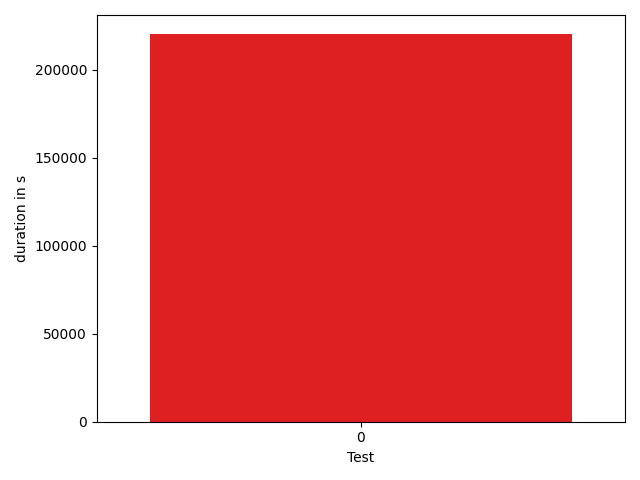

# gson 80bbf4

https://github.com/google/gson/commit/80bbf4

## Delta Energy per test method

| ID | EnergyV1 | EnergyV2 | DeltaEnergy |
| --- | --- | --- | --- |
| 0 | 82796.96495362064 | 101491.04471896478 | 18694.07976534414 |

## Delta Duration per test method

| ID | DurationV1 | DurationsV2 | DeltaDuration |
| --- | --- | --- | --- |
| 0 | 2818196.524170235 | 3578693.6825303654 | 760497.1583601306 |

## Misc.

| ID | Test Class | Test Method |
| --- | --- | --- |
| 0 | com.google.gson.JsonArrayTest | testSet |

| Test | IterationV1 | IterationV2 | DeltaIteration |
| --- | --- | --- | --- |
| 0 | 99 | 99 | 0 |

| Time Label | Time (s) |
| --- | --- |
| Selection | 27.144443035125732 |
| Injection | 10.042105674743652 |
| Total | 983.8954255580902 |

