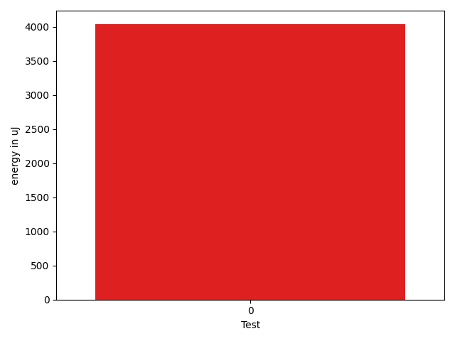

# gson 80bbf4

https://github.com/google/gson/commit/80bbf4

## Delta Energy per test method

| ID | EnergyV1 | EnergyV2 | DeltaEnergy | σV1 | σV2 |
| --- | --- | --- | --- | --- | --- |
| 0 | 74990.43434343435 | 79027.33333333333 | 4036.898989898982 | 20318.881272473667 | 24153.45840054941 |

## Delta Duration per test method

| ID | DurationV1 | DurationsV2 | DeltaDuration |
| --- | --- | --- | --- |
| 0 | 2923287.898989899 | 3143344.4646464647 | 220056.5656565656 |

## Misc.

| ID | Test Class | Test Method |
| --- | --- | --- |
| 0 | com.google.gson.JsonArrayTest | testSet |

| Test | IterationV1 | IterationV2 | DeltaIteration |
| --- | --- | --- | --- |
| 0 | 99 | 99 | 0 |

| Time Label | Time (s) |
| --- | --- |
| Selection | 27.144443035125732 |
| Injection | 10.042105674743652 |
| Total | 983.8954255580902 |

