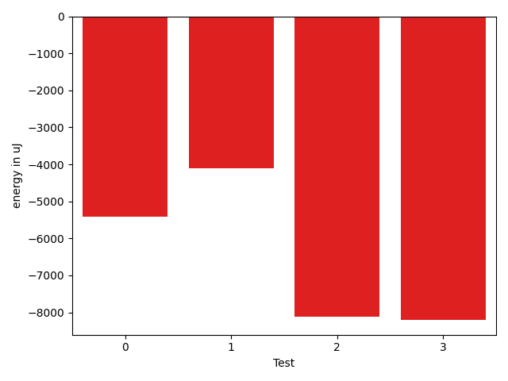

# gson 9bbdca

https://github.com/google/gson/commit/9bbdca

## Delta Energy per test method

| ID | EnergyV1 | EnergyV2 | DeltaEnergy | σV1 | σV2 |
| --- | --- | --- | --- | --- | --- |
| 0 | 43396 | 42419 | -977 | 25074.87218276145 | 26684.153843139273 |
| 1 | 37903 | 37232 | -671 | 68230.28498268114 | 48506.79750303044 |
| 2 | 36743 | 37476 | 733 | 38131.881835110275 | 56622.44417793707 |
| 3 | 39185 | 41138 | 1953 | 16235.730141677628 | 97751.94240357516 |

## Delta Duration per test method

| ID | DurationV1 | DurationsV2 | DeltaDuration |
| --- | --- | --- | --- |
| 0 | 2155248.285714286 | 1830641.5675675676 | -324606.71814671834 |
| 1 | 2364185.5897435895 | 1709315.6 | -654869.9897435894 |
| 2 | 1597866.7450980393 | 2004668.58 | 406801.8349019608 |
| 3 | 1192380.5526315789 | 1743645.71875 | 551265.1661184211 |

## Misc.

| ID | Test Class | Test Method |
| --- | --- | --- |
| 0 | com.google.gson.JsonArrayTest | testDeepCopy |
| 1 | com.google.gson.JsonObjectTest | testDeepCopy |
| 2 | com.google.gson.JsonParserTest | testParseMixedArray |
| 3 | com.google.gson.JsonParserTest | testParseUnquotedStringArrayFails |

| Test | IterationV1 | IterationV2 | DeltaIteration |
| --- | --- | --- | --- |
| 0 | 56 | 37 | -19 |
| 1 | 39 | 45 | 6 |
| 2 | 51 | 50 | -1 |
| 3 | 38 | 32 | -6 |

| Time Label | Time (s) |
| --- | --- |
| Selection | 27.45221495628357 |
| Injection | 10.508826971054077 |
| Total | 987.676027059555 |

