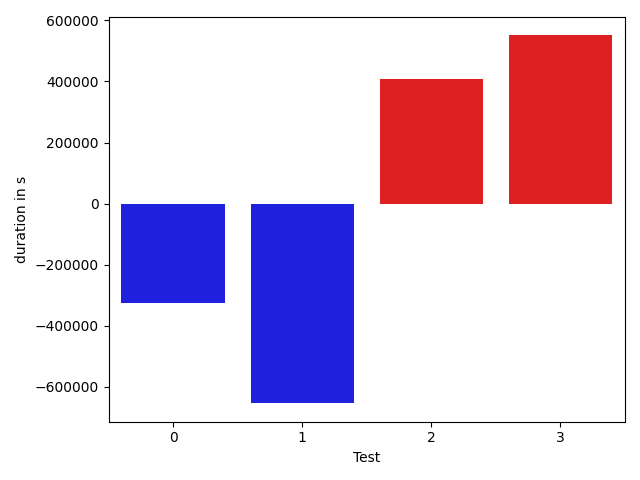

# gson 9bbdca

https://github.com/google/gson/commit/9bbdca

## Delta Energy per test method

| ID | EnergyV1 | EnergyV2 | DeltaEnergy |
| --- | --- | --- | --- |
| 0 | 58370.783178098165 | 52961.82186223102 | -5408.961315867142 |
| 1 | 77671.05277365344 | 73570.97409639502 | -4100.078677258425 |
| 2 | 49905.43885471075 | 41785.77887827746 | -8119.659976433293 |
| 3 | 42264.904468874214 | 34070.29566930281 | -8194.608799571404 |

## Delta Duration per test method

| ID | DurationV1 | DurationsV2 | DeltaDuration |
| --- | --- | --- | --- |
| 0 | 1737034.9769076328 | 1956951.2118781102 | 219916.2349704774 |
| 1 | 3359348.379879473 | 1971725.9074927499 | -1387622.472386723 |
| 2 | 1584901.9349401137 | 1392305.1007872978 | -192596.83415281586 |
| 3 | 2061456.014459887 | 950287.2064688331 | -1111168.807991054 |

## Misc.

| ID | Test Class | Test Method |
| --- | --- | --- |
| 0 | com.google.gson.JsonArrayTest | testDeepCopy |
| 1 | com.google.gson.JsonObjectTest | testDeepCopy |
| 2 | com.google.gson.JsonParserTest | testParseMixedArray |
| 3 | com.google.gson.JsonParserTest | testParseUnquotedStringArrayFails |

| Test | IterationV1 | IterationV2 | DeltaIteration |
| --- | --- | --- | --- |
| 0 | 56 | 37 | -19 |
| 1 | 39 | 45 | 6 |
| 2 | 51 | 50 | -1 |
| 3 | 38 | 32 | -6 |

| Time Label | Time (s) |
| --- | --- |
| Selection | 27.45221495628357 |
| Injection | 10.508826971054077 |
| Total | 987.676027059555 |

