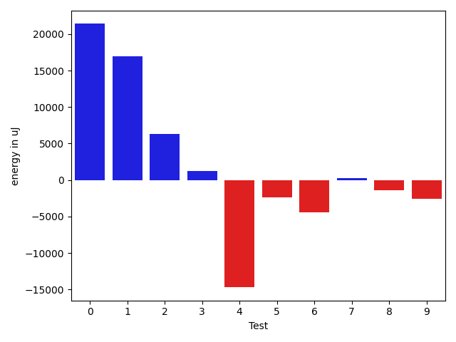
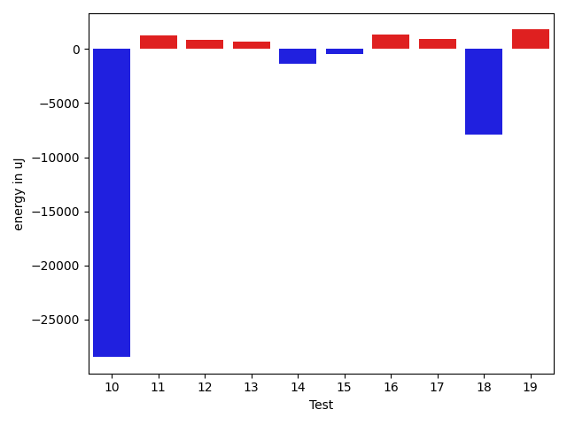
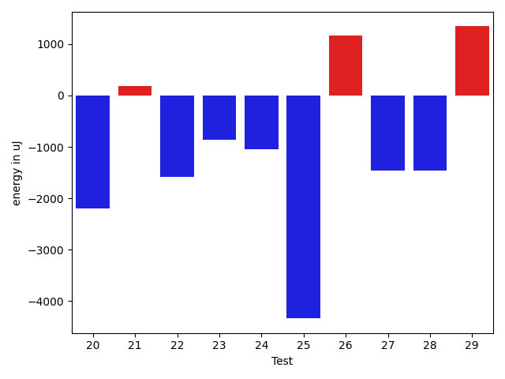
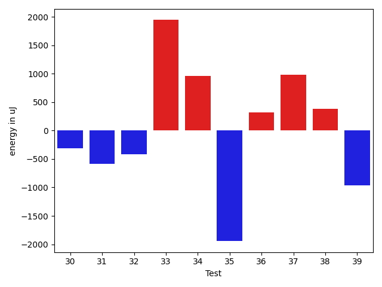
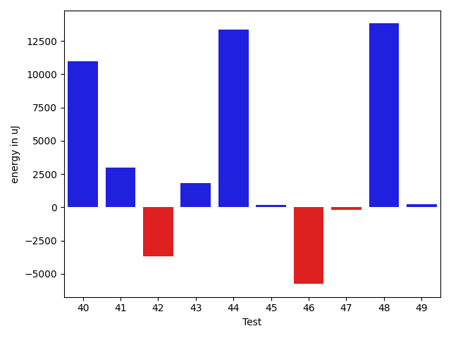
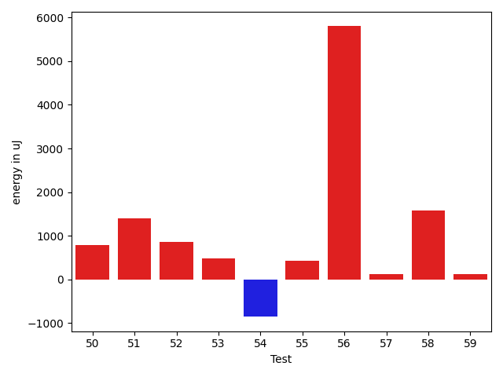
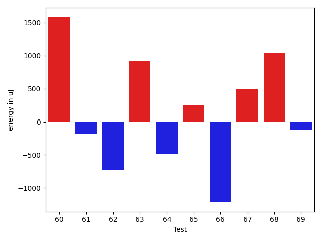
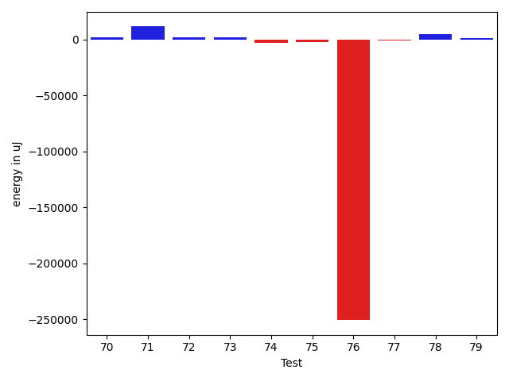
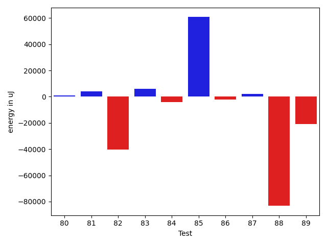
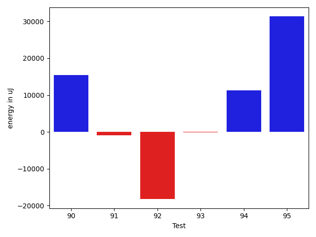

# gson 14ba59

https://github.com/google/gson/commit/14ba59

## Delta Energy per test method

| ID | EnergyV1 | EnergyV2 | DeltaEnergy | σV1 | σV2 |
| --- | --- | --- | --- | --- | --- |
| 0 | 39001 | 37842 | -1159 | 11561.532112766728 | 8413.13970308233 |
| 1 | 39246 | 39002 | -244 | 25357.687246560454 | 16489.410344195345 |
| 2 | 39123 | 37170 | -1953 | 4837.680733378255 | 4084.708018566171 |
| 3 | 39246 | 36560 | -2686 | 4739.217584158803 | 4299.243877253275 |
| 4 | 37902 | 37902 | 0 | 9807.100189231913 | 12414.972276615674 |
| 5 | 38391 | 38452 | 61 | 13530.051468346071 | 13063.249838614393 |
| 6 | 36499 | 36377 | -122 | 3832.3272944984647 | 3286.044180190928 |
| 7 | 44129 | 42541 | -1588 | 35388.946536980235 | 33054.92299586901 |
| 8 | 41015 | 40772 | -243 | 17251.26357351748 | 20988.799890128896 |
| 9 | 34607 | 36499 | 1892 | 3724.431959963828 | 3317.1308356423374 |
| 10 | 398558 | 401610 | 3052 | 286339.5070380402 | 261004.28103018083 |
| 11 | 36316 | 36743 | 427 | 8995.6351804261 | 10816.068388384341 |
| 12 | 37171 | 37048 | -123 | 3832.154910363611 | 3601.949349098261 |
| 13 | 35950 | 35705 | -245 | 3947.043673308261 | 4126.560155763612 |
| 14 | 35583 | 36560 | 977 | 13194.406621031516 | 8438.089522287428 |
| 15 | 36682 | 36194 | -488 | 3890.772387810234 | 4218.426279547425 |
| 16 | 35034 | 36866 | 1832 | 7911.131811287974 | 9480.846079644612 |
| 17 | 35339 | 36621 | 1282 | 6945.458184207247 | 7239.548145082759 |
| 18 | 73181 | 73181 | 0 | 88117.18757276531 | 84463.49111183545 |
| 19 | 35522 | 36438 | 916 | 6959.133727475339 | 8271.06396091552 |
| 20 | 72326 | 70129 | -2197 | 29805.173737122394 | 31505.39305209835 |
| 21 | 36011 | 36194 | 183 | 7850.824503451299 | 7485.932615907507 |
| 22 | 38208 | 36621 | -1587 | 53146.468555972235 | 45906.29587750551 |
| 23 | 37598 | 36743 | -855 | 14682.711790807409 | 13078.54080752375 |
| 24 | 37537 | 36499 | -1038 | 12045.746958747313 | 7874.643543911868 |
| 25 | 76111 | 71777 | -4334 | 38690.3838820041 | 41402.52599607206 |
| 26 | 35034 | 36193 | 1159 | 7888.232218627624 | 9743.590392208538 |
| 27 | 36499 | 35034 | -1465 | 4233.4269347817535 | 3636.912335192801 |
| 28 | 36682 | 35218 | -1464 | 4284.039963618049 | 3743.58915507344 |
| 29 | 35828 | 37170 | 1342 | 13242.119592044171 | 13983.372144974212 |
| 30 | 36011 | 35950 | -61 | 4153.7689355572 | 3590.5277289159735 |
| 31 | 35584 | 34729 | -855 | 2627.2074403061515 | 4688.034918138941 |
| 32 | 36255 | 35644 | -611 | 4171.235269720001 | 4012.570815758806 |
| 33 | 36133 | 37170 | 1037 | 9928.465781763896 | 11513.543661615391 |
| 34 | 38757 | 39490 | 733 | 90685.66462803009 | 76060.85704259729 |
| 35 | 37415 | 35095 | -2320 | 4631.912973103013 | 3737.3758845470106 |
| 36 | 36987 | 36743 | -244 | 2878.6049156471286 | 3524.243979836929 |
| 37 | 34973 | 35766 | 793 | 33217.5760226767 | 26440.672095288952 |
| 38 | 35034 | 35827 | 793 | 3733.1506242364803 | 4093.8438492937175 |
| 39 | 36438 | 35278 | -1160 | 3837.2544493006567 | 3247.916369777614 |
| 40 | 36682 | 37354 | 672 | 12576.226542042928 | 10760.496095947741 |
| 41 | 36132 | 35828 | -304 | 4271.5596052302835 | 3834.0867937325243 |
| 42 | 37048 | 36193 | -855 | 4235.715238095131 | 4293.276458775895 |
| 43 | 72144 | 74890 | 2746 | 70944.51257742746 | 67858.3681172572 |
| 44 | 39246 | 39368 | 122 | 60717.25108737628 | 54218.806634119006 |
| 45 | 38514 | 39184 | 670 | 21542.949812416762 | 12276.500252073649 |
| 46 | 70983 | 72937 | 1954 | 84416.53813871056 | 57028.011994826345 |
| 47 | 62561 | 69763 | 7202 | 34526.61853764457 | 37522.01950554195 |
| 48 | 36377 | 37537 | 1160 | 6479.682970258786 | 3858.2954292692434 |
| 49 | 36926 | 36499 | -427 | 4107.083060918918 | 6933.261153591816 |
| 50 | 36377 | 37170 | 793 | 13979.701913691266 | 18747.796176884367 |
| 51 | 36560 | 37963 | 1403 | 3758.119356057628 | 4081.605326032883 |
| 52 | 38819 | 39673 | 854 | 116123.46702033927 | 126655.98466195868 |
| 53 | 37659 | 38147 | 488 | 3987.9077174381523 | 3847.395633754054 |
| 54 | 37536 | 36682 | -854 | 4548.807995752539 | 5909.883466490689 |
| 55 | 39002 | 39428 | 426 | 24079.557396494976 | 74411.04960067567 |
| 56 | 65186 | 70984 | 5798 | 371055.48523228714 | 394502.53352904494 |
| 57 | 37537 | 37659 | 122 | 16215.616013637235 | 14808.62305352239 |
| 58 | 36193 | 37780 | 1587 | 4522.927508140655 | 4249.093169353908 |
| 59 | 37231 | 37354 | 123 | 10139.292158803273 | 14563.895037723853 |
| 60 | 36133 | 37720 | 1587 | 5423.843850025429 | 11051.426110433662 |
| 61 | 38330 | 38147 | -183 | 35348.05743847311 | 27542.08896578399 |
| 62 | 38330 | 37597 | -733 | 110952.61939203313 | 85613.24311108016 |
| 63 | 36743 | 37659 | 916 | 5963.04355612488 | 10979.837983319536 |
| 64 | 37658 | 37170 | -488 | 10182.108906539257 | 10587.873805672401 |
| 65 | 37841 | 38085 | 244 | 12414.319242462734 | 11367.26992504314 |
| 66 | 38452 | 37232 | -1220 | 15792.959341418815 | 22160.35118155847 |
| 67 | 38330 | 38818 | 488 | 249685.6067295559 | 315334.0619511886 |
| 68 | 36010 | 37048 | 1038 | 7799.578242892248 | 5896.652404287505 |
| 69 | 36682 | 36560 | -122 | 5971.2351188257135 | 6386.303417296733 |
| 70 | 36621 | 37842 | 1221 | 3609.832770104632 | 4560.98862041992 |
| 71 | 39551 | 38574 | -977 | 19001.792207637212 | 17762.950335228194 |
| 72 | 42663 | 67749 | 25086 | 22403.411109791996 | 20796.490120177514 |
| 73 | 37049 | 35461 | -1588 | 8230.736198877363 | 5050.099673823829 |
| 74 | 36132 | 37170 | 1038 | 13862.878255429867 | 9069.897725990322 |
| 75 | 36560 | 37414 | 854 | 8138.90620552629 | 3963.9046186304736 |
| 76 | 35278 | 36438 | 1160 | 4162.854724111344 | 4202.178219403238 |
| 77 | 37109 | 37903 | 794 | 12420.420391497324 | 12307.501048876622 |
| 78 | 34729 | 38330 | 3601 | 3786.926341740567 | 4299.345676788586 |
| 79 | 36865 | 37842 | 977 | 8866.1106254814 | 3964.9005618434016 |
| 80 | 35950 | 36011 | 61 | 4393.01516848639 | 3122.914055813896 |
| 81 | 36437 | 35522 | -915 | 3744.5326894529644 | 4521.736829934232 |
| 82 | 36194 | 35584 | -610 | 3618.165649423291 | 4527.52473322465 |
| 83 | 37658 | 39307 | 1649 | 10575.837653671579 | 18769.016073897485 |
| 84 | 42114 | 39672 | -2442 | 19944.817131571283 | 24242.45684062187 |
| 85 | 41137 | 41381 | 244 | 137502.48746835228 | 110801.12547258999 |
| 86 | 37903 | 39185 | 1282 | 4689.266946102721 | 9285.492347965019 |
| 87 | 36804 | 38024 | 1220 | 26174.78721470144 | 24866.00622628815 |
| 88 | 349731 | 347472 | -2259 | 48882.19490048656 | 48088.18408722093 |
| 89 | 61584 | 62805 | 1221 | 19009.46204150549 | 19418.900504902544 |
| 90 | 43030 | 41870 | -1160 | 110069.13735771793 | 80326.63934101869 |
| 91 | 39001 | 38941 | -60 | 75283.58189599364 | 80427.60467448451 |
| 92 | 38513 | 37353 | -1160 | 28277.01565027086 | 32707.589989605873 |
| 93 | 38818 | 38757 | -61 | 9022.3779286474 | 7741.6597297919325 |
| 94 | 38086 | 37231 | -855 | 8312.853527540363 | 15307.119698166138 |
| 95 | 37964 | 39978 | 2014 | 59892.02616008973 | 94824.98687138775 |

## Delta Duration per test method

| ID | DurationV1 | DurationsV2 | DeltaDuration |
| --- | --- | --- | --- |
| 0 | 1158259.7727272727 | 1038464.5138888889 | -119795.25883838383 |
| 1 | 1449577.7625 | 1324747.487804878 | -124830.27469512192 |
| 2 | 551684.9545454546 | 531915.8928571428 | -19769.061688311747 |
| 3 | 708029.7 | 627738.6428571428 | -80291.05714285711 |
| 4 | 1314086.8279569892 | 1306771.0444444444 | -7315.783512544818 |
| 5 | 1309056.9375 | 1304806.626506024 | -4250.31099397596 |
| 6 | 695694.3488372093 | 712666.1944444445 | 16971.845607235213 |
| 7 | 2008050.2525252525 | 1879911.7171717172 | -128138.53535353532 |
| 8 | 1623375.0808080807 | 1689025.2525252525 | 65650.17171717179 |
| 9 | 836288.28 | 843169.25 | 6880.969999999972 |
| 10 | 10844317.95959596 | 9588359.97979798 | -1255957.9797979798 |
| 11 | 1324366.7261904762 | 1250927.0760869565 | -73439.65010351967 |
| 12 | 765118.8709677419 | 810461.6857142857 | 45342.814746543765 |
| 13 | 774244.1052631579 | 830422.0277777778 | 56177.92251461989 |
| 14 | 1203414.1379310344 | 1193765.6593406594 | -9648.478590375045 |
| 15 | 933000.8888888889 | 911556.9692307692 | -21443.919658119674 |
| 16 | 1232212.9047619049 | 1195912.2023809524 | -36300.702380952425 |
| 17 | 1042622.2428571428 | 1025974.3661971831 | -16647.87665995967 |
| 18 | 2822337.3131313133 | 2541049.232323232 | -281288.0808080812 |
| 19 | 1208844.3837209302 | 1168083.2555555555 | -40761.12816537474 |
| 20 | 2392947.3636363638 | 2229695.111111111 | -163252.25252525276 |
| 21 | 1255285.1744186047 | 1217225.4157303371 | -38059.75868826755 |
| 22 | 1839289.0476190476 | 1522020.1294117647 | -317268.9182072829 |
| 23 | 1419984.2765957448 | 1386569.505376344 | -33414.77121940069 |
| 24 | 1233935.5853658537 | 1173211.125 | -60724.46036585374 |
| 25 | 2728756.212121212 | 2504840.757575758 | -223915.45454545412 |
| 26 | 1188454.3409090908 | 1189002.2222222222 | 547.8813131314237 |
| 27 | 670695.7073170731 | 705564.5714285715 | 34868.86411149835 |
| 28 | 760029.7555555556 | 747318.3454545455 | -12711.410101010115 |
| 29 | 1222904.0857142857 | 1186311.4342105263 | -36592.651503759436 |
| 30 | 799949.24 | 759334.3859649122 | -40614.854035087745 |
| 31 | 615303.08 | 618904.0 | 3600.920000000042 |
| 32 | 1000545.7049180327 | 901597.5538461539 | -98948.15107187885 |
| 33 | 1051090.9677419355 | 1031080.7941176471 | -20010.173624288407 |
| 34 | 1813240.4393939395 | 1896096.142857143 | 82855.7034632035 |
| 35 | 851117.94 | 827737.5396825396 | -23380.4003174603 |
| 36 | 854925.6315789474 | 876814.5762711865 | 21888.94469223905 |
| 37 | 964374.3478260869 | 1064837.9807692308 | 100463.63294314384 |
| 38 | 787052.0392156863 | 767035.58 | -20016.459215686307 |
| 39 | 818718.0909090909 | 793464.9459459459 | -25253.144963145023 |
| 40 | 1187869.5238095238 | 1067599.5915492957 | -120269.93226022809 |
| 41 | 791188.0243902439 | 718832.1276595745 | -72355.89673066942 |
| 42 | 478394.7619047619 | 492494.46153846156 | 14099.699633699667 |
| 43 | 2830686.350515464 | 2665710.1515151514 | -164976.19900031248 |
| 44 | 1716611.0512820513 | 1770184.7710843373 | 53573.71980228601 |
| 45 | 1260203.7301587302 | 1139548.9242424243 | -120654.80591630586 |
| 46 | 2591805.05 | 2342767.595238095 | -249037.45476190466 |
| 47 | 1969497.391304348 | 2015846.3595505618 | 46348.96824621386 |
| 48 | 1045084.1666666666 | 1029584.5211267605 | -15499.645539906109 |
| 49 | 931677.09375 | 929609.0 | -2068.09375 |
| 50 | 1051901.25 | 1078257.48 | 26356.22999999998 |
| 51 | 837746.225 | 850718.125 | 12971.900000000023 |
| 52 | 2422918.906976744 | 2564929.4943820224 | 142010.58740527835 |
| 53 | 567562.8235294118 | 629809.9705882353 | 62247.147058823495 |
| 54 | 603554.8666666667 | 663445.75 | 59890.8833333333 |
| 55 | 1476587.030927835 | 2014645.3232323232 | 538058.2923044881 |
| 56 | 4172009.01010101 | 4413815.545454546 | 241806.5353535358 |
| 57 | 1291684.4333333333 | 1305540.5764705883 | 13856.143137254985 |
| 58 | 939041.1186440678 | 959265.813559322 | 20224.69491525425 |
| 59 | 1214223.8620689656 | 1311435.6666666667 | 97211.80459770118 |
| 60 | 1152592.268292683 | 1238015.625 | 85423.35670731706 |
| 61 | 1300050.6375 | 1360970.6621621621 | 60920.02466216218 |
| 62 | 2360600.777777778 | 1677487.75 | -683113.027777778 |
| 63 | 1152569.698630137 | 1192555.3780487804 | 39985.67941864347 |
| 64 | 1090087.5131578948 | 1179014.15 | 88926.63684210507 |
| 65 | 1274188.923076923 | 1327260.594936709 | 53071.671859785914 |
| 66 | 953933.3921568628 | 1176351.72 | 222418.3278431372 |
| 67 | 2369243.1754385964 | 3045242.0 | 675998.8245614036 |
| 68 | 983597.9016393443 | 943075.3088235294 | -40522.59281581489 |
| 69 | 874069.2181818181 | 902752.3265306122 | 28683.10834879405 |
| 70 | 907865.8103448276 | 931663.58 | 23797.769655172364 |
| 71 | 1298592.48 | 1419203.1830985916 | 120610.70309859165 |
| 72 | 1849561.4343434344 | 1882358.0303030303 | 32796.59595959587 |
| 73 | 1014402.3428571429 | 862188.5666666667 | -152213.77619047626 |
| 74 | 1161551.4852941176 | 1117011.4782608696 | -44540.007033247966 |
| 75 | 881935.8793103448 | 875140.18 | -6795.69931034476 |
| 76 | 820308.1176470588 | 845143.0701754387 | 24834.952528379858 |
| 77 | 1080899.6610169492 | 1051976.8 | -28922.861016949173 |
| 78 | 504575.95454545453 | 496207.6153846154 | -8368.339160839154 |
| 79 | 1099492.1153846155 | 1115574.5428571429 | 16082.427472527372 |
| 80 | 608059.2580645161 | 581390.8 | -26668.458064516075 |
| 81 | 477140.2173913043 | 494314.5238095238 | 17174.306418219465 |
| 82 | 649382.8888888889 | 651904.125 | 2521.236111111124 |
| 83 | 692232.8148148148 | 782543.9 | 90311.08518518519 |
| 84 | 1365467.1929824562 | 1309906.4776119404 | -55560.71537051583 |
| 85 | 2903034.8055555555 | 2215021.2784810127 | -688013.5270745428 |
| 86 | 966202.8571428572 | 1122508.603174603 | 156305.74603174592 |
| 87 | 1149162.5857142857 | 1354159.223880597 | 204996.6381663112 |
| 88 | 10743043.373737374 | 10719105.282828283 | -23938.090909091756 |
| 89 | 1966730.2626262626 | 2000086.5555555555 | 33356.29292929289 |
| 90 | 2337264.626262626 | 2088272.2978723405 | -248992.3283902856 |
| 91 | 2059029.5340909092 | 2110097.5604395606 | 51068.02634865139 |
| 92 | 1432301.8170731708 | 1461548.905882353 | 29247.08880918217 |
| 93 | 1208069.0875 | 1203412.4285714286 | -4656.658928571269 |
| 94 | 976051.8269230769 | 947419.0877192982 | -28632.739203778678 |
| 95 | 1610531.1290322582 | 2257482.1818181816 | 646951.0527859235 |

## Misc.

| ID | Test Class | Test Method |
| --- | --- | --- |
| 0 | com.google.gson.functional.CustomTypeAdaptersTest | testCustomAdapterInvokedForCollectionElementDeserialization |
| 1 | com.google.gson.functional.CustomTypeAdaptersTest | testCustomAdapterInvokedForCollectionElementSerializationWithType |
| 2 | com.google.gson.functional.CustomTypeAdaptersTest | testCustomAdapterInvokedForMapElementSerialization |
| 3 | com.google.gson.functional.CustomTypeAdaptersTest | testCustomAdapterInvokedForCollectionElementSerialization |
| 4 | com.google.gson.functional.StreamingTypeAdaptersTest | testNullSafe |
| 5 | com.google.gson.functional.StreamingTypeAdaptersTest | testSerializeWithCustomTypeAdapter |
| 6 | com.google.gson.functional.StreamingTypeAdaptersTest | testDeserializeWithCustomTypeAdapter |
| 7 | com.google.gson.functional.InstanceCreatorTest | testInstanceCreatorForParametrizedType |
| 8 | com.google.gson.functional.InstanceCreatorTest | testInstanceCreatorForCollectionType |
| 9 | com.google.gson.functional.DefaultTypeAdaptersTest | testTreeSetDeserialization |
| 10 | com.google.gson.functional.DefaultTypeAdaptersTest | testNullSerialization |
| 11 | com.google.gson.functional.DefaultTypeAdaptersTest | testDateSerializationInCollection |
| 12 | com.google.gson.functional.DefaultTypeAdaptersTest | testSetSerialization |
| 13 | com.google.gson.functional.DefaultTypeAdaptersTest | testTreeSetSerialization |
| 14 | com.google.gson.functional.ParameterizedTypesTest | testParameterizedTypeGenericArraysSerialization |
| 15 | com.google.gson.functional.ParameterizedTypesTest | testParameterizedTypesWithWriterSerialization |
| 16 | com.google.gson.functional.ParameterizedTypesTest | testVariableTypeArrayDeserialization |
| 17 | com.google.gson.functional.ParameterizedTypesTest | testParameterizedTypeWithReaderDeserialization |
| 18 | com.google.gson.functional.ParameterizedTypesTest | testParameterizedTypesSerialization |
| 19 | com.google.gson.functional.ParameterizedTypesTest | testVariableTypeDeserialization |
| 20 | com.google.gson.functional.ParameterizedTypesTest | testVariableTypeFieldsAndGenericArraysSerialization |
| 21 | com.google.gson.functional.ParameterizedTypesTest | testParameterizedTypeGenericArraysDeserialization |
| 22 | com.google.gson.functional.ParameterizedTypesTest | testParameterizedTypeDeserialization |
| 23 | com.google.gson.functional.ParameterizedTypesTest | testVariableTypeFieldsAndGenericArraysDeserialization |
| 24 | com.google.gson.functional.ParameterizedTypesTest | testTypesWithMultipleParametersDeserialization |
| 25 | com.google.gson.functional.ParameterizedTypesTest | testTypesWithMultipleParametersSerialization |
| 26 | com.google.gson.functional.ParameterizedTypesTest | testParameterizedTypeWithVariableTypeDeserialization |
| 27 | com.google.gson.functional.CollectionTest | testRawCollectionSerialization |
| 28 | com.google.gson.functional.CollectionTest | testNullsInListSerialization |
| 29 | com.google.gson.functional.CollectionTest | testWildcardPrimitiveCollectionSerilaization |
| 30 | com.google.gson.functional.CollectionTest | testQueueDeserialization |
| 31 | com.google.gson.functional.CollectionTest | testRawCollectionOfIntegersSerialization |
| 32 | com.google.gson.functional.CollectionTest | testQueueSerialization |
| 33 | com.google.gson.functional.CollectionTest | testSetDeserialization |
| 34 | com.google.gson.functional.CollectionTest | testSetSerialization |
| 35 | com.google.gson.functional.CollectionTest | testCollectionOfObjectSerialization |
| 36 | com.google.gson.functional.CollectionTest | testFieldIsArrayList |
| 37 | com.google.gson.functional.CollectionTest | testCollectionOfBagOfPrimitivesSerialization |
| 38 | com.google.gson.functional.CollectionTest | testLinkedListDeserialization |
| 39 | com.google.gson.functional.CollectionTest | testCollectionOfObjectWithNullSerialization |
| 40 | com.google.gson.functional.CollectionTest | testLinkedListSerialization |
| 41 | com.google.gson.functional.CollectionTest | testNullsInListDeserialization |
| 42 | com.google.gson.functional.CollectionTest | testCollectionOfStringsSerialization |
| 43 | com.google.gson.functional.InheritanceTest | testSubInterfacesOfCollectionSerialization |
| 44 | com.google.gson.functional.InheritanceTest | testSubInterfacesOfCollectionDeserialization |
| 45 | com.google.gson.functional.JsonParserTest | testExtraCommasInArrays |
| 46 | com.google.gson.functional.EnumTest | testEnumSubclass |
| 47 | com.google.gson.functional.EnumTest | testEnumSubclassWithRegisteredTypeAdapter |
| 48 | com.google.gson.functional.EnumTest | testEnumSet |
| 49 | com.google.gson.functional.EnumTest | testEnumSubclassAsParameterizedType |
| 50 | com.google.gson.functional.EnumTest | testCollectionOfEnumsSerialization |
| 51 | com.google.gson.functional.PrettyPrintingTest | testPrettyPrintListOfPrimitiveArrays |
| 52 | com.google.gson.functional.PrettyPrintingTest | testPrettyPrintList |
| 53 | com.google.gson.functional.PrettyPrintingTest | testMap |
| 54 | com.google.gson.ObjectTypeAdapterTest | testSerializeNullValue |
| 55 | com.google.gson.ObjectTypeAdapterTest | testSerialize |
| 56 | com.google.gson.functional.TypeVariableTest | testAdvancedTypeVariables |
| 57 | com.google.gson.functional.TypeVariableTest | testTypeVariablesViaTypeParameter |
| 58 | com.google.gson.functional.TypeVariableTest | testBasicTypeVariables |
| 59 | com.google.gson.functional.RawSerializationTest | testThreeLevelParameterizedObject |
| 60 | com.google.gson.functional.RawSerializationTest | testParameterizedObject |
| 61 | com.google.gson.functional.RawSerializationTest | testCollectionOfObjects |
| 62 | com.google.gson.functional.RawSerializationTest | testCollectionOfPrimitives |
| 63 | com.google.gson.functional.RawSerializationTest | testTwoLevelParameterizedObject |
| 64 | com.google.gson.functional.MapAsArrayTypeAdapterTest | testMapWithTypeVariableDeserialization |
| 65 | com.google.gson.functional.MapAsArrayTypeAdapterTest | testMapWithTypeVariableSerialization |
| 66 | com.google.gson.functional.UncategorizedTest | testTrailingWhitespace |
| 67 | com.google.gson.CommentsTest | testParseComments |
| 68 | com.google.gson.functional.MoreSpecificTypeSerializationTest | testListOfParameterizedSubclassFields |
| 69 | com.google.gson.functional.MoreSpecificTypeSerializationTest | testMapOfParameterizedSubclassFields |
| 70 | com.google.gson.functional.MoreSpecificTypeSerializationTest | testParameterizedSubclassFields |
| 71 | com.google.gson.functional.ArrayTest | testArrayOfCollectionSerialization |
| 72 | com.google.gson.functional.MapTest | testParameterizedMapSubclassSerialization |
| 73 | com.google.gson.functional.MapTest | testRawMapSerialization |
| 74 | com.google.gson.functional.MapTest | testSerializeMaps |
| 75 | com.google.gson.functional.MapTest | testHashMapDeserialization |
| 76 | com.google.gson.functional.MapTest | testMapStandardSubclassDeserialization |
| 77 | com.google.gson.functional.MapTest | testMapSubclassDeserialization |
| 78 | com.google.gson.functional.MapTest | testMapWithQuotes |
| 79 | com.google.gson.functional.MapTest | testSortedMap |
| 80 | com.google.gson.functional.MapTest | testMapOfMapSerialization |
| 81 | com.google.gson.functional.MapTest | testWriteMapsWithEmptyStringKey |
| 82 | com.google.gson.functional.MapTest | testMapSubclassSerialization |
| 83 | com.google.gson.functional.EscapingTest | testEscapeAllHtmlCharacters |
| 84 | com.google.gson.functional.PrimitiveTest | testStringsAsBooleans |
| 85 | com.google.gson.functional.PrintFormattingTest | testCompactFormattingLeavesNoWhiteSpace |
| 86 | com.google.gson.MixedStreamTest | testWriteHtmlSafe |
| 87 | com.google.gson.MixedStreamTest | testWriteLenient |
| 88 | com.google.gson.JavaSerializationTest | testNumberIsSerializable |
| 89 | com.google.gson.JavaSerializationTest | testListIsSerializable |
| 90 | com.google.gson.functional.DelegateTypeAdapterTest | testDelegateInvoked |
| 91 | com.google.gson.functional.TreeTypeAdaptersTest | testSerializeId |
| 92 | com.google.gson.functional.TreeTypeAdaptersTest | testDeserializeId |
| 93 | com.google.gson.functional.ObjectTest | testSingletonLists |
| 94 | com.google.gson.functional.ObjectTest | testTruncatedDeserialization |
| 95 | com.google.gson.DefaultMapJsonSerializerTest | testEmptyMapNoTypeSerialization |

| Test | IterationV1 | IterationV2 | DeltaIteration |
| --- | --- | --- | --- |
| 0 | 66 | 72 | 6 |
| 1 | 80 | 82 | 2 |
| 2 | 22 | 28 | 6 |
| 3 | 20 | 42 | 22 |
| 4 | 93 | 90 | -3 |
| 5 | 80 | 83 | 3 |
| 6 | 43 | 36 | -7 |
| 7 | 99 | 99 | 0 |
| 8 | 99 | 99 | 0 |
| 9 | 50 | 52 | 2 |
| 10 | 99 | 99 | 0 |
| 11 | 84 | 92 | 8 |
| 12 | 31 | 35 | 4 |
| 13 | 38 | 36 | -2 |
| 14 | 87 | 91 | 4 |
| 15 | 63 | 65 | 2 |
| 16 | 84 | 84 | 0 |
| 17 | 70 | 71 | 1 |
| 18 | 99 | 99 | 0 |
| 19 | 86 | 90 | 4 |
| 20 | 99 | 99 | 0 |
| 21 | 86 | 89 | 3 |
| 22 | 84 | 85 | 1 |
| 23 | 94 | 93 | -1 |
| 24 | 82 | 72 | -10 |
| 25 | 99 | 99 | 0 |
| 26 | 88 | 81 | -7 |
| 27 | 41 | 35 | -6 |
| 28 | 45 | 55 | 10 |
| 29 | 70 | 76 | 6 |
| 30 | 50 | 57 | 7 |
| 31 | 25 | 27 | 2 |
| 32 | 61 | 65 | 4 |
| 33 | 62 | 68 | 6 |
| 34 | 66 | 63 | -3 |
| 35 | 50 | 63 | 13 |
| 36 | 57 | 59 | 2 |
| 37 | 46 | 52 | 6 |
| 38 | 51 | 50 | -1 |
| 39 | 44 | 37 | -7 |
| 40 | 63 | 71 | 8 |
| 41 | 41 | 47 | 6 |
| 42 | 21 | 26 | 5 |
| 43 | 97 | 99 | 2 |
| 44 | 78 | 83 | 5 |
| 45 | 63 | 66 | 3 |
| 46 | 80 | 84 | 4 |
| 47 | 92 | 89 | -3 |
| 48 | 72 | 71 | -1 |
| 49 | 64 | 65 | 1 |
| 50 | 56 | 50 | -6 |
| 51 | 40 | 40 | 0 |
| 52 | 86 | 89 | 3 |
| 53 | 34 | 34 | 0 |
| 54 | 30 | 20 | -10 |
| 55 | 97 | 99 | 2 |
| 56 | 99 | 99 | 0 |
| 57 | 90 | 85 | -5 |
| 58 | 59 | 59 | 0 |
| 59 | 87 | 87 | 0 |
| 60 | 82 | 80 | -2 |
| 61 | 80 | 74 | -6 |
| 62 | 27 | 36 | 9 |
| 63 | 73 | 82 | 9 |
| 64 | 76 | 80 | 4 |
| 65 | 78 | 79 | 1 |
| 66 | 51 | 50 | -1 |
| 67 | 57 | 62 | 5 |
| 68 | 61 | 68 | 7 |
| 69 | 55 | 49 | -6 |
| 70 | 58 | 50 | -8 |
| 71 | 75 | 71 | -4 |
| 72 | 99 | 99 | 0 |
| 73 | 35 | 30 | -5 |
| 74 | 68 | 69 | 1 |
| 75 | 58 | 50 | -8 |
| 76 | 51 | 57 | 6 |
| 77 | 59 | 55 | -4 |
| 78 | 22 | 26 | 4 |
| 79 | 78 | 70 | -8 |
| 80 | 31 | 20 | -11 |
| 81 | 23 | 21 | -2 |
| 82 | 27 | 32 | 5 |
| 83 | 27 | 30 | 3 |
| 84 | 57 | 67 | 10 |
| 85 | 72 | 79 | 7 |
| 86 | 63 | 63 | 0 |
| 87 | 70 | 67 | -3 |
| 88 | 99 | 99 | 0 |
| 89 | 99 | 99 | 0 |
| 90 | 99 | 94 | -5 |
| 91 | 88 | 91 | 3 |
| 92 | 82 | 85 | 3 |
| 93 | 80 | 84 | 4 |
| 94 | 52 | 57 | 5 |
| 95 | 31 | 33 | 2 |

| Time Label | Time (s) |
| --- | --- |
| Selection | 27.686508178710938 |
| Injection | 15.77424669265747 |
| Total | 1093.0622773170471 |

