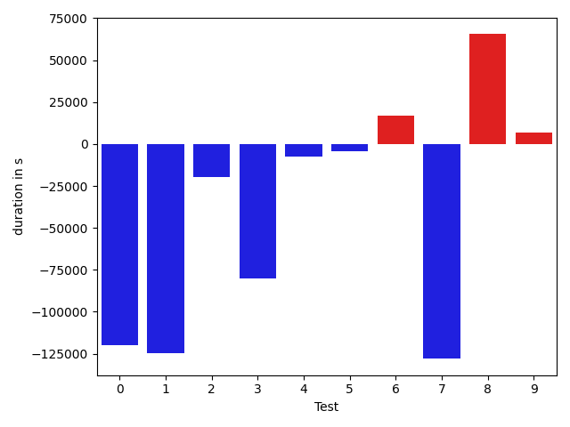
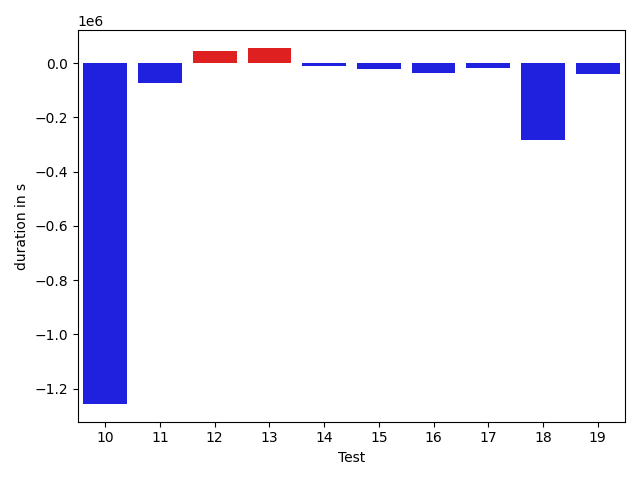
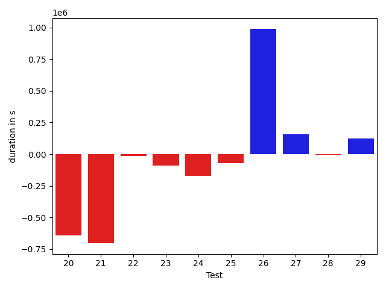
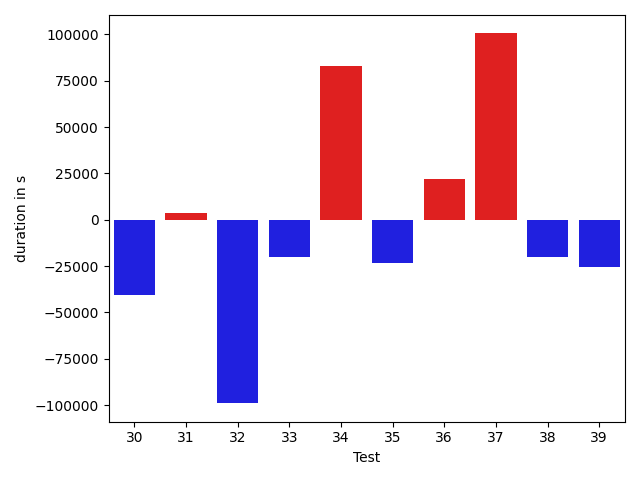
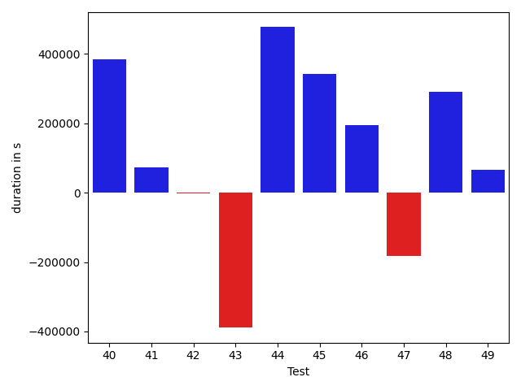
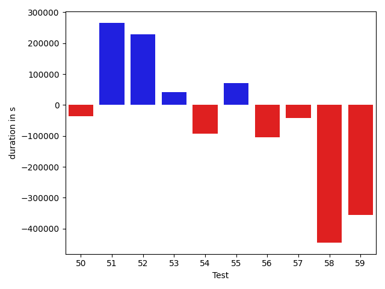
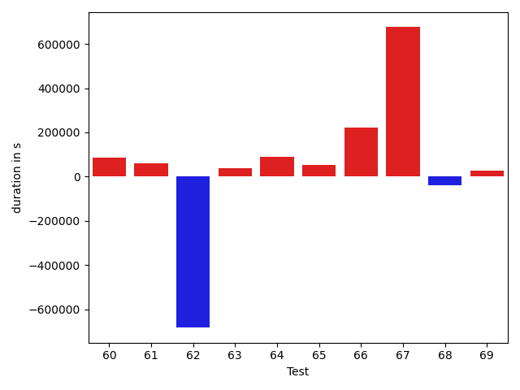
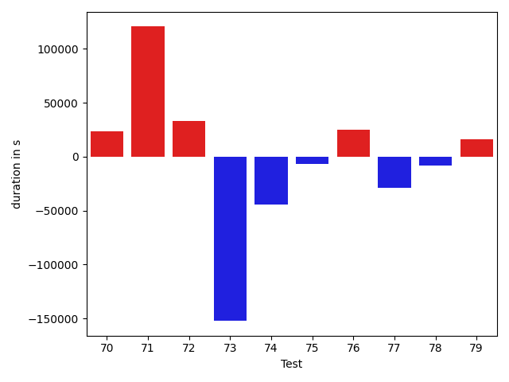
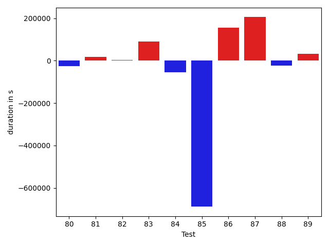
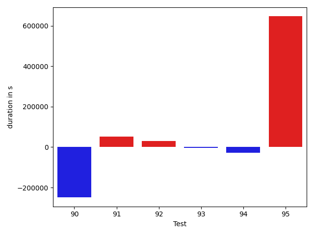

# gson 14ba59

https://github.com/google/gson/commit/14ba59

## Delta Energy per test method

| ID | EnergyV1 | EnergyV2 | DeltaEnergy |
| --- | --- | --- | --- |
| 0 | 40536.27759741197 | 61941.77786613241 | 21405.50026872044 |
| 1 | 42481.500801682625 | 59469.545191532365 | 16988.04438984974 |
| 2 | 35100.88220199571 | 41371.320926116765 | 6270.438724121057 |
| 3 | 34294.01060346207 | 35547.2538278884 | 1253.2432244263327 |
| 4 | 88685.49659542201 | 73982.11287160387 | -14703.383723818144 |
| 5 | 38955.85459297015 | 36537.94048240228 | -2417.914110567872 |
| 6 | 67060.12638178768 | 62653.94268535045 | -4406.183696437227 |
| 7 | 35330.20911882238 | 35604.447635939214 | 274.2385171168353 |
| 8 | 43340.74895170478 | 41952.64549935592 | -1388.1034523488634 |
| 9 | 43220.39426737666 | 40605.85539108008 | -2614.5388762965813 |
| 10 | 55363.61838277725 | 70761.82634427247 | 15398.207961495224 |
| 11 | 35472.574733537214 | 32790.81924795556 | -2681.755485581656 |
| 12 | 35652.240964013414 | 33526.89345628166 | -2125.347507731756 |
| 13 | 36594.23661213568 | 40712.78192402373 | 4118.545311888047 |
| 14 | 35709.266986087394 | 39416.23885406664 | 3706.9718679792495 |
| 15 | 43585.86395432697 | 38698.264350271784 | -4887.599604055184 |
| 16 | 37143.833673341454 | 38709.28770366979 | 1565.4540303283356 |
| 17 | 38748.163271506666 | 37012.99571978806 | -1735.1675517186086 |
| 18 | 44599.65581360691 | 40822.966522039496 | -3776.6892915674107 |
| 19 | 36904.423751156224 | 39285.9342142192 | 2381.5104630629794 |
| 20 | 89145.22503145765 | 44400.93961852188 | -44744.28541293577 |
| 21 | 40989.630547744164 | 37986.922070946544 | -3002.7084767976194 |
| 22 | 33878.9892411232 | 37080.366137355566 | 3201.3768962323666 |
| 23 | 38229.58348201215 | 37885.63846588135 | -343.945016130805 |
| 24 | 39774.01281237602 | 36106.38495159149 | -3667.6278607845306 |
| 25 | 37298.518453761935 | 36872.14821277512 | -426.37024098681286 |
| 26 | 84421.84235297715 | 114098.47017204938 | 29676.627819072222 |
| 27 | 36287.99937761924 | 39703.58561632603 | 3415.58623870679 |
| 28 | 38991.28814511647 | 40674.201144318184 | 1682.9129992017115 |
| 29 | 38000.94304198431 | 39008.16952952248 | 1007.2264875381661 |
| 30 | 89049.78086315314 | 43388.40028885039 | -45661.38057430275 |
| 31 | 40406.701944209766 | 76880.79217304898 | 36474.09022883921 |
| 32 | 33504.31578967145 | 36920.28830594052 | 3415.972516269074 |
| 33 | 36918.74036626884 | 38935.03904632991 | 2016.2986800610743 |
| 34 | 34757.92562013449 | 36277.43895892502 | 1519.5133387905298 |
| 35 | 40566.31825045624 | 37726.780842830616 | -2839.5374076256267 |
| 36 | 40877.52278825875 | 336367.4794365979 | 295489.95664833917 |
| 37 | 39829.311214996196 | 49697.59931619125 | 9868.288101195052 |
| 38 | 38063.14451399166 | 34844.73715019226 | -3218.4073637994006 |
| 39 | 73238.70409246863 | 210276.7245893071 | 137038.02049683846 |
| 40 | 32469.298692530043 | 43441.24140282844 | 10971.942710298397 |
| 41 | 34851.97222176881 | 37850.00801551989 | 2998.035793751078 |
| 42 | 35810.678116486255 | 32132.303121682944 | -3678.374994803311 |
| 43 | 65606.49455525514 | 67434.39330651087 | 1827.898751255736 |
| 44 | 34572.85014065592 | 47930.39256849896 | 13357.542427843036 |
| 45 | 32691.62145340644 | 32875.33341491851 | 183.71196151207187 |
| 46 | 37740.87039086958 | 31979.746552375407 | -5761.123838494175 |
| 47 | 34971.91950273514 | 34785.633015841246 | -186.2864868938923 |
| 48 | 37051.378356117435 | 50856.01904204658 | 13804.640685929146 |
| 49 | 33601.07088929576 | 33825.55579894735 | 224.48490965159 |
| 50 | 34958.82667364002 | 36267.86499408771 | 1309.0383204476893 |
| 51 | 35598.407991859865 | 37606.90734260647 | 2008.499350746606 |
| 52 | 33785.21963112292 | 33144.45406239542 | -640.7655687274964 |
| 53 | 33466.31458567576 | 32926.70050057103 | -539.6140851047312 |
| 54 | 35810.15360275908 | 37147.6053542726 | 1337.451751513523 |
| 55 | 37158.52425479889 | 34040.200209230185 | -3118.3240455687046 |
| 56 | 46609.90155515805 | 34715.84714068152 | -11894.05441447653 |
| 57 | 34473.65939230288 | 33893.97006844077 | -579.6893238621051 |
| 58 | 32631.79355943028 | 37233.06808298829 | 4601.274523558011 |
| 59 | 47455.50909623504 | 34840.6339405264 | -12614.875155708636 |
| 60 | 34501.99997236066 | 40966.73347273473 | 6464.733500374074 |
| 61 | 35834.933070582934 | 39101.549512651865 | 3266.616442068931 |
| 62 | 35638.674972699766 | 37247.49173654057 | 1608.816763840805 |
| 63 | 42474.95748926865 | 58999.725176660446 | 16524.767687391795 |
| 64 | 38575.42380302494 | 39732.90063412966 | 1157.4768311047228 |
| 65 | 35127.62265801156 | 36182.198617818416 | 1054.5759598068544 |
| 66 | 341790.3610682559 | 231120.53694523114 | -110669.82412302477 |
| 67 | 35270.800800995974 | 33495.28035186831 | -1775.5204491276672 |
| 68 | 36066.96333346686 | 41505.42941158623 | 5438.466078119367 |
| 69 | 34747.22768060233 | 37468.57462602132 | 2721.346945418991 |
| 70 | 35060.521922783584 | 36892.4620103784 | 1831.9400875948122 |
| 71 | 37754.273804451426 | 49212.91407483667 | 11458.640270385244 |
| 72 | 34539.14536600575 | 36676.00389750806 | 2136.8585315023083 |
| 73 | 35919.54812974373 | 37520.98000687511 | 1601.4318771313774 |
| 74 | 39315.280249118805 | 36333.59816612303 | -2981.6820829957724 |
| 75 | 37815.822483062744 | 35490.50203691458 | -2325.3204461481655 |
| 76 | 481528.1421548631 | 230832.00848862928 | -250696.13366623383 |
| 77 | 37405.010051614976 | 36795.08853623272 | -609.9215153822588 |
| 78 | 34433.158563875666 | 38882.69429067946 | 4449.5357268037915 |
| 79 | 34676.27431320306 | 36152.5695530551 | 1476.2952398520429 |
| 80 | 34472.72688424035 | 35338.66452691326 | 865.9376426729068 |
| 81 | 36240.64065735179 | 40306.93409317554 | 4066.2934358237544 |
| 82 | 84794.03389423274 | 44466.968388316025 | -40327.06550591671 |
| 83 | 34723.306909017265 | 40643.72782577202 | 5920.420916754752 |
| 84 | 39224.433977659515 | 35219.76381802689 | -4004.670159632624 |
| 85 | 39734.77407453275 | 100452.37137005312 | 60717.597295520376 |
| 86 | 38970.29943131168 | 36779.39326999507 | -2190.9061613166123 |
| 87 | 36037.22171134394 | 38247.688454601695 | 2210.4667432577553 |
| 88 | 415202.8856487768 | 331973.7264712607 | -83229.15917751606 |
| 89 | 83093.0032524995 | 62303.30716493353 | -20789.69608756597 |
| 90 | 40671.611552883674 | 56157.024149147794 | 15485.41259626412 |
| 91 | 37551.2402246481 | 36610.056838217264 | -941.1833864308355 |
| 92 | 50104.639398271014 | 31856.40663253888 | -18248.232765732133 |
| 93 | 36476.744806352704 | 36310.12259772401 | -166.62220862869435 |
| 94 | 38633.35144653455 | 49904.16214812246 | 11270.810701587907 |
| 95 | 41252.35593512375 | 72584.7538615875 | 31332.397926463746 |

## Delta Duration per test method

| ID | DurationV1 | DurationsV2 | DeltaDuration |
| --- | --- | --- | --- |
| 0 | 1475080.353352142 | 1786907.0698519237 | 311826.7164997817 |
| 1 | 1487251.3686568697 | 1786429.422371205 | 299178.0537143352 |
| 2 | 1088308.2496759496 | 1171786.1578940845 | 83477.9082181349 |
| 3 | 993672.1698746765 | 1216590.7367925257 | 222918.56691784924 |
| 4 | 2043208.891311284 | 2327329.4479523543 | 284120.5566410704 |
| 5 | 1056125.6376153831 | 1102338.490296713 | 46212.85268132994 |
| 6 | 1954783.5646583042 | 1966543.6792475458 | 11760.114589241566 |
| 7 | 961665.9069155541 | 1198931.0503798253 | 237265.1434642712 |
| 8 | 1272390.5976081786 | 1404243.8515733955 | 131853.25396521692 |
| 9 | 1130591.2934938483 | 1305856.3206936845 | 175265.02719983622 |
| 10 | 1954804.845690385 | 2435796.0636365106 | 480991.21794612566 |
| 11 | 741365.5365595045 | 842030.654282784 | 100665.11772327952 |
| 12 | 852501.4662277971 | 917897.7685239689 | 65396.30229617178 |
| 13 | 939703.3899048546 | 1073373.2341200805 | 133669.8442152259 |
| 14 | 931823.1349993558 | 1096356.2508408234 | 164533.11584146763 |
| 15 | 1550936.5787527277 | 914557.0984859121 | -636379.4802668156 |
| 16 | 1017681.4015266313 | 791330.4521502174 | -226350.94937641395 |
| 17 | 1026398.1669693048 | 732391.5963070913 | -294006.5706622135 |
| 18 | 1508034.0039274436 | 857643.8181727658 | -650390.1857546779 |
| 19 | 1224651.610706137 | 911263.5625486837 | -313388.0481574533 |
| 20 | 2313478.111549814 | 1672879.0289048466 | -640599.0826449676 |
| 21 | 1270836.5591584588 | 568360.080199128 | -702476.4789593308 |
| 22 | 470131.3913640976 | 453938.6273114681 | -16192.76405262947 |
| 23 | 721064.2353234375 | 632999.5750923157 | -88064.66023112182 |
| 24 | 627895.1203634739 | 455380.60624694824 | -172514.51411652565 |
| 25 | 615643.520070836 | 544547.5264611794 | -71095.99360965658 |
| 26 | 2056152.6980715527 | 3045014.9976675278 | 988862.2995959751 |
| 27 | 1023928.6221350613 | 1179226.1872355381 | 155297.56510047684 |
| 28 | 1123879.1046122331 | 1120303.7443806136 | -3575.360231619561 |
| 29 | 805647.4378609075 | 930589.8047345872 | 124942.36687367968 |
| 30 | 3162738.063324566 | 989708.6068652691 | -2173029.456459297 |
| 31 | 1486201.970141913 | 2169924.6258845846 | 683722.6557426716 |
| 32 | 1258207.3125598321 | 884013.3841605101 | -374193.928399322 |
| 33 | 912593.1871868162 | 888145.9667201776 | -24447.220466638682 |
| 34 | 1097307.3858266827 | 820918.4822379134 | -276388.90358876926 |
| 35 | 847759.3132038328 | 876735.2447729155 | 28975.931569082662 |
| 36 | 1539288.0337498276 | 8292771.508056484 | 6753483.474306656 |
| 37 | 886114.9373100619 | 1429980.634094383 | 543865.6967843212 |
| 38 | 920392.4609213509 | 565195.7422294617 | -355196.7186918892 |
| 39 | 2112069.9975646753 | 7188257.566658536 | 5076187.569093861 |
| 40 | 1131698.888130281 | 1515525.9855893773 | 383827.09745909646 |
| 41 | 776632.7386278958 | 848570.8994638931 | 71938.16083599732 |
| 42 | 1119445.358409984 | 1117155.6801895106 | -2289.6782204734627 |
| 43 | 2312730.228901859 | 1923822.2747838397 | -388907.9541180192 |
| 44 | 876011.3974893773 | 1352326.000529998 | 476314.6030406207 |
| 45 | 566447.0871270117 | 908645.5869774311 | 342198.49985041935 |
| 46 | 694651.6707316224 | 889636.033457146 | 194984.36272552365 |
| 47 | 784732.7326945662 | 601814.7907432169 | -182917.94195134938 |
| 48 | 1025909.3828762798 | 1316275.5975955008 | 290366.214719221 |
| 49 | 887248.5337206173 | 953700.6445331943 | 66452.11081257695 |
| 50 | 1001403.6212989104 | 965205.7875885083 | -36197.83371040202 |
| 51 | 742045.344268166 | 1008672.2738629852 | 266626.9295948192 |
| 52 | 697534.7812456912 | 926262.485713708 | 228727.70446801675 |
| 53 | 751157.1278934712 | 792094.1645834395 | 40937.036689968314 |
| 54 | 901809.2838813192 | 809450.5962918571 | -92358.68758946215 |
| 55 | 455261.7396697998 | 525582.0585957766 | 70320.31892597675 |
| 56 | 1227345.0781854985 | 1122274.6738965735 | -105070.404288925 |
| 57 | 970680.7726626052 | 928062.1961357315 | -42618.57652687363 |
| 58 | 1355373.0609249799 | 909066.2681877783 | -446306.79273720155 |
| 59 | 1026779.7382220626 | 671932.8895102816 | -354846.848711781 |
| 60 | 1023561.4946554201 | 946219.9977872631 | -77341.49686815694 |
| 61 | 892206.8339007337 | 962571.7588363388 | 70364.92493560503 |
| 62 | 1288663.7838447364 | 957952.5764245728 | -330711.20742016356 |
| 63 | 1072532.677237227 | 1370528.6339046103 | 297995.9566673832 |
| 64 | 992602.6623875294 | 730500.5056741327 | -262102.15671339666 |
| 65 | 473203.6212614817 | 673367.5131206509 | 200163.89185916918 |
| 66 | 10958292.759640098 | 6449004.102852275 | -4509288.656787823 |
| 67 | 1339178.217971164 | 1214652.049670382 | -124526.1683007821 |
| 68 | 1183939.982078604 | 917429.3187044734 | -266510.6633741305 |
| 69 | 981857.9789673719 | 922288.5856484333 | -59569.39331893856 |
| 70 | 843680.2896203672 | 885743.4083218179 | 42063.11870145064 |
| 71 | 1145272.841113553 | 1551830.541049609 | 406557.69993605604 |
| 72 | 925249.0865989518 | 1062802.6191986569 | 137553.53259970504 |
| 73 | 790913.9563450388 | 797783.3174796558 | 6869.361134617007 |
| 74 | 447356.19718790054 | 445297.8208260909 | -2058.376361809671 |
| 75 | 565246.2662277222 | 581588.8811480411 | 16342.614920318942 |
| 76 | 15847045.61327526 | 6584768.948524917 | -9262276.664750343 |
| 77 | 1392414.3106085618 | 1093681.6177659163 | -298732.69284264557 |
| 78 | 791044.1253185167 | 789384.2306415836 | -1659.8946769331815 |
| 79 | 795700.5116387131 | 609395.6266277217 | -186304.88501099136 |
| 80 | 922713.184790152 | 499497.87057937885 | -423215.31421077315 |
| 81 | 1475247.3144467385 | 994984.3826907532 | -480262.93175598525 |
| 82 | 2937118.3284567604 | 1355275.0635333015 | -1581843.264923459 |
| 83 | 772444.9718383327 | 1023764.1232161857 | 251319.151377853 |
| 84 | 855261.3397813239 | 835541.3866640149 | -19719.95311730902 |
| 85 | 1310287.6278871652 | 3567460.4567195945 | 2257172.8288324294 |
| 86 | 1206427.4241765072 | 915173.0111617296 | -291254.4130147776 |
| 87 | 955535.8944156136 | 753025.8157470109 | -202510.07866860274 |
| 88 | 13435579.018603811 | 10364723.628132725 | -3070855.390471086 |
| 89 | 3043558.8115995675 | 1781040.534816734 | -1262518.2767828335 |
| 90 | 1300399.51781556 | 1765361.184686101 | 464961.66687054094 |
| 91 | 1405472.6235465598 | 1510898.0334863102 | 105425.40993975033 |
| 92 | 1514443.6095251823 | 1426612.4171561906 | -87831.19236899167 |
| 93 | 759027.4964821513 | 714985.7051894047 | -44041.79129274667 |
| 94 | 847740.1805426952 | 1056772.868254585 | 209032.68771188974 |
| 95 | 954125.386535815 | 2185514.590582598 | 1231389.204046783 |

## Misc.

| ID | Test Class | Test Method |
| --- | --- | --- |
| 0 | com.google.gson.functional.InstanceCreatorTest | testInstanceCreatorForParametrizedType |
| 1 | com.google.gson.functional.InstanceCreatorTest | testInstanceCreatorForCollectionType |
| 2 | com.google.gson.functional.ParameterizedTypesTest | testParameterizedTypeGenericArraysSerialization |
| 3 | com.google.gson.functional.ParameterizedTypesTest | testVariableTypeArrayDeserialization |
| 4 | com.google.gson.functional.ParameterizedTypesTest | testParameterizedTypesSerialization |
| 5 | com.google.gson.functional.ParameterizedTypesTest | testVariableTypeDeserialization |
| 6 | com.google.gson.functional.ParameterizedTypesTest | testVariableTypeFieldsAndGenericArraysSerialization |
| 7 | com.google.gson.functional.ParameterizedTypesTest | testParameterizedTypeGenericArraysDeserialization |
| 8 | com.google.gson.functional.ParameterizedTypesTest | testParameterizedTypeDeserialization |
| 9 | com.google.gson.functional.ParameterizedTypesTest | testVariableTypeFieldsAndGenericArraysDeserialization |
| 10 | com.google.gson.functional.ParameterizedTypesTest | testTypesWithMultipleParametersSerialization |
| 11 | com.google.gson.functional.ParameterizedTypesTest | testParameterizedTypesWithWriterSerialization |
| 12 | com.google.gson.functional.ParameterizedTypesTest | testParameterizedTypeWithReaderDeserialization |
| 13 | com.google.gson.functional.ParameterizedTypesTest | testTypesWithMultipleParametersDeserialization |
| 14 | com.google.gson.functional.ParameterizedTypesTest | testParameterizedTypeWithVariableTypeDeserialization |
| 15 | com.google.gson.functional.MapTest | testSerializeMaps |
| 16 | com.google.gson.functional.MapTest | testHashMapDeserialization |
| 17 | com.google.gson.functional.MapTest | testMapStandardSubclassDeserialization |
| 18 | com.google.gson.functional.MapTest | testMapSubclassDeserialization |
| 19 | com.google.gson.functional.MapTest | testSortedMap |
| 20 | com.google.gson.functional.MapTest | testParameterizedMapSubclassSerialization |
| 21 | com.google.gson.functional.MapTest | testRawMapSerialization |
| 22 | com.google.gson.functional.MapTest | testMapWithQuotes |
| 23 | com.google.gson.functional.MapTest | testMapOfMapSerialization |
| 24 | com.google.gson.functional.MapTest | testWriteMapsWithEmptyStringKey |
| 25 | com.google.gson.functional.MapTest | testMapSubclassSerialization |
| 26 | com.google.gson.functional.InheritanceTest | testSubInterfacesOfCollectionSerialization |
| 27 | com.google.gson.functional.InheritanceTest | testSubInterfacesOfCollectionDeserialization |
| 28 | com.google.gson.functional.ObjectTest | testSingletonLists |
| 29 | com.google.gson.functional.ObjectTest | testTruncatedDeserialization |
| 30 | com.google.gson.functional.EnumTest | testEnumSubclass |
| 31 | com.google.gson.functional.EnumTest | testEnumSubclassWithRegisteredTypeAdapter |
| 32 | com.google.gson.functional.EnumTest | testEnumSet |
| 33 | com.google.gson.functional.EnumTest | testCollectionOfEnumsSerialization |
| 34 | com.google.gson.functional.EnumTest | testEnumSubclassAsParameterizedType |
| 35 | com.google.gson.functional.TypeVariableTest | testBasicTypeVariables |
| 36 | com.google.gson.functional.TypeVariableTest | testAdvancedTypeVariables |
| 37 | com.google.gson.functional.TypeVariableTest | testTypeVariablesViaTypeParameter |
| 38 | com.google.gson.ObjectTypeAdapterTest | testSerializeNullValue |
| 39 | com.google.gson.ObjectTypeAdapterTest | testSerialize |
| 40 | com.google.gson.functional.CollectionTest | testWildcardPrimitiveCollectionSerilaization |
| 41 | com.google.gson.functional.CollectionTest | testQueueDeserialization |
| 42 | com.google.gson.functional.CollectionTest | testQueueSerialization |
| 43 | com.google.gson.functional.CollectionTest | testSetSerialization |
| 44 | com.google.gson.functional.CollectionTest | testLinkedListSerialization |
| 45 | com.google.gson.functional.CollectionTest | testRawCollectionSerialization |
| 46 | com.google.gson.functional.CollectionTest | testNullsInListSerialization |
| 47 | com.google.gson.functional.CollectionTest | testRawCollectionOfIntegersSerialization |
| 48 | com.google.gson.functional.CollectionTest | testSetDeserialization |
| 49 | com.google.gson.functional.CollectionTest | testCollectionOfObjectSerialization |
| 50 | com.google.gson.functional.CollectionTest | testFieldIsArrayList |
| 51 | com.google.gson.functional.CollectionTest | testCollectionOfBagOfPrimitivesSerialization |
| 52 | com.google.gson.functional.CollectionTest | testLinkedListDeserialization |
| 53 | com.google.gson.functional.CollectionTest | testCollectionOfObjectWithNullSerialization |
| 54 | com.google.gson.functional.CollectionTest | testNullsInListDeserialization |
| 55 | com.google.gson.functional.CollectionTest | testCollectionOfStringsSerialization |
| 56 | com.google.gson.functional.RawSerializationTest | testThreeLevelParameterizedObject |
| 57 | com.google.gson.functional.RawSerializationTest | testCollectionOfObjects |
| 58 | com.google.gson.functional.RawSerializationTest | testTwoLevelParameterizedObject |
| 59 | com.google.gson.functional.RawSerializationTest | testCollectionOfPrimitives |
| 60 | com.google.gson.functional.RawSerializationTest | testParameterizedObject |
| 61 | com.google.gson.functional.MapAsArrayTypeAdapterTest | testMapWithTypeVariableDeserialization |
| 62 | com.google.gson.functional.MapAsArrayTypeAdapterTest | testMapWithTypeVariableSerialization |
| 63 | com.google.gson.functional.UncategorizedTest | testTrailingWhitespace |
| 64 | com.google.gson.CommentsTest | testParseComments |
| 65 | com.google.gson.functional.PrettyPrintingTest | testMap |
| 66 | com.google.gson.functional.PrettyPrintingTest | testPrettyPrintList |
| 67 | com.google.gson.functional.PrettyPrintingTest | testPrettyPrintListOfPrimitiveArrays |
| 68 | com.google.gson.functional.MoreSpecificTypeSerializationTest | testListOfParameterizedSubclassFields |
| 69 | com.google.gson.functional.MoreSpecificTypeSerializationTest | testMapOfParameterizedSubclassFields |
| 70 | com.google.gson.functional.MoreSpecificTypeSerializationTest | testParameterizedSubclassFields |
| 71 | com.google.gson.functional.ArrayTest | testArrayOfCollectionSerialization |
| 72 | com.google.gson.functional.CustomTypeAdaptersTest | testCustomAdapterInvokedForCollectionElementSerializationWithType |
| 73 | com.google.gson.functional.CustomTypeAdaptersTest | testCustomAdapterInvokedForCollectionElementDeserialization |
| 74 | com.google.gson.functional.CustomTypeAdaptersTest | testCustomAdapterInvokedForMapElementSerialization |
| 75 | com.google.gson.functional.CustomTypeAdaptersTest | testCustomAdapterInvokedForCollectionElementSerialization |
| 76 | com.google.gson.functional.DefaultTypeAdaptersTest | testNullSerialization |
| 77 | com.google.gson.functional.DefaultTypeAdaptersTest | testDateSerializationInCollection |
| 78 | com.google.gson.functional.DefaultTypeAdaptersTest | testTreeSetDeserialization |
| 79 | com.google.gson.functional.DefaultTypeAdaptersTest | testSetSerialization |
| 80 | com.google.gson.functional.DefaultTypeAdaptersTest | testTreeSetSerialization |
| 81 | com.google.gson.functional.TreeTypeAdaptersTest | testDeserializeId |
| 82 | com.google.gson.functional.TreeTypeAdaptersTest | testSerializeId |
| 83 | com.google.gson.functional.EscapingTest | testEscapeAllHtmlCharacters |
| 84 | com.google.gson.functional.PrimitiveTest | testStringsAsBooleans |
| 85 | com.google.gson.functional.PrintFormattingTest | testCompactFormattingLeavesNoWhiteSpace |
| 86 | com.google.gson.MixedStreamTest | testWriteLenient |
| 87 | com.google.gson.MixedStreamTest | testWriteHtmlSafe |
| 88 | com.google.gson.JavaSerializationTest | testNumberIsSerializable |
| 89 | com.google.gson.JavaSerializationTest | testListIsSerializable |
| 90 | com.google.gson.functional.DelegateTypeAdapterTest | testDelegateInvoked |
| 91 | com.google.gson.functional.StreamingTypeAdaptersTest | testNullSafe |
| 92 | com.google.gson.functional.StreamingTypeAdaptersTest | testSerializeWithCustomTypeAdapter |
| 93 | com.google.gson.functional.StreamingTypeAdaptersTest | testDeserializeWithCustomTypeAdapter |
| 94 | com.google.gson.functional.JsonParserTest | testExtraCommasInArrays |
| 95 | com.google.gson.DefaultMapJsonSerializerTest | testEmptyMapNoTypeSerialization |

| Test | IterationV1 | IterationV2 | DeltaIteration |
| --- | --- | --- | --- |
| 0 | 99 | 99 | 0 |
| 1 | 99 | 99 | 0 |
| 2 | 87 | 91 | 4 |
| 3 | 84 | 84 | 0 |
| 4 | 99 | 99 | 0 |
| 5 | 86 | 90 | 4 |
| 6 | 99 | 99 | 0 |
| 7 | 86 | 89 | 3 |
| 8 | 84 | 85 | 1 |
| 9 | 94 | 93 | -1 |
| 10 | 99 | 99 | 0 |
| 11 | 63 | 65 | 2 |
| 12 | 70 | 71 | 1 |
| 13 | 82 | 72 | -10 |
| 14 | 88 | 81 | -7 |
| 15 | 68 | 69 | 1 |
| 16 | 58 | 50 | -8 |
| 17 | 51 | 57 | 6 |
| 18 | 59 | 55 | -4 |
| 19 | 78 | 70 | -8 |
| 20 | 99 | 99 | 0 |
| 21 | 35 | 30 | -5 |
| 22 | 22 | 26 | 4 |
| 23 | 31 | 20 | -11 |
| 24 | 23 | 21 | -2 |
| 25 | 27 | 32 | 5 |
| 26 | 97 | 99 | 2 |
| 27 | 78 | 83 | 5 |
| 28 | 80 | 84 | 4 |
| 29 | 52 | 57 | 5 |
| 30 | 80 | 84 | 4 |
| 31 | 92 | 89 | -3 |
| 32 | 72 | 71 | -1 |
| 33 | 56 | 50 | -6 |
| 34 | 64 | 65 | 1 |
| 35 | 59 | 59 | 0 |
| 36 | 99 | 99 | 0 |
| 37 | 90 | 85 | -5 |
| 38 | 30 | 20 | -10 |
| 39 | 97 | 99 | 2 |
| 40 | 70 | 76 | 6 |
| 41 | 50 | 57 | 7 |
| 42 | 61 | 65 | 4 |
| 43 | 66 | 63 | -3 |
| 44 | 63 | 71 | 8 |
| 45 | 41 | 35 | -6 |
| 46 | 45 | 55 | 10 |
| 47 | 25 | 27 | 2 |
| 48 | 62 | 68 | 6 |
| 49 | 50 | 63 | 13 |
| 50 | 57 | 59 | 2 |
| 51 | 46 | 52 | 6 |
| 52 | 51 | 50 | -1 |
| 53 | 44 | 37 | -7 |
| 54 | 41 | 47 | 6 |
| 55 | 21 | 26 | 5 |
| 56 | 87 | 87 | 0 |
| 57 | 80 | 74 | -6 |
| 58 | 73 | 82 | 9 |
| 59 | 27 | 36 | 9 |
| 60 | 82 | 80 | -2 |
| 61 | 76 | 80 | 4 |
| 62 | 78 | 79 | 1 |
| 63 | 51 | 50 | -1 |
| 64 | 57 | 62 | 5 |
| 65 | 34 | 34 | 0 |
| 66 | 86 | 89 | 3 |
| 67 | 40 | 40 | 0 |
| 68 | 61 | 68 | 7 |
| 69 | 55 | 49 | -6 |
| 70 | 58 | 50 | -8 |
| 71 | 75 | 71 | -4 |
| 72 | 80 | 82 | 2 |
| 73 | 66 | 72 | 6 |
| 74 | 22 | 28 | 6 |
| 75 | 20 | 42 | 22 |
| 76 | 99 | 99 | 0 |
| 77 | 84 | 92 | 8 |
| 78 | 50 | 52 | 2 |
| 79 | 31 | 35 | 4 |
| 80 | 38 | 36 | -2 |
| 81 | 82 | 85 | 3 |
| 82 | 88 | 91 | 3 |
| 83 | 27 | 30 | 3 |
| 84 | 57 | 67 | 10 |
| 85 | 72 | 79 | 7 |
| 86 | 70 | 67 | -3 |
| 87 | 63 | 63 | 0 |
| 88 | 99 | 99 | 0 |
| 89 | 99 | 99 | 0 |
| 90 | 99 | 94 | -5 |
| 91 | 93 | 90 | -3 |
| 92 | 80 | 83 | 3 |
| 93 | 43 | 36 | -7 |
| 94 | 63 | 66 | 3 |
| 95 | 31 | 33 | 2 |

| Time Label | Time (s) |
| --- | --- |
| Selection | 27.686508178710938 |
| Injection | 15.77424669265747 |
| Total | 1093.0622773170471 |

