# gson 6e8d3c

https://github.com/google/gson/commit/6e8d3c

## Delta Energy per test method

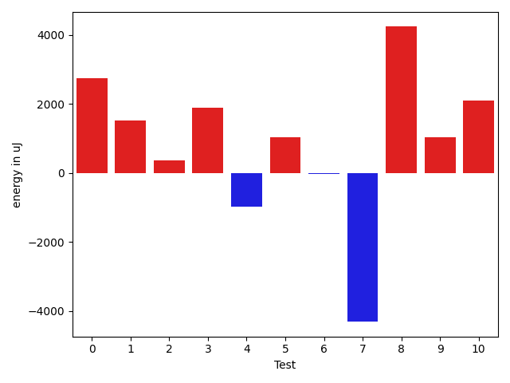

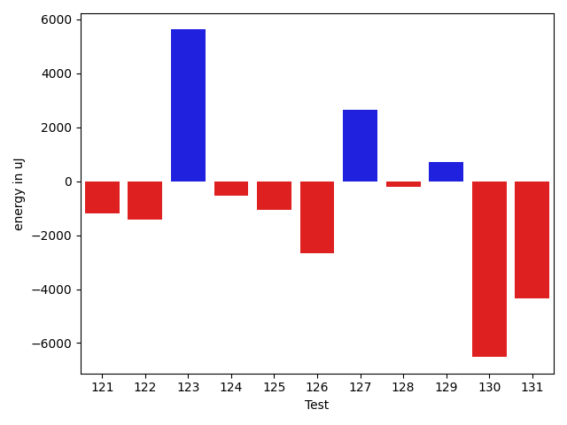

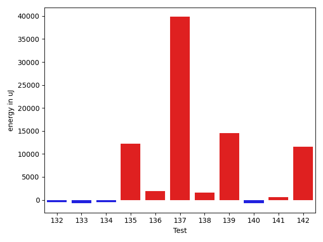

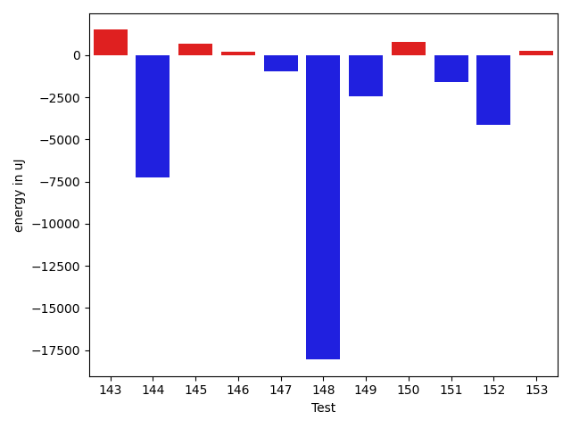

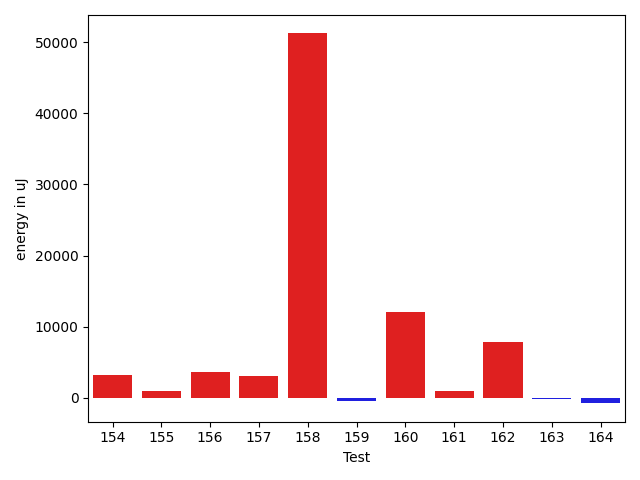

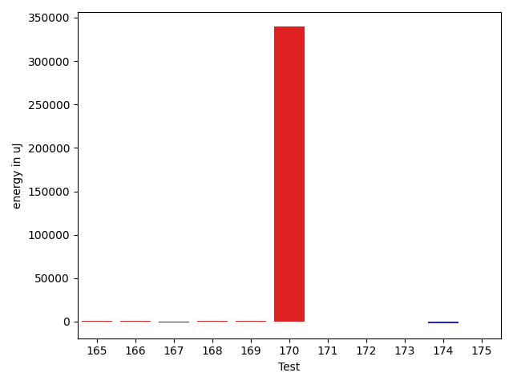

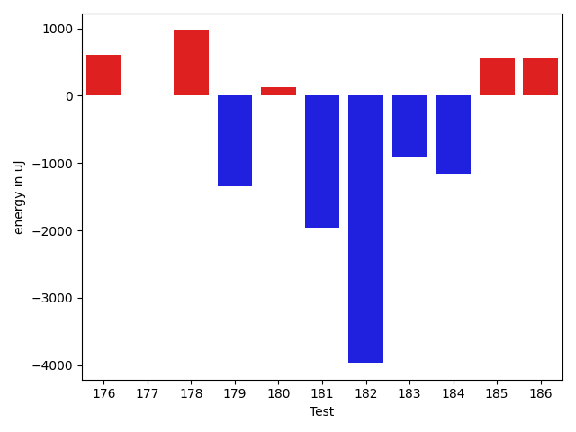

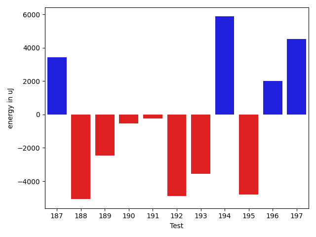

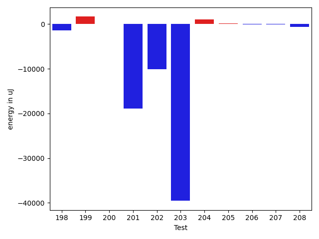

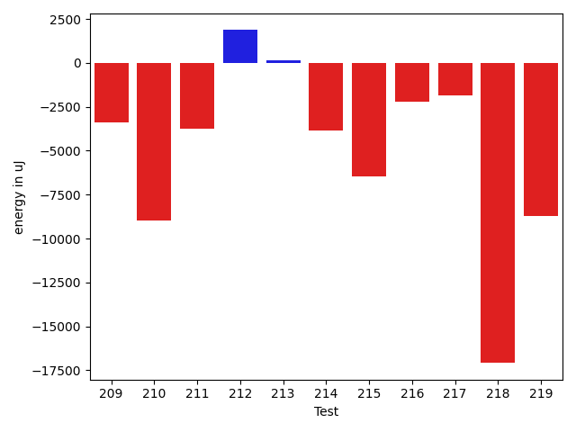

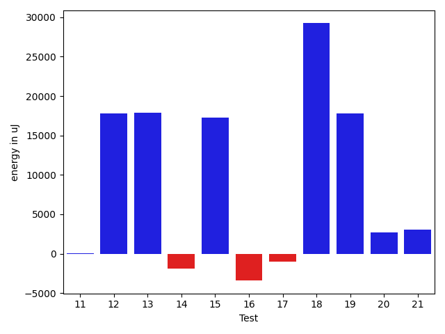

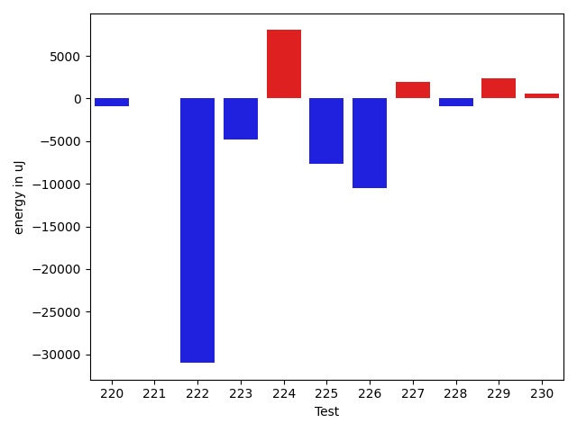

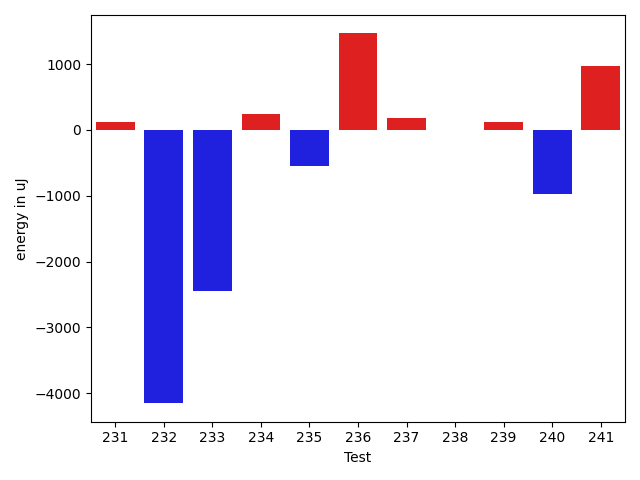

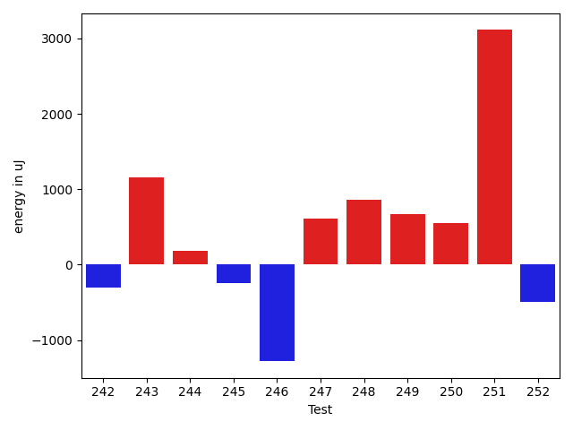

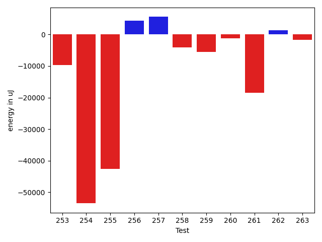

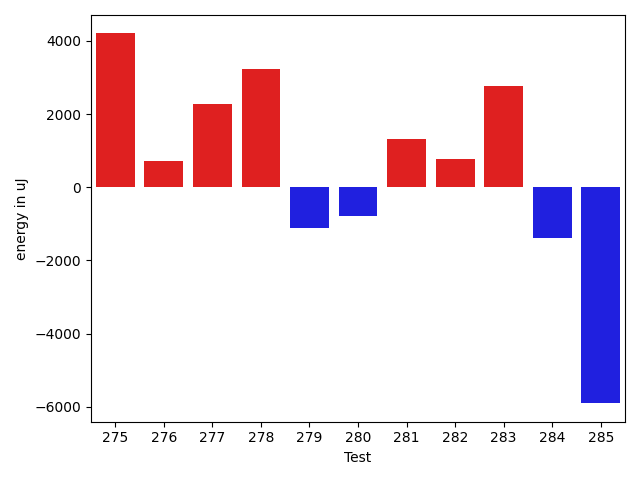

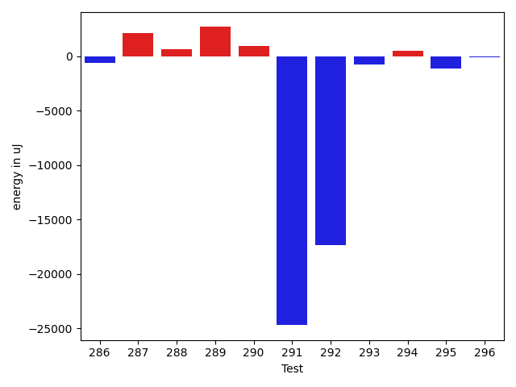

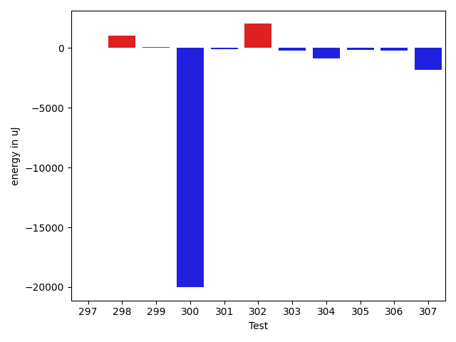

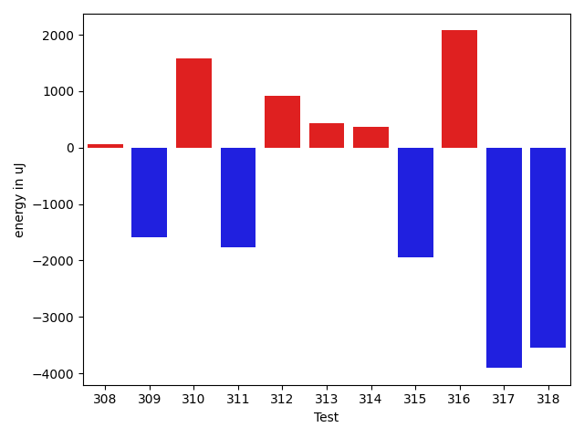

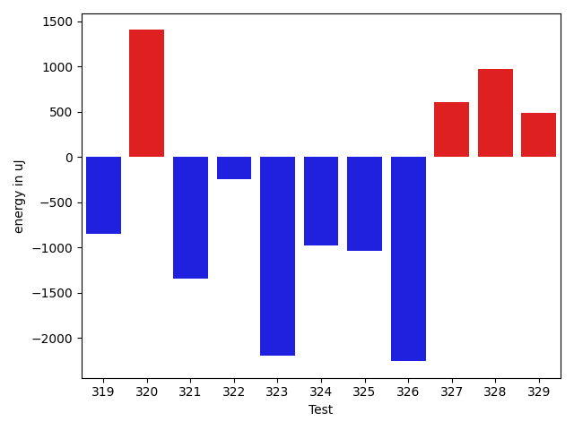

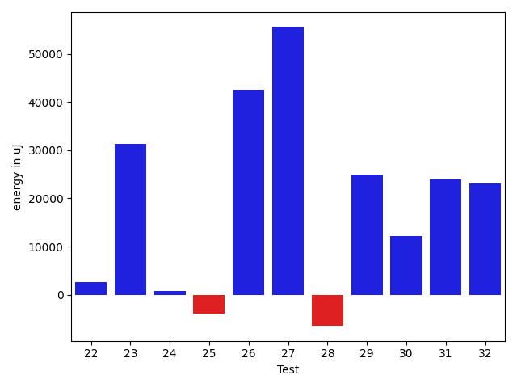

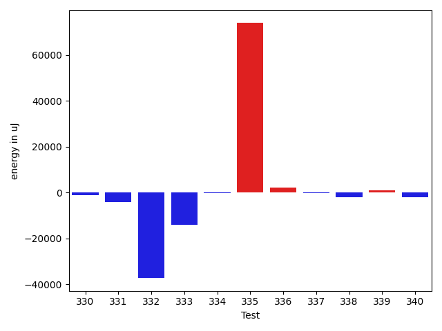

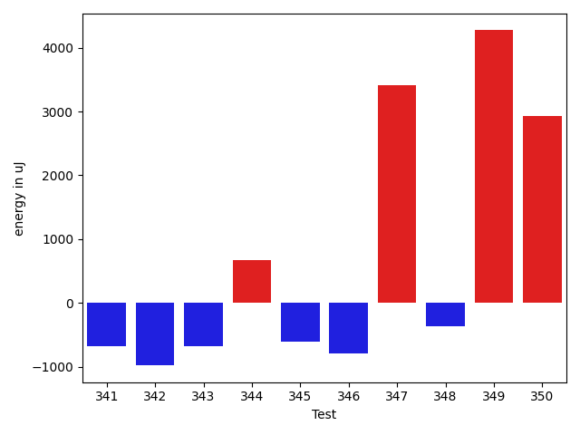

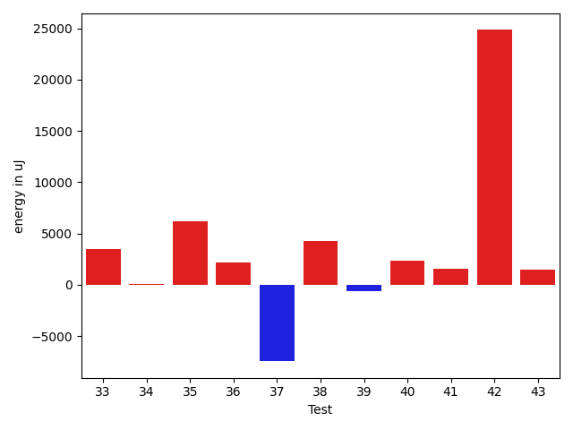

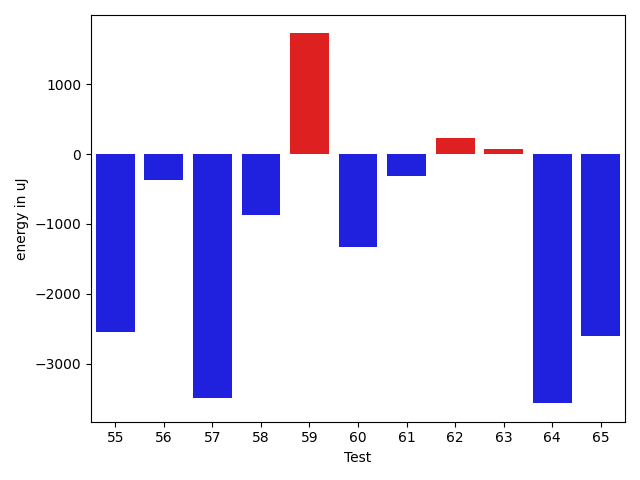

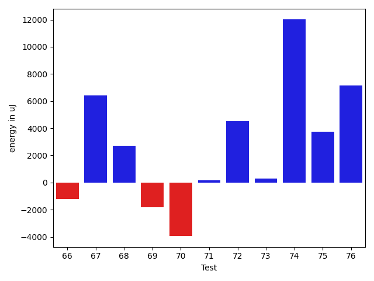

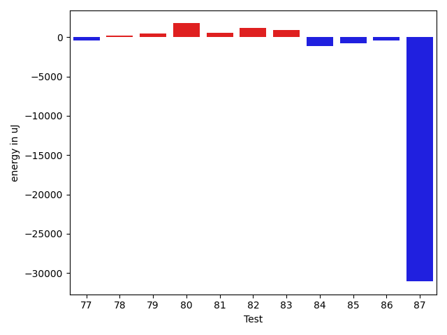

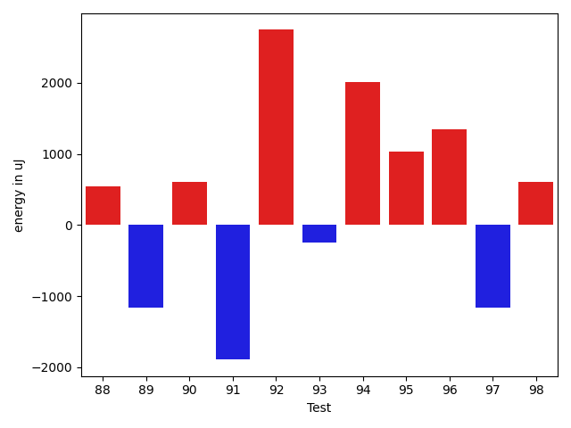

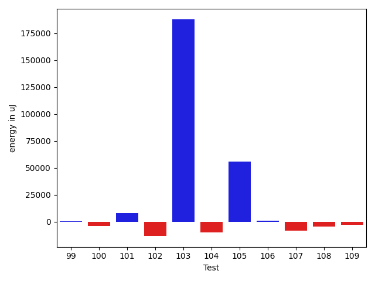

| ID | EnergyV1 | EnergyV2 | DeltaEnergy |
| --- | --- | --- | --- |
| 0 | 41237.64028146555 | 39036.962193431194 | -2200.6780880343576 |
| 1 | 44017.44562844779 | 43078.90867522407 | -938.5369532237237 |
| 2 | 39949.13963499805 | 36778.22434876149 | -3170.915286236559 |
| 3 | 39639.60342567383 | 34420.04823728459 | -5219.55518838924 |
| 4 | 91780.01040841549 | 93610.69193070372 | 1830.6815222882287 |
| 5 | 39301.95570140659 | 38039.58528555648 | -1262.370415850106 |
| 6 | 39081.58817693617 | 34665.59865978903 | -4415.9895171471435 |
| 7 | 40953.38650897123 | 38078.30509704289 | -2875.0814119283386 |
| 8 | 55176.140777535256 | 40032.77543151057 | -15143.365346024686 |
| 9 | 42387.03333293804 | 39401.73118474278 | -2985.30214819526 |
| 10 | 43948.415095240955 | 205638.5501725105 | 161690.13507726954 |
| 11 | 39448.20781396299 | 39481.20639580505 | 32.99858184206096 |
| 12 | 42587.89535177988 | 60382.36001624557 | 17794.46466446569 |
| 13 | 56878.89476311734 | 74750.41174021314 | 17871.516977095795 |
| 14 | 39468.93870216352 | 37614.394763932556 | -1854.5439382309632 |
| 15 | 42550.30001562518 | 59823.588494254225 | 17273.288478629045 |
| 16 | 42121.93742584353 | 38712.46147102861 | -3409.475954814916 |
| 17 | 39647.96842200309 | 38655.06208020402 | -992.9063417990692 |
| 18 | 89458.1244264693 | 118692.8254900465 | 29234.701063577202 |
| 19 | 36174.76030632631 | 53933.260698947175 | 17758.500392620866 |
| 20 | 36288.37051577866 | 38995.507913845126 | 2707.137398066465 |
| 21 | 37881.111099243164 | 40979.35348510742 | 3098.242385864258 |
| 22 | 36701.359824082916 | 39402.90474941967 | 2701.544925336755 |
| 23 | 39689.666792114855 | 71000.12339940952 | 31310.45660729467 |
| 24 | 36869.8589001894 | 37716.22824117541 | 846.3693409860134 |
| 25 | 42026.9091796875 | 38081.57373046875 | -3945.33544921875 |
| 26 | 55930.15047398838 | 98567.26707384108 | 42637.1165998527 |
| 27 | 54681.741949608055 | 110251.24842226304 | 55569.50647265499 |
| 28 | 42549.91811523631 | 36069.09243203466 | -6480.825683201649 |
| 29 | 42133.7358536866 | 67096.30025387007 | 24962.564400183466 |
| 30 | 44876.9092016361 | 57119.29232691015 | 12242.38312527405 |
| 31 | 32921.40629847879 | 56889.38182336955 | 23967.97552489076 |
| 32 | 36659.21908771671 | 59763.322400043784 | 23104.103312327075 |
| 33 | 36143.07748255533 | 40791.24807516855 | 4648.17059261322 |
| 34 | 43735.484524572894 | 65142.504392279676 | 21407.019867706782 |
| 35 | 33843.54192945076 | 40948.95065782673 | 7105.408728375973 |
| 36 | 47352.22682173435 | 120643.89412456189 | 73291.66730282754 |
| 37 | 41415.809023570895 | 38995.50171342792 | -2420.3073101429763 |
| 38 | 63491.75333934775 | 133636.0100095301 | 70144.25667018234 |
| 39 | 33443.98786922184 | 35910.81503894659 | 2466.8271697247474 |
| 40 | 38733.06606990051 | 43916.46553566814 | 5183.39946576763 |
| 41 | 34995.575435923776 | 43633.1340080403 | 8637.558572116526 |
| 42 | 37212.64603195476 | 41471.76657633519 | 4259.120544380428 |
| 43 | 38980.73554434349 | 38358.28605118727 | -622.4494931562222 |
| 44 | 37773.18848268348 | 37639.02662778679 | -134.16185489668715 |
| 45 | 35666.92567241576 | 42987.59508381789 | 7320.66941140213 |
| 46 | 37156.83449892329 | 42122.291083738004 | 4965.456584814718 |
| 47 | 38650.42224897721 | 38774.308901219745 | 123.88665224253782 |
| 48 | 35505.95947490529 | 35809.22424560733 | 303.2647707020369 |
| 49 | 47922.17347435442 | 37464.578003368726 | -10457.595470985696 |
| 50 | 421677.4607868421 | 41626.501367223245 | -380050.9594196188 |
| 51 | 36788.96693108664 | 37687.66291563926 | 898.6959845526217 |
| 52 | 118366.66428062532 | 77481.26678913181 | -40885.39749149351 |
| 53 | 37341.03989087878 | 36985.2091145725 | -355.83077630628395 |
| 54 | 57923.99885783529 | 39830.37590729783 | -18093.622950537465 |
| 55 | 37525.52811741694 | 36576.007423061725 | -949.5206943552184 |
| 56 | 39388.343202246004 | 40402.89896907869 | 1014.5557668326874 |
| 57 | 42501.60266316772 | 38821.92297613657 | -3679.679687031152 |
| 58 | 41258.26128241067 | 38641.00467408341 | -2617.2566083272613 |
| 59 | 38697.96462880176 | 41315.71511986496 | 2617.750491063198 |
| 60 | 36114.46192103836 | 35190.82736475639 | -923.6345562819697 |
| 61 | 46060.479097530595 | 37727.65869318163 | -8332.820404348968 |
| 62 | 43377.28729128658 | 36620.50118668884 | -6756.786104597741 |
| 63 | 34580.71890184656 | 40259.72153243603 | 5679.002630589472 |
| 64 | 39999.56201791763 | 36696.25327730179 | -3303.3087406158447 |
| 65 | 36158.28824101737 | 37953.135144089276 | 1794.8469030719061 |
| 66 | 35755.418165028095 | 34551.015616081655 | -1204.4025489464402 |
| 67 | 33664.1879324451 | 40069.306522810686 | 6405.118590365586 |
| 68 | 35083.61559780268 | 37780.21489691734 | 2696.599299114663 |
| 69 | 38062.65495109558 | 36257.30068363249 | -1805.354267463088 |
| 70 | 41761.826362625594 | 37818.03854426813 | -3943.787818357465 |
| 71 | 36862.30933070183 | 37045.95770907169 | 183.64837836986408 |
| 72 | 35184.440641690584 | 39721.146872410194 | 4536.70623071961 |
| 73 | 39505.915392506504 | 39804.24734837102 | 298.3319558645162 |
| 74 | 74520.1996349867 | 86524.19621864278 | 12003.996583656088 |
| 75 | 35999.56147484662 | 39726.353552262575 | 3726.7920774159575 |
| 76 | 35057.51417481899 | 42226.60253101587 | 7169.08835619688 |
| 77 | 35748.73102207482 | 42148.27219800651 | 6399.541175931692 |
| 78 | 40090.798930255696 | 39115.07332807791 | -975.7256021777866 |
| 79 | 44300.95800590515 | 35812.72807753086 | -8488.22992837429 |
| 80 | 34685.624174810946 | 36240.99473772198 | 1555.3705629110336 |
| 81 | 193277.37752183317 | 230460.11518281666 | 37182.73766098349 |
| 82 | 104567.6284441599 | 107980.03939049358 | 3412.410946333679 |
| 83 | 143627.86138659558 | 147214.0265914913 | 3586.1652048957185 |
| 84 | 57336.489191830624 | 41593.628977591405 | -15742.86021423922 |
| 85 | 219257.89683170928 | 225109.69395360234 | 5851.797121893062 |
| 86 | 39814.381862115115 | 43639.57519148123 | 3825.193329366113 |
| 87 | 41099.775366390626 | 43284.02445828787 | 2184.249091897247 |
| 88 | 77660.88753598486 | 48852.82289153595 | -28808.06464444891 |
| 89 | 65349.61376908339 | 40496.238271087444 | -24853.37549799595 |
| 90 | 44099.608564102324 | 34742.45232143998 | -9357.156242662342 |
| 91 | 65903.41339625158 | 36465.5691550001 | -29437.844241251478 |
| 92 | 38665.60419599913 | 37628.22825248884 | -1037.3759435102838 |
| 93 | 127213.78425568718 | 34608.98386243472 | -92604.80039325246 |
| 94 | 39546.45538300008 | 34895.062857400706 | -4651.3925255993745 |
| 95 | 109427.78545983625 | 37774.04750684308 | -71653.73795299316 |
| 96 | 37392.43462652646 | 42496.261618586395 | 5103.826992059934 |
| 97 | 34414.28720164731 | 39764.58129269151 | 5350.294091044198 |
| 98 | 38846.85395509038 | 39004.740892022826 | 157.88693693244568 |
| 99 | 38618.10593457541 | 38853.025965175344 | 234.92003059993294 |
| 100 | 43668.74142965033 | 39543.004351126045 | -4125.737078524282 |
| 101 | 38259.23179709165 | 46492.73092496912 | 8233.499127877469 |
| 102 | 53685.714742151365 | 40444.70605948718 | -13241.008682664185 |
| 103 | 44500.30420386791 | 232006.31085866375 | 187506.00665479584 |
| 104 | 42013.98391723633 | 32245.78330230713 | -9768.2006149292 |
| 105 | 39450.45530954003 | 95268.94823254441 | 55818.49292300438 |
| 106 | 42539.828369140625 | 43597.421875 | 1057.593505859375 |
| 107 | 42961.590724230555 | 34560.88065034624 | -8400.710073884315 |
| 108 | 43130.12322963832 | 38719.369874511736 | -4410.753355126581 |
| 109 | 40107.44304410562 | 37249.27443645602 | -2858.168607649597 |
| 110 | 514169.41429660685 | 262005.11734338888 | -252164.29695321797 |
| 111 | 36448.041307903826 | 38644.54771614075 | 2196.506408236921 |
| 112 | 37841.399092555046 | 39202.161216020584 | 1360.762123465538 |
| 113 | 39162.877857734275 | 40666.293555378914 | 1503.4156976446393 |
| 114 | 37634.46205177903 | 34686.55693054199 | -2947.9051212370396 |
| 115 | 48018.30588552695 | 48501.58098347041 | 483.27509794346406 |
| 116 | 41306.85546462238 | 39374.6587170288 | -1932.1967475935817 |
| 117 | 39634.44203563813 | 43251.354279762236 | 3616.912244124105 |
| 118 | 37651.86640207276 | 39001.320619738864 | 1349.4542176661053 |
| 119 | 36712.59378372261 | 41820.8219657148 | 5108.228181992192 |
| 120 | 40105.11230802536 | 37692.55009126663 | -2412.562216758728 |
| 121 | 42218.35897269845 | 41019.660696424544 | -1198.6982762739062 |
| 122 | 39723.914171991506 | 38318.923784246865 | -1404.9903877446413 |
| 123 | 36519.789611816406 | 42139.65749718994 | 5619.867885373533 |
| 124 | 39786.45665025711 | 39242.57135772705 | -543.8852925300598 |
| 125 | 38435.74888485983 | 37378.55099880766 | -1057.1978860521704 |
| 126 | 38914.720234511144 | 36237.03785139129 | -2677.6823831198562 |
| 127 | 38230.57102203369 | 40893.89059019089 | 2663.319568157196 |
| 128 | 38416.017875841586 | 38196.89619290829 | -219.12168293329887 |
| 129 | 34496.30795643153 | 35192.46279513836 | 696.1548387068324 |
| 130 | 44186.950065536425 | 37670.14685420701 | -6516.8032113294175 |
| 131 | 41860.60075011365 | 37518.69007672376 | -4341.910673389888 |
| 132 | 38407.92679595947 | 37285.103432774544 | -1122.823363184929 |
| 133 | 41728.86343509481 | 35227.28237280077 | -6501.581062294041 |
| 134 | 41027.627870140685 | 38761.64782656986 | -2265.980043570824 |
| 135 | 36221.23812913895 | 38070.21721021272 | 1848.979081073776 |
| 136 | 40439.24930381775 | 37254.66183644533 | -3184.5874673724174 |
| 137 | 39305.58875465393 | 35200.32355880737 | -4105.265195846558 |
| 138 | 36750.05016437359 | 43926.82324007264 | 7176.7730756990495 |
| 139 | 39834.95608185255 | 34170.77379608154 | -5664.182285771007 |
| 140 | 37883.828285963275 | 39663.65925422311 | 1779.8309682598338 |
| 141 | 37926.66677222296 | 38459.81891608867 | 533.1521438657073 |
| 142 | 37715.570306777954 | 40381.07222747803 | 2665.5019207000732 |
| 143 | 35321.0029296875 | 40582.75148010254 | 5261.748550415039 |
| 144 | 37617.09645537473 | 35410.08686815202 | -2207.0095872227103 |
| 145 | 40191.6360347271 | 42926.003017030656 | 2734.36698230356 |
| 146 | 119298.97738165382 | 124595.53694706931 | 5296.5595654154895 |
| 147 | 37866.06517422199 | 37000.9541015625 | -865.1110726594925 |
| 148 | 40160.4187008107 | 39589.36666429697 | -571.0520365137272 |
| 149 | 40633.272254779935 | 39962.050773265306 | -671.221481514629 |
| 150 | 36456.541009773304 | 39119.1645729779 | 2662.6235632045937 |
| 151 | 36419.6457547061 | 43524.851409980634 | 7105.205655274534 |
| 152 | 38423.822302642344 | 40808.88242832568 | 2385.0601256833397 |
| 153 | 36396.18864993146 | 36698.70863729715 | 302.5199873656966 |
| 154 | 40108.27891440795 | 43935.23086113505 | 3826.951946727102 |
| 155 | 49364.24188973105 | 77351.59542716616 | 27987.353537435112 |
| 156 | 36628.04641098532 | 39096.6435531529 | 2468.5971421675786 |
| 157 | 40286.44630797944 | 40367.014422971704 | 80.56811499226751 |
| 158 | 37689.110178332296 | 42496.11459949339 | 4807.004421161095 |
| 159 | 35198.17380332947 | 38167.72668647766 | 2969.5528831481934 |
| 160 | 36790.81061386942 | 38888.63279915609 | 2097.82218528667 |
| 161 | 40603.69721921461 | 42397.718948320486 | 1794.0217291058725 |
| 162 | 36311.458984375 | 39169.84089565277 | 2858.381911277771 |
| 163 | 38733.328256607056 | 42142.555822849274 | 3409.227566242218 |
| 164 | 35789.95052020981 | 38299.19813757437 | 2509.2476173645628 |
| 165 | 32819.68422922492 | 40149.28475868702 | 7329.600529462099 |
| 166 | 33906.266456604004 | 40283.47998225689 | 6377.213525652885 |
| 167 | 51719.09328751946 | 84847.62292155038 | 33128.52963403092 |
| 168 | 39128.235296757455 | 34452.45866614986 | -4675.776630607594 |
| 169 | 37158.45448268074 | 34130.467729813856 | -3027.9867528668838 |
| 170 | 37732.80301105164 | 53356.13322175281 | 15623.33021070117 |
| 171 | 40077.46196548462 | 35440.17575526433 | -4637.286210220285 |
| 172 | 39421.09894715492 | 100747.42208072072 | 61326.3231335658 |
| 173 | 36917.379551354694 | 37047.89347066764 | 130.51391931294347 |
| 174 | 36025.989820211966 | 34477.662587836036 | -1548.3272323759302 |
| 175 | 39361.441760270754 | 41103.16784442123 | 1741.7260841504758 |
| 176 | 37482.30050576758 | 34794.82784304355 | -2687.4726627240234 |
| 177 | 131710.5121706628 | 121606.58953615112 | -10103.922634511691 |
| 178 | 35939.38265787665 | 52477.380428602555 | 16537.997770725902 |
| 179 | 337876.2501235577 | 273850.10715295916 | -64026.142970598536 |
| 180 | 35681.02756855451 | 34573.04533529422 | -1107.9822332602926 |
| 181 | 38947.16577203554 | 37661.92938879303 | -1285.2363832425108 |
| 182 | 37017.79005453515 | 38580.57485152259 | 1562.784796987442 |
| 183 | 39064.181701660156 | 34962.46410942078 | -4101.71759223938 |
| 184 | 46806.02515268155 | 67135.75926379976 | 20329.73411111821 |
| 185 | 38549.40384491996 | 37613.9245378104 | -935.4793071095555 |
| 186 | 38412.075536643446 | 41900.27161324024 | 3488.196076596796 |
| 187 | 37367.2457307024 | 40813.52303822586 | 3446.277307523458 |
| 188 | 42305.57985916486 | 37233.49501198158 | -5072.084847183287 |
| 189 | 39654.42244494914 | 37182.03984401945 | -2472.38260092969 |
| 190 | 37415.661091804504 | 36877.358181238174 | -538.30291056633 |
| 191 | 37149.52554214001 | 36917.95644308627 | -231.5690990537405 |
| 192 | 39857.70694311456 | 34963.915232393956 | -4893.791710720601 |
| 193 | 38397.90287017822 | 34857.23636698723 | -3540.6665031909943 |
| 194 | 34079.30314731598 | 39956.668698988855 | 5877.365551672876 |
| 195 | 40761.345045134425 | 35977.34544526308 | -4783.999599871342 |
| 196 | 35859.72596549988 | 37879.57683944702 | 2019.8508739471436 |
| 197 | 34783.099497795105 | 39314.24522399902 | 4531.1457262039185 |
| 198 | 36514.42150878906 | 40861.71895170212 | 4347.297442913055 |
| 199 | 37011.164726257324 | 36497.12756347656 | -514.0371627807617 |
| 200 | 41764.53135126456 | 36710.17261598703 | -5054.3587352775285 |
| 201 | 38434.173608659374 | 36052.69956213361 | -2381.4740465257637 |
| 202 | 43890.75404711527 | 40860.65046720575 | -3030.103579909519 |
| 203 | 41328.137644917006 | 35743.492080397904 | -5584.645564519102 |
| 204 | 41150.03941902335 | 36101.90625294112 | -5048.1331660822325 |
| 205 | 41384.3427722007 | 41415.874965667725 | 31.53219346702099 |
| 206 | 42453.56227654178 | 91816.97655581334 | 49363.41427927156 |
| 207 | 42598.70258060348 | 53463.42742958354 | 10864.724848980062 |
| 208 | 39572.02841456159 | 76753.67402164073 | 37181.64560707915 |
| 209 | 44346.449457184244 | 40941.4262976656 | -3405.0231595186415 |
| 210 | 42867.08401871513 | 33910.435441435075 | -8956.648577280059 |
| 211 | 40367.7515775328 | 36607.36094375467 | -3760.39063377813 |
| 212 | 36077.12799977821 | 37942.99408514718 | 1865.8660853689653 |
| 213 | 39273.419924259186 | 39424.29620504379 | 150.87628078460693 |
| 214 | 39385.45766185483 | 35521.51843929273 | -3863.9392225620977 |
| 215 | 40337.37182863323 | 33885.80851357333 | -6451.563315059902 |
| 216 | 37728.5550245326 | 35526.205070613054 | -2202.3499539195473 |
| 217 | 43362.41433143616 | 41488.85892638564 | -1873.5554050505161 |
| 218 | 62167.3558511734 | 45085.033489701105 | -17082.322361472296 |
| 219 | 50655.29722263443 | 41948.57735306886 | -8706.719869565568 |
| 220 | 41392.108077049255 | 35809.22879123688 | -5582.879285812378 |
| 221 | 34338.37533760071 | 34846.58167266846 | 508.206335067749 |
| 222 | 37802.0789950788 | 35337.69014034294 | -2464.3888547358656 |
| 223 | 166138.75691986084 | 258377.78517866135 | 92239.0282588005 |
| 224 | 39710.99013966322 | 37196.48016577214 | -2514.5099738910794 |
| 225 | 40582.452170136676 | 37936.50694440678 | -2645.945225729898 |
| 226 | 37160.94227942654 | 39788.976092665725 | 2628.0338132391844 |
| 227 | 64973.41315509581 | 82987.23732225706 | 18013.82416716125 |
| 228 | 42002.34008892636 | 41838.20036459777 | -164.1397243285901 |
| 229 | 54150.00437358022 | 42585.30062908317 | -11564.703744497048 |
| 230 | 47467.84062760472 | 38779.95452320049 | -8687.886104404228 |
| 231 | 39083.28988134861 | 35686.99038887024 | -3396.2994924783707 |
| 232 | 37099.8827855587 | 41725.63458251953 | 4625.751796960831 |
| 233 | 40215.6595993042 | 41257.8212467432 | 1042.161647439003 |
| 234 | 237060.44469307398 | 124074.66974908054 | -112985.77494399344 |
| 235 | 40010.14889242538 | 37664.98156714068 | -2345.167325284696 |
| 236 | 37595.86307983735 | 44237.23923921585 | 6641.376159378502 |
| 237 | 34746.54938894159 | 39935.66281345165 | 5189.113424510062 |
| 238 | 35180.65517479181 | 39605.977546691895 | 4425.322371900082 |
| 239 | 43454.751987457275 | 43666.65522956848 | 211.90324211120605 |
| 240 | 37826.84221079669 | 40294.838148608804 | 2467.995937812113 |
| 241 | 36771.93842085251 | 36863.32955926612 | 91.39113841361541 |
| 242 | 37286.736393250525 | 40340.24617511034 | 3053.509781859815 |
| 243 | 38536.54202747345 | 35982.257736206055 | -2554.284291267395 |
| 244 | 39617.33449441352 | 39625.299344792125 | 7.964850378608389 |
| 245 | 37986.489129834095 | 38539.06217811042 | 552.5730482763247 |
| 246 | 116434.68783084056 | 140760.0099898278 | 24325.322158987256 |
| 247 | 35646.53542323921 | 43234.07216076771 | 7587.536737528499 |
| 248 | 41048.558421917915 | 42053.53162722902 | 1004.9732053111074 |
| 249 | 36534.910364514755 | 39571.40598068414 | 3036.4956161693844 |
| 250 | 38253.487648987124 | 35675.92493335428 | -2577.562715632841 |
| 251 | 43886.04945121342 | 39411.30718362292 | -4474.742267590496 |
| 252 | 39434.54529297771 | 38538.41202449147 | -896.1332684862427 |
| 253 | 45878.3943862225 | 36170.15664637544 | -9708.237739847056 |
| 254 | 94843.66290391868 | 41312.54899645782 | -53531.11390746086 |
| 255 | 84438.25439982837 | 41845.81353150391 | -42592.440868324455 |
| 256 | 38766.71398530554 | 43129.7068784935 | 4362.992893187962 |
| 257 | 37193.529791407425 | 42775.56232797884 | 5582.032536571416 |
| 258 | 36564.11267089844 | 32536.649963378906 | -4027.4627075195312 |
| 259 | 39655.35448306799 | 34084.72656924231 | -5570.62791382568 |
| 260 | 36110.95382273942 | 34886.63364727725 | -1224.3201754621696 |
| 261 | 71618.60942998981 | 53183.909249462115 | -18434.700180527696 |
| 262 | 40588.92144932403 | 41876.240853988245 | 1287.3194046642166 |
| 263 | 36091.71919161915 | 34376.71148201823 | -1715.007709600919 |
| 264 | 38369.426760824965 | 37829.36597643513 | -540.0607843898324 |
| 265 | 40492.844961815805 | 38896.897800302 | -1595.9471615138027 |
| 266 | 39097.64551411786 | 47610.76664424633 | 8513.121130128471 |
| 267 | 40226.88076380314 | 32967.506349146366 | -7259.374414656777 |
| 268 | 38635.32454509898 | 42230.168534464116 | 3594.8439893651375 |
| 269 | 40363.40872719987 | 42985.44526044689 | 2622.0365332470174 |
| 270 | 40960.944693556805 | 48383.97461912065 | 7423.029925563846 |
| 271 | 38237.55333397999 | 38939.95732939604 | 702.4039954160544 |
| 272 | 40851.411376953125 | 37844.82048332691 | -3006.590893626213 |
| 273 | 37290.62158203125 | 36232.3759765625 | -1058.24560546875 |
| 274 | 37264.86328125 | 39992.46600341797 | 2727.6027221679688 |
| 275 | 38272.9814453125 | 36297.844635009766 | -1975.1368103027344 |
| 276 | 39645.40663146973 | 44907.09375 | 5261.687118530273 |
| 277 | 37965.512691782475 | 32118.073331194904 | -5847.43936058757 |
| 278 | 36260.54238319397 | 36394.584228515625 | 134.04184532165527 |
| 279 | 36512.783203125 | 40815.84375 | 4303.060546875 |
| 280 | 37016.46723461151 | 36054.12040261924 | -962.3468319922686 |
| 281 | 46541.1419031024 | 45604.738246530294 | -936.4036565721035 |
| 282 | 38550.546875 | 37968.484375 | -582.0625 |
| 283 | 35598.63175583339 | 44572.44119087547 | 8973.80943504208 |
| 284 | 41116.53830464637 | 40832.06899434337 | -284.4693103030004 |
| 285 | 39004.0631731541 | 68823.25120916861 | 29819.188036014508 |
| 286 | 35733.869976404276 | 38531.06756198554 | 2797.1975855812634 |
| 287 | 37242.37576007843 | 38397.30983734131 | 1154.9340772628784 |
| 288 | 33942.879518960464 | 39306.366809128594 | 5363.48729016813 |
| 289 | 60418.602286173555 | 38275.67030817531 | -22142.931977998247 |
| 290 | 750761.8515811295 | 45748.0971435446 | -705013.7544375849 |
| 291 | 38947.72999572754 | 36779.094078063965 | -2168.635917663574 |
| 292 | 33939.15004637226 | 37997.73074551386 | 4058.5806991415957 |
| 293 | 40900.19390106201 | 36528.59980773926 | -4371.594093322754 |
| 294 | 41536.39322304726 | 38735.421048641205 | -2800.9721744060516 |
| 295 | 69795.8744757825 | 44205.77168594301 | -25590.102789839497 |
| 296 | 41252.29843902588 | 41146.46542739868 | -105.83301162719727 |
| 297 | 37445.330804526806 | 39004.56932449341 | 1559.2385199666023 |
| 298 | 38436.0263671875 | 38932.04931640625 | 496.02294921875 |
| 299 | 471265.3400105112 | 195424.60855368248 | -275840.73145682877 |
| 300 | 373131.6820726682 | 390141.27360361186 | 17009.59153094364 |
| 301 | 40451.06678733641 | 39062.47934897893 | -1388.5874383574774 |
| 302 | 37511.21819864482 | 38535.450580513665 | 1024.2323818688456 |
| 303 | 56020.849410170806 | 45922.809318096086 | -10098.04009207472 |
| 304 | 40079.20972198248 | 38391.4471282959 | -1687.7625936865807 |
| 305 | 42575.64941924413 | 63458.59132087586 | 20882.941901631726 |
| 306 | 34179.63946533203 | 38751.62897872925 | 4571.989513397217 |
| 307 | 38375.968994140625 | 39719.839111328125 | 1343.8701171875 |
| 308 | 40286.360920012245 | 41823.078186970204 | 1536.7172669579595 |
| 309 | 37404.186995983124 | 36877.72831726074 | -526.4586787223816 |
| 310 | 37805.55238342285 | 41515.881152153015 | 3710.3287687301636 |
| 311 | 42084.55078125 | 40609.6904296875 | -1474.8603515625 |
| 312 | 38691.42662592977 | 37017.56766656786 | -1673.8589593619108 |
| 313 | 39935.483046770096 | 38617.936722001876 | -1317.54632476822 |
| 314 | 43597.609985861964 | 61850.268359315116 | 18252.658373453152 |
| 315 | 39205.51408715919 | 39562.45398944616 | 356.9399022869766 |
| 316 | 39899.078159332275 | 35170.93859863281 | -4728.139560699463 |
| 317 | 38998.38098273477 | 40275.670675876274 | 1277.2896931415016 |
| 318 | 62859.76155529988 | 82960.09749804878 | 20100.335942748898 |
| 319 | 40558.01763728075 | 33725.192111968994 | -6832.825525311753 |
| 320 | 41165.43731546975 | 34191.26659085472 | -6974.170724615033 |
| 321 | 40959.52250258464 | 34451.17062362027 | -6508.351878964364 |
| 322 | 100355.23546903167 | 102925.0952841127 | 2569.8598150810285 |
| 323 | 39815.074723333615 | 41597.37873500297 | 1782.304011669352 |
| 324 | 38292.3515625 | 33194.7333984375 | -5097.6181640625 |
| 325 | 62068.765841786066 | 129342.99803843793 | 67274.23219665186 |
| 326 | 87257.62015328824 | 47792.10580720901 | -39465.51434607923 |
| 327 | 36403.14959716797 | 40072.087530612946 | 3668.937933444977 |
| 328 | 41979.654226335726 | 47926.667767940904 | 5947.013541605178 |
| 329 | 76386.86165937436 | 77379.78807796731 | 992.9264185929496 |
| 330 | 41095.76075646577 | 37818.112563147435 | -3277.6481933183313 |
| 331 | 80972.2126778832 | 54737.22701942541 | -26234.985658457794 |
| 332 | 40746.38953368426 | 39283.54123688105 | -1462.8482968032113 |
| 333 | 47273.149565563304 | 40148.365639864176 | -7124.783925699128 |
| 334 | 42283.50327536976 | 38926.35832772587 | -3357.1449476438866 |
| 335 | 38513.89335179329 | 36583.049287080765 | -1930.8440647125244 |
| 336 | 39322.42289967276 | 39699.958755493164 | 377.5358558204025 |
| 337 | 40285.896484375 | 42853.737548828125 | 2567.841064453125 |
| 338 | 35601.48843247816 | 33565.808793709846 | -2035.6796387683135 |
| 339 | 36872.295161307906 | 36956.441888632566 | 84.14672732465988 |
| 340 | 37877.31184005737 | 37506.25524902344 | -371.05659103393555 |
| 341 | 39949.40909542847 | 34840.08861998435 | -5109.320475444118 |
| 342 | 42284.662109375 | 48955.736267089844 | 6671.074157714844 |
| 343 | 40648.79753608699 | 36844.484870910645 | -3804.312665176345 |
| 344 | 38434.16381180898 | 35606.83988494139 | -2827.3239268675898 |
| 345 | 41767.62467499273 | 36792.9259453506 | -4974.6987296421285 |
| 346 | 40515.36469152558 | 36130.18767293537 | -4385.177018590213 |
| 347 | 63691.41540145874 | 37504.150390625 | -26187.26501083374 |
| 348 | 41804.89326291531 | 39431.33827447891 | -2373.554988436401 |
| 349 | 38336.28212078288 | 86421.16294264793 | 48084.88082186505 |
| 350 | 38002.604407310486 | 43152.54930877313 | 5149.944901462644 |

## Delta Duration per test method

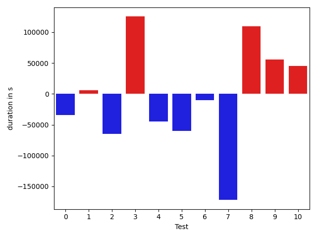

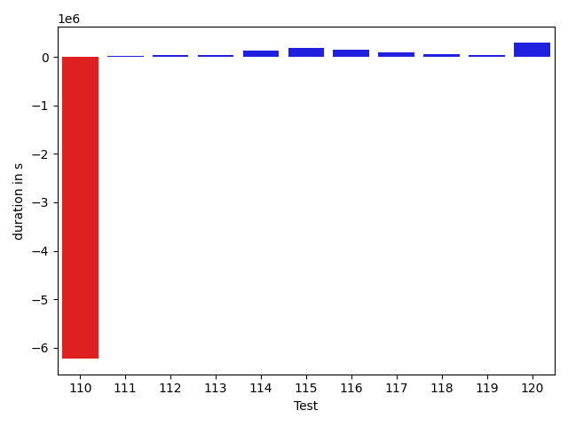

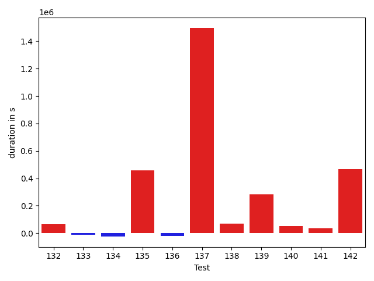

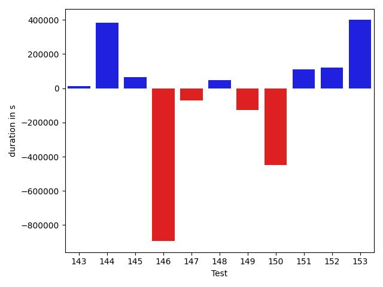

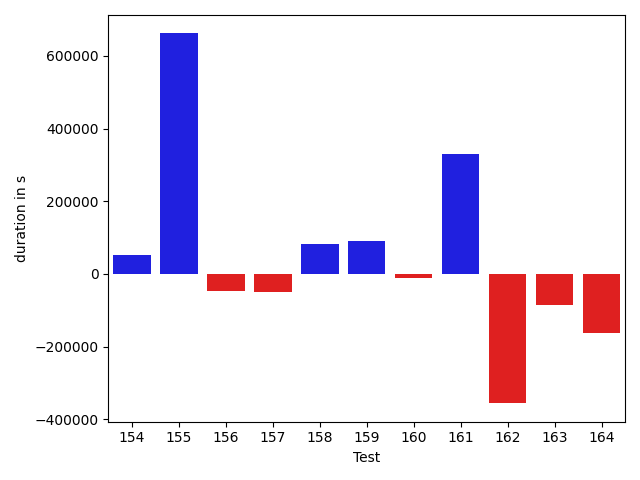

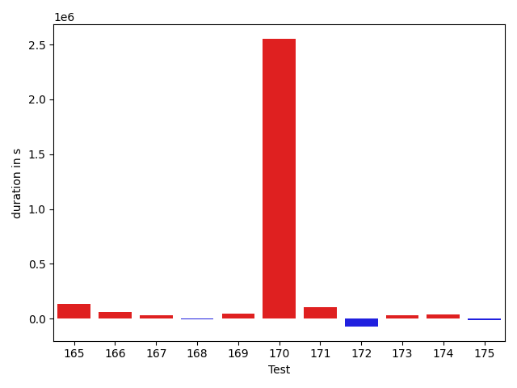

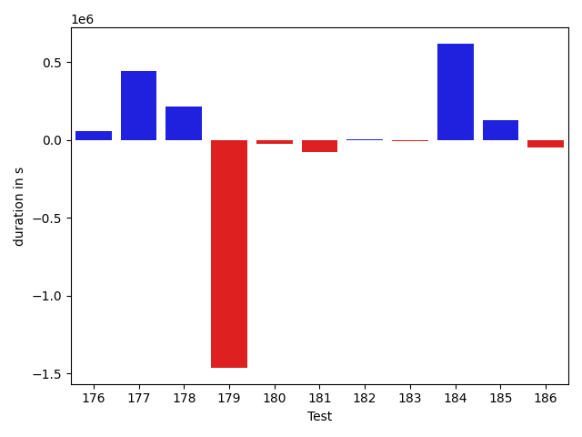

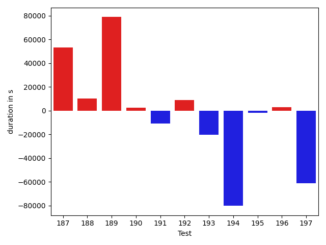

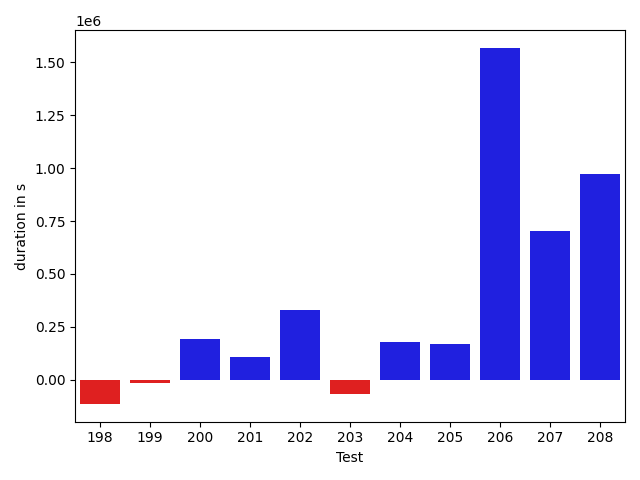

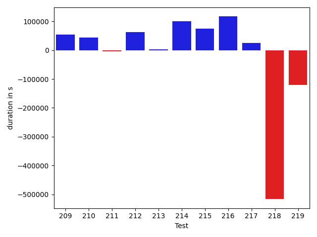

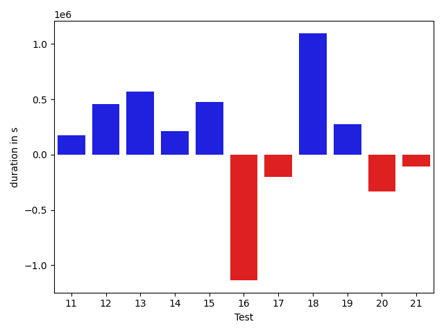

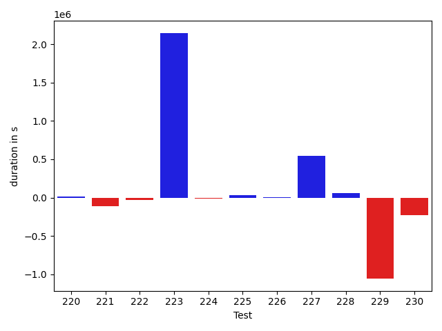

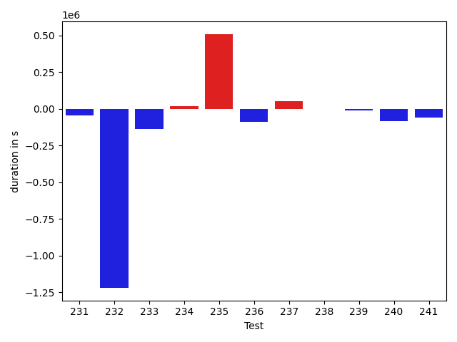

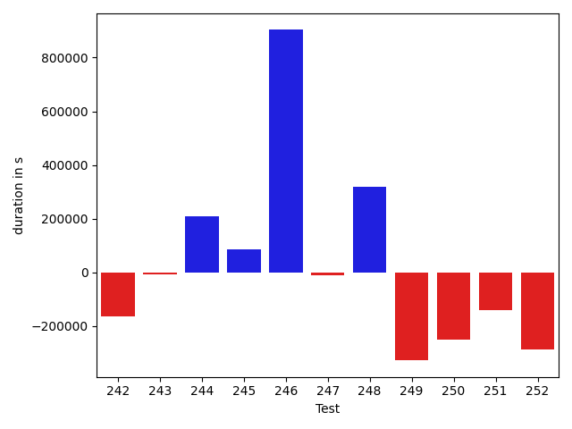

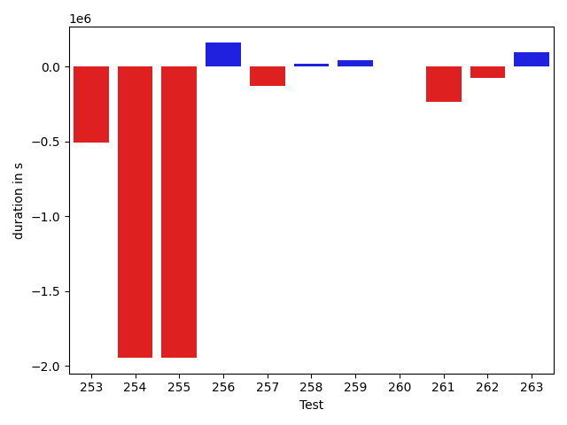

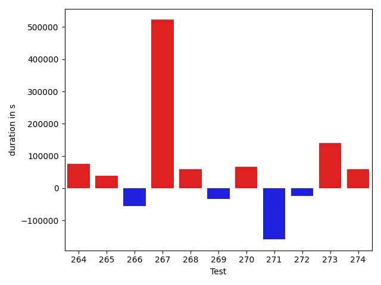

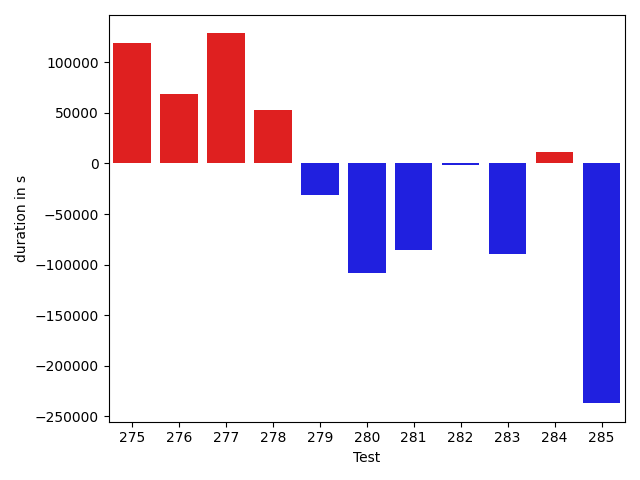

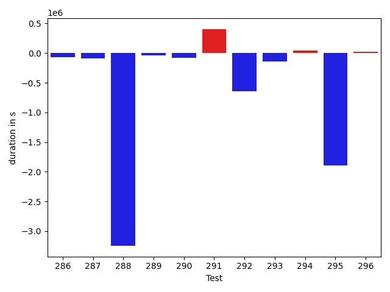

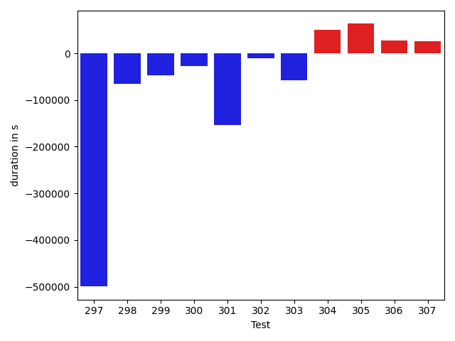

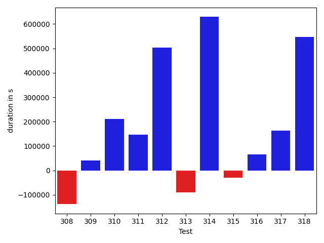

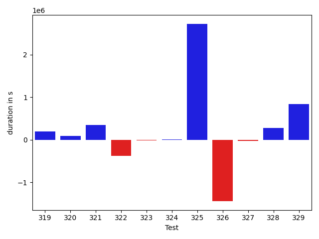

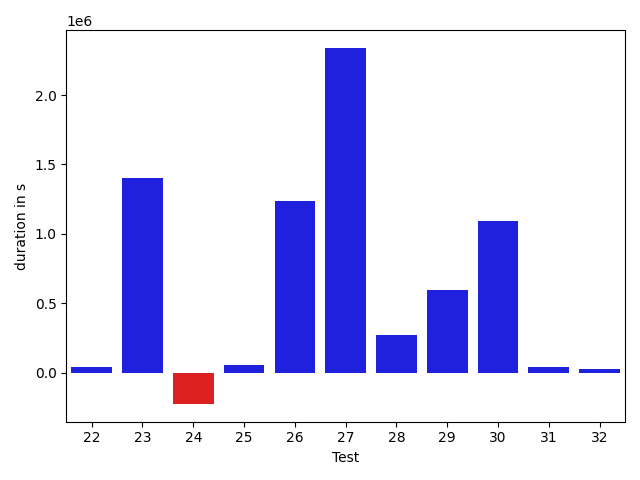

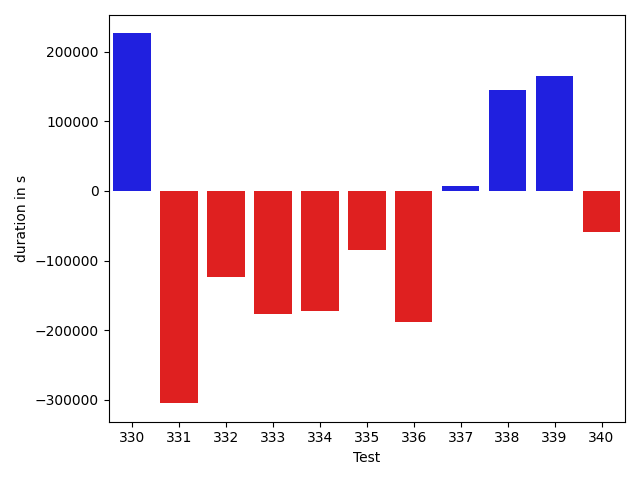

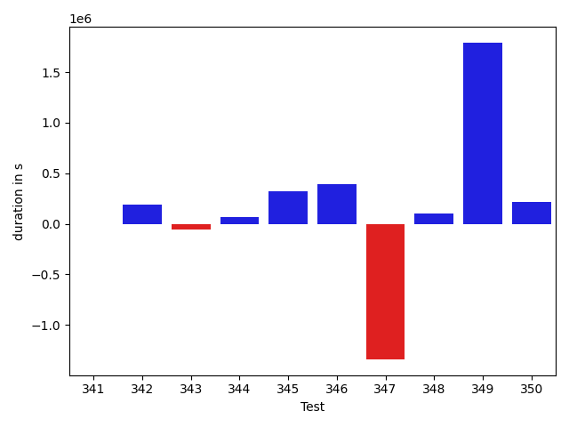

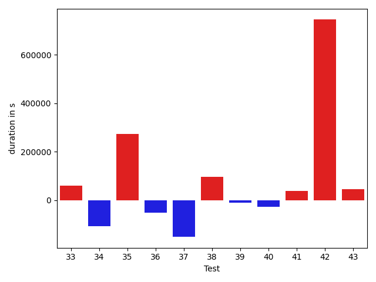

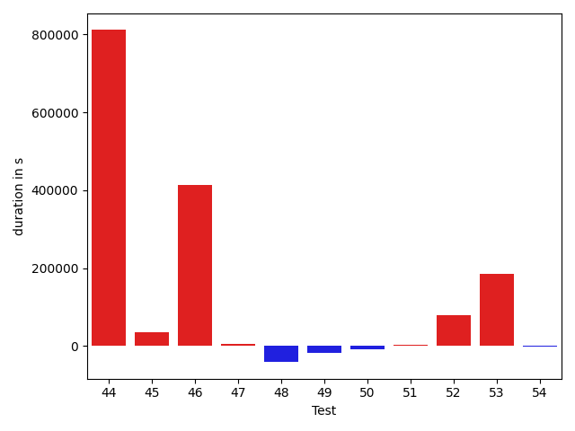

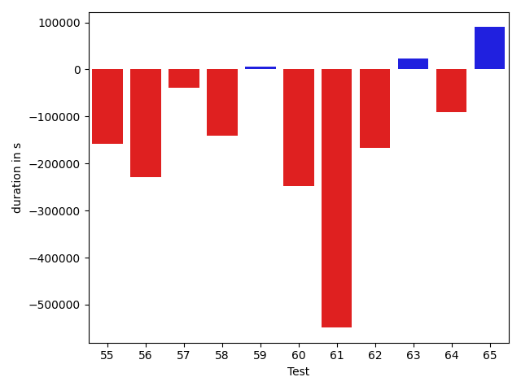

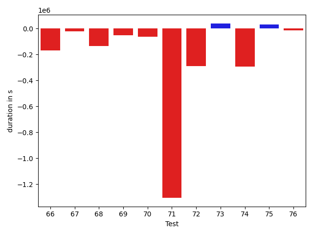

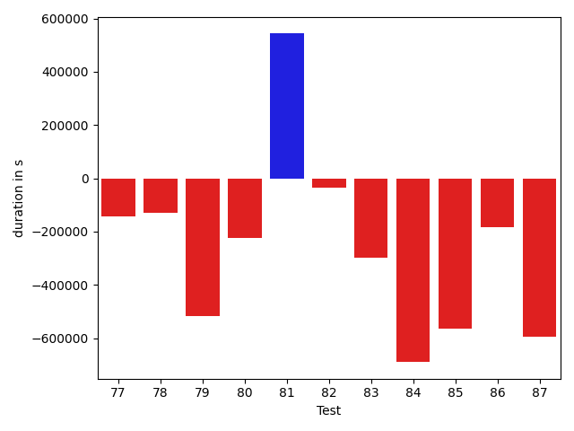

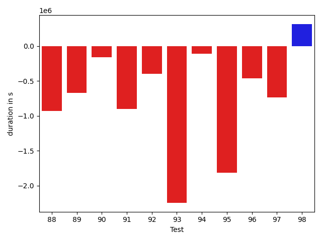

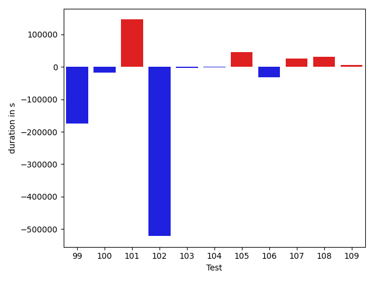

| ID | DurationV1 | DurationsV2 | DeltaDuration |
| --- | --- | --- | --- |
| 0 | 954877.3791950663 | 1114641.0862383775 | 159763.7070433112 |
| 1 | 834567.0278476082 | 975036.7214723476 | 140469.69362473942 |
| 2 | 567373.6449722042 | 640111.458804711 | 72737.81383250677 |
| 3 | 480936.05895576754 | 724098.8305265144 | 243162.7715707469 |
| 4 | 3032223.9833389516 | 2537424.5167628136 | -494799.46657613805 |
| 5 | 759275.1530425061 | 738151.2716310367 | -21123.881411469425 |
| 6 | 759067.2010411709 | 812546.0938298298 | 53478.892788658966 |
| 7 | 666680.8074517689 | 757595.9681398241 | 90915.16068805521 |
| 8 | 1570624.4285948463 | 685366.9269297491 | -885257.5016650972 |
| 9 | 554092.2068653584 | 584421.1966216578 | 30328.989756299416 |
| 10 | 1341208.409948564 | 5337251.441510073 | 3996043.031561509 |
| 11 | 754504.4472416267 | 929041.8187750436 | 174537.3715334169 |
| 12 | 977227.7084586308 | 1435578.9490935155 | 458351.2406348847 |
| 13 | 952404.8426952707 | 1520146.7256200863 | 567741.8829248156 |
| 14 | 502958.0903791262 | 715423.5841174898 | 212465.49373836356 |
| 15 | 676958.2763971143 | 1155051.856504473 | 478093.58010735863 |
| 16 | 2036494.2908878503 | 902093.1934686634 | -1134401.097419187 |
| 17 | 578413.4147151262 | 377181.2832026542 | -201232.13151247194 |
| 18 | 2680932.3732811995 | 3777953.2788676675 | 1097020.905586468 |
| 19 | 685759.7197688359 | 963391.3640302548 | 277631.64426141884 |
| 20 | 681064.2098174766 | 348421.01203307236 | -332643.1977844042 |
| 21 | 405202.8056793213 | 300988.7678527832 | -104214.03782653809 |
| 22 | 727404.0677597936 | 769316.1534711301 | 41912.08571133646 |
| 23 | 789971.7409108565 | 2189949.6687401873 | 1399977.9278293308 |
| 24 | 619323.6353063583 | 394226.72347411513 | -225096.9118322432 |
| 25 | 376559.318359375 | 432420.0234375 | 55860.705078125 |
| 26 | 1646679.7428640816 | 2883078.362746657 | 1236398.6198825752 |
| 27 | 1162554.4577600122 | 3501967.717371605 | 2339413.2596115926 |
| 28 | 735774.6443138589 | 1009002.8736758097 | 273228.22936195077 |
| 29 | 1435248.5685362162 | 2028066.1174956118 | 592817.5489593956 |
| 30 | 910213.5146571641 | 2002888.6027365339 | 1092675.0880793696 |
| 31 | 1117590.840299048 | 1158175.7343280667 | 40584.8940290187 |
| 32 | 1026795.414273778 | 1054877.8324627767 | 28082.41818899871 |
| 33 | 1312211.8862951691 | 1208367.1372902086 | -103844.74900496053 |
| 34 | 1700432.1913229995 | 1988190.7649862522 | 287758.57366325264 |
| 35 | 1075606.2911976255 | 1082034.0882674486 | 6427.797069823137 |
| 36 | 1683977.6946306212 | 2684780.192282114 | 1000802.497651493 |
| 37 | 1169387.348417938 | 1390012.1706924122 | 220624.8222744742 |
| 38 | 1995551.804436611 | 3193862.3320367187 | 1198310.5276001077 |
| 39 | 1028066.1200178189 | 1137911.2702668263 | 109845.15024900739 |
| 40 | 1244127.590379872 | 1017240.1299240264 | -226887.46045584546 |
| 41 | 992188.0292242761 | 843412.7990118682 | -148775.23021240789 |
| 42 | 960048.3949321897 | 954907.2391472596 | -5141.1557849301025 |
| 43 | 715718.010204701 | 750068.1557792912 | 34350.14557459019 |
| 44 | 1172592.3218353936 | 1120366.0379008078 | -52226.28393458575 |
| 45 | 1153487.2822818046 | 1257570.878617013 | 104083.59633520851 |
| 46 | 1060730.7709867163 | 1168803.786785326 | 108073.0157986097 |
| 47 | 648241.3231016316 | 528416.3794002793 | -119824.94370135234 |
| 48 | 962747.7410408928 | 809018.465012249 | -153729.27602864383 |
| 49 | 1612221.4959811424 | 893954.9789303583 | -718266.5170507841 |
| 50 | 11968948.090125661 | 904161.6696523404 | -11064786.42047332 |
| 51 | 679921.9485851335 | 750071.0664667444 | 70149.11788161087 |
| 52 | 2607945.4670431213 | 2619776.9181319876 | 11831.451088866219 |
| 53 | 1171838.8925185525 | 718209.1180505077 | -453629.77446804475 |
| 54 | 1559994.6615188492 | 1234443.5910253245 | -325551.07049352466 |
| 55 | 830616.3297303459 | 672047.9841570868 | -158568.34557325905 |
| 56 | 921275.561658083 | 692944.5322460756 | -228331.02941200742 |
| 57 | 772651.943282463 | 732919.3660825852 | -39732.57719987782 |
| 58 | 844476.9653636861 | 703386.1431737837 | -141090.82218990242 |
| 59 | 1031681.3819797141 | 1037397.4397682966 | 5716.057788582402 |
| 60 | 976416.282407078 | 728900.0998516484 | -247516.18255542952 |
| 61 | 1255733.5418739042 | 706753.8918446753 | -548979.6500292289 |
| 62 | 876413.8423487495 | 710040.0489367616 | -166373.79341198795 |
| 63 | 662889.0591829829 | 685395.8057696586 | 22506.746586675756 |
| 64 | 491115.3931174278 | 399691.342195034 | -91424.0509223938 |
| 65 | 747606.5687121395 | 837416.7358085338 | 89810.16709639435 |
| 66 | 658113.413225688 | 487980.25453577936 | -170133.15868990868 |
| 67 | 694875.8236162567 | 674482.4742706325 | -20393.349345624214 |
| 68 | 633314.31795375 | 496222.11220133305 | -137092.20575241698 |
| 69 | 444052.0491733551 | 390398.8422565013 | -53653.206916853786 |
| 70 | 748441.2324609407 | 683098.8680524135 | -65342.36440852727 |
| 71 | 1730256.2195354998 | 424860.581635382 | -1305395.6379001178 |
| 72 | 899423.0629770883 | 609630.9285279554 | -289792.13444913283 |
| 73 | 701913.136270856 | 740513.9157928685 | 38600.77952201245 |
| 74 | 2292455.195581709 | 1999219.9104742107 | -293235.2851074983 |
| 75 | 750631.5181602705 | 781249.5242473073 | 30618.006087036803 |
| 76 | 552655.906488657 | 539866.234205842 | -12789.67228281498 |
| 77 | 581962.0851425529 | 439336.60731129535 | -142625.4778312575 |
| 78 | 576959.9676390504 | 447858.0392016774 | -129101.92843737302 |
| 79 | 1035164.052271843 | 517474.7545375228 | -517689.29773432016 |
| 80 | 587386.464948602 | 364822.2496052813 | -222564.21534332074 |
| 81 | 5705989.57184026 | 6250430.69651105 | 544441.1246707896 |
| 82 | 3077607.327167019 | 3042286.572369432 | -35320.754797586706 |
| 83 | 4367376.852846644 | 4069197.960336012 | -298178.89251063205 |
| 84 | 1230616.520902929 | 540307.000429627 | -690309.5204733019 |
| 85 | 6290974.740369166 | 5726509.711433856 | -564465.0289353104 |
| 86 | 899626.4061972685 | 715823.0900597017 | -183803.3161375668 |
| 87 | 1647353.7313429248 | 1052445.9136541155 | -594907.8176888092 |
| 88 | 2142252.5773923853 | 1214100.7045822535 | -928151.8728101319 |
| 89 | 2246426.1996638337 | 1578466.8287451076 | -667959.3709187261 |
| 90 | 615434.7198278152 | 456904.34517133236 | -158530.37465648283 |
| 91 | 1760096.9560880885 | 862511.1366525384 | -897585.81943555 |
| 92 | 1389845.8953807354 | 990212.5856104515 | -399633.3097702839 |
| 93 | 3576888.8142996067 | 1332161.4372020145 | -2244727.377097592 |
| 94 | 1013275.5223343645 | 905660.7169916024 | -107614.80534276203 |
| 95 | 2803313.735607778 | 992364.6296077934 | -1810949.1059999848 |
| 96 | 1552833.9332519523 | 1090634.4610134102 | -462199.47223854205 |
| 97 | 1554992.7080376474 | 822183.7790684218 | -732808.9289692256 |
| 98 | 647756.4043924223 | 962674.549261956 | 314918.1448695337 |
| 99 | 624649.5750749238 | 688378.4541248027 | 63728.87904987892 |
| 100 | 961319.5512294781 | 1098898.8908136277 | 137579.33958414965 |
| 101 | 974208.923738451 | 1429059.3152025908 | 454850.3914641398 |
| 102 | 1503884.7290452588 | 1321244.2269390733 | -182640.50210618554 |
| 103 | 733238.1698139906 | 8675612.421016216 | 7942374.251202226 |
| 104 | 492448.3077316284 | 492810.5614242554 | 362.2536926269531 |
| 105 | 464012.5350383371 | 2723560.59959846 | 2259548.064560123 |
| 106 | 280904.2541503906 | 379767.54296875 | 98863.28881835938 |
| 107 | 1109052.0388414972 | 1212572.5015437515 | 103520.4627022543 |
| 108 | 882669.3892914245 | 1114966.5560368495 | 232297.16674542497 |
| 109 | 737468.7096286758 | 915910.2059053823 | 178441.49627670646 |
| 110 | 13399391.32512324 | 7176763.088385994 | -6222628.236737246 |
| 111 | 410023.2189684957 | 427133.42348480225 | 17110.20451630652 |
| 112 | 383857.10352629423 | 416817.63123369217 | 32960.52770739794 |
| 113 | 467044.37971623905 | 508735.76280611753 | 41691.38308987848 |
| 114 | 391949.87498545647 | 523187.51990127563 | 131237.64491581917 |
| 115 | 1474232.3258883492 | 1665734.4728767946 | 191502.14698844543 |
| 116 | 465608.04996453226 | 616628.620106414 | 151020.5701418817 |
| 117 | 467855.096372587 | 561705.5425122692 | 93850.4461396822 |
| 118 | 688025.5632939179 | 744406.4372957442 | 56380.874001826276 |
| 119 | 572479.6524829105 | 619990.3677427772 | 47510.71525986667 |
| 120 | 354496.83650541306 | 649953.4359307289 | 295456.59942531586 |
| 121 | 443838.6703621466 | 491679.1785942912 | 47840.50823214464 |
| 122 | 788283.3652691869 | 778023.670554877 | -10259.69471430988 |
| 123 | 368356.68408203125 | 502528.6611106768 | 134171.97702864558 |
| 124 | 426649.8500548154 | 400335.63067626953 | -26314.21937854588 |
| 125 | 810850.2449756064 | 628866.4912369672 | -181983.7537386393 |
| 126 | 584578.7628169857 | 708968.0864025746 | 124389.32358558883 |
| 127 | 615641.212738812 | 418885.4981741905 | -196755.71456462145 |
| 128 | 417703.48109695164 | 417416.96257698536 | -286.518519966281 |
| 129 | 423456.4567830395 | 529393.4159581587 | 105936.95917511918 |
| 130 | 726988.1000511539 | 745053.9156259515 | 18065.81557479757 |
| 131 | 561807.8442297224 | 979243.5739156744 | 417435.72968595196 |
| 132 | 464687.4566078186 | 514836.0586271286 | 50148.60201931 |
| 133 | 655030.705843199 | 864868.187227891 | 209837.4813846919 |
| 134 | 505715.95220389974 | 600887.9313674702 | 95171.97916357045 |
| 135 | 535436.5852680206 | 562852.4516338333 | 27415.86636581272 |
| 136 | 436965.5368461609 | 395602.262280941 | -41363.27456521988 |
| 137 | 412849.1017217636 | 553954.8809661865 | 141105.7792444229 |
| 138 | 597551.146459735 | 715806.1435968173 | 118254.99713708228 |
| 139 | 449869.8591545917 | 576226.6037521362 | 126356.74459754454 |
| 140 | 434704.2663866752 | 607604.7584445477 | 172900.49205787247 |
| 141 | 762786.476512695 | 631907.2690149532 | -130879.2074977418 |
| 142 | 335875.7619686127 | 392944.60458374023 | 57068.84261512756 |
| 143 | 381058.6826171875 | 393594.3942565918 | 12535.711639404297 |
| 144 | 421437.6259223614 | 805569.702359017 | 384132.0764366556 |
| 145 | 440869.548386991 | 504839.2576270327 | 63969.70924004167 |
| 146 | 3896749.6305798013 | 3003110.387819199 | -893639.2427606024 |
| 147 | 544308.0161132812 | 473342.3544921875 | -70965.66162109375 |
| 148 | 692545.7809493241 | 741398.5023186501 | 48852.721369326 |
| 149 | 559118.1004548669 | 433376.80997421173 | -125741.29048065515 |
| 150 | 1033250.88950879 | 583080.0357878294 | -450170.85372096056 |
| 151 | 549891.7731367922 | 659786.0530698072 | 109894.279933015 |
| 152 | 499407.1857377776 | 618492.3172715557 | 119085.13153377804 |
| 153 | 622393.6132307998 | 1021101.3935298622 | 398707.7802990624 |
| 154 | 1397396.5638755518 | 1450014.0041201578 | 52617.440244606 |
| 155 | 883591.2786617818 | 1545410.7760422674 | 661819.4973804856 |
| 156 | 852416.7832197162 | 804393.949080756 | -48022.83413896011 |
| 157 | 635105.4266473914 | 584307.160860216 | -50798.26578717539 |
| 158 | 900634.405633172 | 983770.6742303921 | 83136.26859722007 |
| 159 | 302429.4087896347 | 392460.3725643158 | 90030.96377468109 |
| 160 | 458259.6556875277 | 447333.340423706 | -10926.315263821685 |
| 161 | 558280.8089394189 | 887307.811086077 | 329027.00214665814 |
| 162 | 665945.5310974121 | 310188.4063796997 | -355757.1247177124 |
| 163 | 471246.03959465027 | 385097.25464487076 | -86148.78494977951 |
| 164 | 707298.6233721399 | 546165.5772638961 | -161133.04610824375 |
| 165 | 341662.071638301 | 398539.0196391344 | 56876.94800083339 |
| 166 | 473776.79484558105 | 398846.1361474395 | -74930.65869814157 |
| 167 | 1197020.89999139 | 3098474.7380165006 | 1901453.8380251105 |
| 168 | 721457.992274976 | 997593.6187424029 | 276135.6264674269 |
| 169 | 601912.3940917104 | 826372.454773721 | 224460.0606820106 |
| 170 | 680364.5747318533 | 1649748.7723368972 | 969384.1976050439 |
| 171 | 631976.8042877504 | 943430.6503641466 | 311453.8460763962 |
| 172 | 894846.3181876244 | 3144479.338154099 | 2249633.0199664747 |
| 173 | 1185753.3735777522 | 1352405.8044642662 | 166652.43088651402 |
| 174 | 533582.7677666809 | 516340.2108754697 | -17242.556891211192 |
| 175 | 686236.0756602009 | 737239.4848485292 | 51003.40918832831 |
| 176 | 767497.7591247368 | 821382.9311267103 | 53885.17200197349 |
| 177 | 3492651.9056093367 | 3932821.0809852355 | 440169.17537589883 |
| 178 | 1269266.0469462501 | 1484743.0978847144 | 215477.05093846424 |
| 179 | 10339189.204173097 | 8876572.218373433 | -1462616.9857996646 |
| 180 | 842248.1327428442 | 816900.1748338533 | -25347.95790899091 |
| 181 | 1202713.9660046813 | 1125862.4349877397 | -76851.53101694165 |
| 182 | 856820.4776705807 | 860016.6447840331 | 3196.167113452335 |
| 183 | 430232.32635498047 | 423628.81192302704 | -6603.51443195343 |
| 184 | 1160906.9523316645 | 1778385.9833212858 | 617479.0309896213 |
| 185 | 712425.8316896816 | 840676.5034707813 | 128250.67178109963 |
| 186 | 568666.8923209854 | 520665.1868445873 | -48001.705476398114 |
| 187 | 522822.6321537 | 730508.1222806899 | 207685.4901269899 |
| 188 | 537638.3951800093 | 716685.489211496 | 179047.09403148666 |
| 189 | 838349.6418963439 | 726979.2255392431 | -111370.41635710082 |
| 190 | 532723.4632902145 | 437887.8803319931 | -94835.58295822144 |
| 191 | 589763.7999429107 | 497090.6133650094 | -92673.18657790124 |
| 192 | 666624.9988267219 | 696228.6494263795 | 29603.650599657558 |
| 193 | 444601.38652801514 | 503557.2932459116 | 58955.90671789646 |
| 194 | 449946.45555114746 | 589772.2265273929 | 139825.7709762454 |
| 195 | 567234.9924823083 | 446627.0779155459 | -120607.9145667624 |
| 196 | 505662.5406680107 | 501433.90136146545 | -4228.639306545258 |
| 197 | 482944.1737396717 | 428403.27781677246 | -54540.895922899246 |
| 198 | 519490.9715576172 | 404943.601061821 | -114547.3704957962 |
| 199 | 371004.7039337158 | 357029.1292114258 | -13975.574722290039 |
| 200 | 1006931.934118957 | 1199639.2363187287 | 192707.30219977163 |
| 201 | 608062.8866957644 | 716920.254380698 | 108857.36768493359 |
| 202 | 830669.2170712707 | 1158695.654730942 | 328026.4376596714 |
| 203 | 705892.5557968221 | 637605.9676378071 | -68286.58815901494 |
| 204 | 422380.2483543851 | 600082.5887230258 | 177702.34036864067 |
| 205 | 497231.8424009681 | 664474.6222000122 | 167242.77979904413 |
| 206 | 556981.8413567242 | 2125289.672351458 | 1568307.830994734 |
| 207 | 541191.1216198271 | 1242846.7988865748 | 701655.6772667477 |
| 208 | 761853.428416916 | 1733625.7384372323 | 971772.3100203163 |
| 209 | 733728.3425057068 | 787637.4588153606 | 53909.116309653735 |
| 210 | 555478.9121665835 | 600098.260387423 | 44619.348220839514 |
| 211 | 773992.6531973772 | 770680.7972553475 | -3311.855942029739 |
| 212 | 554432.4671460935 | 617521.9643671652 | 63089.49722107174 |
| 213 | 421460.1462292671 | 424253.6128668785 | 2793.466637611389 |
| 214 | 1117007.0873330599 | 1217081.590010061 | 100074.50267700106 |
| 215 | 538197.1939092472 | 613240.2371772246 | 75043.04326797742 |
| 216 | 427748.9863245962 | 544362.0613898708 | 116613.0750652746 |
| 217 | 510036.0589799881 | 534903.1166382432 | 24867.0576582551 |
| 218 | 1426407.010025978 | 910159.1926721027 | -516247.8173538754 |
| 219 | 796677.9619968397 | 677014.1204460016 | -119663.84155083809 |
| 220 | 369220.0022830963 | 386132.1660079956 | 16912.163724899292 |
| 221 | 477422.45993995667 | 365891.3702163696 | -111531.08972358704 |
| 222 | 502790.1205592677 | 475011.0562014434 | -27779.064357824274 |
| 223 | 4412490.098747253 | 6560233.960398197 | 2147743.8616509438 |
| 224 | 514474.77144148387 | 498569.98505360633 | -15904.786387877539 |
| 225 | 396569.6154382546 | 430259.65787168965 | 33690.04243343504 |
| 226 | 702971.2800039464 | 706503.9890493962 | 3532.709045449854 |
| 227 | 1506561.0373131086 | 2055909.2045345805 | 549348.1672214719 |
| 228 | 944432.6647902387 | 1002869.8350205792 | 58437.170230340445 |
| 229 | 1491491.2146162689 | 434632.69998129405 | -1056858.5146349748 |
| 230 | 988481.5062069995 | 763199.2954558076 | -225282.21075119195 |
| 231 | 562721.5988951325 | 466446.55061912537 | -96275.04827600718 |
| 232 | 486906.9867026806 | 565387.4324951172 | 78480.4457924366 |
| 233 | 283501.4761352539 | 447079.07474815845 | 163577.59861290455 |
| 234 | 6650455.146518319 | 3651160.5074967453 | -2999294.6390215736 |
| 235 | 713353.5330196465 | 521923.71658637555 | -191429.816433271 |
| 236 | 927402.3843681964 | 683170.7375845909 | -244231.64678360545 |
| 237 | 671607.1833144417 | 669348.4948881795 | -2258.6884262622334 |
| 238 | 483288.37255835533 | 431516.98358535767 | -51771.388972997665 |
| 239 | 726711.7799344063 | 421907.41806411743 | -304804.36187028885 |
| 240 | 666445.398191026 | 421887.70095181465 | -244557.6972392113 |
| 241 | 1093761.1178197747 | 652168.0095747039 | -441593.1082450708 |
| 242 | 606169.4324132577 | 443439.7510391921 | -162729.68137406558 |
| 243 | 480318.3746843338 | 474048.3490600586 | -6270.0256242752075 |
| 244 | 748711.6368209005 | 959321.848581156 | 210610.2117602555 |
| 245 | 815104.3281513876 | 902516.4984070014 | 87412.17025561375 |
| 246 | 3041573.4666338055 | 3944567.9871720145 | 902994.520538209 |
| 247 | 845575.3159155378 | 835835.1647440937 | -9740.1511714441 |
| 248 | 853269.351052607 | 1171486.6347197127 | 318217.2836671057 |
| 249 | 919137.216322283 | 591432.551455077 | -327704.664867206 |
| 250 | 978043.2092970703 | 727284.5238799729 | -250758.6854170974 |
| 251 | 1149238.0974670425 | 1010261.9088233713 | -138976.18864367122 |
| 252 | 722216.4135945498 | 435144.57941544754 | -287071.8341791022 |
| 253 | 1246258.8888368665 | 740354.275253928 | -505904.61358293844 |
| 254 | 2793019.5458917543 | 846982.7350412812 | -1946036.8108504731 |
| 255 | 2559836.4973138943 | 615973.5538203138 | -1943862.9434935804 |
| 256 | 1085300.190586947 | 1246557.9385412112 | 161257.74795426428 |
| 257 | 1093830.9321433231 | 966651.393404837 | -127179.53873848612 |
| 258 | 476353.06103515625 | 495186.2257232666 | 18833.16468811035 |
| 259 | 584509.4286655188 | 625551.7171743275 | 41042.288508808706 |
| 260 | 564311.6168527901 | 566484.2562804581 | 2172.6394276679493 |
| 261 | 1769509.9896222195 | 1536875.5256882783 | -232634.4639339412 |
| 262 | 747736.6273419143 | 673207.2308479234 | -74529.3964939909 |
| 263 | 422528.282313939 | 516408.42272412777 | 93880.14041018876 |
| 264 | 604289.671072037 | 510542.02069382975 | -93747.65037820721 |
| 265 | 538300.155006117 | 635672.1843894599 | 97372.02938334295 |
| 266 | 498312.83259366144 | 1276471.8674181476 | 778159.0348244861 |
| 267 | 406524.1754477089 | 1036149.1614058614 | 629624.9859581525 |
| 268 | 701939.1607317983 | 978631.4144911502 | 276692.2537593519 |
| 269 | 627361.9462576956 | 815545.1539953612 | 188183.20773766562 |
| 270 | 529495.6041305491 | 1584816.7186433878 | 1055321.1145128387 |
| 271 | 431527.451034122 | 770060.3420731943 | 338532.89103907236 |
| 272 | 658225.7796020508 | 400607.2260529995 | -257618.55354905128 |
| 273 | 521450.5869140625 | 328562.8564453125 | -192887.73046875 |
| 274 | 605868.7344360352 | 358797.04962158203 | -247071.68481445312 |
| 275 | 275772.70849609375 | 315486.6574707031 | 39713.948974609375 |
| 276 | 416334.4773712158 | 454531.578125 | 38197.10075378418 |
| 277 | 1000432.2684040485 | 675900.8419988356 | -324531.42640521296 |
| 278 | 367718.3245639801 | 374614.9084472656 | 6896.5838832855225 |
| 279 | 314508.47802734375 | 421975.615234375 | 107467.13720703125 |
| 280 | 472188.3929157257 | 374303.8937370628 | -97884.4991786629 |
| 281 | 807202.9119642377 | 763393.7030898333 | -43809.20887440443 |
| 282 | 361907.0 | 329936.7265625 | -31970.2734375 |
| 283 | 1056735.7987463733 | 1227949.0421440927 | 171213.24339771946 |
| 284 | 849866.6649669448 | 1062186.0077749463 | 212319.34280800144 |
| 285 | 915186.5047620838 | 1501498.9359587922 | 586312.4311967085 |
| 286 | 889283.6222152432 | 1062884.0575940753 | 173600.43537883216 |
| 287 | 588785.3846693039 | 514694.2963294983 | -74091.0883398056 |
| 288 | 1142577.2834960509 | 811402.06173978 | -331175.22175627085 |
| 289 | 2171364.9659951543 | 898462.8326403514 | -1272902.133354803 |
| 290 | 18981247.865515713 | 655001.390049805 | -18326246.47546591 |
| 291 | 462430.2039718628 | 339169.32148361206 | -123260.88248825073 |
| 292 | 878676.346466555 | 582435.5312011939 | -296240.8152653611 |
| 293 | 406245.6855392456 | 445525.39793395996 | 39279.712394714355 |
| 294 | 435645.7065355778 | 341440.6891489029 | -94205.01738667488 |
| 295 | 1797589.4955655262 | 653826.8300230652 | -1143762.665542461 |
| 296 | 667268.0317077637 | 358990.0708351135 | -308277.96087265015 |
| 297 | 783875.9399307668 | 396444.33252716064 | -387431.6074036062 |
| 298 | 468500.2197265625 | 397186.17578125 | -71314.0439453125 |
| 299 | 11921876.920830987 | 5496274.128250904 | -6425602.792580083 |
| 300 | 9645093.10039528 | 12101145.111712895 | 2456052.0113176145 |
| 301 | 605968.6341418304 | 585268.7260379494 | -20699.908103880938 |
| 302 | 896761.1114102186 | 741073.6739362937 | -155687.43747392495 |
| 303 | 1358572.8521386157 | 1331199.1802099375 | -27373.671928678174 |
| 304 | 335891.8398670554 | 444821.58811950684 | 108929.74825245142 |
| 305 | 1322818.4483259064 | 1552912.18898257 | 230093.74065666366 |
| 306 | 325748.3758544922 | 427505.9812736511 | 101757.60541915894 |
| 307 | 377143.6550292969 | 414047.21484375 | 36903.559814453125 |
| 308 | 779208.1654020234 | 640937.3488493878 | -138270.81655263552 |
| 309 | 384110.85943365097 | 425776.00396728516 | 41665.144533634186 |
| 310 | 277921.57426452637 | 488101.42387771606 | 210179.8496131897 |
| 311 | 330033.251953125 | 475611.2575683594 | 145578.00561523438 |
| 312 | 542046.4246834368 | 1044855.8242998645 | 502809.3996164277 |
| 313 | 497785.6073386669 | 407890.15858681605 | -89895.44875185087 |
| 314 | 513452.20409371925 | 1142394.2006100628 | 628941.9965163436 |
| 315 | 469056.5930576511 | 438339.8998013437 | -30716.693256307393 |
| 316 | 345658.46061325073 | 411332.24127197266 | 65673.78065872192 |
| 317 | 552400.5140930403 | 715372.0439149947 | 162971.52982195443 |
| 318 | 1524763.1540291333 | 2071077.4331875022 | 546314.2791583689 |
| 319 | 352710.9250801001 | 554663.2303466797 | 201952.3052665796 |
| 320 | 613777.1052750847 | 703263.8909874472 | 89486.7857123625 |
| 321 | 779963.9311947114 | 1123461.356132003 | 343497.42493729165 |
| 322 | 3090482.1976491786 | 2714880.8348461385 | -375601.3628030401 |
| 323 | 648980.7121815159 | 630325.2247219458 | -18655.487459570053 |
| 324 | 555579.15625 | 566084.4501953125 | 10505.2939453125 |
| 325 | 1588383.8817379656 | 4313395.934119825 | 2725012.0523818596 |
| 326 | 2514371.4936866676 | 1073120.1182449046 | -1441251.375441763 |
| 327 | 467344.6607055664 | 436076.7332060337 | -31267.9274995327 |
| 328 | 1249769.400512294 | 1522916.0697577577 | 273146.6692454638 |
| 329 | 1812221.7082243157 | 2650255.4065037044 | 838033.6982793887 |
| 330 | 719267.7388388253 | 945226.0820762933 | 225958.34323746804 |
| 331 | 2149455.218658816 | 1844781.9796749493 | -304673.23898386676 |
| 332 | 1314179.02224608 | 1190341.2228164505 | -123837.79942962946 |
| 333 | 1150520.3547095088 | 974604.9882238713 | -175915.3664856375 |
| 334 | 951055.8177437126 | 779057.5439706445 | -171998.2737730681 |
| 335 | 487128.2492545843 | 402075.6113870144 | -85052.63786756992 |
| 336 | 692558.2978830673 | 504230.57049942017 | -188327.7273836471 |
| 337 | 323663.58935546875 | 330418.8068847656 | 6755.217529296875 |
| 338 | 526790.3822861818 | 672176.198501356 | 145385.81621517416 |
| 339 | 993089.5867412584 | 1157874.3106786553 | 164784.7239373969 |
| 340 | 429262.5829401016 | 369954.7880554199 | -59307.7948846817 |
| 341 | 928881.3628266605 | 929113.2446258834 | 231.88179922290146 |
| 342 | 468769.9580078125 | 661757.2827758789 | 192987.3247680664 |
| 343 | 523251.281630934 | 470085.4912843704 | -53165.79034656356 |
| 344 | 663430.4346893937 | 726859.3540787164 | 63428.91938932263 |
| 345 | 752676.5356628231 | 1072373.050626112 | 319696.5149632888 |
| 346 | 526847.1132487585 | 917398.56720054 | 390551.4539517815 |
| 347 | 1657382.1893539429 | 315618.35205078125 | -1341763.8373031616 |
| 348 | 450844.6020959914 | 551033.5912089348 | 100188.98911294341 |
| 349 | 505332.7250223607 | 2297590.2575409412 | 1792257.5325185806 |
| 350 | 449661.13517332077 | 666609.0686053671 | 216947.93343204632 |

## Misc.

| ID | Test Class | Test Method |
| --- | --- | --- |
| 0 | com.google.gson.functional.StreamingTypeAdaptersTest | testNullSafe |
| 1 | com.google.gson.functional.StreamingTypeAdaptersTest | testSerializeWithCustomTypeAdapter |
| 2 | com.google.gson.functional.StreamingTypeAdaptersTest | testDeserializeWithCustomTypeAdapter |
| 3 | com.google.gson.functional.StreamingTypeAdaptersTest | testSerializeRecursive |
| 4 | com.google.gson.functional.JsonAdapterAnnotationOnClassesTest | testJsonAdapterInvoked |
| 5 | com.google.gson.functional.JsonAdapterAnnotationOnClassesTest | testRegisteredAdapterOverridesJsonAdapter |
| 6 | com.google.gson.functional.JsonAdapterAnnotationOnClassesTest | testRegisteredSerializerOverridesJsonAdapter |
| 7 | com.google.gson.functional.JsonAdapterAnnotationOnClassesTest | testRegisteredDeserializerOverridesJsonAdapter |
| 8 | com.google.gson.functional.JsonAdapterAnnotationOnClassesTest | testSuperclassTypeAdapterNotInvoked |
| 9 | com.google.gson.functional.JsonAdapterAnnotationOnClassesTest | testIncorrectTypeAdapterFails |
| 10 | com.google.gson.functional.CustomDeserializerTest | testDefaultConstructorNotCalledOnObject |
| 11 | com.google.gson.functional.CustomDeserializerTest | testCustomDeserializerReturnsNullForArrayElementsForArrayField |
| 12 | com.google.gson.functional.CustomDeserializerTest | testJsonTypeFieldBasedDeserialization |
| 13 | com.google.gson.functional.CustomDeserializerTest | testCustomDeserializerReturnsNullForTopLevelObject |
| 14 | com.google.gson.functional.CustomDeserializerTest | testDefaultConstructorNotCalledOnField |
| 15 | com.google.gson.functional.CustomDeserializerTest | testCustomDeserializerReturnsNull |
| 16 | com.google.gson.functional.CustomDeserializerTest | testCustomDeserializerReturnsNullForArrayElements |
| 17 | com.google.gson.functional.ExclusionStrategyFunctionalTest | testExclusionStrategySerializationDoesNotImpactSerialization |
| 18 | com.google.gson.functional.ExclusionStrategyFunctionalTest | testExclusionStrategySerialization |
| 19 | com.google.gson.functional.ExclusionStrategyFunctionalTest | testExclusionStrategyWithMode |
| 20 | com.google.gson.functional.ExclusionStrategyFunctionalTest | testExcludeTopLevelClassDeserializationDoesNotImpactSerialization |
| 21 | com.google.gson.functional.ExclusionStrategyFunctionalTest | testExcludeTopLevelClassSerialization |
| 22 | com.google.gson.functional.ExclusionStrategyFunctionalTest | testExclusionStrategySerializationDoesNotImpactDeserialization |
| 23 | com.google.gson.functional.ExclusionStrategyFunctionalTest | testExclusionStrategyDeserialization |
| 24 | com.google.gson.functional.ExclusionStrategyFunctionalTest | testExcludeTopLevelClassSerializationDoesNotImpactDeserialization |
| 25 | com.google.gson.functional.ExclusionStrategyFunctionalTest | testExcludeTopLevelClassDeserialization |
| 26 | com.google.gson.functional.InstanceCreatorTest | testInstanceCreatorForParametrizedType |
| 27 | com.google.gson.functional.InstanceCreatorTest | testInstanceCreatorReturnsBaseType |
| 28 | com.google.gson.functional.InstanceCreatorTest | testInstanceCreatorReturnsSubTypeForTopLevelObject |
| 29 | com.google.gson.functional.InstanceCreatorTest | testInstanceCreatorForCollectionType |
| 30 | com.google.gson.functional.InstanceCreatorTest | testInstanceCreatorReturnsSubTypeForField |
| 31 | com.google.gson.functional.ParameterizedTypesTest | testParameterizedTypeGenericArraysSerialization |
| 32 | com.google.gson.functional.ParameterizedTypesTest | testVariableTypeArrayDeserialization |
| 33 | com.google.gson.functional.ParameterizedTypesTest | testParameterizedTypeWithCustomSerializer |
| 34 | com.google.gson.functional.ParameterizedTypesTest | testParameterizedTypesSerialization |
| 35 | com.google.gson.functional.ParameterizedTypesTest | testVariableTypeDeserialization |
| 36 | com.google.gson.functional.ParameterizedTypesTest | testVariableTypeFieldsAndGenericArraysSerialization |
| 37 | com.google.gson.functional.ParameterizedTypesTest | testParameterizedTypeDeserialization |
| 38 | com.google.gson.functional.ParameterizedTypesTest | testTypesWithMultipleParametersSerialization |
| 39 | com.google.gson.functional.ParameterizedTypesTest | testParameterizedTypeWithVariableTypeDeserialization |
| 40 | com.google.gson.functional.ParameterizedTypesTest | testParameterizedTypesWithCustomDeserializer |
| 41 | com.google.gson.functional.ParameterizedTypesTest | testParameterizedTypesWithWriterSerialization |
| 42 | com.google.gson.functional.ParameterizedTypesTest | testParameterizedTypeWithReaderDeserialization |
| 43 | com.google.gson.functional.ParameterizedTypesTest | testDeepParameterizedTypeDeserialization |
| 44 | com.google.gson.functional.ParameterizedTypesTest | testParameterizedTypeGenericArraysDeserialization |
| 45 | com.google.gson.functional.ParameterizedTypesTest | testVariableTypeFieldsAndGenericArraysDeserialization |
| 46 | com.google.gson.functional.ParameterizedTypesTest | testTypesWithMultipleParametersDeserialization |
| 47 | com.google.gson.functional.ParameterizedTypesTest | testDeepParameterizedTypeSerialization |
| 48 | com.google.gson.functional.CustomTypeAdaptersTest | testCustomTypeAdapterAppliesToSubClassesSerializedAsBaseClass |
| 49 | com.google.gson.functional.CustomTypeAdaptersTest | testCustomNestedSerializers |
| 50 | com.google.gson.functional.CustomTypeAdaptersTest | testCustomSerializers |
| 51 | com.google.gson.functional.CustomTypeAdaptersTest | testCustomNestedDeserializers |
| 52 | com.google.gson.functional.CustomTypeAdaptersTest | testCustomTypeAdapterDoesNotAppliesToSubClasses |
| 53 | com.google.gson.functional.CustomTypeAdaptersTest | testRegisterHierarchyAdapterForDate |
| 54 | com.google.gson.functional.CustomTypeAdaptersTest | testCustomAdapterInvokedForCollectionElementSerializationWithType |
| 55 | com.google.gson.functional.CustomTypeAdaptersTest | testCustomByteArrayDeserializerAndInstanceCreator |
| 56 | com.google.gson.functional.CustomTypeAdaptersTest | testCustomByteArraySerializer |
| 57 | com.google.gson.functional.CustomTypeAdaptersTest | testCustomDeserializerInvokedForPrimitives |
| 58 | com.google.gson.functional.CustomTypeAdaptersTest | testCustomSerializerInvokedForPrimitives |
| 59 | com.google.gson.functional.CustomTypeAdaptersTest | testCustomAdapterInvokedForCollectionElementDeserialization |
| 60 | com.google.gson.functional.CustomTypeAdaptersTest | testCustomAdapterInvokedForMapElementDeserialization |
| 61 | com.google.gson.functional.CustomTypeAdaptersTest | testCustomDeserializers |
| 62 | com.google.gson.functional.CustomTypeAdaptersTest | testEnsureCustomSerializerNotInvokedForNullValues |
| 63 | com.google.gson.functional.CustomTypeAdaptersTest | testEnsureCustomDeserializerNotInvokedForNullValues |
| 64 | com.google.gson.functional.CustomTypeAdaptersTest | testCustomAdapterInvokedForMapElementSerialization |
| 65 | com.google.gson.functional.CustomTypeAdaptersTest | testCustomAdapterInvokedForMapElementSerializationWithType |
| 66 | com.google.gson.functional.CustomTypeAdaptersTest | testCustomAdapterInvokedForCollectionElementSerialization |
| 67 | com.google.gson.functional.NamingPolicyTest | testAtSignInSerializedName |
| 68 | com.google.gson.functional.NamingPolicyTest | testGsonWithLowerCaseDashPolicyDeserialiation |
| 69 | com.google.gson.functional.NamingPolicyTest | testGsonWithSerializedNameFieldNamingPolicyDeserialization |
| 70 | com.google.gson.functional.NamingPolicyTest | testGsonWithSerializedNameFieldNamingPolicySerialization |
| 71 | com.google.gson.functional.NamingPolicyTest | testGsonWithLowerCaseUnderscorePolicySerialization |
| 72 | com.google.gson.functional.NamingPolicyTest | testComplexFieldNameStrategy |
| 73 | com.google.gson.functional.NamingPolicyTest | testGsonWithNonDefaultFieldNamingPolicySerialization |
| 74 | com.google.gson.functional.NamingPolicyTest | testGsonDuplicateNameUsingSerializedNameFieldNamingPolicySerialization |
| 75 | com.google.gson.functional.NamingPolicyTest | testDeprecatedNamingStrategy |
| 76 | com.google.gson.functional.NamingPolicyTest | testGsonWithUpperCamelCaseSpacesPolicyDeserialiation |
| 77 | com.google.gson.functional.NamingPolicyTest | testGsonWithUpperCamelCaseSpacesPolicySerialiation |
| 78 | com.google.gson.functional.NamingPolicyTest | testGsonWithLowerCaseUnderscorePolicyDeserialiation |
| 79 | com.google.gson.functional.NamingPolicyTest | testGsonWithNonDefaultFieldNamingPolicyDeserialiation |
| 80 | com.google.gson.functional.NamingPolicyTest | testGsonWithLowerCaseDashPolicySerialization |
| 81 | com.google.gson.functional.CircularReferenceTest | testCircularSerialization |
| 82 | com.google.gson.functional.CircularReferenceTest | testSelfReferenceArrayFieldSerialization |
| 83 | com.google.gson.functional.CircularReferenceTest | testSelfReferenceSerialization |
| 84 | com.google.gson.functional.CircularReferenceTest | testDirectedAcyclicGraphDeserialization |
| 85 | com.google.gson.functional.CircularReferenceTest | testSelfReferenceCustomHandlerSerialization |
| 86 | com.google.gson.functional.CircularReferenceTest | testDirectedAcyclicGraphSerialization |
| 87 | com.google.gson.functional.MapTest | testSerializeMaps |
| 88 | com.google.gson.functional.MapTest | testMapSerializationWithNullValues |
| 89 | com.google.gson.functional.MapTest | testInterfaceTypeMapWithSerializer |
| 90 | com.google.gson.functional.MapTest | testMapSerializationWithNullValuesSerialized |
| 91 | com.google.gson.functional.MapTest | testCustomSerializerForSpecificMapType |
| 92 | com.google.gson.functional.MapTest | testGeneralMapField |
| 93 | com.google.gson.functional.MapTest | testInterfaceTypeMap |
| 94 | com.google.gson.functional.MapTest | testComplexKeysDeserialization |
| 95 | com.google.gson.functional.MapTest | testComplexKeysSerialization |
| 96 | com.google.gson.functional.MapTest | testMapSubclassDeserialization |
| 97 | com.google.gson.functional.MapTest | testMapSerializationWithNullValueButSerializeNulls |
| 98 | com.google.gson.functional.PrettyPrintingTest | testEmptyMapField |
| 99 | com.google.gson.functional.PrettyPrintingTest | testPrettyPrintArrayOfObjects |
| 100 | com.google.gson.functional.PrettyPrintingTest | testPrettyPrintList |
| 101 | com.google.gson.functional.ReadersWritersTest | testReadWriteTwoObjects |
| 102 | com.google.gson.functional.ReadersWritersTest | testReadWriteTwoStrings |
| 103 | com.google.gson.functional.ReadersWritersTest | testWriterForSerialization |
| 104 | com.google.gson.functional.ReadersWritersTest | testTopLevelNullObjectDeserializationWithReaderAndSerializeNulls |
| 105 | com.google.gson.functional.ReadersWritersTest | testReaderForDeserialization |
| 106 | com.google.gson.functional.ReadersWritersTest | testTopLevelNullObjectSerializationWithWriterAndSerializeNulls |
| 107 | com.google.gson.functional.ObjectTest | testEmptyCollectionInAnObjectDeserialization |
| 108 | com.google.gson.functional.ObjectTest | testSingletonLists |
| 109 | com.google.gson.functional.ObjectTest | testAnonymousLocalClassesCustomSerialization |
| 110 | com.google.gson.functional.ObjectTest | testDateAsMapObjectField |
| 111 | com.google.gson.functional.ObjectTest | testPrimitiveArrayFieldSerialization |
| 112 | com.google.gson.functional.ObjectTest | testClassWithNoFieldsSerialization |
| 113 | com.google.gson.functional.ObjectTest | testStringFieldWithEmptyValueSerialization |
| 114 | com.google.gson.functional.ObjectTest | testEmptyCollectionInAnObjectSerialization |
| 115 | com.google.gson.functional.ObjectTest | testArrayOfArraysSerialization |
| 116 | com.google.gson.functional.ObjectTest | testBagOfPrimitivesSerialization |
| 117 | com.google.gson.functional.ObjectTest | testNestedDeserialization |
| 118 | com.google.gson.functional.ObjectTest | testArrayOfObjectsSerialization |
| 119 | com.google.gson.functional.ObjectTest | testClassWithTransientFieldsSerialization |
| 120 | com.google.gson.functional.ObjectTest | testNullObjectFieldsDeserialization |
| 121 | com.google.gson.functional.ObjectTest | testStringFieldWithNumberValueDeserialization |
| 122 | com.google.gson.functional.ObjectTest | testArrayOfObjectsAsFields |
| 123 | com.google.gson.functional.ObjectTest | testNullArraysDeserialization |
| 124 | com.google.gson.functional.ObjectTest | testObjectFieldNamesWithoutQuotesDeserialization |
| 125 | com.google.gson.functional.ObjectTest | testArrayOfObjectsDeserialization |
| 126 | com.google.gson.functional.ObjectTest | testInnerClassDeserialization |
| 127 | com.google.gson.functional.ObjectTest | testNullFieldsSerialization |
| 128 | com.google.gson.functional.ObjectTest | testClassWithTransientFieldsDeserialization |
| 129 | com.google.gson.functional.ObjectTest | testClassWithObjectFieldSerialization |
| 130 | com.google.gson.functional.ObjectTest | testJsonInSingleQuotesDeserialization |
| 131 | com.google.gson.functional.ObjectTest | testArrayOfArraysDeserialization |
| 132 | com.google.gson.functional.ObjectTest | testPrivateNoArgConstructorDeserialization |
| 133 | com.google.gson.functional.ObjectTest | testInnerClassSerialization |
| 134 | com.google.gson.functional.ObjectTest | testBagOfPrimitiveWrappersSerialization |
| 135 | com.google.gson.functional.ObjectTest | testJsonInMixedQuotesDeserialization |
| 136 | com.google.gson.functional.ObjectTest | testClassWithTransientFieldsDeserializationTransientFieldsPassedInJsonAreIgnored |
| 137 | com.google.gson.functional.ObjectTest | testStringFieldWithEmptyValueDeserialization |
| 138 | com.google.gson.functional.ObjectTest | testNestedSerialization |
| 139 | com.google.gson.functional.ObjectTest | testPrimitiveArrayInAnObjectDeserialization |
| 140 | com.google.gson.functional.ObjectTest | testBagOfPrimitiveWrappersDeserialization |
| 141 | com.google.gson.functional.ObjectTest | testNullFieldsDeserialization |
| 142 | com.google.gson.functional.ObjectTest | testJsonObjectSerialization |
| 143 | com.google.gson.functional.ObjectTest | testClassWithNoFieldsDeserialization |
| 144 | com.google.gson.functional.ObjectTest | testNullPrimitiveFieldsDeserialization |
| 145 | com.google.gson.functional.ObjectTest | testBagOfPrimitivesDeserialization |
| 146 | com.google.gson.functional.ExposeFieldsTest | testNullExposeFieldSerialization |
| 147 | com.google.gson.functional.ExposeFieldsTest | testNoExposedFieldDeserialization |
| 148 | com.google.gson.functional.ExposeFieldsTest | testNoExposedFieldSerialization |
| 149 | com.google.gson.functional.ExposeFieldsTest | testExposedInterfaceFieldDeserialization |
| 150 | com.google.gson.functional.ExposeFieldsTest | testArrayWithOneNullExposeFieldObjectSerialization |
| 151 | com.google.gson.functional.ExposeFieldsTest | testExposeAnnotationDeserialization |
| 152 | com.google.gson.functional.ExposeFieldsTest | testExposedInterfaceFieldSerialization |
| 153 | com.google.gson.functional.ExposeFieldsTest | testExposeAnnotationSerialization |
| 154 | com.google.gson.functional.InheritanceTest | testSubInterfacesOfCollectionSerialization |
| 155 | com.google.gson.functional.InheritanceTest | testBaseSerializedAsBaseWhenSpecifiedWithExplicitTypeForToJsonMethod |
| 156 | com.google.gson.functional.InheritanceTest | testSubInterfacesOfCollectionDeserialization |
| 157 | com.google.gson.functional.InheritanceTest | testClassWithBaseCollectionFieldSerialization |
| 158 | com.google.gson.functional.InheritanceTest | testSubClassSerialization |
| 159 | com.google.gson.functional.InheritanceTest | testBaseSerializedAsSubWhenSpecifiedWithExplicitType |
| 160 | com.google.gson.functional.InheritanceTest | testSubClassDeserialization |
| 161 | com.google.gson.functional.InheritanceTest | testClassWithBaseArrayFieldSerialization |
| 162 | com.google.gson.functional.InheritanceTest | testBaseSerializedAsSub |
| 163 | com.google.gson.functional.InheritanceTest | testBaseSerializedAsSubForToJsonMethod |
| 164 | com.google.gson.functional.InheritanceTest | testClassWithBaseFieldSerialization |
| 165 | com.google.gson.functional.InheritanceTest | testBaseSerializedAsBaseWhenSpecifiedWithExplicitType |
| 166 | com.google.gson.functional.InheritanceTest | testBaseSerializedAsSubWhenSpecifiedWithExplicitTypeForToJsonMethod |
| 167 | com.google.gson.functional.MoreSpecificTypeSerializationTest | testSubclassFields |
| 168 | com.google.gson.functional.MoreSpecificTypeSerializationTest | testMapOfParameterizedSubclassFields |
| 169 | com.google.gson.functional.MoreSpecificTypeSerializationTest | testParameterizedSubclassFields |
| 170 | com.google.gson.functional.MoreSpecificTypeSerializationTest | testMapOfSubclassFields |
| 171 | com.google.gson.functional.MoreSpecificTypeSerializationTest | testListOfParameterizedSubclassFields |
| 172 | com.google.gson.functional.MoreSpecificTypeSerializationTest | testListOfSubclassFields |
| 173 | com.google.gson.functional.DefaultTypeAdaptersTest | testDateSerializationWithPattern |
| 174 | com.google.gson.functional.DefaultTypeAdaptersTest | testOverrideBigIntegerTypeAdapter |
| 175 | com.google.gson.functional.DefaultTypeAdaptersTest | testSqlDateSerialization |
| 176 | com.google.gson.functional.DefaultTypeAdaptersTest | testClassSerialization |
| 177 | com.google.gson.functional.DefaultTypeAdaptersTest | testDefaultDateDeserializationUsingBuilder |
| 178 | com.google.gson.functional.DefaultTypeAdaptersTest | testUrlNullSerialization |
| 179 | com.google.gson.functional.DefaultTypeAdaptersTest | testNullSerialization |
| 180 | com.google.gson.functional.DefaultTypeAdaptersTest | testDateDeserializationWithPattern |
| 181 | com.google.gson.functional.DefaultTypeAdaptersTest | testDateSerializationInCollection |
| 182 | com.google.gson.functional.DefaultTypeAdaptersTest | testBigIntegerFieldSerialization |
| 183 | com.google.gson.functional.DefaultTypeAdaptersTest | testBitSetSerialization |
| 184 | com.google.gson.functional.DefaultTypeAdaptersTest | testBigDecimalFieldSerialization |
| 185 | com.google.gson.functional.DefaultTypeAdaptersTest | testDefaultDateSerializationUsingBuilder |
| 186 | com.google.gson.functional.DefaultTypeAdaptersTest | testBigIntegerFieldDeserialization |
| 187 | com.google.gson.functional.DefaultTypeAdaptersTest | testSetSerialization |
| 188 | com.google.gson.functional.DefaultTypeAdaptersTest | testBadValueForBigDecimalDeserialization |
| 189 | com.google.gson.functional.DefaultTypeAdaptersTest | testTimestampSerialization |
| 190 | com.google.gson.functional.DefaultTypeAdaptersTest | testDefaultCalendarDeserialization |
| 191 | com.google.gson.functional.DefaultTypeAdaptersTest | testBitSetDeserialization |
| 192 | com.google.gson.functional.DefaultTypeAdaptersTest | testDateSerializationWithPatternNotOverridenByTypeAdapter |
| 193 | com.google.gson.functional.DefaultTypeAdaptersTest | testDefaultCalendarSerialization |
| 194 | com.google.gson.functional.DefaultTypeAdaptersTest | testClassDeserialization |
| 195 | com.google.gson.functional.DefaultTypeAdaptersTest | testBigDecimalFieldDeserialization |
| 196 | com.google.gson.functional.DefaultTypeAdaptersTest | testDefaultGregorianCalendarSerialization |
| 197 | com.google.gson.functional.DefaultTypeAdaptersTest | testOverrideBigDecimalTypeAdapter |
| 198 | com.google.gson.functional.DefaultTypeAdaptersTest | testUrlNullDeserialization |
| 199 | com.google.gson.functional.DefaultTypeAdaptersTest | testDefaultGregorianCalendarDeserialization |
| 200 | com.google.gson.JsonParserTest | testReadWriteTwoObjects |
| 201 | com.google.gson.functional.CustomSerializerTest | testSerializerReturnsNull |
| 202 | com.google.gson.functional.CustomSerializerTest | testSubClassSerializerInvokedForBaseClassFieldsHoldingSubClassInstances |
| 203 | com.google.gson.functional.CustomSerializerTest | testSubClassSerializerInvokedForBaseClassFieldsHoldingArrayOfSubClassInstances |
| 204 | com.google.gson.functional.CustomSerializerTest | testBaseClassSerializerInvokedForBaseClassFieldsHoldingSubClassInstances |
| 205 | com.google.gson.functional.CustomSerializerTest | testBaseClassSerializerInvokedForBaseClassFields |
| 206 | com.google.gson.functional.JsonTreeTest | testJsonTreeNull |
| 207 | com.google.gson.functional.JsonTreeTest | testToJsonTree |
| 208 | com.google.gson.functional.JsonTreeTest | testJsonTreeToString |
| 209 | com.google.gson.functional.JsonTreeTest | testToJsonTreeObjectType |
| 210 | com.google.gson.functional.NullObjectAndFieldTest | testCustomTypeAdapterPassesNullDesrialization |
| 211 | com.google.gson.functional.NullObjectAndFieldTest | testAbsentJsonElementsAreSetToNull |
| 212 | com.google.gson.functional.NullObjectAndFieldTest | testPrintPrintingObjectWithNulls |
| 213 | com.google.gson.functional.NullObjectAndFieldTest | testPrintPrintingArraysWithNulls |
| 214 | com.google.gson.functional.NullObjectAndFieldTest | testExplicitSerializationOfNullArrayMembers |
| 215 | com.google.gson.functional.NullObjectAndFieldTest | testNullWrappedPrimitiveMemberSerialization |
| 216 | com.google.gson.functional.NullObjectAndFieldTest | testExplicitSerializationOfNullStringMembers |
| 217 | com.google.gson.functional.NullObjectAndFieldTest | testTopLevelNullObjectDeserialization |
| 218 | com.google.gson.functional.NullObjectAndFieldTest | testCustomSerializationOfNulls |
| 219 | com.google.gson.functional.NullObjectAndFieldTest | testExplicitSerializationOfNulls |
| 220 | com.google.gson.functional.NullObjectAndFieldTest | testCustomTypeAdapterPassesNullSerialization |
| 221 | com.google.gson.functional.NullObjectAndFieldTest | testNullWrappedPrimitiveMemberDeserialization |
| 222 | com.google.gson.functional.NullObjectAndFieldTest | testExplicitSerializationOfNullCollectionMembers |
| 223 | com.google.gson.functional.NullObjectAndFieldTest | testTopLevelNullObjectSerialization |
| 224 | com.google.gson.functional.NullObjectAndFieldTest | testExplicitNullSetsFieldToNullDuringDeserialization |
| 225 | com.google.gson.functional.NullObjectAndFieldTest | testExplicitDeserializationOfNulls |
| 226 | com.google.gson.functional.TypeVariableTest | testBasicTypeVariables |
| 227 | com.google.gson.functional.TypeVariableTest | testAdvancedTypeVariables |
| 228 | com.google.gson.functional.TypeVariableTest | testTypeVariablesViaTypeParameter |
| 229 | com.google.gson.functional.ArrayTest | testSingleNullInArraySerialization |
| 230 | com.google.gson.functional.ArrayTest | testObjectArrayWithNonPrimitivesSerialization |
| 231 | com.google.gson.functional.ArrayTest | testSingleNullInArrayDeserialization |
| 232 | com.google.gson.functional.ArrayTest | testArrayElementsAreArrays |
| 233 | com.google.gson.functional.ArrayTest | testNullsInArrayWithSerializeNullPropertySetSerialization |
| 234 | com.google.gson.functional.VersioningTest | testVersionedUntilSerialization |
| 235 | com.google.gson.functional.VersioningTest | testVersionedGsonMixingSinceAndUntilDeserialization |
| 236 | com.google.gson.functional.VersioningTest | testVersionedGsonWithUnversionedClassesSerialization |
| 237 | com.google.gson.functional.VersioningTest | testVersionedClassesSerialization |
| 238 | com.google.gson.functional.VersioningTest | testVersionedGsonWithUnversionedClassesDeserialization |
| 239 | com.google.gson.functional.VersioningTest | testVersionedUntilDeserialization |
| 240 | com.google.gson.functional.VersioningTest | testVersionedClassesDeserialization |
| 241 | com.google.gson.functional.VersioningTest | testVersionedGsonMixingSinceAndUntilSerialization |
| 242 | com.google.gson.functional.VersioningTest | testIgnoreLaterVersionClassSerialization |
| 243 | com.google.gson.functional.VersioningTest | testIgnoreLaterVersionClassDeserialization |
| 244 | com.google.gson.functional.MapAsArrayTypeAdapterTest | testMultipleEnableComplexKeyRegistrationHasNoEffect |
| 245 | com.google.gson.functional.MapAsArrayTypeAdapterTest | testMapWithTypeVariableDeserialization |
| 246 | com.google.gson.functional.MapAsArrayTypeAdapterTest | testSerializeComplexMapWithTypeAdapter |
| 247 | com.google.gson.functional.MapAsArrayTypeAdapterTest | testTwoTypesCollapseToOneDeserialize |
| 248 | com.google.gson.functional.MapAsArrayTypeAdapterTest | testMapWithTypeVariableSerialization |
| 249 | com.google.gson.functional.CollectionTest | testFieldIsArrayList |
| 250 | com.google.gson.functional.CollectionTest | testSetDeserialization |
| 251 | com.google.gson.functional.CollectionTest | testWildcardCollectionField |
| 252 | com.google.gson.functional.CollectionTest | testRawCollectionSerialization |
| 253 | com.google.gson.functional.CollectionTest | testUserCollectionTypeAdapter |
| 254 | com.google.gson.functional.CollectionTest | testSetSerialization |
| 255 | com.google.gson.functional.CollectionTest | testCollectionOfBagOfPrimitivesSerialization |
| 256 | com.google.gson.functional.EnumTest | testClassWithEnumFieldSerialization |
| 257 | com.google.gson.functional.EnumTest | testEnumSubclassWithRegisteredTypeAdapter |
| 258 | com.google.gson.functional.EnumTest | testClassWithEnumFieldDeserialization |
| 259 | com.google.gson.functional.UncategorizedTest | testGsonInstanceReusableForSerializationAndDeserialization |
| 260 | com.google.gson.functional.UncategorizedTest | testStaticFieldsAreNotSerialized |
| 261 | com.google.gson.functional.UncategorizedTest | testReturningDerivedClassesDuringDeserialization |
| 262 | com.google.gson.functional.UncategorizedTest | testInvalidJsonDeserializationFails |
| 263 | com.google.gson.functional.UncategorizedTest | testObjectEqualButNotSameSerialization |
| 264 | com.google.gson.functional.EscapingTest | testGsonDoubleDeserialization |
| 265 | com.google.gson.functional.EscapingTest | testGsonAcceptsEscapedAndNonEscapedJsonDeserialization |
| 266 | com.google.gson.functional.EscapingTest | testEscapingObjectFields |
| 267 | com.google.gson.functional.JsonParserTest | testBadFieldTypeForCustomDeserializerCustomTree |
| 268 | com.google.gson.functional.JsonParserTest | testChangingCustomTreeAndDeserializing |
| 269 | com.google.gson.functional.JsonParserTest | testBadFieldTypeForDeserializingCustomTree |
| 270 | com.google.gson.functional.JsonParserTest | testDeserializingCustomTree |
| 271 | com.google.gson.functional.JsonParserTest | testBadTypeForDeserializingCustomTree |
| 272 | com.google.gson.functional.PrimitiveTest | testLongAsStringSerialization |
| 273 | com.google.gson.functional.PrimitiveTest | testNegativeInfinityFloatSerialization |
| 274 | com.google.gson.functional.PrimitiveTest | testDoubleNaNSerialization |
| 275 | com.google.gson.functional.PrimitiveTest | testNegativeInfinitySerialization |
| 276 | com.google.gson.functional.PrimitiveTest | testFloatNaNSerialization |
| 277 | com.google.gson.functional.PrimitiveTest | testDeserializePrimitiveWrapperAsObjectField |
| 278 | com.google.gson.functional.PrimitiveTest | testHtmlCharacterSerialization |
| 279 | com.google.gson.functional.PrimitiveTest | testFloatInfinitySerialization |
| 280 | com.google.gson.functional.PrimitiveTest | testLongAsStringDeserialization |
| 281 | com.google.gson.functional.PrimitiveTest | testMoreSpecificSerialization |
| 282 | com.google.gson.functional.PrimitiveTest | testDoubleInfinitySerialization |
| 283 | com.google.gson.functional.RawSerializationTest | testThreeLevelParameterizedObject |
| 284 | com.google.gson.functional.RawSerializationTest | testParameterizedObject |
| 285 | com.google.gson.functional.RawSerializationTest | testCollectionOfObjects |
| 286 | com.google.gson.functional.RawSerializationTest | testTwoLevelParameterizedObject |
| 287 | com.google.gson.MixedStreamTest | testWriteClosed |
| 288 | com.google.gson.MixedStreamTest | testWriteHtmlSafe |
| 289 | com.google.gson.MixedStreamTest | testWriteLenient |
| 290 | com.google.gson.MixedStreamTest | testWriteMixedStreamed |
| 291 | com.google.gson.MixedStreamTest | testWriteNulls |
| 292 | com.google.gson.MixedStreamTest | testReadClosed |
| 293 | com.google.gson.MixedStreamTest | testReadInvalidState |
| 294 | com.google.gson.MixedStreamTest | testWriteInvalidState |
| 295 | com.google.gson.MixedStreamTest | testReadMixedStreamed |
| 296 | com.google.gson.MixedStreamTest | testReaderDoesNotMutateState |
| 297 | com.google.gson.MixedStreamTest | testWriteDoesNotMutateState |
| 298 | com.google.gson.MixedStreamTest | testReadNulls |
| 299 | com.google.gson.functional.ConcurrencyTest | testMultiThreadSerialization |
| 300 | com.google.gson.functional.ConcurrencyTest | testMultiThreadDeserialization |
| 301 | com.google.gson.functional.ConcurrencyTest | testSingleThreadDeserialization |
| 302 | com.google.gson.functional.ConcurrencyTest | testSingleThreadSerialization |
| 303 | com.google.gson.CommentsTest | testParseComments |
| 304 | com.google.gson.functional.TypeAdapterPrecedenceTest | testNonstreamingHierarchicalFollowedByNonstreaming |
| 305 | com.google.gson.functional.TypeAdapterPrecedenceTest | testNonstreamingFollowedByNonstreaming |
| 306 | com.google.gson.functional.TypeAdapterPrecedenceTest | testSerializeNonstreamingTypeAdapterFollowedByStreamingTypeAdapter |
| 307 | com.google.gson.functional.TypeAdapterPrecedenceTest | testStreamingHierarchicalFollowedByNonstreamingHierarchical |
| 308 | com.google.gson.functional.TypeAdapterPrecedenceTest | testStreamingFollowedByStreaming |
| 309 | com.google.gson.functional.TypeAdapterPrecedenceTest | testStreamingHierarchicalFollowedByNonstreaming |
| 310 | com.google.gson.functional.TypeAdapterPrecedenceTest | testStreamingFollowedByNonstreaming |
| 311 | com.google.gson.functional.TypeAdapterPrecedenceTest | testStreamingFollowedByNonstreamingHierarchical |
| 312 | com.google.gson.functional.SecurityTest | testJsonWithNonExectuableTokenWithConfiguredGsonDeserialization |
| 313 | com.google.gson.functional.SecurityTest | testJsonWithNonExectuableTokenWithRegularGsonDeserialization |
| 314 | com.google.gson.functional.SecurityTest | testNonExecutableJsonSerialization |
| 315 | com.google.gson.functional.SecurityTest | testNonExecutableJsonDeserialization |
| 316 | com.google.gson.functional.SecurityTest | testJsonWithNonExectuableTokenSerialization |
| 317 | com.google.gson.functional.FieldNamingTest | testLowerCaseWithUnderscores |
| 318 | com.google.gson.functional.FieldNamingTest | testUpperCamelCase |
| 319 | com.google.gson.functional.FieldNamingTest | testIdentity |
| 320 | com.google.gson.functional.FieldNamingTest | testUpperCamelCaseWithSpaces |
| 321 | com.google.gson.functional.FieldNamingTest | testLowerCaseWithDashes |
| 322 | com.google.gson.functional.TypeHierarchyAdapterTest | testTypeHierarchy |
| 323 | com.google.gson.functional.TypeHierarchyAdapterTest | testRegisterSuperTypeFirst |
| 324 | com.google.gson.functional.TypeHierarchyAdapterTest | testRegisterSubTypeFirstAllowed |
| 325 | com.google.gson.GsonTypeAdapterTest | testDeserializerForAbstractClass |
| 326 | com.google.gson.functional.PrintFormattingTest | testCompactFormattingLeavesNoWhiteSpace |
| 327 | com.google.gson.functional.PrintFormattingTest | testJsonObjectWithNullValuesSerialized |
| 328 | com.google.gson.functional.JsonAdapterAnnotationOnFieldsTest | testRegisteredTypeAdapterOverridesFieldAnnotation |
| 329 | com.google.gson.functional.JsonAdapterAnnotationOnFieldsTest | testJsonAdapterInvoked |
| 330 | com.google.gson.functional.JsonAdapterAnnotationOnFieldsTest | testFieldAnnotationSupersedesClassAnnotation |
| 331 | com.google.gson.functional.DelegateTypeAdapterTest | testDelegateInvoked |
| 332 | com.google.gson.ObjectTypeAdapterTest | testSerialize |
| 333 | com.google.gson.functional.TreeTypeAdaptersTest | testSerializeId |
| 334 | com.google.gson.functional.TreeTypeAdaptersTest | testDeserializeId |
| 335 | com.google.gson.OverrideCoreTypeAdaptersTest | testOverrideStringAdapter |
| 336 | com.google.gson.OverrideCoreTypeAdaptersTest | testOverrideWrapperBooleanAdapter |
| 337 | com.google.gson.OverrideCoreTypeAdaptersTest | testOverridePrimitiveBooleanAdapter |
| 338 | com.google.gson.functional.FieldExclusionTest | testDefaultNestedStaticClassIncluded |
| 339 | com.google.gson.functional.FieldExclusionTest | testDefaultInnerClassExclusion |
| 340 | com.google.gson.functional.FieldExclusionTest | testInnerClassExclusion |
| 341 | com.google.gson.GsonBuilderTest | testExcludeFieldsWithModifiers |
| 342 | com.google.gson.GsonBuilderTest | testCreatingMoreThanOnce |
| 343 | com.google.gson.GsonBuilderTest | testTransientFieldExclusion |
| 344 | com.google.gson.DefaultMapJsonSerializerTest | testNonEmptyMapSerialization |
| 345 | com.google.gson.functional.InterfaceTest | testSerializingObjectImplementingInterface |
| 346 | com.google.gson.functional.InterfaceTest | testSerializingInterfaceObjectField |
| 347 | com.google.gson.JsonObjectTest | testWritePropertyWithEmptyStringName |
| 348 | com.google.gson.JsonObjectTest | testPropertyWithQuotes |
| 349 | com.google.gson.LongSerializationPolicyTest | testDefaultLongSerializationIntegration |
| 350 | com.google.gson.LongSerializationPolicyTest | testStringLongSerializationIntegration |

| Test | IterationV1 | IterationV2 | DeltaIteration |
| --- | --- | --- | --- |
| 0 | 87 | 86 | -1 |
| 1 | 60 | 74 | 14 |
| 2 | 31 | 35 | 4 |
| 3 | 41 | 37 | -4 |
| 4 | 99 | 99 | 0 |
| 5 | 40 | 41 | 1 |
| 6 | 49 | 49 | 0 |
| 7 | 53 | 48 | -5 |
| 8 | 37 | 41 | 4 |
| 9 | 37 | 41 | 4 |
| 10 | 99 | 99 | 0 |
| 11 | 47 | 55 | 8 |
| 12 | 80 | 77 | -3 |
| 13 | 51 | 47 | -4 |
| 14 | 35 | 43 | 8 |
| 15 | 56 | 56 | 0 |
| 16 | 43 | 45 | 2 |
| 17 | 27 | 32 | 5 |
| 18 | 99 | 99 | 0 |
| 19 | 43 | 46 | 3 |
| 20 | 28 | 34 | 6 |
| 21 | 17 | 16 | -1 |
| 22 | 37 | 37 | 0 |
| 23 | 41 | 41 | 0 |
| 24 | 26 | 28 | 2 |
| 25 | 11 | 12 | 1 |
| 26 | 98 | 99 | 1 |
| 27 | 62 | 63 | 1 |
| 28 | 42 | 52 | 10 |
| 29 | 99 | 99 | 0 |
| 30 | 54 | 63 | 9 |
| 31 | 76 | 82 | 6 |
| 32 | 74 | 78 | 4 |
| 33 | 84 | 90 | 6 |
| 34 | 99 | 99 | 0 |
| 35 | 73 | 76 | 3 |
| 36 | 99 | 99 | 0 |
| 37 | 74 | 76 | 2 |
| 38 | 99 | 99 | 0 |
| 39 | 73 | 82 | 9 |
| 40 | 75 | 80 | 5 |
| 41 | 47 | 56 | 9 |
| 42 | 60 | 56 | -4 |
| 43 | 48 | 48 | 0 |
| 44 | 77 | 79 | 2 |
| 45 | 93 | 85 | -8 |
| 46 | 74 | 64 | -10 |
| 47 | 36 | 36 | 0 |
| 48 | 46 | 42 | -4 |
| 49 | 61 | 63 | 2 |
| 50 | 55 | 63 | 8 |
| 51 | 49 | 58 | 9 |
| 52 | 99 | 99 | 0 |
| 53 | 45 | 52 | 7 |
| 54 | 76 | 68 | -8 |
| 55 | 50 | 53 | 3 |
| 56 | 40 | 38 | -2 |
| 57 | 35 | 36 | 1 |
| 58 | 46 | 40 | -6 |
| 59 | 63 | 65 | 2 |
| 60 | 55 | 53 | -2 |
| 61 | 51 | 54 | 3 |
| 62 | 42 | 43 | 1 |
| 63 | 29 | 35 | 6 |
| 64 | 22 | 22 | 0 |
| 65 | 53 | 61 | 8 |
| 66 | 28 | 28 | 0 |
| 67 | 53 | 50 | -3 |
| 68 | 31 | 23 | -8 |
| 69 | 19 | 27 | 8 |
| 70 | 52 | 60 | 8 |
| 71 | 25 | 31 | 6 |
| 72 | 54 | 47 | -7 |
| 73 | 40 | 40 | 0 |
| 74 | 77 | 80 | 3 |
| 75 | 51 | 60 | 9 |
| 76 | 24 | 26 | 2 |
| 77 | 27 | 34 | 7 |
| 78 | 32 | 34 | 2 |
| 79 | 21 | 24 | 3 |
| 80 | 28 | 30 | 2 |
| 81 | 99 | 99 | 0 |
| 82 | 99 | 99 | 0 |
| 83 | 99 | 99 | 0 |
| 84 | 31 | 32 | 1 |
| 85 | 99 | 99 | 0 |
| 86 | 29 | 36 | 7 |
| 87 | 57 | 48 | -9 |
| 88 | 53 | 56 | 3 |
| 89 | 88 | 95 | 7 |
| 90 | 32 | 25 | -7 |
| 91 | 46 | 56 | 10 |
| 92 | 51 | 60 | 9 |
| 93 | 88 | 94 | 6 |
| 94 | 52 | 51 | -1 |
| 95 | 62 | 70 | 8 |
| 96 | 39 | 48 | 9 |
| 97 | 40 | 45 | 5 |
| 98 | 59 | 62 | 3 |
| 99 | 44 | 44 | 0 |
| 100 | 83 | 84 | 1 |
| 101 | 48 | 57 | 9 |
| 102 | 67 | 67 | 0 |
| 103 | 24 | 34 | 10 |
| 104 | 18 | 18 | 0 |
| 105 | 27 | 35 | 8 |
| 106 | 13 | 9 | -4 |
| 107 | 86 | 76 | -10 |
| 108 | 78 | 69 | -9 |
| 109 | 64 | 53 | -11 |
| 110 | 87 | 81 | -6 |
| 111 | 27 | 20 | -7 |
| 112 | 24 | 23 | -1 |
| 113 | 34 | 24 | -10 |
| 114 | 25 | 18 | -7 |
| 115 | 99 | 99 | 0 |
| 116 | 26 | 30 | 4 |
| 117 | 38 | 37 | -1 |
| 118 | 40 | 38 | -2 |
| 119 | 36 | 34 | -2 |
| 120 | 22 | 21 | -1 |
| 121 | 30 | 27 | -3 |
| 122 | 57 | 45 | -12 |
| 123 | 15 | 28 | 13 |
| 124 | 27 | 17 | -10 |
| 125 | 39 | 39 | 0 |
| 126 | 60 | 50 | -10 |
| 127 | 25 | 22 | -3 |
| 128 | 34 | 25 | -9 |
| 129 | 32 | 27 | -5 |
| 130 | 32 | 35 | 3 |
| 131 | 60 | 47 | -13 |
| 132 | 19 | 24 | 5 |
| 133 | 54 | 58 | 4 |
| 134 | 45 | 38 | -7 |
| 135 | 22 | 31 | 9 |
| 136 | 21 | 25 | 4 |
| 137 | 21 | 19 | -2 |
| 138 | 31 | 38 | 7 |
| 139 | 34 | 20 | -14 |
| 140 | 32 | 26 | -6 |
| 141 | 35 | 32 | -3 |
| 142 | 21 | 19 | -2 |
| 143 | 13 | 17 | 4 |
| 144 | 30 | 29 | -1 |
| 145 | 25 | 28 | 3 |
| 146 | 99 | 99 | 0 |
| 147 | 23 | 13 | -10 |
| 148 | 37 | 40 | 3 |
| 149 | 26 | 31 | 5 |
| 150 | 47 | 36 | -11 |
| 151 | 41 | 36 | -5 |
| 152 | 63 | 41 | -22 |
| 153 | 32 | 25 | -7 |
| 154 | 99 | 99 | 0 |
| 155 | 42 | 37 | -5 |
| 156 | 72 | 72 | 0 |
| 157 | 50 | 57 | 7 |
| 158 | 83 | 93 | 10 |
| 159 | 21 | 19 | -2 |
| 160 | 39 | 47 | 8 |
| 161 | 41 | 50 | 9 |
| 162 | 16 | 21 | 5 |
| 163 | 21 | 22 | 1 |
| 164 | 40 | 42 | 2 |
| 165 | 28 | 24 | -4 |
| 166 | 18 | 25 | 7 |
| 167 | 99 | 97 | -2 |
| 168 | 51 | 53 | 2 |
| 169 | 50 | 49 | -1 |
| 170 | 55 | 61 | 6 |
| 171 | 56 | 53 | -3 |
| 172 | 63 | 62 | -1 |
| 173 | 95 | 94 | -1 |
| 174 | 36 | 34 | -2 |
| 175 | 48 | 45 | -3 |
| 176 | 51 | 66 | 15 |
| 177 | 99 | 99 | 0 |
| 178 | 95 | 94 | -1 |
| 179 | 99 | 99 | 0 |
| 180 | 52 | 52 | 0 |
| 181 | 81 | 87 | 6 |
| 182 | 62 | 65 | 3 |
| 183 | 14 | 21 | 7 |
| 184 | 56 | 61 | 5 |
| 185 | 49 | 51 | 2 |
| 186 | 36 | 23 | -13 |
| 187 | 41 | 39 | -2 |
| 188 | 36 | 28 | -8 |
| 189 | 47 | 41 | -6 |
| 190 | 24 | 22 | -2 |
| 191 | 26 | 27 | 1 |
| 192 | 50 | 57 | 7 |
| 193 | 18 | 24 | 6 |
| 194 | 21 | 27 | 6 |
| 195 | 29 | 35 | 6 |
| 196 | 23 | 20 | -3 |
| 197 | 23 | 17 | -6 |
| 198 | 14 | 21 | 7 |
| 199 | 18 | 15 | -3 |
| 200 | 69 | 76 | 7 |
| 201 | 39 | 47 | 8 |
| 202 | 59 | 60 | 1 |
| 203 | 35 | 28 | -7 |
| 204 | 38 | 32 | -6 |
| 205 | 27 | 20 | -7 |
| 206 | 38 | 33 | -5 |
| 207 | 36 | 44 | 8 |
| 208 | 68 | 65 | -3 |
| 209 | 59 | 54 | -5 |
| 210 | 50 | 48 | -2 |
| 211 | 60 | 55 | -5 |
| 212 | 45 | 46 | 1 |
| 213 | 23 | 22 | -1 |
| 214 | 97 | 94 | -3 |
| 215 | 44 | 47 | 3 |
| 216 | 31 | 37 | 6 |
| 217 | 21 | 26 | 5 |
| 218 | 21 | 33 | 12 |
| 219 | 34 | 32 | -2 |
| 220 | 22 | 22 | 0 |
| 221 | 20 | 18 | -2 |
| 222 | 28 | 39 | 11 |
| 223 | 18 | 22 | 4 |
| 224 | 30 | 29 | -1 |
| 225 | 35 | 28 | -7 |
| 226 | 54 | 58 | 4 |
| 227 | 99 | 99 | 0 |
| 228 | 81 | 81 | 0 |
| 229 | 27 | 37 | 10 |
| 230 | 43 | 47 | 4 |
| 231 | 25 | 20 | -5 |
| 232 | 23 | 15 | -8 |
| 233 | 18 | 24 | 6 |
| 234 | 99 | 99 | 0 |
| 235 | 37 | 43 | 6 |
| 236 | 35 | 22 | -13 |
| 237 | 45 | 41 | -4 |
| 238 | 25 | 19 | -6 |
| 239 | 23 | 20 | -3 |
| 240 | 37 | 30 | -7 |
| 241 | 55 | 51 | -4 |
| 242 | 28 | 26 | -2 |
| 243 | 21 | 17 | -4 |
| 244 | 64 | 63 | -1 |
| 245 | 62 | 67 | 5 |
| 246 | 99 | 99 | 0 |
| 247 | 53 | 55 | 2 |
| 248 | 72 | 66 | -6 |
| 249 | 54 | 58 | 4 |
| 250 | 69 | 61 | -8 |
| 251 | 71 | 79 | 8 |
| 252 | 33 | 32 | -1 |
| 253 | 70 | 69 | -1 |
| 254 | 66 | 69 | 3 |
| 255 | 37 | 44 | 7 |
| 256 | 87 | 75 | -12 |
| 257 | 71 | 65 | -6 |
| 258 | 14 | 16 | 2 |
| 259 | 24 | 32 | 8 |
| 260 | 27 | 33 | 6 |
| 261 | 99 | 99 | 0 |
| 262 | 52 | 41 | -11 |
| 263 | 41 | 25 | -16 |
| 264 | 36 | 32 | -4 |
| 265 | 48 | 48 | 0 |
| 266 | 39 | 44 | 5 |
| 267 | 31 | 25 | -6 |
| 268 | 40 | 52 | 12 |
| 269 | 36 | 43 | 7 |
| 270 | 45 | 35 | -10 |
| 271 | 38 | 34 | -4 |
| 272 | 14 | 25 | 11 |
| 273 | 11 | 11 | 0 |
| 274 | 14 | 14 | 0 |
| 275 | 12 | 16 | 4 |
| 276 | 18 | 7 | -11 |
| 277 | 53 | 46 | -7 |
| 278 | 23 | 13 | -10 |
| 279 | 12 | 9 | -3 |
| 280 | 21 | 27 | 6 |
| 281 | 25 | 25 | 0 |
| 282 | 9 | 8 | -1 |
| 283 | 74 | 79 | 5 |
| 284 | 73 | 74 | 1 |
| 285 | 70 | 76 | 6 |
| 286 | 77 | 83 | 6 |
| 287 | 20 | 19 | -1 |
| 288 | 71 | 66 | -5 |
| 289 | 63 | 61 | -2 |
| 290 | 39 | 43 | 4 |
| 291 | 17 | 18 | 1 |
| 292 | 52 | 54 | 2 |
| 293 | 19 | 18 | -1 |
| 294 | 24 | 22 | -2 |
| 295 | 40 | 27 | -13 |
| 296 | 18 | 18 | 0 |
| 297 | 26 | 19 | -7 |
| 298 | 11 | 12 | 1 |
| 299 | 99 | 99 | 0 |
| 300 | 99 | 99 | 0 |
| 301 | 43 | 35 | -8 |
| 302 | 60 | 63 | 3 |
| 303 | 54 | 70 | 16 |
| 304 | 24 | 17 | -7 |
| 305 | 87 | 90 | 3 |
| 306 | 16 | 20 | 4 |
| 307 | 14 | 13 | -1 |
| 308 | 39 | 29 | -10 |
| 309 | 22 | 17 | -5 |
| 310 | 17 | 20 | 3 |
| 311 | 10 | 13 | 3 |
| 312 | 27 | 28 | 1 |
| 313 | 22 | 34 | 12 |
| 314 | 42 | 35 | -7 |
| 315 | 29 | 27 | -2 |
| 316 | 19 | 15 | -4 |
| 317 | 37 | 39 | 2 |
| 318 | 88 | 83 | -5 |
| 319 | 31 | 19 | -12 |
| 320 | 36 | 37 | 1 |
| 321 | 38 | 35 | -3 |
| 322 | 99 | 99 | 0 |
| 323 | 47 | 52 | 5 |
| 324 | 11 | 11 | 0 |
| 325 | 96 | 97 | 1 |
| 326 | 61 | 71 | 10 |
| 327 | 16 | 24 | 8 |
| 328 | 97 | 98 | 1 |
| 329 | 93 | 94 | 1 |
| 330 | 62 | 59 | -3 |
| 331 | 91 | 89 | -2 |
| 332 | 96 | 96 | 0 |
| 333 | 87 | 88 | 1 |
| 334 | 80 | 70 | -10 |
| 335 | 25 | 23 | -2 |
| 336 | 30 | 19 | -11 |
| 337 | 13 | 12 | -1 |
| 338 | 34 | 32 | -2 |
| 339 | 82 | 76 | -6 |
| 340 | 22 | 16 | -6 |
| 341 | 64 | 54 | -10 |
| 342 | 12 | 15 | 3 |
| 343 | 34 | 21 | -13 |
| 344 | 41 | 49 | 8 |
| 345 | 67 | 45 | -22 |
| 346 | 44 | 34 | -10 |
| 347 | 19 | 11 | -8 |
| 348 | 28 | 22 | -6 |
| 349 | 29 | 23 | -6 |
| 350 | 23 | 30 | 7 |

| Time Label | Time (s) |
| --- | --- |
| Selection | 27.586353302001953 |
| Injection | 17.60920238494873 |
| Total | 1153.22824883461 |

