# gson e280ff

https://github.com/google/gson/commit/e280ff

## Delta Energy per test method

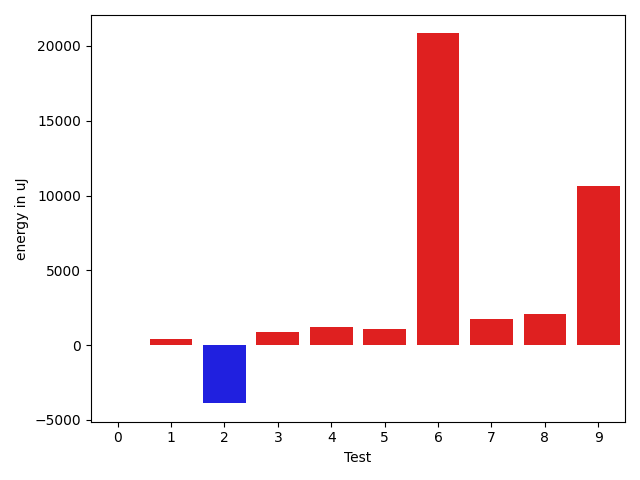

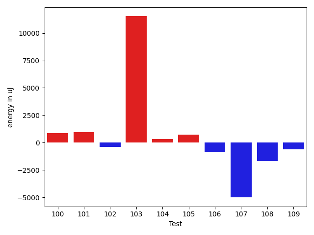

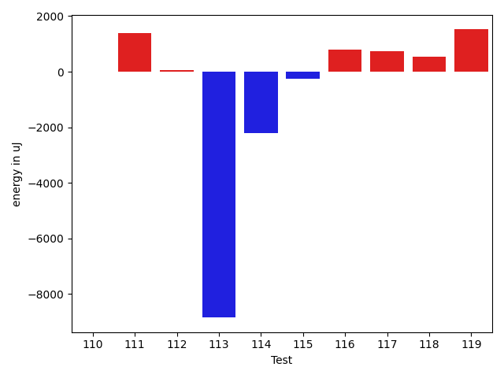

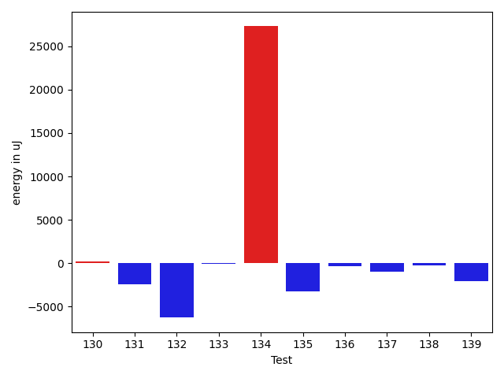

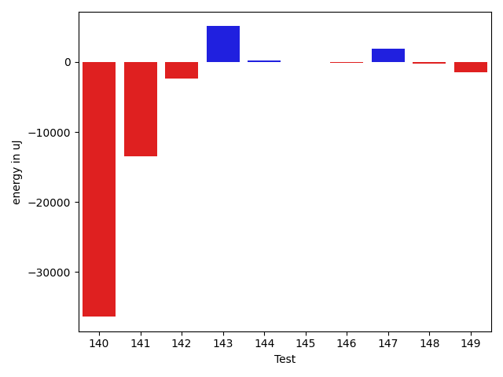

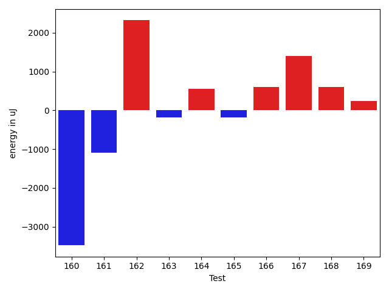

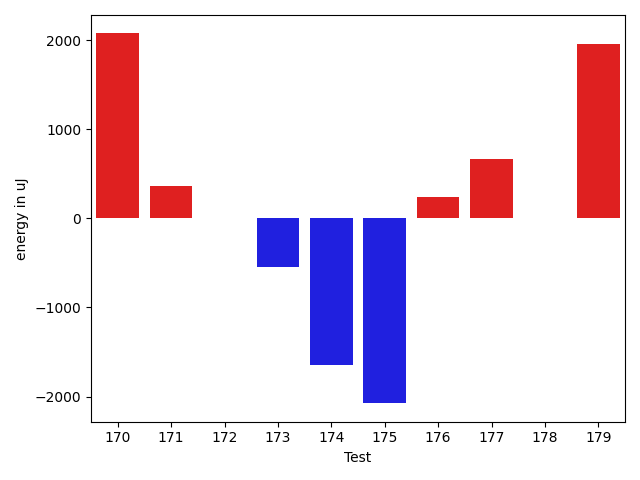

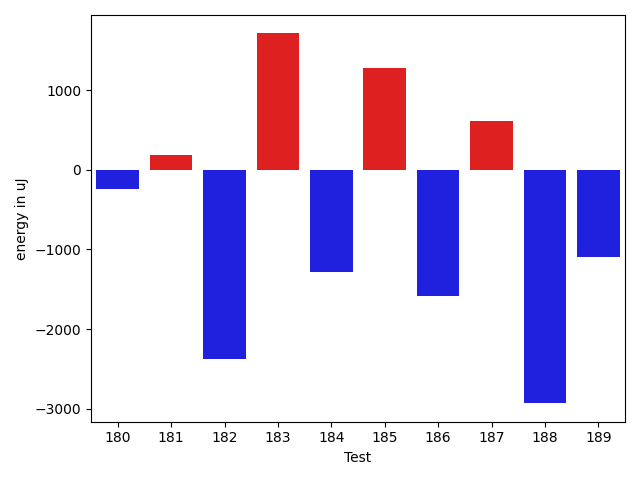

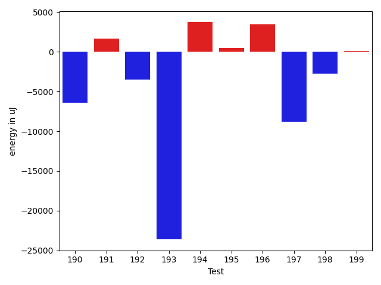

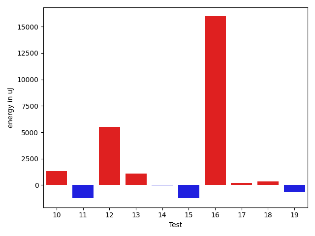

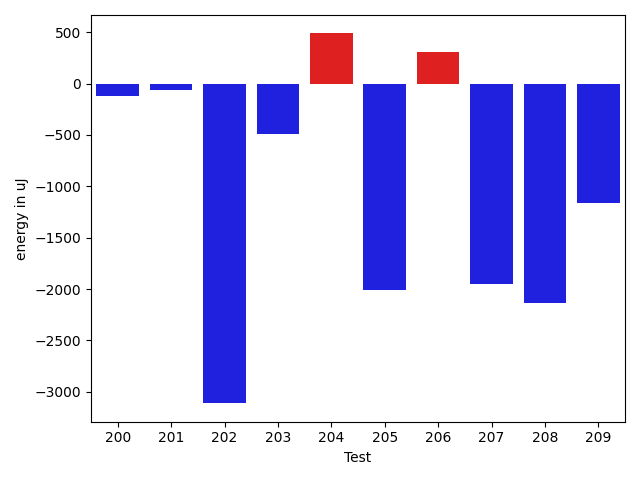

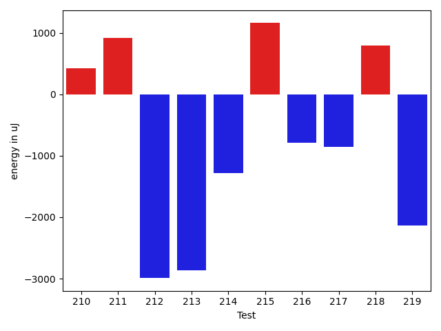

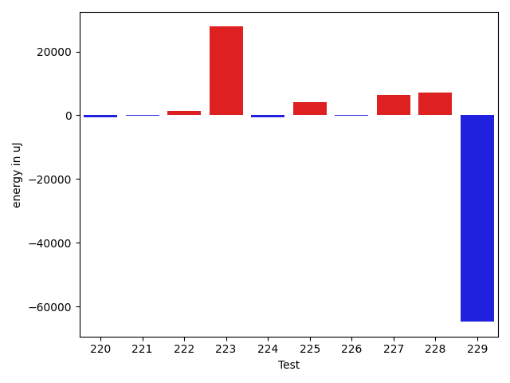

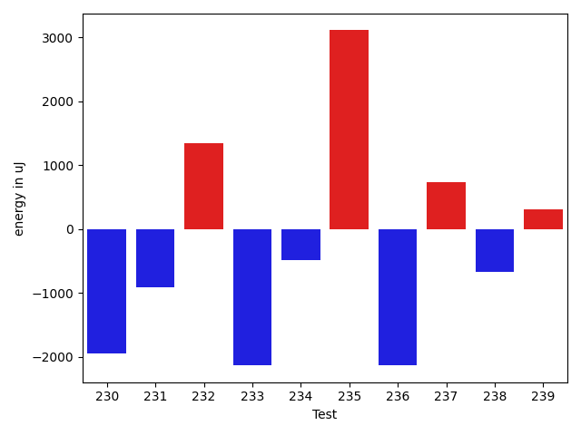

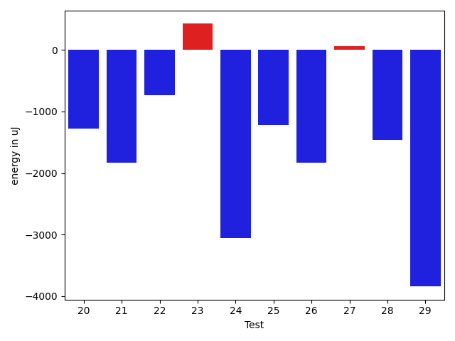

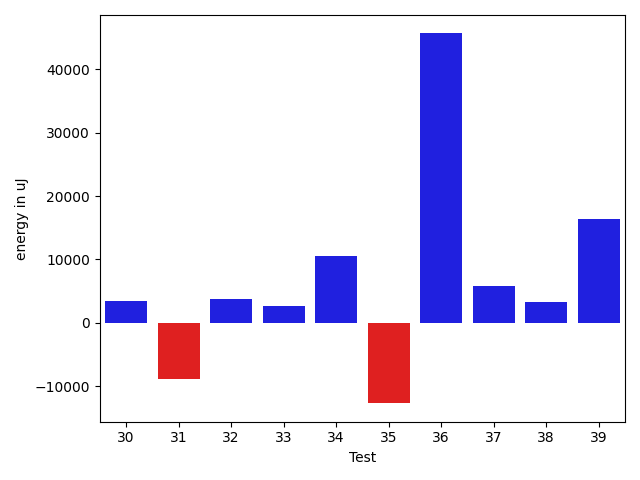

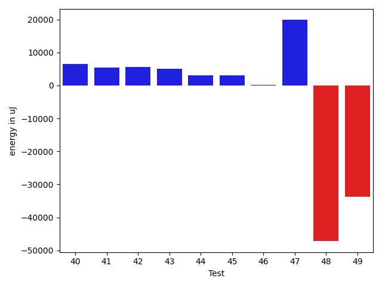

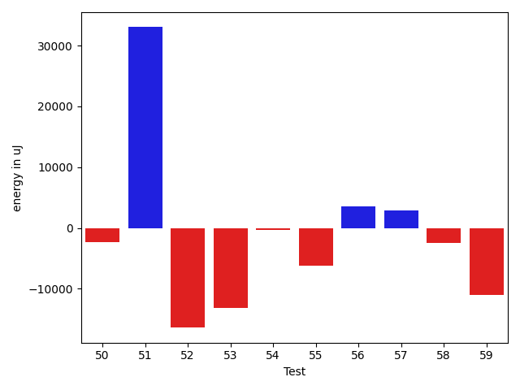

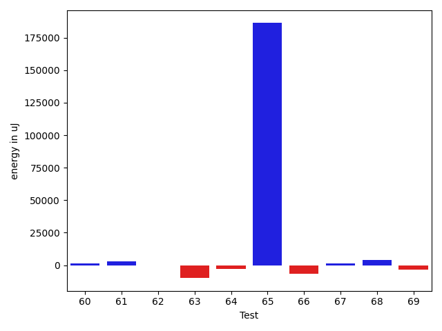

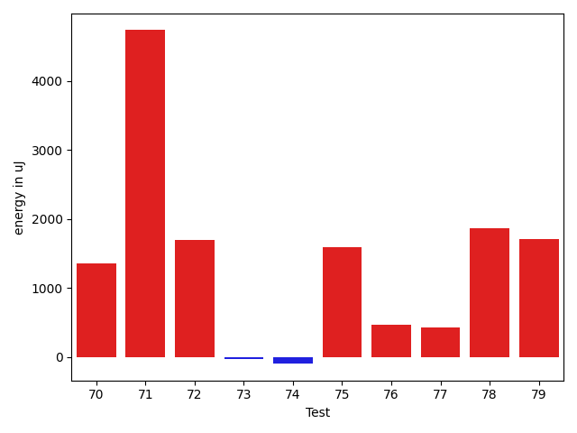

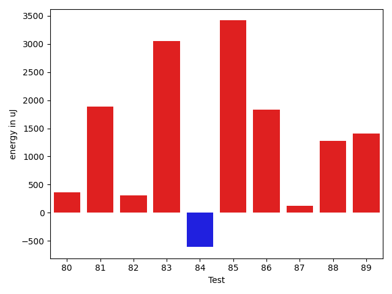

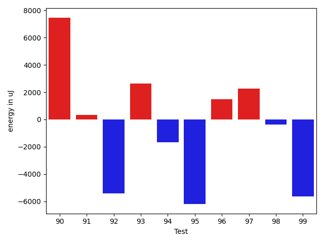

| ID | EnergyV1 | EnergyV2 | DeltaEnergy |
| --- | --- | --- | --- |
| 0 | 53193.398916402904 | 35987.62087502678 | -17205.77804137612 |
| 1 | 40616.97270284772 | 39075.28287209102 | -1541.6898307567026 |
| 2 | 34348.83034231016 | 35769.86387398839 | 1421.0335316782293 |
| 3 | 35665.84307130426 | 38460.942610334605 | 2795.0995390303433 |
| 4 | 134725.0867604776 | 148716.08555147814 | 13990.998791000544 |
| 5 | 36252.191449318205 | 39723.076893239115 | 3470.88544392091 |
| 6 | 35405.96308628547 | 35151.306207574904 | -254.65687871056434 |
| 7 | 36509.45906172492 | 37239.42791712559 | 729.9688554006716 |
| 8 | 36104.92431717167 | 52434.359969234094 | 16329.43565206242 |
| 9 | 41672.68816850201 | 48127.28878579108 | 6454.60061728907 |
| 10 | 38861.835138221664 | 39439.86836872338 | 578.0332305017146 |
| 11 | 39401.08682573204 | 47469.970876550564 | 8068.884050818524 |
| 12 | 40664.250314248835 | 35585.66847426222 | -5078.581839986618 |
| 13 | 43428.93052546913 | 40488.998824669194 | -2939.9317007999343 |
| 14 | 38134.83444920482 | 42160.63147544861 | 4025.7970262437884 |
| 15 | 38946.15365625551 | 41288.91968657494 | 2342.766030319428 |
| 16 | 39374.33413773443 | 84726.09679439105 | 45351.76265665662 |
| 17 | 39374.09928814546 | 40925.011882675935 | 1550.9125945304768 |
| 18 | 65268.2208803832 | 110290.15259851515 | 45021.93171813195 |
| 19 | 39359.568339294005 | 39591.35468369629 | 231.7863444022878 |
| 20 | 40396.56064335488 | 41951.71328028031 | 1555.152636925428 |
| 21 | 41995.22789222028 | 38164.65703788133 | -3830.5708543389555 |
| 22 | 33429.06733343589 | 40785.5894409562 | 7356.522107520315 |
| 23 | 128722.6756866519 | 58471.15122397656 | -70251.52446267534 |
| 24 | 36967.07589546405 | 38126.12230800826 | 1159.0464125442086 |
| 25 | 39358.45569012428 | 45426.921675107485 | 6068.465984983202 |
| 26 | 62482.26042443115 | 56607.378137251246 | -5874.882287179906 |
| 27 | 42547.38407776403 | 38098.57489098295 | -4448.80918678108 |
| 28 | 60104.5535807602 | 41236.71331702068 | -18867.84026373952 |
| 29 | 47824.53597651402 | 46932.609068572114 | -891.9269079419028 |
| 30 | 40037.77034962277 | 43487.22893043147 | 3449.4585808086995 |
| 31 | 63406.72009355053 | 54580.6608636547 | -8826.059229895829 |
| 32 | 39435.58980279234 | 43139.289834504256 | 3703.7000317119164 |
| 33 | 37880.59987466246 | 40529.57259261328 | 2648.972717950819 |
| 34 | 38692.59827057179 | 49298.89153622091 | 10606.293265649118 |
| 35 | 90237.14977293868 | 77573.83825956608 | -12663.311513372595 |
| 36 | 69642.39597137508 | 115276.57786851178 | 45634.1818971367 |
| 37 | 36288.270112836304 | 42145.440516379385 | 5857.170403543081 |
| 38 | 36092.12509969404 | 39399.3788248677 | 3307.2537251736576 |
| 39 | 33027.3314747334 | 49359.52608448457 | 16332.194609751168 |
| 40 | 32665.41182923317 | 39202.9382211566 | 6537.526391923428 |
| 41 | 36669.89364884179 | 42091.855682943744 | 5421.9620341019545 |
| 42 | 34891.39299330661 | 40501.30795037971 | 5609.914957073102 |
| 43 | 35212.422473461615 | 40195.71822348598 | 4983.295750024365 |
| 44 | 35682.41135215759 | 38680.37154453993 | 2997.9601923823357 |
| 45 | 37712.11623995006 | 40767.72958755493 | 3055.613347604871 |
| 46 | 35551.516067028046 | 35752.691161453724 | 201.17509442567825 |
| 47 | 175439.31354078682 | 195273.04661910323 | 19833.733078316407 |
| 48 | 143451.5762520738 | 96281.78894195819 | -47169.787310115615 |
| 49 | 118874.47125296493 | 85068.73047584767 | -33805.74077711726 |
| 50 | 41915.91197755645 | 39568.74577639997 | -2347.1662011564767 |
| 51 | 42098.16635784041 | 75130.5766343486 | 33032.41027650819 |
| 52 | 54556.33486794455 | 38155.09788292632 | -16401.23698501823 |
| 53 | 65914.80027625704 | 52701.570014440396 | -13213.230261816643 |
| 54 | 34830.0170275633 | 34466.011397592476 | -364.00562997082307 |
| 55 | 78543.45061039142 | 72351.45470544646 | -6191.9959049449535 |
| 56 | 31845.005132742182 | 35432.13105742 | 3587.125924677821 |
| 57 | 33309.5415959552 | 36213.61514972772 | 2904.0735537725195 |
| 58 | 39946.36417200044 | 37417.30018444965 | -2529.0639875507914 |
| 59 | 49264.262913395585 | 38201.6772968438 | -11062.585616551783 |
| 60 | 37488.022423463044 | 39006.171208543135 | 1518.1487850800913 |
| 61 | 35428.033942490816 | 38364.00205880514 | 2935.968116314325 |
| 62 | 32217.41090774536 | 32218.963950157166 | 1.5530424118041992 |
| 63 | 46729.90085550205 | 36835.570451955195 | -9894.330403546854 |
| 64 | 38269.14473080635 | 35640.45393657684 | -2628.6907942295074 |
| 65 | 187186.7526937898 | 373442.64490650775 | 186255.89221271794 |
| 66 | 41303.74756813049 | 34495.68527910113 | -6808.06228902936 |
| 67 | 35368.45616778545 | 36676.82016634941 | 1308.3639985639602 |
| 68 | 34148.76071170138 | 38371.586057771725 | 4222.825346070342 |
| 69 | 49725.574918047496 | 46252.02057837071 | -3473.5543396767825 |
| 70 | 47892.598207473755 | 38139.54306206107 | -9753.055145412683 |
| 71 | 37674.31058025189 | 34686.08428930632 | -2988.2262909455676 |
| 72 | 32366.996620714664 | 41645.68324035406 | 9278.686619639397 |
| 73 | 34847.768886466125 | 37695.27605232309 | 2847.507165856965 |
| 74 | 34753.12437294796 | 33734.8429907104 | -1018.281382237561 |
| 75 | 34010.088003603654 | 36785.93388330507 | 2775.8458797014173 |
| 76 | 34468.19971691942 | 35620.61262525822 | 1152.4129083387961 |
| 77 | 38040.90410733223 | 36263.30187119171 | -1777.6022361405194 |
| 78 | 38324.690564262346 | 36939.386059670476 | -1385.3045045918698 |
| 79 | 38974.13175237179 | 38996.70284423223 | 22.57109186044545 |
| 80 | 39878.70863841599 | 39137.61500506338 | -741.0936333526115 |
| 81 | 34549.16410326958 | 38282.599353671074 | 3733.435250401497 |
| 82 | 34855.397090911865 | 31374.86572265625 | -3480.5313682556152 |
| 83 | 40110.13673419571 | 39154.89439933236 | -955.2423348633456 |
| 84 | 34144.94544755978 | 37349.516125790775 | 3204.5706782309935 |
| 85 | 36747.87539577484 | 37348.95130157471 | 601.0759057998657 |
| 86 | 35282.55639933005 | 37291.29404541105 | 2008.7376460809974 |
| 87 | 35903.83203932643 | 63108.224155411124 | 27204.392116084695 |
| 88 | 34969.6801712513 | 34704.98674201965 | -264.6934292316437 |
| 89 | 31870.567878164817 | 37820.49868343072 | 5949.9308052659035 |
| 90 | 38804.29082463309 | 36447.261316789314 | -2357.0295078437775 |
| 91 | 34661.924964904785 | 39817.06664276123 | 5155.141677856445 |
| 92 | 37171.39770290675 | 40110.757400512695 | 2939.359697605949 |
| 93 | 31754.133410692215 | 35620.05549620837 | 3865.9220855161548 |
| 94 | 40324.27212474123 | 37239.8358658799 | -3084.4362588613294 |
| 95 | 34070.55239868164 | 33530.37931060791 | -540.1730880737305 |
| 96 | 94478.38951794358 | 119726.4116670228 | 25248.022149079217 |
| 97 | 38121.4064559891 | 38762.20475076338 | 640.7982947742858 |
| 98 | 41572.49404617399 | 36140.46482086182 | -5432.029225312173 |
| 99 | 36731.753087209996 | 39525.60813236322 | 2793.855045153221 |
| 100 | 35161.16420066357 | 39429.325971568935 | 4268.161770905368 |
| 101 | 37343.55214416504 | 35608.85444337566 | -1734.6977007893802 |
| 102 | 35979.063403826905 | 38444.05642992072 | 2464.9930260938127 |
| 103 | 35685.1064453125 | 35107.307861328125 | -577.798583984375 |
| 104 | 50196.48467417582 | 46928.64958371688 | -3267.835090458946 |
| 105 | 40792.94727248285 | 41155.706849283655 | 362.7595768008032 |
| 106 | 42145.75902847997 | 42294.99342581291 | 149.23439733293344 |
| 107 | 40253.74870773043 | 37771.731801652815 | -2482.016906077617 |
| 108 | 37162.743057305015 | 39791.89531667606 | 2629.152259371047 |
| 109 | 40591.32430521157 | 42649.025989300084 | 2057.7016840885117 |
| 110 | 40319.172397013004 | 42104.191749314195 | 1785.0193523011912 |
| 111 | 38773.08839842286 | 39827.53197234046 | 1054.4435739176042 |
| 112 | 37096.60313892844 | 41270.7058693844 | 4174.102730455961 |
| 113 | 39356.03200302308 | 37672.23741031438 | -1683.7945927086985 |
| 114 | 39611.432294544116 | 41884.479472731706 | 2273.0471781875895 |
| 115 | 36967.05388986971 | 38497.454712366685 | 1530.400822496973 |
| 116 | 38791.26911194343 | 36459.17584211752 | -2332.093269825913 |
| 117 | 37216.06635461748 | 36835.97818631958 | -380.0881682978943 |
| 118 | 37685.21247743722 | 38756.68390182033 | 1071.4714243831113 |
| 119 | 38229.329828332484 | 36941.11228925511 | -1288.2175390773773 |
| 120 | 44273.32808328445 | 36250.07798378767 | -8023.250099496778 |
| 121 | 44825.70485682668 | 39210.91887299718 | -5614.785983829497 |
| 122 | 41051.81002310105 | 37757.148805618286 | -3294.6612174827605 |
| 123 | 133475.43574307713 | 88937.85766807987 | -44537.57807499726 |
| 124 | 39840.865093738015 | 40380.34279003739 | 539.4776962993783 |
| 125 | 40614.46076534671 | 31987.469400353548 | -8626.991364993162 |
| 126 | 35526.254104342974 | 36667.91802131575 | 1141.6639169727787 |
| 127 | 41123.88957823068 | 37558.512634277344 | -3565.3769439533353 |
| 128 | 35779.507323990416 | 32637.85906057364 | -3141.648263416777 |
| 129 | 41885.67292606083 | 40904.03162670198 | -981.6412993588528 |
| 130 | 38823.484233021736 | 37957.53518676758 | -865.949046254158 |
| 131 | 35285.8312651217 | 40318.24102020992 | 5032.409755088222 |
| 132 | 39978.75637103617 | 35130.08806246519 | -4848.668308570981 |
| 133 | 39198.664887428284 | 37418.054937880486 | -1780.6099495477974 |
| 134 | 37356.05193448067 | 38247.700268592685 | 891.6483341120183 |
| 135 | 37457.58879370593 | 40320.66596564645 | 2863.0771719405166 |
| 136 | 37235.06661635019 | 39507.605403237045 | 2272.5387868868565 |
| 137 | 138903.2494214406 | 39948.969951769745 | -98954.27946967084 |
| 138 | 52969.777741984144 | 79588.22926312344 | 26618.4515211393 |
| 139 | 37907.25624835485 | 40835.157312289484 | 2927.9010639346307 |
| 140 | 120697.76303280698 | 84295.74731600285 | -36402.01571680413 |
| 141 | 52800.71291908606 | 39293.919440796315 | -13506.793478289743 |
| 142 | 41630.087007235736 | 39234.57107079029 | -2395.515936445445 |
| 143 | 145005.49382843325 | 150105.2044226799 | 5099.710594246659 |
| 144 | 37767.651811150834 | 37957.8617869108 | 190.20997575996444 |
| 145 | 37273.98804866942 | 37307.017405655584 | 33.02935698616784 |
| 146 | 38704.95219324957 | 38539.282454093656 | -165.6697391559137 |
| 147 | 38677.90206267748 | 40560.04391163132 | 1882.141848953841 |
| 148 | 38853.04836422205 | 38601.34427791089 | -251.70408631116152 |
| 149 | 38711.53747051845 | 37261.57048058277 | -1449.9669899356813 |
| 150 | 38975.208607673645 | 39170.314682006836 | 195.10607433319092 |
| 151 | 42162.975006516484 | 42565.95077773637 | 402.97577121988434 |
| 152 | 38610.09443049563 | 39412.87392658648 | 802.7794960908504 |
| 153 | 164738.9383732643 | 58757.34006244107 | -105981.59831082323 |
| 154 | 40131.66021017215 | 43640.91300912777 | 3509.2527989556183 |
| 155 | 36626.21498827557 | 41054.50439895902 | 4428.28941068345 |
| 156 | 97522.27275458493 | 200301.1514427984 | 102778.87868821347 |
| 157 | 37626.94425062509 | 57907.61536416466 | 20280.671113539567 |
| 158 | 33001.024894952774 | 39953.653440418704 | 6952.62854546593 |
| 159 | 37010.85409215093 | 40424.484440173954 | 3413.630348023027 |
| 160 | 38465.68847298622 | 35964.11229544878 | -2501.5761775374413 |
| 161 | 34698.84504902363 | 40365.263147354126 | 5666.418098330498 |
| 162 | 40388.42904314827 | 147584.0872255491 | 107195.65818240083 |
| 163 | 37147.83500671387 | 40314.73336941004 | 3166.898362696171 |
| 164 | 46088.10509349406 | 56432.404443621635 | 10344.299350127578 |
| 165 | 38609.85844777338 | 36396.51700267941 | -2213.3414450939745 |
| 166 | 53007.25030515365 | 184054.73660111736 | 131047.48629596371 |
| 167 | 41466.28832373023 | 37108.28281221166 | -4358.005511518568 |
| 168 | 68423.35248504512 | 47697.47178391254 | -20725.880701132584 |
| 169 | 37160.76410065017 | 36636.10270817528 | -524.661392474889 |
| 170 | 36441.3539616144 | 38241.9270451621 | 1800.5730835477007 |
| 171 | 35048.6106776814 | 37504.06426384864 | 2455.453586167241 |
| 172 | 37404.08575783619 | 38799.445498522524 | 1395.3597406863337 |
| 173 | 35816.527708657144 | 37020.78001534853 | 1204.2523066913855 |
| 174 | 37735.509487828196 | 38912.74796343791 | 1177.2384756097163 |
| 175 | 39677.33875123577 | 37311.74964301131 | -2365.5891082244634 |
| 176 | 32481.33626711352 | 34989.17729715643 | 2507.8410300429096 |
| 177 | 42664.02118142217 | 59705.164118267785 | 17041.142936845616 |
| 178 | 38251.03273134118 | 36909.055533134146 | -1341.9771982070379 |
| 179 | 39333.160493558986 | 44247.80749754724 | 4914.647003988255 |
| 180 | 37298.118812561035 | 35241.94635939598 | -2056.1724531650543 |
| 181 | 38408.52919312395 | 49332.513190013284 | 10923.983996889336 |
| 182 | 385622.78863964556 | 437151.5202196671 | 51528.73158002156 |
| 183 | 33873.509674522546 | 40929.61212837009 | 7056.102453847547 |
| 184 | 39482.635559767485 | 40048.778882717714 | 566.143322950229 |
| 185 | 59624.47577759187 | 71179.26280145918 | 11554.787023867306 |
| 186 | 38687.18669182062 | 36068.50219126544 | -2618.6845005551804 |
| 187 | 34713.275820680894 | 36135.73247488402 | 1422.4566542031243 |
| 188 | 51434.01541207079 | 39896.935455426574 | -11537.079956644215 |
| 189 | 39663.35103115067 | 37227.658143252134 | -2435.6928878985345 |
| 190 | 35949.2039262997 | 35512.119611889124 | -437.08431441057473 |
| 191 | 36622.788531303406 | 39009.2119038105 | 2386.4233725070953 |
| 192 | 183398.92458716995 | 226256.18274418352 | 42857.258157013566 |
| 193 | 326066.7924054799 | 454441.16865916393 | 128374.37625368405 |
| 194 | 70318.56427173634 | 39487.54173296887 | -30831.022538767465 |
| 195 | 227417.24587977896 | 39649.91433280706 | -187767.3315469719 |
| 196 | 38848.50010965785 | 41572.27046204421 | 2723.77035238636 |
| 197 | 89200.86437633302 | 71557.97401511326 | -17642.89036121976 |
| 198 | 41280.31583717735 | 38707.907576586 | -2572.40826059135 |
| 199 | 35149.11748402631 | 35381.636742662056 | 232.51925863574434 |
| 200 | 42322.81883066421 | 36990.30290691556 | -5332.515923748651 |
| 201 | 218001.03384347478 | 79394.34399670459 | -138606.6898467702 |
| 202 | 35780.335254943 | 36013.08718424372 | 232.7519293007208 |
| 203 | 38929.59051555559 | 39773.720631434146 | 844.1301158785573 |
| 204 | 37305.725712911866 | 38579.84720314469 | 1274.121490232821 |
| 205 | 40930.53180663012 | 38613.49384124767 | -2317.0379653824493 |
| 206 | 38737.75756161199 | 40390.34575255458 | 1652.5881909425952 |
| 207 | 37081.24119453126 | 38989.8943172582 | 1908.653122726937 |
| 208 | 39122.74015980961 | 39884.79602644165 | 762.0558666320358 |
| 209 | 42870.4757931911 | 123622.34089284667 | 80751.86509965557 |
| 210 | 90995.55702989324 | 142821.1808905269 | 51825.62386063367 |
| 211 | 41483.73762257397 | 35783.72358703613 | -5700.014035537839 |
| 212 | 34624.418358668685 | 36868.41522852704 | 2243.9968698583543 |
| 213 | 41205.26168668643 | 621497.231873326 | 580291.9701866396 |
| 214 | 36343.14965455793 | 79382.47551174276 | 43039.32585718483 |
| 215 | 36318.40494298935 | 32254.196229690686 | -4064.2087132986635 |
| 216 | 35714.061319589615 | 35385.81542682648 | -328.2458927631378 |
| 217 | 36091.0126660628 | 40878.791791929114 | 4787.779125866313 |
| 218 | 35588.34702086454 | 41351.31776179392 | 5762.970740929384 |
| 219 | 39298.17226108308 | 38355.97413848911 | -942.1981225939671 |
| 220 | 39500.00714950586 | 43608.88776628376 | 4108.880616777904 |
| 221 | 45644.913707884596 | 57299.00431334591 | 11654.090605461315 |
| 222 | 41764.88655756071 | 41421.23589841617 | -343.65065914454317 |
| 223 | 67279.51299931278 | 74705.83619197039 | 7426.323192657612 |
| 224 | 41550.11004803587 | 39155.04921488853 | -2395.0608331473413 |
| 225 | 59381.83286690537 | 67085.9796684977 | 7704.146801592331 |
| 226 | 39602.61294869571 | 45590.547655649054 | 5987.934706953347 |
| 227 | 37230.52511761595 | 39781.50601367379 | 2550.9808960578375 |
| 228 | 69786.16304189817 | 71528.47692825166 | 1742.3138863534987 |
| 229 | 61961.03380387589 | 39443.85628186212 | -22517.17752201377 |
| 230 | 137776.6565527289 | 68286.13514323752 | -69490.52140949138 |
| 231 | 134382.94038711058 | 51399.43025936134 | -82983.51012774924 |
| 232 | 46627.44985693317 | 43747.03195301857 | -2880.4179039145965 |
| 233 | 61678.21878647152 | 49570.730615615845 | -12107.488170855679 |
| 234 | 42455.93344202152 | 44394.92411738503 | 1938.990675363515 |
| 235 | 41649.478615283966 | 69173.42256593704 | 27523.943950653076 |
| 236 | 44184.61523362157 | 39567.18580826552 | -4617.429425356044 |
| 237 | 38851.37861537933 | 42463.57658136124 | 3612.1979659819044 |
| 238 | 51096.2164753144 | 39924.56925594022 | -11171.64721937418 |
| 239 | 33913.533557623625 | 38559.63027006388 | 4646.096712440252 |
| 240 | 40746.51110874035 | 50444.05034642728 | 9697.539237686928 |
| 241 | 36500.223676621914 | 33802.80711934809 | -2697.4165572738275 |
| 242 | 37842.53673176933 | 39836.2820253931 | 1993.7452936237678 |
| 243 | 41652.05119567071 | 36661.210203874914 | -4990.840991795798 |
| 244 | 38317.764427308284 | 40577.26473396041 | 2259.500306652124 |

## Delta Duration per test method

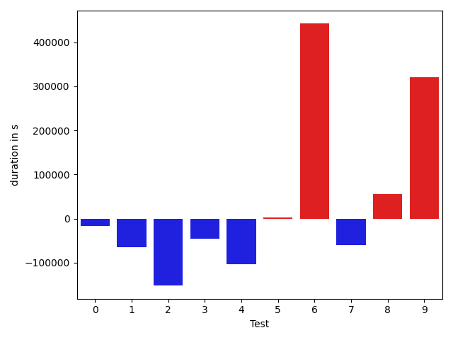

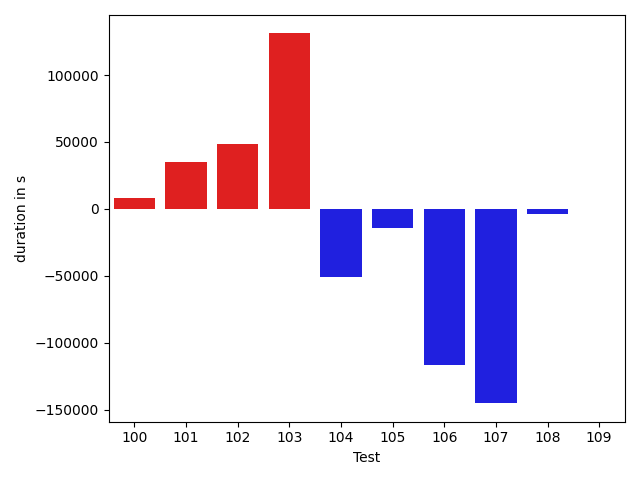

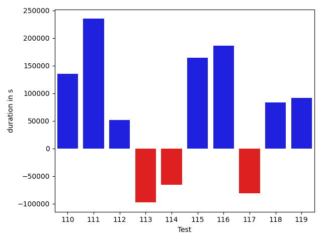

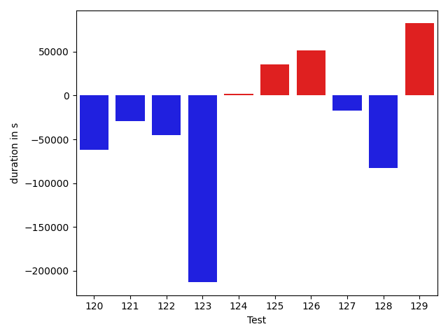

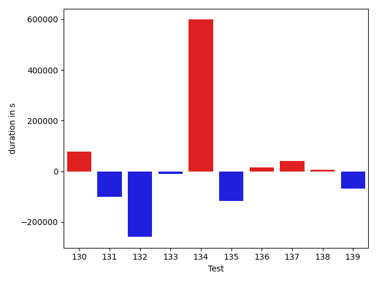

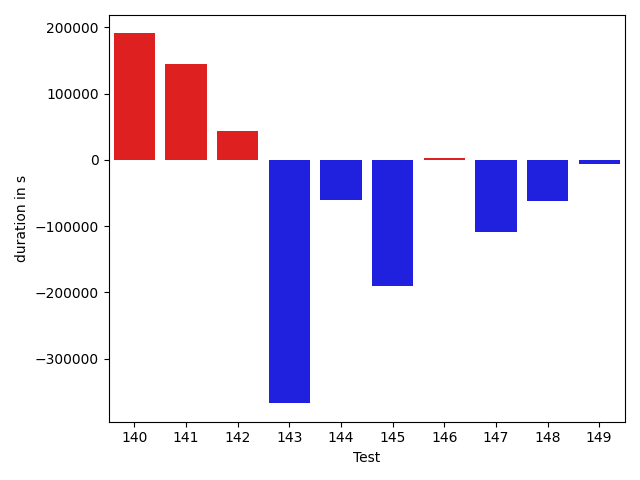

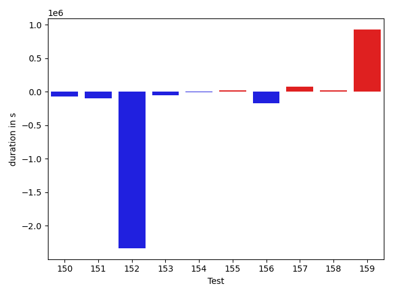

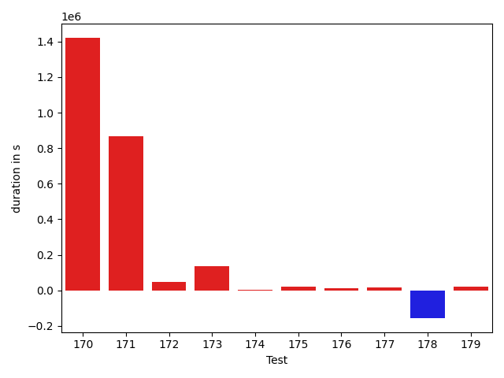

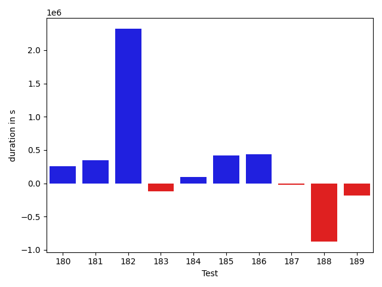

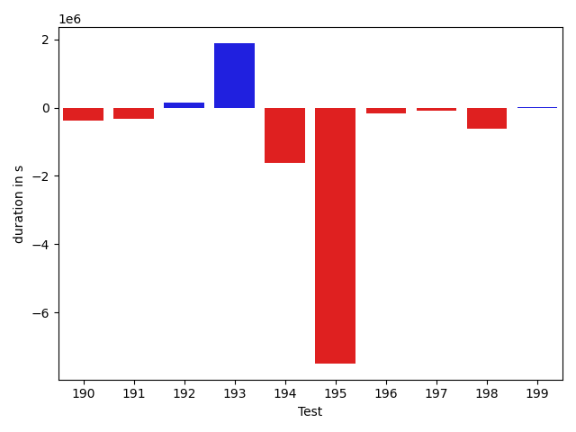

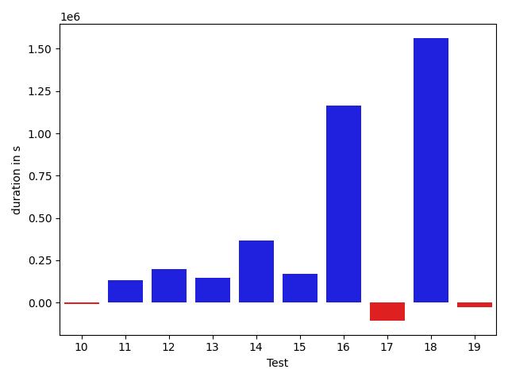

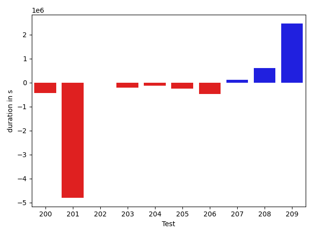

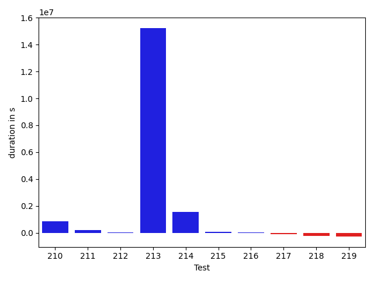

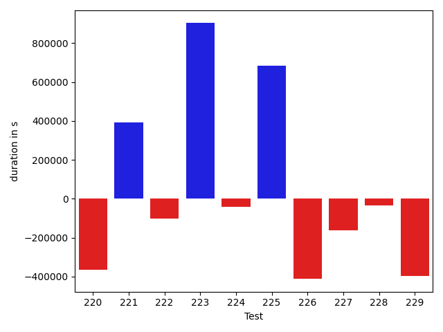

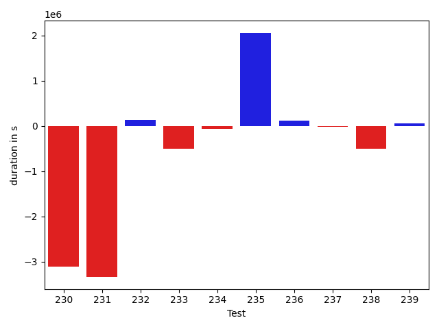

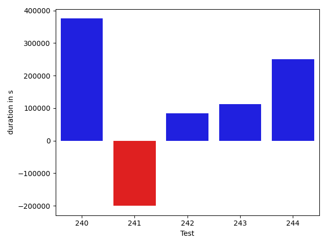

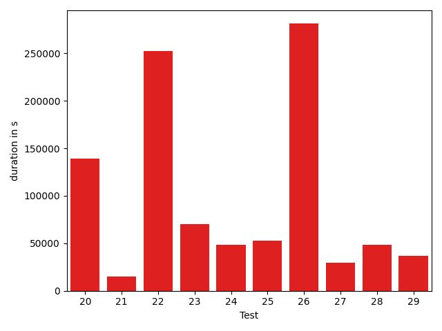

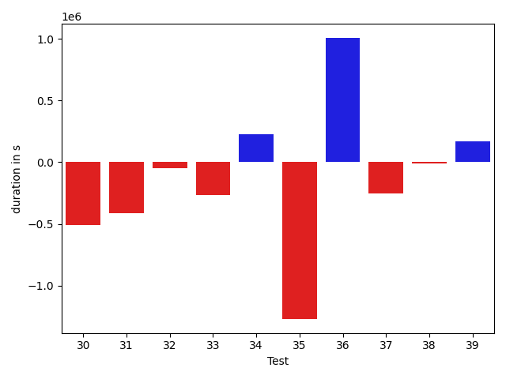

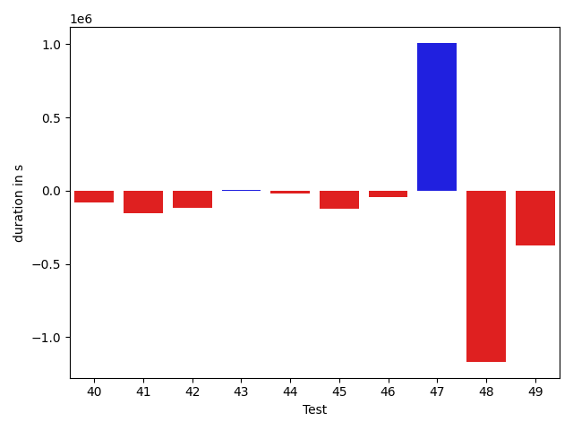

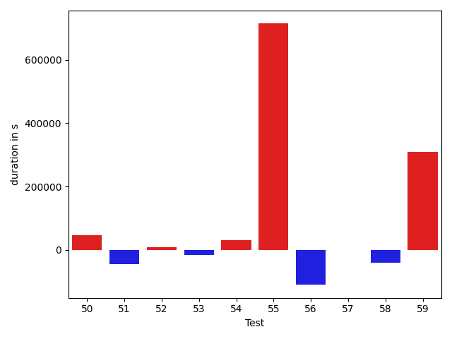

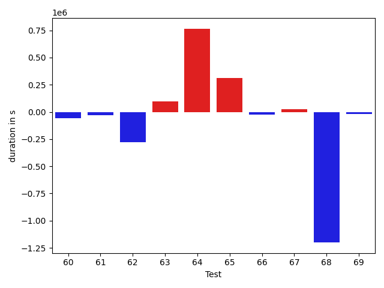

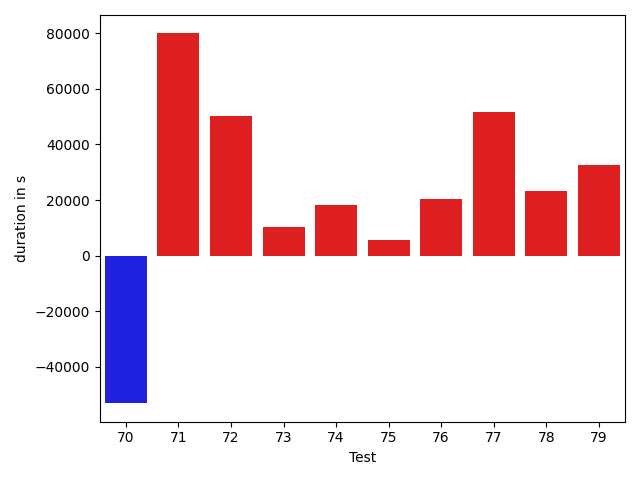

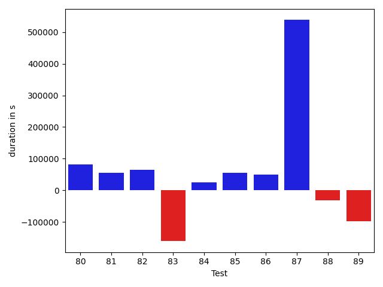

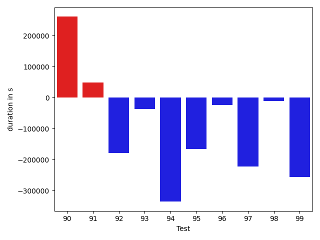

| ID | DurationV1 | DurationsV2 | DeltaDuration |
| --- | --- | --- | --- |
| 0 | 1850699.6035354114 | 1327009.0552738623 | -523690.5482615491 |
| 1 | 908306.2537492504 | 764333.4168924056 | -143972.83685684483 |
| 2 | 569514.7344689082 | 580633.4961998239 | 11118.76173091575 |
| 3 | 562201.5652383734 | 430825.8313527703 | -131375.73388560303 |
| 4 | 3826325.25341375 | 4056231.6694273883 | 229906.4160136385 |
| 5 | 1036917.5842387197 | 983502.6768740813 | -53414.907364638406 |
| 6 | 729757.9454347328 | 490122.693208633 | -239635.25222609984 |
| 7 | 942590.3160521782 | 826427.632574603 | -116162.68347757519 |
| 8 | 570657.1406687535 | 1084563.9036040418 | 513906.76293528825 |
| 9 | 1285758.1116370545 | 1408530.356458801 | 122772.2448217466 |
| 10 | 706328.9576649151 | 697893.0734626808 | -8435.88420223433 |
| 11 | 1087731.9407912001 | 1221324.5899436958 | 133592.64915249567 |
| 12 | 678524.7081460619 | 875226.3337762209 | 196701.62563015905 |
| 13 | 548256.6360028586 | 694458.6966380473 | 146202.0606351887 |
| 14 | 490195.4229600036 | 854746.4065933228 | 364550.98363331915 |
| 15 | 651414.2481152022 | 819173.0507133515 | 167758.80259814928 |
| 16 | 474379.31570139114 | 1639665.7927714773 | 1165286.4770700862 |
| 17 | 891252.8525445795 | 784043.4520168758 | -107209.40052770369 |
| 18 | 1141423.5510283983 | 2704871.5271792933 | 1563447.976150895 |
| 19 | 957101.1384831241 | 927281.8531952045 | -29819.28528791957 |
| 20 | 788109.811014419 | 698244.877453614 | -89864.93356080493 |
| 21 | 976471.6467987029 | 994069.3565130704 | 17597.70971436752 |
| 22 | 1227682.8569913767 | 830835.2434714185 | -396847.6135199582 |
| 23 | 3235406.1639223206 | 1814463.616495907 | -1420942.5474264135 |
| 24 | 688227.1757617798 | 641803.8974680786 | -46423.27829370112 |
| 25 | 1105900.541519296 | 1007695.6525837601 | -98204.8889355358 |
| 26 | 1986406.9557494519 | 1619124.186689484 | -367282.76905996795 |
| 27 | 1020607.7872707554 | 1127691.835554078 | 107084.0482833226 |
| 28 | 1558161.459639553 | 1389261.2158820264 | -168900.24375752662 |
| 29 | 1144874.2214121912 | 975374.4909144046 | -169499.73049778654 |
| 30 | 1518484.777740277 | 1008285.998075367 | -510198.77966490993 |
| 31 | 2252873.632450075 | 1839549.5173156366 | -413324.11513443827 |
| 32 | 1003963.6929380936 | 952819.4536984398 | -51144.239239653805 |
| 33 | 820477.9177690875 | 554923.8074180984 | -265554.11035098904 |
| 34 | 631160.4702455439 | 856871.5053660572 | 225711.0351205133 |
| 35 | 2958603.087994393 | 1689622.0739068496 | -1268981.0140875434 |
| 36 | 1664822.5086379172 | 2672250.540585935 | 1007428.0319480179 |
| 37 | 1041339.3403141773 | 787059.8854554581 | -254279.45485871925 |
| 38 | 632297.8074668774 | 621443.6347583112 | -10854.172708566184 |
| 39 | 715593.1153076154 | 885875.8226729189 | 170282.70736530353 |
| 40 | 550962.2954342365 | 470816.8966304064 | -80145.39880383015 |
| 41 | 712755.1910078466 | 558710.6875435745 | -154044.50346427213 |
| 42 | 888153.5448050227 | 770446.3280838997 | -117707.21672112297 |
| 43 | 561666.0673637845 | 566650.5276611241 | 4984.460297339596 |
| 44 | 461453.9325618744 | 443345.49154496193 | -18108.44101691246 |
| 45 | 433336.05937837064 | 310295.1466331482 | -123040.91274522245 |
| 46 | 451111.30255031586 | 404637.97296997905 | -46473.32958033681 |
| 47 | 4512831.705569105 | 5521844.7470621 | 1009013.0414929949 |
| 48 | 4090290.973641185 | 2921575.210174395 | -1168715.7634667903 |
| 49 | 3192668.3921665717 | 2819466.086029946 | -373202.3061366258 |
| 50 | 674423.9147348306 | 833906.2301378697 | 159482.3154030391 |
| 51 | 723532.5899730413 | 1961740.830953314 | 1238208.2409802726 |
| 52 | 1743021.9841393628 | 909123.0336930526 | -833898.9504463102 |
| 53 | 1994965.9306728102 | 1730893.8590348463 | -264072.0716379639 |
| 54 | 1021194.5222798276 | 882797.1501064415 | -138397.37217338616 |
| 55 | 2657124.725303228 | 1954196.4260919306 | -702928.2992112974 |
| 56 | 1154158.6753353956 | 810695.598120705 | -343463.0772146906 |
| 57 | 1221596.0307706872 | 981560.0230100382 | -240036.00776064896 |
| 58 | 657056.6495718509 | 536932.491841249 | -120124.15773060184 |
| 59 | 1525312.807928883 | 1014662.5465299729 | -510650.2613989101 |
| 60 | 835571.74698968 | 861238.9964869522 | 25667.24949727219 |
| 61 | 498194.7164335437 | 444240.6028741261 | -53954.1135594176 |
| 62 | 527590.611787796 | 472635.2456548214 | -54955.366132974625 |
| 63 | 1040523.94398477 | 764994.8631869801 | -275529.08079778985 |
| 64 | 427314.89388012886 | 371927.75852298737 | -55387.135357141495 |
| 65 | 5145859.441404196 | 9416007.759321678 | 4270148.317917482 |
| 66 | 764075.2933337688 | 396661.4083689749 | -367413.8849647939 |
| 67 | 513307.3410277534 | 545307.0775322914 | 31999.736504537985 |
| 68 | 603845.04233276 | 524832.184958879 | -79012.85737388092 |
| 69 | 1500624.3934406743 | 1552962.186201679 | 52337.79276100476 |
| 70 | 913280.3272354044 | 495004.10525771976 | -418276.22197768465 |
| 71 | 457640.4360027649 | 581773.7566336677 | 124133.32063090283 |
| 72 | 620190.5565735698 | 563760.5288266242 | -56430.02774694562 |
| 73 | 815135.3360396044 | 730549.7681214949 | -84585.56791810947 |
| 74 | 731541.7199777942 | 390855.74732865253 | -340685.9726491417 |
| 75 | 519713.07712367515 | 622431.3438104349 | 102718.26668675977 |
| 76 | 658085.1949548642 | 686137.3828529532 | 28052.187898088945 |
| 77 | 429081.3271431923 | 379992.5697660092 | -49088.757377183065 |
| 78 | 713455.5493445075 | 748195.7114392857 | 34740.16209477815 |
| 79 | 462804.8805937767 | 477516.32585708826 | 14711.445263311558 |
| 80 | 457426.15544726327 | 538325.9289125144 | 80899.77346525108 |
| 81 | 498964.1958067715 | 554094.1965059042 | 55130.00069913268 |
| 82 | 384156.85329818726 | 448486.12365722656 | 64329.27035903931 |
| 83 | 730006.1745897022 | 569092.7492283145 | -160913.42536138766 |
| 84 | 466955.5805829802 | 491353.0229608752 | 24397.442377895 |
| 85 | 414785.01786088943 | 470444.7883911133 | 55659.77053022385 |
| 86 | 426305.0089173819 | 475935.87614050135 | 49630.86722311942 |
| 87 | 611631.6865616962 | 1150342.7797655463 | 538711.0932038501 |
| 88 | 418324.9834831953 | 386800.44862651825 | -31524.534856677055 |
| 89 | 540895.0601790019 | 442876.73586593894 | -98018.32431306294 |
| 90 | 577535.8764854446 | 515620.5070924759 | -61915.369392968714 |
| 91 | 412321.8977766037 | 335344.2535934448 | -76977.64418315887 |
| 92 | 482571.73849585373 | 527051.8065299988 | 44480.06803414505 |
| 93 | 543727.2536227703 | 352322.57095148414 | -191404.68267128617 |
| 94 | 434037.0159317292 | 411108.4817184936 | -22928.5342132356 |
| 95 | 367583.0135345459 | 400714.3586845398 | 33131.3451499939 |
| 96 | 3002320.89614045 | 3083447.0093677454 | 81126.11322729522 |
| 97 | 629550.5457126729 | 641448.160622676 | 11897.614910003147 |
| 98 | 560981.9273324534 | 559038.5634613037 | -1943.3638711497188 |
| 99 | 557167.1351726729 | 689397.1873717853 | 132230.05219911237 |
| 100 | 465263.7235379815 | 570019.1611087285 | 104755.43757074699 |
| 101 | 662463.0468233009 | 669299.5902741662 | 6836.5434508653125 |
| 102 | 515887.8262044827 | 486425.61430339795 | -29462.211901084753 |
| 103 | 383159.2482910156 | 427461.1716308594 | 44301.92333984375 |
| 104 | 2572882.9738077936 | 1365932.639272036 | -1206950.3345357575 |
| 105 | 669046.6695805556 | 1012389.5048019743 | 343342.83522141865 |
| 106 | 778897.2028612837 | 1242704.9466315955 | 463807.7437703118 |
| 107 | 702880.0042421444 | 957239.8387294862 | 254359.8344873418 |
| 108 | 576464.9961990209 | 893083.3611715089 | 316618.364972488 |
| 109 | 818100.2830209138 | 872455.9938292891 | 54355.71080837527 |
| 110 | 456170.84736964677 | 591070.9884894914 | 134900.14111984463 |
| 111 | 794246.3235639762 | 1029017.3957121011 | 234771.07214812492 |
| 112 | 1399653.8314434697 | 1451226.1313752118 | 51572.29993174202 |
| 113 | 830761.7662073595 | 732838.3724072315 | -97923.39380012802 |
| 114 | 855584.3807305887 | 790185.1136819441 | -65399.2670486446 |
| 115 | 331110.1683454057 | 495472.06074355356 | 164361.89239814784 |
| 116 | 628497.0826823264 | 814022.3705023048 | 185525.28781997832 |
| 117 | 629339.1608578726 | 548589.1111012148 | -80750.0497566578 |
| 118 | 728976.6085308595 | 812117.4780337997 | 83140.86950294022 |
| 119 | 706608.6662312227 | 797693.78229452 | 91085.11606329726 |
| 120 | 1092085.6636136826 | 895985.1649546748 | -196100.49865900783 |
| 121 | 792270.5242301594 | 928652.6619168922 | 136382.1376867328 |
| 122 | 547139.7063615881 | 560304.873670578 | 13165.167308989912 |
| 123 | 3264954.4588882113 | 2795052.5339726047 | -469901.9249156066 |
| 124 | 490788.691682512 | 456533.9500723481 | -34254.74161016388 |
| 125 | 872602.8679605736 | 882433.1253554828 | 9830.25739490916 |
| 126 | 787264.2789627964 | 949914.6327940655 | 162650.35383126908 |
| 127 | 491838.36663794145 | 577187.7939453125 | 85349.42730737105 |
| 128 | 718082.4395648631 | 681923.4048065422 | -36159.03475832089 |
| 129 | 878038.2537675707 | 944800.5468288301 | 66762.29306125944 |
| 130 | 422931.1733021736 | 435991.4787607193 | 13060.305458545685 |
| 131 | 501054.2728434503 | 623891.3499453142 | 122837.07710186392 |
| 132 | 557493.7180572301 | 488334.55567353964 | -69159.16238369048 |
| 133 | 532558.3770797253 | 545289.3132767528 | 12730.936197027564 |
| 134 | 489696.36606895924 | 594823.0708363913 | 105126.70476743206 |
| 135 | 1109778.3391210495 | 1042572.604530974 | -67205.73459007556 |
| 136 | 745711.6381722824 | 506020.1571274251 | -239691.4810448573 |
| 137 | 3536880.8019697717 | 865437.1763781067 | -2671443.625591665 |
| 138 | 1523453.7446230692 | 1786688.567356548 | 263234.82273347885 |
| 139 | 953176.7808856019 | 1094829.2790933857 | 141652.4982077838 |
| 140 | 3457228.0335198776 | 2259557.0381742716 | -1197670.995345606 |
| 141 | 917297.1962139271 | 1059928.2907689842 | 142631.09455505712 |
| 142 | 312068.9610896036 | 599722.7655608654 | 287653.8044712618 |
| 143 | 4092302.731486497 | 4053097.4585481654 | -39205.27293833159 |
| 144 | 593542.1742188283 | 639267.8905386766 | 45725.71631984832 |
| 145 | 491475.11527666636 | 617492.446954714 | 126017.33167804766 |
| 146 | 1021769.34731381 | 638276.3029484906 | -383493.0443653194 |
| 147 | 783779.6669098889 | 949977.0016313734 | 166197.33472148457 |
| 148 | 422929.8459459543 | 670699.6063845456 | 247769.76043859124 |
| 149 | 610094.164089117 | 598115.7096078526 | -11978.454481264343 |
| 150 | 777472.2384736538 | 422188.55924987793 | -355283.67922377586 |
| 151 | 1320076.036959373 | 806053.3946964031 | -514022.64226296986 |
| 152 | 1100678.9850237046 | 740954.3413271032 | -359724.6436966014 |
| 153 | 4363182.242126772 | 1968761.9138379367 | -2394420.3282888355 |
| 154 | 1382442.6310071049 | 1021373.4277655577 | -361069.2032415472 |
| 155 | 619819.3373236257 | 1049150.861573868 | 429331.5242502423 |
| 156 | 2755080.1767529394 | 5171110.032543834 | 2416029.855790895 |
| 157 | 921594.1126081675 | 1711889.3800211598 | 790295.2674129923 |
| 158 | 702797.8952050358 | 817740.8629175284 | 114942.96771249257 |
| 159 | 477452.3245508438 | 788605.5782144256 | 311153.2536635818 |
| 160 | 538516.2231398225 | 651417.2317765951 | 112901.00863677263 |
| 161 | 460945.3631602526 | 739535.9940834045 | 278590.63092315197 |
| 162 | 1037466.2302655887 | 3964109.118954259 | 2926642.8886886705 |
| 163 | 417084.94921875 | 388203.77780652046 | -28881.171412229538 |
| 164 | 1058807.756460093 | 1296095.8768718243 | 237288.1204117313 |
| 165 | 623290.7659991886 | 978787.9809056818 | 355497.2149064932 |
| 166 | 1337988.7968905508 | 5829467.550838558 | 4491478.753948007 |
| 167 | 596077.4980279505 | 900812.3701055888 | 304734.8720776383 |
| 168 | 2000515.516241624 | 1283779.3957659432 | -716736.1204756808 |
| 169 | 585066.7198341332 | 661129.660647724 | 76062.94081359089 |
| 170 | 573008.4172862181 | 572116.66053159 | -891.7567546281498 |
| 171 | 551121.7407119977 | 469037.3376771965 | -82084.40303480125 |
| 172 | 610362.74395773 | 555561.2024418348 | -54801.541515895166 |
| 173 | 1240882.0749589032 | 1106923.9730063817 | -133958.1019525216 |
| 174 | 1177653.0460122968 | 1157708.5122463221 | -19944.533765974687 |
| 175 | 1217480.5100876046 | 1214771.4935409455 | -2709.0165466591716 |
| 176 | 1137864.4457951572 | 1349936.827830284 | 212072.38203512668 |
| 177 | 1035465.9324758822 | 1324774.1747023761 | 289308.2422264939 |
| 178 | 885310.1382392482 | 749395.926673944 | -135914.2115653042 |
| 179 | 797922.7453149329 | 627531.5845572775 | -170391.1607576554 |
| 180 | 403371.08216667175 | 658849.0008275509 | 255477.91866087914 |
| 181 | 1160253.841483599 | 1505720.0529915798 | 345466.2115079807 |
| 182 | 10525590.846420392 | 12847997.865947098 | 2322407.019526705 |
| 183 | 1010226.2931206143 | 890428.8564063975 | -119797.43671421672 |
| 184 | 432806.18447840214 | 526483.3450571876 | 93677.16057878546 |
| 185 | 2120674.9239406157 | 2537555.272805214 | 416880.3488645982 |
| 186 | 373650.97874648124 | 809680.6878010391 | 436029.70905455784 |
| 187 | 732112.4764032243 | 713281.4472646788 | -18831.029138545506 |
| 188 | 1379210.8332230654 | 504667.81853322685 | -874543.0146898385 |
| 189 | 734723.9735368732 | 548218.953276962 | -186505.0202599112 |
| 190 | 902421.0489941621 | 528108.6477670372 | -374312.40122712497 |
| 191 | 721203.7631058693 | 394216.6177802384 | -326987.1453256309 |
| 192 | 5927949.996424545 | 6079552.54625191 | 151602.5498273652 |
| 193 | 9695294.782704115 | 11583394.532578671 | 1888099.7498745564 |
| 194 | 2269010.4326582295 | 651301.4164609698 | -1617709.0161972595 |
| 195 | 8209504.142051331 | 712474.8702471666 | -7497029.271804164 |
| 196 | 1064616.9151127017 | 884766.1665988492 | -179850.74851385248 |
| 197 | 2492748.5114237834 | 2409397.900261393 | -83350.61116239056 |
| 198 | 1314702.9454906178 | 685569.6319714023 | -629133.3135192154 |
| 199 | 583735.1039115873 | 586025.7998357937 | 2290.695924206404 |
| 200 | 1106472.5596598613 | 677048.8242500627 | -429423.73540979857 |
| 201 | 6853369.928852123 | 2052539.9680294204 | -4800829.960822703 |
| 202 | 804477.5691657262 | 795023.0698396799 | -9454.499326046323 |
| 203 | 1112434.7628992829 | 899615.8817765843 | -212818.88112269854 |
| 204 | 812215.8613624277 | 688229.5548686415 | -123986.30649378616 |
| 205 | 790114.3060970989 | 548415.5825440077 | -241698.72355309117 |
| 206 | 1095069.2603213578 | 619680.1027951275 | -475389.1575262302 |
| 207 | 915786.6853402832 | 1032580.9520162476 | 116794.26667596435 |
| 208 | 802331.1294567201 | 1406259.7334270715 | 603928.6039703514 |
| 209 | 1093827.5744868177 | 3562841.3145329356 | 2469013.740046118 |
| 210 | 2895811.6998116835 | 3757150.879381922 | 861339.1795702386 |
| 211 | 528171.4292729348 | 734572.9856567383 | 206401.5563838035 |
| 212 | 442357.3887511939 | 465949.2617639806 | 23591.87301278673 |
| 213 | 781525.1149149276 | 16014082.39520123 | 15232557.280286303 |
| 214 | 578032.8989330707 | 2118697.449946532 | 1540664.5510134613 |
| 215 | 454737.9642138481 | 527173.93077139 | 72435.96655754186 |
| 216 | 438190.74221611023 | 457940.25378894806 | 19749.51157283783 |
| 217 | 898890.6219468592 | 801014.7315772483 | -97875.89036961086 |
| 218 | 1201032.8360310106 | 958901.6882041441 | -242131.14782686648 |
| 219 | 1138509.690069325 | 860694.8109637373 | -277814.8791055877 |
| 220 | 1291854.5806298505 | 927290.8355934188 | -364563.7450364317 |
| 221 | 1012158.4521104135 | 1403031.1950817718 | 390872.74297135836 |
| 222 | 838610.0112375345 | 736353.9957823372 | -102256.01545519731 |
| 223 | 1561441.508878973 | 2464305.5257827532 | 902864.0169037802 |
| 224 | 683624.478830799 | 642062.6212863381 | -41561.857544460916 |
| 225 | 1357658.092352302 | 2042706.732020851 | 685048.639668549 |
| 226 | 1169037.730405127 | 757212.0827832774 | -411825.64762184955 |
| 227 | 1411053.5040023334 | 1249341.1168359532 | -161712.38716638018 |
| 228 | 2264674.367812537 | 2232012.5508197416 | -32661.81699279556 |
| 229 | 1868278.0210989732 | 1472709.0492721074 | -395568.9718268658 |
| 230 | 4453265.390342508 | 1353416.694142336 | -3099848.6962001724 |
| 231 | 4327153.119997032 | 994988.2077126633 | -3332164.9122843686 |
| 232 | 813449.5512910993 | 945650.4950541155 | 132200.94376301626 |
| 233 | 1239801.0428741723 | 734353.0447487831 | -505447.9981253892 |
| 234 | 775822.7838880053 | 714612.6201327778 | -61210.16375522746 |
| 235 | 608778.1594395638 | 2666271.8010385036 | 2057493.64159894 |
| 236 | 853509.511700114 | 971088.3464917663 | 117578.83479165228 |
| 237 | 496410.35373449326 | 484277.4841874079 | -12132.86954708537 |
| 238 | 1518516.772467168 | 1011290.4503847195 | -507226.3220824485 |
| 239 | 697527.16687572 | 754200.5162436664 | 56673.349367946386 |
| 240 | 1100645.740974461 | 1475860.4683507218 | 375214.7273762608 |
| 241 | 896835.5520291924 | 696516.9252137812 | -200318.62681541126 |
| 242 | 681678.74007909 | 765168.5802184381 | 83489.84013934806 |
| 243 | 921491.7408960979 | 1033353.5599181047 | 111861.81902200682 |
| 244 | 655010.7875513624 | 905025.6245016624 | 250014.83695030003 |

## Misc.

| ID | Test Class | Test Method |
| --- | --- | --- |
| 0 | com.google.gson.functional.StreamingTypeAdaptersTest | testNullSafe |
| 1 | com.google.gson.functional.StreamingTypeAdaptersTest | testSerializeWithCustomTypeAdapter |
| 2 | com.google.gson.functional.StreamingTypeAdaptersTest | testSerializeRecursive |
| 3 | com.google.gson.functional.StreamingTypeAdaptersTest | testDeserializeWithCustomTypeAdapter |
| 4 | com.google.gson.functional.JsonAdapterAnnotationOnClassesTest | testJsonAdapterInvoked |
| 5 | com.google.gson.functional.JsonAdapterAnnotationOnClassesTest | testRegisteredSerializerOverridesJsonAdapter |
| 6 | com.google.gson.functional.JsonAdapterAnnotationOnClassesTest | testIncorrectTypeAdapterFails |
| 7 | com.google.gson.functional.JsonAdapterAnnotationOnClassesTest | testRegisteredDeserializerOverridesJsonAdapter |
| 8 | com.google.gson.functional.JsonAdapterAnnotationOnClassesTest | testSuperclassTypeAdapterNotInvoked |
| 9 | com.google.gson.functional.CustomDeserializerTest | testDefaultConstructorNotCalledOnObject |
| 10 | com.google.gson.functional.CustomDeserializerTest | testCustomDeserializerReturnsNull |
| 11 | com.google.gson.functional.CustomDeserializerTest | testJsonTypeFieldBasedDeserialization |
| 12 | com.google.gson.functional.CustomDeserializerTest | testCustomDeserializerReturnsNullForArrayElementsForArrayField |
| 13 | com.google.gson.functional.CustomDeserializerTest | testDefaultConstructorNotCalledOnField |
| 14 | com.google.gson.functional.JsonParserTest | testBadTypeForDeserializingCustomTree |
| 15 | com.google.gson.functional.JsonParserTest | testBadFieldTypeForDeserializingCustomTree |
| 16 | com.google.gson.functional.JsonParserTest | testBadFieldTypeForCustomDeserializerCustomTree |
| 17 | com.google.gson.functional.JsonParserTest | testChangingCustomTreeAndDeserializing |
| 18 | com.google.gson.functional.JsonParserTest | testDeserializingCustomTree |
| 19 | com.google.gson.functional.ParameterizedTypesTest | testParameterizedTypeGenericArraysSerialization |
| 20 | com.google.gson.functional.ParameterizedTypesTest | testParameterizedTypesWithWriterSerialization |
| 21 | com.google.gson.functional.ParameterizedTypesTest | testVariableTypeArrayDeserialization |
| 22 | com.google.gson.functional.ParameterizedTypesTest | testParameterizedTypeWithReaderDeserialization |
| 23 | com.google.gson.functional.ParameterizedTypesTest | testParameterizedTypesSerialization |
| 24 | com.google.gson.functional.ParameterizedTypesTest | testDeepParameterizedTypeSerialization |
| 25 | com.google.gson.functional.ParameterizedTypesTest | testVariableTypeDeserialization |
| 26 | com.google.gson.functional.ParameterizedTypesTest | testVariableTypeFieldsAndGenericArraysSerialization |
| 27 | com.google.gson.functional.ParameterizedTypesTest | testParameterizedTypeGenericArraysDeserialization |
| 28 | com.google.gson.functional.ParameterizedTypesTest | testParameterizedTypeDeserialization |
| 29 | com.google.gson.functional.ParameterizedTypesTest | testVariableTypeFieldsAndGenericArraysDeserialization |
| 30 | com.google.gson.functional.ParameterizedTypesTest | testTypesWithMultipleParametersDeserialization |
| 31 | com.google.gson.functional.ParameterizedTypesTest | testTypesWithMultipleParametersSerialization |
| 32 | com.google.gson.functional.ParameterizedTypesTest | testParameterizedTypeWithVariableTypeDeserialization |
| 33 | com.google.gson.functional.ParameterizedTypesTest | testDeepParameterizedTypeDeserialization |
| 34 | com.google.gson.functional.InheritanceTest | testBaseSerializedAsBaseWhenSpecifiedWithExplicitType |
| 35 | com.google.gson.functional.InheritanceTest | testSubInterfacesOfCollectionSerialization |
| 36 | com.google.gson.functional.InheritanceTest | testBaseSerializedAsSubForToJsonMethod |
| 37 | com.google.gson.functional.InheritanceTest | testSubInterfacesOfCollectionDeserialization |
| 38 | com.google.gson.functional.InheritanceTest | testClassWithBaseArrayFieldSerialization |
| 39 | com.google.gson.functional.InheritanceTest | testSubClassDeserialization |
| 40 | com.google.gson.functional.InheritanceTest | testBaseSerializedAsSubWhenSpecifiedWithExplicitTypeForToJsonMethod |
| 41 | com.google.gson.functional.InheritanceTest | testClassWithBaseCollectionFieldSerialization |
| 42 | com.google.gson.functional.InheritanceTest | testSubClassSerialization |
| 43 | com.google.gson.functional.InheritanceTest | testClassWithBaseFieldSerialization |
| 44 | com.google.gson.functional.InheritanceTest | testBaseSerializedAsSubWhenSpecifiedWithExplicitType |
| 45 | com.google.gson.functional.InheritanceTest | testBaseSerializedAsBaseWhenSpecifiedWithExplicitTypeForToJsonMethod |
| 46 | com.google.gson.functional.InheritanceTest | testBaseSerializedAsSub |
| 47 | com.google.gson.functional.CircularReferenceTest | testCircularSerialization |
| 48 | com.google.gson.functional.CircularReferenceTest | testSelfReferenceArrayFieldSerialization |
| 49 | com.google.gson.functional.CircularReferenceTest | testSelfReferenceSerialization |
| 50 | com.google.gson.functional.CircularReferenceTest | testDirectedAcyclicGraphSerialization |
| 51 | com.google.gson.functional.CircularReferenceTest | testDirectedAcyclicGraphDeserialization |
| 52 | com.google.gson.functional.MapTest | testMapSerializationWithNullValues |
| 53 | com.google.gson.functional.MapTest | testInterfaceTypeMapWithSerializer |
| 54 | com.google.gson.functional.MapTest | testGeneralMapField |
| 55 | com.google.gson.functional.MapTest | testInterfaceTypeMap |
| 56 | com.google.gson.functional.MapTest | testComplexKeysDeserialization |
| 57 | com.google.gson.functional.MapTest | testComplexKeysSerialization |
| 58 | com.google.gson.functional.MapTest | testMapSerializationWithNullValuesSerialized |
| 59 | com.google.gson.functional.ObjectTest | testEmptyCollectionInAnObjectDeserialization |
| 60 | com.google.gson.functional.ObjectTest | testSingletonLists |
| 61 | com.google.gson.functional.ObjectTest | testNullFieldsSerialization |
| 62 | com.google.gson.functional.ObjectTest | testClassWithTransientFieldsDeserialization |
| 63 | com.google.gson.functional.ObjectTest | testArrayOfObjectsAsFields |
| 64 | com.google.gson.functional.ObjectTest | testClassWithTransientFieldsDeserializationTransientFieldsPassedInJsonAreIgnored |
| 65 | com.google.gson.functional.ObjectTest | testDateAsMapObjectField |
| 66 | com.google.gson.functional.ObjectTest | testNullArraysDeserialization |
| 67 | com.google.gson.functional.ObjectTest | testObjectFieldNamesWithoutQuotesDeserialization |
| 68 | com.google.gson.functional.ObjectTest | testArrayOfObjectsDeserialization |
| 69 | com.google.gson.functional.ObjectTest | testArrayOfArraysSerialization |
| 70 | com.google.gson.functional.ObjectTest | testJsonInSingleQuotesDeserialization |
| 71 | com.google.gson.functional.ObjectTest | testClassWithTransientFieldsSerialization |
| 72 | com.google.gson.functional.ObjectTest | testBagOfPrimitivesDeserialization |
| 73 | com.google.gson.functional.ObjectTest | testInnerClassDeserialization |
| 74 | com.google.gson.functional.ObjectTest | testPrimitiveArrayInAnObjectDeserialization |
| 75 | com.google.gson.functional.ObjectTest | testArrayOfObjectsSerialization |
| 76 | com.google.gson.functional.ObjectTest | testArrayOfArraysDeserialization |
| 77 | com.google.gson.functional.ObjectTest | testStringFieldWithNumberValueDeserialization |
| 78 | com.google.gson.functional.ObjectTest | testInnerClassSerialization |
| 79 | com.google.gson.functional.ObjectTest | testEmptyCollectionInAnObjectSerialization |
| 80 | com.google.gson.functional.ObjectTest | testNestedSerialization |
| 81 | com.google.gson.functional.ObjectTest | testPrimitiveArrayFieldSerialization |
| 82 | com.google.gson.functional.ObjectTest | testClassWithNoFieldsSerialization |
| 83 | com.google.gson.functional.ObjectTest | testBagOfPrimitiveWrappersSerialization |
| 84 | com.google.gson.functional.ObjectTest | testBagOfPrimitivesSerialization |
| 85 | com.google.gson.functional.ObjectTest | testJsonInMixedQuotesDeserialization |
| 86 | com.google.gson.functional.ObjectTest | testNullFieldsDeserialization |
| 87 | com.google.gson.functional.ObjectTest | testNullPrimitiveFieldsDeserialization |
| 88 | com.google.gson.functional.ObjectTest | testClassWithObjectFieldSerialization |
| 89 | com.google.gson.functional.ObjectTest | testBagOfPrimitiveWrappersDeserialization |
| 90 | com.google.gson.functional.ObjectTest | testNestedDeserialization |
| 91 | com.google.gson.functional.ObjectTest | testStringFieldWithEmptyValueDeserialization |
| 92 | com.google.gson.functional.ObjectTest | testStringFieldWithEmptyValueSerialization |
| 93 | com.google.gson.functional.ObjectTest | testNullObjectFieldsDeserialization |
| 94 | com.google.gson.functional.ObjectTest | testPrivateNoArgConstructorDeserialization |
| 95 | com.google.gson.functional.ObjectTest | testClassWithNoFieldsDeserialization |
| 96 | com.google.gson.functional.ExposeFieldsTest | testNullExposeFieldSerialization |
| 97 | com.google.gson.functional.ExposeFieldsTest | testExposedInterfaceFieldSerialization |
| 98 | com.google.gson.functional.ExposeFieldsTest | testExposedInterfaceFieldDeserialization |
| 99 | com.google.gson.functional.ExposeFieldsTest | testArrayWithOneNullExposeFieldObjectSerialization |
| 100 | com.google.gson.functional.ExposeFieldsTest | testExposeAnnotationDeserialization |
| 101 | com.google.gson.functional.ExposeFieldsTest | testNoExposedFieldSerialization |
| 102 | com.google.gson.functional.ExposeFieldsTest | testExposeAnnotationSerialization |
| 103 | com.google.gson.functional.ExposeFieldsTest | testNoExposedFieldDeserialization |
| 104 | com.google.gson.functional.MoreSpecificTypeSerializationTest | testSubclassFields |
| 105 | com.google.gson.functional.MoreSpecificTypeSerializationTest | testParameterizedSubclassFields |
| 106 | com.google.gson.functional.MoreSpecificTypeSerializationTest | testMapOfSubclassFields |
| 107 | com.google.gson.functional.MoreSpecificTypeSerializationTest | testListOfParameterizedSubclassFields |
| 108 | com.google.gson.functional.MoreSpecificTypeSerializationTest | testMapOfParameterizedSubclassFields |
| 109 | com.google.gson.functional.MoreSpecificTypeSerializationTest | testListOfSubclassFields |
| 110 | com.google.gson.functional.NullObjectAndFieldTest | testExplicitDeserializationOfNulls |
| 111 | com.google.gson.functional.NullObjectAndFieldTest | testAbsentJsonElementsAreSetToNull |
| 112 | com.google.gson.functional.NullObjectAndFieldTest | testExplicitSerializationOfNullArrayMembers |
| 113 | com.google.gson.functional.NullObjectAndFieldTest | testExplicitSerializationOfNulls |
| 114 | com.google.gson.functional.NullObjectAndFieldTest | testPrintPrintingObjectWithNulls |
| 115 | com.google.gson.functional.NullObjectAndFieldTest | testNullWrappedPrimitiveMemberDeserialization |
| 116 | com.google.gson.functional.NullObjectAndFieldTest | testExplicitSerializationOfNullStringMembers |
| 117 | com.google.gson.functional.NullObjectAndFieldTest | testExplicitNullSetsFieldToNullDuringDeserialization |
| 118 | com.google.gson.functional.NullObjectAndFieldTest | testExplicitSerializationOfNullCollectionMembers |
| 119 | com.google.gson.functional.NullObjectAndFieldTest | testNullWrappedPrimitiveMemberSerialization |
| 120 | com.google.gson.JsonParserTest | testReadWriteTwoObjects |
| 121 | com.google.gson.functional.NamingPolicyTest | testGsonWithNonDefaultFieldNamingPolicySerialization |
| 122 | com.google.gson.functional.NamingPolicyTest | testGsonWithLowerCaseDashPolicyDeserialiation |
| 123 | com.google.gson.functional.NamingPolicyTest | testGsonDuplicateNameUsingSerializedNameFieldNamingPolicySerialization |
| 124 | com.google.gson.functional.NamingPolicyTest | testGsonWithNonDefaultFieldNamingPolicyDeserialiation |
| 125 | com.google.gson.functional.NamingPolicyTest | testComplexFieldNameStrategy |
| 126 | com.google.gson.functional.NamingPolicyTest | testDeprecatedNamingStrategy |
| 127 | com.google.gson.functional.NamingPolicyTest | testGsonWithLowerCaseDashPolicySerialization |
| 128 | com.google.gson.functional.NamingPolicyTest | testAtSignInSerializedName |
| 129 | com.google.gson.functional.NamingPolicyTest | testGsonWithSerializedNameFieldNamingPolicySerialization |
| 130 | com.google.gson.functional.NamingPolicyTest | testGsonWithSerializedNameFieldNamingPolicyDeserialization |
| 131 | com.google.gson.functional.NamingPolicyTest | testGsonWithLowerCaseUnderscorePolicyDeserialiation |
| 132 | com.google.gson.functional.NamingPolicyTest | testGsonWithUpperCamelCaseSpacesPolicyDeserialiation |
| 133 | com.google.gson.functional.NamingPolicyTest | testGsonWithLowerCaseUnderscorePolicySerialization |
| 134 | com.google.gson.functional.NamingPolicyTest | testGsonWithUpperCamelCaseSpacesPolicySerialiation |
| 135 | com.google.gson.functional.FieldExclusionTest | testDefaultInnerClassExclusion |
| 136 | com.google.gson.functional.FieldExclusionTest | testDefaultNestedStaticClassIncluded |
| 137 | com.google.gson.functional.TypeVariableTest | testBasicTypeVariables |
| 138 | com.google.gson.functional.TypeVariableTest | testAdvancedTypeVariables |
| 139 | com.google.gson.functional.TypeVariableTest | testTypeVariablesViaTypeParameter |
| 140 | com.google.gson.functional.ArrayTest | testSingleNullInArraySerialization |
| 141 | com.google.gson.functional.ArrayTest | testObjectArrayWithNonPrimitivesSerialization |
| 142 | com.google.gson.functional.ArrayTest | testSingleNullInArrayDeserialization |
| 143 | com.google.gson.functional.VersioningTest | testVersionedUntilSerialization |
| 144 | com.google.gson.functional.VersioningTest | testVersionedClassesDeserialization |
| 145 | com.google.gson.functional.VersioningTest | testVersionedGsonWithUnversionedClassesSerialization |
| 146 | com.google.gson.functional.VersioningTest | testVersionedClassesSerialization |
| 147 | com.google.gson.functional.VersioningTest | testVersionedGsonMixingSinceAndUntilSerialization |
| 148 | com.google.gson.functional.VersioningTest | testVersionedGsonWithUnversionedClassesDeserialization |
| 149 | com.google.gson.functional.VersioningTest | testVersionedGsonMixingSinceAndUntilDeserialization |
| 150 | com.google.gson.functional.VersioningTest | testVersionedUntilDeserialization |
| 151 | com.google.gson.functional.MapAsArrayTypeAdapterTest | testMultipleEnableComplexKeyRegistrationHasNoEffect |
| 152 | com.google.gson.functional.MapAsArrayTypeAdapterTest | testMapWithTypeVariableDeserialization |
| 153 | com.google.gson.functional.MapAsArrayTypeAdapterTest | testSerializeComplexMapWithTypeAdapter |
| 154 | com.google.gson.functional.MapAsArrayTypeAdapterTest | testMapWithTypeVariableSerialization |
| 155 | com.google.gson.functional.ExclusionStrategyFunctionalTest | testExclusionStrategyWithMode |
| 156 | com.google.gson.functional.ExclusionStrategyFunctionalTest | testExclusionStrategySerialization |
| 157 | com.google.gson.functional.ExclusionStrategyFunctionalTest | testExclusionStrategyDeserialization |
| 158 | com.google.gson.functional.ExclusionStrategyFunctionalTest | testExclusionStrategySerializationDoesNotImpactDeserialization |
| 159 | com.google.gson.functional.ExclusionStrategyFunctionalTest | testExcludeTopLevelClassDeserializationDoesNotImpactSerialization |
| 160 | com.google.gson.functional.ExclusionStrategyFunctionalTest | testExcludeTopLevelClassSerializationDoesNotImpactDeserialization |
| 161 | com.google.gson.functional.ExclusionStrategyFunctionalTest | testExclusionStrategySerializationDoesNotImpactSerialization |
| 162 | com.google.gson.functional.EnumTest | testClassWithEnumFieldSerialization |
| 163 | com.google.gson.functional.EnumTest | testClassWithEnumFieldDeserialization |
| 164 | com.google.gson.functional.UncategorizedTest | testGsonInstanceReusableForSerializationAndDeserialization |
| 165 | com.google.gson.functional.UncategorizedTest | testStaticFieldsAreNotSerialized |
| 166 | com.google.gson.functional.UncategorizedTest | testInvalidJsonDeserializationFails |
| 167 | com.google.gson.functional.UncategorizedTest | testObjectEqualButNotSameSerialization |
| 168 | com.google.gson.functional.FieldNamingTest | testIdentity |
| 169 | com.google.gson.functional.FieldNamingTest | testLowerCaseWithDashes |
| 170 | com.google.gson.functional.FieldNamingTest | testLowerCaseWithUnderscores |
| 171 | com.google.gson.functional.FieldNamingTest | testUpperCamelCase |
| 172 | com.google.gson.functional.FieldNamingTest | testUpperCamelCaseWithSpaces |
| 173 | com.google.gson.functional.RawSerializationTest | testThreeLevelParameterizedObject |
| 174 | com.google.gson.functional.RawSerializationTest | testParameterizedObject |
| 175 | com.google.gson.functional.RawSerializationTest | testCollectionOfObjects |
| 176 | com.google.gson.functional.RawSerializationTest | testTwoLevelParameterizedObject |
| 177 | com.google.gson.functional.InstanceCreatorTest | testInstanceCreatorReturnsBaseType |
| 178 | com.google.gson.functional.InstanceCreatorTest | testInstanceCreatorReturnsSubTypeForField |
| 179 | com.google.gson.functional.InstanceCreatorTest | testInstanceCreatorReturnsSubTypeForTopLevelObject |
| 180 | com.google.gson.functional.DefaultTypeAdaptersTest | testUrlNullDeserialization |
| 181 | com.google.gson.functional.DefaultTypeAdaptersTest | testUrlNullSerialization |
| 182 | com.google.gson.functional.DefaultTypeAdaptersTest | testNullSerialization |
| 183 | com.google.gson.functional.DefaultTypeAdaptersTest | testBigIntegerFieldSerialization |
| 184 | com.google.gson.functional.DefaultTypeAdaptersTest | testBigDecimalFieldDeserialization |
| 185 | com.google.gson.functional.DefaultTypeAdaptersTest | testBigDecimalFieldSerialization |
| 186 | com.google.gson.functional.DefaultTypeAdaptersTest | testBadValueForBigDecimalDeserialization |
| 187 | com.google.gson.functional.DefaultTypeAdaptersTest | testBigIntegerFieldDeserialization |
| 188 | com.google.gson.functional.SecurityTest | testNonExecutableJsonSerialization |
| 189 | com.google.gson.functional.SecurityTest | testJsonWithNonExectuableTokenWithConfiguredGsonDeserialization |
| 190 | com.google.gson.functional.SecurityTest | testNonExecutableJsonDeserialization |
| 191 | com.google.gson.functional.SecurityTest | testJsonWithNonExectuableTokenWithRegularGsonDeserialization |
| 192 | com.google.gson.functional.ConcurrencyTest | testMultiThreadSerialization |
| 193 | com.google.gson.functional.ConcurrencyTest | testMultiThreadDeserialization |
| 194 | com.google.gson.functional.ConcurrencyTest | testSingleThreadDeserialization |
| 195 | com.google.gson.functional.ConcurrencyTest | testSingleThreadSerialization |
| 196 | com.google.gson.functional.CustomTypeAdaptersTest | testCustomNestedDeserializers |
| 197 | com.google.gson.functional.CustomTypeAdaptersTest | testCustomTypeAdapterDoesNotAppliesToSubClasses |
| 198 | com.google.gson.functional.CustomTypeAdaptersTest | testCustomNestedSerializers |
| 199 | com.google.gson.functional.CustomTypeAdaptersTest | testEnsureCustomDeserializerNotInvokedForNullValues |
| 200 | com.google.gson.functional.CustomTypeAdaptersTest | testEnsureCustomSerializerNotInvokedForNullValues |
| 201 | com.google.gson.functional.CustomSerializerTest | testSubClassSerializerInvokedForBaseClassFieldsHoldingSubClassInstances |
| 202 | com.google.gson.functional.CustomSerializerTest | testBaseClassSerializerInvokedForBaseClassFieldsHoldingSubClassInstances |
| 203 | com.google.gson.functional.CustomSerializerTest | testSubClassSerializerInvokedForBaseClassFieldsHoldingArrayOfSubClassInstances |
| 204 | com.google.gson.functional.CustomSerializerTest | testBaseClassSerializerInvokedForBaseClassFields |
| 205 | com.google.gson.functional.InterfaceTest | testSerializingInterfaceObjectField |
| 206 | com.google.gson.functional.InterfaceTest | testSerializingObjectImplementingInterface |
| 207 | com.google.gson.functional.PrettyPrintingTest | testPrettyPrintArrayOfObjects |
| 208 | com.google.gson.functional.PrettyPrintingTest | testEmptyMapField |
| 209 | com.google.gson.functional.PrettyPrintingTest | testPrettyPrintList |
| 210 | com.google.gson.functional.TypeHierarchyAdapterTest | testTypeHierarchy |
| 211 | com.google.gson.MixedStreamTest | testWriteDoesNotMutateState |
| 212 | com.google.gson.MixedStreamTest | testReaderDoesNotMutateState |
| 213 | com.google.gson.MixedStreamTest | testWriteMixedStreamed |
| 214 | com.google.gson.MixedStreamTest | testReadMixedStreamed |
| 215 | com.google.gson.MixedStreamTest | testWriteClosed |
| 216 | com.google.gson.MixedStreamTest | testWriteInvalidState |
| 217 | com.google.gson.functional.TreeTypeAdaptersTest | testDeserializeId |
| 218 | com.google.gson.functional.TreeTypeAdaptersTest | testSerializeId |
| 219 | com.google.gson.functional.CollectionTest | testSetDeserialization |
| 220 | com.google.gson.functional.CollectionTest | testWildcardCollectionField |
| 221 | com.google.gson.functional.CollectionTest | testSetSerialization |
| 222 | com.google.gson.functional.CollectionTest | testFieldIsArrayList |
| 223 | com.google.gson.functional.CollectionTest | testCollectionOfBagOfPrimitivesSerialization |
| 224 | com.google.gson.functional.CollectionTest | testRawCollectionSerialization |
| 225 | com.google.gson.GsonTypeAdapterTest | testDeserializerForAbstractClass |
| 226 | com.google.gson.functional.PrintFormattingTest | testCompactFormattingLeavesNoWhiteSpace |
| 227 | com.google.gson.functional.JsonAdapterAnnotationOnFieldsTest | testRegisteredTypeAdapterOverridesFieldAnnotation |
| 228 | com.google.gson.functional.JsonAdapterAnnotationOnFieldsTest | testJsonAdapterInvoked |
| 229 | com.google.gson.functional.DelegateTypeAdapterTest | testDelegateInvoked |
| 230 | com.google.gson.ObjectTypeAdapterTest | testSerialize |
| 231 | com.google.gson.functional.ReadersWritersTest | testWriterForSerialization |
| 232 | com.google.gson.functional.ReadersWritersTest | testReadWriteTwoObjects |
| 233 | com.google.gson.functional.ReadersWritersTest | testReaderForDeserialization |
| 234 | com.google.gson.functional.PrimitiveTest | testDeserializePrimitiveWrapperAsObjectField |
| 235 | com.google.gson.functional.PrimitiveTest | testMoreSpecificSerialization |
| 236 | com.google.gson.GsonBuilderTest | testExcludeFieldsWithModifiers |
| 237 | com.google.gson.GsonBuilderTest | testTransientFieldExclusion |
| 238 | com.google.gson.functional.JsonTreeTest | testToJsonTreeObjectType |
| 239 | com.google.gson.functional.JsonTreeTest | testJsonTreeNull |
| 240 | com.google.gson.functional.JsonTreeTest | testJsonTreeToString |
| 241 | com.google.gson.functional.JsonTreeTest | testToJsonTree |
| 242 | com.google.gson.functional.EscapingTest | testGsonDoubleDeserialization |
| 243 | com.google.gson.functional.EscapingTest | testGsonAcceptsEscapedAndNonEscapedJsonDeserialization |
| 244 | com.google.gson.functional.EscapingTest | testEscapingObjectFields |

| Test | IterationV1 | IterationV2 | DeltaIteration |
| --- | --- | --- | --- |
| 0 | 95 | 99 | 4 |
| 1 | 56 | 57 | 1 |
| 2 | 36 | 28 | -8 |
| 3 | 31 | 28 | -3 |
| 4 | 99 | 99 | 0 |
| 5 | 54 | 47 | -7 |
| 6 | 36 | 29 | -7 |
| 7 | 40 | 39 | -1 |
| 8 | 38 | 29 | -9 |
| 9 | 99 | 97 | -2 |
| 10 | 54 | 54 | 0 |
| 11 | 79 | 81 | 2 |
| 12 | 59 | 55 | -4 |
| 13 | 33 | 41 | 8 |
| 14 | 35 | 20 | -15 |
| 15 | 40 | 42 | 2 |
| 16 | 36 | 29 | -7 |
| 17 | 39 | 52 | 13 |
| 18 | 42 | 28 | -14 |
| 19 | 71 | 80 | 9 |
| 20 | 48 | 54 | 6 |
| 21 | 73 | 75 | 2 |
| 22 | 61 | 61 | 0 |
| 23 | 99 | 98 | -1 |
| 24 | 29 | 36 | 7 |
| 25 | 75 | 77 | 2 |
| 26 | 99 | 99 | 0 |
| 27 | 82 | 76 | -6 |
| 28 | 80 | 77 | -3 |
| 29 | 90 | 91 | 1 |
| 30 | 72 | 72 | 0 |
| 31 | 99 | 98 | -1 |
| 32 | 77 | 81 | 4 |
| 33 | 44 | 48 | 4 |
| 34 | 30 | 27 | -3 |
| 35 | 99 | 99 | 0 |
| 36 | 40 | 34 | -6 |
| 37 | 77 | 74 | -3 |
| 38 | 50 | 49 | -1 |
| 39 | 45 | 41 | -4 |
| 40 | 23 | 24 | 1 |
| 41 | 55 | 52 | -3 |
| 42 | 76 | 64 | -12 |
| 43 | 43 | 38 | -5 |
| 44 | 20 | 25 | 5 |
| 45 | 27 | 19 | -8 |
| 46 | 22 | 26 | 4 |
| 47 | 99 | 99 | 0 |
| 48 | 99 | 99 | 0 |
| 49 | 99 | 99 | 0 |
| 50 | 38 | 26 | -12 |
| 51 | 33 | 38 | 5 |
| 52 | 45 | 49 | 4 |
| 53 | 92 | 93 | 1 |
| 54 | 56 | 63 | 7 |
| 55 | 88 | 83 | -5 |
| 56 | 58 | 45 | -13 |
| 57 | 65 | 66 | 1 |
| 58 | 29 | 34 | 5 |
| 59 | 81 | 87 | 6 |
| 60 | 72 | 72 | 0 |
| 61 | 30 | 34 | 4 |
| 62 | 20 | 23 | 3 |
| 63 | 50 | 52 | 2 |
| 64 | 22 | 22 | 0 |
| 65 | 77 | 87 | 10 |
| 66 | 22 | 26 | 4 |
| 67 | 29 | 24 | -5 |
| 68 | 39 | 39 | 0 |
| 69 | 93 | 98 | 5 |
| 70 | 28 | 25 | -3 |
| 71 | 46 | 40 | -6 |
| 72 | 25 | 26 | 1 |
| 73 | 54 | 59 | 5 |
| 74 | 30 | 33 | 3 |
| 75 | 49 | 48 | -1 |
| 76 | 53 | 45 | -8 |
| 77 | 23 | 31 | 8 |
| 78 | 49 | 49 | 0 |
| 79 | 24 | 36 | 12 |
| 80 | 42 | 52 | 10 |
| 81 | 26 | 23 | -3 |
| 82 | 19 | 14 | -5 |
| 83 | 37 | 50 | 13 |
| 84 | 38 | 29 | -9 |
| 85 | 24 | 19 | -5 |
| 86 | 38 | 30 | -8 |
| 87 | 29 | 27 | -2 |
| 88 | 25 | 21 | -4 |
| 89 | 33 | 32 | -1 |
| 90 | 29 | 31 | 2 |
| 91 | 21 | 18 | -3 |
| 92 | 32 | 20 | -12 |
| 93 | 23 | 27 | 4 |
| 94 | 29 | 32 | 3 |
| 95 | 17 | 19 | 2 |
| 96 | 99 | 99 | 0 |
| 97 | 52 | 57 | 5 |
| 98 | 29 | 18 | -11 |
| 99 | 53 | 42 | -11 |
| 100 | 25 | 31 | 6 |
| 101 | 39 | 40 | 1 |
| 102 | 33 | 30 | -3 |
| 103 | 13 | 13 | 0 |
| 104 | 99 | 98 | -1 |
| 105 | 52 | 49 | -3 |
| 106 | 56 | 67 | 11 |
| 107 | 54 | 56 | 2 |
| 108 | 42 | 58 | 16 |
| 109 | 60 | 75 | 15 |
| 110 | 37 | 34 | -3 |
| 111 | 67 | 58 | -9 |
| 112 | 96 | 98 | 2 |
| 113 | 34 | 29 | -5 |
| 114 | 50 | 32 | -18 |
| 115 | 31 | 30 | -1 |
| 116 | 31 | 31 | 0 |
| 117 | 32 | 30 | -2 |
| 118 | 31 | 29 | -2 |
| 119 | 44 | 39 | -5 |
| 120 | 64 | 68 | 4 |
| 121 | 40 | 40 | 0 |
| 122 | 29 | 20 | -9 |
| 123 | 77 | 76 | -1 |
| 124 | 35 | 26 | -9 |
| 125 | 43 | 50 | 7 |
| 126 | 51 | 56 | 5 |
| 127 | 28 | 15 | -13 |
| 128 | 45 | 47 | 2 |
| 129 | 51 | 53 | 2 |
| 130 | 24 | 22 | -2 |
| 131 | 26 | 43 | 17 |
| 132 | 28 | 25 | -3 |
| 133 | 23 | 28 | 5 |
| 134 | 24 | 28 | 4 |
| 135 | 83 | 81 | -2 |
| 136 | 39 | 29 | -10 |
| 137 | 59 | 56 | -3 |
| 138 | 99 | 99 | 0 |
| 139 | 80 | 86 | 6 |
| 140 | 36 | 24 | -12 |
| 141 | 49 | 43 | -6 |
| 142 | 30 | 24 | -6 |
| 143 | 99 | 99 | 0 |
| 144 | 31 | 33 | 2 |
| 145 | 31 | 34 | 3 |
| 146 | 51 | 46 | -5 |
| 147 | 62 | 53 | -9 |
| 148 | 25 | 29 | 4 |
| 149 | 48 | 44 | -4 |
| 150 | 23 | 18 | -5 |
| 151 | 67 | 66 | -1 |
| 152 | 62 | 70 | 8 |
| 153 | 99 | 99 | 0 |
| 154 | 77 | 74 | -3 |
| 155 | 48 | 43 | -5 |
| 156 | 99 | 99 | 0 |
| 157 | 36 | 43 | 7 |
| 158 | 27 | 41 | 14 |
| 159 | 31 | 29 | -2 |
| 160 | 25 | 25 | 0 |
| 161 | 24 | 20 | -4 |
| 162 | 84 | 80 | -4 |
| 163 | 17 | 24 | 7 |
| 164 | 28 | 24 | -4 |
| 165 | 29 | 27 | -2 |
| 166 | 40 | 35 | -5 |
| 167 | 26 | 30 | 4 |
| 168 | 83 | 91 | 8 |
| 169 | 43 | 43 | 0 |
| 170 | 42 | 53 | 11 |
| 171 | 31 | 38 | 7 |
| 172 | 40 | 45 | 5 |
| 173 | 80 | 79 | -1 |
| 174 | 86 | 85 | -1 |
| 175 | 75 | 79 | 4 |
| 176 | 74 | 79 | 5 |
| 177 | 59 | 61 | 2 |
| 178 | 58 | 52 | -6 |
| 179 | 47 | 46 | -1 |
| 180 | 19 | 23 | 4 |
| 181 | 96 | 97 | 1 |
| 182 | 99 | 99 | 0 |
| 183 | 53 | 57 | 4 |
| 184 | 25 | 30 | 5 |
| 185 | 52 | 53 | 1 |
| 186 | 28 | 37 | 9 |
| 187 | 31 | 31 | 0 |
| 188 | 30 | 27 | -3 |
| 189 | 29 | 26 | -3 |
| 190 | 31 | 28 | -3 |
| 191 | 22 | 26 | 4 |
| 192 | 99 | 99 | 0 |
| 193 | 99 | 99 | 0 |
| 194 | 43 | 41 | -2 |
| 195 | 65 | 67 | 2 |
| 196 | 51 | 51 | 0 |
| 197 | 99 | 99 | 0 |
| 198 | 67 | 57 | -10 |
| 199 | 39 | 33 | -6 |
| 200 | 37 | 38 | 1 |
| 201 | 63 | 67 | 4 |
| 202 | 30 | 35 | 5 |
| 203 | 38 | 47 | 9 |
| 204 | 35 | 34 | -1 |
| 205 | 43 | 45 | 2 |
| 206 | 64 | 52 | -12 |
| 207 | 44 | 43 | -1 |
| 208 | 59 | 56 | -3 |
| 209 | 77 | 74 | -3 |
| 210 | 99 | 99 | 0 |
| 211 | 26 | 17 | -9 |
| 212 | 27 | 30 | 3 |
| 213 | 30 | 37 | 7 |
| 214 | 31 | 33 | 2 |
| 215 | 23 | 30 | 7 |
| 216 | 23 | 23 | 0 |
| 217 | 76 | 81 | 5 |
| 218 | 85 | 92 | 7 |
| 219 | 66 | 68 | 2 |
| 220 | 79 | 81 | 2 |
| 221 | 73 | 66 | -7 |
| 222 | 58 | 61 | 3 |
| 223 | 35 | 33 | -2 |
| 224 | 37 | 39 | 2 |
| 225 | 99 | 97 | -2 |
| 226 | 65 | 71 | 6 |
| 227 | 99 | 98 | -1 |
| 228 | 99 | 95 | -4 |
| 229 | 93 | 89 | -4 |
| 230 | 96 | 95 | -1 |
| 231 | 36 | 36 | 0 |
| 232 | 52 | 44 | -8 |
| 233 | 31 | 23 | -8 |
| 234 | 52 | 48 | -4 |
| 235 | 23 | 22 | -1 |
| 236 | 68 | 67 | -1 |
| 237 | 22 | 32 | 10 |
| 238 | 63 | 71 | 8 |
| 239 | 26 | 25 | -1 |
| 240 | 62 | 65 | 3 |
| 241 | 28 | 31 | 3 |
| 242 | 31 | 28 | -3 |
| 243 | 44 | 52 | 8 |
| 244 | 37 | 40 | 3 |

| Time Label | Time (s) |
| --- | --- |
| Selection | 28.236384391784668 |
| Injection | 17.085997343063354 |
| Total | 1133.2250573635101 |

