# gson b9998e

https://github.com/google/gson/commit/b9998e

## Delta Energy per test method

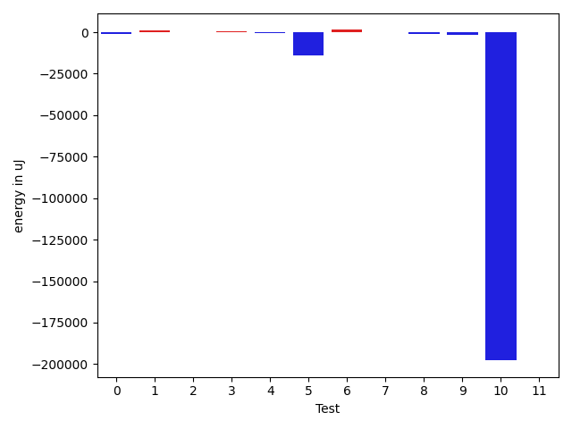

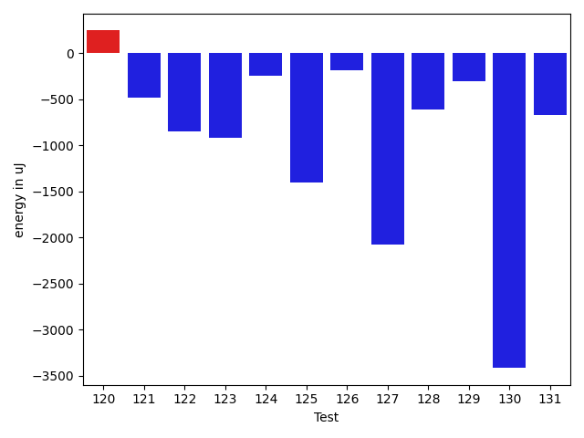

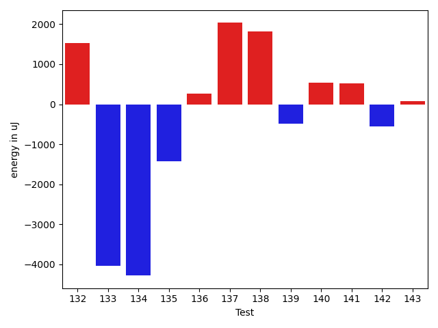

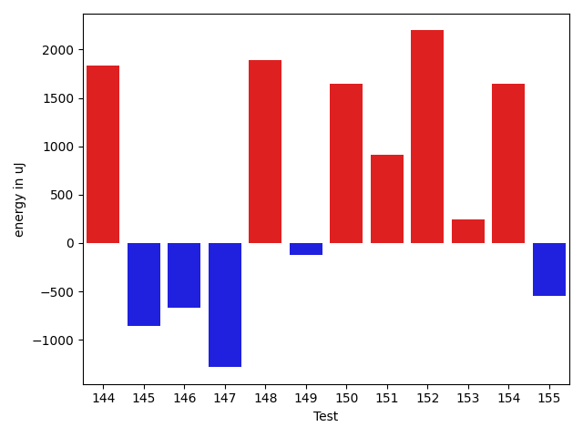

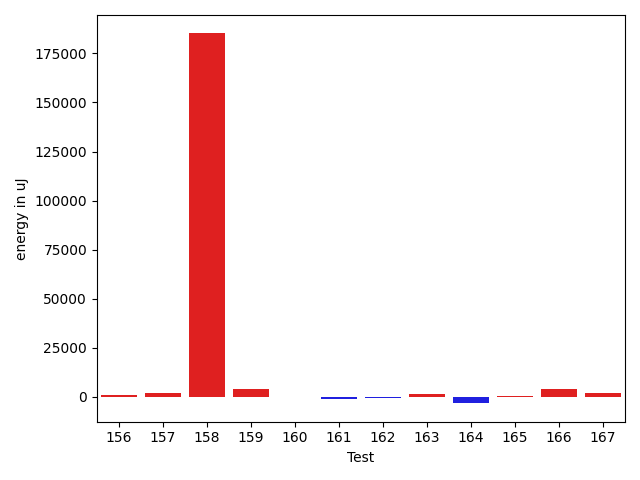

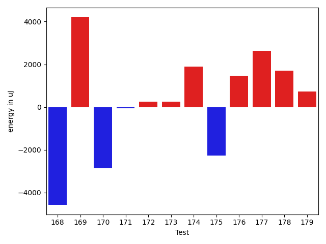

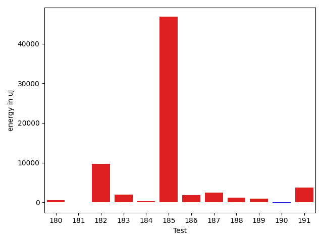

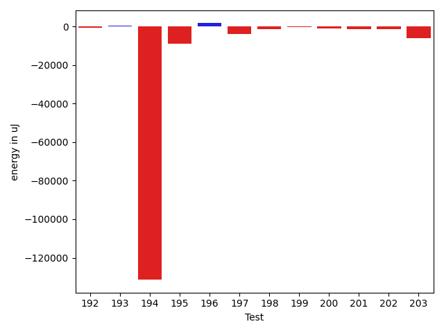

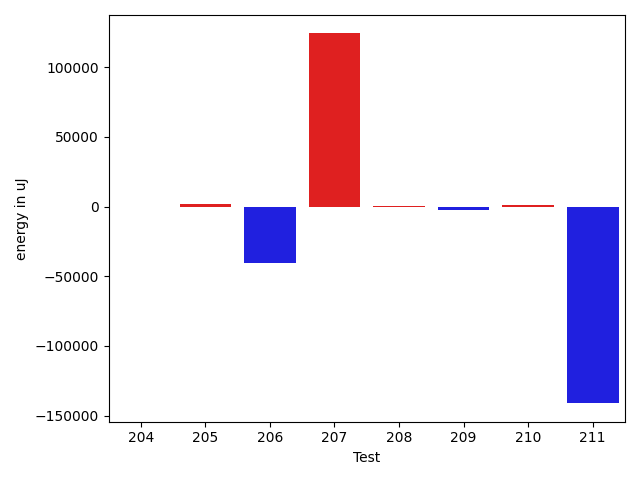

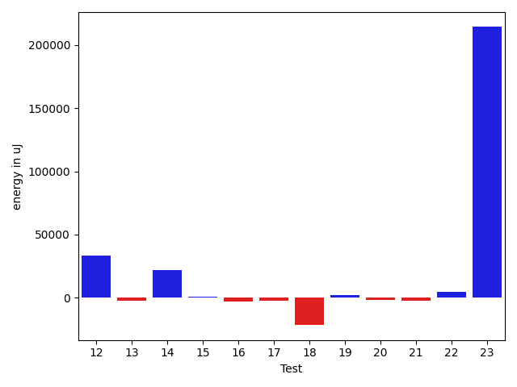

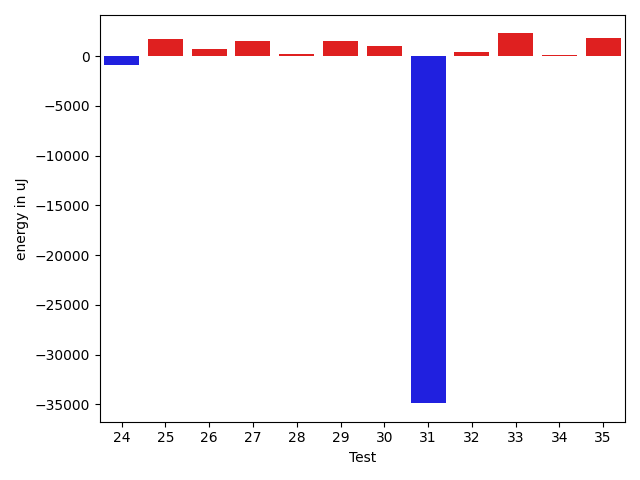

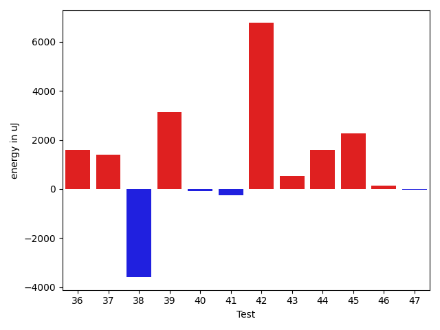

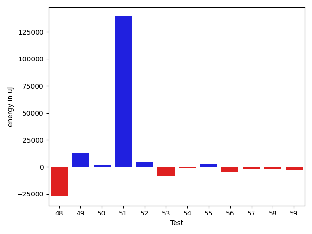

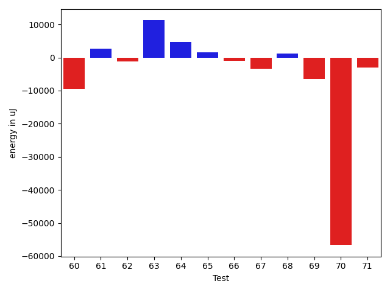

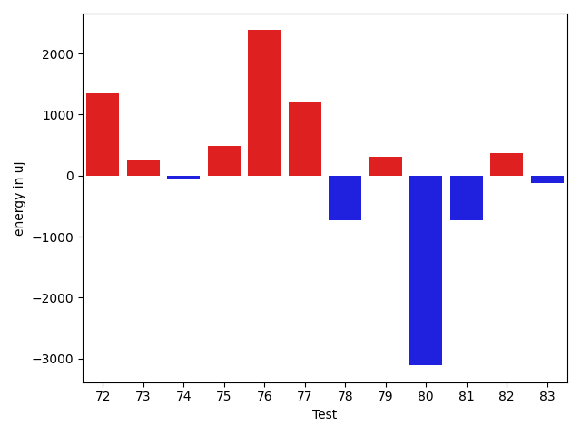

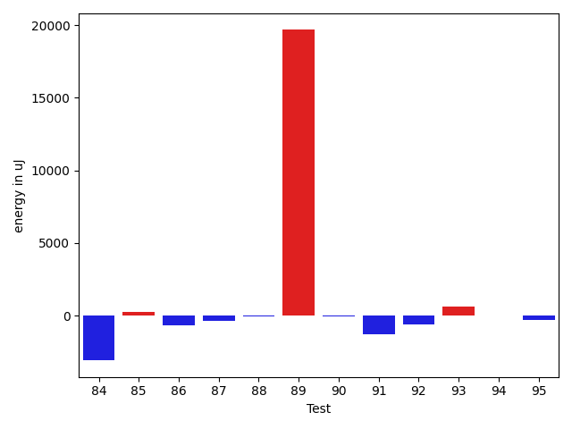

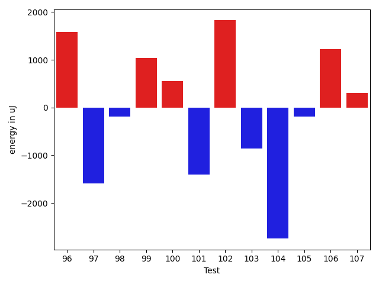

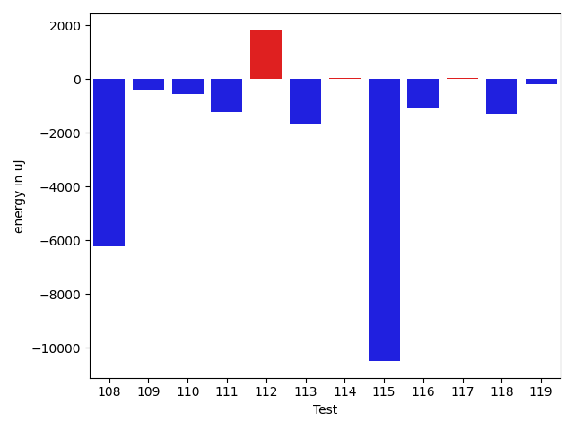

| ID | EnergyV1 | EnergyV2 | DeltaEnergy |
| --- | --- | --- | --- |
| 0 | 40603.02385112506 | 39091.53628149779 | -1511.4875696272647 |
| 1 | 40804.166813372045 | 37379.369816243816 | -3424.796997128229 |
| 2 | 42161.18288867106 | 35670.29797954389 | -6490.8849091271695 |
| 3 | 68132.3184288814 | 69139.3733527885 | 1007.0549239071115 |
| 4 | 38509.77723058813 | 48658.84013084628 | 10149.062900258148 |
| 5 | 46162.88670159227 | 69459.26758257337 | 23296.3808809811 |
| 6 | 48772.3920188744 | 51484.169695778284 | 2711.777676903883 |
| 7 | 35897.968796748726 | 37204.01106435053 | 1306.042267601806 |
| 8 | 37841.50657200813 | 36469.746631622314 | -1371.7599403858185 |
| 9 | 115741.28591530211 | 213774.0965845622 | 98032.8106692601 |
| 10 | 36386.57366219008 | 59023.66985324333 | 22637.09619105325 |
| 11 | 36997.42603302002 | 38046.32977294922 | 1048.9037399291992 |
| 12 | 37430.5437576793 | 70708.7213345348 | 33278.1775768555 |
| 13 | 38593.014682769775 | 35994.91674077511 | -2598.097941994667 |
| 14 | 38734.17774778593 | 60546.87562666615 | 21812.697878880223 |
| 15 | 39057.26003302376 | 39690.03811153205 | 632.7780785082869 |
| 16 | 41506.91583013475 | 38343.3870618357 | -3163.5287682990456 |
| 17 | 37339.85667927886 | 35109.38018103663 | -2230.476498242235 |
| 18 | 73644.44520918728 | 51936.705617585976 | -21707.739591601305 |
| 19 | 38673.645907698075 | 40489.1440387968 | 1815.4981310987278 |
| 20 | 38462.89711386168 | 37014.938650478 | -1447.9584633836857 |
| 21 | 37885.84533851594 | 35313.34693035483 | -2572.4984081611037 |
| 22 | 37300.995000820774 | 42010.179732871125 | 4709.184732050351 |
| 23 | 65771.2281036377 | 280116.94970703125 | 214345.72160339355 |
| 24 | 37979.201116749085 | 39460.678746812046 | 1481.47763006296 |
| 25 | 40380.38258244547 | 37819.07167765644 | -2561.310904789032 |
| 26 | 37893.85940170288 | 38056.87148246169 | 163.01208075881004 |
| 27 | 39866.52663350748 | 38593.17161454253 | -1273.3550189649468 |
| 28 | 40823.779887338045 | 39035.88860127594 | -1787.8912860621058 |
| 29 | 133847.66157433897 | 135757.6497891209 | 1909.9882147819153 |
| 30 | 34682.883020401 | 38451.90090465546 | 3769.0178842544556 |
| 31 | 35099.4774065331 | 38180.1826523465 | 3080.7052458133985 |
| 32 | 33853.202977592664 | 40350.76008043908 | 6497.557102846418 |
| 33 | 31595.23876953125 | 35822.80525755882 | 4227.566488027573 |
| 34 | 39807.02056020454 | 39400.902063444875 | -406.1184967596637 |
| 35 | 38732.26374554982 | 40020.05173424061 | 1287.7879886907904 |
| 36 | 35691.57363963127 | 37486.38103745505 | 1794.8073978237808 |
| 37 | 33670.9578406482 | 41230.62289759466 | 7559.665056946455 |
| 38 | 35314.49372206442 | 36051.38911437988 | 736.8953923154622 |
| 39 | 32298.88282942772 | 39485.530522972345 | 7186.647693544626 |
| 40 | 38671.641444802284 | 37384.7998085022 | -1286.841636300087 |
| 41 | 37696.63704646705 | 36850.65120807849 | -845.9858383885585 |
| 42 | 38008.53636793839 | 38249.85951449319 | 241.3231465548015 |
| 43 | 31904.74732717569 | 36398.3611726863 | 4493.613845510612 |
| 44 | 39144.0082399922 | 39246.595434987044 | 102.58719499484141 |
| 45 | 62760.706147759425 | 40731.67159416314 | -22029.034553596284 |
| 46 | 38702.50826401777 | 40109.21727155392 | 1406.7090075361484 |
| 47 | 85724.04809881456 | 42975.475257496095 | -42748.57284131846 |
| 48 | 79220.33623613638 | 51759.07318062032 | -27461.263055516065 |
| 49 | 36861.08044601706 | 49623.887843907694 | 12762.807397890632 |
| 50 | 47297.58210408155 | 49174.84775425526 | 1877.2656501737074 |
| 51 | 73377.49798584315 | 212806.40042152046 | 139428.9024356773 |
| 52 | 34889.82023872856 | 39446.55015516281 | 4556.729916434255 |
| 53 | 43636.157621487975 | 35039.48068279028 | -8596.676938697696 |
| 54 | 39736.87206746015 | 38543.25486813177 | -1193.6171993283788 |
| 55 | 41325.46077039863 | 43856.8861136459 | 2531.4253432472688 |
| 56 | 43109.10750096291 | 38551.741936683655 | -4557.365564279258 |
| 57 | 37990.75544164982 | 35817.47531764209 | -2173.280124007724 |
| 58 | 40607.95294051245 | 39102.23667864315 | -1505.7162618692964 |
| 59 | 39450.23728676699 | 36935.15590343624 | -2515.0813833307475 |
| 60 | 41836.22932118937 | 32347.48505339719 | -9488.744267792179 |
| 61 | 31478.646354418986 | 34095.80972553596 | 2617.1633711169743 |
| 62 | 35326.92313318247 | 34098.65934637896 | -1228.263786803509 |
| 63 | 36351.04113391042 | 47566.40157752577 | 11215.360443615355 |
| 64 | 35272.47822809219 | 39942.1451274947 | 4669.666899402509 |
| 65 | 36661.944140501335 | 38282.46808059559 | 1620.5239400942519 |
| 66 | 36804.67083961853 | 35801.23785462197 | -1003.4329849965579 |
| 67 | 41578.68479741145 | 38261.61430603411 | -3317.070491377337 |
| 68 | 37081.56368544698 | 38309.5824007988 | 1228.01871535182 |
| 69 | 58652.85815624516 | 52139.957818805255 | -6512.9003374399035 |
| 70 | 97593.51233766368 | 40847.24475179266 | -56746.26758587101 |
| 71 | 42559.35151427984 | 39479.33431831002 | -3080.01719596982 |
| 72 | 35744.655983608216 | 38581.06495782931 | 2836.4089742210926 |
| 73 | 41646.12849026775 | 38626.804500503196 | -3019.3239897645544 |
| 74 | 96367.48976095801 | 37526.39293637821 | -58841.0968245798 |
| 75 | 36979.02588801086 | 39523.11019667331 | 2544.084308662452 |
| 76 | 83927.22225952148 | 44222.07312011719 | -39705.1491394043 |
| 77 | 721606.0544061661 | 69777.67346191406 | -651828.380944252 |
| 78 | 42410.13750457764 | 39332.1869597137 | -3077.9505448639393 |
| 79 | 38474.52806854248 | 36093.152656555176 | -2381.3754119873047 |
| 80 | 34562.625451742846 | 35441.783585064426 | 879.15813332158 |
| 81 | 126419.3300390084 | 150087.70021033383 | 23668.370171325427 |
| 82 | 40049.51289560056 | 37015.67014493974 | -3033.8427506608205 |
| 83 | 33343.78662109375 | 39875.3028421402 | 6531.516221046448 |
| 84 | 37924.667877562344 | 36436.45800281782 | -1488.209874744527 |
| 85 | 38344.38787189004 | 38236.93604992831 | -107.45182196173118 |
| 86 | 39474.07896942015 | 40954.67414546122 | 1480.595176041068 |
| 87 | 58550.51408588886 | 40099.278732771054 | -18451.23535311781 |
| 88 | 33236.54365136102 | 35159.39476202428 | 1922.851110663265 |
| 89 | 32447.00286583352 | 40598.72578187846 | 8151.722916044935 |
| 90 | 41228.077198956526 | 36742.33023227802 | -4485.746966678504 |
| 91 | 40094.390425764024 | 38084.071939721005 | -2010.3184860430192 |
| 92 | 36582.61595249176 | 39815.37509584427 | 3232.7591433525085 |
| 93 | 37793.958483750765 | 40633.65953016764 | 2839.701046416878 |
| 94 | 92562.84312705632 | 158250.6758329228 | 65687.83270586649 |
| 95 | 36653.3662109375 | 38314.7548828125 | 1661.388671875 |
| 96 | 36465.134703553194 | 40467.25957613659 | 4002.124872583394 |
| 97 | 51921.592658424466 | 54762.243670546886 | 2840.65101212242 |
| 98 | 35993.593418592514 | 34651.16668525373 | -1342.4267333387834 |
| 99 | 37271.31201830231 | 33151.326133772105 | -4119.985884530208 |
| 100 | 34989.112823075186 | 35960.70747524199 | 971.5946521668011 |
| 101 | 36205.0474912057 | 38959.55917685256 | 2754.5116856468594 |
| 102 | 41430.51156717644 | 45663.30496105835 | 4232.793393881904 |
| 103 | 40508.96135265904 | 38070.42653304267 | -2438.5348196163686 |
| 104 | 38791.686213138484 | 41093.35356733688 | 2301.6673541983982 |
| 105 | 35409.386338699616 | 40364.97238004315 | 4955.586041343537 |
| 106 | 38252.98509807038 | 37232.714907211855 | -1020.2701908585223 |
| 107 | 38805.755660533905 | 34772.64033126831 | -4033.1153292655945 |
| 108 | 33460.76702608512 | 38860.052833190515 | 5399.285807105392 |
| 109 | 1131887.2774069982 | 102470.65625033673 | -1029416.6211566615 |
| 110 | 68394.7568424657 | 59715.16109511506 | -8679.595747350635 |
| 111 | 49335.754946800924 | 40089.37144978611 | -9246.383497014816 |
| 112 | 34828.11775739618 | 41160.9540504848 | 6332.836293088614 |
| 113 | 52679.74129284109 | 46357.11889081829 | -6322.622402022804 |
| 114 | 38634.59009658242 | 40380.174771715145 | 1745.5846751327263 |
| 115 | 121025.2782338697 | 70271.65408224384 | -50753.62415162586 |
| 116 | 36561.15464780248 | 35215.0615829794 | -1346.093064823086 |
| 117 | 39729.10592847328 | 40117.94857550557 | 388.84264703229564 |
| 118 | 38468.61372505866 | 37224.886647440624 | -1243.7270776180376 |
| 119 | 38539.841578898966 | 39160.568585469264 | 620.7270065702978 |
| 120 | 40570.12366320316 | 36465.88231879439 | -4104.241344408765 |
| 121 | 32728.448860798384 | 35327.01428819736 | 2598.565427398975 |
| 122 | 37601.73548102443 | 35081.50500691557 | -2520.230474108859 |
| 123 | 34815.9753193972 | 39240.32362460563 | 4424.348305208434 |
| 124 | 53850.910051014485 | 34636.82375509295 | -19214.086295921537 |
| 125 | 35276.170130406106 | 34756.27919072512 | -519.8909396809831 |
| 126 | 46069.186508419814 | 39251.969580328405 | -6817.2169280914095 |
| 127 | 38729.02237622047 | 37547.91842825794 | -1181.1039479625324 |
| 128 | 34337.507340580225 | 38332.51099865418 | 3995.0036580739543 |
| 129 | 35795.5381118676 | 36422.97471539934 | 627.4366035317362 |
| 130 | 37032.497932039754 | 38114.23231728173 | 1081.7343852419726 |
| 131 | 36071.32530951692 | 38830.797784909075 | 2759.4724753921546 |
| 132 | 36319.665954589844 | 36951.40256845951 | 631.736613869667 |
| 133 | 35858.372770949085 | 39636.79550051932 | 3778.4227295702367 |
| 134 | 38564.25040902197 | 36540.85092842579 | -2023.3994805961847 |
| 135 | 114269.34586718545 | 101586.15982421025 | -12683.186042975198 |
| 136 | 39419.64447142456 | 38479.030923951286 | -940.6135474732728 |
| 137 | 41551.38262047219 | 40447.82986565279 | -1103.5527548194004 |
| 138 | 36256.825228018686 | 40866.882503300905 | 4610.057275282219 |
| 139 | 42461.34393637343 | 41412.05393051298 | -1049.29000586045 |
| 140 | 39369.55996425485 | 38921.83287713397 | -447.7270871208748 |
| 141 | 35544.334381103516 | 39957.09867858887 | 4412.764297485352 |
| 142 | 33973.40948486328 | 36377.36486816406 | 2403.9553833007812 |
| 143 | 39251.80502923286 | 940231.2504486982 | 900979.4454194653 |
| 144 | 38823.93703654447 | 38080.43234046231 | -743.5046960821637 |
| 145 | 38265.97935637427 | 36685.43643272725 | -1580.5429236470227 |
| 146 | 39718.79139885403 | 35877.61139699115 | -3841.1800018628783 |
| 147 | 32862.672977458686 | 33478.802186345056 | 616.1292088863702 |
| 148 | 53604.89475527178 | 43109.818029934366 | -10495.076725337414 |
| 149 | 37599.05994230785 | 38442.73086581478 | 843.6709235069284 |
| 150 | 35463.13527293586 | 40213.668711765575 | 4750.533438829712 |
| 151 | 35041.013938518176 | 40276.866824111945 | 5235.852885593769 |
| 152 | 38899.65446440503 | 37648.817190068425 | -1250.8372743366053 |
| 153 | 40266.28454981066 | 38780.22368206212 | -1486.0608677485434 |
| 154 | 54920.0275198979 | 97992.87739085915 | 43072.849870961254 |
| 155 | 39181.78409968414 | 37471.9871701485 | -1709.796929535638 |
| 156 | 34546.14378845692 | 33452.814489819924 | -1093.3292986369925 |
| 157 | 36897.49167251587 | 36459.09852600098 | -438.3931465148926 |
| 158 | 44469.17906423658 | 53078.461983338 | 8609.282919101417 |
| 159 | 352855.16101420904 | 375740.17463946156 | 22885.013625252526 |
| 160 | 35551.75347459316 | 36900.26396612509 | 1348.5104915319243 |
| 161 | 37812.737495205 | 133688.04318217176 | 95875.30568696676 |
| 162 | 37021.36669371653 | 39531.879951156145 | 2510.513257439612 |
| 163 | 38384.062388261606 | 39403.45241138444 | 1019.3900231228326 |
| 164 | 39215.82184946241 | 48577.813289821264 | 9361.991440358855 |
| 165 | 37577.98372985583 | 39019.50080318532 | 1441.5170733294945 |
| 166 | 127996.79912347988 | 144422.35536956927 | 16425.556246089385 |
| 167 | 40361.94970622675 | 40132.61925511502 | -229.33045111172396 |
| 168 | 36685.745113163124 | 40419.22906615275 | 3733.483952989627 |
| 169 | 33945.14026504189 | 39136.75328011453 | 5191.6130150726385 |
| 170 | 37164.89300392208 | 38044.28416635653 | 879.3911624344473 |
| 171 | 33392.09625867018 | 38120.92193637788 | 4728.825677707704 |
| 172 | 54595.54193366748 | 63230.90211481405 | 8635.36018114657 |
| 173 | 38579.30908524337 | 41018.592335925954 | 2439.283250682587 |
| 174 | 38430.50349161774 | 38168.578984534 | -261.92450708374236 |
| 175 | 35987.72085571289 | 36327.91273498535 | 340.19187927246094 |
| 176 | 36171.30284404755 | 37183.99154996872 | 1012.6887059211731 |
| 177 | 37520.815673828125 | 36963.53874206543 | -557.2769317626953 |
| 178 | 39770.92279434204 | 40216.52867126465 | 445.6058769226074 |
| 179 | 38065.44532775879 | 37786.733085632324 | -278.71224212646484 |
| 180 | 36840.26639556885 | 40631.3332824707 | 3791.0668869018555 |
| 181 | 40536.83673095703 | 41747.401926994324 | 1210.5651960372925 |
| 182 | 43377.47950868978 | 56266.61040675391 | 12889.130898064133 |
| 183 | 49885.20754735172 | 39487.90385316592 | -10397.3036941858 |
| 184 | 36820.3338060379 | 39992.08567672968 | 3171.7518706917763 |
| 185 | 32693.842359781265 | 40386.05130004883 | 7692.208940267563 |
| 186 | 31095.932222753763 | 39076.88836722076 | 7980.956144466996 |
| 187 | 41007.52848798825 | 39439.004393177456 | -1568.5240948107967 |
| 188 | 36294.65335083008 | 38189.72854614258 | 1895.0751953125 |
| 189 | 733678.898509613 | 41204.51283058025 | -692474.3856790328 |
| 190 | 33937.64644700289 | 40281.149225234985 | 6343.502778232098 |
| 191 | 36803.96513892695 | 40212.49653439676 | 3408.531395469814 |
| 192 | 37491.897847533226 | 36933.657059669495 | -558.2407878637314 |
| 193 | 38803.29981422424 | 39429.52874670946 | 626.2289324852172 |
| 194 | 322337.80993363494 | 190911.81375628975 | -131425.9961773452 |
| 195 | 41211.27484893799 | 32234.073822021484 | -8977.201026916504 |
| 196 | 41936.73488369584 | 43682.80940853059 | 1746.074524834752 |
| 197 | 38559.85330200195 | 34810.552734375 | -3749.300567626953 |
| 198 | 41433.80151176453 | 40099.7451171875 | -1334.0563945770264 |
| 199 | 38503.33275604248 | 38275.919114112854 | -227.41364192962646 |
| 200 | 36626.21884250641 | 35765.77175092697 | -860.4470915794373 |
| 201 | 37453.692932128906 | 35979.6554582119 | -1474.0374739170074 |
| 202 | 39861.19372558594 | 38500.73010253906 | -1360.463623046875 |
| 203 | 42123.3484954834 | 36036.683349609375 | -6086.665145874023 |
| 204 | 41869.6328125 | 42698.72833251953 | 829.0955200195312 |
| 205 | 42152.65866994858 | 40791.629554748535 | -1361.0291152000427 |
| 206 | 33631.06830215454 | 39736.9518661499 | 6105.883563995361 |
| 207 | 42297.984895122936 | 178181.9668939924 | 135883.98199886945 |
| 208 | 35373.11643218994 | 38757.12781381607 | 3384.011381626129 |
| 209 | 36798.88856506348 | 34847.0586284399 | -1951.8299366235733 |
| 210 | 40255.44902801514 | 39861.1953125 | -394.2537155151367 |
| 211 | 349282.27906799316 | 49971.95235538483 | -299310.32671260834 |

## Delta Duration per test method

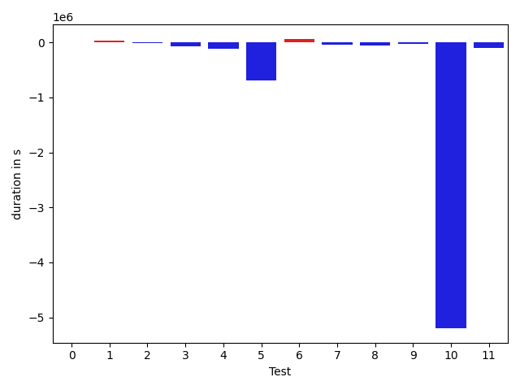

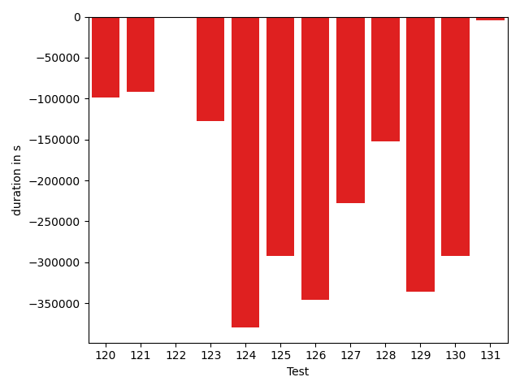

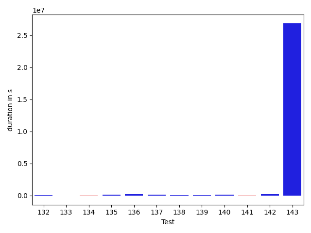

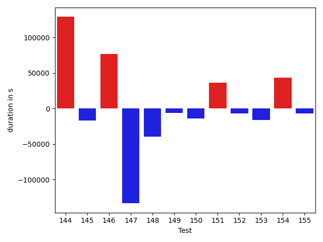

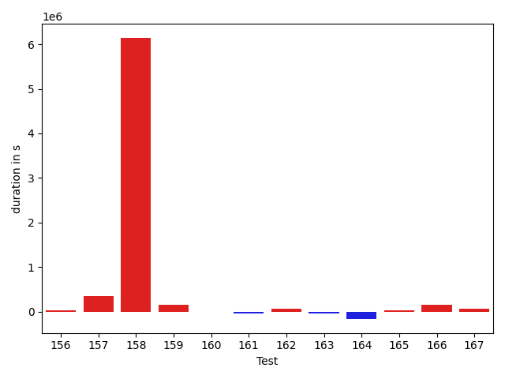

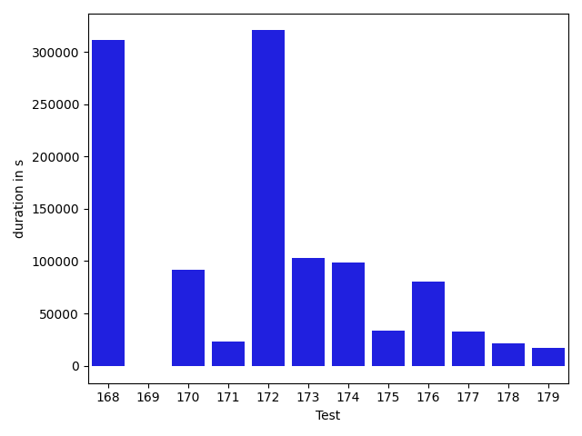

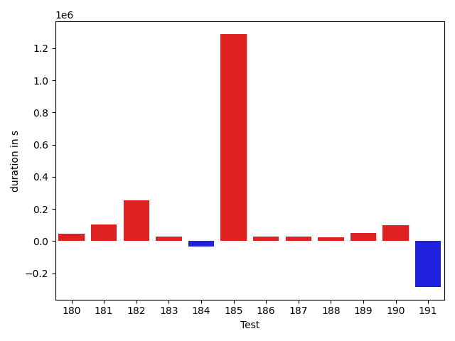

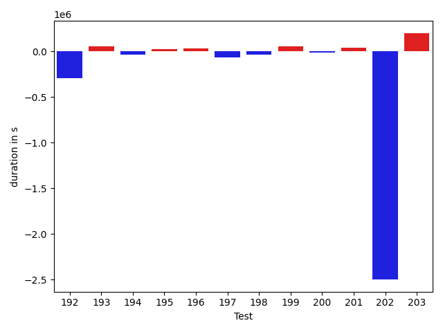

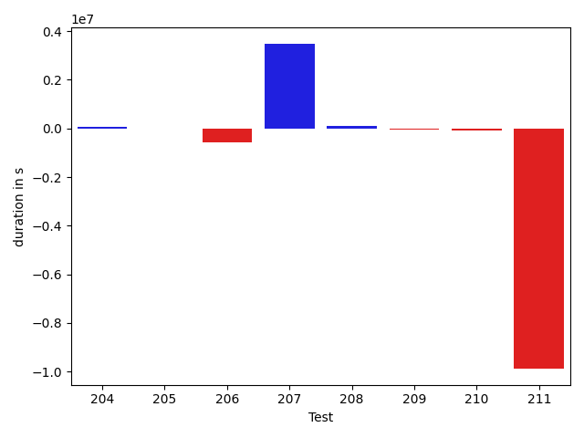

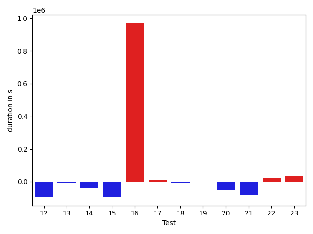

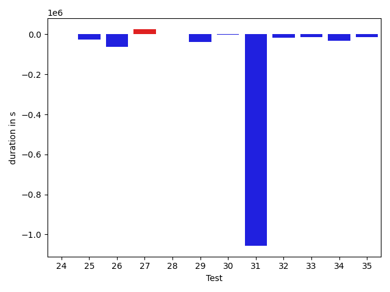

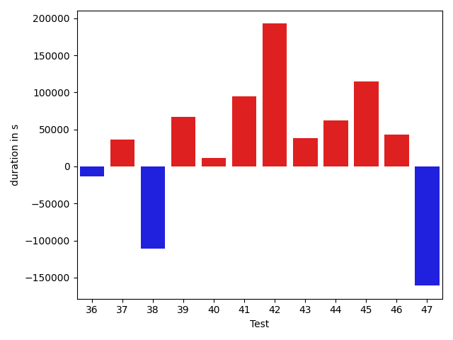

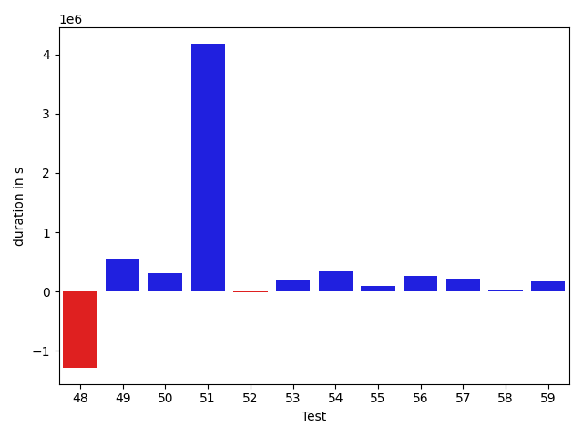

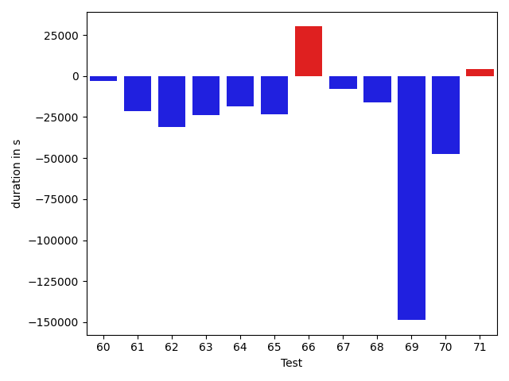

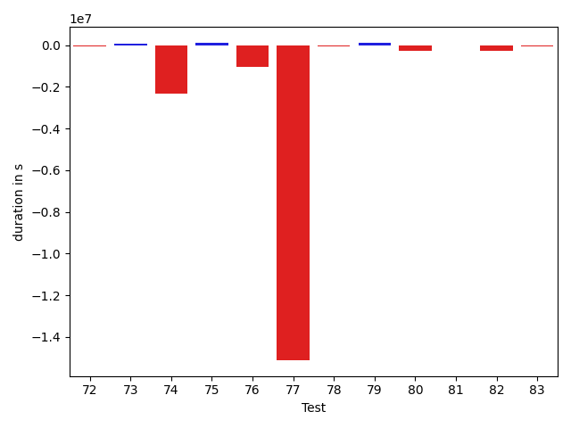

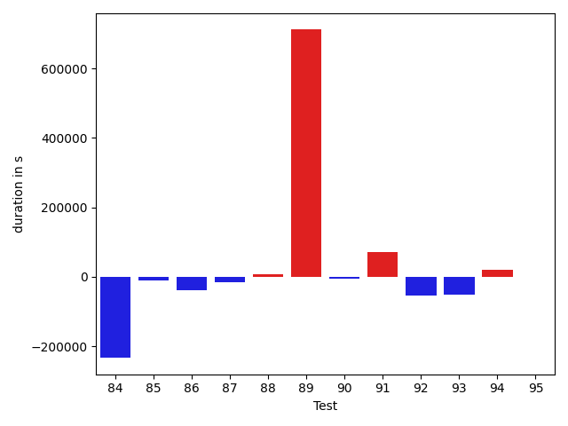

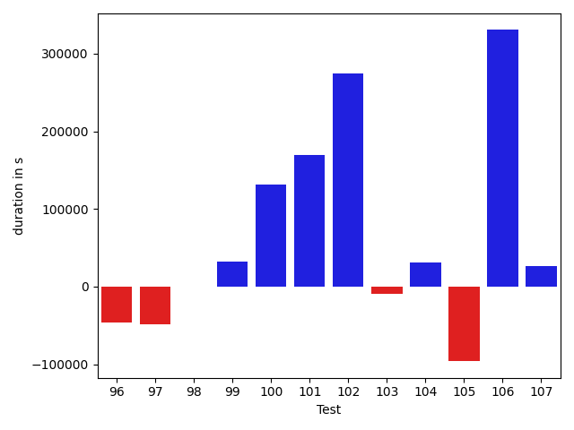

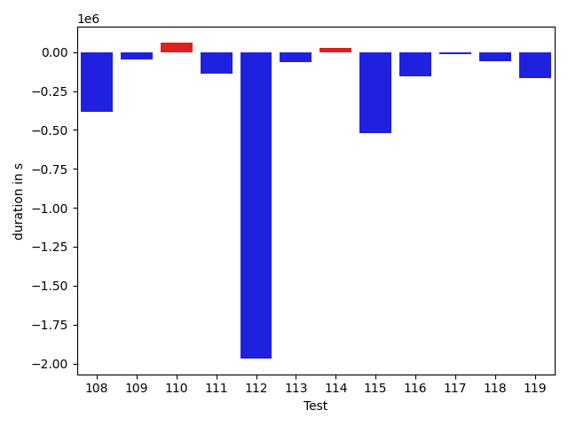

| ID | DurationV1 | DurationsV2 | DeltaDuration |
| --- | --- | --- | --- |
| 0 | 1116245.0207071626 | 1040710.4657317238 | -75534.55497543875 |
| 1 | 928409.2125960357 | 837357.0931483496 | -91052.11944768613 |
| 2 | 522454.207532636 | 598624.757028271 | 76170.54949563497 |
| 3 | 1610214.2719531623 | 1944516.8075916395 | 334302.5356384772 |
| 4 | 761292.0491409735 | 1278114.97701468 | 516822.92787370645 |
| 5 | 1153583.3305757798 | 1524487.664220758 | 370904.33364497824 |
| 6 | 1483771.5188946528 | 1381598.1790506179 | -102173.33984403498 |
| 7 | 680484.040564708 | 757536.9434072678 | 77052.90284255985 |
| 8 | 486597.6761419773 | 802219.7117962837 | 315622.0356543064 |
| 9 | 2767387.760922374 | 5248322.482700676 | 2480934.7217783015 |
| 10 | 867834.0176084979 | 2259888.4359570458 | 1392054.418348548 |
| 11 | 457802.67415618896 | 360967.1860046387 | -96835.4881515503 |
| 12 | 1059208.9884834592 | 2662250.4517735997 | 1603041.4632901405 |
| 13 | 776621.4474620819 | 1530375.1605342627 | 753753.7130721807 |
| 14 | 1720508.5243042412 | 1617663.602255457 | -102844.9220487841 |
| 15 | 714543.1237454059 | 964942.672773974 | 250399.5490285681 |
| 16 | 934048.8650696381 | 854009.161653579 | -80039.70341605914 |
| 17 | 982273.1863528762 | 850946.8953783552 | -131326.29097452108 |
| 18 | 2164791.632907047 | 1635518.3236980324 | -529273.3092090145 |
| 19 | 705013.2068507588 | 809637.0183610916 | 104623.81151033286 |
| 20 | 1419563.043759412 | 1095745.9145598274 | -323817.1291995845 |
| 21 | 530574.1453287527 | 690032.3125617504 | 159458.16723299772 |
| 22 | 806354.3103114797 | 1011485.5948091629 | 205131.28449768317 |
| 23 | 1261455.1304473877 | 7711525.994873047 | 6450070.864425659 |
| 24 | 644899.4905825071 | 571889.4629973397 | -73010.02758516744 |
| 25 | 1272903.610757091 | 1104235.4237582146 | -168668.1869988765 |
| 26 | 438808.6661605835 | 390377.16340222955 | -48431.50275835395 |
| 27 | 1161806.8029278708 | 834219.6724748005 | -327587.1304530703 |
| 28 | 673356.8744752235 | 656065.5337104478 | -17291.34076477564 |
| 29 | 3460559.3293814836 | 3225155.436436916 | -235403.89294456784 |
| 30 | 576728.7695617676 | 453494.3375649452 | -123234.43199682236 |
| 31 | 813359.097854958 | 740638.5226590984 | -72720.57519585965 |
| 32 | 1149447.102428182 | 1049646.3819073192 | -99800.72052086284 |
| 33 | 450721.7603149414 | 381016.7578885555 | -69705.00242638588 |
| 34 | 682756.211735376 | 638077.7682236641 | -44678.4435117119 |
| 35 | 806223.7619719692 | 641121.4594692681 | -165102.30250270106 |
| 36 | 489203.0207350254 | 396152.2446310036 | -93050.77610402182 |
| 37 | 851622.7887134706 | 643521.5723251672 | -208101.21638830332 |
| 38 | 666494.1711610723 | 412799.4207687378 | -253694.75039233454 |
| 39 | 730412.1365396082 | 441207.2763465047 | -289204.86019310355 |
| 40 | 562047.3952342272 | 433566.8448448181 | -128480.55038940907 |
| 41 | 629518.7741045572 | 492010.1806390602 | -137508.59346549702 |
| 42 | 590921.8890550563 | 646236.6343529748 | 55314.74529791856 |
| 43 | 1146451.0271391482 | 815445.0693922838 | -331005.9577468644 |
| 44 | 938117.414799143 | 751202.4366935166 | -186914.97810562642 |
| 45 | 1836969.512849492 | 711055.6716768502 | -1125913.8411726418 |
| 46 | 819004.7308538759 | 692382.6154772245 | -126622.1153766514 |
| 47 | 1971761.6291212148 | 954408.2048263279 | -1017353.424294887 |
| 48 | 2236953.393307311 | 952185.9782589646 | -1284767.4150483464 |
| 49 | 944625.4637923382 | 1496680.4550923803 | 552054.9913000421 |
| 50 | 967114.7038797584 | 1283275.0905693728 | 316160.3866896144 |
| 51 | 1917019.810496264 | 6097199.481419558 | 4180179.6709232936 |
| 52 | 638350.2778612744 | 629326.1397542953 | -9024.13810697908 |
| 53 | 501842.34430914884 | 684555.1847174764 | 182712.84040832752 |
| 54 | 835955.5757292977 | 1182071.5422315807 | 346115.966502283 |
| 55 | 883154.8818291505 | 986587.9115539144 | 103433.02972476394 |
| 56 | 456936.8302100301 | 714948.4366688728 | 258011.60645884275 |
| 57 | 468405.0454052575 | 690974.9753353298 | 222569.92993007228 |
| 58 | 580098.52129257 | 617577.8775485232 | 37479.3562559532 |
| 59 | 533272.9913164526 | 700259.5690441206 | 166986.577727668 |
| 60 | 507473.5363324397 | 689042.9225485519 | 181569.38621611224 |
| 61 | 735097.2579145764 | 921758.0010370322 | 186660.74312245578 |
| 62 | 963109.7055701541 | 1057698.2747109858 | 94588.5691408317 |
| 63 | 604439.1711120307 | 1295190.6667987332 | 690751.4956867024 |
| 64 | 801634.2576396018 | 776603.6560671923 | -25030.601572409505 |
| 65 | 852027.7296267456 | 672380.138698828 | -179647.5909279175 |
| 66 | 979513.5197641726 | 1003688.3779073635 | 24174.858143190853 |
| 67 | 610552.4946640789 | 909482.5931623781 | 298930.09849829914 |
| 68 | 628713.6031136476 | 597599.5215178132 | -31114.081595834345 |
| 69 | 1912440.2602707678 | 1696454.8270915982 | -215985.43317916966 |
| 70 | 2922889.595644719 | 955150.0797438127 | -1967739.5159009062 |
| 71 | 516600.5220859647 | 468965.55115163326 | -47634.97093433142 |
| 72 | 792871.0816582255 | 726308.3471513595 | -66562.73450686596 |
| 73 | 720780.8813937744 | 787953.7319004919 | 67172.85050671746 |
| 74 | 2880518.752171297 | 567691.4424658804 | -2312827.3097054167 |
| 75 | 647272.3539200462 | 756268.1180300387 | 108995.76410999242 |
| 76 | 1827099.4950714111 | 765427.9554290771 | -1061671.539642334 |
| 77 | 16357105.70617485 | 1247670.5505371094 | -15109435.155637741 |
| 78 | 464663.996240139 | 391752.8871881366 | -72911.10905200243 |
| 79 | 501664.5188102722 | 613868.9435482025 | 112204.4247379303 |
| 80 | 883895.6673326363 | 617088.9592871612 | -266806.70804547507 |
| 81 | 3586123.677828581 | 3548198.0541117163 | -37925.623716864735 |
| 82 | 1056630.7956109585 | 767675.6656233047 | -288955.1299876538 |
| 83 | 447484.3912963867 | 369159.48451805115 | -78324.90677833557 |
| 84 | 519337.59341466427 | 583632.3545818385 | 64294.761167174205 |
| 85 | 616264.1634478382 | 496160.1428046201 | -120104.02064321807 |
| 86 | 727751.0861671141 | 675016.7608832195 | -52734.32528389455 |
| 87 | 1366182.793174982 | 440958.1462352183 | -925224.6469397638 |
| 88 | 711549.2933017672 | 771920.159187682 | 60370.86588591477 |
| 89 | 739204.5027221374 | 1179905.996438453 | 440701.4937163156 |
| 90 | 1204225.1458993838 | 1060708.4557988483 | -143516.69010053552 |
| 91 | 718469.0567301176 | 536891.9204634784 | -181577.13626663922 |
| 92 | 619354.1869101524 | 380203.6518139839 | -239150.53509616852 |
| 93 | 749446.7322051355 | 914363.9649004922 | 164917.2326953567 |
| 94 | 2677797.410877689 | 4128607.9566331664 | 1450810.5457554776 |
| 95 | 479113.59765625 | 309186.14123535156 | -169927.45642089844 |
| 96 | 1135672.1108685653 | 1089576.6998925274 | -46095.41097603785 |
| 97 | 1799085.0395794571 | 1750713.2344951194 | -48371.80508433771 |
| 98 | 1075710.3994099018 | 1076021.3229975905 | 310.92358768871054 |
| 99 | 730475.6276195414 | 762878.352778911 | 32402.725159369642 |
| 100 | 795056.4802402689 | 926468.0347827803 | 131411.55454251147 |
| 101 | 1037492.3374501931 | 1206560.286732508 | 169067.94928231498 |
| 102 | 957542.4844953914 | 1232292.8820859136 | 274750.3975905222 |
| 103 | 1089037.8477315644 | 1080256.3615975548 | -8781.486134009669 |
| 104 | 812691.1601691901 | 844216.2927443702 | 31525.132575180032 |
| 105 | 739495.9637403111 | 643465.0193632812 | -96030.9443770299 |
| 106 | 818676.4264199092 | 1149089.8400401936 | 330413.4136202844 |
| 107 | 358917.7482454777 | 385789.7141933441 | 26871.96594786644 |
| 108 | 1205907.424881582 | 990890.4273182207 | -215016.9975633612 |
| 109 | 28962842.30280366 | 2769282.5027547767 | -26193559.800048884 |
| 110 | 2076559.556988093 | 1421996.5180777821 | -654563.038910311 |
| 111 | 1399935.5045167084 | 1040877.3307436074 | -359058.17377310107 |
| 112 | 1171371.0654470355 | 989459.621939362 | -181911.44350767345 |
| 113 | 1996705.6490752054 | 1344481.0449386593 | -652224.6041365461 |
| 114 | 752904.3916668298 | 1456203.9535289714 | 703299.5618621416 |
| 115 | 3320652.9628025 | 2443526.7662359234 | -877126.1965665766 |
| 116 | 1523744.9619859532 | 922973.2807156134 | -600771.6812703398 |
| 117 | 903659.8885340586 | 635540.0774877038 | -268119.8110463548 |
| 118 | 934749.2828650691 | 721041.6101124872 | -213707.6727525819 |
| 119 | 1088296.4714669082 | 743686.5673595255 | -344609.90410738275 |
| 120 | 898348.706475407 | 799526.0923314337 | -98822.61414397333 |
| 121 | 969674.6678597479 | 877691.292777678 | -91983.37508206989 |
| 122 | 716457.388875171 | 715094.3383759746 | -1363.0504991963971 |
| 123 | 649206.8632077554 | 521998.4592286326 | -127208.40397912276 |
| 124 | 1122833.134824631 | 743663.2460498946 | -379169.88877473644 |
| 125 | 997688.3515298375 | 704972.2012507776 | -292716.1502790599 |
| 126 | 1136137.9645730807 | 790265.612793176 | -345872.3517799047 |
| 127 | 899370.6763265713 | 671384.2361991077 | -227986.44012746355 |
| 128 | 558686.7989374995 | 406035.03383326624 | -152651.7651042333 |
| 129 | 921157.5873662026 | 585252.9362537754 | -335904.65111242724 |
| 130 | 882329.2505588699 | 589688.6021026708 | -292640.6484561991 |
| 131 | 643951.4639859353 | 639172.3063858883 | -4779.157600047067 |
| 132 | 374170.4203491211 | 445609.1827878952 | 71438.76243877411 |
| 133 | 763077.6053718469 | 729519.7768268585 | -33557.82854498841 |
| 134 | 532175.9607893378 | 448995.97448194027 | -83179.98630739748 |
| 135 | 2753592.7845782763 | 2856726.852378332 | 103134.06780005572 |
| 136 | 559282.0755871495 | 730221.9857608147 | 170939.91017366527 |
| 137 | 550821.5364196924 | 659050.7966616884 | 108229.26024199591 |
| 138 | 494985.46240067855 | 539546.3858686686 | 44560.92346799001 |
| 139 | 656075.9258191695 | 698387.1876120925 | 42311.261792922975 |
| 140 | 479471.9666515826 | 615811.303170397 | 136339.33651881432 |
| 141 | 490372.3578186035 | 388439.3098087311 | -101933.04800987244 |
| 142 | 396913.3631591797 | 557615.2400512695 | 160701.87689208984 |
| 143 | 1071584.224384556 | 27959501.01940029 | 26887916.795015734 |
| 144 | 686322.4288640292 | 547203.6978045444 | -139118.73105948488 |
| 145 | 481375.527264406 | 613912.898447385 | 132537.37118297908 |
| 146 | 685890.9704987018 | 1039480.6757894229 | 353589.70529072115 |
| 147 | 816061.817344036 | 917728.9081937636 | 101667.09084972763 |
| 148 | 1372365.6460960545 | 1064254.0392471268 | -308111.6068489277 |
| 149 | 956865.4841764424 | 972466.587718463 | 15601.10354202066 |
| 150 | 752271.5122674297 | 752941.8540469394 | 670.3417795096757 |
| 151 | 742116.8053052386 | 772121.4033225377 | 30004.598017299082 |
| 152 | 547368.9233272618 | 497370.7372087734 | -49998.18611848843 |
| 153 | 674484.3270725156 | 550978.3528919334 | -123505.97418058221 |
| 154 | 1662045.3064931515 | 2876720.6687848996 | 1214675.3622917482 |
| 155 | 641009.4097677828 | 1182941.2704920792 | 541931.8607242964 |
| 156 | 557870.1002990007 | 759947.6721415292 | 202077.5718425284 |
| 157 | 444176.4090499878 | 627574.35496521 | 183397.94591522217 |
| 158 | 809811.645372171 | 1533251.485179618 | 723439.839807447 |
| 159 | 9694038.847779695 | 11155430.589108432 | 1461391.7413287368 |
| 160 | 564590.6415961981 | 765129.7792426029 | 200539.1376464048 |
| 161 | 1323025.9960143259 | 3842521.606935838 | 2519495.610921512 |
| 162 | 600509.1339562302 | 1291370.4596803444 | 690861.3257241142 |
| 163 | 548160.4214915764 | 1025464.4879524186 | 477304.06646084227 |
| 164 | 579609.2476199771 | 1340225.8097897007 | 760616.5621697236 |
| 165 | 544792.5342197476 | 1062913.0089547094 | 518120.47473496175 |
| 166 | 3875104.96061367 | 3472408.1763449637 | -402696.7842687061 |
| 167 | 887567.1487403964 | 848353.3197129855 | -39213.82902741083 |
| 168 | 777425.1873670327 | 1088350.2940051872 | 310925.1066381545 |
| 169 | 688378.6618953568 | 687870.9681864423 | -507.6937089145649 |
| 170 | 699388.6746015997 | 790820.4487661312 | 91431.7741645315 |
| 171 | 559369.5065987457 | 582727.25767144 | 23357.751072694315 |
| 172 | 1675242.0548386266 | 1995649.7958276626 | 320407.7409890359 |
| 173 | 1180881.4388161683 | 1284058.2933457245 | 103176.85452955612 |
| 174 | 495028.2426651269 | 593406.2500016021 | 98378.00733647519 |
| 175 | 384432.36126708984 | 418193.7283744812 | 33761.36710739136 |
| 176 | 419899.31739497185 | 500646.15237665176 | 80746.83498167992 |
| 177 | 445477.7854003906 | 477918.9337234497 | 32441.148323059082 |
| 178 | 473012.11033439636 | 494067.4187927246 | 21055.308458328247 |
| 179 | 498883.48500061035 | 516239.61071777344 | 17356.125717163086 |
| 180 | 369308.18005371094 | 473657.53438949585 | 104349.35433578491 |
| 181 | 587802.9606323242 | 516429.0129313469 | -71373.94770097733 |
| 182 | 989148.8759993548 | 1284974.922246004 | 295826.04624664923 |
| 183 | 2027592.9844294786 | 705516.5578522205 | -1322076.4265772582 |
| 184 | 615163.1930494308 | 503992.395745486 | -111170.79730394483 |
| 185 | 501618.8049324751 | 520402.59034729004 | 18783.78541481495 |
| 186 | 562878.7162745893 | 460325.0547553599 | -102553.66151922941 |
| 187 | 865802.3066099981 | 836978.3848335422 | -28823.921776455943 |
| 188 | 428117.7414550781 | 409605.2989349365 | -18512.4425201416 |
| 189 | 19590091.57319509 | 597537.6907478191 | -18992553.88244727 |
| 190 | 765762.6086735725 | 441590.5685195923 | -324172.04015398026 |
| 191 | 893853.2336295862 | 630998.9426379278 | -262854.29099165834 |
| 192 | 475917.1374549866 | 595168.9535112381 | 119251.81605625153 |
| 193 | 445094.4135494232 | 386233.5278111445 | -58860.88573827874 |
| 194 | 8837237.453600705 | 5048597.15105763 | -3788640.302543075 |
| 195 | 412752.5146484375 | 366047.8685684204 | -46704.64608001709 |
| 196 | 729250.007395704 | 803831.8959714472 | 74581.88857574319 |
| 197 | 440009.6268005371 | 407673.560546875 | -32336.06625366211 |
| 198 | 312791.99863243103 | 299702.99755859375 | -13089.00107383728 |
| 199 | 504003.7544250488 | 429022.47910785675 | -74981.27531719208 |
| 200 | 322056.3662815094 | 398261.2205605507 | 76204.85427904129 |
| 201 | 462245.64044189453 | 484667.4074046612 | 22421.766962766647 |
| 202 | 511762.91455078125 | 409035.89111328125 | -102727.0234375 |
| 203 | 375128.33906555176 | 357609.74353027344 | -17518.59553527832 |
| 204 | 367455.28515625 | 423126.34533691406 | 55671.06018066406 |
| 205 | 558584.4773638248 | 530105.3639717102 | -28479.11339211464 |
| 206 | 1145717.9515228271 | 570517.4464764595 | -575200.5050463676 |
| 207 | 590810.5825257378 | 4071605.8896925654 | 3480795.307166828 |
| 208 | 443121.2469482422 | 528732.3245220184 | 85611.07757377625 |
| 209 | 490382.2519683838 | 440645.3252966404 | -49736.92667174339 |
| 210 | 517985.1055717468 | 423858.74609375 | -94126.35947799683 |
| 211 | 10630133.104808807 | 755224.4175443649 | -9874908.687264442 |

## Misc.

| ID | Test Class | Test Method |
| --- | --- | --- |
| 0 | com.google.gson.functional.StreamingTypeAdaptersTest | testNullSafe |
| 1 | com.google.gson.functional.StreamingTypeAdaptersTest | testSerializeWithCustomTypeAdapter |
| 2 | com.google.gson.functional.StreamingTypeAdaptersTest | testDeserializeWithCustomTypeAdapter |
| 3 | com.google.gson.functional.InstanceCreatorTest | testInstanceCreatorForParametrizedType |
| 4 | com.google.gson.functional.InstanceCreatorTest | testInstanceCreatorReturnsSubTypeForField |
| 5 | com.google.gson.functional.InstanceCreatorTest | testInstanceCreatorReturnsSubTypeForTopLevelObject |
| 6 | com.google.gson.functional.InstanceCreatorTest | testInstanceCreatorForCollectionType |
| 7 | com.google.gson.functional.InstanceCreatorTest | testInstanceCreatorReturnsBaseType |
| 8 | com.google.gson.LongSerializationPolicyTest | testDefaultLongSerializationIntegration |
| 9 | com.google.gson.LongSerializationPolicyTest | testStringLongSerializationIntegration |
| 10 | com.google.gson.functional.ReadersWritersTest | testReadWriteTwoObjects |
| 11 | com.google.gson.functional.ReadersWritersTest | testTopLevelNullObjectDeserializationWithReaderAndSerializeNulls |
| 12 | com.google.gson.functional.ReadersWritersTest | testReadWriteTwoStrings |
| 13 | com.google.gson.functional.ReadersWritersTest | testTopLevelNullObjectSerializationWithWriterAndSerializeNulls |
| 14 | com.google.gson.functional.MapTest | testInterfaceTypeMapWithSerializer |
| 15 | com.google.gson.functional.MapTest | testMapSubclassDeserialization |
| 16 | com.google.gson.functional.MapTest | testCustomSerializerForSpecificMapType |
| 17 | com.google.gson.functional.MapTest | testGeneralMapField |
| 18 | com.google.gson.functional.MapTest | testInterfaceTypeMap |
| 19 | com.google.gson.functional.MapTest | testMapSerializationWithNullValueButSerializeNulls |
| 20 | com.google.gson.functional.MapTest | testSerializeMaps |
| 21 | com.google.gson.functional.MapTest | testMapSerializationWithNullValuesSerialized |
| 22 | com.google.gson.GsonBuilderTest | testExcludeFieldsWithModifiers |
| 23 | com.google.gson.GsonBuilderTest | testCreatingMoreThanOnce |
| 24 | com.google.gson.GsonBuilderTest | testTransientFieldExclusion |
| 25 | com.google.gson.functional.DefaultTypeAdaptersTest | testDateSerializationWithPattern |
| 26 | com.google.gson.functional.DefaultTypeAdaptersTest | testDefaultGregorianCalendarDeserialization |
| 27 | com.google.gson.functional.DefaultTypeAdaptersTest | testClassSerialization |
| 28 | com.google.gson.functional.DefaultTypeAdaptersTest | testTimestampSerialization |
| 29 | com.google.gson.functional.DefaultTypeAdaptersTest | testDefaultDateDeserializationUsingBuilder |
| 30 | com.google.gson.functional.DefaultTypeAdaptersTest | testDefaultCalendarSerialization |
| 31 | com.google.gson.functional.DefaultTypeAdaptersTest | testDateDeserializationWithPattern |
| 32 | com.google.gson.functional.DefaultTypeAdaptersTest | testDateSerializationInCollection |
| 33 | com.google.gson.functional.DefaultTypeAdaptersTest | testBitSetSerialization |
| 34 | com.google.gson.functional.DefaultTypeAdaptersTest | testDefaultDateSerializationUsingBuilder |
| 35 | com.google.gson.functional.DefaultTypeAdaptersTest | testSqlDateSerialization |
| 36 | com.google.gson.functional.DefaultTypeAdaptersTest | testOverrideBigDecimalTypeAdapter |
| 37 | com.google.gson.functional.DefaultTypeAdaptersTest | testDateSerializationWithPatternNotOverridenByTypeAdapter |
| 38 | com.google.gson.functional.DefaultTypeAdaptersTest | testClassDeserialization |
| 39 | com.google.gson.functional.DefaultTypeAdaptersTest | testDefaultCalendarDeserialization |
| 40 | com.google.gson.functional.DefaultTypeAdaptersTest | testDefaultGregorianCalendarSerialization |
| 41 | com.google.gson.functional.DefaultTypeAdaptersTest | testBitSetDeserialization |
| 42 | com.google.gson.functional.DefaultTypeAdaptersTest | testOverrideBigIntegerTypeAdapter |
| 43 | com.google.gson.functional.DefaultTypeAdaptersTest | testSetSerialization |
| 44 | com.google.gson.functional.CustomDeserializerTest | testCustomDeserializerReturnsNullForArrayElementsForArrayField |
| 45 | com.google.gson.functional.CustomDeserializerTest | testCustomDeserializerReturnsNull |
| 46 | com.google.gson.functional.CustomDeserializerTest | testCustomDeserializerReturnsNullForArrayElements |
| 47 | com.google.gson.functional.CustomDeserializerTest | testJsonTypeFieldBasedDeserialization |
| 48 | com.google.gson.functional.CustomDeserializerTest | testCustomDeserializerReturnsNullForTopLevelObject |
| 49 | com.google.gson.JsonParserTest | testReadWriteTwoObjects |
| 50 | com.google.gson.functional.NamingPolicyTest | testGsonWithNonDefaultFieldNamingPolicySerialization |
| 51 | com.google.gson.functional.NamingPolicyTest | testGsonDuplicateNameUsingSerializedNameFieldNamingPolicySerialization |
| 52 | com.google.gson.functional.NamingPolicyTest | testGsonWithSerializedNameFieldNamingPolicyDeserialization |
| 53 | com.google.gson.functional.NamingPolicyTest | testGsonWithUpperCamelCaseSpacesPolicyDeserialiation |
| 54 | com.google.gson.functional.NamingPolicyTest | testGsonWithSerializedNameFieldNamingPolicySerialization |
| 55 | com.google.gson.functional.NamingPolicyTest | testDeprecatedNamingStrategy |
| 56 | com.google.gson.functional.NamingPolicyTest | testGsonWithUpperCamelCaseSpacesPolicySerialiation |
| 57 | com.google.gson.functional.NamingPolicyTest | testGsonWithLowerCaseDashPolicyDeserialiation |
| 58 | com.google.gson.functional.NamingPolicyTest | testGsonWithLowerCaseUnderscorePolicySerialization |
| 59 | com.google.gson.functional.NamingPolicyTest | testGsonWithLowerCaseDashPolicySerialization |
| 60 | com.google.gson.functional.NamingPolicyTest | testGsonWithLowerCaseUnderscorePolicyDeserialiation |
| 61 | com.google.gson.functional.NamingPolicyTest | testAtSignInSerializedName |
| 62 | com.google.gson.functional.NamingPolicyTest | testComplexFieldNameStrategy |
| 63 | com.google.gson.functional.NamingPolicyTest | testGsonWithNonDefaultFieldNamingPolicyDeserialiation |
| 64 | com.google.gson.functional.NullObjectAndFieldTest | testExplicitSerializationOfNullStringMembers |
| 65 | com.google.gson.functional.NullObjectAndFieldTest | testCustomTypeAdapterPassesNullDesrialization |
| 66 | com.google.gson.functional.NullObjectAndFieldTest | testAbsentJsonElementsAreSetToNull |
| 67 | com.google.gson.functional.NullObjectAndFieldTest | testPrintPrintingObjectWithNulls |
| 68 | com.google.gson.functional.NullObjectAndFieldTest | testExplicitNullSetsFieldToNullDuringDeserialization |
| 69 | com.google.gson.functional.NullObjectAndFieldTest | testExplicitSerializationOfNullArrayMembers |
| 70 | com.google.gson.functional.NullObjectAndFieldTest | testExplicitSerializationOfNulls |
| 71 | com.google.gson.functional.NullObjectAndFieldTest | testNullWrappedPrimitiveMemberDeserialization |
| 72 | com.google.gson.functional.NullObjectAndFieldTest | testExplicitSerializationOfNullCollectionMembers |
| 73 | com.google.gson.functional.NullObjectAndFieldTest | testNullWrappedPrimitiveMemberSerialization |
| 74 | com.google.gson.functional.NullObjectAndFieldTest | testCustomSerializationOfNulls |
| 75 | com.google.gson.functional.NullObjectAndFieldTest | testExplicitDeserializationOfNulls |
| 76 | com.google.gson.functional.NullObjectAndFieldTest | testTopLevelNullObjectDeserialization |
| 77 | com.google.gson.functional.NullObjectAndFieldTest | testTopLevelNullObjectSerialization |
| 78 | com.google.gson.functional.NullObjectAndFieldTest | testCustomTypeAdapterPassesNullSerialization |
| 79 | com.google.gson.functional.NullObjectAndFieldTest | testPrintPrintingArraysWithNulls |
| 80 | com.google.gson.functional.VersioningTest | testVersionedGsonMixingSinceAndUntilDeserialization |
| 81 | com.google.gson.functional.VersioningTest | testVersionedUntilSerialization |
| 82 | com.google.gson.functional.VersioningTest | testVersionedGsonMixingSinceAndUntilSerialization |
| 83 | com.google.gson.functional.VersioningTest | testIgnoreLaterVersionClassDeserialization |
| 84 | com.google.gson.functional.VersioningTest | testIgnoreLaterVersionClassSerialization |
| 85 | com.google.gson.functional.VersioningTest | testVersionedClassesDeserialization |
| 86 | com.google.gson.functional.VersioningTest | testVersionedClassesSerialization |
| 87 | com.google.gson.functional.VersioningTest | testVersionedUntilDeserialization |
| 88 | com.google.gson.functional.VersioningTest | testVersionedGsonWithUnversionedClassesDeserialization |
| 89 | com.google.gson.functional.VersioningTest | testVersionedGsonWithUnversionedClassesSerialization |
| 90 | com.google.gson.functional.FieldExclusionTest | testDefaultInnerClassExclusion |
| 91 | com.google.gson.functional.FieldExclusionTest | testDefaultNestedStaticClassIncluded |
| 92 | com.google.gson.functional.FieldExclusionTest | testInnerClassExclusion |
| 93 | com.google.gson.functional.TypeHierarchyAdapterTest | testRegisterSuperTypeFirst |
| 94 | com.google.gson.functional.TypeHierarchyAdapterTest | testTypeHierarchy |
| 95 | com.google.gson.functional.TypeHierarchyAdapterTest | testRegisterSubTypeFirstAllowed |
| 96 | com.google.gson.functional.EnumTest | testEnumSubclassWithRegisteredTypeAdapter |
| 97 | com.google.gson.functional.TypeVariableTest | testAdvancedTypeVariables |
| 98 | com.google.gson.functional.TypeVariableTest | testTypeVariablesViaTypeParameter |
| 99 | com.google.gson.functional.TypeVariableTest | testBasicTypeVariables |
| 100 | com.google.gson.functional.ParameterizedTypesTest | testParameterizedTypeWithReaderDeserialization |
| 101 | com.google.gson.functional.ParameterizedTypesTest | testParameterizedTypeWithCustomSerializer |
| 102 | com.google.gson.functional.ParameterizedTypesTest | testParameterizedTypeDeserialization |
| 103 | com.google.gson.functional.ParameterizedTypesTest | testParameterizedTypesWithCustomDeserializer |
| 104 | com.google.gson.functional.ObjectTest | testAnonymousLocalClassesCustomSerialization |
| 105 | com.google.gson.functional.ObjectTest | testInnerClassDeserialization |
| 106 | com.google.gson.functional.ObjectTest | testSingletonLists |
| 107 | com.google.gson.functional.ObjectTest | testJsonObjectSerialization |
| 108 | com.google.gson.functional.MapAsArrayTypeAdapterTest | testMapWithTypeVariableDeserialization |
| 109 | com.google.gson.functional.MapAsArrayTypeAdapterTest | testSerializeComplexMapWithTypeAdapter |
| 110 | com.google.gson.functional.MapAsArrayTypeAdapterTest | testTwoTypesCollapseToOneDeserialize |
| 111 | com.google.gson.functional.MapAsArrayTypeAdapterTest | testMapWithTypeVariableSerialization |
| 112 | com.google.gson.functional.MapAsArrayTypeAdapterTest | testMultipleEnableComplexKeyRegistrationHasNoEffect |
| 113 | com.google.gson.CommentsTest | testParseComments |
| 114 | com.google.gson.functional.EscapingTest | testGsonAcceptsEscapedAndNonEscapedJsonDeserialization |
| 115 | com.google.gson.functional.CustomTypeAdaptersTest | testCustomTypeAdapterDoesNotAppliesToSubClasses |
| 116 | com.google.gson.functional.CustomTypeAdaptersTest | testCustomAdapterInvokedForCollectionElementSerializationWithType |
| 117 | com.google.gson.functional.CustomTypeAdaptersTest | testEnsureCustomSerializerNotInvokedForNullValues |
| 118 | com.google.gson.functional.CustomTypeAdaptersTest | testCustomAdapterInvokedForMapElementDeserialization |
| 119 | com.google.gson.functional.CustomTypeAdaptersTest | testCustomNestedSerializers |
| 120 | com.google.gson.functional.CustomTypeAdaptersTest | testCustomNestedDeserializers |
| 121 | com.google.gson.functional.CustomTypeAdaptersTest | testRegisterHierarchyAdapterForDate |
| 122 | com.google.gson.functional.CustomTypeAdaptersTest | testCustomByteArrayDeserializerAndInstanceCreator |
| 123 | com.google.gson.functional.CustomTypeAdaptersTest | testEnsureCustomDeserializerNotInvokedForNullValues |
| 124 | com.google.gson.functional.CustomTypeAdaptersTest | testCustomAdapterInvokedForCollectionElementDeserialization |
| 125 | com.google.gson.functional.CustomTypeAdaptersTest | testCustomAdapterInvokedForMapElementSerializationWithType |
| 126 | com.google.gson.functional.CustomTypeAdaptersTest | testCustomSerializers |
| 127 | com.google.gson.functional.CustomTypeAdaptersTest | testCustomTypeAdapterAppliesToSubClassesSerializedAsBaseClass |
| 128 | com.google.gson.functional.CustomTypeAdaptersTest | testCustomAdapterInvokedForCollectionElementSerialization |
| 129 | com.google.gson.functional.CustomTypeAdaptersTest | testCustomDeserializerInvokedForPrimitives |
| 130 | com.google.gson.functional.CustomTypeAdaptersTest | testCustomSerializerInvokedForPrimitives |
| 131 | com.google.gson.functional.CustomTypeAdaptersTest | testCustomByteArraySerializer |
| 132 | com.google.gson.functional.CustomTypeAdaptersTest | testCustomAdapterInvokedForMapElementSerialization |
| 133 | com.google.gson.functional.CustomTypeAdaptersTest | testCustomDeserializers |
| 134 | com.google.gson.functional.ExclusionStrategyFunctionalTest | testExcludeTopLevelClassDeserializationDoesNotImpactSerialization |
| 135 | com.google.gson.functional.ExclusionStrategyFunctionalTest | testExclusionStrategySerialization |
| 136 | com.google.gson.functional.ExclusionStrategyFunctionalTest | testExclusionStrategyWithMode |
| 137 | com.google.gson.functional.ExclusionStrategyFunctionalTest | testExclusionStrategySerializationDoesNotImpactDeserialization |
| 138 | com.google.gson.functional.ExclusionStrategyFunctionalTest | testExcludeTopLevelClassSerializationDoesNotImpactDeserialization |
| 139 | com.google.gson.functional.ExclusionStrategyFunctionalTest | testExclusionStrategyDeserialization |
| 140 | com.google.gson.functional.ExclusionStrategyFunctionalTest | testExclusionStrategySerializationDoesNotImpactSerialization |
| 141 | com.google.gson.functional.ExclusionStrategyFunctionalTest | testExcludeTopLevelClassDeserialization |
| 142 | com.google.gson.functional.ExclusionStrategyFunctionalTest | testExcludeTopLevelClassSerialization |
| 143 | com.google.gson.functional.CustomSerializerTest | testSubClassSerializerInvokedForBaseClassFieldsHoldingSubClassInstances |
| 144 | com.google.gson.functional.CustomSerializerTest | testSerializerReturnsNull |
| 145 | com.google.gson.functional.CustomSerializerTest | testBaseClassSerializerInvokedForBaseClassFieldsHoldingSubClassInstances |
| 146 | com.google.gson.functional.CustomSerializerTest | testSubClassSerializerInvokedForBaseClassFieldsHoldingArrayOfSubClassInstances |
| 147 | com.google.gson.functional.CustomSerializerTest | testBaseClassSerializerInvokedForBaseClassFields |
| 148 | com.google.gson.functional.CollectionTest | testUserCollectionTypeAdapter |
| 149 | com.google.gson.functional.GsonFieldTypeAdapterTest | testNonStaticFieldAdapterNotInvoked |
| 150 | com.google.gson.functional.GsonFieldTypeAdapterTest | testIncorrectTypeAdapterNotInvoked |
| 151 | com.google.gson.functional.GsonFieldTypeAdapterTest | testRegisteredAdapterOverridesFieldAdapter |
| 152 | com.google.gson.functional.GsonFieldTypeAdapterTest | testSuperclassTypeAdapterNotInvoked |
| 153 | com.google.gson.functional.GsonFieldTypeAdapterTest | testFieldAdapterNotInvokedIfNull |
| 154 | com.google.gson.functional.UncategorizedTest | testReturningDerivedClassesDuringDeserialization |
| 155 | com.google.gson.DefaultMapJsonSerializerTest | testNonEmptyMapSerialization |
| 156 | com.google.gson.functional.SecurityTest | testJsonWithNonExectuableTokenWithRegularGsonDeserialization |
| 157 | com.google.gson.functional.SecurityTest | testJsonWithNonExectuableTokenSerialization |
| 158 | com.google.gson.functional.SecurityTest | testNonExecutableJsonDeserialization |
| 159 | com.google.gson.functional.SecurityTest | testNonExecutableJsonSerialization |
| 160 | com.google.gson.functional.SecurityTest | testJsonWithNonExectuableTokenWithConfiguredGsonDeserialization |
| 161 | com.google.gson.functional.FieldNamingTest | testUpperCamelCase |
| 162 | com.google.gson.functional.FieldNamingTest | testUpperCamelCaseWithSpaces |
| 163 | com.google.gson.functional.FieldNamingTest | testIdentity |
| 164 | com.google.gson.functional.FieldNamingTest | testLowerCaseWithUnderscores |
| 165 | com.google.gson.functional.FieldNamingTest | testLowerCaseWithDashes |
| 166 | com.google.gson.functional.JsonAdapterAnnotationOnClassesTest | testSuperclassTypeAdapterNotInvoked |
| 167 | com.google.gson.functional.JsonAdapterAnnotationOnClassesTest | testRegisteredAdapterOverridesJsonAdapter |
| 168 | com.google.gson.functional.JsonAdapterAnnotationOnClassesTest | testRegisteredSerializerOverridesJsonAdapter |
| 169 | com.google.gson.functional.JsonAdapterAnnotationOnClassesTest | testJsonAdapterInvoked |
| 170 | com.google.gson.functional.JsonAdapterAnnotationOnClassesTest | testRegisteredDeserializerOverridesJsonAdapter |
| 171 | com.google.gson.functional.JsonAdapterAnnotationOnClassesTest | testIncorrectTypeAdapterFails |
| 172 | com.google.gson.GsonTypeAdapterTest | testDeserializerForAbstractClass |
| 173 | com.google.gson.functional.TypeAdapterPrecedenceTest | testNonstreamingFollowedByNonstreaming |
| 174 | com.google.gson.functional.TypeAdapterPrecedenceTest | testStreamingFollowedByStreaming |
| 175 | com.google.gson.functional.TypeAdapterPrecedenceTest | testStreamingFollowedByNonstreamingHierarchical |
| 176 | com.google.gson.functional.TypeAdapterPrecedenceTest | testNonstreamingHierarchicalFollowedByNonstreaming |
| 177 | com.google.gson.functional.TypeAdapterPrecedenceTest | testStreamingHierarchicalFollowedByNonstreamingHierarchical |
| 178 | com.google.gson.functional.TypeAdapterPrecedenceTest | testStreamingFollowedByNonstreaming |
| 179 | com.google.gson.functional.TypeAdapterPrecedenceTest | testSerializeNonstreamingTypeAdapterFollowedByStreamingTypeAdapter |
| 180 | com.google.gson.functional.TypeAdapterPrecedenceTest | testStreamingHierarchicalFollowedByNonstreaming |
| 181 | com.google.gson.functional.PrintFormattingTest | testJsonObjectWithNullValuesSerialized |
| 182 | com.google.gson.MixedStreamTest | testWriteLenient |
| 183 | com.google.gson.MixedStreamTest | testReadMixedStreamed |
| 184 | com.google.gson.MixedStreamTest | testReaderDoesNotMutateState |
| 185 | com.google.gson.MixedStreamTest | testReadInvalidState |
| 186 | com.google.gson.MixedStreamTest | testWriteInvalidState |
| 187 | com.google.gson.MixedStreamTest | testWriteHtmlSafe |
| 188 | com.google.gson.MixedStreamTest | testReadNulls |
| 189 | com.google.gson.MixedStreamTest | testWriteMixedStreamed |
| 190 | com.google.gson.MixedStreamTest | testWriteNulls |
| 191 | com.google.gson.MixedStreamTest | testReadClosed |
| 192 | com.google.gson.MixedStreamTest | testWriteDoesNotMutateState |
| 193 | com.google.gson.MixedStreamTest | testWriteClosed |
| 194 | com.google.gson.functional.CircularReferenceTest | testSelfReferenceCustomHandlerSerialization |
| 195 | com.google.gson.functional.PrimitiveTest | testFloatInfinitySerialization |
| 196 | com.google.gson.functional.PrimitiveTest | testMoreSpecificSerialization |
| 197 | com.google.gson.functional.PrimitiveTest | testFloatNaNSerialization |
| 198 | com.google.gson.functional.PrimitiveTest | testNegativeInfinityFloatSerialization |
| 199 | com.google.gson.functional.PrimitiveTest | testLongAsStringDeserialization |
| 200 | com.google.gson.functional.PrimitiveTest | testHtmlCharacterSerialization |
| 201 | com.google.gson.functional.PrimitiveTest | testLongAsStringSerialization |
| 202 | com.google.gson.functional.PrimitiveTest | testDoubleNaNSerialization |
| 203 | com.google.gson.functional.PrimitiveTest | testDoubleInfinitySerialization |
| 204 | com.google.gson.functional.PrimitiveTest | testNegativeInfinitySerialization |
| 205 | com.google.gson.functional.ArrayTest | testArrayElementsAreArrays |
| 206 | com.google.gson.functional.ArrayTest | testNullsInArrayWithSerializeNullPropertySetSerialization |
| 207 | com.google.gson.OverrideCoreTypeAdaptersTest | testOverrideWrapperBooleanAdapter |
| 208 | com.google.gson.OverrideCoreTypeAdaptersTest | testOverridePrimitiveBooleanAdapter |
| 209 | com.google.gson.OverrideCoreTypeAdaptersTest | testOverrideStringAdapter |
| 210 | com.google.gson.JsonObjectTest | testWritePropertyWithEmptyStringName |
| 211 | com.google.gson.JsonObjectTest | testPropertyWithQuotes |

| Test | IterationV1 | IterationV2 | DeltaIteration |
| --- | --- | --- | --- |
| 0 | 92 | 91 | -1 |
| 1 | 72 | 66 | -6 |
| 2 | 33 | 39 | 6 |
| 3 | 99 | 99 | 0 |
| 4 | 56 | 63 | 7 |
| 5 | 63 | 69 | 6 |
| 6 | 99 | 99 | 0 |
| 7 | 51 | 53 | 2 |
| 8 | 23 | 22 | -1 |
| 9 | 30 | 29 | -1 |
| 10 | 56 | 62 | 6 |
| 11 | 17 | 16 | -1 |
| 12 | 78 | 75 | -3 |
| 13 | 21 | 24 | 3 |
| 14 | 96 | 97 | 1 |
| 15 | 51 | 60 | 9 |
| 16 | 51 | 57 | 6 |
| 17 | 63 | 58 | -5 |
| 18 | 97 | 91 | -6 |
| 19 | 46 | 48 | 2 |
| 20 | 56 | 59 | 3 |
| 21 | 28 | 27 | -1 |
| 22 | 74 | 66 | -8 |
| 23 | 17 | 13 | -4 |
| 24 | 31 | 27 | -4 |
| 25 | 90 | 95 | 5 |
| 26 | 18 | 26 | 8 |
| 27 | 67 | 58 | -9 |
| 28 | 48 | 61 | 13 |
| 29 | 99 | 99 | 0 |
| 30 | 19 | 23 | 4 |
| 31 | 54 | 63 | 9 |
| 32 | 90 | 84 | -6 |
| 33 | 14 | 23 | 9 |
| 34 | 52 | 49 | -3 |
| 35 | 47 | 54 | 7 |
| 36 | 24 | 29 | 5 |
| 37 | 54 | 53 | -1 |
| 38 | 31 | 20 | -11 |
| 39 | 26 | 26 | 0 |
| 40 | 24 | 19 | -5 |
| 41 | 33 | 30 | -3 |
| 42 | 33 | 41 | 8 |
| 43 | 34 | 36 | 2 |
| 44 | 54 | 53 | -1 |
| 45 | 67 | 56 | -11 |
| 46 | 52 | 38 | -14 |
| 47 | 87 | 84 | -3 |
| 48 | 63 | 56 | -7 |
| 49 | 81 | 66 | -15 |
| 50 | 45 | 49 | 4 |
| 51 | 81 | 81 | 0 |
| 52 | 38 | 22 | -16 |
| 53 | 31 | 24 | -7 |
| 54 | 64 | 61 | -3 |
| 55 | 61 | 58 | -3 |
| 56 | 27 | 22 | -5 |
| 57 | 32 | 27 | -5 |
| 58 | 31 | 30 | -1 |
| 59 | 31 | 29 | -2 |
| 60 | 38 | 35 | -3 |
| 61 | 51 | 50 | -1 |
| 62 | 54 | 40 | -14 |
| 63 | 26 | 31 | 5 |
| 64 | 26 | 36 | 10 |
| 65 | 46 | 50 | 4 |
| 66 | 61 | 62 | 1 |
| 67 | 47 | 44 | -3 |
| 68 | 28 | 25 | -3 |
| 69 | 98 | 98 | 0 |
| 70 | 32 | 35 | 3 |
| 71 | 24 | 26 | 2 |
| 72 | 30 | 35 | 5 |
| 73 | 46 | 53 | 7 |
| 74 | 34 | 42 | 8 |
| 75 | 31 | 30 | -1 |
| 76 | 17 | 17 | 0 |
| 77 | 23 | 14 | -9 |
| 78 | 22 | 25 | 3 |
| 79 | 19 | 19 | 0 |
| 80 | 47 | 46 | -1 |
| 81 | 99 | 99 | 0 |
| 82 | 67 | 63 | -4 |
| 83 | 15 | 21 | 6 |
| 84 | 29 | 31 | 2 |
| 85 | 42 | 33 | -9 |
| 86 | 56 | 48 | -8 |
| 87 | 24 | 30 | 6 |
| 88 | 32 | 28 | -4 |
| 89 | 37 | 30 | -7 |
| 90 | 83 | 81 | -2 |
| 91 | 31 | 34 | 3 |
| 92 | 22 | 21 | -1 |
| 93 | 44 | 53 | 9 |
| 94 | 99 | 99 | 0 |
| 95 | 12 | 14 | 2 |
| 96 | 78 | 80 | 2 |
| 97 | 99 | 99 | 0 |
| 98 | 82 | 82 | 0 |
| 99 | 65 | 52 | -13 |
| 100 | 68 | 62 | -6 |
| 101 | 87 | 87 | 0 |
| 102 | 82 | 80 | -2 |
| 103 | 84 | 85 | 1 |
| 104 | 65 | 61 | -4 |
| 105 | 52 | 48 | -4 |
| 106 | 80 | 74 | -6 |
| 107 | 23 | 21 | -2 |
| 108 | 73 | 68 | -5 |
| 109 | 99 | 99 | 0 |
| 110 | 64 | 65 | 1 |
| 111 | 80 | 67 | -13 |
| 112 | 72 | 67 | -5 |
| 113 | 63 | 64 | 1 |
| 114 | 55 | 48 | -7 |
| 115 | 99 | 99 | 0 |
| 116 | 69 | 72 | 3 |
| 117 | 51 | 41 | -10 |
| 118 | 52 | 53 | 1 |
| 119 | 62 | 53 | -9 |
| 120 | 50 | 52 | 2 |
| 121 | 56 | 60 | 4 |
| 122 | 50 | 53 | 3 |
| 123 | 36 | 42 | 6 |
| 124 | 51 | 62 | 11 |
| 125 | 44 | 57 | 13 |
| 126 | 64 | 62 | -2 |
| 127 | 44 | 39 | -5 |
| 128 | 27 | 31 | 4 |
| 129 | 40 | 42 | 2 |
| 130 | 46 | 42 | -4 |
| 131 | 43 | 50 | 7 |
| 132 | 15 | 24 | 9 |
| 133 | 56 | 60 | 4 |
| 134 | 26 | 24 | -2 |
| 135 | 99 | 99 | 0 |
| 136 | 40 | 41 | 1 |
| 137 | 45 | 39 | -6 |
| 138 | 30 | 26 | -4 |
| 139 | 47 | 34 | -13 |
| 140 | 34 | 31 | -3 |
| 141 | 16 | 21 | 5 |
| 142 | 15 | 16 | 1 |
| 143 | 69 | 72 | 3 |
| 144 | 47 | 45 | -2 |
| 145 | 41 | 37 | -4 |
| 146 | 47 | 55 | 8 |
| 147 | 29 | 37 | 8 |
| 148 | 74 | 74 | 0 |
| 149 | 70 | 62 | -8 |
| 150 | 56 | 57 | 1 |
| 151 | 44 | 54 | 10 |
| 152 | 33 | 40 | 7 |
| 153 | 43 | 35 | -8 |
| 154 | 99 | 99 | 0 |
| 155 | 54 | 53 | -1 |
| 156 | 23 | 34 | 11 |
| 157 | 19 | 17 | -2 |
| 158 | 29 | 27 | -2 |
| 159 | 32 | 38 | 6 |
| 160 | 26 | 36 | 10 |
| 161 | 93 | 93 | 0 |
| 162 | 41 | 40 | -1 |
| 163 | 35 | 35 | 0 |
| 164 | 46 | 41 | -5 |
| 165 | 36 | 36 | 0 |
| 166 | 99 | 99 | 0 |
| 167 | 55 | 49 | -6 |
| 168 | 55 | 57 | 2 |
| 169 | 49 | 45 | -4 |
| 170 | 43 | 45 | 2 |
| 171 | 36 | 29 | -7 |
| 172 | 99 | 99 | 0 |
| 173 | 92 | 90 | -2 |
| 174 | 27 | 41 | 14 |
| 175 | 16 | 21 | 5 |
| 176 | 23 | 21 | -2 |
| 177 | 13 | 18 | 5 |
| 178 | 21 | 17 | -4 |
| 179 | 17 | 20 | 3 |
| 180 | 19 | 20 | 1 |
| 181 | 14 | 22 | 8 |
| 182 | 73 | 68 | -5 |
| 183 | 26 | 34 | 8 |
| 184 | 24 | 26 | 2 |
| 185 | 24 | 17 | -7 |
| 186 | 26 | 26 | 0 |
| 187 | 68 | 67 | -1 |
| 188 | 19 | 17 | -2 |
| 189 | 40 | 44 | 4 |
| 190 | 25 | 20 | -5 |
| 191 | 55 | 49 | -6 |
| 192 | 26 | 21 | -5 |
| 193 | 21 | 32 | 11 |
| 194 | 99 | 99 | 0 |
| 195 | 18 | 18 | 0 |
| 196 | 33 | 27 | -6 |
| 197 | 16 | 12 | -4 |
| 198 | 21 | 12 | -9 |
| 199 | 18 | 21 | 3 |
| 200 | 21 | 22 | 1 |
| 201 | 15 | 23 | 8 |
| 202 | 14 | 16 | 2 |
| 203 | 17 | 14 | -3 |
| 204 | 10 | 14 | 4 |
| 205 | 24 | 19 | -5 |
| 206 | 19 | 21 | 2 |
| 207 | 33 | 31 | -2 |
| 208 | 18 | 22 | 4 |
| 209 | 17 | 24 | 7 |
| 210 | 19 | 10 | -9 |
| 211 | 19 | 22 | 3 |

| Time Label | Time (s) |
| --- | --- |
| Selection | 27.888954877853394 |
| Injection | 16.420506715774536 |
| Total | 1116.7653889656067 |

