# gson bf549f

https://github.com/google/gson/commit/bf549f

## Delta Energy per test method

| ID | EnergyV1 | EnergyV2 | DeltaEnergy |
| --- | --- | --- | --- |
| 0 | 40173.27899926217 | 59070.78921183817 | 18897.510212576002 |
| 1 | 39920.43855164412 | 62397.07001758924 | 22476.631465945124 |
| 2 | 37042.391781963495 | 38800.47664410394 | 1758.0848621404439 |
| 3 | 36851.881119184836 | 39730.535607667785 | 2878.654488482949 |
| 4 | 43465.30333127755 | 39493.790955799006 | -3971.5123754785454 |
| 5 | 36386.9047563701 | 40149.13092498527 | 3762.2261686151687 |
| 6 | 36608.21428690926 | 56744.12024506131 | 20135.905958152056 |
| 7 | 39238.984286226856 | 36198.68463838889 | -3040.2996478379646 |
| 8 | 35228.69372398396 | 38226.04985002959 | 2997.3561260456263 |
| 9 | 40034.65738269154 | 37906.455386780755 | -2128.2019959107856 |
| 10 | 37112.030165431264 | 40448.79893967169 | 3336.768774240423 |
| 11 | 35298.917255412845 | 40846.7502766276 | 5547.833021214756 |
| 12 | 37732.51279388805 | 33242.77690062792 | -4489.735893260127 |
| 13 | 33769.67288140743 | 35758.502269663855 | 1988.8293882564249 |
| 14 | 41874.51254607545 | 70549.4230871462 | 28674.910541070756 |
| 15 | 39095.289999176544 | 34371.57858536708 | -4723.711413809462 |
| 16 | 73104.85940287734 | 67577.9425231734 | -5526.916879703931 |
| 17 | 37269.36718804305 | 35315.20716550116 | -1954.1600225418879 |
| 18 | 36311.23405841971 | 41797.523622058034 | 5486.2895636383255 |
| 19 | 39743.472578853405 | 33226.65546579907 | -6516.817113054334 |
| 20 | 71518.9676223855 | 73309.33301192874 | 1790.3653895432362 |
| 21 | 37277.547224292655 | 35631.5411113023 | -1646.0061129903552 |
| 22 | 38816.02922153691 | 33304.342786746565 | -5511.6864347903465 |
| 23 | 37863.64824164821 | 37353.67187118909 | -509.9763704591169 |
| 24 | 33773.11833888368 | 37938.22352678082 | 4165.105187897141 |
| 25 | 34738.75285713432 | 37568.5898161203 | 2829.8369589859794 |
| 26 | 36102.26742553711 | 38541.553939819336 | 2439.2865142822266 |
| 27 | 41274.771543287614 | 61057.64845769427 | 19782.876914406654 |
| 28 | 38841.95752590859 | 48617.96083565569 | 9776.003309747102 |
| 29 | 39058.29814304691 | 38331.29098510742 | -727.0071579394862 |
| 30 | 37111.49421697282 | 40085.29930706989 | 2973.80509009707 |
| 31 | 37228.22080170529 | 40656.263907182976 | 3428.0431054776855 |
| 32 | 39638.01661034387 | 40033.42268143434 | 395.40607109047414 |
| 33 | 39294.610896530234 | 39833.101970725955 | 538.491074195721 |
| 34 | 39878.14560795009 | 42011.504395915596 | 2133.3587879655024 |
| 35 | 37392.88937529735 | 40150.79831314087 | 2757.9089378435165 |
| 36 | 38155.26919397712 | 41024.05065917969 | 2868.78146520257 |
| 37 | 38097.33516430764 | 44383.36230830295 | 6286.027143995314 |
| 38 | 39222.09959115088 | 40829.43273240328 | 1607.3331412523985 |
| 39 | 35733.57168154039 | 36152.19103765554 | 418.6193561151522 |
| 40 | 35216.98635318312 | 40115.46188459612 | 4898.475531413002 |
| 41 | 87444.37538494004 | 112736.87593013534 | 25292.500545195304 |
| 42 | 37259.886977896094 | 32101.58173942566 | -5158.305238470435 |
| 43 | 40125.824212587715 | 38357.66440945245 | -1768.1598031352623 |
| 44 | 35945.993146883324 | 40358.21485299338 | 4412.221706110053 |
| 45 | 37724.35472997676 | 35624.71499462097 | -2099.6397353557913 |
| 46 | 37452.74090113165 | 36226.52046048641 | -1226.2204406452365 |
| 47 | 37361.270452701036 | 39031.52599173525 | 1670.2555390342168 |
| 48 | 38985.79702758789 | 39719.244334910676 | 733.4473073227855 |
| 49 | 39117.08092882484 | 35125.70572702767 | -3991.375201797171 |
| 50 | 39347.67559719086 | 36807.55260658264 | -2540.1229906082153 |
| 51 | 36290.802454315126 | 36153.928960323334 | -136.8734939917922 |
| 52 | 40469.50169612467 | 38760.47417283058 | -1709.0275232940912 |
| 53 | 264819.2736649744 | 188453.77518853612 | -76365.49847643825 |
| 54 | 165572.68372540135 | 114193.48421205029 | -51379.199513351065 |
| 55 | 125207.75973031286 | 83596.0894840708 | -41611.67024624205 |
| 56 | 40641.99919510633 | 42101.85950744152 | 1459.8603123351932 |
| 57 | 42877.580055716855 | 44011.393824617844 | 1133.813768900989 |
| 58 | 47709.330272568615 | 39100.95348841465 | -8608.376784153967 |
| 59 | 59965.11957568266 | 41037.313078203326 | -18927.80649747933 |
| 60 | 41031.91304679193 | 39626.85944748606 | -1405.053599305873 |
| 61 | 85491.26095876737 | 44440.4322926767 | -41050.82866609067 |
| 62 | 38585.47486119688 | 41388.88358612277 | 2803.4087249258882 |
| 63 | 36077.65336894989 | 41573.18120577745 | 5495.527836827561 |
| 64 | 38644.04044427918 | 42823.83818701144 | 4179.797742732262 |
| 65 | 42694.199420917015 | 61184.430396003314 | 18490.2309750863 |
| 66 | 49780.18767489493 | 40048.81538191765 | -9731.372292977278 |
| 67 | 61939.80801926531 | 42078.65334735799 | -19861.154671907316 |
| 68 | 120377.02704789944 | 198953.18930210167 | 78576.16225420224 |
| 69 | 35922.13941957478 | 41301.477299110265 | 5379.337879535487 |
| 70 | 36330.74489998433 | 38350.88989178089 | 2020.1449917965583 |
| 71 | 36424.18795275688 | 37517.42130370438 | 1093.2333509474993 |
| 72 | 41344.30985475052 | 72596.1729072181 | 31251.863052467583 |
| 73 | 36905.91404831456 | 39209.42928099302 | 2303.515232678459 |
| 74 | 35233.72081044037 | 42314.80864650011 | 7081.087836059742 |
| 75 | 37475.9528697364 | 38126.65110355995 | 650.6982338235466 |
| 76 | 39588.98345128354 | 36509.251586007886 | -3079.731865275651 |
| 77 | 38548.07486182706 | 60993.3765196763 | 22445.30165784924 |
| 78 | 35447.22189209053 | 40943.31149459396 | 5496.089602503431 |
| 79 | 36989.0371055454 | 33495.36334609985 | -3493.673759445548 |
| 80 | 39694.97828906073 | 73059.49209227893 | 33364.5138032182 |
| 81 | 41899.39058669694 | 40168.52086320349 | -1730.8697234934516 |
| 82 | 38522.44898948948 | 69778.57619782342 | 31256.127208333943 |
| 83 | 33777.160004201454 | 56504.38529445702 | 22727.225290255563 |
| 84 | 39185.61226643341 | 38264.56849713401 | -921.0437692994019 |
| 85 | 34162.34821076559 | 36836.16995449461 | 2673.8217437290223 |
| 86 | 44903.019981073216 | 35392.72326773696 | -9510.296713336254 |
| 87 | 41642.24963981798 | 38784.09099659635 | -2858.158643221628 |
| 88 | 39415.710345490865 | 35536.33567919412 | -3879.374666296746 |
| 89 | 39345.41149711849 | 77626.8302184892 | 38281.418721370705 |
| 90 | 38565.550022934236 | 34871.26139444007 | -3694.2886284941633 |
| 91 | 40481.868232122346 | 33217.92830582765 | -7263.939926294697 |
| 92 | 39243.61120791442 | 34392.20775699019 | -4851.403450924234 |
| 93 | 51962.79904493876 | 114023.04974478637 | 62060.25069984762 |
| 94 | 40715.50692917779 | 35969.36916769296 | -4746.137761484832 |
| 95 | 36950.9052567929 | 38219.89683199674 | 1268.991575203836 |
| 96 | 30746.544769888314 | 35808.403294571035 | 5061.858524682721 |
| 97 | 39347.79366367649 | 37108.51177691798 | -2239.2818867585156 |
| 98 | 35699.247383236885 | 37033.13570958777 | 1333.8883263508833 |
| 99 | 33887.8074659944 | 34302.59761400395 | 414.7901480095461 |
| 100 | 244367.3624445863 | 236108.27204932628 | -8259.09039526002 |
| 101 | 35140.85661315918 | 35177.97832983732 | 37.12171667814255 |
| 102 | 82613.62526176916 | 33836.142828822136 | -48777.48243294703 |
| 103 | 37009.21306741238 | 36536.24010104872 | -472.97296636365354 |
| 104 | 41142.52209826186 | 39158.33244521255 | -1984.1896530493104 |
| 105 | 40796.55885854561 | 55369.055198126276 | 14572.496339580663 |
| 106 | 39856.072827958036 | 33261.07448262349 | -6594.9983453345485 |
| 107 | 36648.514798219316 | 35409.621215558494 | -1238.8935826608213 |
| 108 | 39988.485921382904 | 34758.25013667345 | -5230.235784709454 |
| 109 | 41097.918630647095 | 40914.76963725654 | -183.1489933905541 |
| 110 | 36041.15004731571 | 38158.00080042742 | 2116.850753111714 |
| 111 | 35224.89802892106 | 39039.770054781664 | 3814.8720258606045 |
| 112 | 38207.64206504822 | 39558.97105407715 | 1351.3289890289307 |
| 113 | 39401.72854322195 | 34954.022131443024 | -4447.706411778927 |
| 114 | 36589.040252923965 | 35898.570322094485 | -690.4699308294803 |
| 115 | 39422.41997849941 | 40124.53985404968 | 702.1198755502701 |
| 116 | 34559.88821601868 | 38524.36802184582 | 3964.479805827141 |
| 117 | 39259.57228195038 | 37382.157877727004 | -1877.4144042233747 |
| 118 | 39760.7132371068 | 34933.78486251831 | -4826.9283745884895 |
| 119 | 41114.38634231815 | 41747.3234497268 | 632.9371074086521 |
| 120 | 36654.080114170334 | 34747.86022155467 | -1906.2198926156634 |
| 121 | 38556.219287241285 | 37894.185955497436 | -662.033331743849 |
| 122 | 38968.41035199165 | 39266.712074019946 | 298.3017220282927 |
| 123 | 41465.293728649616 | 37180.331116538495 | -4284.962612111121 |
| 124 | 36219.14179819869 | 35676.26663735298 | -542.8751608457096 |
| 125 | 37068.30722808838 | 34817.786670297384 | -2250.5205577909946 |
| 126 | 38488.72130918503 | 39789.08633995056 | 1300.3650307655334 |
| 127 | 38891.25831027569 | 37448.00045229949 | -1443.2578579761976 |
| 128 | 41358.80648803711 | 38623.5314335227 | -2735.275054514408 |
| 129 | 37751.98718416691 | 35070.55939245224 | -2681.4277917146683 |
| 130 | 39768.68965347018 | 35269.51913733287 | -4499.17051613731 |
| 131 | 39866.96446752548 | 40425.65390121192 | 558.6894336864352 |
| 132 | 39316.4834022522 | 35844.52401614189 | -3471.959386110306 |
| 133 | 35808.645955940694 | 39425.567954035025 | 3616.921998094331 |
| 134 | 37888.216622031796 | 36584.49769750804 | -1303.7189245237532 |
| 135 | 76388.39648492771 | 65919.81511517521 | -10468.5813697525 |
| 136 | 38883.41256732028 | 37435.67723059423 | -1447.7353367260512 |
| 137 | 40927.4233221825 | 37458.69192311434 | -3468.7313990681578 |
| 138 | 36759.42338868032 | 37029.86840310032 | 270.4450144200018 |
| 139 | 49491.51997982757 | 42286.44610597326 | -7205.073873854315 |
| 140 | 36626.39468643305 | 42954.56719599799 | 6328.172509564938 |
| 141 | 44274.48043945432 | 60224.77705267817 | 15950.29661322385 |
| 142 | 38589.2808267714 | 39199.39453049676 | 610.1137037253575 |
| 143 | 43287.20188822504 | 38784.5318480134 | -4502.67004021164 |
| 144 | 748413.2458440962 | 176793.54167757445 | -571619.7041665218 |
| 145 | 36074.86329092064 | 36037.53561132008 | -37.32767960055935 |
| 146 | 34618.1868847719 | 36600.81999737629 | 1982.6331126043879 |
| 147 | 53657.204098403454 | 39148.81631341949 | -14508.387784983963 |
| 148 | 35814.20850321676 | 50912.871708287144 | 15098.663205070385 |
| 149 | 100137.37889366597 | 50980.00502893477 | -49157.3738647312 |
| 150 | 35693.288026029244 | 36439.01986868866 | 745.7318426594138 |
| 151 | 36257.16785739237 | 36002.148976407596 | -255.01888098477502 |
| 152 | 35055.30383581113 | 39611.58634605062 | 4556.282510239493 |
| 153 | 36203.12018614415 | 42491.7485697975 | 6288.628383653348 |
| 154 | 56330.07892572468 | 79115.23032686961 | 22785.151401144933 |
| 155 | 35212.7946774444 | 40746.19604815054 | 5533.401370706139 |
| 156 | 60386.36975943009 | 41215.25513075564 | -19171.114628674448 |
| 157 | 131859.61594389606 | 133373.2405251296 | 1513.62458123354 |
| 158 | 38841.262966242386 | 41973.12599127367 | 3131.8630250312854 |
| 159 | 43281.12375985259 | 51393.69240816491 | 8112.568648312321 |
| 160 | 41251.91307228514 | 40729.10652061759 | -522.8065516675488 |
| 161 | 54083.62501020207 | 46977.44079750612 | -7106.184212695953 |
| 162 | 38285.142827269585 | 44313.83144286863 | 6028.688615599043 |
| 163 | 36350.50523024378 | 36622.70732363434 | 272.20209339055873 |
| 164 | 38637.537781347404 | 60808.610429820255 | 22171.07264847285 |
| 165 | 37708.11509023368 | 39375.278291419 | 1667.1632011853217 |
| 166 | 52367.59354717698 | 55351.73355751112 | 2984.140010334144 |
| 167 | 40419.26433742452 | 36369.78661337428 | -4049.4777240502444 |
| 168 | 160522.79526229698 | 39566.93905665618 | -120955.8562056408 |
| 169 | 39402.17259266751 | 36726.84906937182 | -2675.323523295694 |
| 170 | 37756.91047580447 | 35007.825893610716 | -2749.0845821937546 |
| 171 | 41902.8977871775 | 35177.97997096061 | -6724.91781621689 |
| 172 | 204712.26821070648 | 191097.80451856027 | -13614.463692146208 |
| 173 | 361882.83816634165 | 385270.8219103176 | 23387.98374397593 |
| 174 | 33990.936033796264 | 34935.17929240682 | 944.243258610557 |
| 175 | 64550.05558554025 | 40814.138299000784 | -23735.917286539465 |
| 176 | 39685.33694135025 | 37181.890775874606 | -2503.446165475645 |
| 177 | 50262.49198882957 | 38776.05348730192 | -11486.43850152765 |
| 178 | 77955.64453505109 | 189428.17361209347 | 111472.52907704237 |
| 179 | 39120.92776996494 | 38653.52317674704 | -467.4045932178997 |
| 180 | 34235.69558523921 | 36825.5178578241 | 2589.82227258489 |
| 181 | 39293.25458365679 | 35491.98974245362 | -3801.2648412031704 |
| 182 | 38676.60029840469 | 36786.97650527954 | -1889.6237931251526 |
| 183 | 41203.45770947274 | 35142.85974146597 | -6060.597968006776 |
| 184 | 37916.95822143555 | 39339.46457402222 | 1422.5063525866717 |
| 185 | 47349.154016761575 | 36496.13225894922 | -10853.021757812356 |
| 186 | 42008.08577513695 | 37478.303288936615 | -4529.782486200333 |
| 187 | 39353.220633506775 | 39055.566345214844 | -297.65428829193115 |
| 188 | 54677.627877574916 | 37451.25550271368 | -17226.37237486124 |
| 189 | 459320.84463883156 | 286635.07371946104 | -172685.77091937052 |
| 190 | 39936.27993889846 | 36484.425359696615 | -3451.8545792018413 |
| 191 | 37573.73290538788 | 35044.387932104815 | -2529.344973283063 |
| 192 | 40041.9690621309 | 35393.764584917575 | -4648.204477213323 |
| 193 | 35396.52726213634 | 33458.419136611745 | -1938.1081255245954 |
| 194 | 39660.85422003269 | 35511.9892578125 | -4148.864962220192 |
| 195 | 62964.05104245547 | 62220.535382632035 | -743.5156598234316 |
| 196 | 37711.588898323476 | 42545.918429156765 | 4834.329530833289 |
| 197 | 78778.75252587508 | 79582.32711795926 | 803.5745920841728 |
| 198 | 40915.153069062246 | 45072.3882845581 | 4157.235215495857 |
| 199 | 37678.22479889879 | 40244.32758532406 | 2566.1027864252756 |
| 200 | 36239.512171497336 | 38744.624024193734 | 2505.1118526963983 |
| 201 | 39387.760905101895 | 41803.10576149821 | 2415.3448563963175 |
| 202 | 58129.65738643553 | 41243.45800619413 | -16886.1993802414 |
| 203 | 35702.477408954524 | 42369.35580892499 | 6666.878399970468 |
| 204 | 165745.59248178004 | 42804.10850288569 | -122941.48397889435 |
| 205 | 59854.08717633339 | 38313.2322357567 | -21540.85494057669 |
| 206 | 95737.31556261145 | 38139.20729085803 | -57598.108271753415 |
| 207 | 34793.29526053667 | 39148.26931874481 | 4354.974058208136 |
| 208 | 249672.0321518034 | 368660.6386913392 | 118988.60653953577 |
| 209 | 48775.65957171214 | 40627.255361109885 | -8148.404210602253 |
| 210 | 52114.21839698085 | 38649.293743796756 | -13464.92465318409 |
| 211 | 47689.79852011248 | 39087.88660668717 | -8601.911913425312 |
| 212 | 39586.010520268785 | 39391.77085317218 | -194.23966709660453 |
| 213 | 41826.96747249931 | 39910.540412318005 | -1916.4270601813041 |
| 214 | 57757.39313660082 | 37031.2062320203 | -20726.18690458052 |
| 215 | 42992.60443665452 | 33215.72857447277 | -9776.875862181747 |
| 216 | 36871.15511184186 | 34791.25366370746 | -2079.9014481343984 |
| 217 | 37312.46515964615 | 37114.442398804196 | -198.02276084195182 |
| 218 | 78736.69055044156 | 38446.49871822571 | -40290.19183221585 |
| 219 | 37959.78618684354 | 39191.594409151585 | 1231.8082223080419 |
| 220 | 39630.68987749067 | 40918.28474504954 | 1287.594867558866 |
| 221 | 35555.6809366665 | 39957.166907359446 | 4401.485970692949 |
| 222 | 41148.453994075084 | 42543.30898625545 | 1394.8549921803642 |
| 223 | 42546.99432875142 | 39496.93878520308 | -3050.05554354834 |
| 224 | 70547.76940628646 | 69028.21238021058 | -1519.5570260758832 |
| 225 | 41374.52267426467 | 42033.247616400375 | 658.7249421357046 |
| 226 | 40311.51409464577 | 39917.775862585404 | -393.7382320603647 |
| 227 | 35715.15909446217 | 35680.181701702764 | -34.97739275940694 |
| 228 | 40540.37773561478 | 34388.32572257891 | -6152.052013035864 |
| 229 | 39261.97950637319 | 65998.82134989733 | 26736.841843524147 |
| 230 | 39413.90103502978 | 78925.77323410437 | 39511.87219907459 |
| 231 | 37102.288639391205 | 36749.078964115295 | -353.20967527590983 |
| 232 | 36649.08690719655 | 51195.21545932071 | 14546.128552124159 |
| 233 | 64056.740255128934 | 57185.875909661234 | -6870.8643454677 |
| 234 | 188606.49493315024 | 191832.8762650279 | 3226.3813318776665 |
| 235 | 45900.61941491731 | 95021.99398531439 | 49121.37457039708 |
| 236 | 40889.386905219406 | 53883.32456622273 | 12993.937661003321 |
| 237 | 34702.20411844476 | 36099.32113075256 | 1397.1170123078045 |
| 238 | 39026.267411718145 | 40836.882019519806 | 1810.614607801661 |
| 239 | 34033.08135703805 | 38478.545545769215 | 4445.464188731166 |
| 240 | 56971.34774714708 | 53509.050528883934 | -3462.2972182631493 |
| 241 | 39685.784193090774 | 42050.62623402176 | 2364.842040930984 |
| 242 | 37145.93979644208 | 40332.59566692807 | 3186.6558704859926 |
| 243 | 36212.99722364498 | 38220.61798690865 | 2007.6207632636651 |
| 244 | 34643.4621315193 | 37599.2888560344 | 2955.8267245151 |
| 245 | 52175.043040865276 | 41431.019935653545 | -10744.02310521173 |
| 246 | 38740.470271850674 | 42190.51397658819 | 3450.0437047375162 |

## Delta Duration per test method

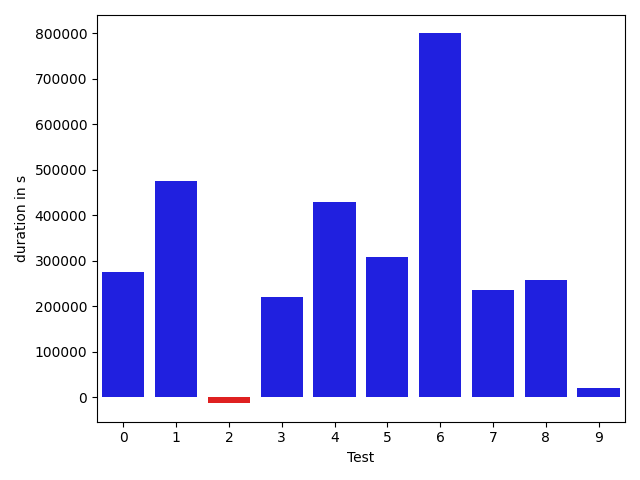

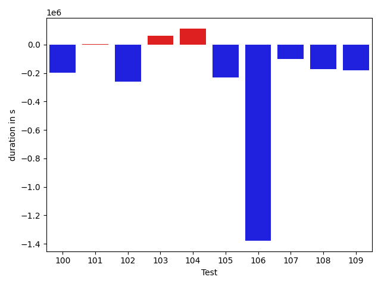

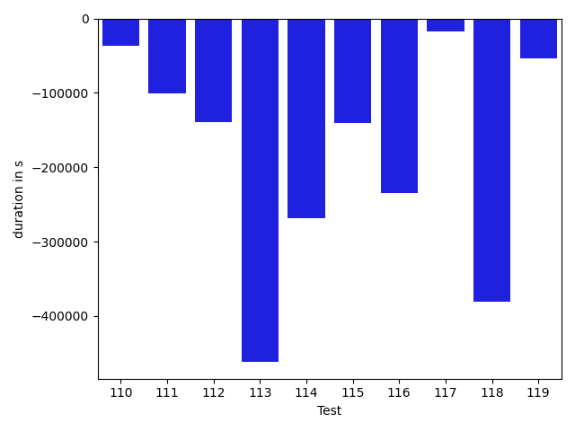

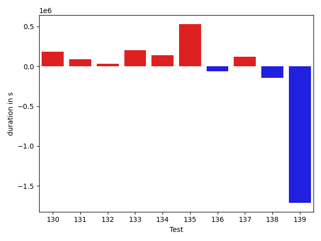

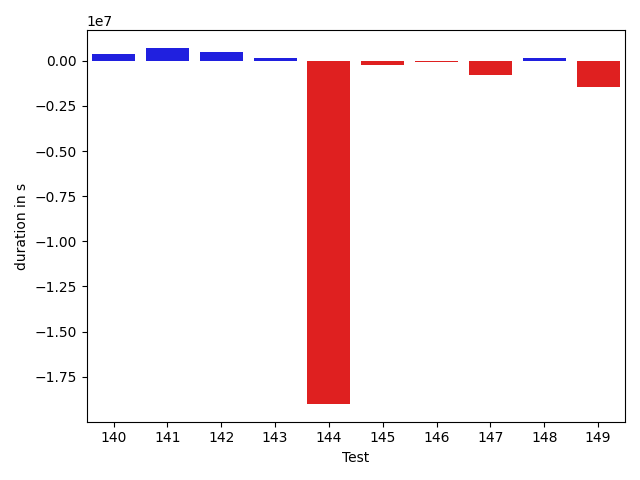

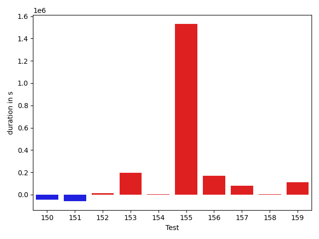

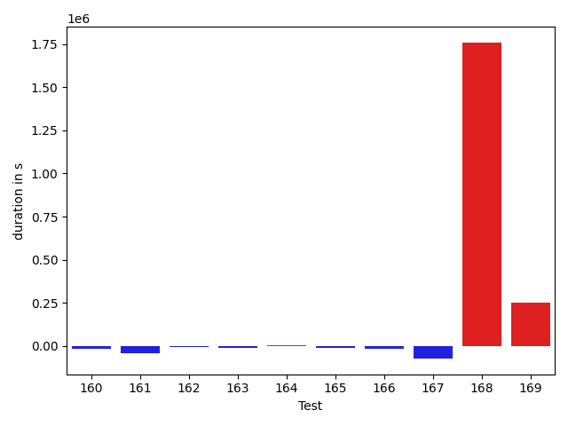

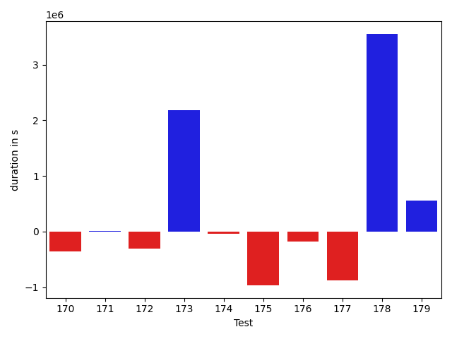

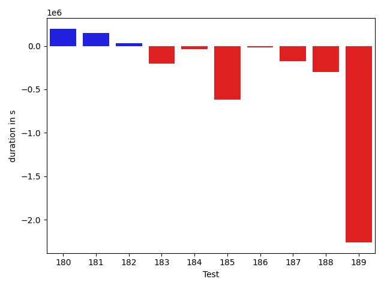

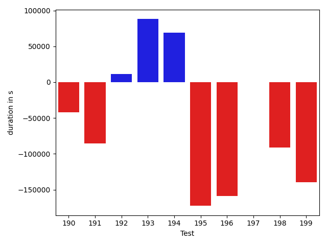

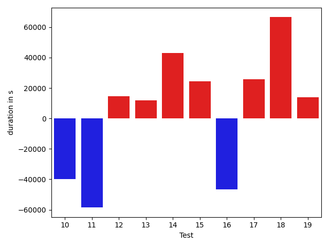

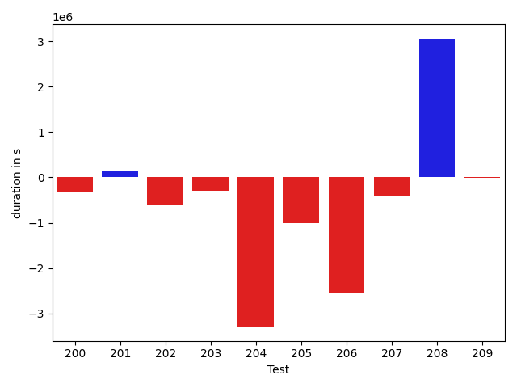

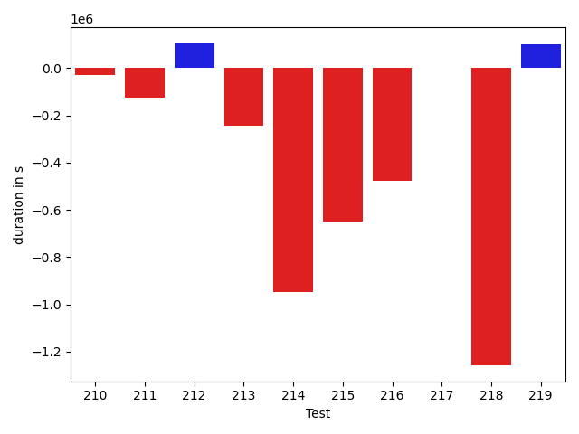

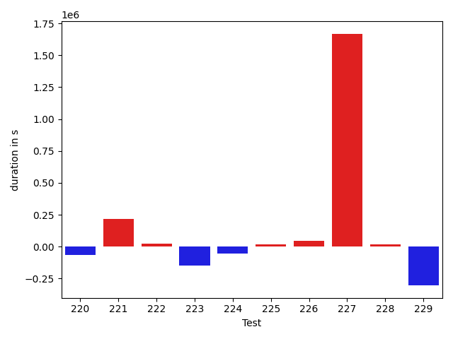

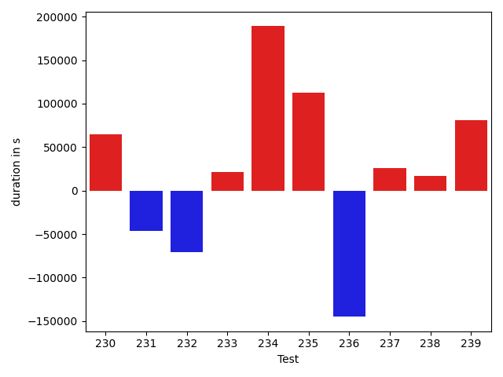

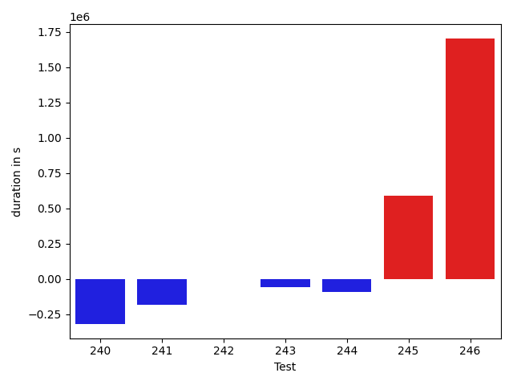

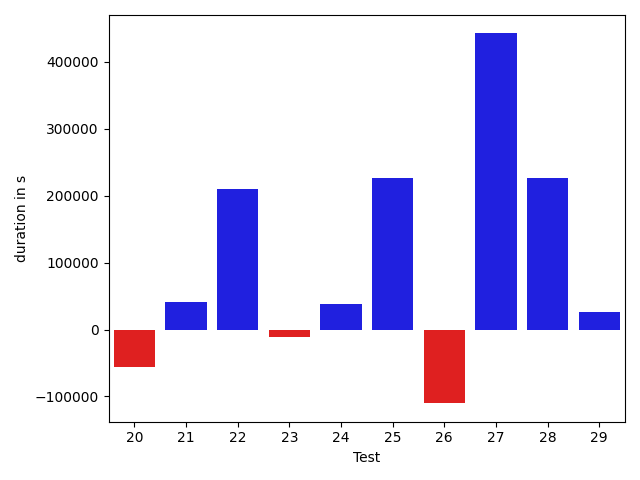

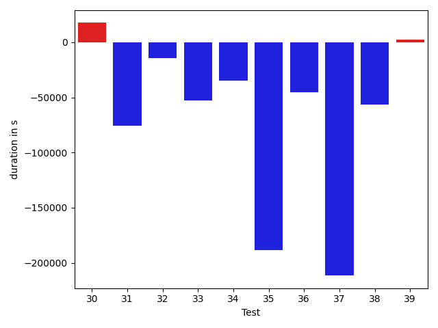

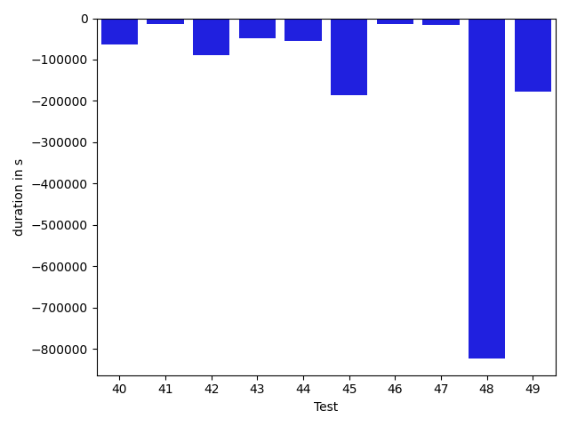

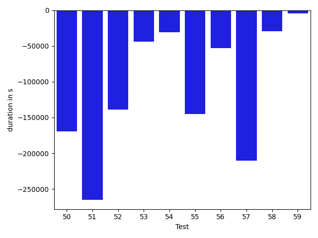

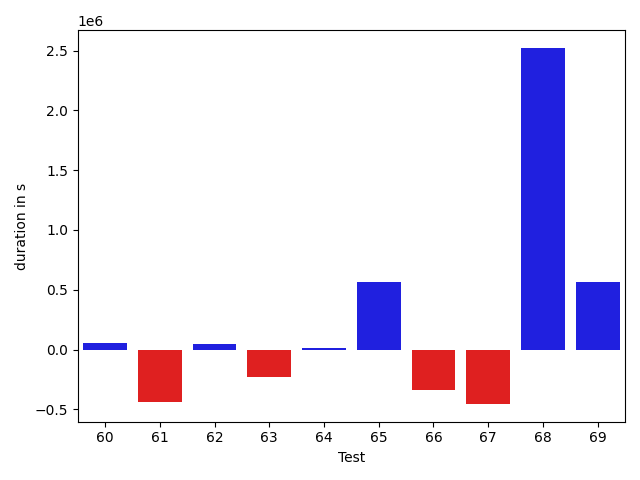

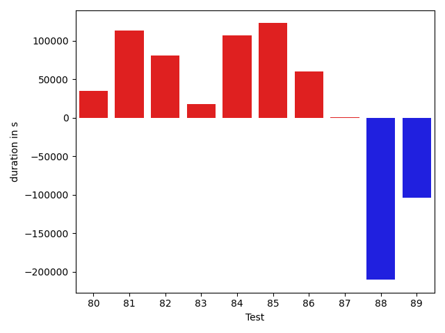

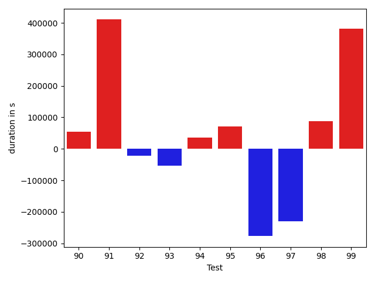

| ID | DurationV1 | DurationsV2 | DeltaDuration |
| --- | --- | --- | --- |
| 0 | 1047234.1748981632 | 1322085.1410539374 | 274850.9661557742 |
| 1 | 876201.881568941 | 1350632.543121683 | 474430.6615527419 |
| 2 | 570315.9207410238 | 556805.479162662 | -13510.441578361788 |
| 3 | 580333.7789633283 | 799982.825322747 | 219649.04635941866 |
| 4 | 1263114.4488247742 | 1692858.851724281 | 429744.40289950673 |
| 5 | 735686.2454798671 | 1044750.4085193179 | 309064.16303945077 |
| 6 | 946926.0370845741 | 1746749.6639172435 | 799823.6268326694 |
| 7 | 627913.2758140862 | 862985.1838336061 | 235071.90801951988 |
| 8 | 763049.4380200085 | 1019685.7773279345 | 256636.339307926 |
| 9 | 827898.9246600482 | 847897.6105247003 | 19998.68586465204 |
| 10 | 688011.424984304 | 639562.3381811922 | -48449.08680311183 |
| 11 | 919207.3117869821 | 1102706.5681784288 | 183499.2563914467 |
| 12 | 935079.1052915349 | 994912.7776623238 | 59833.672370788874 |
| 13 | 815946.9516913679 | 860999.4453956428 | 45052.49370427488 |
| 14 | 1828204.7830895837 | 1870923.6800101364 | 42718.89692055271 |
| 15 | 943876.5609803011 | 998569.1095534367 | 54692.54857313563 |
| 16 | 1759491.3863863912 | 2081587.1303201884 | 322095.7439337971 |
| 17 | 1037485.7127754367 | 1151894.9304066568 | 114409.21763122012 |
| 18 | 1022558.7896569412 | 1042719.5661748478 | 20160.776517906575 |
| 19 | 1148433.6894221522 | 1219291.1208775677 | 70857.43145541544 |
| 20 | 1980668.1930903778 | 1924902.6961883828 | -55765.49690199504 |
| 21 | 933105.8713469168 | 973500.157195946 | 40394.2858490292 |
| 22 | 924896.1018125346 | 1135549.2818854346 | 210653.18007290002 |
| 23 | 713155.030623671 | 701254.1611147912 | -11900.869508879841 |
| 24 | 503505.70914340415 | 541337.0726566375 | 37831.36351323337 |
| 25 | 577625.5577393683 | 803804.8513873913 | 226179.29364802304 |
| 26 | 524051.3438396454 | 413931.9524307251 | -110119.39140892029 |
| 27 | 1399924.8233413268 | 1842167.682658832 | 442242.85931750527 |
| 28 | 676885.054203377 | 903510.942032901 | 226625.887829524 |
| 29 | 371346.2694110628 | 397192.39292907715 | 25846.123518014327 |
| 30 | 587044.4294915432 | 883765.6570877973 | 296721.2275962541 |
| 31 | 773098.8285264464 | 777110.000483669 | 4011.1719572226284 |
| 32 | 675368.5199634853 | 752248.6142283244 | 76880.09426483908 |
| 33 | 524087.55504779384 | 655660.2738327952 | 131572.71878500137 |
| 34 | 1036808.7148827489 | 1178835.1582030156 | 142026.44332026667 |
| 35 | 283652.6629338227 | 372510.934463501 | 88858.27152967826 |
| 36 | 317432.25836806 | 446395.3620605469 | 128963.10369248688 |
| 37 | 762724.3507682865 | 860511.994351775 | 97787.64358348853 |
| 38 | 382931.0922023058 | 425839.4607128501 | 42908.3685105443 |
| 39 | 836974.2519052487 | 790006.9733386317 | -46967.27856661705 |
| 40 | 970984.3901946422 | 898537.8084127079 | -72446.58178193436 |
| 41 | 2621371.787505926 | 3337900.145342352 | 716528.3578364258 |
| 42 | 618064.236059919 | 563336.1627572775 | -54728.07330264151 |
| 43 | 971136.2718818333 | 721968.4590968309 | -249167.8127850024 |
| 44 | 462976.59367233515 | 761712.8494568095 | 298736.2557844743 |
| 45 | 904840.2715604213 | 735793.6416067197 | -169046.62995370163 |
| 46 | 762614.8352484782 | 712637.3539441824 | -49977.48130429583 |
| 47 | 851935.6827575723 | 1028002.4756672261 | 176066.79290965386 |
| 48 | 587790.8476257324 | 704800.5551396522 | 117009.7075139198 |
| 49 | 517401.2595128566 | 599735.3049226253 | 82334.0454097687 |
| 50 | 680316.3702962399 | 519568.13320946693 | -160748.23708677292 |
| 51 | 545959.6110809417 | 601707.5928632617 | 55747.981782319956 |
| 52 | 466948.44289815426 | 463961.5807272196 | -2986.862170934677 |
| 53 | 6809775.783593789 | 5104342.557297663 | -1705433.226296126 |
| 54 | 4255131.211546852 | 2637084.943040183 | -1618046.2685066694 |
| 55 | 3308066.9627954336 | 2280604.2907284973 | -1027462.6720669363 |
| 56 | 723284.4556254521 | 458514.651191324 | -264769.8044341281 |
| 57 | 593416.6154052702 | 582984.7221860499 | -10431.893219220336 |
| 58 | 1120363.299041653 | 712037.2566453915 | -408326.0423962616 |
| 59 | 1386136.3350249827 | 1173356.1277969806 | -212780.20722800214 |
| 60 | 728154.3095822898 | 784532.5539645874 | 56378.24438229762 |
| 61 | 1698232.2601334602 | 1257290.7787453416 | -440941.4813881186 |
| 62 | 809063.9194665253 | 857597.3573114636 | 48533.43784493825 |
| 63 | 754398.1746664047 | 522715.2867994476 | -231682.8878669571 |
| 64 | 719697.1939438343 | 729747.0416319532 | 10049.847688118927 |
| 65 | 699885.9998196657 | 1263793.823238022 | 563907.8234183562 |
| 66 | 933975.7852611504 | 591826.0727082018 | -342149.7125529486 |
| 67 | 993468.318859363 | 538185.358901996 | -455282.9599573669 |
| 68 | 3282519.9437839724 | 5805228.185968125 | 2522708.242184153 |
| 69 | 537117.0332007029 | 1103441.0082476477 | 566323.9750469448 |
| 70 | 655754.1417088723 | 1143330.2920035599 | 487576.1502946876 |
| 71 | 408571.50070524216 | 489503.2658845782 | 80931.76517933607 |
| 72 | 612574.3654311104 | 1533073.3190317724 | 920498.9536006621 |
| 73 | 781792.5469174513 | 811870.0508108037 | 30077.503893352346 |
| 74 | 473798.6583947744 | 732989.6813609898 | 259191.0229662154 |
| 75 | 562267.5101613908 | 733476.0889095253 | 171208.57874813455 |
| 76 | 490522.8503991496 | 529241.0616173544 | 38718.211218204815 |
| 77 | 1151302.9829108429 | 1767381.7995428632 | 616078.8166320203 |
| 78 | 1113291.9886382718 | 804731.4020201885 | -308560.5866180833 |
| 79 | 463583.9596216902 | 549991.2671267986 | 86407.30750510842 |
| 80 | 1232043.0124098794 | 2273032.7120713284 | 1040989.6996614491 |
| 81 | 697604.9051254522 | 856760.0269188917 | 159155.1217934395 |
| 82 | 1000929.0449113026 | 1945096.3391958813 | 944167.2942845786 |
| 83 | 3500850.1141845556 | 1896155.8424920985 | -1604694.2716924571 |
| 84 | 865254.0475506048 | 955558.0449505085 | 90303.99739990372 |
| 85 | 717182.0148228144 | 1010583.2904067399 | 293401.27558392554 |
| 86 | 760532.8737823516 | 745309.6021432888 | -15223.27163906279 |
| 87 | 625369.1541959066 | 474596.72019965964 | -150772.43399624695 |
| 88 | 734214.2720612265 | 838271.5909853847 | 104057.31892415811 |
| 89 | 1323472.7826936478 | 2428232.0138382777 | 1104759.23114463 |
| 90 | 853421.1396186738 | 1007256.2402838959 | 153835.10066522204 |
| 91 | 690117.1818929391 | 873486.6698360112 | 183369.4879430721 |
| 92 | 484269.4587904138 | 705674.4781543209 | 221405.01936390705 |
| 93 | 1083831.674762602 | 3752057.0438089087 | 2668225.3690463067 |
| 94 | 451200.48912801966 | 437893.57485461235 | -13306.91427340731 |
| 95 | 557872.3213012815 | 450972.94575668126 | -106899.37554460019 |
| 96 | 626499.3775036939 | 668995.3959684607 | 42496.01846476679 |
| 97 | 910989.7401498423 | 1046304.8591464881 | 135315.1189966458 |
| 98 | 1068782.1479611099 | 643059.4728380877 | -425722.67512302217 |
| 99 | 779782.9264386045 | 779727.3453942941 | -55.58104431035463 |
| 100 | 6728069.431693765 | 6358974.8495529 | -369094.58214086574 |
| 101 | 325617.8881225586 | 397844.7272088304 | 72226.83908627182 |
| 102 | 1814807.8988196594 | 507284.0489587784 | -1307523.849860881 |
| 103 | 337925.4825193882 | 441536.4594507981 | 103610.97693140991 |
| 104 | 642179.9830923509 | 654645.816837453 | 12465.833745102165 |
| 105 | 1450358.762335753 | 1526660.5995668266 | 76301.83723107353 |
| 106 | 405378.96005021385 | 484398.53971573524 | 79019.57966552139 |
| 107 | 749657.4655380035 | 616544.4278046588 | -133113.0377333447 |
| 108 | 581290.8877260685 | 527408.3220491707 | -53882.565676897764 |
| 109 | 793971.0022972075 | 649527.6006521656 | -144443.4016450419 |
| 110 | 1214470.606474045 | 950215.1229500823 | -264255.48352396267 |
| 111 | 896067.5850713127 | 750647.0507757461 | -145420.5342955666 |
| 112 | 280990.3580493927 | 448743.5203399658 | 167753.16229057312 |
| 113 | 360774.5227150321 | 545979.1758975983 | 185204.65318256617 |
| 114 | 533756.356313467 | 520040.18060130253 | -13716.175712164491 |
| 115 | 381430.667724669 | 487577.14182186127 | 106146.47409719229 |
| 116 | 551727.6518707275 | 469091.27569419146 | -82636.37617653608 |
| 117 | 485052.96247326024 | 781633.1674324383 | 296580.2049591781 |
| 118 | 359912.0746126175 | 490747.83672332764 | 130835.76211071014 |
| 119 | 589452.2307543281 | 585460.8641778358 | -3991.3665764923207 |
| 120 | 870677.3909526024 | 667948.057192032 | -202729.3337605704 |
| 121 | 746290.8321726274 | 929890.6749959327 | 183599.84282330528 |
| 122 | 466785.141323328 | 447968.59450174775 | -18816.54682158027 |
| 123 | 594288.6813922524 | 469286.8556014262 | -125001.82579082623 |
| 124 | 403220.11833182676 | 507410.808963627 | 104190.69063180021 |
| 125 | 404110.57093811035 | 405853.72415678203 | 1743.1532186716795 |
| 126 | 405953.1801724434 | 470465.54310417175 | 64512.36293172836 |
| 127 | 806000.7742682302 | 706100.1704749087 | -99900.60379332153 |
| 128 | 571211.6152687073 | 444283.0179169178 | -126928.59735178947 |
| 129 | 410815.7566078901 | 445714.64328593016 | 34898.88667804003 |
| 130 | 485650.95281110797 | 607146.482545065 | 121495.52973395702 |
| 131 | 449406.67798662186 | 512249.67533497885 | 62842.99734835699 |
| 132 | 340115.7598991394 | 503805.1385140419 | 163689.3786149025 |
| 133 | 887784.3044059156 | 682934.3261322567 | -204849.9782736589 |
| 134 | 682523.7337530241 | 703815.4146581864 | 21291.68090516224 |
| 135 | 2359460.854626608 | 2288613.1252069506 | -70847.7294196575 |
| 136 | 440843.1228088187 | 602051.6393271713 | 161208.51651835255 |
| 137 | 787129.75840676 | 688476.0554445025 | -98653.70296225755 |
| 138 | 684460.0316627758 | 820491.5461817278 | 136031.514518952 |
| 139 | 1434784.5016645617 | 1795557.7948128954 | 360773.2931483337 |
| 140 | 881069.9430518753 | 1282616.6706454393 | 401546.72759356396 |
| 141 | 744554.4607075155 | 1459240.885271117 | 714686.4245636016 |
| 142 | 511844.5799867953 | 981444.8458299561 | 469600.2658431608 |
| 143 | 393184.6068066815 | 551897.3631974459 | 158712.75639076438 |
| 144 | 23695308.612781815 | 4683389.677629342 | -19011918.93515247 |
| 145 | 942758.7608413004 | 703507.406935012 | -239251.3539062884 |
| 146 | 895844.6104150743 | 819258.5523298822 | -76586.05808519211 |
| 147 | 1781098.204326272 | 1003534.360879939 | -777563.843446333 |
| 148 | 1215370.163686611 | 1366236.3245148167 | 150866.16082820576 |
| 149 | 2761038.0554332286 | 1302745.9271999071 | -1458292.1282333215 |
| 150 | 846999.825261029 | 1114181.8426891286 | 267182.01742809964 |
| 151 | 932590.7329136585 | 854705.8429255709 | -77884.88998808758 |
| 152 | 1008941.7976265086 | 696224.6450712199 | -312717.15255528875 |
| 153 | 1032992.274319858 | 810900.4091847716 | -222091.86513508647 |
| 154 | 2018262.6208660803 | 1968929.1391178418 | -49333.48174823844 |
| 155 | 1058260.3148926767 | 826226.934052635 | -232033.38084004167 |
| 156 | 1246122.6472187254 | 645667.8646152646 | -600454.7826034608 |
| 157 | 3061748.7814180446 | 3149369.7067586523 | 87620.92534060776 |
| 158 | 773867.6758649978 | 574108.8664908707 | -199758.80937412707 |
| 159 | 621646.8845551456 | 990568.8864187386 | 368922.001863593 |
| 160 | 637058.6136552617 | 954331.8029601517 | 317273.18930489 |
| 161 | 1537309.4382752955 | 1593391.2379518051 | 56081.799676509574 |
| 162 | 529604.1592686262 | 743389.1231771166 | 213784.96390849038 |
| 163 | 1220886.915795493 | 1045802.2050802171 | -175084.71071527584 |
| 164 | 995739.2626235904 | 1105373.0391237373 | 109633.77650014684 |
| 165 | 1155011.2318119935 | 843832.1326284197 | -311179.09918357385 |
| 166 | 874910.070250053 | 1390520.7095914017 | 515610.6393413488 |
| 167 | 1243791.4457903397 | 535600.4026881125 | -708191.0431022273 |
| 168 | 3737051.734484313 | 692164.4869279983 | -3044887.247556315 |
| 169 | 724153.0719508152 | 588240.309698889 | -135912.76225192612 |
| 170 | 916113.4654103112 | 558579.5891489685 | -357533.8762613428 |
| 171 | 789187.079778982 | 800612.4270067585 | 11425.34722777654 |
| 172 | 6092383.69407386 | 5782355.106250326 | -310028.58782353345 |
| 173 | 9350396.979467776 | 11534368.868630238 | 2183971.889162462 |
| 174 | 688242.0753022991 | 643661.7886804327 | -44580.2866218664 |
| 175 | 1642983.5235814871 | 678880.0783586358 | -964103.4452228514 |
| 176 | 870469.609706929 | 695411.3841045004 | -175058.22560242855 |
| 177 | 1369569.0701517605 | 496234.1870559027 | -873334.8830958578 |
| 178 | 2080248.7582738288 | 5632986.953024916 | 3552738.1947510876 |
| 179 | 477648.10197130335 | 1031642.728078247 | 553994.6261069437 |
| 180 | 541452.1602913341 | 738856.8843905266 | 197404.72409919242 |
| 181 | 635890.4603920728 | 782531.2341598037 | 146640.77376773092 |
| 182 | 471530.3602399826 | 505242.18127059937 | 33711.82103061676 |
| 183 | 751651.1852986792 | 549827.6321116568 | -201823.55318702233 |
| 184 | 447410.68099975586 | 409596.50571075827 | -37814.17528899759 |
| 185 | 1112999.7857518587 | 492647.79527205846 | -620351.9904798003 |
| 186 | 513950.26363646984 | 495367.0343327522 | -18583.229303717613 |
| 187 | 554817.8063211441 | 381505.52836608887 | -173312.27795505524 |
| 188 | 1487344.7247035522 | 1188349.344402316 | -298995.3803012362 |
| 189 | 11660582.767498655 | 9400534.842014775 | -2260047.9254838806 |
| 190 | 948213.0657597039 | 905945.5684803398 | -42267.49727936403 |
| 191 | 669914.3189148903 | 584735.1044792009 | -85179.21443568938 |
| 192 | 597224.1998499855 | 608267.0822727308 | 11042.882422745228 |
| 193 | 488491.6321025491 | 576422.2746495623 | 87930.64254701324 |
| 194 | 452275.2229872942 | 521430.2961425781 | 69155.07315528393 |
| 195 | 1751302.485340687 | 1578657.74618635 | -172644.73915433697 |
| 196 | 579470.3738729954 | 420997.3358379882 | -158473.0380350072 |
| 197 | 2390781.04291909 | 2390636.344662008 | -144.69825708214194 |
| 198 | 921643.6989971946 | 830706.233637779 | -90937.46535941563 |
| 199 | 654663.8351217965 | 514972.17869278206 | -139691.6564290144 |
| 200 | 840272.5082315977 | 501559.86845582165 | -338712.6397757761 |
| 201 | 393599.2952514142 | 538200.0782939196 | 144600.78304250538 |
| 202 | 1272424.6630658326 | 672343.517001871 | -600081.1460639616 |
| 203 | 981552.3814589455 | 693868.1814520889 | -287684.2000068566 |
| 204 | 4612566.369328695 | 1326153.5061962148 | -3286412.8631324805 |
| 205 | 1471365.991928941 | 461403.0728998231 | -1009962.919029118 |
| 206 | 3189784.1043151896 | 646342.2647895217 | -2543441.839525668 |
| 207 | 996551.6999301112 | 584155.7930867128 | -412395.90684339835 |
| 208 | 7216830.435671428 | 10271008.543510564 | 3054178.1078391355 |
| 209 | 1010726.993196434 | 992848.9443512171 | -17878.048845216865 |
| 210 | 1278420.7427116726 | 1251070.249005133 | -27350.493706539506 |
| 211 | 1051215.1554142414 | 925459.8863444808 | -125755.26906976057 |
| 212 | 872997.294399292 | 977908.472400097 | 104911.17800080497 |
| 213 | 1078803.5770797709 | 834913.0746905118 | -243890.50238925905 |
| 214 | 1423068.3592634236 | 475248.7930859251 | -947819.5661774985 |
| 215 | 1666222.4867305895 | 1015581.0875195228 | -650641.3992110668 |
| 216 | 947388.8855634127 | 470897.49271200894 | -476491.39285140374 |
| 217 | 861787.184304043 | 865013.1853456905 | 3226.0010416475125 |
| 218 | 1995983.144833059 | 738037.6995622437 | -1257945.4452708154 |
| 219 | 1000245.3520885645 | 1099723.8362825944 | 99478.48419402982 |
| 220 | 1091357.8915790892 | 858830.6896422827 | -232527.20193680655 |
| 221 | 1299585.7677473933 | 1046606.4360430052 | -252979.33170438814 |
| 222 | 1242874.0947210875 | 1045436.1774952167 | -197437.91722587077 |
| 223 | 1243051.9693482511 | 1192687.2562640666 | -50364.713084184565 |
| 224 | 1644811.7437091502 | 1963399.202520564 | 318587.45881141373 |
| 225 | 1201980.7053417456 | 761590.4303107462 | -440390.27503099944 |
| 226 | 1115578.8729268967 | 698419.9031094412 | -417158.9698174555 |
| 227 | 531120.7849925307 | 531468.0051821959 | 347.22018966521136 |
| 228 | 622473.5076332092 | 464456.758892525 | -158016.74874068424 |
| 229 | 1449583.7933950461 | 1747509.2537278286 | 297925.4603327825 |
| 230 | 1197508.0829833755 | 2800517.825082481 | 1603009.7420991054 |
| 231 | 574747.9638444039 | 844105.635707985 | 269357.67186358117 |
| 232 | 1047711.3737279123 | 1081494.7241278733 | 33783.350399961 |
| 233 | 2009476.274692024 | 1715834.672736119 | -293641.6019559051 |
| 234 | 6105608.775603071 | 5664373.15054871 | -441235.6250543613 |
| 235 | 812325.5556316199 | 2190022.8755147103 | 1377697.3198830904 |
| 236 | 576405.8129520044 | 1259315.8427170664 | 682910.029765062 |
| 237 | 431137.9067635746 | 817753.2014131546 | 386615.29464958 |
| 238 | 397395.04327298887 | 404342.8585460186 | 6947.81527302973 |
| 239 | 1077960.2997282515 | 764438.3402557565 | -313521.959472495 |
| 240 | 972841.0981073529 | 1920712.7311748266 | 947871.6330674738 |
| 241 | 1291661.2209806875 | 983425.9392635813 | -308235.28171710623 |
| 242 | 536674.2199978255 | 641094.1621746387 | 104419.94217681326 |
| 243 | 709861.2118030647 | 534816.9788660817 | -175044.232936983 |
| 244 | 548957.0444019567 | 459861.3082612502 | -89095.73614070652 |
| 245 | 801453.8152863522 | 675037.1873965538 | -126416.62788979837 |
| 246 | 1095814.91848183 | 1034078.6441268456 | -61736.2743549844 |

## Misc.

| ID | Test Class | Test Method |
| --- | --- | --- |
| 0 | com.google.gson.functional.StreamingTypeAdaptersTest | testNullSafe |
| 1 | com.google.gson.functional.StreamingTypeAdaptersTest | testSerializeWithCustomTypeAdapter |
| 2 | com.google.gson.functional.StreamingTypeAdaptersTest | testSerializeRecursive |
| 3 | com.google.gson.functional.StreamingTypeAdaptersTest | testDeserializeWithCustomTypeAdapter |
| 4 | com.google.gson.functional.CustomDeserializerTest | testDefaultConstructorNotCalledOnObject |
| 5 | com.google.gson.functional.CustomDeserializerTest | testCustomDeserializerReturnsNullForArrayElementsForArrayField |
| 6 | com.google.gson.functional.CustomDeserializerTest | testJsonTypeFieldBasedDeserialization |
| 7 | com.google.gson.functional.CustomDeserializerTest | testDefaultConstructorNotCalledOnField |
| 8 | com.google.gson.functional.CustomDeserializerTest | testCustomDeserializerReturnsNull |
| 9 | com.google.gson.functional.InterfaceTest | testSerializingObjectImplementingInterface |
| 10 | com.google.gson.functional.InterfaceTest | testSerializingInterfaceObjectField |
| 11 | com.google.gson.functional.ParameterizedTypesTest | testParameterizedTypeGenericArraysSerialization |
| 12 | com.google.gson.functional.ParameterizedTypesTest | testVariableTypeArrayDeserialization |
| 13 | com.google.gson.functional.ParameterizedTypesTest | testParameterizedTypeWithReaderDeserialization |
| 14 | com.google.gson.functional.ParameterizedTypesTest | testParameterizedTypesSerialization |
| 15 | com.google.gson.functional.ParameterizedTypesTest | testVariableTypeDeserialization |
| 16 | com.google.gson.functional.ParameterizedTypesTest | testVariableTypeFieldsAndGenericArraysSerialization |
| 17 | com.google.gson.functional.ParameterizedTypesTest | testParameterizedTypeGenericArraysDeserialization |
| 18 | com.google.gson.functional.ParameterizedTypesTest | testParameterizedTypeDeserialization |
| 19 | com.google.gson.functional.ParameterizedTypesTest | testVariableTypeFieldsAndGenericArraysDeserialization |
| 20 | com.google.gson.functional.ParameterizedTypesTest | testTypesWithMultipleParametersSerialization |
| 21 | com.google.gson.functional.ParameterizedTypesTest | testTypesWithMultipleParametersDeserialization |
| 22 | com.google.gson.functional.ParameterizedTypesTest | testParameterizedTypeWithVariableTypeDeserialization |
| 23 | com.google.gson.functional.ParameterizedTypesTest | testParameterizedTypesWithWriterSerialization |
| 24 | com.google.gson.functional.ParameterizedTypesTest | testDeepParameterizedTypeSerialization |
| 25 | com.google.gson.functional.ParameterizedTypesTest | testDeepParameterizedTypeDeserialization |
| 26 | com.google.gson.functional.InheritanceTest | testBaseSerializedAsBaseWhenSpecifiedWithExplicitType |
| 27 | com.google.gson.functional.InheritanceTest | testSubInterfacesOfCollectionSerialization |
| 28 | com.google.gson.functional.InheritanceTest | testBaseSerializedAsBaseWhenSpecifiedWithExplicitTypeForToJsonMethod |
| 29 | com.google.gson.functional.InheritanceTest | testBaseSerializedAsSubForToJsonMethod |
| 30 | com.google.gson.functional.InheritanceTest | testClassWithBaseArrayFieldSerialization |
| 31 | com.google.gson.functional.InheritanceTest | testSubInterfacesOfCollectionDeserialization |
| 32 | com.google.gson.functional.InheritanceTest | testClassWithBaseCollectionFieldSerialization |
| 33 | com.google.gson.functional.InheritanceTest | testClassWithBaseFieldSerialization |
| 34 | com.google.gson.functional.InheritanceTest | testSubClassSerialization |
| 35 | com.google.gson.functional.InheritanceTest | testBaseSerializedAsSubWhenSpecifiedWithExplicitTypeForToJsonMethod |
| 36 | com.google.gson.functional.InheritanceTest | testBaseSerializedAsSubWhenSpecifiedWithExplicitType |
| 37 | com.google.gson.functional.InheritanceTest | testSubClassDeserialization |
| 38 | com.google.gson.functional.InheritanceTest | testBaseSerializedAsSub |
| 39 | com.google.gson.functional.NamingPolicyTest | testAtSignInSerializedName |
| 40 | com.google.gson.functional.NamingPolicyTest | testGsonWithNonDefaultFieldNamingPolicySerialization |
| 41 | com.google.gson.functional.NamingPolicyTest | testGsonDuplicateNameUsingSerializedNameFieldNamingPolicySerialization |
| 42 | com.google.gson.functional.NamingPolicyTest | testGsonWithSerializedNameFieldNamingPolicyDeserialization |
| 43 | com.google.gson.functional.NamingPolicyTest | testGsonWithSerializedNameFieldNamingPolicySerialization |
| 44 | com.google.gson.functional.NamingPolicyTest | testGsonWithNonDefaultFieldNamingPolicyDeserialiation |
| 45 | com.google.gson.functional.NamingPolicyTest | testComplexFieldNameStrategy |
| 46 | com.google.gson.functional.NamingPolicyTest | testGsonWithLowerCaseDashPolicySerialization |
| 47 | com.google.gson.functional.NamingPolicyTest | testDeprecatedNamingStrategy |
| 48 | com.google.gson.functional.NamingPolicyTest | testGsonWithLowerCaseDashPolicyDeserialiation |
| 49 | com.google.gson.functional.NamingPolicyTest | testGsonWithUpperCamelCaseSpacesPolicyDeserialiation |
| 50 | com.google.gson.functional.NamingPolicyTest | testGsonWithLowerCaseUnderscorePolicySerialization |
| 51 | com.google.gson.functional.NamingPolicyTest | testGsonWithLowerCaseUnderscorePolicyDeserialiation |
| 52 | com.google.gson.functional.NamingPolicyTest | testGsonWithUpperCamelCaseSpacesPolicySerialiation |
| 53 | com.google.gson.functional.CircularReferenceTest | testCircularSerialization |
| 54 | com.google.gson.functional.CircularReferenceTest | testSelfReferenceArrayFieldSerialization |
| 55 | com.google.gson.functional.CircularReferenceTest | testSelfReferenceSerialization |
| 56 | com.google.gson.functional.CircularReferenceTest | testDirectedAcyclicGraphDeserialization |
| 57 | com.google.gson.functional.CircularReferenceTest | testDirectedAcyclicGraphSerialization |
| 58 | com.google.gson.functional.MapTest | testMapSerializationWithNullValues |
| 59 | com.google.gson.functional.MapTest | testInterfaceTypeMapWithSerializer |
| 60 | com.google.gson.functional.MapTest | testGeneralMapField |
| 61 | com.google.gson.functional.MapTest | testInterfaceTypeMap |
| 62 | com.google.gson.functional.MapTest | testComplexKeysSerialization |
| 63 | com.google.gson.functional.MapTest | testMapSerializationWithNullValuesSerialized |
| 64 | com.google.gson.functional.MapTest | testComplexKeysDeserialization |
| 65 | com.google.gson.functional.ReadersWritersTest | testReadWriteTwoObjects |
| 66 | com.google.gson.functional.ReadersWritersTest | testReaderForDeserialization |
| 67 | com.google.gson.functional.ReadersWritersTest | testWriterForSerialization |
| 68 | com.google.gson.functional.ExposeFieldsTest | testNullExposeFieldSerialization |
| 69 | com.google.gson.functional.ExposeFieldsTest | testArrayWithOneNullExposeFieldObjectSerialization |
| 70 | com.google.gson.functional.ExposeFieldsTest | testExposedInterfaceFieldSerialization |
| 71 | com.google.gson.functional.ExposeFieldsTest | testNoExposedFieldDeserialization |
| 72 | com.google.gson.functional.ExposeFieldsTest | testExposeAnnotationSerialization |
| 73 | com.google.gson.functional.ExposeFieldsTest | testNoExposedFieldSerialization |
| 74 | com.google.gson.functional.ExposeFieldsTest | testExposedInterfaceFieldDeserialization |
| 75 | com.google.gson.functional.ExposeFieldsTest | testExposeAnnotationDeserialization |
| 76 | com.google.gson.functional.FieldExclusionTest | testDefaultNestedStaticClassIncluded |
| 77 | com.google.gson.functional.FieldExclusionTest | testDefaultInnerClassExclusion |
| 78 | com.google.gson.GsonBuilderTest | testExcludeFieldsWithModifiers |
| 79 | com.google.gson.GsonBuilderTest | testTransientFieldExclusion |
| 80 | com.google.gson.functional.MoreSpecificTypeSerializationTest | testSubclassFields |
| 81 | com.google.gson.functional.MoreSpecificTypeSerializationTest | testMapOfParameterizedSubclassFields |
| 82 | com.google.gson.functional.MoreSpecificTypeSerializationTest | testListOfSubclassFields |
| 83 | com.google.gson.functional.MoreSpecificTypeSerializationTest | testMapOfSubclassFields |
| 84 | com.google.gson.functional.MoreSpecificTypeSerializationTest | testParameterizedSubclassFields |
| 85 | com.google.gson.functional.MoreSpecificTypeSerializationTest | testListOfParameterizedSubclassFields |
| 86 | com.google.gson.functional.NullObjectAndFieldTest | testExplicitDeserializationOfNulls |
| 87 | com.google.gson.functional.NullObjectAndFieldTest | testExplicitSerializationOfNullCollectionMembers |
| 88 | com.google.gson.functional.NullObjectAndFieldTest | testNullWrappedPrimitiveMemberSerialization |
| 89 | com.google.gson.functional.NullObjectAndFieldTest | testExplicitSerializationOfNullArrayMembers |
| 90 | com.google.gson.functional.NullObjectAndFieldTest | testAbsentJsonElementsAreSetToNull |
| 91 | com.google.gson.functional.NullObjectAndFieldTest | testPrintPrintingObjectWithNulls |
| 92 | com.google.gson.functional.NullObjectAndFieldTest | testExplicitSerializationOfNullStringMembers |
| 93 | com.google.gson.functional.NullObjectAndFieldTest | testExplicitSerializationOfNulls |
| 94 | com.google.gson.functional.NullObjectAndFieldTest | testNullWrappedPrimitiveMemberDeserialization |
| 95 | com.google.gson.functional.NullObjectAndFieldTest | testExplicitNullSetsFieldToNullDuringDeserialization |
| 96 | com.google.gson.functional.ObjectTest | testNestedSerialization |
| 97 | com.google.gson.functional.ObjectTest | testSingletonLists |
| 98 | com.google.gson.functional.ObjectTest | testNullFieldsSerialization |
| 99 | com.google.gson.functional.ObjectTest | testArrayOfObjectsAsFields |
| 100 | com.google.gson.functional.ObjectTest | testDateAsMapObjectField |
| 101 | com.google.gson.functional.ObjectTest | testNullArraysDeserialization |
| 102 | com.google.gson.functional.ObjectTest | testClassWithObjectFieldSerialization |
| 103 | com.google.gson.functional.ObjectTest | testObjectFieldNamesWithoutQuotesDeserialization |
| 104 | com.google.gson.functional.ObjectTest | testArrayOfObjectsDeserialization |
| 105 | com.google.gson.functional.ObjectTest | testArrayOfArraysSerialization |
| 106 | com.google.gson.functional.ObjectTest | testBagOfPrimitivesSerialization |
| 107 | com.google.gson.functional.ObjectTest | testNestedDeserialization |
| 108 | com.google.gson.functional.ObjectTest | testBagOfPrimitivesDeserialization |
| 109 | com.google.gson.functional.ObjectTest | testInnerClassDeserialization |
| 110 | com.google.gson.functional.ObjectTest | testEmptyCollectionInAnObjectDeserialization |
| 111 | com.google.gson.functional.ObjectTest | testArrayOfArraysDeserialization |
| 112 | com.google.gson.functional.ObjectTest | testClassWithNoFieldsDeserialization |
| 113 | com.google.gson.functional.ObjectTest | testClassWithTransientFieldsDeserialization |
| 114 | com.google.gson.functional.ObjectTest | testClassWithTransientFieldsDeserializationTransientFieldsPassedInJsonAreIgnored |
| 115 | com.google.gson.functional.ObjectTest | testClassWithNoFieldsSerialization |
| 116 | com.google.gson.functional.ObjectTest | testStringFieldWithEmptyValueSerialization |
| 117 | com.google.gson.functional.ObjectTest | testBagOfPrimitiveWrappersSerialization |
| 118 | com.google.gson.functional.ObjectTest | testBagOfPrimitiveWrappersDeserialization |
| 119 | com.google.gson.functional.ObjectTest | testNullFieldsDeserialization |
| 120 | com.google.gson.functional.ObjectTest | testArrayOfObjectsSerialization |
| 121 | com.google.gson.functional.ObjectTest | testClassWithTransientFieldsSerialization |
| 122 | com.google.gson.functional.ObjectTest | testNullObjectFieldsDeserialization |
| 123 | com.google.gson.functional.ObjectTest | testStringFieldWithNumberValueDeserialization |
| 124 | com.google.gson.functional.ObjectTest | testPrimitiveArrayInAnObjectDeserialization |
| 125 | com.google.gson.functional.ObjectTest | testStringFieldWithEmptyValueDeserialization |
| 126 | com.google.gson.functional.ObjectTest | testPrivateNoArgConstructorDeserialization |
| 127 | com.google.gson.functional.ObjectTest | testInnerClassSerialization |
| 128 | com.google.gson.functional.ObjectTest | testEmptyCollectionInAnObjectSerialization |
| 129 | com.google.gson.functional.ObjectTest | testPrimitiveArrayFieldSerialization |
| 130 | com.google.gson.functional.ObjectTest | testJsonInSingleQuotesDeserialization |
| 131 | com.google.gson.functional.ObjectTest | testJsonInMixedQuotesDeserialization |
| 132 | com.google.gson.functional.ObjectTest | testNullPrimitiveFieldsDeserialization |
| 133 | com.google.gson.functional.CustomTypeAdaptersTest | testCustomNestedSerializers |
| 134 | com.google.gson.functional.CustomTypeAdaptersTest | testCustomNestedDeserializers |
| 135 | com.google.gson.functional.CustomTypeAdaptersTest | testCustomTypeAdapterDoesNotAppliesToSubClasses |
| 136 | com.google.gson.functional.CustomTypeAdaptersTest | testEnsureCustomDeserializerNotInvokedForNullValues |
| 137 | com.google.gson.functional.CustomTypeAdaptersTest | testEnsureCustomSerializerNotInvokedForNullValues |
| 138 | com.google.gson.functional.TypeVariableTest | testBasicTypeVariables |
| 139 | com.google.gson.functional.TypeVariableTest | testAdvancedTypeVariables |
| 140 | com.google.gson.functional.TypeVariableTest | testTypeVariablesViaTypeParameter |
| 141 | com.google.gson.functional.ArrayTest | testSingleNullInArraySerialization |
| 142 | com.google.gson.functional.ArrayTest | testObjectArrayWithNonPrimitivesSerialization |
| 143 | com.google.gson.functional.ArrayTest | testSingleNullInArrayDeserialization |
| 144 | com.google.gson.functional.VersioningTest | testVersionedUntilSerialization |
| 145 | com.google.gson.functional.VersioningTest | testVersionedClassesDeserialization |
| 146 | com.google.gson.functional.VersioningTest | testVersionedClassesSerialization |
| 147 | com.google.gson.functional.VersioningTest | testVersionedUntilDeserialization |
| 148 | com.google.gson.functional.VersioningTest | testVersionedGsonMixingSinceAndUntilSerialization |
| 149 | com.google.gson.functional.VersioningTest | testVersionedGsonWithUnversionedClassesSerialization |
| 150 | com.google.gson.functional.VersioningTest | testVersionedGsonWithUnversionedClassesDeserialization |
| 151 | com.google.gson.functional.VersioningTest | testVersionedGsonMixingSinceAndUntilDeserialization |
| 152 | com.google.gson.functional.MapAsArrayTypeAdapterTest | testMultipleEnableComplexKeyRegistrationHasNoEffect |
| 153 | com.google.gson.functional.MapAsArrayTypeAdapterTest | testMapWithTypeVariableDeserialization |
| 154 | com.google.gson.functional.MapAsArrayTypeAdapterTest | testSerializeComplexMapWithTypeAdapter |
| 155 | com.google.gson.functional.MapAsArrayTypeAdapterTest | testMapWithTypeVariableSerialization |
| 156 | com.google.gson.functional.JsonAdapterAnnotationTest | testSuperclassTypeAdapterNotInvoked |
| 157 | com.google.gson.functional.JsonAdapterAnnotationTest | testJsonAdapterInvoked |
| 158 | com.google.gson.functional.JsonAdapterAnnotationTest | testIncorrectTypeAdapterFails |
| 159 | com.google.gson.functional.JsonAdapterAnnotationTest | testRegisteredSerializerOverridesJsonAdapter |
| 160 | com.google.gson.functional.JsonAdapterAnnotationTest | testRegisteredDeserializerOverridesJsonAdapter |
| 161 | com.google.gson.functional.GsonFieldTypeAdapterTest | testSuperclassTypeAdapterNotInvoked |
| 162 | com.google.gson.functional.GsonFieldTypeAdapterTest | testFieldAdapterNotInvokedIfNull |
| 163 | com.google.gson.functional.GsonFieldTypeAdapterTest | testNonStaticFieldAdapterNotInvoked |
| 164 | com.google.gson.functional.GsonFieldTypeAdapterTest | testIncorrectTypeAdapterNotInvoked |
| 165 | com.google.gson.functional.EnumTest | testClassWithEnumFieldSerialization |
| 166 | com.google.gson.functional.EnumTest | testClassWithEnumFieldDeserialization |
| 167 | com.google.gson.functional.UncategorizedTest | testGsonInstanceReusableForSerializationAndDeserialization |
| 168 | com.google.gson.functional.UncategorizedTest | testInvalidJsonDeserializationFails |
| 169 | com.google.gson.functional.UncategorizedTest | testObjectEqualButNotSameSerialization |
| 170 | com.google.gson.functional.UncategorizedTest | testStaticFieldsAreNotSerialized |
| 171 | com.google.gson.functional.ConcurrencyTest | testSingleThreadSerialization |
| 172 | com.google.gson.functional.ConcurrencyTest | testMultiThreadSerialization |
| 173 | com.google.gson.functional.ConcurrencyTest | testMultiThreadDeserialization |
| 174 | com.google.gson.functional.ConcurrencyTest | testSingleThreadDeserialization |
| 175 | com.google.gson.functional.EscapingTest | testGsonAcceptsEscapedAndNonEscapedJsonDeserialization |
| 176 | com.google.gson.functional.EscapingTest | testGsonDoubleDeserialization |
| 177 | com.google.gson.functional.EscapingTest | testEscapingObjectFields |
| 178 | com.google.gson.functional.CustomSerializerTest | testSubClassSerializerInvokedForBaseClassFieldsHoldingSubClassInstances |
| 179 | com.google.gson.functional.CustomSerializerTest | testSubClassSerializerInvokedForBaseClassFieldsHoldingArrayOfSubClassInstances |
| 180 | com.google.gson.functional.CustomSerializerTest | testBaseClassSerializerInvokedForBaseClassFields |
| 181 | com.google.gson.functional.CustomSerializerTest | testBaseClassSerializerInvokedForBaseClassFieldsHoldingSubClassInstances |
| 182 | com.google.gson.MixedStreamTest | testWriteInvalidState |
| 183 | com.google.gson.MixedStreamTest | testWriteMixedStreamed |
| 184 | com.google.gson.MixedStreamTest | testWriteClosed |
| 185 | com.google.gson.MixedStreamTest | testReadMixedStreamed |
| 186 | com.google.gson.MixedStreamTest | testReaderDoesNotMutateState |
| 187 | com.google.gson.MixedStreamTest | testWriteDoesNotMutateState |
| 188 | com.google.gson.functional.DefaultTypeAdaptersTest | testUrlNullSerialization |
| 189 | com.google.gson.functional.DefaultTypeAdaptersTest | testNullSerialization |
| 190 | com.google.gson.functional.DefaultTypeAdaptersTest | testBigIntegerFieldSerialization |
| 191 | com.google.gson.functional.DefaultTypeAdaptersTest | testBigDecimalFieldDeserialization |
| 192 | com.google.gson.functional.DefaultTypeAdaptersTest | testBadValueForBigDecimalDeserialization |
| 193 | com.google.gson.functional.DefaultTypeAdaptersTest | testBigIntegerFieldDeserialization |
| 194 | com.google.gson.functional.DefaultTypeAdaptersTest | testUrlNullDeserialization |
| 195 | com.google.gson.functional.DefaultTypeAdaptersTest | testBigDecimalFieldSerialization |
| 196 | com.google.gson.functional.ExclusionStrategyFunctionalTest | testExcludeTopLevelClassSerializationDoesNotImpactDeserialization |
| 197 | com.google.gson.functional.ExclusionStrategyFunctionalTest | testExclusionStrategySerialization |
| 198 | com.google.gson.functional.ExclusionStrategyFunctionalTest | testExclusionStrategySerializationDoesNotImpactDeserialization |
| 199 | com.google.gson.functional.ExclusionStrategyFunctionalTest | testExclusionStrategyWithMode |
| 200 | com.google.gson.functional.ExclusionStrategyFunctionalTest | testExclusionStrategySerializationDoesNotImpactSerialization |
| 201 | com.google.gson.functional.ExclusionStrategyFunctionalTest | testExcludeTopLevelClassDeserializationDoesNotImpactSerialization |
| 202 | com.google.gson.functional.ExclusionStrategyFunctionalTest | testExclusionStrategyDeserialization |
| 203 | com.google.gson.functional.FieldNamingTest | testLowerCaseWithUnderscores |
| 204 | com.google.gson.functional.FieldNamingTest | testUpperCamelCase |
| 205 | com.google.gson.functional.FieldNamingTest | testLowerCaseWithDashes |
| 206 | com.google.gson.functional.FieldNamingTest | testIdentity |
| 207 | com.google.gson.functional.FieldNamingTest | testUpperCamelCaseWithSpaces |
| 208 | com.google.gson.functional.TypeHierarchyAdapterTest | testTypeHierarchy |
| 209 | com.google.gson.functional.TreeTypeAdaptersTest | testDeserializeId |
| 210 | com.google.gson.functional.TreeTypeAdaptersTest | testSerializeId |
| 211 | com.google.gson.functional.CollectionTest | testSetDeserialization |
| 212 | com.google.gson.functional.CollectionTest | testSetSerialization |
| 213 | com.google.gson.functional.CollectionTest | testFieldIsArrayList |
| 214 | com.google.gson.functional.CollectionTest | testCollectionOfBagOfPrimitivesSerialization |
| 215 | com.google.gson.functional.CollectionTest | testWildcardCollectionField |
| 216 | com.google.gson.functional.CollectionTest | testRawCollectionSerialization |
| 217 | com.google.gson.functional.InstanceCreatorTest | testInstanceCreatorReturnsSubTypeForTopLevelObject |
| 218 | com.google.gson.functional.InstanceCreatorTest | testInstanceCreatorReturnsBaseType |
| 219 | com.google.gson.functional.InstanceCreatorTest | testInstanceCreatorReturnsSubTypeForField |
| 220 | com.google.gson.functional.RawSerializationTest | testCollectionOfObjects |
| 221 | com.google.gson.functional.RawSerializationTest | testTwoLevelParameterizedObject |
| 222 | com.google.gson.functional.RawSerializationTest | testThreeLevelParameterizedObject |
| 223 | com.google.gson.functional.RawSerializationTest | testParameterizedObject |
| 224 | com.google.gson.GsonTypeAdapterTest | testDeserializerForAbstractClass |
| 225 | com.google.gson.functional.JsonTreeTest | testToJsonTreeObjectType |
| 226 | com.google.gson.functional.JsonTreeTest | testJsonTreeToString |
| 227 | com.google.gson.functional.JsonTreeTest | testToJsonTree |
| 228 | com.google.gson.functional.JsonTreeTest | testJsonTreeNull |
| 229 | com.google.gson.functional.PrintFormattingTest | testCompactFormattingLeavesNoWhiteSpace |
| 230 | com.google.gson.functional.PrettyPrintingTest | testPrettyPrintList |
| 231 | com.google.gson.functional.PrettyPrintingTest | testPrettyPrintArrayOfObjects |
| 232 | com.google.gson.functional.PrettyPrintingTest | testEmptyMapField |
| 233 | com.google.gson.functional.DelegateTypeAdapterTest | testDelegateInvoked |
| 234 | com.google.gson.ObjectTypeAdapterTest | testSerialize |
| 235 | com.google.gson.functional.SecurityTest | testNonExecutableJsonSerialization |
| 236 | com.google.gson.functional.SecurityTest | testNonExecutableJsonDeserialization |
| 237 | com.google.gson.functional.SecurityTest | testJsonWithNonExectuableTokenWithConfiguredGsonDeserialization |
| 238 | com.google.gson.functional.SecurityTest | testJsonWithNonExectuableTokenWithRegularGsonDeserialization |
| 239 | com.google.gson.functional.PrimitiveTest | testDeserializePrimitiveWrapperAsObjectField |
| 240 | com.google.gson.functional.PrimitiveTest | testMoreSpecificSerialization |
| 241 | com.google.gson.functional.JsonParserTest | testChangingCustomTreeAndDeserializing |
| 242 | com.google.gson.functional.JsonParserTest | testBadFieldTypeForDeserializingCustomTree |
| 243 | com.google.gson.functional.JsonParserTest | testBadTypeForDeserializingCustomTree |
| 244 | com.google.gson.functional.JsonParserTest | testBadFieldTypeForCustomDeserializerCustomTree |
| 245 | com.google.gson.functional.JsonParserTest | testDeserializingCustomTree |
| 246 | com.google.gson.JsonParserTest | testReadWriteTwoObjects |

| Test | IterationV1 | IterationV2 | DeltaIteration |
| --- | --- | --- | --- |
| 0 | 92 | 83 | -9 |
| 1 | 70 | 64 | -6 |
| 2 | 37 | 36 | -1 |
| 3 | 39 | 44 | 5 |
| 4 | 99 | 98 | -1 |
| 5 | 53 | 52 | -1 |
| 6 | 78 | 82 | 4 |
| 7 | 43 | 37 | -6 |
| 8 | 55 | 54 | -1 |
| 9 | 64 | 63 | -1 |
| 10 | 50 | 42 | -8 |
| 11 | 76 | 83 | 7 |
| 12 | 85 | 81 | -4 |
| 13 | 72 | 63 | -9 |
| 14 | 99 | 99 | 0 |
| 15 | 84 | 81 | -3 |
| 16 | 99 | 99 | 0 |
| 17 | 77 | 81 | 4 |
| 18 | 79 | 82 | 3 |
| 19 | 93 | 88 | -5 |
| 20 | 99 | 99 | 0 |
| 21 | 73 | 73 | 0 |
| 22 | 88 | 70 | -18 |
| 23 | 58 | 59 | 1 |
| 24 | 36 | 41 | 5 |
| 25 | 43 | 48 | 5 |
| 26 | 19 | 18 | -1 |
| 27 | 99 | 99 | 0 |
| 28 | 45 | 41 | -4 |
| 29 | 30 | 18 | -12 |
| 30 | 62 | 53 | -9 |
| 31 | 70 | 82 | 12 |
| 32 | 55 | 68 | 13 |
| 33 | 47 | 36 | -11 |
| 34 | 89 | 90 | 1 |
| 35 | 30 | 19 | -11 |
| 36 | 29 | 14 | -15 |
| 37 | 43 | 42 | -1 |
| 38 | 27 | 25 | -2 |
| 39 | 51 | 48 | -3 |
| 40 | 41 | 37 | -4 |
| 41 | 73 | 81 | 8 |
| 42 | 26 | 23 | -3 |
| 43 | 55 | 60 | 5 |
| 44 | 29 | 30 | 1 |
| 45 | 51 | 52 | 1 |
| 46 | 31 | 24 | -7 |
| 47 | 56 | 59 | 3 |
| 48 | 16 | 36 | 20 |
| 49 | 28 | 35 | 7 |
| 50 | 23 | 23 | 0 |
| 51 | 31 | 25 | -6 |
| 52 | 28 | 25 | -3 |
| 53 | 99 | 99 | 0 |
| 54 | 99 | 99 | 0 |
| 55 | 99 | 99 | 0 |
| 56 | 29 | 26 | -3 |
| 57 | 36 | 32 | -4 |
| 58 | 57 | 67 | 10 |
| 59 | 93 | 97 | 4 |
| 60 | 63 | 60 | -3 |
| 61 | 90 | 91 | 1 |
| 62 | 68 | 71 | 3 |
| 63 | 21 | 30 | 9 |
| 64 | 54 | 60 | 6 |
| 65 | 56 | 64 | 8 |
| 66 | 28 | 36 | 8 |
| 67 | 37 | 33 | -4 |
| 68 | 97 | 97 | 0 |
| 69 | 47 | 37 | -10 |
| 70 | 63 | 56 | -7 |
| 71 | 23 | 27 | 4 |
| 72 | 31 | 33 | 2 |
| 73 | 38 | 42 | 4 |
| 74 | 31 | 26 | -5 |
| 75 | 37 | 46 | 9 |
| 76 | 30 | 32 | 2 |
| 77 | 82 | 77 | -5 |
| 78 | 67 | 58 | -9 |
| 79 | 28 | 24 | -4 |
| 80 | 98 | 97 | -1 |
| 81 | 45 | 41 | -4 |
| 82 | 63 | 50 | -13 |
| 83 | 59 | 61 | 2 |
| 84 | 56 | 46 | -10 |
| 85 | 62 | 43 | -19 |
| 86 | 29 | 34 | 5 |
| 87 | 31 | 36 | 5 |
| 88 | 54 | 46 | -8 |
| 89 | 96 | 97 | 1 |
| 90 | 56 | 61 | 5 |
| 91 | 45 | 45 | 0 |
| 92 | 34 | 39 | 5 |
| 93 | 34 | 36 | 2 |
| 94 | 29 | 27 | -2 |
| 95 | 27 | 28 | 1 |
| 96 | 40 | 35 | -5 |
| 97 | 76 | 74 | -2 |
| 98 | 26 | 38 | 12 |
| 99 | 54 | 49 | -5 |
| 100 | 82 | 86 | 4 |
| 101 | 20 | 27 | 7 |
| 102 | 33 | 24 | -9 |
| 103 | 23 | 30 | 7 |
| 104 | 29 | 46 | 17 |
| 105 | 96 | 98 | 2 |
| 106 | 33 | 30 | -3 |
| 107 | 30 | 34 | 4 |
| 108 | 22 | 26 | 4 |
| 109 | 50 | 54 | 4 |
| 110 | 76 | 80 | 4 |
| 111 | 53 | 47 | -6 |
| 112 | 20 | 17 | -3 |
| 113 | 26 | 24 | -2 |
| 114 | 24 | 29 | 5 |
| 115 | 25 | 21 | -4 |
| 116 | 20 | 24 | 4 |
| 117 | 38 | 42 | 4 |
| 118 | 26 | 19 | -7 |
| 119 | 34 | 34 | 0 |
| 120 | 41 | 54 | 13 |
| 121 | 36 | 31 | -5 |
| 122 | 23 | 31 | 8 |
| 123 | 27 | 29 | 2 |
| 124 | 32 | 44 | 12 |
| 125 | 18 | 27 | 9 |
| 126 | 22 | 20 | -2 |
| 127 | 57 | 48 | -9 |
| 128 | 19 | 24 | 5 |
| 129 | 24 | 27 | 3 |
| 130 | 31 | 41 | 10 |
| 131 | 22 | 30 | 8 |
| 132 | 19 | 23 | 4 |
| 133 | 60 | 50 | -10 |
| 134 | 55 | 45 | -10 |
| 135 | 99 | 99 | 0 |
| 136 | 31 | 45 | 14 |
| 137 | 45 | 45 | 0 |
| 138 | 51 | 56 | 5 |
| 139 | 99 | 99 | 0 |
| 140 | 88 | 77 | -11 |
| 141 | 26 | 27 | 1 |
| 142 | 32 | 54 | 22 |
| 143 | 30 | 25 | -5 |
| 144 | 99 | 99 | 0 |
| 145 | 37 | 36 | -1 |
| 146 | 46 | 49 | 3 |
| 147 | 24 | 29 | 5 |
| 148 | 67 | 62 | -5 |
| 149 | 29 | 38 | 9 |
| 150 | 32 | 31 | -1 |
| 151 | 52 | 42 | -10 |
| 152 | 64 | 65 | 1 |
| 153 | 69 | 74 | 5 |
| 154 | 99 | 99 | 0 |
| 155 | 74 | 78 | 4 |
| 156 | 35 | 41 | 6 |
| 157 | 99 | 99 | 0 |
| 158 | 33 | 31 | -2 |
| 159 | 39 | 43 | 4 |
| 160 | 41 | 45 | 4 |
| 161 | 99 | 99 | 0 |
| 162 | 40 | 36 | -4 |
| 163 | 70 | 64 | -6 |
| 164 | 52 | 64 | 12 |
| 165 | 79 | 85 | 6 |
| 166 | 35 | 30 | -5 |
| 167 | 38 | 36 | -2 |
| 168 | 50 | 39 | -11 |
| 169 | 34 | 30 | -4 |
| 170 | 32 | 25 | -7 |
| 171 | 66 | 59 | -7 |
| 172 | 99 | 99 | 0 |
| 173 | 99 | 99 | 0 |
| 174 | 46 | 49 | 3 |
| 175 | 44 | 47 | 3 |
| 176 | 30 | 33 | 3 |
| 177 | 40 | 34 | -6 |
| 178 | 59 | 59 | 0 |
| 179 | 43 | 52 | 9 |
| 180 | 32 | 34 | 2 |
| 181 | 27 | 39 | 12 |
| 182 | 21 | 20 | -1 |
| 183 | 38 | 41 | 3 |
| 184 | 17 | 30 | 13 |
| 185 | 33 | 33 | 0 |
| 186 | 24 | 22 | -2 |
| 187 | 21 | 17 | -4 |
| 188 | 97 | 97 | 0 |
| 189 | 99 | 99 | 0 |
| 190 | 64 | 63 | -1 |
| 191 | 21 | 38 | 17 |
| 192 | 30 | 29 | -1 |
| 193 | 27 | 29 | 2 |
| 194 | 24 | 14 | -10 |
| 195 | 60 | 56 | -4 |
| 196 | 28 | 30 | 2 |
| 197 | 99 | 99 | 0 |
| 198 | 41 | 37 | -4 |
| 199 | 44 | 49 | 5 |
| 200 | 33 | 29 | -4 |
| 201 | 28 | 27 | -1 |
| 202 | 47 | 42 | -5 |
| 203 | 36 | 37 | 1 |
| 204 | 87 | 89 | 2 |
| 205 | 38 | 31 | -7 |
| 206 | 30 | 26 | -4 |
| 207 | 50 | 43 | -7 |
| 208 | 99 | 99 | 0 |
| 209 | 77 | 75 | -2 |
| 210 | 92 | 92 | 0 |
| 211 | 75 | 63 | -12 |
| 212 | 65 | 70 | 5 |
| 213 | 49 | 57 | 8 |
| 214 | 43 | 45 | 2 |
| 215 | 75 | 87 | 12 |
| 216 | 30 | 39 | 9 |
| 217 | 57 | 49 | -8 |
| 218 | 70 | 62 | -8 |
| 219 | 58 | 54 | -4 |
| 220 | 80 | 71 | -9 |
| 221 | 81 | 77 | -4 |
| 222 | 82 | 88 | 6 |
| 223 | 75 | 72 | -3 |
| 224 | 99 | 99 | 0 |
| 225 | 71 | 68 | -3 |
| 226 | 65 | 65 | 0 |
| 227 | 33 | 32 | -1 |
| 228 | 22 | 28 | 6 |
| 229 | 72 | 78 | 6 |
| 230 | 81 | 77 | -4 |
| 231 | 52 | 35 | -17 |
| 232 | 60 | 57 | -3 |
| 233 | 91 | 93 | 2 |
| 234 | 98 | 96 | -2 |
| 235 | 36 | 34 | -2 |
| 236 | 29 | 29 | 0 |
| 237 | 35 | 22 | -13 |
| 238 | 30 | 23 | -7 |
| 239 | 57 | 53 | -4 |
| 240 | 27 | 24 | -3 |
| 241 | 46 | 49 | 3 |
| 242 | 46 | 50 | 4 |
| 243 | 32 | 32 | 0 |
| 244 | 45 | 37 | -8 |
| 245 | 36 | 32 | -4 |
| 246 | 71 | 73 | 2 |

| Time Label | Time (s) |
| --- | --- |
| Selection | 27.790786743164062 |
| Injection | 17.035858392715454 |
| Total | 1133.2337672710419 |

