# gson bf549f

https://github.com/google/gson/commit/bf549f

## Delta Energy per test method

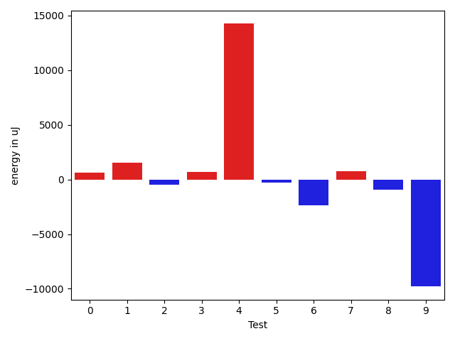

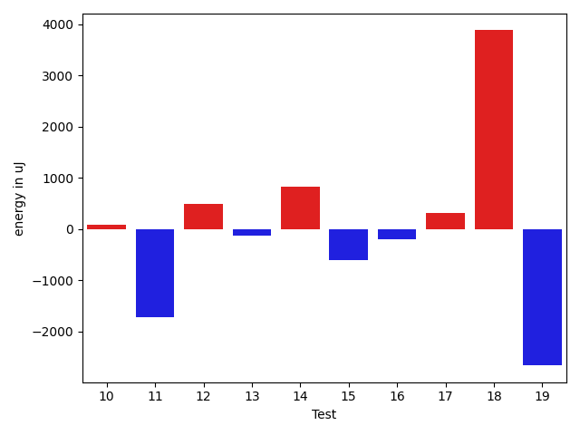

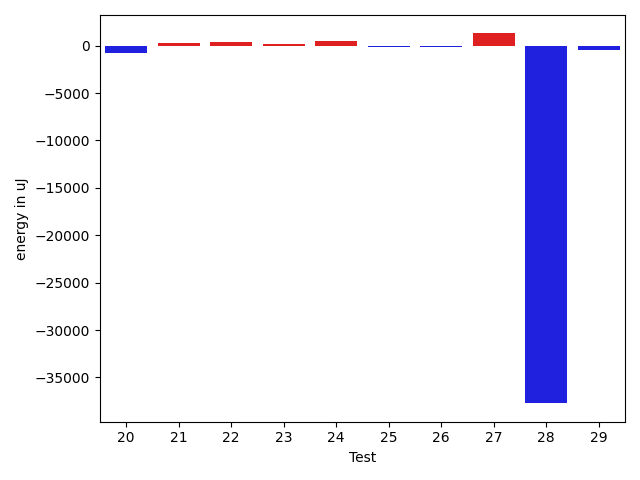

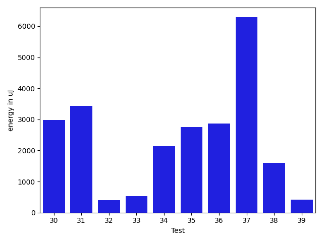

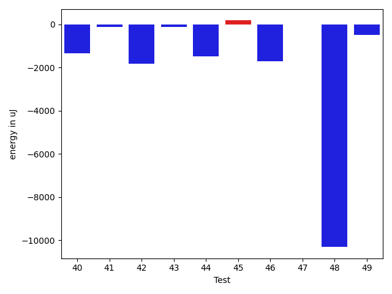

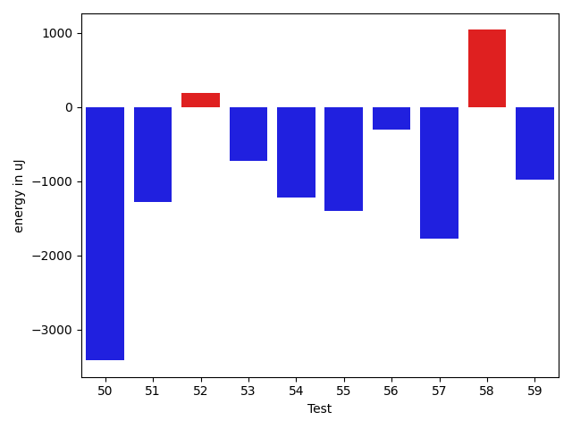

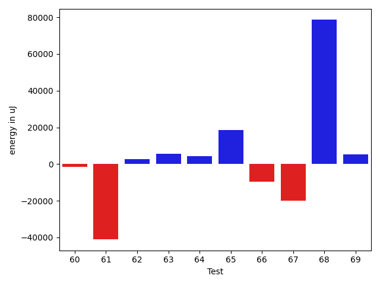

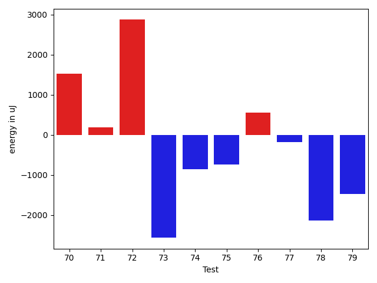

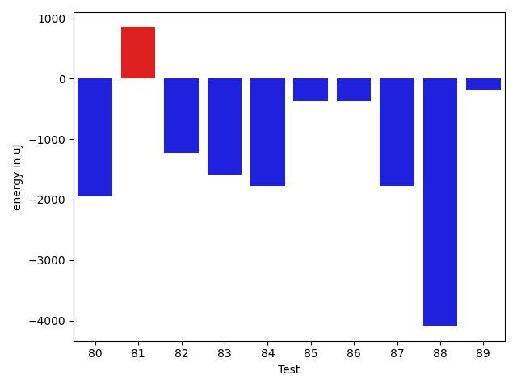

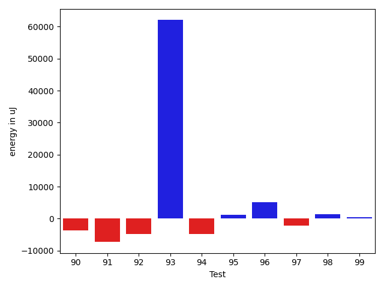

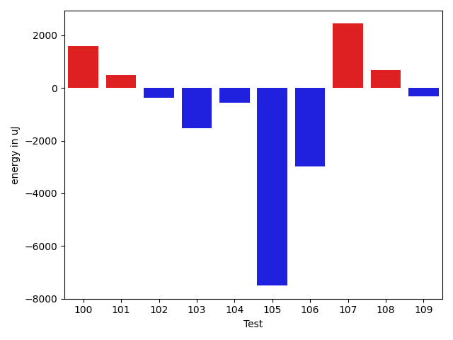

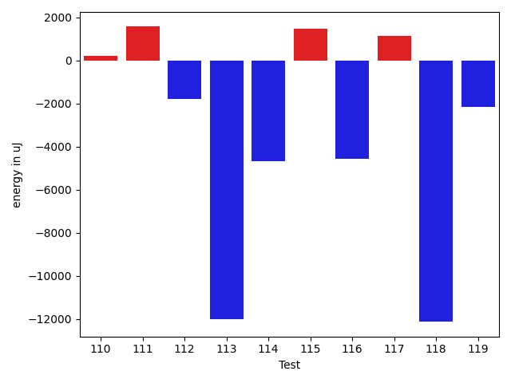

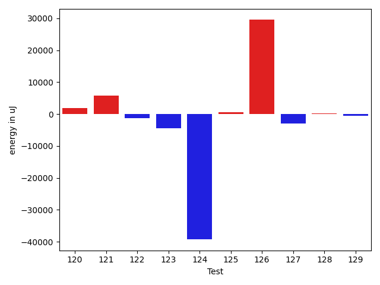

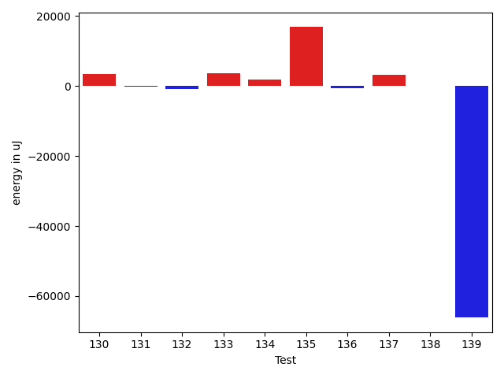

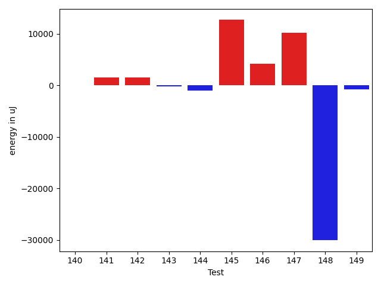

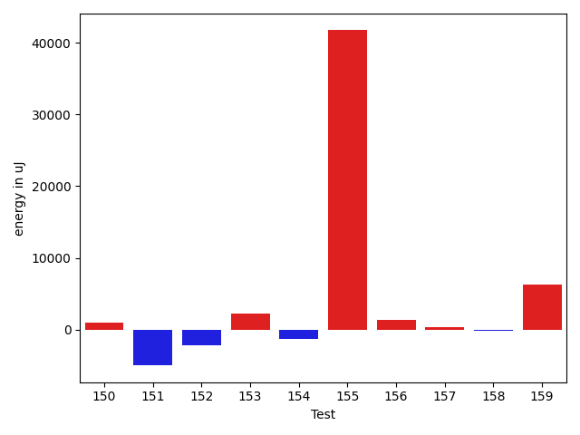

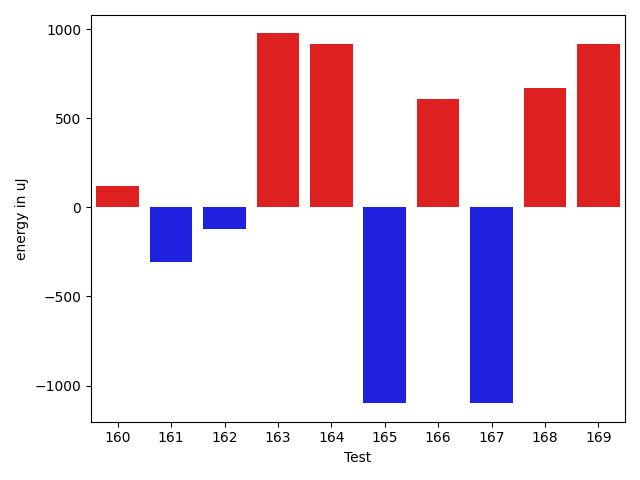

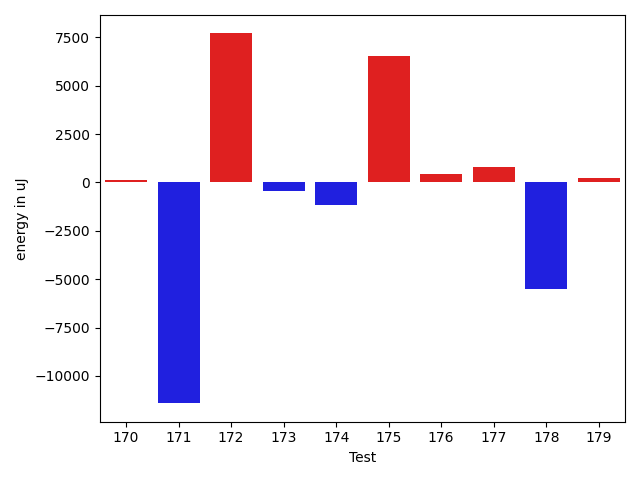

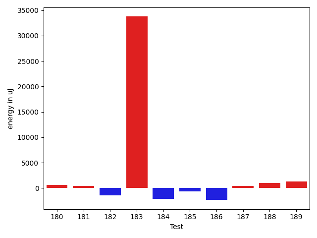

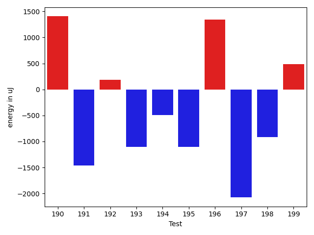

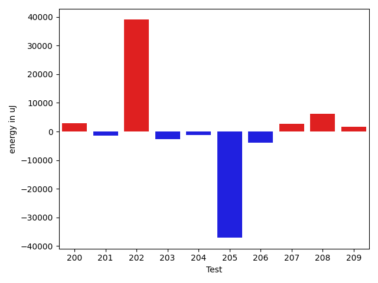

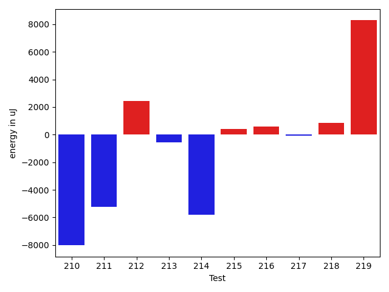

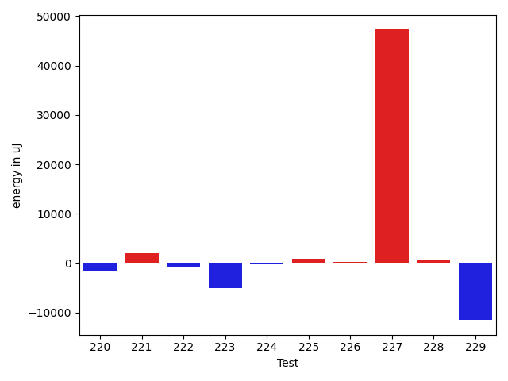

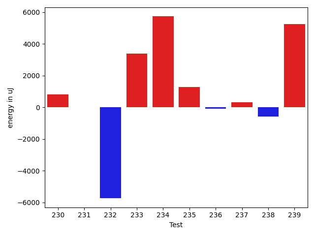

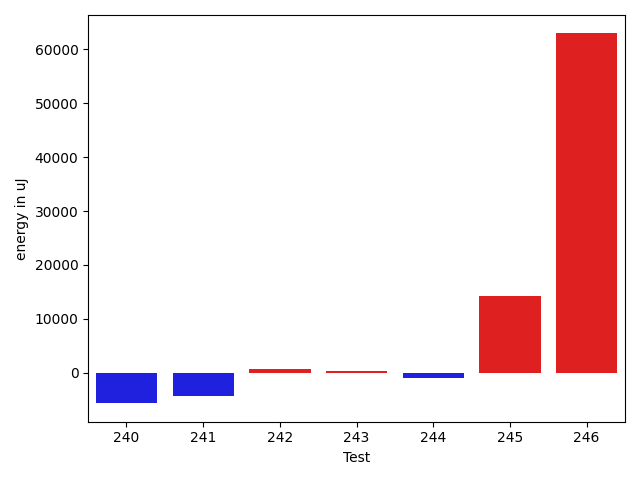

| ID | EnergyV1 | EnergyV2 | DeltaEnergy | σV1 | σV2 |
| --- | --- | --- | --- | --- | --- |
| 0 | 39795 | 38819 | -976 | 13119.210143550667 | 14493.502536021066 |
| 1 | 40161 | 40588 | 427 | 10218.615023213913 | 13454.347782907491 |
| 2 | 38879 | 38452 | -427 | 4163.303251618589 | 3831.1936693540783 |
| 3 | 38635 | 39429 | 794 | 3953.4449094685133 | 4352.571172535088 |
| 4 | 42663 | 41321 | -1342 | 50345.93747843405 | 109358.372545006 |
| 5 | 37903 | 38513 | 610 | 4124.392439717153 | 4302.365978498783 |
| 6 | 40161 | 39429 | -732 | 22975.154737896242 | 20554.324641662788 |
| 7 | 37781 | 39245 | 1464 | 3406.563924509347 | 4217.884217526798 |
| 8 | 37171 | 38574 | 1403 | 23226.143020354964 | 15788.571662404705 |
| 9 | 41015 | 39246 | -1769 | 59424.54121824605 | 15055.69379317514 |
| 10 | 38941 | 39551 | 610 | 5362.984741391681 | 3620.9922407064387 |
| 11 | 37414 | 37415 | 1 | 19649.10725765558 | 7562.187236563369 |
| 12 | 37842 | 37537 | -305 | 6960.437547734835 | 8725.356665984256 |
| 13 | 37354 | 37720 | 366 | 6127.242652905538 | 4729.424198321551 |
| 14 | 73730 | 67932 | -5798 | 68088.32191933834 | 89940.9094279815 |
| 15 | 38635 | 37475 | -1160 | 8140.202022291513 | 7442.662533458921 |
| 16 | 70617 | 72754 | 2137 | 39010.00380507482 | 31531.43401107563 |
| 17 | 37903 | 38025 | 122 | 8908.438199444065 | 9016.60708789808 |
| 18 | 38758 | 39185 | 427 | 34737.071650423546 | 46469.80750126036 |
| 19 | 38757 | 38086 | -671 | 14754.233485125913 | 11858.300557301998 |
| 20 | 37780 | 37049 | -731 | 5332.508487862739 | 8356.660413303656 |
| 21 | 72571 | 72814 | 243 | 42700.34391624086 | 45974.725579101236 |
| 22 | 38024 | 38391 | 367 | 21437.517669847908 | 24872.008931786288 |
| 23 | 38391 | 38513 | 122 | 4047.891171583024 | 5292.033533243897 |
| 24 | 36682 | 37170 | 488 | 3756.2809016620895 | 2975.2457966137354 |
| 25 | 37353 | 37171 | -182 | 3790.1506436510435 | 3078.0148522311515 |
| 26 | 38391 | 38269 | -122 | 3655.229916009236 | 3721.357660145094 |
| 27 | 37232 | 38513 | 1281 | 14696.917327842562 | 12536.65935172274 |
| 28 | 436095 | 398376 | -37719 | 286283.13796802517 | 266049.47967390163 |
| 29 | 34851 | 34423 | -428 | 3984.349316512611 | 4583.573441222694 |
| 30 | 36927 | 36743 | -184 | 4082.809877162487 | 2950.446296230246 |
| 31 | 36621 | 36315 | -306 | 5702.161848465347 | 7192.113140065381 |
| 32 | 41931 | 41687 | -244 | 19359.479021915853 | 16806.55256468069 |
| 33 | 35706 | 36743 | 1037 | 4038.954514371386 | 4525.251209644367 |
| 34 | 37231 | 36926 | -305 | 3606.9930449898497 | 4213.377755928052 |
| 35 | 44556 | 43579 | -977 | 275842.3871054032 | 263150.660701916 |
| 36 | 37353 | 37231 | -122 | 5776.835666377098 | 3973.0892998886147 |
| 37 | 39001 | 38452 | -549 | 33696.73172218179 | 27600.127368831992 |
| 38 | 38025 | 39612 | 1587 | 4481.069680821199 | 4661.061781870476 |
| 39 | 38940 | 39184 | 244 | 13738.10076736997 | 8019.354530966525 |
| 40 | 36987 | 35644 | -1343 | 3620.3247840096788 | 4136.391720164803 |
| 41 | 38513 | 38392 | -121 | 3719.0234829876417 | 4601.85516316065 |
| 42 | 37414 | 35584 | -1830 | 3200.8681353896886 | 3911.553295934849 |
| 43 | 38147 | 38025 | -122 | 3787.404143663311 | 4283.490361713084 |
| 44 | 39062 | 37597 | -1465 | 3691.126465729851 | 4332.752026687393 |
| 45 | 36988 | 37170 | 182 | 3847.8993826097976 | 3939.8469017970733 |
| 46 | 38208 | 36499 | -1709 | 3700.584109127165 | 3521.0757642516014 |
| 47 | 36560 | 36559 | -1 | 3633.4597014920732 | 3646.6784270201997 |
| 48 | 197326 | 187011 | -10315 | 118093.61795260919 | 97077.92247606113 |
| 49 | 115906 | 115417 | -489 | 41272.67002317581 | 30500.02238140485 |
| 50 | 102233 | 98816 | -3417 | 39067.872030549705 | 29740.828224116118 |
| 51 | 42481 | 41198 | -1283 | 20982.24418755664 | 16997.52653485955 |
| 52 | 41870 | 42053 | 183 | 3192.005130008409 | 3090.762231533671 |
| 53 | 39612 | 38879 | -733 | 16156.742436843944 | 12519.618726726365 |
| 54 | 42419 | 41198 | -1221 | 26134.18711222678 | 23151.204436188866 |
| 55 | 40344 | 38941 | -1403 | 27783.45681017149 | 7518.973547690594 |
| 56 | 39490 | 39184 | -306 | 4836.036731178344 | 4564.752287790531 |
| 57 | 44068 | 42297 | -1771 | 48160.866773740934 | 39146.91617884464 |
| 58 | 37964 | 39001 | 1037 | 3960.0468423345983 | 6297.553339723822 |
| 59 | 39612 | 38635 | -977 | 5731.75266100112 | 4084.3060050705753 |
| 60 | 37659 | 37109 | -550 | 28180.824961961345 | 28805.16634276523 |
| 61 | 37780 | 34668 | -3112 | 4467.689267395395 | 3525.018532416185 |
| 62 | 37292 | 37903 | 611 | 6559.778497039689 | 10077.859541129648 |
| 63 | 38757 | 37842 | -915 | 6381.71833883305 | 8007.447546993971 |
| 64 | 36499 | 36926 | 427 | 3612.504114368779 | 4150.77416001206 |
| 65 | 38269 | 35400 | -2869 | 3760.5971985842884 | 4259.160992479809 |
| 66 | 38757 | 35767 | -2990 | 4550.26543880788 | 3285.8369304232574 |
| 67 | 36987 | 35767 | -1220 | 4208.754256177104 | 4713.482995626425 |
| 68 | 415588 | 400145 | -15443 | 247638.8707356834 | 232353.59581883872 |
| 69 | 36193 | 34851 | -1342 | 33906.29496961294 | 3949.645366554059 |
| 70 | 37353 | 38879 | 1526 | 10572.053015379746 | 3029.0238386203823 |
| 71 | 38513 | 38696 | 183 | 4331.502088353733 | 23325.837791860275 |
| 72 | 41321 | 44189 | 2868 | 19430.59504470289 | 43710.57439486335 |
| 73 | 37475 | 34912 | -2563 | 3153.3988090453904 | 53735.979443197306 |
| 74 | 37414 | 36560 | -854 | 3403.5826958015523 | 4268.806910977972 |
| 75 | 38513 | 37781 | -732 | 4054.6370689922023 | 3836.449537705836 |
| 76 | 36499 | 37048 | 549 | 4033.2362065024163 | 5019.39211188362 |
| 77 | 37903 | 37719 | -184 | 3730.2599659514676 | 4666.025661020609 |
| 78 | 38513 | 36377 | -2136 | 4099.36217732339 | 3569.019648707696 |
| 79 | 39368 | 37902 | -1466 | 8888.17770133339 | 3380.557626960873 |
| 80 | 39124 | 37171 | -1953 | 4541.614638797941 | 4247.882019166767 |
| 81 | 36927 | 37781 | 854 | 4458.396954676611 | 22369.756915612885 |
| 82 | 37903 | 36682 | -1221 | 3452.743904812841 | 4625.500406547809 |
| 83 | 39124 | 37536 | -1588 | 4357.3202309494445 | 3863.1556592376655 |
| 84 | 38452 | 36682 | -1770 | 3986.0018250171165 | 4254.401838047684 |
| 85 | 38330 | 37964 | -366 | 3646.8483050673162 | 14893.403189401204 |
| 86 | 38819 | 38452 | -367 | 3095.3764127162303 | 3724.36023252751 |
| 87 | 38269 | 36499 | -1770 | 3966.5405763768913 | 3581.6629711474648 |
| 88 | 39002 | 34912 | -4090 | 31630.537730292195 | 9138.182579384518 |
| 89 | 38635 | 38452 | -183 | 16628.599347706015 | 4343.900232768764 |
| 90 | 38696 | 34851 | -3845 | 3692.936980227331 | 3691.3955900066358 |
| 91 | 39978 | 37171 | -2807 | 40609.829091806874 | 75799.35953852726 |
| 92 | 38818 | 35644 | -3174 | 14691.27435308248 | 5062.201232226505 |
| 93 | 36437 | 39063 | 2626 | 4174.586653490379 | 3622.0363805238258 |
| 94 | 38758 | 37720 | -1038 | 3722.51412448963 | 5439.77716138773 |
| 95 | 36255 | 36255 | 0 | 3974.138974326089 | 4216.25899994668 |
| 96 | 37353 | 36072 | -1281 | 51507.96799079383 | 3623.602580612591 |
| 97 | 117920 | 115966 | -1954 | 138702.11259223236 | 111758.2416564333 |
| 98 | 38025 | 37598 | -427 | 3741.0673143213494 | 9333.940820764929 |
| 99 | 38452 | 37232 | -1220 | 14777.356616326108 | 44155.865633918045 |
| 100 | 38208 | 39795 | 1587 | 9810.700803310514 | 4978.144265111553 |
| 101 | 38879 | 39368 | 489 | 6206.959291321371 | 4321.497141031199 |
| 102 | 40589 | 40222 | -367 | 66160.66585883453 | 21660.032642790142 |
| 103 | 38757 | 37231 | -1526 | 5241.2888275705045 | 4003.4216141809447 |
| 104 | 39550 | 39002 | -548 | 30118.049520978897 | 37621.59252322341 |
| 105 | 80200 | 72692 | -7508 | 61768.748299979896 | 53314.82553725513 |
| 106 | 45166 | 42175 | -2991 | 151236.12003161575 | 87941.02584466893 |
| 107 | 36316 | 38757 | 2441 | 4269.7489711535345 | 3240.0688828558827 |
| 108 | 37903 | 38574 | 671 | 9894.772279608364 | 8214.684568272634 |
| 109 | 40772 | 40466 | -306 | 30913.371525496033 | 28493.561903327663 |
| 110 | 38208 | 38696 | 488 | 3788.8252530017708 | 3249.2696824264685 |
| 111 | 37171 | 39429 | 2258 | 4347.608091687435 | 3955.7066630479103 |
| 112 | 39001 | 38635 | -366 | 7855.129536048132 | 3963.478488311131 |
| 113 | 40283 | 38635 | -1648 | 32575.924971214474 | 22765.833162037547 |
| 114 | 40466 | 37964 | -2502 | 12819.308289380588 | 11101.877343219994 |
| 115 | 36255 | 38635 | 2380 | 4000.857685824656 | 2802.5818651934346 |
| 116 | 40649 | 39673 | -976 | 19648.42150501469 | 13491.380868448134 |
| 117 | 37353 | 39245 | 1892 | 3846.411105831217 | 4085.6045870348244 |
| 118 | 40528 | 41626 | 1098 | 74912.2205049684 | 18348.56947921194 |
| 119 | 39428 | 39733 | 305 | 22289.767019082705 | 3863.954151424421 |
| 120 | 37659 | 39429 | 1770 | 4416.228894815664 | 3502.4439011484924 |
| 121 | 38818 | 41077 | 2259 | 3919.243432659477 | 29618.775887948766 |
| 122 | 40161 | 39490 | -671 | 18446.3301543632 | 13777.426289405434 |
| 123 | 39307 | 39185 | -122 | 24614.791651939107 | 11227.87564849515 |
| 124 | 39917 | 39978 | 61 | 365079.7306452062 | 252617.59472713104 |
| 125 | 37842 | 39306 | 1464 | 4779.178209692541 | 3771.4326931013566 |
| 126 | 148132 | 162963 | 14831 | 130072.5748143607 | 246672.43931977186 |
| 127 | 39734 | 39245 | -489 | 24963.02090284103 | 8823.095487484508 |
| 128 | 38574 | 38879 | 305 | 4241.762567507938 | 4112.923572294634 |
| 129 | 37903 | 37415 | -488 | 4050.587865243026 | 4880.274480855319 |
| 130 | 40650 | 39977 | -673 | 30395.844016640625 | 33919.80836455635 |
| 131 | 39489 | 38757 | -732 | 4173.663091408545 | 4199.281295477023 |
| 132 | 38758 | 37597 | -1161 | 4440.123572797945 | 4065.143758004461 |
| 133 | 39795 | 40283 | 488 | 6870.66827778298 | 19710.408103467365 |
| 134 | 39062 | 39672 | 610 | 26185.98155174962 | 27266.504430018944 |
| 135 | 117981 | 105590 | -12391 | 234293.77455308233 | 319622.6349893442 |
| 136 | 38452 | 37536 | -916 | 5229.886990721773 | 3766.638829349002 |
| 137 | 40100 | 40832 | 732 | 8402.117431380228 | 11343.485948199688 |
| 138 | 38940 | 38513 | -427 | 4472.54708302496 | 3781.3873432908194 |
| 139 | 44861 | 43824 | -1037 | 409574.7743639489 | 261653.74431157278 |
| 140 | 38208 | 39490 | 1282 | 8027.093100816986 | 4312.554621823466 |
| 141 | 37597 | 39185 | 1588 | 4490.180161683382 | 3792.535605763993 |
| 142 | 37719 | 40222 | 2503 | 4649.938322545401 | 6524.3293858681545 |
| 143 | 41321 | 39856 | -1465 | 7306.124179239013 | 8012.136332341374 |
| 144 | 38330 | 37231 | -1099 | 4465.545544499574 | 4468.663556098177 |
| 145 | 42541 | 41625 | -916 | 14896.885436164997 | 46151.133684027605 |
| 146 | 40528 | 40039 | -489 | 13047.772432393373 | 46857.04665120074 |
| 147 | 42297 | 41748 | -549 | 16324.921732099781 | 55024.0981169059 |
| 148 | 72571 | 43823 | -28748 | 218497.70253428703 | 32657.331099934643 |
| 149 | 40039 | 40161 | 122 | 12441.904864858643 | 12160.792608138452 |
| 150 | 37781 | 39124 | 1343 | 3612.649872158683 | 4025.1819225825316 |
| 151 | 40222 | 38208 | -2014 | 13671.991583185098 | 7963.997421505865 |
| 152 | 40711 | 40223 | -488 | 13192.255306241866 | 10618.44539970881 |
| 153 | 42175 | 40771 | -1404 | 22815.404838202932 | 34490.74412637099 |
| 154 | 39063 | 38086 | -977 | 9577.158850845117 | 8096.656047027633 |
| 155 | 41504 | 42115 | 611 | 261455.585865491 | 323401.17588005855 |
| 156 | 38330 | 40222 | 1892 | 15149.561736870899 | 15034.391859809539 |
| 157 | 37902 | 39489 | 1587 | 3767.119766094806 | 4932.552557722409 |
| 158 | 39429 | 38269 | -1160 | 4399.344054045711 | 5573.818701045126 |
| 159 | 36865 | 38452 | 1587 | 4829.6720300683655 | 28222.921306512202 |
| 160 | 39917 | 40039 | 122 | 24823.52651950312 | 16785.585676665025 |
| 161 | 37903 | 37597 | -306 | 4394.960556999102 | 4740.278634414533 |
| 162 | 38818 | 38696 | -122 | 4851.371428873994 | 4460.165320646758 |
| 163 | 37293 | 38269 | 976 | 4524.833497455815 | 4889.712474102653 |
| 164 | 41076 | 41993 | 917 | 55820.1145994309 | 54934.794728375615 |
| 165 | 38757 | 37659 | -1098 | 4759.404558376737 | 4663.8277364206815 |
| 166 | 37964 | 38574 | 610 | 3603.0800739373512 | 4510.099479648596 |
| 167 | 39612 | 38513 | -1099 | 4671.940330255185 | 4602.140044264648 |
| 168 | 41077 | 41748 | 671 | 358804.17477039417 | 503819.343805622 |
| 169 | 41748 | 42664 | 916 | 17625.710241497825 | 25029.558102067644 |
| 170 | 38452 | 39490 | 1038 | 5035.699197221569 | 3722.0266196018524 |
| 171 | 39489 | 40405 | 916 | 66008.18651316417 | 4211.504829188255 |
| 172 | 36377 | 38574 | 2197 | 3844.088360300698 | 34333.670318491866 |
| 173 | 38696 | 39551 | 855 | 3469.888146040409 | 4688.449438780374 |
| 174 | 41992 | 39428 | -2564 | 4566.047598042538 | 4513.729531458966 |
| 175 | 39673 | 39978 | 305 | 6571.277077536151 | 40552.84448861188 |
| 176 | 39795 | 40283 | 488 | 3938.042807162165 | 5221.849962116827 |
| 177 | 38086 | 39062 | 976 | 3603.748608289157 | 4081.1785766362227 |
| 178 | 80994 | 79224 | -1770 | 182004.18170177453 | 158300.73580391993 |
| 179 | 38879 | 37719 | -1160 | 7666.59390060966 | 9217.346701485445 |
| 180 | 38574 | 39184 | 610 | 4428.868508868949 | 8423.814846825271 |
| 181 | 38940 | 39368 | 428 | 7416.679704264331 | 10203.07239485771 |
| 182 | 206298 | 204834 | -1464 | 83487.2913199442 | 107318.48007485755 |
| 183 | 312682 | 346435 | 33753 | 143453.65893728912 | 146958.49521627324 |
| 184 | 40528 | 38391 | -2137 | 9068.782876132957 | 18473.374503846077 |
| 185 | 40954 | 40344 | -610 | 51644.123219397596 | 74329.67977527918 |
| 186 | 81054 | 78735 | -2319 | 31503.750378363755 | 29027.803124952356 |
| 187 | 37415 | 37842 | 427 | 4866.358951660883 | 4199.066320322785 |
| 188 | 38696 | 39673 | 977 | 11033.78335913792 | 15248.766397331949 |
| 189 | 38269 | 39550 | 1281 | 4928.077797832295 | 3786.318589635878 |
| 190 | 37964 | 39368 | 1404 | 15638.216908302275 | 15391.236804184033 |
| 191 | 40344 | 38879 | -1465 | 27776.50255332148 | 32590.547480327106 |
| 192 | 40771 | 40955 | 184 | 88440.71495065127 | 123234.36713444264 |
| 193 | 37476 | 36377 | -1099 | 4233.510578706326 | 4823.21913337905 |
| 194 | 38391 | 37903 | -488 | 4570.6306970710575 | 4397.623280285172 |
| 195 | 42053 | 40954 | -1099 | 87489.0280622662 | 26213.68650636114 |
| 196 | 39490 | 40833 | 1343 | 4469.15455184809 | 4030.1509159776574 |
| 197 | 38757 | 36682 | -2075 | 3959.8237155709894 | 4322.925920993789 |
| 198 | 39246 | 38330 | -916 | 4306.8287987728345 | 6890.388468225544 |
| 199 | 38452 | 38941 | 489 | 9972.865633107704 | 8616.806758508013 |
| 200 | 41138 | 41077 | -61 | 85280.84835350912 | 121915.47160836184 |
| 201 | 40649 | 38940 | -1709 | 11379.523830730646 | 11637.653079197338 |
| 202 | 97962 | 112182 | 14220 | 261055.70633790188 | 359664.4952042769 |
| 203 | 39917 | 38635 | -1282 | 20238.17813395806 | 17092.222341305478 |
| 204 | 40833 | 39612 | -1221 | 37910.06216332699 | 47176.70056414974 |
| 205 | 42175 | 43030 | 855 | 253894.60587870685 | 52451.98691597784 |
| 206 | 38452 | 38696 | 244 | 27675.29370176989 | 4031.361159346353 |
| 207 | 37536 | 39551 | 2015 | 3819.1463426092264 | 4132.679561309414 |
| 208 | 37110 | 40894 | 3784 | 21988.259744210976 | 32434.256417026794 |
| 209 | 38147 | 38879 | 732 | 5177.72418593343 | 4177.986314368478 |
| 210 | 44067 | 42541 | -1526 | 33949.87819900346 | 26409.91439579124 |
| 211 | 40955 | 41564 | 609 | 70854.71720668726 | 62202.67748258747 |
| 212 | 85693 | 83618 | -2075 | 166488.0399713097 | 169017.11154874042 |
| 213 | 38391 | 38940 | 549 | 14799.26471660975 | 11852.62081727624 |
| 214 | 38757 | 38879 | 122 | 32147.342317395345 | 4571.783861740109 |
| 215 | 36805 | 38879 | 2074 | 3976.5373223719043 | 4091.62257381636 |
| 216 | 39002 | 40283 | 1281 | 2522.927487239248 | 4161.624268742172 |
| 217 | 39612 | 41321 | 1709 | 30174.101472732153 | 29732.856156141712 |
| 218 | 39123 | 39978 | 855 | 3751.0653757040973 | 4576.892896083786 |
| 219 | 41504 | 41748 | 244 | 61346.280230814584 | 88920.16313423049 |
| 220 | 39124 | 39185 | 61 | 6869.698659036836 | 3549.7672178197695 |
| 221 | 40955 | 39429 | -1526 | 27902.425848992378 | 26825.153902417696 |
| 222 | 39368 | 38819 | -549 | 10581.739934173818 | 11517.002203311016 |
| 223 | 40588 | 39063 | -1525 | 34552.927663999755 | 13547.778955439373 |
| 224 | 39733 | 38575 | -1158 | 4537.395262213284 | 3499.5909055553757 |
| 225 | 38391 | 40467 | 2076 | 7698.304065585405 | 8434.20851802016 |
| 226 | 39428 | 39856 | 428 | 3535.9823063886715 | 4215.542992275511 |
| 227 | 41809 | 40954 | -855 | 222667.3848855215 | 346875.3752861957 |
| 228 | 37536 | 39367 | 1831 | 3682.4709770167433 | 5464.033769555739 |
| 229 | 42298 | 42480 | 182 | 127320.77285081404 | 108991.05753488684 |
| 230 | 41686 | 41443 | -243 | 81090.46727963099 | 80702.18201512043 |
| 231 | 40893 | 39978 | -915 | 4287.5162633181835 | 4576.875307602958 |
| 232 | 40161 | 40405 | 244 | 29321.85047935426 | 15531.885936622888 |
| 233 | 39612 | 40100 | 488 | 21307.14785842932 | 25825.499911548595 |
| 234 | 41077 | 40772 | -305 | 114965.959512779 | 128540.80736221343 |
| 235 | 40527 | 39246 | -1281 | 17475.3010851117 | 25411.39924852126 |
| 236 | 38818 | 40222 | 1404 | 56310.062498666244 | 63778.05491709998 |
| 237 | 38086 | 38025 | -61 | 4178.880826152341 | 3563.0470067376637 |
| 238 | 40467 | 38757 | -1710 | 4410.050035493425 | 4476.506131777556 |
| 239 | 40772 | 39184 | -1588 | 9145.194946952668 | 32132.49385915872 |
| 240 | 41564 | 41503 | -61 | 38374.679434939586 | 29951.473628909356 |
| 241 | 41260 | 39245 | -2015 | 12144.041670564553 | 7807.108258200898 |
| 242 | 38696 | 40405 | 1709 | 4265.5864778480345 | 6581.547388388235 |
| 243 | 39185 | 38452 | -733 | 4563.796483496327 | 4538.655061210142 |
| 244 | 38513 | 38696 | 183 | 6355.223931363691 | 4839.191805700554 |
| 245 | 41870 | 43518 | 1648 | 103980.85162783207 | 112642.93726347326 |
| 246 | 39490 | 42847 | 3357 | 45744.62184832681 | 315915.5299919463 |

## Delta Duration per test method

| ID | DurationV1 | DurationsV2 | DeltaDuration |
| --- | --- | --- | --- |
| 0 | 1276423.9347826086 | 1207239.3855421687 | -69184.5492404399 |
| 1 | 1115924.7714285713 | 1126032.21875 | 10107.447321428685 |
| 2 | 631004.1891891892 | 604290.2222222222 | -26713.966966966982 |
| 3 | 611074.3076923077 | 639159.7045454546 | 28085.39685314684 |
| 4 | 1746236.9494949495 | 2237724.1530612246 | 491487.2035662751 |
| 5 | 846381.0 | 783263.9615384615 | -63117.0384615385 |
| 6 | 1297967.3846153845 | 1308912.1219512196 | 10944.737335835118 |
| 7 | 757184.023255814 | 666047.5405405406 | -91136.48271527339 |
| 8 | 1011394.5636363636 | 1002045.4814814815 | -9349.08215488214 |
| 9 | 1332015.078125 | 940535.7142857143 | -391479.3638392857 |
| 10 | 723084.94 | 683375.7619047619 | -39709.17809523805 |
| 11 | 1136208.8421052631 | 1077656.0481927712 | -58552.793912491994 |
| 12 | 1073432.5764705883 | 1087961.172839506 | 14528.59636891773 |
| 13 | 945975.25 | 957790.0952380953 | 11814.845238095266 |
| 14 | 2317248.727272727 | 2360271.090909091 | 43022.36363636376 |
| 15 | 1078692.0357142857 | 1103067.4197530865 | 24375.38403880084 |
| 16 | 2185002.212121212 | 2138280.292929293 | -46721.9191919188 |
| 17 | 1102072.4285714286 | 1127954.2716049382 | 25881.84303350956 |
| 18 | 1369531.6075949366 | 1436076.8292682928 | 66545.22167335614 |
| 19 | 1262524.8279569892 | 1276611.2840909092 | 14086.45613392 |
| 20 | 1068639.3561643835 | 1092595.3561643835 | 23956.0 |
| 21 | 2329787.6464646463 | 2406205.262626263 | 76417.61616161652 |
| 22 | 1084521.5795454546 | 1203955.857142857 | 119434.27759740246 |
| 23 | 828698.1551724138 | 844505.1186440678 | 15806.963471653988 |
| 24 | 574640.0 | 634200.0975609756 | 59560.097560975584 |
| 25 | 730933.0930232558 | 732055.6875 | 1122.5944767441833 |
| 26 | 641988.9333333333 | 566238.1724137932 | -75750.76091954019 |
| 27 | 1352096.9896907217 | 1315496.824742268 | -36600.16494845366 |
| 28 | 10326337.696969697 | 9483043.575757576 | -843294.1212121211 |
| 29 | 559579.3333333334 | 608770.6551724138 | 49191.321839080425 |
| 30 | 462027.9166666667 | 479595.21428571426 | 17567.297619047575 |
| 31 | 1029014.296875 | 953167.3333333334 | -75846.96354166663 |
| 32 | 1477242.0833333333 | 1463151.5892857143 | -14090.494047618937 |
| 33 | 600769.4761904762 | 548050.6842105263 | -52718.79197994992 |
| 34 | 767946.6274509804 | 733406.75 | -34539.87745098036 |
| 35 | 3175411.98630137 | 2986838.777777778 | -188573.20852359198 |
| 36 | 830948.3571428572 | 785341.966101695 | -45606.39104116219 |
| 37 | 1150300.8048780488 | 938730.3513513514 | -211570.45352669747 |
| 38 | 637923.125 | 581174.1666666666 | -56748.95833333337 |
| 39 | 726580.724137931 | 729055.6666666666 | 2474.9425287356135 |
| 40 | 816453.2941176471 | 752501.8461538461 | -63951.44796380098 |
| 41 | 617400.0322580645 | 602717.7916666666 | -14682.240591397858 |
| 42 | 591296.7857142857 | 502329.45714285714 | -88967.32857142854 |
| 43 | 847346.5636363636 | 798347.9833333333 | -48998.58030303032 |
| 44 | 635645.2173913043 | 580506.9565217391 | -55138.26086956519 |
| 45 | 793832.9354838709 | 606629.08 | -187203.85548387095 |
| 46 | 548647.7857142857 | 534397.84 | -14249.945714285714 |
| 47 | 529988.6923076923 | 514729.6956521739 | -15258.996655518364 |
| 48 | 6360418.01010101 | 5537970.090909091 | -822447.9191919193 |
| 49 | 3291886.484848485 | 3113972.1919191917 | -177914.29292929312 |
| 50 | 3076460.9696969697 | 2906848.3131313133 | -169612.65656565642 |
| 51 | 928163.8620689656 | 663346.8461538461 | -264817.01591511944 |
| 52 | 751709.8333333334 | 612518.71875 | -139191.11458333337 |
| 53 | 1113422.7368421052 | 1069200.9552238807 | -44221.78161822446 |
| 54 | 1551594.9892473118 | 1520973.6288659794 | -30621.36038133246 |
| 55 | 1183765.955882353 | 1038845.7183098592 | -144920.23757249385 |
| 56 | 643337.2857142857 | 589989.2 | -53348.08571428573 |
| 57 | 1979150.8333333333 | 1768959.4945054946 | -210191.33882783866 |
| 58 | 862872.1666666666 | 833248.1833333333 | -29623.98333333328 |
| 59 | 911205.6507936508 | 906815.1333333333 | -4390.517460317467 |
| 60 | 1116539.5263157894 | 1194015.9125 | 77476.38618421066 |
| 61 | 682335.125 | 779537.8285714285 | 97202.70357142854 |
| 62 | 787606.6226415094 | 952718.3829787234 | 165111.760337214 |
| 63 | 958421.302631579 | 1012939.2162162162 | 54517.91358463722 |
| 64 | 872354.7307692308 | 612444.6052631579 | -259910.1255060729 |
| 65 | 382327.85 | 454689.5882352941 | 72361.73823529412 |
| 66 | 494407.46153846156 | 528923.9583333334 | 34516.49679487181 |
| 67 | 471744.0833333333 | 500617.4137931034 | 28873.330459770106 |
| 68 | 8375339.475609756 | 8396976.976744186 | 21637.50113443006 |
| 69 | 650752.04 | 483161.61904761905 | -167590.42095238098 |
| 70 | 613685.5 | 555078.5416666666 | -58606.95833333337 |
| 71 | 670717.4736842106 | 966164.5952380953 | 295447.1215538847 |
| 72 | 1658227.0208333333 | 1842307.3673469387 | 184080.34651360544 |
| 73 | 611700.1 | 1019395.9705882353 | 407695.8705882353 |
| 74 | 532968.5 | 630797.4736842106 | 97828.97368421056 |
| 75 | 539335.8529411765 | 623888.2352941176 | 84552.38235294109 |
| 76 | 723788.4634146341 | 743172.5185185185 | 19384.055103884428 |
| 77 | 615999.3055555555 | 714629.0322580645 | 98629.72670250898 |
| 78 | 500161.6956521739 | 522385.3548387097 | 22223.659186535806 |
| 79 | 537153.0 | 569331.448275862 | 32178.44827586203 |
| 80 | 537104.03125 | 572438.75 | 35334.71875 |
| 81 | 635530.0344827586 | 748634.0217391305 | 113103.98725637188 |
| 82 | 398622.05555555556 | 479477.5925925926 | 80855.53703703702 |
| 83 | 511824.0909090909 | 529549.2 | 17725.10909090907 |
| 84 | 783717.0 | 890439.9591836735 | 106722.95918367349 |
| 85 | 747833.8245614035 | 870721.8541666666 | 122888.02960526315 |
| 86 | 752000.62 | 812072.2962962963 | 60071.6762962963 |
| 87 | 480351.5789473684 | 480727.0416666667 | 375.4627192982589 |
| 88 | 784509.1818181818 | 573974.3333333334 | -210534.8484848484 |
| 89 | 643172.5909090909 | 539243.0769230769 | -103929.51398601406 |
| 90 | 441804.9166666667 | 495647.9259259259 | 53843.00925925921 |
| 91 | 958398.2580645161 | 1368809.0 | 410410.7419354839 |
| 92 | 615135.5757575758 | 593853.6666666666 | -21281.909090909176 |
| 93 | 482725.5 | 428633.22222222225 | -54092.27777777775 |
| 94 | 499119.4090909091 | 535729.1333333333 | 36609.724242424185 |
| 95 | 474072.4736842105 | 544468.695652174 | 70396.22196796344 |
| 96 | 779072.6086956522 | 502188.3 | -276884.30869565223 |
| 97 | 4275744.597938145 | 4046661.9175257734 | -229082.68041237118 |
| 98 | 619356.7826086957 | 707756.7407407408 | 88399.95813204511 |
| 99 | 759955.6129032258 | 1141585.606060606 | 381629.99315738014 |
| 100 | 1039316.0263157894 | 841416.1428571428 | -197899.8834586466 |
| 101 | 611793.0645161291 | 614164.6153846154 | 2371.550868486287 |
| 102 | 1454251.0952380951 | 1194757.267857143 | -259493.8273809522 |
| 103 | 766370.4468085107 | 830053.8918918918 | 63683.44508338114 |
| 104 | 1036546.7297297297 | 1148754.608695652 | 112207.8789659224 |
| 105 | 2774788.131313131 | 2544212.262626263 | -230575.86868686834 |
| 106 | 2942864.5555555555 | 1565258.024390244 | -1377606.5311653116 |
| 107 | 515191.23333333334 | 414597.2105263158 | -100594.02280701755 |
| 108 | 1146863.4142857143 | 973509.8902439025 | -173353.52404181182 |
| 109 | 1572714.4831460675 | 1393078.3444444444 | -179636.13870162307 |
| 110 | 501655.4210526316 | 464325.6666666667 | -37329.75438596489 |
| 111 | 522602.2413793103 | 421753.5714285714 | -100848.6699507389 |
| 112 | 947166.4677419355 | 808174.641509434 | -138991.82623250154 |
| 113 | 1421677.9574468085 | 960565.9444444445 | -461112.01300236396 |
| 114 | 1107732.1454545455 | 839652.0735294118 | -268080.0719251337 |
| 115 | 557896.1333333333 | 416997.22222222225 | -140898.91111111105 |
| 116 | 1158109.441860465 | 923796.6666666666 | -234312.77519379847 |
| 117 | 463612.22222222225 | 445777.96 | -17834.262222222227 |
| 118 | 1801020.306122449 | 1420011.855670103 | -381008.4504523459 |
| 119 | 862521.4821428572 | 808620.4130434783 | -53901.06909937889 |
| 120 | 845207.8387096775 | 804492.3488372093 | -40715.48987246817 |
| 121 | 763146.8444444444 | 867518.7073170731 | 104371.86287262873 |
| 122 | 1094840.365079365 | 1045796.12 | -49044.24507936498 |
| 123 | 1157866.9491525423 | 975517.868852459 | -182349.08030008327 |
| 124 | 3337966.6707317075 | 2387573.701298701 | -950392.9694330064 |
| 125 | 800726.3333333334 | 651171.09375 | -149555.23958333337 |
| 126 | 4957624.04040404 | 5584083.97979798 | 626459.9393939395 |
| 127 | 978740.7014925373 | 955078.3709677419 | -23662.33052479534 |
| 128 | 770804.0 | 810061.3469387755 | 39257.3469387755 |
| 129 | 644046.6216216217 | 677437.8333333334 | 33391.211711711716 |
| 130 | 915764.724137931 | 1101364.7894736843 | 185600.06533575326 |
| 131 | 610940.03125 | 700111.7419354839 | 89171.71068548388 |
| 132 | 738948.3461538461 | 772757.3571428572 | 33809.01098901103 |
| 133 | 622432.5 | 828389.2413793104 | 205956.74137931038 |
| 134 | 1012106.7428571428 | 1152546.9024390243 | 140440.15958188148 |
| 135 | 4272772.5050505055 | 4804522.363636363 | 531749.8585858578 |
| 136 | 637237.9393939395 | 578408.0 | -58829.93939393945 |
| 137 | 880486.4102564103 | 1004973.2790697674 | 124486.8688133572 |
| 138 | 936612.2926829269 | 791723.6888888889 | -144888.60379403795 |
| 139 | 4750182.090909091 | 3036420.0606060605 | -1713762.0303030303 |
| 140 | 1013209.8857142857 | 953039.125 | -60170.76071428566 |
| 141 | 645476.05 | 615747.4166666666 | -29728.63333333342 |
| 142 | 883280.0576923077 | 831288.1875 | -51991.870192307746 |
| 143 | 873898.5625 | 789067.5185185185 | -84831.04398148146 |
| 144 | 482936.6666666667 | 501415.88 | 18479.21333333332 |
| 145 | 577266.7307692308 | 1124566.888888889 | 547300.1581196582 |
| 146 | 1251745.329113924 | 1288858.9529411765 | 37113.62382725254 |
| 147 | 809173.3142857143 | 1298163.2333333334 | 488989.9190476191 |
| 148 | 2495383.131313131 | 1835141.3636363635 | -660241.7676767677 |
| 149 | 1165514.0681818181 | 1152461.4805194805 | -13052.58766233758 |
| 150 | 849505.9803921569 | 805315.9821428572 | -44189.99824929971 |
| 151 | 1216823.024390244 | 1158736.9772727273 | -58086.04711751663 |
| 152 | 1204327.5466666666 | 1217019.9722222222 | 12692.425555555616 |
| 153 | 1243646.1 | 1441663.7746478873 | 198017.67464788724 |
| 154 | 1140962.4444444445 | 1144762.5974025973 | 3800.1529581528157 |
| 155 | 2412577.9571428574 | 3943984.5161290322 | 1531406.5589861749 |
| 156 | 951268.2068965518 | 1122215.7777777778 | 170947.57088122598 |
| 157 | 743107.052631579 | 823008.5714285715 | 79901.51879699249 |
| 158 | 884532.3214285715 | 887523.9508196721 | 2991.629391100607 |
| 159 | 757127.6888888889 | 870572.2444444444 | 113444.5555555555 |
| 160 | 1504429.6354166667 | 1488106.3402061856 | -16323.295210481156 |
| 161 | 589728.8823529412 | 544927.0 | -44801.882352941204 |
| 162 | 606733.8387096775 | 601339.1111111111 | -5394.727598566329 |
| 163 | 736430.4814814815 | 722306.9782608695 | -14123.50322061195 |
| 164 | 1479451.9117647058 | 1485057.611111111 | 5605.699346405221 |
| 165 | 473457.724137931 | 462119.0 | -11338.724137931014 |
| 166 | 521848.22222222225 | 506435.0 | -15413.222222222248 |
| 167 | 689914.3793103448 | 616731.8235294118 | -73182.555780933 |
| 168 | 3997204.9444444445 | 5756395.617647059 | 1759190.6732026148 |
| 169 | 838533.9310344828 | 1088823.7241379311 | 250289.79310344835 |
| 170 | 545655.6571428571 | 542821.0 | -2834.6571428570896 |
| 171 | 838447.5333333333 | 580823.2608695652 | -257624.27246376814 |
| 172 | 538852.5294117647 | 625397.0666666667 | 86544.53725490195 |
| 173 | 536101.0476190476 | 473454.65 | -62646.39761904755 |
| 174 | 681717.6315789474 | 696292.9268292683 | 14575.295250320924 |
| 175 | 597959.5454545454 | 805439.303030303 | 207479.75757575757 |
| 176 | 558495.125 | 596038.1363636364 | 37543.01136363635 |
| 177 | 505570.5238095238 | 481449.35294117645 | -24121.17086834734 |
| 178 | 3094032.5757575757 | 2987391.878787879 | -106640.69696969679 |
| 179 | 933210.984375 | 998005.1846153847 | 64794.20024038467 |
| 180 | 1069570.2898550725 | 1019398.9189189189 | -50171.37093615357 |
| 181 | 1047111.8648648649 | 1095062.0512820513 | 47950.1864171864 |
| 182 | 6252162.757575758 | 6770401.5050505055 | 518238.7474747477 |
| 183 | 9616548.262626262 | 10416427.656565657 | 799879.3939393945 |
| 184 | 788208.9782608695 | 970408.9591836735 | 182199.98092280398 |
| 185 | 1242116.0909090908 | 1747768.3050847459 | 505652.21417565504 |
| 186 | 2547318.626262626 | 2479621.5555555555 | -67697.07070707064 |
| 187 | 668683.2258064516 | 599637.2666666667 | -69045.95913978491 |
| 188 | 957887.9 | 974063.34 | 16175.439999999944 |
| 189 | 820788.4181818182 | 775070.8666666667 | -45717.551515151514 |
| 190 | 884078.2222222222 | 913838.0 | 29759.777777777752 |
| 191 | 1246914.923076923 | 1200293.4923076923 | -46621.430769230705 |
| 192 | 1642418.338028169 | 1915173.6470588236 | 272755.3090306546 |
| 193 | 710992.0 | 573042.0625 | -137949.9375 |
| 194 | 539770.5909090909 | 568040.8214285715 | 28270.230519480538 |
| 195 | 1426666.2 | 865026.3846153846 | -561639.8153846153 |
| 196 | 642786.9411764706 | 610479.3333333334 | -32307.60784313723 |
| 197 | 716645.65625 | 572180.24 | -144465.41625 |
| 198 | 734398.6578947369 | 618145.25 | -116253.40789473685 |
| 199 | 908389.3846153846 | 838880.5428571429 | -69508.84175824176 |
| 200 | 1900458.987654321 | 1949599.168831169 | 49140.18117684801 |
| 201 | 992261.0166666667 | 941579.1052631579 | -50681.91140350886 |
| 202 | 4399931.98989899 | 5411767.808080808 | 1011835.8181818184 |
| 203 | 1233240.3376623376 | 1235642.32 | 2401.9823376624845 |
| 204 | 1641863.043478261 | 1648389.2826086956 | 6526.23913043458 |
| 205 | 3192003.7701149425 | 1888601.202247191 | -1303402.5678677515 |
| 206 | 934202.3157894737 | 656914.4193548387 | -277287.89643463504 |
| 207 | 779439.9166666666 | 646710.1891891892 | -132729.7274774774 |
| 208 | 751313.8333333334 | 848226.7307692308 | 96912.89743589738 |
| 209 | 740371.66 | 652470.4418604651 | -87901.21813953493 |
| 210 | 1842946.8181818181 | 1716511.98989899 | -126434.82828282821 |
| 211 | 1590774.236111111 | 1476153.4871794872 | -114620.74893162376 |
| 212 | 3381155.262626263 | 3277742.707070707 | -103412.55555555597 |
| 213 | 797805.0731707317 | 772398.5675675676 | -25406.505603164085 |
| 214 | 920722.4545454546 | 704592.7551020408 | -216129.69944341376 |
| 215 | 600968.7575757576 | 571778.275862069 | -29190.481713688583 |
| 216 | 514548.71428571426 | 477440.81481481483 | -37107.89947089943 |
| 217 | 1095178.5531914893 | 981668.7380952381 | -113509.8150962512 |
| 218 | 499759.25 | 466137.23333333334 | -33622.01666666666 |
| 219 | 1339113.6 | 1631606.5857142857 | 292492.98571428563 |
| 220 | 914530.224489796 | 848090.6666666666 | -66439.55782312935 |
| 221 | 969181.6744186047 | 1188995.1555555556 | 219813.4811369509 |
| 222 | 1056236.08 | 1078184.873015873 | 21948.793015872827 |
| 223 | 1346464.8 | 1200782.0344827587 | -145682.76551724132 |
| 224 | 684345.4 | 631792.6153846154 | -52552.78461538465 |
| 225 | 744447.9069767442 | 763399.25 | 18951.343023255817 |
| 226 | 570328.3125 | 618266.2058823529 | 47937.89338235289 |
| 227 | 2311370.3220338984 | 3978855.3898305083 | 1667485.0677966098 |
| 228 | 613629.1851851852 | 630078.0769230769 | 16448.89173789171 |
| 229 | 2428120.5384615385 | 2125279.6666666665 | -302840.871794872 |
| 230 | 1943148.112244898 | 2007605.46875 | 64457.35650510201 |
| 231 | 858128.0350877193 | 811837.037735849 | -46290.99735187029 |
| 232 | 983450.2962962963 | 912292.9166666666 | -71157.37962962966 |
| 233 | 1046805.1964285715 | 1067794.421875 | 20989.22544642852 |
| 234 | 1829154.0810810812 | 2017998.9090909092 | 188844.828009828 |
| 235 | 820068.8571428572 | 932305.25 | 112236.39285714284 |
| 236 | 1294467.0447761193 | 1149501.7758620689 | -144965.26891405042 |
| 237 | 521917.3214285714 | 548125.5833333334 | 26208.261904761952 |
| 238 | 620242.3666666667 | 637261.0 | 17018.633333333302 |
| 239 | 899594.0454545454 | 980410.659574468 | 80816.61411992263 |
| 240 | 1214994.7 | 895335.6470588235 | -319659.05294117646 |
| 241 | 1119608.4347826086 | 933963.0204081633 | -185645.41437444533 |
| 242 | 764897.8913043478 | 765603.16 | 705.2686956522521 |
| 243 | 684536.21875 | 626693.90625 | -57842.3125 |
| 244 | 660349.6444444444 | 566388.972972973 | -93960.67147147143 |
| 245 | 2310186.8333333335 | 2899583.125 | 589396.2916666665 |
| 246 | 1366040.014084507 | 3070179.205479452 | 1704139.191394945 |

## Misc.

| ID | Test Class | Test Method |
| --- | --- | --- |
| 0 | com.google.gson.functional.StreamingTypeAdaptersTest | testNullSafe |
| 1 | com.google.gson.functional.StreamingTypeAdaptersTest | testSerializeWithCustomTypeAdapter |
| 2 | com.google.gson.functional.StreamingTypeAdaptersTest | testSerializeRecursive |
| 3 | com.google.gson.functional.StreamingTypeAdaptersTest | testDeserializeWithCustomTypeAdapter |
| 4 | com.google.gson.functional.CustomDeserializerTest | testDefaultConstructorNotCalledOnObject |
| 5 | com.google.gson.functional.CustomDeserializerTest | testCustomDeserializerReturnsNullForArrayElementsForArrayField |
| 6 | com.google.gson.functional.CustomDeserializerTest | testJsonTypeFieldBasedDeserialization |
| 7 | com.google.gson.functional.CustomDeserializerTest | testDefaultConstructorNotCalledOnField |
| 8 | com.google.gson.functional.CustomDeserializerTest | testCustomDeserializerReturnsNull |
| 9 | com.google.gson.functional.InterfaceTest | testSerializingObjectImplementingInterface |
| 10 | com.google.gson.functional.InterfaceTest | testSerializingInterfaceObjectField |
| 11 | com.google.gson.functional.ParameterizedTypesTest | testParameterizedTypeGenericArraysSerialization |
| 12 | com.google.gson.functional.ParameterizedTypesTest | testVariableTypeArrayDeserialization |
| 13 | com.google.gson.functional.ParameterizedTypesTest | testParameterizedTypeWithReaderDeserialization |
| 14 | com.google.gson.functional.ParameterizedTypesTest | testParameterizedTypesSerialization |
| 15 | com.google.gson.functional.ParameterizedTypesTest | testVariableTypeDeserialization |
| 16 | com.google.gson.functional.ParameterizedTypesTest | testVariableTypeFieldsAndGenericArraysSerialization |
| 17 | com.google.gson.functional.ParameterizedTypesTest | testParameterizedTypeGenericArraysDeserialization |
| 18 | com.google.gson.functional.ParameterizedTypesTest | testParameterizedTypeDeserialization |
| 19 | com.google.gson.functional.ParameterizedTypesTest | testVariableTypeFieldsAndGenericArraysDeserialization |
| 20 | com.google.gson.functional.ParameterizedTypesTest | testTypesWithMultipleParametersDeserialization |
| 21 | com.google.gson.functional.ParameterizedTypesTest | testTypesWithMultipleParametersSerialization |
| 22 | com.google.gson.functional.ParameterizedTypesTest | testParameterizedTypeWithVariableTypeDeserialization |
| 23 | com.google.gson.functional.ParameterizedTypesTest | testParameterizedTypesWithWriterSerialization |
| 24 | com.google.gson.functional.ParameterizedTypesTest | testDeepParameterizedTypeSerialization |
| 25 | com.google.gson.functional.ParameterizedTypesTest | testDeepParameterizedTypeDeserialization |
| 26 | com.google.gson.functional.DefaultTypeAdaptersTest | testBadValueForBigDecimalDeserialization |
| 27 | com.google.gson.functional.DefaultTypeAdaptersTest | testUrlNullSerialization |
| 28 | com.google.gson.functional.DefaultTypeAdaptersTest | testNullSerialization |
| 29 | com.google.gson.functional.DefaultTypeAdaptersTest | testBigIntegerFieldDeserialization |
| 30 | com.google.gson.functional.DefaultTypeAdaptersTest | testUrlNullDeserialization |
| 31 | com.google.gson.functional.DefaultTypeAdaptersTest | testBigIntegerFieldSerialization |
| 32 | com.google.gson.functional.DefaultTypeAdaptersTest | testBigDecimalFieldSerialization |
| 33 | com.google.gson.functional.DefaultTypeAdaptersTest | testBigDecimalFieldDeserialization |
| 34 | com.google.gson.functional.NamingPolicyTest | testAtSignInSerializedName |
| 35 | com.google.gson.functional.NamingPolicyTest | testGsonDuplicateNameUsingSerializedNameFieldNamingPolicySerialization |
| 36 | com.google.gson.functional.NamingPolicyTest | testDeprecatedNamingStrategy |
| 37 | com.google.gson.functional.NamingPolicyTest | testGsonWithNonDefaultFieldNamingPolicySerialization |
| 38 | com.google.gson.functional.NamingPolicyTest | testGsonWithLowerCaseDashPolicyDeserialiation |
| 39 | com.google.gson.functional.NamingPolicyTest | testGsonWithNonDefaultFieldNamingPolicyDeserialiation |
| 40 | com.google.gson.functional.NamingPolicyTest | testComplexFieldNameStrategy |
| 41 | com.google.gson.functional.NamingPolicyTest | testGsonWithLowerCaseDashPolicySerialization |
| 42 | com.google.gson.functional.NamingPolicyTest | testGsonWithUpperCamelCaseSpacesPolicyDeserialiation |
| 43 | com.google.gson.functional.NamingPolicyTest | testGsonWithSerializedNameFieldNamingPolicySerialization |
| 44 | com.google.gson.functional.NamingPolicyTest | testGsonWithLowerCaseUnderscorePolicySerialization |
| 45 | com.google.gson.functional.NamingPolicyTest | testGsonWithLowerCaseUnderscorePolicyDeserialiation |
| 46 | com.google.gson.functional.NamingPolicyTest | testGsonWithUpperCamelCaseSpacesPolicySerialiation |
| 47 | com.google.gson.functional.NamingPolicyTest | testGsonWithSerializedNameFieldNamingPolicyDeserialization |
| 48 | com.google.gson.functional.CircularReferenceTest | testCircularSerialization |
| 49 | com.google.gson.functional.CircularReferenceTest | testSelfReferenceArrayFieldSerialization |
| 50 | com.google.gson.functional.CircularReferenceTest | testSelfReferenceSerialization |
| 51 | com.google.gson.functional.CircularReferenceTest | testDirectedAcyclicGraphDeserialization |
| 52 | com.google.gson.functional.CircularReferenceTest | testDirectedAcyclicGraphSerialization |
| 53 | com.google.gson.functional.MapTest | testMapSerializationWithNullValues |
| 54 | com.google.gson.functional.MapTest | testInterfaceTypeMapWithSerializer |
| 55 | com.google.gson.functional.MapTest | testComplexKeysSerialization |
| 56 | com.google.gson.functional.MapTest | testMapSerializationWithNullValuesSerialized |
| 57 | com.google.gson.functional.MapTest | testInterfaceTypeMap |
| 58 | com.google.gson.functional.MapTest | testComplexKeysDeserialization |
| 59 | com.google.gson.functional.MapTest | testGeneralMapField |
| 60 | com.google.gson.functional.ObjectTest | testEmptyCollectionInAnObjectDeserialization |
| 61 | com.google.gson.functional.ObjectTest | testNestedSerialization |
| 62 | com.google.gson.functional.ObjectTest | testArrayOfArraysDeserialization |
| 63 | com.google.gson.functional.ObjectTest | testSingletonLists |
| 64 | com.google.gson.functional.ObjectTest | testNullFieldsSerialization |
| 65 | com.google.gson.functional.ObjectTest | testClassWithNoFieldsDeserialization |
| 66 | com.google.gson.functional.ObjectTest | testClassWithTransientFieldsDeserialization |
| 67 | com.google.gson.functional.ObjectTest | testClassWithTransientFieldsDeserializationTransientFieldsPassedInJsonAreIgnored |
| 68 | com.google.gson.functional.ObjectTest | testDateAsMapObjectField |
| 69 | com.google.gson.functional.ObjectTest | testClassWithNoFieldsSerialization |
| 70 | com.google.gson.functional.ObjectTest | testStringFieldWithEmptyValueSerialization |
| 71 | com.google.gson.functional.ObjectTest | testBagOfPrimitiveWrappersSerialization |
| 72 | com.google.gson.functional.ObjectTest | testArrayOfArraysSerialization |
| 73 | com.google.gson.functional.ObjectTest | testNestedDeserialization |
| 74 | com.google.gson.functional.ObjectTest | testBagOfPrimitiveWrappersDeserialization |
| 75 | com.google.gson.functional.ObjectTest | testNullFieldsDeserialization |
| 76 | com.google.gson.functional.ObjectTest | testArrayOfObjectsSerialization |
| 77 | com.google.gson.functional.ObjectTest | testClassWithTransientFieldsSerialization |
| 78 | com.google.gson.functional.ObjectTest | testNullObjectFieldsDeserialization |
| 79 | com.google.gson.functional.ObjectTest | testStringFieldWithNumberValueDeserialization |
| 80 | com.google.gson.functional.ObjectTest | testPrimitiveArrayInAnObjectDeserialization |
| 81 | com.google.gson.functional.ObjectTest | testArrayOfObjectsDeserialization |
| 82 | com.google.gson.functional.ObjectTest | testStringFieldWithEmptyValueDeserialization |
| 83 | com.google.gson.functional.ObjectTest | testPrivateNoArgConstructorDeserialization |
| 84 | com.google.gson.functional.ObjectTest | testArrayOfObjectsAsFields |
| 85 | com.google.gson.functional.ObjectTest | testInnerClassSerialization |
| 86 | com.google.gson.functional.ObjectTest | testInnerClassDeserialization |
| 87 | com.google.gson.functional.ObjectTest | testEmptyCollectionInAnObjectSerialization |
| 88 | com.google.gson.functional.ObjectTest | testClassWithObjectFieldSerialization |
| 89 | com.google.gson.functional.ObjectTest | testBagOfPrimitivesDeserialization |
| 90 | com.google.gson.functional.ObjectTest | testPrimitiveArrayFieldSerialization |
| 91 | com.google.gson.functional.ObjectTest | testJsonInSingleQuotesDeserialization |
| 92 | com.google.gson.functional.ObjectTest | testBagOfPrimitivesSerialization |
| 93 | com.google.gson.functional.ObjectTest | testNullArraysDeserialization |
| 94 | com.google.gson.functional.ObjectTest | testJsonInMixedQuotesDeserialization |
| 95 | com.google.gson.functional.ObjectTest | testNullPrimitiveFieldsDeserialization |
| 96 | com.google.gson.functional.ObjectTest | testObjectFieldNamesWithoutQuotesDeserialization |
| 97 | com.google.gson.functional.ExposeFieldsTest | testNullExposeFieldSerialization |
| 98 | com.google.gson.functional.ExposeFieldsTest | testNoExposedFieldDeserialization |
| 99 | com.google.gson.functional.ExposeFieldsTest | testExposeAnnotationSerialization |
| 100 | com.google.gson.functional.ExposeFieldsTest | testNoExposedFieldSerialization |
| 101 | com.google.gson.functional.ExposeFieldsTest | testExposedInterfaceFieldDeserialization |
| 102 | com.google.gson.functional.ExposeFieldsTest | testExposedInterfaceFieldSerialization |
| 103 | com.google.gson.functional.ExposeFieldsTest | testArrayWithOneNullExposeFieldObjectSerialization |
| 104 | com.google.gson.functional.ExposeFieldsTest | testExposeAnnotationDeserialization |
| 105 | com.google.gson.functional.InheritanceTest | testSubInterfacesOfCollectionSerialization |
| 106 | com.google.gson.functional.InheritanceTest | testBaseSerializedAsBaseWhenSpecifiedWithExplicitTypeForToJsonMethod |
| 107 | com.google.gson.functional.InheritanceTest | testBaseSerializedAsSubWhenSpecifiedWithExplicitTypeForToJsonMethod |
| 108 | com.google.gson.functional.InheritanceTest | testSubInterfacesOfCollectionDeserialization |
| 109 | com.google.gson.functional.InheritanceTest | testSubClassSerialization |
| 110 | com.google.gson.functional.InheritanceTest | testBaseSerializedAsBaseWhenSpecifiedWithExplicitType |
| 111 | com.google.gson.functional.InheritanceTest | testBaseSerializedAsSubWhenSpecifiedWithExplicitType |
| 112 | com.google.gson.functional.InheritanceTest | testClassWithBaseArrayFieldSerialization |
| 113 | com.google.gson.functional.InheritanceTest | testClassWithBaseFieldSerialization |
| 114 | com.google.gson.functional.InheritanceTest | testClassWithBaseCollectionFieldSerialization |
| 115 | com.google.gson.functional.InheritanceTest | testBaseSerializedAsSubForToJsonMethod |
| 116 | com.google.gson.functional.InheritanceTest | testSubClassDeserialization |
| 117 | com.google.gson.functional.InheritanceTest | testBaseSerializedAsSub |
| 118 | com.google.gson.functional.MoreSpecificTypeSerializationTest | testSubclassFields |
| 119 | com.google.gson.functional.MoreSpecificTypeSerializationTest | testParameterizedSubclassFields |
| 120 | com.google.gson.functional.MoreSpecificTypeSerializationTest | testListOfParameterizedSubclassFields |
| 121 | com.google.gson.functional.MoreSpecificTypeSerializationTest | testMapOfParameterizedSubclassFields |
| 122 | com.google.gson.functional.MoreSpecificTypeSerializationTest | testListOfSubclassFields |
| 123 | com.google.gson.functional.MoreSpecificTypeSerializationTest | testMapOfSubclassFields |
| 124 | com.google.gson.functional.FieldExclusionTest | testDefaultInnerClassExclusion |
| 125 | com.google.gson.functional.FieldExclusionTest | testDefaultNestedStaticClassIncluded |
| 126 | com.google.gson.functional.VersioningTest | testVersionedUntilSerialization |
| 127 | com.google.gson.functional.VersioningTest | testVersionedGsonMixingSinceAndUntilSerialization |
| 128 | com.google.gson.functional.VersioningTest | testVersionedClassesSerialization |
| 129 | com.google.gson.functional.VersioningTest | testVersionedClassesDeserialization |
| 130 | com.google.gson.functional.VersioningTest | testVersionedGsonWithUnversionedClassesSerialization |
| 131 | com.google.gson.functional.VersioningTest | testVersionedGsonWithUnversionedClassesDeserialization |
| 132 | com.google.gson.functional.VersioningTest | testVersionedGsonMixingSinceAndUntilDeserialization |
| 133 | com.google.gson.functional.VersioningTest | testVersionedUntilDeserialization |
| 134 | com.google.gson.functional.JsonAdapterAnnotationTest | testSuperclassTypeAdapterNotInvoked |
| 135 | com.google.gson.functional.JsonAdapterAnnotationTest | testJsonAdapterInvoked |
| 136 | com.google.gson.functional.JsonAdapterAnnotationTest | testIncorrectTypeAdapterFails |
| 137 | com.google.gson.functional.JsonAdapterAnnotationTest | testRegisteredSerializerOverridesJsonAdapter |
| 138 | com.google.gson.functional.JsonAdapterAnnotationTest | testRegisteredDeserializerOverridesJsonAdapter |
| 139 | com.google.gson.functional.GsonFieldTypeAdapterTest | testSuperclassTypeAdapterNotInvoked |
| 140 | com.google.gson.functional.GsonFieldTypeAdapterTest | testNonStaticFieldAdapterNotInvoked |
| 141 | com.google.gson.functional.GsonFieldTypeAdapterTest | testFieldAdapterNotInvokedIfNull |
| 142 | com.google.gson.functional.GsonFieldTypeAdapterTest | testIncorrectTypeAdapterNotInvoked |
| 143 | com.google.gson.functional.ArrayTest | testObjectArrayWithNonPrimitivesSerialization |
| 144 | com.google.gson.functional.ArrayTest | testSingleNullInArrayDeserialization |
| 145 | com.google.gson.functional.ArrayTest | testSingleNullInArraySerialization |
| 146 | com.google.gson.functional.EnumTest | testClassWithEnumFieldSerialization |
| 147 | com.google.gson.functional.EnumTest | testClassWithEnumFieldDeserialization |
| 148 | com.google.gson.functional.TypeVariableTest | testAdvancedTypeVariables |
| 149 | com.google.gson.functional.TypeVariableTest | testTypeVariablesViaTypeParameter |
| 150 | com.google.gson.functional.TypeVariableTest | testBasicTypeVariables |
| 151 | com.google.gson.functional.RawSerializationTest | testThreeLevelParameterizedObject |
| 152 | com.google.gson.functional.RawSerializationTest | testParameterizedObject |
| 153 | com.google.gson.functional.RawSerializationTest | testCollectionOfObjects |
| 154 | com.google.gson.functional.RawSerializationTest | testTwoLevelParameterizedObject |
| 155 | com.google.gson.functional.InstanceCreatorTest | testInstanceCreatorReturnsBaseType |
| 156 | com.google.gson.functional.InstanceCreatorTest | testInstanceCreatorReturnsSubTypeForField |
| 157 | com.google.gson.functional.InstanceCreatorTest | testInstanceCreatorReturnsSubTypeForTopLevelObject |
| 158 | com.google.gson.functional.NullObjectAndFieldTest | testAbsentJsonElementsAreSetToNull |
| 159 | com.google.gson.functional.NullObjectAndFieldTest | testPrintPrintingObjectWithNulls |
| 160 | com.google.gson.functional.NullObjectAndFieldTest | testExplicitSerializationOfNullArrayMembers |
| 161 | com.google.gson.functional.NullObjectAndFieldTest | testExplicitSerializationOfNullStringMembers |
| 162 | com.google.gson.functional.NullObjectAndFieldTest | testExplicitSerializationOfNullCollectionMembers |
| 163 | com.google.gson.functional.NullObjectAndFieldTest | testNullWrappedPrimitiveMemberSerialization |
| 164 | com.google.gson.functional.NullObjectAndFieldTest | testExplicitSerializationOfNulls |
| 165 | com.google.gson.functional.NullObjectAndFieldTest | testNullWrappedPrimitiveMemberDeserialization |
| 166 | com.google.gson.functional.NullObjectAndFieldTest | testExplicitNullSetsFieldToNullDuringDeserialization |
| 167 | com.google.gson.functional.NullObjectAndFieldTest | testExplicitDeserializationOfNulls |
| 168 | com.google.gson.functional.SecurityTest | testNonExecutableJsonSerialization |
| 169 | com.google.gson.functional.SecurityTest | testNonExecutableJsonDeserialization |
| 170 | com.google.gson.functional.SecurityTest | testJsonWithNonExectuableTokenWithConfiguredGsonDeserialization |
| 171 | com.google.gson.functional.SecurityTest | testJsonWithNonExectuableTokenWithRegularGsonDeserialization |
| 172 | com.google.gson.MixedStreamTest | testWriteClosed |
| 173 | com.google.gson.MixedStreamTest | testWriteInvalidState |
| 174 | com.google.gson.MixedStreamTest | testWriteMixedStreamed |
| 175 | com.google.gson.MixedStreamTest | testReadMixedStreamed |
| 176 | com.google.gson.MixedStreamTest | testReaderDoesNotMutateState |
| 177 | com.google.gson.MixedStreamTest | testWriteDoesNotMutateState |
| 178 | com.google.gson.functional.MapAsArrayTypeAdapterTest | testSerializeComplexMapWithTypeAdapter |
| 179 | com.google.gson.functional.MapAsArrayTypeAdapterTest | testMultipleEnableComplexKeyRegistrationHasNoEffect |
| 180 | com.google.gson.functional.MapAsArrayTypeAdapterTest | testMapWithTypeVariableDeserialization |
| 181 | com.google.gson.functional.MapAsArrayTypeAdapterTest | testMapWithTypeVariableSerialization |
| 182 | com.google.gson.functional.ConcurrencyTest | testMultiThreadSerialization |
| 183 | com.google.gson.functional.ConcurrencyTest | testMultiThreadDeserialization |
| 184 | com.google.gson.functional.ConcurrencyTest | testSingleThreadDeserialization |
| 185 | com.google.gson.functional.ConcurrencyTest | testSingleThreadSerialization |
| 186 | com.google.gson.functional.CustomTypeAdaptersTest | testCustomTypeAdapterDoesNotAppliesToSubClasses |
| 187 | com.google.gson.functional.CustomTypeAdaptersTest | testEnsureCustomDeserializerNotInvokedForNullValues |
| 188 | com.google.gson.functional.CustomTypeAdaptersTest | testCustomNestedSerializers |
| 189 | com.google.gson.functional.CustomTypeAdaptersTest | testCustomNestedDeserializers |
| 190 | com.google.gson.functional.CustomTypeAdaptersTest | testEnsureCustomSerializerNotInvokedForNullValues |
| 191 | com.google.gson.functional.JsonTreeTest | testJsonTreeToString |
| 192 | com.google.gson.functional.JsonTreeTest | testToJsonTreeObjectType |
| 193 | com.google.gson.functional.JsonTreeTest | testToJsonTree |
| 194 | com.google.gson.functional.JsonTreeTest | testJsonTreeNull |
| 195 | com.google.gson.functional.UncategorizedTest | testInvalidJsonDeserializationFails |
| 196 | com.google.gson.functional.UncategorizedTest | testObjectEqualButNotSameSerialization |
| 197 | com.google.gson.functional.UncategorizedTest | testStaticFieldsAreNotSerialized |
| 198 | com.google.gson.functional.UncategorizedTest | testGsonInstanceReusableForSerializationAndDeserialization |
| 199 | com.google.gson.functional.PrettyPrintingTest | testPrettyPrintArrayOfObjects |
| 200 | com.google.gson.functional.PrettyPrintingTest | testPrettyPrintList |
| 201 | com.google.gson.functional.PrettyPrintingTest | testEmptyMapField |
| 202 | com.google.gson.functional.TypeHierarchyAdapterTest | testTypeHierarchy |
| 203 | com.google.gson.functional.TreeTypeAdaptersTest | testDeserializeId |
| 204 | com.google.gson.functional.TreeTypeAdaptersTest | testSerializeId |
| 205 | com.google.gson.functional.FieldNamingTest | testUpperCamelCase |
| 206 | com.google.gson.functional.FieldNamingTest | testLowerCaseWithDashes |
| 207 | com.google.gson.functional.FieldNamingTest | testLowerCaseWithUnderscores |
| 208 | com.google.gson.functional.FieldNamingTest | testIdentity |
| 209 | com.google.gson.functional.FieldNamingTest | testUpperCamelCaseWithSpaces |
| 210 | com.google.gson.GsonTypeAdapterTest | testDeserializerForAbstractClass |
| 211 | com.google.gson.functional.PrintFormattingTest | testCompactFormattingLeavesNoWhiteSpace |
| 212 | com.google.gson.functional.ExclusionStrategyFunctionalTest | testExclusionStrategySerialization |
| 213 | com.google.gson.functional.ExclusionStrategyFunctionalTest | testExclusionStrategySerializationDoesNotImpactDeserialization |
| 214 | com.google.gson.functional.ExclusionStrategyFunctionalTest | testExclusionStrategyWithMode |
| 215 | com.google.gson.functional.ExclusionStrategyFunctionalTest | testExclusionStrategySerializationDoesNotImpactSerialization |
| 216 | com.google.gson.functional.ExclusionStrategyFunctionalTest | testExcludeTopLevelClassDeserializationDoesNotImpactSerialization |
| 217 | com.google.gson.functional.ExclusionStrategyFunctionalTest | testExclusionStrategyDeserialization |
| 218 | com.google.gson.functional.ExclusionStrategyFunctionalTest | testExcludeTopLevelClassSerializationDoesNotImpactDeserialization |
| 219 | com.google.gson.functional.CollectionTest | testSetSerialization |
| 220 | com.google.gson.functional.CollectionTest | testFieldIsArrayList |
| 221 | com.google.gson.functional.CollectionTest | testCollectionOfBagOfPrimitivesSerialization |
| 222 | com.google.gson.functional.CollectionTest | testSetDeserialization |
| 223 | com.google.gson.functional.CollectionTest | testWildcardCollectionField |
| 224 | com.google.gson.functional.CollectionTest | testRawCollectionSerialization |
| 225 | com.google.gson.functional.CustomSerializerTest | testSubClassSerializerInvokedForBaseClassFieldsHoldingArrayOfSubClassInstances |
| 226 | com.google.gson.functional.CustomSerializerTest | testBaseClassSerializerInvokedForBaseClassFields |
| 227 | com.google.gson.functional.CustomSerializerTest | testSubClassSerializerInvokedForBaseClassFieldsHoldingSubClassInstances |
| 228 | com.google.gson.functional.CustomSerializerTest | testBaseClassSerializerInvokedForBaseClassFieldsHoldingSubClassInstances |
| 229 | com.google.gson.functional.DelegateTypeAdapterTest | testDelegateInvoked |
| 230 | com.google.gson.ObjectTypeAdapterTest | testSerialize |
| 231 | com.google.gson.functional.PrimitiveTest | testDeserializePrimitiveWrapperAsObjectField |
| 232 | com.google.gson.functional.PrimitiveTest | testMoreSpecificSerialization |
| 233 | com.google.gson.functional.ReadersWritersTest | testReadWriteTwoObjects |
| 234 | com.google.gson.functional.ReadersWritersTest | testWriterForSerialization |
| 235 | com.google.gson.functional.ReadersWritersTest | testReaderForDeserialization |
| 236 | com.google.gson.GsonBuilderTest | testExcludeFieldsWithModifiers |
| 237 | com.google.gson.GsonBuilderTest | testTransientFieldExclusion |
| 238 | com.google.gson.functional.EscapingTest | testGsonDoubleDeserialization |
| 239 | com.google.gson.functional.EscapingTest | testGsonAcceptsEscapedAndNonEscapedJsonDeserialization |
| 240 | com.google.gson.functional.EscapingTest | testEscapingObjectFields |
| 241 | com.google.gson.functional.JsonParserTest | testChangingCustomTreeAndDeserializing |
| 242 | com.google.gson.functional.JsonParserTest | testBadFieldTypeForDeserializingCustomTree |
| 243 | com.google.gson.functional.JsonParserTest | testBadTypeForDeserializingCustomTree |
| 244 | com.google.gson.functional.JsonParserTest | testBadFieldTypeForCustomDeserializerCustomTree |
| 245 | com.google.gson.functional.JsonParserTest | testDeserializingCustomTree |
| 246 | com.google.gson.JsonParserTest | testReadWriteTwoObjects |

| Test | IterationV1 | IterationV2 | DeltaIteration |
| --- | --- | --- | --- |
| 0 | 92 | 83 | -9 |
| 1 | 70 | 64 | -6 |
| 2 | 37 | 36 | -1 |
| 3 | 39 | 44 | 5 |
| 4 | 99 | 98 | -1 |
| 5 | 53 | 52 | -1 |
| 6 | 78 | 82 | 4 |
| 7 | 43 | 37 | -6 |
| 8 | 55 | 54 | -1 |
| 9 | 64 | 63 | -1 |
| 10 | 50 | 42 | -8 |
| 11 | 76 | 83 | 7 |
| 12 | 85 | 81 | -4 |
| 13 | 72 | 63 | -9 |
| 14 | 99 | 99 | 0 |
| 15 | 84 | 81 | -3 |
| 16 | 99 | 99 | 0 |
| 17 | 77 | 81 | 4 |
| 18 | 79 | 82 | 3 |
| 19 | 93 | 88 | -5 |
| 20 | 73 | 73 | 0 |
| 21 | 99 | 99 | 0 |
| 22 | 88 | 70 | -18 |
| 23 | 58 | 59 | 1 |
| 24 | 36 | 41 | 5 |
| 25 | 43 | 48 | 5 |
| 26 | 30 | 29 | -1 |
| 27 | 97 | 97 | 0 |
| 28 | 99 | 99 | 0 |
| 29 | 27 | 29 | 2 |
| 30 | 24 | 14 | -10 |
| 31 | 64 | 63 | -1 |
| 32 | 60 | 56 | -4 |
| 33 | 21 | 38 | 17 |
| 34 | 51 | 48 | -3 |
| 35 | 73 | 81 | 8 |
| 36 | 56 | 59 | 3 |
| 37 | 41 | 37 | -4 |
| 38 | 16 | 36 | 20 |
| 39 | 29 | 30 | 1 |
| 40 | 51 | 52 | 1 |
| 41 | 31 | 24 | -7 |
| 42 | 28 | 35 | 7 |
| 43 | 55 | 60 | 5 |
| 44 | 23 | 23 | 0 |
| 45 | 31 | 25 | -6 |
| 46 | 28 | 25 | -3 |
| 47 | 26 | 23 | -3 |
| 48 | 99 | 99 | 0 |
| 49 | 99 | 99 | 0 |
| 50 | 99 | 99 | 0 |
| 51 | 29 | 26 | -3 |
| 52 | 36 | 32 | -4 |
| 53 | 57 | 67 | 10 |
| 54 | 93 | 97 | 4 |
| 55 | 68 | 71 | 3 |
| 56 | 21 | 30 | 9 |
| 57 | 90 | 91 | 1 |
| 58 | 54 | 60 | 6 |
| 59 | 63 | 60 | -3 |
| 60 | 76 | 80 | 4 |
| 61 | 40 | 35 | -5 |
| 62 | 53 | 47 | -6 |
| 63 | 76 | 74 | -2 |
| 64 | 26 | 38 | 12 |
| 65 | 20 | 17 | -3 |
| 66 | 26 | 24 | -2 |
| 67 | 24 | 29 | 5 |
| 68 | 82 | 86 | 4 |
| 69 | 25 | 21 | -4 |
| 70 | 20 | 24 | 4 |
| 71 | 38 | 42 | 4 |
| 72 | 96 | 98 | 2 |
| 73 | 30 | 34 | 4 |
| 74 | 26 | 19 | -7 |
| 75 | 34 | 34 | 0 |
| 76 | 41 | 54 | 13 |
| 77 | 36 | 31 | -5 |
| 78 | 23 | 31 | 8 |
| 79 | 27 | 29 | 2 |
| 80 | 32 | 44 | 12 |
| 81 | 29 | 46 | 17 |
| 82 | 18 | 27 | 9 |
| 83 | 22 | 20 | -2 |
| 84 | 54 | 49 | -5 |
| 85 | 57 | 48 | -9 |
| 86 | 50 | 54 | 4 |
| 87 | 19 | 24 | 5 |
| 88 | 33 | 24 | -9 |
| 89 | 22 | 26 | 4 |
| 90 | 24 | 27 | 3 |
| 91 | 31 | 41 | 10 |
| 92 | 33 | 30 | -3 |
| 93 | 20 | 27 | 7 |
| 94 | 22 | 30 | 8 |
| 95 | 19 | 23 | 4 |
| 96 | 23 | 30 | 7 |
| 97 | 97 | 97 | 0 |
| 98 | 23 | 27 | 4 |
| 99 | 31 | 33 | 2 |
| 100 | 38 | 42 | 4 |
| 101 | 31 | 26 | -5 |
| 102 | 63 | 56 | -7 |
| 103 | 47 | 37 | -10 |
| 104 | 37 | 46 | 9 |
| 105 | 99 | 99 | 0 |
| 106 | 45 | 41 | -4 |
| 107 | 30 | 19 | -11 |
| 108 | 70 | 82 | 12 |
| 109 | 89 | 90 | 1 |
| 110 | 19 | 18 | -1 |
| 111 | 29 | 14 | -15 |
| 112 | 62 | 53 | -9 |
| 113 | 47 | 36 | -11 |
| 114 | 55 | 68 | 13 |
| 115 | 30 | 18 | -12 |
| 116 | 43 | 42 | -1 |
| 117 | 27 | 25 | -2 |
| 118 | 98 | 97 | -1 |
| 119 | 56 | 46 | -10 |
| 120 | 62 | 43 | -19 |
| 121 | 45 | 41 | -4 |
| 122 | 63 | 50 | -13 |
| 123 | 59 | 61 | 2 |
| 124 | 82 | 77 | -5 |
| 125 | 30 | 32 | 2 |
| 126 | 99 | 99 | 0 |
| 127 | 67 | 62 | -5 |
| 128 | 46 | 49 | 3 |
| 129 | 37 | 36 | -1 |
| 130 | 29 | 38 | 9 |
| 131 | 32 | 31 | -1 |
| 132 | 52 | 42 | -10 |
| 133 | 24 | 29 | 5 |
| 134 | 35 | 41 | 6 |
| 135 | 99 | 99 | 0 |
| 136 | 33 | 31 | -2 |
| 137 | 39 | 43 | 4 |
| 138 | 41 | 45 | 4 |
| 139 | 99 | 99 | 0 |
| 140 | 70 | 64 | -6 |
| 141 | 40 | 36 | -4 |
| 142 | 52 | 64 | 12 |
| 143 | 32 | 54 | 22 |
| 144 | 30 | 25 | -5 |
| 145 | 26 | 27 | 1 |
| 146 | 79 | 85 | 6 |
| 147 | 35 | 30 | -5 |
| 148 | 99 | 99 | 0 |
| 149 | 88 | 77 | -11 |
| 150 | 51 | 56 | 5 |
| 151 | 82 | 88 | 6 |
| 152 | 75 | 72 | -3 |
| 153 | 80 | 71 | -9 |
| 154 | 81 | 77 | -4 |
| 155 | 70 | 62 | -8 |
| 156 | 58 | 54 | -4 |
| 157 | 57 | 49 | -8 |
| 158 | 56 | 61 | 5 |
| 159 | 45 | 45 | 0 |
| 160 | 96 | 97 | 1 |
| 161 | 34 | 39 | 5 |
| 162 | 31 | 36 | 5 |
| 163 | 54 | 46 | -8 |
| 164 | 34 | 36 | 2 |
| 165 | 29 | 27 | -2 |
| 166 | 27 | 28 | 1 |
| 167 | 29 | 34 | 5 |
| 168 | 36 | 34 | -2 |
| 169 | 29 | 29 | 0 |
| 170 | 35 | 22 | -13 |
| 171 | 30 | 23 | -7 |
| 172 | 17 | 30 | 13 |
| 173 | 21 | 20 | -1 |
| 174 | 38 | 41 | 3 |
| 175 | 33 | 33 | 0 |
| 176 | 24 | 22 | -2 |
| 177 | 21 | 17 | -4 |
| 178 | 99 | 99 | 0 |
| 179 | 64 | 65 | 1 |
| 180 | 69 | 74 | 5 |
| 181 | 74 | 78 | 4 |
| 182 | 99 | 99 | 0 |
| 183 | 99 | 99 | 0 |
| 184 | 46 | 49 | 3 |
| 185 | 66 | 59 | -7 |
| 186 | 99 | 99 | 0 |
| 187 | 31 | 45 | 14 |
| 188 | 60 | 50 | -10 |
| 189 | 55 | 45 | -10 |
| 190 | 45 | 45 | 0 |
| 191 | 65 | 65 | 0 |
| 192 | 71 | 68 | -3 |
| 193 | 33 | 32 | -1 |
| 194 | 22 | 28 | 6 |
| 195 | 50 | 39 | -11 |
| 196 | 34 | 30 | -4 |
| 197 | 32 | 25 | -7 |
| 198 | 38 | 36 | -2 |
| 199 | 52 | 35 | -17 |
| 200 | 81 | 77 | -4 |
| 201 | 60 | 57 | -3 |
| 202 | 99 | 99 | 0 |
| 203 | 77 | 75 | -2 |
| 204 | 92 | 92 | 0 |
| 205 | 87 | 89 | 2 |
| 206 | 38 | 31 | -7 |
| 207 | 36 | 37 | 1 |
| 208 | 30 | 26 | -4 |
| 209 | 50 | 43 | -7 |
| 210 | 99 | 99 | 0 |
| 211 | 72 | 78 | 6 |
| 212 | 99 | 99 | 0 |
| 213 | 41 | 37 | -4 |
| 214 | 44 | 49 | 5 |
| 215 | 33 | 29 | -4 |
| 216 | 28 | 27 | -1 |
| 217 | 47 | 42 | -5 |
| 218 | 28 | 30 | 2 |
| 219 | 65 | 70 | 5 |
| 220 | 49 | 57 | 8 |
| 221 | 43 | 45 | 2 |
| 222 | 75 | 63 | -12 |
| 223 | 75 | 87 | 12 |
| 224 | 30 | 39 | 9 |
| 225 | 43 | 52 | 9 |
| 226 | 32 | 34 | 2 |
| 227 | 59 | 59 | 0 |
| 228 | 27 | 39 | 12 |
| 229 | 91 | 93 | 2 |
| 230 | 98 | 96 | -2 |
| 231 | 57 | 53 | -4 |
| 232 | 27 | 24 | -3 |
| 233 | 56 | 64 | 8 |
| 234 | 37 | 33 | -4 |
| 235 | 28 | 36 | 8 |
| 236 | 67 | 58 | -9 |
| 237 | 28 | 24 | -4 |
| 238 | 30 | 33 | 3 |
| 239 | 44 | 47 | 3 |
| 240 | 40 | 34 | -6 |
| 241 | 46 | 49 | 3 |
| 242 | 46 | 50 | 4 |
| 243 | 32 | 32 | 0 |
| 244 | 45 | 37 | -8 |
| 245 | 36 | 32 | -4 |
| 246 | 71 | 73 | 2 |

| Time Label | Time (s) |
| --- | --- |
| Selection | 27.790786743164062 |
| Injection | 17.035858392715454 |
| Total | 1133.2337672710419 |

