# gson 67d512

https://github.com/google/gson/commit/67d512

## Delta Energy per test method

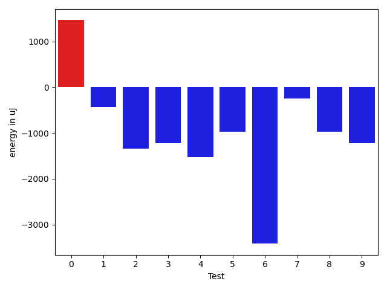

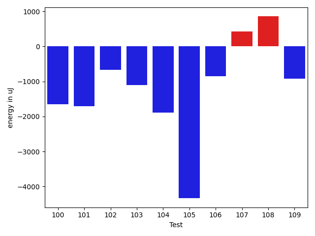

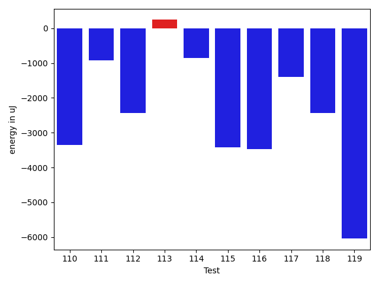

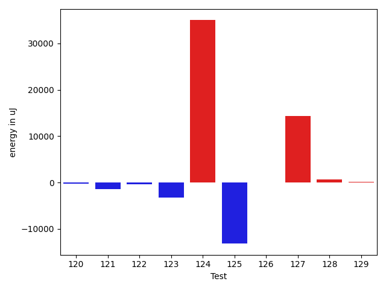

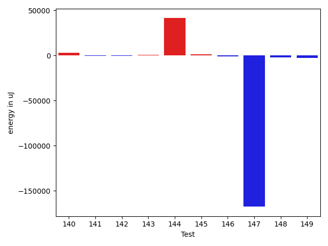

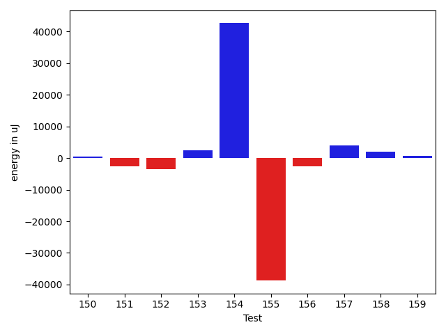

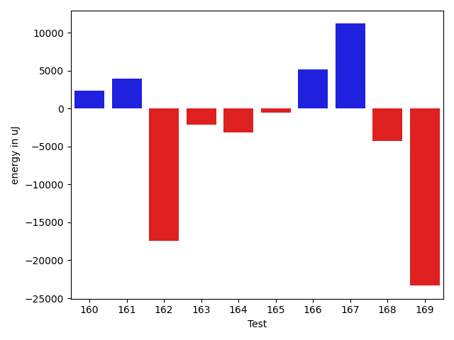

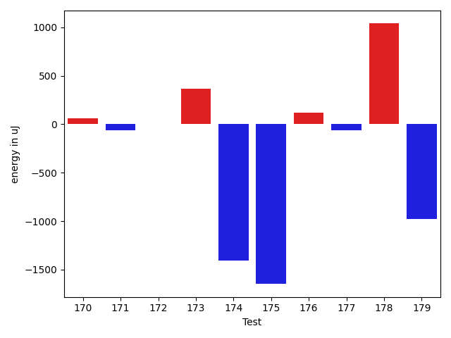

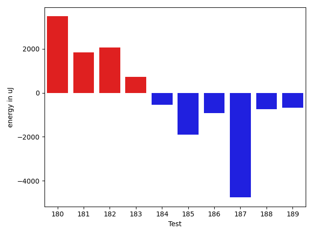

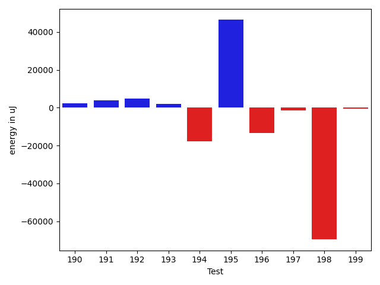

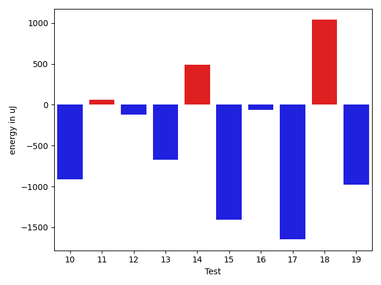

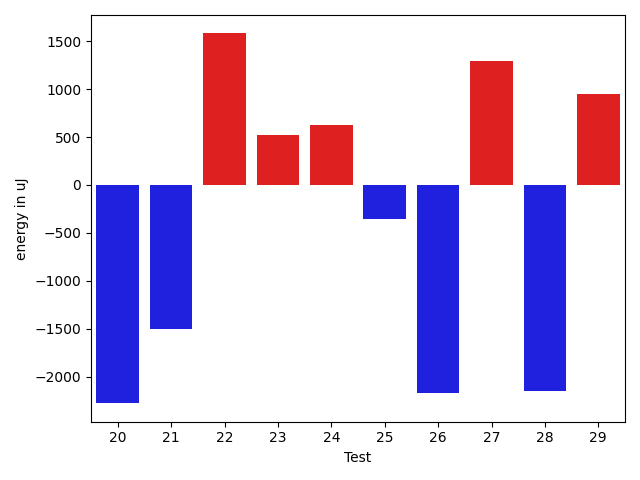

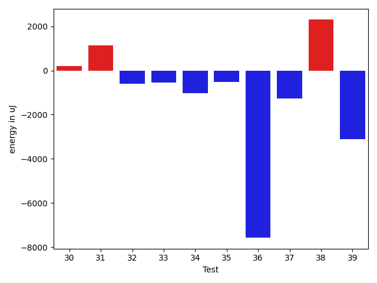

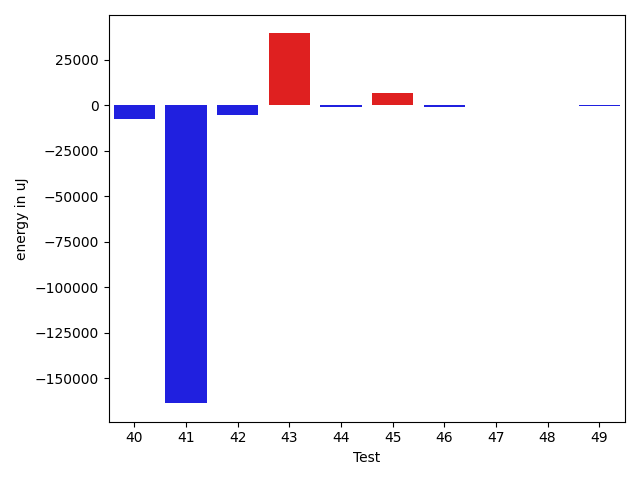

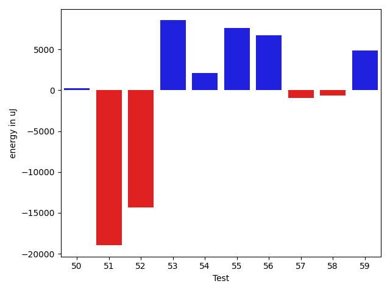

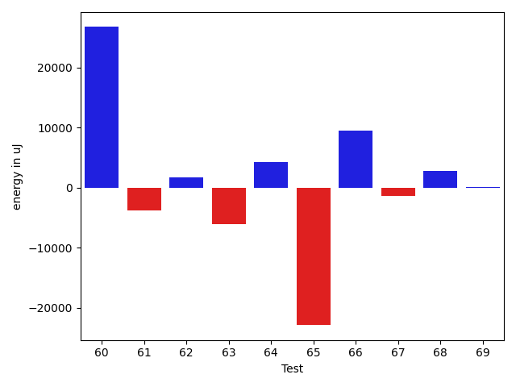

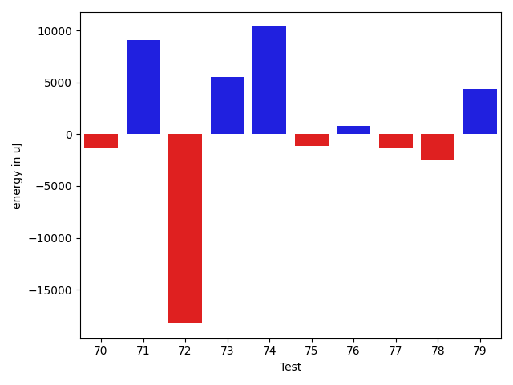

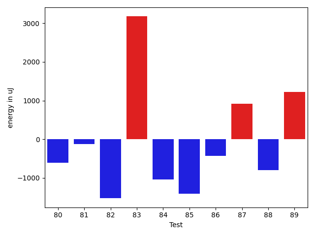

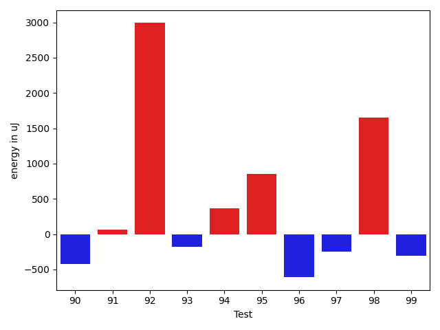

| ID | EnergyV1 | EnergyV2 | DeltaEnergy |
| --- | --- | --- | --- |
| 0 | 32909.905875816454 | 37120.874131193574 | 4210.96825537712 |
| 1 | 33718.2430792056 | 35694.069029897146 | 1975.8259506915492 |
| 2 | 86001.25433905095 | 36824.62264333791 | -49176.63169571304 |
| 3 | 66432.30821509892 | 78027.27650906079 | 11594.968293961865 |
| 4 | 65078.8314931853 | 40072.72230888492 | -25006.10918430038 |
| 5 | 36349.24941622357 | 38142.72896513018 | 1793.4795489066164 |
| 6 | 40728.81042069821 | 36908.51035821614 | -3820.3000624820706 |
| 7 | 35251.33270969211 | 34446.32181964577 | -805.0108900463456 |
| 8 | 37782.30401735119 | 38870.81120833063 | 1088.5071909794424 |
| 9 | 66664.85434751472 | 33757.81764764024 | -32907.03669987448 |
| 10 | 34978.687272435884 | 33303.56642300783 | -1675.1208494280509 |
| 11 | 32293.42961369922 | 37511.73488742368 | 5218.305273724458 |
| 12 | 31241.46396580267 | 37601.861464540416 | 6360.397498737744 |
| 13 | 35404.83355093002 | 39527.502474956214 | 4122.668924026191 |
| 14 | 33033.57613665297 | 37526.01694361307 | 4492.440806960098 |
| 15 | 34110.81346954717 | 36667.98408281058 | 2557.1706132634135 |
| 16 | 34749.712378241566 | 40161.73302132491 | 5412.020643083342 |
| 17 | 34649.93321413657 | 39433.5238345131 | 4783.5906203765335 |
| 18 | 34438.42592299264 | 33921.765557464154 | -516.6603655284853 |
| 19 | 35181.27800053544 | 40203.107918307185 | 5021.829917771742 |
| 20 | 38690.055399894714 | 37168.22498893738 | -1521.8304109573364 |
| 21 | 36465.76694704675 | 40857.4804493013 | 4391.713502254548 |
| 22 | 133109.95334475188 | 41326.285534050665 | -91783.66781070121 |
| 23 | 40624.77823317051 | 36835.40138244629 | -3789.3768507242203 |
| 24 | 39873.5462308982 | 36774.4838528759 | -3099.062378022303 |
| 25 | 37857.43731534481 | 40567.882415771484 | 2710.445100426674 |
| 26 | 36276.40553028735 | 40588.08396687369 | 4311.678436586335 |
| 27 | 45649.877862561494 | 43181.13898108827 | -2468.738881473226 |
| 28 | 35497.268058776855 | 42443.228737831116 | 6945.96067905426 |
| 29 | 35746.43010878563 | 39331.299127325416 | 3584.8690185397863 |
| 30 | 34600.82330131531 | 37777.66655147076 | 3176.843250155449 |
| 31 | 53691.602477560686 | 122268.25156186824 | 68576.64908430754 |
| 32 | 37019.970858813205 | 55451.65207475028 | 18431.681215937075 |
| 33 | 42065.47842297469 | 50134.70723902556 | 8069.228816050876 |
| 34 | 34274.13787563655 | 38081.12992538379 | 3806.9920497472413 |
| 35 | 94571.428979458 | 35633.35748903951 | -58938.071490418486 |
| 36 | 37079.67448202431 | 35091.968457270814 | -1987.7060247534973 |
| 37 | 40602.34260456609 | 43429.034555388644 | 2826.6919508225546 |
| 38 | 39958.49298620224 | 36749.238868415356 | -3209.2541177868843 |
| 39 | 37062.43777167145 | 30949.233473194763 | -6113.204298476689 |
| 40 | 37214.20256612634 | 34002.13843772793 | -3212.064128398408 |
| 41 | 37655.194422703236 | 38878.52743287012 | 1223.3330101668835 |
| 42 | 35147.6622113834 | 33975.67932596167 | -1171.982885421734 |
| 43 | 37059.19368039828 | 35183.35446291044 | -1875.839217487839 |
| 44 | 40063.18155579548 | 37059.75541406259 | -3003.426141732896 |
| 45 | 38567.719661656345 | 34643.091951314025 | -3924.62771034232 |
| 46 | 41054.28087508728 | 38554.19980855164 | -2500.0810665356403 |
| 47 | 38019.82164635416 | 40125.71900049024 | 2105.8973541360756 |
| 48 | 46022.6898393631 | 34974.82435188678 | -11047.865487476316 |
| 49 | 40194.56907180324 | 40694.636712318286 | 500.06764051504433 |
| 50 | 40330.53436410427 | 40591.211669921875 | 260.67730581760406 |
| 51 | 62206.37932107691 | 43233.43661151081 | -18972.942709566094 |
| 52 | 52998.62951514311 | 38681.31064844593 | -14317.318866697184 |
| 53 | 38122.67273667104 | 46686.61704121068 | 8563.94430453964 |
| 54 | 40252.7958984375 | 42387.62023925781 | 2134.8243408203125 |
| 55 | 38131.43719482422 | 45787.62109375 | 7656.183898925781 |
| 56 | 40510.14929318883 | 47272.25560198513 | 6762.106308796305 |
| 57 | 40219.493109223324 | 39271.75749859107 | -947.735610632255 |
| 58 | 38384.158167917994 | 37739.32907062343 | -644.8290972945615 |
| 59 | 55376.869849425464 | 60234.50356563683 | 4857.633716211363 |
| 60 | 38185.0176657184 | 64936.62360311519 | 26751.605937396795 |
| 61 | 41214.19050754011 | 37363.66561609534 | -3850.5248914447657 |
| 62 | 39160.38087837377 | 40906.82226559833 | 1746.441387224564 |
| 63 | 41661.576749525964 | 35587.985321998596 | -6073.591427527368 |
| 64 | 36514.61220610596 | 40750.99069888982 | 4236.378492783864 |
| 65 | 63795.38125653667 | 40891.48204334108 | -22903.89921319559 |
| 66 | 34302.137606576085 | 43766.325531095266 | 9464.187924519181 |
| 67 | 40352.99674732255 | 39020.04880061343 | -1332.947946709115 |
| 68 | 35000.4036286585 | 37844.17062227195 | 2843.766993613448 |
| 69 | 35476.30428441198 | 35627.24699365893 | 150.94270924695593 |
| 70 | 37745.98599481583 | 36436.20867794752 | -1309.7773168683052 |
| 71 | 30562.86531701024 | 39600.283448058486 | 9037.418131048245 |
| 72 | 134275.82944467064 | 116018.4904937921 | -18257.338950878548 |
| 73 | 36557.983817867935 | 42049.40021133423 | 5491.416393466294 |
| 74 | 30083.72961074207 | 40434.30806696415 | 10350.57845622208 |
| 75 | 41525.186868117526 | 40416.9682271534 | -1108.218640964129 |
| 76 | 35350.37517974183 | 36127.06111514167 | 776.685935399837 |
| 77 | 36351.40390027687 | 34991.5470931977 | -1359.8568070791662 |
| 78 | 37239.93745378923 | 34683.76248969582 | -2556.1749640934067 |
| 79 | 33293.14779476491 | 37623.50047385674 | 4330.352679091826 |
| 80 | 35127.11004471034 | 33250.54097856954 | -1876.5690661408007 |
| 81 | 39504.05746096863 | 35341.834609938756 | -4162.222851029874 |
| 82 | 31746.660868744228 | 37846.25349602221 | 6099.592627277983 |
| 83 | 36810.23626241209 | 36071.77329185119 | -738.4629705608968 |
| 84 | 34889.685841977596 | 35837.09095041454 | 947.4051084369421 |
| 85 | 36098.03304685652 | 34049.58267211914 | -2048.450374737382 |
| 86 | 35191.326751708984 | 39766.2578125 | 4574.931060791016 |
| 87 | 37549.83440029621 | 34216.72610092163 | -3333.1082993745804 |
| 88 | 57802.10012005275 | 38687.4390554931 | -19114.661064559652 |
| 89 | 36953.1945142746 | 40523.183654785156 | 3569.989140510559 |
| 90 | 38324.39514160156 | 43438.19070625305 | 5113.795564651489 |
| 91 | 35410.59210321307 | 39198.22393798828 | 3787.6318347752094 |
| 92 | 40699.263671875 | 41941.8955078125 | 1242.6318359375 |
| 93 | 36315.90966796875 | 42477.37731933594 | 6161.4676513671875 |
| 94 | 39887.89185619354 | 35835.76158854365 | -4052.130267649889 |
| 95 | 34172.283203125 | 38338.388671875 | 4166.10546875 |
| 96 | 39731.10886559328 | 38385.33463833302 | -1345.7742272602627 |
| 97 | 51771.450016318944 | 41955.25529846931 | -9816.194717849634 |
| 98 | 39283.1373556548 | 43219.54870816755 | 3936.411352512754 |
| 99 | 62687.19453171015 | 49571.31522425633 | -13115.879307453819 |
| 100 | 44428.76169899768 | 40797.34075630856 | -3631.420942689125 |
| 101 | 40468.03772694172 | 42234.66591294255 | 1766.6281860008312 |
| 102 | 45753.19100264211 | 140385.14365852193 | 94631.95265587982 |
| 103 | 41043.089544645045 | 39103.82343500981 | -1939.2661096352385 |
| 104 | 38920.79598556459 | 40581.24300811812 | 1660.4470225535333 |
| 105 | 40493.89065503268 | 40094.409984495054 | -399.480670537625 |
| 106 | 39113.76111122072 | 39786.07258476196 | 672.3114735412382 |
| 107 | 39069.39863935229 | 39064.314611246285 | -5.084028106000915 |
| 108 | 41217.52371059323 | 38253.231817391745 | -2964.2918932014873 |
| 109 | 47230.69208192825 | 55761.40209007263 | 8530.710008144379 |
| 110 | 36473.47994758675 | 43052.31136841079 | 6578.831420824041 |
| 111 | 291710.4954444477 | 40207.17588677644 | -251503.31955767123 |
| 112 | 37418.171169787995 | 36248.287449643816 | -1169.8837201441784 |
| 113 | 40134.82210175933 | 35443.56510814652 | -4691.256993612813 |
| 114 | 57667.79598909017 | 37405.51821955898 | -20262.27776953119 |
| 115 | 35640.66140259555 | 120380.93129419927 | 84740.26989160372 |
| 116 | 40583.78736551577 | 39919.51112884283 | -664.2762366729366 |
| 117 | 42034.18605395363 | 37829.5400804878 | -4204.645973465827 |
| 118 | 40405.24119198322 | 42260.71340720239 | 1855.472215219168 |
| 119 | 38371.00903224945 | 41425.03303527832 | 3054.0240030288696 |
| 120 | 40714.90367269119 | 35954.036313597586 | -4760.867359093601 |
| 121 | 98823.66655816158 | 141146.91447243022 | 42323.247914268635 |
| 122 | 38365.0 | 35744.82666015625 | -2620.17333984375 |
| 123 | 35465.17721992657 | 38027.34200092382 | 2562.164780997249 |
| 124 | 37989.075594040565 | 36440.48644342607 | -1548.589150614498 |
| 125 | 642887.3584289551 | 299744.4639517367 | -343142.8944772184 |
| 126 | 38164.35482757273 | 36043.64305394209 | -2120.711773630639 |
| 127 | 38569.54451353569 | 34613.38143645558 | -3956.163077080113 |
| 128 | 41755.74567076564 | 33486.735179930925 | -8269.010490834713 |
| 129 | 35081.29700683057 | 31454.973214578757 | -3626.3237922518165 |
| 130 | 35908.922062113 | 36373.10308973545 | 464.1810276224496 |
| 131 | 37408.814021526836 | 35656.399326086044 | -1752.4146954407915 |
| 132 | 44680.03546748776 | 42130.180388323846 | -2549.8550791639136 |
| 133 | 34459.2033213079 | 37657.33423733711 | 3198.130916029215 |
| 134 | 35836.12384156231 | 37358.99800957553 | 1522.8741680132225 |
| 135 | 51493.83967614174 | 45456.18380737305 | -6037.655868768692 |
| 136 | 103917.59145672992 | 84245.64256514236 | -19671.948891587555 |
| 137 | 36701.533450242714 | 35693.3559339368 | -1008.1775163059137 |
| 138 | 36870.37284088135 | 34407.97037267685 | -2462.4024682044983 |
| 139 | 37548.79234663422 | 38858.560150332225 | 1309.767803698007 |
| 140 | 36594.36230069647 | 38916.35682688472 | 2321.994526188253 |
| 141 | 352703.19971177547 | 179795.3640939623 | -172907.83561781317 |
| 142 | 87747.82477756444 | 81033.57074611884 | -6714.254031445598 |
| 143 | 38295.315942364585 | 35011.07943777748 | -3284.2365045871047 |
| 144 | 37647.98770041946 | 37375.09806291381 | -272.88963750565017 |
| 145 | 36340.99088660105 | 39741.82571510275 | 3400.834828501698 |
| 146 | 84780.90811418899 | 118643.57380500983 | 33862.66569082084 |
| 147 | 41276.34811053332 | 37972.157098659976 | -3304.191011873343 |
| 148 | 41619.17626953125 | 39270.387939453125 | -2348.788330078125 |
| 149 | 40623.13900495205 | 42624.63033570816 | 2001.4913307561146 |
| 150 | 38823.73526182771 | 39249.86781129241 | 426.1325494647026 |
| 151 | 36795.22794013191 | 34211.78900100861 | -2583.438939123298 |
| 152 | 40494.76306152344 | 37060.050048828125 | -3434.7130126953125 |
| 153 | 38361.81039443971 | 40914.70211425967 | 2552.8917198199633 |
| 154 | 33113.394811461156 | 75757.02004542835 | 42643.62523396719 |
| 155 | 78949.44710663159 | 40193.1788264364 | -38756.26828019519 |
| 156 | 38875.93140425153 | 36230.560101074516 | -2645.3713031770167 |
| 157 | 35021.67246765547 | 38978.53706263515 | 3956.8645949796773 |
| 158 | 36248.054556125266 | 38185.933660612645 | 1937.8791044873797 |
| 159 | 40508.75455204257 | 41142.22748170761 | 633.4729296650403 |
| 160 | 37043.622670699595 | 39371.3056842192 | 2327.683013519607 |
| 161 | 35048.27536039162 | 38985.494349825196 | 3937.218989433575 |
| 162 | 73240.54883422072 | 55799.34191793653 | -17441.206916284194 |
| 163 | 36965.86239852737 | 34803.56153332438 | -2162.3008652029966 |
| 164 | 39769.30728782072 | 36624.62440797057 | -3144.6828798501447 |
| 165 | 41425.89480809108 | 40874.42725283666 | -551.4675552544213 |
| 166 | 37727.913619675004 | 42911.02915895541 | 5183.115539280407 |
| 167 | 38112.35916019688 | 49292.96284316107 | 11180.603682964189 |
| 168 | 39432.443885779474 | 35117.711194999545 | -4314.732690779929 |
| 169 | 81476.15102729687 | 58138.87849587931 | -23337.272531417562 |
| 170 | 49849.31227850119 | 44149.33683780379 | -5699.975440697395 |
| 171 | 115780.01210715888 | 150691.17260881112 | 34911.16050165224 |
| 172 | 37834.85449879989 | 38996.12755611539 | 1161.2730573154986 |
| 173 | 40414.80106695328 | 38982.95007786674 | -1431.850989086539 |
| 174 | 36738.18168223886 | 35705.79043147944 | -1032.391250759414 |
| 175 | 65117.93383614534 | 115024.36242267747 | 49906.42858653213 |
| 176 | 37889.594270165486 | 44423.556625534075 | 6533.962355368589 |
| 177 | 44228.87632361758 | 41505.39871651506 | -2723.477607102519 |
| 178 | 40406.85129286721 | 40941.56412783824 | 534.7128349710256 |
| 179 | 39818.52894138219 | 38738.34878556058 | -1080.1801558216102 |
| 180 | 39456.50646972656 | 43789.339376449585 | 4332.8329067230225 |
| 181 | 40198.88817339018 | 40612.52651977539 | 413.63834638521075 |
| 182 | 37758.911278154425 | 38237.942150228555 | 479.03087207413046 |
| 183 | 40939.7862008144 | 40143.03073859586 | -796.7554622185417 |
| 184 | 64119.94114352328 | 66069.40042677693 | 1949.459283253651 |
| 185 | 40992.38799780457 | 53309.92886956679 | 12317.54087176222 |
| 186 | 695983.9830153527 | 111317.20543080788 | -584666.7775845448 |
| 187 | 33806.82241325057 | 40715.44516001963 | 6908.622746769062 |
| 188 | 35514.30194091797 | 41898.04257774353 | 6383.7406368255615 |
| 189 | 36497.147757053375 | 35677.97009444237 | -819.1776626110077 |
| 190 | 34180.40900094807 | 36549.49434530735 | 2369.0853443592787 |
| 191 | 34722.54754161835 | 38523.98440551758 | 3801.436863899231 |
| 192 | 35585.71746826172 | 40445.23178768158 | 4859.514319419861 |
| 193 | 38255.583984375 | 40109.75117725134 | 1854.167192876339 |
| 194 | 238551.3743228188 | 220798.87360831245 | -17752.500714506343 |
| 195 | 40663.857448760515 | 87046.73994537278 | 46382.88249661227 |
| 196 | 52097.5849896136 | 38795.48955735303 | -13302.095432260568 |
| 197 | 38103.04736623369 | 36568.57136610501 | -1534.4760001286777 |
| 198 | 181600.73584249296 | 111958.00009227375 | -69642.7357502192 |
| 199 | 39250.550038110465 | 38746.70883369446 | -503.8412044160068 |
| 200 | 39838.19357060641 | 37854.384201049805 | -1983.8093695566058 |
| 201 | 38334.90185546875 | 36337.51477050781 | -1997.3870849609375 |
| 202 | 39404.13131810725 | 39162.69646918774 | -241.43484891951084 |
| 203 | 40011.90390181437 | 38306.591061455285 | -1705.3128403590817 |
| 204 | 42125.06396484375 | 37561.474365234375 | -4563.589599609375 |
| 205 | 40030.56774902344 | 40638.04525756836 | 607.4775085449219 |
| 206 | 87104.36287689209 | 112435.34875869751 | 25330.98588180542 |
| 207 | 37714.07843500376 | 36012.6243962273 | -1701.4540387764573 |
| 208 | 44712.8759765625 | 38926.002133946866 | -5786.873842615634 |

## Delta Duration per test method

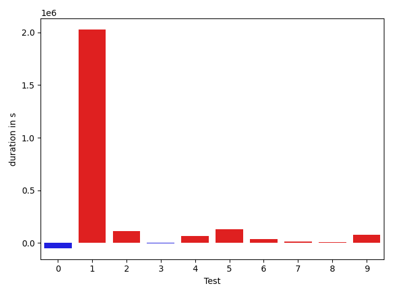

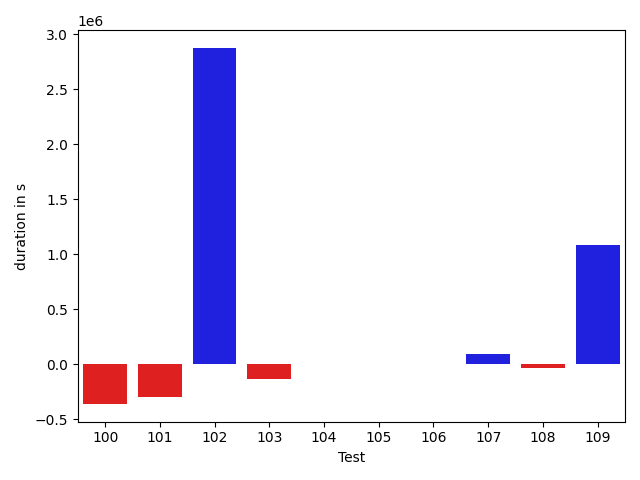

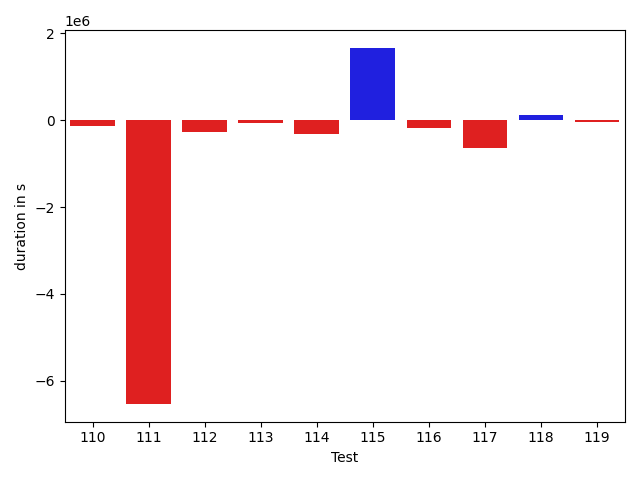

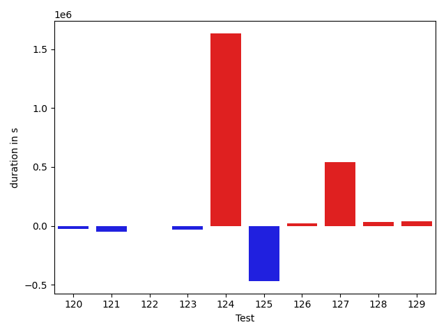

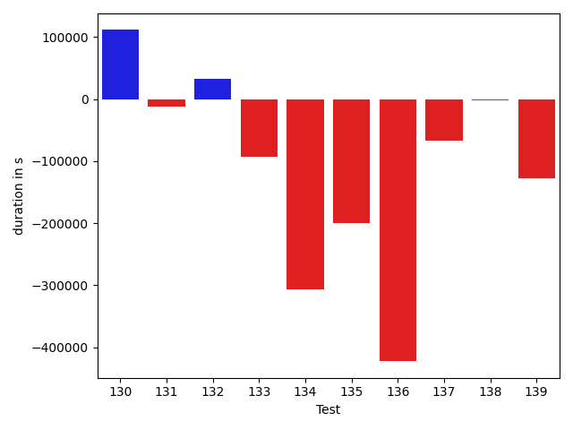

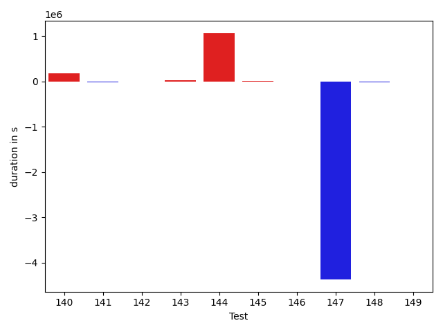

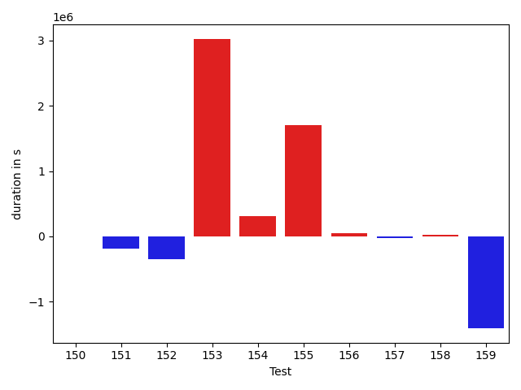

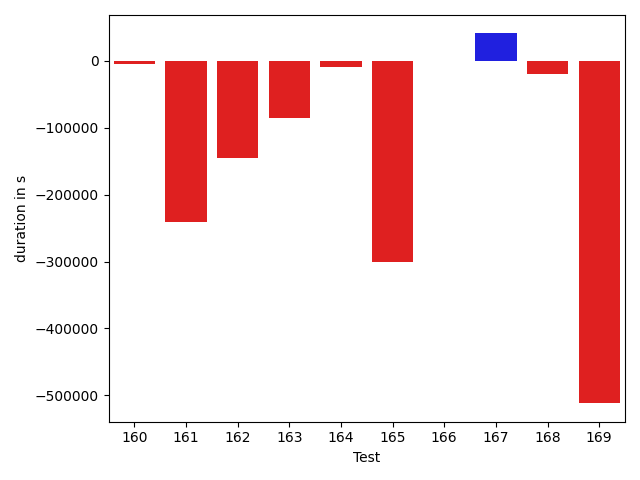

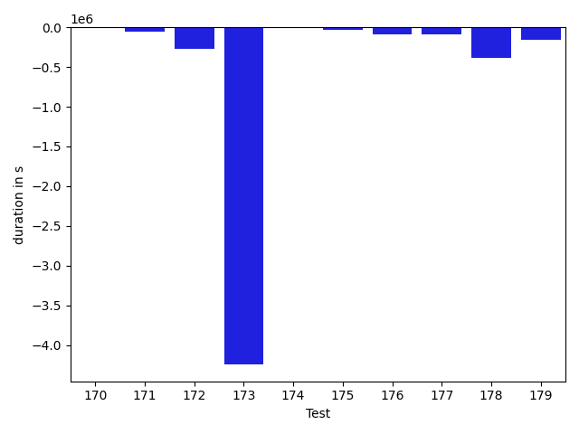

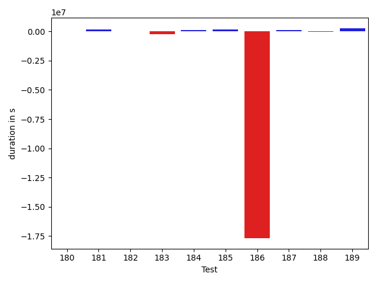

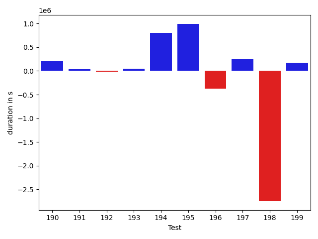

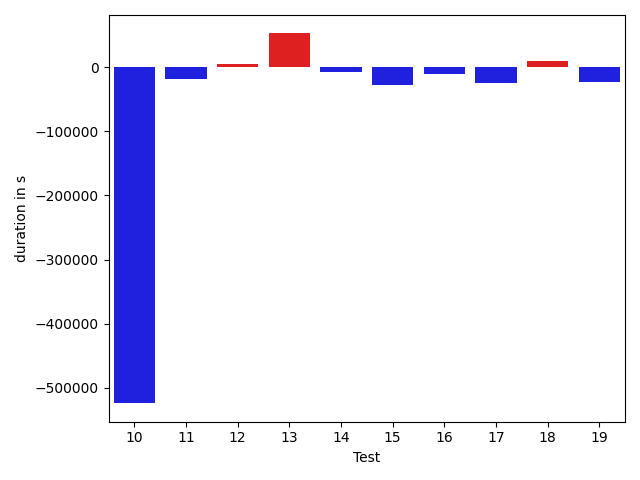

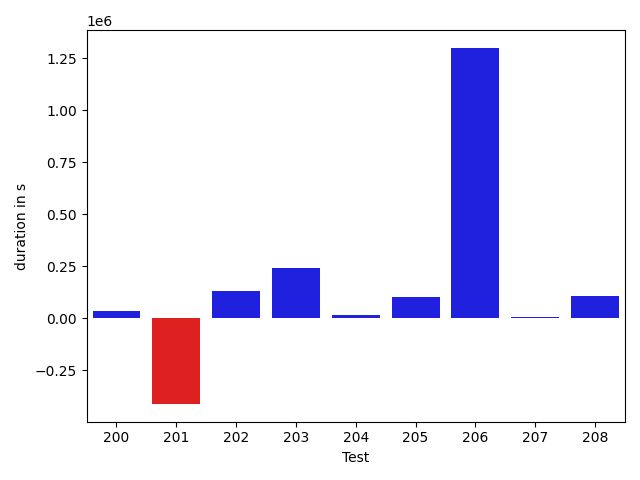

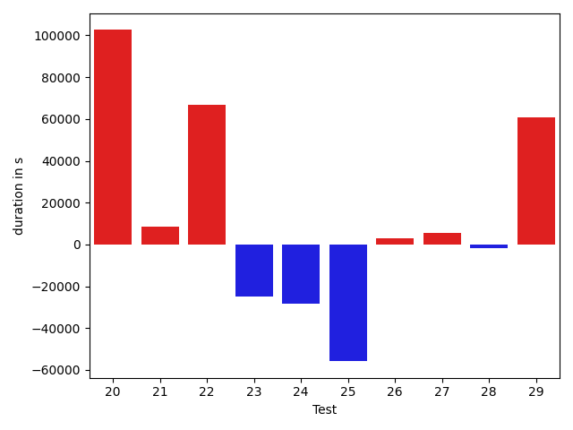

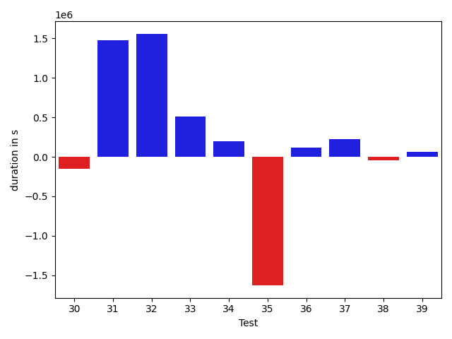

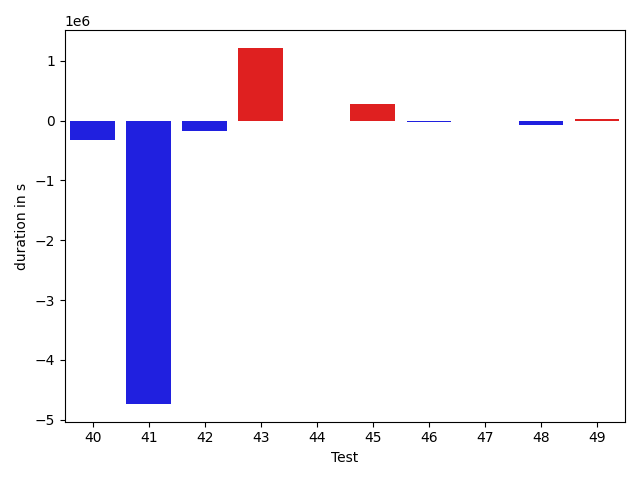

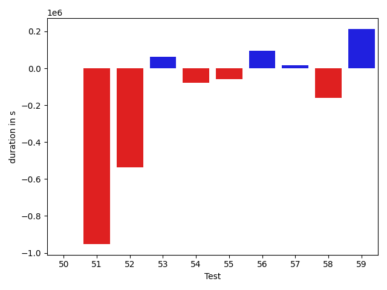

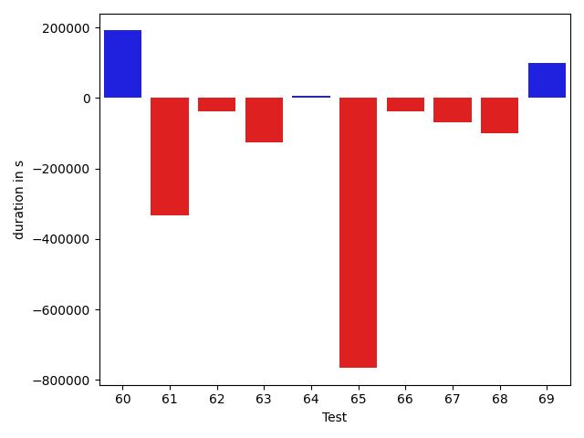

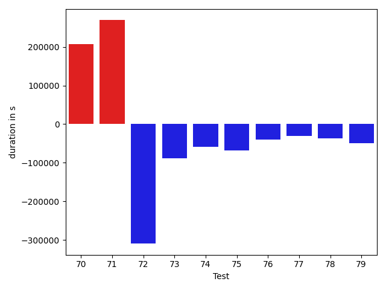

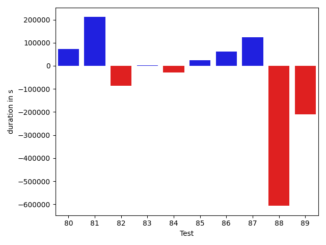

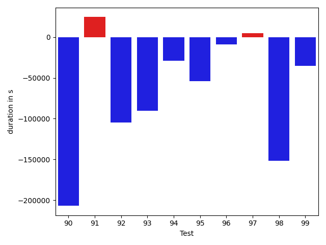

| ID | DurationV1 | DurationsV2 | DeltaDuration |
| --- | --- | --- | --- |
| 0 | 1017028.7699581217 | 964609.374338219 | -52419.39561990276 |
| 1 | 755142.9076493587 | 753914.911724646 | -1227.9959247127408 |
| 2 | 3027785.1998896743 | 779124.2107681946 | -2248660.98912148 |
| 3 | 2483577.930127305 | 2418753.998608672 | -64823.93151863292 |
| 4 | 1842684.015569457 | 996145.7892643148 | -846538.2263051423 |
| 5 | 1058804.9579197075 | 673055.913335351 | -385749.0445843565 |
| 6 | 682397.5231188075 | 767813.6486189314 | 85416.12550012395 |
| 7 | 1363688.730574293 | 691696.6743643846 | -671992.0562099084 |
| 8 | 611446.5512021862 | 747287.7112510591 | 135841.16004887293 |
| 9 | 2068162.0331084782 | 728327.0496961505 | -1339834.9834123277 |
| 10 | 909924.3286377661 | 998344.7836148571 | 88420.45497709105 |
| 11 | 857330.4256108073 | 653832.6724458033 | -203497.75316500396 |
| 12 | 953424.1725194376 | 656675.7573533106 | -296748.41516612703 |
| 13 | 404115.4454154968 | 434468.16595618427 | 30352.720540687442 |
| 14 | 751108.5588511282 | 683338.1725088585 | -67770.38634226972 |
| 15 | 471089.4494251006 | 611896.9362400174 | 140807.48681491683 |
| 16 | 700528.7745991072 | 580291.4232510295 | -120237.35134807776 |
| 17 | 782650.7806700103 | 749692.6975716399 | -32958.08309837035 |
| 18 | 664159.504932614 | 642916.4620864801 | -21243.042846133932 |
| 19 | 2068396.8006765866 | 449668.77135828836 | -1618728.0293182982 |
| 20 | 679547.9423010349 | 442442.7968893051 | -237105.1454117298 |
| 21 | 936051.2634296803 | 701598.4937157026 | -234452.7697139777 |
| 22 | 3134097.1583216675 | 599807.3341344513 | -2534289.8241872163 |
| 23 | 663381.7055063248 | 434177.864654541 | -229203.84085178375 |
| 24 | 1086127.2722919225 | 744472.8570096843 | -341654.41528223816 |
| 25 | 558602.2128466368 | 402564.4101257324 | -156037.80272090435 |
| 26 | 891196.3907961986 | 800591.2275001365 | -90605.16329606215 |
| 27 | 889280.0220017536 | 538688.6372075794 | -350591.3847941741 |
| 28 | 752245.2374343872 | 374725.32046461105 | -377519.91696977615 |
| 29 | 713822.4425709248 | 412824.22476290166 | -300998.2178080231 |
| 30 | 551158.1664502621 | 396557.92029845715 | -154600.24615180492 |
| 31 | 1898388.7829150308 | 3372436.4874985423 | 1474047.7045835115 |
| 32 | 602445.183562742 | 2160536.922127475 | 1558091.738564733 |
| 33 | 1348331.0065371196 | 1860847.6229395485 | 512516.61640242883 |
| 34 | 1512750.6501595094 | 1706419.5613450713 | 193668.9111855619 |
| 35 | 2567937.643788693 | 940473.3471941757 | -1627464.2965945173 |
| 36 | 680555.0196491444 | 799016.4981658179 | 118461.47851667355 |
| 37 | 968292.1977382462 | 1191834.2187064725 | 223542.02096822637 |
| 38 | 501853.1658229828 | 455882.68727859855 | -45970.47854438424 |
| 39 | 462863.46655560425 | 522674.1029949738 | 59810.636439369526 |
| 40 | 753602.927409489 | 725178.3286103553 | -28424.59879913379 |
| 41 | 416705.29188033566 | 587067.0461008865 | 170361.75422055088 |
| 42 | 644137.9208374403 | 652850.1077348329 | 8712.186897392618 |
| 43 | 451879.50237439084 | 454395.9745848328 | 2516.472210441949 |
| 44 | 588392.5852974164 | 536201.6859245088 | -52190.89937290759 |
| 45 | 704844.2304051545 | 718856.5569114063 | 14012.326506251819 |
| 46 | 806946.5577344073 | 641065.0938424937 | -165881.46389191353 |
| 47 | 637072.3472409546 | 542928.0151257741 | -94144.33211518056 |
| 48 | 641502.3605935574 | 455539.8879139571 | -185962.47267960024 |
| 49 | 633834.0775280632 | 498092.99628112465 | -135741.08124693856 |
| 50 | 468544.0419359505 | 469389.74560546875 | 845.7036695182323 |
| 51 | 1513845.921971534 | 561778.9123091772 | -952067.0096623567 |
| 52 | 1197343.3152390292 | 660354.3858634188 | -536988.9293756104 |
| 53 | 848539.5673593343 | 912526.054883525 | 63986.487524190685 |
| 54 | 431987.6875 | 353887.22595214844 | -78100.46154785156 |
| 55 | 538841.0475158691 | 479123.177734375 | -59717.86978149414 |
| 56 | 1515140.1193499742 | 1609133.5969543299 | 93993.47760435566 |
| 57 | 846709.5486907683 | 863678.7598726553 | 16969.21118188696 |
| 58 | 843346.9449746541 | 683617.6430524753 | -159729.30192217883 |
| 59 | 1534266.4010376516 | 1747398.7574590389 | 213132.3564213873 |
| 60 | 1051136.7401668113 | 1242461.7748296037 | 191325.03466279246 |
| 61 | 1000865.3294747893 | 667186.0799547652 | -333679.24952002417 |
| 62 | 979401.2113523837 | 942218.1281253133 | -37183.0832270704 |
| 63 | 620657.0118883699 | 495020.6069125533 | -125636.40497581661 |
| 64 | 490164.0319653952 | 496287.89305423485 | 6123.861088839651 |
| 65 | 1728174.7357004853 | 961940.9884883524 | -766233.7472121329 |
| 66 | 491490.3815706745 | 453935.53137910366 | -37554.85019157082 |
| 67 | 1241049.5746990913 | 1172986.8153592707 | -68062.7593398206 |
| 68 | 617724.5888502821 | 517759.81484747026 | -99964.77400281187 |
| 69 | 613929.1251506801 | 713524.1191026673 | 99594.99395198724 |
| 70 | 427505.50184869766 | 420879.643481195 | -6625.858367502689 |
| 71 | 929514.5044526521 | 1159629.1217040787 | 230114.61725142668 |
| 72 | 3368366.655018624 | 3332726.04557145 | -35640.609447173774 |
| 73 | 464131.4839677438 | 561042.2388693094 | 96910.75490156561 |
| 74 | 526049.0918302294 | 555032.8343710601 | 28983.742540830746 |
| 75 | 1468029.80579118 | 1053647.694682063 | -414382.11110911705 |
| 76 | 714056.0981020213 | 686317.8962402308 | -27738.201861790498 |
| 77 | 509258.0440890752 | 613077.2752700374 | 103819.23118096218 |
| 78 | 839546.2645769025 | 795532.7401832686 | -44013.52439363394 |
| 79 | 750034.6107536687 | 720480.2971338562 | -29554.313619812485 |
| 80 | 483216.72430181503 | 556153.824441947 | 72937.10014013201 |
| 81 | 674085.3562230421 | 885369.7811396576 | 211284.42491661548 |
| 82 | 724119.3202762179 | 637556.8005319585 | -86562.51974425942 |
| 83 | 835663.3210545314 | 838393.4557131397 | 2730.1346586083528 |
| 84 | 472252.02278381586 | 443208.7351806909 | -29043.287603124976 |
| 85 | 451980.40746222436 | 476982.89945983887 | 25002.491997614503 |
| 86 | 382569.490814209 | 443656.3828125 | 61086.891998291016 |
| 87 | 334004.9564102292 | 457965.70112609863 | 123960.74471586943 |
| 88 | 1182268.2660463718 | 575619.2665632814 | -606648.9994830904 |
| 89 | 579641.8685560226 | 368633.1552429199 | -211008.71331310272 |
| 90 | 452143.5880126953 | 475001.57160437107 | 22857.98359167576 |
| 91 | 421118.17544963956 | 390032.3156890869 | -31085.859760552645 |
| 92 | 412588.220703125 | 381384.8596191406 | -31203.361083984375 |
| 93 | 396648.10400390625 | 450432.9401855469 | 53784.836181640625 |
| 94 | 449421.1735520363 | 546807.9616524726 | 97386.78810043633 |
| 95 | 474411.896484375 | 294782.26171875 | -179629.634765625 |
| 96 | 814577.3422188056 | 759200.31159149 | -55377.030627315515 |
| 97 | 1597675.5737575886 | 1149408.3724387172 | -448267.20131887146 |
| 98 | 837103.0785907232 | 643056.8495909437 | -194046.22899977956 |
| 99 | 2451961.9382161135 | 1176865.260736317 | -1275096.6774797966 |
| 100 | 1119827.3296913372 | 760939.3164369648 | -358888.0132543724 |
| 101 | 951460.7533746171 | 653058.4724585535 | -298402.2809160636 |
| 102 | 1153989.5260049484 | 4030367.016000839 | 2876377.4899958903 |
| 103 | 881278.1540466025 | 751679.0673974019 | -129599.08664920065 |
| 104 | 457727.2449404597 | 460648.6312251985 | 2921.386284738779 |
| 105 | 934070.5347927203 | 937641.9735848339 | 3571.438792113564 |
| 106 | 914446.0929225171 | 919421.4576522392 | 4975.364729722147 |
| 107 | 764513.5662427874 | 857987.8078636598 | 93474.2416208724 |
| 108 | 758355.3976692173 | 728146.7579140088 | -30208.63975520851 |
| 109 | 569085.4372711182 | 1650533.3453149796 | 1081447.9080438614 |
| 110 | 736619.4166848903 | 614536.3985945247 | -122083.01809036557 |
| 111 | 7665348.38543229 | 1130959.279109976 | -6534389.106322314 |
| 112 | 799812.4092317487 | 520538.15762889304 | -279274.2516028556 |
| 113 | 893895.1115297843 | 828321.7604868105 | -65573.35104297381 |
| 114 | 1106087.490004993 | 784198.7364251479 | -321888.7535798452 |
| 115 | 1231208.51361096 | 2896866.505111143 | 1665657.991500183 |
| 116 | 709331.017360086 | 537450.642465055 | -171880.37489503098 |
| 117 | 1132425.2580380216 | 494945.49098369206 | -637479.7670543296 |
| 118 | 740809.37517488 | 858685.7063720564 | 117876.33119717636 |
| 119 | 389775.84559726715 | 344452.60285949707 | -45323.24273777008 |
| 120 | 676636.807761639 | 883119.7522746109 | 206482.9445129719 |
| 121 | 2705121.636593744 | 3821328.678988788 | 1116207.0423950437 |
| 122 | 425746.294921875 | 377507.0146484375 | -48239.2802734375 |
| 123 | 875755.6369946576 | 709571.4369467751 | -166184.2000478825 |
| 124 | 551731.4588091709 | 526142.1125970787 | -25589.346212092205 |
| 125 | 18996015.897232056 | 8841555.931795985 | -10154459.965436071 |
| 126 | 950872.547968766 | 656548.9554061835 | -294323.59256258246 |
| 127 | 1262290.9513343896 | 1298965.0595797333 | 36674.10824534367 |
| 128 | 533515.3309960067 | 495361.4620795846 | -38153.86891642213 |
| 129 | 593087.1758242995 | 604820.5036687974 | 11733.32784449798 |
| 130 | 739885.1548108589 | 851400.1545963725 | 111514.99978551362 |
| 131 | 492466.37427566573 | 480974.60752916336 | -11491.76674650237 |
| 132 | 839637.5839046969 | 872015.2586454826 | 32377.674740785733 |
| 133 | 516890.9096981883 | 424162.65630459785 | -92728.25339359045 |
| 134 | 773575.55294337 | 466825.4513231325 | -306750.10162023746 |
| 135 | 1062416.7430198193 | 862353.1095428467 | -200063.63347697258 |
| 136 | 3193582.912147967 | 2771095.9531630725 | -422486.9589848947 |
| 137 | 683149.614155913 | 616689.0368493024 | -66460.57730661065 |
| 138 | 411281.35260009766 | 409221.4469175339 | -2059.9056825637817 |
| 139 | 1143649.214553128 | 1015957.701374971 | -127691.51317815704 |
| 140 | 1086674.5724086694 | 1085563.1265794425 | -1111.4458292268682 |
| 141 | 10191322.57407831 | 4444485.25067699 | -5746837.323401321 |
| 142 | 2591990.846005745 | 1965959.2589088427 | -626031.5870969025 |
| 143 | 1354242.884109544 | 1355966.0588682257 | 1723.1747586815618 |
| 144 | 1075380.8487147882 | 1062122.536018185 | -13258.312696603127 |
| 145 | 648356.0643169644 | 889624.232950029 | 241268.1686330646 |
| 146 | 2619390.542106275 | 3467118.7743494785 | 847728.2322432036 |
| 147 | 529667.926031136 | 789307.2483040891 | 259639.3222729531 |
| 148 | 417057.1484375 | 389031.60705566406 | -28025.541381835938 |
| 149 | 691312.9610232993 | 1037872.389246243 | 346559.4282229438 |
| 150 | 552549.6278642416 | 575072.0489836931 | 22522.421119451523 |
| 151 | 468344.7684644761 | 696026.6383653481 | 227681.869900872 |
| 152 | 411708.16304016113 | 568413.3518676758 | 156705.18882751465 |
| 153 | 822676.7474784076 | 974470.0734404211 | 151793.32596201357 |
| 154 | 661462.7079226658 | 2172688.8983840933 | 1511226.1904614274 |
| 155 | 2014081.025161252 | 796347.6689400226 | -1217733.3562212293 |
| 156 | 850817.020921514 | 745191.6393723991 | -105625.38154911494 |
| 157 | 1083175.6703394463 | 929473.781215233 | -153701.88912421325 |
| 158 | 789916.072763186 | 825441.0539664724 | 35524.98120328644 |
| 159 | 888481.2049787162 | 796009.7393592991 | -92471.46561941714 |
| 160 | 860074.1834282393 | 855721.4515566179 | -4352.73187162145 |
| 161 | 737822.5220574546 | 496604.861193588 | -241217.66086386656 |
| 162 | 1920380.6997385353 | 1774974.1149575314 | -145406.58478100388 |
| 163 | 887122.0482431985 | 801931.1753554244 | -85190.87288777414 |
| 164 | 1146265.207049091 | 1136981.3954709307 | -9283.811578160385 |
| 165 | 1097135.9602726384 | 796231.7121268767 | -300904.24814576167 |
| 166 | 587085.6406097319 | 586454.0940496683 | -631.5465600636089 |
| 167 | 1128453.5774638585 | 1169466.428511698 | 41012.851047839504 |
| 168 | 1098912.0779573019 | 1079050.1181659559 | -19861.959791345987 |
| 169 | 2668461.8915303163 | 2156511.662857095 | -511950.22867322154 |
| 170 | 1330496.604211378 | 1157050.9149029718 | -173445.6893084061 |
| 171 | 3817132.231146155 | 5169655.117564438 | 1352522.886418283 |
| 172 | 497253.8314473219 | 486101.1721320152 | -11152.659315306693 |
| 173 | 574744.1815543234 | 776431.1127049675 | 201686.9311506441 |
| 174 | 608915.3376744732 | 681262.543473234 | 72347.20579876087 |
| 175 | 2067885.2759389733 | 3338911.5630531018 | 1271026.2871141285 |
| 176 | 628825.2652822541 | 812916.87756789 | 184091.6122856359 |
| 177 | 625466.3641062609 | 595352.0506318016 | -30114.31347445934 |
| 178 | 656273.4638944939 | 445728.7609330844 | -210544.70296140946 |
| 179 | 461332.47745313076 | 441590.9974359907 | -19741.480017140042 |
| 180 | 410107.7083129883 | 402825.8408546448 | -7281.867458343506 |
| 181 | 485856.5617454797 | 631989.0655403137 | 146132.50379483402 |
| 182 | 814844.5855436898 | 845904.3924322207 | 31059.806888530962 |
| 183 | 923615.4147106989 | 672422.6348771558 | -251192.7798335431 |
| 184 | 1645095.556856345 | 1775403.6901319213 | 130308.1332755764 |
| 185 | 1343031.8004787215 | 1520322.4916771483 | 177290.69119842676 |
| 186 | 20895295.403358914 | 3221022.3304517595 | -17674273.072907154 |
| 187 | 782569.2070735164 | 890689.7960769443 | 108120.58900342789 |
| 188 | 464849.9498901367 | 414759.98543930054 | -50089.96445083618 |
| 189 | 368786.5252737999 | 632075.6375858784 | 263289.1123120785 |
| 190 | 469083.33142811805 | 678989.4175538719 | 209906.08612575382 |
| 191 | 549577.1232292354 | 586855.275970459 | 37278.152741223574 |
| 192 | 402161.8710632324 | 387335.1116056442 | -14826.759457588196 |
| 193 | 524347.9487304688 | 567138.2438080907 | 42790.29507762194 |
| 194 | 5322920.630043207 | 6131441.673947861 | 808521.0439046547 |
| 195 | 910740.8090269172 | 1904700.827179106 | 993960.0181521887 |
| 196 | 1289219.518215028 | 916850.9561834112 | -372368.5620316169 |
| 197 | 1036404.9976102798 | 1295496.0102060288 | 259091.012595749 |
| 198 | 5619824.193786348 | 2869845.1876907116 | -2749979.0060956366 |
| 199 | 400555.80936390907 | 576812.8323879242 | 176257.02302401513 |
| 200 | 548837.4054373875 | 582588.397354126 | 33750.99191673845 |
| 201 | 864091.4221191406 | 452769.82364082336 | -411321.59847831726 |
| 202 | 461537.00343259424 | 594906.177869916 | 133369.17443732172 |
| 203 | 776477.719756417 | 1016216.0505532096 | 239738.33079679264 |
| 204 | 439534.552734375 | 456278.9789733887 | 16744.426239013672 |
| 205 | 431138.1182861328 | 534014.5157165527 | 102876.39743041992 |
| 206 | 1634766.4538726807 | 2933510.4507026672 | 1298743.9968299866 |
| 207 | 532277.5561677217 | 539321.5457190722 | 7043.989551350474 |
| 208 | 497950.5811767578 | 605404.361156363 | 107453.77997960523 |

## Misc.

| ID | Test Class | Test Method |
| --- | --- | --- |
| 0 | com.google.gson.functional.CustomTypeAdaptersTest | testCustomAdapterInvokedForCollectionElementDeserialization |
| 1 | com.google.gson.functional.CustomTypeAdaptersTest | testCustomTypeAdapterAppliesToSubClassesSerializedAsBaseClass |
| 2 | com.google.gson.functional.CustomTypeAdaptersTest | testCustomSerializers |
| 3 | com.google.gson.functional.CustomTypeAdaptersTest | testCustomTypeAdapterDoesNotAppliesToSubClasses |
| 4 | com.google.gson.functional.CustomTypeAdaptersTest | testCustomAdapterInvokedForCollectionElementSerializationWithType |
| 5 | com.google.gson.functional.CustomTypeAdaptersTest | testCustomDeserializers |
| 6 | com.google.gson.functional.CustomTypeAdaptersTest | testCustomByteArrayDeserializerAndInstanceCreator |
| 7 | com.google.gson.functional.CustomTypeAdaptersTest | testEnsureCustomSerializerNotInvokedForNullValues |
| 8 | com.google.gson.functional.CustomTypeAdaptersTest | testCustomSerializerInvokedForPrimitives |
| 9 | com.google.gson.functional.CustomTypeAdaptersTest | testCustomNestedSerializers |
| 10 | com.google.gson.functional.CustomTypeAdaptersTest | testRegisterHierarchyAdapterForDate |
| 11 | com.google.gson.functional.CustomTypeAdaptersTest | testCustomAdapterInvokedForMapElementDeserialization |
| 12 | com.google.gson.functional.CustomTypeAdaptersTest | testCustomAdapterInvokedForMapElementSerializationWithType |
| 13 | com.google.gson.functional.CustomTypeAdaptersTest | testCustomAdapterInvokedForMapElementSerialization |
| 14 | com.google.gson.functional.CustomTypeAdaptersTest | testCustomNestedDeserializers |
| 15 | com.google.gson.functional.CustomTypeAdaptersTest | testCustomAdapterInvokedForCollectionElementSerialization |
| 16 | com.google.gson.functional.CustomTypeAdaptersTest | testCustomDeserializerInvokedForPrimitives |
| 17 | com.google.gson.functional.CustomTypeAdaptersTest | testCustomByteArraySerializer |
| 18 | com.google.gson.functional.CustomTypeAdaptersTest | testEnsureCustomDeserializerNotInvokedForNullValues |
| 19 | com.google.gson.MixedStreamTest | testReaderDoesNotMutateState |
| 20 | com.google.gson.MixedStreamTest | testWriteClosed |
| 21 | com.google.gson.MixedStreamTest | testWriteLenient |
| 22 | com.google.gson.MixedStreamTest | testWriteMixedStreamed |
| 23 | com.google.gson.MixedStreamTest | testWriteInvalidState |
| 24 | com.google.gson.MixedStreamTest | testReadClosed |
| 25 | com.google.gson.MixedStreamTest | testReadInvalidState |
| 26 | com.google.gson.MixedStreamTest | testWriteHtmlSafe |
| 27 | com.google.gson.MixedStreamTest | testReadMixedStreamed |
| 28 | com.google.gson.MixedStreamTest | testWriteNulls |
| 29 | com.google.gson.MixedStreamTest | testWriteDoesNotMutateState |
| 30 | com.google.gson.MixedStreamTest | testReadNulls |
| 31 | com.google.gson.functional.InstanceCreatorTest | testInstanceCreatorForParametrizedType |
| 32 | com.google.gson.functional.InstanceCreatorTest | testInstanceCreatorReturnsBaseType |
| 33 | com.google.gson.functional.InstanceCreatorTest | testInstanceCreatorReturnsSubTypeForField |
| 34 | com.google.gson.functional.InstanceCreatorTest | testInstanceCreatorForCollectionType |
| 35 | com.google.gson.functional.InstanceCreatorTest | testInstanceCreatorReturnsSubTypeForTopLevelObject |
| 36 | com.google.gson.functional.NamingPolicyTest | testAtSignInSerializedName |
| 37 | com.google.gson.functional.NamingPolicyTest | testGsonDuplicateNameUsingSerializedNameFieldNamingPolicySerialization |
| 38 | com.google.gson.functional.NamingPolicyTest | testGsonWithSerializedNameFieldNamingPolicyDeserialization |
| 39 | com.google.gson.functional.NamingPolicyTest | testGsonWithUpperCamelCaseSpacesPolicyDeserialiation |
| 40 | com.google.gson.functional.NamingPolicyTest | testGsonWithSerializedNameFieldNamingPolicySerialization |
| 41 | com.google.gson.functional.NamingPolicyTest | testGsonWithNonDefaultFieldNamingPolicyDeserialiation |
| 42 | com.google.gson.functional.NamingPolicyTest | testComplexFieldNameStrategy |
| 43 | com.google.gson.functional.NamingPolicyTest | testGsonWithUpperCamelCaseSpacesPolicySerialiation |
| 44 | com.google.gson.functional.NamingPolicyTest | testGsonWithLowerCaseDashPolicySerialization |
| 45 | com.google.gson.functional.NamingPolicyTest | testDeprecatedNamingStrategy |
| 46 | com.google.gson.functional.NamingPolicyTest | testGsonWithNonDefaultFieldNamingPolicySerialization |
| 47 | com.google.gson.functional.NamingPolicyTest | testGsonWithLowerCaseDashPolicyDeserialiation |
| 48 | com.google.gson.functional.NamingPolicyTest | testGsonWithLowerCaseUnderscorePolicyDeserialiation |
| 49 | com.google.gson.functional.NamingPolicyTest | testGsonWithLowerCaseUnderscorePolicySerialization |
| 50 | com.google.gson.LongSerializationPolicyTest | testDefaultLongSerializationIntegration |
| 51 | com.google.gson.LongSerializationPolicyTest | testStringLongSerializationIntegration |
| 52 | com.google.gson.functional.ReadersWritersTest | testReadWriteTwoObjects |
| 53 | com.google.gson.functional.ReadersWritersTest | testReadWriteTwoStrings |
| 54 | com.google.gson.functional.ReadersWritersTest | testTopLevelNullObjectDeserializationWithReaderAndSerializeNulls |
| 55 | com.google.gson.functional.ReadersWritersTest | testTopLevelNullObjectSerializationWithWriterAndSerializeNulls |
| 56 | com.google.gson.functional.MapTest | testInterfaceTypeMapWithSerializer |
| 57 | com.google.gson.functional.MapTest | testGeneralMapField |
| 58 | com.google.gson.functional.MapTest | testMapSerializationWithNullValueButSerializeNulls |
| 59 | com.google.gson.functional.MapTest | testInterfaceTypeMap |
| 60 | com.google.gson.functional.MapTest | testSerializeMaps |
| 61 | com.google.gson.functional.MapTest | testMapSubclassDeserialization |
| 62 | com.google.gson.functional.MapTest | testCustomSerializerForSpecificMapType |
| 63 | com.google.gson.functional.MapTest | testMapSerializationWithNullValuesSerialized |
| 64 | com.google.gson.functional.FieldExclusionTest | testDefaultNestedStaticClassIncluded |
| 65 | com.google.gson.functional.FieldExclusionTest | testDefaultInnerClassExclusion |
| 66 | com.google.gson.functional.FieldExclusionTest | testInnerClassExclusion |
| 67 | com.google.gson.functional.DefaultTypeAdaptersTest | testDateSerializationWithPattern |
| 68 | com.google.gson.functional.DefaultTypeAdaptersTest | testBitSetDeserialization |
| 69 | com.google.gson.functional.DefaultTypeAdaptersTest | testOverrideBigIntegerTypeAdapter |
| 70 | com.google.gson.functional.DefaultTypeAdaptersTest | testDefaultGregorianCalendarDeserialization |
| 71 | com.google.gson.functional.DefaultTypeAdaptersTest | testClassSerialization |
| 72 | com.google.gson.functional.DefaultTypeAdaptersTest | testDefaultDateDeserializationUsingBuilder |
| 73 | com.google.gson.functional.DefaultTypeAdaptersTest | testOverrideBigDecimalTypeAdapter |
| 74 | com.google.gson.functional.DefaultTypeAdaptersTest | testClassDeserialization |
| 75 | com.google.gson.functional.DefaultTypeAdaptersTest | testDateSerializationInCollection |
| 76 | com.google.gson.functional.DefaultTypeAdaptersTest | testSqlDateSerialization |
| 77 | com.google.gson.functional.DefaultTypeAdaptersTest | testDefaultCalendarSerialization |
| 78 | com.google.gson.functional.DefaultTypeAdaptersTest | testDateDeserializationWithPattern |
| 79 | com.google.gson.functional.DefaultTypeAdaptersTest | testDateSerializationWithPatternNotOverridenByTypeAdapter |
| 80 | com.google.gson.functional.DefaultTypeAdaptersTest | testDefaultCalendarDeserialization |
| 81 | com.google.gson.functional.DefaultTypeAdaptersTest | testDefaultDateSerializationUsingBuilder |
| 82 | com.google.gson.functional.DefaultTypeAdaptersTest | testTimestampSerialization |
| 83 | com.google.gson.functional.DefaultTypeAdaptersTest | testSetSerialization |
| 84 | com.google.gson.functional.DefaultTypeAdaptersTest | testDefaultGregorianCalendarSerialization |
| 85 | com.google.gson.functional.DefaultTypeAdaptersTest | testBitSetSerialization |
| 86 | com.google.gson.functional.PrimitiveTest | testDoubleInfinitySerialization |
| 87 | com.google.gson.functional.PrimitiveTest | testHtmlCharacterSerialization |
| 88 | com.google.gson.functional.PrimitiveTest | testMoreSpecificSerialization |
| 89 | com.google.gson.functional.PrimitiveTest | testFloatNaNSerialization |
| 90 | com.google.gson.functional.PrimitiveTest | testDoubleNaNSerialization |
| 91 | com.google.gson.functional.PrimitiveTest | testLongAsStringDeserialization |
| 92 | com.google.gson.functional.PrimitiveTest | testNegativeInfinitySerialization |
| 93 | com.google.gson.functional.PrimitiveTest | testNegativeInfinityFloatSerialization |
| 94 | com.google.gson.functional.PrimitiveTest | testLongAsStringSerialization |
| 95 | com.google.gson.functional.PrimitiveTest | testFloatInfinitySerialization |
| 96 | com.google.gson.functional.CustomDeserializerTest | testCustomDeserializerReturnsNullForArrayElementsForArrayField |
| 97 | com.google.gson.functional.CustomDeserializerTest | testJsonTypeFieldBasedDeserialization |
| 98 | com.google.gson.functional.CustomDeserializerTest | testCustomDeserializerReturnsNullForArrayElements |
| 99 | com.google.gson.functional.CustomDeserializerTest | testCustomDeserializerReturnsNullForTopLevelObject |
| 100 | com.google.gson.functional.CustomDeserializerTest | testCustomDeserializerReturnsNull |
| 101 | com.google.gson.functional.CustomSerializerTest | testSerializerReturnsNull |
| 102 | com.google.gson.functional.CustomSerializerTest | testSubClassSerializerInvokedForBaseClassFieldsHoldingSubClassInstances |
| 103 | com.google.gson.functional.CustomSerializerTest | testBaseClassSerializerInvokedForBaseClassFieldsHoldingSubClassInstances |
| 104 | com.google.gson.functional.CustomSerializerTest | testBaseClassSerializerInvokedForBaseClassFields |
| 105 | com.google.gson.functional.CustomSerializerTest | testSubClassSerializerInvokedForBaseClassFieldsHoldingArrayOfSubClassInstances |
| 106 | com.google.gson.functional.ObjectTest | testSingletonLists |
| 107 | com.google.gson.functional.ObjectTest | testAnonymousLocalClassesCustomSerialization |
| 108 | com.google.gson.functional.ObjectTest | testInnerClassDeserialization |
| 109 | com.google.gson.functional.ObjectTest | testJsonObjectSerialization |
| 110 | com.google.gson.functional.VersioningTest | testVersionedGsonMixingSinceAndUntilDeserialization |
| 111 | com.google.gson.functional.VersioningTest | testVersionedUntilSerialization |
| 112 | com.google.gson.functional.VersioningTest | testIgnoreLaterVersionClassSerialization |
| 113 | com.google.gson.functional.VersioningTest | testVersionedClassesDeserialization |
| 114 | com.google.gson.functional.VersioningTest | testVersionedClassesSerialization |
| 115 | com.google.gson.functional.VersioningTest | testVersionedGsonMixingSinceAndUntilSerialization |
| 116 | com.google.gson.functional.VersioningTest | testVersionedUntilDeserialization |
| 117 | com.google.gson.functional.VersioningTest | testVersionedGsonWithUnversionedClassesSerialization |
| 118 | com.google.gson.functional.VersioningTest | testVersionedGsonWithUnversionedClassesDeserialization |
| 119 | com.google.gson.functional.VersioningTest | testIgnoreLaterVersionClassDeserialization |
| 120 | com.google.gson.functional.TypeHierarchyAdapterTest | testRegisterSuperTypeFirst |
| 121 | com.google.gson.functional.TypeHierarchyAdapterTest | testTypeHierarchy |
| 122 | com.google.gson.functional.TypeHierarchyAdapterTest | testRegisterSubTypeFirstAllowed |
| 123 | com.google.gson.functional.NullObjectAndFieldTest | testCustomTypeAdapterPassesNullDesrialization |
| 124 | com.google.gson.functional.NullObjectAndFieldTest | testExplicitSerializationOfNullCollectionMembers |
| 125 | com.google.gson.functional.NullObjectAndFieldTest | testTopLevelNullObjectSerialization |
| 126 | com.google.gson.functional.NullObjectAndFieldTest | testNullWrappedPrimitiveMemberSerialization |
| 127 | com.google.gson.functional.NullObjectAndFieldTest | testExplicitSerializationOfNullArrayMembers |
| 128 | com.google.gson.functional.NullObjectAndFieldTest | testNullWrappedPrimitiveMemberDeserialization |
| 129 | com.google.gson.functional.NullObjectAndFieldTest | testExplicitDeserializationOfNulls |
| 130 | com.google.gson.functional.NullObjectAndFieldTest | testAbsentJsonElementsAreSetToNull |
| 131 | com.google.gson.functional.NullObjectAndFieldTest | testExplicitNullSetsFieldToNullDuringDeserialization |
| 132 | com.google.gson.functional.NullObjectAndFieldTest | testExplicitSerializationOfNulls |
| 133 | com.google.gson.functional.NullObjectAndFieldTest | testCustomTypeAdapterPassesNullSerialization |
| 134 | com.google.gson.functional.NullObjectAndFieldTest | testExplicitSerializationOfNullStringMembers |
| 135 | com.google.gson.functional.NullObjectAndFieldTest | testTopLevelNullObjectDeserialization |
| 136 | com.google.gson.functional.NullObjectAndFieldTest | testCustomSerializationOfNulls |
| 137 | com.google.gson.functional.NullObjectAndFieldTest | testPrintPrintingObjectWithNulls |
| 138 | com.google.gson.functional.NullObjectAndFieldTest | testPrintPrintingArraysWithNulls |
| 139 | com.google.gson.functional.EnumTest | testEnumSubclassWithRegisteredTypeAdapter |
| 140 | com.google.gson.functional.MapAsArrayTypeAdapterTest | testMultipleEnableComplexKeyRegistrationHasNoEffect |
| 141 | com.google.gson.functional.MapAsArrayTypeAdapterTest | testSerializeComplexMapWithTypeAdapter |
| 142 | com.google.gson.functional.MapAsArrayTypeAdapterTest | testTwoTypesCollapseToOneDeserialize |
| 143 | com.google.gson.functional.MapAsArrayTypeAdapterTest | testMapWithTypeVariableSerialization |
| 144 | com.google.gson.functional.MapAsArrayTypeAdapterTest | testMapWithTypeVariableDeserialization |
| 145 | com.google.gson.functional.ExclusionStrategyFunctionalTest | testExclusionStrategyWithMode |
| 146 | com.google.gson.functional.ExclusionStrategyFunctionalTest | testExclusionStrategySerialization |
| 147 | com.google.gson.functional.ExclusionStrategyFunctionalTest | testExclusionStrategySerializationDoesNotImpactSerialization |
| 148 | com.google.gson.functional.ExclusionStrategyFunctionalTest | testExcludeTopLevelClassDeserialization |
| 149 | com.google.gson.functional.ExclusionStrategyFunctionalTest | testExclusionStrategySerializationDoesNotImpactDeserialization |
| 150 | com.google.gson.functional.ExclusionStrategyFunctionalTest | testExcludeTopLevelClassDeserializationDoesNotImpactSerialization |
| 151 | com.google.gson.functional.ExclusionStrategyFunctionalTest | testExcludeTopLevelClassSerializationDoesNotImpactDeserialization |
| 152 | com.google.gson.functional.ExclusionStrategyFunctionalTest | testExcludeTopLevelClassSerialization |
| 153 | com.google.gson.functional.ExclusionStrategyFunctionalTest | testExclusionStrategyDeserialization |
| 154 | com.google.gson.functional.GsonFieldTypeAdapterTest | testSuperclassTypeAdapterNotInvoked |
| 155 | com.google.gson.functional.GsonFieldTypeAdapterTest | testFieldAdapterInvoked |
| 156 | com.google.gson.functional.GsonFieldTypeAdapterTest | testRegisteredDeserializerOverridesFieldAdapter |
| 157 | com.google.gson.functional.GsonFieldTypeAdapterTest | testNonStaticFieldAdapterNotInvoked |
| 158 | com.google.gson.functional.GsonFieldTypeAdapterTest | testRegisteredAdapterOverridesFieldAdapter |
| 159 | com.google.gson.functional.GsonFieldTypeAdapterTest | testRegisteredSerializerOverridesFieldAdapter |
| 160 | com.google.gson.functional.GsonFieldTypeAdapterTest | testIncorrectTypeAdapterNotInvoked |
| 161 | com.google.gson.functional.GsonFieldTypeAdapterTest | testFieldAdapterNotInvokedIfNull |
| 162 | com.google.gson.functional.TypeVariableTest | testAdvancedTypeVariables |
| 163 | com.google.gson.functional.TypeVariableTest | testBasicTypeVariables |
| 164 | com.google.gson.functional.TypeVariableTest | testTypeVariablesViaTypeParameter |
| 165 | com.google.gson.functional.StreamingTypeAdaptersTest | testSerializeWithCustomTypeAdapter |
| 166 | com.google.gson.functional.StreamingTypeAdaptersTest | testDeserializeWithCustomTypeAdapter |
| 167 | com.google.gson.functional.StreamingTypeAdaptersTest | testNullSafe |
| 168 | com.google.gson.functional.ParameterizedTypesTest | testParameterizedTypeWithReaderDeserialization |
| 169 | com.google.gson.functional.ParameterizedTypesTest | testParameterizedTypeWithCustomSerializer |
| 170 | com.google.gson.functional.ParameterizedTypesTest | testParameterizedTypesWithCustomDeserializer |
| 171 | com.google.gson.functional.ParameterizedTypesTest | testParameterizedTypeDeserialization |
| 172 | com.google.gson.functional.FieldNamingTest | testIdentity |
| 173 | com.google.gson.functional.FieldNamingTest | testLowerCaseWithDashes |
| 174 | com.google.gson.functional.FieldNamingTest | testLowerCaseWithUnderscores |
| 175 | com.google.gson.functional.FieldNamingTest | testUpperCamelCase |
| 176 | com.google.gson.functional.FieldNamingTest | testUpperCamelCaseWithSpaces |
| 177 | com.google.gson.functional.SecurityTest | testNonExecutableJsonSerialization |
| 178 | com.google.gson.functional.SecurityTest | testNonExecutableJsonDeserialization |
| 179 | com.google.gson.functional.SecurityTest | testJsonWithNonExectuableTokenWithConfiguredGsonDeserialization |
| 180 | com.google.gson.functional.SecurityTest | testJsonWithNonExectuableTokenSerialization |
| 181 | com.google.gson.functional.SecurityTest | testJsonWithNonExectuableTokenWithRegularGsonDeserialization |
| 182 | com.google.gson.CommentsTest | testParseComments |
| 183 | com.google.gson.functional.EscapingTest | testGsonAcceptsEscapedAndNonEscapedJsonDeserialization |
| 184 | com.google.gson.functional.UncategorizedTest | testReturningDerivedClassesDuringDeserialization |
| 185 | com.google.gson.GsonTypeAdapterTest | testDeserializerForAbstractClass |
| 186 | com.google.gson.functional.TypeAdapterPrecedenceTest | testNonstreamingFollowedByNonstreaming |
| 187 | com.google.gson.functional.TypeAdapterPrecedenceTest | testStreamingFollowedByStreaming |
| 188 | com.google.gson.functional.TypeAdapterPrecedenceTest | testStreamingFollowedByNonstreaming |
| 189 | com.google.gson.functional.TypeAdapterPrecedenceTest | testStreamingHierarchicalFollowedByNonstreaming |
| 190 | com.google.gson.functional.TypeAdapterPrecedenceTest | testNonstreamingHierarchicalFollowedByNonstreaming |
| 191 | com.google.gson.functional.TypeAdapterPrecedenceTest | testSerializeNonstreamingTypeAdapterFollowedByStreamingTypeAdapter |
| 192 | com.google.gson.functional.TypeAdapterPrecedenceTest | testStreamingHierarchicalFollowedByNonstreamingHierarchical |
| 193 | com.google.gson.functional.TypeAdapterPrecedenceTest | testStreamingFollowedByNonstreamingHierarchical |
| 194 | com.google.gson.functional.CircularReferenceTest | testSelfReferenceCustomHandlerSerialization |
| 195 | com.google.gson.JsonParserTest | testReadWriteTwoObjects |
| 196 | com.google.gson.functional.CollectionTest | testUserCollectionTypeAdapter |
| 197 | com.google.gson.DefaultMapJsonSerializerTest | testNonEmptyMapSerialization |
| 198 | com.google.gson.OverrideCoreTypeAdaptersTest | testOverrideWrapperBooleanAdapter |
| 199 | com.google.gson.OverrideCoreTypeAdaptersTest | testOverrideStringAdapter |
| 200 | com.google.gson.OverrideCoreTypeAdaptersTest | testOverridePrimitiveBooleanAdapter |
| 201 | com.google.gson.functional.PrintFormattingTest | testJsonObjectWithNullValuesSerialized |
| 202 | com.google.gson.GsonBuilderTest | testTransientFieldExclusion |
| 203 | com.google.gson.GsonBuilderTest | testExcludeFieldsWithModifiers |
| 204 | com.google.gson.GsonBuilderTest | testCreatingMoreThanOnce |
| 205 | com.google.gson.JsonObjectTest | testWritePropertyWithEmptyStringName |
| 206 | com.google.gson.JsonObjectTest | testPropertyWithQuotes |
| 207 | com.google.gson.functional.ArrayTest | testNullsInArrayWithSerializeNullPropertySetSerialization |
| 208 | com.google.gson.functional.ArrayTest | testArrayElementsAreArrays |

| Test | IterationV1 | IterationV2 | DeltaIteration |
| --- | --- | --- | --- |
| 0 | 71 | 61 | -10 |
| 1 | 43 | 53 | 10 |
| 2 | 62 | 63 | 1 |
| 3 | 99 | 99 | 0 |
| 4 | 80 | 78 | -2 |
| 5 | 54 | 50 | -4 |
| 6 | 45 | 47 | 2 |
| 7 | 52 | 59 | 7 |
| 8 | 41 | 48 | 7 |
| 9 | 64 | 59 | -5 |
| 10 | 48 | 60 | 12 |
| 11 | 56 | 64 | 8 |
| 12 | 62 | 57 | -5 |
| 13 | 22 | 27 | 5 |
| 14 | 46 | 55 | 9 |
| 15 | 36 | 28 | -8 |
| 16 | 45 | 47 | 2 |
| 17 | 42 | 52 | 10 |
| 18 | 32 | 43 | 11 |
| 19 | 32 | 33 | 1 |
| 20 | 23 | 22 | -1 |
| 21 | 65 | 54 | -11 |
| 22 | 37 | 33 | -4 |
| 23 | 24 | 17 | -7 |
| 24 | 53 | 37 | -16 |
| 25 | 26 | 16 | -10 |
| 26 | 67 | 62 | -5 |
| 27 | 33 | 36 | 3 |
| 28 | 18 | 21 | 3 |
| 29 | 23 | 29 | 6 |
| 30 | 23 | 24 | 1 |
| 31 | 99 | 99 | 0 |
| 32 | 53 | 61 | 8 |
| 33 | 69 | 61 | -8 |
| 34 | 99 | 99 | 0 |
| 35 | 72 | 47 | -25 |
| 36 | 48 | 48 | 0 |
| 37 | 79 | 74 | -5 |
| 38 | 21 | 26 | 5 |
| 39 | 31 | 31 | 0 |
| 40 | 45 | 56 | 11 |
| 41 | 28 | 30 | 2 |
| 42 | 49 | 54 | 5 |
| 43 | 33 | 29 | -4 |
| 44 | 31 | 34 | 3 |
| 45 | 58 | 59 | 1 |
| 46 | 41 | 48 | 7 |
| 47 | 31 | 35 | 4 |
| 48 | 23 | 37 | 14 |
| 49 | 29 | 30 | 1 |
| 50 | 25 | 13 | -12 |
| 51 | 32 | 28 | -4 |
| 52 | 44 | 56 | 12 |
| 53 | 73 | 65 | -8 |
| 54 | 11 | 14 | 3 |
| 55 | 16 | 11 | -5 |
| 56 | 97 | 98 | 1 |
| 57 | 66 | 59 | -7 |
| 58 | 52 | 50 | -2 |
| 59 | 92 | 95 | 3 |
| 60 | 62 | 61 | -1 |
| 61 | 52 | 51 | -1 |
| 62 | 59 | 48 | -11 |
| 63 | 28 | 25 | -3 |
| 64 | 42 | 40 | -2 |
| 65 | 84 | 85 | 1 |
| 66 | 27 | 26 | -1 |
| 67 | 94 | 94 | 0 |
| 68 | 31 | 31 | 0 |
| 69 | 43 | 42 | -1 |
| 70 | 21 | 25 | 4 |
| 71 | 56 | 58 | 2 |
| 72 | 99 | 99 | 0 |
| 73 | 28 | 25 | -3 |
| 74 | 30 | 26 | -4 |
| 75 | 89 | 94 | 5 |
| 76 | 56 | 35 | -21 |
| 77 | 30 | 28 | -2 |
| 78 | 55 | 50 | -5 |
| 79 | 58 | 50 | -8 |
| 80 | 31 | 29 | -2 |
| 81 | 47 | 47 | 0 |
| 82 | 58 | 38 | -20 |
| 83 | 45 | 46 | 1 |
| 84 | 25 | 26 | 1 |
| 85 | 27 | 17 | -10 |
| 86 | 15 | 10 | -5 |
| 87 | 24 | 19 | -5 |
| 88 | 35 | 30 | -5 |
| 89 | 21 | 16 | -5 |
| 90 | 14 | 23 | 9 |
| 91 | 26 | 17 | -9 |
| 92 | 12 | 14 | 2 |
| 93 | 13 | 14 | 1 |
| 94 | 22 | 27 | 5 |
| 95 | 11 | 11 | 0 |
| 96 | 62 | 56 | -6 |
| 97 | 82 | 79 | -3 |
| 98 | 44 | 52 | 8 |
| 99 | 52 | 51 | -1 |
| 100 | 68 | 57 | -11 |
| 101 | 43 | 44 | 1 |
| 102 | 65 | 68 | 3 |
| 103 | 31 | 34 | 3 |
| 104 | 26 | 29 | 3 |
| 105 | 47 | 56 | 9 |
| 106 | 75 | 68 | -7 |
| 107 | 60 | 58 | -2 |
| 108 | 51 | 50 | -1 |
| 109 | 22 | 21 | -1 |
| 110 | 48 | 49 | 1 |
| 111 | 99 | 92 | -7 |
| 112 | 34 | 39 | 5 |
| 113 | 38 | 31 | -7 |
| 114 | 49 | 49 | 0 |
| 115 | 63 | 96 | 33 |
| 116 | 39 | 25 | -14 |
| 117 | 42 | 40 | -2 |
| 118 | 24 | 76 | 52 |
| 119 | 21 | 18 | -3 |
| 120 | 52 | 50 | -2 |
| 121 | 99 | 99 | 0 |
| 122 | 10 | 13 | 3 |
| 123 | 46 | 47 | 1 |
| 124 | 30 | 37 | 7 |
| 125 | 19 | 26 | 7 |
| 126 | 43 | 44 | 1 |
| 127 | 99 | 98 | -1 |
| 128 | 25 | 26 | 1 |
| 129 | 27 | 36 | 9 |
| 130 | 73 | 54 | -19 |
| 131 | 32 | 23 | -9 |
| 132 | 43 | 35 | -8 |
| 133 | 27 | 23 | -4 |
| 134 | 34 | 32 | -2 |
| 135 | 23 | 19 | -4 |
| 136 | 31 | 29 | -2 |
| 137 | 37 | 51 | 14 |
| 138 | 18 | 23 | 5 |
| 139 | 76 | 79 | 3 |
| 140 | 72 | 76 | 4 |
| 141 | 99 | 99 | 0 |
| 142 | 63 | 64 | 1 |
| 143 | 80 | 83 | 3 |
| 144 | 73 | 74 | 1 |
| 145 | 39 | 49 | 10 |
| 146 | 99 | 99 | 0 |
| 147 | 31 | 37 | 6 |
| 148 | 13 | 16 | 3 |
| 149 | 46 | 39 | -7 |
| 150 | 27 | 26 | -1 |
| 151 | 33 | 34 | 1 |
| 152 | 17 | 15 | -2 |
| 153 | 42 | 45 | 3 |
| 154 | 35 | 99 | 64 |
| 155 | 99 | 27 | -72 |
| 156 | 57 | 45 | -12 |
| 157 | 75 | 66 | -9 |
| 158 | 54 | 37 | -17 |
| 159 | 57 | 46 | -11 |
| 160 | 57 | 54 | -3 |
| 161 | 50 | 31 | -19 |
| 162 | 99 | 99 | 0 |
| 163 | 56 | 51 | -5 |
| 164 | 80 | 85 | 5 |
| 165 | 75 | 67 | -8 |
| 166 | 39 | 35 | -4 |
| 167 | 93 | 86 | -7 |
| 168 | 71 | 71 | 0 |
| 169 | 78 | 87 | 9 |
| 170 | 86 | 83 | -3 |
| 171 | 74 | 81 | 7 |
| 172 | 28 | 26 | -2 |
| 173 | 35 | 37 | 2 |
| 174 | 43 | 44 | 1 |
| 175 | 86 | 89 | 3 |
| 176 | 42 | 45 | 3 |
| 177 | 40 | 37 | -3 |
| 178 | 28 | 29 | 1 |
| 179 | 32 | 29 | -3 |
| 180 | 15 | 20 | 5 |
| 181 | 29 | 19 | -10 |
| 182 | 57 | 72 | 15 |
| 183 | 58 | 59 | 1 |
| 184 | 99 | 99 | 0 |
| 185 | 99 | 99 | 0 |
| 186 | 93 | 89 | -4 |
| 187 | 32 | 38 | 6 |
| 188 | 15 | 23 | 8 |
| 189 | 23 | 23 | 0 |
| 190 | 28 | 26 | -2 |
| 191 | 26 | 16 | -10 |
| 192 | 16 | 21 | 5 |
| 193 | 12 | 25 | 13 |
| 194 | 99 | 99 | 0 |
| 195 | 75 | 78 | 3 |
| 196 | 70 | 65 | -5 |
| 197 | 53 | 58 | 5 |
| 198 | 39 | 38 | -1 |
| 199 | 29 | 21 | -8 |
| 200 | 28 | 17 | -11 |
| 201 | 13 | 20 | 7 |
| 202 | 29 | 23 | -6 |
| 203 | 58 | 66 | 8 |
| 204 | 12 | 17 | 5 |
| 205 | 14 | 16 | 2 |
| 206 | 19 | 20 | 1 |
| 207 | 25 | 28 | 3 |
| 208 | 14 | 29 | 15 |

| Time Label | Time (s) |
| --- | --- |
| Selection | 27.646459102630615 |
| Injection | 16.16072154045105 |
| Total | 1112.9252512454987 |

