# gson 7c97ac

https://github.com/google/gson/commit/7c97ac

## Delta Energy per test method

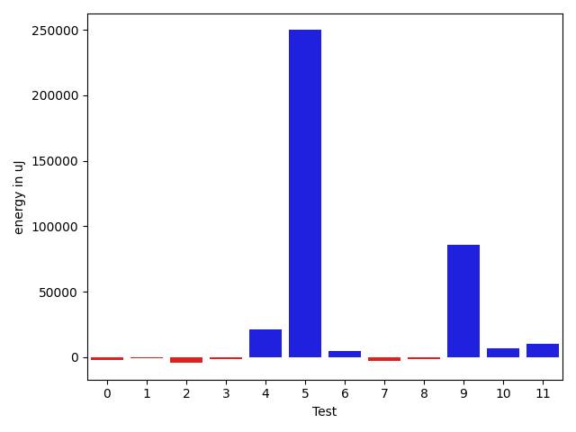

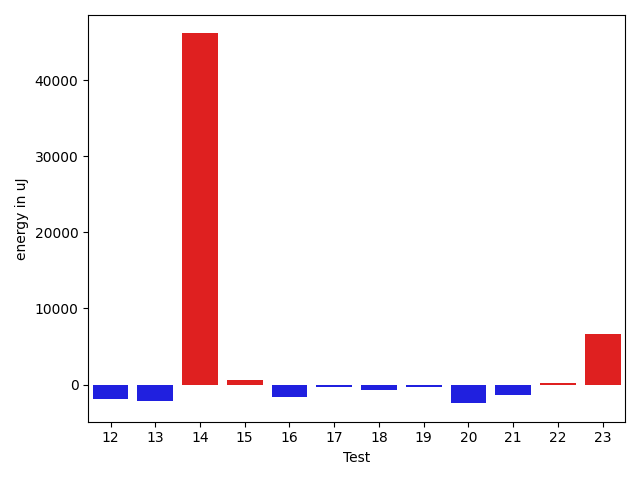

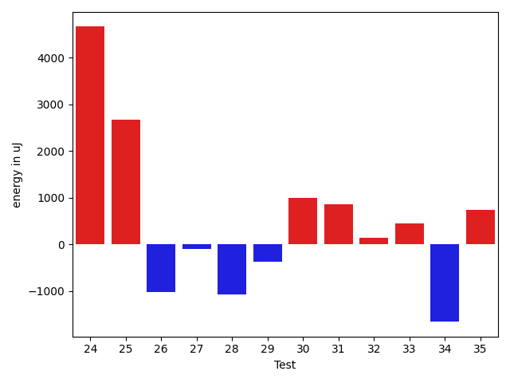

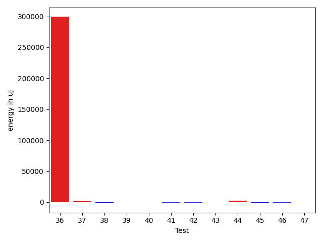

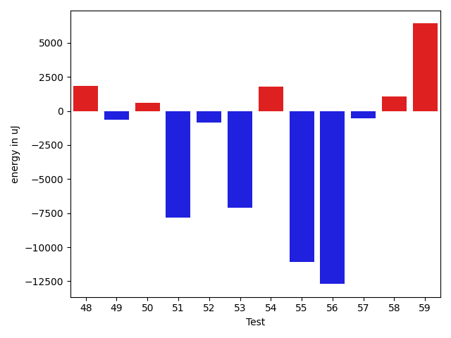

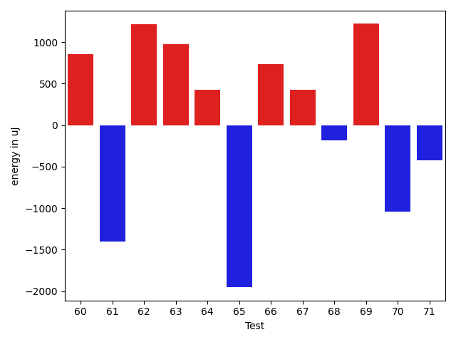

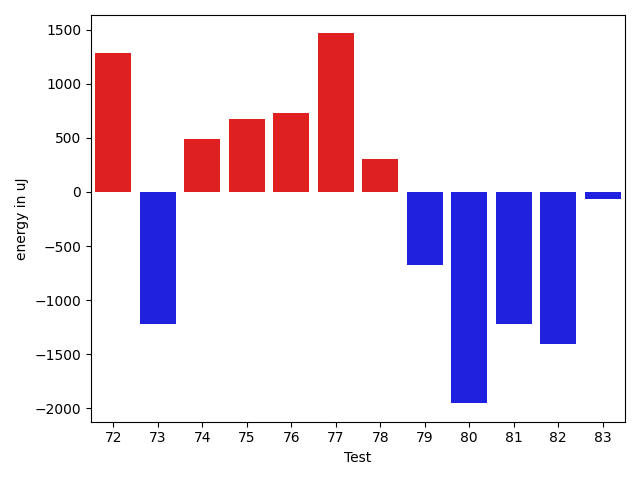

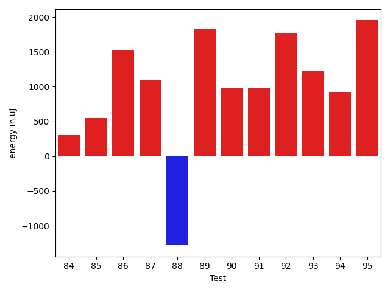

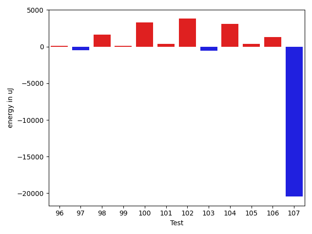

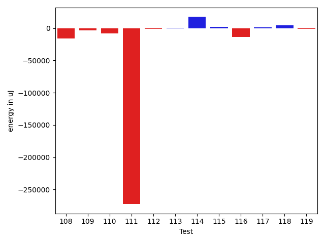

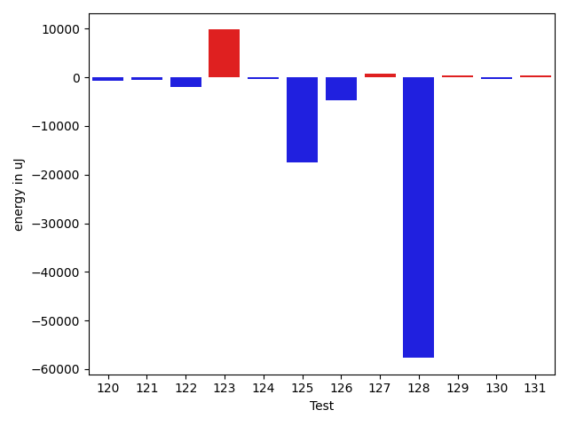

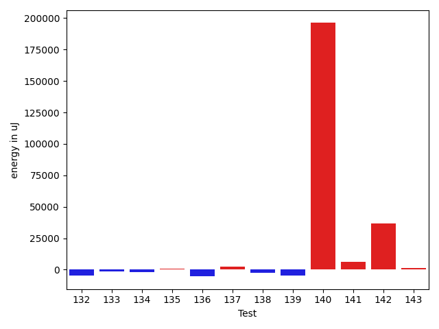

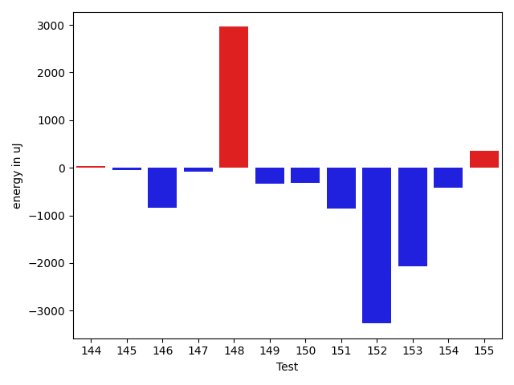

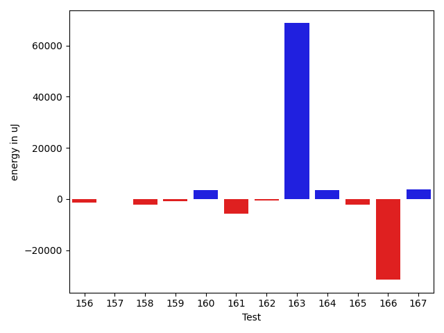

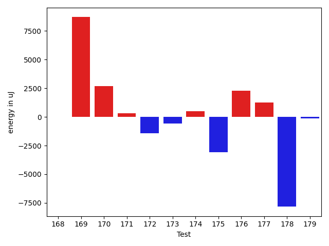

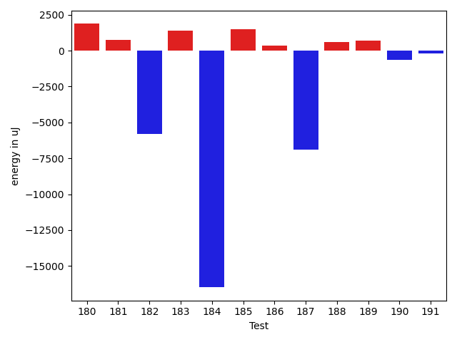

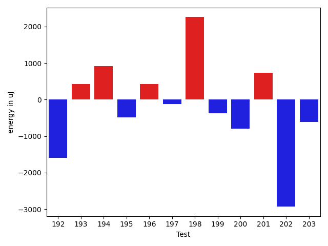

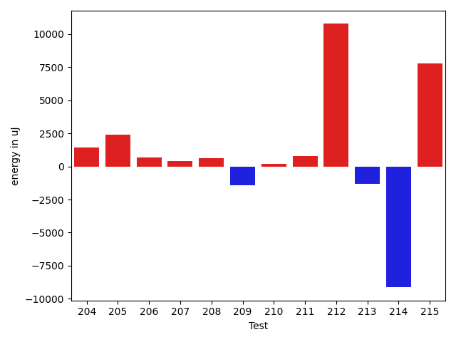

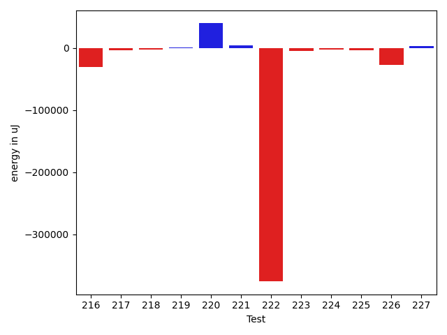

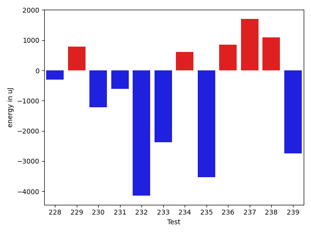

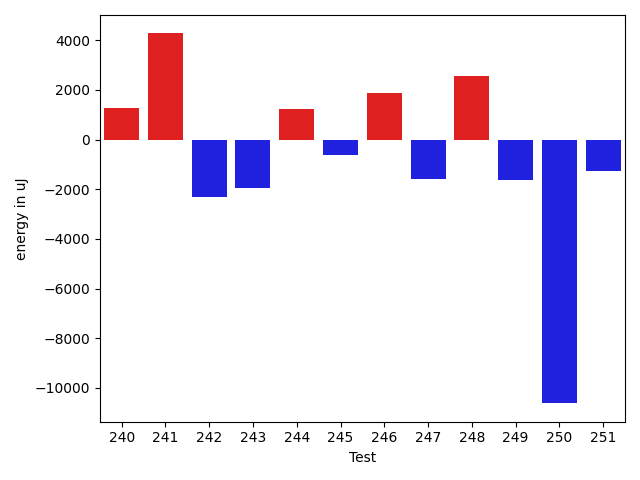

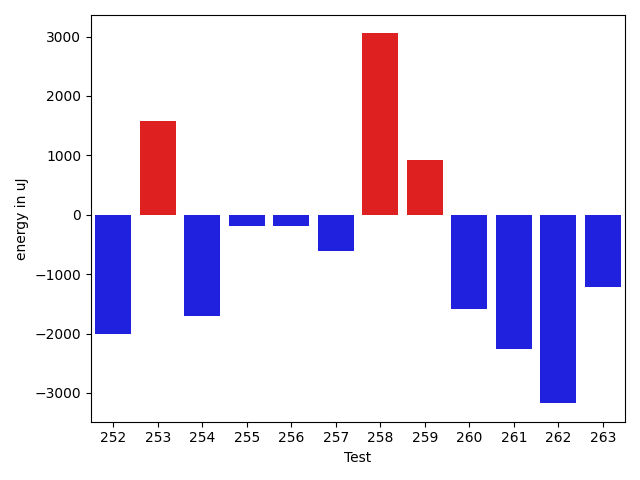

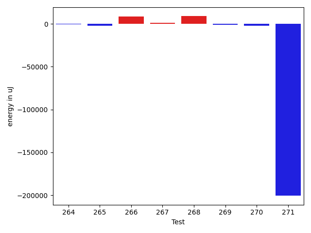

| ID | EnergyV1 | EnergyV2 | DeltaEnergy | σV1 | σV2 |
| --- | --- | --- | --- | --- | --- |
| 0 | 40527.2 | 38114.41176470588 | -2412.788235294116 | 4802.77031097678 | 4459.2774943511085 |
| 1 | 79781.31182795699 | 138980.6888888889 | 59199.3770609319 | 210804.83211555745 | 352003.45826595527 |
| 2 | 35911.3125 | 38460.26666666667 | 2548.95416666667 | 3503.4947145448573 | 3515.327456850768 |
| 3 | 38057.692307692305 | 38121.72727272727 | 64.03496503496717 | 3695.146616943644 | 4269.17882440063 |
| 4 | 37509.333333333336 | 35744.454545454544 | -1764.8787878787916 | 5390.201923655344 | 4498.800978920259 |
| 5 | 39090.291666666664 | 37668.26315789474 | -1422.028508771924 | 3943.6934410013696 | 4559.713135507139 |
| 6 | 37331.0 | 37207.92307692308 | -123.07692307692196 | 4397.343372633311 | 6016.262901650421 |
| 7 | 39497.58064516129 | 37562.26315789474 | -1935.3174872665477 | 3994.3948370765875 | 4988.79638307684 |
| 8 | 40591.81176470588 | 41398.25882352941 | 806.4470588235272 | 7148.011321124248 | 9274.009917858604 |
| 9 | 41974.67164179104 | 41604.92857142857 | -369.74307036247046 | 8957.671994654784 | 9648.059632191673 |
| 10 | 38792.5 | 38882.35 | 89.84999999999854 | 4904.01330678842 | 4340.39805519033 |
| 11 | 37877.208333333336 | 37023.22222222222 | -853.9861111111168 | 4606.2933035428705 | 4795.155126933646 |
| 12 | 40576.86440677966 | 38638.75362318841 | -1938.1107835912553 | 9312.778253301956 | 5897.649975130225 |
| 13 | 38388.13636363636 | 36248.85 | -2139.286363636362 | 4615.725583613387 | 3720.7004888192764 |
| 14 | 157193.08695652173 | 203321.54285714286 | 46128.455900621135 | 385894.9456067267 | 460581.13532767916 |
| 15 | 45245.61111111111 | 45875.81578947369 | 630.2046783625774 | 19229.02157226267 | 20933.92632075762 |
| 16 | 39367.52173913043 | 37738.6875 | -1628.8342391304323 | 5110.579460632664 | 2860.867257466475 |
| 17 | 38482.67857142857 | 38168.0 | -314.67857142857247 | 4537.427512632897 | 4052.9422455981094 |
| 18 | 39689.83720930233 | 38988.34042553192 | -701.4967837704098 | 5478.17680556534 | 6539.133013248891 |
| 19 | 39020.967741935485 | 38701.16 | -319.8077419354813 | 4184.948016664631 | 4534.649496311705 |
| 20 | 56197.71186440678 | 53738.907692307694 | -2458.8041720990877 | 36303.35896680787 | 32243.823438927182 |
| 21 | 38228.25 | 36899.608695652176 | -1328.6413043478242 | 3996.2795119335683 | 3426.5918387648103 |
| 22 | 37658.681818181816 | 37855.545454545456 | 196.86363636363967 | 4455.298443083488 | 4440.439154441542 |
| 23 | 59318.555555555555 | 65939.95959595959 | 6621.404040404035 | 27823.892953999097 | 34210.620793389215 |
| 24 | 100586.70967741935 | 105249.89552238806 | 4663.185844968713 | 236667.02644885183 | 259592.66418366708 |
| 25 | 44773.01818181818 | 47448.42857142857 | 2675.4103896103916 | 18483.27136972626 | 26418.79602697176 |
| 26 | 48752.19191919192 | 47734.26262626263 | -1017.9292929292933 | 16996.176811138743 | 18960.592172904016 |
| 27 | 38947.91836734694 | 38848.19607843137 | -99.72228891556733 | 3667.123962535411 | 4206.376960999078 |
| 28 | 37321.78 | 36246.84782608696 | -1074.9321739130392 | 3352.1042483192555 | 3819.4658741504186 |
| 29 | 40542.552083333336 | 40166.13684210526 | -376.4152412280746 | 9376.19833882336 | 11341.782221048652 |
| 30 | 36475.41935483871 | 37465.78947368421 | 990.3701188455016 | 3772.880723422592 | 3372.1194347167566 |
| 31 | 36961.62 | 37824.28571428572 | 862.6657142857148 | 3564.7942038215892 | 3686.5229843696497 |
| 32 | 36702.07272727273 | 36838.6037735849 | 136.53104631217138 | 4490.494691738198 | 4656.343444911135 |
| 33 | 37430.65306122449 | 37883.056603773584 | 452.4035425490947 | 4583.287050333629 | 4275.745030147817 |
| 34 | 117851.19191919192 | 116194.0101010101 | -1657.181818181809 | 21440.394693655544 | 20246.949361680232 |
| 35 | 36915.55172413793 | 37663.07407407407 | 747.5223499361455 | 3844.925841948481 | 3805.852763018072 |
| 36 | 310726.7272727273 | 343102.43434343435 | 32375.707070707052 | 250575.26890736117 | 260546.25042740692 |
| 37 | 35981.619047619046 | 37764.565217391304 | 1782.9461697722581 | 3226.299922234233 | 2661.788117953254 |
| 38 | 37256.42622950819 | 36567.47368421053 | -688.9525452976668 | 3907.315385689571 | 4721.505993409169 |
| 39 | 39021.5 | 39102.87209302326 | 81.37209302325937 | 8323.85323997476 | 8722.609210387003 |
| 40 | 38395.555555555555 | 37988.769230769234 | -406.7863247863206 | 2654.3385774898084 | 3798.7662130772615 |
| 41 | 36786.38461538462 | 37181.10526315789 | 394.72064777327614 | 4647.766279680222 | 3622.2360288320233 |
| 42 | 37390.47826086957 | 37566.88888888889 | 176.41062801932276 | 3554.0066045492354 | 4246.098770098513 |
| 43 | 36171.72 | 35489.09090909091 | -682.6290909090894 | 4673.857169576324 | 3691.6844752040784 |
| 44 | 36472.80952380953 | 38300.8 | 1827.9904761904763 | 3216.8624113012092 | 2784.449216631541 |
| 45 | 38383.705882352944 | 37192.606060606064 | -1191.0998217468805 | 3873.256955445452 | 4323.85064033938 |
| 46 | 37329.0 | 37195.181818181816 | -133.8181818181838 | 3855.0911065758223 | 4762.837615199613 |
| 47 | 37605.34042553192 | 37700.769230769234 | 95.42880523731583 | 4085.8426317921285 | 3615.508250341026 |
| 48 | 36112.30303030303 | 37968.72972972973 | 1856.4266994266945 | 2981.28265547046 | 4433.404229493304 |
| 49 | 37801.0 | 37151.82608695652 | -649.1739130434798 | 3402.0384738826483 | 4840.482841996994 |
| 50 | 37631.53164556962 | 38211.42857142857 | 579.8969258589495 | 6674.341461537691 | 6457.2818818788455 |
| 51 | 45795.421875 | 37975.362068965514 | -7820.0598060344855 | 24149.119828554754 | 8866.39249560651 |
| 52 | 40179.079545454544 | 39351.72839506173 | -827.3511503928166 | 8048.580568282029 | 7584.145379415358 |
| 53 | 44988.602739726026 | 37874.316666666666 | -7114.28607305936 | 32045.453662861797 | 5107.546320532872 |
| 54 | 50003.444444444445 | 51776.34117647059 | 1772.8967320261436 | 30296.636847538128 | 40638.6305282672 |
| 55 | 78370.25842696629 | 67282.72527472528 | -11087.533152241012 | 84002.94952733963 | 71422.34630256896 |
| 56 | 80273.32323232324 | 67579.27272727272 | -12694.050505050516 | 33648.538995052695 | 31068.767071608454 |
| 57 | 42834.322222222225 | 42283.51685393258 | -550.8053682896425 | 13511.354718513838 | 13181.015900995651 |
| 58 | 40087.72 | 41125.37142857143 | 1037.6514285714293 | 9892.08710375453 | 11298.645457590326 |
| 59 | 72265.47422680413 | 78672.8469387755 | 6407.372711971373 | 36153.552652595215 | 62112.17153902203 |
| 60 | 38247.5875 | 38523.42682926829 | 275.83932926828857 | 6464.102475776801 | 5058.771464738344 |
| 61 | 60275.32530120482 | 38279.207792207795 | -21996.117508997027 | 71996.52202277628 | 6117.297411370486 |
| 62 | 48916.166666666664 | 52999.25316455696 | 4083.0864978902973 | 37332.83406660208 | 44420.22025474673 |
| 63 | 38127.83783783784 | 38751.281690140844 | 623.443852303004 | 6732.693830625798 | 7013.521235287861 |
| 64 | 38239.96341463415 | 38280.844155844155 | 40.88074121000682 | 7367.759732392965 | 7056.232382104352 |
| 65 | 38463.87804878049 | 37050.57407407407 | -1413.3039747064176 | 3926.824821691165 | 4618.64422788466 |
| 66 | 37594.86956521739 | 38113.6037735849 | 518.7342083675103 | 3797.2955972049353 | 4573.112924927254 |
| 67 | 36796.36170212766 | 38048.30612244898 | 1251.9444203213206 | 4665.490224980043 | 8711.712709614596 |
| 68 | 39432.018867924526 | 43067.620689655174 | 3635.601821730648 | 6369.658074086557 | 16915.909211222748 |
| 69 | 36340.62962962963 | 37200.82142857143 | 860.1917989417998 | 3502.827917323565 | 4587.946740050588 |
| 70 | 38212.53846153846 | 38099.942307692305 | -112.59615384615608 | 3626.835664987925 | 5122.0884690849625 |
| 71 | 82378.12121212122 | 80269.07070707071 | -2109.0505050505017 | 19870.103381445908 | 20985.87502562046 |
| 72 | 36428.403846153844 | 38029.71428571428 | 1601.3104395604387 | 4234.298103943808 | 6607.497210574901 |
| 73 | 40632.61818181818 | 43460.43396226415 | 2827.8157804459697 | 13727.705288597163 | 28212.98549177039 |
| 74 | 37126.94736842105 | 37007.09302325582 | -119.85434516523674 | 3975.6924120365065 | 4595.893287232173 |
| 75 | 65640.8253968254 | 89873.50877192983 | 24232.683375104432 | 160832.03929650056 | 211724.76333658778 |
| 76 | 39163.05633802817 | 41794.10810810811 | 2631.051770079939 | 8497.49173577962 | 12038.935411953064 |
| 77 | 38335.833333333336 | 41292.931818181816 | 2957.0984848484804 | 8321.281557424705 | 10233.842636516725 |
| 78 | 36603.90625 | 37958.21212121212 | 1354.30587121212 | 3989.5405465367735 | 3700.9385685712114 |
| 79 | 37776.057692307695 | 37192.34482758621 | -583.712864721485 | 6174.958135683255 | 8223.573955722164 |
| 80 | 37080.87804878049 | 36935.822222222225 | -145.05582655826584 | 4930.802166941819 | 4294.500251815048 |
| 81 | 37167.325 | 37313.442307692305 | 146.1173076923078 | 3991.4141002124798 | 4762.644293850688 |
| 82 | 37758.6 | 37587.31707317073 | -171.28292682926985 | 4437.419033627542 | 4637.041800066307 |
| 83 | 37458.583333333336 | 37083.77777777778 | -374.80555555555475 | 4832.718859647113 | 4278.795534773199 |
| 84 | 37614.40425531915 | 38021.28846153846 | 406.88420621931436 | 4269.360860331037 | 3757.006082674272 |
| 85 | 41880.85294117647 | 38105.575 | -3775.2779411764714 | 22069.802749901282 | 4014.5217454106537 |
| 86 | 38334.95918367347 | 39081.645833333336 | 746.6866496598668 | 3173.1679075905517 | 3645.9524560896252 |
| 87 | 43984.53947368421 | 44303.514285714286 | 318.9748120300719 | 15084.667488825926 | 13379.22027809528 |
| 88 | 38304.0 | 37969.5 | -334.5 | 4303.161208109536 | 4230.8122278284645 |
| 89 | 44838.0 | 44898.470588235294 | 60.47058823529369 | 25773.866632695997 | 24073.440554509194 |
| 90 | 38145.7868852459 | 38372.89473684211 | 227.10785159620718 | 3844.178554367733 | 4025.79531505816 |
| 91 | 40331.796875 | 43224.54838709677 | 2892.751512096773 | 10187.965940540596 | 13559.577499219366 |
| 92 | 53384.16216216216 | 53051.17741935484 | -332.984742807319 | 63801.55899730992 | 75537.75774801339 |
| 93 | 40378.421875 | 42570.44262295082 | 2192.020747950817 | 9005.792914849113 | 12144.269814553489 |
| 94 | 39023.463768115944 | 40615.76056338028 | 1592.2967952643376 | 6070.507563192243 | 9121.538072157844 |
| 95 | 36802.6976744186 | 38418.6037735849 | 1615.906099166299 | 3607.8795198190146 | 3924.766467464873 |
| 96 | 37408.90909090909 | 37551.15217391304 | 142.24308300395205 | 5593.655666825431 | 3970.144154470702 |
| 97 | 38474.1 | 37965.44736842105 | -508.65263157894515 | 3895.742128272867 | 4319.941670520981 |
| 98 | 37184.291666666664 | 38792.42307692308 | 1608.1314102564138 | 4383.9728935746425 | 3895.246898199009 |
| 99 | 37151.21052631579 | 37280.875 | 129.6644736842136 | 3260.628815346535 | 4119.331224164306 |
| 100 | 35517.52 | 38792.58064516129 | 3275.060645161291 | 3347.9695114501865 | 3875.6976293906237 |
| 101 | 40151.96721311475 | 40519.92 | 367.9527868852456 | 8459.915170227752 | 10814.628734894231 |
| 102 | 48391.063829787236 | 52216.683673469386 | 3825.6198436821505 | 20654.53812109885 | 27332.891277426377 |
| 103 | 37511.65625 | 36980.22857142857 | -531.4276785714319 | 4735.427637825958 | 3775.4289526259827 |
| 104 | 40094.5 | 43178.74603174603 | 3084.246031746028 | 7591.730933814012 | 14385.05623733787 |
| 105 | 38775.732142857145 | 39163.46875 | 387.73660714285506 | 3729.2031152353616 | 3530.0217508569885 |
| 106 | 57561.75294117647 | 58876.03191489362 | 1314.278973717148 | 35843.04106908533 | 37823.908060191105 |
| 107 | 59047.38383838384 | 38580.22857142857 | -20467.15526695527 | 21075.90011531773 | 6241.965526456343 |
| 108 | 36502.9375 | 37559.375 | 1056.4375 | 3788.1674901716992 | 3565.499734872378 |
| 109 | 38402.934782608696 | 39082.3023255814 | 679.3675429727009 | 3887.752448966156 | 3462.029257966756 |
| 110 | 37984.07843137255 | 38584.77777777778 | 600.6993464052284 | 6862.74293999966 | 3236.6202460721197 |
| 111 | 38957.59154929577 | 40706.67647058824 | 1749.0849212924659 | 4167.322569294138 | 8698.888628205154 |
| 112 | 38100.9375 | 36917.42857142857 | -1183.5089285714275 | 3361.3851584716904 | 4363.3196577117915 |
| 113 | 38340.41379310345 | 51127.348837209305 | 12786.935044105856 | 3522.042887961096 | 56829.37607532631 |
| 114 | 39550.89189189189 | 39820.41935483871 | 269.52746294681856 | 3889.418060992866 | 10124.084094851514 |
| 115 | 38359.260869565216 | 38253.791666666664 | -105.46920289855188 | 5205.183931239512 | 3756.299364391842 |
| 116 | 39675.24 | 44970.65555555555 | 5295.415555555555 | 6814.86949415761 | 16183.453744942437 |
| 117 | 37282.63157894737 | 38709.05263157895 | 1426.42105263158 | 3339.6288670343424 | 4009.998824959589 |
| 118 | 49912.065217391304 | 46316.91071428572 | -3595.1545031055866 | 27636.33009157564 | 25071.613149192104 |
| 119 | 38869.166666666664 | 40481.5 | 1612.3333333333358 | 3891.9840662857578 | 4084.3958243539523 |
| 120 | 43487.41891891892 | 42714.85526315789 | -772.5636557610269 | 15140.298512718851 | 16050.583092952982 |
| 121 | 37814.3 | 37331.78571428572 | -482.5142857142855 | 4089.6995989925713 | 3591.795893393153 |
| 122 | 38737.76 | 36686.0 | -2051.760000000002 | 3742.2388729743057 | 3914.370373298219 |
| 123 | 92329.8947368421 | 102136.34177215189 | 9806.447035309786 | 241407.4231712841 | 299445.20258198195 |
| 124 | 38261.882352941175 | 38017.944444444445 | -243.9379084967295 | 3508.0358989771057 | 4578.168404652458 |
| 125 | 103886.45454545454 | 86410.67676767676 | -17475.77777777778 | 77471.31182303076 | 63270.28303931727 |
| 126 | 43470.65671641791 | 38830.05970149254 | -4640.59701492537 | 17202.761438820293 | 7639.972848823751 |
| 127 | 41009.24137931035 | 41709.84375 | 700.6023706896522 | 10726.210328475829 | 10509.00050733113 |
| 128 | 142674.26315789475 | 84972.25 | -57702.01315789475 | 300276.8596522465 | 178915.90526749572 |
| 129 | 38862.72727272727 | 39204.81481481482 | 342.08754208754544 | 4678.495185243553 | 3538.7339861828696 |
| 130 | 38502.765957446805 | 38264.490909090906 | -238.27504835589934 | 4105.69090364678 | 4334.828552225576 |
| 131 | 37666.40425531915 | 38121.3023255814 | 454.89807026225026 | 3921.7753668545315 | 4140.679651743984 |
| 132 | 46567.22448979592 | 42119.943396226416 | -4447.2810935695015 | 19439.544369046693 | 12697.09903640167 |
| 133 | 48252.18421052631 | 46754.301204819276 | -1497.8830057070372 | 22021.8820773617 | 20079.241460577323 |
| 134 | 56066.958333333336 | 53859.15517241379 | -2207.803160919546 | 27393.32022437095 | 34729.03749115614 |
| 135 | 37643.968253968254 | 38465.40677966102 | 821.4385256927635 | 3923.8186128984985 | 4255.5390668850105 |
| 136 | 87018.9587628866 | 81661.06060606061 | -5357.8981568259915 | 28092.62042803703 | 23978.628460881868 |
| 137 | 42423.987341772154 | 44807.90243902439 | 2383.915097252233 | 12664.161107003636 | 20995.529496055828 |
| 138 | 40424.89230769231 | 37995.74603174603 | -2429.146275946281 | 9660.685542043511 | 4179.428160050599 |
| 139 | 46660.24137931035 | 42104.149253731346 | -4556.092125579002 | 20815.21519210071 | 9635.053707575924 |
| 140 | 79745.85294117648 | 275886.26470588235 | 196140.41176470587 | 237931.94704395084 | 616555.6072115384 |
| 141 | 46802.35135135135 | 53093.348837209305 | 6290.997485857952 | 24005.32208920101 | 34474.080868995385 |
| 142 | 113161.88888888889 | 150126.0253164557 | 36964.1364275668 | 179859.7041764621 | 282675.088797067 |
| 143 | 37306.346153846156 | 38365.794117647056 | 1059.4479638008997 | 3851.9165553537478 | 4422.064102678826 |
| 144 | 38027.354166666664 | 38066.21428571428 | 38.860119047618355 | 4616.344172654299 | 4025.680651030535 |
| 145 | 37532.93939393939 | 37492.65625 | -40.283143939392176 | 4050.519943724352 | 3729.662045760438 |
| 146 | 38126.16071428572 | 37291.04081632653 | -835.1198979591863 | 3841.3015966354133 | 3986.860254913831 |
| 147 | 37778.75806451613 | 37704.854838709674 | -73.90322580645443 | 3646.011911777313 | 3922.261361587932 |
| 148 | 41887.58064516129 | 44846.77142857143 | 2959.190783410144 | 11005.70332724662 | 17763.742974442095 |
| 149 | 37374.653846153844 | 37038.354838709674 | -336.29900744416955 | 4512.068798424507 | 3641.046637441626 |
| 150 | 37523.70175438596 | 37199.05882352941 | -324.64293085654936 | 3807.477748560902 | 3989.0288090808576 |
| 151 | 38277.379310344826 | 37423.769230769234 | -853.610079575592 | 3208.4570081840025 | 3734.934015560612 |
| 152 | 39714.92307692308 | 36446.03333333333 | -3268.889743589745 | 3997.015443505479 | 3876.8133175185117 |
| 153 | 38688.5 | 36614.5 | -2074.0 | 3622.9641639593033 | 3622.561973244902 |
| 154 | 38141.52173913043 | 37728.55882352941 | -412.96291560101963 | 3864.1089176921864 | 4019.526670928369 |
| 155 | 38803.27027027027 | 39165.805555555555 | 362.53528528528113 | 4230.270949399383 | 4039.2830553305184 |
| 156 | 58982.703125 | 39972.617647058825 | -19010.085477941175 | 48286.58548049334 | 5784.61048571581 |
| 157 | 38194.892857142855 | 104099.92105263157 | 65905.02819548872 | 5081.630737549328 | 250082.37811899433 |
| 158 | 38514.47727272727 | 41750.21153846154 | 3235.734265734267 | 4447.049064924639 | 13837.869878784612 |
| 159 | 39755.86111111111 | 39170.545454545456 | -585.3156565656536 | 4297.338369740415 | 3927.2028644880284 |
| 160 | 40519.583333333336 | 38734.5 | -1785.0833333333358 | 7749.865254652999 | 4544.0857567046105 |
| 161 | 40862.46031746032 | 40329.48 | -532.9803174603148 | 7460.86462248793 | 5198.482121696678 |
| 162 | 43961.065217391304 | 41379.83076923077 | -2581.2344481605323 | 13704.526563213838 | 8861.399232399832 |
| 163 | 39178.4 | 40849.903846153844 | 1671.5038461538425 | 5310.820790926138 | 9235.112090152319 |
| 164 | 47780.56 | 48128.90909090909 | 348.3490909090906 | 17888.416068685343 | 18670.778717044086 |
| 165 | 38261.97727272727 | 38114.56363636364 | -147.4136363636353 | 5021.049308518527 | 3686.348919329439 |
| 166 | 173854.8282828283 | 194590.0101010101 | 20735.181818181794 | 62756.689839546016 | 170948.89166881976 |
| 167 | 38287.09259259259 | 38069.13725490196 | -217.9553376906333 | 4226.963997903787 | 3957.505656392266 |
| 168 | 38152.75806451613 | 38143.04761904762 | -9.710445468510443 | 5407.233517468519 | 5681.705764518068 |
| 169 | 40788.77142857143 | 49478.192307692305 | 8689.420879120873 | 7627.032956476829 | 32987.39878524622 |
| 170 | 43458.46153846154 | 46123.93939393939 | 2665.477855477853 | 26855.1680628593 | 28230.277543413304 |
| 171 | 37076.38461538462 | 37394.07407407407 | 317.68945868945593 | 3650.6568331752937 | 4088.422895480702 |
| 172 | 38750.05882352941 | 37342.5 | -1407.5588235294126 | 3648.2412599302475 | 4029.5111676231895 |
| 173 | 38310.05 | 37733.45 | -576.6000000000058 | 4357.600778811661 | 4159.292788143195 |
| 174 | 37280.8125 | 37770.5 | 489.6875 | 4446.51580198966 | 4121.770928051841 |
| 175 | 47779.4 | 44695.166666666664 | -3084.233333333337 | 21356.582433526204 | 16023.910993662827 |
| 176 | 37881.828571428574 | 40155.632352941175 | 2273.803781512601 | 4532.094797808904 | 8113.270795258136 |
| 177 | 38103.28571428572 | 39359.90625 | 1256.6205357142826 | 4523.306367005878 | 7335.148255400904 |
| 178 | 119432.04040404041 | 111606.50505050505 | -7825.535353535364 | 243443.81516232088 | 172878.9269933476 |
| 179 | 40409.38888888889 | 40269.60294117647 | -139.78594771242206 | 10473.679221367189 | 8494.987607129598 |
| 180 | 50994.12280701754 | 52855.31481481482 | 1861.1920077972754 | 27166.972036860956 | 35944.039526393884 |
| 181 | 38941.94594594595 | 39697.85294117647 | 755.9069952305217 | 3505.870720747083 | 3036.302628995385 |
| 182 | 83378.15476190476 | 77575.4705882353 | -5802.684173669462 | 124648.42095312319 | 109904.65199302511 |
| 183 | 37839.357142857145 | 39253.166666666664 | 1413.8095238095193 | 4132.4441679253705 | 3558.634003690492 |
| 184 | 133119.80808080808 | 116637.82828282828 | -16481.979797979802 | 358194.4924213709 | 270183.24849612726 |
| 185 | 41102.96296296296 | 42600.0875 | 1497.124537037038 | 10298.805388525749 | 11202.505150851026 |
| 186 | 38074.9649122807 | 38406.70212765958 | 331.7372153788747 | 3699.8767260873087 | 4822.5035385531 |
| 187 | 49532.757575757576 | 42621.41379310345 | -6911.343782654127 | 26253.15681569962 | 11646.270051163907 |
| 188 | 38212.4 | 38819.52173913043 | 607.1217391304308 | 3701.8336996683142 | 3735.2870836595002 |
| 189 | 37640.5 | 38310.60975609756 | 670.1097560975613 | 4185.624551529155 | 4066.9334338081767 |
| 190 | 45300.0 | 44633.98947368421 | -666.0105263157893 | 16748.69733740508 | 14687.811746654172 |
| 191 | 38661.62903225807 | 38471.469696969696 | -190.15933528837195 | 4192.79213010303 | 3868.1087157628485 |
| 192 | 38808.13888888889 | 38456.57142857143 | -351.567460317463 | 3966.1599967221146 | 3536.6839940075774 |
| 193 | 36504.041666666664 | 37807.17391304348 | 1303.1322463768156 | 4577.209625590379 | 3239.329394531527 |
| 194 | 38733.47826086957 | 40729.275862068964 | 1995.797601199396 | 3415.7585301780236 | 3790.0506401543767 |
| 195 | 39879.634146341465 | 37311.0 | -2568.6341463414647 | 9450.971145753138 | 4001.74473361851 |
| 196 | 52283.64705882353 | 45217.72727272727 | -7065.9197860962595 | 35908.88333143661 | 24371.949094875352 |
| 197 | 38331.72222222222 | 38268.94285714286 | -62.779365079361014 | 3227.8668016983247 | 3818.103425545629 |
| 198 | 44813.27777777778 | 47325.46153846154 | 2512.183760683758 | 23105.89488229634 | 20545.923243817215 |
| 199 | 38203.86666666667 | 38647.4 | 443.53333333333285 | 4356.505814934206 | 3254.495850358393 |
| 200 | 93048.0 | 40604.42105263158 | -52443.57894736842 | 227932.71285469315 | 4562.816850607568 |
| 201 | 37538.88888888889 | 38410.705882352944 | 871.8169934640537 | 3707.4892705654624 | 3869.4318896691966 |
| 202 | 39375.208333333336 | 38354.24 | -1020.9683333333378 | 3499.994214032916 | 4177.013730214446 |
| 203 | 126147.2 | 82346.39743589744 | -43800.80256410256 | 305845.6076771147 | 171912.63974698875 |
| 204 | 37655.45 | 39093.74418604651 | 1438.2941860465144 | 4831.053709854611 | 4113.643256474237 |
| 205 | 37448.85365853659 | 39875.19512195122 | 2426.341463414632 | 4635.763086398863 | 3597.26480930566 |
| 206 | 38026.47222222222 | 38710.57894736842 | 684.1067251462009 | 5446.311016979552 | 3873.3313529935836 |
| 207 | 38083.42307692308 | 38499.666666666664 | 416.2435897435862 | 4699.347861246911 | 3359.4422707304216 |
| 208 | 40392.225 | 40995.354430379746 | 603.1294303797476 | 8547.098927377347 | 7871.0296481769365 |
| 209 | 42872.01388888889 | 41476.4358974359 | -1395.5779914529921 | 12225.401191432278 | 9578.56823462557 |
| 210 | 39527.89552238806 | 39741.430555555555 | 213.53503316749266 | 7651.955401509888 | 5869.452269132265 |
| 211 | 46887.83098591549 | 47669.16 | 781.3290140845129 | 24731.374242348447 | 25212.62956696637 |
| 212 | 40571.03125 | 51350.666666666664 | 10779.635416666664 | 5757.369855695692 | 63125.65924804272 |
| 213 | 42310.087719298244 | 41018.2 | -1291.8877192982472 | 11111.767486611472 | 9165.713071854012 |
| 214 | 73404.72727272728 | 64270.46464646464 | -9134.262626262636 | 35343.09621834733 | 25867.086528267373 |
| 215 | 112118.3870967742 | 119885.64912280702 | 7767.262026032826 | 313844.6753403075 | 316489.4078323196 |
| 216 | 45066.55714285714 | 43124.6835443038 | -1941.8735985533422 | 18281.025113985354 | 13628.788447452893 |
| 217 | 39559.357142857145 | 39754.11111111111 | 194.75396825396456 | 4066.101987462806 | 2448.1278309237064 |
| 218 | 39553.94736842105 | 39413.3 | -140.6473684210505 | 4266.172023497415 | 4164.794053731829 |
| 219 | 39834.056603773584 | 38020.979166666664 | -1813.0774371069201 | 3570.7418467901957 | 4122.466886311234 |
| 220 | 72124.69565217392 | 83150.0 | 11025.30434782608 | 105404.86156490158 | 115582.60940865752 |
| 221 | 38189.13461538462 | 39269.735849056604 | 1080.6012336719868 | 3996.183496734229 | 3947.9953315285784 |
| 222 | 40205.480769230766 | 38201.71428571428 | -2003.7664835164833 | 4052.129646581795 | 4101.002630019709 |
| 223 | 39738.41509433962 | 38128.096153846156 | -1610.3189404934674 | 4799.33683875675 | 3540.297212966597 |
| 224 | 141268.29292929292 | 127844.82828282828 | -13423.464646464636 | 209781.9623646434 | 172327.0022724908 |
| 225 | 39261.77777777778 | 39723.02222222222 | 461.2444444444409 | 3780.4649384192526 | 4424.31286561422 |
| 226 | 37517.692307692305 | 35252.666666666664 | -2265.0256410256407 | 3206.051834712581 | 3961.640639376009 |
| 227 | 51435.16161616162 | 54302.666666666664 | 2867.505050505046 | 21717.397682390318 | 22319.27066030789 |
| 228 | 42644.875 | 43269.38181818182 | 624.5068181818206 | 11997.073500716631 | 13107.319424297957 |
| 229 | 46733.5 | 57980.791666666664 | 11247.291666666664 | 14603.892546945395 | 33655.017746218226 |
| 230 | 40072.181818181816 | 38578.42857142857 | -1493.7532467532437 | 3780.8901505569443 | 4168.211122194229 |
| 231 | 38998.0 | 38477.045454545456 | -520.9545454545441 | 3567.7742938370843 | 3848.08275139325 |
| 232 | 40591.045454545456 | 36914.52380952381 | -3676.5216450216467 | 3124.94687194508 | 3895.578099027612 |
| 233 | 40103.933333333334 | 38183.666666666664 | -1920.26666666667 | 3305.6880568028328 | 4830.090815801385 |
| 234 | 37947.26666666667 | 38429.63157894737 | 482.36491228069644 | 3155.2958544150642 | 3258.0900154041865 |
| 235 | 39615.0 | 36121.1875 | -3493.8125 | 5037.288472769327 | 5298.527982123313 |
| 236 | 38468.88888888889 | 40466.28571428572 | 1997.396825396827 | 4117.227490663657 | 3546.882281436381 |
| 237 | 38707.27272727273 | 38724.0 | 16.727272727272066 | 2186.2783275740153 | 4236.307654721803 |
| 238 | 36816.3 | 37343.083333333336 | 526.7833333333328 | 3616.3512840983794 | 3301.718781138427 |
| 239 | 174632.19191919192 | 138460.65656565657 | -36171.53535353535 | 319052.71290416666 | 238789.5679065423 |
| 240 | 36879.72 | 38910.793103448275 | 2031.0731034482742 | 4304.366160260997 | 4074.2931722871317 |
| 241 | 36156.5 | 39187.45 | 3030.949999999997 | 3663.613641838706 | 4397.908337778312 |
| 242 | 52945.9375 | 47172.606060606064 | -5773.331439393936 | 35989.9613824271 | 25052.92478653866 |
| 243 | 60031.617647058825 | 55984.8 | -4046.8176470588223 | 45096.77528774985 | 42319.38233062616 |
| 244 | 37890.8064516129 | 39086.8 | 1195.9935483871013 | 4163.369443591254 | 3217.104157468328 |
| 245 | 38940.40476190476 | 40386.48717948718 | 1446.0824175824164 | 5628.610206789712 | 10278.265180546301 |
| 246 | 38060.58823529412 | 37740.066666666666 | -320.52156862745323 | 4574.548258749304 | 4410.30704096161 |
| 247 | 39081.11538461538 | 37573.565217391304 | -1507.550167224079 | 4086.618964817918 | 4173.500249515173 |
| 248 | 356916.64646464644 | 358091.0808080808 | 1174.4343434343464 | 40242.775281908245 | 43467.365298735014 |
| 249 | 53821.080808080806 | 54705.79797979798 | 884.7171717171732 | 18917.652073480687 | 19981.911742585613 |
| 250 | 210966.58585858587 | 208424.67676767678 | -2541.9090909090883 | 76617.439242914 | 76577.4746286503 |
| 251 | 79655.73958333333 | 76295.64516129032 | -3360.09442204301 | 124498.25725756871 | 127553.12217021079 |
| 252 | 54178.85567010309 | 58347.489583333336 | 4168.6339132302455 | 40050.56615067355 | 72241.4227659581 |
| 253 | 37764.045454545456 | 37969.27272727273 | 205.22727272727207 | 4692.881567547256 | 5062.332602680833 |
| 254 | 67221.75 | 56927.85393258427 | -10293.896067415728 | 85266.12514496892 | 63127.906594655964 |
| 255 | 49179.56 | 45827.260273972606 | -3352.2997260273914 | 30309.22420968684 | 21225.880721697027 |
| 256 | 39565.05882352941 | 38444.82352941176 | -1120.2352941176505 | 4187.927459771061 | 3253.3619034378094 |
| 257 | 46651.75 | 41678.7027027027 | -4973.0472972973 | 22769.556355471665 | 12269.068122204311 |
| 258 | 38421.7 | 40328.857142857145 | 1907.1571428571478 | 4743.698895376898 | 3536.401022774079 |
| 259 | 38691.32 | 38823.90909090909 | 132.58909090908855 | 4102.759010422133 | 4060.01453097591 |
| 260 | 199611.5 | 45713.7 | -153897.8 | 436358.40187361406 | 22936.249206441757 |
| 261 | 39898.0 | 38879.26666666667 | -1018.7333333333299 | 4962.675895887122 | 4821.886995311644 |
| 262 | 42507.444444444445 | 40318.8275862069 | -2188.6168582375467 | 11980.086778061192 | 12709.285446337273 |
| 263 | 74030.30555555556 | 78134.91666666667 | 4104.6111111111095 | 202099.9050784344 | 236082.34895092744 |
| 264 | 38526.434782608696 | 38181.04 | -345.3947826086951 | 4715.7060592292055 | 4033.5037818750093 |
| 265 | 39810.782608695656 | 37414.375 | -2396.4076086956557 | 3226.045957198752 | 4819.186677684836 |
| 266 | 51582.954545454544 | 60099.92 | 8516.965454545454 | 44597.524961706724 | 95759.53390345493 |
| 267 | 37960.52631578947 | 39102.944444444445 | 1142.418128654972 | 4446.5203233708025 | 3234.7470873525494 |
| 268 | 86154.18518518518 | 94944.84615384616 | 8790.660968660974 | 235901.6348986471 | 274902.07466515613 |
| 269 | 40161.086956521736 | 38936.64705882353 | -1224.4398976982047 | 4592.580575260999 | 4507.09709551211 |
| 270 | 39444.0 | 37376.846153846156 | -2067.153846153844 | 5343.570591530224 | 5402.14662242497 |
| 271 | 292937.6111111111 | 92259.36842105263 | -200678.24269005848 | 475015.42040386423 | 216079.35617516728 |

## Delta Duration per test method

| ID | DurationV1 | DurationsV2 | DeltaDuration |
| --- | --- | --- | --- |
| 0 | 459773.9 | 429654.4117647059 | -30119.48823529412 |
| 1 | 2212480.8279569894 | 4082000.566666667 | 1869519.7387096775 |
| 2 | 459171.6875 | 391575.3333333333 | -67596.35416666669 |
| 3 | 415732.92307692306 | 449136.2727272727 | 33403.34965034964 |
| 4 | 486137.55555555556 | 425766.9090909091 | -60370.646464646445 |
| 5 | 391589.1666666667 | 355621.7368421053 | -35967.429824561405 |
| 6 | 481686.4210526316 | 457486.46153846156 | -24199.959514170012 |
| 7 | 703439.1290322581 | 677920.1315789474 | -25518.997453310643 |
| 8 | 1188876.3529411764 | 1185116.905882353 | -3759.4470588234253 |
| 9 | 1106335.0895522388 | 1058040.6714285715 | -48294.41812366736 |
| 10 | 645526.4210526316 | 607239.35 | -38287.071052631596 |
| 11 | 553420.75 | 509580.55555555556 | -43840.19444444444 |
| 12 | 989954.3898305085 | 935415.6086956522 | -54538.78113485628 |
| 13 | 418488.0 | 409664.9 | -8823.099999999977 |
| 14 | 3948502.8260869565 | 5209201.542857143 | 1260698.7167701866 |
| 15 | 814203.4166666666 | 882123.2105263158 | 67919.79385964922 |
| 16 | 510958.7826086957 | 445326.5625 | -65632.22010869568 |
| 17 | 506884.14285714284 | 489278.1538461539 | -17605.989010988967 |
| 18 | 837650.9069767442 | 756821.7234042553 | -80829.18357248884 |
| 19 | 458049.5806451613 | 478290.04 | 20240.459354838706 |
| 20 | 1407637.0169491526 | 1344136.3692307693 | -63500.64771838323 |
| 21 | 510740.0416666667 | 521125.82608695654 | 10385.784420289856 |
| 22 | 480804.9090909091 | 448532.8181818182 | -32272.09090909094 |
| 23 | 1756555.3737373736 | 1981342.1717171718 | 224786.79797979817 |
| 24 | 2619156.0 | 2744829.567164179 | 125673.56716417894 |
| 25 | 1036042.3090909091 | 1085981.7777777778 | 49939.46868686867 |
| 26 | 1501688.8383838383 | 1522052.494949495 | 20363.656565656653 |
| 27 | 738494.0612244898 | 790166.3333333334 | 51672.27210884355 |
| 28 | 730677.42 | 714813.7826086957 | -15863.637391304364 |
| 29 | 1268411.28125 | 1256718.0210526315 | -11693.26019736845 |
| 30 | 551553.7419354839 | 537468.0263157894 | -14085.715619694442 |
| 31 | 711040.32 | 691960.9387755102 | -19079.38122448977 |
| 32 | 895758.2181818181 | 917493.4339622641 | 21735.215780445957 |
| 33 | 693754.6326530612 | 692205.8679245283 | -1548.7647285328712 |
| 34 | 3394452.1616161615 | 3373737.474747475 | -20714.686868686695 |
| 35 | 476655.3793103448 | 459742.22222222225 | -16913.157088122563 |
| 36 | 9114361.505050505 | 9769058.575757576 | 654697.0707070716 |
| 37 | 486334.09523809527 | 489495.17391304346 | 3161.078674948192 |
| 38 | 786310.1475409836 | 795561.052631579 | 9250.905090595363 |
| 39 | 1153409.0425531915 | 1191716.6395348837 | 38307.59698169213 |
| 40 | 663721.5555555555 | 661774.5384615385 | -1947.0170940170065 |
| 41 | 721799.3846153846 | 739065.2807017544 | 17265.896086369758 |
| 42 | 423325.26086956525 | 453698.8333333333 | 30373.57246376807 |
| 43 | 474523.32 | 450639.2727272727 | -23884.0472727273 |
| 44 | 379622.0 | 409988.24 | 30366.23999999999 |
| 45 | 632597.5294117647 | 600782.4242424242 | -31815.105169340502 |
| 46 | 454481.52 | 464567.04545454547 | 10085.525454545452 |
| 47 | 743882.6170212766 | 712147.8269230769 | -31734.790098199737 |
| 48 | 679802.303030303 | 724935.1891891892 | 45132.88615888625 |
| 49 | 424742.77777777775 | 412702.652173913 | -12040.125603864726 |
| 50 | 1104145.4936708861 | 1044183.8428571429 | -59961.65081374324 |
| 51 | 1193313.84375 | 855781.551724138 | -337532.292025862 |
| 52 | 1108195.8977272727 | 1031902.024691358 | -76293.87303591473 |
| 53 | 1218600.2328767122 | 915565.8833333333 | -303034.3495433789 |
| 54 | 1543073.87654321 | 1465587.6470588236 | -77486.22948438628 |
| 55 | 2309649.7191011235 | 2071824.5494505495 | -237825.16965057398 |
| 56 | 2429482.4646464647 | 2053442.7373737374 | -376039.7272727273 |
| 57 | 1302349.588888889 | 1223646.6741573033 | -78702.91473158565 |
| 58 | 1096102.4133333333 | 1091487.7714285713 | -4614.641904762015 |
| 59 | 2186560.8659793814 | 2459246.7346938774 | 272685.868714496 |
| 60 | 1087716.9875 | 1015923.2195121951 | -71793.76798780495 |
| 61 | 1740906.9277108433 | 1042665.2337662338 | -698241.6939446095 |
| 62 | 1423891.2916666667 | 1472602.3544303798 | 48711.06276371307 |
| 63 | 1142510.6756756757 | 1050248.8169014084 | -92261.85877426737 |
| 64 | 1154813.3170731708 | 1075711.142857143 | -79102.17421602784 |
| 65 | 682066.8292682926 | 674370.1296296297 | -7696.699638662976 |
| 66 | 738350.7391304348 | 732829.7358490566 | -5521.003281378187 |
| 67 | 742873.3191489362 | 788273.0204081633 | 45399.70125922712 |
| 68 | 889122.320754717 | 1020397.5172413794 | 131275.19648666237 |
| 69 | 431478.3333333333 | 454956.75 | 23478.416666666686 |
| 70 | 768755.6923076923 | 761366.9423076923 | -7388.75 |
| 71 | 2405446.4444444445 | 2384131.121212121 | -21315.323232323397 |
| 72 | 844012.8269230769 | 888958.081632653 | 44945.25470957614 |
| 73 | 816462.8181818182 | 980121.7547169811 | 163658.93653516285 |
| 74 | 703547.947368421 | 718725.1162790698 | 15177.16891064879 |
| 75 | 1593890.7936507936 | 2360930.807017544 | 767040.0133667502 |
| 76 | 1033899.5915492958 | 1087880.5405405406 | 53980.948991244775 |
| 77 | 752722.4047619047 | 859358.0 | 106635.59523809527 |
| 78 | 564700.8125 | 552037.1818181818 | -12663.630681818235 |
| 79 | 878284.6538461539 | 899025.6379310344 | 20740.98408488056 |
| 80 | 645696.5365853659 | 657385.088888889 | 11688.552303523058 |
| 81 | 679050.125 | 663117.25 | -15932.875 |
| 82 | 502312.92 | 481194.0243902439 | -21118.89560975606 |
| 83 | 684481.1666666666 | 678848.1388888889 | -5633.027777777752 |
| 84 | 781823.5319148937 | 674408.2884615385 | -107415.24345335516 |
| 85 | 813518.5 | 638564.175 | -174954.32499999995 |
| 86 | 786504.4693877551 | 758650.0416666666 | -27854.42772108852 |
| 87 | 1245602.5921052631 | 1231075.1285714286 | -14527.463533834554 |
| 88 | 715109.5744680851 | 691494.0714285715 | -23615.5030395136 |
| 89 | 924855.8857142857 | 863995.1176470588 | -60860.76806722686 |
| 90 | 906201.1967213114 | 886984.6666666666 | -19216.530054644798 |
| 91 | 1061411.90625 | 1013280.1290322581 | -48131.77721774194 |
| 92 | 1516231.5945945946 | 1282063.4193548388 | -234168.17523975577 |
| 93 | 1086774.359375 | 1037894.9672131147 | -48879.39216188528 |
| 94 | 993756.6086956522 | 986693.8732394367 | -7062.735456215567 |
| 95 | 773033.8604651163 | 751560.7924528302 | -21473.068012286094 |
| 96 | 733121.5909090909 | 668881.5434782609 | -64240.047430830076 |
| 97 | 721109.54 | 682939.947368421 | -38169.59263157903 |
| 98 | 720876.7083333334 | 734204.7692307692 | 13328.060897435877 |
| 99 | 385853.7894736842 | 426282.4375 | 40428.64802631579 |
| 100 | 594952.56 | 485181.9032258064 | -109770.65677419363 |
| 101 | 935135.2295081967 | 1000953.86 | 65818.63049180328 |
| 102 | 1423021.3829787234 | 1498208.1836734693 | 75186.80069474597 |
| 103 | 520010.96875 | 557393.6571428571 | 37382.68839285709 |
| 104 | 886286.4821428572 | 921701.253968254 | 35414.771825396805 |
| 105 | 752432.5 | 700906.65625 | -51525.84375 |
| 106 | 1708494.1529411764 | 1650718.3085106383 | -57775.84443053813 |
| 107 | 1725256.0505050505 | 1002462.9428571429 | -722793.1076479076 |
| 108 | 418113.4375 | 457597.875 | 39484.4375 |
| 109 | 762091.5652173914 | 719691.6046511628 | -42399.960566228605 |
| 110 | 832855.7647058824 | 856846.7301587302 | 23990.96545284777 |
| 111 | 1020020.0845070423 | 1043569.1029411765 | 23549.018434134196 |
| 112 | 393054.6875 | 422195.5714285714 | 29140.88392857142 |
| 113 | 731283.2931034482 | 1193201.9069767443 | 461918.61387329607 |
| 114 | 521709.1621621622 | 1126570.3548387096 | 604861.1926765474 |
| 115 | 637822.0 | 418743.0833333333 | -219078.9166666667 |
| 116 | 846718.04 | 1391324.7555555555 | 544606.7155555554 |
| 117 | 383257.0 | 465471.15789473685 | 82214.15789473685 |
| 118 | 1247587.608695652 | 1064081.75 | -183505.8586956521 |
| 119 | 552034.75 | 475220.5 | -76814.25 |
| 120 | 1189531.7702702703 | 1114070.8289473683 | -75460.94132290198 |
| 121 | 419776.95 | 374802.9285714286 | -44974.02142857143 |
| 122 | 664764.24 | 636811.6774193548 | -27952.5625806452 |
| 123 | 2551135.4210526315 | 2798119.7088607596 | 246984.28780812817 |
| 124 | 555757.3529411765 | 470590.77777777775 | -85166.57516339875 |
| 125 | 3016282.02020202 | 2546843.404040404 | -469438.61616161605 |
| 126 | 1174417.1940298507 | 1140808.5970149254 | -33608.59701492521 |
| 127 | 946645.7586206896 | 970670.203125 | 24024.444504310377 |
| 128 | 3161731.210526316 | 1931063.5 | -1230667.710526316 |
| 129 | 566333.8636363636 | 529697.1851851852 | -36636.67845117848 |
| 130 | 809654.7659574468 | 802925.5636363636 | -6729.2023210831685 |
| 131 | 754987.1276595745 | 720809.3488372093 | -34177.77882236522 |
| 132 | 1142275.5714285714 | 880517.6603773584 | -261757.91105121293 |
| 133 | 1333295.7894736843 | 1273363.746987952 | -59932.04248573235 |
| 134 | 1461891.5833333333 | 1237893.7068965517 | -223997.8764367816 |
| 135 | 825752.619047619 | 833435.7627118644 | 7683.143664245377 |
| 136 | 2528451.432989691 | 2378718.0606060605 | -149733.37238363037 |
| 137 | 1166049.5443037974 | 1216584.0731707318 | 50534.52886693436 |
| 138 | 1041011.0923076923 | 947446.2063492064 | -93564.88595848589 |
| 139 | 1103525.4655172413 | 925188.8208955224 | -178336.6446217189 |
| 140 | 2050934.6911764706 | 7671426.044117647 | 5620491.352941177 |
| 141 | 1034725.5945945946 | 1250777.3953488371 | 216051.80075424258 |
| 142 | 3125554.4691358022 | 4273068.202531646 | 1147513.7333958438 |
| 143 | 487848.5 | 494953.64705882355 | 7105.147058823553 |
| 144 | 818680.4375 | 802256.125 | -16424.3125 |
| 145 | 539553.8484848485 | 547830.28125 | 8276.43276515149 |
| 146 | 755182.8035714285 | 761578.4489795918 | 6395.645408163313 |
| 147 | 824012.0806451613 | 799730.4677419355 | -24281.612903225818 |
| 148 | 690154.0967741936 | 823970.6857142857 | 133816.58894009213 |
| 149 | 520794.42307692306 | 581057.5161290322 | 60263.09305210918 |
| 150 | 743721.2807017544 | 731119.274509804 | -12602.006191950408 |
| 151 | 495385.3448275862 | 498518.57692307694 | 3133.2320954907336 |
| 152 | 515649.0 | 529469.9333333333 | 13820.933333333349 |
| 153 | 512951.5833333333 | 527322.8928571428 | 14371.309523809527 |
| 154 | 573633.7826086957 | 528979.0588235294 | -44654.72378516628 |
| 155 | 663893.5945945946 | 714907.9444444445 | 51014.34984984994 |
| 156 | 1440042.34375 | 652913.7647058824 | -787128.5790441176 |
| 157 | 622200.8928571428 | 2705792.8684210526 | 2083591.9755639099 |
| 158 | 687663.2954545454 | 963274.9230769231 | 275611.6276223777 |
| 159 | 554588.3055555555 | 553576.2272727273 | -1012.0782828282099 |
| 160 | 1008859.9583333334 | 996774.5142857142 | -12085.444047619123 |
| 161 | 928645.9365079365 | 875578.86 | -53067.076507936465 |
| 162 | 1063586.3043478262 | 947029.323076923 | -116556.98127090314 |
| 163 | 872204.8333333334 | 855178.3846153846 | -17026.448717948748 |
| 164 | 1003280.36 | 920084.9090909091 | -83195.45090909093 |
| 165 | 647929.7954545454 | 702444.0 | 54514.20454545459 |
| 166 | 4695896.797979798 | 5397833.262626262 | 701936.4646464642 |
| 167 | 697242.7407407408 | 771050.7058823529 | 73807.9651416121 |
| 168 | 861273.3225806452 | 928160.1428571428 | 66886.82027649763 |
| 169 | 566466.6857142857 | 949856.0384615385 | 383389.3527472528 |
| 170 | 766488.2051282051 | 1006897.5151515151 | 240409.31002331 |
| 171 | 553506.8076923077 | 623195.0370370371 | 69688.22934472933 |
| 172 | 554683.6764705882 | 611722.9285714285 | 57039.25210084033 |
| 173 | 588984.9 | 689766.275 | 100781.375 |
| 174 | 423282.25 | 422539.5 | -742.75 |
| 175 | 1185702.68 | 1098825.9545454546 | -86876.72545454535 |
| 176 | 921953.0142857142 | 922985.0588235294 | 1032.044537815149 |
| 177 | 972118.9285714285 | 964388.125 | -7730.8035714285215 |
| 178 | 3407615.0 | 3153226.868686869 | -254388.1313131312 |
| 179 | 1082322.986111111 | 1032101.3823529412 | -50221.603758169804 |
| 180 | 1197884.4561403508 | 1219465.537037037 | 21581.080896686297 |
| 181 | 781488.6486486486 | 708897.0294117647 | -72591.61923688394 |
| 182 | 2533016.845238095 | 2184303.588235294 | -348713.25700280117 |
| 183 | 591697.4285714285 | 634086.0 | 42388.57142857148 |
| 184 | 3682923.3232323234 | 3399454.090909091 | -283469.2323232326 |
| 185 | 1137102.950617284 | 1211574.6375 | 74471.6868827159 |
| 186 | 818884.8771929825 | 841287.1702127659 | 22402.29301978345 |
| 187 | 909979.2424242424 | 744926.9655172414 | -165052.27690700104 |
| 188 | 718764.075 | 700532.6086956522 | -18231.466304347734 |
| 189 | 676346.6590909091 | 661165.7804878049 | -15180.878603104153 |
| 190 | 1376883.90625 | 1330180.9157894736 | -46702.99046052643 |
| 191 | 848504.4516129033 | 846885.7727272727 | -1618.6788856305648 |
| 192 | 516143.3888888889 | 510031.85714285716 | -6111.5317460317165 |
| 193 | 485144.375 | 455238.17391304346 | -29906.201086956542 |
| 194 | 576770.0 | 551266.0 | -25504.0 |
| 195 | 763194.6585365854 | 668062.4347826086 | -95132.22375397675 |
| 196 | 1059363.2352941176 | 761295.8787878788 | -298067.3565062388 |
| 197 | 588989.2777777778 | 550416.7714285714 | -38572.50634920632 |
| 198 | 737574.8333333334 | 600540.0 | -137034.83333333337 |
| 199 | 532824.7333333333 | 384980.4 | -147844.33333333326 |
| 200 | 1975810.7 | 431095.15789473685 | -1544715.542105263 |
| 201 | 583151.3703703703 | 502357.5 | -80793.87037037034 |
| 202 | 448630.2916666667 | 452024.96 | 3394.668333333335 |
| 203 | 3550335.411764706 | 2353734.7564102565 | -1196600.6553544495 |
| 204 | 623477.25 | 629789.6976744186 | 6312.447674418567 |
| 205 | 645674.0243902439 | 651884.1951219512 | 6210.170731707243 |
| 206 | 655567.1944444445 | 645004.1578947369 | -10563.036549707642 |
| 207 | 595256.6153846154 | 581866.3703703703 | -13390.24501424504 |
| 208 | 1066399.0375 | 1089823.5189873418 | 23424.48148734169 |
| 209 | 1047634.3472222222 | 1076465.9102564103 | 28831.563034188002 |
| 210 | 1009093.1194029851 | 1011809.2638888889 | 2716.1444859037874 |
| 211 | 1126298.647887324 | 1157790.28 | 31491.632112676045 |
| 212 | 743547.96875 | 1052485.5 | 308937.53125 |
| 213 | 997033.9122807018 | 933534.0444444445 | -63499.86783625733 |
| 214 | 2127974.5555555555 | 1892405.888888889 | -235568.6666666665 |
| 215 | 2944448.0967741935 | 3154717.49122807 | 210269.39445387665 |
| 216 | 1191867.1142857142 | 1079694.430379747 | -112172.68390596728 |
| 217 | 479249.85714285716 | 420377.8888888889 | -58871.96825396828 |
| 218 | 610885.6315789474 | 540988.7 | -69896.93157894746 |
| 219 | 754099.5471698113 | 752334.4583333334 | -1765.088836477953 |
| 220 | 1705830.9130434783 | 2115948.285714286 | 410117.37267080764 |
| 221 | 771118.4615384615 | 816169.320754717 | 45050.859216255485 |
| 222 | 803516.9038461539 | 900790.3469387755 | 97273.44309262163 |
| 223 | 862650.0 | 932046.4807692308 | 69396.48076923075 |
| 224 | 3814337.6868686867 | 3628671.01010101 | -185666.6767676766 |
| 225 | 731543.3333333334 | 696374.2666666667 | -35169.06666666665 |
| 226 | 340417.76923076925 | 365189.6666666667 | 24771.897435897437 |
| 227 | 1546645.0808080807 | 1582684.8484848484 | 36039.76767676766 |
| 228 | 924270.25 | 977905.4181818182 | 53635.16818181821 |
| 229 | 771488.0909090909 | 1381413.0 | 609924.9090909091 |
| 230 | 416386.1818181818 | 380883.78571428574 | -35502.396103896084 |
| 231 | 412333.64705882355 | 406648.9090909091 | -5684.737967914436 |
| 232 | 431005.2727272727 | 522816.90476190473 | 91811.63203463203 |
| 233 | 407039.5333333333 | 428764.73333333334 | 21725.20000000001 |
| 234 | 414555.8 | 457258.5789473684 | 42702.77894736844 |
| 235 | 402494.4210526316 | 471815.3125 | 69320.89144736843 |
| 236 | 435300.1666666667 | 354706.64285714284 | -80593.52380952385 |
| 237 | 430467.0 | 396358.8181818182 | -34108.18181818182 |
| 238 | 376372.2 | 417197.0833333333 | 40824.8833333333 |
| 239 | 4738910.282828283 | 3854310.505050505 | -884599.7777777775 |
| 240 | 575739.8 | 508781.0689655172 | -66958.73103448283 |
| 241 | 397591.05555555556 | 420691.35 | 23100.294444444415 |
| 242 | 1172914.9375 | 948364.0606060605 | -224550.87689393945 |
| 243 | 1405515.5294117648 | 1224069.7142857143 | -181445.8151260505 |
| 244 | 535259.9032258064 | 530655.9 | -4604.003225806402 |
| 245 | 862113.9047619047 | 812346.1025641026 | -49767.80219780211 |
| 246 | 431876.76470588235 | 398018.4666666667 | -33858.298039215675 |
| 247 | 563553.3076923077 | 590244.6086956522 | 26691.301003344473 |
| 248 | 10410467.141414141 | 10426558.191919193 | 16091.05050505139 |
| 249 | 1833902.686868687 | 1873724.1818181819 | 39821.494949494954 |
| 250 | 5529397.111111111 | 5364608.282828283 | -164788.82828282844 |
| 251 | 2278125.4479166665 | 2245281.88172043 | -32843.566196236294 |
| 252 | 1568084.1546391752 | 1811202.5833333333 | 243118.4286941581 |
| 253 | 685390.9090909091 | 644154.1818181818 | -41236.727272727294 |
| 254 | 2027492.675 | 1721453.3033707866 | -306039.37162921345 |
| 255 | 1390833.1066666667 | 1284288.5479452056 | -106544.5587214611 |
| 256 | 401099.4117647059 | 364746.9411764706 | -36352.4705882353 |
| 257 | 887245.875 | 660673.0 | -226572.875 |
| 258 | 600617.35 | 568195.25 | -32422.099999999977 |
| 259 | 517744.68 | 523179.6818181818 | 5435.0018181818305 |
| 260 | 5072680.027777778 | 909699.25 | -4162980.777777778 |
| 261 | 850004.9761904762 | 796392.7333333333 | -53612.242857142934 |
| 262 | 729966.0 | 725681.275862069 | -4284.724137931014 |
| 263 | 1848907.0555555555 | 1839849.5 | -9057.555555555504 |
| 264 | 516727.1304347826 | 471394.72 | -45332.41043478262 |
| 265 | 489096.73913043475 | 469141.5 | -19955.239130434755 |
| 266 | 1408956.393939394 | 1639938.5333333334 | 230982.1393939394 |
| 267 | 432717.7894736842 | 432106.72222222225 | -611.0672514619655 |
| 268 | 2034582.5185185184 | 2010384.1923076923 | -24198.32621082617 |
| 269 | 603132.6086956522 | 514699.5294117647 | -88433.07928388752 |
| 270 | 416783.3333333333 | 373780.8461538461 | -43002.48717948719 |
| 271 | 8274342.222222222 | 2312814.3684210526 | -5961527.853801169 |

## Misc.

| ID | Test Class | Test Method |
| --- | --- | --- |
| 0 | com.google.gson.functional.TypeAdapterPrecedenceTest | testStreamingFollowedByNonstreaming |
| 1 | com.google.gson.functional.TypeAdapterPrecedenceTest | testNonstreamingFollowedByNonstreaming |
| 2 | com.google.gson.functional.TypeAdapterPrecedenceTest | testStreamingHierarchicalFollowedByNonstreaming |
| 3 | com.google.gson.functional.TypeAdapterPrecedenceTest | testSerializeNonstreamingTypeAdapterFollowedByStreamingTypeAdapter |
| 4 | com.google.gson.functional.TypeAdapterPrecedenceTest | testNonstreamingHierarchicalFollowedByNonstreaming |
| 5 | com.google.gson.functional.TypeAdapterPrecedenceTest | testStreamingHierarchicalFollowedByNonstreamingHierarchical |
| 6 | com.google.gson.functional.TypeAdapterPrecedenceTest | testStreamingFollowedByNonstreamingHierarchical |
| 7 | com.google.gson.functional.TypeAdapterPrecedenceTest | testStreamingFollowedByStreaming |
| 8 | com.google.gson.functional.StreamingTypeAdaptersTest | testNullSafe |
| 9 | com.google.gson.functional.StreamingTypeAdaptersTest | testSerializeWithCustomTypeAdapter |
| 10 | com.google.gson.functional.StreamingTypeAdaptersTest | testDeserializeWithCustomTypeAdapter |
| 11 | com.google.gson.MixedStreamTest | testReaderDoesNotMutateState |
| 12 | com.google.gson.MixedStreamTest | testWriteHtmlSafe |
| 13 | com.google.gson.MixedStreamTest | testReadNulls |
| 14 | com.google.gson.MixedStreamTest | testWriteMixedStreamed |
| 15 | com.google.gson.MixedStreamTest | testReadMixedStreamed |
| 16 | com.google.gson.MixedStreamTest | testReadInvalidState |
| 17 | com.google.gson.MixedStreamTest | testWriteInvalidState |
| 18 | com.google.gson.MixedStreamTest | testReadClosed |
| 19 | com.google.gson.MixedStreamTest | testWriteClosed |
| 20 | com.google.gson.MixedStreamTest | testWriteLenient |
| 21 | com.google.gson.MixedStreamTest | testWriteDoesNotMutateState |
| 22 | com.google.gson.MixedStreamTest | testWriteNulls |
| 23 | com.google.gson.functional.InstanceCreatorTest | testInstanceCreatorForParametrizedType |
| 24 | com.google.gson.functional.InstanceCreatorTest | testInstanceCreatorReturnsBaseType |
| 25 | com.google.gson.functional.InstanceCreatorTest | testInstanceCreatorReturnsSubTypeForField |
| 26 | com.google.gson.functional.InstanceCreatorTest | testInstanceCreatorForCollectionType |
| 27 | com.google.gson.functional.InstanceCreatorTest | testInstanceCreatorReturnsSubTypeForTopLevelObject |
| 28 | com.google.gson.functional.DefaultTypeAdaptersTest | testTreeSetDeserialization |
| 29 | com.google.gson.functional.DefaultTypeAdaptersTest | testDateSerializationWithPattern |
| 30 | com.google.gson.functional.DefaultTypeAdaptersTest | testBitSetDeserialization |
| 31 | com.google.gson.functional.DefaultTypeAdaptersTest | testSqlDateSerialization |
| 32 | com.google.gson.functional.DefaultTypeAdaptersTest | testClassSerialization |
| 33 | com.google.gson.functional.DefaultTypeAdaptersTest | testTimestampSerialization |
| 34 | com.google.gson.functional.DefaultTypeAdaptersTest | testDefaultDateDeserializationUsingBuilder |
| 35 | com.google.gson.functional.DefaultTypeAdaptersTest | testDefaultCalendarSerialization |
| 36 | com.google.gson.functional.DefaultTypeAdaptersTest | testNullSerialization |
| 37 | com.google.gson.functional.DefaultTypeAdaptersTest | testDefaultCalendarDeserialization |
| 38 | com.google.gson.functional.DefaultTypeAdaptersTest | testDateDeserializationWithPattern |
| 39 | com.google.gson.functional.DefaultTypeAdaptersTest | testDateSerializationInCollection |
| 40 | com.google.gson.functional.DefaultTypeAdaptersTest | testTreeSetSerialization |
| 41 | com.google.gson.functional.DefaultTypeAdaptersTest | testDateSerializationWithPatternNotOverridenByTypeAdapter |
| 42 | com.google.gson.functional.DefaultTypeAdaptersTest | testDefaultGregorianCalendarDeserialization |
| 43 | com.google.gson.functional.DefaultTypeAdaptersTest | testClassDeserialization |
| 44 | com.google.gson.functional.DefaultTypeAdaptersTest | testBitSetSerialization |
| 45 | com.google.gson.functional.DefaultTypeAdaptersTest | testOverrideBigIntegerTypeAdapter |
| 46 | com.google.gson.functional.DefaultTypeAdaptersTest | testOverrideBigDecimalTypeAdapter |
| 47 | com.google.gson.functional.DefaultTypeAdaptersTest | testDefaultDateSerializationUsingBuilder |
| 48 | com.google.gson.functional.DefaultTypeAdaptersTest | testSetSerialization |
| 49 | com.google.gson.functional.DefaultTypeAdaptersTest | testDefaultGregorianCalendarSerialization |
| 50 | com.google.gson.functional.ParameterizedTypesTest | testParameterizedTypeGenericArraysSerialization |
| 51 | com.google.gson.functional.ParameterizedTypesTest | testParameterizedTypesWithWriterSerialization |
| 52 | com.google.gson.functional.ParameterizedTypesTest | testVariableTypeArrayDeserialization |
| 53 | com.google.gson.functional.ParameterizedTypesTest | testParameterizedTypeWithReaderDeserialization |
| 54 | com.google.gson.functional.ParameterizedTypesTest | testParameterizedTypeWithCustomSerializer |
| 55 | com.google.gson.functional.ParameterizedTypesTest | testParameterizedTypesSerialization |
| 56 | com.google.gson.functional.ParameterizedTypesTest | testVariableTypeFieldsAndGenericArraysSerialization |
| 57 | com.google.gson.functional.ParameterizedTypesTest | testVariableTypeFieldsAndGenericArraysDeserialization |
| 58 | com.google.gson.functional.ParameterizedTypesTest | testTypesWithMultipleParametersDeserialization |
| 59 | com.google.gson.functional.ParameterizedTypesTest | testTypesWithMultipleParametersSerialization |
| 60 | com.google.gson.functional.ParameterizedTypesTest | testParameterizedTypeWithVariableTypeDeserialization |
| 61 | com.google.gson.functional.ParameterizedTypesTest | testParameterizedTypesWithCustomDeserializer |
| 62 | com.google.gson.functional.ParameterizedTypesTest | testParameterizedTypeDeserialization |
| 63 | com.google.gson.functional.ParameterizedTypesTest | testVariableTypeDeserialization |
| 64 | com.google.gson.functional.ParameterizedTypesTest | testParameterizedTypeGenericArraysDeserialization |
| 65 | com.google.gson.functional.CustomTypeAdaptersTest | testCustomTypeAdapterAppliesToSubClassesSerializedAsBaseClass |
| 66 | com.google.gson.functional.CustomTypeAdaptersTest | testCustomAdapterInvokedForMapElementDeserialization |
| 67 | com.google.gson.functional.CustomTypeAdaptersTest | testCustomAdapterInvokedForMapElementSerializationWithType |
| 68 | com.google.gson.functional.CustomTypeAdaptersTest | testCustomNestedSerializers |
| 69 | com.google.gson.functional.CustomTypeAdaptersTest | testCustomAdapterInvokedForMapElementSerialization |
| 70 | com.google.gson.functional.CustomTypeAdaptersTest | testCustomNestedDeserializers |
| 71 | com.google.gson.functional.CustomTypeAdaptersTest | testCustomTypeAdapterDoesNotAppliesToSubClasses |
| 72 | com.google.gson.functional.CustomTypeAdaptersTest | testRegisterHierarchyAdapterForDate |
| 73 | com.google.gson.functional.CustomTypeAdaptersTest | testCustomDeserializers |
| 74 | com.google.gson.functional.CustomTypeAdaptersTest | testCustomByteArrayDeserializerAndInstanceCreator |
| 75 | com.google.gson.functional.CustomTypeAdaptersTest | testCustomSerializers |
| 76 | com.google.gson.functional.CustomTypeAdaptersTest | testCustomAdapterInvokedForCollectionElementSerializationWithType |
| 77 | com.google.gson.functional.CustomTypeAdaptersTest | testEnsureCustomSerializerNotInvokedForNullValues |
| 78 | com.google.gson.functional.CustomTypeAdaptersTest | testEnsureCustomDeserializerNotInvokedForNullValues |
| 79 | com.google.gson.functional.CustomTypeAdaptersTest | testCustomAdapterInvokedForCollectionElementDeserialization |
| 80 | com.google.gson.functional.CustomTypeAdaptersTest | testCustomDeserializerInvokedForPrimitives |
| 81 | com.google.gson.functional.CustomTypeAdaptersTest | testCustomSerializerInvokedForPrimitives |
| 82 | com.google.gson.functional.CustomTypeAdaptersTest | testCustomAdapterInvokedForCollectionElementSerialization |
| 83 | com.google.gson.functional.CustomTypeAdaptersTest | testCustomByteArraySerializer |
| 84 | com.google.gson.functional.CollectionTest | testNullsInListDeserialization |
| 85 | com.google.gson.functional.CollectionTest | testRawCollectionSerialization |
| 86 | com.google.gson.functional.CollectionTest | testFieldIsArrayList |
| 87 | com.google.gson.functional.CollectionTest | testWildcardPrimitiveCollectionSerilaization |
| 88 | com.google.gson.functional.CollectionTest | testQueueDeserialization |
| 89 | com.google.gson.functional.CollectionTest | testCollectionOfBagOfPrimitivesSerialization |
| 90 | com.google.gson.functional.CollectionTest | testQueueSerialization |
| 91 | com.google.gson.functional.CollectionTest | testSetDeserialization |
| 92 | com.google.gson.functional.CollectionTest | testSetSerialization |
| 93 | com.google.gson.functional.CollectionTest | testLinkedListSerialization |
| 94 | com.google.gson.functional.CollectionTest | testUserCollectionTypeAdapter |
| 95 | com.google.gson.functional.CollectionTest | testCollectionOfObjectSerialization |
| 96 | com.google.gson.functional.CollectionTest | testNullsInListSerialization |
| 97 | com.google.gson.functional.CollectionTest | testLinkedListDeserialization |
| 98 | com.google.gson.functional.CollectionTest | testCollectionOfObjectWithNullSerialization |
| 99 | com.google.gson.functional.CollectionTest | testCollectionOfStringsSerialization |
| 100 | com.google.gson.functional.CollectionTest | testRawCollectionOfIntegersSerialization |
| 101 | com.google.gson.functional.MapTest | testSerializeMaps |
| 102 | com.google.gson.functional.MapTest | testInterfaceTypeMapWithSerializer |
| 103 | com.google.gson.functional.MapTest | testMapSerializationWithNullValuesSerialized |
| 104 | com.google.gson.functional.MapTest | testCustomSerializerForSpecificMapType |
| 105 | com.google.gson.functional.MapTest | testMapSerializationWithNullValueButSerializeNulls |
| 106 | com.google.gson.functional.MapTest | testInterfaceTypeMap |
| 107 | com.google.gson.functional.MapTest | testParameterizedMapSubclassSerialization |
| 108 | com.google.gson.functional.MapTest | testMapOfMapSerialization |
| 109 | com.google.gson.functional.MapTest | testHashMapDeserialization |
| 110 | com.google.gson.functional.MapTest | testGeneralMapField |
| 111 | com.google.gson.functional.MapTest | testSortedMap |
| 112 | com.google.gson.functional.MapTest | testWriteMapsWithEmptyStringKey |
| 113 | com.google.gson.functional.MapTest | testMapStandardSubclassDeserialization |
| 114 | com.google.gson.functional.MapTest | testMapSubclassSerialization |
| 115 | com.google.gson.functional.MapTest | testRawMapSerialization |
| 116 | com.google.gson.functional.MapTest | testMapSubclassDeserialization |
| 117 | com.google.gson.functional.MapTest | testMapWithQuotes |
| 118 | com.google.gson.functional.ReadersWritersTest | testReadWriteTwoObjects |
| 119 | com.google.gson.functional.ReadersWritersTest | testTopLevelNullObjectSerializationWithWriterAndSerializeNulls |
| 120 | com.google.gson.functional.ReadersWritersTest | testReadWriteTwoStrings |
| 121 | com.google.gson.functional.ReadersWritersTest | testTopLevelNullObjectDeserializationWithReaderAndSerializeNulls |
| 122 | com.google.gson.functional.FieldExclusionTest | testDefaultNestedStaticClassIncluded |
| 123 | com.google.gson.functional.FieldExclusionTest | testDefaultInnerClassExclusion |
| 124 | com.google.gson.functional.FieldExclusionTest | testInnerClassExclusion |
| 125 | com.google.gson.functional.InheritanceTest | testSubInterfacesOfCollectionSerialization |
| 126 | com.google.gson.functional.InheritanceTest | testSubInterfacesOfCollectionDeserialization |
| 127 | com.google.gson.GsonBuilderTest | testExcludeFieldsWithModifiers |
| 128 | com.google.gson.GsonBuilderTest | testCreatingMoreThanOnce |
| 129 | com.google.gson.GsonBuilderTest | testTransientFieldExclusion |
| 130 | com.google.gson.functional.CustomDeserializerTest | testCustomDeserializerReturnsNullForArrayElementsForArrayField |
| 131 | com.google.gson.functional.CustomDeserializerTest | testCustomDeserializerReturnsNullForArrayElements |
| 132 | com.google.gson.functional.CustomDeserializerTest | testCustomDeserializerReturnsNull |
| 133 | com.google.gson.functional.CustomDeserializerTest | testJsonTypeFieldBasedDeserialization |
| 134 | com.google.gson.functional.CustomDeserializerTest | testCustomDeserializerReturnsNullForTopLevelObject |
| 135 | com.google.gson.functional.EnumTest | testEnumSubclassAsParameterizedType |
| 136 | com.google.gson.functional.EnumTest | testEnumSubclass |
| 137 | com.google.gson.functional.EnumTest | testEnumSubclassWithRegisteredTypeAdapter |
| 138 | com.google.gson.functional.EnumTest | testEnumSet |
| 139 | com.google.gson.functional.EnumTest | testCollectionOfEnumsSerialization |
| 140 | com.google.gson.JsonParserTest | testReadWriteTwoObjects |
| 141 | com.google.gson.functional.NamingPolicyTest | testGsonWithNonDefaultFieldNamingPolicySerialization |
| 142 | com.google.gson.functional.NamingPolicyTest | testGsonDuplicateNameUsingSerializedNameFieldNamingPolicySerialization |
| 143 | com.google.gson.functional.NamingPolicyTest | testGsonWithSerializedNameFieldNamingPolicyDeserialization |
| 144 | com.google.gson.functional.NamingPolicyTest | testGsonWithSerializedNameFieldNamingPolicySerialization |
| 145 | com.google.gson.functional.NamingPolicyTest | testGsonWithUpperCamelCaseSpacesPolicySerialiation |
| 146 | com.google.gson.functional.NamingPolicyTest | testComplexFieldNameStrategy |
| 147 | com.google.gson.functional.NamingPolicyTest | testDeprecatedNamingStrategy |
| 148 | com.google.gson.functional.NamingPolicyTest | testGsonWithNonDefaultFieldNamingPolicyDeserialiation |
| 149 | com.google.gson.functional.NamingPolicyTest | testGsonWithLowerCaseUnderscorePolicyDeserialiation |
| 150 | com.google.gson.functional.NamingPolicyTest | testAtSignInSerializedName |
| 151 | com.google.gson.functional.NamingPolicyTest | testGsonWithUpperCamelCaseSpacesPolicyDeserialiation |
| 152 | com.google.gson.functional.NamingPolicyTest | testGsonWithLowerCaseDashPolicyDeserialiation |
| 153 | com.google.gson.functional.NamingPolicyTest | testGsonWithLowerCaseUnderscorePolicySerialization |
| 154 | com.google.gson.functional.NamingPolicyTest | testGsonWithLowerCaseDashPolicySerialization |
| 155 | com.google.gson.functional.CustomSerializerTest | testSerializerReturnsNull |
| 156 | com.google.gson.functional.CustomSerializerTest | testSubClassSerializerInvokedForBaseClassFieldsHoldingSubClassInstances |
| 157 | com.google.gson.functional.CustomSerializerTest | testBaseClassSerializerInvokedForBaseClassFieldsHoldingSubClassInstances |
| 158 | com.google.gson.functional.CustomSerializerTest | testSubClassSerializerInvokedForBaseClassFieldsHoldingArrayOfSubClassInstances |
| 159 | com.google.gson.functional.CustomSerializerTest | testBaseClassSerializerInvokedForBaseClassFields |
| 160 | com.google.gson.functional.ObjectTest | testSingletonLists |
| 161 | com.google.gson.functional.ObjectTest | testAnonymousLocalClassesCustomSerialization |
| 162 | com.google.gson.functional.ObjectTest | testTruncatedDeserialization |
| 163 | com.google.gson.functional.ObjectTest | testInnerClassDeserialization |
| 164 | com.google.gson.functional.ObjectTest | testJsonObjectSerialization |
| 165 | com.google.gson.functional.VersioningTest | testVersionedGsonMixingSinceAndUntilDeserialization |
| 166 | com.google.gson.functional.VersioningTest | testVersionedUntilSerialization |
| 167 | com.google.gson.functional.VersioningTest | testVersionedClassesSerialization |
| 168 | com.google.gson.functional.VersioningTest | testVersionedGsonMixingSinceAndUntilSerialization |
| 169 | com.google.gson.functional.VersioningTest | testVersionedUntilDeserialization |
| 170 | com.google.gson.functional.VersioningTest | testVersionedGsonWithUnversionedClassesSerialization |
| 171 | com.google.gson.functional.VersioningTest | testVersionedGsonWithUnversionedClassesDeserialization |
| 172 | com.google.gson.functional.VersioningTest | testIgnoreLaterVersionClassSerialization |
| 173 | com.google.gson.functional.VersioningTest | testVersionedClassesDeserialization |
| 174 | com.google.gson.functional.VersioningTest | testIgnoreLaterVersionClassDeserialization |
| 175 | com.google.gson.functional.JsonParserTest | testExtraCommasInArrays |
| 176 | com.google.gson.functional.MapAsArrayTypeAdapterTest | testMultipleEnableComplexKeyRegistrationHasNoEffect |
| 177 | com.google.gson.functional.MapAsArrayTypeAdapterTest | testMapWithTypeVariableDeserialization |
| 178 | com.google.gson.functional.MapAsArrayTypeAdapterTest | testSerializeComplexMapWithTypeAdapter |
| 179 | com.google.gson.functional.MapAsArrayTypeAdapterTest | testMapWithTypeVariableSerialization |
| 180 | com.google.gson.functional.MapAsArrayTypeAdapterTest | testTwoTypesCollapseToOneDeserialize |
| 181 | com.google.gson.functional.PrettyPrintingTest | testPrettyPrintListOfPrimitiveArrays |
| 182 | com.google.gson.functional.PrettyPrintingTest | testPrettyPrintList |
| 183 | com.google.gson.functional.PrettyPrintingTest | testMap |
| 184 | com.google.gson.functional.TypeVariableTest | testAdvancedTypeVariables |
| 185 | com.google.gson.functional.TypeVariableTest | testTypeVariablesViaTypeParameter |
| 186 | com.google.gson.functional.TypeVariableTest | testBasicTypeVariables |
| 187 | com.google.gson.functional.NullObjectAndFieldTest | testCustomSerializationOfNulls |
| 188 | com.google.gson.functional.NullObjectAndFieldTest | testPrintPrintingObjectWithNulls |
| 189 | com.google.gson.functional.NullObjectAndFieldTest | testNullWrappedPrimitiveMemberSerialization |
| 190 | com.google.gson.functional.NullObjectAndFieldTest | testExplicitSerializationOfNullArrayMembers |
| 191 | com.google.gson.functional.NullObjectAndFieldTest | testAbsentJsonElementsAreSetToNull |
| 192 | com.google.gson.functional.NullObjectAndFieldTest | testExplicitNullSetsFieldToNullDuringDeserialization |
| 193 | com.google.gson.functional.NullObjectAndFieldTest | testCustomTypeAdapterPassesNullSerialization |
| 194 | com.google.gson.functional.NullObjectAndFieldTest | testExplicitDeserializationOfNulls |
| 195 | com.google.gson.functional.NullObjectAndFieldTest | testCustomTypeAdapterPassesNullDesrialization |
| 196 | com.google.gson.functional.NullObjectAndFieldTest | testExplicitSerializationOfNulls |
| 197 | com.google.gson.functional.NullObjectAndFieldTest | testExplicitSerializationOfNullCollectionMembers |
| 198 | com.google.gson.functional.NullObjectAndFieldTest | testTopLevelNullObjectDeserialization |
| 199 | com.google.gson.functional.NullObjectAndFieldTest | testPrintPrintingArraysWithNulls |
| 200 | com.google.gson.functional.NullObjectAndFieldTest | testTopLevelNullObjectSerialization |
| 201 | com.google.gson.functional.NullObjectAndFieldTest | testExplicitSerializationOfNullStringMembers |
| 202 | com.google.gson.functional.NullObjectAndFieldTest | testNullWrappedPrimitiveMemberDeserialization |
| 203 | com.google.gson.functional.FieldNamingTest | testIdentity |
| 204 | com.google.gson.functional.FieldNamingTest | testLowerCaseWithDashes |
| 205 | com.google.gson.functional.FieldNamingTest | testLowerCaseWithUnderscores |
| 206 | com.google.gson.functional.FieldNamingTest | testUpperCamelCaseWithSpaces |
| 207 | com.google.gson.functional.FieldNamingTest | testUpperCamelCase |
| 208 | com.google.gson.functional.RawSerializationTest | testThreeLevelParameterizedObject |
| 209 | com.google.gson.functional.RawSerializationTest | testParameterizedObject |
| 210 | com.google.gson.functional.RawSerializationTest | testTwoLevelParameterizedObject |
| 211 | com.google.gson.functional.RawSerializationTest | testCollectionOfObjects |
| 212 | com.google.gson.functional.RawSerializationTest | testCollectionOfPrimitives |
| 213 | com.google.gson.functional.UncategorizedTest | testTrailingWhitespace |
| 214 | com.google.gson.functional.UncategorizedTest | testReturningDerivedClassesDuringDeserialization |
| 215 | com.google.gson.CommentsTest | testParseComments |
| 216 | com.google.gson.functional.ArrayTest | testArrayOfCollectionSerialization |
| 217 | com.google.gson.functional.ArrayTest | testArrayElementsAreArrays |
| 218 | com.google.gson.functional.ArrayTest | testNullsInArrayWithSerializeNullPropertySetSerialization |
| 219 | com.google.gson.DefaultMapJsonSerializerTest | testNonEmptyMapSerialization |
| 220 | com.google.gson.DefaultMapJsonSerializerTest | testEmptyMapNoTypeSerialization |
| 221 | com.google.gson.functional.MoreSpecificTypeSerializationTest | testMapOfParameterizedSubclassFields |
| 222 | com.google.gson.functional.MoreSpecificTypeSerializationTest | testParameterizedSubclassFields |
| 223 | com.google.gson.functional.MoreSpecificTypeSerializationTest | testListOfParameterizedSubclassFields |
| 224 | com.google.gson.functional.TypeHierarchyAdapterTest | testTypeHierarchy |
| 225 | com.google.gson.functional.TypeHierarchyAdapterTest | testRegisterSuperTypeFirst |
| 226 | com.google.gson.functional.TypeHierarchyAdapterTest | testRegisterSubTypeFirstAllowed |
| 227 | com.google.gson.GsonTypeAdapterTest | testDeserializerForAbstractClass |
| 228 | com.google.gson.functional.PrimitiveTest | testStringsAsBooleans |
| 229 | com.google.gson.functional.PrimitiveTest | testMoreSpecificSerialization |
| 230 | com.google.gson.functional.PrimitiveTest | testDoubleInfinitySerialization |
| 231 | com.google.gson.functional.PrimitiveTest | testHtmlCharacterSerialization |
| 232 | com.google.gson.functional.PrimitiveTest | testLongAsStringSerialization |
| 233 | com.google.gson.functional.PrimitiveTest | testFloatNaNSerialization |
| 234 | com.google.gson.functional.PrimitiveTest | testLongAsStringDeserialization |
| 235 | com.google.gson.functional.PrimitiveTest | testDoubleNaNSerialization |
| 236 | com.google.gson.functional.PrimitiveTest | testFloatInfinitySerialization |
| 237 | com.google.gson.functional.PrimitiveTest | testNegativeInfinitySerialization |
| 238 | com.google.gson.functional.PrimitiveTest | testNegativeInfinityFloatSerialization |
| 239 | com.google.gson.functional.ExclusionStrategyFunctionalTest | testExclusionStrategySerialization |
| 240 | com.google.gson.functional.ExclusionStrategyFunctionalTest | testExcludeTopLevelClassDeserializationDoesNotImpactSerialization |
| 241 | com.google.gson.functional.ExclusionStrategyFunctionalTest | testExcludeTopLevelClassDeserialization |
| 242 | com.google.gson.functional.ExclusionStrategyFunctionalTest | testExclusionStrategySerializationDoesNotImpactDeserialization |
| 243 | com.google.gson.functional.ExclusionStrategyFunctionalTest | testExclusionStrategyDeserialization |
| 244 | com.google.gson.functional.ExclusionStrategyFunctionalTest | testExcludeTopLevelClassSerializationDoesNotImpactDeserialization |
| 245 | com.google.gson.functional.ExclusionStrategyFunctionalTest | testExclusionStrategyWithMode |
| 246 | com.google.gson.functional.ExclusionStrategyFunctionalTest | testExcludeTopLevelClassSerialization |
| 247 | com.google.gson.functional.ExclusionStrategyFunctionalTest | testExclusionStrategySerializationDoesNotImpactSerialization |
| 248 | com.google.gson.JavaSerializationTest | testNumberIsSerializable |
| 249 | com.google.gson.JavaSerializationTest | testListIsSerializable |
| 250 | com.google.gson.functional.CircularReferenceTest | testSelfReferenceCustomHandlerSerialization |
| 251 | com.google.gson.functional.DelegateTypeAdapterTest | testDelegateInvoked |
| 252 | com.google.gson.ObjectTypeAdapterTest | testSerialize |
| 253 | com.google.gson.ObjectTypeAdapterTest | testSerializeNullValue |
| 254 | com.google.gson.functional.TreeTypeAdaptersTest | testSerializeId |
| 255 | com.google.gson.functional.TreeTypeAdaptersTest | testDeserializeId |
| 256 | com.google.gson.functional.SecurityTest | testJsonWithNonExectuableTokenSerialization |
| 257 | com.google.gson.functional.SecurityTest | testNonExecutableJsonDeserialization |
| 258 | com.google.gson.functional.SecurityTest | testJsonWithNonExectuableTokenWithConfiguredGsonDeserialization |
| 259 | com.google.gson.functional.SecurityTest | testJsonWithNonExectuableTokenWithRegularGsonDeserialization |
| 260 | com.google.gson.functional.SecurityTest | testNonExecutableJsonSerialization |
| 261 | com.google.gson.functional.EscapingTest | testGsonAcceptsEscapedAndNonEscapedJsonDeserialization |
| 262 | com.google.gson.functional.EscapingTest | testEscapeAllHtmlCharacters |
| 263 | com.google.gson.OverrideCoreTypeAdaptersTest | testOverrideWrapperBooleanAdapter |
| 264 | com.google.gson.OverrideCoreTypeAdaptersTest | testOverrideStringAdapter |
| 265 | com.google.gson.OverrideCoreTypeAdaptersTest | testOverridePrimitiveBooleanAdapter |
| 266 | com.google.gson.functional.PrintFormattingTest | testCompactFormattingLeavesNoWhiteSpace |
| 267 | com.google.gson.functional.PrintFormattingTest | testJsonObjectWithNullValuesSerialized |
| 268 | com.google.gson.LongSerializationPolicyTest | testDefaultLongSerializationIntegration |
| 269 | com.google.gson.LongSerializationPolicyTest | testStringLongSerializationIntegration |
| 270 | com.google.gson.JsonObjectTest | testWritePropertyWithEmptyStringName |
| 271 | com.google.gson.JsonObjectTest | testPropertyWithQuotes |

| Test | IterationV1 | IterationV2 | DeltaIteration |
| --- | --- | --- | --- |
| 0 | 20 | 17 | -3 |
| 1 | 93 | 90 | -3 |
| 2 | 16 | 15 | -1 |
| 3 | 13 | 22 | 9 |
| 4 | 18 | 11 | -7 |
| 5 | 24 | 19 | -5 |
| 6 | 19 | 13 | -6 |
| 7 | 31 | 38 | 7 |
| 8 | 85 | 85 | 0 |
| 9 | 67 | 70 | 3 |
| 10 | 38 | 40 | 2 |
| 11 | 24 | 27 | 3 |
| 12 | 59 | 69 | 10 |
| 13 | 22 | 20 | -2 |
| 14 | 46 | 35 | -11 |
| 15 | 36 | 38 | 2 |
| 16 | 23 | 16 | -7 |
| 17 | 28 | 26 | -2 |
| 18 | 43 | 47 | 4 |
| 19 | 31 | 25 | -6 |
| 20 | 59 | 65 | 6 |
| 21 | 24 | 23 | -1 |
| 22 | 22 | 22 | 0 |
| 23 | 99 | 99 | 0 |
| 24 | 62 | 67 | 5 |
| 25 | 55 | 63 | 8 |
| 26 | 99 | 99 | 0 |
| 27 | 49 | 51 | 2 |
| 28 | 50 | 46 | -4 |
| 29 | 96 | 95 | -1 |
| 30 | 31 | 38 | 7 |
| 31 | 50 | 49 | -1 |
| 32 | 55 | 53 | -2 |
| 33 | 49 | 53 | 4 |
| 34 | 99 | 99 | 0 |
| 35 | 29 | 27 | -2 |
| 36 | 99 | 99 | 0 |
| 37 | 21 | 23 | 2 |
| 38 | 61 | 57 | -4 |
| 39 | 94 | 86 | -8 |
| 40 | 27 | 39 | 12 |
| 41 | 52 | 57 | 5 |
| 42 | 23 | 18 | -5 |
| 43 | 25 | 22 | -3 |
| 44 | 21 | 25 | 4 |
| 45 | 34 | 33 | -1 |
| 46 | 25 | 22 | -3 |
| 47 | 47 | 52 | 5 |
| 48 | 33 | 37 | 4 |
| 49 | 18 | 23 | 5 |
| 50 | 79 | 70 | -9 |
| 51 | 64 | 58 | -6 |
| 52 | 88 | 81 | -7 |
| 53 | 73 | 60 | -13 |
| 54 | 81 | 85 | 4 |
| 55 | 89 | 91 | 2 |
| 56 | 99 | 99 | 0 |
| 57 | 90 | 89 | -1 |
| 58 | 75 | 70 | -5 |
| 59 | 97 | 98 | 1 |
| 60 | 80 | 82 | 2 |
| 61 | 83 | 77 | -6 |
| 62 | 72 | 79 | 7 |
| 63 | 74 | 71 | -3 |
| 64 | 82 | 77 | -5 |
| 65 | 41 | 54 | 13 |
| 66 | 46 | 53 | 7 |
| 67 | 47 | 49 | 2 |
| 68 | 53 | 58 | 5 |
| 69 | 27 | 28 | 1 |
| 70 | 52 | 52 | 0 |
| 71 | 99 | 99 | 0 |
| 72 | 52 | 49 | -3 |
| 73 | 55 | 53 | -2 |
| 74 | 38 | 43 | 5 |
| 75 | 63 | 57 | -6 |
| 76 | 71 | 74 | 3 |
| 77 | 42 | 44 | 2 |
| 78 | 32 | 33 | 1 |
| 79 | 52 | 58 | 6 |
| 80 | 41 | 45 | 4 |
| 81 | 40 | 52 | 12 |
| 82 | 25 | 41 | 16 |
| 83 | 36 | 36 | 0 |
| 84 | 47 | 52 | 5 |
| 85 | 34 | 40 | 6 |
| 86 | 49 | 48 | -1 |
| 87 | 76 | 70 | -6 |
| 88 | 47 | 42 | -5 |
| 89 | 35 | 34 | -1 |
| 90 | 61 | 57 | -4 |
| 91 | 64 | 62 | -2 |
| 92 | 74 | 62 | -12 |
| 93 | 64 | 61 | -3 |
| 94 | 69 | 71 | 2 |
| 95 | 43 | 53 | 10 |
| 96 | 44 | 46 | 2 |
| 97 | 50 | 38 | -12 |
| 98 | 48 | 52 | 4 |
| 99 | 19 | 16 | -3 |
| 100 | 25 | 31 | 6 |
| 101 | 61 | 50 | -11 |
| 102 | 94 | 98 | 4 |
| 103 | 32 | 35 | 3 |
| 104 | 56 | 63 | 7 |
| 105 | 56 | 32 | -24 |
| 106 | 85 | 94 | 9 |
| 107 | 99 | 70 | -29 |
| 108 | 16 | 16 | 0 |
| 109 | 46 | 43 | -3 |
| 110 | 51 | 63 | 12 |
| 111 | 71 | 68 | -3 |
| 112 | 16 | 21 | 5 |
| 113 | 58 | 43 | -15 |
| 114 | 37 | 31 | -6 |
| 115 | 23 | 24 | 1 |
| 116 | 50 | 90 | 40 |
| 117 | 19 | 19 | 0 |
| 118 | 46 | 56 | 10 |
| 119 | 12 | 16 | 4 |
| 120 | 74 | 76 | 2 |
| 121 | 20 | 14 | -6 |
| 122 | 25 | 31 | 6 |
| 123 | 76 | 79 | 3 |
| 124 | 17 | 18 | 1 |
| 125 | 99 | 99 | 0 |
| 126 | 67 | 67 | 0 |
| 127 | 58 | 64 | 6 |
| 128 | 19 | 16 | -3 |
| 129 | 22 | 27 | 5 |
| 130 | 47 | 55 | 8 |
| 131 | 47 | 43 | -4 |
| 132 | 49 | 53 | 4 |
| 133 | 76 | 83 | 7 |
| 134 | 48 | 58 | 10 |
| 135 | 63 | 59 | -4 |
| 136 | 97 | 99 | 2 |
| 137 | 79 | 82 | 3 |
| 138 | 65 | 63 | -2 |
| 139 | 58 | 67 | 9 |
| 140 | 68 | 68 | 0 |
| 141 | 37 | 43 | 6 |
| 142 | 81 | 79 | -2 |
| 143 | 26 | 34 | 8 |
| 144 | 48 | 56 | 8 |
| 145 | 33 | 32 | -1 |
| 146 | 56 | 49 | -7 |
| 147 | 62 | 62 | 0 |
| 148 | 31 | 35 | 4 |
| 149 | 26 | 31 | 5 |
| 150 | 57 | 51 | -6 |
| 151 | 29 | 26 | -3 |
| 152 | 26 | 30 | 4 |
| 153 | 24 | 28 | 4 |
| 154 | 23 | 34 | 11 |
| 155 | 37 | 36 | -1 |
| 156 | 64 | 34 | -30 |
| 157 | 28 | 38 | 10 |
| 158 | 44 | 52 | 8 |
| 159 | 36 | 22 | -14 |
| 160 | 72 | 70 | -2 |
| 161 | 63 | 50 | -13 |
| 162 | 46 | 65 | 19 |
| 163 | 60 | 52 | -8 |
| 164 | 25 | 22 | -3 |
| 165 | 44 | 55 | 11 |
| 166 | 99 | 99 | 0 |
| 167 | 54 | 51 | -3 |
| 168 | 62 | 63 | 1 |
| 169 | 35 | 26 | -9 |
| 170 | 39 | 33 | -6 |
| 171 | 26 | 27 | 1 |
| 172 | 34 | 28 | -6 |
| 173 | 40 | 40 | 0 |
| 174 | 16 | 18 | 2 |
| 175 | 50 | 66 | 16 |
| 176 | 70 | 68 | -2 |
| 177 | 56 | 64 | 8 |
| 178 | 99 | 99 | 0 |
| 179 | 72 | 68 | -4 |
| 180 | 57 | 54 | -3 |
| 181 | 37 | 34 | -3 |
| 182 | 84 | 85 | 1 |
| 183 | 28 | 24 | -4 |
| 184 | 99 | 99 | 0 |
| 185 | 81 | 80 | -1 |
| 186 | 57 | 47 | -10 |
| 187 | 33 | 29 | -4 |
| 188 | 40 | 46 | 6 |
| 189 | 44 | 41 | -3 |
| 190 | 96 | 95 | -1 |
| 191 | 62 | 66 | 4 |
| 192 | 36 | 28 | -8 |
| 193 | 24 | 23 | -1 |
| 194 | 23 | 29 | 6 |
| 195 | 41 | 46 | 5 |
| 196 | 34 | 33 | -1 |
| 197 | 36 | 35 | -1 |
| 198 | 18 | 13 | -5 |
| 199 | 15 | 10 | -5 |
| 200 | 20 | 19 | -1 |
| 201 | 27 | 34 | 7 |
| 202 | 24 | 25 | 1 |
| 203 | 85 | 78 | -7 |
| 204 | 40 | 43 | 3 |
| 205 | 41 | 41 | 0 |
| 206 | 36 | 38 | 2 |
| 207 | 26 | 27 | 1 |
| 208 | 80 | 79 | -1 |
| 209 | 72 | 78 | 6 |
| 210 | 67 | 72 | 5 |
| 211 | 71 | 75 | 4 |
| 212 | 32 | 36 | 4 |
| 213 | 57 | 45 | -12 |
| 214 | 99 | 99 | 0 |
| 215 | 62 | 57 | -5 |
| 216 | 70 | 79 | 9 |
| 217 | 14 | 18 | 4 |
| 218 | 19 | 20 | 1 |
| 219 | 53 | 48 | -5 |
| 220 | 23 | 21 | -2 |
| 221 | 52 | 53 | 1 |
| 222 | 52 | 49 | -3 |
| 223 | 53 | 52 | -1 |
| 224 | 99 | 99 | 0 |
| 225 | 45 | 45 | 0 |
| 226 | 13 | 12 | -1 |
| 227 | 99 | 99 | 0 |
| 228 | 72 | 55 | -17 |
| 229 | 22 | 24 | 2 |
| 230 | 11 | 14 | 3 |
| 231 | 17 | 22 | 5 |
| 232 | 22 | 21 | -1 |
| 233 | 15 | 15 | 0 |
| 234 | 15 | 19 | 4 |
| 235 | 19 | 16 | -3 |
| 236 | 18 | 14 | -4 |
| 237 | 11 | 11 | 0 |
| 238 | 10 | 12 | 2 |
| 239 | 99 | 99 | 0 |
| 240 | 25 | 29 | 4 |
| 241 | 18 | 20 | 2 |
| 242 | 32 | 33 | 1 |
| 243 | 34 | 35 | 1 |
| 244 | 31 | 30 | -1 |
| 245 | 42 | 39 | -3 |
| 246 | 17 | 15 | -2 |
| 247 | 26 | 23 | -3 |
| 248 | 99 | 99 | 0 |
| 249 | 99 | 99 | 0 |
| 250 | 99 | 99 | 0 |
| 251 | 96 | 93 | -3 |
| 252 | 97 | 96 | -1 |
| 253 | 22 | 22 | 0 |
| 254 | 80 | 89 | 9 |
| 255 | 75 | 73 | -2 |
| 256 | 17 | 17 | 0 |
| 257 | 32 | 37 | 5 |
| 258 | 20 | 28 | 8 |
| 259 | 25 | 22 | -3 |
| 260 | 36 | 40 | 4 |
| 261 | 42 | 45 | 3 |
| 262 | 27 | 29 | 2 |
| 263 | 36 | 36 | 0 |
| 264 | 23 | 25 | 2 |
| 265 | 23 | 16 | -7 |
| 266 | 66 | 75 | 9 |
| 267 | 19 | 18 | -1 |
| 268 | 27 | 26 | -1 |
| 269 | 23 | 17 | -6 |
| 270 | 12 | 13 | 1 |
| 271 | 18 | 19 | 1 |

| Time Label | Time (s) |
| --- | --- |
| Selection | 27.88995671272278 |
| Injection | 17.162939310073853 |
| Total | 1141.3336961269379 |

