# gson 7c97ac

https://github.com/google/gson/commit/7c97ac

## Delta Energy per test method

| ID | EnergyV1 | EnergyV2 | DeltaEnergy |
| --- | --- | --- | --- |
| 0 | 35668.06889221781 | 33230.02317053895 | -2438.0457216788564 |
| 1 | 38492.4004399973 | 37832.186023080336 | -660.2144169169624 |
| 2 | 36496.89249450508 | 32068.966996013718 | -4427.925498491364 |
| 3 | 37424.333628479806 | 35933.77232823084 | -1490.5613002489627 |
| 4 | 39697.50351121229 | 60762.438050450364 | 21064.93453923807 |
| 5 | 46991.38816918632 | 296712.05044265336 | 249720.66227346705 |
| 6 | 74612.79137506546 | 79187.0137091602 | 4574.2223340947385 |
| 7 | 35454.10616848588 | 32275.495352314614 | -3178.6108161712655 |
| 8 | 51038.21949178332 | 49305.17681025599 | -1733.0426815273313 |
| 9 | 44023.50174252421 | 129487.45574532403 | 85463.95400279982 |
| 10 | 34202.20511007011 | 40818.10369516871 | 6615.898585098606 |
| 11 | 40282.401627582156 | 50672.53409370039 | 10390.132466118237 |
| 12 | 35174.35210893117 | 33058.79829165223 | -2115.5538172789384 |
| 13 | 33648.69596639362 | 37086.382635469854 | 3437.6866690762326 |
| 14 | 35121.045054227114 | 32360.411706373096 | -2760.633347854018 |
| 15 | 40207.85537632704 | 38668.21111041031 | -1539.6442659167296 |
| 16 | 38256.72347760838 | 37356.804229795234 | -899.9192478131445 |
| 17 | 36071.819720983505 | 35016.88766051785 | -1054.9320604656532 |
| 18 | 35598.758162516344 | 36911.19026958372 | 1312.432107067376 |
| 19 | 39499.81590724553 | 36587.109278800854 | -2912.7066284446773 |
| 20 | 40488.14515439525 | 36555.82455478614 | -3932.320599609113 |
| 21 | 36988.90301637199 | 38554.58901957724 | 1565.68600320525 |
| 22 | 39917.40262660384 | 38523.02601861954 | -1394.3766079843044 |
| 23 | 36623.42271126173 | 38073.48218301693 | 1450.0594717552012 |
| 24 | 68493.51059024315 | 38384.063318736735 | -30109.44727150642 |
| 25 | 36357.35773617029 | 38707.91096078977 | 2350.553224619478 |
| 26 | 38041.42358573433 | 39824.18370882608 | 1782.7601230917498 |
| 27 | 85126.98982354678 | 82961.40581176942 | -2165.5840117773623 |
| 28 | 799829.9991485598 | 171180.8367855891 | -628649.1623629706 |
| 29 | 35432.76385498047 | 40982.35998725891 | 5549.596132278442 |
| 30 | 40481.46452331543 | 41074.44158935547 | 592.9770660400391 |
| 31 | 57579.545288894966 | 86660.53179905369 | 29080.98651015872 |
| 32 | 40290.991669474024 | 121337.93243687795 | 81046.94076740392 |
| 33 | 56702.71010875667 | 55477.576434603245 | -1225.133674153425 |
| 34 | 39183.7686612485 | 57034.85036851293 | 17851.081707264435 |
| 35 | 38352.443496999666 | 36774.10931078185 | -1578.334186217813 |
| 36 | 38563.51114171315 | 33794.885750876434 | -4768.625390836714 |
| 37 | 36181.6906282164 | 36662.14498191932 | 480.454353702924 |
| 38 | 36818.87301181402 | 36125.128950592974 | -693.7440612210485 |
| 39 | 37856.00497110128 | 37541.31882100849 | -314.68615009279165 |
| 40 | 96497.89128186434 | 131049.51939473733 | 34551.62811287299 |
| 41 | 280528.50089917646 | 492868.28266273276 | 212339.7817635563 |
| 42 | 37490.20978733897 | 33880.916028022766 | -3609.293759316206 |
| 43 | 37626.68059308252 | 33653.7350370889 | -3972.9455559936177 |
| 44 | 37649.92071986273 | 32004.81423264371 | -5645.106487219018 |
| 45 | 35851.81812876129 | 37794.754689671456 | 1942.936560910166 |
| 46 | 38673.48180346098 | 34533.47610477858 | -4140.005698682398 |
| 47 | 36184.97538784727 | 37527.24331530167 | 1342.267927454399 |
| 48 | 36092.42595286587 | 32890.90873991565 | -3201.5172129502243 |
| 49 | 37626.924776390195 | 36141.92056764662 | -1485.0042087435722 |
| 50 | 36233.1274023056 | 38991.947174072266 | 2758.8197717666626 |
| 51 | 38106.46722778678 | 37177.59600433151 | -928.8712234552659 |
| 52 | 35390.26228809357 | 36258.46887207031 | 868.2065839767456 |
| 53 | 36001.583196640015 | 35739.555697619915 | -262.02749902009964 |
| 54 | 38141.694853053195 | 37139.4905351724 | -1002.2043178807944 |
| 55 | 35803.299439668655 | 38108.816687107086 | 2305.517247438431 |
| 56 | 35204.40577940643 | 38038.928655989665 | 2834.522876583236 |
| 57 | 35422.671226501465 | 36482.368562459946 | 1059.6973359584808 |
| 58 | 36011.394608438015 | 38701.59165740013 | 2690.1970489621162 |
| 59 | 36332.30660071224 | 34467.71953174984 | -1864.587068962399 |
| 60 | 37636.278941988814 | 35539.04047720785 | -2097.2384647809668 |
| 61 | 36629.22268842823 | 35804.440678996674 | -824.7820094315539 |
| 62 | 39322.011270207135 | 35414.318036673154 | -3907.6932335339807 |
| 63 | 34542.20109641859 | 35656.022646640595 | 1113.8215502220046 |
| 64 | 39348.80792236328 | 40606.654296875 | 1257.8463745117188 |
| 65 | 38428.00158195954 | 37642.65487831086 | -785.3467036486836 |
| 66 | 50030.52835749739 | 51590.33677737076 | 1559.8084198733704 |
| 67 | 37777.06588561367 | 36004.187986876816 | -1772.8778987368569 |
| 68 | 35345.38825468619 | 37108.00119730891 | 1762.6129426227199 |
| 69 | 38462.00925374031 | 38916.86871273257 | 454.8594589922577 |
| 70 | 40217.28418941365 | 48795.63286270911 | 8578.348673295463 |
| 71 | 40434.28025054932 | 58689.13916015625 | 18254.858909606934 |
| 72 | 42091.36081314087 | 38898.7597618103 | -3192.6010513305664 |
| 73 | 36514.18953359127 | 39280.784432947636 | 2766.594899356365 |
| 74 | 36941.16734665586 | 36796.536931523675 | -144.63041513218195 |
| 75 | 50921.103854712215 | 36012.451812549654 | -14908.652042162561 |
| 76 | 40782.47247546696 | 40717.77426646386 | -64.69820900310151 |
| 77 | 41525.80345852791 | 38634.358173400324 | -2891.4452851275855 |
| 78 | 35243.448979087465 | 50078.609861219185 | 14835.16088213172 |
| 79 | 37422.556640388044 | 35923.97333594714 | -1498.583304440901 |
| 80 | 40560.55720913423 | 39731.277379379986 | -829.2798297542467 |
| 81 | 38602.26001407026 | 41048.42176576523 | 2446.16175169497 |
| 82 | 38053.2409345812 | 36783.4493413415 | -1269.791593239701 |
| 83 | 43210.122554119895 | 39887.72939730401 | -3322.393156815888 |
| 84 | 41700.72414080794 | 37554.71144486397 | -4146.012695943973 |
| 85 | 39590.71735155642 | 41218.41067552347 | 1627.693323967047 |
| 86 | 41854.43607467681 | 43306.95378646161 | 1452.5177117847998 |
| 87 | 37059.614425756095 | 36997.68547669376 | -61.92894906233414 |
| 88 | 36198.06647542737 | 38286.51792859601 | 2088.4514531686436 |
| 89 | 35482.13176345825 | 34732.82290649414 | -749.3088569641113 |
| 90 | 37395.354628026485 | 35837.015542536974 | -1558.3390854895115 |
| 91 | 40990.70002073538 | 38659.21339289545 | -2331.4866278399277 |
| 92 | 38171.94387925691 | 38426.044530829255 | 254.10065157234203 |
| 93 | 44469.97088173263 | 33078.55186419505 | -11391.419017537584 |
| 94 | 42456.57523276395 | 37159.05693245605 | -5297.5183003079 |
| 95 | 39634.82419640153 | 33869.02531916788 | -5765.798877233654 |
| 96 | 40325.02502882705 | 39270.16105567785 | -1054.8639731492003 |
| 97 | 62055.280273717 | 55411.827570502835 | -6643.452703214163 |
| 98 | 73786.5551255843 | 35272.82072332374 | -38513.73440226056 |
| 99 | 42253.19535938511 | 33954.35207504578 | -8298.843284339324 |
| 100 | 39823.45952888776 | 37878.558508519476 | -1944.9010203682847 |
| 101 | 40839.97581246909 | 32822.67284212378 | -8017.302970345314 |
| 102 | 36248.1630859375 | 39204.776428222656 | 2956.6133422851562 |
| 103 | 39951.91269087684 | 33940.64347055183 | -6011.269220325004 |
| 104 | 39664.30627441406 | 31305.711302757263 | -8358.5949716568 |
| 105 | 43022.33450092762 | 39992.90582001954 | -3029.4286809080804 |
| 106 | 38209.7566883564 | 37976.72534048557 | -233.03134787082672 |
| 107 | 34823.69715499878 | 34020.5057926178 | -803.1913623809814 |
| 108 | 58196.8079773153 | 41866.77731966083 | -16330.030657654468 |
| 109 | 38224.63380140325 | 34753.98494283281 | -3470.648858570443 |
| 110 | 47159.40819959717 | 39394.1013680315 | -7765.306831565671 |
| 111 | 317051.6638183594 | 44423.076751708984 | -272628.5870666504 |
| 112 | 38904.11389541626 | 38023.55977003276 | -880.5541253834963 |
| 113 | 37651.14666798496 | 38510.26184719546 | 859.1151792105011 |
| 114 | 71887.72817488818 | 89274.02444655857 | 17386.29627167039 |
| 115 | 40220.76603168747 | 42089.5389844866 | 1868.7729527991323 |
| 116 | 51499.20304752438 | 37610.934898435866 | -13888.268149088515 |
| 117 | 39818.796989031376 | 41217.28796778098 | 1398.4909787496072 |
| 118 | 36954.26465326798 | 41699.62150481745 | 4745.35685154947 |
| 119 | 40782.436643809495 | 39538.91928389371 | -1243.517359915786 |
| 120 | 37005.3871279139 | 35921.43825388199 | -1083.9488740319066 |
| 121 | 51827.848715875036 | 49090.895921255156 | -2736.9527946198796 |
| 122 | 68706.07139869418 | 71829.5630249271 | 3123.4916262329207 |
| 123 | 38833.8493503894 | 39475.31511561634 | 641.465765226938 |
| 124 | 91284.6797124748 | 66339.71339015105 | -24944.966322323744 |
| 125 | 38419.3999630069 | 36138.56324647846 | -2280.8367165284435 |
| 126 | 42315.18650145868 | 46241.06949201913 | 3925.8829905604507 |
| 127 | 36262.12946010963 | 41845.53201924698 | 5583.40255913735 |
| 128 | 37285.76465462273 | 45534.307580225184 | 8248.54292560245 |
| 129 | 69949.89786242513 | 75338.6951885103 | 5388.797326085172 |
| 130 | 40010.274557793615 | 37464.29528132624 | -2545.9792764673766 |
| 131 | 37941.1447516226 | 36585.44211254634 | -1355.7026390762621 |
| 132 | 42177.8509658502 | 42488.13320992877 | 310.2822440785676 |
| 133 | 36266.81212064693 | 41127.761622757396 | 4860.949502110467 |
| 134 | 38127.933679444446 | 36356.97593339742 | -1770.9577460470246 |
| 135 | 103388.80007750225 | 104969.86040480866 | 1581.0603273064044 |
| 136 | 37595.95579721901 | 38899.88230547811 | 1303.926508259101 |
| 137 | 40142.34995091427 | 40140.438611401245 | -1.9113395130261779 |
| 138 | 36663.82720776461 | 39609.39939941652 | 2945.5721916519105 |
| 139 | 38687.81706088781 | 38740.31255285849 | 52.49549197067972 |
| 140 | 40047.35072574737 | 35143.68491549763 | -4903.665810249739 |
| 141 | 40123.70586239379 | 39046.06719839065 | -1077.6386640031415 |
| 142 | 37526.97187897563 | 36590.59894918231 | -936.3729297933169 |
| 143 | 39007.70788258642 | 36814.51429316906 | -2193.1935894173657 |
| 144 | 39281.381461109966 | 38336.897648870945 | -944.4838122390211 |
| 145 | 35843.40218600631 | 37201.586717713624 | 1358.1845317073166 |
| 146 | 39459.54862618446 | 38302.062259718776 | -1157.4863664656878 |
| 147 | 37051.50824189186 | 35102.22722532251 | -1949.2810165693518 |
| 148 | 40089.26362822822 | 39039.904966191556 | -1049.3586620366623 |
| 149 | 38462.192683628244 | 54163.62499587757 | 15701.43231224933 |
| 150 | 46051.44416004361 | 43882.43798888776 | -2169.006171155852 |
| 151 | 35054.255827132496 | 35596.700414508006 | 542.4445873755103 |
| 152 | 48502.20972907543 | 61286.57630491257 | 12784.366575837135 |
| 153 | 41116.30813652975 | 38263.88803508576 | -2852.4201014439896 |
| 154 | 216781.42694999513 | 166768.7822723646 | -50012.64467763054 |
| 155 | 37985.93687774092 | 40118.2312555016 | 2132.294377760685 |
| 156 | 40128.23999871724 | 38638.06601661211 | -1490.1739821051306 |
| 157 | 40542.36389779762 | 40591.07788319023 | 48.71398539260554 |
| 158 | 38646.56133862136 | 36354.477314879594 | -2292.084023741765 |
| 159 | 43352.22324695991 | 42461.54958862066 | -890.6736583392485 |
| 160 | 37800.802553355694 | 41316.70177447796 | 3515.899221122265 |
| 161 | 42190.34517777723 | 36473.655291996896 | -5716.689885780332 |
| 162 | 39380.05844116211 | 38657.44665527344 | -722.6117858886719 |
| 163 | 63571.572004057336 | 132317.6336184223 | 68746.06161436495 |
| 164 | 35859.25015068054 | 39259.69594344217 | 3400.4457927616313 |
| 165 | 39537.075622558594 | 37289.237354278564 | -2247.8382682800293 |
| 166 | 72859.40880417202 | 41266.98906224972 | -31592.419741922306 |
| 167 | 35278.670155193184 | 38978.64412463279 | 3699.973969439605 |
| 168 | 72649.35352535937 | 60028.451597914536 | -12620.901927444836 |
| 169 | 35543.99869712839 | 42179.336519208315 | 6635.337822079928 |
| 170 | 44741.41008346461 | 43945.43484215248 | -795.9752413121314 |
| 171 | 39140.07298894841 | 49759.98958910028 | 10619.916600151875 |
| 172 | 34879.519083976746 | 35607.239990234375 | 727.7209062576294 |
| 173 | 35692.96844246855 | 37153.93083530771 | 1460.9623928391593 |
| 174 | 39357.26952907432 | 37360.02456082958 | -1997.2449682447404 |
| 175 | 36155.1025390625 | 38263.27490234375 | 2108.17236328125 |
| 176 | 40866.18084871769 | 41049.02014923096 | 182.83930051326752 |
| 177 | 78232.49181364477 | 39960.346205726266 | -38272.1456079185 |
| 178 | 50126.863594439375 | 167897.46569859987 | 117770.6021041605 |
| 179 | 40311.67755264141 | 40785.55244011882 | 473.8748874774101 |
| 180 | 36611.419636529754 | 33888.65460086678 | -2722.7650356629747 |
| 181 | 38033.18281054497 | 38242.142559051514 | 208.95974850654602 |
| 182 | 38265.11572265625 | 38831.68688964844 | 566.5711669921875 |
| 183 | 39486.77734375 | 38677.14111328125 | -809.63623046875 |
| 184 | 53761.45475879314 | 42194.70319049561 | -11566.751568297528 |
| 185 | 41272.14564371109 | 42491.81664299965 | 1219.670999288559 |
| 186 | 43879.9873046875 | 42353.43811035156 | -1526.5491943359375 |
| 187 | 37772.47978210449 | 40637.22899436951 | 2864.7492122650146 |
| 188 | 34956.70770263672 | 38136.762687683105 | 3180.0549850463867 |
| 189 | 39050.468715667725 | 37427.169921875 | -1623.2987937927246 |
| 190 | 40173.20397186279 | 40849.62316894531 | 676.4191970825195 |
| 191 | 38650.693359375 | 41525.4140625 | 2874.720703125 |
| 192 | 46760.279741692204 | 85860.05579613856 | 39099.77605444636 |
| 193 | 39146.96974387726 | 36506.80130290379 | -2640.168440973466 |
| 194 | 35868.179059365284 | 39428.23148963451 | 3560.0524302692284 |
| 195 | 37690.758787686325 | 34552.92950590023 | -3137.829281786093 |
| 196 | 38574.15747117996 | 35773.387867331505 | -2800.7696038484573 |
| 197 | 40601.06034846834 | 35038.40043601045 | -5562.659912457886 |
| 198 | 39714.75367068207 | 36456.78943633966 | -3257.9642343424057 |
| 199 | 39905.30723614828 | 34298.076031798875 | -5607.231204349402 |
| 200 | 64574.15722250841 | 34533.48838579827 | -30040.668836710138 |
| 201 | 44118.17195618292 | 39676.32893703866 | -4441.84301914426 |
| 202 | 33726.159486333294 | 38780.84098744162 | 5054.681501108324 |
| 203 | 85647.29177053343 | 84190.06645527814 | -1457.2253152552876 |
| 204 | 38263.30951130224 | 52268.73974810798 | 14005.43023680574 |
| 205 | 36450.76183864642 | 39519.94055740967 | 3069.178718763251 |
| 206 | 34828.31074251326 | 36987.90690830114 | 2159.5961657878797 |
| 207 | 54285.59005170728 | 40900.12161699787 | -13385.468434709408 |
| 208 | 38300.478915318454 | 39062.512753728355 | 762.0338384099014 |
| 209 | 38135.49745234847 | 44177.70440164152 | 6042.206949293046 |
| 210 | 40728.7742113689 | 42121.05278686794 | 1392.27857549904 |
| 211 | 35921.4873085891 | 38949.97558116913 | 3028.488272580027 |
| 212 | 40822.272074693865 | 39341.87758104947 | -1480.394493644395 |
| 213 | 36484.36053167359 | 41710.55202761249 | 5226.191495938896 |
| 214 | 40400.31113227801 | 35363.15263769153 | -5037.1584945864815 |
| 215 | 59489.78834396985 | 40891.25250908342 | -18598.535834886432 |
| 216 | 66458.61233955568 | 36331.8225897213 | -30126.78974983438 |
| 217 | 44262.83740630199 | 41126.46607630863 | -3136.371329993359 |
| 218 | 40852.853515625 | 38232.94579696655 | -2619.9077186584473 |
| 219 | 39025.728481292725 | 39482.05605125427 | 456.32756996154785 |
| 220 | 60558.67837524414 | 100361.97155380249 | 39803.29317855835 |
| 221 | 37036.13671875 | 41442.434814453125 | 4406.298095703125 |
| 222 | 477098.27311588667 | 101209.48300966396 | -375888.79010622273 |
| 223 | 40669.660156680824 | 35975.9301457894 | -4693.7300108914205 |
| 224 | 35781.2685546875 | 33875.07568359375 | -1906.19287109375 |
| 225 | 40950.02885029121 | 37933.91361696759 | -3016.115233323617 |
| 226 | 61515.36679550889 | 34531.046991697716 | -26984.319803811173 |
| 227 | 38025.409686564 | 41694.03585512437 | 3668.6261685603677 |
| 228 | 40295.02943825722 | 41339.49980086088 | 1044.4703626036644 |
| 229 | 41659.59634876251 | 40500.70587158203 | -1158.890477180481 |
| 230 | 38071.43646584038 | 62354.5201459066 | 24283.083680066222 |
| 231 | 40100.64704492688 | 34609.974681429565 | -5490.672363497317 |
| 232 | 43951.74948664542 | 39080.4625538626 | -4871.286932782823 |
| 233 | 41198.248460103125 | 35025.75017980351 | -6172.498280299616 |
| 234 | 35137.59743118286 | 38432.20945739746 | 3294.6120262145996 |
| 235 | 37578.615035031486 | 37514.63858768421 | -63.9764473472751 |
| 236 | 36536.045219699314 | 71767.56961826312 | 35231.52439856381 |
| 237 | 40536.766690833654 | 35091.279890350495 | -5445.486800483159 |
| 238 | 34950.82164335251 | 32992.57397799939 | -1958.2476653531194 |
| 239 | 36845.55813550949 | 37088.009185791016 | 242.45105028152466 |
| 240 | 41194.01300887122 | 35159.314362817066 | -6034.698646054152 |
| 241 | 36886.50839138031 | 38653.282470703125 | 1766.774079322815 |
| 242 | 36731.7113949582 | 34888.839147001505 | -1842.8722479566932 |
| 243 | 34969.33509182432 | 33341.017336703415 | -1628.3177551209083 |
| 244 | 36840.114624443464 | 37048.799896746874 | 208.68527230340987 |
| 245 | 35903.28817951679 | 37057.49332666397 | 1154.2051471471786 |
| 246 | 36308.55265045166 | 33407.86635017395 | -2900.68630027771 |
| 247 | 334893.9821459496 | 85115.45822192697 | -249778.52392402265 |
| 248 | 39734.73011217566 | 38875.26272269606 | -859.4673894795997 |
| 249 | 36563.34227677435 | 37384.33134382963 | 820.989067055285 |
| 250 | 340492.2308003801 | 380988.05527473777 | 40495.82447435765 |
| 251 | 64915.04425726001 | 49406.61569703682 | -15508.42856022319 |
| 252 | 291538.31273313327 | 185201.86598458976 | -106336.4467485435 |
| 253 | 37864.06190666705 | 39212.570901010404 | 1348.5089943433559 |
| 254 | 41727.58614730835 | 35318.81002044678 | -6408.776126861572 |
| 255 | 52482.29961807583 | 804257.653453979 | 751775.3538359031 |
| 256 | 33788.71725463867 | 37528.759338378906 | 3740.0420837402344 |
| 257 | 41037.67822265625 | 42318.9237446785 | 1281.2455220222473 |
| 258 | 40627.95738220215 | 32575.01806640625 | -8052.939315795898 |
| 259 | 43666.62235593796 | 37492.02607345581 | -6174.596282482147 |
| 260 | 35515.83483886719 | 31708.1083984375 | -3807.7264404296875 |
| 261 | 43371.74836035259 | 33750.52770785967 | -9621.22065249292 |
| 262 | 76941.05843233122 | 39202.297680743 | -37738.76075158822 |
| 263 | 39661.94698996846 | 38070.232310146224 | -1591.7146798222384 |
| 264 | 39714.51766395569 | 42784.2882270813 | 3069.7705631256104 |
| 265 | 47810.28726205719 | 45740.84911239385 | -2069.438149663336 |
| 266 | 40260.90578842163 | 33011.139224529266 | -7249.7665638923645 |
| 267 | 41660.44763183594 | 39867.93785095215 | -1792.509780883789 |
| 268 | 37839.80845486419 | 42338.78373527258 | 4498.975280408384 |
| 269 | 37940.669328689575 | 41831.95629299432 | 3891.286964304745 |
| 270 | 32857.58973664045 | 35333.76898384094 | 2476.179247200489 |
| 271 | 44677.438245882106 | 38122.49683123568 | -6554.941414646426 |

## Delta Duration per test method

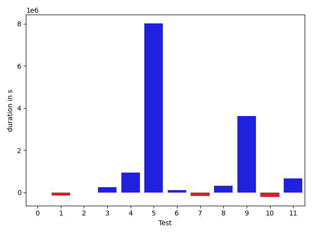

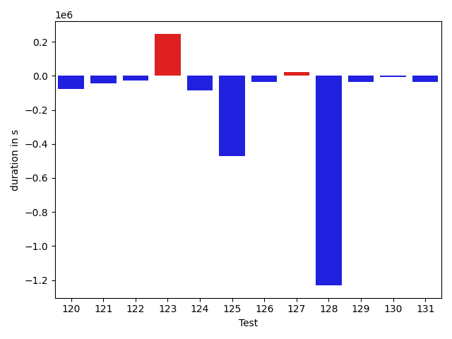

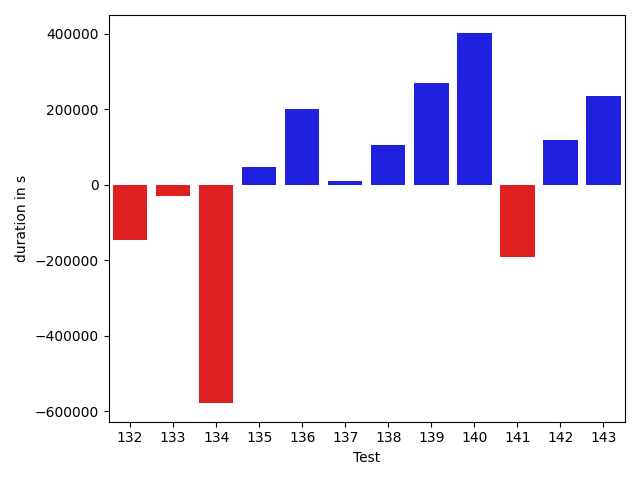

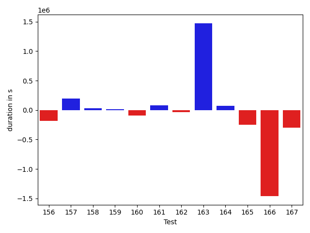

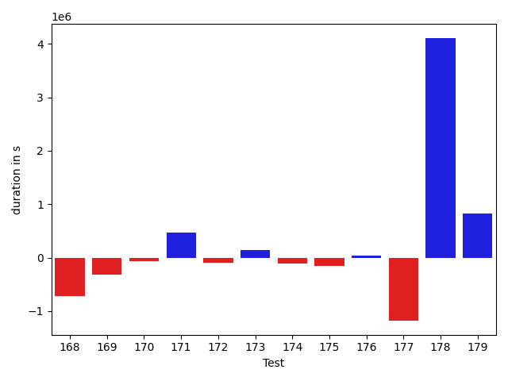

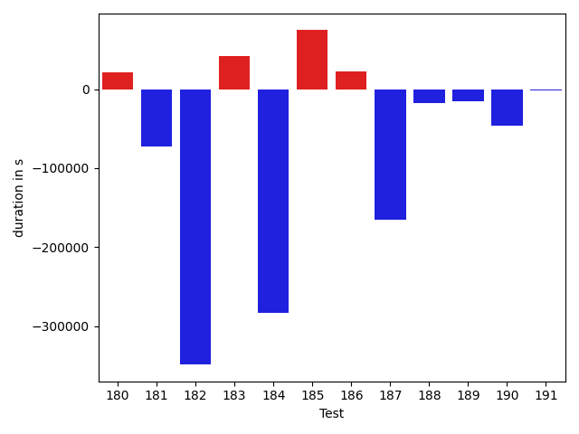

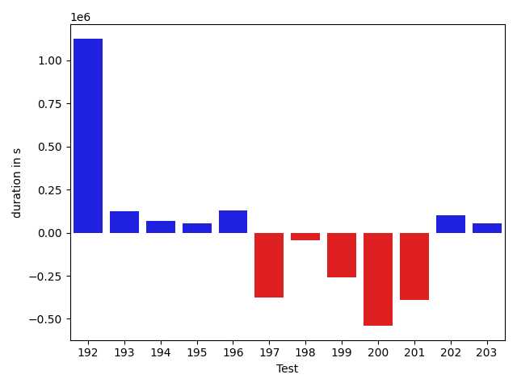

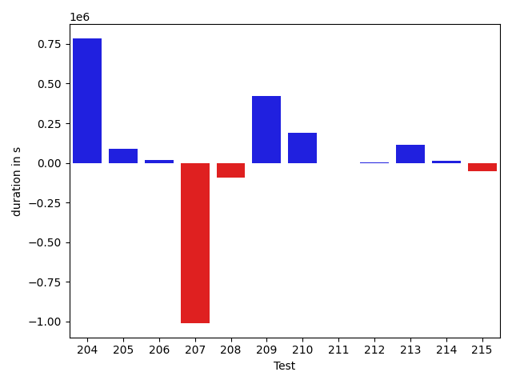

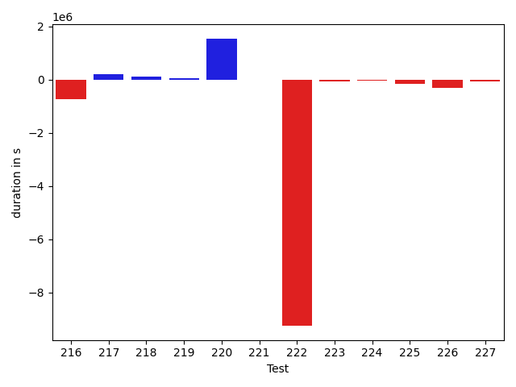

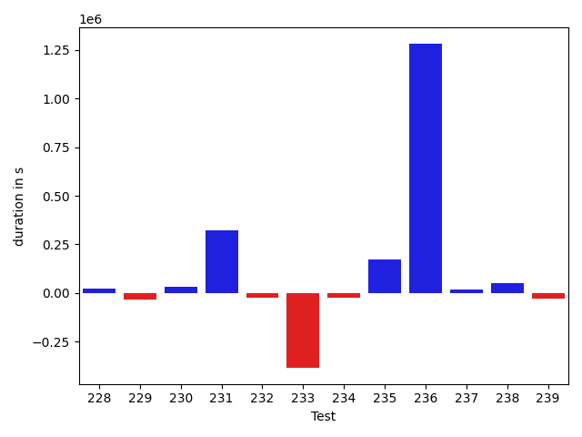

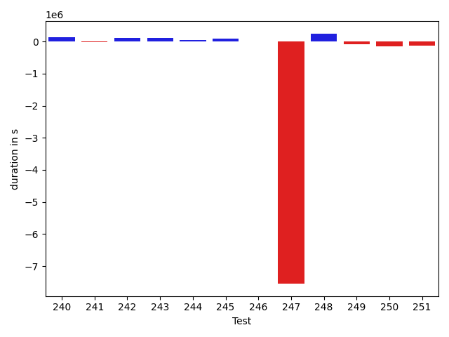

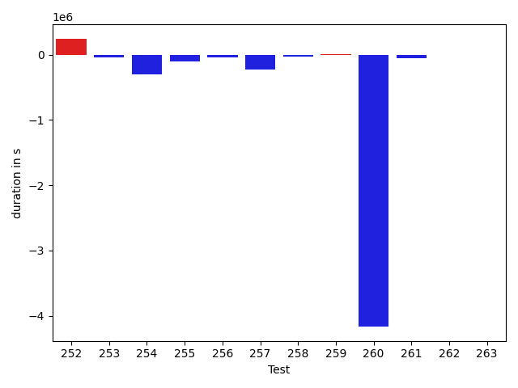

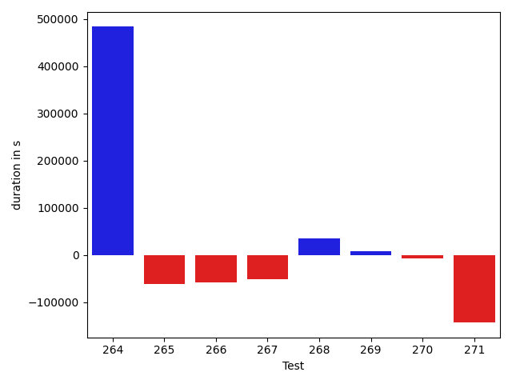

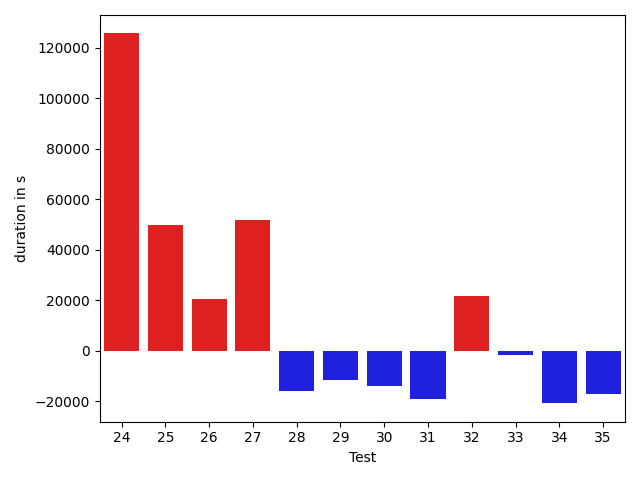

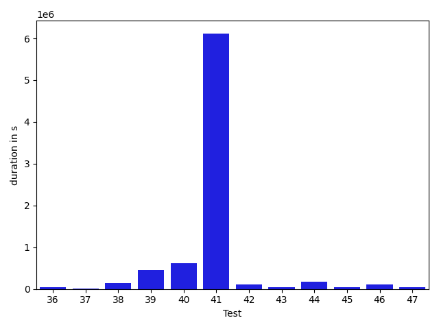

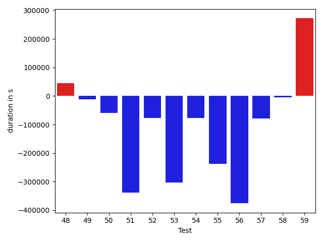

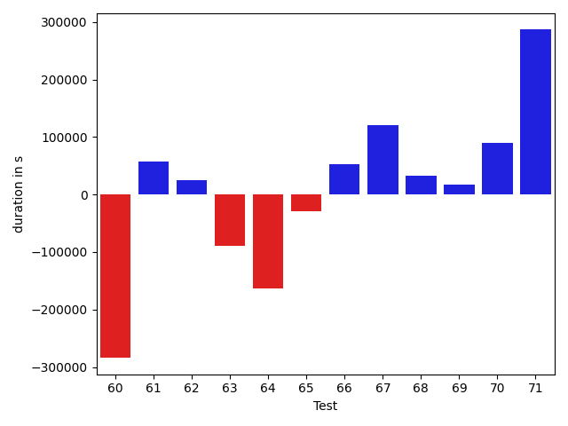

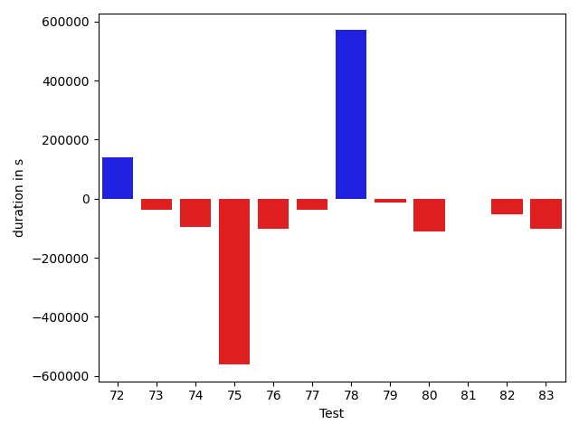

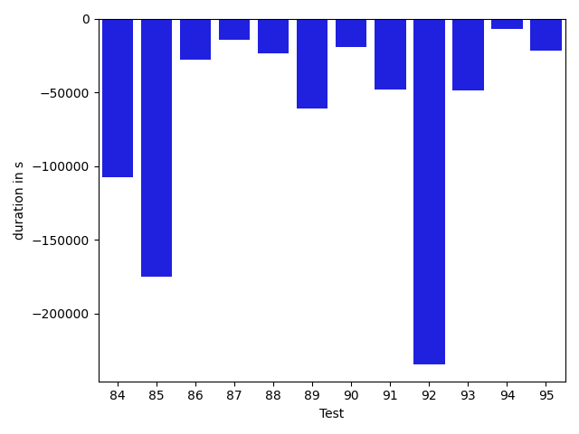

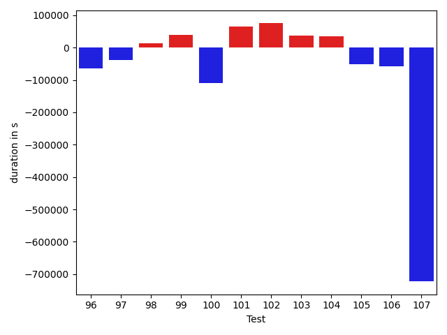

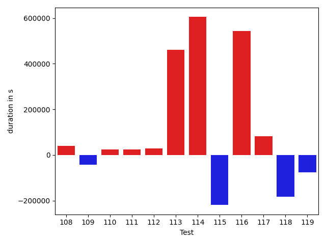

| ID | DurationV1 | DurationsV2 | DeltaDuration |
| --- | --- | --- | --- |
| 0 | 1032559.711458611 | 1041453.2951723182 | 8893.583713707281 |
| 1 | 739604.6720893205 | 597879.4165515054 | -141725.25553781504 |
| 2 | 833858.0991489894 | 824204.6558789664 | -9653.44327002298 |
| 3 | 787787.246320561 | 1029531.1990050153 | 241743.95268445427 |
| 4 | 873986.6109728224 | 1819156.9573217933 | 945170.3463489709 |
| 5 | 1021082.020429815 | 9040817.009609796 | 8019734.989179981 |
| 6 | 2322578.759590396 | 2436891.8218538905 | 114313.06226349436 |
| 7 | 1049711.9614602998 | 876447.4090539506 | -173264.55240634922 |
| 8 | 1378308.7012263364 | 1689264.399817756 | 310955.6985914195 |
| 9 | 775785.7089984121 | 4393593.024221547 | 3617807.315223135 |
| 10 | 841473.9298172719 | 632878.6257001713 | -208595.30411710055 |
| 11 | 905999.5502410291 | 1579459.5540732252 | 673460.0038321961 |
| 12 | 605117.6998163159 | 651985.078347659 | 46867.37853134307 |
| 13 | 757037.2302422479 | 677010.6522975061 | -80026.57794474182 |
| 14 | 499745.1634994894 | 483007.7305794358 | -16737.4329200536 |
| 15 | 702799.2719395517 | 774120.9190174832 | 71321.64707793156 |
| 16 | 656076.7654465379 | 660566.9033504102 | 4490.137903872295 |
| 17 | 685180.8011088371 | 610392.4055077119 | -74788.3956011252 |
| 18 | 753828.0195699495 | 605255.6814399314 | -148572.3381300181 |
| 19 | 1436199.6522905391 | 1007686.0417070957 | -428513.6105834434 |
| 20 | 1330170.6261188993 | 777156.2564261839 | -553014.3696927155 |
| 21 | 716825.6799401667 | 494181.5932475955 | -222644.08669257117 |
| 22 | 428362.8880276382 | 605988.1211235523 | 177625.23309591413 |
| 23 | 1153907.128452261 | 1368282.8586785323 | 214375.73022627132 |
| 24 | 2060841.4015676707 | 879288.9659880315 | -1181552.4355796394 |
| 25 | 522112.3988674283 | 647585.7035739031 | 125473.30470647477 |
| 26 | 423671.95351720834 | 675712.3146878574 | 252040.36117064906 |
| 27 | 2330743.7952003274 | 1661313.3378305058 | -669430.4573698216 |
| 28 | 23610519.05617948 | 4076526.658719291 | -19533992.39746019 |
| 29 | 497521.4044113159 | 363550.30304145813 | -133971.1013698578 |
| 30 | 394483.97372436523 | 367859.17248535156 | -26624.801239013672 |
| 31 | 1412233.8367069913 | 2753794.040740343 | 1341560.2040333515 |
| 32 | 591323.056123758 | 3241461.11349266 | 2650138.0573689025 |
| 33 | 1620573.0675903345 | 1538281.2485282777 | -82291.81906205672 |
| 34 | 743114.7601753545 | 1892330.194930839 | 1149215.4347554843 |
| 35 | 591832.922330801 | 697431.2216663583 | 105598.29933555727 |
| 36 | 682914.7229859796 | 732996.8298615286 | 50082.106875548954 |
| 37 | 716459.5839718512 | 736409.4688239583 | 19949.88485210715 |
| 38 | 1153830.4141143588 | 1290753.2298464964 | 136922.81573213753 |
| 39 | 774969.098006849 | 1236961.411075219 | 461992.3130683701 |
| 40 | 3226417.957399652 | 3838973.8051655865 | 612555.8477659347 |
| 41 | 8704807.514657926 | 14823520.898406811 | 6118713.383748885 |
| 42 | 415135.6844294965 | 518073.8864016533 | 102938.20197215676 |
| 43 | 785930.359974196 | 822616.0492303269 | 36685.68925613095 |
| 44 | 1049953.5825385924 | 1227267.1132503313 | 177313.53071173886 |
| 45 | 664902.2330407931 | 717491.2974832887 | 52589.06444249558 |
| 46 | 491440.95800208766 | 601797.5641760007 | 110356.606173913 |
| 47 | 646619.0603703333 | 688320.045616946 | 41700.98524661269 |
| 48 | 669677.7870931609 | 742556.1152123087 | 72878.3281191478 |
| 49 | 455015.8045377359 | 575577.1183026284 | 120561.31376489252 |
| 50 | 517594.4085264206 | 487287.67046785355 | -30306.738058567047 |
| 51 | 603852.8279955834 | 704245.232028003 | 100392.40403241955 |
| 52 | 389744.1284930706 | 444932.67363357544 | 55188.54514050484 |
| 53 | 375616.3499622345 | 440509.16862279177 | 64892.81866055727 |
| 54 | 527870.4704632643 | 671612.9776038798 | 143742.5071406155 |
| 55 | 448682.9762161374 | 490268.0485370159 | 41585.072320878506 |
| 56 | 508574.5603863206 | 681568.9861540139 | 172994.42576769332 |
| 57 | 392559.2208023071 | 375666.5053265095 | -16892.715475797653 |
| 58 | 478880.0833439827 | 463667.76740407944 | -15212.31593990326 |
| 59 | 570462.529883936 | 470983.0164081871 | -99479.51347574894 |
| 60 | 877270.8004130655 | 593175.9960119856 | -284094.8044010799 |
| 61 | 457959.1265533652 | 515854.52192863025 | 57895.39537526504 |
| 62 | 802867.3725925089 | 828131.8227972597 | 25264.450204750756 |
| 63 | 741051.5534838733 | 652280.837921612 | -88770.71556226129 |
| 64 | 529402.7614746094 | 366529.400390625 | -162873.36108398438 |
| 65 | 519741.48210541636 | 490532.8118769005 | -29208.670228515868 |
| 66 | 1216941.3161111823 | 1269752.4759152974 | 52811.15980411507 |
| 67 | 610513.9299038965 | 730819.108461801 | 120305.17855790444 |
| 68 | 649508.0065826382 | 681653.8165716799 | 32145.80998904165 |
| 69 | 472267.46861743927 | 489180.351271756 | 16912.882654316723 |
| 70 | 820559.0249781276 | 910539.8169576342 | 89980.79197950661 |
| 71 | 701061.1759033203 | 987804.2275390625 | 286743.0516357422 |
| 72 | 459287.2286834717 | 599948.4692268372 | 140661.24054336548 |
| 73 | 455922.1079670191 | 419177.52515268326 | -36744.58281433582 |
| 74 | 705843.1370725272 | 609591.7070710214 | -96251.43000150577 |
| 75 | 1090678.7954981022 | 528824.225543992 | -561854.5699541102 |
| 76 | 754778.2519330333 | 653693.2502588448 | -101085.00167418853 |
| 77 | 1271591.4875206973 | 1234578.0618255478 | -37013.42569514946 |
| 78 | 762456.2947345346 | 1332893.4241684056 | 570437.129433871 |
| 79 | 936292.6107103347 | 922760.9445973419 | -13531.666112992796 |
| 80 | 736619.671619432 | 626140.6947854956 | -110478.97683393641 |
| 81 | 839460.2421641541 | 838575.4389427494 | -884.8032214046689 |
| 82 | 688394.6098461382 | 634868.3743546592 | -53526.23549147893 |
| 83 | 1146466.599278727 | 1045997.8167123839 | -100468.7825663432 |
| 84 | 832231.4116211294 | 662922.892790318 | -169308.51883081137 |
| 85 | 904960.324817053 | 960685.1174097463 | 55724.79259269324 |
| 86 | 928981.1989014469 | 809383.832330991 | -119597.36657045584 |
| 87 | 700420.3727644884 | 621237.6921726845 | -79182.68059180398 |
| 88 | 691391.8101578415 | 628247.8259632122 | -63143.98419462936 |
| 89 | 408818.8102760315 | 533967.8410339355 | 125149.03075790405 |
| 90 | 476928.1891426444 | 461309.3595476197 | -15618.829595024697 |
| 91 | 778867.6029232051 | 1145939.3186320825 | 367071.7157088774 |
| 92 | 646479.9646747782 | 752529.5596546158 | 106049.59497983765 |
| 93 | 1183147.4843967557 | 1576356.475494098 | 393208.9910973422 |
| 94 | 611626.8008144529 | 839619.2125764055 | 227992.41176195256 |
| 95 | 592124.1832717651 | 1344368.4836347015 | 752244.3003629363 |
| 96 | 902725.5855288357 | 931552.0675185095 | 28826.481989673804 |
| 97 | 1620917.890117515 | 1662070.431384449 | 41152.54126693378 |
| 98 | 1546817.907557319 | 1115294.897438344 | -431523.01011897484 |
| 99 | 416465.4068073188 | 536870.0340665356 | 120404.62725921685 |
| 100 | 715667.7571521513 | 833041.3638887573 | 117373.60673660599 |
| 101 | 855107.4311315916 | 584433.6214375468 | -270673.80969404476 |
| 102 | 378127.31170654297 | 667582.0315856934 | 289454.7198791504 |
| 103 | 840289.4908877405 | 847728.7512193576 | 7439.260331617086 |
| 104 | 450786.9079589844 | 451936.810965538 | 1149.90300655365 |
| 105 | 534264.829973185 | 1567702.1699116705 | 1033437.3399384855 |
| 106 | 494101.7214140892 | 414659.40354430676 | -79442.31786978245 |
| 107 | 382166.3708229065 | 496071.6347389221 | 113905.26391601562 |
| 108 | 1522420.682180892 | 1696696.517810216 | 174275.83562932396 |
| 109 | 819951.9491264105 | 1309991.270623625 | 490039.3214972145 |
| 110 | 1174350.121926679 | 942444.8064864987 | -231905.31544018036 |
| 111 | 7384314.616107941 | 521656.0133666992 | -6862658.602741241 |
| 112 | 475399.4964547157 | 545560.6281265914 | 70161.13167187572 |
| 113 | 834101.2176040545 | 853087.5163475366 | 18986.298743482097 |
| 114 | 2205128.282802457 | 2376111.472559553 | 170983.18975709612 |
| 115 | 927007.4172556354 | 1094648.320520101 | 167640.90326446574 |
| 116 | 1649957.9075320507 | 887411.2487351056 | -762546.6587969451 |
| 117 | 750127.1723217113 | 883699.0472089669 | 133571.8748872556 |
| 118 | 964525.3189922636 | 1054250.4097720683 | 89725.09077980462 |
| 119 | 1242040.8536470914 | 907404.1371440367 | -334636.7165030547 |
| 120 | 917107.7257038931 | 880419.6884224977 | -36688.0372813954 |
| 121 | 1390598.1892607799 | 1346111.7601172675 | -44486.42914351239 |
| 122 | 1795268.7077229628 | 1839623.7759134364 | 44355.0681904736 |
| 123 | 1281394.2682045335 | 993119.6751927664 | -288274.59301176714 |
| 124 | 2293419.4572044546 | 1723627.9173805593 | -569791.5398238953 |
| 125 | 1273345.5352723873 | 1116180.330553885 | -157165.20471850224 |
| 126 | 986157.1910357815 | 1101060.443661621 | 114903.25262583955 |
| 127 | 1201470.2591225188 | 1059806.063797056 | -141664.19532546285 |
| 128 | 1069859.9771372767 | 1099034.1209605471 | 29174.143823270453 |
| 129 | 1938486.8480773396 | 1936615.391297037 | -1871.4567803025711 |
| 130 | 1032480.1534376915 | 859177.0767246848 | -173303.0767130067 |
| 131 | 994541.7217947342 | 985295.4873243822 | -9246.234470352065 |
| 132 | 971061.892448159 | 824486.543182271 | -146575.3492658881 |
| 133 | 969556.6792839369 | 940103.4335635968 | -29453.245720340055 |
| 134 | 1277988.5700816582 | 699285.67966601 | -578702.8904156482 |
| 135 | 2568086.7016477087 | 2614734.497297276 | 46647.79564956715 |
| 136 | 743716.0655884088 | 944177.6779458637 | 200461.61235745484 |
| 137 | 569086.1436320511 | 578450.7255053463 | 9364.581873295247 |
| 138 | 534814.9510089054 | 640734.6323435495 | 105919.68133464409 |
| 139 | 441494.901501894 | 710546.9023483313 | 269052.0008464373 |
| 140 | 614172.680252026 | 1014471.4644074638 | 400298.78415543784 |
| 141 | 1062556.5369707872 | 871412.5796889338 | -191143.95728185342 |
| 142 | 487274.88352647424 | 604584.6568181259 | 117309.77329165163 |
| 143 | 658582.084249334 | 893182.6950549515 | 234600.61080561753 |
| 144 | 430805.49235805497 | 551277.3108389974 | 120471.8184809424 |
| 145 | 558342.0937556028 | 540719.4607725441 | -17622.63298305869 |
| 146 | 447932.43754959106 | 568147.5637739226 | 120215.12622433156 |
| 147 | 470820.410646677 | 432348.63750505523 | -38471.77314162179 |
| 148 | 949722.6047530503 | 956058.6125073297 | 6336.007754279417 |
| 149 | 856460.8231264092 | 1306960.710418298 | 450499.8872918887 |
| 150 | 1196168.9636199735 | 1404461.0805963445 | 208292.11697637103 |
| 151 | 739025.5502965981 | 1037814.5299214714 | 298788.97962487326 |
| 152 | 1173495.2040193677 | 2212861.5715503693 | 1039366.3675310016 |
| 153 | 736219.1717558389 | 586262.5226495985 | -149956.64910624037 |
| 154 | 5115874.362712746 | 3957474.3297153874 | -1158400.0329973581 |
| 155 | 706783.5868125117 | 716789.6052331883 | 10006.018420676584 |
| 156 | 641666.722863389 | 456185.238525786 | -185481.48433760297 |
| 157 | 554314.9923615861 | 751403.086254322 | 197088.0938927359 |
| 158 | 790731.2113180932 | 823274.326569086 | 32543.11525099282 |
| 159 | 619067.8332429365 | 631884.569360882 | 12816.736117945518 |
| 160 | 539354.055763334 | 445927.61149188876 | -93426.44427144527 |
| 161 | 463314.6426336492 | 546187.1361780837 | 82872.49354443455 |
| 162 | 408719.3949279785 | 377504.0225601196 | -31215.372367858887 |
| 163 | 2021397.2697133918 | 3494013.291209897 | 1472616.0214965052 |
| 164 | 698034.1962944269 | 767045.9129945682 | 69011.71670014132 |
| 165 | 736067.5450897217 | 488098.4016494751 | -247969.14344024658 |
| 166 | 2162014.679344908 | 702297.6040657473 | -1459717.0752791604 |
| 167 | 956353.0466251352 | 659606.5320043538 | -296746.5146207814 |
| 168 | 1854702.2557010492 | 1136676.284724627 | -718025.9709764223 |
| 169 | 1028671.2669067609 | 710625.3119348416 | -318045.9549719193 |
| 170 | 1139905.0660903268 | 1079434.7256745065 | -60470.34041582025 |
| 171 | 745786.8100421919 | 1215734.599500507 | 469947.78945831524 |
| 172 | 444353.46051979065 | 351074.5849609375 | -93278.87555885315 |
| 173 | 901516.6037751809 | 1045241.6543820212 | 143725.0506068403 |
| 174 | 946691.2364169222 | 834620.3449526303 | -112070.89146429184 |
| 175 | 711538.1025390625 | 552590.9003601074 | -158947.20217895508 |
| 176 | 469112.6019381285 | 514047.07849121094 | 44934.476553082466 |
| 177 | 1651499.0050655305 | 471812.0324663073 | -1179686.9725992233 |
| 178 | 1366478.2091352236 | 5476553.351333673 | 4110075.1421984495 |
| 179 | 887752.0426230916 | 1714283.6762159083 | 826531.6335928167 |
| 180 | 703514.9156783673 | 947557.0029443075 | 244042.08726594027 |
| 181 | 469136.72185349464 | 405609.671005249 | -63527.05084824562 |
| 182 | 436263.9722290039 | 454985.90997314453 | 18721.937744140625 |
| 183 | 334422.97265625 | 342900.7255859375 | 8477.7529296875 |
| 184 | 1239773.3059266037 | 676476.8189915728 | -563296.4869350309 |
| 185 | 452344.54833078384 | 492509.98180139065 | 40165.433470606804 |
| 186 | 421210.6728515625 | 389454.1862792969 | -31756.486572265625 |
| 187 | 444623.0111694336 | 404753.3550233841 | -39869.6561460495 |
| 188 | 522119.08392333984 | 474355.26651000977 | -47763.81741333008 |
| 189 | 405728.20084381104 | 510580.1772766113 | 104851.9764328003 |
| 190 | 373622.72244262695 | 297628.6032714844 | -75994.11917114258 |
| 191 | 406997.1943359375 | 358337.763671875 | -48659.4306640625 |
| 192 | 1547593.6406693754 | 2673088.4410898224 | 1125494.800420447 |
| 193 | 636858.6195635856 | 762460.7462207188 | 125602.12665713322 |
| 194 | 628002.8024915028 | 696700.0575680183 | 68697.25507651549 |
| 195 | 668863.8443289142 | 723913.7814295223 | 55049.937100608135 |
| 196 | 593535.9481078088 | 724064.584594205 | 130528.6364863962 |
| 197 | 1346417.4191373377 | 969234.702452318 | -377182.71668501967 |
| 198 | 1025246.4734024762 | 979728.5207671688 | -45517.95263530733 |
| 199 | 1139163.4491353435 | 879811.4108243154 | -259352.03831102815 |
| 200 | 1598461.2565311042 | 1058931.0766585718 | -539530.1798725324 |
| 201 | 954829.6349523063 | 564380.5120367373 | -390449.122915569 |
| 202 | 936318.8807106122 | 1038589.7642214398 | 102270.88351082767 |
| 203 | 2531037.683529769 | 2582886.1302351863 | 51848.44670541724 |
| 204 | 761594.3404711899 | 1546495.7540926004 | 784901.4136214105 |
| 205 | 888500.5818903691 | 977729.9119006597 | 89229.3300102906 |
| 206 | 1056781.4361330974 | 1076543.358475267 | 19761.922342169564 |
| 207 | 1456652.7227163431 | 446041.26746216486 | -1010611.4552541783 |
| 208 | 742663.6858031279 | 648310.4839176282 | -94353.20188549976 |
| 209 | 459182.8323648423 | 881502.224448544 | 422319.3920837017 |
| 210 | 708426.9541818127 | 897762.77748853 | 189335.82330671733 |
| 211 | 488200.5323627001 | 487818.7362446785 | -381.79611802159343 |
| 212 | 1087441.4174962088 | 1092769.8427375478 | 5328.42524133902 |
| 213 | 741988.2477510481 | 853394.054045032 | 111405.80629398394 |
| 214 | 909559.9860708746 | 923288.3623132918 | 13728.376242417144 |
| 215 | 1816950.8283090617 | 1766069.906499898 | -50880.92180916364 |
| 216 | 1450557.7774377335 | 711488.4329933848 | -739069.3444443487 |
| 217 | 1020447.7257611521 | 1219964.9683455285 | 199517.24258437636 |
| 218 | 367249.3455810547 | 483017.39903640747 | 115768.05345535278 |
| 219 | 386542.6545982361 | 432490.4292678833 | 45947.77466964722 |
| 220 | 1219184.606678009 | 2759786.7165966034 | 1540602.1099185944 |
| 221 | 380664.650390625 | 370689.62060546875 | -9975.02978515625 |
| 222 | 12288415.82145442 | 3032184.7027790505 | -9256231.11867537 |
| 223 | 811975.4872171726 | 732739.650399886 | -79235.83681728668 |
| 224 | 361379.87060546875 | 320577.14892578125 | -40802.7216796875 |
| 225 | 1241287.1572298075 | 1094097.713448892 | -147189.44378091535 |
| 226 | 1518497.556489167 | 1206032.643292776 | -312464.91319639096 |
| 227 | 553170.4161608219 | 469973.925361374 | -83196.49079944793 |
| 228 | 421746.5153722763 | 446775.88752764463 | 25029.372155368328 |
| 229 | 441431.2806875706 | 408926.24810791016 | -32505.032579660416 |
| 230 | 1621855.5836441028 | 1654094.9331611036 | 32239.34951700084 |
| 231 | 544324.106020093 | 866839.6815821342 | 322515.57556204125 |
| 232 | 794167.078765235 | 768693.7806470043 | -25473.29811823077 |
| 233 | 1581449.2509501071 | 1198412.6570153236 | -383036.5939347835 |
| 234 | 404556.42808151245 | 379016.9480895996 | -25539.47999191284 |
| 235 | 749155.8448061115 | 919758.9714511221 | 170603.12664501055 |
| 236 | 758696.4786328764 | 2039434.5067775324 | 1280738.028144656 |
| 237 | 462285.53677962837 | 480666.32038149465 | 18380.78360186628 |
| 238 | 513157.88546550274 | 562961.44988738 | 49803.564421877265 |
| 239 | 382261.22702646255 | 356241.256275177 | -26019.970751285553 |
| 240 | 505242.1972652585 | 636607.2485777445 | 131365.05131248594 |
| 241 | 408259.4741489887 | 383068.9804992676 | -25190.493649721146 |
| 242 | 393364.84850661457 | 514617.961320281 | 121253.11281366646 |
| 243 | 634800.8571935057 | 743214.0706562684 | 108413.21346276265 |
| 244 | 433517.8924366208 | 484573.96897673607 | 51056.07654011529 |
| 245 | 462968.11070501804 | 545553.7118256092 | 82585.60112059116 |
| 246 | 398506.1496667862 | 390391.7685222626 | -8114.381144523621 |
| 247 | 9555108.583881307 | 2013682.375986492 | -7541426.207894815 |
| 248 | 610619.8637661666 | 853459.8224948267 | 242839.95872866013 |
| 249 | 722809.8895969763 | 625949.919885993 | -96859.96971098334 |
| 250 | 10470983.17685016 | 10320875.54147901 | -150107.63537115045 |
| 251 | 1866703.1926761894 | 1732143.4100407276 | -134559.78263546177 |
| 252 | 8013227.012985826 | 4246908.160396775 | -3766318.8525890503 |
| 253 | 1238813.9833856113 | 1386771.3061828655 | 147957.3227972542 |
| 254 | 423819.6604042053 | 354024.23431396484 | -69795.42609024048 |
| 255 | 1479232.8953209259 | 22110143.814126007 | 20630910.91880508 |
| 256 | 492533.9575805664 | 376862.86584472656 | -115671.09173583984 |
| 257 | 470717.1179199219 | 432431.32747364044 | -38285.79044628143 |
| 258 | 467628.6965332031 | 532163.8002929688 | 64535.103759765625 |
| 259 | 518057.8015534878 | 349136.7705421448 | -168921.031011343 |
| 260 | 533129.4252853394 | 607486.890625 | 74357.46533966064 |
| 261 | 830794.7683779811 | 798521.9558141272 | -32272.81256385392 |
| 262 | 1902794.5855977868 | 982011.2170184631 | -920783.3685793238 |
| 263 | 644575.2796610966 | 618268.2934240075 | -26306.98623708915 |
| 264 | 465906.17861795425 | 949056.6871299744 | 483150.5085120201 |
| 265 | 1529640.9461095892 | 1468290.9285893186 | -61350.01752027054 |
| 266 | 522536.42303323746 | 464978.65329170227 | -57557.76974153519 |
| 267 | 419995.9443359375 | 368052.5193634033 | -51943.42497253418 |
| 268 | 585514.1907419665 | 621288.7777045176 | 35774.58696255111 |
| 269 | 586116.1965675354 | 594199.8499692678 | 8083.653401732445 |
| 270 | 464822.2911950946 | 457110.23777484894 | -7712.053420245647 |
| 271 | 674145.3291030042 | 530843.704792199 | -143301.62431080523 |

## Misc.

| ID | Test Class | Test Method |
| --- | --- | --- |
| 0 | com.google.gson.functional.CustomTypeAdaptersTest | testCustomAdapterInvokedForCollectionElementDeserialization |
| 1 | com.google.gson.functional.CustomTypeAdaptersTest | testCustomTypeAdapterAppliesToSubClassesSerializedAsBaseClass |
| 2 | com.google.gson.functional.CustomTypeAdaptersTest | testCustomAdapterInvokedForMapElementDeserialization |
| 3 | com.google.gson.functional.CustomTypeAdaptersTest | testCustomAdapterInvokedForMapElementSerializationWithType |
| 4 | com.google.gson.functional.CustomTypeAdaptersTest | testCustomNestedSerializers |
| 5 | com.google.gson.functional.CustomTypeAdaptersTest | testCustomSerializers |
| 6 | com.google.gson.functional.CustomTypeAdaptersTest | testCustomTypeAdapterDoesNotAppliesToSubClasses |
| 7 | com.google.gson.functional.CustomTypeAdaptersTest | testRegisterHierarchyAdapterForDate |
| 8 | com.google.gson.functional.CustomTypeAdaptersTest | testCustomAdapterInvokedForCollectionElementSerializationWithType |
| 9 | com.google.gson.functional.CustomTypeAdaptersTest | testCustomDeserializers |
| 10 | com.google.gson.functional.CustomTypeAdaptersTest | testCustomByteArrayDeserializerAndInstanceCreator |
| 11 | com.google.gson.functional.CustomTypeAdaptersTest | testEnsureCustomSerializerNotInvokedForNullValues |
| 12 | com.google.gson.functional.CustomTypeAdaptersTest | testEnsureCustomDeserializerNotInvokedForNullValues |
| 13 | com.google.gson.functional.CustomTypeAdaptersTest | testCustomDeserializerInvokedForPrimitives |
| 14 | com.google.gson.functional.CustomTypeAdaptersTest | testCustomAdapterInvokedForMapElementSerialization |
| 15 | com.google.gson.functional.CustomTypeAdaptersTest | testCustomNestedDeserializers |
| 16 | com.google.gson.functional.CustomTypeAdaptersTest | testCustomSerializerInvokedForPrimitives |
| 17 | com.google.gson.functional.CustomTypeAdaptersTest | testCustomAdapterInvokedForCollectionElementSerialization |
| 18 | com.google.gson.functional.CustomTypeAdaptersTest | testCustomByteArraySerializer |
| 19 | com.google.gson.functional.StreamingTypeAdaptersTest | testNullSafe |
| 20 | com.google.gson.functional.StreamingTypeAdaptersTest | testSerializeWithCustomTypeAdapter |
| 21 | com.google.gson.functional.StreamingTypeAdaptersTest | testDeserializeWithCustomTypeAdapter |
| 22 | com.google.gson.functional.ExclusionStrategyFunctionalTest | testExclusionStrategySerializationDoesNotImpactSerialization |
| 23 | com.google.gson.functional.ExclusionStrategyFunctionalTest | testExclusionStrategyWithMode |
| 24 | com.google.gson.functional.ExclusionStrategyFunctionalTest | testExclusionStrategySerializationDoesNotImpactDeserialization |
| 25 | com.google.gson.functional.ExclusionStrategyFunctionalTest | testExcludeTopLevelClassDeserializationDoesNotImpactSerialization |
| 26 | com.google.gson.functional.ExclusionStrategyFunctionalTest | testExcludeTopLevelClassSerializationDoesNotImpactDeserialization |
| 27 | com.google.gson.functional.ExclusionStrategyFunctionalTest | testExclusionStrategyDeserialization |
| 28 | com.google.gson.functional.ExclusionStrategyFunctionalTest | testExclusionStrategySerialization |
| 29 | com.google.gson.functional.ExclusionStrategyFunctionalTest | testExcludeTopLevelClassDeserialization |
| 30 | com.google.gson.functional.ExclusionStrategyFunctionalTest | testExcludeTopLevelClassSerialization |
| 31 | com.google.gson.functional.InstanceCreatorTest | testInstanceCreatorForParametrizedType |
| 32 | com.google.gson.functional.InstanceCreatorTest | testInstanceCreatorReturnsBaseType |
| 33 | com.google.gson.functional.InstanceCreatorTest | testInstanceCreatorForCollectionType |
| 34 | com.google.gson.functional.InstanceCreatorTest | testInstanceCreatorReturnsSubTypeForField |
| 35 | com.google.gson.functional.InstanceCreatorTest | testInstanceCreatorReturnsSubTypeForTopLevelObject |
| 36 | com.google.gson.functional.DefaultTypeAdaptersTest | testTreeSetDeserialization |
| 37 | com.google.gson.functional.DefaultTypeAdaptersTest | testDateSerializationWithPatternNotOverridenByTypeAdapter |
| 38 | com.google.gson.functional.DefaultTypeAdaptersTest | testDateSerializationWithPattern |
| 39 | com.google.gson.functional.DefaultTypeAdaptersTest | testClassSerialization |
| 40 | com.google.gson.functional.DefaultTypeAdaptersTest | testDefaultDateDeserializationUsingBuilder |
| 41 | com.google.gson.functional.DefaultTypeAdaptersTest | testNullSerialization |
| 42 | com.google.gson.functional.DefaultTypeAdaptersTest | testClassDeserialization |
| 43 | com.google.gson.functional.DefaultTypeAdaptersTest | testDateDeserializationWithPattern |
| 44 | com.google.gson.functional.DefaultTypeAdaptersTest | testDateSerializationInCollection |
| 45 | com.google.gson.functional.DefaultTypeAdaptersTest | testDefaultDateSerializationUsingBuilder |
| 46 | com.google.gson.functional.DefaultTypeAdaptersTest | testBitSetDeserialization |
| 47 | com.google.gson.functional.DefaultTypeAdaptersTest | testSqlDateSerialization |
| 48 | com.google.gson.functional.DefaultTypeAdaptersTest | testTimestampSerialization |
| 49 | com.google.gson.functional.DefaultTypeAdaptersTest | testDefaultCalendarSerialization |
| 50 | com.google.gson.functional.DefaultTypeAdaptersTest | testDefaultCalendarDeserialization |
| 51 | com.google.gson.functional.DefaultTypeAdaptersTest | testTreeSetSerialization |
| 52 | com.google.gson.functional.DefaultTypeAdaptersTest | testDefaultGregorianCalendarDeserialization |
| 53 | com.google.gson.functional.DefaultTypeAdaptersTest | testBitSetSerialization |
| 54 | com.google.gson.functional.DefaultTypeAdaptersTest | testOverrideBigIntegerTypeAdapter |
| 55 | com.google.gson.functional.DefaultTypeAdaptersTest | testOverrideBigDecimalTypeAdapter |
| 56 | com.google.gson.functional.DefaultTypeAdaptersTest | testSetSerialization |
| 57 | com.google.gson.functional.DefaultTypeAdaptersTest | testDefaultGregorianCalendarSerialization |
| 58 | com.google.gson.functional.NullObjectAndFieldTest | testCustomTypeAdapterPassesNullSerialization |
| 59 | com.google.gson.functional.NullObjectAndFieldTest | testExplicitSerializationOfNullStringMembers |
| 60 | com.google.gson.functional.NullObjectAndFieldTest | testCustomTypeAdapterPassesNullDesrialization |
| 61 | com.google.gson.functional.NullObjectAndFieldTest | testExplicitSerializationOfNullCollectionMembers |
| 62 | com.google.gson.functional.NullObjectAndFieldTest | testAbsentJsonElementsAreSetToNull |
| 63 | com.google.gson.functional.NullObjectAndFieldTest | testPrintPrintingObjectWithNulls |
| 64 | com.google.gson.functional.NullObjectAndFieldTest | testPrintPrintingArraysWithNulls |
| 65 | com.google.gson.functional.NullObjectAndFieldTest | testExplicitNullSetsFieldToNullDuringDeserialization |
| 66 | com.google.gson.functional.NullObjectAndFieldTest | testExplicitSerializationOfNullArrayMembers |
| 67 | com.google.gson.functional.NullObjectAndFieldTest | testCustomSerializationOfNulls |
| 68 | com.google.gson.functional.NullObjectAndFieldTest | testNullWrappedPrimitiveMemberSerialization |
| 69 | com.google.gson.functional.NullObjectAndFieldTest | testExplicitDeserializationOfNulls |
| 70 | com.google.gson.functional.NullObjectAndFieldTest | testExplicitSerializationOfNulls |
| 71 | com.google.gson.functional.NullObjectAndFieldTest | testTopLevelNullObjectDeserialization |
| 72 | com.google.gson.functional.NullObjectAndFieldTest | testTopLevelNullObjectSerialization |
| 73 | com.google.gson.functional.NullObjectAndFieldTest | testNullWrappedPrimitiveMemberDeserialization |
| 74 | com.google.gson.functional.CollectionTest | testNullsInListDeserialization |
| 75 | com.google.gson.functional.CollectionTest | testRawCollectionSerialization |
| 76 | com.google.gson.functional.CollectionTest | testFieldIsArrayList |
| 77 | com.google.gson.functional.CollectionTest | testWildcardPrimitiveCollectionSerilaization |
| 78 | com.google.gson.functional.CollectionTest | testCollectionOfBagOfPrimitivesSerialization |
| 79 | com.google.gson.functional.CollectionTest | testQueueSerialization |
| 80 | com.google.gson.functional.CollectionTest | testLinkedListDeserialization |
| 81 | com.google.gson.functional.CollectionTest | testUserCollectionTypeAdapter |
| 82 | com.google.gson.functional.CollectionTest | testCollectionOfObjectWithNullSerialization |
| 83 | com.google.gson.functional.CollectionTest | testLinkedListSerialization |
| 84 | com.google.gson.functional.CollectionTest | testQueueDeserialization |
| 85 | com.google.gson.functional.CollectionTest | testSetDeserialization |
| 86 | com.google.gson.functional.CollectionTest | testSetSerialization |
| 87 | com.google.gson.functional.CollectionTest | testCollectionOfObjectSerialization |
| 88 | com.google.gson.functional.CollectionTest | testNullsInListSerialization |
| 89 | com.google.gson.functional.CollectionTest | testCollectionOfStringsSerialization |
| 90 | com.google.gson.functional.CollectionTest | testRawCollectionOfIntegersSerialization |
| 91 | com.google.gson.functional.MapTest | testSerializeMaps |
| 92 | com.google.gson.functional.MapTest | testHashMapDeserialization |
| 93 | com.google.gson.functional.MapTest | testInterfaceTypeMapWithSerializer |
| 94 | com.google.gson.functional.MapTest | testMapStandardSubclassDeserialization |
| 95 | com.google.gson.functional.MapTest | testMapSubclassDeserialization |
| 96 | com.google.gson.functional.MapTest | testSortedMap |
| 97 | com.google.gson.functional.MapTest | testInterfaceTypeMap |
| 98 | com.google.gson.functional.MapTest | testParameterizedMapSubclassSerialization |
| 99 | com.google.gson.functional.MapTest | testMapSerializationWithNullValuesSerialized |
| 100 | com.google.gson.functional.MapTest | testCustomSerializerForSpecificMapType |
| 101 | com.google.gson.functional.MapTest | testMapSerializationWithNullValueButSerializeNulls |
| 102 | com.google.gson.functional.MapTest | testMapOfMapSerialization |
| 103 | com.google.gson.functional.MapTest | testGeneralMapField |
| 104 | com.google.gson.functional.MapTest | testWriteMapsWithEmptyStringKey |
| 105 | com.google.gson.functional.MapTest | testMapSubclassSerialization |
| 106 | com.google.gson.functional.MapTest | testRawMapSerialization |
| 107 | com.google.gson.functional.MapTest | testMapWithQuotes |
| 108 | com.google.gson.functional.InheritanceTest | testSubInterfacesOfCollectionSerialization |
| 109 | com.google.gson.functional.InheritanceTest | testSubInterfacesOfCollectionDeserialization |
| 110 | com.google.gson.GsonBuilderTest | testExcludeFieldsWithModifiers |
| 111 | com.google.gson.GsonBuilderTest | testCreatingMoreThanOnce |
| 112 | com.google.gson.GsonBuilderTest | testTransientFieldExclusion |
| 113 | com.google.gson.functional.EnumTest | testEnumSubclassAsParameterizedType |
| 114 | com.google.gson.functional.EnumTest | testEnumSubclass |
| 115 | com.google.gson.functional.EnumTest | testEnumSubclassWithRegisteredTypeAdapter |
| 116 | com.google.gson.functional.EnumTest | testEnumSet |
| 117 | com.google.gson.functional.EnumTest | testCollectionOfEnumsSerialization |
| 118 | com.google.gson.JsonParserTest | testReadWriteTwoObjects |
| 119 | com.google.gson.functional.ParameterizedTypesTest | testVariableTypeArrayDeserialization |
| 120 | com.google.gson.functional.ParameterizedTypesTest | testParameterizedTypeWithReaderDeserialization |
| 121 | com.google.gson.functional.ParameterizedTypesTest | testParameterizedTypeWithCustomSerializer |
| 122 | com.google.gson.functional.ParameterizedTypesTest | testParameterizedTypesSerialization |
| 123 | com.google.gson.functional.ParameterizedTypesTest | testVariableTypeDeserialization |
| 124 | com.google.gson.functional.ParameterizedTypesTest | testVariableTypeFieldsAndGenericArraysSerialization |
| 125 | com.google.gson.functional.ParameterizedTypesTest | testParameterizedTypeGenericArraysDeserialization |
| 126 | com.google.gson.functional.ParameterizedTypesTest | testParameterizedTypeDeserialization |
| 127 | com.google.gson.functional.ParameterizedTypesTest | testVariableTypeFieldsAndGenericArraysDeserialization |
| 128 | com.google.gson.functional.ParameterizedTypesTest | testTypesWithMultipleParametersDeserialization |
| 129 | com.google.gson.functional.ParameterizedTypesTest | testTypesWithMultipleParametersSerialization |
| 130 | com.google.gson.functional.ParameterizedTypesTest | testParameterizedTypeWithVariableTypeDeserialization |
| 131 | com.google.gson.functional.ParameterizedTypesTest | testParameterizedTypeGenericArraysSerialization |
| 132 | com.google.gson.functional.ParameterizedTypesTest | testParameterizedTypesWithWriterSerialization |
| 133 | com.google.gson.functional.ParameterizedTypesTest | testParameterizedTypesWithCustomDeserializer |
| 134 | com.google.gson.functional.NamingPolicyTest | testGsonWithNonDefaultFieldNamingPolicySerialization |
| 135 | com.google.gson.functional.NamingPolicyTest | testGsonDuplicateNameUsingSerializedNameFieldNamingPolicySerialization |
| 136 | com.google.gson.functional.NamingPolicyTest | testGsonWithSerializedNameFieldNamingPolicySerialization |
| 137 | com.google.gson.functional.NamingPolicyTest | testGsonWithNonDefaultFieldNamingPolicyDeserialiation |
| 138 | com.google.gson.functional.NamingPolicyTest | testGsonWithUpperCamelCaseSpacesPolicySerialiation |
| 139 | com.google.gson.functional.NamingPolicyTest | testGsonWithSerializedNameFieldNamingPolicyDeserialization |
| 140 | com.google.gson.functional.NamingPolicyTest | testComplexFieldNameStrategy |
| 141 | com.google.gson.functional.NamingPolicyTest | testDeprecatedNamingStrategy |
| 142 | com.google.gson.functional.NamingPolicyTest | testGsonWithLowerCaseUnderscorePolicyDeserialiation |
| 143 | com.google.gson.functional.NamingPolicyTest | testAtSignInSerializedName |
| 144 | com.google.gson.functional.NamingPolicyTest | testGsonWithUpperCamelCaseSpacesPolicyDeserialiation |
| 145 | com.google.gson.functional.NamingPolicyTest | testGsonWithLowerCaseDashPolicyDeserialiation |
| 146 | com.google.gson.functional.NamingPolicyTest | testGsonWithLowerCaseUnderscorePolicySerialization |
| 147 | com.google.gson.functional.NamingPolicyTest | testGsonWithLowerCaseDashPolicySerialization |
| 148 | com.google.gson.functional.ObjectTest | testSingletonLists |
| 149 | com.google.gson.functional.ObjectTest | testAnonymousLocalClassesCustomSerialization |
| 150 | com.google.gson.functional.ObjectTest | testTruncatedDeserialization |
| 151 | com.google.gson.functional.ObjectTest | testInnerClassDeserialization |
| 152 | com.google.gson.functional.ObjectTest | testJsonObjectSerialization |
| 153 | com.google.gson.functional.VersioningTest | testVersionedGsonMixingSinceAndUntilDeserialization |
| 154 | com.google.gson.functional.VersioningTest | testVersionedUntilSerialization |
| 155 | com.google.gson.functional.VersioningTest | testVersionedClassesDeserialization |
| 156 | com.google.gson.functional.VersioningTest | testVersionedGsonWithUnversionedClassesSerialization |
| 157 | com.google.gson.functional.VersioningTest | testVersionedClassesSerialization |
| 158 | com.google.gson.functional.VersioningTest | testVersionedGsonMixingSinceAndUntilSerialization |
| 159 | com.google.gson.functional.VersioningTest | testVersionedUntilDeserialization |
| 160 | com.google.gson.functional.VersioningTest | testVersionedGsonWithUnversionedClassesDeserialization |
| 161 | com.google.gson.functional.VersioningTest | testIgnoreLaterVersionClassSerialization |
| 162 | com.google.gson.functional.VersioningTest | testIgnoreLaterVersionClassDeserialization |
| 163 | com.google.gson.functional.FieldExclusionTest | testDefaultInnerClassExclusion |
| 164 | com.google.gson.functional.FieldExclusionTest | testDefaultNestedStaticClassIncluded |
| 165 | com.google.gson.functional.FieldExclusionTest | testInnerClassExclusion |
| 166 | com.google.gson.functional.CustomDeserializerTest | testCustomDeserializerReturnsNull |
| 167 | com.google.gson.functional.CustomDeserializerTest | testCustomDeserializerReturnsNullForArrayElements |
| 168 | com.google.gson.functional.CustomDeserializerTest | testCustomDeserializerReturnsNullForTopLevelObject |
| 169 | com.google.gson.functional.CustomDeserializerTest | testCustomDeserializerReturnsNullForArrayElementsForArrayField |
| 170 | com.google.gson.functional.CustomDeserializerTest | testJsonTypeFieldBasedDeserialization |
| 171 | com.google.gson.functional.JsonParserTest | testExtraCommasInArrays |
| 172 | com.google.gson.functional.ReadersWritersTest | testTopLevelNullObjectDeserializationWithReaderAndSerializeNulls |
| 173 | com.google.gson.functional.ReadersWritersTest | testReadWriteTwoStrings |
| 174 | com.google.gson.functional.ReadersWritersTest | testReadWriteTwoObjects |
| 175 | com.google.gson.functional.ReadersWritersTest | testTopLevelNullObjectSerializationWithWriterAndSerializeNulls |
| 176 | com.google.gson.LongSerializationPolicyTest | testStringLongSerializationIntegration |
| 177 | com.google.gson.LongSerializationPolicyTest | testDefaultLongSerializationIntegration |
| 178 | com.google.gson.functional.TypeVariableTest | testAdvancedTypeVariables |
| 179 | com.google.gson.functional.TypeVariableTest | testTypeVariablesViaTypeParameter |
| 180 | com.google.gson.functional.TypeVariableTest | testBasicTypeVariables |
| 181 | com.google.gson.functional.PrimitiveTest | testLongAsStringSerialization |
| 182 | com.google.gson.functional.PrimitiveTest | testFloatNaNSerialization |
| 183 | com.google.gson.functional.PrimitiveTest | testNegativeInfinityFloatSerialization |
| 184 | com.google.gson.functional.PrimitiveTest | testStringsAsBooleans |
| 185 | com.google.gson.functional.PrimitiveTest | testMoreSpecificSerialization |
| 186 | com.google.gson.functional.PrimitiveTest | testDoubleInfinitySerialization |
| 187 | com.google.gson.functional.PrimitiveTest | testHtmlCharacterSerialization |
| 188 | com.google.gson.functional.PrimitiveTest | testLongAsStringDeserialization |
| 189 | com.google.gson.functional.PrimitiveTest | testDoubleNaNSerialization |
| 190 | com.google.gson.functional.PrimitiveTest | testFloatInfinitySerialization |
| 191 | com.google.gson.functional.PrimitiveTest | testNegativeInfinitySerialization |
| 192 | com.google.gson.functional.FieldNamingTest | testIdentity |
| 193 | com.google.gson.functional.FieldNamingTest | testLowerCaseWithDashes |
| 194 | com.google.gson.functional.FieldNamingTest | testLowerCaseWithUnderscores |
| 195 | com.google.gson.functional.FieldNamingTest | testUpperCamelCaseWithSpaces |
| 196 | com.google.gson.functional.FieldNamingTest | testUpperCamelCase |
| 197 | com.google.gson.functional.RawSerializationTest | testThreeLevelParameterizedObject |
| 198 | com.google.gson.functional.RawSerializationTest | testCollectionOfObjects |
| 199 | com.google.gson.functional.RawSerializationTest | testTwoLevelParameterizedObject |
| 200 | com.google.gson.functional.RawSerializationTest | testParameterizedObject |
| 201 | com.google.gson.functional.RawSerializationTest | testCollectionOfPrimitives |
| 202 | com.google.gson.functional.MapAsArrayTypeAdapterTest | testMapWithTypeVariableDeserialization |
| 203 | com.google.gson.functional.MapAsArrayTypeAdapterTest | testSerializeComplexMapWithTypeAdapter |
| 204 | com.google.gson.functional.MapAsArrayTypeAdapterTest | testTwoTypesCollapseToOneDeserialize |
| 205 | com.google.gson.functional.MapAsArrayTypeAdapterTest | testMultipleEnableComplexKeyRegistrationHasNoEffect |
| 206 | com.google.gson.functional.MapAsArrayTypeAdapterTest | testMapWithTypeVariableSerialization |
| 207 | com.google.gson.functional.CustomSerializerTest | testSubClassSerializerInvokedForBaseClassFieldsHoldingSubClassInstances |
| 208 | com.google.gson.functional.CustomSerializerTest | testSerializerReturnsNull |
| 209 | com.google.gson.functional.CustomSerializerTest | testBaseClassSerializerInvokedForBaseClassFieldsHoldingSubClassInstances |
| 210 | com.google.gson.functional.CustomSerializerTest | testSubClassSerializerInvokedForBaseClassFieldsHoldingArrayOfSubClassInstances |
| 211 | com.google.gson.functional.CustomSerializerTest | testBaseClassSerializerInvokedForBaseClassFields |
| 212 | com.google.gson.functional.MoreSpecificTypeSerializationTest | testListOfParameterizedSubclassFields |
| 213 | com.google.gson.functional.MoreSpecificTypeSerializationTest | testMapOfParameterizedSubclassFields |
| 214 | com.google.gson.functional.MoreSpecificTypeSerializationTest | testParameterizedSubclassFields |
| 215 | com.google.gson.functional.UncategorizedTest | testReturningDerivedClassesDuringDeserialization |
| 216 | com.google.gson.functional.UncategorizedTest | testTrailingWhitespace |
| 217 | com.google.gson.functional.ArrayTest | testArrayOfCollectionSerialization |
| 218 | com.google.gson.functional.ArrayTest | testArrayElementsAreArrays |
| 219 | com.google.gson.functional.ArrayTest | testNullsInArrayWithSerializeNullPropertySetSerialization |
| 220 | com.google.gson.JsonObjectTest | testPropertyWithQuotes |
| 221 | com.google.gson.JsonObjectTest | testWritePropertyWithEmptyStringName |
| 222 | com.google.gson.functional.TypeHierarchyAdapterTest | testTypeHierarchy |
| 223 | com.google.gson.functional.TypeHierarchyAdapterTest | testRegisterSuperTypeFirst |
| 224 | com.google.gson.functional.TypeHierarchyAdapterTest | testRegisterSubTypeFirstAllowed |
| 225 | com.google.gson.functional.TreeTypeAdaptersTest | testDeserializeId |
| 226 | com.google.gson.functional.TreeTypeAdaptersTest | testSerializeId |
| 227 | com.google.gson.OverrideCoreTypeAdaptersTest | testOverrideWrapperBooleanAdapter |
| 228 | com.google.gson.OverrideCoreTypeAdaptersTest | testOverrideStringAdapter |
| 229 | com.google.gson.OverrideCoreTypeAdaptersTest | testOverridePrimitiveBooleanAdapter |
| 230 | com.google.gson.GsonTypeAdapterTest | testDeserializerForAbstractClass |
| 231 | com.google.gson.functional.EscapingTest | testEscapeAllHtmlCharacters |
| 232 | com.google.gson.functional.EscapingTest | testGsonAcceptsEscapedAndNonEscapedJsonDeserialization |
| 233 | com.google.gson.functional.PrintFormattingTest | testCompactFormattingLeavesNoWhiteSpace |
| 234 | com.google.gson.functional.PrintFormattingTest | testJsonObjectWithNullValuesSerialized |
| 235 | com.google.gson.MixedStreamTest | testWriteHtmlSafe |
| 236 | com.google.gson.MixedStreamTest | testWriteLenient |
| 237 | com.google.gson.MixedStreamTest | testReadMixedStreamed |
| 238 | com.google.gson.MixedStreamTest | testReaderDoesNotMutateState |
| 239 | com.google.gson.MixedStreamTest | testReadNulls |
| 240 | com.google.gson.MixedStreamTest | testWriteMixedStreamed |
| 241 | com.google.gson.MixedStreamTest | testReadInvalidState |
| 242 | com.google.gson.MixedStreamTest | testWriteInvalidState |
| 243 | com.google.gson.MixedStreamTest | testReadClosed |
| 244 | com.google.gson.MixedStreamTest | testWriteClosed |
| 245 | com.google.gson.MixedStreamTest | testWriteDoesNotMutateState |
| 246 | com.google.gson.MixedStreamTest | testWriteNulls |
| 247 | com.google.gson.functional.PrettyPrintingTest | testPrettyPrintList |
| 248 | com.google.gson.functional.PrettyPrintingTest | testPrettyPrintListOfPrimitiveArrays |
| 249 | com.google.gson.functional.PrettyPrintingTest | testMap |
| 250 | com.google.gson.JavaSerializationTest | testNumberIsSerializable |
| 251 | com.google.gson.JavaSerializationTest | testListIsSerializable |
| 252 | com.google.gson.functional.CircularReferenceTest | testSelfReferenceCustomHandlerSerialization |
| 253 | com.google.gson.functional.DelegateTypeAdapterTest | testDelegateInvoked |
| 254 | com.google.gson.functional.TypeAdapterPrecedenceTest | testStreamingFollowedByNonstreaming |
| 255 | com.google.gson.functional.TypeAdapterPrecedenceTest | testNonstreamingFollowedByNonstreaming |
| 256 | com.google.gson.functional.TypeAdapterPrecedenceTest | testStreamingHierarchicalFollowedByNonstreaming |
| 257 | com.google.gson.functional.TypeAdapterPrecedenceTest | testSerializeNonstreamingTypeAdapterFollowedByStreamingTypeAdapter |
| 258 | com.google.gson.functional.TypeAdapterPrecedenceTest | testNonstreamingHierarchicalFollowedByNonstreaming |
| 259 | com.google.gson.functional.TypeAdapterPrecedenceTest | testStreamingHierarchicalFollowedByNonstreamingHierarchical |
| 260 | com.google.gson.functional.TypeAdapterPrecedenceTest | testStreamingFollowedByNonstreamingHierarchical |
| 261 | com.google.gson.functional.TypeAdapterPrecedenceTest | testStreamingFollowedByStreaming |
| 262 | com.google.gson.CommentsTest | testParseComments |
| 263 | com.google.gson.DefaultMapJsonSerializerTest | testNonEmptyMapSerialization |
| 264 | com.google.gson.DefaultMapJsonSerializerTest | testEmptyMapNoTypeSerialization |
| 265 | com.google.gson.ObjectTypeAdapterTest | testSerialize |
| 266 | com.google.gson.ObjectTypeAdapterTest | testSerializeNullValue |
| 267 | com.google.gson.functional.SecurityTest | testJsonWithNonExectuableTokenSerialization |
| 268 | com.google.gson.functional.SecurityTest | testNonExecutableJsonDeserialization |
| 269 | com.google.gson.functional.SecurityTest | testJsonWithNonExectuableTokenWithConfiguredGsonDeserialization |
| 270 | com.google.gson.functional.SecurityTest | testJsonWithNonExectuableTokenWithRegularGsonDeserialization |
| 271 | com.google.gson.functional.SecurityTest | testNonExecutableJsonSerialization |

| Test | IterationV1 | IterationV2 | DeltaIteration |
| --- | --- | --- | --- |
| 0 | 52 | 58 | 6 |
| 1 | 41 | 54 | 13 |
| 2 | 46 | 53 | 7 |
| 3 | 47 | 49 | 2 |
| 4 | 53 | 58 | 5 |
| 5 | 63 | 57 | -6 |
| 6 | 99 | 99 | 0 |
| 7 | 52 | 49 | -3 |
| 8 | 71 | 74 | 3 |
| 9 | 55 | 53 | -2 |
| 10 | 38 | 43 | 5 |
| 11 | 42 | 44 | 2 |
| 12 | 32 | 33 | 1 |
| 13 | 41 | 45 | 4 |
| 14 | 27 | 28 | 1 |
| 15 | 52 | 52 | 0 |
| 16 | 40 | 52 | 12 |
| 17 | 25 | 41 | 16 |
| 18 | 36 | 36 | 0 |
| 19 | 85 | 85 | 0 |
| 20 | 67 | 70 | 3 |
| 21 | 38 | 40 | 2 |
| 22 | 26 | 23 | -3 |
| 23 | 42 | 39 | -3 |
| 24 | 32 | 33 | 1 |
| 25 | 25 | 29 | 4 |
| 26 | 31 | 30 | -1 |
| 27 | 34 | 35 | 1 |
| 28 | 99 | 99 | 0 |
| 29 | 18 | 20 | 2 |
| 30 | 17 | 15 | -2 |
| 31 | 99 | 99 | 0 |
| 32 | 62 | 67 | 5 |
| 33 | 99 | 99 | 0 |
| 34 | 55 | 63 | 8 |
| 35 | 49 | 51 | 2 |
| 36 | 50 | 46 | -4 |
| 37 | 52 | 57 | 5 |
| 38 | 96 | 95 | -1 |
| 39 | 55 | 53 | -2 |
| 40 | 99 | 99 | 0 |
| 41 | 99 | 99 | 0 |
| 42 | 25 | 22 | -3 |
| 43 | 61 | 57 | -4 |
| 44 | 94 | 86 | -8 |
| 45 | 47 | 52 | 5 |
| 46 | 31 | 38 | 7 |
| 47 | 50 | 49 | -1 |
| 48 | 49 | 53 | 4 |
| 49 | 29 | 27 | -2 |
| 50 | 21 | 23 | 2 |
| 51 | 27 | 39 | 12 |
| 52 | 23 | 18 | -5 |
| 53 | 21 | 25 | 4 |
| 54 | 34 | 33 | -1 |
| 55 | 25 | 22 | -3 |
| 56 | 33 | 37 | 4 |
| 57 | 18 | 23 | 5 |
| 58 | 24 | 23 | -1 |
| 59 | 27 | 34 | 7 |
| 60 | 41 | 46 | 5 |
| 61 | 36 | 35 | -1 |
| 62 | 62 | 66 | 4 |
| 63 | 40 | 46 | 6 |
| 64 | 15 | 10 | -5 |
| 65 | 36 | 28 | -8 |
| 66 | 96 | 95 | -1 |
| 67 | 33 | 29 | -4 |
| 68 | 44 | 41 | -3 |
| 69 | 23 | 29 | 6 |
| 70 | 34 | 33 | -1 |
| 71 | 18 | 13 | -5 |
| 72 | 20 | 19 | -1 |
| 73 | 24 | 25 | 1 |
| 74 | 47 | 52 | 5 |
| 75 | 34 | 40 | 6 |
| 76 | 49 | 48 | -1 |
| 77 | 76 | 70 | -6 |
| 78 | 35 | 34 | -1 |
| 79 | 61 | 57 | -4 |
| 80 | 50 | 38 | -12 |
| 81 | 69 | 71 | 2 |
| 82 | 48 | 52 | 4 |
| 83 | 64 | 61 | -3 |
| 84 | 47 | 42 | -5 |
| 85 | 64 | 62 | -2 |
| 86 | 74 | 62 | -12 |
| 87 | 43 | 53 | 10 |
| 88 | 44 | 46 | 2 |
| 89 | 19 | 16 | -3 |
| 90 | 25 | 31 | 6 |
| 91 | 61 | 50 | -11 |
| 92 | 46 | 43 | -3 |
| 93 | 94 | 98 | 4 |
| 94 | 58 | 43 | -15 |
| 95 | 50 | 90 | 40 |
| 96 | 71 | 68 | -3 |
| 97 | 85 | 94 | 9 |
| 98 | 99 | 70 | -29 |
| 99 | 32 | 35 | 3 |
| 100 | 56 | 63 | 7 |
| 101 | 56 | 32 | -24 |
| 102 | 16 | 16 | 0 |
| 103 | 51 | 63 | 12 |
| 104 | 16 | 21 | 5 |
| 105 | 37 | 31 | -6 |
| 106 | 23 | 24 | 1 |
| 107 | 19 | 19 | 0 |
| 108 | 99 | 99 | 0 |
| 109 | 67 | 67 | 0 |
| 110 | 58 | 64 | 6 |
| 111 | 19 | 16 | -3 |
| 112 | 22 | 27 | 5 |
| 113 | 63 | 59 | -4 |
| 114 | 97 | 99 | 2 |
| 115 | 79 | 82 | 3 |
| 116 | 65 | 63 | -2 |
| 117 | 58 | 67 | 9 |
| 118 | 68 | 68 | 0 |
| 119 | 88 | 81 | -7 |
| 120 | 73 | 60 | -13 |
| 121 | 81 | 85 | 4 |
| 122 | 89 | 91 | 2 |
| 123 | 74 | 71 | -3 |
| 124 | 99 | 99 | 0 |
| 125 | 82 | 77 | -5 |
| 126 | 72 | 79 | 7 |
| 127 | 90 | 89 | -1 |
| 128 | 75 | 70 | -5 |
| 129 | 97 | 98 | 1 |
| 130 | 80 | 82 | 2 |
| 131 | 79 | 70 | -9 |
| 132 | 64 | 58 | -6 |
| 133 | 83 | 77 | -6 |
| 134 | 37 | 43 | 6 |
| 135 | 81 | 79 | -2 |
| 136 | 48 | 56 | 8 |
| 137 | 31 | 35 | 4 |
| 138 | 33 | 32 | -1 |
| 139 | 26 | 34 | 8 |
| 140 | 56 | 49 | -7 |
| 141 | 62 | 62 | 0 |
| 142 | 26 | 31 | 5 |
| 143 | 57 | 51 | -6 |
| 144 | 29 | 26 | -3 |
| 145 | 26 | 30 | 4 |
| 146 | 24 | 28 | 4 |
| 147 | 23 | 34 | 11 |
| 148 | 72 | 70 | -2 |
| 149 | 63 | 50 | -13 |
| 150 | 46 | 65 | 19 |
| 151 | 60 | 52 | -8 |
| 152 | 25 | 22 | -3 |
| 153 | 44 | 55 | 11 |
| 154 | 99 | 99 | 0 |
| 155 | 40 | 40 | 0 |
| 156 | 39 | 33 | -6 |
| 157 | 54 | 51 | -3 |
| 158 | 62 | 63 | 1 |
| 159 | 35 | 26 | -9 |
| 160 | 26 | 27 | 1 |
| 161 | 34 | 28 | -6 |
| 162 | 16 | 18 | 2 |
| 163 | 76 | 79 | 3 |
| 164 | 25 | 31 | 6 |
| 165 | 17 | 18 | 1 |
| 166 | 49 | 53 | 4 |
| 167 | 47 | 43 | -4 |
| 168 | 48 | 58 | 10 |
| 169 | 47 | 55 | 8 |
| 170 | 76 | 83 | 7 |
| 171 | 50 | 66 | 16 |
| 172 | 20 | 14 | -6 |
| 173 | 74 | 76 | 2 |
| 174 | 46 | 56 | 10 |
| 175 | 12 | 16 | 4 |
| 176 | 23 | 17 | -6 |
| 177 | 27 | 26 | -1 |
| 178 | 99 | 99 | 0 |
| 179 | 81 | 80 | -1 |
| 180 | 57 | 47 | -10 |
| 181 | 22 | 21 | -1 |
| 182 | 15 | 15 | 0 |
| 183 | 10 | 12 | 2 |
| 184 | 72 | 55 | -17 |
| 185 | 22 | 24 | 2 |
| 186 | 11 | 14 | 3 |
| 187 | 17 | 22 | 5 |
| 188 | 15 | 19 | 4 |
| 189 | 19 | 16 | -3 |
| 190 | 18 | 14 | -4 |
| 191 | 11 | 11 | 0 |
| 192 | 85 | 78 | -7 |
| 193 | 40 | 43 | 3 |
| 194 | 41 | 41 | 0 |
| 195 | 36 | 38 | 2 |
| 196 | 26 | 27 | 1 |
| 197 | 80 | 79 | -1 |
| 198 | 71 | 75 | 4 |
| 199 | 67 | 72 | 5 |
| 200 | 72 | 78 | 6 |
| 201 | 32 | 36 | 4 |
| 202 | 56 | 64 | 8 |
| 203 | 99 | 99 | 0 |
| 204 | 57 | 54 | -3 |
| 205 | 70 | 68 | -2 |
| 206 | 72 | 68 | -4 |
| 207 | 64 | 34 | -30 |
| 208 | 37 | 36 | -1 |
| 209 | 28 | 38 | 10 |
| 210 | 44 | 52 | 8 |
| 211 | 36 | 22 | -14 |
| 212 | 53 | 52 | -1 |
| 213 | 52 | 53 | 1 |
| 214 | 52 | 49 | -3 |
| 215 | 99 | 99 | 0 |
| 216 | 57 | 45 | -12 |
| 217 | 70 | 79 | 9 |
| 218 | 14 | 18 | 4 |
| 219 | 19 | 20 | 1 |
| 220 | 18 | 19 | 1 |
| 221 | 12 | 13 | 1 |
| 222 | 99 | 99 | 0 |
| 223 | 45 | 45 | 0 |
| 224 | 13 | 12 | -1 |
| 225 | 75 | 73 | -2 |
| 226 | 80 | 89 | 9 |
| 227 | 36 | 36 | 0 |
| 228 | 23 | 25 | 2 |
| 229 | 23 | 16 | -7 |
| 230 | 99 | 99 | 0 |
| 231 | 27 | 29 | 2 |
| 232 | 42 | 45 | 3 |
| 233 | 66 | 75 | 9 |
| 234 | 19 | 18 | -1 |
| 235 | 59 | 69 | 10 |
| 236 | 59 | 65 | 6 |
| 237 | 36 | 38 | 2 |
| 238 | 24 | 27 | 3 |
| 239 | 22 | 20 | -2 |
| 240 | 46 | 35 | -11 |
| 241 | 23 | 16 | -7 |
| 242 | 28 | 26 | -2 |
| 243 | 43 | 47 | 4 |
| 244 | 31 | 25 | -6 |
| 245 | 24 | 23 | -1 |
| 246 | 22 | 22 | 0 |
| 247 | 84 | 85 | 1 |
| 248 | 37 | 34 | -3 |
| 249 | 28 | 24 | -4 |
| 250 | 99 | 99 | 0 |
| 251 | 99 | 99 | 0 |
| 252 | 99 | 99 | 0 |
| 253 | 96 | 93 | -3 |
| 254 | 20 | 17 | -3 |
| 255 | 93 | 90 | -3 |
| 256 | 16 | 15 | -1 |
| 257 | 13 | 22 | 9 |
| 258 | 18 | 11 | -7 |
| 259 | 24 | 19 | -5 |
| 260 | 19 | 13 | -6 |
| 261 | 31 | 38 | 7 |
| 262 | 62 | 57 | -5 |
| 263 | 53 | 48 | -5 |
| 264 | 23 | 21 | -2 |
| 265 | 97 | 96 | -1 |
| 266 | 22 | 22 | 0 |
| 267 | 17 | 17 | 0 |
| 268 | 32 | 37 | 5 |
| 269 | 20 | 28 | 8 |
| 270 | 25 | 22 | -3 |
| 271 | 36 | 40 | 4 |

| Time Label | Time (s) |
| --- | --- |
| Selection | 27.88995671272278 |
| Injection | 17.162939310073853 |
| Total | 1141.3336961269379 |

