# gson b2a9d8

https://github.com/google/gson/commit/b2a9d8

## Delta Energy per test method

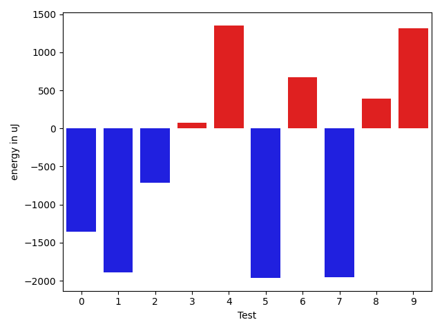

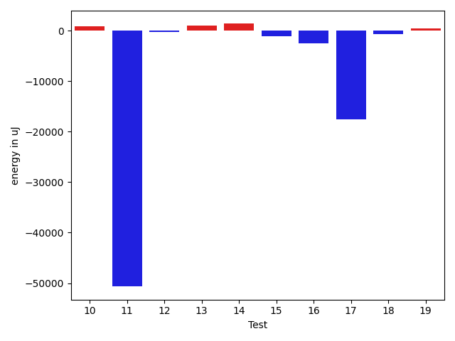

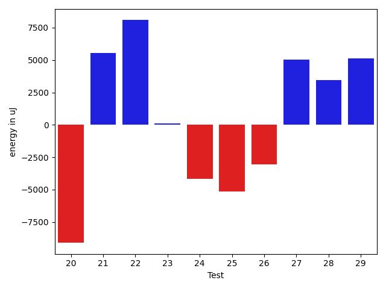

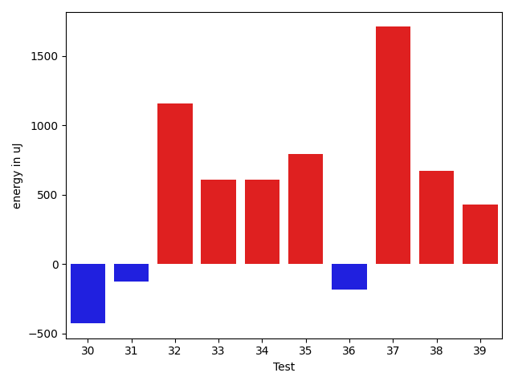

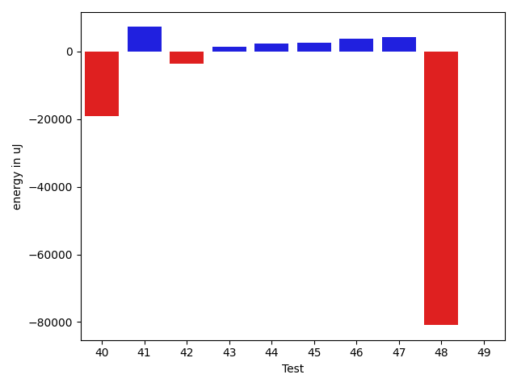

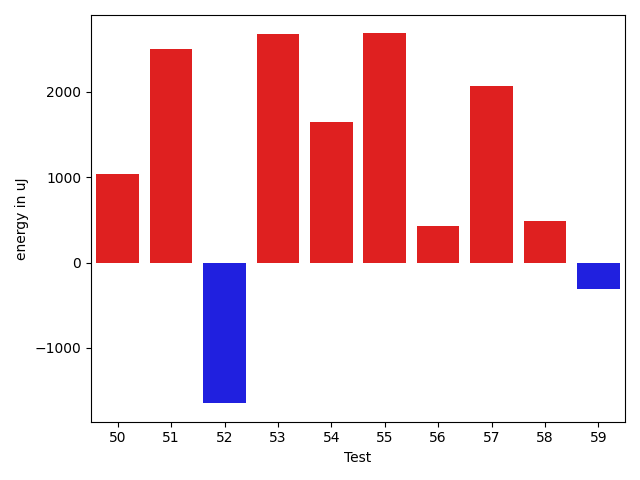

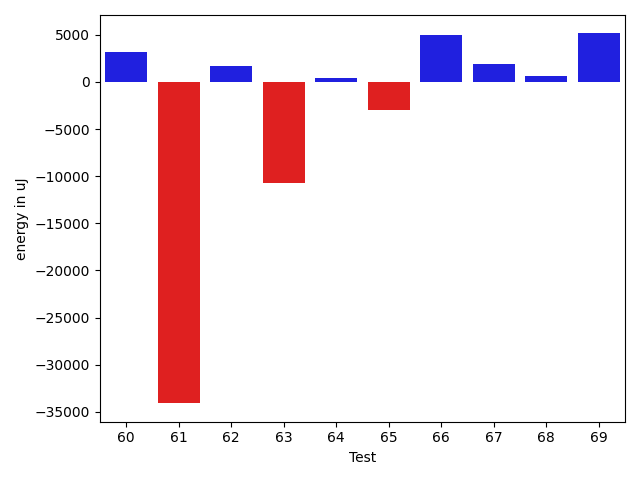

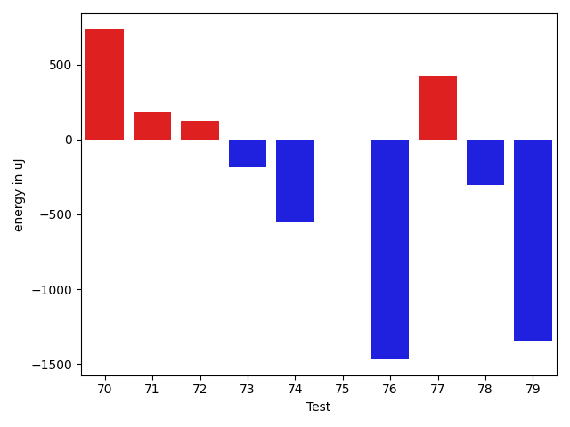

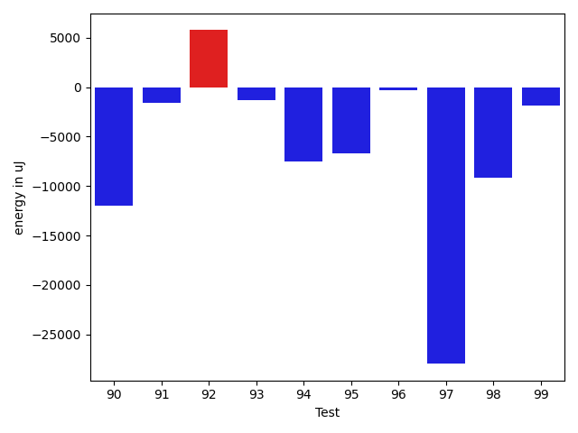

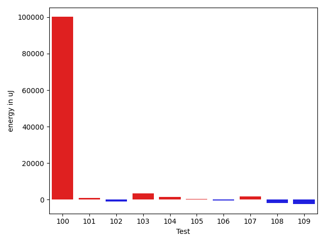

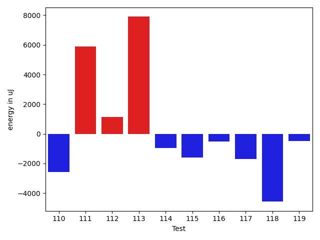

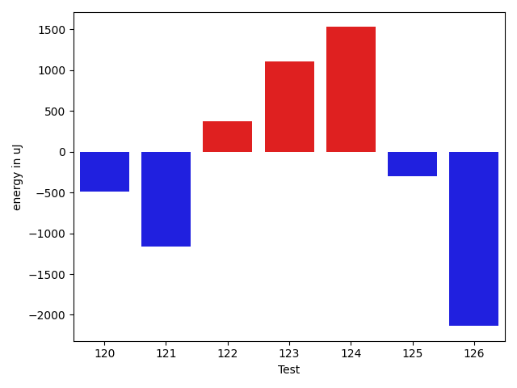

| ID | EnergyV1 | EnergyV2 | DeltaEnergy | σV1 | σV2 |
| --- | --- | --- | --- | --- | --- |
| 0 | 39367 | 38147 | -1220 | 9304.970201624774 | 6814.239798424844 |
| 1 | 39123 | 38818 | -305 | 10107.03101446196 | 4091.120925957038 |
| 2 | 38330 | 37659 | -671 | 3932.2955790267515 | 3892.6856020611003 |
| 3 | 41016 | 40405 | -611 | 15398.782110840544 | 20404.2624943537 |
| 4 | 38025 | 38697 | 672 | 4599.8471639769805 | 3559.8878657931455 |
| 5 | 39978 | 38208 | -1770 | 11027.884254532146 | 9897.67338100009 |
| 6 | 40893 | 40100 | -793 | 11661.546258254986 | 11647.00376024765 |
| 7 | 39245 | 38207 | -1038 | 3878.4512505326466 | 4151.898119486034 |
| 8 | 44921 | 45044 | 123 | 33036.53166757662 | 32949.15422155738 |
| 9 | 41809 | 41931 | 122 | 17803.52903164466 | 18083.388910452737 |
| 10 | 37719 | 38574 | 855 | 3626.5564776387027 | 3727.09838099876 |
| 11 | 487975 | 437316 | -50659 | 301534.4743581084 | 276477.5326142684 |
| 12 | 39124 | 38880 | -244 | 3548.7286588750326 | 3472.0553101393225 |
| 13 | 38269 | 39246 | 977 | 13489.108573797103 | 7658.839684235178 |
| 14 | 36133 | 37475 | 1342 | 4542.291783469847 | 5719.0108096040685 |
| 15 | 40466 | 39307 | -1159 | 19930.551988001713 | 19059.769801778257 |
| 16 | 40711 | 38147 | -2564 | 3982.499058162336 | 4126.256543591668 |
| 17 | 219848 | 202209 | -17639 | 145236.87796692346 | 104257.06508253292 |
| 18 | 41870 | 41199 | -671 | 3702.12830464748 | 3008.8064360390767 |
| 19 | 40772 | 41198 | 426 | 27440.88377980527 | 13119.491315533016 |
| 20 | 39184 | 40894 | 1710 | 12802.846182774983 | 14879.275757612477 |
| 21 | 41443 | 41687 | 244 | 90473.70992860397 | 106713.28631523097 |
| 22 | 39307 | 41260 | 1953 | 4665.609694683992 | 4381.674577212657 |
| 23 | 37719 | 38025 | 306 | 14682.953987567364 | 17924.660666596734 |
| 24 | 39245 | 41809 | 2564 | 19872.332593798717 | 19521.767602694457 |
| 25 | 37048 | 36927 | -121 | 4387.403849985992 | 4628.656414485004 |
| 26 | 38513 | 39733 | 1220 | 4778.399884465759 | 4316.022722512056 |
| 27 | 37231 | 36011 | -1220 | 3472.005419670832 | 3829.2299763256865 |
| 28 | 38025 | 37781 | -244 | 4538.053466370812 | 4788.110724241869 |
| 29 | 37475 | 38696 | 1221 | 3407.8716558614447 | 4547.737077497079 |
| 30 | 37475 | 37048 | -427 | 4780.103107679204 | 4566.999170231853 |
| 31 | 42969 | 42846 | -123 | 38734.648544379874 | 38936.17021137544 |
| 32 | 36499 | 37659 | 1160 | 4217.557226445814 | 4122.864326958373 |
| 33 | 37476 | 38086 | 610 | 3995.9627795706865 | 4184.011130047772 |
| 34 | 37354 | 37963 | 609 | 4807.937943109592 | 4224.494880478885 |
| 35 | 37720 | 38513 | 793 | 15766.728177581199 | 16627.835229534587 |
| 36 | 38391 | 38208 | -183 | 12397.77328927345 | 10201.60744599704 |
| 37 | 35583 | 37292 | 1709 | 4301.549058907904 | 4636.528404155233 |
| 38 | 37842 | 38513 | 671 | 19108.026972104333 | 9174.073285589944 |
| 39 | 37048 | 37475 | 427 | 3181.515473483144 | 3861.6283691582234 |
| 40 | 36499 | 37964 | 1465 | 10005.078602577292 | 7725.002422189879 |
| 41 | 37841 | 37414 | -427 | 9242.477456342853 | 11022.326274840949 |
| 42 | 36438 | 37842 | 1404 | 3951.7881107367916 | 7119.068067542016 |
| 43 | 39124 | 40710 | 1586 | 64789.30629475891 | 79267.74548687559 |
| 44 | 34851 | 37171 | 2320 | 3823.897005316727 | 4204.430705364641 |
| 45 | 36866 | 37231 | 365 | 4807.125275244068 | 4614.117983869111 |
| 46 | 38086 | 37597 | -489 | 4482.280388812081 | 4149.42243401991 |
| 47 | 36865 | 36621 | -244 | 4313.814143608878 | 4748.4664823639205 |
| 48 | 37476 | 37842 | 366 | 3914.245851799098 | 4411.710523887466 |
| 49 | 37292 | 37719 | 427 | 3930.770257153774 | 4231.763713319757 |
| 50 | 37354 | 38391 | 1037 | 12954.074271421643 | 15277.541403687983 |
| 51 | 38086 | 40588 | 2502 | 20534.4753575124 | 26675.654938908967 |
| 52 | 37110 | 35462 | -1648 | 4330.165364613453 | 4095.5480308814626 |
| 53 | 35523 | 38207 | 2684 | 4147.936581000245 | 4239.742906569418 |
| 54 | 37048 | 38696 | 1648 | 4203.574447368271 | 7225.413962404132 |
| 55 | 34607 | 37292 | 2685 | 4347.5744387745535 | 3699.3574301189046 |
| 56 | 36194 | 36621 | 427 | 3476.094067619884 | 4112.984884510025 |
| 57 | 36011 | 38086 | 2075 | 5019.164712196967 | 4895.621089848753 |
| 58 | 40283 | 40771 | 488 | 11021.339252929645 | 10110.7994872315 |
| 59 | 39734 | 39428 | -306 | 9267.904644268412 | 5611.012709903619 |
| 60 | 357360 | 441588 | 84228 | 217535.4795819996 | 242937.6276966054 |
| 61 | 39917 | 40222 | 305 | 15258.615669364068 | 9716.691898961422 |
| 62 | 37903 | 39916 | 2013 | 5007.288621359867 | 12853.937962595526 |
| 63 | 36133 | 36376 | 243 | 3701.3268549978598 | 4007.672356066579 |
| 64 | 36499 | 38208 | 1709 | 3423.9154597623783 | 3499.9409770384395 |
| 65 | 38391 | 39795 | 1404 | 13494.017107591253 | 15019.818297705693 |
| 66 | 38268 | 38635 | 367 | 3420.629399063885 | 2939.780161054346 |
| 67 | 39429 | 37964 | -1465 | 46699.03408194861 | 28430.69401537327 |
| 68 | 38696 | 39184 | 488 | 19242.976911704638 | 9782.56758573471 |
| 69 | 37841 | 37780 | -61 | 13490.213252076639 | 10381.879966683848 |
| 70 | 38086 | 38819 | 733 | 10939.417072940752 | 7468.729687887133 |
| 71 | 38879 | 39063 | 184 | 5046.811016214935 | 3838.312983451686 |
| 72 | 38513 | 38636 | 123 | 8749.554839850744 | 6396.420510658358 |
| 73 | 37414 | 37231 | -183 | 4295.427788531468 | 3328.6604944352102 |
| 74 | 38391 | 37842 | -549 | 4284.71356136324 | 4076.435887267905 |
| 75 | 37537 | 37536 | -1 | 3781.344639849502 | 3896.302480003851 |
| 76 | 37597 | 36133 | -1464 | 3625.662533441302 | 3999.2143403380364 |
| 77 | 37659 | 38086 | 427 | 4167.874639751947 | 7609.006730883038 |
| 78 | 39123 | 38818 | -305 | 12555.245757420218 | 9700.050246120196 |
| 79 | 42603 | 41260 | -1343 | 121088.2134120013 | 71634.9842175562 |
| 80 | 37659 | 36926 | -733 | 2932.6923974779306 | 3508.378993176666 |
| 81 | 37476 | 38940 | 1464 | 9266.274568733588 | 9349.002371809896 |
| 82 | 37720 | 36377 | -1343 | 4393.868360702067 | 3915.771665981045 |
| 83 | 37781 | 37719 | -62 | 3774.8443301710863 | 4056.790118408249 |
| 84 | 38696 | 39978 | 1282 | 4492.233816692021 | 16458.793588775847 |
| 85 | 36926 | 37720 | 794 | 3978.37088346932 | 4087.3793373884077 |
| 86 | 76294 | 81787 | 5493 | 51416.74399082362 | 65846.49262577479 |
| 87 | 40649 | 41321 | 672 | 10744.543836063742 | 19659.752195952267 |
| 88 | 39917 | 39978 | 61 | 9667.893033949753 | 13830.021900916994 |
| 89 | 38208 | 39245 | 1037 | 20206.684649655228 | 9767.094541523367 |
| 90 | 78369 | 73547 | -4822 | 57317.22536647878 | 34794.740414444415 |
| 91 | 38452 | 38879 | 427 | 13092.946808231352 | 3731.731513600623 |
| 92 | 46082 | 71045 | 24963 | 35098.166808938855 | 32683.54597705164 |
| 93 | 40283 | 39795 | -488 | 20106.302921695824 | 15046.711420189098 |
| 94 | 39184 | 39001 | -183 | 50701.76279968533 | 13912.003583886368 |
| 95 | 42419 | 40406 | -2013 | 22016.24028549243 | 18945.35010928105 |
| 96 | 40039 | 39246 | -793 | 6148.846404364221 | 6882.798658033993 |
| 97 | 86242 | 83862 | -2380 | 303275.84379102645 | 232847.17024016057 |
| 98 | 43396 | 41015 | -2381 | 26453.621084086946 | 20682.168815313664 |
| 99 | 39490 | 38635 | -855 | 6879.0162278457865 | 3583.486341931806 |
| 100 | 40771 | 40344 | -427 | 198691.25747984613 | 391541.48771742627 |
| 101 | 37597 | 39917 | 2320 | 7096.23938535905 | 3665.293203127088 |
| 102 | 39856 | 41809 | 1953 | 24040.16087052156 | 21148.56311607454 |
| 103 | 37903 | 41016 | 3113 | 4403.2711685249915 | 3375.591813023943 |
| 104 | 39307 | 40710 | 1403 | 4348.696137377053 | 3406.5281483513686 |
| 105 | 41138 | 39978 | -1160 | 11781.536315242478 | 15211.365796868338 |
| 106 | 38818 | 38880 | 62 | 5196.499178248141 | 4065.6262562158695 |
| 107 | 39550 | 40954 | 1404 | 17789.108353908567 | 16671.553460189352 |
| 108 | 38818 | 40283 | 1465 | 25006.049499917754 | 18977.167624056583 |
| 109 | 41260 | 40100 | -1160 | 10973.938833929045 | 8629.848391144089 |
| 110 | 40893 | 37780 | -3113 | 4112.394719798743 | 3994.0135187120136 |
| 111 | 41321 | 40954 | -367 | 21898.7156038997 | 30616.274968813177 |
| 112 | 40771 | 40161 | -610 | 27806.61303879875 | 31332.48050803297 |
| 113 | 39429 | 40039 | 610 | 63298.41090252287 | 75756.89326243354 |
| 114 | 40466 | 40406 | -60 | 23989.04797601604 | 20950.642707646883 |
| 115 | 40222 | 39184 | -1038 | 32574.277226395378 | 28952.993375503607 |
| 116 | 41016 | 40588 | -428 | 13019.429755800853 | 9884.756402922836 |
| 117 | 40466 | 39002 | -1464 | 6148.595218936089 | 7137.249850842382 |
| 118 | 42846 | 43090 | 244 | 148759.82892588963 | 144636.48113425117 |
| 119 | 40772 | 40955 | 183 | 14116.909511032765 | 12664.431932786089 |
| 120 | 39368 | 38880 | -488 | 4222.835053610312 | 4238.864318021659 |
| 121 | 41138 | 39978 | -1160 | 6311.5013265618745 | 7089.351139530539 |
| 122 | 39794 | 40161 | 367 | 4779.60803725076 | 6163.838902678717 |
| 123 | 39428 | 40528 | 1100 | 13413.001909814482 | 13874.196092656382 |
| 124 | 39612 | 41137 | 1525 | 54352.261856808786 | 25046.227935712315 |
| 125 | 42359 | 42053 | -306 | 102539.77083754336 | 105735.91327994016 |
| 126 | 43213 | 41077 | -2136 | 28654.78396579781 | 27426.22987546955 |

## Delta Duration per test method

| ID | DurationV1 | DurationsV2 | DeltaDuration |
| --- | --- | --- | --- |
| 0 | 1006328.390625 | 981013.7580645161 | -25314.63256048388 |
| 1 | 900016.7857142857 | 870612.0178571428 | -29404.76785714284 |
| 2 | 619309.125 | 579740.027027027 | -39569.09797297302 |
| 3 | 1346439.5142857144 | 1314235.12 | -32204.394285714254 |
| 4 | 838250.4565217391 | 825660.8297872341 | -12589.626734505058 |
| 5 | 1222688.1888888888 | 1302607.4567901234 | 79919.26790123456 |
| 6 | 1162468.0684931506 | 1190448.3717948718 | 27980.303301721113 |
| 7 | 683742.976744186 | 671033.2093023256 | -12709.7674418604 |
| 8 | 2002278.4646464647 | 1916026.2959183673 | -86252.16872809734 |
| 9 | 1610685.797979798 | 1552507.707070707 | -58178.090909090824 |
| 10 | 853720.5964912281 | 806810.4035087719 | -46910.19298245618 |
| 11 | 11954855.161616161 | 10145995.434343435 | -1808859.7272727266 |
| 12 | 760645.4444444445 | 716564.2 | -44081.24444444454 |
| 13 | 1363911.956043956 | 1273717.7209302327 | -90194.23511372344 |
| 14 | 942077.3636363636 | 836502.0769230769 | -105575.28671328677 |
| 15 | 900729.1632653062 | 909817.2564102564 | 9088.093144950224 |
| 16 | 737626.4375 | 741308.4772727273 | 3682.039772727294 |
| 17 | 7651778.313131313 | 6550285.838383839 | -1101492.4747474743 |
| 18 | 788376.2368421053 | 741347.5882352941 | -47028.648606811184 |
| 19 | 1080998.761904762 | 752886.0243902439 | -328112.73751451797 |
| 20 | 1041802.0857142857 | 1034920.5272727272 | -6881.558441558504 |
| 21 | 1813770.9101123596 | 2033257.743902439 | 219486.83379007946 |
| 22 | 784549.4047619047 | 865727.3461538461 | 81177.9413919414 |
| 23 | 1222823.732142857 | 1249224.8983050848 | 26401.166162227746 |
| 24 | 1530968.1734693877 | 1582689.9897959183 | 51721.81632653065 |
| 25 | 811927.4772727273 | 790504.5581395349 | -21422.919133192394 |
| 26 | 810104.8510638297 | 826301.4255319149 | 16196.574468085193 |
| 27 | 761237.1276595745 | 784620.574074074 | 23383.446414499544 |
| 28 | 831979.081632653 | 828912.3 | -3066.781632652972 |
| 29 | 705039.9387755102 | 717820.2708333334 | 12780.332057823194 |
| 30 | 959030.6153846154 | 925364.609375 | -33666.006009615376 |
| 31 | 2070858.8387096773 | 2064130.5842696629 | -6728.254440014483 |
| 32 | 759921.4576271187 | 798115.0 | 38193.54237288132 |
| 33 | 733207.2678571428 | 774428.9545454546 | 41221.68668831175 |
| 34 | 798884.1538461539 | 808701.4038461539 | 9817.25 |
| 35 | 1140053.1666666667 | 1213872.309859155 | 73819.14319248823 |
| 36 | 978596.6333333333 | 949566.8833333333 | -29029.75 |
| 37 | 801813.0806451613 | 841131.9107142857 | 39318.83006912435 |
| 38 | 1330688.0833333333 | 1096368.7625 | -234319.3208333333 |
| 39 | 733031.6170212766 | 766171.4545454546 | 33139.83752417797 |
| 40 | 985451.25 | 967010.6666666666 | -18440.583333333372 |
| 41 | 1040714.515625 | 1079405.3389830508 | 38690.82335805078 |
| 42 | 1019525.1710526316 | 1058608.0253164556 | 39082.85426382406 |
| 43 | 1514376.4193548388 | 1694899.3484848484 | 180522.9291300096 |
| 44 | 752165.4629629629 | 731685.1923076923 | -20480.270655270666 |
| 45 | 791857.4716981133 | 758985.8372093023 | -32871.6344888109 |
| 46 | 794282.8723404255 | 805636.6862745098 | 11353.81393408426 |
| 47 | 833314.22 | 798773.1052631579 | -34541.11473684211 |
| 48 | 694891.8181818182 | 755304.0487804879 | 60412.230598669616 |
| 49 | 904890.7735849057 | 892817.7115384615 | -12073.06204644416 |
| 50 | 1273881.0 | 1185170.2394366197 | -88710.76056338032 |
| 51 | 1072680.646153846 | 1186792.7413793104 | 114112.09522546432 |
| 52 | 667733.2571428572 | 635325.4193548387 | -32407.837788018514 |
| 53 | 743859.84 | 757544.1891891892 | 13684.349189189263 |
| 54 | 807624.0188679246 | 849378.725490196 | 41754.70662227145 |
| 55 | 604382.3333333334 | 576002.2424242424 | -28380.09090909094 |
| 56 | 792937.1272727273 | 794657.3913043478 | 1720.2640316204634 |
| 57 | 798421.8979591837 | 767168.0227272727 | -31253.875231910963 |
| 58 | 1204152.8536585367 | 1122176.0675675676 | -81976.78609096911 |
| 59 | 1108156.7837837837 | 1065718.0273972603 | -42438.75638652337 |
| 60 | 7406636.7710843375 | 8148212.292134832 | 741575.5210504942 |
| 61 | 1144148.4655172413 | 949362.1617647059 | -194786.30375253537 |
| 62 | 595164.64 | 684736.1724137932 | 89571.53241379315 |
| 63 | 693035.119047619 | 653246.2666666667 | -39788.85238095233 |
| 64 | 761454.085106383 | 720348.431372549 | -41105.653733833926 |
| 65 | 1260585.355263158 | 1247527.1692307692 | -13058.186032388825 |
| 66 | 775750.8297872341 | 727096.2352941176 | -48654.594493116485 |
| 67 | 1579196.7837837837 | 902192.2558139535 | -677004.5279698302 |
| 68 | 1120516.9324324324 | 954411.7692307692 | -166105.16320166318 |
| 69 | 1043275.3448275862 | 1044044.966101695 | 769.6212741087656 |
| 70 | 1198046.975308642 | 1110646.7411764706 | -87400.23413217138 |
| 71 | 813265.2727272727 | 806630.6326530612 | -6634.640074211522 |
| 72 | 944865.5 | 810085.9821428572 | -134779.51785714284 |
| 73 | 838226.5555555555 | 800939.693877551 | -37286.8616780045 |
| 74 | 755971.8913043478 | 740734.6521739131 | -15237.239130434697 |
| 75 | 756513.3421052631 | 773101.0697674418 | 16587.727662178688 |
| 76 | 585372.84 | 603476.8529411765 | 18104.012941176537 |
| 77 | 1014781.1176470588 | 1040066.6779661017 | 25285.56031904288 |
| 78 | 1108049.2972972973 | 1075725.6849315069 | -32323.61236579041 |
| 79 | 2652659.6818181816 | 1678404.8513513512 | -974254.8304668304 |
| 80 | 441812.0 | 448945.3076923077 | 7133.307692307688 |
| 81 | 1043482.3582089553 | 990988.8771929825 | -52493.48101597279 |
| 82 | 760391.4489795918 | 713723.725490196 | -46667.72348939581 |
| 83 | 823261.3818181818 | 798285.6666666666 | -24975.715151515207 |
| 84 | 859848.1923076923 | 1022329.0769230769 | 162480.88461538462 |
| 85 | 787186.5471698113 | 806068.1219512195 | 18881.574781408184 |
| 86 | 2342191.3232323234 | 2952396.4242424243 | 610205.1010101009 |
| 87 | 919866.475409836 | 1308884.625 | 389018.14959016396 |
| 88 | 1100390.5342465753 | 1184826.025 | 84435.49075342459 |
| 89 | 980895.619047619 | 956275.6333333333 | -24619.98571428575 |
| 90 | 2278774.5172413792 | 2017489.6455696202 | -261284.87167175906 |
| 91 | 944422.1320754717 | 857070.24 | -87351.8920754717 |
| 92 | 1805663.4 | 1978500.7647058824 | 172837.3647058825 |
| 93 | 1215224.4487179487 | 1143902.3142857142 | -71322.13443223457 |
| 94 | 1166248.0666666667 | 934701.2105263158 | -231546.8561403508 |
| 95 | 1464794.303030303 | 1130291.5901639345 | -334502.71286636847 |
| 96 | 927695.5818181818 | 922486.0188679246 | -5209.562950257212 |
| 97 | 4169534.1515151514 | 3542712.484848485 | -626821.6666666665 |
| 98 | 1506143.0526315789 | 1211908.5573770492 | -294234.49525452964 |
| 99 | 997435.527027027 | 979565.6825396825 | -17869.844487344497 |
| 100 | 1737681.8115942029 | 4525975.796875 | 2788293.985280797 |
| 101 | 865256.5333333333 | 771365.224489796 | -93891.30884353735 |
| 102 | 1594581.75 | 1513697.5567010308 | -80884.19329896918 |
| 103 | 612910.9487179487 | 615492.4545454546 | 2581.50582750584 |
| 104 | 692304.5476190476 | 590699.2142857143 | -101605.33333333326 |
| 105 | 1240930.0 | 1289093.1081081082 | 48163.108108108165 |
| 106 | 870091.8333333334 | 855438.7586206896 | -14653.074712643749 |
| 107 | 1220107.453125 | 1268259.6911764706 | 48152.2380514706 |
| 108 | 1281723.2835820895 | 1293818.4788732394 | 12095.195291149896 |
| 109 | 1096922.5625 | 1112068.4545454546 | 15145.892045454588 |
| 110 | 615851.2857142857 | 786598.4444444445 | 170747.15873015882 |
| 111 | 941576.0370370371 | 1201054.1346153845 | 259478.09757834743 |
| 112 | 1257698.2207792208 | 1264094.8055555555 | 6396.584776334697 |
| 113 | 1482792.8421052631 | 1660757.2702702703 | 177964.42816500715 |
| 114 | 1160774.2857142857 | 1214171.68852459 | 53397.402810304426 |
| 115 | 1295563.9516129033 | 1397344.6133333333 | 101780.66172043001 |
| 116 | 902616.2708333334 | 1028727.1272727273 | 126110.85643939395 |
| 117 | 950987.8703703703 | 1057672.671875 | 106684.80150462966 |
| 118 | 2892090.597938144 | 2791980.5212765955 | -100110.07666154858 |
| 119 | 1146507.1724137932 | 1085283.8510638298 | -61223.32134996331 |
| 120 | 811826.5833333334 | 822597.5625 | 10770.979166666628 |
| 121 | 947685.4807692308 | 910906.8947368421 | -36778.586032388615 |
| 122 | 861944.4363636364 | 833894.6851851852 | -28049.75117845123 |
| 123 | 1073070.4736842106 | 1051285.2258064516 | -21785.247877758928 |
| 124 | 1389283.711111111 | 876617.5434782609 | -512666.16763285024 |
| 125 | 2121664.8208955224 | 1865540.352112676 | -256124.46878284635 |
| 126 | 1232587.3333333333 | 1189378.888888889 | -43208.44444444426 |

## Misc.

| ID | Test Class | Test Method |
| --- | --- | --- |
| 0 | com.google.gson.functional.CustomTypeAdaptersTest | testCustomAdapterInvokedForCollectionElementDeserialization |
| 1 | com.google.gson.functional.CustomTypeAdaptersTest | testCustomAdapterInvokedForMapElementSerializationWithType |
| 2 | com.google.gson.functional.CustomTypeAdaptersTest | testCustomAdapterInvokedForCollectionElementSerialization |
| 3 | com.google.gson.functional.CustomTypeAdaptersTest | testCustomAdapterInvokedForCollectionElementSerializationWithType |
| 4 | com.google.gson.functional.CustomTypeAdaptersTest | testCustomAdapterInvokedForMapElementDeserialization |
| 5 | com.google.gson.functional.StreamingTypeAdaptersTest | testNullSafe |
| 6 | com.google.gson.functional.StreamingTypeAdaptersTest | testSerializeWithCustomTypeAdapter |
| 7 | com.google.gson.functional.StreamingTypeAdaptersTest | testDeserializeWithCustomTypeAdapter |
| 8 | com.google.gson.functional.InstanceCreatorTest | testInstanceCreatorForParametrizedType |
| 9 | com.google.gson.functional.InstanceCreatorTest | testInstanceCreatorForCollectionType |
| 10 | com.google.gson.functional.DefaultTypeAdaptersTest | testTreeSetDeserialization |
| 11 | com.google.gson.functional.DefaultTypeAdaptersTest | testNullSerialization |
| 12 | com.google.gson.functional.DefaultTypeAdaptersTest | testTreeSetSerialization |
| 13 | com.google.gson.functional.DefaultTypeAdaptersTest | testDateSerializationInCollection |
| 14 | com.google.gson.functional.DefaultTypeAdaptersTest | testSetSerialization |
| 15 | com.google.gson.ParameterizedTypeTest | testNotEquals |
| 16 | com.google.gson.ParameterizedTypeTest | testOurTypeFunctionality |
| 17 | com.google.gson.functional.CircularReferenceTest | testCircularSerialization |
| 18 | com.google.gson.functional.CircularReferenceTest | testDirectedAcyclicGraphSerialization |
| 19 | com.google.gson.functional.CircularReferenceTest | testDirectedAcyclicGraphDeserialization |
| 20 | com.google.gson.functional.PrettyPrintingTest | testEmptyMapField |
| 21 | com.google.gson.functional.PrettyPrintingTest | testPrettyPrintList |
| 22 | com.google.gson.functional.PrettyPrintingTest | testPrettyPrintListOfPrimitiveArrays |
| 23 | com.google.gson.functional.MapTest | testMapSerializationWithNullValues |
| 24 | com.google.gson.functional.MapTest | testInterfaceTypeMapWithSerializer |
| 25 | com.google.gson.functional.MapTest | testMapDeserializationWithIntegerKeys |
| 26 | com.google.gson.functional.MapTest | testMapSerializationEmpty |
| 27 | com.google.gson.functional.MapTest | testMapOfMapDeserialization |
| 28 | com.google.gson.functional.MapTest | testMapDeserializationWithNullKey |
| 29 | com.google.gson.functional.MapTest | testStringKeyDeserialization |
| 30 | com.google.gson.functional.MapTest | testMapSerializationWithIntegerKeys |
| 31 | com.google.gson.functional.MapTest | testInterfaceTypeMap |
| 32 | com.google.gson.functional.MapTest | testDeerializeMapOfMaps |
| 33 | com.google.gson.functional.MapTest | testSerializeMapOfMaps |
| 34 | com.google.gson.functional.MapTest | testMapDeserializationWithNullValue |
| 35 | com.google.gson.functional.MapTest | testMapNamePromotionWithJsonElementReader |
| 36 | com.google.gson.functional.MapTest | testNumberKeyDeserialization |
| 37 | com.google.gson.functional.MapTest | testComplexKeysDeserialization |
| 38 | com.google.gson.functional.MapTest | testComplexKeysSerialization |
| 39 | com.google.gson.functional.MapTest | testReadMapsWithEmptyStringKey |
| 40 | com.google.gson.functional.MapTest | testMapSubclassDeserialization |
| 41 | com.google.gson.functional.MapTest | testCustomSerializerForSpecificMapType |
| 42 | com.google.gson.functional.MapTest | testSortedMap |
| 43 | com.google.gson.functional.MapTest | testMapSerialization |
| 44 | com.google.gson.functional.MapTest | testMapDeserializationWithWildcardValues |
| 45 | com.google.gson.functional.MapTest | testMapSerializationWithNullKey |
| 46 | com.google.gson.functional.MapTest | testMapSerializationWithNullValue |
| 47 | com.google.gson.functional.MapTest | testHashMapDeserialization |
| 48 | com.google.gson.functional.MapTest | testMapDeserializationWithDuplicateKeys |
| 49 | com.google.gson.functional.MapTest | testGeneralMapField |
| 50 | com.google.gson.functional.MapTest | testMapSerializationWithWildcardValues |
| 51 | com.google.gson.functional.MapTest | testMapDeserialization |
| 52 | com.google.gson.functional.MapTest | testMapSubclassSerialization |
| 53 | com.google.gson.functional.MapTest | testBooleanKeyDeserialization |
| 54 | com.google.gson.functional.MapTest | testMapDeserializationEmpty |
| 55 | com.google.gson.functional.MapTest | testMapSerializationWithNullValuesSerialized |
| 56 | com.google.gson.functional.MapTest | testMapSerializationWithNullValueButSerializeNulls |
| 57 | com.google.gson.functional.MapTest | testMapStandardSubclassDeserialization |
| 58 | com.google.gson.functional.ObjectTest | testEmptyCollectionInAnObjectDeserialization |
| 59 | com.google.gson.functional.ObjectTest | testSingletonLists |
| 60 | com.google.gson.functional.ObjectTest | testDateAsMapObjectField |
| 61 | com.google.gson.functional.ObjectTest | testTruncatedDeserialization |
| 62 | com.google.gson.functional.ObjectTest | testEmptyCollectionInAnObjectSerialization |
| 63 | com.google.gson.functional.CollectionTest | testRawCollectionSerialization |
| 64 | com.google.gson.functional.CollectionTest | testCollectionOfStringsDeserialization |
| 65 | com.google.gson.functional.CollectionTest | testWildcardPrimitiveCollectionSerilaization |
| 66 | com.google.gson.functional.CollectionTest | testWildcardPrimitiveCollectionDeserilaization |
| 67 | com.google.gson.functional.CollectionTest | testCollectionOfBagOfPrimitivesSerialization |
| 68 | com.google.gson.functional.CollectionTest | testTopLevelCollectionOfIntegersDeserialization |
| 69 | com.google.gson.functional.CollectionTest | testSetDeserialization |
| 70 | com.google.gson.functional.CollectionTest | testWildcardCollectionField |
| 71 | com.google.gson.functional.CollectionTest | testTopLevelListOfIntegerCollectionsDeserialization |
| 72 | com.google.gson.functional.CollectionTest | testTopLevelCollectionOfIntegersSerialization |
| 73 | com.google.gson.functional.CollectionTest | testCollectionOfObjectSerialization |
| 74 | com.google.gson.functional.CollectionTest | testNullsInListSerialization |
| 75 | com.google.gson.functional.CollectionTest | testQueueDeserialization |
| 76 | com.google.gson.functional.CollectionTest | testRawCollectionOfIntegersSerialization |
| 77 | com.google.gson.functional.CollectionTest | testQueueSerialization |
| 78 | com.google.gson.functional.CollectionTest | testUserCollectionTypeAdapter |
| 79 | com.google.gson.functional.CollectionTest | testSetSerialization |
| 80 | com.google.gson.functional.CollectionTest | testCollectionOfStringsSerialization |
| 81 | com.google.gson.functional.CollectionTest | testLinkedListSerialization |
| 82 | com.google.gson.functional.CollectionTest | testNullsInListDeserialization |
| 83 | com.google.gson.functional.CollectionTest | testFieldIsArrayList |
| 84 | com.google.gson.functional.CollectionTest | testLinkedListDeserialization |
| 85 | com.google.gson.functional.CollectionTest | testCollectionOfObjectWithNullSerialization |
| 86 | com.google.gson.functional.InheritanceTest | testSubInterfacesOfCollectionSerialization |
| 87 | com.google.gson.functional.InheritanceTest | testClassWithBaseCollectionFieldSerialization |
| 88 | com.google.gson.functional.InheritanceTest | testSubInterfacesOfCollectionDeserialization |
| 89 | com.google.gson.functional.EnumTest | testEnumSubclassAsParameterizedType |
| 90 | com.google.gson.functional.EnumTest | testEnumSubclass |
| 91 | com.google.gson.functional.EnumTest | testCollectionOfEnumsDeserialization |
| 92 | com.google.gson.functional.EnumTest | testEnumSubclassWithRegisteredTypeAdapter |
| 93 | com.google.gson.functional.EnumTest | testEnumSet |
| 94 | com.google.gson.functional.EnumTest | testCollectionOfEnumsSerialization |
| 95 | com.google.gson.functional.JsonParserTest | testExtraCommasInArrays |
| 96 | com.google.gson.functional.JsonParserTest | testExtraCommasInMaps |
| 97 | com.google.gson.functional.MapAsArrayTypeAdapterTest | testSerializeComplexMapWithTypeAdapter |
| 98 | com.google.gson.functional.MapAsArrayTypeAdapterTest | testTwoTypesCollapseToOneDeserialize |
| 99 | com.google.gson.functional.MapAsArrayTypeAdapterTest | testMultipleEnableComplexKeyRegistrationHasNoEffect |
| 100 | com.google.gson.CommentsTest | testParseComments |
| 101 | com.google.gson.functional.NullObjectAndFieldTest | testPrintPrintingObjectWithNulls |
| 102 | com.google.gson.functional.NullObjectAndFieldTest | testExplicitSerializationOfNullArrayMembers |
| 103 | com.google.gson.functional.NullObjectAndFieldTest | testExplicitSerializationOfNullStringMembers |
| 104 | com.google.gson.functional.NullObjectAndFieldTest | testExplicitSerializationOfNullCollectionMembers |
| 105 | com.google.gson.functional.ArrayTest | testArrayOfCollectionSerialization |
| 106 | com.google.gson.functional.ArrayTest | testArrayOfCollectionDeserialization |
| 107 | com.google.gson.functional.MoreSpecificTypeSerializationTest | testListOfSubclassFields |
| 108 | com.google.gson.functional.MoreSpecificTypeSerializationTest | testMapOfSubclassFields |
| 109 | com.google.gson.reflect.TypeTokenTest | testIsAssignableFromWithBasicWildcards |
| 110 | com.google.gson.reflect.TypeTokenTest | testIsAssignableFromWithNestedWildcards |
| 111 | com.google.gson.reflect.TypeTokenTest | testIsAssignableFromWithTypeParameters |
| 112 | com.google.gson.functional.RawSerializationTest | testCollectionOfObjects |
| 113 | com.google.gson.functional.RawSerializationTest | testCollectionOfPrimitives |
| 114 | com.google.gson.functional.PrimitiveTest | testStringsAsBooleans |
| 115 | com.google.gson.MixedStreamTest | testWriteLenient |
| 116 | com.google.gson.MixedStreamTest | testReadClosed |
| 117 | com.google.gson.MixedStreamTest | testWriteHtmlSafe |
| 118 | com.google.gson.functional.DelegateTypeAdapterTest | testDelegateInvoked |
| 119 | com.google.gson.functional.ReadersWritersTest | testTypeMismatchThrowsJsonSyntaxExceptionForStrings |
| 120 | com.google.gson.functional.ReadersWritersTest | testTypeMismatchThrowsJsonSyntaxExceptionForReaders |
| 121 | com.google.gson.DefaultMapJsonSerializerTest | testEmptyMapSerialization |
| 122 | com.google.gson.DefaultMapJsonSerializerTest | testNonEmptyMapSerialization |
| 123 | com.google.gson.functional.UncategorizedTest | testTrailingWhitespace |
| 124 | com.google.gson.FieldAttributesTest | testDeclaredTypeAndClass |
| 125 | com.google.gson.functional.PrintFormattingTest | testCompactFormattingLeavesNoWhiteSpace |
| 126 | com.google.gson.functional.EscapingTest | testEscapeAllHtmlCharacters |

| Test | IterationV1 | IterationV2 | DeltaIteration |
| --- | --- | --- | --- |
| 0 | 64 | 62 | -2 |
| 1 | 56 | 56 | 0 |
| 2 | 24 | 37 | 13 |
| 3 | 70 | 75 | 5 |
| 4 | 46 | 47 | 1 |
| 5 | 90 | 81 | -9 |
| 6 | 73 | 78 | 5 |
| 7 | 43 | 43 | 0 |
| 8 | 99 | 98 | -1 |
| 9 | 99 | 99 | 0 |
| 10 | 57 | 57 | 0 |
| 11 | 99 | 99 | 0 |
| 12 | 45 | 30 | -15 |
| 13 | 91 | 86 | -5 |
| 14 | 44 | 39 | -5 |
| 15 | 49 | 39 | -10 |
| 16 | 48 | 44 | -4 |
| 17 | 99 | 99 | 0 |
| 18 | 38 | 34 | -4 |
| 19 | 42 | 41 | -1 |
| 20 | 70 | 55 | -15 |
| 21 | 89 | 82 | -7 |
| 22 | 42 | 26 | -16 |
| 23 | 56 | 59 | 3 |
| 24 | 98 | 98 | 0 |
| 25 | 44 | 43 | -1 |
| 26 | 47 | 47 | 0 |
| 27 | 47 | 54 | 7 |
| 28 | 49 | 50 | 1 |
| 29 | 49 | 48 | -1 |
| 30 | 52 | 64 | 12 |
| 31 | 93 | 89 | -4 |
| 32 | 59 | 52 | -7 |
| 33 | 56 | 44 | -12 |
| 34 | 52 | 52 | 0 |
| 35 | 72 | 71 | -1 |
| 36 | 60 | 60 | 0 |
| 37 | 62 | 56 | -6 |
| 38 | 60 | 80 | 20 |
| 39 | 47 | 55 | 8 |
| 40 | 64 | 54 | -10 |
| 41 | 64 | 59 | -5 |
| 42 | 76 | 79 | 3 |
| 43 | 62 | 66 | 4 |
| 44 | 54 | 52 | -2 |
| 45 | 53 | 43 | -10 |
| 46 | 47 | 51 | 4 |
| 47 | 50 | 57 | 7 |
| 48 | 44 | 41 | -3 |
| 49 | 53 | 52 | -1 |
| 50 | 61 | 71 | 10 |
| 51 | 65 | 58 | -7 |
| 52 | 35 | 31 | -4 |
| 53 | 50 | 37 | -13 |
| 54 | 53 | 51 | -2 |
| 55 | 27 | 33 | 6 |
| 56 | 55 | 46 | -9 |
| 57 | 49 | 44 | -5 |
| 58 | 82 | 74 | -8 |
| 59 | 74 | 73 | -1 |
| 60 | 83 | 89 | 6 |
| 61 | 58 | 68 | 10 |
| 62 | 25 | 29 | 4 |
| 63 | 42 | 45 | 3 |
| 64 | 47 | 51 | 4 |
| 65 | 76 | 65 | -11 |
| 66 | 47 | 34 | -13 |
| 67 | 37 | 43 | 6 |
| 68 | 74 | 65 | -9 |
| 69 | 58 | 59 | 1 |
| 70 | 81 | 85 | 4 |
| 71 | 55 | 49 | -6 |
| 72 | 60 | 56 | -4 |
| 73 | 54 | 49 | -5 |
| 74 | 46 | 46 | 0 |
| 75 | 38 | 43 | 5 |
| 76 | 25 | 34 | 9 |
| 77 | 51 | 59 | 8 |
| 78 | 74 | 73 | -1 |
| 79 | 66 | 74 | 8 |
| 80 | 13 | 13 | 0 |
| 81 | 67 | 57 | -10 |
| 82 | 49 | 51 | 2 |
| 83 | 55 | 54 | -1 |
| 84 | 52 | 52 | 0 |
| 85 | 53 | 41 | -12 |
| 86 | 99 | 99 | 0 |
| 87 | 61 | 64 | 3 |
| 88 | 73 | 80 | 7 |
| 89 | 63 | 60 | -3 |
| 90 | 87 | 79 | -8 |
| 91 | 53 | 50 | -3 |
| 92 | 85 | 85 | 0 |
| 93 | 78 | 70 | -8 |
| 94 | 60 | 57 | -3 |
| 95 | 66 | 61 | -5 |
| 96 | 55 | 53 | -2 |
| 97 | 99 | 99 | 0 |
| 98 | 57 | 61 | 4 |
| 99 | 74 | 63 | -11 |
| 100 | 69 | 64 | -5 |
| 101 | 45 | 49 | 4 |
| 102 | 96 | 97 | 1 |
| 103 | 39 | 33 | -6 |
| 104 | 42 | 28 | -14 |
| 105 | 77 | 74 | -3 |
| 106 | 54 | 58 | 4 |
| 107 | 64 | 68 | 4 |
| 108 | 67 | 71 | 4 |
| 109 | 48 | 44 | -4 |
| 110 | 35 | 36 | 1 |
| 111 | 54 | 52 | -2 |
| 112 | 77 | 72 | -5 |
| 113 | 38 | 37 | -1 |
| 114 | 56 | 61 | 5 |
| 115 | 62 | 75 | 13 |
| 116 | 48 | 55 | 7 |
| 117 | 54 | 64 | 10 |
| 118 | 97 | 94 | -3 |
| 119 | 58 | 47 | -11 |
| 120 | 60 | 48 | -12 |
| 121 | 52 | 57 | 5 |
| 122 | 55 | 54 | -1 |
| 123 | 57 | 62 | 5 |
| 124 | 45 | 46 | 1 |
| 125 | 67 | 71 | 4 |
| 126 | 18 | 36 | 18 |

| Time Label | Time (s) |
| --- | --- |
| Selection | 27.027669668197632 |
| Injection | 15.375662088394165 |
| Total | 1083.3601076602936 |

