# gson b2a9d8

https://github.com/google/gson/commit/b2a9d8

## Delta Energy per test method

| ID | EnergyV1 | EnergyV2 | DeltaEnergy |
| --- | --- | --- | --- |
| 0 | 37875.71145551014 | 44130.90027314121 | 6255.188817631068 |
| 1 | 42964.13174480966 | 42994.17075576007 | 30.039010950407828 |
| 2 | 43293.95041582181 | 37157.71142468915 | -6136.238991132661 |
| 3 | 51046.00455532636 | 43573.61225965693 | -7472.39229566943 |
| 4 | 39268.03359932198 | 44930.975569985574 | 5662.941970663596 |
| 5 | 41189.849105753565 | 45042.59439169019 | 3852.745285936624 |
| 6 | 42637.54268908668 | 35035.725294538424 | -7601.817394548256 |
| 7 | 38563.48332934344 | 40086.974840205265 | 1523.4915108618225 |
| 8 | 41186.23272291695 | 40587.68624346236 | -598.5464794545915 |
| 9 | 39126.64907950672 | 39491.568934463736 | 364.91985495701374 |
| 10 | 41749.1509210903 | 66323.88681213478 | 24574.735891044475 |
| 11 | 40005.15504781554 | 37501.49814564079 | -2503.656902174749 |
| 12 | 38547.69412090269 | 38877.359166531875 | 329.6650456291827 |
| 13 | 40795.497379742235 | 43241.46625948862 | 2445.9688797463823 |
| 14 | 38325.54270994663 | 42991.03038308991 | 4665.487673143274 |
| 15 | 40919.30913389183 | 39654.27332172144 | -1265.0358121703903 |
| 16 | 39971.24588043734 | 43536.94798637261 | 3565.70210593527 |
| 17 | 36386.72421923859 | 43962.84236369377 | 7576.118144455184 |
| 18 | 39239.82550116407 | 62770.81757224385 | 23530.992071079774 |
| 19 | 36959.64696842607 | 44031.70060834703 | 7072.053639920967 |
| 20 | 49388.0509308374 | 40279.690863849406 | -9108.360066987996 |
| 21 | 35708.78674316406 | 41251.393310546875 | 5542.6065673828125 |
| 22 | 35526.9214694383 | 43608.25066042911 | 8081.329190990815 |
| 23 | 40346.0167394201 | 40439.357399962144 | 93.34066054204595 |
| 24 | 45202.0036281761 | 41015.97504816383 | -4186.028580012266 |
| 25 | 49251.87164996426 | 44085.329758400156 | -5166.541891564106 |
| 26 | 39206.40640152243 | 36169.23154693737 | -3037.174854585057 |
| 27 | 39399.44948713081 | 44422.75432832367 | 5023.304841192854 |
| 28 | 39124.8743816717 | 42601.693477141525 | 3476.819095469822 |
| 29 | 37548.38746011871 | 42663.83530098063 | 5115.447840861918 |
| 30 | 41156.687247824724 | 35720.613158014356 | -5436.074089810369 |
| 31 | 39001.35778694723 | 38167.28217486075 | -834.0756120864753 |
| 32 | 40250.8072240828 | 34066.28944146767 | -6184.517782615127 |
| 33 | 47440.161957471035 | 39255.12255679222 | -8185.039400678812 |
| 34 | 39093.30672812462 | 38746.641471196126 | -346.66525692849245 |
| 35 | 225869.38768411323 | 366308.5988644041 | 140439.21118029085 |
| 36 | 42945.40655538743 | 42746.165631324286 | -199.24092406314594 |
| 37 | 43302.601379551445 | 61757.81468426663 | 18455.213304715187 |
| 38 | 47300.960340463134 | 40721.616926689065 | -6579.34341377407 |
| 39 | 74152.9442723403 | 36561.80515138882 | -37591.139120951484 |
| 40 | 59297.224725203116 | 40287.98999286305 | -19009.234732340068 |
| 41 | 34387.74402054661 | 41605.9875477681 | 7218.243527221486 |
| 42 | 37238.28386812166 | 33720.99553161567 | -3517.2883365059897 |
| 43 | 34738.95701265654 | 36012.98082285738 | 1274.0238102008443 |
| 44 | 36721.91928535675 | 38999.148246825775 | 2277.2289614690235 |
| 45 | 34970.7910293106 | 37442.72783624091 | 2471.936806930309 |
| 46 | 34382.77189603867 | 38158.4115353241 | 3775.6396392854294 |
| 47 | 35348.70490783353 | 39522.99585136703 | 4174.290943533495 |
| 48 | 122969.47786346929 | 42078.24151468477 | -80891.23634878453 |
| 49 | 51267.65923401854 | 51288.99490785941 | 21.335673840869276 |
| 50 | 60085.30787881853 | 42131.28130476891 | -17954.026574049618 |
| 51 | 37666.85165679115 | 37497.55188199827 | -169.2997747928821 |
| 52 | 39899.96628182377 | 37159.44249043878 | -2740.5237913849924 |
| 53 | 35507.562449541445 | 34028.549757403714 | -1479.0126921377305 |
| 54 | 33864.77735853459 | 43257.14106651921 | 9392.363707984616 |
| 55 | 36469.00044537512 | 43144.33047604 | 6675.330030664882 |
| 56 | 35497.01798168476 | 35681.21330269875 | 184.1953210139909 |
| 57 | 33437.247311873245 | 42191.266151266595 | 8754.01883939335 |
| 58 | 36748.83170275926 | 37514.31258540825 | 765.4808826489898 |
| 59 | 33533.71465788483 | 37804.89121432377 | 4271.176556438935 |
| 60 | 37161.74031942952 | 40301.32800001613 | 3139.5876805866137 |
| 61 | 74088.29713121694 | 39989.8742780581 | -34098.42285315884 |
| 62 | 35053.38719939661 | 36755.95063292689 | 1702.563433530282 |
| 63 | 52679.44110225653 | 41995.479343656305 | -10683.961758600228 |
| 64 | 35496.98791443787 | 35868.0203305943 | 371.03241615642764 |
| 65 | 37025.35962065151 | 34038.42761433574 | -2986.9320063157647 |
| 66 | 34914.91086185798 | 39954.50385930171 | 5039.592997443731 |
| 67 | 37597.1766032618 | 39538.729900365324 | 1941.553297103521 |
| 68 | 35082.25317361846 | 35754.32009425294 | 672.0669206344755 |
| 69 | 37312.768508550726 | 42460.24461164052 | 5147.4761030897935 |
| 70 | 34600.94375196099 | 38944.238903884776 | 4343.295151923783 |
| 71 | 35001.5040263667 | 40777.269235443215 | 5775.765209076511 |
| 72 | 34965.124122907306 | 41729.474477587566 | 6764.35035468026 |
| 73 | 39576.78122553958 | 40769.58532209211 | 1192.804096552536 |
| 74 | 306115.3641435362 | 512689.3087223527 | 206573.94457881653 |
| 75 | 37010.06582234178 | 63507.47079446125 | 26497.404972119475 |
| 76 | 36463.860184459685 | 36304.519191492014 | -159.3409929676709 |
| 77 | 36988.85665303469 | 48721.30860364437 | 11732.451950609684 |
| 78 | 110088.41963196089 | 127387.86269753211 | 17299.44306557122 |
| 79 | 44602.145431726225 | 47380.275112313466 | 2778.1296805872407 |
| 80 | 44241.40747764963 | 38141.71787556392 | -6099.689602085709 |
| 81 | 33431.863076488415 | 35448.132671432555 | 2016.2695949441404 |
| 82 | 72006.7801745627 | 63021.90489600614 | -8984.875278556552 |
| 83 | 34581.83498271587 | 38094.352886434164 | 3512.517903718297 |
| 84 | 168852.766264238 | 84508.27395013356 | -84344.49231410443 |
| 85 | 37092.64970698548 | 34524.91795733824 | -2567.7317496472388 |
| 86 | 71162.87240246333 | 34515.09872326177 | -36647.77367920156 |
| 87 | 36724.17881313119 | 41576.47963606202 | 4852.300822930825 |
| 88 | 35673.691181120834 | 41383.231977935306 | 5709.540796814472 |
| 89 | 40932.23959114347 | 38613.23028295321 | -2319.0093081902596 |
| 90 | 41599.769579053886 | 38954.67950600915 | -2645.090073044732 |
| 91 | 41401.21526449883 | 36423.983776148736 | -4977.231488350095 |
| 92 | 39746.42991414819 | 42288.930265534436 | 2542.5003513862466 |
| 93 | 38622.1595239068 | 43055.55619141419 | 4433.39666750739 |
| 94 | 36028.96842296684 | 38643.1160295915 | 2614.1476066246614 |
| 95 | 932303.544894341 | 184347.83021876347 | -747955.7146755776 |
| 96 | 83954.27163842355 | 51329.96942586743 | -32624.302212556126 |
| 97 | 39128.2438267557 | 43103.57423391938 | 3975.3304071636812 |
| 98 | 42742.45408656872 | 40224.44150943345 | -2518.012577135276 |
| 99 | 37882.012868593 | 41740.90922940543 | 3858.896360812425 |
| 100 | 38189.08309937092 | 42001.70698962826 | 3812.623890257346 |
| 101 | 44953.86992154232 | 35242.14440820157 | -9711.725513340745 |
| 102 | 45251.278801083026 | 46578.46877928598 | 1327.1899782029504 |
| 103 | 41757.76099156719 | 44141.15965426348 | 2383.398662696287 |
| 104 | 40956.373925850676 | 43648.59804480622 | 2692.2241189555425 |
| 105 | 48556.52718428187 | 47181.7686831763 | -1374.7585011055708 |
| 106 | 59403.20306443637 | 44204.9718563647 | -15198.231208071673 |
| 107 | 211039.51719867886 | 80586.11504690888 | -130453.40215176999 |
| 108 | 39223.196517767225 | 41527.02675723471 | 2303.830239467483 |
| 109 | 38916.97593041461 | 43537.06905080729 | 4620.093120392681 |
| 110 | 39338.81677246973 | 42412.658064913805 | 3073.841292444078 |
| 111 | 44296.98587317053 | 38098.31049621664 | -6198.675376953892 |
| 112 | 40609.54062473634 | 37707.03019954971 | -2902.510425186636 |
| 113 | 45520.56236137483 | 38528.212708838124 | -6992.349652536708 |
| 114 | 46281.47415924072 | 57331.48032738222 | 11050.006168141495 |
| 115 | 54985.270525933345 | 45210.1831395229 | -9775.087386410443 |
| 116 | 39295.28671505459 | 83360.2103014167 | 44064.9235863621 |
| 117 | 40748.4363926367 | 43560.115146823024 | 2811.678754186323 |
| 118 | 38139.347621521294 | 87419.05138292795 | 49279.70376140666 |
| 119 | 41962.170867885594 | 43426.112659608625 | 1463.9417917230312 |
| 120 | 68297.37266523347 | 81351.12266347423 | 13053.74999824076 |
| 121 | 41727.47317077995 | 40966.37935011201 | -761.093820667942 |
| 122 | 37170.14161288595 | 41364.30230298638 | 4194.160690100434 |
| 123 | 146311.7345557853 | 51469.46134252184 | -94842.27321326347 |
| 124 | 42242.51402832792 | 39297.73026997602 | -2944.7837583518995 |
| 125 | 44737.20383534176 | 39103.159435278976 | -5634.044400062783 |
| 126 | 40240.01409910456 | 42877.718729471235 | 2637.704630366672 |

## Delta Duration per test method

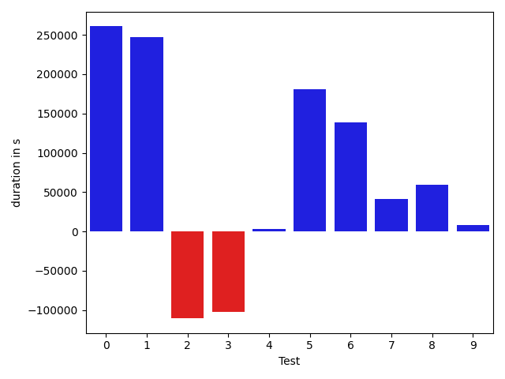

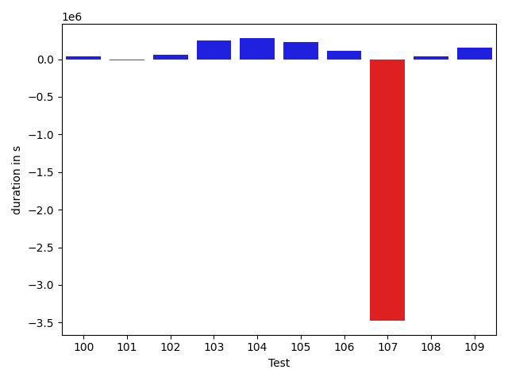

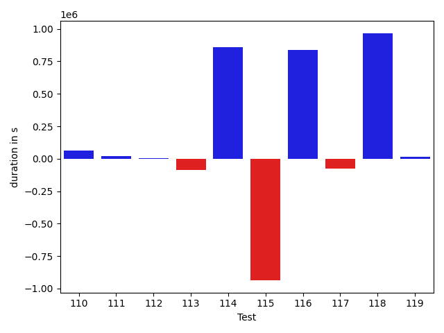

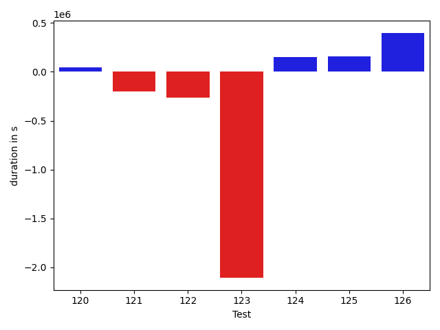

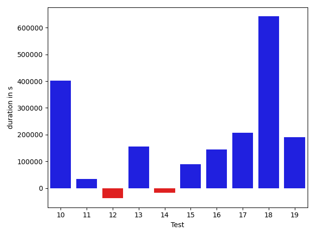

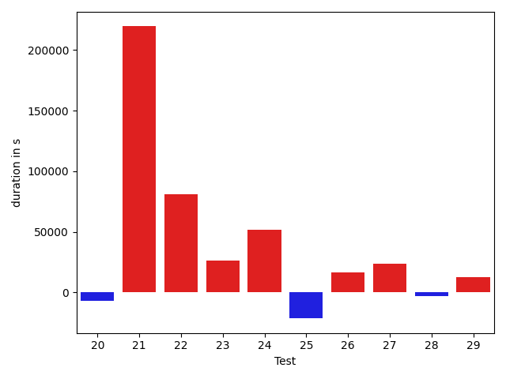

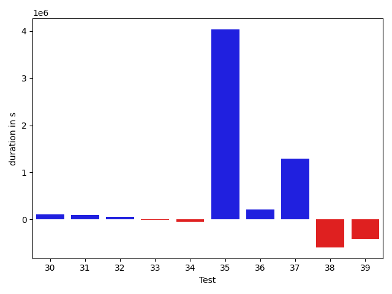

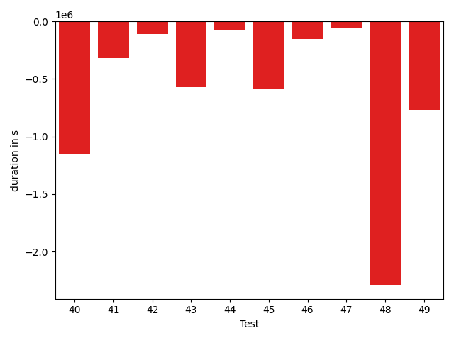

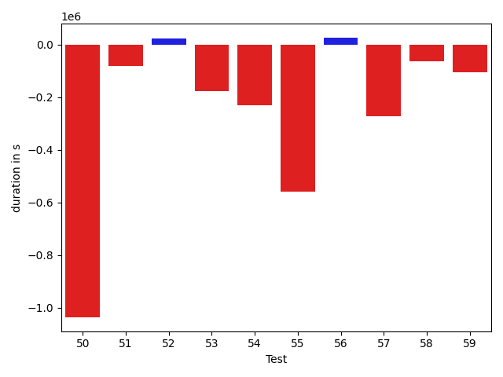

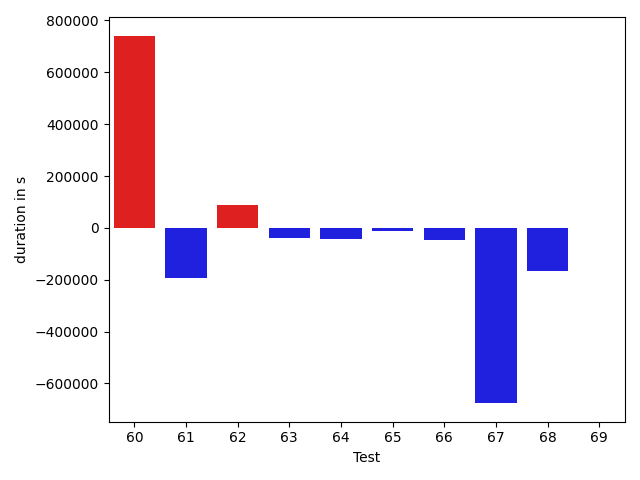

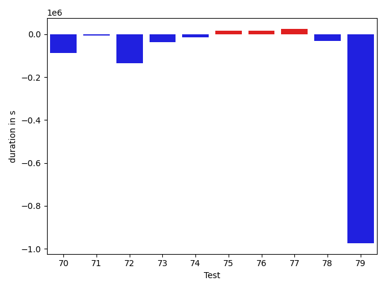

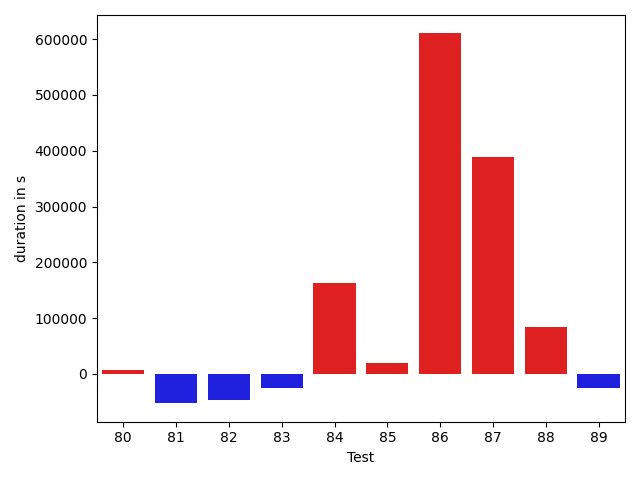

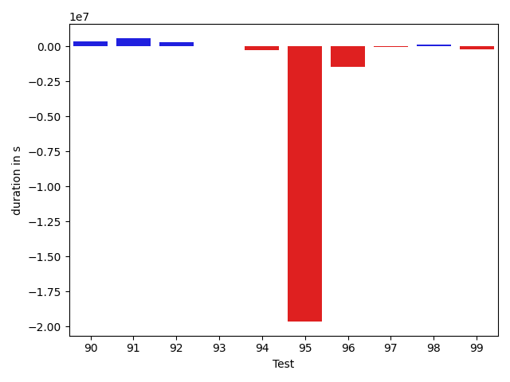

| ID | DurationV1 | DurationsV2 | DeltaDuration |
| --- | --- | --- | --- |
| 0 | 1036525.9249125082 | 1297178.4330181633 | 260652.50810565508 |
| 1 | 971919.9714026182 | 1218796.979674364 | 246877.00827174576 |
| 2 | 597637.2179897695 | 487107.18823791185 | -110530.02975185768 |
| 3 | 1594816.0066701192 | 1492255.86130762 | -102560.14536249917 |
| 4 | 1377347.4414704437 | 1380283.622461199 | 2936.180990755325 |
| 5 | 642871.7265206282 | 823229.4974758576 | 180357.7709552294 |
| 6 | 630870.6543396784 | 769438.788436214 | 138568.13409653562 |
| 7 | 768017.4396373386 | 809041.4372595284 | 41023.99762218981 |
| 8 | 643646.529511965 | 702551.3055171224 | 58904.776005157386 |
| 9 | 526295.3740087812 | 534109.1555622916 | 7813.78155351046 |
| 10 | 912569.2376856627 | 1314237.082041645 | 401667.84435598226 |
| 11 | 625516.7807393242 | 659900.3969271035 | 34383.61618777935 |
| 12 | 633892.9788672661 | 596184.3612644558 | -37708.61760281026 |
| 13 | 827319.9666142036 | 983611.1236737315 | 156291.15705952782 |
| 14 | 466167.21480581164 | 448316.554719212 | -17850.660086599644 |
| 15 | 896048.3779506545 | 986026.690592264 | 89978.31264160958 |
| 16 | 672231.6150697212 | 816371.9873868389 | 144140.37231711764 |
| 17 | 844600.08310866 | 1051145.4517105082 | 206545.36860184825 |
| 18 | 831390.5639121037 | 1473276.7121771094 | 641886.1482650058 |
| 19 | 1066532.3581746973 | 1257831.2922490824 | 191298.9340743851 |
| 20 | 1185946.4120658273 | 1162722.1797480898 | -23224.232317737537 |
| 21 | 406241.7149658203 | 411092.0705566406 | 4850.3555908203125 |
| 22 | 660764.0521862012 | 692830.3248705684 | 32066.27268436714 |
| 23 | 649928.22601548 | 646012.6277933323 | -3915.5982221476734 |
| 24 | 784123.6186445898 | 873095.5208613519 | 88971.90221676207 |
| 25 | 971473.7415852854 | 689653.2855675998 | -281820.4560176856 |
| 26 | 674278.830399078 | 714059.0364732365 | 39780.206074158545 |
| 27 | 866470.3632917295 | 1189904.2372476836 | 323433.8739559541 |
| 28 | 791046.7045713118 | 796420.6933174247 | 5373.988746112911 |
| 29 | 639297.4483312631 | 752147.1108287253 | 112849.66249746212 |
| 30 | 811081.1703894578 | 921949.529925941 | 110868.35953648319 |
| 31 | 683174.9923120746 | 773087.7274486749 | 89912.73513660021 |
| 32 | 851589.7656114214 | 909381.0859330739 | 57791.320321652456 |
| 33 | 818762.2398338848 | 812004.779269885 | -6757.460563999717 |
| 34 | 437873.86331784725 | 386461.0201882258 | -51412.84312962147 |
| 35 | 5831552.404157663 | 9868272.228908328 | 4036719.8247506656 |
| 36 | 676108.4189764038 | 890924.038351293 | 214815.61937488918 |
| 37 | 540197.7627599646 | 1827438.1848013531 | 1287240.4220413887 |
| 38 | 1585046.447862015 | 992913.1062300253 | -592133.3416319898 |
| 39 | 1865676.3962527623 | 1448407.576643724 | -417268.8196090383 |
| 40 | 2043739.898508451 | 894839.9845798461 | -1148899.9139286047 |
| 41 | 1107775.9466081695 | 787039.6062415564 | -320736.3403666131 |
| 42 | 810673.6528074688 | 703820.1387817299 | -106853.51402573893 |
| 43 | 1374216.9504581648 | 801563.8101469055 | -572653.1403112593 |
| 44 | 713933.9914468577 | 642530.7701068628 | -71403.22133999493 |
| 45 | 1349658.0445226156 | 767765.556297029 | -581892.4882255866 |
| 46 | 990951.6691418502 | 835588.9851836516 | -155362.68395819864 |
| 47 | 1021230.0479838044 | 967089.6257320428 | -54140.42225176154 |
| 48 | 3733454.8738419684 | 1438212.5795864547 | -2295242.2942555137 |
| 49 | 1869733.3577374893 | 1101242.911108036 | -768490.4466294532 |
| 50 | 1920085.0632351625 | 883834.1752914534 | -1036250.8879437092 |
| 51 | 783055.7706436436 | 702659.429260233 | -80396.34138341062 |
| 52 | 950669.0522232236 | 972888.7059080765 | 22219.653684852878 |
| 53 | 824598.6147950486 | 647082.8054866587 | -177515.8093083899 |
| 54 | 919441.6393411544 | 687977.9635319579 | -231463.67580919643 |
| 55 | 1226093.8912971164 | 667169.1863901776 | -558924.7049069388 |
| 56 | 789360.0639017347 | 815460.2810226172 | 26100.21712088259 |
| 57 | 1111011.2746119956 | 839468.5598703879 | -271542.71474160766 |
| 58 | 807200.16389509 | 742231.2225034267 | -64968.94139166328 |
| 59 | 818274.1962842811 | 713121.010813023 | -105153.18547125813 |
| 60 | 928665.4522010518 | 801825.4786110615 | -126839.97358999029 |
| 61 | 1942345.4290486127 | 846320.1039794631 | -1096025.3250691495 |
| 62 | 890910.5814107172 | 732917.2015567817 | -157993.37985393556 |
| 63 | 1854953.5147395036 | 949526.3263121677 | -905427.1884273359 |
| 64 | 789914.9745209868 | 700806.1376804145 | -89108.8368405723 |
| 65 | 1322668.8000847101 | 749043.9486679707 | -573624.8514167394 |
| 66 | 998916.3164812165 | 756183.599660956 | -242732.7168202605 |
| 67 | 752766.5666732168 | 746089.9161175432 | -6676.650555673521 |
| 68 | 687361.2441839227 | 608351.2382253003 | -79010.00595862232 |
| 69 | 1220417.1660018233 | 689700.5410419813 | -530716.624959842 |
| 70 | 590171.0660490245 | 499699.8074809334 | -90471.25856809109 |
| 71 | 1061534.764295839 | 706758.6509071409 | -354776.1133886981 |
| 72 | 811967.2530641251 | 719775.139483323 | -92192.1135808021 |
| 73 | 962940.8648322015 | 1799273.4924937296 | 836332.6276615281 |
| 74 | 8479548.780346768 | 14462282.668783125 | 5982733.888436357 |
| 75 | 741770.4302307595 | 2444577.5840956266 | 1702807.153864867 |
| 76 | 877900.0043592195 | 1530445.280739408 | 652545.2763801885 |
| 77 | 464390.6339393854 | 900148.6846413352 | 435758.05070194975 |
| 78 | 2626006.546522836 | 3463320.854642796 | 837314.3081199597 |
| 79 | 1086178.8504482445 | 1148268.5617541801 | 62089.711305935634 |
| 80 | 768932.1937653217 | 931450.2725873551 | 162518.07882203336 |
| 81 | 1061803.0218710522 | 818408.7687042698 | -243394.25316678244 |
| 82 | 2336275.6726255277 | 2252088.210785999 | -84187.46183952875 |
| 83 | 1396391.3951506126 | 859618.8865647961 | -536772.5085858165 |
| 84 | 5447481.086608814 | 2255580.654398034 | -3191900.43221078 |
| 85 | 1093653.6711332556 | 879665.7691145544 | -213987.9020187012 |
| 86 | 2084096.7271894384 | 734426.794473615 | -1349669.9327158234 |
| 87 | 921851.5849376722 | 990295.2534863311 | 68443.66854865884 |
| 88 | 999446.3282590923 | 829909.8431835992 | -169536.4850754931 |
| 89 | 818369.6021122168 | 865002.8384514503 | 46633.23633923358 |
| 90 | 468096.4915462489 | 798217.7547754226 | 330121.2632291737 |
| 91 | 743100.0622549349 | 1319178.5712489225 | 576078.5089939876 |
| 92 | 744006.4122960551 | 1037996.4714326523 | 293990.0591365972 |
| 93 | 690623.5566713903 | 689061.1640201898 | -1562.3926512005273 |
| 94 | 1081438.2714434105 | 818453.7223869592 | -262984.5490564513 |
| 95 | 24958782.43946025 | 5327369.467357468 | -19631412.972102784 |
| 96 | 2622112.1040342865 | 1147185.7402290176 | -1474926.363805269 |
| 97 | 566582.3749732536 | 540264.432785064 | -26317.942188189598 |
| 98 | 1297752.6391177634 | 1414744.1285633831 | 116991.48944561975 |
| 99 | 1000275.9763945764 | 772735.2455377643 | -227540.7308568121 |
| 100 | 559727.974620555 | 599843.6335306689 | 40115.65891011397 |
| 101 | 926827.0392099844 | 907116.6340029523 | -19710.405207032105 |
| 102 | 901827.4129365049 | 960014.1863299699 | 58186.77339346497 |
| 103 | 1179820.0111931975 | 1429216.1293464238 | 249396.11815322633 |
| 104 | 828012.871990067 | 1108665.1558515485 | 280652.2838614816 |
| 105 | 1134085.679702862 | 1364983.6264304025 | 230897.94672754058 |
| 106 | 1561769.2557144172 | 1671952.538250543 | 110183.28253612574 |
| 107 | 5900457.271956526 | 2426611.15749972 | -3473846.114456806 |
| 108 | 1097733.5367566466 | 1131175.0676964559 | 33441.53093980928 |
| 109 | 592310.7622738711 | 746301.1040926977 | 153990.34181882662 |
| 110 | 729619.7100105787 | 792290.358314291 | 62670.64830371225 |
| 111 | 504845.8235803448 | 524283.0205851421 | 19437.197004797286 |
| 112 | 1064747.1082996295 | 1070696.4346822356 | 5949.326382606057 |
| 113 | 879129.4425613717 | 791244.2323160608 | -87885.21024531091 |
| 114 | 712981.7269744873 | 1572490.1705979947 | 859508.4436235074 |
| 115 | 1829042.3628312824 | 893021.6512581145 | -936020.7115731679 |
| 116 | 1066445.6022519113 | 1907065.8732846815 | 840620.2710327702 |
| 117 | 1063401.2179838344 | 987312.6312158147 | -76088.58676801971 |
| 118 | 1138056.5336615485 | 2104471.648427809 | 966415.1147662606 |
| 119 | 719886.1594493146 | 735967.0411694067 | 16080.881720092148 |
| 120 | 2206160.2653847877 | 2251012.452273927 | 44852.18688913947 |
| 121 | 1148754.7304109035 | 951549.7099137814 | -197205.02049712208 |
| 122 | 1015193.7039995893 | 752995.6773794293 | -262198.02662016 |
| 123 | 4041116.0586603465 | 1935260.9916565935 | -2105855.067003753 |
| 124 | 818880.7398472202 | 970452.2944531639 | 151571.55460594362 |
| 125 | 691612.5337741425 | 850729.5048277912 | 159116.97105364874 |
| 126 | 875363.8871445996 | 1272683.7875034914 | 397319.9003588918 |

## Misc.

| ID | Test Class | Test Method |
| --- | --- | --- |
| 0 | com.google.gson.functional.StreamingTypeAdaptersTest | testNullSafe |
| 1 | com.google.gson.functional.StreamingTypeAdaptersTest | testSerializeWithCustomTypeAdapter |
| 2 | com.google.gson.functional.StreamingTypeAdaptersTest | testDeserializeWithCustomTypeAdapter |
| 3 | com.google.gson.functional.InstanceCreatorTest | testInstanceCreatorForParametrizedType |
| 4 | com.google.gson.functional.InstanceCreatorTest | testInstanceCreatorForCollectionType |
| 5 | com.google.gson.ParameterizedTypeTest | testNotEquals |
| 6 | com.google.gson.ParameterizedTypeTest | testOurTypeFunctionality |
| 7 | com.google.gson.functional.CollectionTest | testCollectionOfObjectSerialization |
| 8 | com.google.gson.functional.CollectionTest | testNullsInListDeserialization |
| 9 | com.google.gson.functional.CollectionTest | testRawCollectionSerialization |
| 10 | com.google.gson.functional.CollectionTest | testWildcardPrimitiveCollectionSerilaization |
| 11 | com.google.gson.functional.CollectionTest | testQueueDeserialization |
| 12 | com.google.gson.functional.CollectionTest | testCollectionOfBagOfPrimitivesSerialization |
| 13 | com.google.gson.functional.CollectionTest | testTopLevelCollectionOfIntegersDeserialization |
| 14 | com.google.gson.functional.CollectionTest | testRawCollectionOfIntegersSerialization |
| 15 | com.google.gson.functional.CollectionTest | testQueueSerialization |
| 16 | com.google.gson.functional.CollectionTest | testLinkedListDeserialization |
| 17 | com.google.gson.functional.CollectionTest | testUserCollectionTypeAdapter |
| 18 | com.google.gson.functional.CollectionTest | testSetDeserialization |
| 19 | com.google.gson.functional.CollectionTest | testWildcardCollectionField |
| 20 | com.google.gson.functional.CollectionTest | testSetSerialization |
| 21 | com.google.gson.functional.CollectionTest | testCollectionOfStringsSerialization |
| 22 | com.google.gson.functional.CollectionTest | testCollectionOfStringsDeserialization |
| 23 | com.google.gson.functional.CollectionTest | testWildcardPrimitiveCollectionDeserilaization |
| 24 | com.google.gson.functional.CollectionTest | testTopLevelListOfIntegerCollectionsDeserialization |
| 25 | com.google.gson.functional.CollectionTest | testTopLevelCollectionOfIntegersSerialization |
| 26 | com.google.gson.functional.CollectionTest | testNullsInListSerialization |
| 27 | com.google.gson.functional.CollectionTest | testLinkedListSerialization |
| 28 | com.google.gson.functional.CollectionTest | testFieldIsArrayList |
| 29 | com.google.gson.functional.CollectionTest | testCollectionOfObjectWithNullSerialization |
| 30 | com.google.gson.functional.CustomTypeAdaptersTest | testCustomAdapterInvokedForMapElementDeserialization |
| 31 | com.google.gson.functional.CustomTypeAdaptersTest | testCustomAdapterInvokedForMapElementSerializationWithType |
| 32 | com.google.gson.functional.CustomTypeAdaptersTest | testCustomAdapterInvokedForCollectionElementSerializationWithType |
| 33 | com.google.gson.functional.CustomTypeAdaptersTest | testCustomAdapterInvokedForCollectionElementDeserialization |
| 34 | com.google.gson.functional.CustomTypeAdaptersTest | testCustomAdapterInvokedForCollectionElementSerialization |
| 35 | com.google.gson.functional.CircularReferenceTest | testCircularSerialization |
| 36 | com.google.gson.functional.CircularReferenceTest | testDirectedAcyclicGraphSerialization |
| 37 | com.google.gson.functional.CircularReferenceTest | testDirectedAcyclicGraphDeserialization |
| 38 | com.google.gson.functional.MapTest | testMapSerializationWithNullValues |
| 39 | com.google.gson.functional.MapTest | testInterfaceTypeMapWithSerializer |
| 40 | com.google.gson.functional.MapTest | testComplexKeysSerialization |
| 41 | com.google.gson.functional.MapTest | testMapDeserializationWithNullKey |
| 42 | com.google.gson.functional.MapTest | testReadMapsWithEmptyStringKey |
| 43 | com.google.gson.functional.MapTest | testMapSubclassDeserialization |
| 44 | com.google.gson.functional.MapTest | testStringKeyDeserialization |
| 45 | com.google.gson.functional.MapTest | testCustomSerializerForSpecificMapType |
| 46 | com.google.gson.functional.MapTest | testGeneralMapField |
| 47 | com.google.gson.functional.MapTest | testSortedMap |
| 48 | com.google.gson.functional.MapTest | testInterfaceTypeMap |
| 49 | com.google.gson.functional.MapTest | testMapSerializationWithWildcardValues |
| 50 | com.google.gson.functional.MapTest | testMapDeserialization |
| 51 | com.google.gson.functional.MapTest | testBooleanKeyDeserialization |
| 52 | com.google.gson.functional.MapTest | testNumberKeyDeserialization |
| 53 | com.google.gson.functional.MapTest | testMapSerializationWithNullKey |
| 54 | com.google.gson.functional.MapTest | testMapDeserializationWithIntegerKeys |
| 55 | com.google.gson.functional.MapTest | testMapSerializationEmpty |
| 56 | com.google.gson.functional.MapTest | testMapOfMapDeserialization |
| 57 | com.google.gson.functional.MapTest | testMapSerializationWithIntegerKeys |
| 58 | com.google.gson.functional.MapTest | testDeerializeMapOfMaps |
| 59 | com.google.gson.functional.MapTest | testSerializeMapOfMaps |
| 60 | com.google.gson.functional.MapTest | testMapDeserializationWithNullValue |
| 61 | com.google.gson.functional.MapTest | testMapNamePromotionWithJsonElementReader |
| 62 | com.google.gson.functional.MapTest | testComplexKeysDeserialization |
| 63 | com.google.gson.functional.MapTest | testMapSerialization |
| 64 | com.google.gson.functional.MapTest | testMapDeserializationWithWildcardValues |
| 65 | com.google.gson.functional.MapTest | testMapSerializationWithNullValue |
| 66 | com.google.gson.functional.MapTest | testHashMapDeserialization |
| 67 | com.google.gson.functional.MapTest | testMapDeserializationWithDuplicateKeys |
| 68 | com.google.gson.functional.MapTest | testMapSubclassSerialization |
| 69 | com.google.gson.functional.MapTest | testMapDeserializationEmpty |
| 70 | com.google.gson.functional.MapTest | testMapSerializationWithNullValuesSerialized |
| 71 | com.google.gson.functional.MapTest | testMapSerializationWithNullValueButSerializeNulls |
| 72 | com.google.gson.functional.MapTest | testMapStandardSubclassDeserialization |
| 73 | com.google.gson.functional.ObjectTest | testEmptyCollectionInAnObjectDeserialization |
| 74 | com.google.gson.functional.ObjectTest | testDateAsMapObjectField |
| 75 | com.google.gson.functional.ObjectTest | testTruncatedDeserialization |
| 76 | com.google.gson.functional.ObjectTest | testSingletonLists |
| 77 | com.google.gson.functional.ObjectTest | testEmptyCollectionInAnObjectSerialization |
| 78 | com.google.gson.functional.InheritanceTest | testSubInterfacesOfCollectionSerialization |
| 79 | com.google.gson.functional.InheritanceTest | testSubInterfacesOfCollectionDeserialization |
| 80 | com.google.gson.functional.InheritanceTest | testClassWithBaseCollectionFieldSerialization |
| 81 | com.google.gson.functional.EnumTest | testEnumSubclassAsParameterizedType |
| 82 | com.google.gson.functional.EnumTest | testEnumSubclassWithRegisteredTypeAdapter |
| 83 | com.google.gson.functional.EnumTest | testEnumSet |
| 84 | com.google.gson.functional.EnumTest | testEnumSubclass |
| 85 | com.google.gson.functional.EnumTest | testCollectionOfEnumsDeserialization |
| 86 | com.google.gson.functional.EnumTest | testCollectionOfEnumsSerialization |
| 87 | com.google.gson.DefaultMapJsonSerializerTest | testEmptyMapSerialization |
| 88 | com.google.gson.DefaultMapJsonSerializerTest | testNonEmptyMapSerialization |
| 89 | com.google.gson.reflect.TypeTokenTest | testIsAssignableFromWithTypeParameters |
| 90 | com.google.gson.reflect.TypeTokenTest | testIsAssignableFromWithNestedWildcards |
| 91 | com.google.gson.reflect.TypeTokenTest | testIsAssignableFromWithBasicWildcards |
| 92 | com.google.gson.functional.JsonParserTest | testExtraCommasInArrays |
| 93 | com.google.gson.functional.JsonParserTest | testExtraCommasInMaps |
| 94 | com.google.gson.functional.MapAsArrayTypeAdapterTest | testMultipleEnableComplexKeyRegistrationHasNoEffect |
| 95 | com.google.gson.functional.MapAsArrayTypeAdapterTest | testSerializeComplexMapWithTypeAdapter |
| 96 | com.google.gson.functional.MapAsArrayTypeAdapterTest | testTwoTypesCollapseToOneDeserialize |
| 97 | com.google.gson.functional.NullObjectAndFieldTest | testExplicitSerializationOfNullCollectionMembers |
| 98 | com.google.gson.functional.NullObjectAndFieldTest | testExplicitSerializationOfNullArrayMembers |
| 99 | com.google.gson.functional.NullObjectAndFieldTest | testPrintPrintingObjectWithNulls |
| 100 | com.google.gson.functional.NullObjectAndFieldTest | testExplicitSerializationOfNullStringMembers |
| 101 | com.google.gson.CommentsTest | testParseComments |
| 102 | com.google.gson.FieldAttributesTest | testDeclaredTypeAndClass |
| 103 | com.google.gson.functional.ArrayTest | testArrayOfCollectionSerialization |
| 104 | com.google.gson.functional.ArrayTest | testArrayOfCollectionDeserialization |
| 105 | com.google.gson.functional.MoreSpecificTypeSerializationTest | testListOfSubclassFields |
| 106 | com.google.gson.functional.MoreSpecificTypeSerializationTest | testMapOfSubclassFields |
| 107 | com.google.gson.functional.DefaultTypeAdaptersTest | testNullSerialization |
| 108 | com.google.gson.functional.DefaultTypeAdaptersTest | testDateSerializationInCollection |
| 109 | com.google.gson.functional.DefaultTypeAdaptersTest | testSetSerialization |
| 110 | com.google.gson.functional.DefaultTypeAdaptersTest | testTreeSetDeserialization |
| 111 | com.google.gson.functional.DefaultTypeAdaptersTest | testTreeSetSerialization |
| 112 | com.google.gson.functional.RawSerializationTest | testCollectionOfObjects |
| 113 | com.google.gson.functional.RawSerializationTest | testCollectionOfPrimitives |
| 114 | com.google.gson.functional.EscapingTest | testEscapeAllHtmlCharacters |
| 115 | com.google.gson.functional.PrimitiveTest | testStringsAsBooleans |
| 116 | com.google.gson.functional.PrintFormattingTest | testCompactFormattingLeavesNoWhiteSpace |
| 117 | com.google.gson.MixedStreamTest | testWriteHtmlSafe |
| 118 | com.google.gson.MixedStreamTest | testWriteLenient |
| 119 | com.google.gson.MixedStreamTest | testReadClosed |
| 120 | com.google.gson.functional.PrettyPrintingTest | testPrettyPrintList |
| 121 | com.google.gson.functional.PrettyPrintingTest | testEmptyMapField |
| 122 | com.google.gson.functional.PrettyPrintingTest | testPrettyPrintListOfPrimitiveArrays |
| 123 | com.google.gson.functional.DelegateTypeAdapterTest | testDelegateInvoked |
| 124 | com.google.gson.functional.ReadersWritersTest | testTypeMismatchThrowsJsonSyntaxExceptionForStrings |
| 125 | com.google.gson.functional.ReadersWritersTest | testTypeMismatchThrowsJsonSyntaxExceptionForReaders |
| 126 | com.google.gson.functional.UncategorizedTest | testTrailingWhitespace |

| Test | IterationV1 | IterationV2 | DeltaIteration |
| --- | --- | --- | --- |
| 0 | 90 | 81 | -9 |
| 1 | 73 | 78 | 5 |
| 2 | 43 | 43 | 0 |
| 3 | 99 | 98 | -1 |
| 4 | 99 | 99 | 0 |
| 5 | 49 | 39 | -10 |
| 6 | 48 | 44 | -4 |
| 7 | 54 | 49 | -5 |
| 8 | 49 | 51 | 2 |
| 9 | 42 | 45 | 3 |
| 10 | 76 | 65 | -11 |
| 11 | 38 | 43 | 5 |
| 12 | 37 | 43 | 6 |
| 13 | 74 | 65 | -9 |
| 14 | 25 | 34 | 9 |
| 15 | 51 | 59 | 8 |
| 16 | 52 | 52 | 0 |
| 17 | 74 | 73 | -1 |
| 18 | 58 | 59 | 1 |
| 19 | 81 | 85 | 4 |
| 20 | 66 | 74 | 8 |
| 21 | 13 | 13 | 0 |
| 22 | 47 | 51 | 4 |
| 23 | 47 | 34 | -13 |
| 24 | 55 | 49 | -6 |
| 25 | 60 | 56 | -4 |
| 26 | 46 | 46 | 0 |
| 27 | 67 | 57 | -10 |
| 28 | 55 | 54 | -1 |
| 29 | 53 | 41 | -12 |
| 30 | 46 | 47 | 1 |
| 31 | 56 | 56 | 0 |
| 32 | 70 | 75 | 5 |
| 33 | 64 | 62 | -2 |
| 34 | 24 | 37 | 13 |
| 35 | 99 | 99 | 0 |
| 36 | 38 | 34 | -4 |
| 37 | 42 | 41 | -1 |
| 38 | 56 | 59 | 3 |
| 39 | 98 | 98 | 0 |
| 40 | 60 | 80 | 20 |
| 41 | 49 | 50 | 1 |
| 42 | 47 | 55 | 8 |
| 43 | 64 | 54 | -10 |
| 44 | 49 | 48 | -1 |
| 45 | 64 | 59 | -5 |
| 46 | 53 | 52 | -1 |
| 47 | 76 | 79 | 3 |
| 48 | 93 | 89 | -4 |
| 49 | 61 | 71 | 10 |
| 50 | 65 | 58 | -7 |
| 51 | 50 | 37 | -13 |
| 52 | 60 | 60 | 0 |
| 53 | 53 | 43 | -10 |
| 54 | 44 | 43 | -1 |
| 55 | 47 | 47 | 0 |
| 56 | 47 | 54 | 7 |
| 57 | 52 | 64 | 12 |
| 58 | 59 | 52 | -7 |
| 59 | 56 | 44 | -12 |
| 60 | 52 | 52 | 0 |
| 61 | 72 | 71 | -1 |
| 62 | 62 | 56 | -6 |
| 63 | 62 | 66 | 4 |
| 64 | 54 | 52 | -2 |
| 65 | 47 | 51 | 4 |
| 66 | 50 | 57 | 7 |
| 67 | 44 | 41 | -3 |
| 68 | 35 | 31 | -4 |
| 69 | 53 | 51 | -2 |
| 70 | 27 | 33 | 6 |
| 71 | 55 | 46 | -9 |
| 72 | 49 | 44 | -5 |
| 73 | 82 | 74 | -8 |
| 74 | 83 | 89 | 6 |
| 75 | 58 | 68 | 10 |
| 76 | 74 | 73 | -1 |
| 77 | 25 | 29 | 4 |
| 78 | 99 | 99 | 0 |
| 79 | 73 | 80 | 7 |
| 80 | 61 | 64 | 3 |
| 81 | 63 | 60 | -3 |
| 82 | 85 | 85 | 0 |
| 83 | 78 | 70 | -8 |
| 84 | 87 | 79 | -8 |
| 85 | 53 | 50 | -3 |
| 86 | 60 | 57 | -3 |
| 87 | 52 | 57 | 5 |
| 88 | 55 | 54 | -1 |
| 89 | 54 | 52 | -2 |
| 90 | 35 | 36 | 1 |
| 91 | 48 | 44 | -4 |
| 92 | 66 | 61 | -5 |
| 93 | 55 | 53 | -2 |
| 94 | 74 | 63 | -11 |
| 95 | 99 | 99 | 0 |
| 96 | 57 | 61 | 4 |
| 97 | 42 | 28 | -14 |
| 98 | 96 | 97 | 1 |
| 99 | 45 | 49 | 4 |
| 100 | 39 | 33 | -6 |
| 101 | 69 | 64 | -5 |
| 102 | 45 | 46 | 1 |
| 103 | 77 | 74 | -3 |
| 104 | 54 | 58 | 4 |
| 105 | 64 | 68 | 4 |
| 106 | 67 | 71 | 4 |
| 107 | 99 | 99 | 0 |
| 108 | 91 | 86 | -5 |
| 109 | 44 | 39 | -5 |
| 110 | 57 | 57 | 0 |
| 111 | 45 | 30 | -15 |
| 112 | 77 | 72 | -5 |
| 113 | 38 | 37 | -1 |
| 114 | 18 | 36 | 18 |
| 115 | 56 | 61 | 5 |
| 116 | 67 | 71 | 4 |
| 117 | 54 | 64 | 10 |
| 118 | 62 | 75 | 13 |
| 119 | 48 | 55 | 7 |
| 120 | 89 | 82 | -7 |
| 121 | 70 | 55 | -15 |
| 122 | 42 | 26 | -16 |
| 123 | 97 | 94 | -3 |
| 124 | 58 | 47 | -11 |
| 125 | 60 | 48 | -12 |
| 126 | 57 | 62 | 5 |

| Time Label | Time (s) |
| --- | --- |
| Selection | 27.027669668197632 |
| Injection | 15.375662088394165 |
| Total | 1083.3601076602936 |

