# gson c3d0f2

https://github.com/google/gson/commit/c3d0f2

## Delta Energy per test method

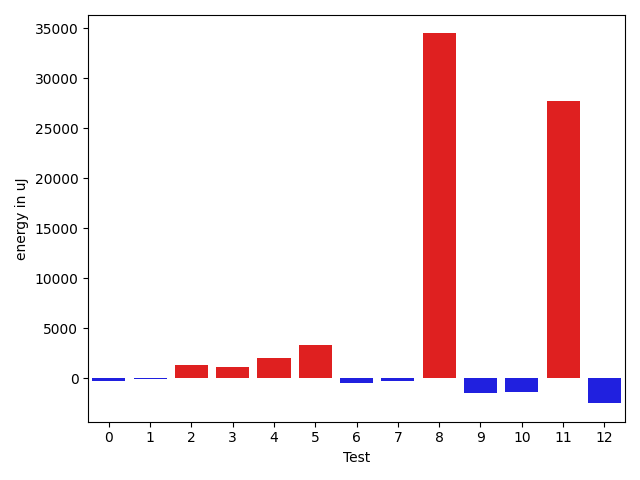

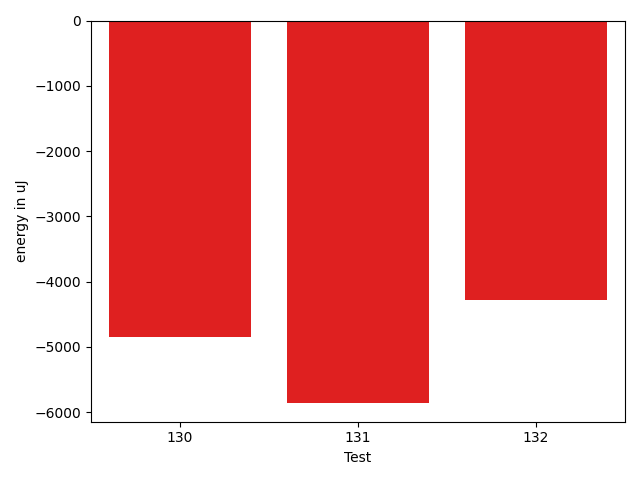

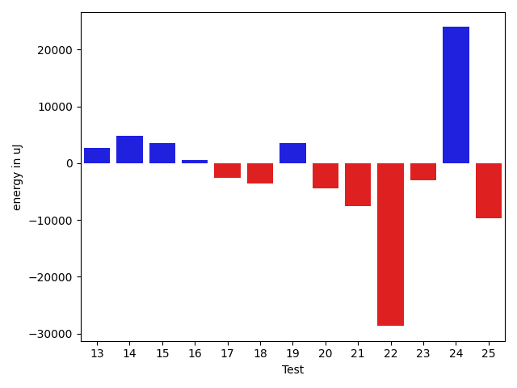

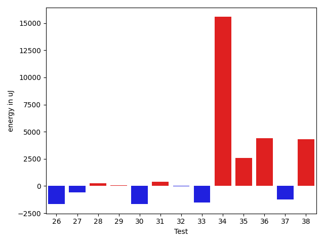

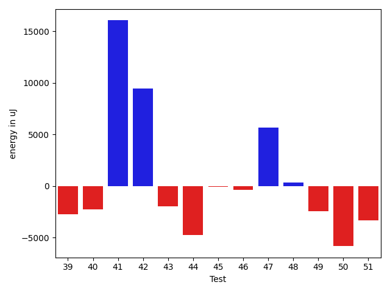

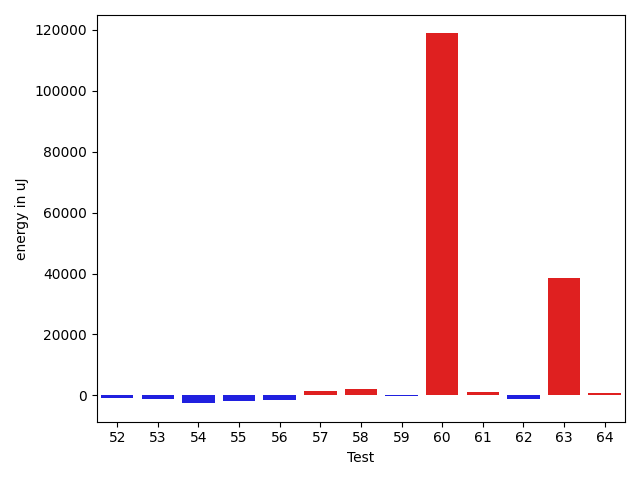

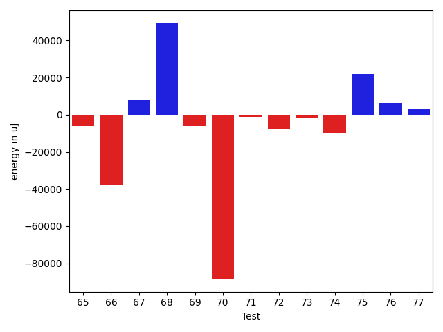

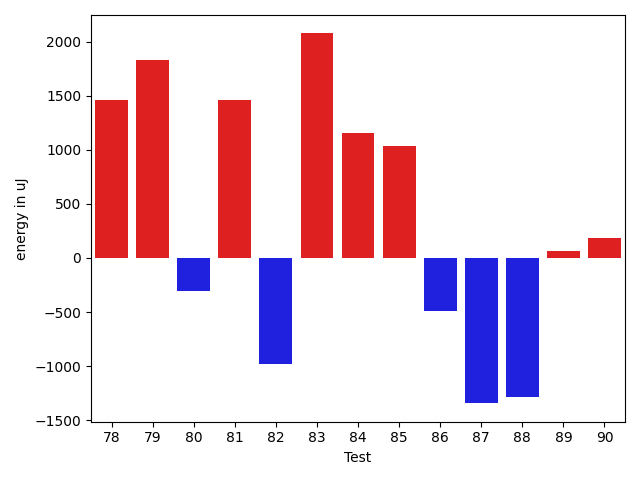

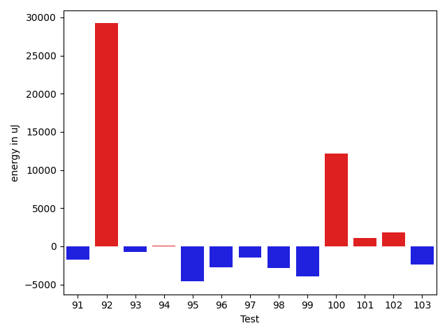

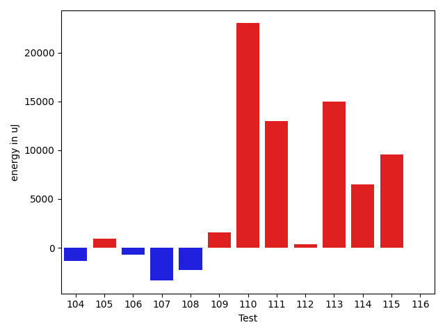

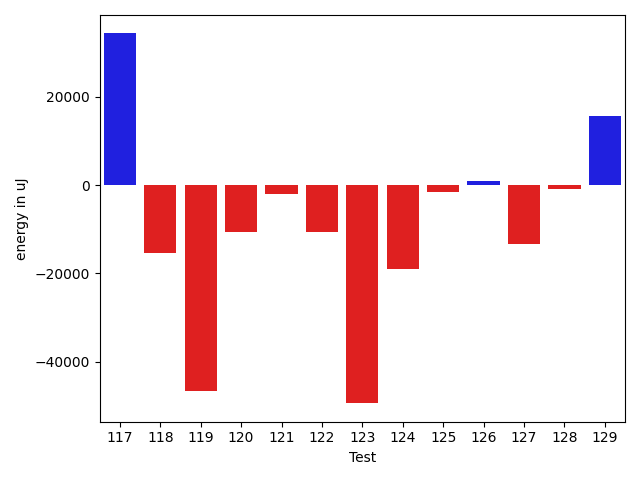

| ID | EnergyV1 | EnergyV2 | DeltaEnergy |
| --- | --- | --- | --- |
| 0 | 38962.81527624753 | 31934.89023228139 | -7027.925043966141 |
| 1 | 38425.34218494089 | 62575.74437248136 | 24150.402187540465 |
| 2 | 40964.81626908248 | 35526.057616329315 | -5438.758652753168 |
| 3 | 36635.92255318165 | 32535.231901168823 | -4100.690652012825 |
| 4 | 37620.93327409316 | 34668.56471010484 | -2952.368563988319 |
| 5 | 65103.21787382933 | 40857.05330984596 | -24246.164563983373 |
| 6 | 68315.82552335461 | 40839.431564217535 | -27476.393959137073 |
| 7 | 40164.06963650673 | 36585.17005062103 | -3578.8995858856943 |
| 8 | 78699.16468141873 | 124658.179343608 | 45959.01466218928 |
| 9 | 58659.347943559216 | 76170.73575851665 | 17511.38781495743 |
| 10 | 37973.07906183853 | 42055.81047794223 | 4082.7314161036993 |
| 11 | 381762.7619460454 | 429347.7789087517 | 47585.016962706286 |
| 12 | 39221.15919588914 | 57539.166531249546 | 18318.00733536041 |
| 13 | 40260.45551191358 | 42971.894592285156 | 2711.4390803715796 |
| 14 | 36069.1726793315 | 40903.44739532471 | 4834.274715993204 |
| 15 | 41258.916748326046 | 44854.079245999455 | 3595.1624976734092 |
| 16 | 37883.82307134589 | 38442.46115446091 | 558.6380831150163 |
| 17 | 284841.0490961333 | 282263.31710232305 | -2577.7319938102737 |
| 18 | 42841.21944154054 | 39239.37792778015 | -3601.841513760388 |
| 19 | 40484.052053928375 | 44000.88702869415 | 3516.8349747657776 |
| 20 | 49981.60741052324 | 45586.9616843611 | -4394.64572616214 |
| 21 | 42596.31883029034 | 35041.780504226685 | -7554.538326063659 |
| 22 | 83576.9063302227 | 54909.65342677843 | -28667.25290344427 |
| 23 | 35353.263773728824 | 32400.292101794854 | -2952.9716719339704 |
| 24 | 37473.958665712795 | 61452.79763498839 | 23978.838969275595 |
| 25 | 41427.673602319046 | 31750.822532509454 | -9676.851069809592 |
| 26 | 34426.18094924436 | 33689.223755392246 | -736.9571938521112 |
| 27 | 38824.471134747466 | 30421.428488070145 | -8403.04264667732 |
| 28 | 42557.04542716699 | 35317.98286584093 | -7239.062561326056 |
| 29 | 38338.819460885716 | 33696.212692797184 | -4642.606768088532 |
| 30 | 37228.96299913435 | 33373.49496652058 | -3855.468032613775 |
| 31 | 37911.93311043603 | 48978.93028393295 | 11066.997173496915 |
| 32 | 34908.34403151507 | 33700.90414902626 | -1207.4398824888121 |
| 33 | 40068.6001016243 | 36220.87904336107 | -3847.7210582632324 |
| 34 | 45554.52564948426 | 69508.51110735869 | 23953.985457874427 |
| 35 | 34975.097416246484 | 38338.42751812935 | 3363.3301018828643 |
| 36 | 38515.47271744182 | 60640.46954196552 | 22124.996824523696 |
| 37 | 40764.95427160818 | 71100.64933655478 | 30335.6950649466 |
| 38 | 38125.59487738682 | 43349.09057034552 | 5223.495692958699 |
| 39 | 36939.87478499222 | 34179.37173024297 | -2760.5030547492497 |
| 40 | 37852.6082739817 | 35603.911350004375 | -2248.6969239773243 |
| 41 | 45099.01348400016 | 61160.3441545472 | 16061.330670547039 |
| 42 | 40157.75254534368 | 49618.61100663524 | 9460.858461291558 |
| 43 | 35604.86959763059 | 33618.14046889916 | -1986.7291287314292 |
| 44 | 41423.814106235324 | 36636.76584316883 | -4787.048263066492 |
| 45 | 35976.69283439489 | 35898.972680687904 | -77.720153706985 |
| 46 | 35404.099203006015 | 35015.66329956055 | -388.4359034454683 |
| 47 | 32320.420315052306 | 37968.08251887775 | 5647.662203825446 |
| 48 | 36424.27484504723 | 36736.48128343001 | 312.2064383827819 |
| 49 | 36190.997216885604 | 33764.79478904605 | -2426.2024278395547 |
| 50 | 40237.93333861604 | 34396.575092315674 | -5841.3582463003695 |
| 51 | 36406.3507640239 | 33053.7117087692 | -3352.6390552546945 |
| 52 | 35028.7012995718 | 35077.125363230705 | 48.424063658902014 |
| 53 | 38346.913657674224 | 38388.05574236065 | 41.14208468642755 |
| 54 | 34939.1987421792 | 60157.57156244259 | 25218.372820263387 |
| 55 | 37031.610430842964 | 31874.270011074972 | -5157.340419767992 |
| 56 | 34898.75431104828 | 36909.26770943403 | 2010.5133983857522 |
| 57 | 41146.42556565847 | 35493.13634610176 | -5653.289219556711 |
| 58 | 50482.26105047378 | 39379.88269338879 | -11102.378357084992 |
| 59 | 36835.41855260631 | 38775.61204204076 | 1940.1934894344522 |
| 60 | 229152.5719128997 | 343283.81384546496 | 114131.24193256526 |
| 61 | 36852.16790289339 | 38521.53771972656 | 1669.3698168331757 |
| 62 | 70926.24582888653 | 42452.56067742873 | -28473.6851514578 |
| 63 | 103309.69848785418 | 118721.44002695045 | 15411.74153909627 |
| 64 | 47632.328991757655 | 58150.250718481206 | 10517.92172672355 |
| 65 | 49536.59208724488 | 43358.445223659975 | -6178.146863584901 |
| 66 | 77737.4870457603 | 40179.79647160337 | -37557.69057415693 |
| 67 | 45247.917212056636 | 53501.35551582946 | 8253.438303772826 |
| 68 | 39722.82361645577 | 88977.24288660339 | 49254.41927014762 |
| 69 | 41688.1772914163 | 35616.07111351934 | -6072.10617789696 |
| 70 | 136658.5080875857 | 48279.40817954546 | -88379.09990804025 |
| 71 | 40893.74799761633 | 39722.67091491446 | -1171.0770827018714 |
| 72 | 42643.0932616065 | 34879.52224636497 | -7763.571015241527 |
| 73 | 44895.14034492506 | 43109.90343889594 | -1785.2369060291167 |
| 74 | 44170.40245535702 | 34525.22189346593 | -9645.180561891088 |
| 75 | 64571.96258575746 | 86569.51268100756 | 21997.550095250102 |
| 76 | 42936.69203992412 | 49085.81989198616 | 6149.12785206204 |
| 77 | 40783.6883040519 | 43569.7497150898 | 2786.0614110378956 |
| 78 | 63305.71963179863 | 50118.91751313434 | -13186.802118664287 |
| 79 | 41362.27964494187 | 40614.97953116521 | -747.300113776655 |
| 80 | 43149.011639878154 | 37804.1354675293 | -5344.876172348857 |
| 81 | 32363.01018678129 | 41278.03138165176 | 8915.021194870471 |
| 82 | 42057.55941798028 | 42639.85621910915 | 582.2968011288685 |
| 83 | 36464.70606904201 | 49546.961554433496 | 13082.255485391484 |
| 84 | 38111.33056261206 | 31673.55908203125 | -6437.771480580806 |
| 85 | 39363.33572209791 | 32575.864180270582 | -6787.471541827326 |
| 86 | 39871.903841513675 | 41134.52744727582 | 1262.6236057621427 |
| 87 | 38817.938081479784 | 50186.49551160869 | 11368.557430128909 |
| 88 | 38305.123682745776 | 36355.94446652579 | -1949.1792162199854 |
| 89 | 36897.35216651607 | 37055.46011172165 | 158.1079452055783 |
| 90 | 35780.963954453524 | 35818.82510995865 | 37.86115550512477 |
| 91 | 35851.16346020134 | 51782.156452775 | 15930.992992573665 |
| 92 | 35925.05285424845 | 32194.775701289647 | -3730.2771529588063 |
| 93 | 44187.4951055914 | 147999.8414980562 | 103812.3463924648 |
| 94 | 38841.417129234025 | 37674.79023071425 | -1166.6268985197748 |
| 95 | 37108.61740542787 | 42129.83350658417 | 5021.2161011563 |
| 96 | 40647.64959352169 | 32548.777011871338 | -8098.87258165035 |
| 97 | 39133.432437028576 | 35232.799472332 | -3900.632964696575 |
| 98 | 38992.026765562005 | 33372.11198937893 | -5619.914776183075 |
| 99 | 39543.70560393094 | 36036.10351276398 | -3507.602091166962 |
| 100 | 46165.26065237954 | 66366.71781308949 | 20201.45716070995 |
| 101 | 42026.78680307828 | 37431.630927183665 | -4595.155875894612 |
| 102 | 39076.14397697849 | 35375.60284423828 | -3700.5411327402107 |
| 103 | 42042.06197456674 | 34731.738043904305 | -7310.323930662438 |
| 104 | 38411.65257521783 | 38086.87010920048 | -324.7824660173501 |
| 105 | 41523.88635253906 | 37882.5234375 | -3641.3629150390625 |
| 106 | 2047223.5052081563 | 1983506.4363460797 | -63717.068862076616 |
| 107 | 391605.18095380266 | 347232.640502874 | -44372.540450928675 |
| 108 | 65947.96462957867 | 45281.203666615686 | -20666.76096296298 |
| 109 | 42446.532463758835 | 61687.946374143445 | 19241.41391038461 |
| 110 | 94700.31809778846 | 42825.73289252665 | -51874.585205261814 |
| 111 | 57845.61924856964 | 72144.35815429688 | 14298.738905727238 |
| 112 | 42254.08900840583 | 60973.8876351472 | 18719.798626741373 |
| 113 | 38704.1049302137 | 81321.32837132597 | 42617.22344111227 |
| 114 | 46029.02188443443 | 38307.574772841326 | -7721.447111593101 |
| 115 | 44489.7275400908 | 41307.01201629639 | -3182.71552379441 |
| 116 | 41227.44515387491 | 40786.817993040895 | -440.62716083401756 |
| 117 | 44990.72990830392 | 79330.37960290187 | 34339.64969459795 |
| 118 | 56908.83305358298 | 41400.10768174601 | -15508.725371836968 |
| 119 | 87161.81541721916 | 40478.899627387524 | -46682.91578983163 |
| 120 | 47958.85041428698 | 37357.28856050319 | -10601.561853783787 |
| 121 | 39190.79427589293 | 37232.8048337698 | -1957.9894421231293 |
| 122 | 59371.980736106074 | 48806.72292268521 | -10565.257813420867 |
| 123 | 86848.56965649681 | 37414.20712382261 | -49434.3625326742 |
| 124 | 76925.96900885913 | 57916.262016979694 | -19009.706991879437 |
| 125 | 44520.994342246544 | 42843.549716224894 | -1677.44462602165 |
| 126 | 38665.160220630045 | 39574.286018091254 | 909.125797461209 |
| 127 | 47038.873551307595 | 33715.66599941254 | -13323.207551895059 |
| 128 | 37576.345178068754 | 36643.616396216676 | -932.7287818520781 |
| 129 | 44678.08204610576 | 60312.49539259006 | 15634.413346484303 |
| 130 | 41399.20352337115 | 36557.351258638744 | -4841.852264732406 |
| 131 | 43076.73486006473 | 37223.694731425494 | -5853.040128639237 |
| 132 | 37979.73548403382 | 33691.08409881592 | -4288.651385217905 |

## Delta Duration per test method

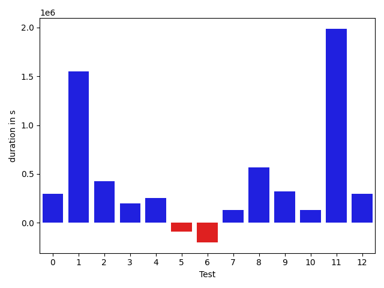

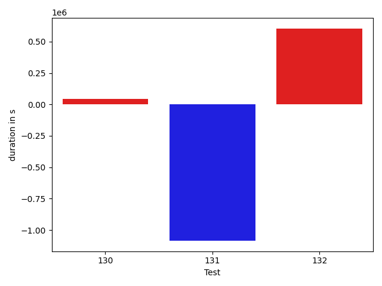

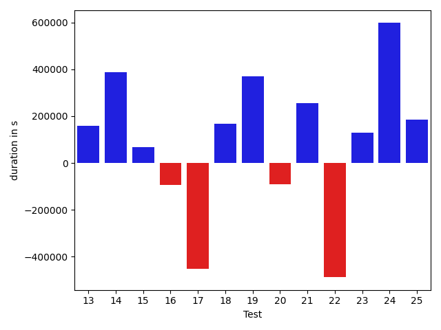

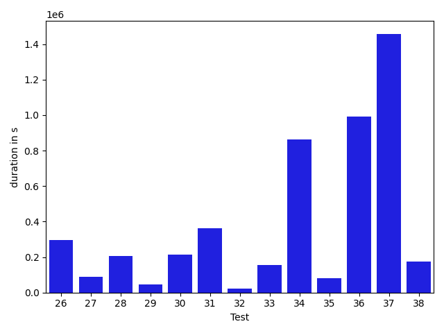

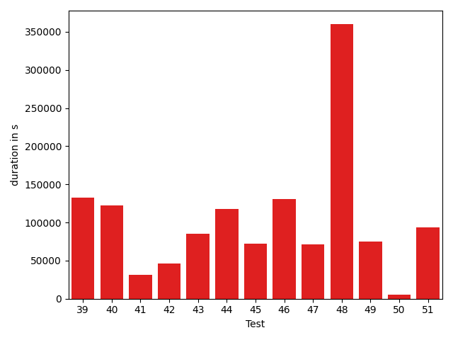

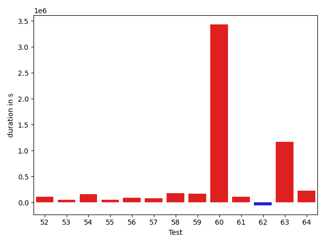

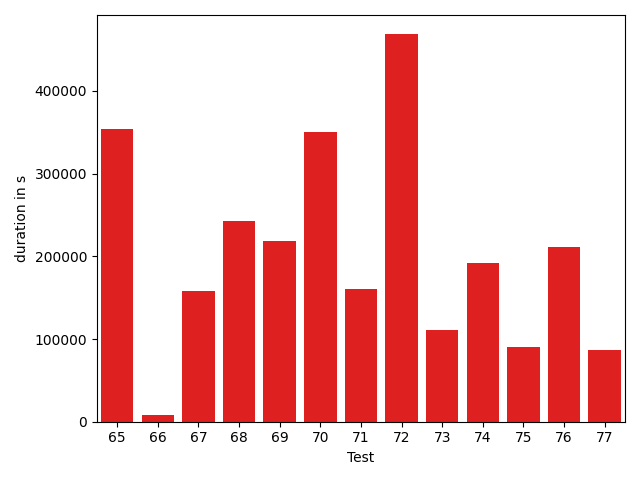

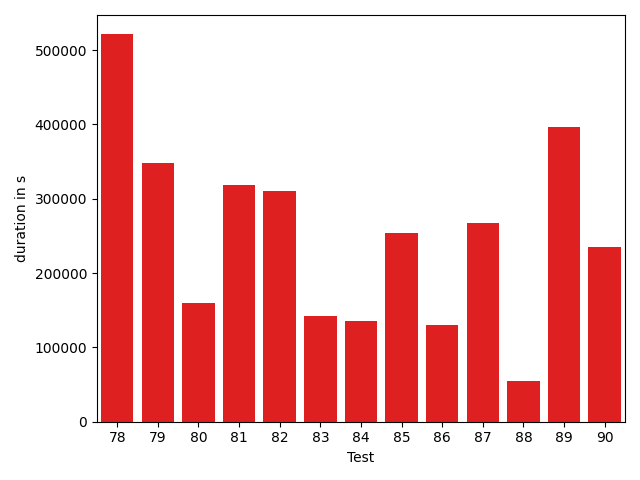

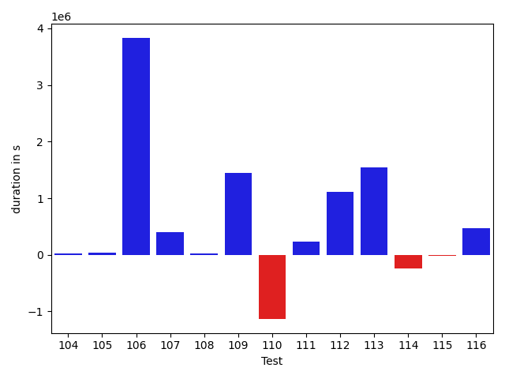

| ID | DurationV1 | DurationsV2 | DeltaDuration |
| --- | --- | --- | --- |
| 0 | 917503.4864340234 | 1215264.0966249807 | 297760.6101909573 |
| 1 | 1300096.3213330172 | 2852423.238769823 | 1552326.917436806 |
| 2 | 813897.4707064752 | 1238939.9953955328 | 425042.5246890576 |
| 3 | 659302.0496008247 | 859809.2058181763 | 200507.15621735156 |
| 4 | 827737.6877036549 | 1081422.2977823066 | 253684.6100786517 |
| 5 | 1348245.2407123803 | 1259347.613307695 | -88897.62740468537 |
| 6 | 1341139.8671046074 | 1141822.5244772169 | -199317.34262739052 |
| 7 | 594686.1495402901 | 729000.773039341 | 134314.62349905085 |
| 8 | 2321093.108710885 | 2887476.9424146484 | 566383.8337037633 |
| 9 | 1592075.180483755 | 1913179.291934433 | 321104.11145067797 |
| 10 | 647000.7662354426 | 780493.2767165005 | 133492.51048105792 |
| 11 | 10413199.83653386 | 12398809.458963487 | 1985609.622429628 |
| 12 | 1096930.4847559158 | 1393109.7253340771 | 296179.2405781613 |
| 13 | 513239.7133695859 | 672351.7901763916 | 159112.07680680568 |
| 14 | 580763.5605659236 | 967582.1123962402 | 386818.55183031666 |
| 15 | 916927.0077759811 | 983962.2954015471 | 67035.28762556601 |
| 16 | 883371.8707270175 | 790335.3869069293 | -93036.48382008821 |
| 17 | 8134746.052502774 | 7683122.868166587 | -451623.1843361864 |
| 18 | 706203.8790065292 | 873679.7722008824 | 167475.8931943532 |
| 19 | 570871.5296365619 | 940196.2705936432 | 369324.7409570813 |
| 20 | 1241502.0131876376 | 1151913.7807451263 | -89588.23244251125 |
| 21 | 690495.8571914767 | 945031.7316951752 | 254535.87450369843 |
| 22 | 2198064.1446265327 | 1710793.698357609 | -487270.4462689236 |
| 23 | 657948.3368021487 | 787543.974701358 | 129595.63789920928 |
| 24 | 1296511.474308163 | 1893729.6864135435 | 597218.2121053806 |
| 25 | 658722.479860744 | 843327.6061034966 | 184605.12624275265 |
| 26 | 742908.2841282658 | 1038452.3797405628 | 295544.09561229695 |
| 27 | 693264.1883225193 | 783087.9060816867 | 89823.71775916743 |
| 28 | 820188.1462969338 | 1024448.5579121477 | 204260.41161521396 |
| 29 | 623029.8069417072 | 667225.3794584572 | 44195.57251675008 |
| 30 | 833588.3973239663 | 1048048.6683977554 | 214460.2710737891 |
| 31 | 932547.4157864447 | 1295738.771659349 | 363191.3558729044 |
| 32 | 753791.7451409202 | 777520.9026630245 | 23729.15752210433 |
| 33 | 866696.2289630453 | 1022719.6594913269 | 156023.4305282816 |
| 34 | 1488658.0756035342 | 2350701.123049528 | 862043.0474459936 |
| 35 | 668728.1093870938 | 750591.4813951254 | 81863.37200803158 |
| 36 | 921087.8347789578 | 1913671.451517954 | 992583.6167389962 |
| 37 | 931750.3758569069 | 2389742.035805758 | 1457991.6599488512 |
| 38 | 759569.4214141878 | 932753.2578184903 | 173183.8364043025 |
| 39 | 750556.0564508324 | 872716.0711761495 | 122160.01472531713 |
| 40 | 708101.5935576686 | 969779.6192553639 | 261678.02569769532 |
| 41 | 1028142.2048837349 | 1660414.873333576 | 632272.668449841 |
| 42 | 822729.2710956745 | 1887982.6256906632 | 1065253.3545949887 |
| 43 | 590960.2367970562 | 738131.2027596338 | 147170.9659625776 |
| 44 | 714338.9473359644 | 1013232.5350910472 | 298893.58775508276 |
| 45 | 696748.0457704173 | 905354.5484784245 | 208606.50270800723 |
| 46 | 548741.6567934838 | 743524.0492248535 | 194782.39243136975 |
| 47 | 1113000.7531272806 | 1309833.4603821717 | 196832.70725489105 |
| 48 | 649154.0240334973 | 830565.1344655827 | 181411.11043208535 |
| 49 | 702113.2775661689 | 853624.2562451866 | 151510.97867901763 |
| 50 | 518814.3613220975 | 629306.0932884216 | 110491.73196632415 |
| 51 | 618110.3964019683 | 804318.2855638079 | 186207.88916183962 |
| 52 | 753617.2540223539 | 782695.1890585423 | 29077.93503618834 |
| 53 | 675780.8331437784 | 792237.5887600705 | 116456.75561629212 |
| 54 | 895879.9869716102 | 1699984.673365479 | 804104.6863938689 |
| 55 | 733848.1057003515 | 1013085.6159973545 | 279237.51029700297 |
| 56 | 716016.1417608316 | 1068700.802768305 | 352684.66100747336 |
| 57 | 647964.5827905089 | 958457.4503799081 | 310492.8675893992 |
| 58 | 1282285.9604306172 | 1451347.1960879099 | 169061.23565729265 |
| 59 | 1245981.8642930705 | 1051851.65404509 | -194130.21024798043 |
| 60 | 6906787.148482509 | 10145340.146000605 | 3238552.997518096 |
| 61 | 685218.5227984162 | 601905.9678955078 | -83312.55490290839 |
| 62 | 2295276.373057574 | 1084477.919260813 | -1210798.453796761 |
| 63 | 3094949.890868699 | 3475178.9984616814 | 380229.10759298224 |
| 64 | 1255005.8517164085 | 1281655.5688552114 | 26649.717138802866 |
| 65 | 1271401.2339786114 | 1114095.7670378573 | -157305.4669407541 |
| 66 | 2158358.7406934956 | 836377.2223086982 | -1321981.5183847975 |
| 67 | 1488763.4253340554 | 1536239.6147125294 | 47476.18937847391 |
| 68 | 1285871.8685811742 | 2179155.4303673483 | 893283.5617861741 |
| 69 | 1083157.3395265797 | 911815.0658262474 | -171342.27370033227 |
| 70 | 4280838.52156858 | 1536174.3933561267 | -2744664.128212453 |
| 71 | 893510.9840777105 | 1107802.3563110884 | 214291.3722333779 |
| 72 | 780294.5299272736 | 1287807.0680967518 | 507512.5381694782 |
| 73 | 837668.3044925542 | 827617.4715836644 | -10050.832908889744 |
| 74 | 795472.1929507756 | 1051967.3814882848 | 256495.18853750918 |
| 75 | 2089222.1429969496 | 2526803.774035672 | 437581.6310387226 |
| 76 | 794118.554591607 | 1317067.0474478998 | 522948.49285629287 |
| 77 | 563770.6076899165 | 656753.2361178398 | 92982.62842792331 |
| 78 | 1525987.1620954413 | 1504856.674454585 | -21130.4876408563 |
| 79 | 922206.1708600344 | 972476.1542395081 | 50269.98337947368 |
| 80 | 603724.3434463628 | 698242.2016220093 | 94517.85817564651 |
| 81 | 936250.0806619558 | 905430.1784987822 | -30819.902163173538 |
| 82 | 858471.3603155327 | 1300403.8398658521 | 441932.4795503195 |
| 83 | 902620.9694323372 | 1567075.8638267017 | 664454.8943943644 |
| 84 | 611441.273963967 | 871660.2629089355 | 260218.98894496856 |
| 85 | 774907.2629551556 | 1160918.0142236054 | 386010.7512684498 |
| 86 | 799235.1175016281 | 1050745.7047692835 | 251510.5872676554 |
| 87 | 828154.028213066 | 1676290.6951286 | 848136.6669155341 |
| 88 | 962992.5114948758 | 1209119.1432545073 | 246126.63175963156 |
| 89 | 681429.9627246679 | 1057525.4516617754 | 376095.4889371075 |
| 90 | 793123.6211611223 | 726257.9383726418 | -66865.68278848054 |
| 91 | 613682.1310790192 | 1624057.305029519 | 1010375.1739504997 |
| 92 | 709781.7816202007 | 1162452.4984125227 | 452670.716792322 |
| 93 | 959488.6782562872 | 5197072.400428952 | 4237583.7221726645 |
| 94 | 649448.0702894757 | 830150.7734417301 | 180702.70315225434 |
| 95 | 580578.0914020992 | 1077185.9627473354 | 496607.8713452362 |
| 96 | 549603.3472049553 | 629037.3418254852 | 79433.99462052993 |
| 97 | 691123.1983886533 | 934198.3989291191 | 243075.20054046577 |
| 98 | 641377.3145498636 | 636335.9847946167 | -5041.329755246872 |
| 99 | 719262.8432127247 | 700159.3494615555 | -19103.493751169182 |
| 100 | 1000947.0802997514 | 1696726.7434904724 | 695779.6631907211 |
| 101 | 704873.5640021758 | 679004.4309232067 | -25869.133078969084 |
| 102 | 496223.120789967 | 502273.3282775879 | 6050.207487620879 |
| 103 | 654510.9643731434 | 742439.2080757618 | 87928.2437026184 |
| 104 | 638782.1117599652 | 657299.1916571856 | 18517.079897220363 |
| 105 | 461854.17041015625 | 503888.109375 | 42033.93896484375 |
| 106 | 54020935.67893012 | 57852900.666678056 | 3831964.9877479374 |
| 107 | 10306271.687006664 | 10707260.229062617 | 400988.5420559533 |
| 108 | 1754382.9067758494 | 1774687.5866890477 | 20304.679913198343 |
| 109 | 1023587.5361902537 | 2463429.8318912815 | 1439842.2957010278 |
| 110 | 2403037.969088468 | 1270554.1474685585 | -1132483.8216199093 |
| 111 | 1601803.8608111653 | 1840129.981414795 | 238326.12060362962 |
| 112 | 1003328.0519195884 | 2122121.402367504 | 1118793.3504479155 |
| 113 | 1024220.2176467917 | 2561617.1586348843 | 1537396.9409880927 |
| 114 | 1098212.8195838183 | 854737.7911616401 | -243475.02842217823 |
| 115 | 654903.6088273987 | 638544.8510360718 | -16358.757791326963 |
| 116 | 817128.548158603 | 1286853.2692678883 | 469724.72110928525 |
| 117 | 1005809.7021280776 | 2256590.612231141 | 1250780.9101030633 |
| 118 | 1482794.135955642 | 1155926.4130302698 | -326867.7229253722 |
| 119 | 2765729.4500202714 | 856646.4407329932 | -1909083.0092872782 |
| 120 | 1034467.4472547946 | 856116.8316135888 | -178350.6156412058 |
| 121 | 825219.903640111 | 937315.5826954246 | 112095.67905531358 |
| 122 | 1769736.2526225222 | 1157196.1508547054 | -612540.1017678168 |
| 123 | 2438794.030069151 | 1378996.0838711197 | -1059797.9461980313 |
| 124 | 2119513.665630609 | 1933114.2846928667 | -186399.38093774207 |
| 125 | 888390.2502112386 | 848750.6680598259 | -39639.58215141273 |
| 126 | 689807.349747678 | 768984.3959944248 | 79177.04624674679 |
| 127 | 725489.538643267 | 812863.2564201355 | 87373.71777686849 |
| 128 | 978380.8193774242 | 1756537.2137372075 | 778156.3943597833 |
| 129 | 919915.3618021866 | 1673827.8728394238 | 753912.5110372372 |
| 130 | 1038899.2181671367 | 1200606.0331446228 | 161706.81497748615 |
| 131 | 950618.0660905468 | 954942.7608366646 | 4324.694746117806 |
| 132 | 945747.7905856408 | 742276.6216201782 | -203471.1689654626 |

## Misc.

| ID | Test Class | Test Method |
| --- | --- | --- |
| 0 | com.google.gson.functional.CustomTypeAdaptersTest | testCustomAdapterInvokedForCollectionElementDeserialization |
| 1 | com.google.gson.functional.CustomTypeAdaptersTest | testCustomAdapterInvokedForCollectionElementSerializationWithType |
| 2 | com.google.gson.functional.CustomTypeAdaptersTest | testCustomAdapterInvokedForMapElementSerializationWithType |
| 3 | com.google.gson.functional.CustomTypeAdaptersTest | testCustomAdapterInvokedForCollectionElementSerialization |
| 4 | com.google.gson.functional.CustomTypeAdaptersTest | testCustomAdapterInvokedForMapElementDeserialization |
| 5 | com.google.gson.functional.StreamingTypeAdaptersTest | testNullSafe |
| 6 | com.google.gson.functional.StreamingTypeAdaptersTest | testSerializeWithCustomTypeAdapter |
| 7 | com.google.gson.functional.StreamingTypeAdaptersTest | testDeserializeWithCustomTypeAdapter |
| 8 | com.google.gson.functional.InstanceCreatorTest | testInstanceCreatorForParametrizedType |
| 9 | com.google.gson.functional.InstanceCreatorTest | testInstanceCreatorForCollectionType |
| 10 | com.google.gson.functional.DefaultTypeAdaptersTest | testTreeSetDeserialization |
| 11 | com.google.gson.functional.DefaultTypeAdaptersTest | testNullSerialization |
| 12 | com.google.gson.functional.DefaultTypeAdaptersTest | testDateSerializationInCollection |
| 13 | com.google.gson.functional.DefaultTypeAdaptersTest | testTreeSetSerialization |
| 14 | com.google.gson.functional.DefaultTypeAdaptersTest | testSetSerialization |
| 15 | com.google.gson.ParameterizedTypeTest | testNotEquals |
| 16 | com.google.gson.ParameterizedTypeTest | testOurTypeFunctionality |
| 17 | com.google.gson.functional.CircularReferenceTest | testCircularSerialization |
| 18 | com.google.gson.functional.CircularReferenceTest | testDirectedAcyclicGraphSerialization |
| 19 | com.google.gson.functional.CircularReferenceTest | testDirectedAcyclicGraphDeserialization |
| 20 | com.google.gson.functional.PrettyPrintingTest | testEmptyMapField |
| 21 | com.google.gson.functional.PrettyPrintingTest | testPrettyPrintListOfPrimitiveArrays |
| 22 | com.google.gson.functional.PrettyPrintingTest | testPrettyPrintList |
| 23 | com.google.gson.functional.MapTest | testHashMapDeserialization |
| 24 | com.google.gson.functional.MapTest | testInterfaceTypeMapWithSerializer |
| 25 | com.google.gson.functional.MapTest | testMapDeserializationWithIntegerKeys |
| 26 | com.google.gson.functional.MapTest | testMapOfMapDeserialization |
| 27 | com.google.gson.functional.MapTest | testMapStandardSubclassDeserialization |
| 28 | com.google.gson.functional.MapTest | testMapSubclassDeserialization |
| 29 | com.google.gson.functional.MapTest | testStringKeyDeserialization |
| 30 | com.google.gson.functional.MapTest | testMapSerializationWithIntegerKeys |
| 31 | com.google.gson.functional.MapTest | testCustomSerializerForSpecificMapType |
| 32 | com.google.gson.functional.MapTest | testMapSerializationWithNullValueButSerializeNulls |
| 33 | com.google.gson.functional.MapTest | testSortedMap |
| 34 | com.google.gson.functional.MapTest | testInterfaceTypeMap |
| 35 | com.google.gson.functional.MapTest | testDeerializeMapOfMaps |
| 36 | com.google.gson.functional.MapTest | testMapDeserialization |
| 37 | com.google.gson.functional.MapTest | testMapSerialization |
| 38 | com.google.gson.functional.MapTest | testNumberKeyDeserialization |
| 39 | com.google.gson.functional.MapTest | testComplexKeysDeserialization |
| 40 | com.google.gson.functional.MapTest | testMapSerializationWithNullKey |
| 41 | com.google.gson.functional.MapTest | testMapSerializationWithNullValues |
| 42 | com.google.gson.functional.MapTest | testComplexKeysSerialization |
| 43 | com.google.gson.functional.MapTest | testMapDeserializationWithDuplicateKeys |
| 44 | com.google.gson.functional.MapTest | testMapDeserializationWithNullKey |
| 45 | com.google.gson.functional.MapTest | testReadMapsWithEmptyStringKey |
| 46 | com.google.gson.functional.MapTest | testMapSerializationWithNullValuesSerialized |
| 47 | com.google.gson.functional.MapTest | testMapSerializationWithWildcardValues |
| 48 | com.google.gson.functional.MapTest | testSerializeMapOfMaps |
| 49 | com.google.gson.functional.MapTest | testMapDeserializationWithNullValue |
| 50 | com.google.gson.functional.MapTest | testMapSubclassSerialization |
| 51 | com.google.gson.functional.MapTest | testBooleanKeyDeserialization |
| 52 | com.google.gson.functional.MapTest | testMapDeserializationEmpty |
| 53 | com.google.gson.functional.MapTest | testMapSerializationWithNullValue |
| 54 | com.google.gson.functional.MapTest | testMapNamePromotionWithJsonElementReader |
| 55 | com.google.gson.functional.MapTest | testGeneralMapField |
| 56 | com.google.gson.functional.MapTest | testMapDeserializationWithWildcardValues |
| 57 | com.google.gson.functional.MapTest | testMapSerializationEmpty |
| 58 | com.google.gson.functional.ObjectTest | testEmptyCollectionInAnObjectDeserialization |
| 59 | com.google.gson.functional.ObjectTest | testSingletonLists |
| 60 | com.google.gson.functional.ObjectTest | testDateAsMapObjectField |
| 61 | com.google.gson.functional.ObjectTest | testEmptyCollectionInAnObjectSerialization |
| 62 | com.google.gson.functional.ObjectTest | testTruncatedDeserialization |
| 63 | com.google.gson.functional.InheritanceTest | testSubInterfacesOfCollectionSerialization |
| 64 | com.google.gson.functional.InheritanceTest | testSubInterfacesOfCollectionDeserialization |
| 65 | com.google.gson.functional.InheritanceTest | testClassWithBaseCollectionFieldSerialization |
| 66 | com.google.gson.functional.EnumTest | testEnumSubclassAsParameterizedType |
| 67 | com.google.gson.functional.EnumTest | testEnumSubclass |
| 68 | com.google.gson.functional.EnumTest | testEnumSet |
| 69 | com.google.gson.functional.EnumTest | testCollectionOfEnumsSerialization |
| 70 | com.google.gson.functional.EnumTest | testEnumSubclassWithRegisteredTypeAdapter |
| 71 | com.google.gson.functional.EnumTest | testCollectionOfEnumsDeserialization |
| 72 | com.google.gson.functional.ReadersWritersTest | testTypeMismatchThrowsJsonSyntaxExceptionForStrings |
| 73 | com.google.gson.functional.ReadersWritersTest | testTypeMismatchThrowsJsonSyntaxExceptionForReaders |
| 74 | com.google.gson.functional.MapAsArrayTypeAdapterTest | testMultipleEnableComplexKeyRegistrationHasNoEffect |
| 75 | com.google.gson.functional.MapAsArrayTypeAdapterTest | testSerializeComplexMapWithTypeAdapter |
| 76 | com.google.gson.functional.MapAsArrayTypeAdapterTest | testTwoTypesCollapseToOneDeserialize |
| 77 | com.google.gson.functional.NullObjectAndFieldTest | testExplicitSerializationOfNullCollectionMembers |
| 78 | com.google.gson.functional.NullObjectAndFieldTest | testExplicitSerializationOfNullArrayMembers |
| 79 | com.google.gson.functional.NullObjectAndFieldTest | testPrintPrintingObjectWithNulls |
| 80 | com.google.gson.functional.NullObjectAndFieldTest | testExplicitSerializationOfNullStringMembers |
| 81 | com.google.gson.functional.JsonParserTest | testExtraCommasInMaps |
| 82 | com.google.gson.functional.JsonParserTest | testExtraCommasInArrays |
| 83 | com.google.gson.functional.CollectionTest | testWildcardPrimitiveCollectionSerilaization |
| 84 | com.google.gson.functional.CollectionTest | testQueueDeserialization |
| 85 | com.google.gson.functional.CollectionTest | testQueueSerialization |
| 86 | com.google.gson.functional.CollectionTest | testLinkedListDeserialization |
| 87 | com.google.gson.functional.CollectionTest | testUserCollectionTypeAdapter |
| 88 | com.google.gson.functional.CollectionTest | testWildcardCollectionField |
| 89 | com.google.gson.functional.CollectionTest | testLinkedListSerialization |
| 90 | com.google.gson.functional.CollectionTest | testWildcardPrimitiveCollectionDeserilaization |
| 91 | com.google.gson.functional.CollectionTest | testTopLevelCollectionOfIntegersDeserialization |
| 92 | com.google.gson.functional.CollectionTest | testSetDeserialization |
| 93 | com.google.gson.functional.CollectionTest | testSetSerialization |
| 94 | com.google.gson.functional.CollectionTest | testTopLevelListOfIntegerCollectionsDeserialization |
| 95 | com.google.gson.functional.CollectionTest | testTopLevelCollectionOfIntegersSerialization |
| 96 | com.google.gson.functional.CollectionTest | testRawCollectionSerialization |
| 97 | com.google.gson.functional.CollectionTest | testFieldIsArrayList |
| 98 | com.google.gson.functional.CollectionTest | testCollectionOfStringsDeserialization |
| 99 | com.google.gson.functional.CollectionTest | testNullsInListSerialization |
| 100 | com.google.gson.functional.CollectionTest | testCollectionOfBagOfPrimitivesSerialization |
| 101 | com.google.gson.functional.CollectionTest | testCollectionOfObjectWithNullSerialization |
| 102 | com.google.gson.functional.CollectionTest | testRawCollectionOfIntegersSerialization |
| 103 | com.google.gson.functional.CollectionTest | testCollectionOfObjectSerialization |
| 104 | com.google.gson.functional.CollectionTest | testNullsInListDeserialization |
| 105 | com.google.gson.functional.CollectionTest | testCollectionOfStringsSerialization |
| 106 | com.google.gson.JavaSerializationTest | testMapIsSerializable |
| 107 | com.google.gson.JavaSerializationTest | testNumberIsSerializable |
| 108 | com.google.gson.JavaSerializationTest | testListIsSerializable |
| 109 | com.google.gson.functional.UncategorizedTest | testTrailingWhitespace |
| 110 | com.google.gson.CommentsTest | testParseComments |
| 111 | com.google.gson.FieldAttributesTest | testDeclaredTypeAndClass |
| 112 | com.google.gson.functional.MoreSpecificTypeSerializationTest | testListOfSubclassFields |
| 113 | com.google.gson.functional.MoreSpecificTypeSerializationTest | testMapOfSubclassFields |
| 114 | com.google.gson.functional.RawSerializationTest | testCollectionOfObjects |
| 115 | com.google.gson.functional.RawSerializationTest | testCollectionOfPrimitives |
| 116 | com.google.gson.functional.PrimitiveTest | testStringsAsBooleans |
| 117 | com.google.gson.functional.PrintFormattingTest | testCompactFormattingLeavesNoWhiteSpace |
| 118 | com.google.gson.GenericArrayTypeTest | testOurTypeFunctionality |
| 119 | com.google.gson.GenericArrayTypeTest | testNotEquals |
| 120 | com.google.gson.MixedStreamTest | testWriteHtmlSafe |
| 121 | com.google.gson.MixedStreamTest | testReadClosed |
| 122 | com.google.gson.MixedStreamTest | testWriteLenient |
| 123 | com.google.gson.functional.DelegateTypeAdapterTest | testDelegateInvoked |
| 124 | com.google.gson.ObjectTypeAdapterTest | testSerialize |
| 125 | com.google.gson.DefaultMapJsonSerializerTest | testEmptyMapSerialization |
| 126 | com.google.gson.DefaultMapJsonSerializerTest | testNonEmptyMapSerialization |
| 127 | com.google.gson.reflect.TypeTokenTest | testIsAssignableFromWithNestedWildcards |
| 128 | com.google.gson.reflect.TypeTokenTest | testIsAssignableFromWithBasicWildcards |
| 129 | com.google.gson.reflect.TypeTokenTest | testIsAssignableFromWithTypeParameters |
| 130 | com.google.gson.functional.ArrayTest | testArrayOfCollectionSerialization |
| 131 | com.google.gson.functional.ArrayTest | testArrayOfCollectionDeserialization |
| 132 | com.google.gson.functional.EscapingTest | testEscapeAllHtmlCharacters |

| Test | IterationV1 | IterationV2 | DeltaIteration |
| --- | --- | --- | --- |
| 0 | 61 | 41 | -20 |
| 1 | 70 | 43 | -27 |
| 2 | 50 | 35 | -15 |
| 3 | 27 | 20 | -7 |
| 4 | 48 | 31 | -17 |
| 5 | 90 | 45 | -45 |
| 6 | 70 | 40 | -30 |
| 7 | 34 | 22 | -12 |
| 8 | 99 | 43 | -56 |
| 9 | 99 | 43 | -56 |
| 10 | 56 | 25 | -31 |
| 11 | 99 | 43 | -56 |
| 12 | 87 | 42 | -45 |
| 13 | 35 | 16 | -19 |
| 14 | 34 | 17 | -17 |
| 15 | 53 | 29 | -24 |
| 16 | 49 | 28 | -21 |
| 17 | 99 | 52 | -47 |
| 18 | 29 | 26 | -3 |
| 19 | 24 | 21 | -3 |
| 20 | 58 | 28 | -30 |
| 21 | 33 | 20 | -13 |
| 22 | 79 | 38 | -41 |
| 23 | 50 | 30 | -20 |
| 24 | 98 | 51 | -47 |
| 25 | 52 | 31 | -21 |
| 26 | 39 | 31 | -8 |
| 27 | 46 | 31 | -15 |
| 28 | 47 | 37 | -10 |
| 29 | 34 | 26 | -8 |
| 30 | 53 | 34 | -19 |
| 31 | 62 | 31 | -31 |
| 32 | 43 | 34 | -9 |
| 33 | 79 | 44 | -35 |
| 34 | 92 | 50 | -42 |
| 35 | 58 | 24 | -34 |
| 36 | 48 | 32 | -16 |
| 37 | 56 | 40 | -16 |
| 38 | 42 | 26 | -16 |
| 39 | 52 | 33 | -19 |
| 40 | 53 | 28 | -25 |
| 41 | 66 | 33 | -33 |
| 42 | 73 | 30 | -43 |
| 43 | 37 | 31 | -6 |
| 44 | 50 | 30 | -20 |
| 45 | 54 | 25 | -29 |
| 46 | 34 | 16 | -18 |
| 47 | 71 | 38 | -33 |
| 48 | 51 | 29 | -22 |
| 49 | 47 | 31 | -16 |
| 50 | 29 | 18 | -11 |
| 51 | 48 | 29 | -19 |
| 52 | 49 | 25 | -24 |
| 53 | 51 | 27 | -24 |
| 54 | 70 | 39 | -31 |
| 55 | 59 | 37 | -22 |
| 56 | 50 | 27 | -23 |
| 57 | 42 | 24 | -18 |
| 58 | 83 | 37 | -46 |
| 59 | 76 | 38 | -38 |
| 60 | 87 | 43 | -44 |
| 61 | 31 | 14 | -17 |
| 62 | 55 | 31 | -24 |
| 63 | 99 | 54 | -45 |
| 64 | 82 | 48 | -34 |
| 65 | 56 | 37 | -19 |
| 66 | 65 | 37 | -28 |
| 67 | 89 | 45 | -44 |
| 68 | 78 | 39 | -39 |
| 69 | 55 | 35 | -20 |
| 70 | 92 | 45 | -47 |
| 71 | 60 | 29 | -31 |
| 72 | 48 | 35 | -13 |
| 73 | 50 | 25 | -25 |
| 74 | 69 | 36 | -33 |
| 75 | 99 | 52 | -47 |
| 76 | 59 | 38 | -21 |
| 77 | 36 | 24 | -12 |
| 78 | 97 | 53 | -44 |
| 79 | 50 | 33 | -17 |
| 80 | 29 | 18 | -11 |
| 81 | 51 | 28 | -23 |
| 82 | 63 | 30 | -33 |
| 83 | 61 | 36 | -25 |
| 84 | 42 | 16 | -26 |
| 85 | 60 | 31 | -29 |
| 86 | 57 | 28 | -29 |
| 87 | 66 | 39 | -27 |
| 88 | 83 | 39 | -44 |
| 89 | 56 | 32 | -24 |
| 90 | 43 | 25 | -18 |
| 91 | 53 | 28 | -25 |
| 92 | 64 | 34 | -30 |
| 93 | 68 | 36 | -32 |
| 94 | 54 | 31 | -23 |
| 95 | 49 | 24 | -25 |
| 96 | 42 | 20 | -22 |
| 97 | 56 | 21 | -35 |
| 98 | 50 | 25 | -25 |
| 99 | 47 | 21 | -26 |
| 100 | 43 | 27 | -16 |
| 101 | 50 | 30 | -20 |
| 102 | 32 | 15 | -17 |
| 103 | 55 | 23 | -32 |
| 104 | 43 | 24 | -19 |
| 105 | 15 | 7 | -8 |
| 106 | 99 | 46 | -53 |
| 107 | 99 | 46 | -53 |
| 108 | 99 | 46 | -53 |
| 109 | 54 | 36 | -18 |
| 110 | 48 | 37 | -11 |
| 111 | 42 | 15 | -27 |
| 112 | 61 | 32 | -29 |
| 113 | 55 | 34 | -21 |
| 114 | 72 | 40 | -32 |
| 115 | 35 | 20 | -15 |
| 116 | 66 | 36 | -30 |
| 117 | 75 | 33 | -42 |
| 118 | 64 | 34 | -30 |
| 119 | 49 | 27 | -22 |
| 120 | 59 | 36 | -23 |
| 121 | 52 | 27 | -25 |
| 122 | 61 | 34 | -27 |
| 123 | 96 | 50 | -46 |
| 124 | 96 | 43 | -53 |
| 125 | 51 | 35 | -16 |
| 126 | 52 | 30 | -22 |
| 127 | 35 | 21 | -14 |
| 128 | 49 | 30 | -19 |
| 129 | 45 | 32 | -13 |
| 130 | 71 | 42 | -29 |
| 131 | 54 | 28 | -26 |
| 132 | 29 | 18 | -11 |

| Time Label | Time (s) |
| --- | --- |
| Selection | 27.472111701965332 |
| Injection | 16.04841709136963 |
| Total | 1079.1312453746796 |

