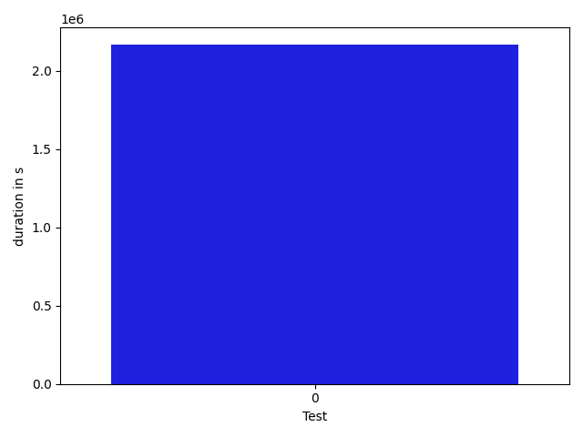

# gson 2d5cab

https://github.com/google/gson/commit/2d5cab

## Delta Energy per test method

| ID | EnergyV1 | EnergyV2 | DeltaEnergy |
| --- | --- | --- | --- |
| 0 | 66583.20340302087 | 118429.85164731563 | 51846.64824429476 |

## Delta Duration per test method

| ID | DurationV1 | DurationsV2 | DeltaDuration |
| --- | --- | --- | --- |
| 0 | 1694040.4868027144 | 3863220.2287780955 | 2169179.741975381 |

## Misc.

| ID | Test Class | Test Method |
| --- | --- | --- |
| 0 | com.google.gson.internal.LinkedHashTreeMapTest | testDoubleCapacity |

| Test | IterationV1 | IterationV2 | DeltaIteration |
| --- | --- | --- | --- |
| 0 | 74 | 67 | -7 |

| Time Label | Time (s) |
| --- | --- |
| Selection | 27.671306133270264 |
| Injection | 9.830797672271729 |
| Total | 980.6707091331482 |

