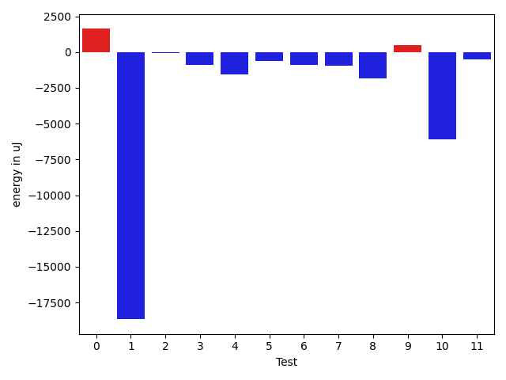
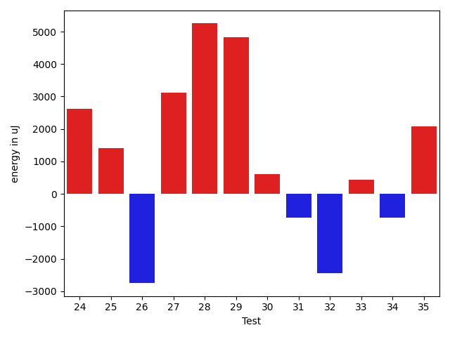
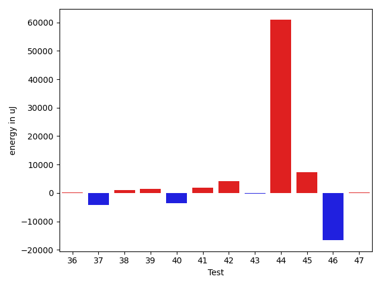
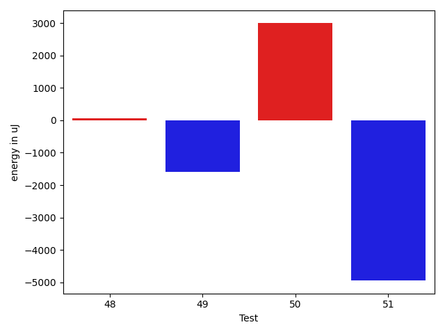
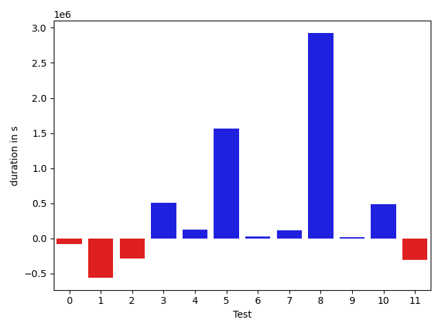
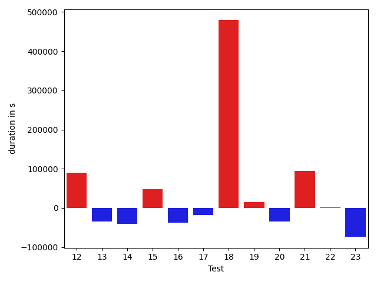
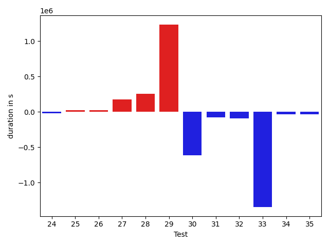
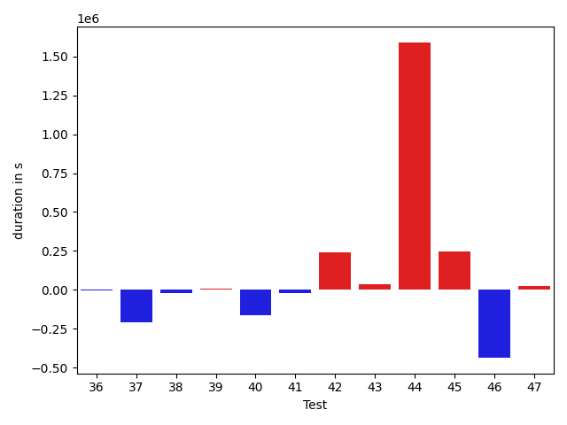
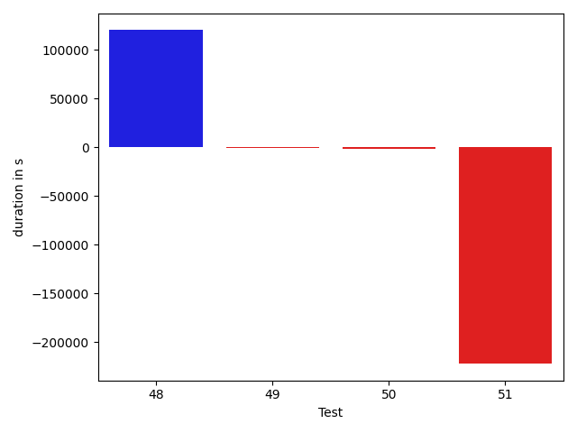

# gson 6347e9

https://github.com/google/gson/commit/6347e9

## Delta Energy per test method

| ID | EnergyV1 | EnergyV2 | DeltaEnergy | σ |
| --- | --- | --- | --- | --- |
| 0 | 36874.72549019608 | 38272.78723404255 | 1398.061743846476 | 4248.308743435006 | 4645.885775132844 |
| 1 | 95509.95959595959 | 75325.77777777778 | -20184.18181818181 | 116572.49855177861 | 82704.43675792472 |
| 2 | 48534.72826086957 | 43685.10227272727 | -4849.625988142296 | 23583.475022871815 | 14972.472451013511 |
| 3 | 39120.46666666667 | 38022.69491525424 | -1097.7717514124306 | 5433.094015588375 | 8770.051002410955 |
| 4 | 37468.96428571428 | 37628.03571428572 | 159.0714285714348 | 4784.389224208717 | 4665.509369543257 |
| 5 | 43631.769230769234 | 41335.41379310345 | -2296.355437665785 | 20745.963070341575 | 15526.42702535271 |
| 6 | 38761.92307692308 | 37812.48 | -949.4430769230748 | 4024.3551888955494 | 4595.932646329796 |
| 7 | 37989.125 | 36410.41935483871 | -1578.705645161288 | 4610.843634958972 | 3796.33701021251 |
| 8 | 40636.0 | 41823.86363636364 | 1187.8636363636397 | 10490.913940763216 | 15339.660111289617 |
| 9 | 39191.02173913043 | 39158.0 | -33.02173913043225 | 7960.052049450569 | 6484.596013210496 |
| 10 | 184781.37373737374 | 169467.0909090909 | -15314.282828282827 | 436736.9279961876 | 416589.5776415652 |
| 11 | 43842.347368421055 | 42843.857142857145 | -998.4902255639099 | 15102.265760138822 | 14515.70597933469 |
| 12 | 39509.188679245286 | 39404.62295081967 | -104.56572842561582 | 6334.6266946542755 | 7597.650210866935 |
| 13 | 37763.967741935485 | 37224.9649122807 | -539.0028296547825 | 4523.383400294098 | 5113.423524324943 |
| 14 | 38477.269841269845 | 37749.68421052631 | -727.5856307435315 | 4151.349809958925 | 4249.347323084668 |
| 15 | 38088.0 | 36673.392857142855 | -1414.607142857145 | 4183.114536809885 | 4482.966487074679 |
| 16 | 39192.206349206346 | 36998.85106382979 | -2193.3552853765577 | 4825.074665624209 | 4293.190749035645 |
| 17 | 38639.890625 | 36479.232142857145 | -2160.658482142855 | 4605.448183663791 | 4029.901585075672 |
| 18 | 43740.793650793654 | 54690.46551724138 | 10949.671866447723 | 24965.348729381734 | 39549.39500265962 |
| 19 | 37787.0 | 37025.42372881356 | -761.5762711864372 | 3608.355318599203 | 3632.0869623137914 |
| 20 | 45745.16981132075 | 45521.08196721312 | -224.08784410763474 | 16399.68340667248 | 15960.636267870044 |
| 21 | 43224.27027027027 | 46917.22222222222 | 3692.9519519519454 | 16478.679597537703 | 25203.841860045322 |
| 22 | 36716.90476190476 | 37586.705882352944 | 869.8011204481809 | 4363.075061344889 | 5362.240277705555 |
| 23 | 48961.0 | 46988.28571428572 | -1972.7142857142826 | 37520.353953363956 | 31304.547525487575 |
| 24 | 36739.95 | 39030.23529411765 | 2290.2852941176534 | 3797.06830956463 | 4688.317025636383 |
| 25 | 37142.458333333336 | 38419.392857142855 | 1276.9345238095193 | 5029.104840651455 | 4739.422616576877 |
| 26 | 39203.5 | 37491.86666666667 | -1711.6333333333314 | 4782.912815429527 | 5100.495490527257 |
| 27 | 36107.64705882353 | 41929.13333333333 | 5821.4862745098 | 3412.8730512088814 | 21096.034424718047 |
| 28 | 36039.066666666666 | 41515.125 | 5476.058333333334 | 3557.900719369343 | 15321.320561047438 |
| 29 | 199814.9898989899 | 238296.68686868687 | 38481.69696969696 | 409872.97449012636 | 468036.82163100963 |
| 30 | 53743.53846153846 | 42293.4 | -11450.13846153846 | 28201.14758334759 | 10093.173427619284 |
| 31 | 38210.76190476191 | 37926.58536585366 | -284.1765389082502 | 5598.849800286466 | 5852.3105713214245 |
| 32 | 38154.5625 | 37597.73333333333 | -556.8291666666701 | 4147.467977102867 | 4492.253695220498 |
| 33 | 238235.3 | 191447.97333333333 | -46787.32666666666 | 531102.0629270355 | 462532.3923139069 |
| 34 | 36835.74 | 36905.42 | 69.68000000000029 | 4258.832101926537 | 4692.049607964519 |
| 35 | 36861.16129032258 | 37806.48484848485 | 945.3235581622648 | 4914.4467026655475 | 4569.618564555252 |
| 36 | 37960.627118644064 | 38131.88679245283 | 171.25967380876682 | 4683.7486648916965 | 6086.657593986156 |
| 37 | 74821.54545454546 | 70559.53535353535 | -4262.010101010106 | 35894.83718068284 | 31417.40823120077 |
| 38 | 37641.030303030304 | 38672.59701492537 | 1031.566711895066 | 4653.063825994513 | 6004.862450261308 |
| 39 | 46536.833333333336 | 48036.13513513513 | 1499.3018018017974 | 25491.27028824025 | 23873.774207289836 |
| 40 | 52065.072289156626 | 48550.59259259259 | -3514.4796965640344 | 32064.04547970975 | 26789.036609933188 |
| 41 | 38375.833333333336 | 40171.11111111111 | 1795.2777777777737 | 4403.365584666145 | 4264.568206472295 |
| 42 | 45863.9375 | 50124.92857142857 | 4260.9910714285725 | 25419.4910156772 | 29869.207132248812 |
| 43 | 38040.09375 | 37845.5873015873 | -194.50644841269968 | 5040.874483034758 | 4494.827770540589 |
| 44 | 185238.78787878787 | 246097.40404040404 | 60858.61616161617 | 264152.5656183047 | 456540.91099322465 |
| 45 | 58326.96842105263 | 65699.15384615384 | 7372.185425101212 | 49179.568407483726 | 53447.062090728396 |
| 46 | 53631.84090909091 | 37014.47222222222 | -16617.368686868693 | 103663.90098796625 | 4527.610293681492 |
| 47 | 38578.183333333334 | 38851.27868852459 | 273.0953551912535 | 4337.6149609805425 | 5286.630818785816 |
| 48 | 36981.13333333333 | 37046.107142857145 | 64.97380952381354 | 3706.691244522832 | 3587.638681632946 |
| 49 | 39062.28571428572 | 38150.35294117647 | -911.932773109249 | 5240.338894374214 | 4858.72934177332 |
| 50 | 38168.67857142857 | 40211.0 | 2042.3214285714275 | 5025.0899853604005 | 3875.576180037328 |
| 51 | 44056.470588235294 | 42148.95238095238 | -1907.518207282912 | 11756.683791722338 | 9213.428871444172 |

## Delta Duration per test method

| ID | DurationV1 | DurationsV2 | DeltaDuration |
| --- | --- | --- | --- |
| 0 | 894648.1764705882 | 861182.7234042553 | -33465.45306633285 |
| 1 | 2961154.3535353537 | 2449326.6666666665 | -511827.68686868716 |
| 2 | 1590354.7717391304 | 1430819.125 | -159535.64673913037 |
| 3 | 1039736.1166666667 | 1009538.2711864407 | -30197.84548022598 |
| 4 | 600659.0357142857 | 593602.0 | -7057.035714285681 |
| 5 | 1169990.9615384615 | 1082918.6551724137 | -87072.30636604782 |
| 6 | 617410.0384615385 | 539961.84 | -77448.19846153853 |
| 7 | 590108.3333333334 | 592642.9677419355 | 2534.634408602142 |
| 8 | 1198072.921875 | 1123757.1666666667 | -74315.75520833326 |
| 9 | 1038954.1304347826 | 930226.5454545454 | -108727.58498023718 |
| 10 | 5440274.818181818 | 4989775.04040404 | -450499.777777778 |
| 11 | 1400266.2210526315 | 1384371.5824175824 | -15894.638635049108 |
| 12 | 881411.8679245283 | 971879.393442623 | 90467.52551809466 |
| 13 | 922773.9032258064 | 887770.2807017544 | -35003.62252405204 |
| 14 | 956360.1587301587 | 915909.3859649122 | -40450.77276524645 |
| 15 | 817793.4912280702 | 866261.3571428572 | 48467.86591478693 |
| 16 | 910435.8571428572 | 872707.3829787234 | -37728.474164133775 |
| 17 | 955328.5625 | 937523.7321428572 | -17804.83035714284 |
| 18 | 1160726.7301587302 | 1639989.8275862068 | 479263.09742747666 |
| 19 | 886854.3859649122 | 901167.2372881356 | 14312.851323223324 |
| 20 | 1344904.7358490566 | 1310882.6557377048 | -34022.080111351795 |
| 21 | 1075078.054054054 | 1169366.5 | 94288.44594594603 |
| 22 | 481174.04761904763 | 482101.5882352941 | 927.5406162464642 |
| 23 | 952282.7857142857 | 878189.0357142857 | -74093.75 |
| 24 | 478381.15 | 457445.23529411765 | -20935.914705882373 |
| 25 | 632514.4583333334 | 658195.5357142857 | 25681.07738095231 |
| 26 | 489628.9375 | 515426.6 | 25797.662499999977 |
| 27 | 629936.2352941176 | 808693.4333333333 | 178757.19803921576 |
| 28 | 472975.6 | 731045.5 | 258069.90000000002 |
| 29 | 5709965.888888889 | 6945676.464646464 | 1235710.5757575752 |
| 30 | 1565393.8461538462 | 948853.0 | -616540.8461538462 |
| 31 | 944156.9047619047 | 864675.487804878 | -79481.4169570267 |
| 32 | 552573.375 | 461200.3333333333 | -91373.04166666669 |
| 33 | 6832550.228571429 | 5484770.84 | -1347779.388571429 |
| 34 | 819179.58 | 787739.64 | -31439.939999999944 |
| 35 | 763961.7741935484 | 730547.696969697 | -33414.077223851345 |
| 36 | 942897.4915254237 | 941723.037735849 | -1174.4537895746762 |
| 37 | 2355066.02020202 | 2144480.242424242 | -210585.77777777798 |
| 38 | 1031339.0606060605 | 1012376.4626865672 | -18962.59791949333 |
| 39 | 1495019.4102564103 | 1499689.310810811 | 4669.900554400636 |
| 40 | 1601470.0361445784 | 1438655.086419753 | -162814.94972482533 |
| 41 | 536524.9166666666 | 515271.8333333333 | -21253.083333333314 |
| 42 | 1261227.59375 | 1501182.9642857143 | 239955.37053571432 |
| 43 | 954648.515625 | 991721.0 | 37072.484375 |
| 44 | 5414855.747474748 | 7004546.919191919 | 1589691.1717171716 |
| 45 | 1816851.0631578946 | 2061660.2857142857 | 244809.22255639103 |
| 46 | 1284906.1818181819 | 848828.5 | -436077.6818181819 |
| 47 | 1051042.9333333333 | 1074894.7704918033 | 23851.83715846995 |
| 48 | 670528.4666666667 | 657263.2142857143 | -13265.252380952355 |
| 49 | 706548.7142857143 | 642597.1764705882 | -63951.537815126125 |
| 50 | 555909.3571428572 | 496576.9090909091 | -59332.44805194804 |
| 51 | 1096597.4117647058 | 896722.6666666666 | -199874.74509803916 |

## Misc.

| ID | Test Class | Test Method |
| --- | --- | --- |
| 0 | com.google.gson.functional.CustomDeserializerTest | testDefaultConstructorNotCalledOnField |
| 1 | com.google.gson.functional.CustomDeserializerTest | testDefaultConstructorNotCalledOnObject |
| 2 | com.google.gson.functional.CustomDeserializerTest | testJsonTypeFieldBasedDeserialization |
| 3 | com.google.gson.functional.InheritanceTest | testClassWithBaseArrayFieldSerialization |
| 4 | com.google.gson.functional.InheritanceTest | testBaseSerializedAsSub |
| 5 | com.google.gson.functional.InheritanceTest | testClassWithBaseFieldSerialization |
| 6 | com.google.gson.functional.InheritanceTest | testBaseSerializedAsBaseWhenSpecifiedWithExplicitType |
| 7 | com.google.gson.functional.InheritanceTest | testBaseSerializedAsSubWhenSpecifiedWithExplicitType |
| 8 | com.google.gson.functional.InheritanceTest | testClassWithBaseCollectionFieldSerialization |
| 9 | com.google.gson.functional.ExclusionStrategyFunctionalTest | testExclusionStrategyWithMode |
| 10 | com.google.gson.functional.TypeVariableTest | testAdvancedTypeVariables |
| 11 | com.google.gson.functional.TypeVariableTest | testTypeVariablesViaTypeParameter |
| 12 | com.google.gson.functional.MapTest | testReadMapsWithEmptyStringKey |
| 13 | com.google.gson.functional.MapTest | testMapDeserializationWithWildcardValues |
| 14 | com.google.gson.functional.MapTest | testMapDeserializationWithNullKey |
| 15 | com.google.gson.functional.MapTest | testStringKeyDeserialization |
| 16 | com.google.gson.functional.MapTest | testMapDeserializationWithNullValue |
| 17 | com.google.gson.functional.MapTest | testMapOfMapDeserialization |
| 18 | com.google.gson.functional.MapTest | testMapDeserialization |
| 19 | com.google.gson.functional.MapTest | testDeerializeMapOfMaps |
| 20 | com.google.gson.functional.JsonParserTest | testChangingCustomTreeAndDeserializing |
| 21 | com.google.gson.JsonObjectTest | testReadPropertyWithEmptyStringName |
| 22 | com.google.gson.JsonObjectTest | testAddingNullPropertyValue |
| 23 | com.google.gson.JsonObjectTest | testDeepCopy |
| 24 | com.google.gson.JsonObjectTest | testAddingStringProperties |
| 25 | com.google.gson.JsonObjectTest | testEqualsNonEmptyObject |
| 26 | com.google.gson.JsonObjectTest | testAddingAndRemovingObjectProperties |
| 27 | com.google.gson.JsonObjectTest | testAddingCharacterProperties |
| 28 | com.google.gson.JsonObjectTest | testAddingBooleanProperties |
| 29 | com.google.gson.functional.MapAsArrayTypeAdapterTest | testSerializeComplexMapWithTypeAdapter |
| 30 | com.google.gson.internal.LinkedHashTreeMapTest | testContainsNonComparableKeyReturnsFalse |
| 31 | com.google.gson.internal.LinkedHashTreeMapTest | testEqualsAndHashCode |
| 32 | com.google.gson.internal.LinkedHashTreeMapTest | testContainsNullKeyFails |
| 33 | com.google.gson.functional.CustomSerializerTest | testSubClassSerializerInvokedForBaseClassFieldsHoldingSubClassInstances |
| 34 | com.google.gson.functional.CustomSerializerTest | testBaseClassSerializerInvokedForBaseClassFieldsHoldingSubClassInstances |
| 35 | com.google.gson.functional.CustomSerializerTest | testBaseClassSerializerInvokedForBaseClassFields |
| 36 | com.google.gson.functional.CustomSerializerTest | testSubClassSerializerInvokedForBaseClassFieldsHoldingArrayOfSubClassInstances |
| 37 | com.google.gson.functional.UncategorizedTest | testReturningDerivedClassesDuringDeserialization |
| 38 | com.google.gson.functional.MoreSpecificTypeSerializationTest | testMapOfParameterizedSubclassFields |
| 39 | com.google.gson.functional.MoreSpecificTypeSerializationTest | testMapOfSubclassFields |
| 40 | com.google.gson.ObjectTypeAdapterTest | testDeserialize |
| 41 | com.google.gson.ObjectTypeAdapterTest | testDeserializeNullValue |
| 42 | com.google.gson.functional.CustomTypeAdaptersTest | testCustomDeserializers |
| 43 | com.google.gson.functional.CustomTypeAdaptersTest | testCustomAdapterInvokedForMapElementDeserialization |
| 44 | com.google.gson.functional.TypeHierarchyAdapterTest | testTypeHierarchy |
| 45 | com.google.gson.functional.ParameterizedTypesTest | testParameterizedTypesWithCustomDeserializer |
| 46 | com.google.gson.functional.JsonTreeTest | testJsonTreeNull |
| 47 | com.google.gson.DefaultMapJsonSerializerTest | testNonEmptyMapSerialization |
| 48 | com.google.gson.functional.DefaultTypeAdaptersTest | testJsonObjectDeserialization |
| 49 | com.google.gson.JsonParserTest | testParseReader |
| 50 | com.google.gson.JsonParserTest | testParseString |
| 51 | com.google.gson.functional.StreamingTypeAdaptersTest | testDeserializeMap |

| Test | IterationV1 | IterationV2 | DeltaIteration |
| --- | --- | --- | --- |
| 0 | 51 | 47 | -4 |
| 1 | 99 | 99 | 0 |
| 2 | 92 | 88 | -4 |
| 3 | 60 | 59 | -1 |
| 4 | 28 | 28 | 0 |
| 5 | 52 | 58 | 6 |
| 6 | 26 | 25 | -1 |
| 7 | 24 | 31 | 7 |
| 8 | 64 | 66 | 2 |
| 9 | 46 | 44 | -2 |
| 10 | 99 | 99 | 0 |
| 11 | 95 | 91 | -4 |
| 12 | 53 | 61 | 8 |
| 13 | 62 | 57 | -5 |
| 14 | 63 | 57 | -6 |
| 15 | 57 | 56 | -1 |
| 16 | 63 | 47 | -16 |
| 17 | 64 | 56 | -8 |
| 18 | 63 | 58 | -5 |
| 19 | 57 | 59 | 2 |
| 20 | 53 | 61 | 8 |
| 21 | 37 | 36 | -1 |
| 22 | 21 | 17 | -4 |
| 23 | 28 | 28 | 0 |
| 24 | 20 | 17 | -3 |
| 25 | 24 | 28 | 4 |
| 26 | 16 | 15 | -1 |
| 27 | 17 | 30 | 13 |
| 28 | 15 | 16 | 1 |
| 29 | 99 | 99 | 0 |
| 30 | 13 | 15 | 2 |
| 31 | 42 | 41 | -1 |
| 32 | 16 | 15 | -1 |
| 33 | 70 | 75 | 5 |
| 34 | 50 | 50 | 0 |
| 35 | 31 | 33 | 2 |
| 36 | 59 | 53 | -6 |
| 37 | 99 | 99 | 0 |
| 38 | 66 | 67 | 1 |
| 39 | 78 | 74 | -4 |
| 40 | 83 | 81 | -2 |
| 41 | 12 | 18 | 6 |
| 42 | 64 | 56 | -8 |
| 43 | 64 | 63 | -1 |
| 44 | 99 | 99 | 0 |
| 45 | 95 | 91 | -4 |
| 46 | 44 | 36 | -8 |
| 47 | 60 | 61 | 1 |
| 48 | 30 | 28 | -2 |
| 49 | 21 | 17 | -4 |
| 50 | 28 | 11 | -17 |
| 51 | 17 | 21 | 4 |

| Time Label | Time (s) |
| --- | --- |
| Selection | 26.92268991470337 |
| Injection | 13.362634420394897 |
| Total | 1040.9058544635773 |

