# gson 70f928

https://github.com/google/gson/commit/70f928

## Delta Energy per test method

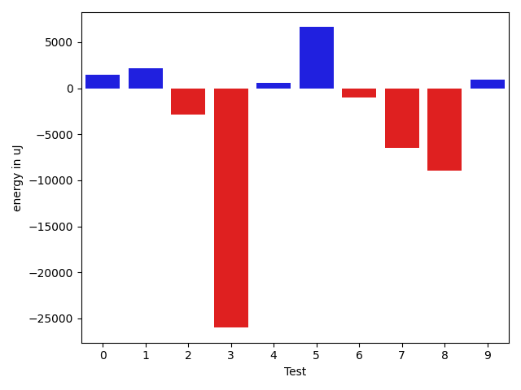

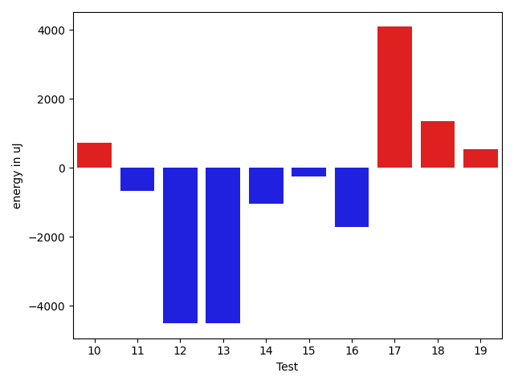

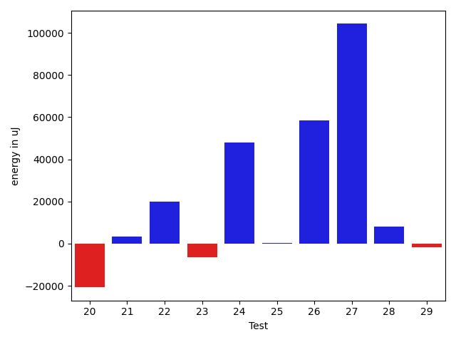

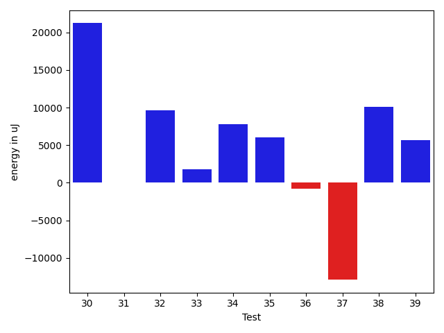

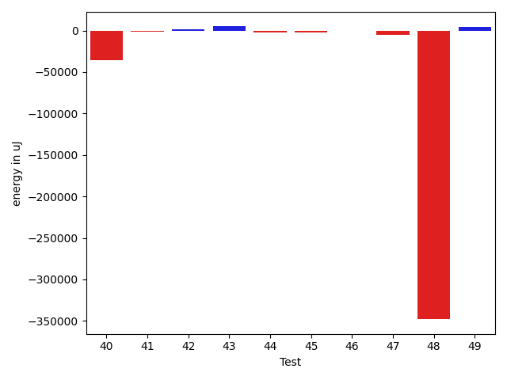

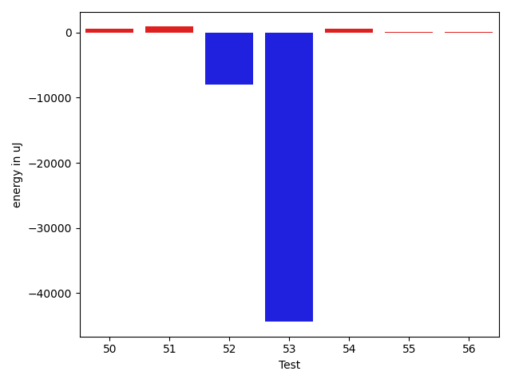

| ID | EnergyV1 | EnergyV2 | DeltaEnergy | σ |
| --- | --- | --- | --- | --- |
| 0 | 45416.364583333336 | 42968.6947368421 | -2447.6698464912333 | 16718.27925762185 | 15449.136063784947 |
| 1 | 85164.36734693877 | 79685.79797979798 | -5478.5693671407935 | 100844.15844802088 | 86088.1415794629 |
| 2 | 36774.26530612245 | 38212.87755102041 | 1438.6122448979586 | 4605.056213069612 | 4427.854502488798 |
| 3 | 35675.96551724138 | 35818.64705882353 | 142.68154158215475 | 5256.745574335294 | 4528.769193152184 |
| 4 | 35568.75925925926 | 35847.11320754717 | 278.35394828790595 | 3086.731886371117 | 3499.7176525487607 |
| 5 | 111020.76767676767 | 117735.83838383839 | 6715.070707070714 | 20459.705824888475 | 31478.44469214619 |
| 6 | 39757.14606741573 | 40520.82558139535 | 763.6795139796232 | 12302.755401202221 | 11188.696972154281 |
| 7 | 35546.781818181815 | 35654.472727272725 | 107.69090909091028 | 2935.1827367050314 | 3971.5090736373086 |
| 8 | 36272.21428571428 | 36348.634146341465 | 76.41986062718206 | 4309.903023633971 | 4625.50085755308 |
| 9 | 35650.524590163935 | 36204.3125 | 553.7879098360645 | 3955.9442577855916 | 4016.2957469966964 |
| 10 | 33432.68 | 34860.40625 | 1427.7262499999997 | 4154.149672026755 | 4170.942900437614 |
| 11 | 46947.31428571429 | 37130.846153846156 | -9816.468131868132 | 69428.36994476349 | 6463.072582533836 |
| 12 | 110891.5945945946 | 110020.65822784811 | -870.9363667464931 | 62336.084645602794 | 57339.330604298266 |
| 13 | 95858.5 | 91024.14141414141 | -4834.358585858587 | 35631.22803941704 | 28630.775151186175 |
| 14 | 51750.67816091954 | 45288.65882352941 | -6462.0193373901275 | 27268.648731529505 | 18717.538636924863 |
| 15 | 41089.5125 | 37229.792207792205 | -3859.720292207792 | 16423.725165133637 | 6227.005532748011 |
| 16 | 37591.107142857145 | 37100.71428571428 | -490.39285714286234 | 5023.030526195499 | 4767.360814187768 |
| 17 | 91325.94845360825 | 117864.90625 | 26538.957796391755 | 133436.6324211007 | 164152.30091074962 |
| 18 | 37250.57894736842 | 36740.19047619047 | -510.3884711779465 | 4326.030370915477 | 3707.5741859969844 |
| 19 | 63234.903225806454 | 183671.95555555556 | 120437.0523297491 | 178570.54748850793 | 472348.5752823724 |
| 20 | 36840.181818181816 | 36933.75 | 93.5681818181838 | 4129.671169347766 | 4572.676206282268 |
| 21 | 37704.857142857145 | 38112.0 | 407.14285714285506 | 4595.282532230244 | 4634.985714263699 |
| 22 | 37417.125 | 37810.25806451613 | 393.1330645161288 | 3897.3515078886157 | 4170.173895714599 |
| 23 | 37760.444444444445 | 37563.95918367347 | -196.4852607709763 | 5042.877646545144 | 4794.213714592954 |
| 24 | 36228.1875 | 36550.5 | 322.3125 | 4808.219930737751 | 4033.157354976371 |
| 25 | 38679.730769230766 | 38168.0 | -511.7307692307659 | 5556.927191544818 | 4108.267068691166 |
| 26 | 38290.13043478261 | 37516.13333333333 | -773.9971014492767 | 4016.075959617989 | 3316.7626357974764 |
| 27 | 38665.63636363636 | 37882.38888888889 | -783.2474747474698 | 4072.0262718550434 | 4185.842184460599 |
| 28 | 40178.326315789476 | 41245.677083333336 | 1067.3507675438595 | 11991.073948164949 | 13165.878916172222 |
| 29 | 38979.05376344086 | 40742.15957446808 | 1763.1058110272206 | 11019.164830251397 | 12014.114359212588 |
| 30 | 41186.265957446805 | 38908.17204301075 | -2278.0939144360527 | 13677.803450765674 | 9536.199044009114 |
| 31 | 47727.45918367347 | 46080.80808080808 | -1646.6511028653913 | 17658.354496204913 | 17287.0594140643 |
| 32 | 38460.22222222222 | 38784.66292134832 | 324.4406991260985 | 8482.714115944229 | 11107.900808917948 |
| 33 | 36593.098360655735 | 37194.75 | 601.6516393442653 | 4998.11342016335 | 3833.601325233668 |
| 34 | 115978.26262626263 | 147778.65656565657 | 31800.393939393936 | 273185.4135062439 | 358978.5298731416 |
| 35 | 44120.42391304348 | 44453.593406593405 | 333.1694935499254 | 16298.615572864983 | 15687.912039317509 |
| 36 | 37333.11538461538 | 37791.6301369863 | 458.51475237091654 | 6373.408637940419 | 10224.402723630468 |
| 37 | 156015.9696969697 | 227813.46464646465 | 71797.49494949495 | 250233.51418873036 | 435638.5395009392 |
| 38 | 38432.81428571429 | 39131.015384615384 | 698.201098901096 | 4524.021628383493 | 4339.599884045701 |
| 39 | 43752.275862068964 | 44770.413043478264 | 1018.1371814093 | 13833.191898755984 | 15037.160329137205 |
| 40 | 39940.38461538462 | 39557.05263157895 | -383.33198380567046 | 2872.3355155011864 | 3752.7946986028287 |
| 41 | 236883.0 | 195405.1313131313 | -41477.86868686869 | 392712.2027692014 | 290299.6288658486 |
| 42 | 36731.32692307692 | 38017.25 | 1285.923076923078 | 4606.783976339651 | 4815.1646973390225 |
| 43 | 193033.41414141413 | 197926.65656565657 | 4893.242424242431 | 74959.1060015103 | 61483.82166578074 |
| 44 | 44603.74647887324 | 46416.037974683546 | 1812.2914958103065 | 14362.37765411386 | 16709.72573042118 |
| 45 | 49284.8 | 49972.390625 | 687.5906249999971 | 33205.42613328931 | 28089.2315012673 |
| 46 | 186691.2564102564 | 121661.13253012048 | -65030.12388013593 | 470657.2640747938 | 319140.3067989901 |
| 47 | 38548.63157894737 | 39825.27777777778 | 1276.6461988304145 | 3633.2915366897982 | 4421.02004073916 |
| 48 | 45120.65882352941 | 41132.58139534884 | -3988.0774281805716 | 18740.37425425333 | 13151.318875824103 |
| 49 | 82883.23076923077 | 80034.28571428571 | -2848.9450549450557 | 110015.93255570119 | 90023.61915109404 |
| 50 | 37377.083333333336 | 37946.36734693877 | 569.2840136054365 | 5212.535208380958 | 11810.51080596048 |
| 51 | 39476.60655737705 | 40379.76388888889 | 903.157331511844 | 8361.649902447758 | 11338.352008281274 |
| 52 | 73843.29787234042 | 65837.5 | -8005.797872340423 | 64272.82050225841 | 52543.58131563 |
| 53 | 126053.14285714286 | 81632.1282051282 | -44421.01465201465 | 149068.74080286254 | 103780.17267212152 |
| 54 | 39900.181818181816 | 40442.765957446805 | 542.5841392649891 | 8194.468129261812 | 8662.829846258328 |
| 55 | 38104.07462686567 | 38158.59701492537 | 54.52238805969682 | 6891.287569646558 | 4502.8661819477165 |
| 56 | 38827.48484848485 | 38923.92307692308 | 96.43822843823 | 4511.884475748211 | 4587.916553488648 |

## Delta Duration per test method

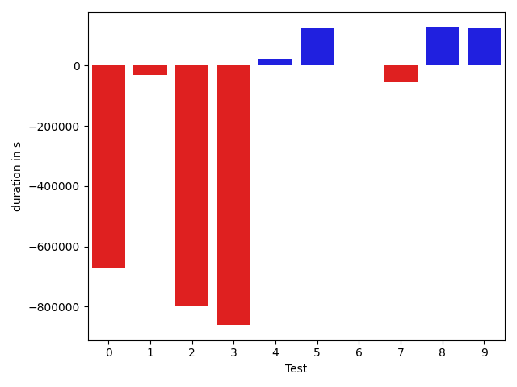

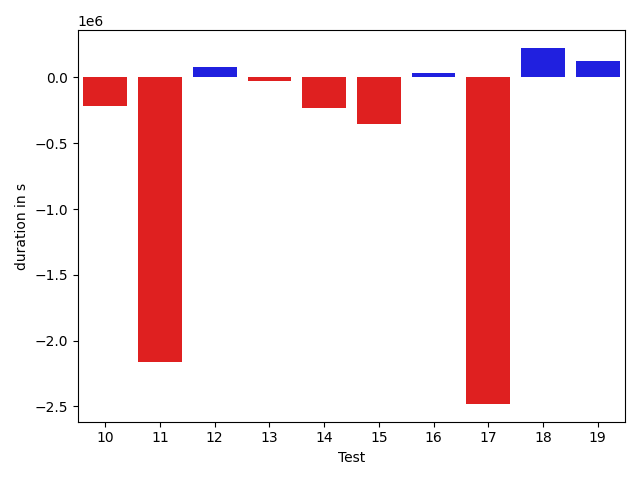

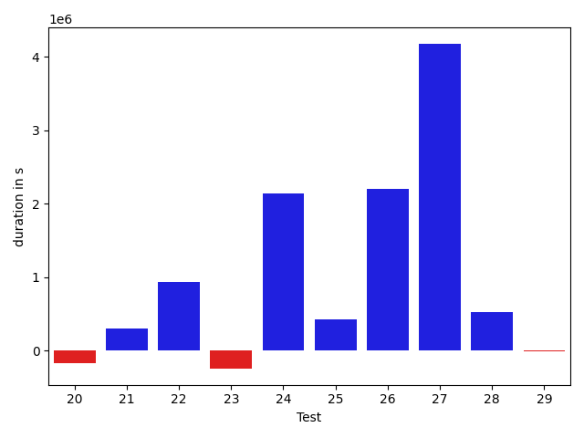

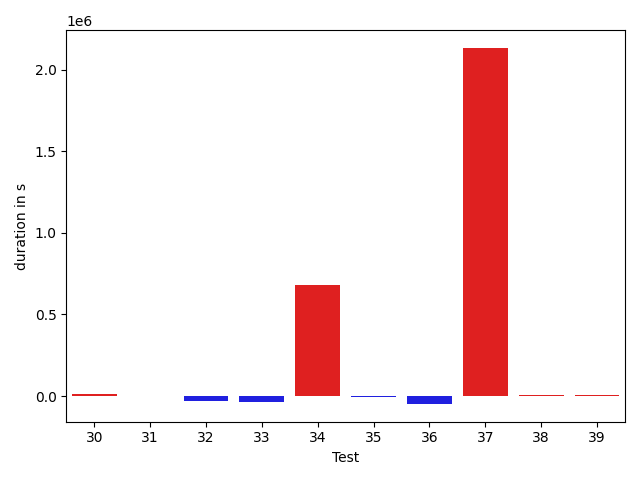

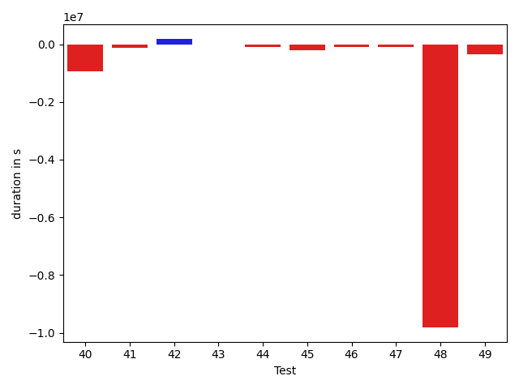

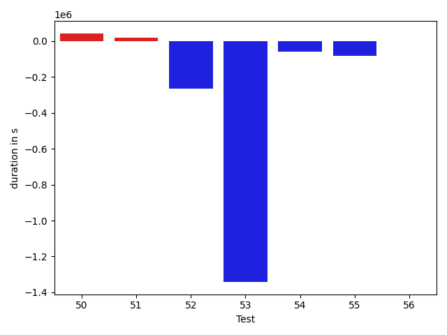

| ID | DurationV1 | DurationsV2 | DeltaDuration |
| --- | --- | --- | --- |
| 0 | 1543311.4583333333 | 1482179.9368421054 | -61131.521491227904 |
| 1 | 2679947.8469387754 | 2433623.414141414 | -246324.43279736117 |
| 2 | 800851.4693877551 | 836981.775510204 | 36130.30612244888 |
| 3 | 715683.551724138 | 673623.5294117647 | -42060.02231237327 |
| 4 | 806259.3333333334 | 818882.8867924528 | 12623.553459119401 |
| 5 | 3561806.525252525 | 3680867.707070707 | 119061.18181818165 |
| 6 | 1345837.573033708 | 1355536.546511628 | 9698.973477920052 |
| 7 | 807393.7454545455 | 819829.0363636364 | 12435.290909090894 |
| 8 | 759023.5952380953 | 825191.8292682926 | 66168.23403019737 |
| 9 | 922732.0819672131 | 936761.796875 | 14029.714907786925 |
| 10 | 554298.92 | 577922.90625 | 23623.986249999958 |
| 11 | 1313487.3 | 1022348.5076923077 | -291138.79230769235 |
| 12 | 3121060.608108108 | 3152426.8481012657 | 31366.239993157797 |
| 13 | 2851582.612244898 | 2808172.4545454546 | -43410.1576994434 |
| 14 | 1590268.0344827587 | 1467949.9176470588 | -122318.11683569988 |
| 15 | 1243549.3 | 1144328.7012987013 | -99220.5987012987 |
| 16 | 744685.0714285715 | 665362.5714285715 | -79322.5 |
| 17 | 2978912.06185567 | 3816754.8854166665 | 837842.8235609964 |
| 18 | 594573.8947368421 | 527506.9523809524 | -67066.94235588971 |
| 19 | 2007005.7849462365 | 5130120.422222222 | 3123114.6372759854 |
| 20 | 496560.63636363635 | 537308.3125 | 40747.67613636365 |
| 21 | 530979.3333333334 | 527217.619047619 | -3761.714285714319 |
| 22 | 540002.75 | 495224.06451612903 | -44778.68548387097 |
| 23 | 857995.911111111 | 872456.081632653 | 14460.170521541964 |
| 24 | 674549.125 | 540863.3846153846 | -133685.74038461538 |
| 25 | 576849.5 | 517523.1538461539 | -59326.34615384613 |
| 26 | 656264.1739130435 | 674499.0666666667 | 18234.892753623193 |
| 27 | 572559.0454545454 | 503482.3333333333 | -69076.7121212121 |
| 28 | 1353381.3368421053 | 1328612.8020833333 | -24768.534758772003 |
| 29 | 1348443.4086021506 | 1353135.180851064 | 4691.772248913301 |
| 30 | 1347566.8936170214 | 1361424.4193548388 | 13857.5257378174 |
| 31 | 1636172.3265306123 | 1633311.121212121 | -2861.2053184912074 |
| 32 | 1347685.7555555555 | 1314840.3483146068 | -32845.40724094864 |
| 33 | 993579.9672131147 | 956183.2333333333 | -37396.733879781445 |
| 34 | 3573835.3232323234 | 4251872.373737373 | 678037.05050505 |
| 35 | 1396298.4782608696 | 1393113.7252747254 | -3184.7529861442745 |
| 36 | 1218654.3846153845 | 1170216.8767123288 | -48437.50790305575 |
| 37 | 4361679.151515151 | 6496113.868686869 | 2134434.7171717174 |
| 38 | 991475.4142857143 | 996081.5384615385 | 4606.124175824225 |
| 39 | 1476093.2988505748 | 1481198.6304347827 | 5105.331584207946 |
| 40 | 612723.2307692308 | 597339.2105263158 | -15384.020242914907 |
| 41 | 6708495.515151516 | 5584811.232323232 | -1123684.2828282835 |
| 42 | 910544.9807692308 | 914841.9583333334 | 4296.977564102621 |
| 43 | 5674198.151515151 | 5744955.858585859 | 70757.70707070734 |
| 44 | 1293159.3943661973 | 1394626.7974683545 | 101467.40310215717 |
| 45 | 1292231.65 | 1447916.046875 | 155684.3968750001 |
| 46 | 5080862.192307692 | 3427582.1325301207 | -1653280.0597775714 |
| 47 | 541127.6315789474 | 527597.3333333334 | -13530.298245614045 |
| 48 | 1457732.8352941177 | 1345937.4767441861 | -111795.35854993155 |
| 49 | 2157086.153846154 | 2074978.607142857 | -82107.54670329695 |
| 50 | 787662.8888888889 | 830437.4693877551 | 42774.58049886627 |
| 51 | 1100743.1147540985 | 1121708.0416666667 | 20964.926912568277 |
| 52 | 2080397.7659574468 | 1816476.5925925926 | -263921.1733648542 |
| 53 | 3634305.619047619 | 2292428.0256410255 | -1341877.5934065934 |
| 54 | 1066524.1363636365 | 1008457.8297872341 | -58066.30657640239 |
| 55 | 1186429.328358209 | 1104746.223880597 | -81683.10447761207 |
| 56 | 647833.0 | 647551.7307692308 | -281.2692307692487 |

## Misc.

| ID | Test Class | Test Method |
| --- | --- | --- |
| 0 | com.google.gson.functional.StreamingTypeAdaptersTest | testNullSafe |
| 1 | com.google.gson.functional.CustomDeserializerTest | testDefaultConstructorNotCalledOnObject |
| 2 | com.google.gson.functional.CustomDeserializerTest | testDefaultConstructorNotCalledOnField |
| 3 | com.google.gson.functional.DefaultTypeAdaptersTest | testBitSetDeserialization |
| 4 | com.google.gson.functional.DefaultTypeAdaptersTest | testTimestampSerialization |
| 5 | com.google.gson.functional.DefaultTypeAdaptersTest | testDefaultDateDeserializationUsingBuilder |
| 6 | com.google.gson.functional.DefaultTypeAdaptersTest | testDateSerializationInCollection |
| 7 | com.google.gson.functional.DefaultTypeAdaptersTest | testSqlDateSerialization |
| 8 | com.google.gson.functional.DefaultTypeAdaptersTest | testOverrideBigIntegerTypeAdapter |
| 9 | com.google.gson.functional.DefaultTypeAdaptersTest | testDateDeserializationWithPattern |
| 10 | com.google.gson.functional.DefaultTypeAdaptersTest | testOverrideBigDecimalTypeAdapter |
| 11 | com.google.gson.functional.EnumTest | testEnumSubclassAsParameterizedType |
| 12 | com.google.gson.functional.EnumTest | testEnumCaseMapping |
| 13 | com.google.gson.functional.EnumTest | testEnumSubclass |
| 14 | com.google.gson.functional.EnumTest | testEnumSubclassWithRegisteredTypeAdapter |
| 15 | com.google.gson.functional.EnumTest | testEnumSet |
| 16 | com.google.gson.functional.DelegateTypeAdapterTest | testDelegateInvokedOnStrings |
| 17 | com.google.gson.functional.DelegateTypeAdapterTest | testDelegateInvoked |
| 18 | com.google.gson.functional.TypeAdapterPrecedenceTest | testSerializeNonstreamingTypeAdapterFollowedByStreamingTypeAdapter |
| 19 | com.google.gson.functional.TypeAdapterPrecedenceTest | testNonstreamingFollowedByNonstreaming |
| 20 | com.google.gson.functional.TypeAdapterPrecedenceTest | testStreamingFollowedByNonstreamingHierarchical |
| 21 | com.google.gson.functional.TypeAdapterPrecedenceTest | testNonstreamingHierarchicalFollowedByNonstreaming |
| 22 | com.google.gson.functional.TypeAdapterPrecedenceTest | testStreamingHierarchicalFollowedByNonstreamingHierarchical |
| 23 | com.google.gson.functional.TypeAdapterPrecedenceTest | testStreamingFollowedByStreaming |
| 24 | com.google.gson.functional.TypeAdapterPrecedenceTest | testStreamingFollowedByNonstreaming |
| 25 | com.google.gson.functional.TypeAdapterPrecedenceTest | testStreamingHierarchicalFollowedByNonstreaming |
| 26 | com.google.gson.functional.StringTest | testSingleQuoteInStringSerialization |
| 27 | com.google.gson.functional.StringTest | testEscapingQuotesInStringSerialization |
| 28 | com.google.gson.functional.ParameterizedTypesTest | testVariableTypeArrayDeserialization |
| 29 | com.google.gson.functional.ParameterizedTypesTest | testVariableTypeDeserialization |
| 30 | com.google.gson.functional.ParameterizedTypesTest | testParameterizedTypeGenericArraysDeserialization |
| 31 | com.google.gson.functional.ParameterizedTypesTest | testVariableTypeFieldsAndGenericArraysDeserialization |
| 32 | com.google.gson.functional.ParameterizedTypesTest | testParameterizedTypeWithVariableTypeDeserialization |
| 33 | com.google.gson.functional.TypeVariableTest | testBasicTypeVariables |
| 34 | com.google.gson.functional.TypeVariableTest | testAdvancedTypeVariables |
| 35 | com.google.gson.functional.TypeVariableTest | testTypeVariablesViaTypeParameter |
| 36 | com.google.gson.functional.MapAsArrayTypeAdapterTest | testMultipleEnableComplexKeyRegistrationHasNoEffect |
| 37 | com.google.gson.functional.MapAsArrayTypeAdapterTest | testSerializeComplexMapWithTypeAdapter |
| 38 | com.google.gson.functional.CollectionTest | testFieldIsArrayList |
| 39 | com.google.gson.functional.CollectionTest | testWildcardCollectionField |
| 40 | com.google.gson.functional.PrimitiveTest | testQuotedStringSerializationAndDeserialization |
| 41 | com.google.gson.functional.TypeHierarchyAdapterTest | testTypeHierarchy |
| 42 | com.google.gson.functional.TypeHierarchyAdapterTest | testRegisterSuperTypeFirst |
| 43 | com.google.gson.DefaultInetAddressTypeAdapterTest | testInetAddressSerializationAndDeserialization |
| 44 | com.google.gson.functional.ReadersWritersTest | testReadWriteTwoStrings |
| 45 | com.google.gson.functional.ReadersWritersTest | testReadWriteTwoObjects |
| 46 | com.google.gson.JsonParserTest | testReadWriteTwoObjects |
| 47 | com.google.gson.JsonParserTest | testParseMixedArray |
| 48 | com.google.gson.functional.ObjectTest | testSingletonLists |
| 49 | com.google.gson.GsonTypeAdapterTest | testTypeAdapterDoesNotAffectNonAdaptedTypes |
| 50 | com.google.gson.functional.EscapingTest | testGsonDoubleDeserialization |
| 51 | com.google.gson.functional.EscapingTest | testGsonAcceptsEscapedAndNonEscapedJsonDeserialization |
| 52 | com.google.gson.functional.EscapingTest | testEscapingObjectFields |
| 53 | com.google.gson.functional.EscapingTest | testEscapingQuotesInStringArray |
| 54 | com.google.gson.functional.UncategorizedTest | testGsonInstanceReusableForSerializationAndDeserialization |
| 55 | com.google.gson.functional.NamingPolicyTest | testComplexFieldNameStrategy |
| 56 | com.google.gson.OverrideCoreTypeAdaptersTest | testOverrideStringAdapter |

| Test | IterationV1 | IterationV2 | DeltaIteration |
| --- | --- | --- | --- |
| 0 | 96 | 95 | -1 |
| 1 | 98 | 99 | 1 |
| 2 | 49 | 49 | 0 |
| 3 | 29 | 34 | 5 |
| 4 | 54 | 53 | -1 |
| 5 | 99 | 99 | 0 |
| 6 | 89 | 86 | -3 |
| 7 | 55 | 55 | 0 |
| 8 | 42 | 41 | -1 |
| 9 | 61 | 64 | 3 |
| 10 | 25 | 32 | 7 |
| 11 | 70 | 65 | -5 |
| 12 | 74 | 79 | 5 |
| 13 | 98 | 99 | 1 |
| 14 | 87 | 85 | -2 |
| 15 | 80 | 77 | -3 |
| 16 | 28 | 28 | 0 |
| 17 | 97 | 96 | -1 |
| 18 | 19 | 21 | 2 |
| 19 | 93 | 90 | -3 |
| 20 | 22 | 16 | -6 |
| 21 | 21 | 21 | 0 |
| 22 | 24 | 31 | 7 |
| 23 | 45 | 49 | 4 |
| 24 | 16 | 26 | 10 |
| 25 | 26 | 26 | 0 |
| 26 | 23 | 15 | -8 |
| 27 | 22 | 18 | -4 |
| 28 | 95 | 96 | 1 |
| 29 | 93 | 94 | 1 |
| 30 | 94 | 93 | -1 |
| 31 | 98 | 99 | 1 |
| 32 | 90 | 89 | -1 |
| 33 | 61 | 60 | -1 |
| 34 | 99 | 99 | 0 |
| 35 | 92 | 91 | -1 |
| 36 | 78 | 73 | -5 |
| 37 | 99 | 99 | 0 |
| 38 | 70 | 65 | -5 |
| 39 | 87 | 92 | 5 |
| 40 | 13 | 19 | 6 |
| 41 | 99 | 99 | 0 |
| 42 | 52 | 48 | -4 |
| 43 | 99 | 99 | 0 |
| 44 | 71 | 79 | 8 |
| 45 | 60 | 64 | 4 |
| 46 | 78 | 83 | 5 |
| 47 | 19 | 18 | -1 |
| 48 | 85 | 86 | 1 |
| 49 | 26 | 28 | 2 |
| 50 | 36 | 49 | 13 |
| 51 | 61 | 72 | 11 |
| 52 | 47 | 54 | 7 |
| 53 | 42 | 39 | -3 |
| 54 | 44 | 47 | 3 |
| 55 | 67 | 67 | 0 |
| 56 | 33 | 26 | -7 |

| Time Label | Time (s) |
| --- | --- |
| Selection | 26.672665119171143 |
| Injection | 13.555080890655518 |
| Total | 1048.992416381836 |

