# gson 7d5311

https://github.com/google/gson/commit/7d5311

## Delta Energy per test method

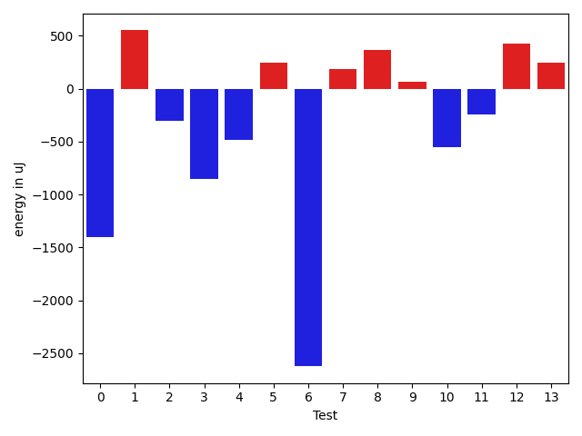

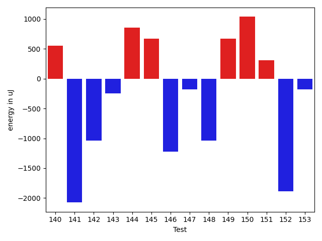

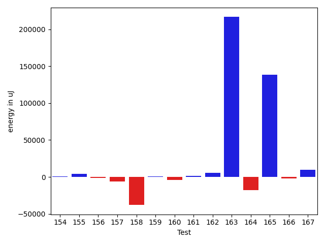

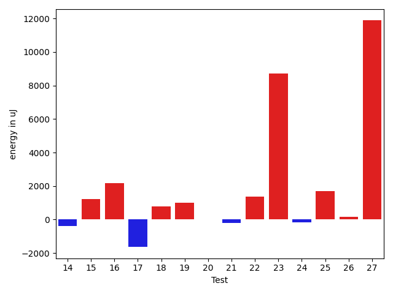

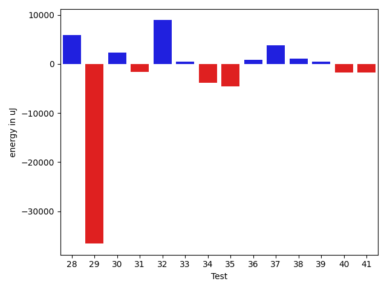

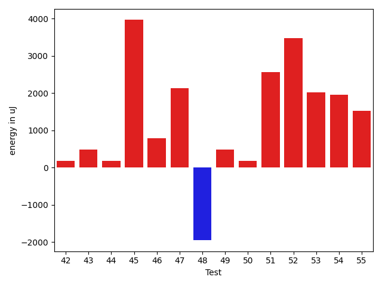

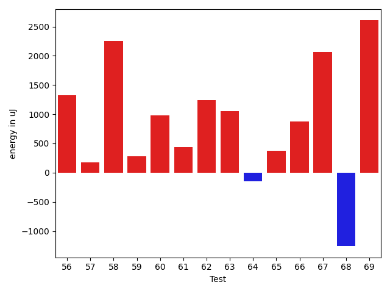

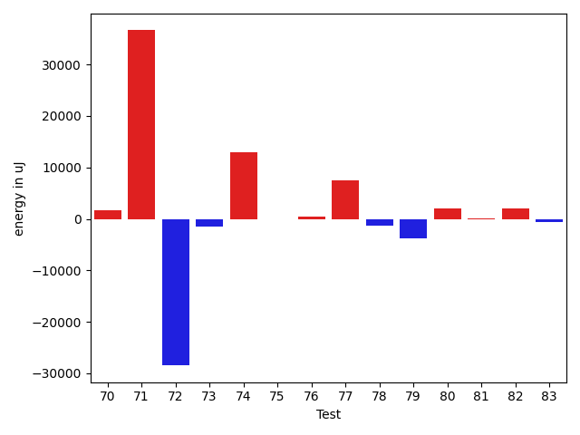

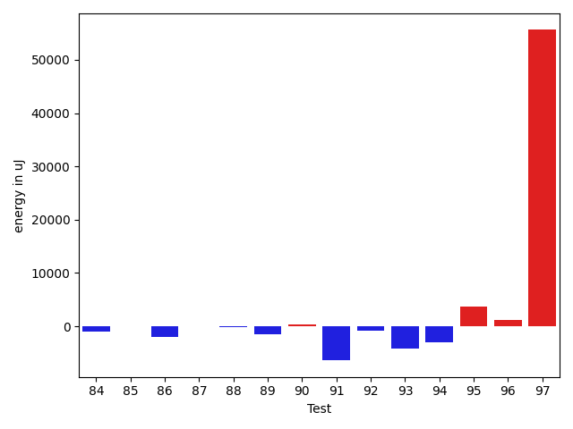

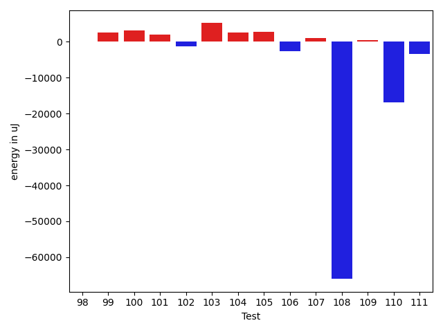

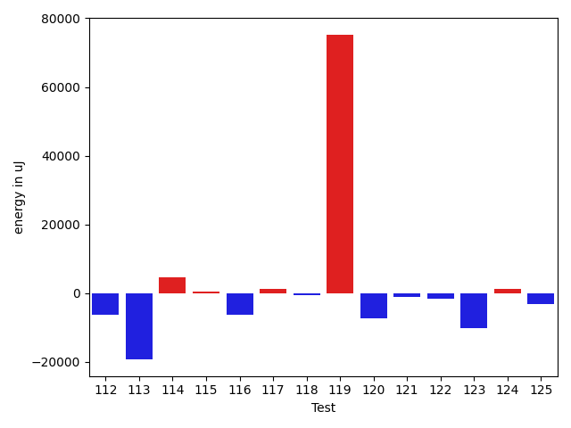

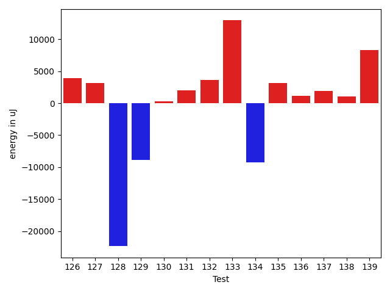

| ID | EnergyV1 | EnergyV2 | DeltaEnergy |
| --- | --- | --- | --- |
| 0 | 37342.46098678767 | 39384.33848919112 | 2041.8775024034476 |
| 1 | 35691.35821986759 | 38874.82846653058 | 3183.4702466629897 |
| 2 | 32183.981169507715 | 39281.20129239648 | 7097.220122888764 |
| 3 | 33723.10112172687 | 38020.18906847137 | 4297.087946744505 |
| 4 | 76347.17724378209 | 41181.821831893 | -35165.35541188909 |
| 5 | 35258.21540186509 | 39926.638720815274 | 4668.423318950183 |
| 6 | 40641.150750539426 | 34728.658591566724 | -5912.492158972702 |
| 7 | 44351.94926170259 | 38104.39984640174 | -6247.549415300848 |
| 8 | 36923.536260838795 | 38051.76792885363 | 1128.231668014836 |
| 9 | 42400.91736935833 | 37831.106470418395 | -4569.810898939933 |
| 10 | 40138.53139653469 | 34484.91613777505 | -5653.615258759637 |
| 11 | 36664.83325991224 | 35435.336599608934 | -1229.4966603033026 |
| 12 | 41013.70148519874 | 35789.97573806206 | -5223.725747136683 |
| 13 | 51161.58718646898 | 108664.17948273875 | 57502.592296269766 |
| 14 | 41815.177137198814 | 36799.395710553465 | -5015.78142664535 |
| 15 | 117580.73834968559 | 109761.05673385136 | -7819.681615834226 |
| 16 | 53658.05650555455 | 38241.21407096854 | -15416.842434586011 |
| 17 | 55257.611565552834 | 55557.32953920608 | 299.7179736532489 |
| 18 | 40146.49644067597 | 37014.989614952385 | -3131.5068257235835 |
| 19 | 37227.87098730705 | 38194.059758060146 | 966.1887707530987 |
| 20 | 399825.2317900106 | 489984.10227834823 | 90158.87048833765 |
| 21 | 40857.58115154719 | 36171.41241933235 | -4686.1687322148355 |
| 22 | 37714.18760538101 | 36981.74727067561 | -732.4403347054031 |
| 23 | 39072.932642889224 | 35101.52972423751 | -3971.4029186517146 |
| 24 | 37132.17147141881 | 37036.34479885339 | -95.82667256542481 |
| 25 | 52332.83310256681 | 57502.19828524765 | 5169.365182680842 |
| 26 | 36448.21101437905 | 37743.167436049785 | 1294.9564216707367 |
| 27 | 210366.31781695999 | 238554.64503321 | 28188.327216250007 |
| 28 | 40765.592873159796 | 46612.52363837468 | 5846.9307652148855 |
| 29 | 80222.0022377586 | 43637.71843051829 | -36584.28380724031 |
| 30 | 36876.93432869545 | 39176.260931107696 | 2299.326602412242 |
| 31 | 37388.40564331335 | 35798.25264442526 | -1590.1529988880939 |
| 32 | 39082.015452656924 | 47981.55700580543 | 8899.541553148505 |
| 33 | 36340.42347242036 | 36831.33405510784 | 490.9105826874802 |
| 34 | 42616.81186732855 | 38817.650582254195 | -3799.161285074355 |
| 35 | 41137.3793170006 | 36622.64590994168 | -4514.73340705892 |
| 36 | 37740.63438163082 | 38585.123443401935 | 844.4890617711135 |
| 37 | 39316.45838178472 | 43133.77187286703 | 3817.3134910823064 |
| 38 | 38208.080185085535 | 39235.33661901951 | 1027.2564339339733 |
| 39 | 38204.44089629632 | 38657.17914370211 | 452.73824740578857 |
| 40 | 40770.715349416256 | 39001.02699131785 | -1769.6883580984068 |
| 41 | 42378.36898368173 | 40635.83662932106 | -1742.532354360672 |
| 42 | 36807.95278113475 | 31944.796895428328 | -4863.155885706423 |
| 43 | 39619.007222892906 | 39716.842348549166 | 97.83512565626006 |
| 44 | 37324.10668183056 | 40697.75436651682 | 3373.647684686257 |
| 45 | 41887.06428879683 | 34967.11215786374 | -6919.9521309330885 |
| 46 | 36276.42848980031 | 39484.846742513575 | 3208.4182527132652 |
| 47 | 37509.21977423562 | 35379.15252113199 | -2130.0672531036325 |
| 48 | 37297.21982390055 | 40436.09532212732 | 3138.875498226771 |
| 49 | 37030.819896563116 | 40056.68673639619 | 3025.86683983307 |
| 50 | 45607.47075917144 | 44503.158471019226 | -1104.312288152214 |
| 51 | 40853.48852446304 | 43782.96073502558 | 2929.4722105625406 |
| 52 | 34776.50467066231 | 38845.442900899885 | 4068.9382302375743 |
| 53 | 38636.88782569427 | 39206.71682325689 | 569.8289975626176 |
| 54 | 46201.49364793538 | 38990.85221558908 | -7210.641432346296 |
| 55 | 35583.73211143885 | 36161.0905269163 | 577.3584154774508 |
| 56 | 33126.323907027516 | 37280.025858856956 | 4153.70195182944 |
| 57 | 34450.88059589276 | 38609.43489790334 | 4158.554302010576 |
| 58 | 37548.010065876035 | 38376.523758633935 | 828.5136927579006 |
| 59 | 37591.92994021792 | 38699.763987286104 | 1107.834047068187 |
| 60 | 36838.495903497766 | 36300.146100827784 | -538.3498026699817 |
| 61 | 40674.964948275956 | 39815.262793059825 | -859.7021552161314 |
| 62 | 45350.30432370205 | 40309.88922068882 | -5040.415103013227 |
| 63 | 37856.778065757484 | 39149.58825022331 | 1292.810184465823 |
| 64 | 33064.422026413915 | 42575.90851814581 | 9511.486491731892 |
| 65 | 52944.80054843604 | 68694.2704924492 | 15749.469944013159 |
| 66 | 41998.444234182614 | 35954.47545764665 | -6043.968776535963 |
| 67 | 33884.0024803762 | 40221.67364963468 | 6337.6711692584795 |
| 68 | 43861.2421609786 | 39978.85480503346 | -3882.387355945146 |
| 69 | 39995.33416415189 | 38646.54337710515 | -1348.7907870467461 |
| 70 | 32836.03330088749 | 38484.87201586268 | 5648.838714975194 |
| 71 | 33453.672094675465 | 39556.3560469777 | 6102.683952302235 |
| 72 | 37225.8400052888 | 37212.33654674784 | -13.5034585409594 |
| 73 | 34687.657027512534 | 38201.11888465763 | 3513.461857145099 |
| 74 | 33100.510085963135 | 40063.637170379676 | 6963.127084416541 |
| 75 | 34629.020081880124 | 38835.29721108892 | 4206.277129208793 |
| 76 | 37842.86446562832 | 39760.79360185894 | 1917.9291362306176 |
| 77 | 40043.09342047814 | 42328.081296111544 | 2284.9878756334074 |
| 78 | 33171.60135616548 | 35670.321349380836 | 2498.7199932153526 |
| 79 | 48555.30490907104 | 39663.1285975003 | -8892.176311570744 |
| 80 | 36534.35602750273 | 35093.167094519995 | -1441.1889329827318 |
| 81 | 37570.54720078266 | 39787.91392313124 | 2217.3667223485754 |
| 82 | 38910.367646478575 | 37224.82745917751 | -1685.5401873010633 |
| 83 | 38188.74865976644 | 44468.45003141761 | 6279.701371651172 |
| 84 | 37716.90024222707 | 44645.133999127655 | 6928.233756900583 |
| 85 | 37505.046458473924 | 35531.24305013061 | -1973.8034083433158 |
| 86 | 38818.23100230243 | 37799.46341900852 | -1018.767583293913 |
| 87 | 212529.10965362203 | 310728.0546393583 | 98198.94498573628 |
| 88 | 46727.57760864496 | 61574.145410217345 | 14846.567801572382 |
| 89 | 36024.666134044324 | 41426.46647258027 | 5401.800338535948 |
| 90 | 40469.794481236255 | 37001.48607158661 | -3468.308409649646 |
| 91 | 210762.64173361834 | 128994.0525250425 | -81768.58920857584 |
| 92 | 32913.847496546805 | 36113.89363741078 | 3200.046140863975 |
| 93 | 35283.333082736186 | 36095.44475710648 | 812.1116743702951 |
| 94 | 52190.5516570194 | 37398.74346570298 | -14791.80819131642 |
| 95 | 37946.970080443454 | 38020.766991551514 | 73.79691110806016 |
| 96 | 37890.80121174891 | 45879.17293167836 | 7988.371719929448 |
| 97 | 70464.22244526804 | 101620.27298428625 | 31156.050539018208 |
| 98 | 33695.41570920872 | 37506.46606948524 | 3811.050360276524 |
| 99 | 37607.02953670906 | 45526.71479503451 | 7919.685258325451 |
| 100 | 37610.589405058185 | 41788.98731583506 | 4178.3979107768755 |
| 101 | 35304.587943921855 | 35092.18444039338 | -212.403503528476 |
| 102 | 35990.102512764446 | 59041.48928763675 | 23051.386774872306 |
| 103 | 37303.14792976887 | 46754.06130792853 | 9450.913378159661 |
| 104 | 45583.90467333762 | 43626.4888095658 | -1957.415863771821 |
| 105 | 41372.974667987175 | 39940.435040863296 | -1432.5396271238787 |
| 106 | 39327.9859058118 | 39453.292148356384 | 125.30624254458235 |
| 107 | 42929.284759181945 | 43689.48106520626 | 760.1963060243143 |
| 108 | 54966.99148226842 | 47081.65464006709 | -7885.33684220133 |
| 109 | 38504.99805731569 | 40664.905263080436 | 2159.9072057647427 |
| 110 | 36487.53382330283 | 124968.08829280957 | 88480.55446950674 |
| 111 | 37027.04184129438 | 36426.991175674826 | -600.0506656195575 |
| 112 | 38835.593511549174 | 36360.44074674046 | -2475.152764808714 |
| 113 | 35181.4345665381 | 33151.86116268504 | -2029.5734038530572 |
| 114 | 79003.66431256631 | 78833.89941126226 | -169.76490130405 |
| 115 | 52525.91218340942 | 53037.469250173 | 511.55706676358386 |
| 116 | 42168.93069759126 | 40206.44621529164 | -1962.4844822996238 |
| 117 | 37048.87023758614 | 40443.80302645343 | 3394.9327888672924 |
| 118 | 35377.906717573256 | 41116.14369730337 | 5738.236979730114 |
| 119 | 659154.0399391201 | 147932.75120889122 | -511221.28873022884 |
| 120 | 34479.6750395085 | 40679.43677326712 | 6199.761733758627 |
| 121 | 39445.57852236582 | 35544.53984702751 | -3901.0386753383063 |
| 122 | 41500.426878822036 | 36600.51885209116 | -4899.908026730875 |
| 123 | 35857.46429402009 | 42847.80086006099 | 6990.336566040904 |
| 124 | 39130.85098055005 | 39320.51820349693 | 189.66722294688225 |
| 125 | 66297.7671702984 | 42013.91526426375 | -24283.851906034644 |
| 126 | 33735.00183207076 | 37642.237282663584 | 3907.2354505928233 |
| 127 | 38883.431144384675 | 40247.343749084066 | 1363.9126046993915 |
| 128 | 38609.51963521354 | 35442.98046418297 | -3166.5391710305703 |
| 129 | 56937.6094924474 | 55146.7027983037 | -1790.906694143705 |
| 130 | 173541.7322237061 | 95162.52746889245 | -78379.20475481363 |
| 131 | 36877.52265842324 | 42572.185756297484 | 5694.663097874247 |
| 132 | 54458.772592762456 | 37344.672349255256 | -17114.1002435072 |
| 133 | 48233.82008271539 | 42826.51107042834 | -5407.309012287049 |
| 134 | 42018.35257140269 | 38782.71385751244 | -3235.63871389025 |
| 135 | 71054.98311793176 | 41218.14688965725 | -29836.836228274507 |
| 136 | 44080.5762180894 | 34285.75767262699 | -9794.81854546241 |
| 137 | 48634.396743936115 | 37285.484586782695 | -11348.91215715342 |
| 138 | 79018.15428499851 | 82923.85800888324 | 3905.703723884726 |
| 139 | 43817.82889755482 | 43295.36666004823 | -522.4622375065883 |
| 140 | 41994.56466262101 | 42537.22713590522 | 542.6624732842101 |
| 141 | 43411.563165238964 | 38739.76883196055 | -4671.7943332784125 |
| 142 | 1680874.174677391 | 1865230.8721157238 | 184356.69743833272 |
| 143 | 362552.8800070521 | 344502.5730715154 | -18050.306935536675 |
| 144 | 72711.01150184711 | 48148.32908162818 | -24562.68242021893 |
| 145 | 33958.8478445671 | 42227.105687979194 | 8268.257843412095 |
| 146 | 36744.953526306395 | 72366.40207428722 | 35621.44854798083 |
| 147 | 71451.90187299314 | 93780.18801191522 | 22328.286138922078 |
| 148 | 37987.73070320225 | 43232.9675122877 | 5245.236809085451 |
| 149 | 41456.400817498725 | 44229.715040296316 | 2773.3142227975914 |
| 150 | 40240.35476413286 | 35464.04990654409 | -4776.304857588773 |
| 151 | 36788.70458633873 | 38523.73147847415 | 1735.0268921354145 |
| 152 | 40024.82210578545 | 40364.84288227938 | 340.02077649392595 |
| 153 | 34524.89403819074 | 37361.42901612645 | 2836.534977935713 |
| 154 | 36920.884569817936 | 37515.14251408633 | 594.2579442683927 |
| 155 | 41287.521496308196 | 45299.83243196416 | 4012.3109356559653 |
| 156 | 41341.74589091579 | 39719.275235698326 | -1622.4706552174612 |
| 157 | 46285.10983467835 | 40139.74254174433 | -6145.367292934017 |
| 158 | 76753.65681057557 | 38819.40657039109 | -37934.25024018448 |
| 159 | 41973.39802352124 | 42724.975079536096 | 751.5770560148594 |
| 160 | 46137.63031220436 | 41801.710614323616 | -4335.919697880745 |
| 161 | 40320.46013323421 | 41982.44701904254 | 1661.9868858083282 |
| 162 | 38318.41849501518 | 43732.97663531355 | 5414.558140298366 |
| 163 | 37866.29606837077 | 254401.37820845636 | 216535.08214008558 |
| 164 | 61302.26464378572 | 43677.93929059637 | -17624.32535318935 |
| 165 | 61686.30613177545 | 199866.28975752823 | 138179.9836257528 |
| 166 | 33220.50396070855 | 31072.25255541883 | -2148.2514052897204 |
| 167 | 33543.5695641216 | 43332.346988654615 | 9788.777424533015 |
| 168 | 33018.51436824768 | 39126.53645869492 | 6108.022090447244 |
| 169 | 47198.429032751264 | 47027.23641158219 | -171.1926211690734 |
| 170 | 46329.793248951886 | 37115.42443139056 | -9214.368817561328 |
| 171 | 57788.025666492416 | 42292.65334501002 | -15495.372321482399 |
| 172 | 39756.25589949931 | 43460.40719557654 | 3704.1512960772307 |
| 173 | 42330.26483113956 | 42358.04933623632 | 27.78450509675895 |

## Delta Duration per test method

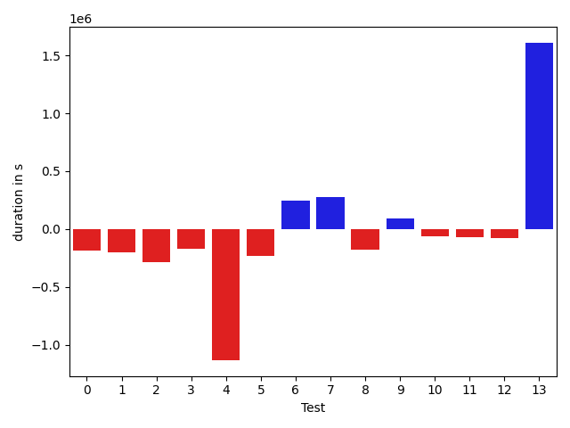

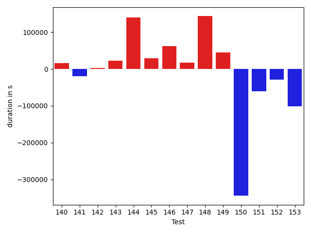

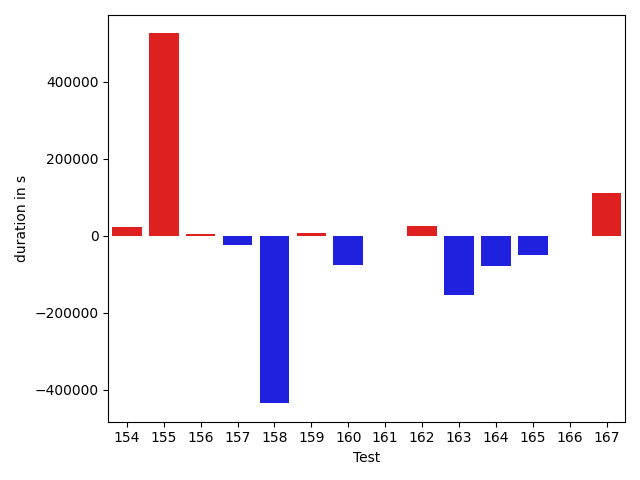

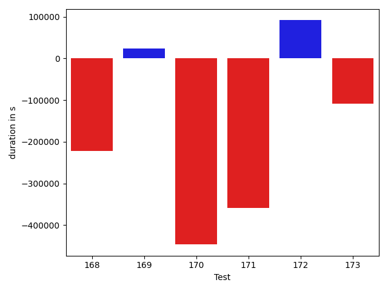

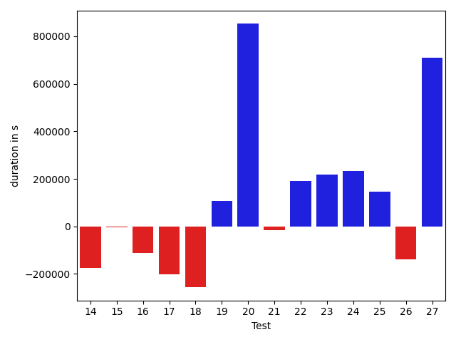

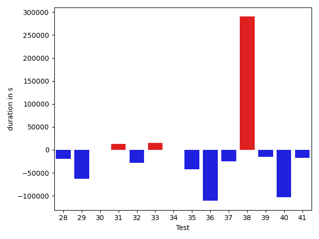

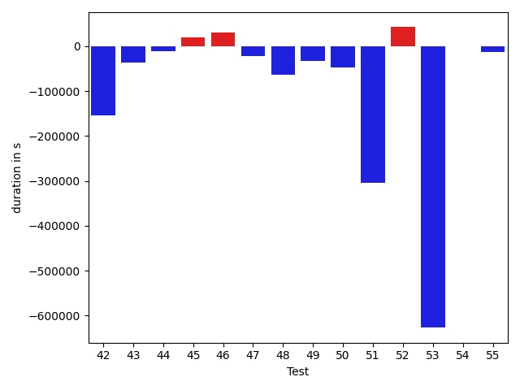

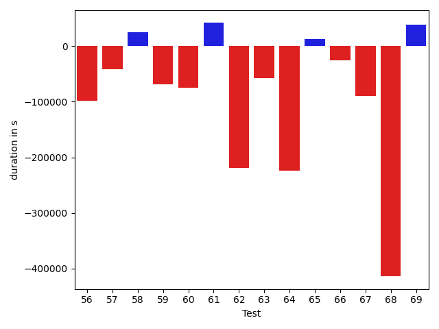

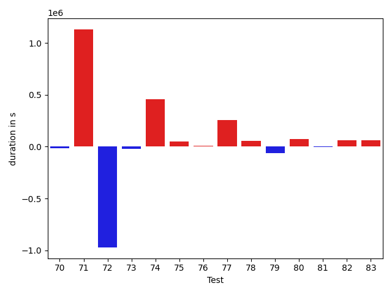

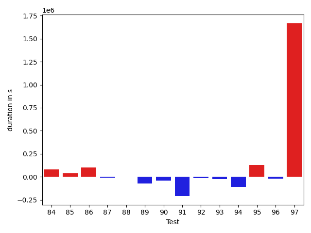

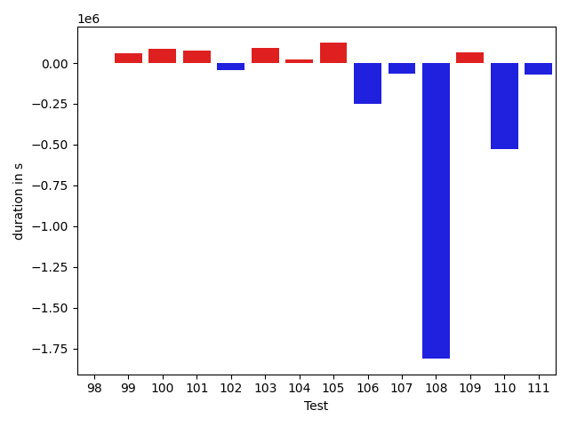

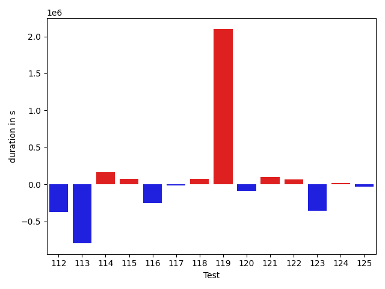

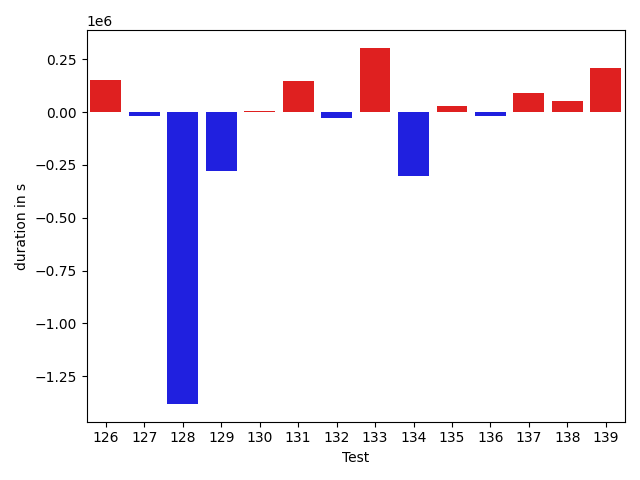

| ID | DurationV1 | DurationsV2 | DeltaDuration |
| --- | --- | --- | --- |
| 0 | 1085968.525958682 | 901034.0832522301 | -184934.44270645187 |
| 1 | 968450.3320673837 | 770675.7696523814 | -197774.56241500226 |
| 2 | 846754.8214915565 | 561046.1679528644 | -285708.65353869204 |
| 3 | 937338.6101607829 | 768268.6180504848 | -169069.99211029813 |
| 4 | 2186044.551433814 | 1054052.432620996 | -1131992.1188128183 |
| 5 | 806318.2786549509 | 575316.7338997778 | -231001.54475517315 |
| 6 | 1067479.3642007208 | 1310710.925192501 | 243231.56099178013 |
| 7 | 791450.1666517422 | 1067180.2966515853 | 275730.1299998431 |
| 8 | 721821.8626373719 | 541521.3009262905 | -180300.56171108142 |
| 9 | 520730.4968945206 | 611005.3389084567 | 90274.84201393614 |
| 10 | 1465158.6843875207 | 1399932.4185577095 | -65226.265829811106 |
| 11 | 1124646.02696121 | 1052503.002220458 | -72143.02474075207 |
| 12 | 1516852.2056807133 | 1441536.2937281723 | -75315.91195254098 |
| 13 | 2076784.4685831126 | 3685325.95297198 | 1608541.4843888674 |
| 14 | 1530798.1220664862 | 1354750.8208095706 | -176047.30125691555 |
| 15 | 3347381.6692846594 | 3343044.8886745893 | -4336.780610070098 |
| 16 | 1483461.578820253 | 1371555.8539666208 | -111905.72485363227 |
| 17 | 1918846.908319342 | 1717891.3533625775 | -200955.55495676445 |
| 18 | 1611168.6533106093 | 1354831.827239613 | -256336.82607099623 |
| 19 | 464955.5739859395 | 572009.4026311357 | 107053.82864519616 |
| 20 | 12522729.274048392 | 13374787.902935188 | 852058.6288867965 |
| 21 | 1234510.7022588875 | 1219901.6676036874 | -14609.034655200085 |
| 22 | 557919.2840907574 | 748475.7547694467 | 190556.4706786893 |
| 23 | 506400.99510547565 | 725246.9710526986 | 218845.9759472229 |
| 24 | 1005776.2175393876 | 1238187.4273891356 | 232411.20984974795 |
| 25 | 1307396.2068966879 | 1453691.6841307378 | 146295.47723404993 |
| 26 | 829208.6741303972 | 690691.0599954783 | -138517.6141349189 |
| 27 | 5526284.017987153 | 6235307.043315931 | 709023.0253287787 |
| 28 | 778662.6704760827 | 675736.5877481058 | -102926.08272797696 |
| 29 | 1980313.830132693 | 534118.4367251638 | -1446195.3934075292 |
| 30 | 668916.1666710095 | 799280.3358906348 | 130364.1692196253 |
| 31 | 669966.7681997058 | 622325.7896727435 | -47640.97852696222 |
| 32 | 669026.6745030021 | 1550707.5235773092 | 881680.8490743071 |
| 33 | 626461.6830847715 | 663611.0616389094 | 37149.37855413789 |
| 34 | 618818.4939545882 | 595561.1982328088 | -23257.295721779345 |
| 35 | 1046607.6401084485 | 1040429.5420380335 | -6178.09807041497 |
| 36 | 673619.5993509947 | 856180.3785608717 | 182560.77920987702 |
| 37 | 871172.1616493431 | 858779.852202041 | -12392.309447302134 |
| 38 | 415497.63455399126 | 485931.3434765339 | 70433.70892254263 |
| 39 | 1079990.533321618 | 1151521.0304510694 | 71530.49712945125 |
| 40 | 924354.0448449345 | 1208635.0170150157 | 284280.9721700812 |
| 41 | 696903.9148245064 | 738029.5837421101 | 41125.668917603674 |
| 42 | 589853.1661783936 | 904484.2064654354 | 314631.0402870418 |
| 43 | 718152.5053900185 | 906281.0989631903 | 188128.59357317188 |
| 44 | 988768.268658412 | 813393.2944650156 | -175374.9741933964 |
| 45 | 1041029.9654216395 | 872162.9566279948 | -168867.00879364472 |
| 46 | 823263.385062112 | 761178.1402524968 | -62085.24480961519 |
| 47 | 693870.0461326239 | 866327.0185114364 | 172456.9723788125 |
| 48 | 896818.2283502653 | 635835.2838355202 | -260982.94451474515 |
| 49 | 881894.5580656347 | 726710.6008460387 | -155183.95721959602 |
| 50 | 1227602.0058020856 | 1063748.0093655393 | -163853.99643654632 |
| 51 | 566456.9357488153 | 658601.8667954132 | 92144.93104659789 |
| 52 | 995869.3737949899 | 831269.3509878049 | -164600.02280718496 |
| 53 | 1255438.0551812113 | 1207951.0696754649 | -47486.985505746445 |
| 54 | 1016208.2648762461 | 882311.3559210056 | -133896.9089552405 |
| 55 | 704916.6840974342 | 686119.4846509874 | -18797.199446446728 |
| 56 | 782246.0157935761 | 684204.9355853524 | -98041.08020822378 |
| 57 | 755461.7027677615 | 714298.8313839869 | -41162.871383774676 |
| 58 | 690776.1540077284 | 715606.8431381928 | 24830.689130464336 |
| 59 | 712850.0212627903 | 643560.0820401547 | -69289.93922263558 |
| 60 | 697380.3795802961 | 622828.8552370127 | -74551.52434328338 |
| 61 | 922882.9715968568 | 964327.5808365797 | 41444.609239722835 |
| 62 | 1339767.059956713 | 1120640.229665279 | -219126.8302914342 |
| 63 | 792535.1718835996 | 734465.4997776676 | -58069.672105932026 |
| 64 | 1164609.6149660097 | 941210.7837767774 | -223398.8311892323 |
| 65 | 1639474.7839715225 | 1652196.4968834966 | 12721.712911974173 |
| 66 | 633664.1988835686 | 608122.2642413352 | -25541.93464223342 |
| 67 | 735057.2325742726 | 645142.5140435803 | -89914.71853069228 |
| 68 | 1049541.6226401017 | 635571.7765005637 | -413969.846139538 |
| 69 | 709674.0383265988 | 747698.6348921349 | 38024.59656553611 |
| 70 | 729831.7841502377 | 656178.9737730899 | -73652.81037714775 |
| 71 | 892633.5424967107 | 688401.2376085571 | -204232.30488815357 |
| 72 | 662850.3740117726 | 656313.3773448373 | -6536.9966669352725 |
| 73 | 814337.0404154211 | 703230.3471922021 | -111106.69322321902 |
| 74 | 736768.5616859092 | 699786.6448071181 | -36981.91687879106 |
| 75 | 967062.3827344605 | 808956.3467079728 | -158106.0360264877 |
| 76 | 747238.9307924244 | 752538.4899759988 | 5299.559183574398 |
| 77 | 955076.3691631369 | 919441.3095046362 | -35635.059658500715 |
| 78 | 590188.8252579002 | 514251.5705085563 | -75937.25474934385 |
| 79 | 996292.422024867 | 901597.4105033965 | -94695.0115214705 |
| 80 | 683674.2921240567 | 687233.2853468038 | 3558.9932227471145 |
| 81 | 1138208.6388030746 | 955312.3324006267 | -182896.30640244787 |
| 82 | 706713.6226730559 | 690363.786778263 | -16349.835894792806 |
| 83 | 1198908.0175391454 | 1026136.3438099796 | -172771.6737291658 |
| 84 | 904532.8033107391 | 1007701.4050169168 | 103168.6017061777 |
| 85 | 696510.5362793321 | 687416.9876711058 | -9093.548608226352 |
| 86 | 735270.9931382656 | 719544.9677015697 | -15726.025436695898 |
| 87 | 5554312.860814787 | 8918392.387404494 | 3364079.5265897065 |
| 88 | 901114.7914628983 | 1161028.5228452757 | 259913.73138237745 |
| 89 | 772696.5068327831 | 561464.2301642678 | -211232.2766685153 |
| 90 | 520052.0745953332 | 733742.5159721375 | 213690.44137680426 |
| 91 | 5226094.327050315 | 4413998.090057954 | -812096.236992361 |
| 92 | 476550.0623853728 | 487309.17146164214 | 10759.10907626932 |
| 93 | 829122.0193360138 | 738685.6617258393 | -90436.35761017457 |
| 94 | 1015974.1045680803 | 639361.8046748228 | -376612.29989325744 |
| 95 | 793687.4977691639 | 726173.6607991185 | -67513.83697004546 |
| 96 | 717518.2299556334 | 993293.4022309012 | 275775.1722752678 |
| 97 | 2112800.843204491 | 3059600.9908065735 | 946800.1476020827 |
| 98 | 1096690.363036442 | 1154610.9668607016 | 57920.60382425948 |
| 99 | 1176822.0378003686 | 1347318.8855321228 | 170496.84773175418 |
| 100 | 607443.0061451353 | 824401.9324077995 | 216958.92626266426 |
| 101 | 898536.5557753487 | 1065649.5361630747 | 167112.98038772598 |
| 102 | 771685.1093092149 | 1639857.41811988 | 868172.308810665 |
| 103 | 823224.812853781 | 992348.5242730329 | 169123.71141925186 |
| 104 | 1315174.2247266537 | 1436872.4555413625 | 121698.23081470886 |
| 105 | 706804.7497942388 | 776592.9889138283 | 69788.23911958945 |
| 106 | 601443.0695474868 | 757594.3262083107 | 156151.25666082383 |
| 107 | 987186.7615713836 | 927455.1956249843 | -59731.565946399234 |
| 108 | 1511737.7361277735 | 1133119.0309043864 | -378618.7052233871 |
| 109 | 766961.7730394204 | 798932.9719848 | 31971.198945379583 |
| 110 | 1282348.9339896054 | 4105771.2873215023 | 2823422.353331897 |
| 111 | 694801.6154483198 | 822284.8093964703 | 127483.1939481505 |
| 112 | 1068593.1918080696 | 950231.4398073778 | -118361.75200069183 |
| 113 | 895086.5506824171 | 741782.4958975689 | -153304.05478484824 |
| 114 | 2502777.34958285 | 2111754.7820704896 | -391022.5675123604 |
| 115 | 1725489.8145372663 | 1301725.340854765 | -423764.47368250135 |
| 116 | 789031.9712322656 | 651723.6603242268 | -137308.31090803875 |
| 117 | 860309.2044738531 | 696502.110427201 | -163807.09404665208 |
| 118 | 852472.4892172675 | 728935.6613634487 | -123536.82785381877 |
| 119 | 19934041.29627983 | 3809248.543718456 | -16124792.752561374 |
| 120 | 1221175.8246535521 | 816333.9599555868 | -404841.8646979653 |
| 121 | 627737.5729957331 | 489409.2007148303 | -138328.3722809028 |
| 122 | 678604.7024106975 | 651936.548927021 | -26668.15348367649 |
| 123 | 620051.3898587031 | 568895.6367512383 | -51155.75310746487 |
| 124 | 623336.4876209795 | 726353.4864670038 | 103016.99884602427 |
| 125 | 2310983.286678578 | 631666.2773518106 | -1679317.0093267672 |
| 126 | 700643.534800169 | 652760.1578676999 | -47883.3769324692 |
| 127 | 706191.2029073542 | 868018.7081602414 | 161827.50525288715 |
| 128 | 661995.4124322999 | 721666.4063390049 | 59670.99390670494 |
| 129 | 1897660.626903241 | 1573900.7292834024 | -323759.8976198386 |
| 130 | 5057687.324462781 | 2174866.6997421477 | -2882820.624720633 |
| 131 | 1305090.7197701456 | 1294778.9970675646 | -10311.72270258097 |
| 132 | 1206095.5726514116 | 1104166.5993161811 | -101928.97333523049 |
| 133 | 1672053.3098718254 | 1564352.9576946613 | -107700.35217716405 |
| 134 | 1046320.210525636 | 955349.8822954455 | -90970.32823019044 |
| 135 | 2418775.99338054 | 1145748.1798999272 | -1273027.8134806128 |
| 136 | 716388.7136576918 | 777585.3081358967 | 61196.59447820485 |
| 137 | 955560.0898907008 | 949207.3046965462 | -6352.785194154596 |
| 138 | 1969818.8929874415 | 2597271.960713421 | 627453.0677259795 |
| 139 | 752095.6831448816 | 973765.0299169272 | 221669.3467720456 |
| 140 | 1038536.6801705329 | 885021.448290251 | -153515.23188028194 |
| 141 | 830104.6987615833 | 992873.0550312339 | 162768.35626965063 |
| 142 | 52973647.54513264 | 53375149.46700255 | 401501.92186991125 |
| 143 | 11430727.826225402 | 10208081.430430047 | -1222646.3957953546 |
| 144 | 1921709.8169122979 | 1719853.681468471 | -201856.1354438269 |
| 145 | 1033838.3479031546 | 676595.5086423703 | -357242.8392607842 |
| 146 | 954136.526651121 | 1697808.281046765 | 743671.754395644 |
| 147 | 1989137.1396304988 | 2486311.212322788 | 497174.072692289 |
| 148 | 750095.0222197108 | 828768.2264397831 | 78673.20422007237 |
| 149 | 815747.8969243042 | 665275.0671465993 | -150472.8297777049 |
| 150 | 805866.9590083468 | 967696.5241000722 | 161829.56509172544 |
| 151 | 670994.4193861901 | 605553.7615761482 | -65440.657810041914 |
| 152 | 1206396.0763071994 | 1199286.0692219976 | -7110.007085201796 |
| 153 | 576988.240241427 | 526805.4967488433 | -50182.74349258363 |
| 154 | 547279.5902477271 | 539359.5963303881 | -7919.993917339016 |
| 155 | 1375678.2473184692 | 991839.7733793875 | -383838.47393908177 |
| 156 | 1100065.3118339893 | 718332.2070677769 | -381733.1047662124 |
| 157 | 1549027.3758161035 | 966876.9165527468 | -582150.4592633568 |
| 158 | 2412774.1196516147 | 1029729.1492215589 | -1383044.9704300556 |
| 159 | 735145.6121702085 | 862905.1520227612 | 127759.5398525527 |
| 160 | 988783.6039113998 | 465312.810401625 | -523470.79350977484 |
| 161 | 745830.8049953692 | 939591.7186921842 | 193760.91369681503 |
| 162 | 862611.2224479375 | 913726.3847016953 | 51115.16225375782 |
| 163 | 1231015.360118427 | 7871718.83046728 | 6640703.470348853 |
| 164 | 1461904.9633859773 | 1140063.855825667 | -321841.1075603103 |
| 165 | 1604934.290690865 | 7939010.889174072 | 6334076.598483207 |
| 166 | 844021.1448376076 | 1188432.728104589 | 344411.5832669814 |
| 167 | 948478.9203266358 | 836029.5204721543 | -112449.39985448157 |
| 168 | 933035.9420602596 | 710995.831713934 | -222040.11034632567 |
| 169 | 1319127.2478788025 | 1342964.6731863471 | 23837.425307544647 |
| 170 | 1288971.4818815768 | 842576.819025954 | -446394.6628556228 |
| 171 | 1490978.235321856 | 1131613.3589821202 | -359364.8763397359 |
| 172 | 636732.2969603774 | 728296.9324867344 | 91564.63552635699 |
| 173 | 749135.565518382 | 641133.0971274034 | -108002.46839097864 |

## Misc.

| ID | Test Class | Test Method |
| --- | --- | --- |
| 0 | com.google.gson.functional.CustomTypeAdaptersTest | testCustomAdapterInvokedForCollectionElementDeserialization |
| 1 | com.google.gson.functional.CustomTypeAdaptersTest | testCustomAdapterInvokedForMapElementSerializationWithType |
| 2 | com.google.gson.functional.CustomTypeAdaptersTest | testEnsureCustomSerializerNotInvokedForNullValues |
| 3 | com.google.gson.functional.CustomTypeAdaptersTest | testCustomAdapterInvokedForMapElementDeserialization |
| 4 | com.google.gson.functional.CustomTypeAdaptersTest | testCustomAdapterInvokedForCollectionElementSerializationWithType |
| 5 | com.google.gson.functional.CustomTypeAdaptersTest | testEnsureCustomDeserializerNotInvokedForNullValues |
| 6 | com.google.gson.functional.StreamingTypeAdaptersTest | testNullSafe |
| 7 | com.google.gson.functional.StreamingTypeAdaptersTest | testSerializeWithCustomTypeAdapter |
| 8 | com.google.gson.functional.StreamingTypeAdaptersTest | testSerializeRecursive |
| 9 | com.google.gson.functional.StreamingTypeAdaptersTest | testDeserializeWithCustomTypeAdapter |
| 10 | com.google.gson.functional.ParameterizedTypesTest | testParameterizedTypeGenericArraysSerialization |
| 11 | com.google.gson.functional.ParameterizedTypesTest | testParameterizedTypesWithWriterSerialization |
| 12 | com.google.gson.functional.ParameterizedTypesTest | testVariableTypeArrayDeserialization |
| 13 | com.google.gson.functional.ParameterizedTypesTest | testParameterizedTypesSerialization |
| 14 | com.google.gson.functional.ParameterizedTypesTest | testVariableTypeDeserialization |
| 15 | com.google.gson.functional.ParameterizedTypesTest | testVariableTypeFieldsAndGenericArraysSerialization |
| 16 | com.google.gson.functional.ParameterizedTypesTest | testParameterizedTypeGenericArraysDeserialization |
| 17 | com.google.gson.functional.ParameterizedTypesTest | testVariableTypeFieldsAndGenericArraysDeserialization |
| 18 | com.google.gson.functional.ParameterizedTypesTest | testParameterizedTypeWithVariableTypeDeserialization |
| 19 | com.google.gson.functional.DefaultTypeAdaptersTest | testBadValueForBigDecimalDeserialization |
| 20 | com.google.gson.functional.DefaultTypeAdaptersTest | testNullSerialization |
| 21 | com.google.gson.functional.DefaultTypeAdaptersTest | testDateSerializationInCollection |
| 22 | com.google.gson.functional.DefaultTypeAdaptersTest | testBigDecimalFieldDeserialization |
| 23 | com.google.gson.functional.DefaultTypeAdaptersTest | testBigIntegerFieldDeserialization |
| 24 | com.google.gson.functional.DefaultTypeAdaptersTest | testBigIntegerFieldSerialization |
| 25 | com.google.gson.functional.DefaultTypeAdaptersTest | testBigDecimalFieldSerialization |
| 26 | com.google.gson.functional.DefaultTypeAdaptersTest | testSetSerialization |
| 27 | com.google.gson.functional.CircularReferenceTest | testCircularSerialization |
| 28 | com.google.gson.functional.CircularReferenceTest | testDirectedAcyclicGraphSerialization |
| 29 | com.google.gson.functional.CircularReferenceTest | testDirectedAcyclicGraphDeserialization |
| 30 | com.google.gson.functional.CollectionTest | testNullsInListDeserialization |
| 31 | com.google.gson.functional.CollectionTest | testRawCollectionSerialization |
| 32 | com.google.gson.functional.CollectionTest | testRawCollectionOfBagOfPrimitivesNotAllowed |
| 33 | com.google.gson.functional.CollectionTest | testCollectionOfStringsDeserialization |
| 34 | com.google.gson.functional.CollectionTest | testNullsInListSerialization |
| 35 | com.google.gson.functional.CollectionTest | testWildcardPrimitiveCollectionSerilaization |
| 36 | com.google.gson.functional.CollectionTest | testQueueDeserialization |
| 37 | com.google.gson.functional.CollectionTest | testTopLevelCollectionOfIntegersDeserialization |
| 38 | com.google.gson.functional.CollectionTest | testRawCollectionOfIntegersSerialization |
| 39 | com.google.gson.functional.CollectionTest | testWildcardCollectionField |
| 40 | com.google.gson.functional.CollectionTest | testSetSerialization |
| 41 | com.google.gson.functional.CollectionTest | testTopLevelListOfIntegerCollectionsDeserialization |
| 42 | com.google.gson.functional.CollectionTest | testRawCollectionDeserializationNotAlllowed |
| 43 | com.google.gson.functional.CollectionTest | testCollectionOfObjectSerialization |
| 44 | com.google.gson.functional.CollectionTest | testQueueSerialization |
| 45 | com.google.gson.functional.CollectionTest | testSetDeserialization |
| 46 | com.google.gson.functional.CollectionTest | testTopLevelCollectionOfIntegersSerialization |
| 47 | com.google.gson.functional.CollectionTest | testCollectionOfObjectWithNullSerialization |
| 48 | com.google.gson.functional.CollectionTest | testWildcardPrimitiveCollectionDeserilaization |
| 49 | com.google.gson.functional.PrettyPrintingTest | testEmptyMapField |
| 50 | com.google.gson.functional.PrettyPrintingTest | testPrettyPrintList |
| 51 | com.google.gson.functional.PrettyPrintingTest | testPrettyPrintListOfPrimitiveArrays |
| 52 | com.google.gson.functional.MapTest | testMapSerializationWithNullValues |
| 53 | com.google.gson.functional.MapTest | testInterfaceTypeMapWithSerializer |
| 54 | com.google.gson.functional.MapTest | testComplexKeysSerialization |
| 55 | com.google.gson.functional.MapTest | testMapDeserializationWithDuplicateKeys |
| 56 | com.google.gson.functional.MapTest | testMapSerializationEmpty |
| 57 | com.google.gson.functional.MapTest | testMapOfMapDeserialization |
| 58 | com.google.gson.functional.MapTest | testReadMapsWithEmptyStringKey |
| 59 | com.google.gson.functional.MapTest | testStringKeyDeserialization |
| 60 | com.google.gson.functional.MapTest | testMapSerializationWithNullValueButSerializeNulls |
| 61 | com.google.gson.functional.MapTest | testSortedMap |
| 62 | com.google.gson.functional.MapTest | testInterfaceTypeMap |
| 63 | com.google.gson.functional.MapTest | testDeerializeMapOfMaps |
| 64 | com.google.gson.functional.MapTest | testMapDeserialization |
| 65 | com.google.gson.functional.MapTest | testParameterizedMapSubclassSerialization |
| 66 | com.google.gson.functional.MapTest | testMapDeserializationWithNullValue |
| 67 | com.google.gson.functional.MapTest | testBooleanKeyDeserialization |
| 68 | com.google.gson.functional.MapTest | testNumberKeyDeserialization |
| 69 | com.google.gson.functional.MapTest | testComplexKeysDeserialization |
| 70 | com.google.gson.functional.MapTest | testMapSerializationWithNullKey |
| 71 | com.google.gson.functional.MapTest | testMapDeserializationEmpty |
| 72 | com.google.gson.functional.MapTest | testMapSerializationWithNullValue |
| 73 | com.google.gson.functional.MapTest | testMapDeserializationWithIntegerKeys |
| 74 | com.google.gson.functional.MapTest | testMapDeserializationWithNullKey |
| 75 | com.google.gson.functional.MapTest | testMapSerializationWithIntegerKeys |
| 76 | com.google.gson.functional.MapTest | testGeneralMapField |
| 77 | com.google.gson.functional.MapTest | testMapSerialization |
| 78 | com.google.gson.functional.MapTest | testMapSerializationWithNullValuesSerialized |
| 79 | com.google.gson.functional.MapTest | testMapSerializationWithWildcardValues |
| 80 | com.google.gson.functional.MapTest | testSerializeMapOfMaps |
| 81 | com.google.gson.functional.MapTest | testMapNamePromotionWithJsonElementReader |
| 82 | com.google.gson.functional.MapTest | testMapDeserializationWithWildcardValues |
| 83 | com.google.gson.functional.ObjectTest | testEmptyCollectionInAnObjectDeserialization |
| 84 | com.google.gson.functional.ObjectTest | testSingletonLists |
| 85 | com.google.gson.functional.ObjectTest | testInnerClassSerialization |
| 86 | com.google.gson.functional.ObjectTest | testTruncatedDeserialization |
| 87 | com.google.gson.functional.ObjectTest | testDateAsMapObjectField |
| 88 | com.google.gson.functional.ObjectTest | testEmptyCollectionInAnObjectSerialization |
| 89 | com.google.gson.functional.ObjectTest | testBagOfPrimitiveWrappersSerialization |
| 90 | com.google.gson.functional.ObjectTest | testBagOfPrimitiveWrappersDeserialization |
| 91 | com.google.gson.functional.ExposeFieldsTest | testNullExposeFieldSerialization |
| 92 | com.google.gson.functional.ExposeFieldsTest | testExposedInterfaceFieldDeserialization |
| 93 | com.google.gson.functional.ExposeFieldsTest | testExposedInterfaceFieldSerialization |
| 94 | com.google.gson.functional.ExposeFieldsTest | testExposeAnnotationSerialization |
| 95 | com.google.gson.functional.ExposeFieldsTest | testArrayWithOneNullExposeFieldObjectSerialization |
| 96 | com.google.gson.functional.ExposeFieldsTest | testExposeAnnotationDeserialization |
| 97 | com.google.gson.functional.InheritanceTest | testSubInterfacesOfCollectionSerialization |
| 98 | com.google.gson.functional.InheritanceTest | testSubInterfacesOfCollectionDeserialization |
| 99 | com.google.gson.functional.InheritanceTest | testSubClassSerialization |
| 100 | com.google.gson.functional.InheritanceTest | testClassWithBaseArrayFieldSerialization |
| 101 | com.google.gson.functional.InheritanceTest | testSubClassDeserialization |
| 102 | com.google.gson.functional.InheritanceTest | testClassWithBaseCollectionFieldSerialization |
| 103 | com.google.gson.functional.InheritanceTest | testClassWithBaseFieldSerialization |
| 104 | com.google.gson.functional.MoreSpecificTypeSerializationTest | testSubclassFields |
| 105 | com.google.gson.functional.MoreSpecificTypeSerializationTest | testListOfParameterizedSubclassFields |
| 106 | com.google.gson.functional.MoreSpecificTypeSerializationTest | testMapOfParameterizedSubclassFields |
| 107 | com.google.gson.functional.MoreSpecificTypeSerializationTest | testListOfSubclassFields |
| 108 | com.google.gson.functional.MoreSpecificTypeSerializationTest | testMapOfSubclassFields |
| 109 | com.google.gson.functional.MoreSpecificTypeSerializationTest | testParameterizedSubclassFields |
| 110 | com.google.gson.functional.FieldExclusionTest | testDefaultInnerClassExclusion |
| 111 | com.google.gson.functional.FieldExclusionTest | testDefaultNestedStaticClassIncluded |
| 112 | com.google.gson.functional.JsonParserTest | testExtraCommasInArrays |
| 113 | com.google.gson.functional.JsonParserTest | testExtraCommasInMaps |
| 114 | com.google.gson.functional.EnumTest | testEnumSubclass |
| 115 | com.google.gson.functional.EnumTest | testEnumSubclassWithRegisteredTypeAdapter |
| 116 | com.google.gson.functional.EnumTest | testCollectionOfEnumsSerialization |
| 117 | com.google.gson.functional.EnumTest | testEnumSubclassAsParameterizedType |
| 118 | com.google.gson.functional.EnumTest | testCollectionOfEnumsDeserialization |
| 119 | com.google.gson.functional.NamingPolicyTest | testGsonDuplicateNameUsingSerializedNameFieldNamingPolicySerialization |
| 120 | com.google.gson.functional.NamingPolicyTest | testComplexFieldNameStrategy |
| 121 | com.google.gson.functional.NamingPolicyTest | testGsonWithLowerCaseUnderscorePolicyDeserialiation |
| 122 | com.google.gson.functional.NamingPolicyTest | testGsonWithLowerCaseDashPolicyDeserialiation |
| 123 | com.google.gson.functional.NamingPolicyTest | testGsonWithLowerCaseUnderscorePolicySerialization |
| 124 | com.google.gson.functional.NamingPolicyTest | testGsonWithUpperCamelCaseSpacesPolicySerialiation |
| 125 | com.google.gson.functional.NamingPolicyTest | testGsonWithNonDefaultFieldNamingPolicySerialization |
| 126 | com.google.gson.functional.NamingPolicyTest | testGsonWithUpperCamelCaseSpacesPolicyDeserialiation |
| 127 | com.google.gson.functional.NamingPolicyTest | testDeprecatedNamingStrategy |
| 128 | com.google.gson.functional.NamingPolicyTest | testGsonWithLowerCaseDashPolicySerialization |
| 129 | com.google.gson.functional.NamingPolicyTest | testGsonWithNonDefaultFieldNamingPolicyDeserialiation |
| 130 | com.google.gson.functional.TypeVariableTest | testAdvancedTypeVariables |
| 131 | com.google.gson.functional.TypeVariableTest | testTypeVariablesViaTypeParameter |
| 132 | com.google.gson.functional.RawSerializationTest | testThreeLevelParameterizedObject |
| 133 | com.google.gson.functional.RawSerializationTest | testParameterizedObject |
| 134 | com.google.gson.functional.RawSerializationTest | testTwoLevelParameterizedObject |
| 135 | com.google.gson.functional.RawSerializationTest | testCollectionOfPrimitives |
| 136 | com.google.gson.functional.RawSerializationTest | testCollectionOfObjects |
| 137 | com.google.gson.functional.MapAsArrayTypeAdapterTest | testMapWithTypeVariableDeserialization |
| 138 | com.google.gson.functional.MapAsArrayTypeAdapterTest | testSerializeComplexMapWithTypeAdapter |
| 139 | com.google.gson.functional.MapAsArrayTypeAdapterTest | testTwoTypesCollapseToOneDeserialize |
| 140 | com.google.gson.functional.MapAsArrayTypeAdapterTest | testMapWithTypeVariableSerialization |
| 141 | com.google.gson.functional.MapAsArrayTypeAdapterTest | testMultipleEnableComplexKeyRegistrationHasNoEffect |
| 142 | com.google.gson.JavaSerializationTest | testMapIsSerializable |
| 143 | com.google.gson.JavaSerializationTest | testNumberIsSerializable |
| 144 | com.google.gson.JavaSerializationTest | testListIsSerializable |
| 145 | com.google.gson.functional.UncategorizedTest | testTrailingWhitespace |
| 146 | com.google.gson.CommentsTest | testParseComments |
| 147 | com.google.gson.functional.CustomSerializerTest | testSubClassSerializerInvokedForBaseClassFieldsHoldingSubClassInstances |
| 148 | com.google.gson.functional.CustomSerializerTest | testBaseClassSerializerInvokedForBaseClassFieldsHoldingSubClassInstances |
| 149 | com.google.gson.functional.CustomSerializerTest | testBaseClassSerializerInvokedForBaseClassFields |
| 150 | com.google.gson.functional.CustomSerializerTest | testSubClassSerializerInvokedForBaseClassFieldsHoldingArrayOfSubClassInstances |
| 151 | com.google.gson.functional.NullObjectAndFieldTest | testPrintPrintingObjectWithNulls |
| 152 | com.google.gson.functional.NullObjectAndFieldTest | testExplicitSerializationOfNullArrayMembers |
| 153 | com.google.gson.functional.NullObjectAndFieldTest | testExplicitSerializationOfNullCollectionMembers |
| 154 | com.google.gson.functional.NullObjectAndFieldTest | testExplicitSerializationOfNullStringMembers |
| 155 | com.google.gson.functional.ArrayTest | testArrayOfCollectionSerialization |
| 156 | com.google.gson.functional.ArrayTest | testArrayOfCollectionDeserialization |
| 157 | com.google.gson.functional.TreeTypeAdaptersTest | testDeserializeId |
| 158 | com.google.gson.functional.TreeTypeAdaptersTest | testSerializeId |
| 159 | com.google.gson.functional.PrimitiveTest | testStringsAsBooleans |
| 160 | com.google.gson.functional.PrimitiveTest | testMoreSpecificSerialization |
| 161 | com.google.gson.MixedStreamTest | testWriteHtmlSafe |
| 162 | com.google.gson.MixedStreamTest | testWriteLenient |
| 163 | com.google.gson.functional.DelegateTypeAdapterTest | testDelegateInvoked |
| 164 | com.google.gson.ObjectTypeAdapterTest | testSerialize |
| 165 | com.google.gson.functional.InterfaceTest | testSerializingObjectImplementingInterface |
| 166 | com.google.gson.functional.InterfaceTest | testSerializingInterfaceObjectField |
| 167 | com.google.gson.functional.ReadersWritersTest | testTypeMismatchThrowsJsonSyntaxExceptionForStrings |
| 168 | com.google.gson.functional.ReadersWritersTest | testTypeMismatchThrowsJsonSyntaxExceptionForReaders |
| 169 | com.google.gson.functional.CustomDeserializerTest | testCustomDeserializerReturnsNull |
| 170 | com.google.gson.functional.InstanceCreatorTest | testInstanceCreatorReturnsSubTypeForField |
| 171 | com.google.gson.functional.JsonTreeTest | testJsonTreeToString |
| 172 | com.google.gson.DefaultMapJsonSerializerTest | testNonEmptyMapSerialization |
| 173 | com.google.gson.DefaultMapJsonSerializerTest | testEmptyMapSerialization |

| Test | IterationV1 | IterationV2 | DeltaIteration |
| --- | --- | --- | --- |
| 0 | 60 | 63 | 3 |
| 1 | 54 | 53 | -1 |
| 2 | 40 | 45 | 5 |
| 3 | 46 | 53 | 7 |
| 4 | 67 | 66 | -1 |
| 5 | 38 | 37 | -1 |
| 6 | 82 | 94 | 12 |
| 7 | 72 | 72 | 0 |
| 8 | 35 | 29 | -6 |
| 9 | 36 | 33 | -3 |
| 10 | 87 | 87 | 0 |
| 11 | 65 | 52 | -13 |
| 12 | 84 | 77 | -7 |
| 13 | 99 | 97 | -2 |
| 14 | 80 | 85 | 5 |
| 15 | 99 | 99 | 0 |
| 16 | 79 | 86 | 7 |
| 17 | 92 | 86 | -6 |
| 18 | 73 | 82 | 9 |
| 19 | 40 | 34 | -6 |
| 20 | 99 | 99 | 0 |
| 21 | 94 | 85 | -9 |
| 22 | 23 | 35 | 12 |
| 23 | 37 | 33 | -4 |
| 24 | 66 | 65 | -1 |
| 25 | 55 | 53 | -2 |
| 26 | 37 | 38 | 1 |
| 27 | 99 | 99 | 0 |
| 28 | 29 | 40 | 11 |
| 29 | 31 | 37 | 6 |
| 30 | 49 | 47 | -2 |
| 31 | 39 | 30 | -9 |
| 32 | 42 | 47 | 5 |
| 33 | 45 | 47 | 2 |
| 34 | 52 | 43 | -9 |
| 35 | 74 | 77 | 3 |
| 36 | 51 | 46 | -5 |
| 37 | 60 | 60 | 0 |
| 38 | 27 | 24 | -3 |
| 39 | 87 | 78 | -9 |
| 40 | 62 | 74 | 12 |
| 41 | 56 | 51 | -5 |
| 42 | 31 | 32 | 1 |
| 43 | 51 | 45 | -6 |
| 44 | 65 | 61 | -4 |
| 45 | 67 | 69 | 2 |
| 46 | 50 | 54 | 4 |
| 47 | 46 | 51 | 5 |
| 48 | 39 | 44 | 5 |
| 49 | 56 | 66 | 10 |
| 50 | 80 | 87 | 7 |
| 51 | 38 | 36 | -2 |
| 52 | 58 | 58 | 0 |
| 53 | 98 | 96 | -2 |
| 54 | 73 | 65 | -8 |
| 55 | 49 | 46 | -3 |
| 56 | 44 | 61 | 17 |
| 57 | 59 | 54 | -5 |
| 58 | 47 | 35 | -12 |
| 59 | 48 | 52 | 4 |
| 60 | 57 | 52 | -5 |
| 61 | 71 | 80 | 9 |
| 62 | 95 | 87 | -8 |
| 63 | 48 | 42 | -6 |
| 64 | 51 | 48 | -3 |
| 65 | 99 | 99 | 0 |
| 66 | 47 | 50 | 3 |
| 67 | 44 | 59 | 15 |
| 68 | 51 | 56 | 5 |
| 69 | 59 | 55 | -4 |
| 70 | 50 | 53 | 3 |
| 71 | 43 | 48 | 5 |
| 72 | 40 | 43 | 3 |
| 73 | 47 | 43 | -4 |
| 74 | 56 | 48 | -8 |
| 75 | 50 | 52 | 2 |
| 76 | 63 | 61 | -2 |
| 77 | 56 | 58 | 2 |
| 78 | 33 | 37 | 4 |
| 79 | 62 | 70 | 8 |
| 80 | 49 | 55 | 6 |
| 81 | 73 | 65 | -8 |
| 82 | 51 | 43 | -8 |
| 83 | 78 | 84 | 6 |
| 84 | 72 | 70 | -2 |
| 85 | 63 | 52 | -11 |
| 86 | 56 | 52 | -4 |
| 87 | 86 | 85 | -1 |
| 88 | 25 | 30 | 5 |
| 89 | 36 | 41 | 5 |
| 90 | 34 | 21 | -13 |
| 91 | 95 | 99 | 4 |
| 92 | 27 | 37 | 10 |
| 93 | 52 | 59 | 7 |
| 94 | 38 | 30 | -8 |
| 95 | 44 | 51 | 7 |
| 96 | 42 | 35 | -7 |
| 97 | 99 | 99 | 0 |
| 98 | 74 | 78 | 4 |
| 99 | 90 | 92 | 2 |
| 100 | 52 | 53 | 1 |
| 101 | 48 | 39 | -9 |
| 102 | 49 | 56 | 7 |
| 103 | 45 | 43 | -2 |
| 104 | 99 | 98 | -1 |
| 105 | 67 | 64 | -3 |
| 106 | 61 | 53 | -8 |
| 107 | 60 | 61 | 1 |
| 108 | 66 | 67 | 1 |
| 109 | 57 | 47 | -10 |
| 110 | 82 | 78 | -4 |
| 111 | 33 | 38 | 5 |
| 112 | 61 | 55 | -6 |
| 113 | 53 | 52 | -1 |
| 114 | 92 | 89 | -3 |
| 115 | 87 | 87 | 0 |
| 116 | 53 | 55 | 2 |
| 117 | 59 | 57 | -2 |
| 118 | 57 | 56 | -1 |
| 119 | 79 | 81 | 2 |
| 120 | 47 | 54 | 7 |
| 121 | 37 | 30 | -7 |
| 122 | 32 | 33 | 1 |
| 123 | 31 | 36 | 5 |
| 124 | 26 | 24 | -2 |
| 125 | 39 | 31 | -8 |
| 126 | 31 | 26 | -5 |
| 127 | 56 | 54 | -2 |
| 128 | 33 | 35 | 2 |
| 129 | 49 | 42 | -7 |
| 130 | 99 | 99 | 0 |
| 131 | 85 | 80 | -5 |
| 132 | 79 | 81 | 2 |
| 133 | 95 | 99 | 4 |
| 134 | 85 | 71 | -14 |
| 135 | 33 | 31 | -2 |
| 136 | 46 | 33 | -13 |
| 137 | 64 | 69 | 5 |
| 138 | 99 | 99 | 0 |
| 139 | 55 | 61 | 6 |
| 140 | 74 | 72 | -2 |
| 141 | 69 | 71 | 2 |
| 142 | 99 | 99 | 0 |
| 143 | 99 | 99 | 0 |
| 144 | 99 | 99 | 0 |
| 145 | 53 | 49 | -4 |
| 146 | 57 | 65 | 8 |
| 147 | 59 | 59 | 0 |
| 148 | 36 | 38 | 2 |
| 149 | 36 | 27 | -9 |
| 150 | 45 | 41 | -4 |
| 151 | 48 | 49 | 1 |
| 152 | 98 | 98 | 0 |
| 153 | 39 | 36 | -3 |
| 154 | 38 | 33 | -5 |
| 155 | 75 | 80 | 5 |
| 156 | 55 | 58 | 3 |
| 157 | 76 | 72 | -4 |
| 158 | 90 | 88 | -2 |
| 159 | 57 | 50 | -7 |
| 160 | 23 | 32 | 9 |
| 161 | 57 | 64 | 7 |
| 162 | 59 | 66 | 7 |
| 163 | 94 | 94 | 0 |
| 164 | 99 | 96 | -3 |
| 165 | 67 | 59 | -8 |
| 166 | 44 | 48 | 4 |
| 167 | 54 | 55 | 1 |
| 168 | 43 | 48 | 5 |
| 169 | 60 | 55 | -5 |
| 170 | 58 | 53 | -5 |
| 171 | 70 | 67 | -3 |
| 172 | 43 | 53 | 10 |
| 173 | 38 | 44 | 6 |

| Time Label | Time (s) |
| --- | --- |
| Selection | 26.757494688034058 |
| Injection | 15.975002765655518 |
| Total | 1117.2331039905548 |

