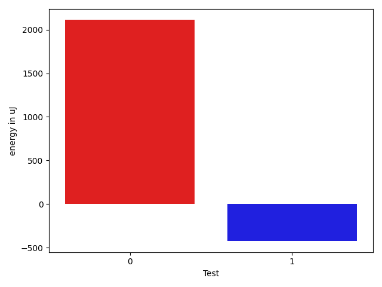

# gson 6a69c6

https://github.com/google/gson/commit/6a69c6

## Delta Energy per test method

| ID | EnergyV1 | EnergyV2 | DeltaEnergy | σV1 | σV2 |
| --- | --- | --- | --- | --- | --- |
| 0 | 36926 | 38269 | 1343 | 82049.53729204096 | 81702.35563830234 |
| 1 | 33569 | 34057 | 488 | 9313.113475749578 | 8215.06854859014 |

## Delta Duration per test method

| ID | DurationV1 | DurationsV2 | DeltaDuration |
| --- | --- | --- | --- |
| 0 | 2932369.705882353 | 3059216.3846153845 | 126846.67873303173 |
| 1 | 990815.9736842106 | 1020661.696969697 | 29845.723285486456 |

## Misc.

| ID | Test Class | Test Method |
| --- | --- | --- |
| 0 | com.google.gson.functional.DefaultTypeAdaptersTest | testClassSerialization |
| 1 | com.google.gson.functional.DefaultTypeAdaptersTest | testClassDeserialization |

| Test | IterationV1 | IterationV2 | DeltaIteration |
| --- | --- | --- | --- |
| 0 | 68 | 78 | 10 |
| 1 | 38 | 33 | -5 |

| Time Label | Time (s) |
| --- | --- |
| Selection | 27.052201509475708 |
| Injection | 10.26255989074707 |
| Total | 1001.0764405727386 |

