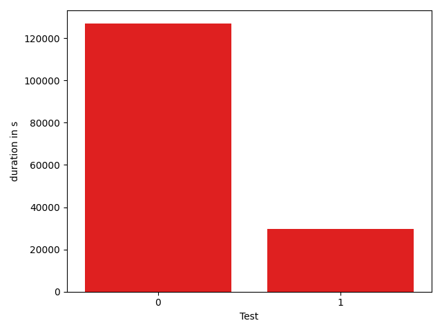

# gson 6a69c6

https://github.com/google/gson/commit/6a69c6

## Delta Energy per test method

| ID | EnergyV1 | EnergyV2 | DeltaEnergy |
| --- | --- | --- | --- |
| 0 | 65643.86220496405 | 46429.4068718872 | -19214.455333076854 |
| 1 | 36949.89184307086 | 31694.212705323705 | -5255.679137747153 |

## Delta Duration per test method

| ID | DurationV1 | DurationsV2 | DeltaDuration |
| --- | --- | --- | --- |
| 0 | 2830062.40104484 | 2009996.7376939515 | -820065.6633508885 |
| 1 | 1045791.0817529133 | 801986.4900753994 | -243804.5916775139 |

## Misc.

| ID | Test Class | Test Method |
| --- | --- | --- |
| 0 | com.google.gson.functional.DefaultTypeAdaptersTest | testClassSerialization |
| 1 | com.google.gson.functional.DefaultTypeAdaptersTest | testClassDeserialization |

| Test | IterationV1 | IterationV2 | DeltaIteration |
| --- | --- | --- | --- |
| 0 | 68 | 78 | 10 |
| 1 | 38 | 33 | -5 |

| Time Label | Time (s) |
| --- | --- |
| Selection | 27.052201509475708 |
| Injection | 10.26255989074707 |
| Total | 1001.0764405727386 |

