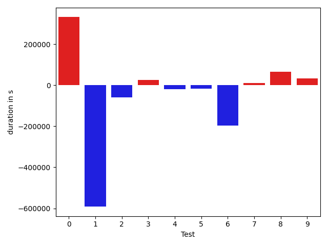
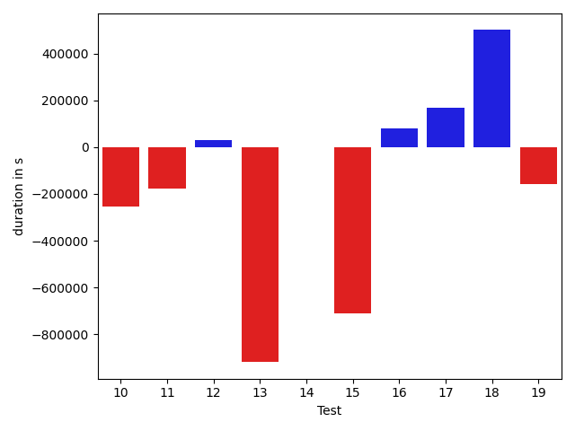
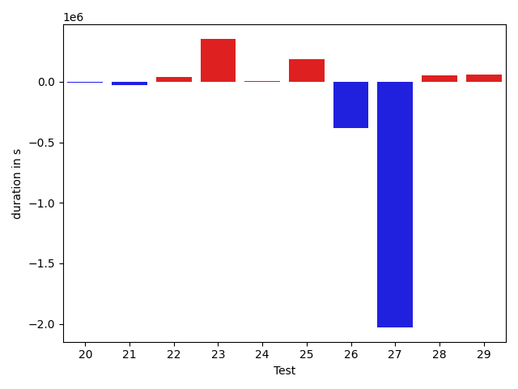
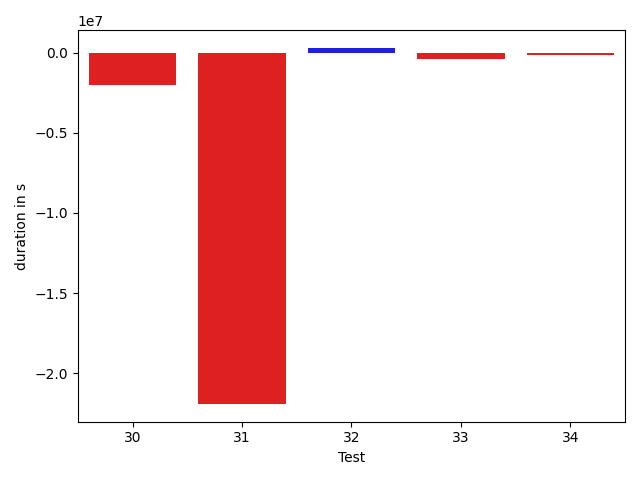

# gson 3f2efa

https://github.com/google/gson/commit/3f2efa

## Delta Energy per test method

| ID | EnergyV1 | EnergyV2 | DeltaEnergy |
| --- | --- | --- | --- |
| 0 | 38416.08361737878 | 43608.24210619023 | 5192.158488811445 |
| 1 | 75540.71116380396 | 66088.89441705661 | -9451.816746747354 |
| 2 | 45444.07872819621 | 41490.030738677 | -3954.047989519211 |
| 3 | 35612.46006244421 | 41681.73135102994 | 6069.271288585733 |
| 4 | 36280.10814898586 | 40211.42098025918 | 3931.312831273317 |
| 5 | 36548.01657228638 | 40826.68494486632 | 4278.668372579938 |
| 6 | 39524.80004714637 | 35911.532200694084 | -3613.2678464522833 |
| 7 | 44145.499963459384 | 46070.154133924865 | 1924.654170465481 |
| 8 | 40526.712272965815 | 36036.303521064765 | -4490.40875190105 |
| 9 | 40963.2140288353 | 35143.05690956116 | -5820.157119274139 |
| 10 | 59140.1077204063 | 53996.44901341299 | -5143.658706993308 |
| 11 | 40296.48521383107 | 42017.36630463507 | 1720.8810908040032 |
| 12 | 41014.037109375 | 39961.363948345184 | -1052.6731610298157 |
| 13 | 73425.46167564392 | 74152.95365905762 | 727.4919834136963 |
| 14 | 39657.804899692535 | 37712.444274902344 | -1945.3606247901917 |
| 15 | 65306.196979403496 | 38380.60783387089 | -26925.589145532605 |
| 16 | 33300.08895111084 | 40658.193244576454 | 7358.104293465614 |
| 17 | 37480.67242158436 | 42401.39119742438 | 4920.718775840025 |
| 18 | 34980.95703125 | 58082.86981201172 | 23101.91278076172 |
| 19 | 37089.50698489486 | 37990.80629527941 | 901.2993103845511 |
| 20 | 45137.19500255585 | 38154.6418428421 | -6982.553159713745 |
| 21 | 40878.34092833186 | 40856.10993461392 | -22.230993717937963 |
| 22 | 215580.2453696528 | 105985.0435403488 | -109595.20182930402 |
| 23 | 37091.18658154804 | 38895.29306905258 | 1804.1064875045413 |
| 24 | 40361.72633751902 | 37404.06425771034 | -2957.6620798086806 |
| 25 | 34415.37104756474 | 44302.660160316664 | 9887.289112751925 |
| 26 | 61199.29509946707 | 139586.77276326864 | 78387.47766380158 |
| 27 | 33221.80534390979 | 38761.753470857824 | 5539.948126948031 |
| 28 | 36321.921941816865 | 38838.23643791783 | 2516.3144961009675 |
| 29 | 38718.69217806039 | 79569.1872056562 | 40850.49502759581 |
| 30 | 70496.31183860288 | 38125.562861677485 | -32370.748976925395 |
| 31 | 858015.1462631293 | 168914.68229403673 | -689100.4639690926 |
| 32 | 45253.900483368285 | 58697.48838331627 | 13443.587899947983 |
| 33 | 34043.341189340754 | 37563.83656071706 | 3520.49537137631 |
| 34 | 34546.051796633874 | 38464.86794215425 | 3918.8161455203735 |

## Delta Duration per test method

| ID | DurationV1 | DurationsV2 | DeltaDuration |
| --- | --- | --- | --- |
| 0 | 845197.2569173087 | 843151.7921745679 | -2045.4647427407326 |
| 1 | 2046467.4136193115 | 1758073.3716175067 | -288394.0420018048 |
| 2 | 1338854.4626295143 | 1188532.757736059 | -150321.70489345537 |
| 3 | 659723.5863978863 | 603791.6010566332 | -55931.98534125311 |
| 4 | 876622.1239580258 | 1079702.8804056756 | 203080.7564476498 |
| 5 | 1253134.134068112 | 928703.5868650157 | -324430.5472030962 |
| 6 | 745138.3441631759 | 650413.2348960042 | -94725.1092671717 |
| 7 | 1269798.9394544014 | 942768.8238856609 | -327030.1155687405 |
| 8 | 590042.5898462615 | 805342.6097715076 | 215300.01992524602 |
| 9 | 520556.8532629013 | 640619.5175218582 | 120062.66425895691 |
| 10 | 1350726.505133898 | 1097125.212817267 | -253601.29231663095 |
| 11 | 786589.5206803475 | 610307.8447986634 | -176281.67588168406 |
| 12 | 504434.705078125 | 536065.5178899765 | 31630.8128118515 |
| 13 | 2597190.4595832825 | 1678493.1230154037 | -918697.3365678787 |
| 14 | 501118.5351433754 | 500947.4578857422 | -171.07725763320923 |
| 15 | 1700199.8421553597 | 989594.5362035043 | -710605.3059518554 |
| 16 | 531082.4696412086 | 609579.6338761449 | 78497.16423493624 |
| 17 | 589673.930400441 | 759462.0605018847 | 169788.13010144362 |
| 18 | 555576.6708984375 | 1055967.6280517578 | 500390.9571533203 |
| 19 | 843893.5669750175 | 684891.9755364358 | -159001.5914385817 |
| 20 | 1104517.4954833984 | 493004.47241306305 | -611513.0230703354 |
| 21 | 1312212.238646532 | 1173262.057603634 | -138950.18104289798 |
| 22 | 7194629.7469718475 | 3253442.8684086264 | -3941186.878563221 |
| 23 | 892657.3795384082 | 726384.5704689901 | -166272.80906941812 |
| 24 | 747845.4086022053 | 750621.8298308167 | 2776.421228611376 |
| 25 | 1177745.3686827365 | 1436066.9906478818 | 258321.62196514523 |
| 26 | 2306834.2127718 | 4470417.539622362 | 2163583.326850562 |
| 27 | 1860609.2448988277 | 1115292.2397418027 | -745317.0051570251 |
| 28 | 1107662.009670619 | 1143628.057491474 | 35966.047820855165 |
| 29 | 1232386.8235138163 | 2951376.123697562 | 1718989.3001837458 |
| 30 | 2971939.941648544 | 969384.9247546634 | -2002555.0168938804 |
| 31 | 26433880.57089003 | 4515132.24854332 | -21918748.32234671 |
| 32 | 1579739.9983932197 | 1870336.3824393898 | 290596.38404617016 |
| 33 | 1196059.3640707915 | 787084.337259948 | -408975.0268108435 |
| 34 | 1117522.235494053 | 945994.6372751553 | -171527.5982188977 |

## Misc.

| ID | Test Class | Test Method |
| --- | --- | --- |
| 0 | com.google.gson.functional.CustomDeserializerTest | testDefaultConstructorNotCalledOnField |
| 1 | com.google.gson.functional.CustomDeserializerTest | testDefaultConstructorNotCalledOnObject |
| 2 | com.google.gson.functional.CustomDeserializerTest | testJsonTypeFieldBasedDeserialization |
| 3 | com.google.gson.functional.InheritanceTest | testBaseSerializedAsBaseWhenSpecifiedWithExplicitType |
| 4 | com.google.gson.functional.InheritanceTest | testClassWithBaseArrayFieldSerialization |
| 5 | com.google.gson.functional.InheritanceTest | testClassWithBaseCollectionFieldSerialization |
| 6 | com.google.gson.functional.InheritanceTest | testBaseSerializedAsSubWhenSpecifiedWithExplicitType |
| 7 | com.google.gson.functional.InheritanceTest | testClassWithBaseFieldSerialization |
| 8 | com.google.gson.functional.InheritanceTest | testBaseSerializedAsSub |
| 9 | com.google.gson.JsonObjectTest | testAddingNullPropertyValue |
| 10 | com.google.gson.JsonObjectTest | testReadPropertyWithEmptyStringName |
| 11 | com.google.gson.JsonObjectTest | testAddingCharacterProperties |
| 12 | com.google.gson.JsonObjectTest | testAddingBooleanProperties |
| 13 | com.google.gson.JsonObjectTest | testAddingAndRemovingObjectProperties |
| 14 | com.google.gson.JsonObjectTest | testAddingStringProperties |
| 15 | com.google.gson.JsonObjectTest | testDeepCopy |
| 16 | com.google.gson.JsonParserTest | testParseString |
| 17 | com.google.gson.JsonParserTest | testParseReader |
| 18 | com.google.gson.internal.LinkedTreeMapTest | testSingleElement |
| 19 | com.google.gson.internal.LinkedTreeMapTest | testAddAndRemove |
| 20 | com.google.gson.internal.LinkedTreeMapTest | testPutAndGet |
| 21 | com.google.gson.functional.JsonParserTest | testChangingCustomTreeAndDeserializing |
| 22 | com.google.gson.functional.CustomSerializerTest | testSubClassSerializerInvokedForBaseClassFieldsHoldingSubClassInstances |
| 23 | com.google.gson.functional.CustomSerializerTest | testBaseClassSerializerInvokedForBaseClassFieldsHoldingSubClassInstances |
| 24 | com.google.gson.functional.CustomSerializerTest | testBaseClassSerializerInvokedForBaseClassFields |
| 25 | com.google.gson.functional.CustomSerializerTest | testSubClassSerializerInvokedForBaseClassFieldsHoldingArrayOfSubClassInstances |
| 26 | com.google.gson.functional.UncategorizedTest | testReturningDerivedClassesDuringDeserialization |
| 27 | com.google.gson.DefaultMapJsonSerializerTest | testNonEmptyMapSerialization |
| 28 | com.google.gson.functional.MoreSpecificTypeSerializationTest | testMapOfParameterizedSubclassFields |
| 29 | com.google.gson.functional.MoreSpecificTypeSerializationTest | testMapOfSubclassFields |
| 30 | com.google.gson.functional.CustomTypeAdaptersTest | testCustomDeserializers |
| 31 | com.google.gson.functional.TypeHierarchyAdapterTest | testTypeHierarchy |
| 32 | com.google.gson.functional.ParameterizedTypesTest | testParameterizedTypesWithCustomDeserializer |
| 33 | com.google.gson.functional.JsonTreeTest | testJsonTreeNull |
| 34 | com.google.gson.functional.ExclusionStrategyFunctionalTest | testExclusionStrategyWithMode |

| Test | IterationV1 | IterationV2 | DeltaIteration |
| --- | --- | --- | --- |
| 0 | 57 | 51 | -6 |
| 1 | 98 | 95 | -3 |
| 2 | 92 | 89 | -3 |
| 3 | 24 | 35 | 11 |
| 4 | 69 | 70 | 1 |
| 5 | 76 | 78 | 2 |
| 6 | 42 | 25 | -17 |
| 7 | 58 | 54 | -4 |
| 8 | 33 | 36 | 3 |
| 9 | 21 | 21 | 0 |
| 10 | 43 | 41 | -2 |
| 11 | 30 | 35 | 5 |
| 12 | 10 | 23 | 13 |
| 13 | 20 | 21 | 1 |
| 14 | 23 | 15 | -8 |
| 15 | 28 | 36 | 8 |
| 16 | 21 | 25 | 4 |
| 17 | 37 | 28 | -9 |
| 18 | 10 | 15 | 5 |
| 19 | 32 | 28 | -4 |
| 20 | 21 | 21 | 0 |
| 21 | 66 | 72 | 6 |
| 22 | 81 | 77 | -4 |
| 23 | 48 | 50 | 2 |
| 24 | 41 | 37 | -4 |
| 25 | 57 | 58 | 1 |
| 26 | 99 | 99 | 0 |
| 27 | 62 | 58 | -4 |
| 28 | 72 | 76 | 4 |
| 29 | 81 | 80 | -1 |
| 30 | 73 | 57 | -16 |
| 31 | 99 | 99 | 0 |
| 32 | 97 | 98 | 1 |
| 33 | 49 | 43 | -6 |
| 34 | 46 | 59 | 13 |

| Time Label | Time (s) |
| --- | --- |
| Selection | 27.66788339614868 |
| Injection | 11.932281970977783 |
| Total | 1020.434485912323 |

