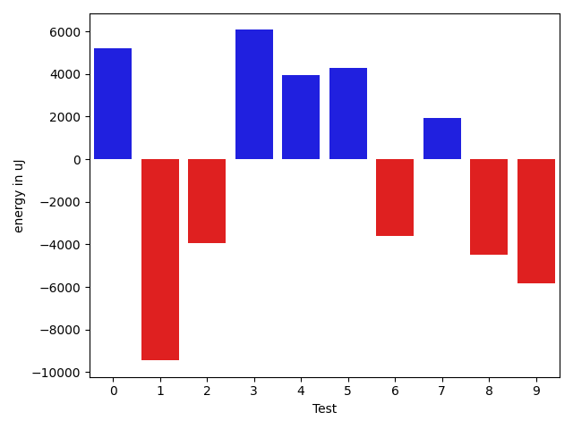
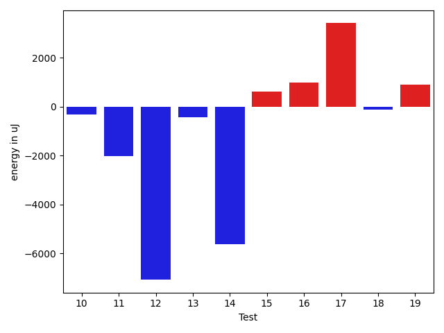
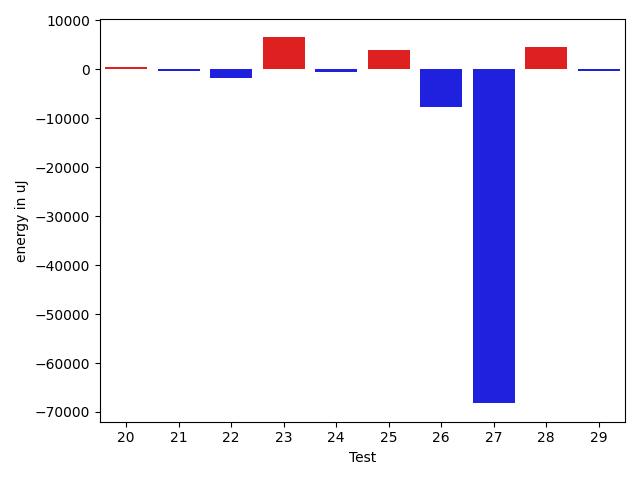
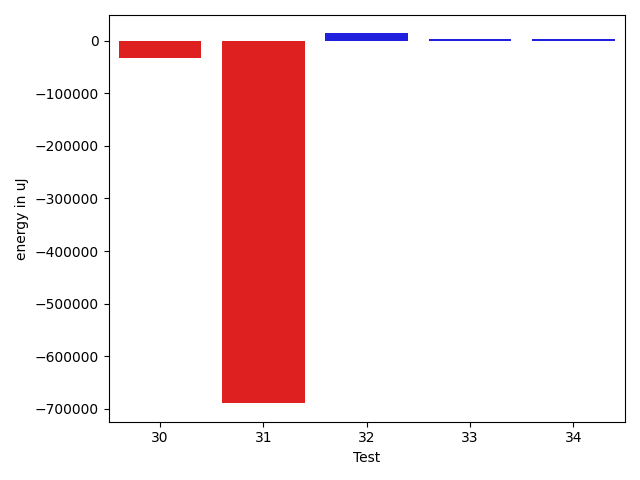

# gson 3f2efa

https://github.com/google/gson/commit/3f2efa

## Delta Energy per test method

| ID | EnergyV1 | EnergyV2 | DeltaEnergy | σV1 | σV2 |
| --- | --- | --- | --- | --- | --- |
| 0 | 40393.36842105263 | 46391.39215686275 | 5998.023735810115 | 12884.78475694053 | 54165.11147972392 |
| 1 | 84073.21428571429 | 65452.02105263158 | -18621.19323308271 | 102498.08813490727 | 50775.30538423883 |
| 2 | 49117.88043478261 | 46576.51685393258 | -2541.3635808500258 | 31290.75153780941 | 19303.468294125287 |
| 3 | 37937.59523809524 | 36869.96 | -1067.6352380952376 | 4501.101405209321 | 4241.223252600598 |
| 4 | 37507.3768115942 | 40355.54285714286 | 2848.1660455486563 | 6630.578891599371 | 8682.662612825818 |
| 5 | 42597.59210526316 | 43648.717948717946 | 1051.1258434547854 | 13306.395026825923 | 12074.198454999138 |
| 6 | 51350.44827586207 | 46649.98148148148 | -4700.466794380591 | 26535.816780586232 | 20872.104049726757 |
| 7 | 37043.291666666664 | 38057.828571428574 | 1014.5369047619097 | 2978.4365232893397 | 4733.778391129705 |
| 8 | 37862.15151515151 | 37438.194444444445 | -423.95707070706703 | 3877.331299662976 | 5088.759414519223 |
| 9 | 38944.36666666667 | 37449.37142857143 | -1494.9952380952382 | 5580.9885533140305 | 4317.061474698563 |
| 10 | 38963.42857142857 | 38420.04761904762 | -543.3809523809541 | 4909.77102144216 | 3985.8763686677307 |
| 11 | 38165.1 | 37494.17391304348 | -670.9260869565187 | 3984.63613018805 | 4132.247779221943 |
| 12 | 54293.8 | 49385.95238095238 | -4907.847619047621 | 43830.678602549604 | 37792.527639451226 |
| 13 | 39051.913043478264 | 38134.53333333333 | -917.3797101449309 | 5084.867395244558 | 4785.456117120801 |
| 14 | 68008.14285714286 | 45321.86111111111 | -22686.281746031746 | 60850.87983676295 | 32713.568527237527 |
| 15 | 56843.41860465116 | 61588.756097560974 | 4745.337492909814 | 32667.193631811388 | 40741.82566510585 |
| 16 | 42998.242424242424 | 44995.51388888889 | 1997.2714646464665 | 11564.649062605855 | 13814.37419159343 |
| 17 | 46820.45945945946 | 61427.32142857143 | 14606.861969111967 | 22319.591112687205 | 34485.89102605542 |
| 18 | 38954.80952380953 | 38315.4 | -639.4095238095251 | 4858.489610676568 | 3915.2944512513996 |
| 19 | 207763.06172839506 | 174284.22077922078 | -33478.84094917428 | 490326.85496051033 | 405091.34290193627 |
| 20 | 38669.5 | 39151.56 | 482.0599999999977 | 4142.453253608704 | 4532.575608459279 |
| 21 | 38212.228070175435 | 37873.224137931036 | -339.00393224439904 | 5533.061032247926 | 4400.376238001596 |
| 22 | 38909.0 | 37122.45945945946 | -1786.54054054054 | 4126.326991287093 | 5027.910057434776 |
| 23 | 79592.72727272728 | 86157.34343434343 | 6564.616161616155 | 29406.875610786094 | 42422.003656898276 |
| 24 | 38451.930555555555 | 38017.52631578947 | -434.40423976608145 | 4390.465165580689 | 4224.551432038561 |
| 25 | 48132.53086419753 | 52165.075 | 4032.544135802469 | 26859.233447913983 | 32211.265660780467 |
| 26 | 54586.191780821915 | 46818.12280701754 | -7768.068973804373 | 35518.53869504929 | 29966.82528834364 |
| 27 | 384089.49494949495 | 315835.797979798 | -68253.69696969696 | 611467.442590965 | 501047.97174465633 |
| 28 | 64729.82474226804 | 69256.67346938775 | 4526.848727119708 | 69785.13649576226 | 53521.99412139007 |
| 29 | 38589.04081632653 | 38295.976744186046 | -293.0640721404852 | 4325.444546973903 | 5240.519912465514 |
| 30 | 39444.608695652176 | 38205.8813559322 | -1238.7273397199751 | 10144.173048941982 | 5749.793308251915 |
| 31 | 40146.27419354839 | 38750.93103448276 | -1395.3431590656255 | 7032.673674034867 | 6488.663777383861 |
| 32 | 40054.25 | 44293.82142857143 | 4239.5714285714275 | 15125.191087635885 | 23322.262332148246 |
| 33 | 37164.3 | 48038.8 | 10874.5 | 4617.351211463127 | 29440.460841501783 |
| 34 | 41239.333333333336 | 38896.666666666664 | -2342.6666666666715 | 10967.010850004983 | 5479.587491715511 |

## Delta Duration per test method

| ID | DurationV1 | DurationsV2 | DeltaDuration |
| --- | --- | --- | --- |
| 0 | 961749.6666666666 | 1293484.4901960783 | 331734.8235294117 |
| 1 | 2724570.2653061226 | 2132900.515789474 | -591669.7495166487 |
| 2 | 1542473.3804347827 | 1482434.5393258426 | -60038.841108940076 |
| 3 | 652510.5 | 678201.52 | 25691.02000000002 |
| 4 | 1155938.5652173914 | 1137276.6285714286 | -18661.936645962764 |
| 5 | 1364628.9342105263 | 1346861.8461538462 | -17767.088056680048 |
| 6 | 1588023.2413793104 | 1390438.388888889 | -197584.85249042138 |
| 7 | 640925.5416666666 | 651420.6571428571 | 10495.115476190462 |
| 8 | 669123.6060606061 | 734246.9166666666 | 65123.31060606055 |
| 9 | 694350.4666666667 | 727036.6 | 32686.133333333302 |
| 10 | 508685.95238095237 | 549558.1904761905 | 40872.238095238165 |
| 11 | 490219.4 | 543216.4347826086 | 52997.03478260862 |
| 12 | 1075320.55 | 1047752.8571428572 | -27567.692857142887 |
| 13 | 481259.6956521739 | 483576.2 | 2316.5043478261214 |
| 14 | 1757554.4285714286 | 1054754.7777777778 | -702799.6507936509 |
| 15 | 1624365.4186046512 | 1687676.8048780488 | 63311.3862733976 |
| 16 | 1327388.106060606 | 1402697.0277777778 | 75308.92171717179 |
| 17 | 1140286.2702702703 | 1646140.3214285714 | 505854.05115830107 |
| 18 | 560759.2380952381 | 602191.92 | 41432.681904761936 |
| 19 | 5795499.308641976 | 5147223.831168831 | -648275.4774731444 |
| 20 | 834355.2291666666 | 827382.38 | -6972.849166666623 |
| 21 | 1030507.7719298246 | 1003175.724137931 | -27332.047791893594 |
| 22 | 801412.0975609756 | 843468.4054054054 | 42056.30784442986 |
| 23 | 2370047.8383838385 | 2725185.777777778 | 355137.93939393945 |
| 24 | 1132669.9305555555 | 1139093.1184210526 | 6423.187865497079 |
| 25 | 1539939.7530864198 | 1728558.4375 | 188618.68441358022 |
| 26 | 1707885.6712328766 | 1323000.0350877193 | -384885.6361451573 |
| 27 | 10987072.434343435 | 8957565.272727273 | -2029507.1616161615 |
| 28 | 2199014.4536082475 | 2253572.387755102 | 54557.93414685456 |
| 29 | 871698.6734693878 | 931287.1162790698 | 59588.44280968199 |
| 30 | 1248043.7608695652 | 1048244.3728813559 | -199799.38798820926 |
| 31 | 1215761.1612903227 | 1198092.9655172413 | -17668.19577308139 |
| 32 | 827849.25 | 931952.5357142857 | 104103.28571428568 |
| 33 | 528481.0 | 883055.4666666667 | 354574.4666666667 |
| 34 | 720577.6666666666 | 533732.7619047619 | -186844.90476190473 |

## Misc.

| ID | Test Class | Test Method |
| --- | --- | --- |
| 0 | com.google.gson.functional.CustomDeserializerTest | testDefaultConstructorNotCalledOnField |
| 1 | com.google.gson.functional.CustomDeserializerTest | testDefaultConstructorNotCalledOnObject |
| 2 | com.google.gson.functional.CustomDeserializerTest | testJsonTypeFieldBasedDeserialization |
| 3 | com.google.gson.functional.InheritanceTest | testBaseSerializedAsSubWhenSpecifiedWithExplicitType |
| 4 | com.google.gson.functional.InheritanceTest | testClassWithBaseArrayFieldSerialization |
| 5 | com.google.gson.functional.InheritanceTest | testClassWithBaseCollectionFieldSerialization |
| 6 | com.google.gson.functional.InheritanceTest | testClassWithBaseFieldSerialization |
| 7 | com.google.gson.functional.InheritanceTest | testBaseSerializedAsBaseWhenSpecifiedWithExplicitType |
| 8 | com.google.gson.functional.InheritanceTest | testBaseSerializedAsSub |
| 9 | com.google.gson.JsonObjectTest | testAddingCharacterProperties |
| 10 | com.google.gson.JsonObjectTest | testAddingNullPropertyValue |
| 11 | com.google.gson.JsonObjectTest | testAddingBooleanProperties |
| 12 | com.google.gson.JsonObjectTest | testAddingAndRemovingObjectProperties |
| 13 | com.google.gson.JsonObjectTest | testAddingStringProperties |
| 14 | com.google.gson.JsonObjectTest | testDeepCopy |
| 15 | com.google.gson.JsonObjectTest | testReadPropertyWithEmptyStringName |
| 16 | com.google.gson.functional.JsonParserTest | testChangingCustomTreeAndDeserializing |
| 17 | com.google.gson.JsonParserTest | testParseReader |
| 18 | com.google.gson.JsonParserTest | testParseString |
| 19 | com.google.gson.functional.CustomSerializerTest | testSubClassSerializerInvokedForBaseClassFieldsHoldingSubClassInstances |
| 20 | com.google.gson.functional.CustomSerializerTest | testBaseClassSerializerInvokedForBaseClassFieldsHoldingSubClassInstances |
| 21 | com.google.gson.functional.CustomSerializerTest | testSubClassSerializerInvokedForBaseClassFieldsHoldingArrayOfSubClassInstances |
| 22 | com.google.gson.functional.CustomSerializerTest | testBaseClassSerializerInvokedForBaseClassFields |
| 23 | com.google.gson.functional.UncategorizedTest | testReturningDerivedClassesDuringDeserialization |
| 24 | com.google.gson.functional.MoreSpecificTypeSerializationTest | testMapOfParameterizedSubclassFields |
| 25 | com.google.gson.functional.MoreSpecificTypeSerializationTest | testMapOfSubclassFields |
| 26 | com.google.gson.functional.CustomTypeAdaptersTest | testCustomDeserializers |
| 27 | com.google.gson.functional.TypeHierarchyAdapterTest | testTypeHierarchy |
| 28 | com.google.gson.functional.ParameterizedTypesTest | testParameterizedTypesWithCustomDeserializer |
| 29 | com.google.gson.functional.JsonTreeTest | testJsonTreeNull |
| 30 | com.google.gson.functional.ExclusionStrategyFunctionalTest | testExclusionStrategyWithMode |
| 31 | com.google.gson.DefaultMapJsonSerializerTest | testNonEmptyMapSerialization |
| 32 | com.google.gson.internal.LinkedTreeMapTest | testAddAndRemove |
| 33 | com.google.gson.internal.LinkedTreeMapTest | testSingleElement |
| 34 | com.google.gson.internal.LinkedTreeMapTest | testPutAndGet |

| Test | IterationV1 | IterationV2 | DeltaIteration |
| --- | --- | --- | --- |
| 0 | 57 | 51 | -6 |
| 1 | 98 | 95 | -3 |
| 2 | 92 | 89 | -3 |
| 3 | 42 | 25 | -17 |
| 4 | 69 | 70 | 1 |
| 5 | 76 | 78 | 2 |
| 6 | 58 | 54 | -4 |
| 7 | 24 | 35 | 11 |
| 8 | 33 | 36 | 3 |
| 9 | 30 | 35 | 5 |
| 10 | 21 | 21 | 0 |
| 11 | 10 | 23 | 13 |
| 12 | 20 | 21 | 1 |
| 13 | 23 | 15 | -8 |
| 14 | 28 | 36 | 8 |
| 15 | 43 | 41 | -2 |
| 16 | 66 | 72 | 6 |
| 17 | 37 | 28 | -9 |
| 18 | 21 | 25 | 4 |
| 19 | 81 | 77 | -4 |
| 20 | 48 | 50 | 2 |
| 21 | 57 | 58 | 1 |
| 22 | 41 | 37 | -4 |
| 23 | 99 | 99 | 0 |
| 24 | 72 | 76 | 4 |
| 25 | 81 | 80 | -1 |
| 26 | 73 | 57 | -16 |
| 27 | 99 | 99 | 0 |
| 28 | 97 | 98 | 1 |
| 29 | 49 | 43 | -6 |
| 30 | 46 | 59 | 13 |
| 31 | 62 | 58 | -4 |
| 32 | 32 | 28 | -4 |
| 33 | 10 | 15 | 5 |
| 34 | 21 | 21 | 0 |

| Time Label | Time (s) |
| --- | --- |
| Selection | 27.66788339614868 |
| Injection | 11.932281970977783 |
| Total | 1020.434485912323 |

