# gson 040bae

https://github.com/google/gson/commit/040bae

## Delta Energy per test method

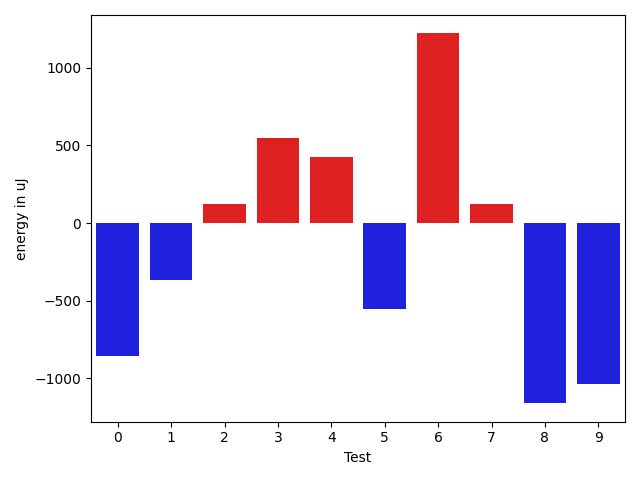

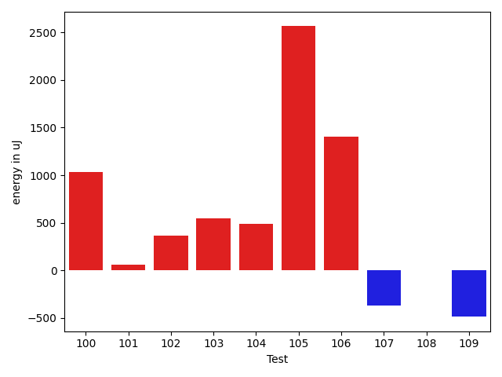

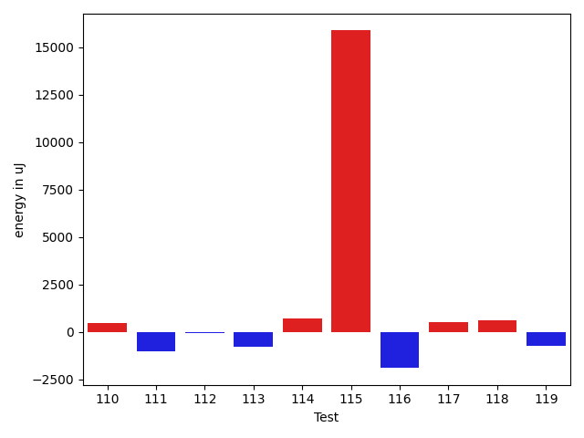

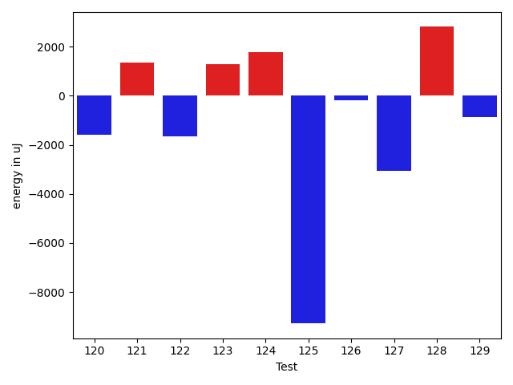

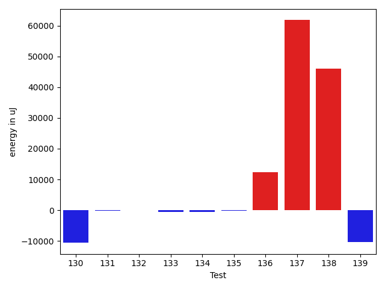

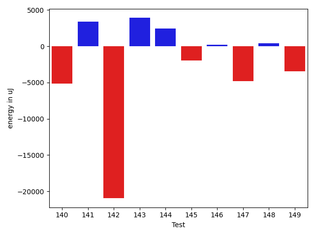

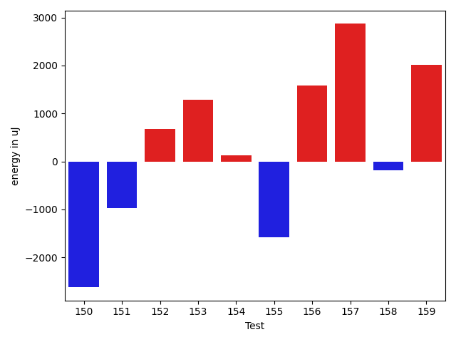

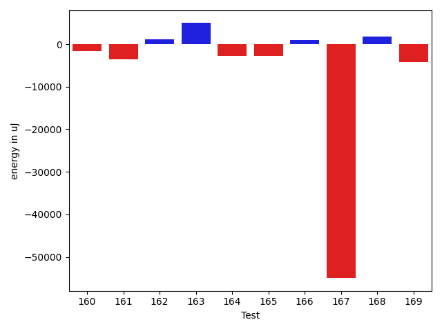

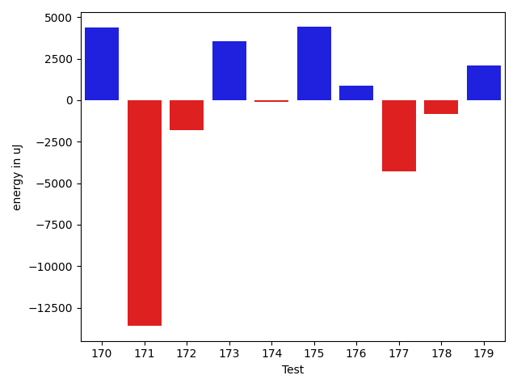

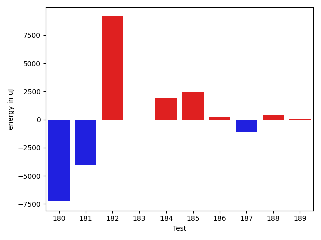

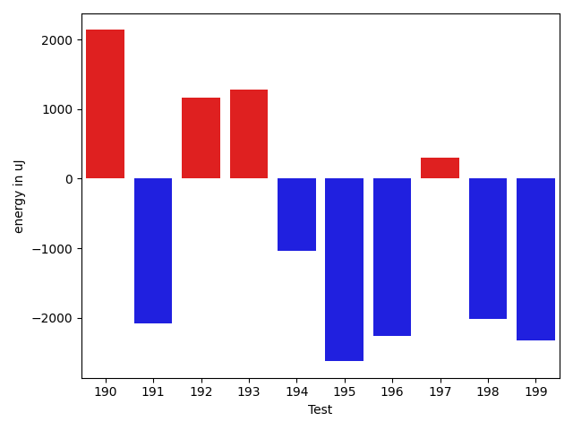

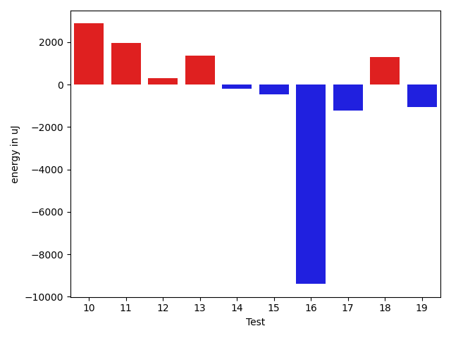

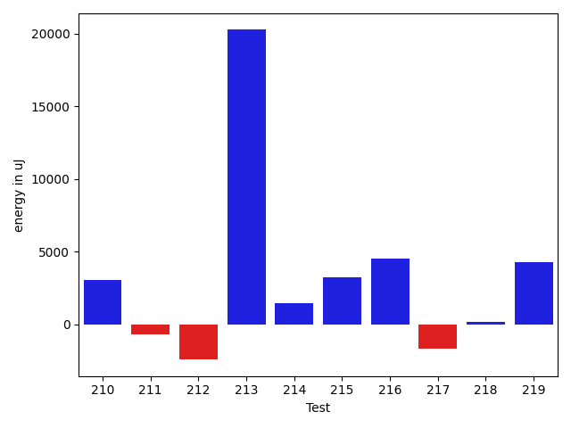

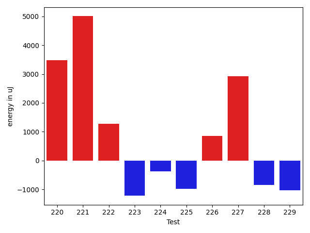

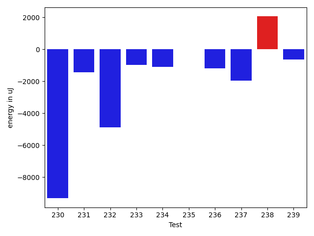

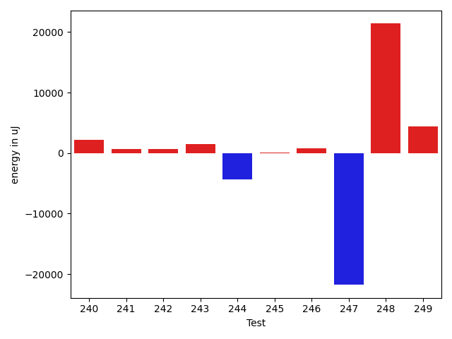

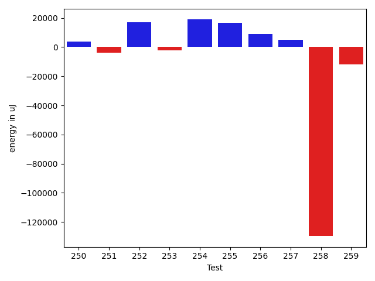

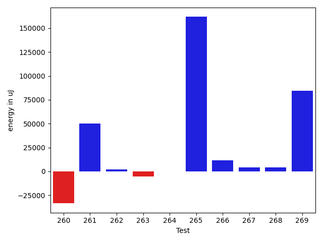

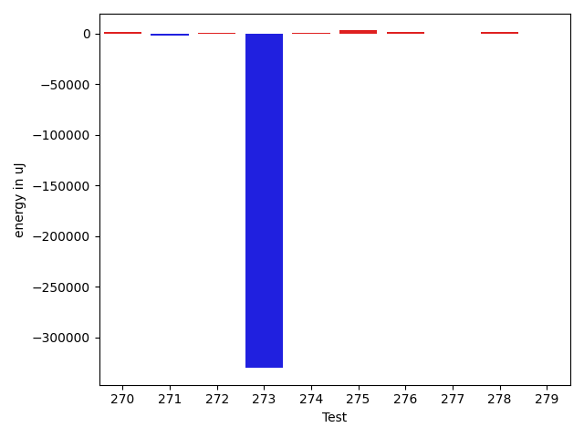

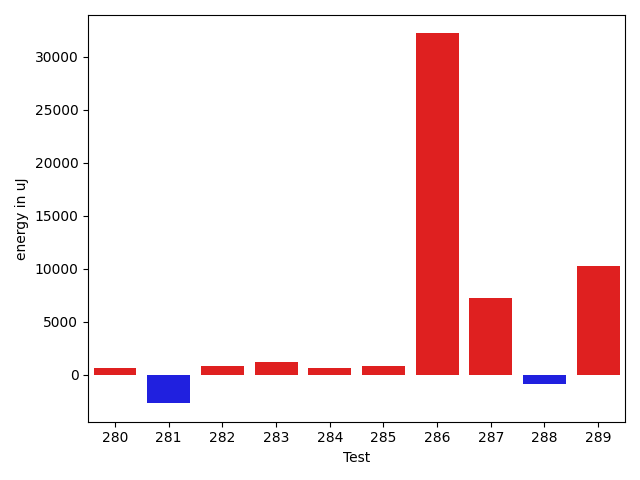

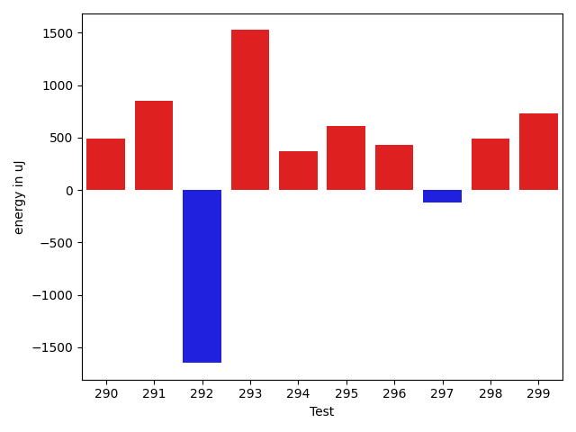

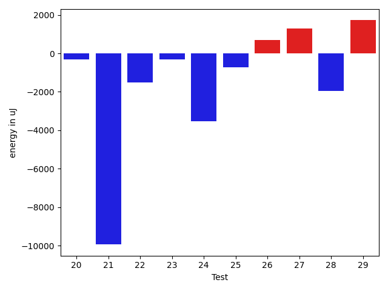

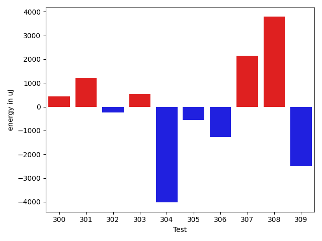

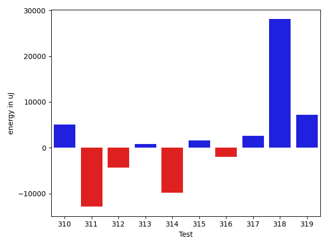

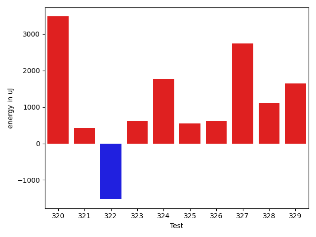

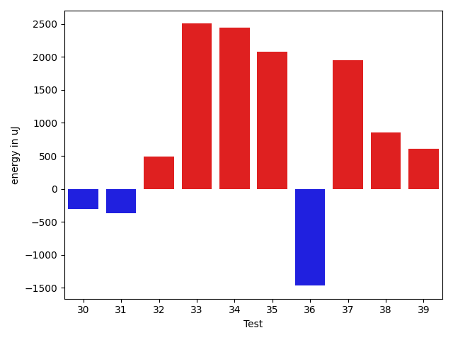

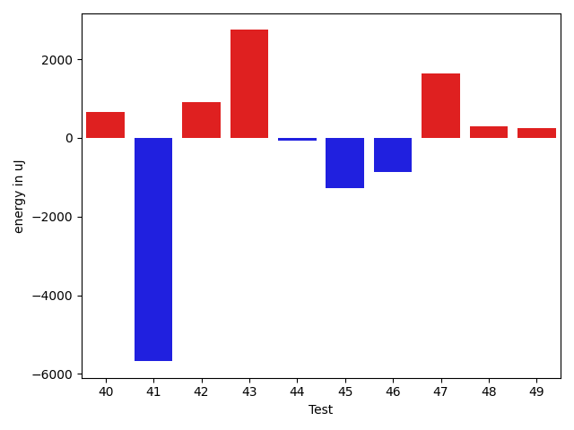

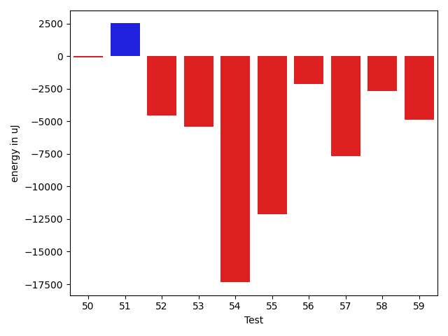

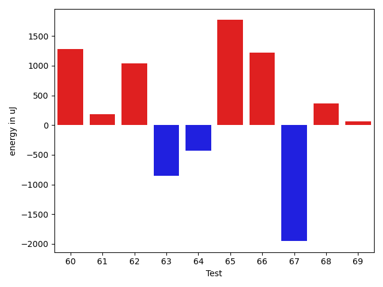

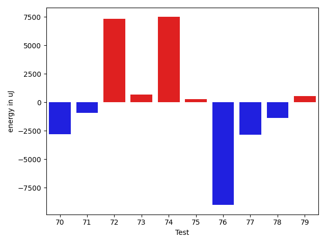

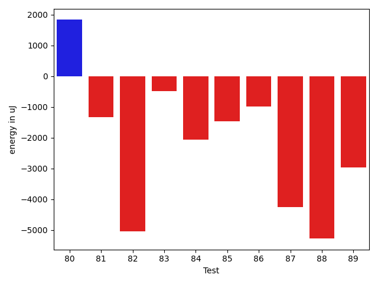

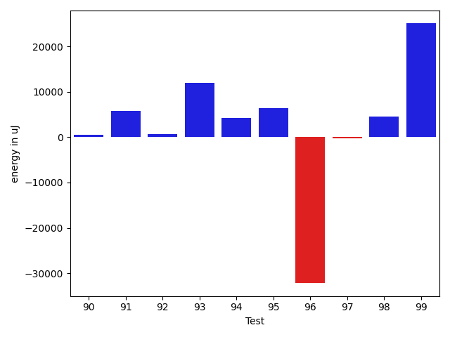

| ID | EnergyV1 | EnergyV2 | DeltaEnergy |
| --- | --- | --- | --- |
| 0 | 34886.82813240138 | 41576.65507713367 | 6689.826944732289 |
| 1 | 49802.40398118886 | 78657.4963933347 | 28855.092412145845 |
| 2 | 39185.73836583611 | 39154.367519990774 | -31.37084584533295 |
| 3 | 70722.83360007625 | 74976.99924179618 | 4254.1656417199265 |
| 4 | 39213.2903175354 | 40192.18975264579 | 978.8994351103902 |
| 5 | 36704.76692639994 | 37919.33471857674 | 1214.5677921768001 |
| 6 | 34711.87871947717 | 56410.18560462672 | 21698.306885149548 |
| 7 | 36748.71689801663 | 35509.75235547719 | -1238.964542539441 |
| 8 | 36454.253961836635 | 40462.64657113247 | 4008.3926092958354 |
| 9 | 36288.824622777174 | 37967.700974322186 | 1678.8763515450119 |
| 10 | 40270.9208984375 | 37881.64157152176 | -2389.279326915741 |
| 11 | 38246.892285175796 | 36390.07733337727 | -1856.8149517985294 |
| 12 | 41807.78222660863 | 34227.79971412359 | -7579.9825124850395 |
| 13 | 37393.89573700375 | 33087.210365742445 | -4306.685371261308 |
| 14 | 37861.417019999586 | 40070.4752138285 | 2209.0581938289106 |
| 15 | 39714.23610451623 | 59343.182282930466 | 19628.946178414233 |
| 16 | 41390.97450375256 | 37430.16018197888 | -3960.8143217736797 |
| 17 | 43202.8449903854 | 39079.018810310874 | -4123.826180074524 |
| 18 | 39147.467559474564 | 38527.150836666595 | -620.3167228079692 |
| 19 | 31796.398222789307 | 36415.47059205365 | 4619.072369264344 |
| 20 | 35686.35829757503 | 70224.71071034699 | 34538.35241277196 |
| 21 | 50731.87658256956 | 63282.595203753925 | 12550.718621184365 |
| 22 | 34566.80836491428 | 33733.42228092131 | -833.3860839929694 |
| 23 | 39870.43837175964 | 31824.950710318866 | -8045.487661440777 |
| 24 | 40737.06011076257 | 36057.60481660864 | -4679.45529415393 |
| 25 | 86237.18710166583 | 152645.66156169097 | 66408.47446002514 |
| 26 | 35926.68684556335 | 35389.59632617235 | -537.0905193910003 |
| 27 | 35654.4425236412 | 39131.808776160426 | 3477.3662525192267 |
| 28 | 35301.082945879134 | 36606.73717552643 | 1305.654229647298 |
| 29 | 35680.410826209336 | 37872.37413587753 | 2191.9633096681937 |
| 30 | 35311.21455199988 | 37443.563000734 | 2132.3484487341193 |
| 31 | 37148.15991805074 | 38934.05511148693 | 1785.8951934361903 |
| 32 | 39637.16693987952 | 36950.85452635608 | -2686.3124135234393 |
| 33 | 33870.83350978792 | 35503.400846004486 | 1632.567336216569 |
| 34 | 34108.964204180236 | 41702.38593602742 | 7593.421731847186 |
| 35 | 39082.75549084102 | 39885.45921710536 | 802.7037262643425 |
| 36 | 36558.234417996755 | 40746.74903709137 | 4188.514619094618 |
| 37 | 39144.8881972485 | 39683.55182487587 | 538.6636276273639 |
| 38 | 38919.94999002536 | 36132.81291134358 | -2787.137078681779 |
| 39 | 35412.77370854569 | 35270.344353056316 | -142.42935548937385 |
| 40 | 38266.394592285156 | 39034.42530441284 | 768.0307121276855 |
| 41 | 38326.89811551182 | 37721.16344509596 | -605.7346704158626 |
| 42 | 35479.71704296855 | 38042.83059720474 | 2563.113554236188 |
| 43 | 36703.802653454244 | 37282.83344554901 | 579.0307920947671 |
| 44 | 36545.49369124763 | 41452.45800975746 | 4906.964318509825 |
| 45 | 33792.77729489519 | 39796.77647208702 | 6003.9991771918285 |
| 46 | 36904.8799016219 | 38952.537789228285 | 2047.6578876063868 |
| 47 | 37690.105659550056 | 37998.745247766376 | 308.6395882163197 |
| 48 | 34000.934916440565 | 38653.87737598218 | 4652.942459541613 |
| 49 | 39182.78978516147 | 38194.16065193823 | -988.6291332232358 |
| 50 | 36510.28837337723 | 36421.76978139074 | -88.5185919864889 |
| 51 | 34582.83753204346 | 37105.383239746094 | 2522.5457077026367 |
| 52 | 39468.20308568016 | 34924.043863471146 | -4544.159222209011 |
| 53 | 38594.61026766134 | 33179.325875073795 | -5415.284392587542 |
| 54 | 50826.76806789472 | 33475.49139710672 | -17351.276670788 |
| 55 | 45851.78944149904 | 33723.51066871338 | -12128.278772785656 |
| 56 | 37533.709529822125 | 35422.57029591322 | -2111.139233908907 |
| 57 | 41835.53729838827 | 34176.31648755808 | -7659.220810830193 |
| 58 | 36268.16289960924 | 33584.35051959133 | -2683.812380017909 |
| 59 | 40419.05039644614 | 35561.35690966458 | -4857.693486781558 |
| 60 | 54040.19987759784 | 35313.30905194856 | -18726.89082564928 |
| 61 | 36766.17188621615 | 33960.59146706591 | -2805.5804191502393 |
| 62 | 54871.13095821801 | 36424.055626896945 | -18447.075331321066 |
| 63 | 37899.091343024265 | 35419.02303722612 | -2480.068305798144 |
| 64 | 36479.33068189099 | 35180.07583918422 | -1299.254842706774 |
| 65 | 36887.709519342694 | 36955.690942174246 | 67.98142283155175 |
| 66 | 37832.310281855054 | 35210.48623225952 | -2621.8240495955324 |
| 67 | 40880.21313253655 | 33718.89418413844 | -7161.318948398111 |
| 68 | 41829.076159379445 | 41891.51194821492 | 62.43578883547161 |
| 69 | 36353.06322804879 | 34101.61451078905 | -2251.4487172597437 |
| 70 | 38686.35946262961 | 34243.35710091805 | -4443.0023617115585 |
| 71 | 36819.378192960314 | 35816.73744608318 | -1002.6407468771358 |
| 72 | 47367.40377062923 | 31539.79497796359 | -15827.60879266564 |
| 73 | 38720.99917292505 | 37551.36286334798 | -1169.6363095770648 |
| 74 | 39252.80590454237 | 33675.2148745549 | -5577.591029987474 |
| 75 | 36691.378534432246 | 33434.35933905366 | -3257.0191953785834 |
| 76 | 35772.15527292334 | 34853.5003519745 | -918.6549209488367 |
| 77 | 35600.94794610158 | 39356.18354033515 | 3755.2355942335707 |
| 78 | 39451.37902040644 | 32025.806002584268 | -7425.573017822175 |
| 79 | 35964.52472366574 | 33257.82500902834 | -2706.699714637398 |
| 80 | 35686.00158691406 | 37522.169189453125 | 1836.1676025390625 |
| 81 | 36770.787230341586 | 35431.2089013366 | -1339.5783290049876 |
| 82 | 37694.98404060495 | 32646.126581293996 | -5048.8574593109515 |
| 83 | 37519.22101600366 | 37035.870615087966 | -483.3504009156968 |
| 84 | 39609.25450953841 | 37550.43734206615 | -2058.8171674722616 |
| 85 | 40148.44633483887 | 38682.48944091797 | -1465.9568939208984 |
| 86 | 37555.14650938976 | 36573.54339116607 | -981.6031182236839 |
| 87 | 38275.11923456502 | 34016.28833203116 | -4258.83090253386 |
| 88 | 40904.934326171875 | 35623.6920773983 | -5281.242248773575 |
| 89 | 36410.673090430246 | 33447.20335839581 | -2963.469732034435 |
| 90 | 32421.848876953125 | 32918.65695898188 | 496.8080820287578 |
| 91 | 33179.11947529377 | 38986.00519741867 | 5806.885722124898 |
| 92 | 35145.58173920199 | 35811.711341435235 | 666.1296022332463 |
| 93 | 32821.05062709468 | 44792.05973884382 | 11971.00911174914 |
| 94 | 37028.63456259933 | 41210.97162465205 | 4182.33706205272 |
| 95 | 35607.411761347124 | 42010.64055528131 | 6403.228793934184 |
| 96 | 136964.2788132602 | 104777.10185988029 | -32187.17695337991 |
| 97 | 35871.91311558569 | 35660.374249964254 | -211.53886562143452 |
| 98 | 34630.225055993455 | 39172.186917368956 | 4541.961861375501 |
| 99 | 83195.36724364909 | 108246.61451987278 | 25051.247276223687 |
| 100 | 36450.62903377555 | 38818.861019585645 | 2368.2319858100964 |
| 101 | 121730.42964518692 | 49696.63727460374 | -72033.79237058318 |
| 102 | 50113.627217143 | 53060.220471721965 | 2946.593254578962 |
| 103 | 60627.47776254514 | 41728.92589813107 | -18898.55186441407 |
| 104 | 100292.41679133002 | 54791.201253811756 | -45501.21553751826 |
| 105 | 33277.39692191093 | 48227.13060286717 | 14949.73368095624 |
| 106 | 487504.01427818683 | 197495.60274045655 | -290008.41153773025 |
| 107 | 158388.4375282363 | 120063.41577734918 | -38325.02175088713 |
| 108 | 114617.90336686285 | 82793.94440721648 | -31823.958959646377 |
| 109 | 110481.45658891974 | 45274.74596110912 | -65206.71062781062 |
| 110 | 38154.88016395271 | 43218.40371827432 | 5063.523554321611 |
| 111 | 37245.43051277098 | 35216.89879032664 | -2028.5317224443424 |
| 112 | 36390.13577692573 | 55478.060547780704 | 19087.924770854974 |
| 113 | 39909.64319585137 | 36792.61240246947 | -3117.0307933818985 |
| 114 | 37294.51907259878 | 38466.86519281939 | 1172.346120220609 |
| 115 | 44592.34765726328 | 39173.313903808594 | -5419.033753454685 |
| 116 | 37823.974062096924 | 39685.3492315139 | 1861.3751694169769 |
| 117 | 37563.34609332721 | 40284.24730354113 | 2720.901210213924 |
| 118 | 38426.083044973726 | 40875.42341270027 | 2449.340367726545 |
| 119 | 39207.1689474443 | 45347.881377261714 | 6140.712429817417 |
| 120 | 50090.85751953954 | 106534.33803999005 | 56443.48052045051 |
| 121 | 43479.40180640167 | 34758.19175737699 | -8721.210049024681 |
| 122 | 36743.847392924115 | 35723.17912038414 | -1020.6682725399733 |
| 123 | 33905.62878640741 | 34990.45810806751 | 1084.8293216601014 |
| 124 | 37906.269202216805 | 34986.31131200907 | -2919.9578902077337 |
| 125 | 37622.42571258545 | 31883.26139831543 | -5739.1643142700195 |
| 126 | 511919.62356960133 | 257913.3207879071 | -254006.30278169422 |
| 127 | 42223.04511409998 | 42802.12070465088 | 579.0755905508995 |
| 128 | 33616.93512177467 | 35809.698884271085 | 2192.763762496412 |
| 129 | 40508.005507357455 | 36323.29926255345 | -4184.7062448040015 |
| 130 | 30961.49698448181 | 31844.398616313934 | 882.9016318321228 |
| 131 | 39051.21865419504 | 36220.88562908878 | -2830.3330251062653 |
| 132 | 38570.232482910156 | 37519.41952800751 | -1050.812954902649 |
| 133 | 43473.38683080544 | 37231.41485411697 | -6241.971976688466 |
| 134 | 109913.63369041651 | 52954.51767400341 | -56959.1160164131 |
| 135 | 37512.24158000946 | 36098.78276877105 | -1413.458811238408 |
| 136 | 43678.11477774312 | 41612.38049888611 | -2065.7342788570095 |
| 137 | 33154.60207366943 | 34819.29432153702 | 1664.6922478675842 |
| 138 | 42566.283401119115 | 35399.218396902084 | -7167.065004217031 |
| 139 | 38755.498207995275 | 34055.6674879089 | -4699.830720086378 |
| 140 | 40874.90607714653 | 35735.89097356796 | -5139.0151035785675 |
| 141 | 35409.56519699097 | 38827.058044433594 | 3417.492847442627 |
| 142 | 53644.605592164495 | 32675.48319040449 | -20969.122401760003 |
| 143 | 36320.60493183136 | 40271.826344937086 | 3951.2214131057262 |
| 144 | 35252.86458911002 | 37729.15290260315 | 2476.2883134931326 |
| 145 | 39034.98850265145 | 37058.39100289345 | -1976.5974997580051 |
| 146 | 37329.48014712334 | 37530.267365932465 | 200.7872188091278 |
| 147 | 39083.404487878084 | 34275.7233356268 | -4807.681152251287 |
| 148 | 38692.21729361266 | 39144.04027853368 | 451.82298492101836 |
| 149 | 37483.19175575711 | 34013.68986486824 | -3469.501890888867 |
| 150 | 35180.90912300348 | 37218.11509558931 | 2037.205972585827 |
| 151 | 37079.91891112551 | 34030.643841724384 | -3049.2750694011265 |
| 152 | 41818.472478178985 | 50503.35909816013 | 8684.886619981145 |
| 153 | 38097.932882256806 | 36860.72983801365 | -1237.203044243157 |
| 154 | 37717.982330322266 | 35306.84989929199 | -2411.1324310302734 |
| 155 | 35529.267771720886 | 33584.11231994629 | -1945.1554517745972 |
| 156 | 40718.45977020264 | 35839.44421664998 | -4879.015553552657 |
| 157 | 34973.414138793945 | 36474.3968667984 | 1500.9827280044556 |
| 158 | 36143.124322891235 | 34093.74843597412 | -2049.3758869171143 |
| 159 | 121443.03211537283 | 129180.73283510625 | 7737.700719733417 |
| 160 | 37778.47871981561 | 36157.57099151611 | -1620.9077282994986 |
| 161 | 39081.512386388466 | 35599.1057096607 | -3482.406676727769 |
| 162 | 38338.84974490106 | 39468.62690037489 | 1129.7771554738283 |
| 163 | 34980.646406173706 | 39940.1290602684 | 4959.482654094696 |
| 164 | 37888.03849829495 | 35083.254625089765 | -2804.7838732051823 |
| 165 | 39395.86409260817 | 36585.840215038224 | -2810.023877569947 |
| 166 | 37548.34855843894 | 38477.57532308805 | 929.2267646491091 |
| 167 | 100636.91832134704 | 45659.88204905132 | -54977.03627229572 |
| 168 | 38618.740102767944 | 40351.11688232422 | 1732.3767795562744 |
| 169 | 39506.07653341738 | 35294.49532202072 | -4211.58121139666 |
| 170 | 37088.650801217766 | 41452.45548648792 | 4363.804685270152 |
| 171 | 51815.772600087854 | 38214.98683015109 | -13600.785769936767 |
| 172 | 37486.31700368888 | 35684.29793509773 | -1802.0190685911439 |
| 173 | 35715.53262518697 | 39248.287316008216 | 3532.754690821246 |
| 174 | 38838.0840044904 | 38745.303406155224 | -92.78059833517909 |
| 175 | 36800.64954662323 | 41205.65299987793 | 4405.0034532547 |
| 176 | 37321.43391036987 | 38179.2915969491 | 857.8576865792274 |
| 177 | 42743.07087421417 | 38459.56469535828 | -4283.506178855896 |
| 178 | 34432.33093261719 | 33600.12561035156 | -832.205322265625 |
| 179 | 37915.79587364197 | 40017.600352029665 | 2101.8044783876976 |
| 180 | 41027.97417389737 | 387947.44506055454 | 346919.4708866572 |
| 181 | 37859.02098391531 | 35663.79981512204 | -2195.221168793272 |
| 182 | 134971.96330225735 | 65254.909343267864 | -69717.05395898949 |
| 183 | 36279.1915383646 | 38688.38226153496 | 2409.1907231703663 |
| 184 | 36097.72296723635 | 40092.57111867235 | 3994.848151436003 |
| 185 | 36938.2274739142 | 38923.249408685864 | 1985.021934771663 |
| 186 | 46999.59749138223 | 36954.97855049586 | -10044.618940886365 |
| 187 | 52578.67619351723 | 50277.92590170077 | -2300.750291816461 |
| 188 | 41420.60206678524 | 35206.27535845006 | -6214.326708335182 |
| 189 | 88991.6939804079 | 80352.39520679113 | -8639.29877361677 |
| 190 | 53187.22603515945 | 52236.359421119436 | -950.8666140400164 |
| 191 | 41137.91962426859 | 39354.42354124428 | -1783.4960830243072 |
| 192 | 37693.19486458174 | 36871.24088090046 | -821.9539836812764 |
| 193 | 35202.45251020281 | 33172.30881900371 | -2030.143691199104 |
| 194 | 64193.0457278043 | 51528.43319320679 | -12664.612534597516 |
| 195 | 541455.2533611197 | 38178.604956891315 | -503276.6484042283 |
| 196 | 39898.07056603907 | 38405.247945986805 | -1492.8226200522622 |
| 197 | 36859.12277960777 | 42098.20526397228 | 5239.08248436451 |
| 198 | 42234.00311475231 | 70385.00726426774 | 28151.00414951543 |
| 199 | 38827.09067033524 | 35661.92787767513 | -3165.162792660107 |
| 200 | 36974.24108695984 | 40554.09830284119 | 3579.8572158813477 |
| 201 | 39618.68523677431 | 39099.56632521669 | -519.1189115576199 |
| 202 | 40473.17813787218 | 38546.30895708621 | -1926.8691807859723 |
| 203 | 36851.427154667675 | 35391.61248779297 | -1459.8146668747067 |
| 204 | 39198.04717268376 | 36408.64597126655 | -2789.401201417204 |
| 205 | 39968.70535099076 | 38035.59416340322 | -1933.1111875875358 |
| 206 | 36251.89627838135 | 40375.4803686589 | 4123.584090277553 |
| 207 | 38283.011746406555 | 39070.29965925217 | 787.2879128456116 |
| 208 | 35921.89488452673 | 36837.882888019085 | 915.9880034923553 |
| 209 | 39534.19043022394 | 39948.060991585255 | 413.87056136131287 |
| 210 | 34296.90138438711 | 37376.89411640167 | 3079.9927320145653 |
| 211 | 40530.71128095658 | 39814.5473686834 | -716.1639122731794 |
| 212 | 41867.094735736755 | 39445.273849028854 | -2421.820886707901 |
| 213 | 39912.754306886345 | 60167.68305794522 | 20254.928751058877 |
| 214 | 41010.47073977068 | 42496.595052719116 | 1486.1243129484355 |
| 215 | 37029.752565039504 | 40283.10366849509 | 3253.351103455585 |
| 216 | 38166.62409370803 | 42697.36645027073 | 4530.742356562703 |
| 217 | 39343.58662960306 | 37700.691691464745 | -1642.8949381383136 |
| 218 | 36282.69223560952 | 36429.02563805133 | 146.33340244181454 |
| 219 | 35198.01004368067 | 39465.89216411114 | 4267.8821204304695 |
| 220 | 45328.41596236819 | 37916.07371555276 | -7412.342246815431 |
| 221 | 34119.52001404762 | 36697.922679993324 | 2578.4026659457013 |
| 222 | 39752.14742242323 | 37216.68766304332 | -2535.4597593799117 |
| 223 | 43041.418946574864 | 55549.54532017155 | 12508.126373596686 |
| 224 | 39736.92249124502 | 34747.59718450511 | -4989.325306739913 |
| 225 | 39268.59899394214 | 101898.32732200623 | 62629.728328064084 |
| 226 | 35285.341328031136 | 41791.76287994449 | 6506.42155191335 |
| 227 | 41764.81748325105 | 41660.382709478894 | -104.43477377215459 |
| 228 | 40784.25748700234 | 34822.38799621112 | -5961.869490791221 |
| 229 | 37526.30776524544 | 36407.531439334154 | -1118.7763259112835 |
| 230 | 198655.81815455024 | 168798.4978161834 | -29857.320338366844 |
| 231 | 32927.98536214465 | 35741.285395434286 | 2813.3000332896336 |
| 232 | 32144.38617498528 | 36873.17921406031 | 4728.793039075026 |
| 233 | 34825.52747569978 | 35184.917861774564 | 359.3903860747814 |
| 234 | 30613.672452089864 | 37170.40413929891 | 6556.731687209045 |
| 235 | 36361.49831354335 | 34904.37940603862 | -1457.1189075047296 |
| 236 | 38882.13492444996 | 38313.680366277695 | -568.4545581722632 |
| 237 | 34998.958685969934 | 37933.5648707198 | 2934.606184749864 |
| 238 | 36376.09765744698 | 35926.71806751087 | -449.3795899361139 |
| 239 | 34566.310637643466 | 38333.89071474333 | 3767.5800770998612 |
| 240 | 38228.2602971266 | 37909.7797870636 | -318.48051006300375 |
| 241 | 42171.04019288773 | 38877.23344647517 | -3293.8067464125634 |
| 242 | 38518.85365496081 | 34936.79052114487 | -3582.0631338159437 |
| 243 | 38444.96468472481 | 37545.2826000303 | -899.6820846945047 |
| 244 | 33494.54032485359 | 35575.40788116865 | 2080.867556315061 |
| 245 | 35465.1764963881 | 40544.5334255688 | 5079.3569291807 |
| 246 | 139054.23223175772 | 44901.14179098917 | -94153.09044076854 |
| 247 | 38271.83952860258 | 37102.06909867126 | -1169.770429931319 |
| 248 | 35960.15272402411 | 40025.15342391015 | 4065.000699886041 |
| 249 | 91772.76984568586 | 82117.29786045593 | -9655.471985229931 |
| 250 | 37767.38284861459 | 41586.89598859262 | 3819.5131399780366 |
| 251 | 38835.72933624599 | 34920.854286600144 | -3914.875049645845 |
| 252 | 36569.699159830205 | 53584.843973138246 | 17015.14481330804 |
| 253 | 45914.56905203803 | 43548.797841678504 | -2365.771210359526 |
| 254 | 42336.78294535652 | 61200.508468869746 | 18863.725523513225 |
| 255 | 36725.28423384768 | 53194.994121872376 | 16469.7098880247 |
| 256 | 42761.844123087256 | 51783.749397769454 | 9021.905274682198 |
| 257 | 42449.730044841766 | 47587.16120351106 | 5137.431158669293 |
| 258 | 1883306.2895275096 | 1753671.98429733 | -129634.30523017957 |
| 259 | 376551.14321187674 | 364651.9138203327 | -11899.229391544068 |
| 260 | 67999.68890626727 | 34573.20112429231 | -33426.48778197496 |
| 261 | 38745.46030441951 | 88849.83563892683 | 50104.37533450732 |
| 262 | 40048.79411315918 | 42364.22892808914 | 2315.434814929962 |
| 263 | 48178.55597811937 | 42670.92285671458 | -5507.633121404797 |
| 264 | 40675.90686969459 | 40515.85567210615 | -160.05119758844376 |
| 265 | 167655.72215183816 | 329437.4738750339 | 161781.75172319575 |
| 266 | 281686.33295327297 | 293206.92750774475 | 11520.594554471783 |
| 267 | 36540.653346278945 | 40773.23908710915 | 4232.585740830204 |
| 268 | 36206.11178317898 | 40351.9253282673 | 4145.81354508832 |
| 269 | 38196.251668805344 | 122791.95310981575 | 84595.7014410104 |
| 270 | 43400.39085156971 | 38270.59735399587 | -5129.793497573839 |
| 271 | 38523.86693431076 | 38873.71311733689 | 349.84618302612944 |
| 272 | 112643.42762558241 | 111646.51861050824 | -996.9090150741686 |
| 273 | 37977.05145170167 | 39845.709223309066 | 1868.6577716073953 |
| 274 | 40718.88557982445 | 37911.892484515905 | -2806.9930953085423 |
| 275 | 36899.37098306231 | 34215.34881342914 | -2684.022169633172 |
| 276 | 36842.15705180168 | 36947.555894464254 | 105.39884266257286 |
| 277 | 36790.75349924152 | 38612.682013359314 | 1821.928514117797 |
| 278 | 41371.64898092031 | 39407.600744994124 | -1964.0482359261878 |
| 279 | 50195.93425058584 | 40303.022935125715 | -9892.911315460122 |
| 280 | 38672.45347338915 | 36186.16045701504 | -2486.293016374111 |
| 281 | 40195.4846673467 | 63757.07437806827 | 23561.58971072157 |
| 282 | 41757.284144960344 | 34055.20104638487 | -7702.083098575473 |
| 283 | 35247.76320412285 | 36825.46714426114 | 1577.7039401382935 |
| 284 | 34678.347896397114 | 36697.89796447754 | 2019.5500680804253 |
| 285 | 34367.49832847004 | 38813.11946665933 | 4445.621138189286 |
| 286 | 126542.82405211442 | 370573.1276728561 | 244030.30362074167 |
| 287 | 35793.90931629887 | 40989.14930866862 | 5195.239992369745 |
| 288 | 42829.96518967257 | 42871.22841357285 | 41.26322390027781 |
| 289 | 36138.864990234375 | 39375.59539794922 | 3236.7304077148438 |
| 290 | 32359.12993621826 | 39556.80876159668 | 7197.678825378418 |
| 291 | 36171.95679931478 | 32971.758528566126 | -3200.198270748653 |
| 292 | 32722.377319335938 | 34371.29405212402 | 1648.916732788086 |
| 293 | 34184.26070530008 | 35401.90039092954 | 1217.6396856294596 |
| 294 | 35869.26017421036 | 36612.11190140247 | 742.8517271921155 |
| 295 | 36537.22350749441 | 36739.818516104904 | 202.5950086104931 |
| 296 | 37839.004254072905 | 34375.06947938616 | -3463.9347746867425 |
| 297 | 32598.227523431182 | 34935.623869910836 | 2337.3963464796543 |
| 298 | 34360.150524139404 | 39398.35515021588 | 5038.204626076476 |
| 299 | 126043.19696559044 | 118348.84095024285 | -7694.356015347585 |
| 300 | 50310.574343904314 | 56591.31573534479 | 6280.741391440475 |
| 301 | 39191.00038605359 | 37052.17812847075 | -2138.8222575828404 |
| 302 | 46296.93558826698 | 42936.018654312706 | -3360.9169339542714 |
| 303 | 197656.56959616026 | 41177.095994127565 | -156479.4736020327 |
| 304 | 36952.00091636181 | 35787.779388427734 | -1164.2215279340744 |
| 305 | 34120.42500495911 | 34661.95872926712 | 541.5337243080139 |
| 306 | 47734.93091758434 | 35418.08206691686 | -12316.848850667477 |
| 307 | 40843.90395360999 | 42443.610755205154 | 1599.7068015951663 |
| 308 | 38510.134706020355 | 39561.197620391846 | 1051.0629143714905 |
| 309 | 41239.99841925976 | 122247.51133978396 | 81007.5129205242 |
| 310 | 44562.34866068438 | 49580.70023772052 | 5018.351577036141 |
| 311 | 52757.00679601332 | 39854.993336969506 | -12902.01345904381 |
| 312 | 41473.999458732134 | 37145.82396415346 | -4328.175494578674 |
| 313 | 36975.441053442526 | 37738.56320284544 | 763.122149402916 |
| 314 | 49611.376428209114 | 39771.39355101193 | -9839.98287719718 |
| 315 | 35442.30511416608 | 37092.199802417155 | 1649.8946882510718 |
| 316 | 43232.457522425226 | 41189.79775020991 | -2042.6597722153165 |
| 317 | 37681.7118441643 | 40329.54869881162 | 2647.836854647314 |
| 318 | 39744.07142957626 | 67863.06916713715 | 28118.997737560887 |
| 319 | 38546.34263042649 | 45696.899854152136 | 7150.557223725649 |
| 320 | 39846.49376998465 | 39090.18009825654 | -756.3136717281086 |
| 321 | 61076.10500503916 | 38305.673425152534 | -22770.431579886623 |
| 322 | 40786.336821077624 | 36485.01796084017 | -4301.318860237458 |
| 323 | 36833.92032701045 | 37431.87269449902 | 597.9523674885713 |
| 324 | 36193.863172786194 | 34204.83107088918 | -1989.0321018970135 |
| 325 | 36538.71952879429 | 44845.024141509086 | 8306.304612714797 |
| 326 | 48026.37681093039 | 56130.74147305012 | 8104.364662119726 |
| 327 | 36282.749275267124 | 36708.276810742915 | 425.5275354757905 |
| 328 | 38870.91831680118 | 39840.576856065396 | 969.6585392642155 |
| 329 | 33608.31223631852 | 40302.62595425267 | 6694.31371793415 |

## Delta Duration per test method

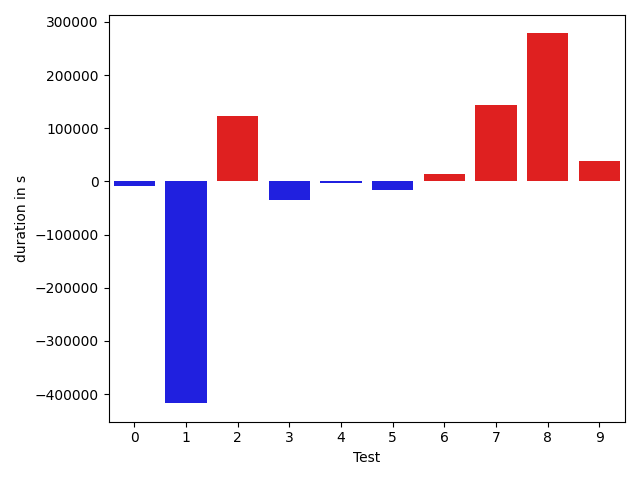

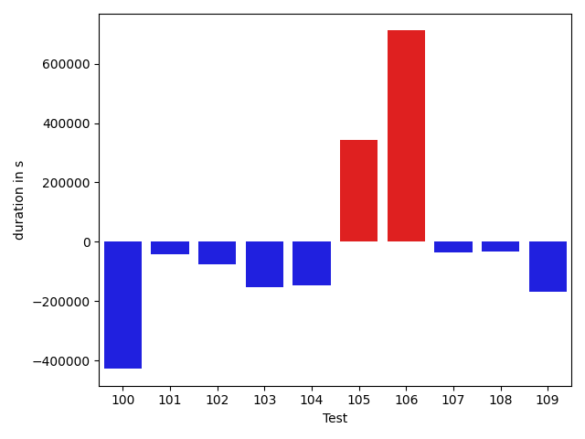

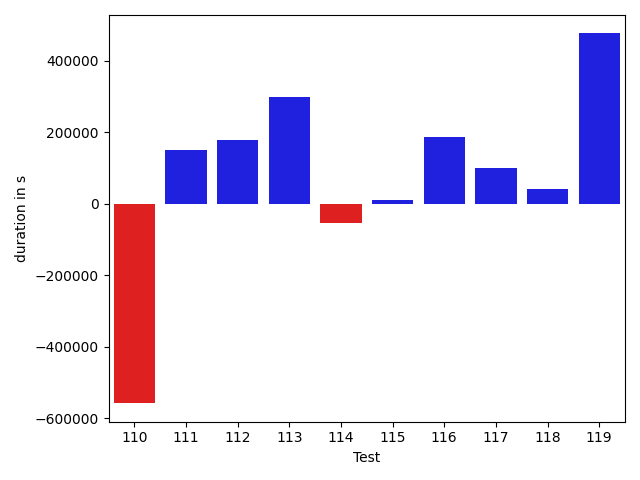

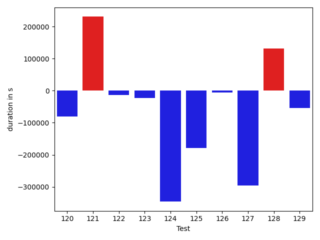

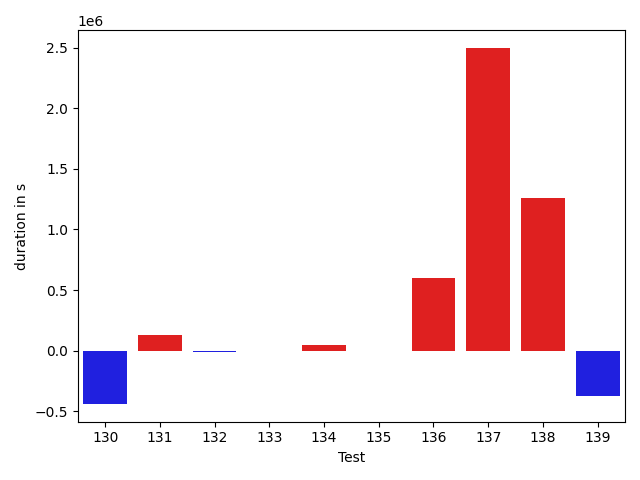

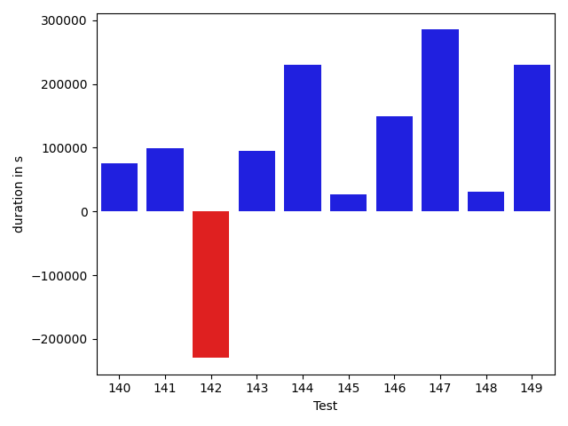

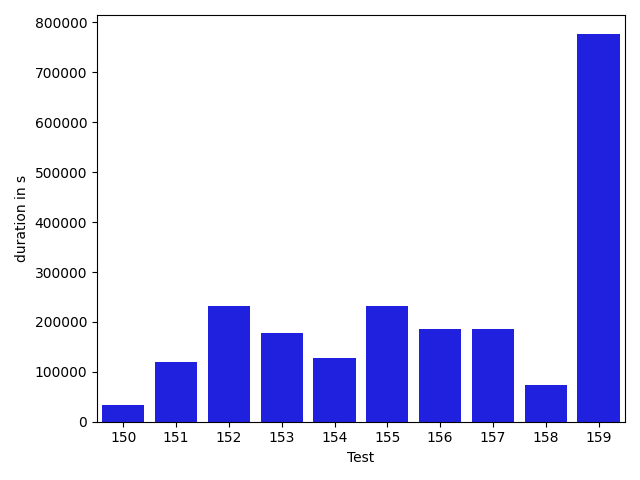

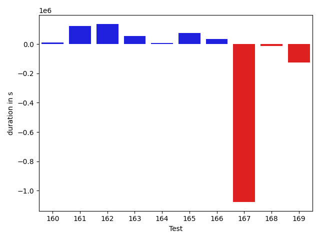

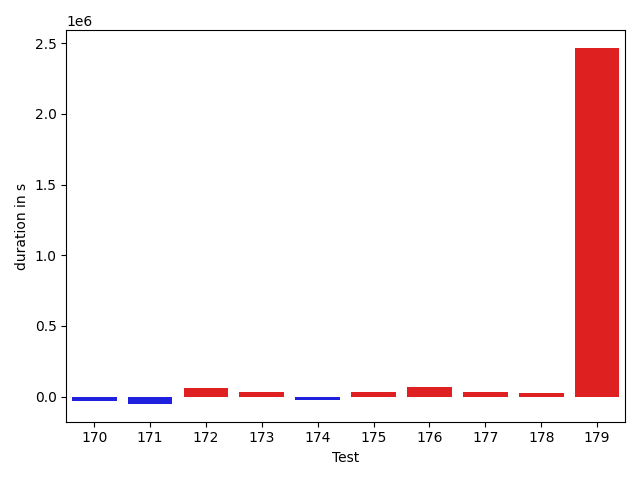

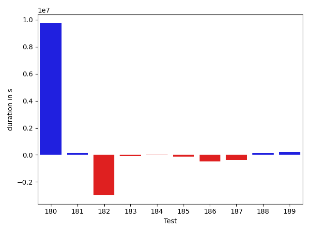

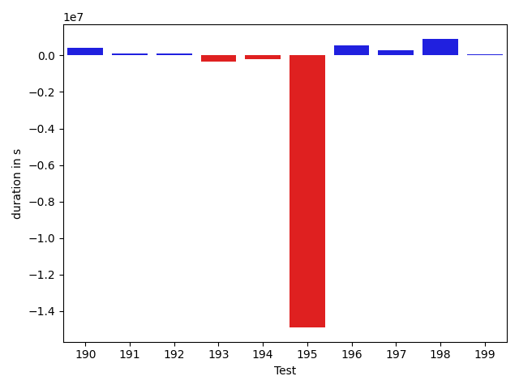

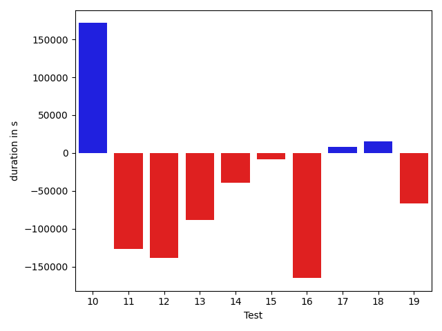

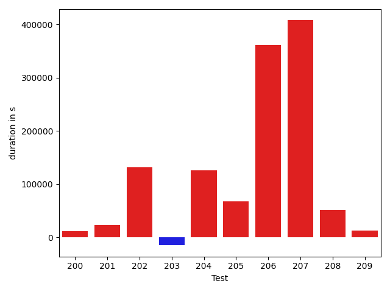

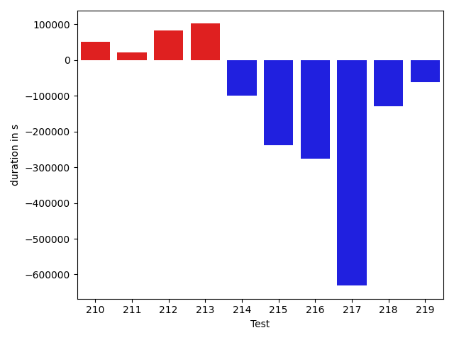

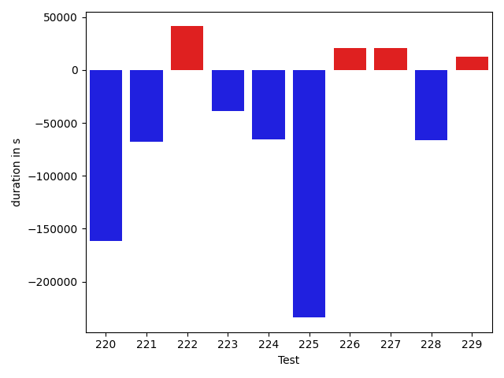

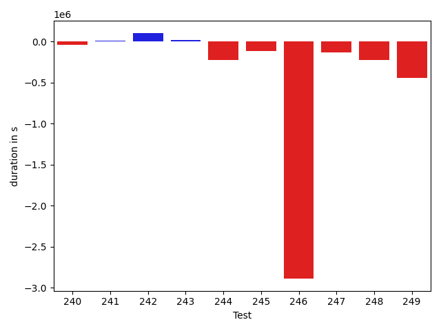

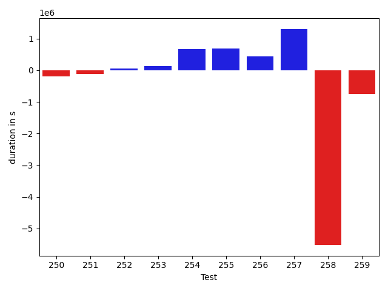

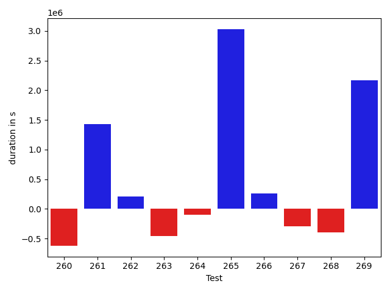

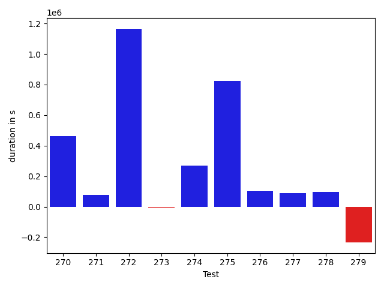

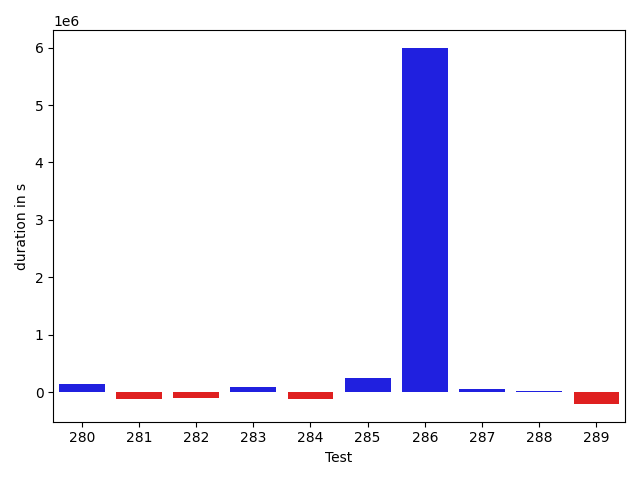

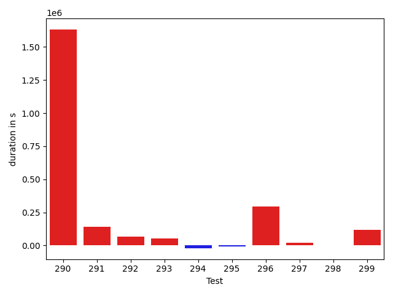

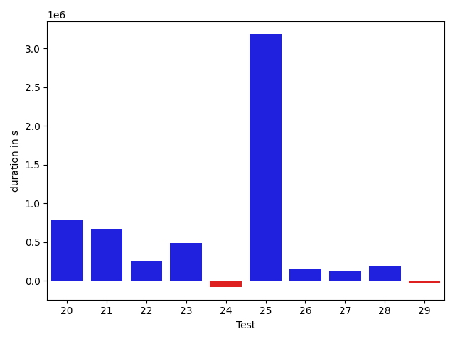

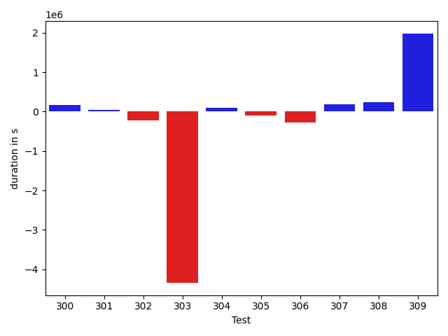

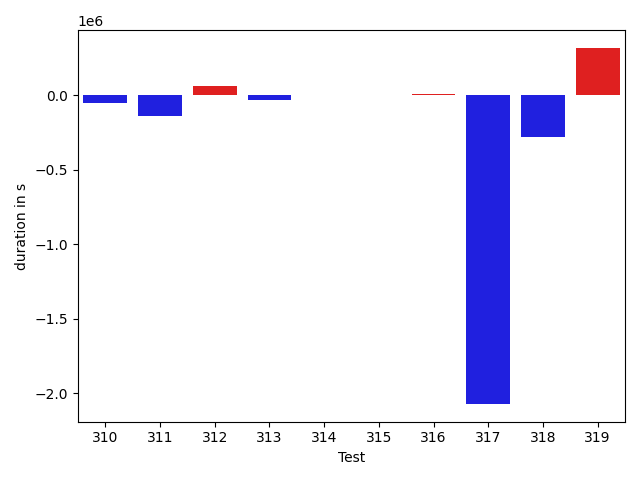

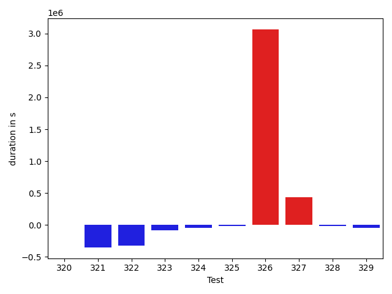

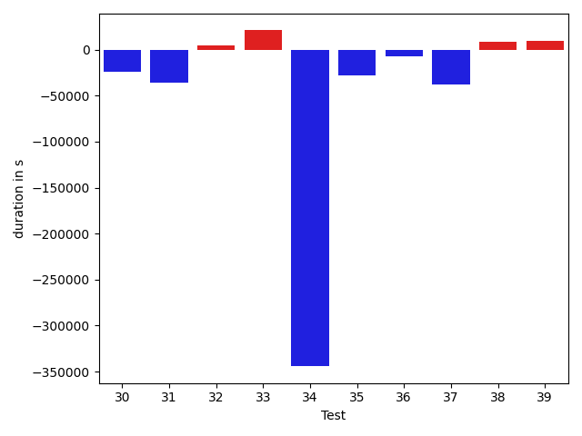

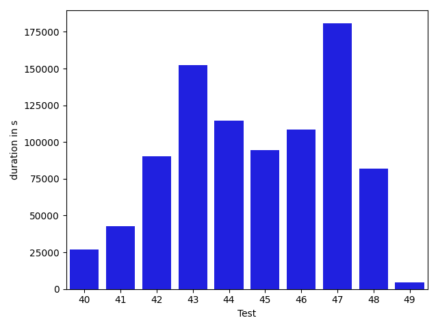

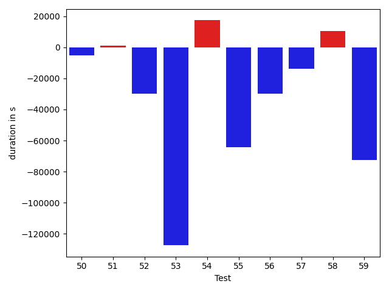

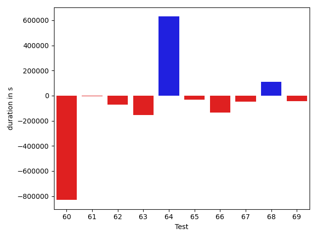

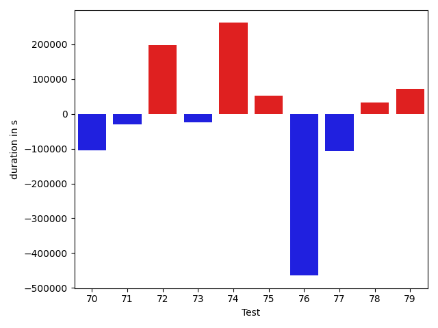

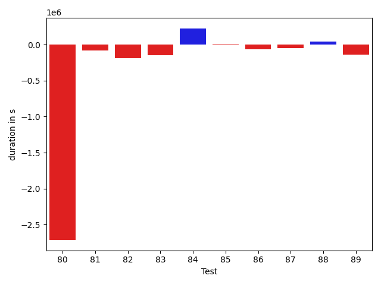

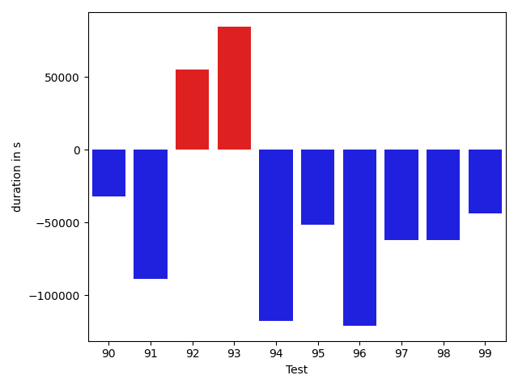

| ID | DurationV1 | DurationsV2 | DeltaDuration |
| --- | --- | --- | --- |
| 0 | 777012.0405655883 | 972974.2412339399 | 195962.2006683516 |
| 1 | 1229297.5409036337 | 1968441.9971835727 | 739144.456279939 |
| 2 | 780154.3603485036 | 902142.2047376672 | 121987.84438916366 |
| 3 | 2168930.167118117 | 2440732.6483659856 | 271802.4812478684 |
| 4 | 579594.9265918732 | 665270.83163883 | 85675.90504695685 |
| 5 | 850075.3301007416 | 1295155.6724094087 | 445080.34230866714 |
| 6 | 583423.6413856136 | 1546417.9045479246 | 962994.263162311 |
| 7 | 573751.9747325256 | 767353.5045702539 | 193601.52983772825 |
| 8 | 710401.9116603937 | 1026164.8559991834 | 315762.9443387897 |
| 9 | 683275.8936986519 | 801031.1334695162 | 117755.23977086425 |
| 10 | 386381.70666503906 | 557930.4843730927 | 171548.7777080536 |
| 11 | 1182138.2554058637 | 1055353.7103634377 | -126784.54504242609 |
| 12 | 1023119.3080197301 | 884692.799846144 | -138426.5081735861 |
| 13 | 631485.356701711 | 542999.092722252 | -88486.26397945895 |
| 14 | 567592.6305383882 | 528185.6307494128 | -39406.99978897534 |
| 15 | 1274392.8149993434 | 1266479.820332511 | -7912.994666832266 |
| 16 | 829433.2974839531 | 664200.7233335231 | -165232.57415042992 |
| 17 | 874176.5275099906 | 882142.1659257855 | 7965.638415794936 |
| 18 | 887618.3757412484 | 903031.3570887698 | 15412.981347521418 |
| 19 | 581158.3903669362 | 514611.07315788337 | -66547.31720905285 |
| 20 | 780124.869521301 | 1557994.4037160599 | 777869.5341947589 |
| 21 | 1297294.5032649625 | 1964398.833779537 | 667104.3305145744 |
| 22 | 928451.2627244687 | 1180043.478185412 | 251592.2154609433 |
| 23 | 887482.0214793892 | 1375645.317862506 | 488163.29638311686 |
| 24 | 780968.5876680128 | 700386.7494346598 | -80581.83823335299 |
| 25 | 2414732.8184032855 | 5601620.808036286 | 3186887.989633001 |
| 26 | 533020.6896403953 | 685513.6578833461 | 152492.96824295074 |
| 27 | 519458.70287362527 | 650371.2522823785 | 130912.54940875323 |
| 28 | 554956.8406801719 | 743810.200088929 | 188853.35940875718 |
| 29 | 635238.4349451648 | 597785.6293398193 | -37452.80560534552 |
| 30 | 733600.4876460359 | 1055101.5686589573 | 321501.0810129214 |
| 31 | 584456.7591934889 | 509477.0241958619 | -74979.73499762698 |
| 32 | 668547.1515842627 | 732560.7509690541 | 64013.599384791334 |
| 33 | 308290.28355428576 | 525111.2207052708 | 216820.937150985 |
| 34 | 606199.4119169598 | 931624.8794626902 | 325425.4675457304 |
| 35 | 806817.4743530898 | 858979.8464436827 | 52162.372090592864 |
| 36 | 794967.8629743992 | 1144913.374234038 | 349945.5112596387 |
| 37 | 709428.7854433686 | 807945.7820661389 | 98516.99662277033 |
| 38 | 616327.9825183986 | 675662.4132955509 | 59334.4307771523 |
| 39 | 636358.5760218904 | 668609.3071436025 | 32250.73112171213 |
| 40 | 338465.9008178711 | 365267.2935180664 | 26801.392700195312 |
| 41 | 668116.0200270235 | 710748.8184755739 | 42632.7984485504 |
| 42 | 532050.7349378732 | 622516.212895384 | 90465.47795751074 |
| 43 | 466511.7130138073 | 618760.8885421753 | 152249.17552836798 |
| 44 | 649613.7741333148 | 764268.1091028595 | 114654.33496954467 |
| 45 | 583419.8291706392 | 677764.2917977327 | 94344.46262709354 |
| 46 | 509186.0184151882 | 617768.9752719833 | 108582.95685679512 |
| 47 | 571516.6883170772 | 752145.3349092305 | 180628.64659215324 |
| 48 | 579172.7662671546 | 661246.724968524 | 82073.95870136935 |
| 49 | 620200.9397841927 | 624718.7106069947 | 4517.7708228019765 |
| 50 | 517621.57927590085 | 661546.5238716627 | 143924.94459576183 |
| 51 | 433666.97079467773 | 393156.50427246094 | -40510.4665222168 |
| 52 | 809293.8908380792 | 693948.5137125276 | -115345.37712555157 |
| 53 | 655465.4476563403 | 662169.8133116898 | 6704.365655349451 |
| 54 | 1286320.0268022586 | 977522.7819179865 | -308797.2448842721 |
| 55 | 1453301.339155804 | 1025531.3992402863 | -427769.9399155176 |
| 56 | 1012353.0157053976 | 881982.4729033743 | -130370.54280202324 |
| 57 | 682506.898200383 | 611839.1542512721 | -70667.74394911085 |
| 58 | 757211.2830901498 | 639747.7273385177 | -117463.55575163208 |
| 59 | 520465.9008901436 | 418846.677019994 | -101619.22387014958 |
| 60 | 1382561.9666099516 | 552114.1688169792 | -830447.7977929724 |
| 61 | 650768.2124734013 | 645583.160802255 | -5185.051671146299 |
| 62 | 1381378.5557258765 | 1310473.9603969813 | -70904.59532889514 |
| 63 | 820947.0165354803 | 667324.5730184227 | -153622.44351705757 |
| 64 | 901600.8081154098 | 1530688.7226062499 | 629087.91449084 |
| 65 | 679827.1280578378 | 647344.0954823394 | -32483.03257549845 |
| 66 | 803363.8405924456 | 667175.5715575467 | -136188.26903489884 |
| 67 | 666145.7294318026 | 617588.8975391474 | -48556.83189265523 |
| 68 | 536551.1962603449 | 644861.5338696005 | 108310.33760925557 |
| 69 | 585736.9054257004 | 540867.8893699584 | -44869.01605574193 |
| 70 | 739496.9866893989 | 832662.4623034571 | 93165.4756140582 |
| 71 | 647803.1738358956 | 692341.1976915163 | 44538.023855620646 |
| 72 | 1183826.450348963 | 855745.2013753289 | -328081.2489736341 |
| 73 | 610726.3672988252 | 560885.2834156149 | -49841.08388321032 |
| 74 | 892188.6983317316 | 641291.186005641 | -250897.5123260906 |
| 75 | 634391.6509717376 | 638491.8331883189 | 4100.182216581306 |
| 76 | 632358.8401747431 | 607295.1896101565 | -25063.650564586627 |
| 77 | 592961.8406299537 | 537137.6855847747 | -55824.15504517895 |
| 78 | 693319.0682978239 | 574947.7181157074 | -118371.3501821165 |
| 79 | 668680.8053319524 | 729116.9956942999 | 60436.19036234752 |
| 80 | 3059490.906616211 | 348610.2316894531 | -2710880.674926758 |
| 81 | 741459.6257359023 | 661031.2527426567 | -80428.3729932456 |
| 82 | 809484.4078372288 | 621371.4774559699 | -188112.93038125895 |
| 83 | 768652.4389888714 | 621782.4428233205 | -146869.9961655509 |
| 84 | 557218.6975566074 | 780887.7482433991 | 223669.05068679166 |
| 85 | 367779.76455688477 | 357583.04736328125 | -10196.717193603516 |
| 86 | 706673.4735045969 | 645470.8163105291 | -61202.657194067724 |
| 87 | 666437.8130400276 | 615164.7134157072 | -51273.0996243204 |
| 88 | 336010.6086425781 | 381601.77286052704 | 45591.16421794891 |
| 89 | 744546.2871346055 | 606911.1374137538 | -137635.14972085168 |
| 90 | 404690.9948730469 | 502927.5650291452 | 98236.57015609834 |
| 91 | 1194000.9171677849 | 1228180.3452395555 | 34179.428071770584 |
| 92 | 1003814.4549278781 | 889859.2601149363 | -113955.19481294183 |
| 93 | 1181509.1717220992 | 1197483.4510313177 | 15974.279309218517 |
| 94 | 1039700.1296880561 | 998496.6018143403 | -41203.527873715735 |
| 95 | 821079.7068334483 | 746399.3401803516 | -74680.36665309663 |
| 96 | 5024859.262296989 | 3368891.8706926582 | -1655967.3916043304 |
| 97 | 763163.9701720343 | 538305.009057835 | -224858.96111419937 |
| 98 | 1148658.364745015 | 1195302.5714375428 | 46644.20669252775 |
| 99 | 2814396.247052638 | 3013034.5841513677 | 198638.3370987298 |
| 100 | 1361552.2191584571 | 1150445.2312764025 | -211106.98788205464 |
| 101 | 3731387.388632756 | 1595181.724405351 | -2136205.664227405 |
| 102 | 1490941.9667082885 | 1354367.190654112 | -136574.7760541765 |
| 103 | 1542346.675494733 | 1019181.1079930451 | -523165.5675016879 |
| 104 | 3458462.713619332 | 2142071.4258497916 | -1316391.2877695402 |
| 105 | 1198764.264643868 | 1070630.8409654542 | -128133.42367841373 |
| 106 | 14422416.987398252 | 5919203.916011196 | -8503213.071387056 |
| 107 | 4960361.7899007015 | 3032993.817520706 | -1927367.9723799955 |
| 108 | 3837473.036782093 | 2761502.191516147 | -1075970.845265946 |
| 109 | 3156725.013141763 | 524074.4064816682 | -2632650.6066600946 |
| 110 | 1102213.3352757543 | 544116.3878920863 | -558096.947383668 |
| 111 | 636726.334174938 | 788469.805264122 | 151743.47108918393 |
| 112 | 1177590.0134223485 | 1356377.3087335243 | 178787.29531117575 |
| 113 | 1151921.227850163 | 1449437.4980642153 | 297516.2702140524 |
| 114 | 680828.2926660301 | 627945.5594667778 | -52882.73319925228 |
| 115 | 779573.5002996922 | 789840.4133300781 | 10266.913030385971 |
| 116 | 646095.9144229607 | 833416.2269868213 | 187320.31256386056 |
| 117 | 671582.617624527 | 770976.5916283545 | 99393.97400382755 |
| 118 | 705916.7347136962 | 747701.4585934379 | 41784.72387974174 |
| 119 | 507793.77283417154 | 984120.4676763818 | 476326.6948422103 |
| 120 | 962309.3789295708 | 2930984.9043126237 | 1968675.5253830529 |
| 121 | 1123221.1065150928 | 1034297.8536608496 | -88923.25285424315 |
| 122 | 1325250.322807082 | 904069.2657386605 | -421181.0570684215 |
| 123 | 417898.02173908055 | 465911.2473036051 | 48013.22556452453 |
| 124 | 728494.887499514 | 864586.364496095 | 136091.47699658095 |
| 125 | 373752.15253067017 | 473903.86644744873 | 100151.71391677856 |
| 126 | 13760804.921084628 | 7539870.936162209 | -6220933.984922418 |
| 127 | 385446.0376560688 | 730827.496170044 | 345381.45851397514 |
| 128 | 470583.6104211807 | 605202.9294510707 | 134619.31902989 |
| 129 | 587427.4418834662 | 660798.4353432655 | 73370.99345979933 |
| 130 | 398085.7026734352 | 565578.371325016 | 167492.6686515808 |
| 131 | 897868.5843715236 | 1000807.7719151292 | 102939.18754360557 |
| 132 | 420194.8874359131 | 503832.2074098587 | 83637.31997394562 |
| 133 | 557558.5027739273 | 846104.2202934303 | 288545.71751950297 |
| 134 | 3078072.4092715494 | 1749964.080601523 | -1328108.3286700265 |
| 135 | 692473.0204410553 | 608432.8015330806 | -84040.21890797466 |
| 136 | 398598.0414896505 | 605418.0647765994 | 206820.0232869489 |
| 137 | 344635.3657913208 | 436942.03600788116 | 92306.67021656036 |
| 138 | 533875.26871513 | 543919.8537389636 | 10044.585023833555 |
| 139 | 615266.0957104859 | 871485.2550861748 | 256219.15937568888 |
| 140 | 411061.9693815708 | 486703.36812496185 | 75641.39874339104 |
| 141 | 403147.90967941284 | 502444.6602783203 | 99296.75059890747 |
| 142 | 1036837.9833077751 | 807110.5667358659 | -229727.4165719092 |
| 143 | 384764.8859100342 | 480164.253262572 | 95399.36735253781 |
| 144 | 407553.3127849698 | 637335.630697608 | 229782.3179126382 |
| 145 | 465346.7337192297 | 492312.9732744694 | 26966.239555239677 |
| 146 | 389686.11152386665 | 538458.9195566177 | 148772.80803275108 |
| 147 | 564271.9060753286 | 849273.8992305273 | 285001.99315519875 |
| 148 | 561565.6584206 | 592811.0030658913 | 31245.344645291334 |
| 149 | 613517.5595678623 | 842847.7767145713 | 229330.21714670898 |
| 150 | 549404.8765450418 | 582292.0225644186 | 32887.146019376814 |
| 151 | 530796.55220332 | 650944.7946455718 | 120148.24244225188 |
| 152 | 881278.9929466979 | 1113107.7153150784 | 231828.72236838052 |
| 153 | 394332.2012910545 | 571383.5810286403 | 177051.37973758578 |
| 154 | 336164.96561050415 | 463400.0664215088 | 127235.10081100464 |
| 155 | 355626.19456768036 | 588277.5233421326 | 232651.3287744522 |
| 156 | 383522.71757507324 | 568385.1333399937 | 184862.4157649204 |
| 157 | 314563.88929748535 | 499951.5537118912 | 185387.66441440582 |
| 158 | 426233.2832803726 | 499017.0364074707 | 72783.75312709808 |
| 159 | 2913840.4799490375 | 3690049.9345375374 | 776209.4545884999 |
| 160 | 434459.4542222917 | 445229.73877334595 | 10770.28455105424 |
| 161 | 567859.1594082462 | 691164.3373283786 | 123305.17792013241 |
| 162 | 434424.4175557792 | 571527.264070496 | 137102.84651471674 |
| 163 | 316883.7265892029 | 371450.1130681038 | 54566.38647890091 |
| 164 | 597592.1700457819 | 603846.208771509 | 6254.038725727121 |
| 165 | 470749.76944479614 | 547120.5984094413 | 76370.82896464516 |
| 166 | 523101.0511512747 | 558845.923032322 | 35744.871881047264 |
| 167 | 2746088.8021652373 | 1669150.1098972643 | -1076938.692267973 |
| 168 | 481194.05452537537 | 467028.76669311523 | -14165.287832260132 |
| 169 | 959938.8102444054 | 835101.0184554022 | -124837.79178900318 |
| 170 | 871663.4091161338 | 1033628.9243688942 | 161965.51525276038 |
| 171 | 1612518.9454647927 | 531180.134480801 | -1081338.8109839917 |
| 172 | 1227277.3377528298 | 614077.1849102336 | -613200.1528425962 |
| 173 | 926434.8890452504 | 702738.6646413148 | -223696.2244039356 |
| 174 | 759855.7471719701 | 642998.3449914173 | -116857.40218055283 |
| 175 | 650199.8186120987 | 551612.4430541992 | -98587.37555789948 |
| 176 | 432590.5758552551 | 426885.6058703065 | -5704.969984948635 |
| 177 | 373844.1606416702 | 360909.0333852768 | -12935.127256393433 |
| 178 | 443709.1260070801 | 455038.62713623047 | 11329.50112915039 |
| 179 | 354921.5387620926 | 690295.5942950728 | 335374.05553298024 |
| 180 | 859760.451676415 | 10603826.469865259 | 9744066.018188844 |
| 181 | 632531.2366248947 | 802782.5213062838 | 170251.2846813891 |
| 182 | 4454222.980816159 | 1471273.5763805523 | -2982949.404435607 |
| 183 | 951575.048454308 | 858493.0298973068 | -93082.01855700114 |
| 184 | 969203.3305486543 | 949224.2591307703 | -19979.07141788397 |
| 185 | 1012548.9720898789 | 888772.4339042922 | -123776.53818558669 |
| 186 | 1337242.723142346 | 849130.7680469267 | -488111.9550954192 |
| 187 | 1412011.4578937804 | 1050750.477433068 | -361260.98046071245 |
| 188 | 863104.8890720629 | 999933.3716349262 | 136828.48256286327 |
| 189 | 2004321.287946582 | 2254063.5521463254 | 249742.26419974328 |
| 190 | 1392442.857263105 | 1826738.0143141479 | 434295.1570510429 |
| 191 | 1050113.2560855637 | 1138123.6846364883 | 88010.42855092464 |
| 192 | 1166568.39862128 | 1287557.6372103584 | 120989.23858907842 |
| 193 | 1144716.673223445 | 802133.6126331895 | -342583.0605902554 |
| 194 | 1556089.9013329 | 1371917.4179954529 | -184172.48333744705 |
| 195 | 15751864.133392248 | 863923.7808318503 | -14887940.352560397 |
| 196 | 492849.85246624966 | 1053147.5912892655 | 560297.7388230159 |
| 197 | 383542.89401221275 | 683564.9795147665 | 300022.08550255373 |
| 198 | 932712.3986676997 | 1839698.6411774051 | 906986.2425097055 |
| 199 | 628866.1058735184 | 706938.4478618811 | 78072.34198836272 |
| 200 | 531784.2115802765 | 367404.41292214394 | -164379.79865813255 |
| 201 | 598903.2789463426 | 685361.4409895493 | 86458.16204320663 |
| 202 | 769235.2227473592 | 940539.3369365004 | 171304.1141891412 |
| 203 | 437126.6684516445 | 412801.8275756836 | -24324.840875960886 |
| 204 | 450274.3523976938 | 435496.4509093575 | -14777.901488336269 |
| 205 | 687173.2164069094 | 817027.9676851793 | 129854.75127826992 |
| 206 | 443106.6474456787 | 619685.7972186506 | 176579.14977297187 |
| 207 | 405969.0799360275 | 373574.80338287354 | -32394.27655315399 |
| 208 | 417761.9008208513 | 395667.90007817745 | -22094.000742673874 |
| 209 | 482261.91094630957 | 406026.78723853827 | -76235.1237077713 |
| 210 | 443071.21385195083 | 783455.3019655943 | 340384.08811364346 |
| 211 | 650580.0461457937 | 1085600.7649984742 | 435020.7188526804 |
| 212 | 1156032.4749534184 | 1542459.938518409 | 386427.46356499055 |
| 213 | 721165.2641446608 | 1501803.0389473066 | 780637.7748026458 |
| 214 | 483750.8419493027 | 743697.2172780037 | 259946.375328701 |
| 215 | 661906.8383501458 | 806589.4336081313 | 144682.5952579854 |
| 216 | 463823.8341969036 | 1000538.6589188604 | 536714.8247219567 |
| 217 | 415386.0071301237 | 465314.32194635086 | 49928.31481622718 |
| 218 | 409643.5571867395 | 763872.8524400368 | 354229.2952532973 |
| 219 | 536401.8175483346 | 877334.3408551216 | 340932.523306787 |
| 220 | 1473013.2233932912 | 934789.361320986 | -538223.8620723053 |
| 221 | 773790.5550675392 | 557521.5487024013 | -216269.00636513787 |
| 222 | 767302.5579962227 | 741929.2982802982 | -25373.259715924505 |
| 223 | 1456436.1628413938 | 1850137.9325708912 | 393701.7697294974 |
| 224 | 965420.2949229189 | 924021.9201817202 | -41398.37474119873 |
| 225 | 372549.75108296424 | 3500208.4537501335 | 3127658.7026671693 |
| 226 | 766811.8168178054 | 898848.3411807435 | 132036.52436293813 |
| 227 | 1072496.2970632617 | 1448760.7631797418 | 376264.46611648006 |
| 228 | 872022.4419728532 | 767071.257364125 | -104951.18460872816 |
| 229 | 757364.5500283241 | 493685.35831162333 | -263679.1917167008 |
| 230 | 5327506.487589104 | 4725346.207643172 | -602160.2799459323 |
| 231 | 602671.9751434115 | 625320.9633999183 | 22648.98825650674 |
| 232 | 583226.335976129 | 509181.2788372934 | -74045.05713883566 |
| 233 | 810848.314841941 | 535710.4905659854 | -275137.82427595556 |
| 234 | 732436.6536476004 | 595505.8832508447 | -136930.77039675578 |
| 235 | 600990.2142361029 | 720707.2321699084 | 119717.01793380547 |
| 236 | 582504.4024371249 | 612844.7483065128 | 30340.345869387966 |
| 237 | 462243.5461213812 | 495154.5485108639 | 32911.00238948269 |
| 238 | 535589.3963643629 | 424942.1373446551 | -110647.2590197078 |
| 239 | 758935.6103406253 | 614768.4287307612 | -144167.1816098641 |
| 240 | 461745.55482351733 | 423886.1740474701 | -37859.38077604724 |
| 241 | 618837.3933277444 | 631608.4827409824 | 12771.08941323799 |
| 242 | 440484.5268640549 | 545769.1396734715 | 105284.61280941655 |
| 243 | 430976.087373361 | 454760.38882255554 | 23784.30144919455 |
| 244 | 746338.260537247 | 522235.4918742846 | -224102.76866296248 |
| 245 | 653863.8740712164 | 537519.42560814 | -116344.4484630765 |
| 246 | 4048161.0935581783 | 1162129.8938043695 | -2886031.199753809 |
| 247 | 698425.4539668149 | 566354.2223489268 | -132071.2316178881 |
| 248 | 1012129.7358974265 | 789300.402085528 | -222829.33381189848 |
| 249 | 2608649.43786686 | 2166263.2655762886 | -442386.1722905715 |
| 250 | 995365.3430585809 | 805931.2985727899 | -189434.044485791 |
| 251 | 953119.1710526536 | 833856.0046303293 | -119263.16642232426 |
| 252 | 1129113.4428734302 | 1174479.834361001 | 45366.39148757071 |
| 253 | 1080943.8542898125 | 1201452.5421849582 | 120508.68789514573 |
| 254 | 1012490.9613376156 | 1675645.491827683 | 663154.5304900674 |
| 255 | 1082683.6170812517 | 1769566.5405594136 | 686882.9234781619 |
| 256 | 1154248.6484397699 | 1588437.1386859515 | 434188.4902461816 |
| 257 | 648347.7134168148 | 1946717.3319289237 | 1298369.618512109 |
| 258 | 57504633.576644085 | 51988375.87352927 | -5516257.703114815 |
| 259 | 12127866.8946054 | 11375822.759218158 | -752044.1353872418 |
| 260 | 2251173.23647492 | 1630023.3482351508 | -621149.8882397693 |
| 261 | 449874.0725921807 | 1875291.3849321846 | 1425417.312340004 |
| 262 | 349888.1893596649 | 559829.3632326871 | 209941.1738730222 |
| 263 | 918364.3829630613 | 464172.69578521326 | -454191.68717784807 |
| 264 | 597565.7926831171 | 502396.245101504 | -95169.54758161306 |
| 265 | 5489647.875888216 | 8520097.766751641 | 3030449.890863425 |
| 266 | 8425866.82981097 | 8687531.656612122 | 261664.8268011529 |
| 267 | 976874.2724702744 | 684854.3617472734 | -292019.910723001 |
| 268 | 911308.4890268568 | 510874.1958972188 | -400434.29312963807 |
| 269 | 856343.5482936215 | 3027925.4003174216 | 2171581.8520238 |
| 270 | 591355.1059891642 | 1054904.2490782682 | 463549.143089104 |
| 271 | 901119.7758918995 | 975986.9203238247 | 74867.14443192526 |
| 272 | 2639564.0154660456 | 3804858.7861344395 | 1165294.770668394 |
| 273 | 436596.1314089 | 432689.9586802176 | -3906.1727286824025 |
| 274 | 520867.79110741615 | 790824.6420376003 | 269956.8509301841 |
| 275 | 496163.3750406988 | 1319613.710619502 | 823450.3355788032 |
| 276 | 444141.192127347 | 548528.3363718987 | 104387.14424455166 |
| 277 | 588420.9020648003 | 676747.290875385 | 88326.38881058479 |
| 278 | 488189.78326555167 | 586463.7459447233 | 98273.96267917159 |
| 279 | 1013055.2795535785 | 779651.1810092685 | -233404.09854430996 |
| 280 | 525966.1682552248 | 657007.8133718967 | 131041.64511667192 |
| 281 | 1549257.9878735044 | 1427865.4376432963 | -121392.55023020809 |
| 282 | 601653.7635426018 | 498465.1959756613 | -103188.56756694056 |
| 283 | 517040.99990628695 | 607838.9807347672 | 90797.98082848021 |
| 284 | 546783.3367316127 | 431089.54555892944 | -115693.79117268324 |
| 285 | 1080073.163844824 | 1319603.4356940612 | 239530.27184923715 |
| 286 | 4585482.202573646 | 10580726.34572874 | 5995244.143155094 |
| 287 | 1135349.6613860528 | 1187989.8900813907 | 52640.22869533789 |
| 288 | 1003703.5170900411 | 1026402.2532491535 | 22698.73615911242 |
| 289 | 529960.6652832031 | 322399.37141799927 | -207561.29386520386 |
| 290 | 369013.7693557739 | 1072394.9483184814 | 703381.1789627075 |
| 291 | 734501.7423633719 | 1166955.1286412359 | 432453.386277864 |
| 292 | 469358.8630371094 | 465815.328125 | -3543.534912109375 |
| 293 | 597126.361495882 | 819817.4912181655 | 222691.12972228345 |
| 294 | 479183.0170746378 | 536286.9294087887 | 57103.91233415087 |
| 295 | 751415.1058806932 | 727981.4830660222 | -23433.62281467102 |
| 296 | 513087.57255607843 | 650462.0775008597 | 137374.5049447813 |
| 297 | 582873.2038900256 | 519586.808333233 | -63286.39555679262 |
| 298 | 528426.2213406265 | 681273.5688905637 | 152847.3475499372 |
| 299 | 2880112.7991578095 | 3234762.177083536 | 354649.3779257266 |
| 300 | 1320766.5824894877 | 1486962.497186328 | 166195.91469684034 |
| 301 | 802951.5857787422 | 835891.7962935597 | 32940.2105148175 |
| 302 | 1200774.0864491789 | 975375.2171103368 | -225398.8693388421 |
| 303 | 4947659.335980006 | 606381.3720274442 | -4341277.963952562 |
| 304 | 432156.80522465706 | 534745.6696090698 | 102588.86438441277 |
| 305 | 645481.3623652458 | 542877.0091052055 | -102604.35326004028 |
| 306 | 786945.3999091294 | 510730.0445481087 | -276215.35536102066 |
| 307 | 426925.71648914926 | 603852.5825763941 | 176926.86608724482 |
| 308 | 332248.6811308861 | 568148.9700050354 | 235900.28887414932 |
| 309 | 1435482.444059623 | 3412426.9688497535 | 1976944.5247901306 |
| 310 | 1476234.062157067 | 1416796.6165093319 | -59437.44564773515 |
| 311 | 1783905.230907766 | 907997.5198651096 | -875907.7110426563 |
| 312 | 753440.0371785646 | 612093.3430932792 | -141346.69408528542 |
| 313 | 891517.1984048762 | 750116.174257181 | -141401.02414769516 |
| 314 | 1545150.1491740055 | 1060892.805909899 | -484257.3432641064 |
| 315 | 848515.1534591964 | 962326.5249676656 | 113811.3715084691 |
| 316 | 872596.2244968221 | 718544.8533005619 | -154051.3711962602 |
| 317 | 885305.8889778992 | 739032.6592694831 | -146273.22970841615 |
| 318 | 537892.1335021543 | 2151770.8361988068 | 1613878.7026966526 |
| 319 | 744670.153670992 | 708389.9276453253 | -36280.22602566669 |
| 320 | 860349.685014374 | 898174.9937201607 | 37825.30870578671 |
| 321 | 1445653.273925229 | 966957.0592573399 | -478696.21466788906 |
| 322 | 723454.0456454813 | 626620.3097134014 | -96833.73593207996 |
| 323 | 956988.7467480474 | 645659.9947251682 | -311328.7520228792 |
| 324 | 678743.875894502 | 590470.5580694767 | -88273.3178250253 |
| 325 | 650011.7501656413 | 719961.9656193778 | 69950.21545373648 |
| 326 | 1301961.1266245726 | 1698610.8200878026 | 396649.69346323004 |
| 327 | 616749.2974872291 | 588466.4043795802 | -28282.89310764894 |
| 328 | 1092081.0531119425 | 926565.1034027156 | -165515.94970922684 |
| 329 | 826580.6697168923 | 724151.3944018129 | -102429.27531507937 |

## Misc.

| ID | Test Class | Test Method |
| --- | --- | --- |
| 0 | com.google.gson.functional.CustomTypeAdaptersTest | testCustomAdapterInvokedForCollectionElementDeserialization |
| 1 | com.google.gson.functional.CustomTypeAdaptersTest | testCustomNestedSerializers |
| 2 | com.google.gson.functional.CustomTypeAdaptersTest | testCustomNestedDeserializers |
| 3 | com.google.gson.functional.CustomTypeAdaptersTest | testCustomTypeAdapterDoesNotAppliesToSubClasses |
| 4 | com.google.gson.functional.CustomTypeAdaptersTest | testCustomAdapterInvokedForCollectionElementSerialization |
| 5 | com.google.gson.functional.CustomTypeAdaptersTest | testCustomAdapterInvokedForCollectionElementSerializationWithType |
| 6 | com.google.gson.functional.CustomTypeAdaptersTest | testEnsureCustomSerializerNotInvokedForNullValues |
| 7 | com.google.gson.functional.CustomTypeAdaptersTest | testEnsureCustomDeserializerNotInvokedForNullValues |
| 8 | com.google.gson.functional.CustomTypeAdaptersTest | testCustomAdapterInvokedForMapElementDeserialization |
| 9 | com.google.gson.functional.CustomTypeAdaptersTest | testCustomAdapterInvokedForMapElementSerializationWithType |
| 10 | com.google.gson.functional.CustomTypeAdaptersTest | testCustomAdapterInvokedForMapElementSerialization |
| 11 | com.google.gson.functional.StreamingTypeAdaptersTest | testNullSafe |
| 12 | com.google.gson.functional.StreamingTypeAdaptersTest | testSerializeWithCustomTypeAdapter |
| 13 | com.google.gson.functional.StreamingTypeAdaptersTest | testDeserializeWithCustomTypeAdapter |
| 14 | com.google.gson.functional.StreamingTypeAdaptersTest | testSerializeRecursive |
| 15 | com.google.gson.functional.CustomDeserializerTest | testDefaultConstructorNotCalledOnObject |
| 16 | com.google.gson.functional.CustomDeserializerTest | testCustomDeserializerReturnsNullForArrayElementsForArrayField |
| 17 | com.google.gson.functional.CustomDeserializerTest | testCustomDeserializerReturnsNull |
| 18 | com.google.gson.functional.CustomDeserializerTest | testJsonTypeFieldBasedDeserialization |
| 19 | com.google.gson.functional.CustomDeserializerTest | testDefaultConstructorNotCalledOnField |
| 20 | com.google.gson.functional.JsonParserTest | testBadTypeForDeserializingCustomTree |
| 21 | com.google.gson.functional.JsonParserTest | testExtraCommasInArrays |
| 22 | com.google.gson.functional.JsonParserTest | testExtraCommasInMaps |
| 23 | com.google.gson.functional.JsonParserTest | testChangingCustomTreeAndDeserializing |
| 24 | com.google.gson.functional.JsonParserTest | testBadFieldTypeForDeserializingCustomTree |
| 25 | com.google.gson.functional.JsonParserTest | testDeserializingCustomTree |
| 26 | com.google.gson.functional.JsonParserTest | testBadFieldTypeForCustomDeserializerCustomTree |
| 27 | com.google.gson.functional.CollectionTest | testCollectionOfObjectSerialization |
| 28 | com.google.gson.functional.CollectionTest | testRawCollectionOfBagOfPrimitivesNotAllowed |
| 29 | com.google.gson.functional.CollectionTest | testNullsInListSerialization |
| 30 | com.google.gson.functional.CollectionTest | testWildcardPrimitiveCollectionSerilaization |
| 31 | com.google.gson.functional.CollectionTest | testCollectionOfBagOfPrimitivesSerialization |
| 32 | com.google.gson.functional.CollectionTest | testTopLevelCollectionOfIntegersDeserialization |
| 33 | com.google.gson.functional.CollectionTest | testRawCollectionOfIntegersSerialization |
| 34 | com.google.gson.functional.CollectionTest | testQueueSerialization |
| 35 | com.google.gson.functional.CollectionTest | testSetDeserialization |
| 36 | com.google.gson.functional.CollectionTest | testWildcardCollectionField |
| 37 | com.google.gson.functional.CollectionTest | testSetSerialization |
| 38 | com.google.gson.functional.CollectionTest | testTopLevelListOfIntegerCollectionsDeserialization |
| 39 | com.google.gson.functional.CollectionTest | testCollectionOfObjectWithNullSerialization |
| 40 | com.google.gson.functional.CollectionTest | testCollectionOfStringsSerialization |
| 41 | com.google.gson.functional.CollectionTest | testLinkedListSerialization |
| 42 | com.google.gson.functional.CollectionTest | testNullsInListDeserialization |
| 43 | com.google.gson.functional.CollectionTest | testRawCollectionSerialization |
| 44 | com.google.gson.functional.CollectionTest | testFieldIsArrayList |
| 45 | com.google.gson.functional.CollectionTest | testWildcardPrimitiveCollectionDeserilaization |
| 46 | com.google.gson.functional.CollectionTest | testTopLevelCollectionOfIntegersSerialization |
| 47 | com.google.gson.functional.CollectionTest | testRawCollectionDeserializationNotAlllowed |
| 48 | com.google.gson.functional.CollectionTest | testCollectionOfStringsDeserialization |
| 49 | com.google.gson.functional.CollectionTest | testQueueDeserialization |
| 50 | com.google.gson.functional.CollectionTest | testLinkedListDeserialization |
| 51 | com.google.gson.functional.MapTest | testWriteMapsWithEmptyStringKey |
| 52 | com.google.gson.functional.MapTest | testSerializeMaps |
| 53 | com.google.gson.functional.MapTest | testHashMapDeserialization |
| 54 | com.google.gson.functional.MapTest | testMapSerializationWithNullValues |
| 55 | com.google.gson.functional.MapTest | testInterfaceTypeMapWithSerializer |
| 56 | com.google.gson.functional.MapTest | testComplexKeysSerialization |
| 57 | com.google.gson.functional.MapTest | testMapStandardSubclassDeserialization |
| 58 | com.google.gson.functional.MapTest | testReadMapsWithEmptyStringKey |
| 59 | com.google.gson.functional.MapTest | testMapSerializationWithNullValuesSerialized |
| 60 | com.google.gson.functional.MapTest | testMapSubclassDeserialization |
| 61 | com.google.gson.functional.MapTest | testStringKeyDeserialization |
| 62 | com.google.gson.functional.MapTest | testInterfaceTypeMap |
| 63 | com.google.gson.functional.MapTest | testMapSerializationWithWildcardValues |
| 64 | com.google.gson.functional.MapTest | testParameterizedMapSubclassSerialization |
| 65 | com.google.gson.functional.MapTest | testNumberKeyDeserialization |
| 66 | com.google.gson.functional.MapTest | testComplexKeysDeserialization |
| 67 | com.google.gson.functional.MapTest | testMapDeserializationWithIntegerKeys |
| 68 | com.google.gson.functional.MapTest | testMapSerializationEmpty |
| 69 | com.google.gson.functional.MapTest | testMapDeserializationWithNullKey |
| 70 | com.google.gson.functional.MapTest | testMapSerializationWithIntegerKeys |
| 71 | com.google.gson.functional.MapTest | testMapSerializationWithNullValueButSerializeNulls |
| 72 | com.google.gson.functional.MapTest | testSortedMap |
| 73 | com.google.gson.functional.MapTest | testMapDeserializationWithNullValue |
| 74 | com.google.gson.functional.MapTest | testMapNamePromotionWithJsonElementReader |
| 75 | com.google.gson.functional.MapTest | testMapSerializationWithNullKey |
| 76 | com.google.gson.functional.MapTest | testMapDeserializationEmpty |
| 77 | com.google.gson.functional.MapTest | testMapSerializationWithNullValue |
| 78 | com.google.gson.functional.MapTest | testMapDeserializationWithDuplicateKeys |
| 79 | com.google.gson.functional.MapTest | testMapOfMapDeserialization |
| 80 | com.google.gson.functional.MapTest | testMapWithQuotes |
| 81 | com.google.gson.functional.MapTest | testGeneralMapField |
| 82 | com.google.gson.functional.MapTest | testDeerializeMapOfMaps |
| 83 | com.google.gson.functional.MapTest | testMapDeserialization |
| 84 | com.google.gson.functional.MapTest | testMapSerialization |
| 85 | com.google.gson.functional.MapTest | testMapOfMapSerialization |
| 86 | com.google.gson.functional.MapTest | testBooleanKeyDeserialization |
| 87 | com.google.gson.functional.MapTest | testMapDeserializationWithWildcardValues |
| 88 | com.google.gson.functional.MapTest | testRawMapSerialization |
| 89 | com.google.gson.functional.MapTest | testSerializeMapOfMaps |
| 90 | com.google.gson.functional.MapTest | testMapSubclassSerialization |
| 91 | com.google.gson.functional.ParameterizedTypesTest | testParameterizedTypeGenericArraysSerialization |
| 92 | com.google.gson.functional.ParameterizedTypesTest | testParameterizedTypesWithWriterSerialization |
| 93 | com.google.gson.functional.ParameterizedTypesTest | testVariableTypeArrayDeserialization |
| 94 | com.google.gson.functional.ParameterizedTypesTest | testParameterizedTypeWithReaderDeserialization |
| 95 | com.google.gson.functional.ParameterizedTypesTest | testDeepParameterizedTypeDeserialization |
| 96 | com.google.gson.functional.ParameterizedTypesTest | testParameterizedTypesSerialization |
| 97 | com.google.gson.functional.ParameterizedTypesTest | testDeepParameterizedTypeSerialization |
| 98 | com.google.gson.functional.ParameterizedTypesTest | testVariableTypeDeserialization |
| 99 | com.google.gson.functional.ParameterizedTypesTest | testVariableTypeFieldsAndGenericArraysSerialization |
| 100 | com.google.gson.functional.ParameterizedTypesTest | testParameterizedTypeGenericArraysDeserialization |
| 101 | com.google.gson.functional.ParameterizedTypesTest | testParameterizedTypeDeserialization |
| 102 | com.google.gson.functional.ParameterizedTypesTest | testVariableTypeFieldsAndGenericArraysDeserialization |
| 103 | com.google.gson.functional.ParameterizedTypesTest | testTypesWithMultipleParametersDeserialization |
| 104 | com.google.gson.functional.ParameterizedTypesTest | testTypesWithMultipleParametersSerialization |
| 105 | com.google.gson.functional.ParameterizedTypesTest | testParameterizedTypeWithVariableTypeDeserialization |
| 106 | com.google.gson.functional.CircularReferenceTest | testCircularSerialization |
| 107 | com.google.gson.functional.CircularReferenceTest | testSelfReferenceArrayFieldSerialization |
| 108 | com.google.gson.functional.CircularReferenceTest | testSelfReferenceSerialization |
| 109 | com.google.gson.functional.CircularReferenceTest | testDirectedAcyclicGraphDeserialization |
| 110 | com.google.gson.functional.CircularReferenceTest | testDirectedAcyclicGraphSerialization |
| 111 | com.google.gson.functional.PrettyPrintingTest | testEmptyMapField |
| 112 | com.google.gson.functional.PrettyPrintingTest | testPrettyPrintArrayOfObjects |
| 113 | com.google.gson.functional.PrettyPrintingTest | testPrettyPrintList |
| 114 | com.google.gson.functional.PrettyPrintingTest | testPrettyPrintListOfPrimitiveArrays |
| 115 | com.google.gson.functional.PrettyPrintingTest | testMap |
| 116 | com.google.gson.functional.ReadersWritersTest | testReadWriteTwoObjects |
| 117 | com.google.gson.functional.ReadersWritersTest | testTypeMismatchThrowsJsonSyntaxExceptionForStrings |
| 118 | com.google.gson.functional.ReadersWritersTest | testTypeMismatchThrowsJsonSyntaxExceptionForReaders |
| 119 | com.google.gson.functional.ReadersWritersTest | testReaderForDeserialization |
| 120 | com.google.gson.functional.ReadersWritersTest | testWriterForSerialization |
| 121 | com.google.gson.functional.ObjectTest | testEmptyCollectionInAnObjectDeserialization |
| 122 | com.google.gson.functional.ObjectTest | testArrayOfArraysDeserialization |
| 123 | com.google.gson.functional.ObjectTest | testPrivateNoArgConstructorDeserialization |
| 124 | com.google.gson.functional.ObjectTest | testArrayOfObjectsAsFields |
| 125 | com.google.gson.functional.ObjectTest | testClassWithTransientFieldsDeserializationTransientFieldsPassedInJsonAreIgnored |
| 126 | com.google.gson.functional.ObjectTest | testDateAsMapObjectField |
| 127 | com.google.gson.functional.ObjectTest | testNullArraysDeserialization |
| 128 | com.google.gson.functional.ObjectTest | testEmptyCollectionInAnObjectSerialization |
| 129 | com.google.gson.functional.ObjectTest | testJsonInSingleQuotesDeserialization |
| 130 | com.google.gson.functional.ObjectTest | testJsonInMixedQuotesDeserialization |
| 131 | com.google.gson.functional.ObjectTest | testSingletonLists |
| 132 | com.google.gson.functional.ObjectTest | testStringFieldWithNumberValueDeserialization |
| 133 | com.google.gson.functional.ObjectTest | testArrayOfObjectsDeserialization |
| 134 | com.google.gson.functional.ObjectTest | testArrayOfArraysSerialization |
| 135 | com.google.gson.functional.ObjectTest | testBagOfPrimitivesDeserialization |
| 136 | com.google.gson.functional.ObjectTest | testNullFieldsSerialization |
| 137 | com.google.gson.functional.ObjectTest | testPrimitiveArrayFieldSerialization |
| 138 | com.google.gson.functional.ObjectTest | testPrimitiveArrayInAnObjectDeserialization |
| 139 | com.google.gson.functional.ObjectTest | testTruncatedDeserialization |
| 140 | com.google.gson.functional.ObjectTest | testNullObjectFieldsDeserialization |
| 141 | com.google.gson.functional.ObjectTest | testClassWithNoFieldsSerialization |
| 142 | com.google.gson.functional.ObjectTest | testInnerClassSerialization |
| 143 | com.google.gson.functional.ObjectTest | testObjectFieldNamesWithoutQuotesDeserialization |
| 144 | com.google.gson.functional.ObjectTest | testBagOfPrimitiveWrappersDeserialization |
| 145 | com.google.gson.functional.ObjectTest | testStringFieldWithEmptyValueSerialization |
| 146 | com.google.gson.functional.ObjectTest | testNullFieldsDeserialization |
| 147 | com.google.gson.functional.ObjectTest | testArrayOfObjectsSerialization |
| 148 | com.google.gson.functional.ObjectTest | testClassWithTransientFieldsSerialization |
| 149 | com.google.gson.functional.ObjectTest | testInnerClassDeserialization |
| 150 | com.google.gson.functional.ObjectTest | testNestedDeserialization |
| 151 | com.google.gson.functional.ObjectTest | testNestedSerialization |
| 152 | com.google.gson.functional.ObjectTest | testBagOfPrimitiveWrappersSerialization |
| 153 | com.google.gson.functional.ObjectTest | testBagOfPrimitivesSerialization |
| 154 | com.google.gson.functional.ObjectTest | testClassWithNoFieldsDeserialization |
| 155 | com.google.gson.functional.ObjectTest | testNullPrimitiveFieldsDeserialization |
| 156 | com.google.gson.functional.ObjectTest | testClassWithTransientFieldsDeserialization |
| 157 | com.google.gson.functional.ObjectTest | testStringFieldWithEmptyValueDeserialization |
| 158 | com.google.gson.functional.ObjectTest | testClassWithObjectFieldSerialization |
| 159 | com.google.gson.functional.ExposeFieldsTest | testNullExposeFieldSerialization |
| 160 | com.google.gson.functional.ExposeFieldsTest | testExposeAnnotationSerialization |
| 161 | com.google.gson.functional.ExposeFieldsTest | testExposedInterfaceFieldSerialization |
| 162 | com.google.gson.functional.ExposeFieldsTest | testExposedInterfaceFieldDeserialization |
| 163 | com.google.gson.functional.ExposeFieldsTest | testNoExposedFieldDeserialization |
| 164 | com.google.gson.functional.ExposeFieldsTest | testNoExposedFieldSerialization |
| 165 | com.google.gson.functional.ExposeFieldsTest | testArrayWithOneNullExposeFieldObjectSerialization |
| 166 | com.google.gson.functional.ExposeFieldsTest | testExposeAnnotationDeserialization |
| 167 | com.google.gson.functional.InheritanceTest | testSubInterfacesOfCollectionSerialization |
| 168 | com.google.gson.functional.InheritanceTest | testBaseSerializedAsSubForToJsonMethod |
| 169 | com.google.gson.functional.InheritanceTest | testSubInterfacesOfCollectionDeserialization |
| 170 | com.google.gson.functional.InheritanceTest | testSubClassSerialization |
| 171 | com.google.gson.functional.InheritanceTest | testClassWithBaseArrayFieldSerialization |
| 172 | com.google.gson.functional.InheritanceTest | testSubClassDeserialization |
| 173 | com.google.gson.functional.InheritanceTest | testClassWithBaseCollectionFieldSerialization |
| 174 | com.google.gson.functional.InheritanceTest | testClassWithBaseFieldSerialization |
| 175 | com.google.gson.functional.InheritanceTest | testBaseSerializedAsSub |
| 176 | com.google.gson.functional.InheritanceTest | testBaseSerializedAsSubWhenSpecifiedWithExplicitType |
| 177 | com.google.gson.functional.InheritanceTest | testBaseSerializedAsBaseWhenSpecifiedWithExplicitType |
| 178 | com.google.gson.functional.InheritanceTest | testBaseSerializedAsSubWhenSpecifiedWithExplicitTypeForToJsonMethod |
| 179 | com.google.gson.functional.InheritanceTest | testBaseSerializedAsBaseWhenSpecifiedWithExplicitTypeForToJsonMethod |
| 180 | com.google.gson.GsonBuilderTest | testExcludeFieldsWithModifiers |
| 181 | com.google.gson.GsonBuilderTest | testTransientFieldExclusion |
| 182 | com.google.gson.functional.MoreSpecificTypeSerializationTest | testSubclassFields |
| 183 | com.google.gson.functional.MoreSpecificTypeSerializationTest | testParameterizedSubclassFields |
| 184 | com.google.gson.functional.MoreSpecificTypeSerializationTest | testListOfParameterizedSubclassFields |
| 185 | com.google.gson.functional.MoreSpecificTypeSerializationTest | testMapOfParameterizedSubclassFields |
| 186 | com.google.gson.functional.MoreSpecificTypeSerializationTest | testListOfSubclassFields |
| 187 | com.google.gson.functional.MoreSpecificTypeSerializationTest | testMapOfSubclassFields |
| 188 | com.google.gson.functional.EnumTest | testEnumSubclassAsParameterizedType |
| 189 | com.google.gson.functional.EnumTest | testEnumSubclass |
| 190 | com.google.gson.functional.EnumTest | testEnumSubclassWithRegisteredTypeAdapter |
| 191 | com.google.gson.functional.EnumTest | testCollectionOfEnumsSerialization |
| 192 | com.google.gson.functional.EnumTest | testClassWithEnumFieldSerialization |
| 193 | com.google.gson.functional.EnumTest | testCollectionOfEnumsDeserialization |
| 194 | com.google.gson.functional.EnumTest | testClassWithEnumFieldDeserialization |
| 195 | com.google.gson.JsonParserTest | testReadWriteTwoObjects |
| 196 | com.google.gson.functional.NamingPolicyTest | testGsonWithNonDefaultFieldNamingPolicySerialization |
| 197 | com.google.gson.functional.NamingPolicyTest | testGsonWithLowerCaseDashPolicyDeserialiation |
| 198 | com.google.gson.functional.NamingPolicyTest | testGsonDuplicateNameUsingSerializedNameFieldNamingPolicySerialization |
| 199 | com.google.gson.functional.NamingPolicyTest | testGsonWithSerializedNameFieldNamingPolicySerialization |
| 200 | com.google.gson.functional.NamingPolicyTest | testGsonWithNonDefaultFieldNamingPolicyDeserialiation |
| 201 | com.google.gson.functional.NamingPolicyTest | testComplexFieldNameStrategy |
| 202 | com.google.gson.functional.NamingPolicyTest | testDeprecatedNamingStrategy |
| 203 | com.google.gson.functional.NamingPolicyTest | testGsonWithUpperCamelCaseSpacesPolicySerialiation |
| 204 | com.google.gson.functional.NamingPolicyTest | testGsonWithLowerCaseUnderscorePolicyDeserialiation |
| 205 | com.google.gson.functional.NamingPolicyTest | testAtSignInSerializedName |
| 206 | com.google.gson.functional.NamingPolicyTest | testGsonWithLowerCaseDashPolicySerialization |
| 207 | com.google.gson.functional.NamingPolicyTest | testGsonWithSerializedNameFieldNamingPolicyDeserialization |
| 208 | com.google.gson.functional.NamingPolicyTest | testGsonWithLowerCaseUnderscorePolicySerialization |
| 209 | com.google.gson.functional.NamingPolicyTest | testGsonWithUpperCamelCaseSpacesPolicyDeserialiation |
| 210 | com.google.gson.functional.NullObjectAndFieldTest | testExplicitSerializationOfNullStringMembers |
| 211 | com.google.gson.functional.NullObjectAndFieldTest | testAbsentJsonElementsAreSetToNull |
| 212 | com.google.gson.functional.NullObjectAndFieldTest | testExplicitSerializationOfNullArrayMembers |
| 213 | com.google.gson.functional.NullObjectAndFieldTest | testExplicitSerializationOfNulls |
| 214 | com.google.gson.functional.NullObjectAndFieldTest | testExplicitDeserializationOfNulls |
| 215 | com.google.gson.functional.NullObjectAndFieldTest | testNullWrappedPrimitiveMemberSerialization |
| 216 | com.google.gson.functional.NullObjectAndFieldTest | testPrintPrintingObjectWithNulls |
| 217 | com.google.gson.functional.NullObjectAndFieldTest | testNullWrappedPrimitiveMemberDeserialization |
| 218 | com.google.gson.functional.NullObjectAndFieldTest | testExplicitNullSetsFieldToNullDuringDeserialization |
| 219 | com.google.gson.functional.NullObjectAndFieldTest | testExplicitSerializationOfNullCollectionMembers |
| 220 | com.google.gson.functional.FieldExclusionTest | testDefaultInnerClassExclusion |
| 221 | com.google.gson.functional.FieldExclusionTest | testDefaultNestedStaticClassIncluded |
| 222 | com.google.gson.functional.TypeVariableTest | testBasicTypeVariables |
| 223 | com.google.gson.functional.TypeVariableTest | testAdvancedTypeVariables |
| 224 | com.google.gson.functional.TypeVariableTest | testTypeVariablesViaTypeParameter |
| 225 | com.google.gson.functional.ArrayTest | testSingleNullInArraySerialization |
| 226 | com.google.gson.functional.ArrayTest | testObjectArrayWithNonPrimitivesSerialization |
| 227 | com.google.gson.functional.ArrayTest | testArrayOfCollectionSerialization |
| 228 | com.google.gson.functional.ArrayTest | testArrayOfCollectionDeserialization |
| 229 | com.google.gson.functional.ArrayTest | testSingleNullInArrayDeserialization |
| 230 | com.google.gson.functional.VersioningTest | testVersionedUntilSerialization |
| 231 | com.google.gson.functional.VersioningTest | testVersionedGsonMixingSinceAndUntilDeserialization |
| 232 | com.google.gson.functional.VersioningTest | testVersionedClassesDeserialization |
| 233 | com.google.gson.functional.VersioningTest | testVersionedGsonWithUnversionedClassesSerialization |
| 234 | com.google.gson.functional.VersioningTest | testVersionedClassesSerialization |
| 235 | com.google.gson.functional.VersioningTest | testVersionedGsonMixingSinceAndUntilSerialization |
| 236 | com.google.gson.functional.VersioningTest | testVersionedUntilDeserialization |
| 237 | com.google.gson.functional.VersioningTest | testVersionedGsonWithUnversionedClassesDeserialization |
| 238 | com.google.gson.functional.UncategorizedTest | testGsonInstanceReusableForSerializationAndDeserialization |
| 239 | com.google.gson.functional.UncategorizedTest | testTrailingWhitespace |
| 240 | com.google.gson.functional.UncategorizedTest | testStaticFieldsAreNotSerialized |
| 241 | com.google.gson.functional.UncategorizedTest | testInvalidJsonDeserializationFails |
| 242 | com.google.gson.functional.UncategorizedTest | testObjectEqualButNotSameSerialization |
| 243 | com.google.gson.functional.FieldNamingTest | testIdentity |
| 244 | com.google.gson.functional.FieldNamingTest | testLowerCaseWithDashes |
| 245 | com.google.gson.functional.FieldNamingTest | testLowerCaseWithUnderscores |
| 246 | com.google.gson.functional.FieldNamingTest | testUpperCamelCase |
| 247 | com.google.gson.functional.FieldNamingTest | testUpperCamelCaseWithSpaces |
| 248 | com.google.gson.functional.MapAsArrayTypeAdapterTest | testMapWithTypeVariableDeserialization |
| 249 | com.google.gson.functional.MapAsArrayTypeAdapterTest | testSerializeComplexMapWithTypeAdapter |
| 250 | com.google.gson.functional.MapAsArrayTypeAdapterTest | testMapWithTypeVariableSerialization |
| 251 | com.google.gson.functional.MapAsArrayTypeAdapterTest | testMultipleEnableComplexKeyRegistrationHasNoEffect |
| 252 | com.google.gson.functional.MapAsArrayTypeAdapterTest | testTwoTypesCollapseToOneDeserialize |
| 253 | com.google.gson.functional.RawSerializationTest | testParameterizedObject |
| 254 | com.google.gson.functional.RawSerializationTest | testCollectionOfObjects |
| 255 | com.google.gson.functional.RawSerializationTest | testTwoLevelParameterizedObject |
| 256 | com.google.gson.functional.RawSerializationTest | testThreeLevelParameterizedObject |
| 257 | com.google.gson.functional.RawSerializationTest | testCollectionOfPrimitives |
| 258 | com.google.gson.JavaSerializationTest | testMapIsSerializable |
| 259 | com.google.gson.JavaSerializationTest | testNumberIsSerializable |
| 260 | com.google.gson.JavaSerializationTest | testListIsSerializable |
| 261 | com.google.gson.functional.SecurityTest | testNonExecutableJsonSerialization |
| 262 | com.google.gson.functional.SecurityTest | testNonExecutableJsonDeserialization |
| 263 | com.google.gson.functional.SecurityTest | testJsonWithNonExectuableTokenWithConfiguredGsonDeserialization |
| 264 | com.google.gson.functional.SecurityTest | testJsonWithNonExectuableTokenWithRegularGsonDeserialization |
| 265 | com.google.gson.functional.ConcurrencyTest | testMultiThreadSerialization |
| 266 | com.google.gson.functional.ConcurrencyTest | testMultiThreadDeserialization |
| 267 | com.google.gson.functional.ConcurrencyTest | testSingleThreadSerialization |
| 268 | com.google.gson.functional.ConcurrencyTest | testSingleThreadDeserialization |
| 269 | com.google.gson.CommentsTest | testParseComments |
| 270 | com.google.gson.functional.ExclusionStrategyFunctionalTest | testExclusionStrategySerializationDoesNotImpactDeserialization |
| 271 | com.google.gson.functional.ExclusionStrategyFunctionalTest | testExclusionStrategyDeserialization |
| 272 | com.google.gson.functional.ExclusionStrategyFunctionalTest | testExclusionStrategySerialization |
| 273 | com.google.gson.functional.ExclusionStrategyFunctionalTest | testExcludeTopLevelClassSerializationDoesNotImpactDeserialization |
| 274 | com.google.gson.functional.ExclusionStrategyFunctionalTest | testExclusionStrategySerializationDoesNotImpactSerialization |
| 275 | com.google.gson.functional.ExclusionStrategyFunctionalTest | testExclusionStrategyWithMode |
| 276 | com.google.gson.functional.ExclusionStrategyFunctionalTest | testExcludeTopLevelClassDeserializationDoesNotImpactSerialization |
| 277 | com.google.gson.functional.EscapingTest | testGsonAcceptsEscapedAndNonEscapedJsonDeserialization |
| 278 | com.google.gson.functional.EscapingTest | testGsonDoubleDeserialization |
| 279 | com.google.gson.functional.EscapingTest | testEscapingObjectFields |
| 280 | com.google.gson.functional.EscapingTest | testEscapeAllHtmlCharacters |
| 281 | com.google.gson.functional.CustomSerializerTest | testSubClassSerializerInvokedForBaseClassFieldsHoldingSubClassInstances |
| 282 | com.google.gson.functional.CustomSerializerTest | testBaseClassSerializerInvokedForBaseClassFieldsHoldingSubClassInstances |
| 283 | com.google.gson.functional.CustomSerializerTest | testSubClassSerializerInvokedForBaseClassFieldsHoldingArrayOfSubClassInstances |
| 284 | com.google.gson.functional.CustomSerializerTest | testBaseClassSerializerInvokedForBaseClassFields |
| 285 | com.google.gson.functional.DefaultTypeAdaptersTest | testUrlNullSerialization |
| 286 | com.google.gson.functional.DefaultTypeAdaptersTest | testNullSerialization |
| 287 | com.google.gson.functional.DefaultTypeAdaptersTest | testDateSerializationInCollection |
| 288 | com.google.gson.functional.DefaultTypeAdaptersTest | testBigDecimalFieldSerialization |
| 289 | com.google.gson.functional.DefaultTypeAdaptersTest | testPropertiesDeserialization |
| 290 | com.google.gson.functional.DefaultTypeAdaptersTest | testPropertiesSerialization |
| 291 | com.google.gson.functional.DefaultTypeAdaptersTest | testBigIntegerFieldSerialization |
| 292 | com.google.gson.functional.DefaultTypeAdaptersTest | testUrlNullDeserialization |
| 293 | com.google.gson.functional.DefaultTypeAdaptersTest | testSetSerialization |
| 294 | com.google.gson.functional.DefaultTypeAdaptersTest | testBigDecimalFieldDeserialization |
| 295 | com.google.gson.functional.DefaultTypeAdaptersTest | testTreeSetDeserialization |
| 296 | com.google.gson.functional.DefaultTypeAdaptersTest | testBadValueForBigDecimalDeserialization |
| 297 | com.google.gson.functional.DefaultTypeAdaptersTest | testBigIntegerFieldDeserialization |
| 298 | com.google.gson.functional.DefaultTypeAdaptersTest | testTreeSetSerialization |
| 299 | com.google.gson.functional.TypeHierarchyAdapterTest | testTypeHierarchy |
| 300 | com.google.gson.functional.PrintFormattingTest | testCompactFormattingLeavesNoWhiteSpace |
| 301 | com.google.gson.MixedStreamTest | testWriteHtmlSafe |
| 302 | com.google.gson.MixedStreamTest | testWriteLenient |
| 303 | com.google.gson.MixedStreamTest | testWriteMixedStreamed |
| 304 | com.google.gson.MixedStreamTest | testReaderDoesNotMutateState |
| 305 | com.google.gson.MixedStreamTest | testWriteDoesNotMutateState |
| 306 | com.google.gson.MixedStreamTest | testReadMixedStreamed |
| 307 | com.google.gson.MixedStreamTest | testWriteInvalidState |
| 308 | com.google.gson.MixedStreamTest | testWriteClosed |
| 309 | com.google.gson.functional.DelegateTypeAdapterTest | testDelegateInvoked |
| 310 | com.google.gson.functional.InstanceCreatorTest | testInstanceCreatorForCollectionType |
| 311 | com.google.gson.functional.InstanceCreatorTest | testInstanceCreatorReturnsBaseType |
| 312 | com.google.gson.functional.InstanceCreatorTest | testInstanceCreatorReturnsSubTypeForTopLevelObject |
| 313 | com.google.gson.functional.InstanceCreatorTest | testInstanceCreatorReturnsSubTypeForField |
| 314 | com.google.gson.functional.TreeTypeAdaptersTest | testSerializeId |
| 315 | com.google.gson.functional.TreeTypeAdaptersTest | testDeserializeId |
| 316 | com.google.gson.functional.PrimitiveTest | testDeserializePrimitiveWrapperAsObjectField |
| 317 | com.google.gson.functional.PrimitiveTest | testStringsAsBooleans |
| 318 | com.google.gson.functional.PrimitiveTest | testMoreSpecificSerialization |
| 319 | com.google.gson.functional.JsonTreeTest | testJsonTreeNull |
| 320 | com.google.gson.functional.JsonTreeTest | testToJsonTreeObjectType |
| 321 | com.google.gson.functional.JsonTreeTest | testJsonTreeToString |
| 322 | com.google.gson.functional.JsonTreeTest | testToJsonTree |
| 323 | com.google.gson.DefaultMapJsonSerializerTest | testEmptyMapSerialization |
| 324 | com.google.gson.DefaultMapJsonSerializerTest | testNonEmptyMapSerialization |
| 325 | com.google.gson.DefaultMapJsonSerializerTest | testEmptyMapNoTypeSerialization |
| 326 | com.google.gson.ObjectTypeAdapterTest | testSerialize |
| 327 | com.google.gson.ObjectTypeAdapterTest | testSerializeNullValue |
| 328 | com.google.gson.functional.InterfaceTest | testSerializingObjectImplementingInterface |
| 329 | com.google.gson.functional.InterfaceTest | testSerializingInterfaceObjectField |

| Test | IterationV1 | IterationV2 | DeltaIteration |
| --- | --- | --- | --- |
| 0 | 63 | 57 | -6 |
| 1 | 52 | 60 | 8 |
| 2 | 49 | 54 | 5 |
| 3 | 99 | 99 | 0 |
| 4 | 20 | 33 | 13 |
| 5 | 73 | 73 | 0 |
| 6 | 48 | 35 | -13 |
| 7 | 29 | 34 | 5 |
| 8 | 51 | 55 | 4 |
| 9 | 59 | 51 | -8 |
| 10 | 15 | 21 | 6 |
| 11 | 81 | 82 | 1 |
| 12 | 67 | 61 | -6 |
| 13 | 36 | 27 | -9 |
| 14 | 31 | 31 | 0 |
| 15 | 98 | 98 | 0 |
| 16 | 47 | 51 | 4 |
| 17 | 53 | 44 | -9 |
| 18 | 75 | 80 | 5 |
| 19 | 38 | 37 | -1 |
| 20 | 34 | 36 | 2 |
| 21 | 63 | 61 | -2 |
| 22 | 57 | 53 | -4 |
| 23 | 51 | 49 | -2 |
| 24 | 40 | 37 | -3 |
| 25 | 42 | 44 | 2 |
| 26 | 28 | 26 | -2 |
| 27 | 53 | 45 | -8 |
| 28 | 49 | 38 | -11 |
| 29 | 50 | 45 | -5 |
| 30 | 73 | 68 | -5 |
| 31 | 37 | 34 | -3 |
| 32 | 54 | 51 | -3 |
| 33 | 26 | 22 | -4 |
| 34 | 60 | 56 | -4 |
| 35 | 58 | 59 | 1 |
| 36 | 76 | 72 | -4 |
| 37 | 71 | 66 | -5 |
| 38 | 51 | 53 | 2 |
| 39 | 46 | 41 | -5 |
| 40 | 14 | 19 | 5 |
| 41 | 66 | 68 | 2 |
| 42 | 54 | 40 | -14 |
| 43 | 30 | 24 | -6 |
| 44 | 55 | 52 | -3 |
| 45 | 53 | 47 | -6 |
| 46 | 55 | 46 | -9 |
| 47 | 30 | 27 | -3 |
| 48 | 45 | 45 | 0 |
| 49 | 47 | 52 | 5 |
| 50 | 42 | 55 | 13 |
| 51 | 17 | 17 | 0 |
| 52 | 53 | 48 | -5 |
| 53 | 42 | 47 | 5 |
| 54 | 77 | 60 | -17 |
| 55 | 91 | 89 | -2 |
| 56 | 78 | 63 | -15 |
| 57 | 49 | 50 | 1 |
| 58 | 44 | 47 | 3 |
| 59 | 29 | 32 | 3 |
| 60 | 99 | 47 | -52 |
| 61 | 46 | 52 | 6 |
| 62 | 89 | 85 | -4 |
| 63 | 65 | 67 | 2 |
| 64 | 75 | 99 | 24 |
| 65 | 42 | 45 | 3 |
| 66 | 55 | 55 | 0 |
| 67 | 47 | 43 | -4 |
| 68 | 36 | 44 | 8 |
| 69 | 42 | 41 | -1 |
| 70 | 44 | 47 | 3 |
| 71 | 42 | 45 | 3 |
| 72 | 70 | 78 | 8 |
| 73 | 46 | 39 | -7 |
| 74 | 66 | 64 | -2 |
| 75 | 52 | 48 | -4 |
| 76 | 43 | 40 | -3 |
| 77 | 39 | 42 | 3 |
| 78 | 37 | 49 | 12 |
| 79 | 52 | 46 | -6 |
| 80 | 15 | 13 | -2 |
| 81 | 56 | 44 | -12 |
| 82 | 59 | 59 | 0 |
| 83 | 37 | 47 | 10 |
| 84 | 28 | 60 | 32 |
| 85 | 17 | 15 | -2 |
| 86 | 39 | 41 | 2 |
| 87 | 54 | 49 | -5 |
| 88 | 13 | 23 | 10 |
| 89 | 44 | 55 | 11 |
| 90 | 14 | 33 | 19 |
| 91 | 73 | 75 | 2 |
| 92 | 52 | 54 | 2 |
| 93 | 71 | 74 | 3 |
| 94 | 67 | 58 | -9 |
| 95 | 43 | 52 | 9 |
| 96 | 99 | 99 | 0 |
| 97 | 32 | 32 | 0 |
| 98 | 80 | 76 | -4 |
| 99 | 99 | 99 | 0 |
| 100 | 80 | 80 | 0 |
| 101 | 68 | 76 | 8 |
| 102 | 82 | 88 | 6 |
| 103 | 68 | 69 | 1 |
| 104 | 99 | 99 | 0 |
| 105 | 70 | 77 | 7 |
| 106 | 99 | 99 | 0 |
| 107 | 99 | 99 | 0 |
| 108 | 99 | 99 | 0 |
| 109 | 33 | 34 | 1 |
| 110 | 28 | 33 | 5 |
| 111 | 64 | 61 | -3 |
| 112 | 46 | 41 | -5 |
| 113 | 82 | 75 | -7 |
| 114 | 31 | 32 | 1 |
| 115 | 26 | 15 | -11 |
| 116 | 37 | 52 | 15 |
| 117 | 49 | 47 | -2 |
| 118 | 44 | 44 | 0 |
| 119 | 31 | 34 | 3 |
| 120 | 33 | 38 | 5 |
| 121 | 77 | 87 | 10 |
| 122 | 47 | 46 | -1 |
| 123 | 27 | 24 | -3 |
| 124 | 45 | 50 | 5 |
| 125 | 18 | 17 | -1 |
| 126 | 85 | 83 | -2 |
| 127 | 24 | 18 | -6 |
| 128 | 22 | 29 | 7 |
| 129 | 41 | 26 | -15 |
| 130 | 22 | 22 | 0 |
| 131 | 68 | 62 | -6 |
| 132 | 17 | 21 | 4 |
| 133 | 42 | 34 | -8 |
| 134 | 96 | 94 | -2 |
| 135 | 21 | 28 | 7 |
| 136 | 33 | 25 | -8 |
| 137 | 18 | 22 | 4 |
| 138 | 35 | 26 | -9 |
| 139 | 53 | 55 | 2 |
| 140 | 23 | 22 | -1 |
| 141 | 20 | 17 | -3 |
| 142 | 46 | 44 | -2 |
| 143 | 22 | 28 | 6 |
| 144 | 27 | 28 | 1 |
| 145 | 26 | 23 | -3 |
| 146 | 23 | 24 | 1 |
| 147 | 26 | 35 | 9 |
| 148 | 28 | 36 | 8 |
| 149 | 38 | 55 | 17 |
| 150 | 26 | 30 | 4 |
| 151 | 29 | 43 | 14 |
| 152 | 42 | 46 | 4 |
| 153 | 28 | 25 | -3 |
| 154 | 19 | 17 | -2 |
| 155 | 22 | 19 | -3 |
| 156 | 18 | 29 | 11 |
| 157 | 17 | 22 | 5 |
| 158 | 21 | 17 | -4 |
| 159 | 99 | 99 | 0 |
| 160 | 27 | 19 | -8 |
| 161 | 55 | 49 | -6 |
| 162 | 27 | 27 | 0 |
| 163 | 20 | 22 | 2 |
| 164 | 35 | 47 | 12 |
| 165 | 46 | 38 | -8 |
| 166 | 31 | 39 | 8 |
| 167 | 99 | 98 | -1 |
| 168 | 19 | 16 | -3 |
| 169 | 71 | 68 | -3 |
| 170 | 50 | 86 | 36 |
| 171 | 55 | 56 | 1 |
| 172 | 54 | 48 | -6 |
| 173 | 53 | 56 | 3 |
| 174 | 39 | 52 | 13 |
| 175 | 21 | 17 | -4 |
| 176 | 19 | 26 | 7 |
| 177 | 21 | 21 | 0 |
| 178 | 18 | 15 | -3 |
| 179 | 21 | 36 | 15 |
| 180 | 62 | 64 | 2 |
| 181 | 31 | 30 | -1 |
| 182 | 98 | 94 | -4 |
| 183 | 40 | 51 | 11 |
| 184 | 52 | 57 | 5 |
| 185 | 48 | 58 | 10 |
| 186 | 61 | 61 | 0 |
| 187 | 50 | 59 | 9 |
| 188 | 52 | 56 | 4 |
| 189 | 98 | 98 | 0 |
| 190 | 74 | 76 | 2 |
| 191 | 61 | 55 | -6 |
| 192 | 89 | 89 | 0 |
| 193 | 55 | 50 | -5 |
| 194 | 27 | 18 | -9 |
| 195 | 67 | 74 | 7 |
| 196 | 34 | 37 | 3 |
| 197 | 22 | 29 | 7 |
| 198 | 67 | 72 | 5 |
| 199 | 56 | 50 | -6 |
| 200 | 19 | 25 | 6 |
| 201 | 45 | 41 | -4 |
| 202 | 52 | 50 | -2 |
| 203 | 27 | 16 | -11 |
| 204 | 31 | 30 | -1 |
| 205 | 43 | 47 | 4 |
| 206 | 18 | 28 | 10 |
| 207 | 21 | 22 | 1 |
| 208 | 26 | 25 | -1 |
| 209 | 26 | 25 | -1 |
| 210 | 34 | 27 | -7 |
| 211 | 61 | 53 | -8 |
| 212 | 96 | 93 | -3 |
| 213 | 34 | 28 | -6 |
| 214 | 29 | 21 | -8 |
| 215 | 42 | 43 | 1 |
| 216 | 40 | 44 | 4 |
| 217 | 29 | 30 | 1 |
| 218 | 30 | 28 | -2 |
| 219 | 25 | 24 | -1 |
| 220 | 70 | 81 | 11 |
| 221 | 23 | 33 | 10 |
| 222 | 58 | 57 | -1 |
| 223 | 99 | 99 | 0 |
| 224 | 78 | 80 | 2 |
| 225 | 27 | 22 | -5 |
| 226 | 45 | 45 | 0 |
| 227 | 72 | 72 | 0 |
| 228 | 51 | 52 | 1 |
| 229 | 23 | 26 | 3 |
| 230 | 99 | 99 | 0 |
| 231 | 36 | 46 | 10 |
| 232 | 37 | 26 | -11 |
| 233 | 27 | 27 | 0 |
| 234 | 51 | 41 | -10 |
| 235 | 60 | 64 | 4 |
| 236 | 33 | 24 | -9 |
| 237 | 30 | 32 | 2 |
| 238 | 32 | 34 | 2 |
| 239 | 53 | 48 | -5 |
| 240 | 32 | 20 | -12 |
| 241 | 41 | 42 | 1 |
| 242 | 35 | 23 | -12 |
| 243 | 27 | 27 | 0 |
| 244 | 42 | 32 | -10 |
| 245 | 43 | 47 | 4 |
| 246 | 82 | 86 | 4 |
| 247 | 37 | 40 | 3 |
| 248 | 63 | 68 | 5 |
| 249 | 99 | 99 | 0 |
| 250 | 73 | 69 | -4 |
| 251 | 60 | 59 | -1 |
| 252 | 53 | 60 | 7 |
| 253 | 78 | 73 | -5 |
| 254 | 73 | 71 | -2 |
| 255 | 69 | 58 | -11 |
| 256 | 68 | 73 | 5 |
| 257 | 24 | 28 | 4 |
| 258 | 99 | 99 | 0 |
| 259 | 99 | 99 | 0 |
| 260 | 99 | 99 | 0 |
| 261 | 31 | 32 | 1 |
| 262 | 19 | 27 | 8 |
| 263 | 25 | 28 | 3 |
| 264 | 29 | 30 | 1 |
| 265 | 99 | 99 | 0 |
| 266 | 99 | 99 | 0 |
| 267 | 65 | 66 | 1 |
| 268 | 55 | 51 | -4 |
| 269 | 67 | 54 | -13 |
| 270 | 33 | 39 | 6 |
| 271 | 33 | 39 | 6 |
| 272 | 98 | 97 | -1 |
| 273 | 29 | 32 | 3 |
| 274 | 23 | 26 | 3 |
| 275 | 30 | 46 | 16 |
| 276 | 24 | 26 | 2 |
| 277 | 43 | 52 | 9 |
| 278 | 38 | 33 | -5 |
| 279 | 37 | 41 | 4 |
| 280 | 27 | 23 | -4 |
| 281 | 60 | 64 | 4 |
| 282 | 29 | 28 | -1 |
| 283 | 40 | 39 | -1 |
| 284 | 25 | 19 | -6 |
| 285 | 92 | 97 | 5 |
| 286 | 99 | 99 | 0 |
| 287 | 86 | 84 | -2 |
| 288 | 60 | 52 | -8 |
| 289 | 14 | 19 | 5 |
| 290 | 18 | 17 | -1 |
| 291 | 57 | 50 | -7 |
| 292 | 14 | 17 | 3 |
| 293 | 35 | 31 | -4 |
| 294 | 36 | 25 | -11 |
| 295 | 50 | 43 | -7 |
| 296 | 26 | 40 | 14 |
| 297 | 27 | 27 | 0 |
| 298 | 26 | 37 | 11 |
| 299 | 99 | 99 | 0 |
| 300 | 67 | 69 | 2 |
| 301 | 65 | 63 | -2 |
| 302 | 64 | 66 | 2 |
| 303 | 36 | 34 | -2 |
| 304 | 24 | 18 | -6 |
| 305 | 22 | 21 | -1 |
| 306 | 31 | 32 | 1 |
| 307 | 30 | 23 | -7 |
| 308 | 23 | 19 | -4 |
| 309 | 96 | 90 | -6 |
| 310 | 99 | 99 | 0 |
| 311 | 63 | 66 | 3 |
| 312 | 49 | 55 | 6 |
| 313 | 60 | 56 | -4 |
| 314 | 81 | 80 | -1 |
| 315 | 70 | 67 | -3 |
| 316 | 56 | 51 | -5 |
| 317 | 61 | 50 | -11 |
| 318 | 34 | 23 | -11 |
| 319 | 36 | 44 | 8 |
| 320 | 53 | 48 | -5 |
| 321 | 56 | 59 | 3 |
| 322 | 34 | 36 | 2 |
| 323 | 58 | 47 | -11 |
| 324 | 41 | 47 | 6 |
| 325 | 25 | 31 | 6 |
| 326 | 93 | 93 | 0 |
| 327 | 26 | 29 | 3 |
| 328 | 59 | 66 | 7 |
| 329 | 40 | 31 | -9 |

| Time Label | Time (s) |
| --- | --- |
| Selection | 27.026434183120728 |
| Injection | 16.828213930130005 |
| Total | 1153.469805240631 |

