# gson fd4fbe

https://github.com/google/gson/commit/fd4fbe

## Delta Energy per test method

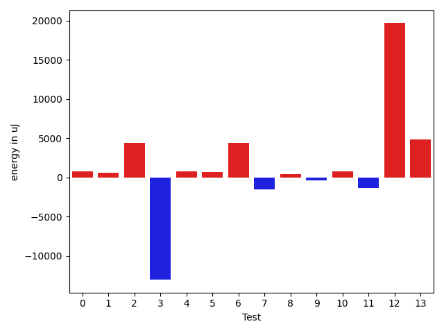

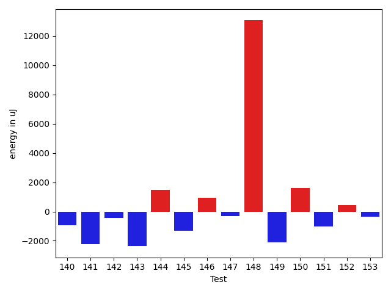

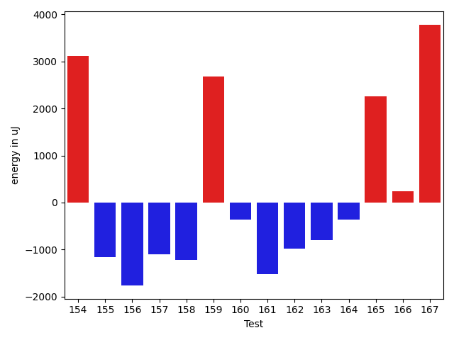

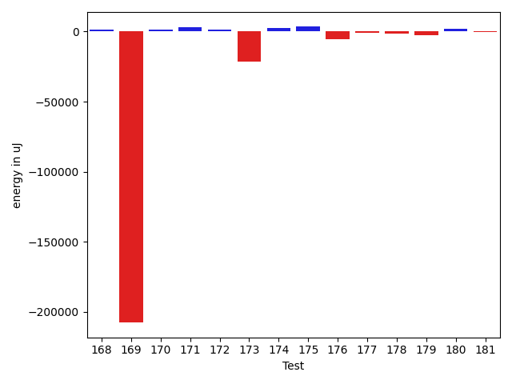

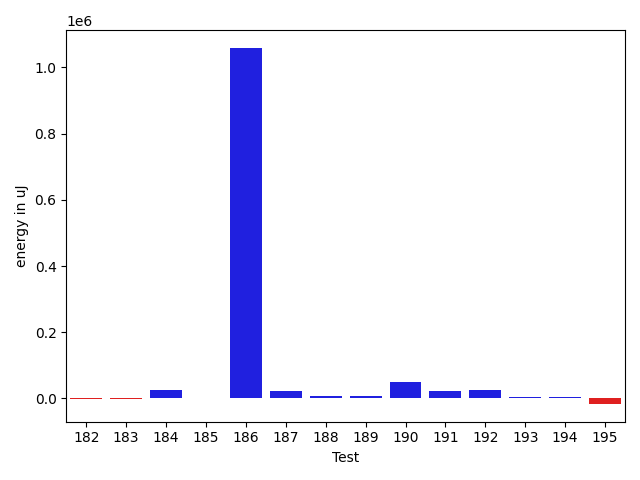

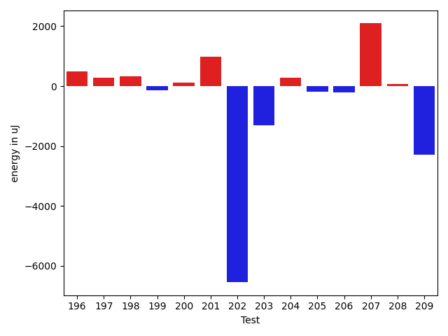

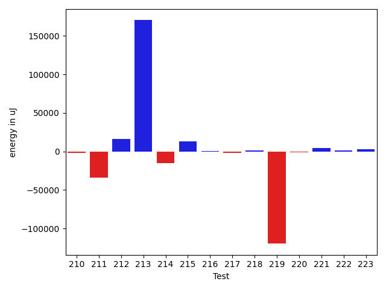

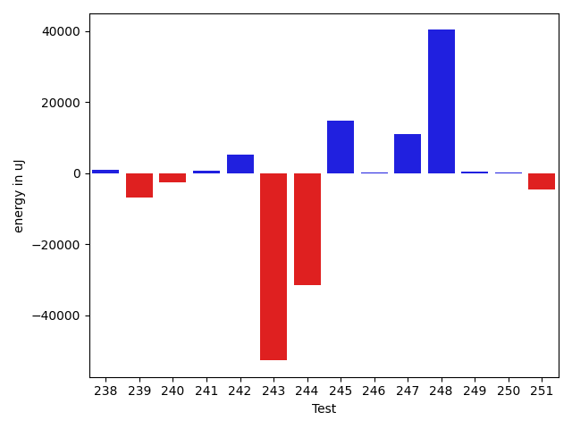

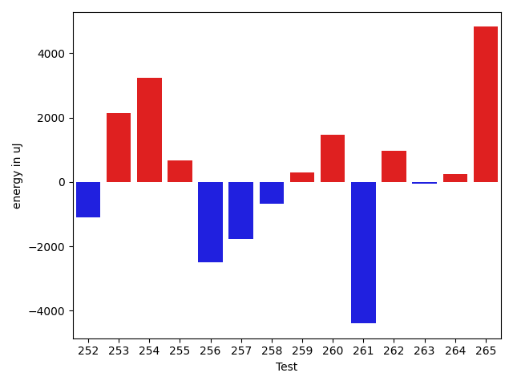

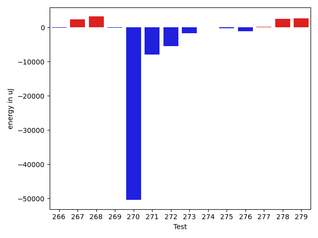

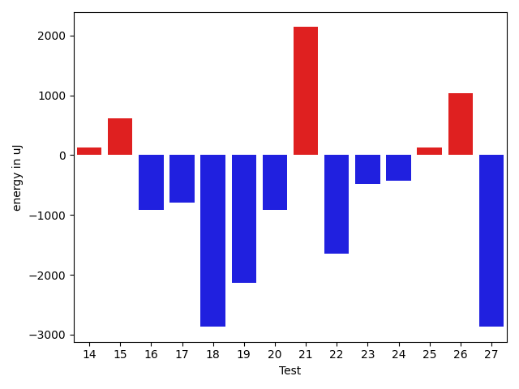

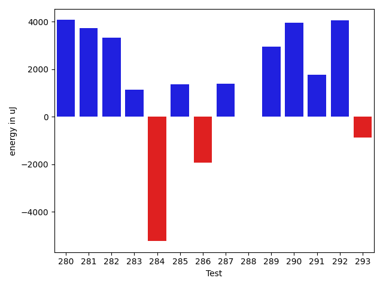

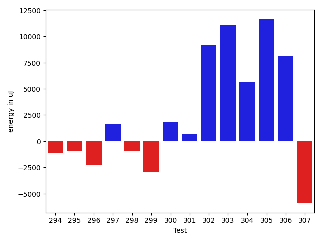

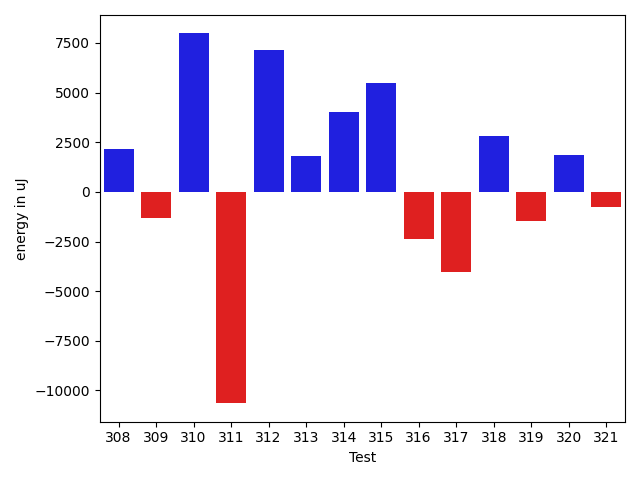

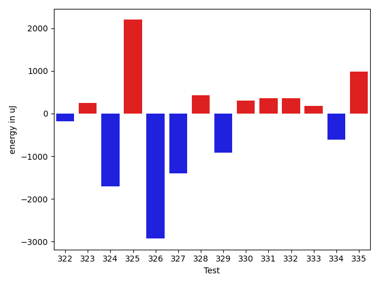

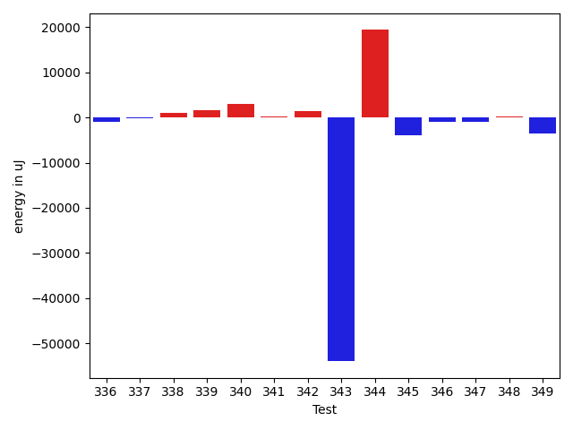

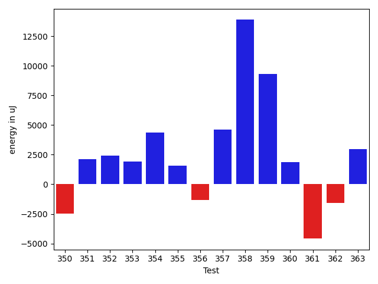

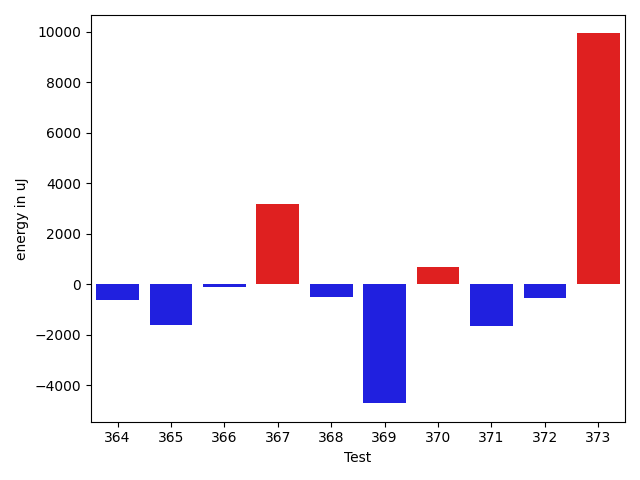

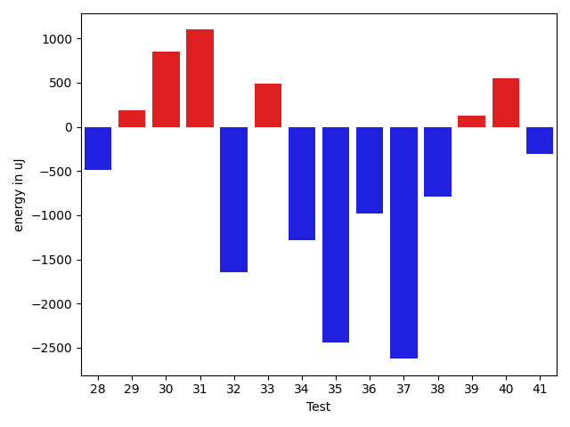

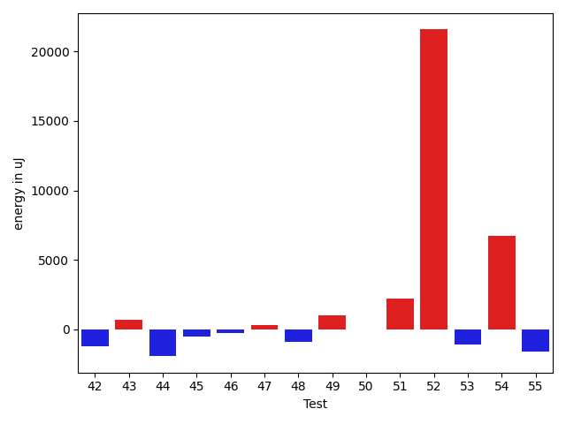

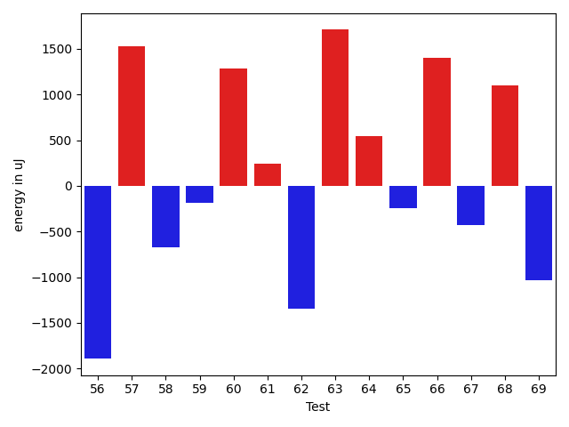

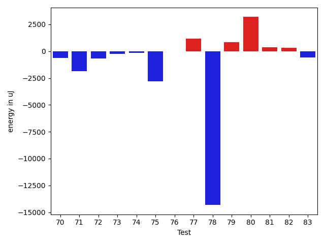

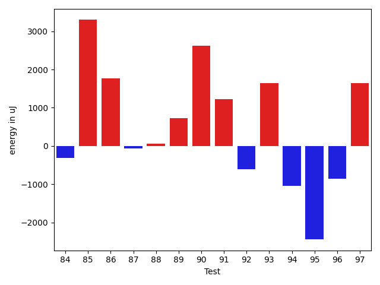

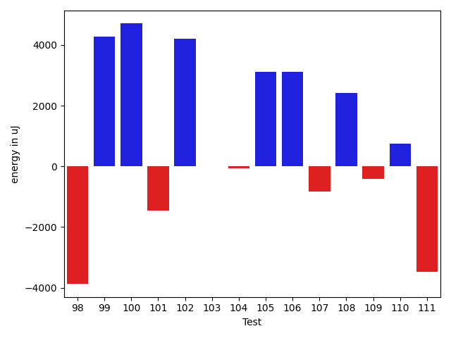

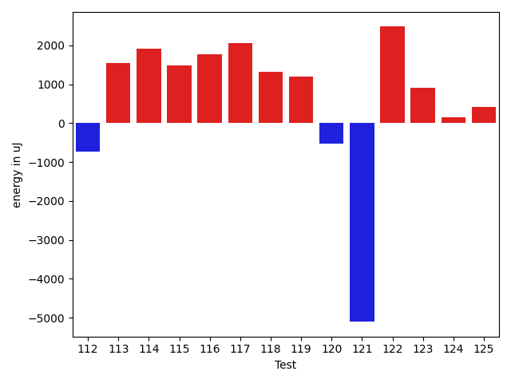

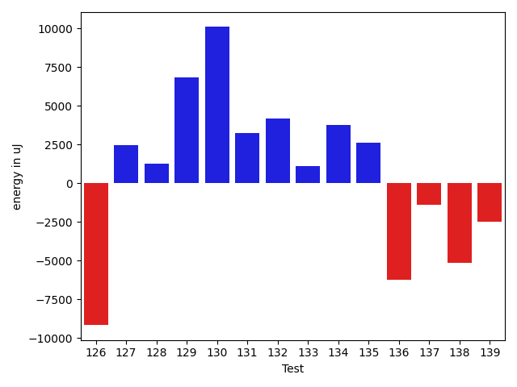

| ID | EnergyV1 | EnergyV2 | DeltaEnergy | σ |
| --- | --- | --- | --- | --- |
| 0 | 36996.147540983606 | 37793.933333333334 | 797.7857923497286 | 5458.637441334291 | 3470.1696830110327 |
| 1 | 37358.83928571428 | 37911.604166666664 | 552.7648809523816 | 7381.515382980037 | 7359.227936576137 |
| 2 | 38371.41509433962 | 42800.439024390245 | 4429.023930050622 | 8947.581698022715 | 33563.58177567072 |
| 3 | 51091.80357142857 | 38022.442307692305 | -13069.361263736268 | 38639.64867132669 | 4134.243751947597 |
| 4 | 36137.48717948718 | 36947.666666666664 | 810.1794871794846 | 4764.747475600978 | 3440.8849845823356 |
| 5 | 36069.52631578947 | 36784.94117647059 | 715.4148606811141 | 4808.7061800967285 | 3617.587905143668 |
| 6 | 36769.622641509435 | 41189.634146341465 | 4420.0115048320295 | 4578.303262482833 | 27840.569218805973 |
| 7 | 45166.84848484849 | 43603.31506849315 | -1563.5334163553343 | 17913.000578758965 | 28911.74476943688 |
| 8 | 36085.59090909091 | 36536.12195121951 | 450.5310421285976 | 4099.560233167931 | 3831.240875181888 |
| 9 | 37536.545454545456 | 37128.1724137931 | -408.3730407523544 | 4665.892445024847 | 4145.933820761682 |
| 10 | 37151.42307692308 | 37935.13333333333 | 783.7102564102534 | 4825.35514175722 | 4974.725732696785 |
| 11 | 38062.346153846156 | 36718.72 | -1343.626153846155 | 4738.174915937957 | 2882.0229772852263 |
| 12 | 48048.09090909091 | 67736.77083333333 | 19688.679924242417 | 17857.094930457526 | 81708.06909108376 |
| 13 | 38124.25714285715 | 42994.575 | 4870.317857142851 | 3786.388979662037 | 46390.107341914765 |
| 14 | 36464.942307692305 | 36582.69642857143 | 117.75412087912264 | 3821.224715139725 | 4098.980787601975 |
| 15 | 40065.026666666665 | 43961.77027027027 | 3896.743603603609 | 10744.231057298712 | 16893.23079412107 |
| 16 | 37048.230769230766 | 36149.5 | -898.7307692307659 | 3494.651462475402 | 4448.337430995989 |
| 17 | 43434.74545454545 | 58799.520833333336 | 15364.775378787883 | 15959.343768940083 | 47030.36243569572 |
| 18 | 37171.795454545456 | 35653.107142857145 | -1518.688311688311 | 3936.6089732358682 | 3169.016964964797 |
| 19 | 37442.416666666664 | 36873.12903225807 | -569.2876344085962 | 4790.489561939944 | 4703.496041840446 |
| 20 | 39429.8431372549 | 39347.228070175435 | -82.61506707946683 | 8085.894084877978 | 8133.703750590499 |
| 21 | 44292.596153846156 | 55153.93220338983 | 10861.336049543672 | 21933.02694240216 | 30454.423347898584 |
| 22 | 44911.206896551725 | 51051.34285714286 | 6140.135960591135 | 14740.97373469097 | 30847.582939295822 |
| 23 | 35898.27272727273 | 35660.807692307695 | -237.46503496503283 | 4945.101747108567 | 3880.662443640169 |
| 24 | 35877.64444444444 | 35922.1 | 44.4555555555562 | 4758.1605556748755 | 3946.2644222099457 |
| 25 | 35546.68571428571 | 35541.44827586207 | -5.237438423639105 | 4275.198426615866 | 3782.57946641421 |
| 26 | 36668.882352941175 | 37369.71666666667 | 700.8343137254924 | 4331.715955994122 | 3915.852636364426 |
| 27 | 37376.86538461538 | 35940.97619047619 | -1435.889194139192 | 4548.4239410221335 | 4584.834303949402 |
| 28 | 43634.5641025641 | 41005.305555555555 | -2629.258547008547 | 15622.770984876239 | 11551.141488373069 |
| 29 | 39776.96341463415 | 37713.62195121951 | -2063.3414634146393 | 11336.298001407262 | 5921.375898202277 |
| 30 | 49353.132352941175 | 57988.15873015873 | 8635.026377217553 | 51280.242263612934 | 88815.08102601352 |
| 31 | 39451.604166666664 | 36927.7 | -2523.904166666667 | 16708.55311502114 | 6534.298088547844 |
| 32 | 36336.21052631579 | 36136.242424242424 | -199.9681020733624 | 4810.501245855822 | 4434.031567459853 |
| 33 | 40857.68965517241 | 39325.472727272725 | -1532.216927899688 | 15123.582299139927 | 10776.975934167238 |
| 34 | 37787.622641509435 | 36221.708333333336 | -1565.9143081760994 | 7152.94713038293 | 3887.294002893343 |
| 35 | 43166.73469387755 | 36102.22222222222 | -7064.512471655333 | 39077.77729917476 | 4583.4620412904715 |
| 36 | 38165.875 | 37260.52272727273 | -905.3522727272721 | 4371.236474695499 | 4516.178696886423 |
| 37 | 38015.45652173913 | 37154.24528301887 | -861.2112387202578 | 4441.8062116691535 | 3988.858336244682 |
| 38 | 45098.92156862745 | 42630.48648648649 | -2468.4350821409607 | 23470.34415384084 | 19163.038675451357 |
| 39 | 37633.59090909091 | 39709.6037735849 | 2076.0128644939905 | 7036.161143384575 | 20921.720559806432 |
| 40 | 36077.68292682927 | 36047.645833333336 | -30.03709349593555 | 4878.038917429053 | 4239.120975556053 |
| 41 | 35037.555555555555 | 35234.166666666664 | 196.6111111111095 | 3965.9421638386984 | 3245.6258127927604 |
| 42 | 40879.166666666664 | 39671.6935483871 | -1207.4731182795658 | 13101.212969501039 | 11540.115981119961 |
| 43 | 36092.11111111111 | 36751.77142857143 | 659.6603174603224 | 4682.212266640263 | 4545.381474393002 |
| 44 | 37539.40909090909 | 35593.862068965514 | -1945.5470219435738 | 5182.684015582264 | 4053.4642206230938 |
| 45 | 37282.91111111111 | 36750.836363636365 | -532.0747474747477 | 4085.737625895026 | 4354.033326650909 |
| 46 | 36322.35135135135 | 36056.475 | -265.87635135135497 | 3602.1569830597723 | 4437.236893538027 |
| 47 | 37167.92405063291 | 37489.58974358974 | 321.6656929568344 | 8175.081440034326 | 6294.50683886436 |
| 48 | 36042.642857142855 | 35134.14 | -908.5028571428556 | 3981.514750165107 | 3820.3555332455644 |
| 49 | 35533.75 | 36508.5 | 974.75 | 3867.3627803711406 | 3719.523264142866 |
| 50 | 36161.55263157895 | 36136.4 | -25.152631578945147 | 4056.92942414495 | 3620.4097337179946 |
| 51 | 112342.59595959596 | 114520.16161616161 | 2177.5656565656536 | 22121.424645849642 | 24973.0815409442 |
| 52 | 320155.69696969696 | 341742.3232323232 | 21586.62626262626 | 246066.73188358435 | 264406.21053617017 |
| 53 | 36260.619047619046 | 35125.75 | -1134.869047619046 | 5535.921366736056 | 4061.969496131156 |
| 54 | 70124.93939393939 | 76878.74747474748 | 6753.808080808085 | 21029.464642444946 | 20961.159418518677 |
| 55 | 36058.958333333336 | 34423.72 | -1635.2383333333346 | 3786.265755763043 | 3283.327696347107 |
| 56 | 34832.230769230766 | 34187.8 | -644.430769230763 | 3894.6065892727984 | 4492.8029291301 |
| 57 | 36356.333333333336 | 37475.53333333333 | 1119.199999999997 | 4580.262289311485 | 3015.946393570166 |
| 58 | 37698.65454545455 | 34692.137931034486 | -3006.516614420063 | 18399.260083164587 | 3865.8230129148346 |
| 59 | 38210.70786516854 | 37410.27272727273 | -800.435137895809 | 9882.131439108962 | 8389.534141264223 |
| 60 | 36016.8 | 36736.444444444445 | 719.6444444444423 | 5366.641292279558 | 4149.126845523876 |
| 61 | 36551.85 | 36672.88333333333 | 121.03333333333285 | 4174.060811827414 | 3671.24879794177 |
| 62 | 36538.875 | 34918.88888888889 | -1619.9861111111095 | 4165.717118261273 | 4057.3709452864086 |
| 63 | 35414.76190476191 | 49959.26666666667 | 14544.504761904762 | 3547.284808799433 | 52316.36207340449 |
| 64 | 37159.58823529412 | 36937.5 | -222.08823529411893 | 3742.802615512221 | 4762.228220591701 |
| 65 | 36655.92857142857 | 36737.333333333336 | 81.40476190476329 | 4516.3881502224085 | 4383.624574789499 |
| 66 | 34707.08928571428 | 35529.66 | 822.5707142857209 | 4720.882424613862 | 3796.519219548348 |
| 67 | 36801.72 | 34440.8 | -2360.9199999999983 | 9809.375884407733 | 3328.237239140263 |
| 68 | 34584.31578947369 | 37019.47368421053 | 2435.15789473684 | 4063.451320874795 | 4445.627838774454 |
| 69 | 36669.07142857143 | 36027.27272727273 | -641.7987012986996 | 4751.34446332653 | 3613.5875925811183 |
| 70 | 35635.07692307692 | 35008.54838709677 | -626.5285359801492 | 3904.73642292849 | 3016.952434095402 |
| 71 | 36645.5 | 34794.46153846154 | -1851.038461538461 | 3180.389197881291 | 2815.431832306878 |
| 72 | 35845.0 | 35180.53333333333 | -664.4666666666672 | 4511.556874136846 | 3716.1883674300234 |
| 73 | 35441.03333333333 | 35174.433333333334 | -266.59999999999854 | 4045.162143296058 | 3520.9063481186517 |
| 74 | 35457.07142857143 | 35296.041666666664 | -161.0297619047633 | 3671.679334821479 | 3328.224795582557 |
| 75 | 37664.52380952381 | 34861.166666666664 | -2803.357142857145 | 3200.07480000446 | 2832.376353092144 |
| 76 | 36646.17647058824 | 36649.46666666667 | 3.2901960784292896 | 3089.4839895683726 | 3785.2442786283805 |
| 77 | 35165.307692307695 | 36346.307692307695 | 1181.0 | 2985.7935779187465 | 4236.679412439297 |
| 78 | 50148.92857142857 | 35830.88888888889 | -14318.039682539682 | 51122.17168769658 | 2750.9893349461854 |
| 79 | 36350.04878048781 | 37200.84090909091 | 850.7921286031051 | 4028.1766616091522 | 4067.9464103423675 |
| 80 | 33630.3125 | 36810.15 | 3179.8375000000015 | 3747.5890536241764 | 3324.6990431466124 |
| 81 | 35400.333333333336 | 35778.76 | 378.4266666666663 | 3766.285237324556 | 2996.0931264565193 |
| 82 | 35844.13636363636 | 36139.59259259259 | 295.4562289562309 | 3459.481967203321 | 3413.1222727634613 |
| 83 | 35049.3125 | 34480.07692307692 | -569.235576923078 | 4932.712396830343 | 3128.3496868658412 |
| 84 | 227862.101010101 | 217653.8282828283 | -10208.272727272706 | 138910.87707224258 | 136755.78832755756 |
| 85 | 113655.67676767676 | 112544.25252525252 | -1111.4242424242402 | 37082.91315113079 | 34224.69990670346 |
| 86 | 48303.769230769234 | 60762.46666666667 | 12458.697435897433 | 23489.563272688094 | 39390.55024472522 |
| 87 | 41754.1282051282 | 41771.93939393939 | 17.811188811188913 | 2564.2388002268985 | 2586.607675905679 |
| 88 | 131950.96296296295 | 38004.375 | -93946.58796296295 | 332633.49725146353 | 4640.1876292209345 |
| 89 | 37613.833333333336 | 37330.6875 | -283.14583333333576 | 4805.576754031599 | 3437.511849411395 |
| 90 | 35920.54761904762 | 37685.4 | 1764.852380952383 | 3812.83941941024 | 6537.9446984507285 |
| 91 | 36738.91111111111 | 41961.575 | 5222.663888888885 | 3706.363056044277 | 30796.475136683657 |
| 92 | 41468.75409836065 | 42933.57377049181 | 1464.8196721311542 | 13192.874273458006 | 14291.725529312878 |
| 93 | 42428.92134831461 | 44461.967391304344 | 2033.0460429897357 | 15456.044151529803 | 14682.466877827512 |
| 94 | 41035.92424242424 | 38088.05263157895 | -2947.8716108452936 | 16646.10454413466 | 11202.05444412585 |
| 95 | 36939.897959183676 | 35850.64444444444 | -1089.2535147392337 | 4365.234679363093 | 4509.34800488228 |
| 96 | 35504.95238095238 | 36435.416666666664 | 930.4642857142826 | 4792.181832111354 | 4693.320887323696 |
| 97 | 39141.333333333336 | 37024.391304347824 | -2116.9420289855116 | 15651.542074363011 | 3816.489899269842 |
| 98 | 36165.15625 | 36056.333333333336 | -108.82291666666424 | 4671.529982975164 | 4046.716793346868 |
| 99 | 36515.12244897959 | 38322.181818181816 | 1807.059369202223 | 5455.450487890306 | 6348.938273704178 |
| 100 | 37621.651162790695 | 36249.350877192985 | -1372.3002855977102 | 3944.4759246537515 | 3424.805562370379 |
| 101 | 35997.67213114754 | 37069.30909090909 | 1071.6369597615485 | 4442.726189049092 | 4152.583169208063 |
| 102 | 36037.64705882353 | 37380.382352941175 | 1342.7352941176432 | 4274.29878585092 | 3830.292301967581 |
| 103 | 39773.09210526316 | 37867.42168674699 | -1905.6704185161725 | 12083.925683556943 | 7935.4539337982 |
| 104 | 52421.18823529412 | 54870.44565217391 | 2449.2574168797946 | 30707.926195995155 | 37748.135345069095 |
| 105 | 40187.893939393936 | 43459.10344827586 | 3271.209508881926 | 11878.163588969757 | 12948.82153829752 |
| 106 | 36221.339622641506 | 37915.98181818182 | 1694.642195540313 | 4439.638196814997 | 3620.4162869176407 |
| 107 | 36829.30434782609 | 36069.104166666664 | -760.2001811594237 | 4800.658514020964 | 3730.340635918206 |
| 108 | 63858.72527472527 | 55149.13043478261 | -8709.594839942663 | 51587.070376862684 | 23795.491678054856 |
| 109 | 36546.65625 | 38207.82142857143 | 1661.1651785714275 | 3652.6097058248556 | 4007.2916312781936 |
| 110 | 38523.53448275862 | 38441.745762711864 | -81.78872004675941 | 9655.543719784659 | 8020.997470819251 |
| 111 | 40022.10769230769 | 39359.60655737705 | -662.5011349306442 | 11676.289949654487 | 11020.067182084767 |
| 112 | 37043.72222222222 | 36320.377358490565 | -723.3448637316542 | 3625.9627197561936 | 3476.6279218025584 |
| 113 | 37531.7 | 39087.25925925926 | 1555.5592592592657 | 7467.14194923332 | 11948.470675711606 |
| 114 | 35074.805555555555 | 37002.12195121951 | 1927.3163956639546 | 4102.427965509128 | 3807.5309597583237 |
| 115 | 35383.04347826087 | 36871.60526315789 | 1488.5617848970214 | 3809.5925318830627 | 3838.8812620583653 |
| 116 | 35555.565217391304 | 37331.170731707316 | 1775.605514316012 | 3952.360030534172 | 4639.099375916749 |
| 117 | 35674.333333333336 | 37739.5 | 2065.1666666666642 | 4174.481780213364 | 4716.186746352459 |
| 118 | 35350.13333333333 | 36682.983606557376 | 1332.850273224045 | 4649.814799657199 | 3654.7668423392483 |
| 119 | 35941.57894736842 | 37140.46511627907 | 1198.8861689106488 | 4767.8278880516555 | 3867.0602700894196 |
| 120 | 37091.318181818184 | 36569.239130434784 | -522.0790513833999 | 4094.7408829815267 | 4028.9334988888577 |
| 121 | 44821.35555555556 | 39718.27659574468 | -5103.078959810875 | 31212.775734130657 | 9599.22712026721 |
| 122 | 35156.09090909091 | 37638.166666666664 | 2482.0757575757525 | 4492.22891537143 | 3772.8282089759196 |
| 123 | 36487.555555555555 | 37407.08 | 919.524444444447 | 3780.8647828470193 | 3457.4616864977697 |
| 124 | 36208.954545454544 | 36361.625 | 152.67045454545587 | 4512.081670131192 | 4961.650857766495 |
| 125 | 35767.84782608696 | 36184.256410256414 | 416.4085841694541 | 4465.49074652248 | 3932.65420072232 |
| 126 | 40656.642857142855 | 37058.26530612245 | -3598.377551020407 | 31155.423981510623 | 3279.0564706598034 |
| 127 | 35396.2 | 37094.882352941175 | 1698.6823529411777 | 4331.83750387754 | 3824.578052580025 |
| 128 | 33952.57142857143 | 36901.37037037037 | 2948.7989417989447 | 3457.767667859997 | 3934.0846000821543 |
| 129 | 36237.28571428572 | 38164.380952380954 | 1927.0952380952367 | 4319.849508433159 | 4052.882013676199 |
| 130 | 47251.21428571428 | 88827.45454545454 | 41576.24025974026 | 21358.076763264762 | 61799.85955302153 |
| 131 | 37959.75 | 39240.086956521736 | 1280.3369565217363 | 6620.555157733444 | 6743.127402500387 |
| 132 | 92487.79797979798 | 40604.17808219178 | -51883.6198976062 | 67783.8591720936 | 12042.781362330277 |
| 133 | 37141.490909090906 | 39322.181818181816 | 2180.6909090909103 | 3727.453236693324 | 6120.804982979725 |
| 134 | 39129.41935483871 | 42017.92307692308 | 2888.503722084366 | 15600.66127170461 | 16908.364787931892 |
| 135 | 86973.67676767676 | 107620.32978723405 | 20646.653019557285 | 50095.82965381052 | 64016.417813961336 |
| 136 | 49761.9 | 43552.25 | -6209.6500000000015 | 31954.689188860324 | 17115.93182352337 |
| 137 | 37099.6 | 34624.92592592593 | -2474.6740740740715 | 9064.044121693141 | 4356.940482136909 |
| 138 | 35879.80952380953 | 36201.375 | 321.5654761904734 | 3266.6399457466064 | 4286.435677542395 |
| 139 | 39131.125 | 36149.36363636364 | -2981.7613636363603 | 1517.713777157933 | 3823.3107802419163 |
| 140 | 42580.0350877193 | 41636.05 | -943.9850877192948 | 21737.796003424268 | 15839.921867889161 |
| 141 | 39618.95238095238 | 37397.583333333336 | -2221.369047619046 | 4282.5584528987265 | 4450.32361729022 |
| 142 | 37635.0 | 37211.0 | -424.0 | 4402.210729587159 | 4791.981696890477 |
| 143 | 39788.775 | 37421.71428571428 | -2367.060714285719 | 9961.230397113352 | 3972.2471886692997 |
| 144 | 36931.90909090909 | 38419.07692307692 | 1487.1678321678337 | 1897.7972137356537 | 3880.146616213569 |
| 145 | 37341.80952380953 | 36018.125 | -1323.6845238095266 | 3545.157926753558 | 3781.005915675748 |
| 146 | 36031.18518518518 | 36980.17647058824 | 948.9912854030554 | 3280.1390557361597 | 4430.506374396048 |
| 147 | 36755.84210526316 | 36452.294117647056 | -303.54798761610436 | 4669.060440401461 | 4300.233601926978 |
| 148 | 38042.142857142855 | 51101.5 | 13059.357142857145 | 3138.4110369316977 | 54751.78384765194 |
| 149 | 38977.5 | 36868.09523809524 | -2109.4047619047633 | 5098.965540512441 | 4842.886957814296 |
| 150 | 36405.333333333336 | 38028.933333333334 | 1623.5999999999985 | 4619.761619631712 | 4157.076672641752 |
| 151 | 37860.06 | 36858.57142857143 | -1001.4885714285701 | 7801.567374342159 | 6418.940761130139 |
| 152 | 38782.35294117647 | 39239.0 | 456.64705882353155 | 4009.6438589271897 | 4116.469424921773 |
| 153 | 37231.26666666667 | 36871.73684210526 | -359.52982456141035 | 3137.5142914238477 | 4429.697789883108 |
| 154 | 37645.42857142857 | 38937.42857142857 | 1292.0 | 4264.8316113850715 | 3683.124677193959 |
| 155 | 37390.77777777778 | 36599.470588235294 | -791.3071895424873 | 3032.6266311484196 | 3366.4515113909947 |
| 156 | 37533.26315789474 | 35492.0625 | -2041.2006578947403 | 3736.7084423834162 | 4133.338216090446 |
| 157 | 35710.153846153844 | 34707.294117647056 | -1002.8597285067881 | 2785.4244213585466 | 3159.163976614995 |
| 158 | 37275.21428571428 | 35513.71428571428 | -1761.5 | 3739.6176882245104 | 2713.1878832465545 |
| 159 | 35698.77777777778 | 37100.5 | 1401.722222222219 | 3537.9673316052786 | 5025.3356213434 |
| 160 | 37461.46153846154 | 36980.117647058825 | -481.3438914027138 | 3805.169047399858 | 4004.7694342437853 |
| 161 | 37192.545454545456 | 35790.8 | -1401.745454545453 | 3645.047558328881 | 3616.1590894207075 |
| 162 | 37877.25 | 37632.0625 | -245.1875 | 3664.746560700571 | 4085.2701787756646 |
| 163 | 36636.5 | 36042.63157894737 | -593.8684210526335 | 5572.944621113689 | 4813.548403484376 |
| 164 | 35876.4 | 35722.857142857145 | -153.54285714285652 | 3824.33942531256 | 4573.401951300942 |
| 165 | 35117.9375 | 46718.625 | 11600.6875 | 4023.7566009382017 | 38741.24018225765 |
| 166 | 37059.36363636364 | 37590.77777777778 | 531.4141414141413 | 3410.5925444315735 | 2009.7726116696097 |
| 167 | 34979.88888888889 | 37971.4375 | 2991.5486111111095 | 4414.719682668789 | 5384.878387307716 |
| 168 | 36926.307692307695 | 36526.055555555555 | -400.25213675214036 | 4115.732543164571 | 3767.7641243731778 |
| 169 | 33349.8 | 36814.82352941176 | 3465.0235294117592 | 3395.319507793044 | 4139.629057483776 |
| 170 | 66994.95588235294 | 115060.43103448275 | 48065.47515212982 | 68129.37864685745 | 311909.6747170682 |
| 171 | 39436.25 | 38293.41333333333 | -1142.8366666666698 | 10612.694805632545 | 8025.219902438119 |
| 172 | 38533.13924050633 | 38117.11842105263 | -416.0208194536972 | 10208.954636890126 | 9117.837451315308 |
| 173 | 70346.19191919192 | 68915.898989899 | -1430.2929292929184 | 34989.07135285079 | 31803.129658742815 |
| 174 | 40256.895348837206 | 38866.57317073171 | -1390.3221781054963 | 11838.76629044369 | 9855.095020059529 |
| 175 | 53688.88461538462 | 56076.307692307695 | 2387.423076923078 | 45752.77395176778 | 55221.33632641061 |
| 176 | 43076.35294117647 | 40276.83908045977 | -2799.5138607166955 | 15324.753397655764 | 12511.575984115223 |
| 177 | 40159.443037974685 | 38520.08860759494 | -1639.3544303797462 | 10234.243883502508 | 8689.79893897112 |
| 178 | 38303.166666666664 | 43642.52702702703 | 5339.360360360362 | 8482.54779583268 | 32301.36617319266 |
| 179 | 37870.17857142857 | 36950.0 | -920.1785714285725 | 9730.417101445973 | 4028.280791961862 |
| 180 | 40849.68656716418 | 43905.9552238806 | 3056.26865671642 | 11222.941537427081 | 35773.82038541793 |
| 181 | 37991.807692307695 | 38229.12 | 237.3123076923075 | 7539.993698660381 | 8712.712237430243 |
| 182 | 36432.204545454544 | 36717.07407407407 | 284.86952861952886 | 4120.843275237515 | 4058.66697625497 |
| 183 | 37694.08108108108 | 37225.70769230769 | -468.3733887733906 | 6839.780877549026 | 6990.557481286567 |
| 184 | 36547.333333333336 | 36756.142857142855 | 208.8095238095193 | 4109.5817513392 | 4294.6533901464745 |
| 185 | 53305.131313131315 | 52298.43434343435 | -1006.6969696969682 | 19174.20197891457 | 19854.718232301188 |
| 186 | 106935.32258064517 | 62154.6875 | -44780.63508064517 | 138807.15248057974 | 91538.85817319519 |
| 187 | 38280.57142857143 | 36753.375 | -1527.1964285714275 | 3756.994018417087 | 3954.615097289284 |
| 188 | 38139.4081632653 | 37842.833333333336 | -296.57482993196754 | 7806.84172185766 | 3610.9085178212526 |
| 189 | 37840.549019607846 | 37554.11538461538 | -286.43363499246334 | 5948.600053839411 | 6525.987121483104 |
| 190 | 293133.243902439 | 282722.5375 | -10410.706402439042 | 226527.26225650703 | 227395.9674491801 |
| 191 | 41808.95918367347 | 37926.10638297872 | -3882.8528006947454 | 14264.816803846925 | 6817.014718301092 |
| 192 | 36297.395348837206 | 38738.09375 | 2440.6984011627937 | 4069.7065212716125 | 8510.23419316184 |
| 193 | 35932.40625 | 36311.8064516129 | 379.4002016129016 | 3583.5582688454974 | 4461.044405556335 |
| 194 | 36714.425531914894 | 36943.84444444445 | 229.41891252955247 | 4258.774914969022 | 3649.699500297132 |
| 195 | 38299.4 | 38101.62962962963 | -197.7703703703737 | 3403.879513143789 | 3600.457328442722 |
| 196 | 37411.529411764706 | 37908.81481481482 | 497.2854030501112 | 6863.3611463775915 | 8311.095511142683 |
| 197 | 36831.333333333336 | 37101.217391304344 | 269.8840579710086 | 3724.2158011228803 | 3727.258007850925 |
| 198 | 35830.89473684211 | 36167.94736842105 | 337.0526315789466 | 3084.3744208294547 | 2881.0587869864826 |
| 199 | 36386.64 | 36243.69696969697 | -142.94303030303126 | 3123.2130363457436 | 4338.675565855137 |
| 200 | 37133.260869565216 | 37253.89473684211 | 120.63386727689067 | 4580.507065317695 | 5468.461487617084 |
| 201 | 36379.76190476191 | 37371.03571428572 | 991.2738095238092 | 3492.616087374455 | 3609.5730701461757 |
| 202 | 43644.653846153844 | 37092.72727272727 | -6551.926573426572 | 39173.31817404282 | 4447.4283190280385 |
| 203 | 37666.72727272727 | 36364.083333333336 | -1302.6439393939363 | 3796.924187978501 | 4249.6819088478715 |
| 204 | 36739.94736842105 | 37022.75 | 282.8026315789466 | 3521.436361750911 | 3637.3126326314045 |
| 205 | 35630.46153846154 | 35432.933333333334 | -197.52820512820472 | 4957.111684087893 | 5517.9355978683025 |
| 206 | 36706.84375 | 36498.94117647059 | -207.90257352941262 | 2941.9994275723334 | 3446.9578995464503 |
| 207 | 34931.36363636364 | 37025.0 | 2093.6363636363603 | 4155.269672306092 | 3556.7942268865922 |
| 208 | 37073.35294117647 | 37152.35294117647 | 79.0 | 3464.7523795941197 | 3717.5232732556274 |
| 209 | 37172.46428571428 | 34876.0 | -2296.4642857142826 | 3273.5828829558654 | 3924.863101260522 |
| 210 | 37472.55 | 34950.125 | -2522.425000000003 | 3598.7128876169045 | 3881.6244163204406 |
| 211 | 36119.2962962963 | 35941.318181818184 | -177.97811447811546 | 3383.342220183346 | 3149.389253726443 |
| 212 | 35281.76470588235 | 36815.80952380953 | 1534.044817927177 | 2939.555599254293 | 4853.03824932723 |
| 213 | 75380.83333333333 | 76674.15151515152 | 1293.318181818191 | 32561.755174676236 | 25912.898648958293 |
| 214 | 47436.30263157895 | 40792.92957746479 | -6643.373054114156 | 23095.394303911573 | 11973.752652051297 |
| 215 | 40339.0 | 39349.42592592593 | -989.574074074073 | 12782.403503333553 | 6671.254584108938 |
| 216 | 40282.05172413793 | 40903.59259259259 | 621.5408684546637 | 10482.034165940564 | 12710.016588733119 |
| 217 | 38033.06779661017 | 39471.94545454546 | 1438.8776579352852 | 4891.894883858979 | 21614.562191783563 |
| 218 | 74910.87142857142 | 65822.65151515152 | -9088.219913419904 | 53439.56786125572 | 46767.06812895756 |
| 219 | 47746.15151515151 | 38412.30434782609 | -9333.847167325424 | 39400.5574557712 | 3983.5518391503947 |
| 220 | 39605.76190476191 | 46390.96428571428 | 6785.202380952374 | 4656.597448830371 | 23987.19716325199 |
| 221 | 41367.53333333333 | 37047.1 | -4320.433333333334 | 12454.8720045165 | 4366.376645457878 |
| 222 | 58859.75 | 42265.68965517241 | -16594.060344827587 | 44212.55592235649 | 16316.375436549773 |
| 223 | 41000.11392405063 | 38863.13888888889 | -2136.9750351617404 | 15484.799375383658 | 8237.123387623382 |
| 224 | 36539.60784313725 | 37540.018867924526 | 1000.4110247872741 | 4208.483179215808 | 3833.172012692528 |
| 225 | 64263.03703703704 | 55480.6 | -8782.437037037038 | 46596.15005911928 | 29665.97304612362 |
| 226 | 36464.625 | 36145.642857142855 | -318.98214285714494 | 4956.335489489689 | 3409.6326699334563 |
| 227 | 37157.13043478261 | 35518.625 | -1638.505434782608 | 5005.605799278383 | 4541.352027136302 |
| 228 | 50851.104166666664 | 47149.65217391304 | -3701.451992753624 | 19604.033657259995 | 17141.161235100513 |
| 229 | 37801.066666666666 | 36846.1875 | -954.8791666666657 | 4890.721520957369 | 3359.1912385786777 |
| 230 | 37077.0 | 38146.857142857145 | 1069.857142857145 | 4642.080922831661 | 2575.2332725722667 |
| 231 | 37545.28571428572 | 37942.45 | 397.1642857142797 | 6453.018434683675 | 4037.157434074128 |
| 232 | 39140.95238095238 | 39202.0 | 61.047619047618355 | 4881.1224067947105 | 4333.314545746818 |
| 233 | 39489.53846153846 | 38379.625 | -1109.913461538461 | 3232.104377964791 | 3460.43102219579 |
| 234 | 36447.230769230766 | 38409.769230769234 | 1962.5384615384683 | 4986.652648726724 | 3561.9810208505337 |
| 235 | 36095.444444444445 | 37463.4 | 1367.9555555555562 | 4297.868091950063 | 2741.849832989886 |
| 236 | 38155.57142857143 | 35908.944444444445 | -2246.6269841269823 | 4936.847862384107 | 4169.671442854703 |
| 237 | 38217.269230769234 | 37808.40909090909 | -408.86013986014586 | 3685.102227552825 | 3988.479872868985 |
| 238 | 48505.07526881721 | 59137.865979381444 | 10632.790710564237 | 39358.628102248535 | 64946.10689595492 |
| 239 | 101805.12121212122 | 152183.0404040404 | 50377.91919191918 | 247824.43355894834 | 391546.5032692311 |
| 240 | 40688.57142857143 | 44936.59459459459 | 4248.023166023166 | 11678.396385028658 | 15030.276141498549 |
| 241 | 37527.57377049181 | 39634.07692307692 | 2106.5031525851155 | 4260.1704863099985 | 8836.838663855186 |
| 242 | 47875.096774193546 | 55043.86842105263 | 7168.771646859088 | 30704.672845334502 | 54810.16952756652 |
| 243 | 37220.760869565216 | 36697.55319148936 | -523.207678075858 | 5576.824966204892 | 7416.171759494221 |
| 244 | 66563.61111111111 | 61814.725 | -4748.886111111111 | 63587.901900212026 | 63406.166014429335 |
| 245 | 44022.83050847457 | 41265.08955223881 | -2757.7409562357643 | 30963.740627808325 | 11938.343890911001 |
| 246 | 40801.13333333333 | 37914.75 | -2886.3833333333314 | 10371.549393734122 | 7831.652834240766 |
| 247 | 36827.31034482759 | 37265.97297297297 | 438.6626281453864 | 3642.638964792424 | 3547.7819144901023 |
| 248 | 36879.84 | 38074.23809523809 | 1194.3980952380953 | 4208.26354383848 | 4088.4216526646715 |
| 249 | 36023.86956521739 | 39325.818181818184 | 3301.948616600792 | 4278.915885700468 | 4499.620172216192 |
| 250 | 36602.86486486487 | 45410.04651162791 | 8807.181646763041 | 4237.970505886694 | 45767.45502827612 |
| 251 | 63269.15151515151 | 57787.885714285716 | -5481.265800865796 | 52489.79193636129 | 55264.19363735383 |
| 252 | 44354.58823529412 | 40273.42105263158 | -4081.167182662539 | 10477.810975124996 | 7468.930222248696 |
| 253 | 88156.48 | 77299.38095238095 | -10857.099047619049 | 119245.23132104531 | 119381.60074135865 |
| 254 | 36832.083333333336 | 43579.142857142855 | 6747.059523809519 | 5010.309645426673 | 9871.62263057823 |
| 255 | 84591.96 | 64016.05263157895 | -20575.90736842106 | 109203.74549271833 | 74923.58704108135 |
| 256 | 129178.64516129032 | 110322.07692307692 | -18856.568238213396 | 311287.10301409266 | 289580.9617716505 |
| 257 | 46438.897959183676 | 47787.98039215686 | 1349.082432973184 | 19325.26312437485 | 28324.71988438769 |
| 258 | 38233.58 | 38048.82142857143 | -184.75857142857421 | 4776.108772170081 | 4375.770732548328 |
| 259 | 45134.454545454544 | 48939.42857142857 | 3804.9740259740283 | 15283.441643496273 | 18426.049599323633 |
| 260 | 38018.257575757576 | 39218.95652173913 | 1200.6989459815522 | 8044.485843996545 | 8693.894193310984 |
| 261 | 114640.37373737374 | 107218.76767676767 | -7421.606060606064 | 175237.58864920388 | 174985.41135040738 |
| 262 | 40053.194805194806 | 39789.90666666667 | -263.2881385281362 | 10230.678988827698 | 10872.81611380521 |
| 263 | 51221.257575757576 | 51122.666666666664 | -98.59090909091174 | 30282.049013130778 | 31566.01812038713 |
| 264 | 37257.913043478264 | 37615.703125 | 357.7900815217363 | 4692.258325725163 | 6785.550568763027 |
| 265 | 36720.05405405405 | 38775.22222222222 | 2055.1681681681657 | 3831.0385787241503 | 4687.304929932853 |
| 266 | 49621.40625 | 45485.11538461538 | -4136.290865384617 | 24483.80572038814 | 24190.51768029226 |
| 267 | 36256.27906976744 | 39175.71428571428 | 2919.43521594684 | 3434.065732772712 | 8306.83699555663 |
| 268 | 36642.529411764706 | 37648.5 | 1005.9705882352937 | 3637.0636041867147 | 4307.787318720985 |
| 269 | 36827.0 | 37816.416666666664 | 989.4166666666642 | 3130.176219746528 | 3807.9547651010193 |
| 270 | 1854846.2727272727 | 1854771.0404040404 | -75.2323232323397 | 202092.46947799294 | 220258.49418280134 |
| 271 | 347681.8585858586 | 343295.2525252525 | -4386.606060606078 | 52808.97188275241 | 46475.96619962576 |
| 272 | 50262.61616161616 | 47912.48484848485 | -2350.1313131313145 | 19781.430366574044 | 18467.975310465208 |
| 273 | 43355.89655172414 | 42001.93548387097 | -1353.961067853168 | 19802.25375947939 | 16041.8982163251 |
| 274 | 40852.65217391304 | 44589.58823529412 | 3736.9360613810786 | 15903.413667663119 | 19132.638474787538 |
| 275 | 36165.78 | 36610.55319148936 | 444.7731914893593 | 3961.2663444408786 | 4935.2931741950015 |
| 276 | 42306.565217391304 | 38790.698113207545 | -3515.867104183759 | 18363.34143915437 | 10707.503966465914 |
| 277 | 37123.913043478264 | 37883.854545454546 | 759.9415019762819 | 4704.108485633859 | 6229.035379628307 |
| 278 | 37910.0 | 39794.875 | 1884.875 | 3871.4431417754286 | 4549.080743334306 |
| 279 | 38700.642857142855 | 39001.3 | 300.65714285714785 | 6325.943087309397 | 4247.640805199988 |
| 280 | 332683.31313131313 | 323822.10101010103 | -8861.212121212098 | 123899.45647345307 | 128457.66709529469 |
| 281 | 42861.666666666664 | 39516.63461538462 | -3345.032051282047 | 15247.545791591074 | 8418.741553656539 |
| 282 | 58576.38383838384 | 67888.80808080808 | 9312.424242424247 | 26292.950420450426 | 37466.80252069535 |
| 283 | 38157.066666666666 | 40937.41379310345 | 2780.3471264367836 | 5510.168986721026 | 4969.366000755521 |
| 284 | 40217.96666666667 | 42298.311475409835 | 2080.344808743168 | 11900.831126391504 | 18684.890357983597 |
| 285 | 43166.218181818185 | 48111.95238095238 | 4945.734199134196 | 18566.655941808356 | 27215.988902084147 |
| 286 | 41885.74137931035 | 53108.125 | 11222.383620689652 | 16353.001461885387 | 40651.79732103863 |
| 287 | 37976.67307692308 | 37285.49056603773 | -691.1825108853445 | 3750.8215598573242 | 5847.396910358445 |
| 288 | 38146.86666666667 | 36717.0 | -1429.8666666666686 | 4158.645199260612 | 4584.453631048971 |
| 289 | 44881.166666666664 | 35873.96 | -9007.206666666665 | 39147.20662412867 | 3642.6728151729467 |
| 290 | 47560.71428571428 | 46648.171428571426 | -912.5428571428565 | 33971.76144716563 | 25894.876078357076 |
| 291 | 39105.40540540541 | 42169.57575757576 | 3064.170352170353 | 4126.270375778208 | 17171.282972187244 |
| 292 | 42155.92105263158 | 37920.0 | -4235.92105263158 | 12207.270757047727 | 6247.3463466499115 |
| 293 | 38680.217391304344 | 37743.0 | -937.2173913043443 | 4143.611593730467 | 4865.8737692691475 |
| 294 | 118733.92929292929 | 135768.91919191918 | 17034.989898989894 | 52491.36301023025 | 188287.228577156 |
| 295 | 38383.8 | 37368.311111111114 | -1015.488888888889 | 4099.612537789395 | 3568.4341528477 |
| 296 | 38577.878787878784 | 38136.225 | -441.6537878787858 | 3345.4185656277778 | 4745.582142832953 |
| 297 | 38378.25 | 37780.53846153846 | -597.711538461539 | 5704.768029537514 | 3739.0934445373578 |
| 298 | 36452.17647058824 | 36525.8125 | 73.63602941176214 | 4403.348875776175 | 4575.4650476584075 |
| 299 | 47119.0 | 46520.09375 | -598.90625 | 38756.69106102842 | 26961.728549880867 |
| 300 | 41898.556962025315 | 48401.76470588235 | 6503.207743857034 | 16803.296951767737 | 31854.97658743157 |
| 301 | 47352.641975308645 | 59766.70930232558 | 12414.067327016935 | 21935.719875963874 | 71113.97053761517 |
| 302 | 159321.70707070708 | 169502.21212121213 | 10180.505050505046 | 75491.39758929421 | 95043.30306518634 |
| 303 | 52985.08219178082 | 49285.75 | -3699.3321917808207 | 38595.72040572738 | 31284.175378806845 |
| 304 | 75003.37142857142 | 72318.9696969697 | -2684.401731601727 | 103468.06575863622 | 89666.67298743411 |
| 305 | 62790.945054945056 | 63482.06976744186 | 691.1247124968068 | 161292.26344740158 | 166359.30632280372 |
| 306 | 37423.692307692305 | 37370.95238095238 | -52.73992673992325 | 4684.768517138451 | 4226.98441958883 |
| 307 | 37540.642857142855 | 36538.28571428572 | -1002.3571428571377 | 5287.793782546242 | 4438.247843278623 |
| 308 | 36647.19047619047 | 35606.769230769234 | -1040.4212454212393 | 4106.905898478429 | 4922.553217336994 |
| 309 | 38101.25 | 34897.61538461538 | -3203.634615384617 | 3328.4861517662953 | 3846.5605123470928 |
| 310 | 37577.2 | 36106.0625 | -1471.137499999997 | 4665.59094077767 | 2846.8985200729844 |
| 311 | 36489.096774193546 | 36331.85294117647 | -157.24383301707712 | 4454.190193621882 | 4127.934636198427 |
| 312 | 37628.0 | 37658.565217391304 | 30.56521739130403 | 4605.138410273656 | 3151.6930829674634 |
| 313 | 62192.885714285716 | 69308.21951219512 | 7115.333797909407 | 65472.775250163075 | 96656.16105241736 |
| 314 | 38615.73684210526 | 36197.23529411765 | -2418.5015479876092 | 4550.561235971543 | 4725.4702788612885 |
| 315 | 38557.13888888889 | 39359.15909090909 | 802.0202020201978 | 7972.539603583658 | 6191.886692729379 |
| 316 | 41107.05 | 45476.16393442623 | 4369.1139344262265 | 11795.751498491592 | 38865.22333894713 |
| 317 | 37682.11538461538 | 37915.892857142855 | 233.77747252747213 | 8707.114484175143 | 4274.3932680497455 |
| 318 | 49699.677083333336 | 45697.294117647056 | -4002.38296568628 | 23717.262350138746 | 18114.055470706935 |
| 319 | 59228.4 | 60224.818181818184 | 996.4181818181823 | 44867.181917001806 | 37411.92197395269 |
| 320 | 36399.17307692308 | 36787.18461538461 | 388.01153846153466 | 4531.63395018904 | 4470.664293754969 |
| 321 | 37503.59459459459 | 35976.88888888889 | -1526.7057057057027 | 8864.604576353415 | 3781.9778260247917 |
| 322 | 37016.6 | 37306.11111111111 | 289.51111111111095 | 4237.436800708655 | 4975.52882604105 |
| 323 | 36768.846153846156 | 36867.032258064515 | 98.1861042183591 | 4144.162982133449 | 3663.0823921750166 |
| 324 | 36966.84848484849 | 35336.65217391304 | -1630.1963109354474 | 3933.7751866962863 | 3751.9792760238784 |
| 325 | 36767.030303030304 | 37531.64 | 764.6096969696955 | 4801.440519228348 | 4649.066666590187 |
| 326 | 37637.05882352941 | 36675.42105263158 | -961.6377708978325 | 4490.966651749713 | 4578.460351595909 |
| 327 | 38171.333333333336 | 40241.545454545456 | 2070.21212121212 | 4099.844430652894 | 9111.153158865101 |
| 328 | 38007.11111111111 | 37945.21212121212 | -61.898989898989385 | 9263.692388920479 | 6268.647487188999 |
| 329 | 64823.81318681319 | 58278.12631578947 | -6545.686871023718 | 77197.81639767734 | 50724.64060420881 |
| 330 | 38629.05 | 40004.944444444445 | 1375.8944444444423 | 5235.456145122409 | 4969.2798659164355 |
| 331 | 38803.441860465115 | 38993.40476190476 | 189.9629014396487 | 9718.372134482925 | 9348.079986361152 |
| 332 | 39521.47826086957 | 37817.28571428572 | -1704.1925465838503 | 9547.953895853996 | 6209.946153764386 |
| 333 | 38627.5625 | 39264.46153846154 | 636.899038461539 | 4638.48679486034 | 3770.477619518506 |
| 334 | 44523.52380952381 | 40579.90909090909 | -3943.614718614721 | 13908.023715755036 | 9265.882840286584 |
| 335 | 36953.77419354839 | 37496.5 | 542.7258064516136 | 4141.67384511794 | 4264.539299560974 |
| 336 | 39387.625 | 38460.11475409836 | -927.5102459016416 | 9763.481732807973 | 6958.102466739847 |
| 337 | 47224.12962962963 | 47089.484375 | -134.64525462962774 | 25861.528440155536 | 28090.55427318507 |
| 338 | 36468.25 | 37525.181818181816 | 1056.9318181818162 | 5131.562678252438 | 4559.337368485625 |
| 339 | 35724.41379310345 | 37335.1 | 1610.6862068965493 | 4694.232598715602 | 4114.949795967545 |
| 340 | 37540.666666666664 | 40503.743589743586 | 2963.076923076922 | 3709.300143632968 | 10573.869703110417 |
| 341 | 40392.68518518518 | 40559.31578947369 | 166.6306042885044 | 7338.73483097803 | 8424.37982444956 |
| 342 | 36846.357142857145 | 38174.044444444444 | 1327.6873015872989 | 4536.274015519515 | 7070.253705822116 |
| 343 | 119059.04761904762 | 65098.38461538462 | -53960.663003663 | 138938.30557360486 | 79802.23982497508 |
| 344 | 38857.181818181816 | 58219.333333333336 | 19362.15151515152 | 4551.603410151833 | 36504.432028027615 |
| 345 | 39495.65 | 35579.5625 | -3916.0875000000015 | 4194.882731078427 | 3980.4331103654727 |
| 346 | 38991.0 | 38044.0 | -947.0 | 5171.621908711682 | 4244.735209645002 |
| 347 | 38635.153846153844 | 37626.13333333333 | -1009.0205128205125 | 4832.603436692417 | 4506.039811433341 |
| 348 | 38845.333333333336 | 38974.75 | 129.41666666666424 | 4337.592701539005 | 3164.7701239584526 |
| 349 | 40195.857142857145 | 36621.0 | -3574.857142857145 | 4579.150911995578 | 3759.423421422288 |
| 350 | 38192.75 | 37532.21428571428 | -660.5357142857174 | 3646.015110706482 | 4549.000128420238 |
| 351 | 37734.75 | 39611.833333333336 | 1877.0833333333358 | 3063.8099749331714 | 4050.5345291976246 |
| 352 | 56720.625 | 39310.92857142857 | -17409.696428571428 | 48607.91180697207 | 3360.8251849016765 |
| 353 | 36895.57142857143 | 37765.333333333336 | 869.7619047619082 | 2545.1854188499765 | 4354.243951467222 |
| 354 | 38482.666666666664 | 37909.76470588235 | -572.9019607843147 | 4292.181755497106 | 4485.911547860135 |
| 355 | 107430.41269841269 | 86484.57142857143 | -20945.841269841258 | 293804.57233281946 | 246722.23331407123 |
| 356 | 81558.91176470589 | 71515.6 | -10043.311764705883 | 240845.3859560439 | 195363.0089595411 |
| 357 | 38207.86666666667 | 38349.318181818184 | 141.4515151515152 | 4087.112654293846 | 5066.8002040588935 |
| 358 | 39081.375 | 38243.583333333336 | -837.7916666666642 | 3581.1164438447126 | 4290.686880876094 |
| 359 | 63708.333333333336 | 37669.63636363636 | -26038.696969696975 | 66461.15298996517 | 4392.29727162382 |
| 360 | 46413.4375 | 39896.71428571428 | -6516.723214285717 | 36604.71646517828 | 4236.797893994688 |
| 361 | 36846.9 | 37979.125 | 1132.2249999999985 | 4769.563836452973 | 3230.9739026143493 |
| 362 | 37791.46666666667 | 39503.2 | 1711.73333333333 | 3770.5937557778766 | 5750.534207455087 |
| 363 | 38062.04347826087 | 36437.92307692308 | -1624.1204013377937 | 4193.561508854308 | 3978.675928990572 |
| 364 | 37093.617021276594 | 36470.444444444445 | -623.1725768321485 | 4202.1679741669695 | 3647.1951875108725 |
| 365 | 37874.5 | 36258.16216216216 | -1616.3378378378402 | 4271.209785963959 | 4416.254335076481 |
| 366 | 36342.76470588235 | 36242.137931034486 | -100.626774847864 | 3985.0246663848275 | 4074.3321578755904 |
| 367 | 40113.8 | 43305.08571428571 | 3191.28571428571 | 13766.393721772494 | 20338.2165243822 |
| 368 | 36777.52173913043 | 36257.230769230766 | -520.2909698996664 | 4791.290566539006 | 4057.9411917838747 |
| 369 | 52917.42857142857 | 48201.52631578947 | -4715.902255639099 | 34838.685119960464 | 29820.5176088517 |
| 370 | 51087.32786885246 | 51765.94915254237 | 678.621283689914 | 54744.68858935049 | 44596.353182752566 |
| 371 | 39152.08823529412 | 37479.71428571428 | -1672.3739495798363 | 4372.68012690324 | 4868.973981513257 |
| 372 | 39081.40625 | 38538.07407407407 | -543.332175925927 | 3064.6149927374136 | 4241.273052471881 |
| 373 | 45082.31578947369 | 55020.756097560974 | 9938.440308087287 | 17906.89408859831 | 36432.68022704173 |

## Delta Duration per test method

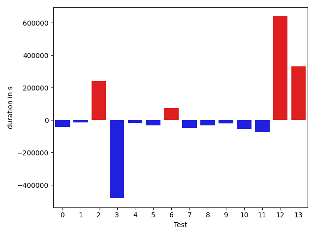

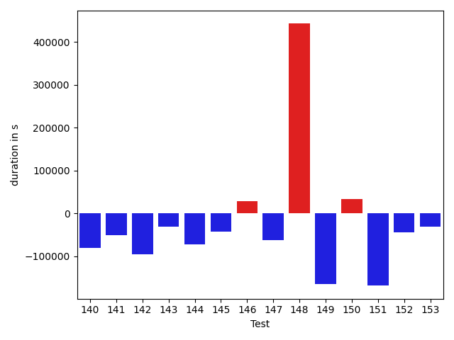

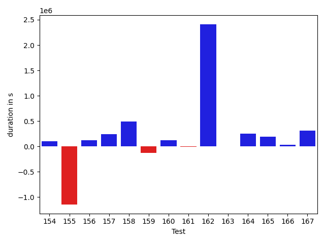

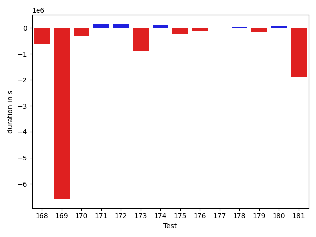

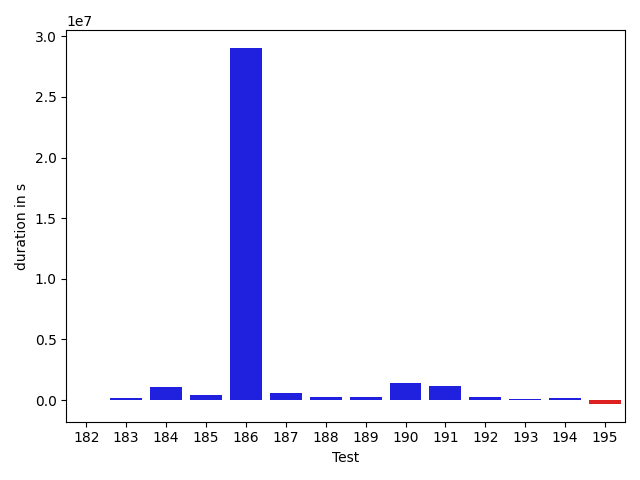

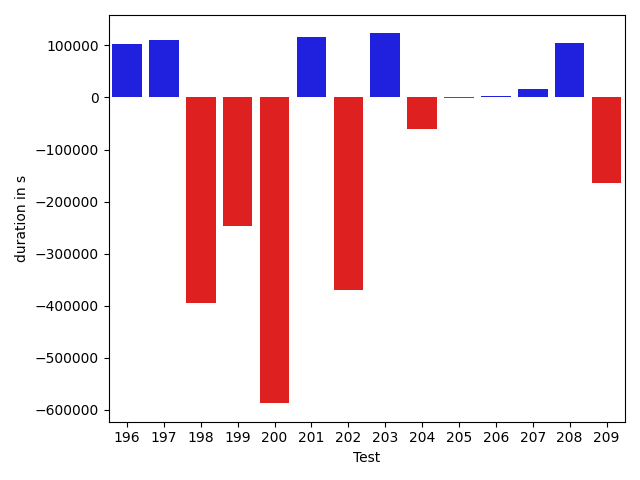

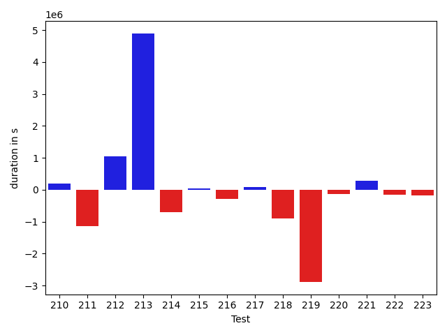

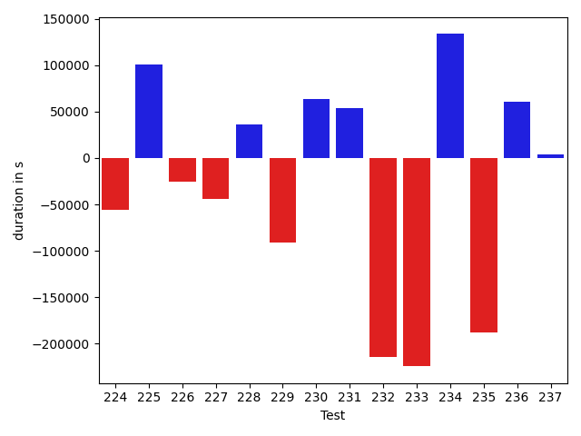

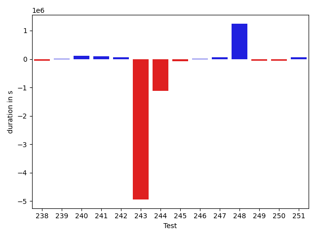

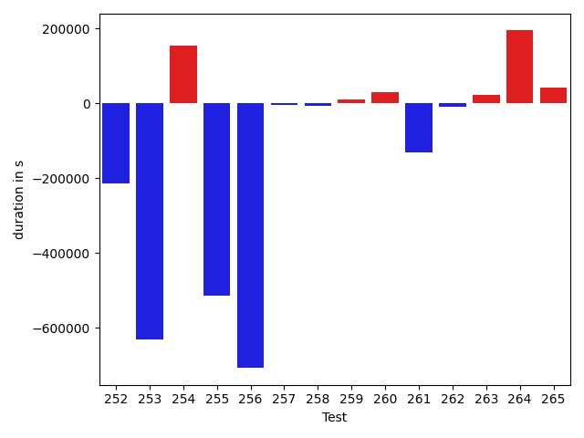

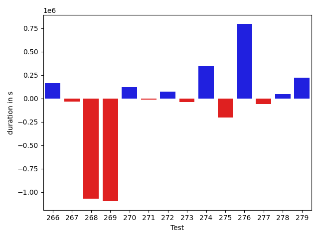

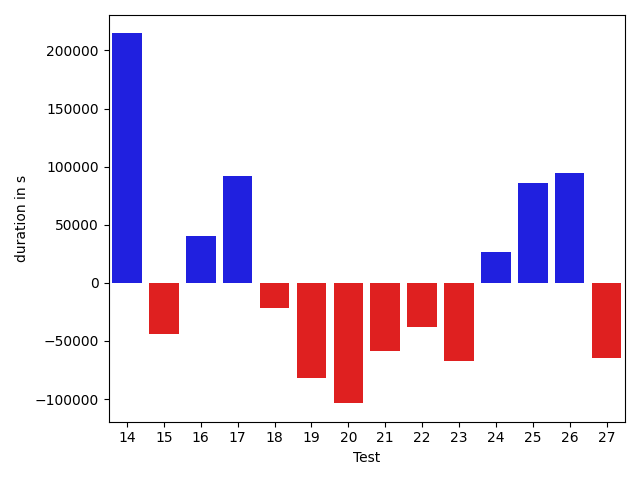

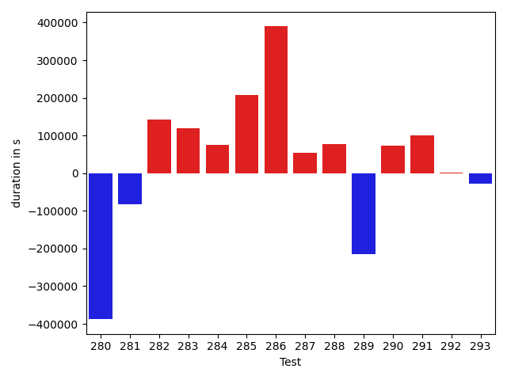

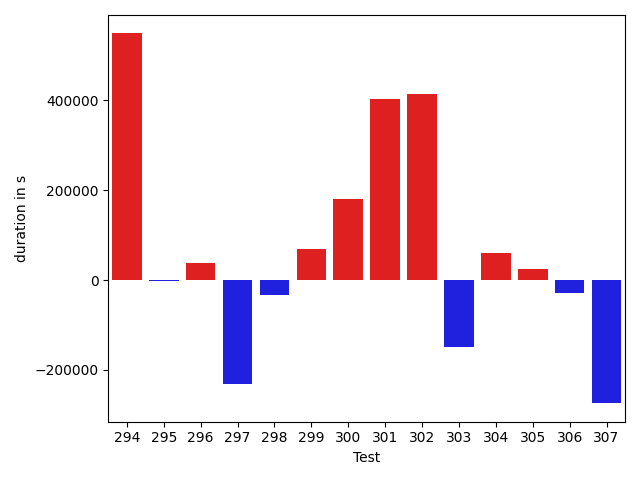

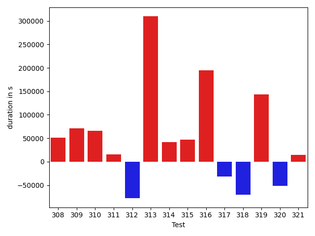

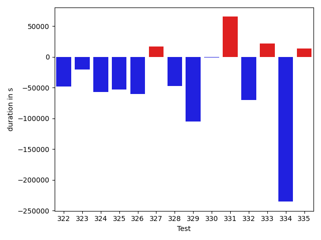

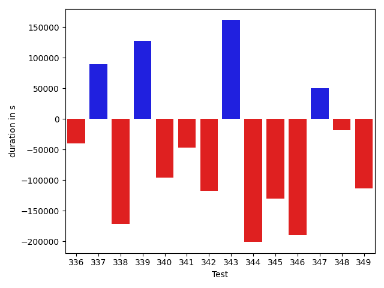

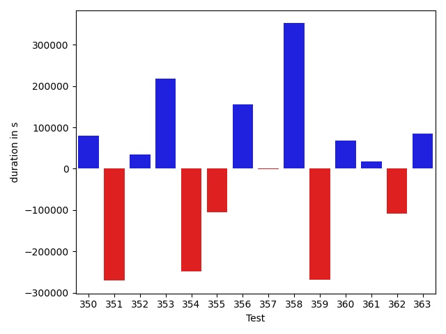

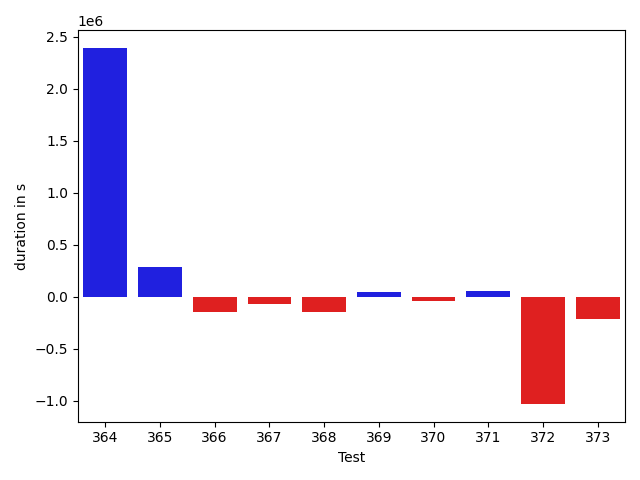

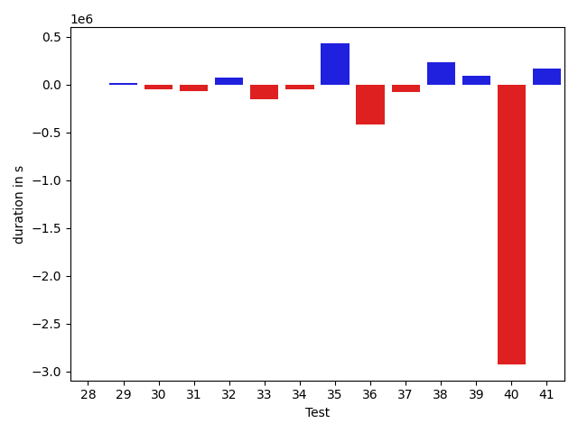

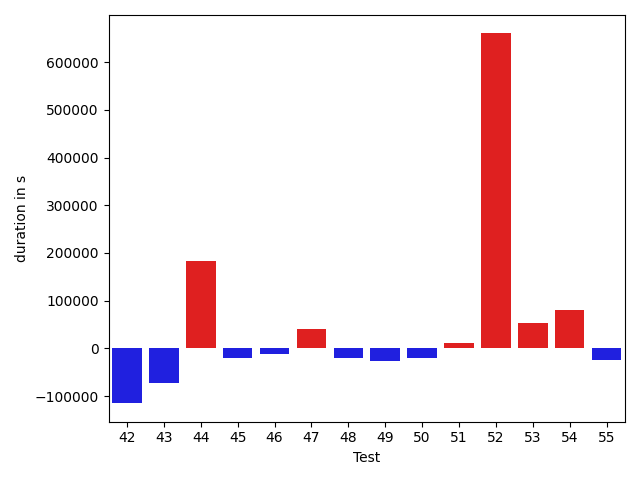

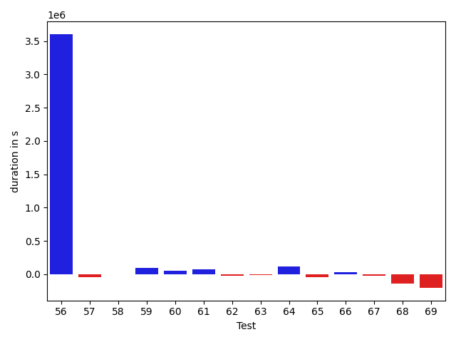

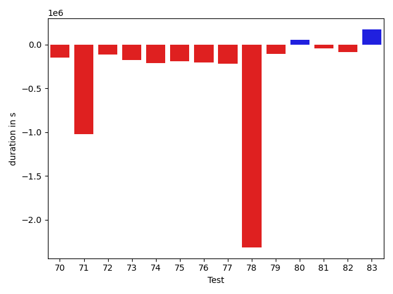

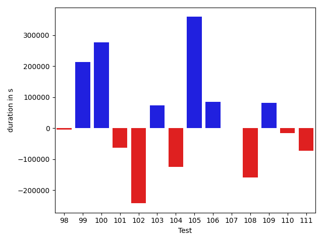

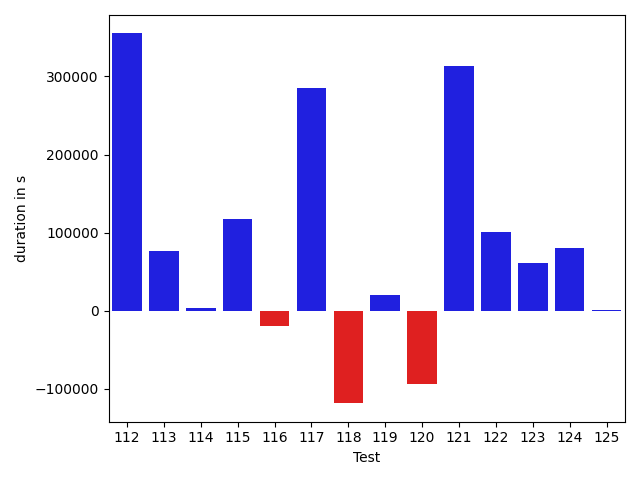

| ID | DurationV1 | DurationsV2 | DeltaDuration |
| --- | --- | --- | --- |
| 0 | 942344.9836065574 | 899548.9166666666 | -42796.066939890734 |
| 1 | 877072.0892857143 | 863250.125 | -13821.964285714319 |
| 2 | 987251.0943396227 | 1227508.463414634 | 240257.36907501146 |
| 3 | 1278207.1607142857 | 796594.6923076923 | -481612.4684065934 |
| 4 | 711837.1025641026 | 694313.1568627451 | -17523.94570135756 |
| 5 | 790818.1052631579 | 758545.4901960784 | -32272.61506707943 |
| 6 | 841456.2641509434 | 914113.5609756098 | 72657.29682466644 |
| 7 | 1258216.8484848484 | 1211834.3835616438 | -46382.46492320462 |
| 8 | 761783.2272727273 | 727686.9268292683 | -34096.30044345895 |
| 9 | 655896.1515151515 | 635362.3103448276 | -20533.841170323896 |
| 10 | 466104.3846153846 | 410729.2 | -55375.18461538461 |
| 11 | 572369.4230769231 | 498118.68 | -74250.74307692313 |
| 12 | 1464275.313131313 | 2102405.0833333335 | 638129.7702020204 |
| 13 | 589509.1428571428 | 918886.55 | 329377.4071428572 |
| 14 | 759408.75 | 879542.9107142857 | 120134.16071428568 |
| 15 | 1077807.2 | 1221510.8243243243 | 143703.6243243243 |
| 16 | 653416.5641025641 | 729554.825 | 76138.26089743583 |
| 17 | 1126793.8181818181 | 1620976.9583333333 | 494183.14015151514 |
| 18 | 673159.6363636364 | 778208.75 | 105049.11363636365 |
| 19 | 512709.75 | 558332.7741935484 | 45623.024193548365 |
| 20 | 906160.0392156863 | 966569.701754386 | 60409.66253869969 |
| 21 | 1144379.0961538462 | 1427716.559322034 | 283337.46316818777 |
| 22 | 784896.7586206896 | 1148509.6857142858 | 363612.9270935962 |
| 23 | 746894.3636363636 | 686468.25 | -60426.11363636365 |
| 24 | 670039.088888889 | 624027.125 | -46011.963888888946 |
| 25 | 553430.8857142857 | 601507.5862068966 | 48076.70049261092 |
| 26 | 809793.1764705882 | 726373.45 | -83419.72647058824 |
| 27 | 676484.6346153846 | 635645.2142857143 | -40839.420329670305 |
| 28 | 1203205.8333333333 | 1115710.375 | -87495.45833333326 |
| 29 | 1179207.5975609757 | 1038150.0365853659 | -141057.5609756098 |
| 30 | 1277786.2352941176 | 1482431.111111111 | 204644.87581699342 |
| 31 | 940470.8541666666 | 743046.075 | -197424.77916666667 |
| 32 | 715871.1578947369 | 699944.1515151515 | -15927.006379585364 |
| 33 | 960686.724137931 | 920724.7454545455 | -39961.97868338553 |
| 34 | 914949.1509433963 | 864778.3333333334 | -50170.81761006289 |
| 35 | 874756.387755102 | 694432.5277777778 | -180323.85997732426 |
| 36 | 826596.0833333334 | 796246.0454545454 | -30350.03787878796 |
| 37 | 697776.4565217391 | 697513.4905660377 | -262.9659557014238 |
| 38 | 853435.3725490196 | 857590.0 | 4154.6274509803625 |
| 39 | 946958.303030303 | 991149.9433962264 | 44191.640365923406 |
| 40 | 770153.5853658536 | 720716.0416666666 | -49437.543699186994 |
| 41 | 339413.1666666667 | 402421.77777777775 | 63008.611111111066 |
| 42 | 1045927.6833333333 | 931103.3548387097 | -114824.32849462365 |
| 43 | 785412.7777777778 | 712717.8285714285 | -72694.9492063492 |
| 44 | 534338.7727272727 | 716493.0 | 182154.2272727273 |
| 45 | 765366.2888888889 | 745790.7636363637 | -19575.52525252523 |
| 46 | 654331.0 | 641788.35 | -12542.650000000023 |
| 47 | 1031335.8734177215 | 1072137.7051282052 | 40801.83171048376 |
| 48 | 710577.0476190476 | 689721.4 | -20855.64761904755 |
| 49 | 566249.90625 | 539819.78125 | -26430.125 |
| 50 | 706674.6578947369 | 686045.7 | -20628.9578947369 |
| 51 | 3345079.131313131 | 3357082.474747475 | 12003.34343434358 |
| 52 | 9312356.464646464 | 9972265.494949495 | 659909.0303030312 |
| 53 | 463183.28571428574 | 517313.0 | 54129.71428571426 |
| 54 | 2251739.01010101 | 2331381.787878788 | 79642.77777777798 |
| 55 | 466873.0833333333 | 442005.16 | -24867.92333333334 |
| 56 | 470431.92307692306 | 444978.3333333333 | -25453.58974358975 |
| 57 | 439997.0416666667 | 413352.4666666667 | -26644.57500000001 |
| 58 | 863825.4 | 771858.9827586206 | -91966.41724137939 |
| 59 | 1135878.2696629213 | 1152560.0340909092 | 16681.76442798786 |
| 60 | 283137.9 | 313117.0 | 29979.099999999977 |
| 61 | 768265.7666666667 | 798708.8666666667 | 30443.099999999977 |
| 62 | 546634.75 | 529058.9444444445 | -17575.805555555504 |
| 63 | 394066.04761904763 | 900613.2 | 506547.1523809523 |
| 64 | 374590.1176470588 | 403694.375 | 29104.257352941204 |
| 65 | 449706.35714285716 | 472720.2380952381 | 23013.880952380947 |
| 66 | 702219.5714285715 | 728201.88 | 25982.308571428526 |
| 67 | 727089.72 | 685431.6 | -41658.119999999995 |
| 68 | 393119.4210526316 | 393270.15789473685 | 150.73684210528154 |
| 69 | 402005.35714285716 | 512259.63636363635 | 110254.2792207792 |
| 70 | 592629.7435897436 | 686843.2903225806 | 94213.54673283699 |
| 71 | 317089.7 | 322224.6923076923 | 5134.9923076923005 |
| 72 | 313019.85714285716 | 353929.2 | 40909.34285714285 |
| 73 | 696845.9 | 678681.3333333334 | -18164.56666666665 |
| 74 | 555065.75 | 553901.7916666666 | -1163.9583333333721 |
| 75 | 399399.1904761905 | 415613.9166666667 | 16214.726190476213 |
| 76 | 404924.0 | 404846.73333333334 | -77.26666666666279 |
| 77 | 336006.8461538461 | 371432.46153846156 | 35425.615384615434 |
| 78 | 858929.3571428572 | 389820.77777777775 | -469108.5793650794 |
| 79 | 596702.4634146341 | 616682.6818181818 | 19980.218403547653 |
| 80 | 819839.6875 | 388770.35 | -431069.3375 |
| 81 | 320099.0 | 342846.16 | 22747.159999999974 |
| 82 | 530553.3181818182 | 558094.925925926 | 27541.60774410772 |
| 83 | 357900.375 | 361941.3846153846 | 4041.0096153846243 |
| 84 | 6226583.474747474 | 6211107.04040404 | -15476.434343433939 |
| 85 | 3142332.3636363638 | 3093577.797979798 | -48754.565656565595 |
| 86 | 835963.9230769231 | 1218223.3666666667 | 382259.4435897436 |
| 87 | 624252.2307692308 | 661954.9696969697 | 37702.738927738974 |
| 88 | 3519427.6296296297 | 574488.7083333334 | -2944938.921296296 |
| 89 | 534273.7333333333 | 441627.1875 | -92646.54583333328 |
| 90 | 873293.5714285715 | 853969.62 | -19323.951428571483 |
| 91 | 658241.9333333333 | 849546.975 | 191305.04166666663 |
| 92 | 1138316.6229508198 | 1186195.0655737706 | 47878.442622950766 |
| 93 | 1367880.1348314607 | 1300510.8369565217 | -67369.29787493893 |
| 94 | 961725.1363636364 | 889222.4210526316 | -72502.71531100478 |
| 95 | 639156.6326530612 | 659575.1555555556 | 20418.522902494413 |
| 96 | 643694.7142857143 | 729327.7916666666 | 85633.07738095231 |
| 97 | 916479.0 | 788921.8260869565 | -127557.17391304346 |
| 98 | 553858.15625 | 523393.125 | -30465.03125 |
| 99 | 839157.6530612245 | 857059.0181818182 | 17901.36512059369 |
| 100 | 657422.4651162791 | 676575.701754386 | 19153.23663810687 |
| 101 | 726550.3770491803 | 766952.3272727273 | 40401.95022354694 |
| 102 | 624723.2058823529 | 667202.7647058824 | 42479.558823529514 |
| 103 | 1012014.4868421053 | 1059253.1807228916 | 47238.693880786304 |
| 104 | 1550826.6705882354 | 1622543.956521739 | 71717.28593350365 |
| 105 | 1058361.3181818181 | 1269174.8275862068 | 210813.50940438872 |
| 106 | 624178.8301886793 | 691956.8727272727 | 67778.0425385934 |
| 107 | 671117.7391304348 | 728491.25 | 57373.51086956519 |
| 108 | 1985730.5164835164 | 1669489.0760869565 | -316241.4403965599 |
| 109 | 529539.625 | 524468.3928571428 | -5071.2321428571595 |
| 110 | 958715.1896551724 | 1024066.9322033898 | 65351.742548217415 |
| 111 | 935701.5846153846 | 963748.8360655737 | 28047.251450189156 |
| 112 | 758150.7592592592 | 729961.641509434 | -28189.117749825236 |
| 113 | 801664.3 | 871537.7037037037 | 69873.40370370366 |
| 114 | 673549.4444444445 | 710515.731707317 | 36966.28726287256 |
| 115 | 618518.9130434783 | 660312.1052631579 | 41793.19221967959 |
| 116 | 605994.0869565217 | 694155.3170731707 | 88161.23011664895 |
| 117 | 644693.911111111 | 682607.9411764706 | 37914.03006535955 |
| 118 | 687646.7777777778 | 789084.1147540984 | 101437.3369763206 |
| 119 | 666365.947368421 | 676344.9302325582 | 9978.982864137157 |
| 120 | 643047.8409090909 | 678677.0217391305 | 35629.18083003955 |
| 121 | 886280.4888888889 | 771681.1276595745 | -114599.36122931435 |
| 122 | 361787.7727272727 | 394939.6111111111 | 33151.83838383842 |
| 123 | 749241.8703703703 | 763738.32 | 14496.449629629613 |
| 124 | 680567.6590909091 | 714839.0535714285 | 34271.39448051946 |
| 125 | 591224.4130434783 | 692121.5128205129 | 100897.0997770346 |
| 126 | 837278.0238095238 | 724453.081632653 | -112824.94217687077 |
| 127 | 384943.5333333333 | 426248.9411764706 | 41305.407843137276 |
| 128 | 406195.4285714286 | 435743.81481481483 | 29548.386243386252 |
| 129 | 373577.14285714284 | 426437.28571428574 | 52860.1428571429 |
| 130 | 1284287.9047619049 | 2512612.1616161615 | 1228324.2568542566 |
| 131 | 757964.3409090909 | 773829.7608695652 | 15865.419960474246 |
| 132 | 2633847.373737374 | 1078685.808219178 | -1555161.5655181957 |
| 133 | 734446.8545454545 | 863836.9090909091 | 129390.05454545456 |
| 134 | 688798.4838709678 | 945957.9230769231 | 257159.43920595536 |
| 135 | 2581218.3333333335 | 3068447.85106383 | 487229.51773049636 |
| 136 | 928232.3333333334 | 872039.6875 | -56192.64583333337 |
| 137 | 891776.36 | 631935.1851851852 | -259841.17481481482 |
| 138 | 482666.38095238095 | 424595.7083333333 | -58070.67261904763 |
| 139 | 412615.25 | 327875.0 | -84740.25 |
| 140 | 1043222.8421052631 | 962562.85 | -80659.99210526317 |
| 141 | 840129.0 | 788953.3611111111 | -51175.638888888876 |
| 142 | 650047.6538461539 | 554192.4166666666 | -95855.23717948725 |
| 143 | 859118.425 | 827966.119047619 | -31152.305952380993 |
| 144 | 403941.7272727273 | 331634.76923076925 | -72306.95804195805 |
| 145 | 428379.09523809527 | 386116.6875 | -42262.407738095266 |
| 146 | 441326.48148148146 | 469911.4705882353 | 28584.98910675384 |
| 147 | 427356.4736842105 | 365050.5882352941 | -62305.88544891641 |
| 148 | 383576.14285714284 | 826461.875 | 442885.73214285716 |
| 149 | 601843.1666666666 | 437352.71428571426 | -164490.45238095237 |
| 150 | 377630.26666666666 | 411610.6 | 33980.333333333314 |
| 151 | 927214.12 | 758953.7857142857 | -168260.3342857143 |
| 152 | 445667.1176470588 | 402247.2631578947 | -43419.85448916408 |
| 153 | 444458.3333333333 | 413320.2105263158 | -31138.122807017528 |
| 154 | 405932.14285714284 | 396004.7619047619 | -9927.380952380947 |
| 155 | 408937.44444444444 | 333985.8823529412 | -74951.56209150323 |
| 156 | 392955.5789473684 | 342091.3125 | -50864.26644736843 |
| 157 | 410231.6153846154 | 404164.35294117645 | -6067.262443438929 |
| 158 | 331976.14285714284 | 362114.71428571426 | 30138.57142857142 |
| 159 | 359601.6666666667 | 361252.5714285714 | 1650.9047619047342 |
| 160 | 341321.6153846154 | 344716.5294117647 | 3394.9140271493234 |
| 161 | 427999.7272727273 | 385793.9 | -42205.82727272727 |
| 162 | 432408.75 | 368801.625 | -63607.125 |
| 163 | 405009.3333333333 | 336807.63157894736 | -68201.70175438595 |
| 164 | 334596.6 | 329097.5714285714 | -5499.0285714285565 |
| 165 | 314442.25 | 708752.9375 | 394310.6875 |
| 166 | 498509.2727272727 | 421787.8888888889 | -76721.38383838383 |
| 167 | 397179.22222222225 | 347457.6875 | -49721.53472222225 |
| 168 | 280509.6153846154 | 379418.27777777775 | 98908.66239316238 |
| 169 | 412831.6 | 332991.82352941175 | -79839.77647058823 |
| 170 | 1741992.0882352942 | 3169861.224137931 | 1427869.135902637 |
| 171 | 1067495.2625 | 1089696.8533333333 | 22201.59083333332 |
| 172 | 1062391.3924050634 | 1090595.4078947369 | 28204.015489673475 |
| 173 | 2137698.707070707 | 2130784.1717171716 | -6914.535353535321 |
| 174 | 1084421.1395348837 | 1158427.9512195121 | 74006.81168462848 |
| 175 | 1570057.2564102565 | 1624125.7564102565 | 54068.5 |
| 176 | 1247479.388235294 | 1229715.7701149425 | -17763.618120351573 |
| 177 | 1090674.8987341772 | 1090418.3544303798 | -256.54430379741825 |
| 178 | 1188071.7121212122 | 1268228.445945946 | 80156.73382473388 |
| 179 | 967866.8928571428 | 922793.2777777778 | -45073.61507936509 |
| 180 | 1041455.0298507463 | 1202821.8208955224 | 161366.7910447761 |
| 181 | 1050882.7435897435 | 1059335.72 | 8452.976410256466 |
| 182 | 828196.4090909091 | 708973.1851851852 | -119223.22390572389 |
| 183 | 962494.4189189189 | 894510.323076923 | -67984.0958419959 |
| 184 | 785350.5897435897 | 666279.7380952381 | -119070.85164835164 |
| 185 | 1648890.8484848484 | 1574224.2424242424 | -74666.60606060596 |
| 186 | 2823780.419354839 | 1244690.4375 | -1579089.9818548388 |
| 187 | 643787.7142857143 | 591737.2916666666 | -52050.42261904769 |
| 188 | 825496.4693877551 | 737332.3888888889 | -88164.08049886627 |
| 189 | 787507.2941176471 | 688878.6153846154 | -98628.67873303173 |
| 190 | 8363304.731707317 | 8069153.2125 | -294151.51920731645 |
| 191 | 978105.4489795918 | 818323.6170212766 | -159781.83195831522 |
| 192 | 683803.1162790698 | 669396.96875 | -14406.1475290698 |
| 193 | 685002.46875 | 559437.3548387097 | -125565.1139112903 |
| 194 | 821520.5531914893 | 762645.2888888889 | -58875.26430260041 |
| 195 | 523551.0 | 435312.81481481483 | -88238.18518518517 |
| 196 | 1061486.2705882352 | 992068.5555555555 | -69417.71503267973 |
| 197 | 452323.05555555556 | 441426.95652173914 | -10896.099033816427 |
| 198 | 460645.84210526315 | 416113.15789473685 | -44532.68421052629 |
| 199 | 570898.84 | 521644.1212121212 | -49254.71878787875 |
| 200 | 568686.6086956522 | 475582.94736842107 | -93103.66132723115 |
| 201 | 565795.2857142857 | 521776.46428571426 | -44018.82142857142 |
| 202 | 779418.6923076923 | 515094.54545454547 | -264324.1468531468 |
| 203 | 474794.8181818182 | 444484.0833333333 | -30310.734848484863 |
| 204 | 476064.2631578947 | 466188.125 | -9876.138157894718 |
| 205 | 444042.3846153846 | 420327.6 | -23714.784615384648 |
| 206 | 454348.21875 | 412223.4117647059 | -42124.8069852941 |
| 207 | 705260.3636363636 | 578900.275862069 | -126360.08777429466 |
| 208 | 413273.0588235294 | 390510.8823529412 | -22762.176470588194 |
| 209 | 463207.1785714286 | 435988.0 | -27219.17857142858 |
| 210 | 439787.25 | 461764.875 | 21977.625 |
| 211 | 448309.6296296296 | 516118.0 | 67808.3703703704 |
| 212 | 442952.0 | 474785.28571428574 | 31833.28571428574 |
| 213 | 2313298.46875 | 2270931.292929293 | -42367.17582070688 |
| 214 | 1245402.0131578948 | 1112188.7464788733 | -133213.26667902153 |
| 215 | 891709.033898305 | 914535.574074074 | 22826.540175769012 |
| 216 | 805742.1379310344 | 929669.1666666666 | 123927.0287356322 |
| 217 | 847405.9152542372 | 897242.1636363637 | 49836.24838212645 |
| 218 | 2051872.4857142856 | 1885943.0 | -165929.48571428563 |
| 219 | 1058524.6363636365 | 450962.0869565217 | -607562.5494071147 |
| 220 | 453806.4761904762 | 900429.4642857143 | 446622.9880952381 |
| 221 | 994960.4 | 690555.1 | -304405.30000000005 |
| 222 | 1449281.9166666667 | 995643.3103448276 | -453638.60632183915 |
| 223 | 1147193.0 | 970755.25 | -176437.75 |
| 224 | 726569.3333333334 | 726648.1132075472 | 78.77987421385478 |
| 225 | 1460351.5185185184 | 1344315.8666666667 | -116035.65185185173 |
| 226 | 341487.8125 | 303213.35714285716 | -38274.45535714284 |
| 227 | 472588.652173913 | 455507.3125 | -17081.339673913026 |
| 228 | 1411933.9583333333 | 1174484.4130434783 | -237449.54528985498 |
| 229 | 540233.4666666667 | 417143.9375 | -123089.52916666667 |
| 230 | 401914.1176470588 | 354386.9285714286 | -47527.18907563022 |
| 231 | 503825.78571428574 | 350845.35 | -152980.43571428576 |
| 232 | 565452.4761904762 | 406819.09523809527 | -158633.38095238095 |
| 233 | 399696.8461538461 | 416776.6875 | 17079.841346153873 |
| 234 | 441187.23076923075 | 341568.07692307694 | -99619.15384615381 |
| 235 | 371405.8888888889 | 358667.4 | -12738.488888888853 |
| 236 | 435382.9285714286 | 410399.5 | -24983.42857142858 |
| 237 | 511453.3846153846 | 613831.3181818182 | 102377.93356643361 |
| 238 | 1521259.0967741935 | 1804971.1855670102 | 283712.08879281674 |
| 239 | 2928115.1717171716 | 4359130.848484849 | 1431015.676767677 |
| 240 | 1148725.5952380951 | 1241743.6081081082 | 93018.01287001302 |
| 241 | 795719.1803278689 | 925740.2115384615 | 130021.0312105926 |
| 242 | 1069351.7096774194 | 1260818.3684210526 | 191466.6587436332 |
| 243 | 832813.1304347826 | 824686.3829787234 | -8126.747456059209 |
| 244 | 1880469.0833333333 | 1405534.225 | -474934.85833333316 |
| 245 | 1119483.7966101696 | 1010438.7313432836 | -109045.06526688603 |
| 246 | 1018173.4444444445 | 905944.1964285715 | -112229.24801587302 |
| 247 | 726774.3448275862 | 661711.8108108108 | -65062.53401677543 |
| 248 | 596384.48 | 530640.1428571428 | -65744.33714285714 |
| 249 | 558816.8260869565 | 578718.5909090909 | 19901.7648221344 |
| 250 | 749145.027027027 | 988243.2790697674 | 239098.25204274047 |
| 251 | 1439378.696969697 | 1275816.7142857143 | -163561.9826839827 |
| 252 | 782917.7058823529 | 570030.7894736842 | -212886.91640866874 |
| 253 | 2491987.88 | 1860768.9523809524 | -631218.9276190475 |
| 254 | 615102.0416666666 | 770772.2857142857 | 155670.24404761905 |
| 255 | 1958279.88 | 1445368.4210526317 | -512911.4589473682 |
| 256 | 3488383.919354839 | 2781505.9846153846 | -706877.9347394542 |
| 257 | 1147761.6734693877 | 1144025.7450980393 | -3735.9283713484183 |
| 258 | 766524.06 | 760924.3392857143 | -5599.720714285737 |
| 259 | 1514270.292929293 | 1524502.387755102 | 10232.094825809123 |
| 260 | 944404.1060606061 | 973525.4202898551 | 29121.314229249023 |
| 261 | 3281551.1717171716 | 3151818.787878788 | -129732.38383838348 |
| 262 | 1018529.3376623377 | 1009868.16 | -8661.177662337665 |
| 263 | 1241528.6818181819 | 1265233.894736842 | 23705.212918660138 |
| 264 | 904209.4347826086 | 1098998.078125 | 194788.64334239135 |
| 265 | 648706.6216216217 | 689846.5925925926 | 41139.97097097093 |
| 266 | 1129917.5625 | 894444.9230769231 | -235472.63942307688 |
| 267 | 738835.5348837209 | 711634.6904761905 | -27200.844407530385 |
| 268 | 422339.64705882355 | 456791.75 | 34452.10294117645 |
| 269 | 668677.5 | 592155.7916666666 | -76521.70833333337 |
| 270 | 54327260.39393939 | 53688658.23232323 | -638602.1616161615 |
| 271 | 10668585.313131314 | 10503638.8989899 | -164946.4141414147 |
| 272 | 1772356.8585858585 | 1722043.9696969697 | -50312.88888888876 |
| 273 | 692735.4827586206 | 879270.0967741936 | 186534.61401557294 |
| 274 | 1060236.2463768115 | 1188443.6617647058 | 128207.41538789426 |
| 275 | 695077.06 | 721797.7446808511 | 26720.68468085106 |
| 276 | 965035.6739130435 | 913871.6037735849 | -51164.07013945852 |
| 277 | 800157.0869565217 | 868388.0363636364 | 68230.94940711465 |
| 278 | 321752.17647058825 | 384349.75 | 62597.57352941175 |
| 279 | 412097.71428571426 | 376322.3 | -35775.41428571427 |
| 280 | 9321888.777777778 | 8934036.878787879 | -387851.8989898991 |
| 281 | 939583.3888888889 | 857945.1346153846 | -81638.25427350425 |
| 282 | 1832364.8484848484 | 1974005.2525252525 | 141640.40404040413 |
| 283 | 741437.0333333333 | 860294.1379310344 | 118857.10459770111 |
| 284 | 894727.9666666667 | 970425.1639344263 | 75697.19726775959 |
| 285 | 1063467.2181818183 | 1270580.9841269841 | 207113.76594516588 |
| 286 | 950572.5172413794 | 1340081.5714285714 | 389509.054187192 |
| 287 | 844174.6730769231 | 897663.4905660377 | 53488.81748911459 |
| 288 | 771624.6444444444 | 849393.7380952381 | 77769.09365079366 |
| 289 | 712347.875 | 498134.48 | -214213.39500000002 |
| 290 | 1015780.1428571428 | 1089438.1142857142 | 73657.97142857139 |
| 291 | 726246.6216216217 | 826268.4242424242 | 100021.80262080254 |
| 292 | 910519.7368421053 | 912558.78125 | 2039.0444078947185 |
| 293 | 396511.4347826087 | 369274.53846153844 | -27236.896321070264 |
| 294 | 3347748.6666666665 | 3896841.888888889 | 549093.2222222225 |
| 295 | 676164.12 | 673911.5777777778 | -2252.542222222197 |
| 296 | 686357.4242424242 | 725651.625 | 39294.2007575758 |
| 297 | 764036.1666666666 | 532786.1538461539 | -231250.01282051275 |
| 298 | 438393.5882352941 | 404362.375 | -34031.2132352941 |
| 299 | 833805.4117647059 | 903606.65625 | 69801.2444852941 |
| 300 | 1177712.5189873418 | 1359344.6176470588 | 181632.098659717 |
| 301 | 1376945.851851852 | 1781264.8837209302 | 404319.0318690783 |
| 302 | 4509593.363636363 | 4924619.808080808 | 415026.44444444496 |
| 303 | 1417693.7534246575 | 1267889.875 | -149803.8784246575 |
| 304 | 1915265.6 | 1975141.2121212122 | 59875.61212121206 |
| 305 | 1806197.6813186812 | 1831595.6744186047 | 25397.99309992348 |
| 306 | 407067.0 | 378547.5238095238 | -28519.476190476213 |
| 307 | 693183.1428571428 | 419198.5 | -273984.64285714284 |
| 308 | 347347.5238095238 | 398833.1538461539 | 51485.630036630086 |
| 309 | 415865.875 | 486765.53846153844 | 70899.66346153844 |
| 310 | 395319.8 | 461465.4375 | 66145.63750000001 |
| 311 | 665389.9677419355 | 681405.7647058824 | 16015.796963946894 |
| 312 | 447998.72222222225 | 370160.5652173913 | -77838.15700483095 |
| 313 | 1782204.7428571428 | 2091697.5975609757 | 309492.8547038329 |
| 314 | 505652.36842105264 | 547124.4705882353 | 41472.10216718266 |
| 315 | 797411.3611111111 | 844882.7727272727 | 47471.41161616158 |
| 316 | 926782.15 | 1121941.524590164 | 195159.37459016393 |
| 317 | 670820.4615384615 | 639219.5714285715 | -31600.890109890024 |
| 318 | 1470985.03125 | 1400758.6352941177 | -70226.39595588227 |
| 319 | 1463608.3333333333 | 1606718.9090909092 | 143110.57575757592 |
| 320 | 895100.6730769231 | 843728.4153846154 | -51372.2576923077 |
| 321 | 824611.4324324324 | 839148.4444444445 | 14537.01201201207 |
| 322 | 517328.44 | 468893.72222222225 | -48434.717777777754 |
| 323 | 504166.53846153844 | 483852.1935483871 | -20314.344913151348 |
| 324 | 561834.696969697 | 505156.82608695654 | -56677.87088274048 |
| 325 | 628919.2424242424 | 576146.32 | -52772.92242424248 |
| 326 | 519112.82352941175 | 459077.15789473685 | -60035.66563467489 |
| 327 | 659045.2333333333 | 675642.1818181818 | 16596.948484848486 |
| 328 | 779138.911111111 | 731672.6060606061 | -47466.305050504976 |
| 329 | 1848342.2197802197 | 1742970.6736842105 | -105371.5460960092 |
| 330 | 500238.1 | 499250.05555555556 | -988.0444444444147 |
| 331 | 1159334.4069767443 | 1224606.6904761905 | 65272.28349944623 |
| 332 | 813020.6739130435 | 743061.6857142857 | -69958.98819875775 |
| 333 | 378143.8125 | 399606.6153846154 | 21462.802884615376 |
| 334 | 901104.8095238095 | 665822.7727272727 | -235282.03679653676 |
| 335 | 541106.6774193548 | 554919.375 | 13812.69758064521 |
| 336 | 977023.3125 | 848876.0491803279 | -128147.26331967209 |
| 337 | 1185327.9814814816 | 1135700.34375 | -49627.637731481576 |
| 338 | 437597.25 | 390412.8181818182 | -47184.43181818182 |
| 339 | 548352.3793103448 | 530337.6 | -18014.779310344835 |
| 340 | 542544.3 | 770430.7435897436 | 227886.44358974358 |
| 341 | 881135.2407407408 | 937815.4210526316 | 56680.180311890785 |
| 342 | 789483.2380952381 | 821557.2666666667 | 32074.028571428615 |
| 343 | 3516108.5714285714 | 1620188.3076923077 | -1895920.2637362636 |
| 344 | 392883.36363636365 | 1366922.8 | 974039.4363636364 |
| 345 | 349698.35 | 373906.125 | 24207.775000000023 |
| 346 | 392717.5833333333 | 344635.625 | -48081.958333333314 |
| 347 | 290328.3076923077 | 442936.2 | 152607.89230769232 |
| 348 | 368391.0 | 370641.1875 | 2250.1875 |
| 349 | 344762.1904761905 | 335803.3076923077 | -8958.882783882786 |
| 350 | 410467.25 | 285431.0 | -125036.25 |
| 351 | 377829.9375 | 390231.25 | 12401.3125 |
| 352 | 1087718.0 | 342735.5 | -744982.5 |
| 353 | 356416.5714285714 | 350326.5833333333 | -6089.988095238106 |
| 354 | 364654.9166666667 | 354174.1176470588 | -10480.79901960789 |
| 355 | 2772157.9206349207 | 2280374.746031746 | -491783.1746031749 |
| 356 | 2173619.8235294116 | 1741104.2857142857 | -432515.5378151259 |
| 357 | 469869.86666666664 | 460678.8181818182 | -9191.048484848463 |
| 358 | 423049.3125 | 415049.7916666667 | -7999.520833333314 |
| 359 | 1191223.8 | 434694.36363636365 | -756529.4363636364 |
| 360 | 843683.5 | 450590.3333333333 | -393093.1666666667 |
| 361 | 372378.7 | 283589.375 | -88789.32500000001 |
| 362 | 864719.3111111111 | 821060.1333333333 | -43659.177777777775 |
| 363 | 448816.7826086957 | 514919.53846153844 | 66102.75585284276 |
| 364 | 847632.0212765958 | 731187.8444444444 | -116444.17683215137 |
| 365 | 507619.4285714286 | 538952.1081081082 | 31332.679536679585 |
| 366 | 509065.8823529412 | 549796.0689655172 | 40730.18661257601 |
| 367 | 770416.9142857143 | 821904.6 | 51487.685714285704 |
| 368 | 546780.6086956522 | 476891.0 | -69889.60869565222 |
| 369 | 1046821.6428571428 | 957049.7894736842 | -89771.85338345869 |
| 370 | 1339137.9016393442 | 1316689.3050847459 | -22448.596554598305 |
| 371 | 469049.14705882355 | 642897.6785714285 | 173848.53151260497 |
| 372 | 621580.0 | 550732.925925926 | -70847.07407407404 |
| 373 | 796306.1578947369 | 1253335.243902439 | 457029.08600770216 |

## Misc.

| ID | Test Class | Test Method |
| --- | --- | --- |
| 0 | com.google.gson.functional.CustomTypeAdaptersTest | testCustomAdapterInvokedForCollectionElementDeserialization |
| 1 | com.google.gson.functional.CustomTypeAdaptersTest | testCustomAdapterInvokedForMapElementSerializationWithType |
| 2 | com.google.gson.functional.CustomTypeAdaptersTest | testRegisterHierarchyAdapterForDate |
| 3 | com.google.gson.functional.CustomTypeAdaptersTest | testCustomDeserializers |
| 4 | com.google.gson.functional.CustomTypeAdaptersTest | testCustomDeserializerInvokedForPrimitives |
| 5 | com.google.gson.functional.CustomTypeAdaptersTest | testCustomAdapterInvokedForMapElementDeserialization |
| 6 | com.google.gson.functional.CustomTypeAdaptersTest | testCustomNestedDeserializers |
| 7 | com.google.gson.functional.CustomTypeAdaptersTest | testCustomAdapterInvokedForCollectionElementSerializationWithType |
| 8 | com.google.gson.functional.CustomTypeAdaptersTest | testCustomByteArrayDeserializerAndInstanceCreator |
| 9 | com.google.gson.functional.CustomTypeAdaptersTest | testEnsureCustomDeserializerNotInvokedForNullValues |
| 10 | com.google.gson.functional.CustomTypeAdaptersTest | testCustomAdapterInvokedForMapElementSerialization |
| 11 | com.google.gson.functional.CustomTypeAdaptersTest | testCustomAdapterInvokedForCollectionElementSerialization |
| 12 | com.google.gson.functional.CustomDeserializerTest | testDefaultConstructorNotCalledOnObject |
| 13 | com.google.gson.functional.CustomDeserializerTest | testDefaultConstructorNotCalledOnField |
| 14 | com.google.gson.functional.CustomDeserializerTest | testCustomDeserializerReturnsNullForArrayElementsForArrayField |
| 15 | com.google.gson.functional.CustomDeserializerTest | testJsonTypeFieldBasedDeserialization |
| 16 | com.google.gson.functional.CustomDeserializerTest | testCustomDeserializerReturnsNullForArrayElements |
| 17 | com.google.gson.functional.CustomDeserializerTest | testCustomDeserializerReturnsNull |
| 18 | com.google.gson.functional.CustomDeserializerTest | testCustomDeserializerReturnsNullForTopLevelObject |
| 19 | com.google.gson.MixedStreamTest | testReaderDoesNotMutateState |
| 20 | com.google.gson.MixedStreamTest | testWriteHtmlSafe |
| 21 | com.google.gson.MixedStreamTest | testWriteLenient |
| 22 | com.google.gson.MixedStreamTest | testReadMixedStreamed |
| 23 | com.google.gson.functional.CollectionTest | testCollectionOfObjectSerialization |
| 24 | com.google.gson.functional.CollectionTest | testNullsInListDeserialization |
| 25 | com.google.gson.functional.CollectionTest | testRawCollectionSerialization |
| 26 | com.google.gson.functional.CollectionTest | testFieldIsArrayList |
| 27 | com.google.gson.functional.CollectionTest | testNullsInListSerialization |
| 28 | com.google.gson.functional.CollectionTest | testWildcardPrimitiveCollectionSerilaization |
| 29 | com.google.gson.functional.CollectionTest | testWildcardCollectionField |
| 30 | com.google.gson.functional.CollectionTest | testSetSerialization |
| 31 | com.google.gson.functional.CollectionTest | testRawCollectionOfBagOfPrimitivesNotAllowed |
| 32 | com.google.gson.functional.CollectionTest | testQueueDeserialization |
| 33 | com.google.gson.functional.CollectionTest | testTopLevelCollectionOfIntegersDeserialization |
| 34 | com.google.gson.functional.CollectionTest | testQueueSerialization |
| 35 | com.google.gson.functional.CollectionTest | testLinkedListDeserialization |
| 36 | com.google.gson.functional.CollectionTest | testTopLevelCollectionOfIntegersSerialization |
| 37 | com.google.gson.functional.CollectionTest | testWildcardPrimitiveCollectionDeserilaization |
| 38 | com.google.gson.functional.CollectionTest | testCollectionOfBagOfPrimitivesSerialization |
| 39 | com.google.gson.functional.CollectionTest | testSetDeserialization |
| 40 | com.google.gson.functional.CollectionTest | testCollectionOfObjectWithNullSerialization |
| 41 | com.google.gson.functional.CollectionTest | testCollectionOfStringsSerialization |
| 42 | com.google.gson.functional.CollectionTest | testLinkedListSerialization |
| 43 | com.google.gson.functional.CollectionTest | testRawCollectionDeserializationNotAlllowed |
| 44 | com.google.gson.functional.CollectionTest | testRawCollectionOfIntegersSerialization |
| 45 | com.google.gson.functional.CollectionTest | testTopLevelListOfIntegerCollectionsDeserialization |
| 46 | com.google.gson.functional.CollectionTest | testCollectionOfStringsDeserialization |
| 47 | com.google.gson.functional.DefaultTypeAdaptersTest | testDefaultJavaSqlTimestampDeserialization |
| 48 | com.google.gson.functional.DefaultTypeAdaptersTest | testSqlDateSerialization |
| 49 | com.google.gson.functional.DefaultTypeAdaptersTest | testBigIntegerFieldDeserialization |
| 50 | com.google.gson.functional.DefaultTypeAdaptersTest | testTimestampSerialization |
| 51 | com.google.gson.functional.DefaultTypeAdaptersTest | testDefaultDateDeserializationUsingBuilder |
| 52 | com.google.gson.functional.DefaultTypeAdaptersTest | testNullSerialization |
| 53 | com.google.gson.functional.DefaultTypeAdaptersTest | testClassDeserialization |
| 54 | com.google.gson.functional.DefaultTypeAdaptersTest | testDefaultDateDeserialization |
| 55 | com.google.gson.functional.DefaultTypeAdaptersTest | testUrlDeserialization |
| 56 | com.google.gson.functional.DefaultTypeAdaptersTest | testUrlNullDeserialization |
| 57 | com.google.gson.functional.DefaultTypeAdaptersTest | testOverrideBigDecimalTypeAdapter |
| 58 | com.google.gson.functional.DefaultTypeAdaptersTest | testDateDeserializationWithPattern |
| 59 | com.google.gson.functional.DefaultTypeAdaptersTest | testDateSerializationInCollection |
| 60 | com.google.gson.functional.DefaultTypeAdaptersTest | testNullJsonElementDeserialization |
| 61 | com.google.gson.functional.DefaultTypeAdaptersTest | testDefaultJavaSqlDateDeserialization |
| 62 | com.google.gson.functional.DefaultTypeAdaptersTest | testBigDecimalFieldDeserialization |
| 63 | com.google.gson.functional.DefaultTypeAdaptersTest | testUuidDeserialization |
| 64 | com.google.gson.functional.DefaultTypeAdaptersTest | testDefaultGregorianCalendarDeserialization |
| 65 | com.google.gson.functional.DefaultTypeAdaptersTest | testDefaultCalendarDeserialization |
| 66 | com.google.gson.functional.DefaultTypeAdaptersTest | testTreeSetDeserialization |
| 67 | com.google.gson.functional.DefaultTypeAdaptersTest | testJsonPrimitiveDeserialization |
| 68 | com.google.gson.functional.DefaultTypeAdaptersTest | testPropertiesDeserialization |
| 69 | com.google.gson.functional.DefaultTypeAdaptersTest | testJsonArrayDeerialization |
| 70 | com.google.gson.functional.DefaultTypeAdaptersTest | testTreeSetSerialization |
| 71 | com.google.gson.functional.DefaultTypeAdaptersTest | testStringBufferDeserialization |
| 72 | com.google.gson.functional.DefaultTypeAdaptersTest | testJsonNullDeerialization |
| 73 | com.google.gson.functional.DefaultTypeAdaptersTest | testSetSerialization |
| 74 | com.google.gson.functional.DefaultTypeAdaptersTest | testOverrideBigIntegerTypeAdapter |
| 75 | com.google.gson.functional.DefaultTypeAdaptersTest | testLocaleDeserializationWithLanguageCountryVariant |
| 76 | com.google.gson.functional.DefaultTypeAdaptersTest | testLocaleDeserializationWithLanguageCountry |
| 77 | com.google.gson.functional.DefaultTypeAdaptersTest | testJsonObjectDeserialization |
| 78 | com.google.gson.functional.DefaultTypeAdaptersTest | testLocaleDeserializationWithLanguage |
| 79 | com.google.gson.functional.DefaultTypeAdaptersTest | testDefaultJavaSqlTimeDeserialization |
| 80 | com.google.gson.functional.DefaultTypeAdaptersTest | testUriDeserialization |
| 81 | com.google.gson.functional.DefaultTypeAdaptersTest | testStringBuilderDeserialization |
| 82 | com.google.gson.functional.DefaultTypeAdaptersTest | testBitSetDeserialization |
| 83 | com.google.gson.functional.DefaultTypeAdaptersTest | testPropertiesSerialization |
| 84 | com.google.gson.functional.CircularReferenceTest | testCircularSerialization |
| 85 | com.google.gson.functional.CircularReferenceTest | testSelfReferenceArrayFieldSerialization |
| 86 | com.google.gson.functional.CircularReferenceTest | testDirectedAcyclicGraphDeserialization |
| 87 | com.google.gson.functional.CircularReferenceTest | testDirectedAcyclicGraphSerialization |
| 88 | com.google.gson.LongSerializationPolicyTest | testDefaultLongSerializationIntegration |
| 89 | com.google.gson.LongSerializationPolicyTest | testStringLongSerializationIntegration |
| 90 | com.google.gson.functional.MapTest | testSerializeMaps |
| 91 | com.google.gson.functional.MapTest | testHashMapDeserialization |
| 92 | com.google.gson.functional.MapTest | testMapSerializationWithNullValues |
| 93 | com.google.gson.functional.MapTest | testInterfaceTypeMapWithSerializer |
| 94 | com.google.gson.functional.MapTest | testComplexKeysSerialization |
| 95 | com.google.gson.functional.MapTest | testMapDeserializationWithDuplicateKeys |
| 96 | com.google.gson.functional.MapTest | testMapDeserializationWithIntegerKeys |
| 97 | com.google.gson.functional.MapTest | testMapStandardSubclassDeserialization |
| 98 | com.google.gson.functional.MapTest | testMapSerializationWithNullValuesSerialized |
| 99 | com.google.gson.functional.MapTest | testMapSubclassDeserialization |
| 100 | com.google.gson.functional.MapTest | testStringKeyDeserialization |
| 101 | com.google.gson.functional.MapTest | testMapSerializationWithIntegerKeys |
| 102 | com.google.gson.functional.MapTest | testMapSerializationWithNullValueButSerializeNulls |
| 103 | com.google.gson.functional.MapTest | testSortedMap |
| 104 | com.google.gson.functional.MapTest | testInterfaceTypeMap |
| 105 | com.google.gson.functional.MapTest | testMapSerializationWithWildcardValues |
| 106 | com.google.gson.functional.MapTest | testMapDeserialization |
| 107 | com.google.gson.functional.MapTest | testSerializeMapOfMaps |
| 108 | com.google.gson.functional.MapTest | testParameterizedMapSubclassSerialization |
| 109 | com.google.gson.functional.MapTest | testMapSerialization |
| 110 | com.google.gson.functional.MapTest | testMapSubclassSerialization |
| 111 | com.google.gson.functional.MapTest | testMapNamePromotionWithJsonElementReader |
| 112 | com.google.gson.functional.MapTest | testComplexKeysDeserialization |
| 113 | com.google.gson.functional.MapTest | testMapDeserializationWithWildcardValues |
| 114 | com.google.gson.functional.MapTest | testMapSerializationWithNullKey |
| 115 | com.google.gson.functional.MapTest | testMapDeserializationEmpty |
| 116 | com.google.gson.functional.MapTest | testMapSerializationWithNullValue |
| 117 | com.google.gson.functional.MapTest | testMapSerializationEmpty |
| 118 | com.google.gson.functional.MapTest | testMapOfMapDeserialization |
| 119 | com.google.gson.functional.MapTest | testMapDeserializationWithNullKey |
| 120 | com.google.gson.functional.MapTest | testBooleanKeyDeserialization |
| 121 | com.google.gson.functional.MapTest | testNumberKeyDeserialization |
| 122 | com.google.gson.functional.MapTest | testRawMapSerialization |
| 123 | com.google.gson.functional.MapTest | testGeneralMapField |
| 124 | com.google.gson.functional.MapTest | testDeerializeMapOfMaps |
| 125 | com.google.gson.functional.MapTest | testMapDeserializationWithNullValue |
| 126 | com.google.gson.functional.MapTest | testReadMapsWithEmptyStringKey |
| 127 | com.google.gson.functional.MapTest | testMapWithQuotes |
| 128 | com.google.gson.functional.MapTest | testMapOfMapSerialization |
| 129 | com.google.gson.functional.MapTest | testWriteMapsWithEmptyStringKey |
| 130 | com.google.gson.functional.InheritanceTest | testSubInterfacesOfCollectionSerialization |
| 131 | com.google.gson.functional.InheritanceTest | testClassWithBaseArrayFieldSerialization |
| 132 | com.google.gson.functional.InheritanceTest | testSubInterfacesOfCollectionDeserialization |
| 133 | com.google.gson.functional.InheritanceTest | testClassWithBaseCollectionFieldSerialization |
| 134 | com.google.gson.functional.InheritanceTest | testSubClassDeserialization |
| 135 | com.google.gson.functional.InterceptorTest | testExceptionsPropagated |
| 136 | com.google.gson.functional.PrimitiveTest | testPrimitiveIntegerAutoboxedDeserialization |
| 137 | com.google.gson.functional.PrimitiveTest | testPrimitiveClassLiteral |
| 138 | com.google.gson.functional.PrimitiveTest | testDeserializingBigIntegerAsBigDecimal |
| 139 | com.google.gson.functional.PrimitiveTest | testDeserializingDecimalPointValueZeroSucceeds |
| 140 | com.google.gson.functional.PrimitiveTest | testStringsAsBooleans |
| 141 | com.google.gson.functional.PrimitiveTest | testByteDeserialization |
| 142 | com.google.gson.functional.PrimitiveTest | testNumberDeserialization |
| 143 | com.google.gson.functional.PrimitiveTest | testValueVeryCloseToZeroIsZero |
| 144 | com.google.gson.functional.PrimitiveTest | testBigDecimalPreservePrecisionDeserialization |
| 145 | com.google.gson.functional.PrimitiveTest | testLongAsStringDeserialization |
| 146 | com.google.gson.functional.PrimitiveTest | testDoubleNaNDeserialization |
| 147 | com.google.gson.functional.PrimitiveTest | testDoubleNoFractAsStringRepresentationDeserialization |
| 148 | com.google.gson.functional.PrimitiveTest | testReallyLongValuesDeserialization |
| 149 | com.google.gson.functional.PrimitiveTest | testPrimitiveDoubleAutoboxedDeserialization |
| 150 | com.google.gson.functional.PrimitiveTest | testLargeDoubleDeserialization |
| 151 | com.google.gson.functional.PrimitiveTest | testDeserializePrimitiveWrapperAsObjectField |
| 152 | com.google.gson.functional.PrimitiveTest | testDoubleAsStringRepresentationDeserialization |
| 153 | com.google.gson.functional.PrimitiveTest | testBigIntegerDeserialization |
| 154 | com.google.gson.functional.PrimitiveTest | testBooleanDeserialization |
| 155 | com.google.gson.functional.PrimitiveTest | testDoubleInfinityDeserialization |
| 156 | com.google.gson.functional.PrimitiveTest | testFloatNaNDeserialization |
| 157 | com.google.gson.functional.PrimitiveTest | testUnquotedStringDeserializationFails |
| 158 | com.google.gson.functional.PrimitiveTest | testBigDecimalAsStringRepresentationDeserialization |
| 159 | com.google.gson.functional.PrimitiveTest | testSmallValueForBigDecimalDeserialization |
| 160 | com.google.gson.functional.PrimitiveTest | testQuotedStringSerializationAndDeserialization |
| 161 | com.google.gson.functional.PrimitiveTest | testBigDecimalNoFractAsStringRepresentationDeserialization |
| 162 | com.google.gson.functional.PrimitiveTest | testNegativeInfinityDeserialization |
| 163 | com.google.gson.functional.PrimitiveTest | testPrimitiveLongAutoboxedDeserialization |
| 164 | com.google.gson.functional.PrimitiveTest | testDeserializingBigDecimalAsFloat |
| 165 | com.google.gson.functional.PrimitiveTest | testFloatInfinityDeserialization |
| 166 | com.google.gson.functional.PrimitiveTest | testBigDecimalDeserialization |
| 167 | com.google.gson.functional.PrimitiveTest | testSmallValueForBigIntegerDeserialization |
| 168 | com.google.gson.functional.PrimitiveTest | testDeserializingBigDecimalAsDouble |
| 169 | com.google.gson.functional.PrimitiveTest | testNegativeInfinityFloatDeserialization |
| 170 | com.google.gson.JsonParserTest | testReadWriteTwoObjects |
| 171 | com.google.gson.functional.ParameterizedTypesTest | testVariableTypeArrayDeserialization |
| 172 | com.google.gson.functional.ParameterizedTypesTest | testVariableTypeDeserialization |
| 173 | com.google.gson.functional.ParameterizedTypesTest | testVariableTypeFieldsAndGenericArraysSerialization |
| 174 | com.google.gson.functional.ParameterizedTypesTest | testParameterizedTypeGenericArraysDeserialization |
| 175 | com.google.gson.functional.ParameterizedTypesTest | testParameterizedTypeDeserialization |
| 176 | com.google.gson.functional.ParameterizedTypesTest | testVariableTypeFieldsAndGenericArraysDeserialization |
| 177 | com.google.gson.functional.ParameterizedTypesTest | testParameterizedTypesWithCustomDeserializer |
| 178 | com.google.gson.functional.ParameterizedTypesTest | testParameterizedTypeGenericArraysSerialization |
| 179 | com.google.gson.functional.ParameterizedTypesTest | testParameterizedTypeWithReaderDeserialization |
| 180 | com.google.gson.functional.ParameterizedTypesTest | testTypesWithMultipleParametersDeserialization |
| 181 | com.google.gson.functional.ParameterizedTypesTest | testParameterizedTypeWithVariableTypeDeserialization |
| 182 | com.google.gson.functional.ParameterizedTypesTest | testDeepParameterizedTypeDeserialization |
| 183 | com.google.gson.functional.ObjectTest | testSingletonLists |
| 184 | com.google.gson.functional.ObjectTest | testArrayOfObjectsDeserialization |
| 185 | com.google.gson.functional.ObjectTest | testArrayOfArraysSerialization |
| 186 | com.google.gson.functional.ObjectTest | testJsonInSingleQuotesDeserialization |
| 187 | com.google.gson.functional.ObjectTest | testBagOfPrimitiveWrappersDeserialization |
| 188 | com.google.gson.functional.ObjectTest | testArrayOfArraysDeserialization |
| 189 | com.google.gson.functional.ObjectTest | testArrayOfObjectsAsFields |
| 190 | com.google.gson.functional.ObjectTest | testDateAsMapObjectField |
| 191 | com.google.gson.functional.ObjectTest | testTruncatedDeserialization |
| 192 | com.google.gson.functional.ObjectTest | testArrayOfObjectsSerialization |
| 193 | com.google.gson.functional.ObjectTest | testClassWithTransientFieldsSerialization |
| 194 | com.google.gson.functional.ObjectTest | testInnerClassDeserialization |
| 195 | com.google.gson.functional.ObjectTest | testNullObjectFieldsDeserialization |
| 196 | com.google.gson.functional.ObjectTest | testEmptyCollectionInAnObjectDeserialization |
| 197 | com.google.gson.functional.ObjectTest | testStringFieldWithNumberValueDeserialization |
| 198 | com.google.gson.functional.ObjectTest | testPrimitiveArrayFieldSerialization |
| 199 | com.google.gson.functional.ObjectTest | testPrimitiveArrayInAnObjectDeserialization |
| 200 | com.google.gson.functional.ObjectTest | testJsonInMixedQuotesDeserialization |
| 201 | com.google.gson.functional.ObjectTest | testNullFieldsDeserialization |
| 202 | com.google.gson.functional.ObjectTest | testNullPrimitiveFieldsDeserialization |
| 203 | com.google.gson.functional.ObjectTest | testClassWithTransientFieldsDeserialization |
| 204 | com.google.gson.functional.ObjectTest | testBagOfPrimitivesDeserialization |
| 205 | com.google.gson.functional.ObjectTest | testObjectFieldNamesWithoutQuotesDeserialization |
| 206 | com.google.gson.functional.ObjectTest | testNullArraysDeserialization |
| 207 | com.google.gson.functional.ObjectTest | testNestedDeserialization |
| 208 | com.google.gson.functional.ObjectTest | testClassWithNoFieldsDeserialization |
| 209 | com.google.gson.functional.ObjectTest | testPrivateNoArgConstructorDeserialization |
| 210 | com.google.gson.functional.ObjectTest | testClassWithTransientFieldsDeserializationTransientFieldsPassedInJsonAreIgnored |
| 211 | com.google.gson.functional.ObjectTest | testEmptyCollectionInAnObjectSerialization |
| 212 | com.google.gson.functional.ObjectTest | testStringFieldWithEmptyValueDeserialization |
| 213 | com.google.gson.functional.EnumTest | testEnumSubclass |
| 214 | com.google.gson.functional.EnumTest | testEnumSubclassWithRegisteredTypeAdapter |
| 215 | com.google.gson.functional.EnumTest | testCollectionOfEnumsDeserialization |
| 216 | com.google.gson.functional.EnumTest | testCollectionOfEnumsSerialization |
| 217 | com.google.gson.functional.EnumTest | testEnumSubclassAsParameterizedType |
| 218 | com.google.gson.functional.EnumTest | testEnumCaseMapping |
| 219 | com.google.gson.functional.EnumTest | testClassWithEnumFieldDeserialization |
| 220 | com.google.gson.functional.EnumTest | testTopLevelEnumDeserialization |
| 221 | com.google.gson.functional.ArrayTest | testObjectArrayWithNonPrimitivesSerialization |
| 222 | com.google.gson.functional.ArrayTest | testTopLevelArrayOfIntsDeserialization |
| 223 | com.google.gson.functional.ArrayTest | testArrayOfCollectionSerialization |
| 224 | com.google.gson.functional.ArrayTest | testArrayOfCollectionDeserialization |
| 225 | com.google.gson.functional.ArrayTest | testSingleNullInArraySerialization |
| 226 | com.google.gson.functional.ArrayTest | testArrayOfNullDeserialization |
| 227 | com.google.gson.functional.ArrayTest | testSingleNullInArrayDeserialization |
| 228 | com.google.gson.functional.ArrayTest | testArrayOfPrimitivesAsObjectsDeserialization |
| 229 | com.google.gson.functional.ArrayTest | testEmptyArrayDeserialization |
| 230 | com.google.gson.functional.ArrayTest | testArrayElementsAreArrays |
| 231 | com.google.gson.functional.ArrayTest | testNullsInArrayWithSerializeNullPropertySetSerialization |
| 232 | com.google.gson.functional.ArrayTest | testInvalidArrayDeserialization |
| 233 | com.google.gson.functional.ArrayTest | testNullsInArrayDeserialization |
| 234 | com.google.gson.functional.ArrayTest | testSingleStringArrayDeserialization |
| 235 | com.google.gson.functional.ArrayTest | testArrayOfStringsDeserialization |
| 236 | com.google.gson.functional.ArrayTest | testMultidimenstionalArraysDeserialization |
| 237 | com.google.gson.ObjectTypeAdapterTest | testSerializeNullValue |
| 238 | com.google.gson.ObjectTypeAdapterTest | testSerialize |
| 239 | com.google.gson.functional.TypeVariableTest | testAdvancedTypeVariables |
| 240 | com.google.gson.functional.TypeVariableTest | testTypeVariablesViaTypeParameter |
| 241 | com.google.gson.functional.TypeVariableTest | testBasicTypeVariables |
| 242 | com.google.gson.functional.JsonParserTest | testParseInvalidJson |
| 243 | com.google.gson.functional.JsonParserTest | testExtraCommasInMaps |
| 244 | com.google.gson.functional.JsonParserTest | testDeserializingCustomTree |
| 245 | com.google.gson.functional.JsonParserTest | testExtraCommasInArrays |
| 246 | com.google.gson.functional.JsonParserTest | testChangingCustomTreeAndDeserializing |
| 247 | com.google.gson.functional.JsonParserTest | testBadFieldTypeForDeserializingCustomTree |
| 248 | com.google.gson.functional.JsonParserTest | testBadFieldTypeForCustomDeserializerCustomTree |
| 249 | com.google.gson.functional.EscapingTest | testGsonDoubleDeserialization |
| 250 | com.google.gson.functional.EscapingTest | testGsonAcceptsEscapedAndNonEscapedJsonDeserialization |
| 251 | com.google.gson.functional.EscapingTest | testEscapingObjectFields |
| 252 | com.google.gson.functional.EscapingTest | testEscapeAllHtmlCharacters |
| 253 | com.google.gson.functional.EscapingTest | testEscapingQuotesInStringArray |
| 254 | com.google.gson.GsonTypeAdapterTest | testTypeAdapterProperlyConvertsTypes |
| 255 | com.google.gson.GsonTypeAdapterTest | testTypeAdapterDoesNotAffectNonAdaptedTypes |
| 256 | com.google.gson.functional.InstanceCreatorTest | testInstanceCreatorReturnsBaseType |
| 257 | com.google.gson.functional.InstanceCreatorTest | testInstanceCreatorReturnsSubTypeForField |
| 258 | com.google.gson.functional.InstanceCreatorTest | testInstanceCreatorReturnsSubTypeForTopLevelObject |
| 259 | com.google.gson.functional.InstanceCreatorTest | testInstanceCreatorForCollectionType |
| 260 | com.google.gson.functional.MapAsArrayTypeAdapterTest | testMapWithTypeVariableDeserialization |
| 261 | com.google.gson.functional.MapAsArrayTypeAdapterTest | testSerializeComplexMapWithTypeAdapter |
| 262 | com.google.gson.functional.MapAsArrayTypeAdapterTest | testMapWithTypeVariableSerialization |
| 263 | com.google.gson.functional.MapAsArrayTypeAdapterTest | testTwoTypesCollapseToOneDeserialize |
| 264 | com.google.gson.functional.MapAsArrayTypeAdapterTest | testMultipleEnableComplexKeyRegistrationHasNoEffect |
| 265 | com.google.gson.functional.VersioningTest | testVersionedClassesDeserialization |
| 266 | com.google.gson.functional.VersioningTest | testVersionedUntilDeserialization |
| 267 | com.google.gson.functional.VersioningTest | testVersionedGsonMixingSinceAndUntilDeserialization |
| 268 | com.google.gson.functional.VersioningTest | testIgnoreLaterVersionClassDeserialization |
| 269 | com.google.gson.functional.VersioningTest | testVersionedGsonWithUnversionedClassesDeserialization |
| 270 | com.google.gson.JavaSerializationTest | testMapIsSerializable |
| 271 | com.google.gson.JavaSerializationTest | testNumberIsSerializable |
| 272 | com.google.gson.JavaSerializationTest | testListIsSerializable |
| 273 | com.google.gson.functional.ReadersWritersTest | testReaderForDeserialization |
| 274 | com.google.gson.functional.ReadersWritersTest | testReadWriteTwoStrings |
| 275 | com.google.gson.functional.ReadersWritersTest | testTypeMismatchThrowsJsonSyntaxExceptionForReaders |
| 276 | com.google.gson.functional.ReadersWritersTest | testReadWriteTwoObjects |
| 277 | com.google.gson.functional.ReadersWritersTest | testTypeMismatchThrowsJsonSyntaxExceptionForStrings |
| 278 | com.google.gson.functional.ReadersWritersTest | testTopLevelNullObjectDeserializationWithReaderAndSerializeNulls |
| 279 | com.google.gson.functional.ReadersWritersTest | testTopLevelNullObjectDeserializationWithReader |
| 280 | com.google.gson.functional.ConcurrencyTest | testMultiThreadDeserialization |
| 281 | com.google.gson.functional.ConcurrencyTest | testSingleThreadDeserialization |
| 282 | com.google.gson.functional.UncategorizedTest | testReturningDerivedClassesDuringDeserialization |
| 283 | com.google.gson.functional.UncategorizedTest | testGsonInstanceReusableForSerializationAndDeserialization |
| 284 | com.google.gson.functional.UncategorizedTest | testTrailingWhitespace |
| 285 | com.google.gson.functional.MoreSpecificTypeSerializationTest | testListOfSubclassFields |
| 286 | com.google.gson.functional.MoreSpecificTypeSerializationTest | testMapOfSubclassFields |
| 287 | com.google.gson.functional.MoreSpecificTypeSerializationTest | testListOfParameterizedSubclassFields |
| 288 | com.google.gson.functional.MoreSpecificTypeSerializationTest | testMapOfParameterizedSubclassFields |
| 289 | com.google.gson.functional.ExclusionStrategyFunctionalTest | testExcludeTopLevelClassSerializationDoesNotImpactDeserialization |
| 290 | com.google.gson.functional.ExclusionStrategyFunctionalTest | testExclusionStrategyDeserialization |
| 291 | com.google.gson.functional.ExclusionStrategyFunctionalTest | testExclusionStrategySerializationDoesNotImpactDeserialization |
| 292 | com.google.gson.functional.ExclusionStrategyFunctionalTest | testExclusionStrategyWithMode |
| 293 | com.google.gson.functional.ExclusionStrategyFunctionalTest | testExcludeTopLevelClassDeserialization |
| 294 | com.google.gson.functional.TypeHierarchyAdapterTest | testTypeHierarchy |
| 295 | com.google.gson.functional.TypeHierarchyAdapterTest | testRegisterSuperTypeFirst |
| 296 | com.google.gson.functional.ExposeFieldsTest | testArrayWithOneNullExposeFieldObjectSerialization |
| 297 | com.google.gson.functional.ExposeFieldsTest | testExposedInterfaceFieldDeserialization |
| 298 | com.google.gson.functional.ExposeFieldsTest | testNoExposedFieldDeserialization |
| 299 | com.google.gson.functional.ExposeFieldsTest | testExposeAnnotationDeserialization |
| 300 | com.google.gson.functional.TreeTypeAdaptersTest | testDeserializeId |
| 301 | com.google.gson.functional.TreeTypeAdaptersTest | testSerializeId |
| 302 | com.google.gson.DefaultInetAddressTypeAdapterTest | testInetAddressSerializationAndDeserialization |
| 303 | com.google.gson.functional.RawSerializationTest | testCollectionOfObjects |
| 304 | com.google.gson.functional.RawSerializationTest | testCollectionOfPrimitives |
| 305 | com.google.gson.functional.TypeAdapterPrecedenceTest | testNonstreamingFollowedByNonstreaming |
| 306 | com.google.gson.functional.TypeAdapterPrecedenceTest | testStreamingHierarchicalFollowedByNonstreaming |
| 307 | com.google.gson.functional.TypeAdapterPrecedenceTest | testStreamingHierarchicalFollowedByNonstreamingHierarchical |
| 308 | com.google.gson.functional.TypeAdapterPrecedenceTest | testStreamingFollowedByNonstreamingHierarchical |
| 309 | com.google.gson.functional.TypeAdapterPrecedenceTest | testStreamingFollowedByNonstreaming |
| 310 | com.google.gson.functional.TypeAdapterPrecedenceTest | testSerializeNonstreamingTypeAdapterFollowedByStreamingTypeAdapter |
| 311 | com.google.gson.functional.TypeAdapterPrecedenceTest | testStreamingFollowedByStreaming |
| 312 | com.google.gson.functional.TypeAdapterPrecedenceTest | testNonstreamingHierarchicalFollowedByNonstreaming |
| 313 | com.google.gson.functional.PrettyPrintingTest | testPrettyPrintList |
| 314 | com.google.gson.functional.PrettyPrintingTest | testMap |
| 315 | com.google.gson.functional.PrettyPrintingTest | testPrettyPrintArrayOfObjects |
| 316 | com.google.gson.functional.PrettyPrintingTest | testEmptyMapField |
| 317 | com.google.gson.functional.PrettyPrintingTest | testPrettyPrintListOfPrimitiveArrays |
| 318 | com.google.gson.functional.NullObjectAndFieldTest | testExplicitSerializationOfNullArrayMembers |
| 319 | com.google.gson.functional.NullObjectAndFieldTest | testTopLevelNullObjectDeserialization |
| 320 | com.google.gson.functional.NullObjectAndFieldTest | testAbsentJsonElementsAreSetToNull |
| 321 | com.google.gson.functional.NullObjectAndFieldTest | testPrintPrintingObjectWithNulls |
| 322 | com.google.gson.functional.NullObjectAndFieldTest | testNullWrappedPrimitiveMemberDeserialization |
| 323 | com.google.gson.functional.NullObjectAndFieldTest | testExplicitNullSetsFieldToNullDuringDeserialization |
| 324 | com.google.gson.functional.NullObjectAndFieldTest | testExplicitSerializationOfNullStringMembers |
| 325 | com.google.gson.functional.NullObjectAndFieldTest | testExplicitSerializationOfNullCollectionMembers |
| 326 | com.google.gson.functional.NullObjectAndFieldTest | testPrintPrintingArraysWithNulls |
| 327 | com.google.gson.functional.NullObjectAndFieldTest | testExplicitDeserializationOfNulls |
| 328 | com.google.gson.functional.NullObjectAndFieldTest | testCustomTypeAdapterPassesNullDesrialization |
| 329 | com.google.gson.functional.DelegateTypeAdapterTest | testDelegateInvoked |
| 330 | com.google.gson.functional.DelegateTypeAdapterTest | testDelegateInvokedOnStrings |
| 331 | com.google.gson.functional.StreamingTypeAdaptersTest | testNullSafe |
| 332 | com.google.gson.functional.StreamingTypeAdaptersTest | testFromJsonTree |
| 333 | com.google.gson.functional.StreamingTypeAdaptersTest | testDeserializeNullObject |
| 334 | com.google.gson.functional.StreamingTypeAdaptersTest | testDeserializeMap |
| 335 | com.google.gson.functional.StreamingTypeAdaptersTest | testDeserialize2dArray |
| 336 | com.google.gson.functional.StreamingTypeAdaptersTest | testSerializeWithCustomTypeAdapter |
| 337 | com.google.gson.functional.StreamingTypeAdaptersTest | testDeserialize |
| 338 | com.google.gson.functional.StreamingTypeAdaptersTest | testDeserializeNullField |
| 339 | com.google.gson.functional.StreamingTypeAdaptersTest | testDeserialize1dArray |
| 340 | com.google.gson.functional.StreamingTypeAdaptersTest | testDeserializeWithCustomTypeAdapter |
| 341 | com.google.gson.DefaultMapJsonSerializerTest | testEmptyMapSerialization |
| 342 | com.google.gson.DefaultMapJsonSerializerTest | testNonEmptyMapSerialization |
| 343 | com.google.gson.DefaultMapJsonSerializerTest | testEmptyMapNoTypeSerialization |
| 344 | com.google.gson.functional.StringTest | testStringValueDeserialization |
| 345 | com.google.gson.functional.StringTest | testStringWithEscapedSlashDeserialization |
| 346 | com.google.gson.functional.StringTest | testEscapingQuotesInStringDeserialization |
| 347 | com.google.gson.functional.StringTest | testSingleQuoteInStringSerialization |
| 348 | com.google.gson.functional.StringTest | testAssignmentCharDeserialization |
| 349 | com.google.gson.functional.StringTest | testEscapingQuotesInStringSerialization |
| 350 | com.google.gson.functional.StringTest | testEscapedBackslashInStringDeserialization |
| 351 | com.google.gson.functional.StringTest | testSingleQuoteInStringDeserialization |
| 352 | com.google.gson.functional.StringTest | testEscapedCtrlNInStringDeserialization |
| 353 | com.google.gson.functional.StringTest | testJavascriptKeywordsInStringDeserialization |
| 354 | com.google.gson.functional.StringTest | testEscapedCtrlRInStringDeserialization |
| 355 | com.google.gson.CommentsTest | testParseComments |
| 356 | com.google.gson.OverrideCoreTypeAdaptersTest | testOverrideWrapperBooleanAdapter |
| 357 | com.google.gson.OverrideCoreTypeAdaptersTest | testOverrideStringAdapter |
| 358 | com.google.gson.OverrideCoreTypeAdaptersTest | testOverridePrimitiveBooleanAdapter |
| 359 | com.google.gson.functional.InternationalizationTest | testStringsWithUnicodeChineseCharactersEscapedDeserialization |
| 360 | com.google.gson.functional.InternationalizationTest | testStringsWithRawChineseCharactersDeserialization |
| 361 | com.google.gson.functional.InternationalizationTest | testStringsWithUnicodeChineseCharactersDeserialization |
| 362 | com.google.gson.functional.CustomSerializerTest | testSubClassSerializerInvokedForBaseClassFieldsHoldingArrayOfSubClassInstances |
| 363 | com.google.gson.functional.NamingPolicyTest | testGsonWithSerializedNameFieldNamingPolicyDeserialization |
| 364 | com.google.gson.functional.NamingPolicyTest | testComplexFieldNameStrategy |
| 365 | com.google.gson.functional.NamingPolicyTest | testGsonWithLowerCaseUnderscorePolicyDeserialiation |
| 366 | com.google.gson.functional.NamingPolicyTest | testGsonWithLowerCaseDashPolicyDeserialiation |
| 367 | com.google.gson.functional.NamingPolicyTest | testGsonWithNonDefaultFieldNamingPolicyDeserialiation |
| 368 | com.google.gson.functional.NamingPolicyTest | testGsonWithUpperCamelCaseSpacesPolicyDeserialiation |
| 369 | com.google.gson.functional.PrimitiveCharacterTest | testPrimitiveCharacterAutoboxedDeserialization |
| 370 | com.google.gson.functional.PrintFormattingTest | testCompactFormattingLeavesNoWhiteSpace |
| 371 | com.google.gson.functional.SecurityTest | testJsonWithNonExectuableTokenWithConfiguredGsonDeserialization |
| 372 | com.google.gson.functional.SecurityTest | testJsonWithNonExectuableTokenWithRegularGsonDeserialization |
| 373 | com.google.gson.functional.SecurityTest | testNonExecutableJsonDeserialization |

| Test | IterationV1 | IterationV2 | DeltaIteration |
| --- | --- | --- | --- |
| 0 | 61 | 60 | -1 |
| 1 | 56 | 48 | -8 |
| 2 | 53 | 41 | -12 |
| 3 | 56 | 52 | -4 |
| 4 | 39 | 51 | 12 |
| 5 | 57 | 51 | -6 |
| 6 | 53 | 41 | -12 |
| 7 | 66 | 73 | 7 |
| 8 | 44 | 41 | -3 |
| 9 | 33 | 29 | -4 |
| 10 | 26 | 15 | -11 |
| 11 | 26 | 25 | -1 |
| 12 | 99 | 96 | -3 |
| 13 | 35 | 40 | 5 |
| 14 | 52 | 56 | 4 |
| 15 | 75 | 74 | -1 |
| 16 | 39 | 40 | 1 |
| 17 | 55 | 48 | -7 |
| 18 | 44 | 28 | -16 |
| 19 | 24 | 31 | 7 |
| 20 | 51 | 57 | 6 |
| 21 | 52 | 59 | 7 |
| 22 | 29 | 35 | 6 |
| 23 | 44 | 52 | 8 |
| 24 | 45 | 40 | -5 |
| 25 | 35 | 29 | -6 |
| 26 | 51 | 60 | 9 |
| 27 | 52 | 42 | -10 |
| 28 | 78 | 72 | -6 |
| 29 | 82 | 82 | 0 |
| 30 | 68 | 63 | -5 |
| 31 | 48 | 40 | -8 |
| 32 | 57 | 33 | -24 |
| 33 | 58 | 55 | -3 |
| 34 | 53 | 48 | -5 |
| 35 | 49 | 36 | -13 |
| 36 | 48 | 44 | -4 |
| 37 | 46 | 53 | 7 |
| 38 | 51 | 37 | -14 |
| 39 | 66 | 53 | -13 |
| 40 | 41 | 48 | 7 |
| 41 | 18 | 18 | 0 |
| 42 | 60 | 62 | 2 |
| 43 | 36 | 35 | -1 |
| 44 | 22 | 29 | 7 |
| 45 | 45 | 55 | 10 |
| 46 | 37 | 40 | 3 |
| 47 | 79 | 78 | -1 |
| 48 | 42 | 50 | 8 |
| 49 | 32 | 32 | 0 |
| 50 | 38 | 50 | 12 |
| 51 | 99 | 99 | 0 |
| 52 | 99 | 99 | 0 |
| 53 | 21 | 20 | -1 |
| 54 | 99 | 99 | 0 |
| 55 | 24 | 25 | 1 |
| 56 | 13 | 15 | 2 |
| 57 | 24 | 15 | -9 |
| 58 | 55 | 58 | 3 |
| 59 | 89 | 88 | -1 |
| 60 | 10 | 9 | -1 |
| 61 | 60 | 60 | 0 |
| 62 | 32 | 18 | -14 |
| 63 | 21 | 15 | -6 |
| 64 | 17 | 16 | -1 |
| 65 | 14 | 21 | 7 |
| 66 | 56 | 50 | -6 |
| 67 | 25 | 25 | 0 |
| 68 | 19 | 19 | 0 |
| 69 | 14 | 11 | -3 |
| 70 | 39 | 31 | -8 |
| 71 | 10 | 13 | 3 |
| 72 | 7 | 15 | 8 |
| 73 | 30 | 30 | 0 |
| 74 | 28 | 48 | 20 |
| 75 | 21 | 12 | -9 |
| 76 | 17 | 15 | -2 |
| 77 | 13 | 26 | 13 |
| 78 | 14 | 18 | 4 |
| 79 | 41 | 44 | 3 |
| 80 | 16 | 20 | 4 |
| 81 | 15 | 25 | 10 |
| 82 | 22 | 27 | 5 |
| 83 | 16 | 13 | -3 |
| 84 | 99 | 99 | 0 |
| 85 | 99 | 99 | 0 |
| 86 | 39 | 30 | -9 |
| 87 | 39 | 33 | -6 |
| 88 | 27 | 24 | -3 |
| 89 | 30 | 16 | -14 |
| 90 | 42 | 50 | 8 |
| 91 | 45 | 40 | -5 |
| 92 | 61 | 61 | 0 |
| 93 | 89 | 92 | 3 |
| 94 | 66 | 57 | -9 |
| 95 | 49 | 45 | -4 |
| 96 | 42 | 48 | 6 |
| 97 | 48 | 46 | -2 |
| 98 | 32 | 24 | -8 |
| 99 | 49 | 55 | 6 |
| 100 | 43 | 57 | 14 |
| 101 | 61 | 55 | -6 |
| 102 | 34 | 34 | 0 |
| 103 | 76 | 83 | 7 |
| 104 | 85 | 92 | 7 |
| 105 | 66 | 58 | -8 |
| 106 | 53 | 55 | 2 |
| 107 | 46 | 48 | 2 |
| 108 | 91 | 92 | 1 |
| 109 | 32 | 28 | -4 |
| 110 | 58 | 59 | 1 |
| 111 | 65 | 61 | -4 |
| 112 | 54 | 53 | -1 |
| 113 | 50 | 54 | 4 |
| 114 | 36 | 41 | 5 |
| 115 | 46 | 38 | -8 |
| 116 | 46 | 41 | -5 |
| 117 | 45 | 34 | -11 |
| 118 | 45 | 61 | 16 |
| 119 | 38 | 43 | 5 |
| 120 | 44 | 46 | 2 |
| 121 | 45 | 47 | 2 |
| 122 | 22 | 18 | -4 |
| 123 | 54 | 50 | -4 |
| 124 | 44 | 56 | 12 |
| 125 | 46 | 39 | -7 |
| 126 | 42 | 49 | 7 |
| 127 | 15 | 17 | 2 |
| 128 | 14 | 27 | 13 |
| 129 | 14 | 21 | 7 |
| 130 | 84 | 99 | 15 |
| 131 | 44 | 46 | 2 |
| 132 | 99 | 73 | -26 |
| 133 | 55 | 55 | 0 |
| 134 | 31 | 52 | 21 |
| 135 | 99 | 94 | -5 |
| 136 | 30 | 16 | -14 |
| 137 | 25 | 27 | 2 |
| 138 | 21 | 24 | 3 |
| 139 | 8 | 11 | 3 |
| 140 | 57 | 60 | 3 |
| 141 | 42 | 36 | -6 |
| 142 | 26 | 24 | -2 |
| 143 | 40 | 42 | 2 |
| 144 | 11 | 13 | 2 |
| 145 | 21 | 16 | -5 |
| 146 | 27 | 17 | -10 |
| 147 | 19 | 17 | -2 |
| 148 | 14 | 16 | 2 |
| 149 | 18 | 21 | 3 |
| 150 | 15 | 15 | 0 |
| 151 | 50 | 56 | 6 |
| 152 | 17 | 19 | 2 |
| 153 | 15 | 19 | 4 |
| 154 | 14 | 21 | 7 |
| 155 | 18 | 17 | -1 |
| 156 | 19 | 16 | -3 |
| 157 | 13 | 17 | 4 |
| 158 | 14 | 14 | 0 |
| 159 | 9 | 14 | 5 |
| 160 | 13 | 17 | 4 |
| 161 | 11 | 10 | -1 |
| 162 | 12 | 16 | 4 |
| 163 | 12 | 19 | 7 |
| 164 | 10 | 14 | 4 |
| 165 | 16 | 16 | 0 |
| 166 | 11 | 9 | -2 |
| 167 | 9 | 16 | 7 |
| 168 | 13 | 18 | 5 |
| 169 | 5 | 17 | 12 |
| 170 | 68 | 58 | -10 |
| 171 | 80 | 75 | -5 |
| 172 | 79 | 76 | -3 |
| 173 | 99 | 99 | 0 |
| 174 | 86 | 82 | -4 |
| 175 | 78 | 78 | 0 |
| 176 | 85 | 87 | 2 |
| 177 | 79 | 79 | 0 |
| 178 | 66 | 74 | 8 |
| 179 | 56 | 72 | 16 |
| 180 | 67 | 67 | 0 |
| 181 | 78 | 75 | -3 |
| 182 | 44 | 54 | 10 |
| 183 | 74 | 65 | -9 |
| 184 | 39 | 42 | 3 |
| 185 | 99 | 99 | 0 |
| 186 | 31 | 32 | 1 |
| 187 | 21 | 24 | 3 |
| 188 | 49 | 54 | 5 |
| 189 | 51 | 52 | 1 |
| 190 | 82 | 80 | -2 |
| 191 | 49 | 47 | -2 |
| 192 | 43 | 32 | -11 |
| 193 | 32 | 31 | -1 |
| 194 | 47 | 45 | -2 |
| 195 | 20 | 27 | 7 |
| 196 | 85 | 81 | -4 |
| 197 | 18 | 23 | 5 |
| 198 | 19 | 19 | 0 |
| 199 | 25 | 33 | 8 |
| 200 | 23 | 19 | -4 |
| 201 | 21 | 28 | 7 |
| 202 | 26 | 22 | -4 |
| 203 | 22 | 24 | 2 |
| 204 | 19 | 24 | 5 |
| 205 | 13 | 15 | 2 |
| 206 | 32 | 17 | -15 |
| 207 | 22 | 29 | 7 |
| 208 | 17 | 17 | 0 |
| 209 | 28 | 22 | -6 |
| 210 | 20 | 16 | -4 |
| 211 | 27 | 22 | -5 |
| 212 | 17 | 21 | 4 |
| 213 | 96 | 99 | 3 |
| 214 | 76 | 71 | -5 |
| 215 | 59 | 54 | -5 |
| 216 | 58 | 54 | -4 |
| 217 | 59 | 55 | -4 |
| 218 | 70 | 66 | -4 |
| 219 | 33 | 23 | -10 |
| 220 | 21 | 28 | 7 |
| 221 | 30 | 50 | 20 |
| 222 | 36 | 29 | -7 |
| 223 | 79 | 72 | -7 |
| 224 | 51 | 53 | 2 |
| 225 | 27 | 15 | -12 |
| 226 | 16 | 14 | -2 |
| 227 | 23 | 16 | -7 |
| 228 | 48 | 46 | -2 |
| 229 | 15 | 16 | 1 |
| 230 | 17 | 14 | -3 |
| 231 | 14 | 20 | 6 |
| 232 | 21 | 21 | 0 |
| 233 | 13 | 16 | 3 |
| 234 | 13 | 13 | 0 |
| 235 | 18 | 15 | -3 |
| 236 | 14 | 18 | 4 |
| 237 | 26 | 22 | -4 |
| 238 | 93 | 97 | 4 |
| 239 | 99 | 99 | 0 |
| 240 | 84 | 74 | -10 |
| 241 | 61 | 52 | -9 |
| 242 | 31 | 38 | 7 |
| 243 | 46 | 47 | 1 |
| 244 | 36 | 40 | 4 |
| 245 | 59 | 67 | 8 |
| 246 | 45 | 56 | 11 |
| 247 | 29 | 37 | 8 |
| 248 | 25 | 21 | -4 |
| 249 | 23 | 22 | -1 |
| 250 | 37 | 43 | 6 |
| 251 | 33 | 35 | 2 |
| 252 | 17 | 19 | 2 |
| 253 | 25 | 21 | -4 |
| 254 | 24 | 21 | -3 |
| 255 | 25 | 19 | -6 |
| 256 | 62 | 65 | 3 |
| 257 | 49 | 51 | 2 |
| 258 | 50 | 56 | 6 |
| 259 | 99 | 98 | -1 |
| 260 | 66 | 69 | 3 |
| 261 | 99 | 99 | 0 |
| 262 | 77 | 75 | -2 |
| 263 | 66 | 57 | -9 |
| 264 | 69 | 64 | -5 |
| 265 | 37 | 27 | -10 |
| 266 | 32 | 26 | -6 |
| 267 | 43 | 42 | -1 |
| 268 | 17 | 12 | -5 |
| 269 | 24 | 24 | 0 |
| 270 | 99 | 99 | 0 |
| 271 | 99 | 99 | 0 |
| 272 | 99 | 99 | 0 |
| 273 | 29 | 31 | 2 |
| 274 | 69 | 68 | -1 |
| 275 | 50 | 47 | -3 |
| 276 | 46 | 53 | 7 |
| 277 | 46 | 55 | 9 |
| 278 | 17 | 8 | -9 |
| 279 | 14 | 10 | -4 |
| 280 | 99 | 99 | 0 |
| 281 | 36 | 52 | 16 |
| 282 | 99 | 99 | 0 |
| 283 | 30 | 29 | -1 |
| 284 | 60 | 61 | 1 |
| 285 | 55 | 63 | 8 |
| 286 | 58 | 56 | -2 |
| 287 | 52 | 53 | 1 |
| 288 | 45 | 42 | -3 |
| 289 | 24 | 25 | 1 |
| 290 | 42 | 35 | -7 |
| 291 | 37 | 33 | -4 |
| 292 | 38 | 32 | -6 |
| 293 | 23 | 13 | -10 |
| 294 | 99 | 99 | 0 |
| 295 | 50 | 45 | -5 |
| 296 | 33 | 40 | 7 |
| 297 | 24 | 13 | -11 |
| 298 | 17 | 16 | -1 |
| 299 | 34 | 32 | -2 |
| 300 | 79 | 68 | -11 |
| 301 | 81 | 86 | 5 |
| 302 | 99 | 99 | 0 |
| 303 | 73 | 72 | -1 |
| 304 | 35 | 33 | -2 |
| 305 | 91 | 86 | -5 |
| 306 | 13 | 21 | 8 |
| 307 | 14 | 14 | 0 |
| 308 | 21 | 13 | -8 |
| 309 | 16 | 13 | -3 |
| 310 | 15 | 16 | 1 |
| 311 | 31 | 34 | 3 |
| 312 | 18 | 23 | 5 |
| 313 | 70 | 82 | 12 |
| 314 | 19 | 17 | -2 |
| 315 | 36 | 44 | 8 |
| 316 | 60 | 61 | 1 |
| 317 | 26 | 28 | 2 |
| 318 | 96 | 85 | -11 |
| 319 | 15 | 11 | -4 |
| 320 | 52 | 65 | 13 |
| 321 | 37 | 45 | 8 |
| 322 | 25 | 18 | -7 |
| 323 | 26 | 31 | 5 |
| 324 | 33 | 23 | -10 |
| 325 | 33 | 25 | -8 |
| 326 | 17 | 19 | 2 |
| 327 | 30 | 22 | -8 |
| 328 | 45 | 33 | -12 |
| 329 | 91 | 95 | 4 |
| 330 | 20 | 18 | -2 |
| 331 | 86 | 84 | -2 |
| 332 | 46 | 35 | -11 |
| 333 | 16 | 13 | -3 |
| 334 | 21 | 22 | 1 |
| 335 | 31 | 32 | 1 |
| 336 | 64 | 61 | -3 |
| 337 | 54 | 64 | 10 |
| 338 | 12 | 11 | -1 |
| 339 | 29 | 30 | 1 |
| 340 | 30 | 39 | 9 |
| 341 | 54 | 38 | -16 |
| 342 | 42 | 45 | 3 |
| 343 | 21 | 26 | 5 |
| 344 | 11 | 15 | 4 |
| 345 | 20 | 16 | -4 |
| 346 | 12 | 16 | 4 |
| 347 | 13 | 15 | 2 |
| 348 | 9 | 16 | 7 |
| 349 | 21 | 13 | -8 |
| 350 | 4 | 14 | 10 |
| 351 | 16 | 12 | -4 |
| 352 | 16 | 14 | -2 |
| 353 | 14 | 12 | -2 |
| 354 | 12 | 17 | 5 |
| 355 | 63 | 63 | 0 |
| 356 | 34 | 35 | 1 |
| 357 | 15 | 22 | 7 |
| 358 | 16 | 24 | 8 |
| 359 | 15 | 11 | -4 |
| 360 | 16 | 21 | 5 |
| 361 | 20 | 8 | -12 |
| 362 | 45 | 45 | 0 |
| 363 | 23 | 26 | 3 |
| 364 | 47 | 45 | -2 |
| 365 | 28 | 37 | 9 |
| 366 | 34 | 29 | -5 |
| 367 | 35 | 35 | 0 |
| 368 | 23 | 26 | 3 |
| 369 | 28 | 19 | -9 |
| 370 | 61 | 59 | -2 |
| 371 | 34 | 28 | -6 |
| 372 | 32 | 27 | -5 |
| 373 | 19 | 41 | 22 |

| Time Label | Time (s) |
| --- | --- |
| Selection | 27.820282220840454 |
| Injection | 17.0721333026886 |
| Total | 1168.654658794403 |

