# gson c25278

https://github.com/google/gson/commit/c25278

## Delta Energy per test method

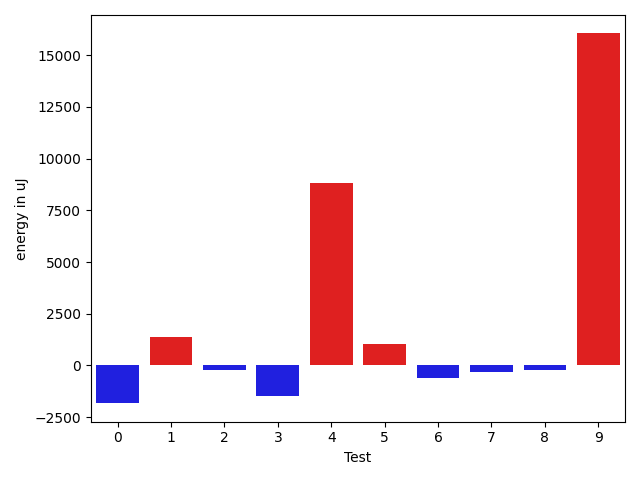

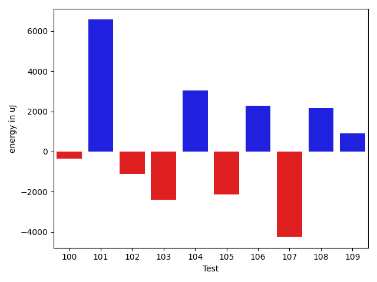

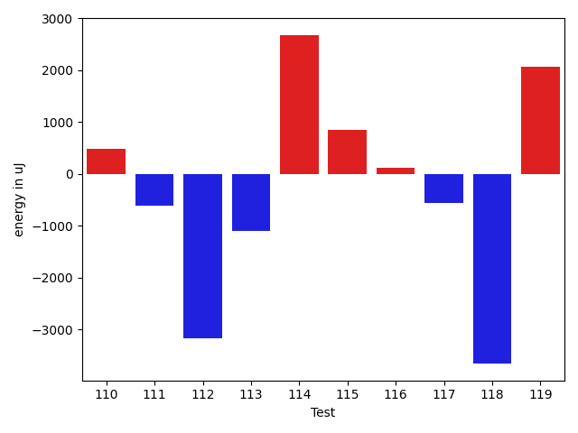

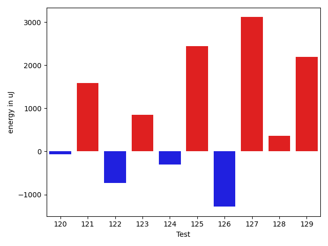

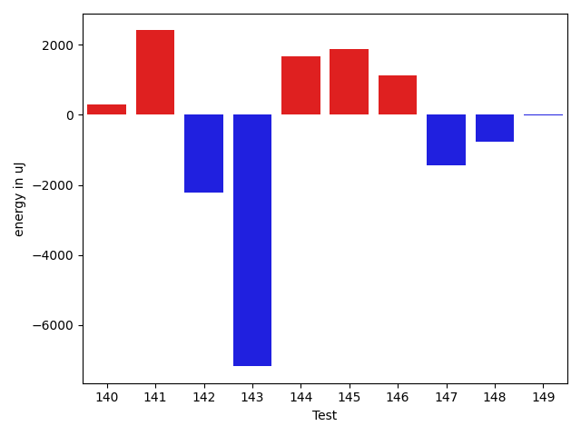

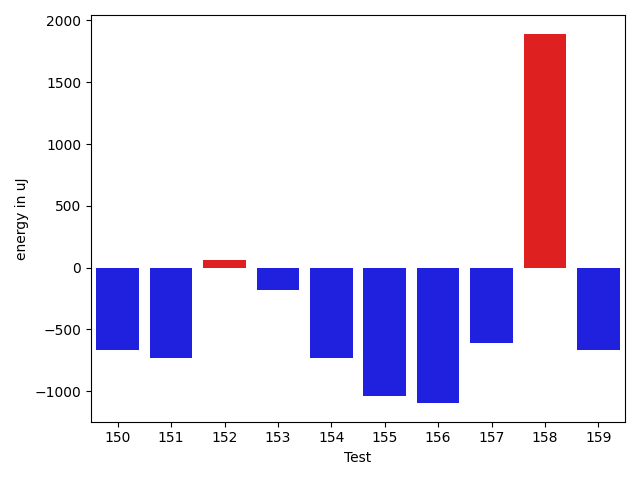

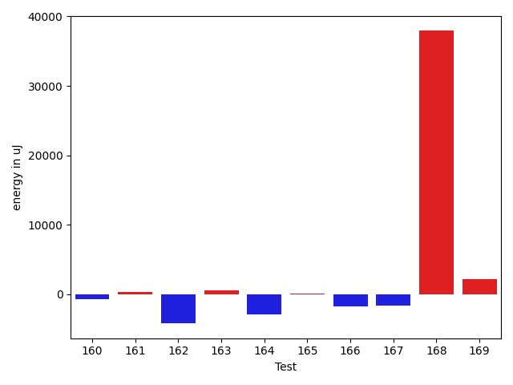

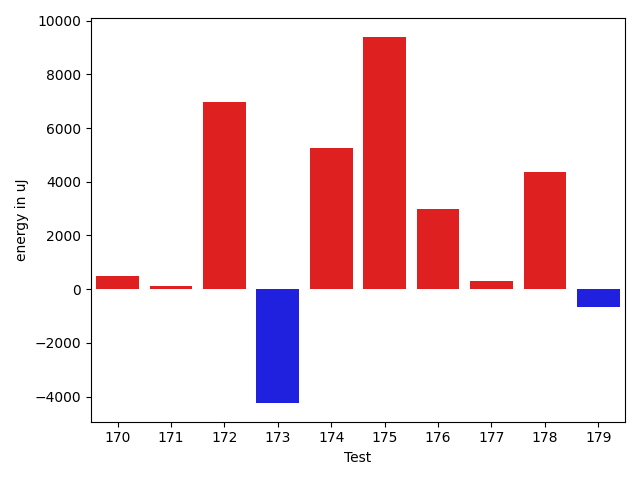

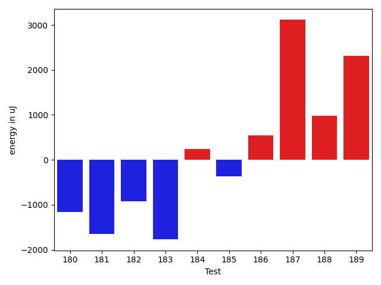

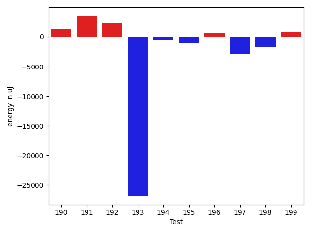

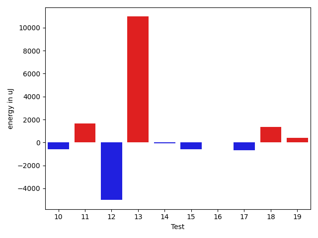

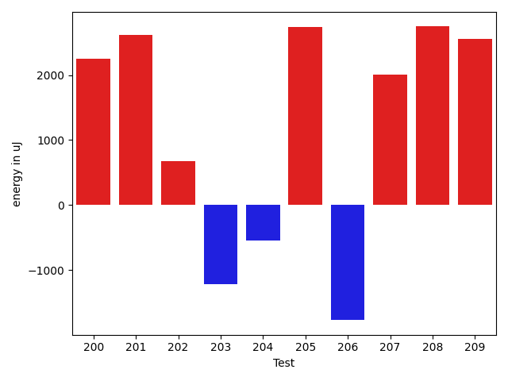

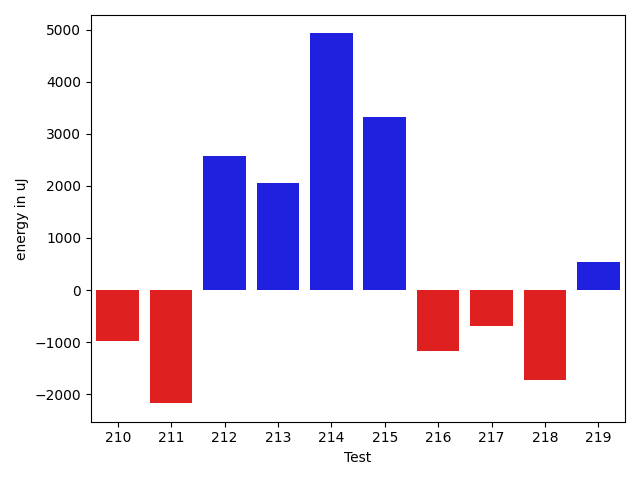

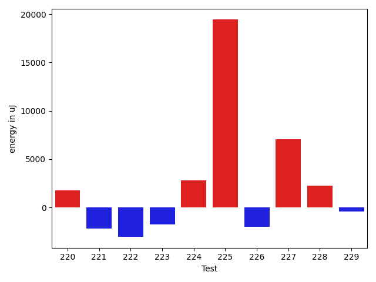

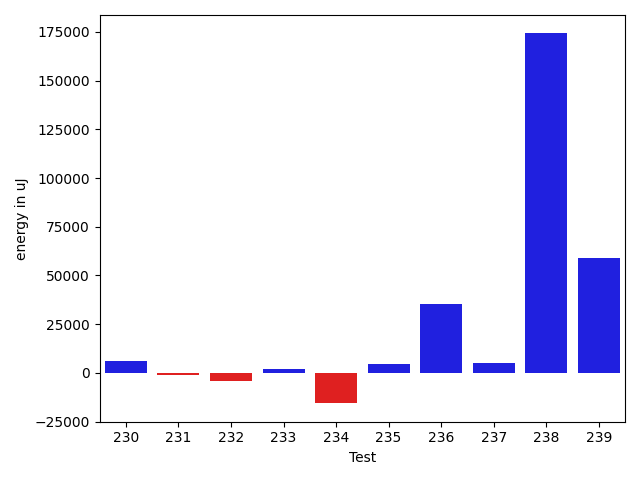

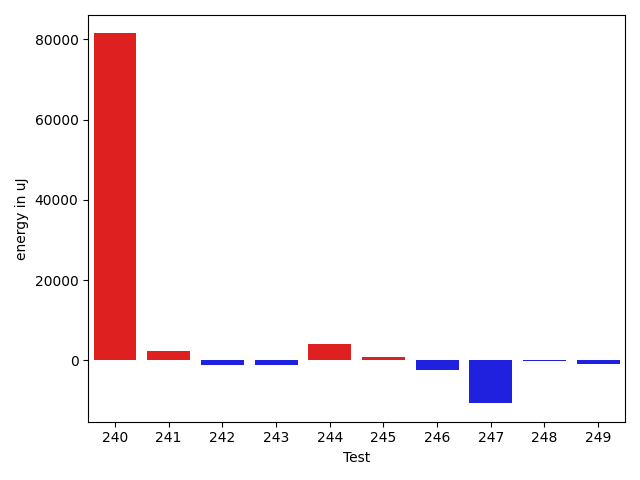

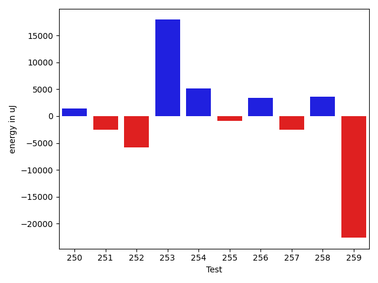

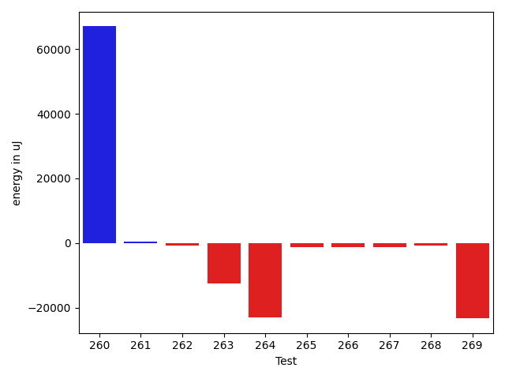

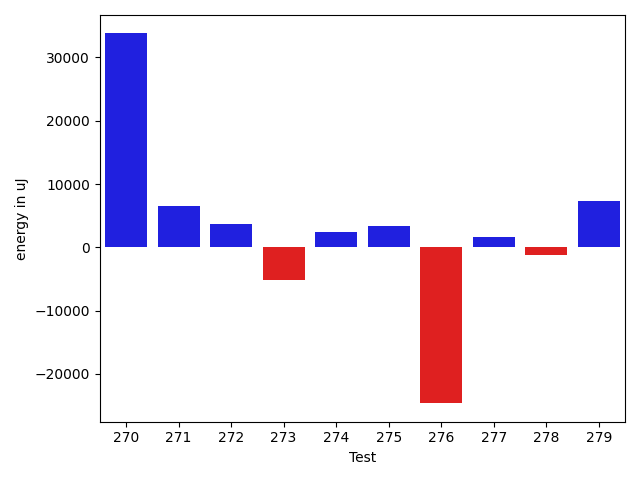

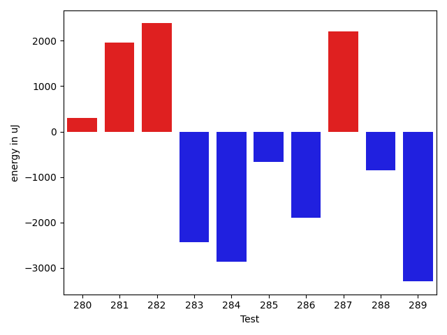

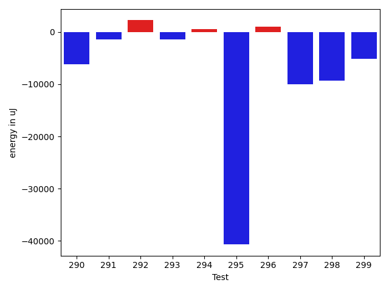

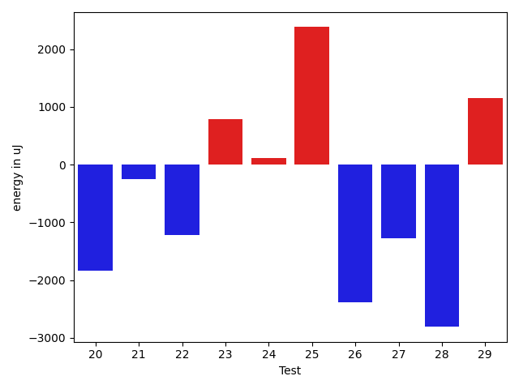

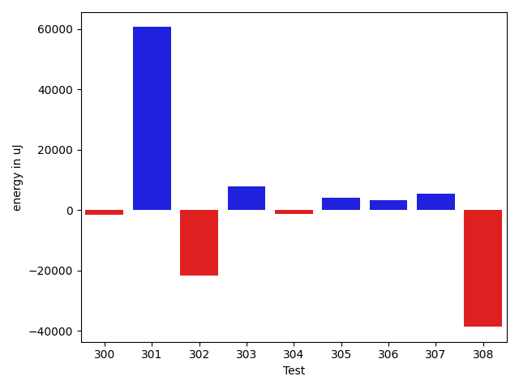

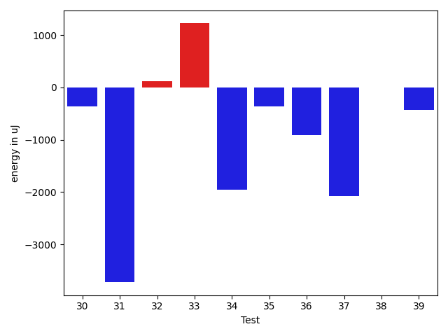

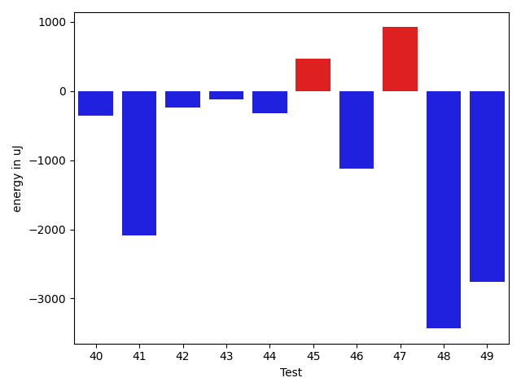

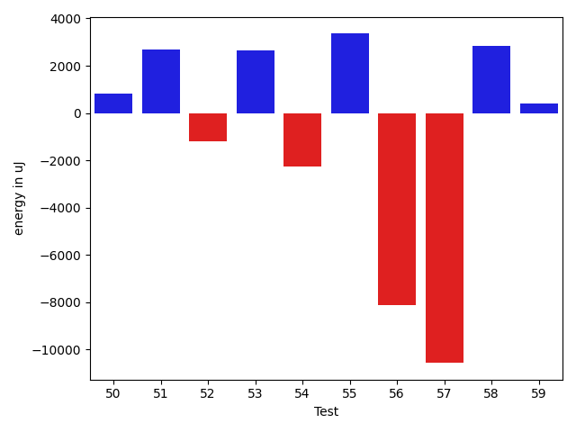

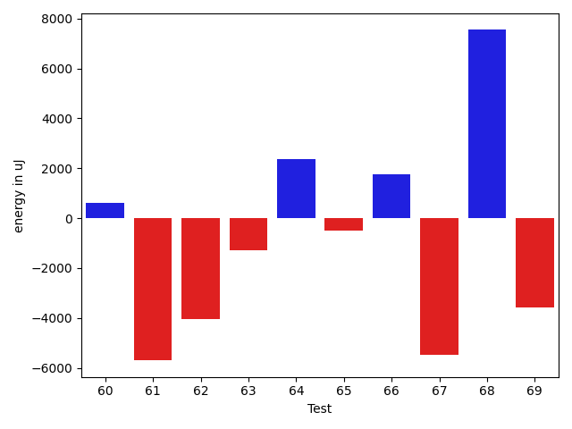

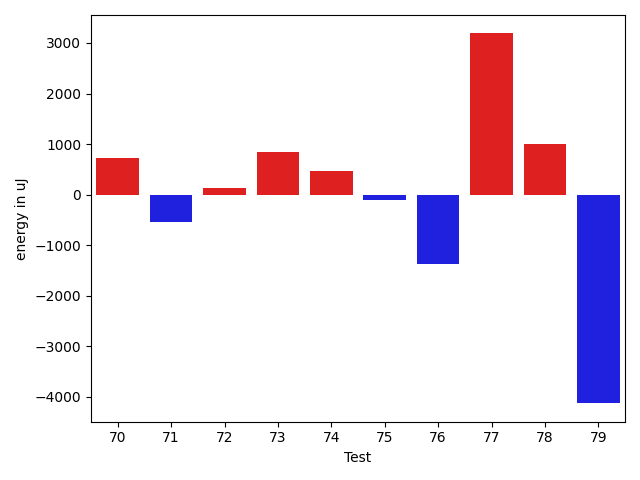

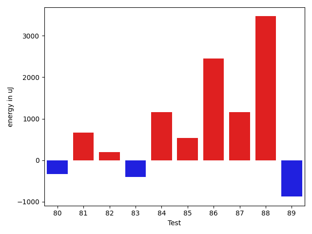

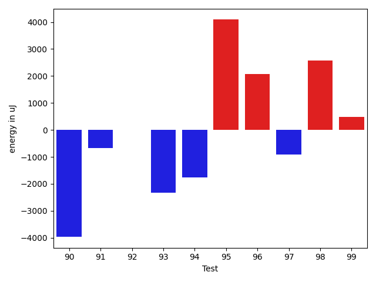

| ID | EnergyV1 | EnergyV2 | DeltaEnergy |
| --- | --- | --- | --- |
| 0 | 36306.87950515747 | 38601.94127178192 | 2295.0617666244507 |
| 1 | 33737.89834213257 | 36547.05766296387 | 2809.159320831299 |
| 2 | 34952.80545043945 | 42405.25199890137 | 7452.446548461914 |
| 3 | 55291.12690267858 | 36721.217270477915 | -18569.909632200666 |
| 4 | 40424.823061046234 | 40602.436337801584 | 177.61327675534994 |
| 5 | 37857.0924987793 | 34918.780462265015 | -2938.312036514282 |
| 6 | 35621.41796875 | 38012.53466796875 | 2391.11669921875 |
| 7 | 35347.112709999084 | 37815.013671875 | 2467.9009618759155 |
| 8 | 37908.14558976097 | 38657.821214839 | 749.6756250780309 |
| 9 | 62426.386464668016 | 48058.02702050388 | -14368.359444164133 |
| 10 | 61773.11892770668 | 70892.10726318284 | 9118.988335476162 |
| 11 | 47608.296921759655 | 55914.20914449687 | 8305.912222737214 |
| 12 | 40181.696382395996 | 36808.73870894665 | -3372.9576734493457 |
| 13 | 39569.33791077301 | 33456.637925624265 | -6112.699985148742 |
| 14 | 36282.56631289344 | 36567.68744558726 | 285.121132693821 |
| 15 | 39574.77113843978 | 34354.17878492442 | -5220.592353515356 |
| 16 | 34688.119140625 | 36154.4580078125 | 1466.3388671875 |
| 17 | 38426.34785544872 | 34007.18099498749 | -4419.166860461235 |
| 18 | 38767.63134765625 | 35968.38233947754 | -2799.249008178711 |
| 19 | 30040.544762442285 | 37409.683035125134 | 7369.138272682849 |
| 20 | 32709.603790283203 | 33074.95721435547 | 365.3534240722656 |
| 21 | 37763.56721496582 | 35676.050621032715 | -2087.5165939331055 |
| 22 | 38390.06481933594 | 38040.13330078125 | -349.9315185546875 |
| 23 | 38238.57416152954 | 38968.52258300781 | 729.9484214782715 |
| 24 | 40013.48328590393 | 35414.9443359375 | -4598.538949966431 |
| 25 | 36352.39630126953 | 43732.548919677734 | 7380.152618408203 |
| 26 | 35654.519775390625 | 38562.500244140625 | 2907.98046875 |
| 27 | 34241.558837890625 | 37539.2463684082 | 3297.687530517578 |
| 28 | 34087.13319846923 | 32894.392300849075 | -1192.740897620155 |
| 29 | 36523.557147979736 | 39276.7158203125 | 2753.1586723327637 |
| 30 | 37634.93701171875 | 38036.30224609375 | 401.365234375 |
| 31 | 39682.72119140625 | 40526.51513671875 | 843.7939453125 |
| 32 | 35673.20892055333 | 41029.36554100353 | 5356.156620450201 |
| 33 | 38210.494525909424 | 37771.80517578125 | -438.6893501281738 |
| 34 | 30820.707195281982 | 34642.01529383659 | 3821.308098554611 |
| 35 | 36491.16271972656 | 34626.04296875 | -1865.1197509765625 |
| 36 | 40531.36102294922 | 37438.054443359375 | -3093.3065795898438 |
| 37 | 37945.62338256836 | 36303.93477630615 | -1641.688606262207 |
| 38 | 39604.46875 | 40082.265625 | 477.796875 |
| 39 | 30802.4140625 | 36568.68505859375 | 5766.27099609375 |
| 40 | 38745.62351799011 | 40443.4035949707 | 1697.7800769805908 |
| 41 | 39720.83154296875 | 36890.04719543457 | -2830.7843475341797 |
| 42 | 32046.422622680664 | 37368.625 | 5322.202377319336 |
| 43 | 33832.39171600342 | 40077.27085876465 | 6244.8791427612305 |
| 44 | 31611.395531504997 | 38136.05990219116 | 6524.664370686165 |
| 45 | 38056.050048828125 | 32821.46875 | -5234.581298828125 |
| 46 | 36575.80552165217 | 40558.06262946248 | 3982.2571078103138 |
| 47 | 38340.46284532547 | 33492.567878723145 | -4847.894966602325 |
| 48 | 40381.53300738335 | 39945.18017578125 | -436.35283160209656 |
| 49 | 39246.68306875229 | 37940.27847290039 | -1306.4045958518982 |
| 50 | 38349.8388671875 | 39155.36474609375 | 805.52587890625 |
| 51 | 37345.79150390625 | 40020.63049316406 | 2674.8389892578125 |
| 52 | 38403.76249694824 | 37194.18232727051 | -1209.5801696777344 |
| 53 | 36449.01818847656 | 39093.414001464844 | 2644.3958129882812 |
| 54 | 39748.784423828125 | 37490.265625 | -2258.518798828125 |
| 55 | 37755.0771484375 | 41123.68505859375 | 3368.60791015625 |
| 56 | 39704.880859375 | 31591.16015625 | -8113.720703125 |
| 57 | 47927.31279087067 | 37352.48190753721 | -10574.83088333346 |
| 58 | 33298.60900878906 | 36136.626953125 | 2838.0179443359375 |
| 59 | 39542.402435302734 | 39931.781799316406 | 389.3793640136719 |
| 60 | 39735.2177734375 | 40346.52490234375 | 611.30712890625 |
| 61 | 40622.57586669922 | 34922.77062988281 | -5699.805236816406 |
| 62 | 40363.569301605225 | 36314.9248046875 | -4048.6444969177246 |
| 63 | 38748.43957519531 | 37470.31759643555 | -1278.1219787597656 |
| 64 | 36187.29502373934 | 38552.37060853839 | 2365.0755847990513 |
| 65 | 37235.76379394531 | 36746.1376953125 | -489.6260986328125 |
| 66 | 40314.19348144531 | 42074.4921875 | 1760.2987060546875 |
| 67 | 42116.63122558594 | 36641.54296875 | -5475.0882568359375 |
| 68 | 32092.656494140625 | 39639.7822265625 | 7547.125732421875 |
| 69 | 37196.34753417969 | 33620.57439136505 | -3575.7731428146362 |
| 70 | 33098.194396972656 | 38288.53173828125 | 5190.337341308594 |
| 71 | 38157.30859375 | 40496.292724609375 | 2338.984130859375 |
| 72 | 33789.36082458496 | 41539.48801469803 | 7750.127190113068 |
| 73 | 38847.482421875 | 35574.610595703125 | -3272.871826171875 |
| 74 | 39566.5078125 | 33590.600524902344 | -5975.907287597656 |
| 75 | 35976.731689453125 | 37315.8828125 | 1339.151123046875 |
| 76 | 33395.82794189453 | 34784.4248046875 | 1388.5968627929688 |
| 77 | 36121.651794433594 | 41098.398025512695 | 4976.746231079102 |
| 78 | 38941.390625 | 35878.16865539551 | -3063.221969604492 |
| 79 | 37363.408274636065 | 37788.06280244294 | 424.6545278068734 |
| 80 | 35000.51057550311 | 36893.6323136125 | 1893.1217381093884 |
| 81 | 34946.4330153598 | 39269.82038652163 | 4323.387371161829 |
| 82 | 35926.43874359131 | 38343.008838653564 | 2416.570095062256 |
| 83 | 123793.54831458189 | 115635.10344057734 | -8158.444874004548 |
| 84 | 36266.15354156494 | 37212.84912109375 | 946.6955795288086 |
| 85 | 223389.23796244158 | 172864.14074812422 | -50525.09721431736 |
| 86 | 40408.239762219564 | 34930.37424090877 | -5477.865521310792 |
| 87 | 36985.29883498006 | 38330.067904870484 | 1344.7690698904262 |
| 88 | 32044.177734375 | 32437.81201171875 | 393.63427734375 |
| 89 | 34499.39318847656 | 39334.209716796875 | 4834.8165283203125 |
| 90 | 36290.17438327585 | 39804.29970799068 | 3514.125324714827 |
| 91 | 70002.67417071866 | 77162.9839995866 | 7160.309828867947 |
| 92 | 32508.814796037026 | 40672.048345840565 | 8163.233549803539 |
| 93 | 32490.574426651 | 36553.72830724716 | 4063.153880596161 |
| 94 | 37894.32244010844 | 37708.291643245735 | -186.03079686270212 |
| 95 | 35173.369936949064 | 35926.04902332583 | 752.6790863767674 |
| 96 | 33194.88754272461 | 38264.299928188324 | 5069.412385463715 |
| 97 | 38313.92240124941 | 36257.657125608996 | -2056.265275640413 |
| 98 | 35461.24072265625 | 35521.63774108887 | 60.39701843261719 |
| 99 | 35525.56701112725 | 36205.525431856004 | 679.9584207287553 |
| 100 | 35718.93781928718 | 35366.08680523932 | -352.8510140478611 |
| 101 | 31782.65601670742 | 38352.8030152366 | 6570.146998529177 |
| 102 | 35896.62414550781 | 34768.28744029999 | -1128.3367052078247 |
| 103 | 35041.914043426514 | 32643.891568005085 | -2398.0224754214287 |
| 104 | 35246.011782348156 | 38290.63638305664 | 3044.6246007084846 |
| 105 | 35529.718922412074 | 33385.067641152775 | -2144.651281259299 |
| 106 | 32147.14013671875 | 34440.30386352539 | 2293.1637268066406 |
| 107 | 38736.926986694336 | 34481.364275336266 | -4255.56271135807 |
| 108 | 34956.466796875 | 37132.12417602539 | 2175.6573791503906 |
| 109 | 36701.21208000183 | 37601.396881103516 | 900.1848011016846 |
| 110 | 33779.328674316406 | 34199.16191864014 | 419.83324432373047 |
| 111 | 33075.977372169495 | 36601.16304016113 | 3525.185667991638 |
| 112 | 34841.048828125 | 35794.98617553711 | 953.9373474121094 |
| 113 | 37377.0456237793 | 37634.838958740234 | 257.7933349609375 |
| 114 | 36718.463384416806 | 38674.08770303527 | 1955.6243186184656 |
| 115 | 35393.65602030666 | 38305.06556320994 | 2911.409542903275 |
| 116 | 41044.545400437055 | 39523.54585893433 | -1520.9995415027224 |
| 117 | 38606.16691883036 | 37901.19597149651 | -704.9709473338444 |
| 118 | 33229.498263681875 | 38691.16535983396 | 5461.667096152087 |
| 119 | 36861.29512312844 | 36317.08816412097 | -544.206959007468 |
| 120 | 41808.99274654921 | 42046.81967383197 | 237.82692728276015 |
| 121 | 38135.70969074332 | 37803.20628297077 | -332.5034077725504 |
| 122 | 37889.17980746167 | 43813.14342662692 | 5923.9636191652535 |
| 123 | 33254.34385733087 | 42743.321392256126 | 9488.97753492526 |
| 124 | 37558.09818296083 | 40005.871314685486 | 2447.773131724658 |
| 125 | 35010.29854915522 | 40116.93263338778 | 5106.634084232566 |
| 126 | 38668.9453125 | 36243.85339355469 | -2425.0919189453125 |
| 127 | 40256.845275878906 | 72342.66720962524 | 32085.821933746338 |
| 128 | 37329.02770996094 | 30722.734375 | -6606.2933349609375 |
| 129 | 41480.03576660156 | 33580.42986679077 | -7899.605899810791 |
| 130 | 33291.093658447266 | 35687.49987792969 | 2396.406219482422 |
| 131 | 35653.030349731445 | 41857.6162109375 | 6204.585861206055 |
| 132 | 35105.498046875 | 36367.34375 | 1261.845703125 |
| 133 | 39543.24169921875 | 37305.8701171875 | -2237.37158203125 |
| 134 | 37640.47705078125 | 40459.97058105469 | 2819.4935302734375 |
| 135 | 41315.00622558594 | 33670.80358886719 | -7644.20263671875 |
| 136 | 35944.025390625 | 35821.357360839844 | -122.66802978515625 |
| 137 | 34630.69905422986 | 40352.61408232586 | 5721.915028096002 |
| 138 | 34189.200332972665 | 36340.412802990744 | 2151.2124700180793 |
| 139 | 33855.958983421326 | 38766.45650482178 | 4910.497521400452 |
| 140 | 34307.04014195921 | 39086.11735247576 | 4779.077210516552 |
| 141 | 50520.946966563024 | 37587.9229125836 | -12933.024053979425 |
| 142 | 38238.891646765944 | 41031.76705571264 | 2792.8754089466966 |
| 143 | 33030.68717054178 | 42239.04235409161 | 9208.35518354983 |
| 144 | 35480.05806481838 | 42863.100707769394 | 7383.042642951012 |
| 145 | 33959.203256353736 | 37616.59461212158 | 3657.391355767846 |
| 146 | 34968.54344288805 | 37227.4062114693 | 2258.8627685812535 |
| 147 | 37601.958050727844 | 33841.90323638916 | -3760.054814338684 |
| 148 | 35260.676666259766 | 39109.99843168259 | 3849.321765422821 |
| 149 | 36284.264515817165 | 38693.63933074474 | 2409.374814927578 |
| 150 | 180225.77399634942 | 38608.17214752501 | -141617.60184882442 |
| 151 | 36105.00020813942 | 34565.86100316048 | -1539.1392049789429 |
| 152 | 34643.53018611836 | 39458.746534087826 | 4815.216347969465 |
| 153 | 40775.46435546875 | 40909.657822430134 | 134.19346696138382 |
| 154 | 37392.019104003906 | 37679.75880147517 | 287.739697471261 |
| 155 | 37208.01926279068 | 40540.40403807163 | 3332.3847752809525 |
| 156 | 33275.115449905396 | 34586.75225162506 | 1311.6368017196655 |
| 157 | 36738.292110443115 | 37189.43737030029 | 451.14525985717773 |
| 158 | 32847.010009765625 | 37892.5773267746 | 5045.567317008972 |
| 159 | 37334.56439781189 | 37694.04024600983 | 359.475848197937 |
| 160 | 35801.54541015625 | 40196.701972961426 | 4395.156562805176 |
| 161 | 37441.82988628745 | 35665.992128733546 | -1775.8377575539052 |
| 162 | 56272.686884499955 | 60017.63920320851 | 3744.952318708558 |
| 163 | 38526.60080496839 | 41625.73819732666 | 3099.1373923582723 |
| 164 | 38528.15599156673 | 43658.29659728211 | 5130.14060571538 |
| 165 | 36963.51999893947 | 40290.40942819556 | 3326.8894292560944 |
| 166 | 37575.32870153361 | 41320.269143521786 | 3744.9404419881757 |
| 167 | 35653.44616043568 | 36587.00744628906 | 933.5612858533859 |
| 168 | 39029.1179933548 | 46046.727001190186 | 7017.609007835388 |
| 169 | 41230.34892147816 | 46084.78816139937 | 4854.439239921208 |
| 170 | 37038.29248046875 | 35500.19921875 | -1538.09326171875 |
| 171 | 76440.9268881432 | 45457.94096432373 | -30982.985923819477 |
| 172 | 34316.21021973114 | 33697.37125151877 | -618.838968212367 |
| 173 | 44097.329090790154 | 44235.539087340316 | 138.20999655016203 |
| 174 | 40653.87558280607 | 59413.300006866455 | 18759.424424060388 |
| 175 | 40237.484375 | 36058.031982421875 | -4179.452392578125 |
| 176 | 49652.35310160226 | 37538.52508935733 | -12113.828012244929 |
| 177 | 39799.655588839174 | 32231.59080472361 | -7568.064784115562 |
| 178 | 36884.79030921584 | 37867.02112425961 | 982.2308150437748 |
| 179 | 38976.51789255541 | 43988.63166232628 | 5012.113769770876 |
| 180 | 39997.166159788256 | 32452.317417399478 | -7544.848742388778 |
| 181 | 37722.218523837204 | 61352.74387906521 | 23630.525355228005 |
| 182 | 39131.903329061126 | 77214.47102224658 | 38082.567693185454 |
| 183 | 41737.15673750835 | 36395.105037645924 | -5342.0516998624225 |
| 184 | 40737.07034056157 | 46521.19281095241 | 5784.122470390837 |
| 185 | 40133.34356214132 | 42813.623261915265 | 2680.2796997739424 |
| 186 | 42836.27998650759 | 37110.995581924566 | -5725.284404583021 |
| 187 | 33249.97085648793 | 37810.56553771331 | 4560.594681225375 |
| 188 | 32516.74749671405 | 38684.312216868726 | 6167.564720154674 |
| 189 | 33232.58859256415 | 37530.71013309849 | 4298.121540534339 |
| 190 | 41057.49359487742 | 37829.65754057001 | -3227.8360543074086 |
| 191 | 34442.63274014322 | 36702.78962857649 | 2260.1568884332664 |
| 192 | 38557.02081118524 | 40288.278216914594 | 1731.2574057293532 |
| 193 | 36906.475073654496 | 41966.27819897696 | 5059.803125322462 |
| 194 | 60504.116003189374 | 49376.67983482356 | -11127.436168365814 |
| 195 | 76776.04576794751 | 92697.74194607357 | 15921.696178126062 |
| 196 | 50385.13057625266 | 35248.837334009964 | -15136.293242242697 |
| 197 | 38539.438147623485 | 41070.87558511522 | 2531.4374374917315 |
| 198 | 39242.11669891782 | 40685.03876531869 | 1442.9220664008753 |
| 199 | 38761.56676931103 | 37366.061848751604 | -1395.504920559426 |
| 200 | 43897.70755672455 | 53047.921005666256 | 9150.213448941708 |
| 201 | 34976.43169835544 | 37008.74408030705 | 2032.3123819516113 |
| 202 | 115673.50001116481 | 118610.33571217272 | 2936.8357010079053 |
| 203 | 35247.00962781857 | 35009.381614741265 | -237.62801307730115 |
| 204 | 37040.97541511931 | 39203.86108864955 | 2162.8856735302397 |
| 205 | 36802.764763708095 | 46132.77815824069 | 9330.013394532594 |
| 206 | 36905.99164773182 | 36609.27766523558 | -296.713982496236 |
| 207 | 35235.277797553215 | 37220.30439207038 | 1985.0265945171632 |
| 208 | 34469.03259343753 | 33434.65983576678 | -1034.372757670746 |
| 209 | 36352.21061299512 | 38798.306749813964 | 2446.0961368188437 |
| 210 | 37003.17990071738 | 36016.50335594345 | -986.6765447739308 |
| 211 | 36864.2111425405 | 34688.54243587756 | -2175.6687066629383 |
| 212 | 37876.848073880516 | 40459.34913766789 | 2582.501063787371 |
| 213 | 33984.9632220126 | 36047.15260079046 | 2062.189378777861 |
| 214 | 34012.3367319196 | 38942.615563330495 | 4930.278831410898 |
| 215 | 33230.47830134182 | 36551.452523565895 | 3320.9742222240748 |
| 216 | 36354.24740997216 | 35181.46756798103 | -1172.779841991127 |
| 217 | 40314.20635769426 | 39619.00639806092 | -695.1999596333408 |
| 218 | 37427.92150109324 | 35702.563416302444 | -1725.3580847907942 |
| 219 | 37375.225149322534 | 37911.01402157945 | 535.7888722569187 |
| 220 | 35633.90400368051 | 38287.16606637957 | 2653.262062699061 |
| 221 | 37294.16174710725 | 35304.33371210234 | -1989.82803500491 |
| 222 | 38964.13213515414 | 36610.82880548242 | -2353.3033296717185 |
| 223 | 84245.05913273201 | 80998.37241652535 | -3246.686716206663 |
| 224 | 43413.197747938044 | 39288.97455141932 | -4124.223196518724 |
| 225 | 39661.51536332998 | 38827.75526289511 | -833.760100434869 |
| 226 | 112174.6723613386 | 64264.45118369785 | -47910.22117764075 |
| 227 | 35754.02230383771 | 38683.41817683878 | 2929.395873001071 |
| 228 | 34349.3196307843 | 38761.94223700414 | 4412.62260621984 |
| 229 | 36870.69140625 | 36512.78189086914 | -357.9095153808594 |
| 230 | 35188.912341614225 | 41065.46363551915 | 5876.551293904922 |
| 231 | 40287.066891447066 | 39292.60024323789 | -994.466648209178 |
| 232 | 39713.301965332415 | 35505.54779032899 | -4207.754175003429 |
| 233 | 41961.179848174565 | 43818.726011040504 | 1857.5461628659396 |
| 234 | 57629.6818930517 | 42040.70201881239 | -15588.979874239303 |
| 235 | 37575.88893027002 | 41879.963395766215 | 4304.074465496196 |
| 236 | 34754.544847232624 | 70055.48550570165 | 35300.94065846903 |
| 237 | 38472.15308126522 | 43651.223875573516 | 5179.070794308296 |
| 238 | 1652607.68888216 | 1826823.5312926662 | 174215.84241050621 |
| 239 | 300296.140984674 | 359439.2254159378 | 59143.08443126379 |
| 240 | 38043.216551620004 | 55372.948676449465 | 17329.73212482946 |
| 241 | 44347.39033129565 | 47521.24743856573 | 3173.8571072700797 |
| 242 | 76807.23505704555 | 98090.84273072591 | 21283.607673680366 |
| 243 | 119712.07760919325 | 177623.00266411854 | 57910.92505492529 |
| 244 | 38621.53373417258 | 33901.829592292896 | -4719.704141879687 |
| 245 | 37493.22692361134 | 39130.4766452527 | 1637.249721641354 |
| 246 | 37124.4429246859 | 34522.57130483591 | -2601.8716198499897 |
| 247 | 34352.06373198209 | 45233.380064424055 | 10881.316332441966 |
| 248 | 37052.03803356073 | 36849.503832925424 | -202.5342006353094 |
| 249 | 36511.40424154728 | 38763.87587767368 | 2252.4716361264 |
| 250 | 37652.22767375624 | 39108.434709920046 | 1456.2070361638034 |
| 251 | 39233.12348675221 | 36702.423281590505 | -2530.700205161702 |
| 252 | 39155.45417751151 | 33328.37115679274 | -5827.083020718768 |
| 253 | 36583.717367987236 | 54535.04523969435 | 17951.327871707115 |
| 254 | 35396.61754142103 | 40513.46369686701 | 5116.846155445979 |
| 255 | 37420.65576529503 | 36518.49731779922 | -902.1584474958072 |
| 256 | 35671.93164732307 | 39082.22671061754 | 3410.2950632944703 |
| 257 | 39617.366007394856 | 37049.670033454895 | -2567.695973939961 |
| 258 | 36750.87062013894 | 40381.9056284735 | 3631.0350083345547 |
| 259 | 69247.119647054 | 46597.35900771618 | -22649.760639337823 |
| 260 | 315496.8646954156 | 382553.0281530262 | 67056.16345761059 |
| 261 | 41258.795137735455 | 41644.3384446515 | 385.54330691604264 |
| 262 | 40642.33044858882 | 39953.38583031297 | -688.9446182758547 |
| 263 | 48744.80875968933 | 36147.69762611389 | -12597.11113357544 |
| 264 | 66014.54733838607 | 42861.516254026676 | -23153.03108435939 |
| 265 | 38172.18885457516 | 36844.117904901505 | -1328.0709496736526 |
| 266 | 39447.766334056854 | 38106.19911277294 | -1341.5672212839127 |
| 267 | 40309.977613490075 | 38975.35724111274 | -1334.620372377336 |
| 268 | 40192.581845120796 | 39480.8373491114 | -711.7444960093926 |
| 269 | 213694.05409327472 | 190354.8827382262 | -23339.171355048515 |
| 270 | 35555.798312857965 | 69344.83530053703 | 33789.036987679065 |
| 271 | 32207.330756627103 | 38655.07954611673 | 6447.748789489626 |
| 272 | 36047.41259765625 | 39700.10925292969 | 3652.6966552734375 |
| 273 | 40378.4923992157 | 35201.65602874756 | -5176.83637046814 |
| 274 | 36287.900390625 | 38700.102281570435 | 2412.2018909454346 |
| 275 | 35093.63415527344 | 38444.07647514343 | 3350.442319869995 |
| 276 | 58845.073321156204 | 34198.04152763712 | -24647.031793519083 |
| 277 | 33778.13042426109 | 35380.398733496666 | 1602.2683092355728 |
| 278 | 36462.526927948 | 35249.24499511719 | -1213.2819328308105 |
| 279 | 31565.406074523926 | 38882.35909643397 | 7316.953021910042 |
| 280 | 39281.66198730469 | 39405.03352355957 | 123.37153625488281 |
| 281 | 37414.2184047699 | 39205.48126769066 | 1791.262862920761 |
| 282 | 34318.74551830068 | 35732.7515937984 | 1414.0060754977167 |
| 283 | 38543.59334810279 | 37680.90342902765 | -862.6899190751428 |
| 284 | 37059.99639725685 | 38147.815672278404 | 1087.819275021553 |
| 285 | 37890.13000488281 | 40341.962116241455 | 2451.8321113586426 |
| 286 | 38454.48799095125 | 93509.94993330538 | 55055.46194235413 |
| 287 | 34421.349266052246 | 34391.595200657845 | -29.75406539440155 |
| 288 | 34669.99415683746 | 38709.860595703125 | 4039.8664388656616 |
| 289 | 34184.6788482666 | 34869.59084561467 | 684.9119973480701 |
| 290 | 106638.55468004454 | 40368.34517186218 | -66270.20950818236 |
| 291 | 39897.06794017553 | 38363.74801635742 | -1533.3199238181114 |
| 292 | 35430.76501464844 | 38827.28308105469 | 3396.51806640625 |
| 293 | 38993.92411804199 | 36637.39970397949 | -2356.5244140625 |
| 294 | 41554.38879488617 | 59895.53137495817 | 18341.142580072003 |
| 295 | 40452.53814852238 | 40175.76530523598 | -276.7728432863951 |
| 296 | 41492.8165230155 | 37685.832750179805 | -3806.9837728356943 |
| 297 | 36396.05276561824 | 39783.67759987633 | 3387.624834258095 |
| 298 | 42501.21299648285 | 39611.88303654827 | -2889.3299599345773 |
| 299 | 39579.68791294098 | 34632.48829650879 | -4947.19961643219 |
| 300 | 37895.16287994385 | 36423.847732543945 | -1471.3151473999023 |
| 301 | 63208.011800675544 | 123840.64768031308 | 60632.635879637535 |
| 302 | 60334.380115763845 | 38513.52653299368 | -21820.853582770163 |
| 303 | 40355.95202398989 | 48165.72352911193 | 7809.771505122037 |
| 304 | 42166.100930500776 | 40944.138385982136 | -1221.9625445186393 |
| 305 | 33451.15043038316 | 37401.20318740606 | 3950.0527570229024 |
| 306 | 34009.03399263695 | 37219.838641453534 | 3210.8046488165855 |
| 307 | 36490.22271553869 | 42013.933853939176 | 5523.711138400482 |
| 308 | 95733.73330190778 | 57026.348724365234 | -38707.38457754254 |

## Delta Duration per test method

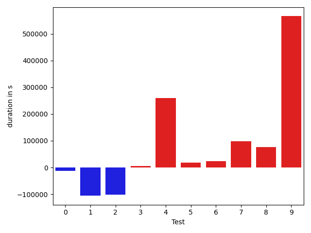

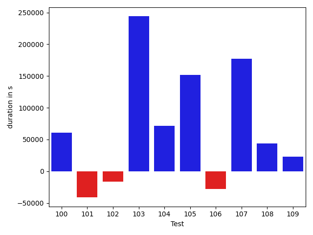

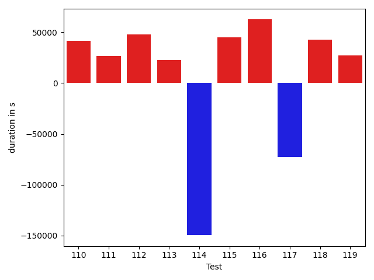

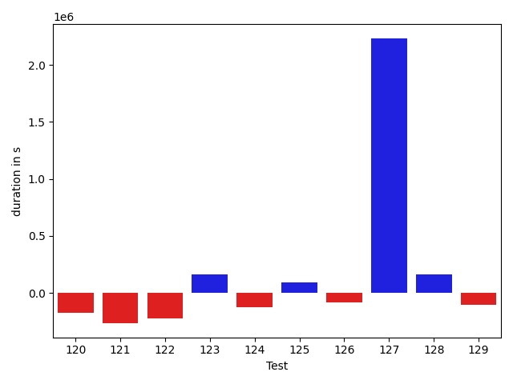

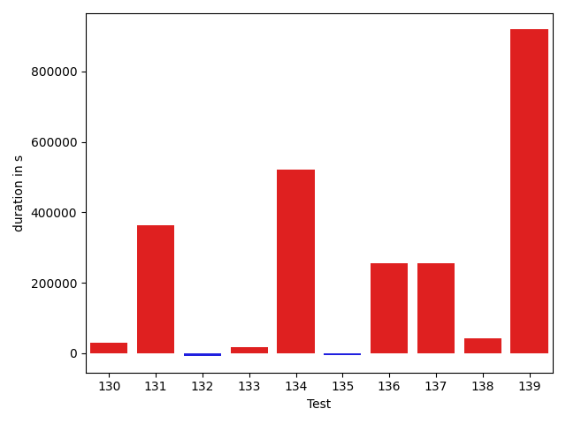

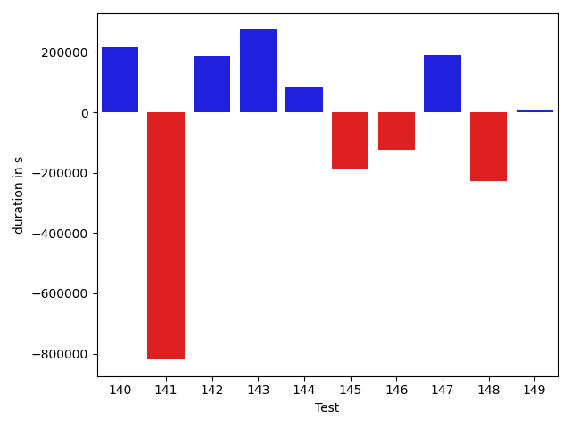

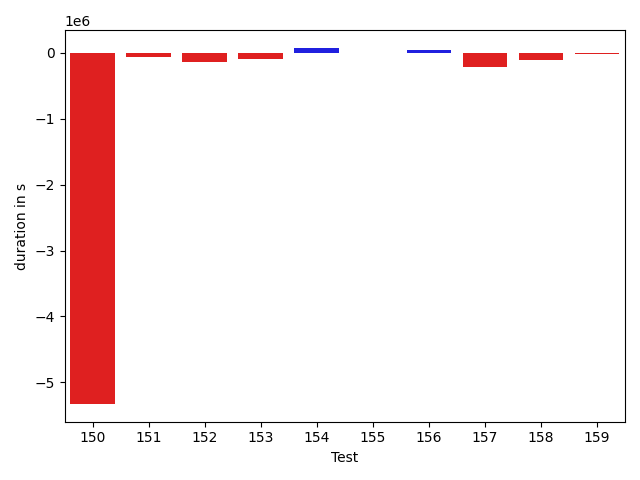

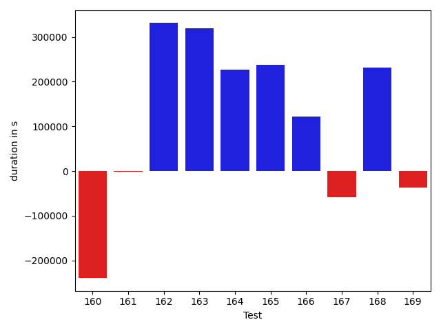

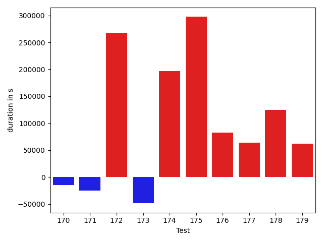

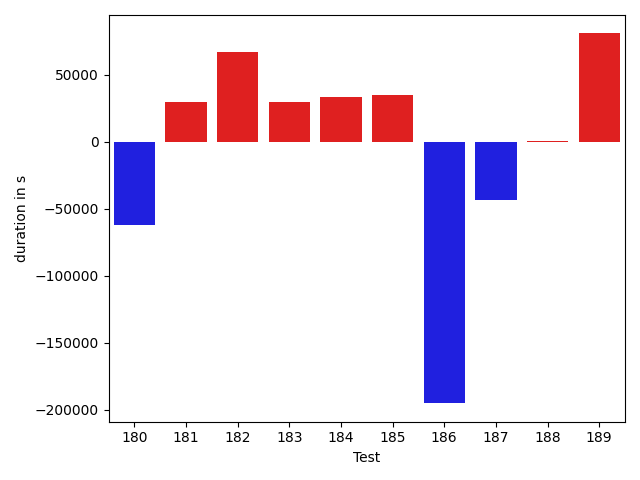

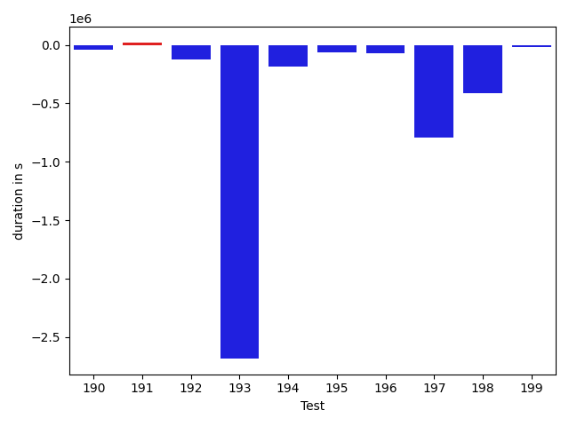

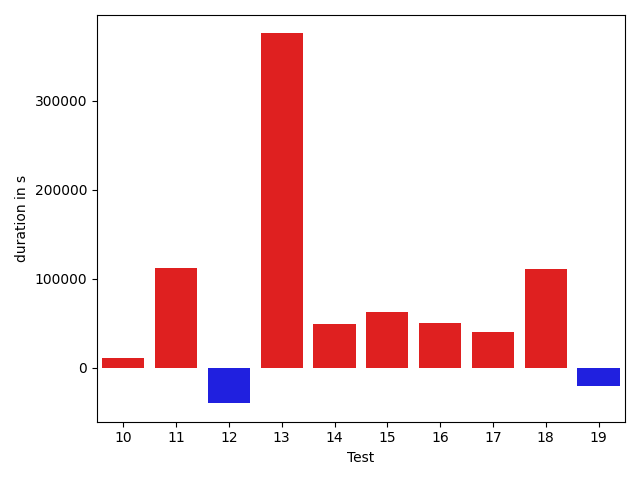

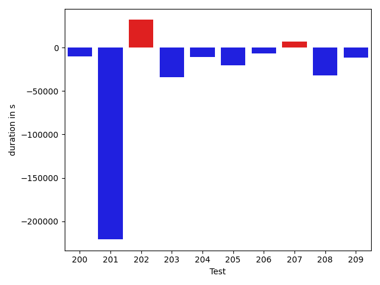

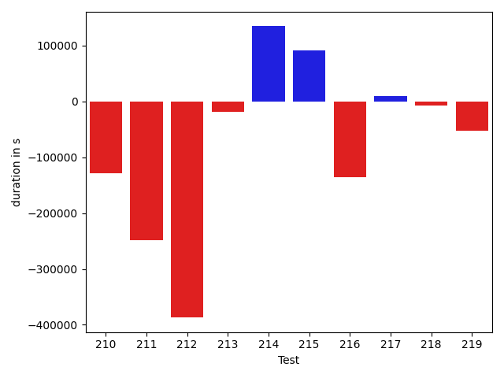

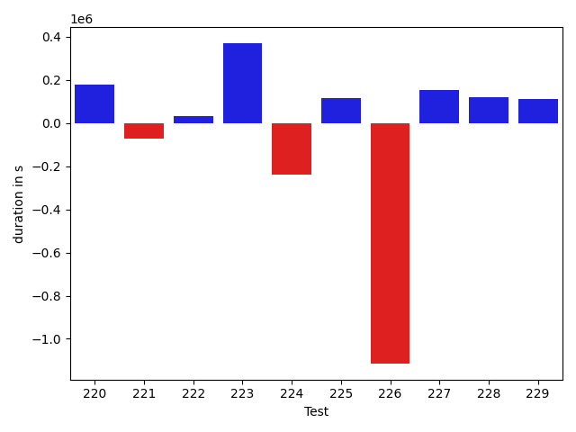

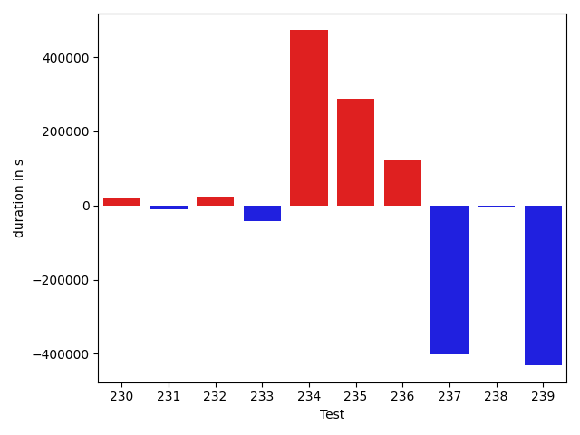

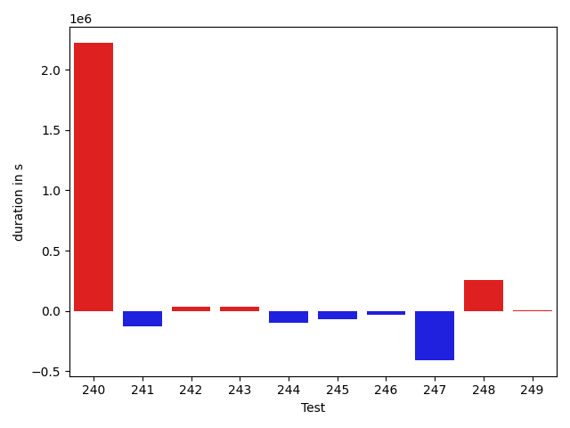

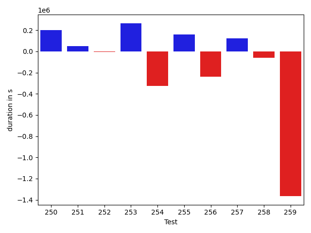

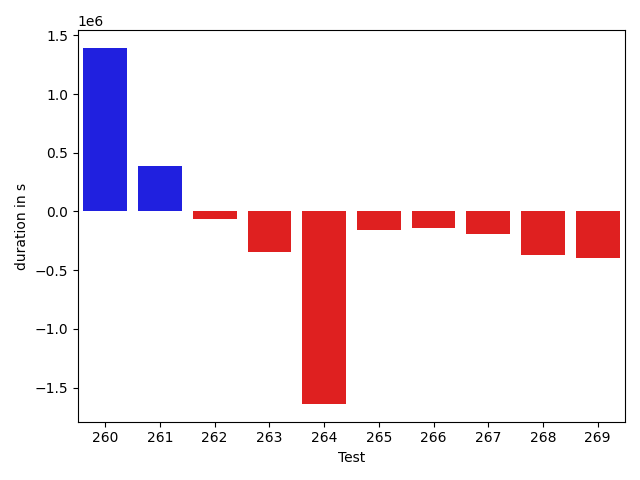

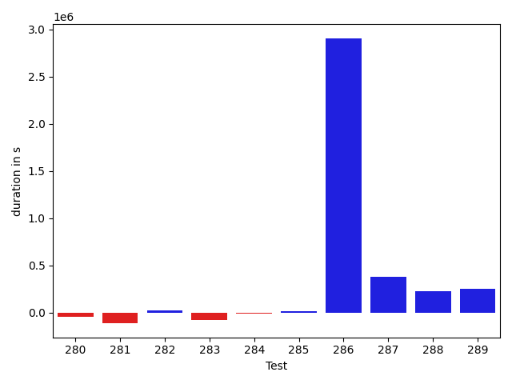

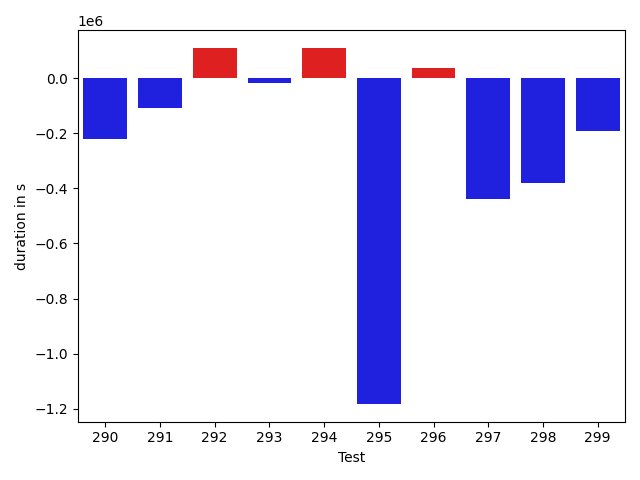

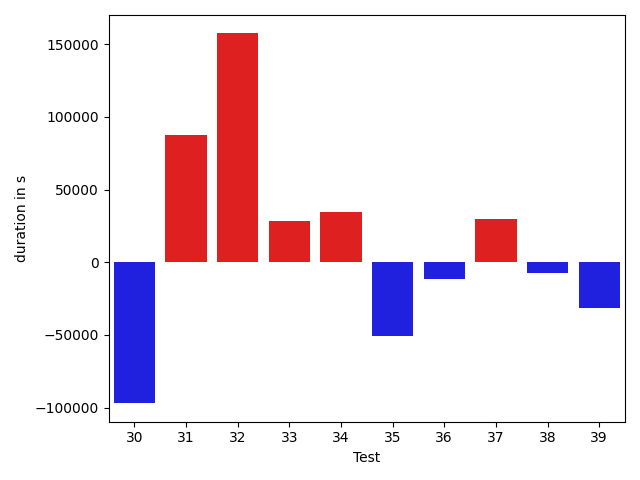

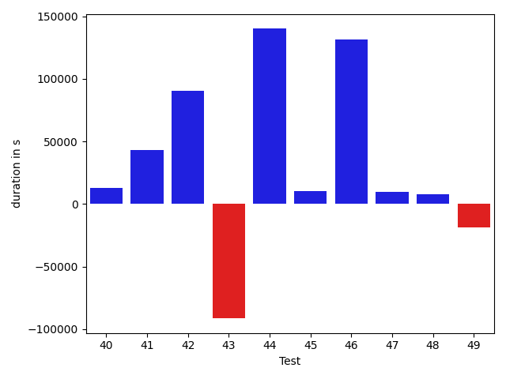

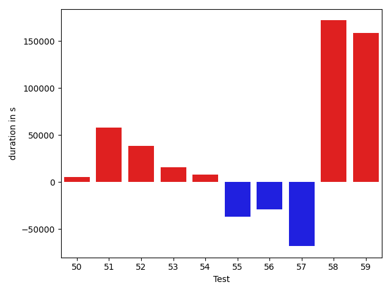

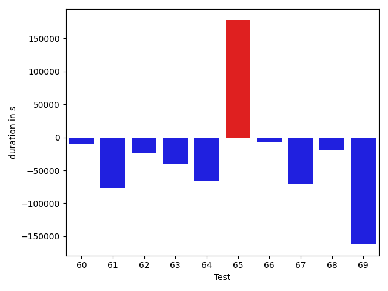

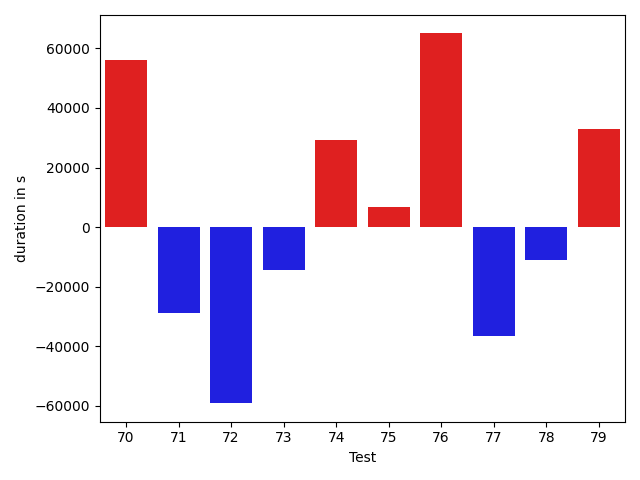

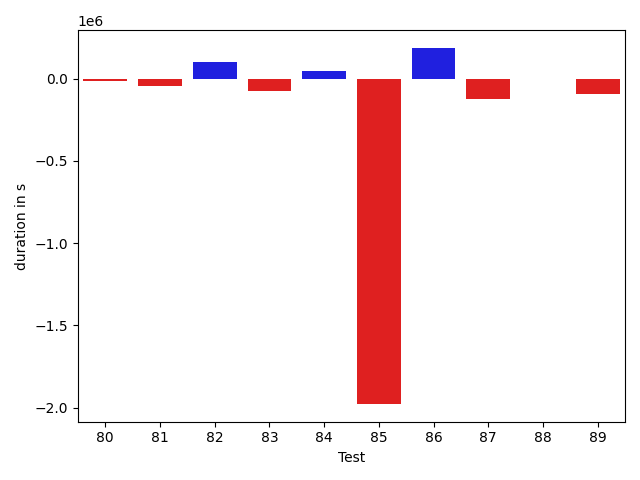

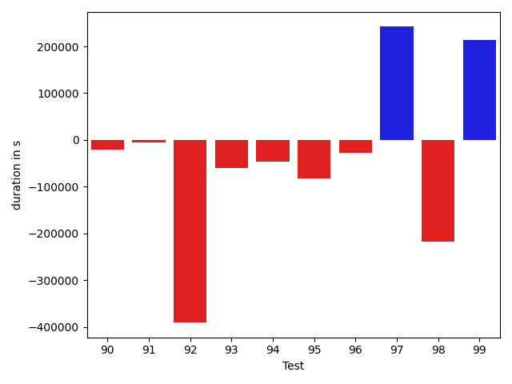

| ID | DurationV1 | DurationsV2 | DeltaDuration |
| --- | --- | --- | --- |
| 0 | 333734.54069137573 | 451063.3642101288 | 117328.82351875305 |
| 1 | 432325.8807449341 | 496496.23779296875 | 64170.35704803467 |
| 2 | 348809.8382873535 | 388351.2208595276 | 39541.38257217407 |
| 3 | 1661232.1202697728 | 3794064.36021936 | 2132832.239949587 |
| 4 | 731822.2734195092 | 791015.3660877522 | 59193.092668242985 |
| 5 | 261893.36946105957 | 468932.8448009491 | 207039.47533988953 |
| 6 | 405805.89599609375 | 376444.4291687012 | -29361.466827392578 |
| 7 | 303240.4500403404 | 458396.376953125 | 155155.92691278458 |
| 8 | 1063363.4975093885 | 1155713.1853478896 | 92349.68783850106 |
| 9 | 1767742.756192331 | 1660056.179056421 | -107686.57713591005 |
| 10 | 1228977.1100738163 | 1713317.326936785 | 484340.21686296863 |
| 11 | 1225567.7410706733 | 1601996.4415211857 | 376428.70045051235 |
| 12 | 851810.4468930219 | 695146.4153964631 | -156664.0314965588 |
| 13 | 643653.1348555053 | 807371.1155876158 | 163717.98073211045 |
| 14 | 662626.589328281 | 650985.8747060333 | -11640.714622247731 |
| 15 | 704622.787415613 | 709253.4245352681 | 4630.637119655148 |
| 16 | 302405.796875 | 370962.3518066406 | 68556.55493164062 |
| 17 | 370476.51582729816 | 450889.7830196619 | 80413.26719236374 |
| 18 | 359214.865234375 | 343502.31996154785 | -15712.545272827148 |
| 19 | 854119.4718257372 | 844349.2117385746 | -9770.260087162605 |
| 20 | 292881.5058898926 | 346399.48223876953 | 53517.97634887695 |
| 21 | 371191.59912109375 | 337140.7280578613 | -34050.87106323242 |
| 22 | 321720.8906555176 | 371744.7390136719 | 50023.8483581543 |
| 23 | 329641.83459854126 | 362904.0081176758 | 33262.17351913452 |
| 24 | 256257.74035072327 | 403611.0458984375 | 147353.30554771423 |
| 25 | 409344.85260009766 | 564652.1321620941 | 155307.27956199646 |
| 26 | 344380.3869628906 | 351866.6135253906 | 7486.2265625 |
| 27 | 279045.13232421875 | 290259.1477050781 | 11214.015380859375 |
| 28 | 959600.2507131074 | 892776.1026242801 | -66824.14808882726 |
| 29 | 309456.4535808563 | 329597.884765625 | 20141.431184768677 |
| 30 | 317962.6589355469 | 342670.7548828125 | 24708.095947265625 |
| 31 | 287232.1887207031 | 339369.080078125 | 52136.891357421875 |
| 32 | 3743389.643375954 | 905709.4019101243 | -2837680.24146583 |
| 33 | 631475.8296051025 | 648879.4741210938 | 17403.64451599121 |
| 34 | 447966.48905181885 | 416252.8766527176 | -31713.612399101257 |
| 35 | 300629.82165527344 | 350431.859375 | 49802.03771972656 |
| 36 | 276496.2072753906 | 334475.77423095703 | 57979.566955566406 |
| 37 | 302968.85623168945 | 599595.6691646576 | 296626.81293296814 |
| 38 | 333429.46875 | 384151.1875 | 50721.71875 |
| 39 | 213768.9140625 | 331095.6416015625 | 117326.7275390625 |
| 40 | 340897.4635477066 | 353646.67767333984 | 12749.21412563324 |
| 41 | 336085.658203125 | 379073.8988189697 | 42988.24061584473 |
| 42 | 381742.12742614746 | 472465.375 | 90723.24757385254 |
| 43 | 341803.92405700684 | 250301.29739379883 | -91502.62666320801 |
| 44 | 344094.4361298892 | 484104.6804007217 | 140010.2442708325 |
| 45 | 396183.71520996094 | 406188.359375 | 10004.644165039062 |
| 46 | 616117.3819428845 | 747241.210232961 | 131123.82829007646 |
| 47 | 353792.7944755554 | 363730.0546569824 | 9937.260181427002 |
| 48 | 314650.93327093124 | 322239.25634765625 | 7588.323076725006 |
| 49 | 420195.03677749634 | 401481.6079711914 | -18713.42880630493 |
| 50 | 421307.94775390625 | 488233.12060546875 | 66925.1728515625 |
| 51 | 281056.619140625 | 318213.77014160156 | 37157.15100097656 |
| 52 | 315802.9106750488 | 303755.6607437134 | -12047.24993133545 |
| 53 | 435501.3879394531 | 424024.8485107422 | -11476.539428710938 |
| 54 | 325243.83251953125 | 406273.51953125 | 81029.68701171875 |
| 55 | 333177.23974609375 | 442419.4852294922 | 109242.24548339844 |
| 56 | 338759.3310546875 | 502332.3056640625 | 163572.974609375 |
| 57 | 647973.1385307312 | 780149.508613389 | 132176.37008265778 |
| 58 | 420705.7106933594 | 392548.630859375 | -28157.079833984375 |
| 59 | 347087.5500488281 | 372483.53125 | 25395.981201171875 |
| 60 | 390618.0363769531 | 265592.5231933594 | -125025.51318359375 |
| 61 | 258744.595703125 | 502818.10400390625 | 244073.50830078125 |
| 62 | 384084.0475845337 | 350418.1376953125 | -33665.90988922119 |
| 63 | 344325.8503417969 | 314598.8819847107 | -29726.96835708618 |
| 64 | 407260.0810570121 | 346810.22199711204 | -60449.859059900045 |
| 65 | 259583.66662597656 | 348825.7353515625 | 89242.06872558594 |
| 66 | 335853.908203125 | 351747.154296875 | 15893.24609375 |
| 67 | 264920.4445800781 | 353177.2424316406 | 88256.7978515625 |
| 68 | 307387.85595703125 | 306433.3193359375 | -954.53662109375 |
| 69 | 318963.15393066406 | 355645.1258659363 | 36681.97193527222 |
| 70 | 256485.43688964844 | 253311.20288085938 | -3174.2340087890625 |
| 71 | 449927.21875 | 266003.4990234375 | -183923.7197265625 |
| 72 | 366746.2043457031 | 460007.7397723794 | 93261.53542667627 |
| 73 | 374327.88818359375 | 423005.9658203125 | 48678.07763671875 |
| 74 | 320229.3671875 | 295033.3048095703 | -25196.062377929688 |
| 75 | 287678.2055969238 | 327978.6953125 | 40300.48971557617 |
| 76 | 400732.94900512695 | 343004.083984375 | -57728.86502075195 |
| 77 | 273976.6174926758 | 354260.4742126465 | 80283.8567199707 |
| 78 | 331957.875 | 365836.3709869385 | 33878.49598693848 |
| 79 | 1013796.4845501797 | 974349.2870908517 | -39447.19745932799 |
| 80 | 626616.8137941957 | 611509.1908119974 | -15107.622982198256 |
| 81 | 545448.0276626258 | 502593.4599630366 | -42854.567699589184 |
| 82 | 477560.25327920914 | 578766.2528810501 | 101205.99960184097 |
| 83 | 3305178.039719061 | 3228969.195792258 | -76208.84392680321 |
| 84 | 351117.94245147705 | 400401.6803588867 | 49283.73790740967 |
| 85 | 7096358.763823342 | 5118233.765913111 | -1978124.9979102304 |
| 86 | 679821.0118412161 | 866542.5395418806 | 186721.52770066448 |
| 87 | 1229735.008648054 | 1103588.5249871586 | -126146.48366089538 |
| 88 | 351666.958984375 | 348842.56188964844 | -2824.3970947265625 |
| 89 | 380485.68225097656 | 288534.74365234375 | -91950.93859863281 |
| 90 | 755081.877590652 | 734336.5704259642 | -20745.30716468778 |
| 91 | 2172692.915855063 | 2167416.4412737982 | -5276.474581264891 |
| 92 | 1124416.481690532 | 733609.4695918843 | -390807.01209864777 |
| 93 | 543159.3732838631 | 482527.3298649788 | -60632.04341888428 |
| 94 | 673365.6085537684 | 626287.0824449161 | -47078.52610885224 |
| 95 | 750457.0955318165 | 667895.2891629726 | -82561.80636884389 |
| 96 | 467331.5352783203 | 439060.51424598694 | -28271.021032333374 |
| 97 | 597185.7691767812 | 839177.9201991297 | 241992.15102234855 |
| 98 | 681005.0859375 | 463315.7533302307 | -217689.3326072693 |
| 99 | 562961.1929176915 | 777395.8661363883 | 214434.67321869673 |
| 100 | 529906.3076534793 | 590539.0547814295 | 60632.74712795019 |
| 101 | 525341.4366225004 | 484090.49061112874 | -41250.94601137168 |
| 102 | 415025.7843017578 | 398834.98677384853 | -16190.797527909279 |
| 103 | 429689.11376571655 | 673601.6689168811 | 243912.55515116453 |
| 104 | 408971.2918703854 | 480556.7928161621 | 71585.5009457767 |
| 105 | 834489.7898669122 | 986530.1236603062 | 152040.33379339403 |
| 106 | 326127.9709472656 | 297904.7825317383 | -28223.188415527344 |
| 107 | 339013.42387390137 | 516161.6377221346 | 177148.21384823322 |
| 108 | 277527.7646484375 | 321119.13385772705 | 43591.36920928955 |
| 109 | 485931.8311665058 | 509033.94091796875 | 23102.109751462936 |
| 110 | 448428.1564025879 | 508371.0380783081 | 59942.881675720215 |
| 111 | 426352.2413687706 | 387917.24967575073 | -38434.99169301987 |
| 112 | 308213.1142578125 | 311064.7890625 | 2851.6748046875 |
| 113 | 439456.31996154785 | 440675.0478210449 | 1218.7278594970703 |
| 114 | 813372.1960033103 | 685482.5307038144 | -127889.66529949591 |
| 115 | 699089.0312239334 | 640869.5036660279 | -58219.52755790553 |
| 116 | 1103655.956869823 | 742942.1229842555 | -360713.8338855674 |
| 117 | 762935.0254157358 | 697672.9500175794 | -65262.07539815642 |
| 118 | 958653.3659662072 | 1034452.4537891789 | 75799.08782297163 |
| 119 | 777787.5736079114 | 650027.7589913567 | -127759.81461655465 |
| 120 | 1480566.4585686661 | 1304769.8469178989 | -175796.61165076727 |
| 121 | 1269746.7650899047 | 1004480.4539645026 | -265266.3111254021 |
| 122 | 893624.210279292 | 670632.442063868 | -222991.76821542392 |
| 123 | 555359.5959692004 | 718229.4380368281 | 162869.8420676277 |
| 124 | 880526.2455861958 | 753854.2576658202 | -126671.98792037566 |
| 125 | 865888.7980373625 | 954745.1255187195 | 88856.32748135703 |
| 126 | 380833.861328125 | 296116.6610107422 | -84717.20031738281 |
| 127 | 463419.2227783203 | 2696123.7096977234 | 2232704.486919403 |
| 128 | 342393.9274902344 | 504272.296875 | 161878.36938476562 |
| 129 | 436571.0848388672 | 331163.68661499023 | -105407.39822387695 |
| 130 | 451622.4941101074 | 278892.99951171875 | -172729.49459838867 |
| 131 | 321805.9599609375 | 387029.45751953125 | 65223.49755859375 |
| 132 | 383639.77734375 | 490769.40625 | 107129.62890625 |
| 133 | 381989.1533203125 | 445340.5 | 63351.3466796875 |
| 134 | 365042.27099609375 | 386689.18365478516 | 21646.912658691406 |
| 135 | 378623.0808105469 | 618069.8076782227 | 239446.72686767578 |
| 136 | 325158.2626953125 | 351991.4704589844 | 26833.207763671875 |
| 137 | 1159568.31808464 | 1210115.3530303903 | 50547.034945750376 |
| 138 | 1112022.3773069077 | 994342.6027612875 | -117679.7745456202 |
| 139 | 523832.48401260376 | 308215.5902786255 | -215616.89373397827 |
| 140 | 493190.42498537106 | 709431.3487064582 | 216240.92372108717 |
| 141 | 1670211.7861783847 | 850351.4361961059 | -819860.3499822788 |
| 142 | 630484.1709189324 | 819300.8068271019 | 188816.63590816944 |
| 143 | 660870.6420678768 | 935892.8516475109 | 275022.20957963413 |
| 144 | 478758.1789344549 | 561875.1422441006 | 83116.96330964565 |
| 145 | 619137.9431123286 | 433311.5388106108 | -185826.40430171788 |
| 146 | 940489.9437481128 | 817943.191915391 | -122546.75183272175 |
| 147 | 457479.6274366379 | 649058.1122665405 | 191578.48482990265 |
| 148 | 701792.3380813599 | 474458.7698364258 | -227333.56824493408 |
| 149 | 458263.6780512333 | 467432.18763148785 | 9168.509580254555 |
| 150 | 5902374.985140927 | 574765.1628996881 | -5327609.822241239 |
| 151 | 538073.0680384636 | 468881.9563705921 | -69191.11166787148 |
| 152 | 762382.6947540037 | 629830.9488171679 | -132551.74593683577 |
| 153 | 576360.3671875 | 488278.9886816144 | -88081.3785058856 |
| 154 | 426229.1077270508 | 500044.63807546534 | 73815.53034841456 |
| 155 | 411703.2748346329 | 403494.5913897753 | -8208.683444857597 |
| 156 | 423463.4892311096 | 464551.1878423691 | 41087.69861125946 |
| 157 | 721926.6254806519 | 501978.58984565735 | -219948.0356349945 |
| 158 | 523763.83728027344 | 413768.5945944786 | -109995.24268579483 |
| 159 | 410579.4323415756 | 396202.24431681633 | -14377.188024759293 |
| 160 | 699713.8452148438 | 460464.47758865356 | -239249.3676261902 |
| 161 | 528110.9572523981 | 527326.6090014204 | -784.348250977695 |
| 162 | 1468394.4255535249 | 1799439.569256206 | 331045.1437026812 |
| 163 | 434829.43182660884 | 754184.4421844482 | 319355.0103578394 |
| 164 | 586649.1926689621 | 813872.4338815622 | 227223.24121260014 |
| 165 | 777623.6830853464 | 1015851.589681824 | 238227.9065964776 |
| 166 | 433903.12288579927 | 555845.1700446606 | 121942.0471588613 |
| 167 | 489057.8325455189 | 431399.712600708 | -57658.11994481087 |
| 168 | 433354.32896900177 | 664932.9771461487 | 231578.6481771469 |
| 169 | 979522.3188145156 | 943116.9350663444 | -36405.38374817115 |
| 170 | 306655.1848144531 | 516401.671875 | 209746.48706054688 |
| 171 | 2067570.3128365013 | 1006262.5342334078 | -1061307.7786030935 |
| 172 | 731690.0779822199 | 797737.4540709743 | 66047.37608875439 |
| 173 | 1373869.6353935366 | 860090.2486490072 | -513779.3867445295 |
| 174 | 726305.9448046449 | 1775256.328240633 | 1048950.383435988 |
| 175 | 344953.203125 | 317136.8381347656 | -27816.364990234375 |
| 176 | 1166188.1746053062 | 1290536.6997699942 | 124348.525164688 |
| 177 | 830468.9306119633 | 858388.3537875898 | 27919.42317562655 |
| 178 | 665053.3977017893 | 898050.5696839165 | 232997.17198212724 |
| 179 | 1460836.649412949 | 1541337.5861444161 | 80500.93673146702 |
| 180 | 832119.6719660473 | 1266632.0603854149 | 434512.3884193676 |
| 181 | 883732.3352837029 | 2092880.3577005512 | 1209148.0224168482 |
| 182 | 1032114.9713129699 | 2407160.628479339 | 1375045.6571663693 |
| 183 | 945417.8761330126 | 1165095.0863029163 | 219677.2101699037 |
| 184 | 973717.581260656 | 1294798.4895429455 | 321080.9082822895 |
| 185 | 893111.9861607943 | 1308237.2526291348 | 415125.26646834053 |
| 186 | 903434.183659725 | 1052026.0968975592 | 148591.91323783423 |
| 187 | 749200.3078629376 | 1135691.8966364444 | 386491.5887735068 |
| 188 | 728039.5240485091 | 888260.1875196818 | 160220.66347117268 |
| 189 | 843547.6028549168 | 771666.3965214903 | -71881.20633342653 |
| 190 | 487759.7007287871 | 601543.2839721979 | 113783.5832434108 |
| 191 | 454641.172378059 | 472901.7593097463 | 18260.586931687314 |
| 192 | 644328.0947854295 | 1011741.1705445794 | 367413.07575914986 |
| 193 | 614469.7667492498 | 518280.7447389964 | -96189.0220102534 |
| 194 | 1370421.1794170563 | 1580816.0969539946 | 210394.91753693833 |
| 195 | 2180796.368841711 | 2396141.1064648777 | 215344.73762316676 |
| 196 | 1633800.225511311 | 1058381.386939853 | -575418.8385714581 |
| 197 | 1168691.279289691 | 785280.2169687229 | -383411.06232096814 |
| 198 | 1131341.0892759415 | 685061.4413148016 | -446279.6479611399 |
| 199 | 967183.9006276949 | 724126.048039027 | -243057.85258866788 |
| 200 | 625946.915112257 | 1207339.4433496594 | 581392.5282374024 |
| 201 | 687134.7150071268 | 651569.7478531278 | -35564.96715399902 |
| 202 | 2913225.040986238 | 2868405.7686265246 | -44819.272359713446 |
| 203 | 742994.3834971716 | 789320.5302212171 | 46326.14672404551 |
| 204 | 785437.0225471553 | 694707.8961869194 | -90729.12636023585 |
| 205 | 950509.1175808747 | 910362.2429784941 | -40146.87460238056 |
| 206 | 620304.018427735 | 706335.2176226436 | 86031.19919490861 |
| 207 | 941523.2376048662 | 1030516.2373453821 | 88992.99974051595 |
| 208 | 736272.0596619016 | 760132.8333911607 | 23860.77372925915 |
| 209 | 703700.9199311493 | 708049.7281956138 | 4348.808264464489 |
| 210 | 1064626.9013738194 | 936429.3606208374 | -128197.54075298202 |
| 211 | 871847.9563083188 | 623160.2455223671 | -248687.7107859517 |
| 212 | 1124752.127334936 | 737802.1362823758 | -386949.9910525603 |
| 213 | 674900.670437186 | 656163.3372429885 | -18737.333194197505 |
| 214 | 576981.3816479165 | 711066.5089380202 | 134085.1272901037 |
| 215 | 558882.1537771835 | 650168.5029057168 | 91286.34912853327 |
| 216 | 755544.8759921816 | 620447.2937855944 | -135097.5822065872 |
| 217 | 676932.778798746 | 685841.7895407274 | 8909.010741981445 |
| 218 | 762433.9388956185 | 754639.1822737914 | -7794.756621827139 |
| 219 | 712493.7481860807 | 659754.3072923608 | -52739.440893719904 |
| 220 | 553357.3898288108 | 733534.8881782434 | 180177.4983494326 |
| 221 | 787303.0505965664 | 715296.0800254755 | -72006.97057109093 |
| 222 | 880159.659646525 | 910895.7910520181 | 30736.13140549301 |
| 223 | 2548691.433062886 | 2919429.8413652238 | 370738.40830233786 |
| 224 | 1373865.9208591392 | 1135472.0037254756 | -238393.91713366355 |
| 225 | 967867.49024448 | 1084978.4725689483 | 117110.98232446832 |
| 226 | 3188943.316893492 | 2074520.6435746711 | -1114422.6733188208 |
| 227 | 1169172.3664519885 | 1323012.1322950688 | 153839.76584308036 |
| 228 | 809607.0792095412 | 928147.3927846549 | 118540.31357511366 |
| 229 | 431897.3896484375 | 543573.8922767639 | 111676.50262832642 |
| 230 | 754912.6265273961 | 714678.5179808158 | -40234.108546580304 |
| 231 | 506111.5843823311 | 824486.598441482 | 318375.01405915094 |
| 232 | 532368.3032041063 | 555817.9576015866 | 23449.654397480306 |
| 233 | 398864.0310284393 | 471115.5849314217 | 72251.55390298238 |
| 234 | 1513631.5442282732 | 834716.3506925767 | -678915.1935356965 |
| 235 | 665892.6115001638 | 700199.4602460827 | 34306.84874591895 |
| 236 | 1431034.5539894372 | 1541796.8874959666 | 110762.33350652945 |
| 237 | 759750.4262152503 | 768100.7169041572 | 8350.290688906913 |
| 238 | 51559617.37482907 | 54579679.763633996 | 3020062.3888049275 |
| 239 | 10112178.667375699 | 11070049.245665146 | 957870.5782894474 |
| 240 | 1640055.335666031 | 1770315.97202412 | 130260.63635808881 |
| 241 | 932846.477698863 | 1660567.3448323482 | 727720.8671334852 |
| 242 | 1949581.3098441702 | 3751000.2762070927 | 1801418.9663629225 |
| 243 | 3231298.172098325 | 6553082.451394246 | 3321784.279295921 |
| 244 | 744582.2491924167 | 1186703.6477047238 | 442121.3985123071 |
| 245 | 715584.0993439389 | 681583.3647025962 | -34000.73464134266 |
| 246 | 721337.4513979163 | 563754.3258092019 | -157583.12558871438 |
| 247 | 777919.3886290498 | 714963.740211453 | -62955.648417596705 |
| 248 | 755064.7082629963 | 670775.8391225946 | -84288.86914040172 |
| 249 | 585721.9813068926 | 798207.4989824306 | 212485.51767553797 |
| 250 | 654402.911889366 | 856028.4551048578 | 201625.5432154918 |
| 251 | 683296.0277956408 | 733595.7394450195 | 50299.71164937876 |
| 252 | 549207.8647807426 | 544184.4367505894 | -5023.428030153154 |
| 253 | 913296.2109258968 | 1179221.8999970858 | 265925.68907118903 |
| 254 | 998313.9753008641 | 672998.6453362461 | -325315.32996461797 |
| 255 | 433787.96568048 | 594768.2278863012 | 160980.26220582123 |
| 256 | 664776.1290823743 | 427098.61653107405 | -237677.51255130023 |
| 257 | 442939.983281438 | 568379.108233571 | 125439.12495213305 |
| 258 | 516479.67984759435 | 457323.08639017865 | -59156.5934574157 |
| 259 | 2270057.2499022055 | 904813.6042866707 | -1365243.6456155349 |
| 260 | 8546849.916327741 | 9940196.720725592 | 1393346.8043978512 |
| 261 | 799110.3448963684 | 1188430.2604232025 | 389319.9155268341 |
| 262 | 490738.46498219157 | 425075.3739540279 | -65663.09102816368 |
| 263 | 746270.6958897114 | 402842.10846138 | -343428.5874283314 |
| 264 | 2379845.6985157034 | 740144.1760809945 | -1639701.522434709 |
| 265 | 550723.3505694866 | 395138.7370365858 | -155584.6135329008 |
| 266 | 590180.4760816097 | 453624.5010059327 | -136555.97507567704 |
| 267 | 734344.6466637515 | 544036.9756576149 | -190307.67100613657 |
| 268 | 1139399.0254976484 | 768189.9978584689 | -371209.0276391795 |
| 269 | 5726470.579072299 | 5327980.846346457 | -398489.73272584286 |
| 270 | 777572.7507709485 | 2099598.990930525 | 1322026.2401595768 |
| 271 | 756953.5476827135 | 775274.4886008694 | 18320.940918155946 |
| 272 | 612588.9506835938 | 362115.9050292969 | -250473.04565429688 |
| 273 | 505916.8914241791 | 723770.1489868164 | 217853.25756263733 |
| 274 | 558848.0654296875 | 428112.86761140823 | -130735.19781827927 |
| 275 | 431176.4312438965 | 343059.8768520355 | -88116.55439186096 |
| 276 | 1592089.724376373 | 1091584.9374703215 | -500504.78690605145 |
| 277 | 700181.2266223431 | 788305.9945987463 | 88124.76797640324 |
| 278 | 507116.18812561035 | 474711.8330078125 | -32404.35511779785 |
| 279 | 759054.4228057861 | 375319.0266113244 | -383735.39619446173 |
| 280 | 390548.49029541016 | 343286.0906677246 | -47262.39962768555 |
| 281 | 593741.3046855927 | 482752.0405558944 | -110989.26412969828 |
| 282 | 610484.8927352617 | 631383.4485833347 | 20898.55584807298 |
| 283 | 821197.6018746602 | 743917.3854641875 | -77280.21641047276 |
| 284 | 604058.4026955366 | 591055.7504494339 | -13002.65224610269 |
| 285 | 326963.14782714844 | 345627.0325012207 | 18663.884674072266 |
| 286 | 474476.96323853306 | 3379680.859864697 | 2905203.8966261637 |
| 287 | 395268.3550605774 | 779014.1927160025 | 383745.8376554251 |
| 288 | 384786.41526675224 | 611301.6594238281 | 226515.24415707588 |
| 289 | 400043.0160675049 | 656237.9378815144 | 256194.92181400955 |
| 290 | 2731374.473878745 | 784854.4326952912 | -1946520.0411834538 |
| 291 | 359351.2090816498 | 410304.4910888672 | 50953.28200721741 |
| 292 | 322137.2570800781 | 345783.8076171875 | 23646.550537109375 |
| 293 | 381993.4028015137 | 338575.00886535645 | -43418.39393615723 |
| 294 | 811058.8781169985 | 1252362.8169449172 | 441303.9388279187 |
| 295 | 466424.64479840547 | 432533.677143991 | -33890.967654414475 |
| 296 | 597609.2574266791 | 616561.0607013904 | 18951.803274711245 |
| 297 | 1233991.6373583353 | 822914.2168391984 | -411077.42051913694 |
| 298 | 421104.15619564056 | 357333.1384047754 | -63771.01779086515 |
| 299 | 799570.5980863571 | 602791.4027252197 | -196779.1953611374 |
| 300 | 572929.5402755737 | 544662.8764266968 | -28266.663848876953 |
| 301 | 1288914.0913038517 | 3798385.5956334486 | 2509471.5043295966 |
| 302 | 1222835.3490116857 | 894265.1010369741 | -328570.2479747116 |
| 303 | 623270.2988401252 | 894954.5027118456 | 271684.20387172035 |
| 304 | 1039037.0674683738 | 611030.4602919382 | -428006.60717643565 |
| 305 | 399859.8678054493 | 491881.6630036235 | 92021.7951981742 |
| 306 | 557054.6996542886 | 522467.2135912329 | -34587.486063055694 |
| 307 | 686852.6510662775 | 492218.36240655184 | -194634.2886597257 |
| 308 | 2659224.2930842936 | 1230172.1252918243 | -1429052.1677924693 |

## Misc.

| ID | Test Class | Test Method |
| --- | --- | --- |
| 0 | com.google.gson.functional.TypeAdapterPrecedenceTest | testStreamingFollowedByNonstreaming |
| 1 | com.google.gson.functional.TypeAdapterPrecedenceTest | testStreamingHierarchicalFollowedByNonstreaming |
| 2 | com.google.gson.functional.TypeAdapterPrecedenceTest | testSerializeNonstreamingTypeAdapterFollowedByStreamingTypeAdapter |
| 3 | com.google.gson.functional.TypeAdapterPrecedenceTest | testNonstreamingFollowedByNonstreaming |
| 4 | com.google.gson.functional.TypeAdapterPrecedenceTest | testStreamingFollowedByStreaming |
| 5 | com.google.gson.functional.TypeAdapterPrecedenceTest | testNonstreamingHierarchicalFollowedByNonstreaming |
| 6 | com.google.gson.functional.TypeAdapterPrecedenceTest | testStreamingHierarchicalFollowedByNonstreamingHierarchical |
| 7 | com.google.gson.functional.TypeAdapterPrecedenceTest | testStreamingFollowedByNonstreamingHierarchical |
| 8 | com.google.gson.functional.StreamingTypeAdaptersTest | testNullSafe |
| 9 | com.google.gson.functional.CustomDeserializerTest | testDefaultConstructorNotCalledOnObject |
| 10 | com.google.gson.functional.CustomDeserializerTest | testCustomDeserializerReturnsNull |
| 11 | com.google.gson.functional.CustomDeserializerTest | testJsonTypeFieldBasedDeserialization |
| 12 | com.google.gson.functional.CustomDeserializerTest | testCustomDeserializerReturnsNullForArrayElementsForArrayField |
| 13 | com.google.gson.functional.CustomDeserializerTest | testCustomDeserializerReturnsNullForTopLevelObject |
| 14 | com.google.gson.functional.CustomDeserializerTest | testCustomDeserializerReturnsNullForArrayElements |
| 15 | com.google.gson.functional.CustomDeserializerTest | testDefaultConstructorNotCalledOnField |
| 16 | com.google.gson.functional.PrimitiveTest | testDeserializeJsonArrayAsNumber |
| 17 | com.google.gson.functional.PrimitiveTest | testDeserializingBigIntegerAsInteger |
| 18 | com.google.gson.functional.PrimitiveTest | testLargeDoubleDeserialization |
| 19 | com.google.gson.functional.PrimitiveTest | testStringsAsBooleans |
| 20 | com.google.gson.functional.PrimitiveTest | testDeserializeJsonArrayAsFloatWrapper |
| 21 | com.google.gson.functional.PrimitiveTest | testDeserializeJsonObjectAsLongPrimitive |
| 22 | com.google.gson.functional.PrimitiveTest | testDoubleNoFractAsStringRepresentationDeserialization |
| 23 | com.google.gson.functional.PrimitiveTest | testDeserializeJsonObjectAsShortPrimitive |
| 24 | com.google.gson.functional.PrimitiveTest | testBigDecimalInfinityDeserializationNotSupported |
| 25 | com.google.gson.functional.PrimitiveTest | testPrimitiveDoubleAutoboxedDeserialization |
| 26 | com.google.gson.functional.PrimitiveTest | testDeserializingDecimalPointValueZeroSucceeds |
| 27 | com.google.gson.functional.PrimitiveTest | testDeserializeJsonObjectAsFloatPrimitive |
| 28 | com.google.gson.functional.PrimitiveTest | testValueVeryCloseToZeroIsZero |
| 29 | com.google.gson.functional.PrimitiveTest | testDoubleNaNDeserialization |
| 30 | com.google.gson.functional.PrimitiveTest | testDeserializeJsonArrayAsInt |
| 31 | com.google.gson.functional.PrimitiveTest | testBooleanDeserialization |
| 32 | com.google.gson.functional.PrimitiveTest | testByteDeserialization |
| 33 | com.google.gson.functional.PrimitiveTest | testNumberDeserialization |
| 34 | com.google.gson.functional.PrimitiveTest | testDeserializingBigIntegerAsLong |
| 35 | com.google.gson.functional.PrimitiveTest | testDeserializeJsonArrayAsShortWrapper |
| 36 | com.google.gson.functional.PrimitiveTest | testDeserializingBigDecimalAsBigIntegerFails |
| 37 | com.google.gson.functional.PrimitiveTest | testLongAsStringDeserialization |
| 38 | com.google.gson.functional.PrimitiveTest | testDeserializeJsonObjectAsDoubleWrapper |
| 39 | com.google.gson.functional.PrimitiveTest | testDeserializeJsonObjectAsNumber |
| 40 | com.google.gson.functional.PrimitiveTest | testBadValueForBigIntegerDeserialization |
| 41 | com.google.gson.functional.PrimitiveTest | testSmallValueForBigDecimalDeserialization |
| 42 | com.google.gson.functional.PrimitiveTest | testBigDecimalNegativeInfinityDeserializationNotSupported |
| 43 | com.google.gson.functional.PrimitiveTest | testDeserializeJsonObjectAsBigDecimal |
| 44 | com.google.gson.functional.PrimitiveTest | testDeserializingNonZeroDecimalPointValuesAsIntegerFails |
| 45 | com.google.gson.functional.PrimitiveTest | testDeserializeJsonArrayAsBigInteger |
| 46 | com.google.gson.functional.PrimitiveTest | testDeserializePrimitiveWrapperAsObjectField |
| 47 | com.google.gson.functional.PrimitiveTest | testDeserializingBigDecimalAsIntegerFails |
| 48 | com.google.gson.functional.PrimitiveTest | testDoubleInfinityDeserialization |
| 49 | com.google.gson.functional.PrimitiveTest | testFloatNaNDeserialization |
| 50 | com.google.gson.functional.PrimitiveTest | testReallyLongValuesDeserialization |
| 51 | com.google.gson.functional.PrimitiveTest | testDeserializeJsonArrayAsByteWrapper |
| 52 | com.google.gson.functional.PrimitiveTest | testBigDecimalNoFractAsStringRepresentationDeserialization |
| 53 | com.google.gson.functional.PrimitiveTest | testNegativeInfinityFloatDeserialization |
| 54 | com.google.gson.functional.PrimitiveTest | testFloatInfinityDeserialization |
| 55 | com.google.gson.functional.PrimitiveTest | testBigDecimalAsStringRepresentationDeserialization |
| 56 | com.google.gson.functional.PrimitiveTest | testBigDecimalNaNDeserializationNotSupported |
| 57 | com.google.gson.functional.PrimitiveTest | testPrimitiveClassLiteral |
| 58 | com.google.gson.functional.PrimitiveTest | testDeserializeJsonArrayAsDoublePrimitive |
| 59 | com.google.gson.functional.PrimitiveTest | testUnquotedStringDeserializationFails |
| 60 | com.google.gson.functional.PrimitiveTest | testDeserializeJsonObjectAsBytePrimitive |
| 61 | com.google.gson.functional.PrimitiveTest | testSmallValueForBigIntegerDeserialization |
| 62 | com.google.gson.functional.PrimitiveTest | testBigIntegerDeserialization |
| 63 | com.google.gson.functional.PrimitiveTest | testDeserializeJsonObjectAsBigInteger |
| 64 | com.google.gson.functional.PrimitiveTest | testDeserializingBigIntegerAsBigDecimal |
| 65 | com.google.gson.functional.PrimitiveTest | testDeserializeJsonArrayAsLongWrapper |
| 66 | com.google.gson.functional.PrimitiveTest | testPrimitiveLongAutoboxedDeserialization |
| 67 | com.google.gson.functional.PrimitiveTest | testDeserializeJsonArrayAsBigDecimal |
| 68 | com.google.gson.functional.PrimitiveTest | testDeserializingBigDecimalAsFloat |
| 69 | com.google.gson.functional.PrimitiveTest | testBigDecimalDeserialization |
| 70 | com.google.gson.functional.PrimitiveTest | testDeserializeJsonArrayAsBooleanWrapper |
| 71 | com.google.gson.functional.PrimitiveTest | testDeserializeJsonObjectAsBooleanPrimitive |
| 72 | com.google.gson.functional.PrimitiveTest | testPrimitiveIntegerAutoboxedDeserialization |
| 73 | com.google.gson.functional.PrimitiveTest | testNegativeInfinityDeserialization |
| 74 | com.google.gson.functional.PrimitiveTest | testBigDecimalPreservePrecisionDeserialization |
| 75 | com.google.gson.functional.PrimitiveTest | testDeserializeJsonObjectAsInteger |
| 76 | com.google.gson.functional.PrimitiveTest | testDeserializingBigDecimalAsDouble |
| 77 | com.google.gson.functional.PrimitiveTest | testDoubleAsStringRepresentationDeserialization |
| 78 | com.google.gson.functional.PrimitiveTest | testQuotedStringSerializationAndDeserialization |
| 79 | com.google.gson.functional.DefaultTypeAdaptersTest | testDefaultJavaSqlTimestampDeserialization |
| 80 | com.google.gson.functional.DefaultTypeAdaptersTest | testBitSetDeserialization |
| 81 | com.google.gson.functional.DefaultTypeAdaptersTest | testOverrideBigIntegerTypeAdapter |
| 82 | com.google.gson.functional.DefaultTypeAdaptersTest | testDefaultGregorianCalendarDeserialization |
| 83 | com.google.gson.functional.DefaultTypeAdaptersTest | testDefaultDateDeserializationUsingBuilder |
| 84 | com.google.gson.functional.DefaultTypeAdaptersTest | testUriDeserialization |
| 85 | com.google.gson.functional.DefaultTypeAdaptersTest | testNullSerialization |
| 86 | com.google.gson.functional.DefaultTypeAdaptersTest | testDefaultJavaSqlTimeDeserialization |
| 87 | com.google.gson.functional.DefaultTypeAdaptersTest | testDateSerializationInCollection |
| 88 | com.google.gson.functional.DefaultTypeAdaptersTest | testStringBufferDeserialization |
| 89 | com.google.gson.functional.DefaultTypeAdaptersTest | testLocaleDeserializationWithLanguageCountry |
| 90 | com.google.gson.functional.DefaultTypeAdaptersTest | testDefaultJavaSqlDateDeserialization |
| 91 | com.google.gson.functional.DefaultTypeAdaptersTest | testDefaultDateDeserialization |
| 92 | com.google.gson.functional.DefaultTypeAdaptersTest | testTreeSetDeserialization |
| 93 | com.google.gson.functional.DefaultTypeAdaptersTest | testUrlDeserialization |
| 94 | com.google.gson.functional.DefaultTypeAdaptersTest | testSqlDateSerialization |
| 95 | com.google.gson.functional.DefaultTypeAdaptersTest | testTimestampSerialization |
| 96 | com.google.gson.functional.DefaultTypeAdaptersTest | testLocaleDeserializationWithLanguage |
| 97 | com.google.gson.functional.DefaultTypeAdaptersTest | testJsonPrimitiveDeserialization |
| 98 | com.google.gson.functional.DefaultTypeAdaptersTest | testJsonArrayDeerialization |
| 99 | com.google.gson.functional.DefaultTypeAdaptersTest | testBadValueForBigDecimalDeserialization |
| 100 | com.google.gson.functional.DefaultTypeAdaptersTest | testBigDecimalFieldDeserialization |
| 101 | com.google.gson.functional.DefaultTypeAdaptersTest | testBigIntegerFieldDeserialization |
| 102 | com.google.gson.functional.DefaultTypeAdaptersTest | testDefaultCalendarDeserialization |
| 103 | com.google.gson.functional.DefaultTypeAdaptersTest | testClassDeserialization |
| 104 | com.google.gson.functional.DefaultTypeAdaptersTest | testJsonObjectDeserialization |
| 105 | com.google.gson.functional.DefaultTypeAdaptersTest | testDateDeserializationWithPattern |
| 106 | com.google.gson.functional.DefaultTypeAdaptersTest | testNullJsonElementDeserialization |
| 107 | com.google.gson.functional.DefaultTypeAdaptersTest | testPropertiesDeserialization |
| 108 | com.google.gson.functional.DefaultTypeAdaptersTest | testJsonNullDeerialization |
| 109 | com.google.gson.functional.DefaultTypeAdaptersTest | testUrlNullDeserialization |
| 110 | com.google.gson.functional.DefaultTypeAdaptersTest | testLocaleDeserializationWithLanguageCountryVariant |
| 111 | com.google.gson.functional.DefaultTypeAdaptersTest | testOverrideBigDecimalTypeAdapter |
| 112 | com.google.gson.functional.DefaultTypeAdaptersTest | testStringBuilderDeserialization |
| 113 | com.google.gson.functional.DefaultTypeAdaptersTest | testUuidDeserialization |
| 114 | com.google.gson.functional.CollectionTest | testNullsInListDeserialization |
| 115 | com.google.gson.functional.CollectionTest | testRawCollectionOfBagOfPrimitivesNotAllowed |
| 116 | com.google.gson.functional.CollectionTest | testFieldIsArrayList |
| 117 | com.google.gson.functional.CollectionTest | testWildcardPrimitiveCollectionDeserilaization |
| 118 | com.google.gson.functional.CollectionTest | testTopLevelCollectionOfIntegersDeserialization |
| 119 | com.google.gson.functional.CollectionTest | testLinkedListDeserialization |
| 120 | com.google.gson.functional.CollectionTest | testSetDeserialization |
| 121 | com.google.gson.functional.CollectionTest | testWildcardCollectionField |
| 122 | com.google.gson.functional.CollectionTest | testRawCollectionDeserializationNotAlllowed |
| 123 | com.google.gson.functional.CollectionTest | testCollectionOfStringsDeserialization |
| 124 | com.google.gson.functional.CollectionTest | testQueueDeserialization |
| 125 | com.google.gson.functional.CollectionTest | testTopLevelListOfIntegerCollectionsDeserialization |
| 126 | com.google.gson.functional.StringTest | testEscapingQuotesInStringSerialization |
| 127 | com.google.gson.functional.StringTest | testStringValueDeserialization |
| 128 | com.google.gson.functional.StringTest | testAssignmentCharDeserialization |
| 129 | com.google.gson.functional.StringTest | testEscapedCtrlRInStringDeserialization |
| 130 | com.google.gson.functional.StringTest | testEscapingQuotesInStringDeserialization |
| 131 | com.google.gson.functional.StringTest | testSingleQuoteInStringDeserialization |
| 132 | com.google.gson.functional.StringTest | testJavascriptKeywordsInStringDeserialization |
| 133 | com.google.gson.functional.StringTest | testStringWithEscapedSlashDeserialization |
| 134 | com.google.gson.functional.StringTest | testEscapedBackslashInStringDeserialization |
| 135 | com.google.gson.functional.StringTest | testSingleQuoteInStringSerialization |
| 136 | com.google.gson.functional.StringTest | testEscapedCtrlNInStringDeserialization |
| 137 | com.google.gson.functional.ObjectTest | testEmptyCollectionInAnObjectDeserialization |
| 138 | com.google.gson.functional.ObjectTest | testSingletonLists |
| 139 | com.google.gson.functional.ObjectTest | testEmptyStringDeserialization |
| 140 | com.google.gson.functional.ObjectTest | testPrimitiveArrayInAnObjectDeserialization |
| 141 | com.google.gson.functional.ObjectTest | testTruncatedDeserialization |
| 142 | com.google.gson.functional.ObjectTest | testNestedDeserialization |
| 143 | com.google.gson.functional.ObjectTest | testArrayOfArraysDeserialization |
| 144 | com.google.gson.functional.ObjectTest | testNullArraysDeserialization |
| 145 | com.google.gson.functional.ObjectTest | testNullFieldsDeserialization |
| 146 | com.google.gson.functional.ObjectTest | testInnerClassDeserialization |
| 147 | com.google.gson.functional.ObjectTest | testNullObjectFieldsDeserialization |
| 148 | com.google.gson.functional.ObjectTest | testClassWithTransientFieldsDeserializationTransientFieldsPassedInJsonAreIgnored |
| 149 | com.google.gson.functional.ObjectTest | testObjectFieldNamesWithoutQuotesDeserialization |
| 150 | com.google.gson.functional.ObjectTest | testJsonInSingleQuotesDeserialization |
| 151 | com.google.gson.functional.ObjectTest | testStringFieldWithNumberValueDeserialization |
| 152 | com.google.gson.functional.ObjectTest | testArrayOfObjectsDeserialization |
| 153 | com.google.gson.functional.ObjectTest | testBagOfPrimitiveWrappersDeserialization |
| 154 | com.google.gson.functional.ObjectTest | testJsonInMixedQuotesDeserialization |
| 155 | com.google.gson.functional.ObjectTest | testBagOfPrimitivesDeserialization |
| 156 | com.google.gson.functional.ObjectTest | testPrivateNoArgConstructorDeserialization |
| 157 | com.google.gson.functional.ObjectTest | testNullPrimitiveFieldsDeserialization |
| 158 | com.google.gson.functional.ObjectTest | testClassWithNoFieldsDeserialization |
| 159 | com.google.gson.functional.ObjectTest | testStringFieldWithEmptyValueDeserialization |
| 160 | com.google.gson.functional.ObjectTest | testClassWithTransientFieldsDeserialization |
| 161 | com.google.gson.functional.DelegateTypeAdapterTest | testDelegateInvokedOnStrings |
| 162 | com.google.gson.functional.DelegateTypeAdapterTest | testDelegateInvoked |
| 163 | com.google.gson.functional.NullObjectAndFieldTest | testExplicitDeserializationOfNulls |
| 164 | com.google.gson.functional.NullObjectAndFieldTest | testCustomTypeAdapterPassesNullDesrialization |
| 165 | com.google.gson.functional.NullObjectAndFieldTest | testAbsentJsonElementsAreSetToNull |
| 166 | com.google.gson.functional.NullObjectAndFieldTest | testExplicitNullSetsFieldToNullDuringDeserialization |
| 167 | com.google.gson.functional.NullObjectAndFieldTest | testNullWrappedPrimitiveMemberDeserialization |
| 168 | com.google.gson.functional.NullObjectAndFieldTest | testTopLevelNullObjectDeserialization |
| 169 | com.google.gson.functional.ReadersWritersTest | testTypeMismatchThrowsJsonSyntaxExceptionForStrings |
| 170 | com.google.gson.functional.ReadersWritersTest | testTopLevelNullObjectDeserializationWithReader |
| 171 | com.google.gson.functional.ReadersWritersTest | testReadWriteTwoStrings |
| 172 | com.google.gson.functional.ReadersWritersTest | testTypeMismatchThrowsJsonSyntaxExceptionForReaders |
| 173 | com.google.gson.functional.ReadersWritersTest | testReadWriteTwoObjects |
| 174 | com.google.gson.functional.ReadersWritersTest | testReaderForDeserialization |
| 175 | com.google.gson.functional.ReadersWritersTest | testTopLevelNullObjectDeserializationWithReaderAndSerializeNulls |
| 176 | com.google.gson.functional.ParameterizedTypesTest | testVariableTypeArrayDeserialization |
| 177 | com.google.gson.functional.ParameterizedTypesTest | testParameterizedTypeWithReaderDeserialization |
| 178 | com.google.gson.functional.ParameterizedTypesTest | testDeepParameterizedTypeDeserialization |
| 179 | com.google.gson.functional.ParameterizedTypesTest | testVariableTypeDeserialization |
| 180 | com.google.gson.functional.ParameterizedTypesTest | testParameterizedTypeGenericArraysDeserialization |
| 181 | com.google.gson.functional.ParameterizedTypesTest | testParameterizedTypeDeserialization |
| 182 | com.google.gson.functional.ParameterizedTypesTest | testVariableTypeFieldsAndGenericArraysDeserialization |
| 183 | com.google.gson.functional.ParameterizedTypesTest | testTypesWithMultipleParametersDeserialization |
| 184 | com.google.gson.functional.ParameterizedTypesTest | testParameterizedTypeWithVariableTypeDeserialization |
| 185 | com.google.gson.functional.ParameterizedTypesTest | testParameterizedTypesWithCustomDeserializer |
| 186 | com.google.gson.functional.JsonParserTest | testExtraCommasInArrays |
| 187 | com.google.gson.functional.JsonParserTest | testExtraCommasInMaps |
| 188 | com.google.gson.functional.JsonParserTest | testChangingCustomTreeAndDeserializing |
| 189 | com.google.gson.functional.JsonParserTest | testBadFieldTypeForDeserializingCustomTree |
| 190 | com.google.gson.functional.JsonParserTest | testBadTypeForDeserializingCustomTree |
| 191 | com.google.gson.functional.JsonParserTest | testBadFieldTypeForCustomDeserializerCustomTree |
| 192 | com.google.gson.functional.JsonParserTest | testDeserializingCustomTree |
| 193 | com.google.gson.functional.JsonParserTest | testParseInvalidJson |
| 194 | com.google.gson.functional.EnumTest | testEnumCaseMapping |
| 195 | com.google.gson.functional.EnumTest | testEnumSubclass |
| 196 | com.google.gson.functional.EnumTest | testEnumSubclassWithRegisteredTypeAdapter |
| 197 | com.google.gson.functional.EnumTest | testCollectionOfEnumsDeserialization |
| 198 | com.google.gson.functional.EnumTest | testClassWithEnumFieldDeserialization |
| 199 | com.google.gson.functional.EnumTest | testEnumSubclassAsParameterizedType |
| 200 | com.google.gson.functional.EnumTest | testTopLevelEnumDeserialization |
| 201 | com.google.gson.functional.TypeHierarchyAdapterTest | testRegisterSuperTypeFirst |
| 202 | com.google.gson.functional.TypeHierarchyAdapterTest | testTypeHierarchy |
| 203 | com.google.gson.functional.MapTest | testMapOfMapDeserialization |
| 204 | com.google.gson.functional.MapTest | testMapStandardSubclassDeserialization |
| 205 | com.google.gson.functional.MapTest | testMapSubclassDeserialization |
| 206 | com.google.gson.functional.MapTest | testStringKeyDeserialization |
| 207 | com.google.gson.functional.MapTest | testSortedMap |
| 208 | com.google.gson.functional.MapTest | testDeerializeMapOfMaps |
| 209 | com.google.gson.functional.MapTest | testBooleanKeyDeserialization |
| 210 | com.google.gson.functional.MapTest | testMapNamePromotionWithJsonElementReader |
| 211 | com.google.gson.functional.MapTest | testNumberKeyDeserialization |
| 212 | com.google.gson.functional.MapTest | testMapDeserializationWithWildcardValues |
| 213 | com.google.gson.functional.MapTest | testMapDeserializationEmpty |
| 214 | com.google.gson.functional.MapTest | testHashMapDeserialization |
| 215 | com.google.gson.functional.MapTest | testMapDeserializationWithNullKey |
| 216 | com.google.gson.functional.MapTest | testReadMapsWithEmptyStringKey |
| 217 | com.google.gson.functional.MapTest | testMapDeserialization |
| 218 | com.google.gson.functional.MapTest | testComplexKeysDeserialization |
| 219 | com.google.gson.functional.MapTest | testMapDeserializationWithNullValue |
| 220 | com.google.gson.functional.MapTest | testMapDeserializationWithIntegerKeys |
| 221 | com.google.gson.functional.MapTest | testMapDeserializationWithDuplicateKeys |
| 222 | com.google.gson.functional.MapAsArrayTypeAdapterTest | testMultipleEnableComplexKeyRegistrationHasNoEffect |
| 223 | com.google.gson.functional.MapAsArrayTypeAdapterTest | testSerializeComplexMapWithTypeAdapter |
| 224 | com.google.gson.functional.MapAsArrayTypeAdapterTest | testTwoTypesCollapseToOneDeserialize |
| 225 | com.google.gson.functional.MapAsArrayTypeAdapterTest | testMapWithTypeVariableDeserialization |
| 226 | com.google.gson.functional.TypeVariableTest | testAdvancedTypeVariables |
| 227 | com.google.gson.functional.TypeVariableTest | testTypeVariablesViaTypeParameter |
| 228 | com.google.gson.functional.TypeVariableTest | testBasicTypeVariables |
| 229 | com.google.gson.functional.ExclusionStrategyFunctionalTest | testExcludeTopLevelClassDeserialization |
| 230 | com.google.gson.functional.ExclusionStrategyFunctionalTest | testExclusionStrategySerializationDoesNotImpactDeserialization |
| 231 | com.google.gson.functional.ExclusionStrategyFunctionalTest | testExclusionStrategyDeserialization |
| 232 | com.google.gson.functional.ExclusionStrategyFunctionalTest | testExclusionStrategyWithMode |
| 233 | com.google.gson.functional.ExclusionStrategyFunctionalTest | testExcludeTopLevelClassSerializationDoesNotImpactDeserialization |
| 234 | com.google.gson.functional.InstanceCreatorTest | testInstanceCreatorReturnsBaseType |
| 235 | com.google.gson.functional.InstanceCreatorTest | testInstanceCreatorReturnsSubTypeForTopLevelObject |
| 236 | com.google.gson.functional.InstanceCreatorTest | testInstanceCreatorForCollectionType |
| 237 | com.google.gson.functional.InstanceCreatorTest | testInstanceCreatorReturnsSubTypeForField |
| 238 | com.google.gson.JavaSerializationTest | testMapIsSerializable |
| 239 | com.google.gson.JavaSerializationTest | testNumberIsSerializable |
| 240 | com.google.gson.JavaSerializationTest | testListIsSerializable |
| 241 | com.google.gson.functional.UncategorizedTest | testTrailingWhitespace |
| 242 | com.google.gson.functional.UncategorizedTest | testReturningDerivedClassesDuringDeserialization |
| 243 | com.google.gson.functional.UncategorizedTest | testInvalidJsonDeserializationFails |
| 244 | com.google.gson.functional.UncategorizedTest | testGsonInstanceReusableForSerializationAndDeserialization |
| 245 | com.google.gson.functional.CustomTypeAdaptersTest | testCustomNestedDeserializers |
| 246 | com.google.gson.functional.CustomTypeAdaptersTest | testRegisterHierarchyAdapterForDate |
| 247 | com.google.gson.functional.CustomTypeAdaptersTest | testCustomDeserializers |
| 248 | com.google.gson.functional.CustomTypeAdaptersTest | testCustomByteArrayDeserializerAndInstanceCreator |
| 249 | com.google.gson.functional.CustomTypeAdaptersTest | testCustomDeserializerInvokedForPrimitives |
| 250 | com.google.gson.functional.CustomTypeAdaptersTest | testCustomAdapterInvokedForCollectionElementDeserialization |
| 251 | com.google.gson.functional.CustomTypeAdaptersTest | testCustomAdapterInvokedForMapElementDeserialization |
| 252 | com.google.gson.functional.CustomTypeAdaptersTest | testEnsureCustomDeserializerNotInvokedForNullValues |
| 253 | com.google.gson.CommentsTest | testParseComments |
| 254 | com.google.gson.functional.NamingPolicyTest | testComplexFieldNameStrategy |
| 255 | com.google.gson.functional.NamingPolicyTest | testGsonWithLowerCaseUnderscorePolicyDeserialiation |
| 256 | com.google.gson.functional.NamingPolicyTest | testGsonWithSerializedNameFieldNamingPolicyDeserialization |
| 257 | com.google.gson.functional.NamingPolicyTest | testGsonWithUpperCamelCaseSpacesPolicyDeserialiation |
| 258 | com.google.gson.functional.NamingPolicyTest | testGsonWithLowerCaseDashPolicyDeserialiation |
| 259 | com.google.gson.functional.NamingPolicyTest | testGsonWithNonDefaultFieldNamingPolicyDeserialiation |
| 260 | com.google.gson.functional.ConcurrencyTest | testMultiThreadDeserialization |
| 261 | com.google.gson.functional.ConcurrencyTest | testSingleThreadDeserialization |
| 262 | com.google.gson.functional.ExposeFieldsTest | testExposedInterfaceFieldDeserialization |
| 263 | com.google.gson.functional.ExposeFieldsTest | testNoExposedFieldDeserialization |
| 264 | com.google.gson.functional.ExposeFieldsTest | testExposeAnnotationDeserialization |
| 265 | com.google.gson.functional.SecurityTest | testJsonWithNonExectuableTokenWithRegularGsonDeserialization |
| 266 | com.google.gson.functional.SecurityTest | testJsonWithNonExectuableTokenWithConfiguredGsonDeserialization |
| 267 | com.google.gson.functional.SecurityTest | testNonExecutableJsonDeserialization |
| 268 | com.google.gson.functional.TreeTypeAdaptersTest | testDeserializeId |
| 269 | com.google.gson.DefaultInetAddressTypeAdapterTest | testInetAddressSerializationAndDeserialization |
| 270 | com.google.gson.functional.ArrayTest | testArrayOfPrimitivesAsObjectsDeserialization |
| 271 | com.google.gson.functional.ArrayTest | testArrayOfCollectionDeserialization |
| 272 | com.google.gson.functional.ArrayTest | testArrayOfNullDeserialization |
| 273 | com.google.gson.functional.ArrayTest | testEmptyArrayDeserialization |
| 274 | com.google.gson.functional.ArrayTest | testMultidimenstionalArraysDeserialization |
| 275 | com.google.gson.functional.ArrayTest | testNullsInArrayDeserialization |
| 276 | com.google.gson.functional.ArrayTest | testTopLevelArrayOfIntsDeserialization |
| 277 | com.google.gson.functional.ArrayTest | testSingleNullInArrayDeserialization |
| 278 | com.google.gson.functional.ArrayTest | testArrayOfStringsDeserialization |
| 279 | com.google.gson.functional.ArrayTest | testInvalidArrayDeserialization |
| 280 | com.google.gson.functional.ArrayTest | testSingleStringArrayDeserialization |
| 281 | com.google.gson.functional.VersioningTest | testVersionedGsonWithUnversionedClassesDeserialization |
| 282 | com.google.gson.functional.VersioningTest | testVersionedClassesDeserialization |
| 283 | com.google.gson.functional.VersioningTest | testVersionedGsonMixingSinceAndUntilDeserialization |
| 284 | com.google.gson.functional.VersioningTest | testVersionedUntilDeserialization |
| 285 | com.google.gson.functional.VersioningTest | testIgnoreLaterVersionClassDeserialization |
| 286 | com.google.gson.MixedStreamTest | testReadMixedStreamed |
| 287 | com.google.gson.MixedStreamTest | testReaderDoesNotMutateState |
| 288 | com.google.gson.MixedStreamTest | testReadInvalidState |
| 289 | com.google.gson.MixedStreamTest | testReadNulls |
| 290 | com.google.gson.JsonParserTest | testReadWriteTwoObjects |
| 291 | com.google.gson.functional.InternationalizationTest | testStringsWithRawChineseCharactersDeserialization |
| 292 | com.google.gson.functional.InternationalizationTest | testStringsWithUnicodeChineseCharactersDeserialization |
| 293 | com.google.gson.functional.InternationalizationTest | testStringsWithUnicodeChineseCharactersEscapedDeserialization |
| 294 | com.google.gson.functional.EscapingTest | testEscapingObjectFields |
| 295 | com.google.gson.functional.EscapingTest | testEscapingQuotesInStringArray |
| 296 | com.google.gson.functional.EscapingTest | testGsonDoubleDeserialization |
| 297 | com.google.gson.functional.EscapingTest | testGsonAcceptsEscapedAndNonEscapedJsonDeserialization |
| 298 | com.google.gson.functional.PrimitiveCharacterTest | testPrimitiveCharacterAutoboxedDeserialization |
| 299 | com.google.gson.OverrideCoreTypeAdaptersTest | testOverridePrimitiveBooleanAdapter |
| 300 | com.google.gson.OverrideCoreTypeAdaptersTest | testOverrideStringAdapter |
| 301 | com.google.gson.OverrideCoreTypeAdaptersTest | testOverrideWrapperBooleanAdapter |
| 302 | com.google.gson.functional.InheritanceTest | testSubInterfacesOfCollectionDeserialization |
| 303 | com.google.gson.functional.InheritanceTest | testSubClassDeserialization |
| 304 | com.google.gson.functional.CircularReferenceTest | testDirectedAcyclicGraphDeserialization |
| 305 | com.google.gson.GsonTypeAdapterTest | testTypeAdapterProperlyConvertsTypes |
| 306 | com.google.gson.GsonTypeAdapterTest | testTypeAdapterThrowsException |
| 307 | com.google.gson.GsonTypeAdapterTest | testDefaultTypeAdapterThrowsParseException |
| 308 | com.google.gson.GsonTypeAdapterTest | testTypeAdapterDoesNotAffectNonAdaptedTypes |

| Test | IterationV1 | IterationV2 | DeltaIteration |
| --- | --- | --- | --- |
| 0 | 18 | 23 | 5 |
| 1 | 18 | 17 | -1 |
| 2 | 17 | 19 | 2 |
| 3 | 80 | 90 | 10 |
| 4 | 39 | 46 | 7 |
| 5 | 17 | 20 | 3 |
| 6 | 12 | 16 | 4 |
| 7 | 22 | 12 | -10 |
| 8 | 86 | 84 | -2 |
| 9 | 98 | 98 | 0 |
| 10 | 59 | 64 | 5 |
| 11 | 80 | 79 | -1 |
| 12 | 57 | 54 | -3 |
| 13 | 46 | 50 | 4 |
| 14 | 48 | 51 | 3 |
| 15 | 43 | 42 | -1 |
| 16 | 9 | 13 | 4 |
| 17 | 23 | 25 | 2 |
| 18 | 11 | 19 | 8 |
| 19 | 65 | 62 | -3 |
| 20 | 15 | 15 | 0 |
| 21 | 16 | 18 | 2 |
| 22 | 17 | 14 | -3 |
| 23 | 19 | 14 | -5 |
| 24 | 20 | 11 | -9 |
| 25 | 15 | 20 | 5 |
| 26 | 15 | 14 | -1 |
| 27 | 15 | 16 | 1 |
| 28 | 49 | 48 | -1 |
| 29 | 20 | 11 | -9 |
| 30 | 14 | 12 | -2 |
| 31 | 13 | 14 | 1 |
| 32 | 34 | 33 | -1 |
| 33 | 19 | 13 | -6 |
| 34 | 21 | 23 | 2 |
| 35 | 15 | 9 | -6 |
| 36 | 15 | 17 | 2 |
| 37 | 16 | 20 | 4 |
| 38 | 6 | 10 | 4 |
| 39 | 8 | 14 | 6 |
| 40 | 23 | 20 | -3 |
| 41 | 12 | 17 | 5 |
| 42 | 17 | 4 | -13 |
| 43 | 18 | 17 | -1 |
| 44 | 34 | 28 | -6 |
| 45 | 14 | 7 | -7 |
| 46 | 51 | 52 | 1 |
| 47 | 22 | 18 | -4 |
| 48 | 24 | 12 | -12 |
| 49 | 22 | 16 | -6 |
| 50 | 12 | 16 | 4 |
| 51 | 12 | 16 | 4 |
| 52 | 17 | 20 | 3 |
| 53 | 14 | 14 | 0 |
| 54 | 14 | 10 | -4 |
| 55 | 12 | 16 | 4 |
| 56 | 12 | 12 | 0 |
| 57 | 21 | 30 | 9 |
| 58 | 14 | 11 | -3 |
| 59 | 16 | 15 | -1 |
| 60 | 13 | 13 | 0 |
| 61 | 16 | 14 | -2 |
| 62 | 20 | 12 | -8 |
| 63 | 14 | 19 | 5 |
| 64 | 25 | 26 | 1 |
| 65 | 14 | 11 | -3 |
| 66 | 14 | 10 | -4 |
| 67 | 15 | 16 | 1 |
| 68 | 13 | 11 | -2 |
| 69 | 14 | 21 | 7 |
| 70 | 15 | 14 | -1 |
| 71 | 10 | 13 | 3 |
| 72 | 17 | 26 | 9 |
| 73 | 13 | 15 | 2 |
| 74 | 8 | 15 | 7 |
| 75 | 16 | 8 | -8 |
| 76 | 16 | 12 | -4 |
| 77 | 16 | 19 | 3 |
| 78 | 7 | 18 | 11 |
| 79 | 81 | 81 | 0 |
| 80 | 25 | 33 | 8 |
| 81 | 32 | 43 | 11 |
| 82 | 21 | 21 | 0 |
| 83 | 99 | 99 | 0 |
| 84 | 18 | 15 | -3 |
| 85 | 99 | 99 | 0 |
| 86 | 41 | 31 | -10 |
| 87 | 85 | 91 | 6 |
| 88 | 11 | 14 | 3 |
| 89 | 13 | 13 | 0 |
| 90 | 56 | 67 | 11 |
| 91 | 99 | 99 | 0 |
| 92 | 51 | 53 | 2 |
| 93 | 22 | 21 | -1 |
| 94 | 47 | 44 | -3 |
| 95 | 46 | 60 | 14 |
| 96 | 16 | 22 | 6 |
| 97 | 25 | 31 | 6 |
| 98 | 12 | 18 | 6 |
| 99 | 30 | 40 | 10 |
| 100 | 30 | 28 | -2 |
| 101 | 28 | 36 | 8 |
| 102 | 15 | 24 | 9 |
| 103 | 20 | 30 | 10 |
| 104 | 26 | 18 | -8 |
| 105 | 45 | 64 | 19 |
| 106 | 14 | 15 | 1 |
| 107 | 17 | 24 | 7 |
| 108 | 12 | 18 | 6 |
| 109 | 23 | 17 | -6 |
| 110 | 16 | 17 | 1 |
| 111 | 22 | 19 | -3 |
| 112 | 12 | 17 | 5 |
| 113 | 17 | 16 | -1 |
| 114 | 51 | 39 | -12 |
| 115 | 55 | 39 | -16 |
| 116 | 58 | 49 | -9 |
| 117 | 42 | 46 | 4 |
| 118 | 62 | 53 | -9 |
| 119 | 42 | 41 | -1 |
| 120 | 65 | 62 | -3 |
| 121 | 77 | 70 | -7 |
| 122 | 38 | 26 | -12 |
| 123 | 47 | 42 | -5 |
| 124 | 38 | 54 | 16 |
| 125 | 55 | 50 | -5 |
| 126 | 9 | 14 | 5 |
| 127 | 15 | 19 | 4 |
| 128 | 14 | 7 | -7 |
| 129 | 13 | 19 | 6 |
| 130 | 16 | 15 | -1 |
| 131 | 17 | 13 | -4 |
| 132 | 10 | 7 | -3 |
| 133 | 13 | 10 | -3 |
| 134 | 13 | 15 | 2 |
| 135 | 16 | 15 | -1 |
| 136 | 11 | 14 | 3 |
| 137 | 77 | 78 | 1 |
| 138 | 72 | 65 | -7 |
| 139 | 20 | 19 | -1 |
| 140 | 31 | 35 | 4 |
| 141 | 54 | 58 | 4 |
| 142 | 36 | 30 | -6 |
| 143 | 47 | 49 | 2 |
| 144 | 24 | 23 | -1 |
| 145 | 27 | 24 | -3 |
| 146 | 49 | 53 | 4 |
| 147 | 21 | 18 | -3 |
| 148 | 19 | 22 | 3 |
| 149 | 25 | 24 | -1 |
| 150 | 29 | 34 | 5 |
| 151 | 27 | 23 | -4 |
| 152 | 39 | 38 | -1 |
| 153 | 12 | 25 | 13 |
| 154 | 16 | 31 | 15 |
| 155 | 22 | 24 | 2 |
| 156 | 20 | 21 | 1 |
| 157 | 19 | 20 | 1 |
| 158 | 14 | 22 | 8 |
| 159 | 21 | 22 | 1 |
| 160 | 13 | 21 | 8 |
| 161 | 26 | 29 | 3 |
| 162 | 94 | 93 | -1 |
| 163 | 33 | 18 | -15 |
| 164 | 44 | 36 | -8 |
| 165 | 59 | 59 | 0 |
| 166 | 32 | 25 | -7 |
| 167 | 24 | 17 | -7 |
| 168 | 22 | 19 | -3 |
| 169 | 49 | 59 | 10 |
| 170 | 13 | 11 | -2 |
| 171 | 75 | 71 | -4 |
| 172 | 45 | 45 | 0 |
| 173 | 61 | 58 | -3 |
| 174 | 33 | 23 | -10 |
| 175 | 9 | 14 | 5 |
| 176 | 73 | 76 | 3 |
| 177 | 57 | 71 | 14 |
| 178 | 54 | 49 | -5 |
| 179 | 77 | 81 | 4 |
| 180 | 76 | 86 | 10 |
| 181 | 70 | 82 | 12 |
| 182 | 83 | 90 | 7 |
| 183 | 68 | 69 | 1 |
| 184 | 77 | 85 | 8 |
| 185 | 81 | 77 | -4 |
| 186 | 62 | 68 | 6 |
| 187 | 54 | 65 | 11 |
| 188 | 47 | 48 | 1 |
| 189 | 36 | 44 | 8 |
| 190 | 30 | 33 | 3 |
| 191 | 32 | 30 | -2 |
| 192 | 29 | 47 | 18 |
| 193 | 35 | 43 | 8 |
| 194 | 72 | 76 | 4 |
| 195 | 97 | 96 | -1 |
| 196 | 76 | 70 | -6 |
| 197 | 48 | 55 | 7 |
| 198 | 34 | 28 | -6 |
| 199 | 54 | 57 | 3 |
| 200 | 23 | 25 | 2 |
| 201 | 44 | 44 | 0 |
| 202 | 99 | 99 | 0 |
| 203 | 47 | 46 | -1 |
| 204 | 52 | 50 | -2 |
| 205 | 51 | 49 | -2 |
| 206 | 41 | 38 | -3 |
| 207 | 78 | 71 | -7 |
| 208 | 52 | 49 | -3 |
| 209 | 45 | 55 | 10 |
| 210 | 63 | 59 | -4 |
| 211 | 54 | 56 | 2 |
| 212 | 49 | 50 | 1 |
| 213 | 46 | 47 | 1 |
| 214 | 50 | 47 | -3 |
| 215 | 45 | 45 | 0 |
| 216 | 43 | 51 | 8 |
| 217 | 46 | 42 | -4 |
| 218 | 60 | 54 | -6 |
| 219 | 42 | 41 | -1 |
| 220 | 40 | 43 | 3 |
| 221 | 36 | 50 | 14 |
| 222 | 63 | 70 | 7 |
| 223 | 99 | 99 | 0 |
| 224 | 55 | 54 | -1 |
| 225 | 60 | 65 | 5 |
| 226 | 99 | 98 | -1 |
| 227 | 79 | 80 | 1 |
| 228 | 52 | 59 | 7 |
| 229 | 10 | 18 | 8 |
| 230 | 37 | 29 | -8 |
| 231 | 39 | 35 | -4 |
| 232 | 48 | 42 | -6 |
| 233 | 32 | 34 | 2 |
| 234 | 61 | 63 | 2 |
| 235 | 45 | 41 | -4 |
| 236 | 99 | 98 | -1 |
| 237 | 57 | 54 | -3 |
| 238 | 99 | 99 | 0 |
| 239 | 99 | 99 | 0 |
| 240 | 99 | 99 | 0 |
| 241 | 56 | 55 | -1 |
| 242 | 99 | 99 | 0 |
| 243 | 39 | 39 | 0 |
| 244 | 26 | 32 | 6 |
| 245 | 55 | 51 | -4 |
| 246 | 47 | 54 | 7 |
| 247 | 50 | 58 | 8 |
| 248 | 49 | 48 | -1 |
| 249 | 35 | 39 | 4 |
| 250 | 62 | 58 | -4 |
| 251 | 52 | 40 | -12 |
| 252 | 34 | 37 | 3 |
| 253 | 59 | 73 | 14 |
| 254 | 44 | 46 | 2 |
| 255 | 23 | 36 | 13 |
| 256 | 28 | 28 | 0 |
| 257 | 33 | 24 | -9 |
| 258 | 30 | 31 | 1 |
| 259 | 30 | 24 | -6 |
| 260 | 99 | 99 | 0 |
| 261 | 59 | 36 | -23 |
| 262 | 31 | 26 | -5 |
| 263 | 23 | 20 | -3 |
| 264 | 32 | 33 | 1 |
| 265 | 23 | 27 | 4 |
| 266 | 23 | 27 | 4 |
| 267 | 30 | 30 | 0 |
| 268 | 72 | 71 | -1 |
| 269 | 99 | 99 | 0 |
| 270 | 45 | 52 | 7 |
| 271 | 44 | 51 | 7 |
| 272 | 12 | 14 | 2 |
| 273 | 20 | 18 | -2 |
| 274 | 12 | 22 | 10 |
| 275 | 17 | 20 | 3 |
| 276 | 29 | 38 | 9 |
| 277 | 23 | 24 | 1 |
| 278 | 19 | 14 | -5 |
| 279 | 18 | 29 | 11 |
| 280 | 15 | 17 | 2 |
| 281 | 19 | 24 | 5 |
| 282 | 33 | 25 | -8 |
| 283 | 51 | 33 | -18 |
| 284 | 24 | 27 | 3 |
| 285 | 14 | 19 | 5 |
| 286 | 35 | 26 | -9 |
| 287 | 19 | 24 | 5 |
| 288 | 23 | 13 | -10 |
| 289 | 18 | 27 | 9 |
| 290 | 74 | 78 | 4 |
| 291 | 25 | 16 | -9 |
| 292 | 15 | 15 | 0 |
| 293 | 17 | 17 | 0 |
| 294 | 44 | 43 | -1 |
| 295 | 28 | 27 | -1 |
| 296 | 25 | 34 | 9 |
| 297 | 49 | 45 | -4 |
| 298 | 22 | 30 | 8 |
| 299 | 21 | 17 | -4 |
| 300 | 18 | 19 | 1 |
| 301 | 45 | 37 | -8 |
| 302 | 79 | 74 | -5 |
| 303 | 43 | 38 | -5 |
| 304 | 33 | 34 | 1 |
| 305 | 30 | 24 | -6 |
| 306 | 29 | 28 | -1 |
| 307 | 34 | 26 | -8 |
| 308 | 26 | 19 | -7 |

| Time Label | Time (s) |
| --- | --- |
| Selection | 26.786941051483154 |
| Injection | 16.521215200424194 |
| Total | 1147.4593238830566 |

