# gson 14f16e

https://github.com/google/gson/commit/14f16e

## Delta Energy per test method

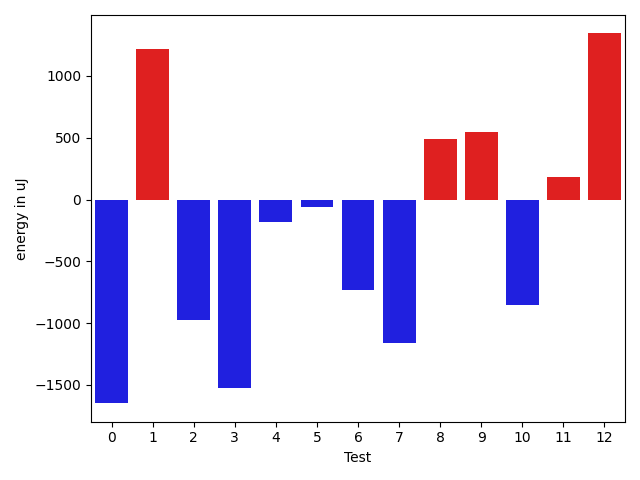

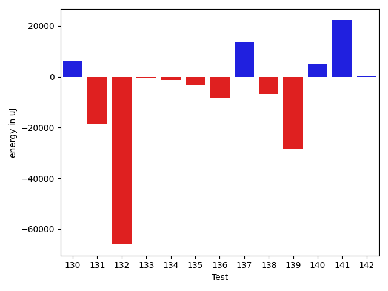

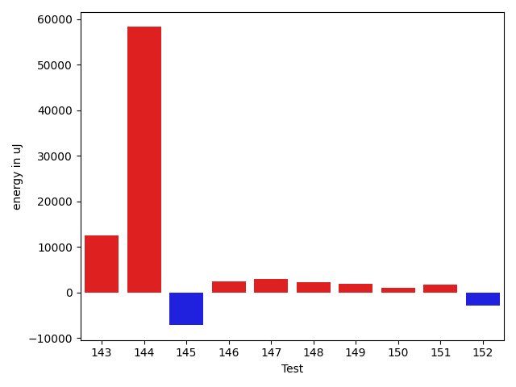

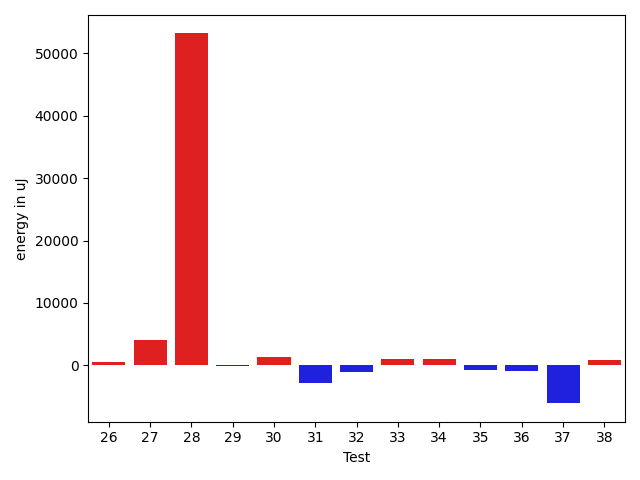

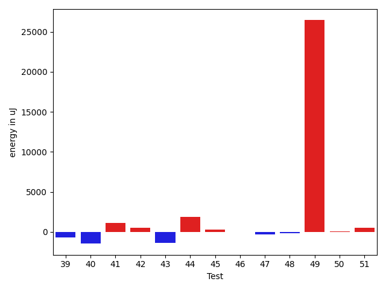

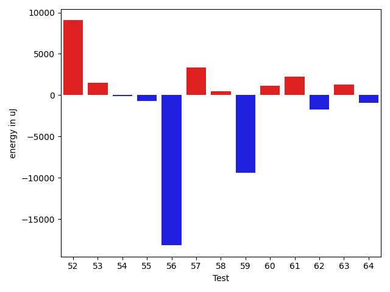

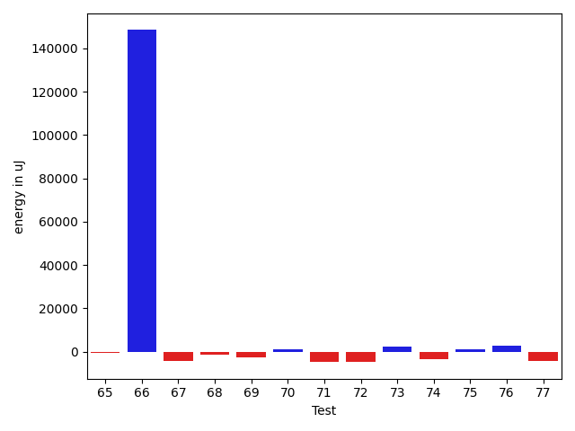

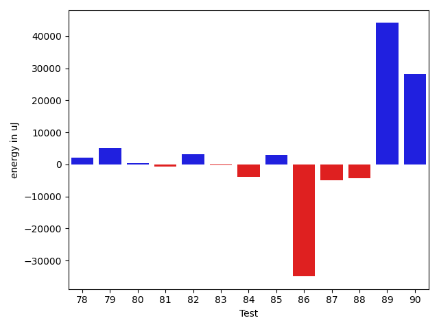

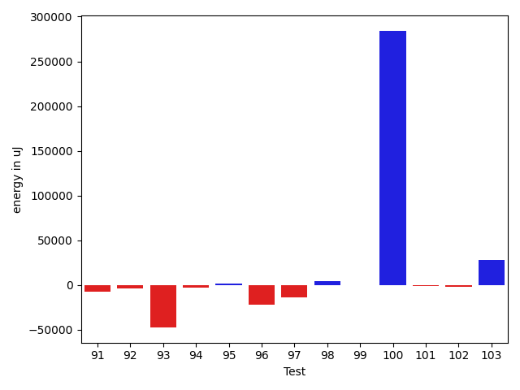

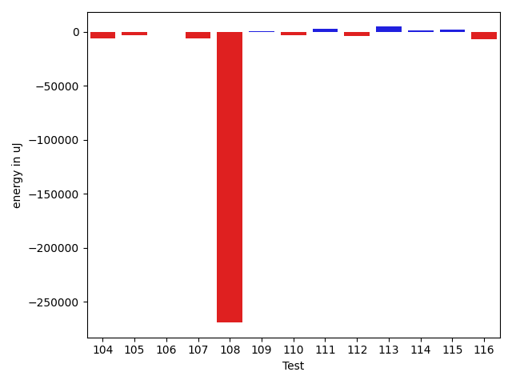

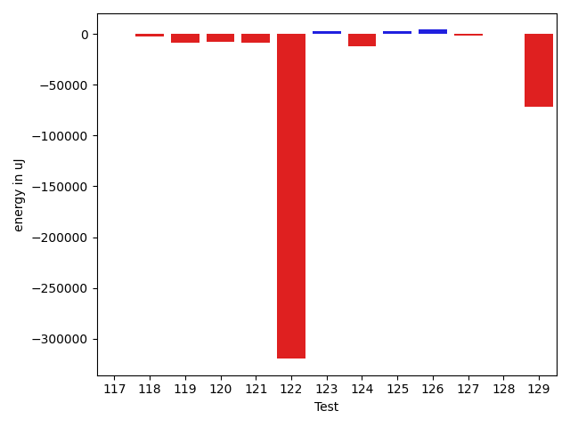

| ID | EnergyV1 | EnergyV2 | DeltaEnergy | σ |
| --- | --- | --- | --- | --- |
| 0 | 38844.65909090909 | 37161.86046511628 | -1682.798625792806 | 3831.441082692598 | 5553.9189414715975 |
| 1 | 51986.393939393936 | 62484.9595959596 | 10498.56565656566 | 25027.767228032328 | 67107.99160330067 |
| 2 | 43651.87012987013 | 43246.27380952381 | -405.59632034631795 | 16636.31897686555 | 16415.454603564747 |
| 3 | 38350.31481481482 | 37496.25 | -854.0648148148175 | 3879.650799597505 | 4957.194840582726 |
| 4 | 52697.2131147541 | 56889.87719298246 | 4192.6640782283575 | 35803.42753951824 | 42772.324893667865 |
| 5 | 38161.8 | 37881.375 | -280.4250000000029 | 4051.3688528967864 | 4511.875534007449 |
| 6 | 38025.98148148148 | 37549.188679245286 | -476.7928022361957 | 4218.859581252228 | 4533.543880381388 |
| 7 | 38522.6875 | 37910.67741935484 | -612.0100806451592 | 5006.2920437529165 | 3136.6333954149077 |
| 8 | 38218.03333333333 | 38523.22222222222 | 305.18888888888614 | 4154.96920552835 | 3383.095148521634 |
| 9 | 85664.97297297297 | 54362.375 | -31302.597972972973 | 95018.0098281477 | 52136.35293664465 |
| 10 | 43461.365853658535 | 41168.02272727273 | -2293.3431263858074 | 13200.43339228678 | 8518.57862260386 |
| 11 | 37805.40476190476 | 38894.13513513513 | 1088.7303732303699 | 3619.39341839488 | 3824.4446843823816 |
| 12 | 36547.74 | 38880.52 | 2332.779999999999 | 3718.2122145461253 | 5053.740429582825 |
| 13 | 73136.87692307692 | 70900.14035087719 | -2236.736572199734 | 107064.92543046488 | 106000.85767799961 |
| 14 | 36971.97222222222 | 38151.045454545456 | 1179.0732323232369 | 4778.393729917751 | 5029.359076980547 |
| 15 | 36671.8 | 38097.11111111111 | 1425.3111111111066 | 4121.003982850135 | 4476.951354671923 |
| 16 | 307521.43434343435 | 276117.49494949495 | -31403.939393939392 | 255106.3772422791 | 251258.26095563904 |
| 17 | 35700.92592592593 | 36997.333333333336 | 1296.4074074074088 | 4291.101722694655 | 3435.245331688683 |
| 18 | 35587.81481481482 | 36932.55172413793 | 1344.73690932311 | 3375.3618849829027 | 3639.315382626404 |
| 19 | 36951.28571428572 | 36617.54716981132 | -333.73854447439953 | 7634.655328814519 | 3719.3419968167013 |
| 20 | 54598.78431372549 | 50581.77551020408 | -4017.0088035214067 | 21934.326926937905 | 16119.703144916057 |
| 21 | 40186.13636363636 | 41592.545454545456 | 1406.4090909090955 | 13299.334663110218 | 17691.717278091855 |
| 22 | 38209.22448979592 | 38741.36 | 532.1355102040834 | 4814.296698865409 | 4672.593334584126 |
| 23 | 38074.375 | 38576.15254237288 | 501.7775423728817 | 4232.05391735207 | 4291.253393659624 |
| 24 | 84412.59595959596 | 87796.07070707071 | 3383.4747474747564 | 21544.986783786135 | 24504.214528559514 |
| 25 | 40387.84782608696 | 40901.818181818184 | 513.9703557312241 | 7555.741905181296 | 10839.293704499232 |
| 26 | 36511.78947368421 | 37104.13888888889 | 592.3494152046769 | 3736.5389921542624 | 4810.646775369872 |
| 27 | 39879.43859649123 | 44024.54 | 4145.101403508772 | 11985.820151427686 | 22965.986518510366 |
| 28 | 64865.9 | 118036.47457627118 | 53170.57457627118 | 169302.44261465932 | 329661.7240310085 |
| 29 | 37822.47368421053 | 37780.729166666664 | -41.74451754386246 | 4564.306655923492 | 4549.499916380844 |
| 30 | 39510.031746031746 | 40930.23809523809 | 1420.2063492063462 | 6252.946713523696 | 9934.641083161845 |
| 31 | 50167.85542168675 | 47430.09589041096 | -2737.7595312757912 | 23814.544085056452 | 19586.068922581682 |
| 32 | 38313.688888888886 | 37253.5 | -1060.1888888888861 | 3813.7685696971535 | 4375.181458574552 |
| 33 | 37148.666666666664 | 38254.07317073171 | 1105.4065040650457 | 3976.3040684088082 | 4382.852375550146 |
| 34 | 37247.65853658537 | 38357.148148148146 | 1109.489611562778 | 4264.531104581056 | 5084.068301721629 |
| 35 | 37095.40909090909 | 36363.02857142857 | -732.3805194805173 | 3707.359212788076 | 4769.338225945963 |
| 36 | 37932.0 | 37072.108695652176 | -859.8913043478242 | 3948.6378774150107 | 4870.886265344777 |
| 37 | 59732.955555555556 | 53677.01063829787 | -6055.944917257686 | 35034.220630029435 | 34594.67676905229 |
| 38 | 37465.4693877551 | 38300.7 | 835.2306122448936 | 4925.584772502011 | 4188.3002674115905 |
| 39 | 37879.02777777778 | 37191.47826086957 | -687.5495169082133 | 4593.910090097004 | 3940.0875996614177 |
| 40 | 38657.275862068964 | 37192.63461538462 | -1464.6412466843467 | 5489.453878977157 | 4226.630227265279 |
| 41 | 37032.62745098039 | 38157.5 | 1124.8725490196084 | 4153.528903402901 | 4695.066719440737 |
| 42 | 37097.2 | 37607.28947368421 | 510.0894736842165 | 3913.9881794776675 | 4203.6804858042315 |
| 43 | 38062.71111111111 | 36718.65454545455 | -1344.0565656565595 | 4150.061780649763 | 4609.53668039792 |
| 44 | 36817.74074074074 | 38685.74285714285 | 1868.0021164021164 | 5017.013155938373 | 4482.473177947684 |
| 45 | 37497.65909090909 | 37772.295454545456 | 274.6363636363676 | 3761.5895633191963 | 4791.418401587389 |
| 46 | 40448.18518518518 | 40470.94117647059 | 22.75599128540489 | 7375.067648337764 | 12991.788817665347 |
| 47 | 39998.25925925926 | 39649.5 | -348.75925925926276 | 6354.435025109643 | 7764.526610900327 |
| 48 | 38710.833333333336 | 38554.192307692305 | -156.64102564103086 | 4176.447297378213 | 4808.366906671286 |
| 49 | 144572.8282828283 | 171027.47474747474 | 26454.646464646445 | 68018.63357384756 | 123994.15641903266 |
| 50 | 37314.36111111111 | 37381.833333333336 | 67.47222222222626 | 5254.012573224274 | 3984.8533731563516 |
| 51 | 37715.65217391304 | 38244.21428571428 | 528.5621118012423 | 3865.3227786777184 | 6482.314047195076 |
| 52 | 39741.5 | 48790.6129032258 | 9049.112903225803 | 13065.293012405042 | 28102.950639111717 |
| 53 | 37104.47368421053 | 38593.77419354839 | 1489.3005093378597 | 4203.830544789774 | 4246.809437757285 |
| 54 | 36545.36 | 36450.12 | -95.23999999999796 | 4903.321102110283 | 5091.654664802004 |
| 55 | 38241.5 | 37502.19512195122 | -739.3048780487807 | 3385.664107675184 | 4738.424093383443 |
| 56 | 82556.92592592593 | 64374.17441860465 | -18182.751507321278 | 246176.04985275402 | 179177.94746020218 |
| 57 | 90275.0505050505 | 93599.28282828283 | 3324.232323232325 | 49885.19873829376 | 56541.49251442158 |
| 58 | 38156.12765957447 | 38652.49056603773 | 496.36290646326233 | 7375.3913408382305 | 7954.186185434214 |
| 59 | 55501.13333333333 | 46105.74 | -9395.393333333333 | 38248.44314368306 | 26739.92662802948 |
| 60 | 38746.64 | 39845.46052631579 | 1098.820526315787 | 8790.45263702236 | 11568.08128160913 |
| 61 | 41779.46666666667 | 43995.07272727273 | 2215.6060606060637 | 15567.776338178664 | 14743.65260017716 |
| 62 | 52519.51685393258 | 50812.25 | -1707.2668539325823 | 29729.901555452674 | 27594.919453873405 |
| 63 | 38337.86956521739 | 39641.1724137931 | 1303.3028485757095 | 3429.4684631161876 | 4329.6728479497715 |
| 64 | 38068.96551724138 | 37109.294117647056 | -959.671399594321 | 4585.682782859914 | 3990.010065809298 |
| 65 | 47370.25581395349 | 44820.903846153844 | -2549.3519677996446 | 23713.592397113087 | 21083.348385961643 |
| 66 | 37975.53846153846 | 38559.48275862069 | 583.9442970822274 | 4076.9655309836016 | 3989.965565668453 |
| 67 | 51428.12 | 50680.06896551724 | -748.0510344827635 | 19850.643299036936 | 20788.4499976691 |
| 68 | 37716.294117647056 | 37611.76470588235 | -104.52941176470631 | 4601.264337302315 | 5233.233367054105 |
| 69 | 37835.142857142855 | 39539.333333333336 | 1704.1904761904807 | 4669.495267266089 | 3937.3584207350655 |
| 70 | 37912.875 | 37737.541666666664 | -175.33333333333576 | 3815.541948318089 | 5162.800370431783 |
| 71 | 45903.16 | 51203.851851851854 | 5300.6918518518505 | 21739.19601950357 | 30389.69973491104 |
| 72 | 37456.26315789474 | 37129.6 | -326.66315789474174 | 4728.091902238268 | 4854.05386318144 |
| 73 | 38155.619047619046 | 39349.58823529412 | 1193.969187675073 | 4742.580013896298 | 3965.8827822080843 |
| 74 | 39993.7037037037 | 36563.10526315789 | -3430.5984405458075 | 8197.61233898973 | 3972.5072408232754 |
| 75 | 37913.818181818184 | 37341.67741935484 | -572.140762463343 | 4846.510268752556 | 4713.471704470597 |
| 76 | 39240.416666666664 | 39764.357142857145 | 523.9404761904807 | 3846.223612374726 | 4928.977967187559 |
| 77 | 38692.375 | 37882.333333333336 | -810.0416666666642 | 3905.09197835019 | 3678.2192324849566 |
| 78 | 38931.71428571428 | 39231.307692307695 | 299.5934065934125 | 5286.1258218171115 | 4288.779858486119 |
| 79 | 57300.72727272727 | 60957.27272727273 | 3656.545454545456 | 69941.08162897303 | 59262.13141488173 |
| 80 | 37457.0 | 38697.346153846156 | 1240.346153846156 | 3985.971994273221 | 3706.1651904143523 |
| 81 | 44782.05084745763 | 45546.65671641791 | 764.6058689602796 | 17505.613227049253 | 16683.30119856848 |
| 82 | 41725.96721311475 | 43702.06451612903 | 1976.0973030142777 | 11680.440971025606 | 14475.17952406471 |
| 83 | 36604.71428571428 | 38110.432835820895 | 1505.7185501066124 | 4077.373299123856 | 4201.290019455752 |
| 84 | 37189.096153846156 | 37790.28070175439 | 601.1845479082331 | 4085.96339388143 | 3898.495205662686 |
| 85 | 150300.4714285714 | 130445.78571428571 | -19854.685714285704 | 409600.4097224067 | 352741.0548458982 |
| 86 | 37004.666666666664 | 38733.34782608696 | 1728.6811594202954 | 5089.574070806143 | 4005.1131407641114 |
| 87 | 37227.26666666667 | 37608.41176470588 | 381.145098039211 | 4851.383465454869 | 4110.441854863602 |
| 88 | 49468.795454545456 | 56095.775 | 6626.979545454546 | 26716.877074561915 | 37173.73532851353 |
| 89 | 36767.485714285714 | 37398.828571428574 | 631.3428571428594 | 4578.111933796217 | 4500.473781317533 |
| 90 | 120913.41414141415 | 120031.75757575757 | -881.6565656565799 | 169396.8136575583 | 156225.37908335892 |
| 91 | 38743.96875 | 46466.46875 | 7722.5 | 8444.064936703971 | 25159.264897578454 |
| 92 | 38130.67647058824 | 37095.42857142857 | -1035.2478991596654 | 4388.60165134092 | 4355.784425242332 |
| 93 | 36819.316666666666 | 36914.779661016946 | 95.4629943502805 | 3320.9753662223325 | 3894.643492606426 |
| 94 | 37046.25806451613 | 37078.794117647056 | 32.53605313092703 | 3427.842808604192 | 3916.3557473709407 |
| 95 | 37637.5 | 37846.25925925926 | 208.75925925926276 | 4671.393501943505 | 4419.842569616258 |
| 96 | 36389.0 | 36496.28888888889 | 107.28888888889196 | 3532.669497960173 | 4630.700477956138 |
| 97 | 36703.11538461538 | 36832.794117647056 | 129.6787330316729 | 2902.6685908358277 | 4532.949473378309 |
| 98 | 37669.9375 | 36673.58620689655 | -996.3512931034493 | 4943.186162142161 | 4604.289840162492 |
| 99 | 40646.8085106383 | 37998.04 | -2648.7685106382996 | 8142.3095935074425 | 4532.161303219469 |
| 100 | 54532.4358974359 | 49562.25714285715 | -4970.178754578752 | 31578.804722995297 | 26818.352267849135 |
| 101 | 36499.78571428572 | 39071.07142857143 | 2571.28571428571 | 4176.977279916516 | 7154.727666418355 |
| 102 | 37706.232876712325 | 40653.171875 | 2946.9389982876746 | 3977.9920849544455 | 8964.779456564114 |
| 103 | 104108.42424242424 | 108143.61616161616 | 4035.191919191915 | 192884.24992945982 | 177634.70305906716 |
| 104 | 46329.61666666667 | 47354.640625 | 1025.0239583333314 | 22827.693129246665 | 20152.500332904714 |
| 105 | 40134.132352941175 | 39478.78082191781 | -655.3515310233633 | 9824.184255769344 | 7915.799822423083 |
| 106 | 104104.101010101 | 101072.14141414141 | -3031.95959595959 | 270578.17278312834 | 260264.23430433235 |
| 107 | 41393.392857142855 | 42562.51190476191 | 1169.1190476190532 | 11143.777881697733 | 13096.570195769402 |
| 108 | 45948.87096774193 | 48969.04301075269 | 3020.17204301076 | 19348.0582961912 | 26689.17639016324 |
| 109 | 79736.24742268042 | 89180.25773195876 | 9444.01030927834 | 70135.43545288348 | 99316.41975314585 |
| 110 | 37470.02564102564 | 41800.060975609755 | 4330.035334584114 | 6433.742554357674 | 10618.73013209363 |
| 111 | 36254.790322580644 | 37254.17857142857 | 999.3882488479285 | 4147.751163473997 | 4959.450031099153 |
| 112 | 44822.416666666664 | 51323.294117647056 | 6500.877450980392 | 20274.51899535611 | 20274.70772332948 |
| 113 | 38040.565217391304 | 39355.26666666667 | 1314.701449275366 | 4404.796257698379 | 4123.221401876073 |
| 114 | 308404.32584269665 | 330094.18888888886 | 21689.863046192215 | 242589.86884418246 | 228277.52312977356 |
| 115 | 40603.5 | 40665.78846153846 | 62.28846153846098 | 10136.196738763661 | 12456.938198537173 |
| 116 | 37629.875 | 37448.75 | -181.125 | 4049.679591878227 | 3311.7963120487952 |
| 117 | 41169.5 | 42163.619047619046 | 994.1190476190459 | 7826.775840633473 | 11510.599173416898 |
| 118 | 42064.70886075949 | 39524.30864197531 | -2540.4002187841834 | 12662.716544340972 | 8423.04367093736 |
| 119 | 40730.97590361446 | 41205.18666666667 | 474.21076305220777 | 10130.11860677708 | 11442.219473153895 |
| 120 | 39359.756410256414 | 37947.3717948718 | -1412.384615384617 | 6956.695738244572 | 4102.494007273782 |
| 121 | 47000.53731343283 | 46111.179487179485 | -889.3578262533483 | 24081.82135121617 | 33495.8828100439 |
| 122 | 1972341.707070707 | 1914524.3434343433 | -57817.36363636376 | 246205.25310933424 | 200987.19717264676 |
| 123 | 61641.666666666664 | 67383.20202020202 | 5741.535353535357 | 26797.109410297882 | 34543.24764667315 |
| 124 | 182950.898989899 | 180981.0202020202 | -1969.8787878787844 | 371733.1618824736 | 329201.00921218767 |
| 125 | 41057.26315789474 | 44492.43103448276 | 3435.1678765880206 | 9084.887889075117 | 13602.06417285572 |
| 126 | 40900.5 | 42991.166666666664 | 2090.6666666666642 | 8488.702627404946 | 11574.936767114476 |
| 127 | 49188.30136986302 | 64566.850746268654 | 15378.549376405637 | 44541.09981193911 | 89772.36767019154 |
| 128 | 49632.92857142857 | 47616.32352941176 | -2016.6050420168103 | 27327.013945207487 | 25012.653303431885 |
| 129 | 40477.81081081081 | 38752.58974358974 | -1725.2210672210713 | 9056.964881023849 | 5621.8081848802985 |
| 130 | 38090.351851851854 | 38083.63636363636 | -6.715488215493679 | 4164.946116575585 | 4614.823823540186 |
| 131 | 37614.045454545456 | 37357.620689655174 | -256.42476489028195 | 4192.534072906187 | 4892.2836668383525 |
| 132 | 47218.267857142855 | 54495.71875 | 7277.450892857145 | 27793.372540879413 | 36088.62123581543 |
| 133 | 80066.08333333333 | 66049.34615384616 | -14016.737179487172 | 140622.11894221557 | 97041.620400314 |
| 134 | 237490.27272727274 | 206196.57575757575 | -31293.69696969699 | 86928.15019752807 | 83625.94829588286 |
| 135 | 67859.4 | 54078.22222222222 | -13781.177777777775 | 91478.63624065745 | 55137.94959725108 |
| 136 | 43417.89743589744 | 40912.85365853659 | -2505.04377736085 | 13543.918987056226 | 9690.886534896728 |
| 137 | 37768.205128205125 | 39047.833333333336 | 1279.6282051282105 | 5085.0858509732725 | 3695.840170713598 |
| 138 | 42598.882352941175 | 48004.03333333333 | 5405.150980392158 | 10361.27530126056 | 19295.1075966307 |
| 139 | 61299.18032786885 | 165559.0 | 104259.81967213115 | 51663.77364424905 | 419236.02688602556 |
| 140 | 38623.59459459459 | 38403.52272727273 | -220.07186732186528 | 4337.856230153818 | 6767.352293745706 |
| 141 | 39529.620689655174 | 37102.96551724138 | -2426.655172413797 | 2667.005726611556 | 3883.6214034979635 |
| 142 | 38596.34090909091 | 38416.51162790698 | -179.82928118393465 | 4143.912495473888 | 4623.318964755167 |
| 143 | 104255.0 | 116821.05555555556 | 12566.055555555562 | 232025.09007077865 | 308685.9505352167 |
| 144 | 37149.916666666664 | 95449.21052631579 | 58299.29385964912 | 4193.565934029839 | 241930.79350890915 |
| 145 | 45607.09090909091 | 38451.95652173913 | -7155.1343873517835 | 18234.97870205674 | 3854.124312408844 |
| 146 | 43616.769230769234 | 45986.333333333336 | 2369.5641025641016 | 15243.274563173234 | 22808.166305563063 |
| 147 | 39625.5 | 42648.68965517241 | 3023.189655172413 | 4208.176216388973 | 13643.620555747046 |
| 148 | 38147.0 | 40461.78571428572 | 2314.7857142857174 | 3562.1580969536303 | 4910.980498238781 |
| 149 | 41318.3962264151 | 43190.4081632653 | 1872.0119368502055 | 8844.854413596735 | 8987.594922250557 |
| 150 | 38968.5 | 39977.90740740741 | 1009.4074074074088 | 3649.1048770686425 | 5452.416913179908 |
| 151 | 42500.31034482759 | 44184.985714285714 | 1684.6753694581275 | 14302.523817804271 | 15699.923688161085 |
| 152 | 44449.52631578947 | 41586.48387096774 | -2863.042444821731 | 20231.89370736584 | 12658.981498221747 |

## Delta Duration per test method

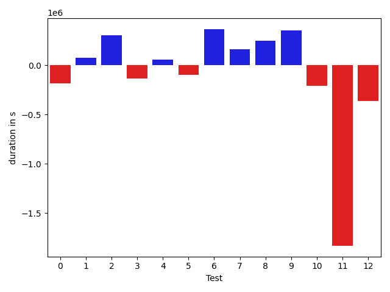

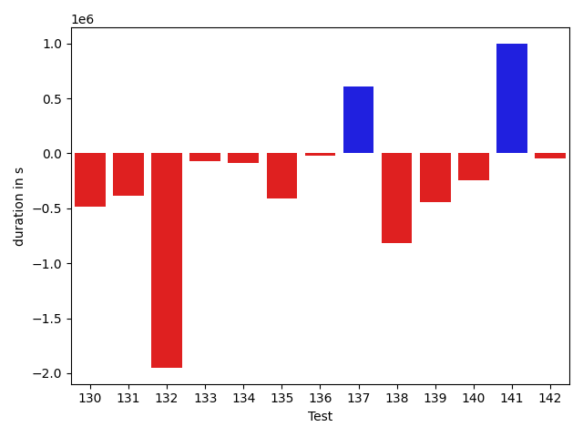

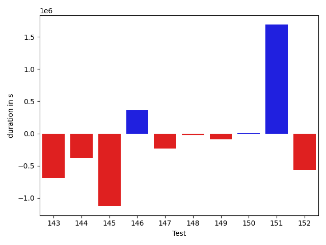

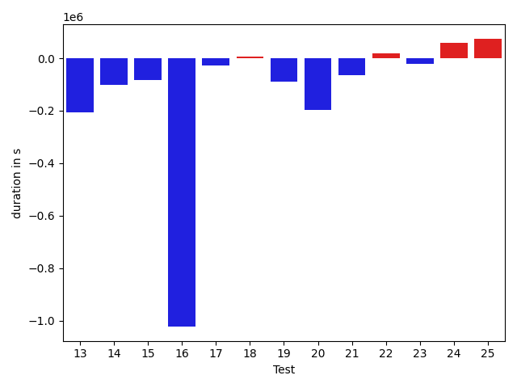

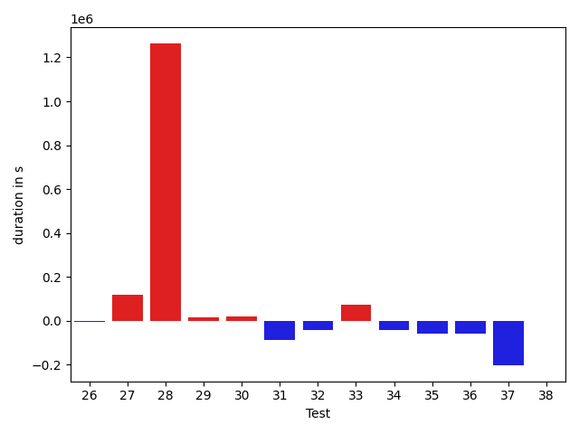

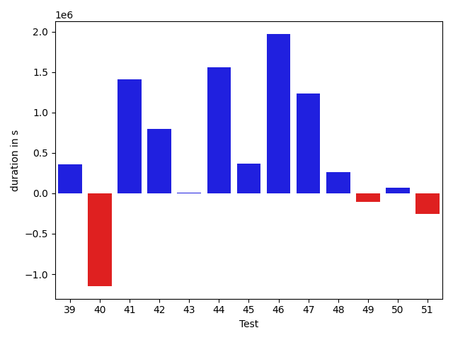

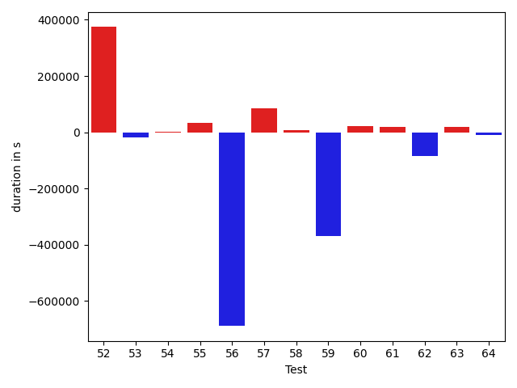

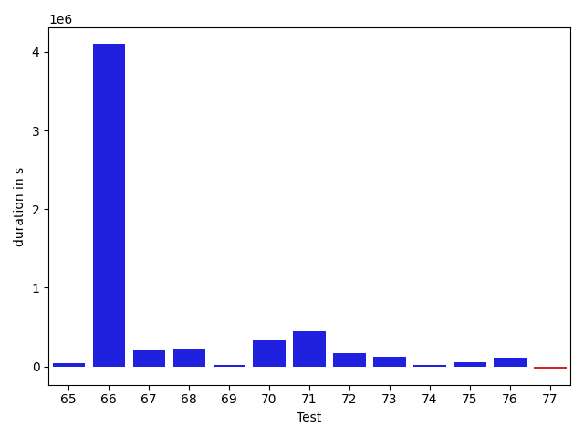

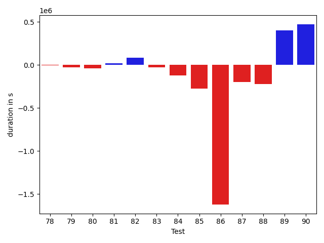

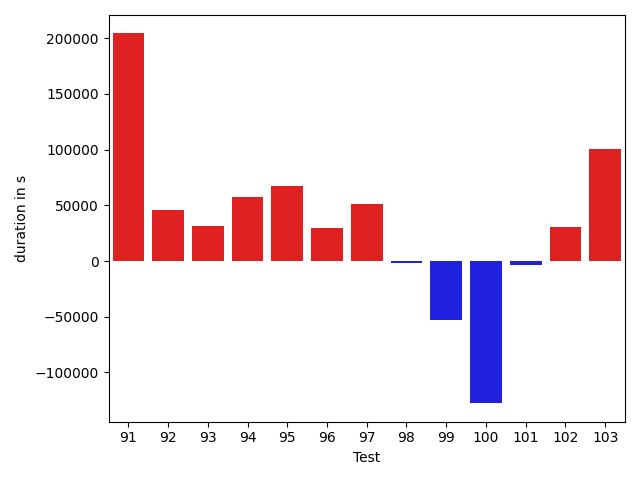

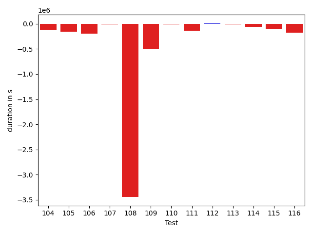

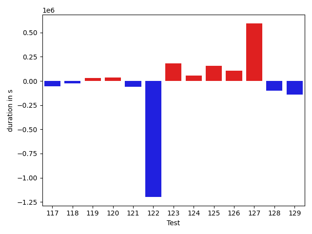

| ID | DurationV1 | DurationsV2 | DeltaDuration |
| --- | --- | --- | --- |
| 0 | 679434.5909090909 | 712627.2790697674 | 33192.68816067651 |
| 1 | 1662979.9797979798 | 1962405.494949495 | 299425.51515151514 |
| 2 | 1222953.3766233767 | 1195957.0714285714 | -26996.305194805376 |
| 3 | 867403.3703703703 | 829329.2678571428 | -38074.102513227495 |
| 4 | 1319920.5737704919 | 1538892.649122807 | 218972.0753523151 |
| 5 | 744724.6222222223 | 774457.625 | 29733.00277777773 |
| 6 | 758591.425925926 | 768979.8113207547 | 10388.385394828743 |
| 7 | 621867.6875 | 608124.4838709678 | -13743.203629032243 |
| 8 | 558686.0 | 592476.1666666666 | 33790.16666666663 |
| 9 | 2339249.0 | 1187422.95 | -1151826.05 |
| 10 | 1012201.731707317 | 918840.7954545454 | -93360.93625277164 |
| 11 | 749301.9047619047 | 664963.5675675676 | -84338.33719433716 |
| 12 | 855676.62 | 850198.96 | -5477.660000000033 |
| 13 | 2142935.030769231 | 1935305.6666666667 | -207629.36410256405 |
| 14 | 826668.2777777778 | 724555.0909090909 | -102113.18686868681 |
| 15 | 616617.2666666667 | 532176.1481481482 | -84441.11851851852 |
| 16 | 9093147.767676767 | 8070670.202020202 | -1022477.5656565651 |
| 17 | 599958.7777777778 | 572422.3666666667 | -27536.411111111054 |
| 18 | 586313.3703703703 | 592738.724137931 | 6425.3537675606785 |
| 19 | 943188.3392857143 | 854254.9056603773 | -88933.43362533697 |
| 20 | 1520560.705882353 | 1323429.4897959183 | -197131.21608643467 |
| 21 | 757041.6818181818 | 693189.8636363636 | -63851.81818181812 |
| 22 | 840473.7346938775 | 858467.82 | 17994.085306122433 |
| 23 | 849903.9583333334 | 827667.593220339 | -22236.365112994332 |
| 24 | 2501102.1616161615 | 2560451.5454545454 | 59349.38383838395 |
| 25 | 806484.5652173914 | 880719.5454545454 | 74234.98023715406 |
| 26 | 634059.947368421 | 630691.4444444445 | -3368.5029239765136 |
| 27 | 893363.9122807018 | 1011982.7 | 118618.78771929815 |
| 28 | 1643587.2666666666 | 2907513.0 | 1263925.7333333334 |
| 29 | 720468.6578947369 | 734678.3333333334 | 14209.675438596518 |
| 30 | 1032302.3968253968 | 1053597.7301587302 | 21295.333333333372 |
| 31 | 1558653.5542168675 | 1471797.7260273972 | -86855.82818947034 |
| 32 | 754489.3333333334 | 712828.1590909091 | -41661.17424242431 |
| 33 | 651444.3777777777 | 723864.3170731707 | 72419.93929539295 |
| 34 | 660023.6097560975 | 618016.9629629629 | -42006.64679313463 |
| 35 | 753003.7045454546 | 695491.8857142857 | -57511.81883116893 |
| 36 | 768644.304347826 | 710918.5217391305 | -57725.78260869556 |
| 37 | 1834125.888888889 | 1632147.9787234042 | -201977.91016548476 |
| 38 | 732736.5102040817 | 733852.14 | 1115.6297959183576 |
| 39 | 734673.1944444445 | 709934.6521739131 | -24738.542270531412 |
| 40 | 891768.3448275862 | 928620.8846153846 | 36852.53978779842 |
| 41 | 749944.3529411765 | 734642.7 | -15301.652941176551 |
| 42 | 708399.2181818181 | 717091.3421052631 | 8692.123923445004 |
| 43 | 771919.5333333333 | 731386.1818181818 | -40533.35151515156 |
| 44 | 588481.5925925926 | 592642.3428571429 | 4160.750264550326 |
| 45 | 749243.4318181818 | 723090.9545454546 | -26152.477272727177 |
| 46 | 918305.0555555555 | 1036677.4705882353 | 118372.4150326798 |
| 47 | 901913.7222222222 | 957019.0 | 55105.27777777775 |
| 48 | 772164.1666666666 | 788996.7115384615 | 16832.544871794875 |
| 49 | 4087940.202020202 | 4820156.464646464 | 732216.2626262624 |
| 50 | 537716.6111111111 | 632975.9333333333 | 95259.32222222222 |
| 51 | 661970.9130434783 | 806691.5238095238 | 144720.61076604552 |
| 52 | 664168.34375 | 1038206.4193548387 | 374038.07560483867 |
| 53 | 822484.9210526316 | 805200.8387096775 | -17284.08234295412 |
| 54 | 539311.28 | 540770.48 | 1459.1999999999534 |
| 55 | 664848.175 | 697782.7804878049 | 32934.60548780486 |
| 56 | 2405239.6913580247 | 1715887.2790697673 | -689352.4122882574 |
| 57 | 2748066.1717171716 | 2831651.4646464647 | 83585.29292929312 |
| 58 | 877296.0 | 885250.0943396227 | 7954.09433962265 |
| 59 | 1417585.177777778 | 1049285.84 | -368299.3377777778 |
| 60 | 1124152.3466666667 | 1145167.4210526317 | 21015.07438596501 |
| 61 | 1048385.8333333334 | 1068413.690909091 | 20027.857575757545 |
| 62 | 1610909.9325842697 | 1525439.8804347827 | -85470.05214948696 |
| 63 | 485596.7826086957 | 505747.6206896552 | 20150.83808095951 |
| 64 | 484368.3103448276 | 473659.17647058825 | -10709.133874239342 |
| 65 | 1175461.534883721 | 1053402.326923077 | -122059.20796064404 |
| 66 | 499163.57692307694 | 508412.4482758621 | 9248.87135278515 |
| 67 | 1281045.92 | 1109941.6206896552 | -171104.29931034474 |
| 68 | 495479.23529411765 | 403376.1176470588 | -92103.11764705885 |
| 69 | 617396.8571428572 | 548913.2962962963 | -68483.56084656087 |
| 70 | 468425.6666666667 | 516371.1666666667 | 47945.5 |
| 71 | 1028794.6 | 1078138.888888889 | 49344.288888889016 |
| 72 | 427744.36842105264 | 443347.06666666665 | 15602.69824561401 |
| 73 | 397223.7619047619 | 456598.29411764705 | 59374.532212885155 |
| 74 | 623606.7777777778 | 589831.4210526316 | -33775.35672514618 |
| 75 | 608098.4545454546 | 612585.4516129033 | 4486.997067448683 |
| 76 | 513671.3333333333 | 449579.5 | -64091.833333333314 |
| 77 | 427410.875 | 396810.4166666667 | -30600.458333333314 |
| 78 | 458052.9285714286 | 446033.46153846156 | -12019.467032967019 |
| 79 | 1826810.2727272727 | 1835096.383838384 | 8286.11111111124 |
| 80 | 805365.2173913043 | 858063.8461538461 | 52698.628762541804 |
| 81 | 1053574.7457627119 | 1185365.343283582 | 131790.59752087016 |
| 82 | 1050232.2786885246 | 1247307.8709677418 | 197075.5922792172 |
| 83 | 885622.918367347 | 987130.7164179104 | 101507.79805056343 |
| 84 | 803165.9615384615 | 919357.350877193 | 116191.38933873153 |
| 85 | 4085008.3571428573 | 3610892.342857143 | -474116.01428571437 |
| 86 | 493522.5714285714 | 478140.0 | -15382.57142857142 |
| 87 | 403015.3333333333 | 456441.76470588235 | 53426.431372549036 |
| 88 | 1126544.5909090908 | 1404791.5 | 278246.9090909092 |
| 89 | 558745.0 | 580606.8 | 21861.800000000047 |
| 90 | 3372900.727272727 | 3473633.1414141413 | 100732.41414141422 |
| 91 | 754667.53125 | 958989.46875 | 204321.9375 |
| 92 | 584204.8823529412 | 630446.5428571429 | 46241.66050420166 |
| 93 | 829165.3 | 860218.4745762711 | 31053.174576271093 |
| 94 | 536056.8709677419 | 593858.4117647059 | 57801.540796963964 |
| 95 | 529149.7307692308 | 596675.2222222222 | 67525.4914529915 |
| 96 | 805045.5272727272 | 835133.0 | 30087.472727272776 |
| 97 | 550351.7692307692 | 601613.7647058824 | 51261.99547511316 |
| 98 | 581316.53125 | 579274.275862069 | -2042.2553879310144 |
| 99 | 843743.5531914893 | 790704.08 | -53039.47319148935 |
| 100 | 1333717.6666666667 | 1206065.1142857142 | -127652.55238095252 |
| 101 | 974814.6571428571 | 971379.8428571429 | -3434.8142857141793 |
| 102 | 1026173.0136986302 | 1056696.78125 | 30523.76755136985 |
| 103 | 2999438.1616161615 | 3100427.868686869 | 100989.70707070734 |
| 104 | 1115230.1166666667 | 1128841.03125 | 13610.914583333302 |
| 105 | 1089157.1911764706 | 1081139.3287671234 | -8017.862409347203 |
| 106 | 2971426.9494949495 | 2861135.303030303 | -110291.64646464633 |
| 107 | 1180208.488095238 | 1232153.5833333333 | 51945.09523809515 |
| 108 | 1443495.0 | 1531181.5376344086 | 87686.53763440857 |
| 109 | 2445382.8969072164 | 2734266.680412371 | 288883.7835051548 |
| 110 | 1176542.5512820513 | 1194626.012195122 | 18083.46091307071 |
| 111 | 907225.6612903225 | 907457.0535714285 | 231.3922811059747 |
| 112 | 911915.8333333334 | 1106544.294117647 | 194628.46078431362 |
| 113 | 460827.6956521739 | 440884.2 | -19943.49565217388 |
| 114 | 8656573.651685392 | 9409336.577777777 | 752762.9260923844 |
| 115 | 885415.5576923077 | 933126.8269230769 | 47711.26923076913 |
| 116 | 596586.25 | 587543.5 | -9042.75 |
| 117 | 888231.9285714285 | 832687.119047619 | -55544.80952380947 |
| 118 | 1188600.417721519 | 1165448.6419753085 | -23151.77574621048 |
| 119 | 1150018.5421686748 | 1178908.0533333332 | 28889.51116465847 |
| 120 | 1076151.935897436 | 1109564.7435897435 | 33412.80769230751 |
| 121 | 1383119.8358208956 | 1320645.782051282 | -62474.053769613616 |
| 122 | 56388387.29292929 | 55190382.08080808 | -1198005.212121211 |
| 123 | 1927580.0707070706 | 2110851.797979798 | 183271.72727272753 |
| 124 | 5145611.4949494945 | 5200741.96969697 | 55130.47474747524 |
| 125 | 1043979.4342105263 | 1201424.7068965517 | 157445.27268602536 |
| 126 | 1187670.8720930233 | 1292083.8095238095 | 104412.9374307862 |
| 127 | 1348523.1095890412 | 1943079.7313432836 | 594556.6217542423 |
| 128 | 1255929.380952381 | 1154155.6470588236 | -101773.73389355745 |
| 129 | 907862.4594594594 | 767567.6153846154 | -140294.84407484403 |
| 130 | 810796.0555555555 | 838659.4545454546 | 27863.398989899084 |
| 131 | 541048.3636363636 | 570298.724137931 | 29250.360501567367 |
| 132 | 1186828.875 | 1408104.78125 | 221275.90625 |
| 133 | 2002724.7777777778 | 1714109.673076923 | -288615.10470085475 |
| 134 | 6126798.242424242 | 5558135.242424242 | -568663.0 |
| 135 | 2113954.4105263157 | 1679585.1313131314 | -434369.27921318426 |
| 136 | 1180147.6923076923 | 870685.8780487805 | -309461.81425891176 |
| 137 | 747059.1794871795 | 616253.9047619047 | -130805.27472527476 |
| 138 | 1171378.705882353 | 1031635.1333333333 | -139743.5725490197 |
| 139 | 1572935.7704918033 | 4339757.606557377 | 2766821.8360655736 |
| 140 | 714138.7567567568 | 744390.9318181818 | 30252.17506142496 |
| 141 | 575821.7931034482 | 593570.448275862 | 17748.655172413797 |
| 142 | 662594.2954545454 | 640817.5116279069 | -21776.78382663848 |
| 143 | 2444214.117647059 | 2731696.4444444445 | 287482.3267973857 |
| 144 | 431605.0 | 1917677.2631578948 | 1486072.2631578948 |
| 145 | 889485.7727272727 | 540857.1304347826 | -348628.6422924901 |
| 146 | 689791.8461538461 | 695399.9444444445 | 5608.098290598369 |
| 147 | 533332.6363636364 | 698281.6551724138 | 164949.01880877744 |
| 148 | 462080.3076923077 | 462081.64285714284 | 1.335164835152682 |
| 149 | 1020294.2075471698 | 984627.9591836735 | -35666.24836349627 |
| 150 | 818969.5 | 843250.7222222222 | 24281.222222222248 |
| 151 | 976808.1034482758 | 1084411.7571428572 | 107603.65369458136 |
| 152 | 769431.4210526316 | 692536.3870967742 | -76895.03395585739 |

## Misc.

| ID | Test Class | Test Method |
| --- | --- | --- |
| 0 | com.google.gson.functional.CustomDeserializerTest | testDefaultConstructorNotCalledOnField |
| 1 | com.google.gson.functional.CustomDeserializerTest | testDefaultConstructorNotCalledOnObject |
| 2 | com.google.gson.functional.CustomDeserializerTest | testJsonTypeFieldBasedDeserialization |
| 3 | com.google.gson.functional.CustomDeserializerTest | testCustomDeserializerReturnsNullForArrayElementsForArrayField |
| 4 | com.google.gson.functional.CustomDeserializerTest | testCustomDeserializerReturnsNull |
| 5 | com.google.gson.functional.CustomDeserializerTest | testCustomDeserializerReturnsNullForArrayElements |
| 6 | com.google.gson.functional.CustomDeserializerTest | testCustomDeserializerReturnsNullForTopLevelObject |
| 7 | com.google.gson.functional.JsonParserTest | testBadTypeForDeserializingCustomTree |
| 8 | com.google.gson.functional.JsonParserTest | testBadFieldTypeForCustomDeserializerCustomTree |
| 9 | com.google.gson.functional.JsonParserTest | testDeserializingCustomTree |
| 10 | com.google.gson.functional.JsonParserTest | testChangingCustomTreeAndDeserializing |
| 11 | com.google.gson.functional.JsonParserTest | testBadFieldTypeForDeserializingCustomTree |
| 12 | com.google.gson.functional.JsonParserTest | testExtraCommasInMaps |
| 13 | com.google.gson.functional.InterfaceTest | testSerializingObjectImplementingInterface |
| 14 | com.google.gson.functional.InterfaceTest | testSerializingInterfaceObjectField |
| 15 | com.google.gson.functional.DefaultTypeAdaptersTest | testBadValueForBigDecimalDeserialization |
| 16 | com.google.gson.functional.DefaultTypeAdaptersTest | testNullSerialization |
| 17 | com.google.gson.functional.DefaultTypeAdaptersTest | testBigDecimalFieldDeserialization |
| 18 | com.google.gson.functional.DefaultTypeAdaptersTest | testBigIntegerFieldDeserialization |
| 19 | com.google.gson.functional.DefaultTypeAdaptersTest | testBigIntegerFieldSerialization |
| 20 | com.google.gson.functional.DefaultTypeAdaptersTest | testBigDecimalFieldSerialization |
| 21 | com.google.gson.functional.DefaultTypeAdaptersTest | testJsonObjectSerialization |
| 22 | com.google.gson.functional.CustomTypeAdaptersTest | testCustomAdapterInvokedForMapElementDeserialization |
| 23 | com.google.gson.functional.CustomTypeAdaptersTest | testCustomAdapterInvokedForMapElementSerializationWithType |
| 24 | com.google.gson.functional.CustomTypeAdaptersTest | testCustomTypeAdapterDoesNotAppliesToSubClasses |
| 25 | com.google.gson.functional.CustomTypeAdaptersTest | testEnsureCustomSerializerNotInvokedForNullValues |
| 26 | com.google.gson.functional.CustomTypeAdaptersTest | testEnsureCustomDeserializerNotInvokedForNullValues |
| 27 | com.google.gson.functional.CustomTypeAdaptersTest | testCustomDeserializers |
| 28 | com.google.gson.functional.CustomTypeAdaptersTest | testCustomSerializers |
| 29 | com.google.gson.functional.CustomTypeAdaptersTest | testCustomTypeAdapterAppliesToSubClassesSerializedAsBaseClass |
| 30 | com.google.gson.functional.PrettyPrintingTest | testEmptyMapField |
| 31 | com.google.gson.functional.MapTest | testMapSerializationWithNullValues |
| 32 | com.google.gson.functional.MapTest | testMapDeserializationWithIntegerKeys |
| 33 | com.google.gson.functional.MapTest | testMapSerializationEmpty |
| 34 | com.google.gson.functional.MapTest | testMapSerializationWithNullValuesSerialized |
| 35 | com.google.gson.functional.MapTest | testMapSerializationWithIntegerKeys |
| 36 | com.google.gson.functional.MapTest | testMapSerializationWithNullValueButSerializeNulls |
| 37 | com.google.gson.functional.MapTest | testInterfaceTypeMap |
| 38 | com.google.gson.functional.MapTest | testMapDeserialization |
| 39 | com.google.gson.functional.MapTest | testMapDeserializationWithNullKey |
| 40 | com.google.gson.functional.MapTest | testGeneralMapField |
| 41 | com.google.gson.functional.MapTest | testMapDeserializationWithNullValue |
| 42 | com.google.gson.functional.MapTest | testMapDeserializationEmpty |
| 43 | com.google.gson.functional.MapTest | testMapSerializationWithNullKey |
| 44 | com.google.gson.functional.MapTest | testMapSerialization |
| 45 | com.google.gson.functional.MapTest | testMapSerializationWithNullValue |
| 46 | com.google.gson.functional.ReadersWritersTest | testReadWriteTwoObjects |
| 47 | com.google.gson.functional.ReadersWritersTest | testTypeMismatchThrowsJsonSyntaxExceptionForStrings |
| 48 | com.google.gson.functional.ReadersWritersTest | testTypeMismatchThrowsJsonSyntaxExceptionForReaders |
| 49 | com.google.gson.functional.ExposeFieldsTest | testNullExposeFieldSerialization |
| 50 | com.google.gson.functional.ExposeFieldsTest | testExposeAnnotationSerialization |
| 51 | com.google.gson.functional.ExposeFieldsTest | testArrayWithOneNullExposeFieldObjectSerialization |
| 52 | com.google.gson.functional.ExposeFieldsTest | testExposeAnnotationDeserialization |
| 53 | com.google.gson.functional.ExposeFieldsTest | testExposedInterfaceFieldSerialization |
| 54 | com.google.gson.functional.ExposeFieldsTest | testExposedInterfaceFieldDeserialization |
| 55 | com.google.gson.functional.FieldExclusionTest | testDefaultNestedStaticClassIncluded |
| 56 | com.google.gson.functional.FieldExclusionTest | testDefaultInnerClassExclusion |
| 57 | com.google.gson.functional.InheritanceTest | testSubInterfacesOfCollectionSerialization |
| 58 | com.google.gson.functional.InheritanceTest | testClassWithBaseArrayFieldSerialization |
| 59 | com.google.gson.functional.InheritanceTest | testSubClassDeserialization |
| 60 | com.google.gson.functional.InheritanceTest | testSubInterfacesOfCollectionDeserialization |
| 61 | com.google.gson.functional.InheritanceTest | testClassWithBaseCollectionFieldSerialization |
| 62 | com.google.gson.functional.InheritanceTest | testSubClassSerialization |
| 63 | com.google.gson.functional.InheritanceTest | testBaseSerializedAsSubWhenSpecifiedWithExplicitType |
| 64 | com.google.gson.functional.InheritanceTest | testBaseSerializedAsSub |
| 65 | com.google.gson.functional.InheritanceTest | testClassWithBaseFieldSerialization |
| 66 | com.google.gson.functional.InheritanceTest | testBaseSerializedAsBaseWhenSpecifiedWithExplicitType |
| 67 | com.google.gson.functional.PrimitiveTest | testMoreSpecificSerialization |
| 68 | com.google.gson.JsonObjectTest | testEqualsNonEmptyObject |
| 69 | com.google.gson.JsonObjectTest | testAddingCharacterProperties |
| 70 | com.google.gson.JsonObjectTest | testDeepCopy |
| 71 | com.google.gson.JsonObjectTest | testReadPropertyWithEmptyStringName |
| 72 | com.google.gson.JsonObjectTest | testWritePropertyWithEmptyStringName |
| 73 | com.google.gson.JsonObjectTest | testAddingBooleanProperties |
| 74 | com.google.gson.JsonObjectTest | testPropertyWithQuotes |
| 75 | com.google.gson.JsonObjectTest | testEqualsOnEmptyObject |
| 76 | com.google.gson.JsonObjectTest | testAddingNullPropertyValue |
| 77 | com.google.gson.JsonObjectTest | testAddingStringProperties |
| 78 | com.google.gson.JsonObjectTest | testAddingNullOrEmptyPropertyName |
| 79 | com.google.gson.functional.MoreSpecificTypeSerializationTest | testSubclassFields |
| 80 | com.google.gson.functional.MoreSpecificTypeSerializationTest | testParameterizedSubclassFields |
| 81 | com.google.gson.functional.MoreSpecificTypeSerializationTest | testMapOfSubclassFields |
| 82 | com.google.gson.functional.MoreSpecificTypeSerializationTest | testListOfSubclassFields |
| 83 | com.google.gson.functional.MoreSpecificTypeSerializationTest | testListOfParameterizedSubclassFields |
| 84 | com.google.gson.functional.MoreSpecificTypeSerializationTest | testMapOfParameterizedSubclassFields |
| 85 | com.google.gson.JsonParserTest | testReadWriteTwoObjects |
| 86 | com.google.gson.JsonParserTest | testParseString |
| 87 | com.google.gson.JsonParserTest | testParseReader |
| 88 | com.google.gson.functional.NamingPolicyTest | testGsonWithNonDefaultFieldNamingPolicySerialization |
| 89 | com.google.gson.functional.NamingPolicyTest | testGsonWithLowerCaseDashPolicyDeserialiation |
| 90 | com.google.gson.functional.NamingPolicyTest | testGsonDuplicateNameUsingSerializedNameFieldNamingPolicySerialization |
| 91 | com.google.gson.functional.NamingPolicyTest | testGsonWithNonDefaultFieldNamingPolicyDeserialiation |
| 92 | com.google.gson.functional.NamingPolicyTest | testGsonWithLowerCaseDashPolicySerialization |
| 93 | com.google.gson.functional.NamingPolicyTest | testDeprecatedNamingStrategy |
| 94 | com.google.gson.functional.NamingPolicyTest | testGsonWithUpperCamelCaseSpacesPolicyDeserialiation |
| 95 | com.google.gson.functional.NamingPolicyTest | testGsonWithUpperCamelCaseSpacesPolicySerialiation |
| 96 | com.google.gson.functional.NamingPolicyTest | testComplexFieldNameStrategy |
| 97 | com.google.gson.functional.NamingPolicyTest | testGsonWithLowerCaseUnderscorePolicySerialization |
| 98 | com.google.gson.functional.NamingPolicyTest | testGsonWithLowerCaseUnderscorePolicyDeserialiation |
| 99 | com.google.gson.functional.NullObjectAndFieldTest | testCustomTypeAdapterPassesNullDesrialization |
| 100 | com.google.gson.functional.NullObjectAndFieldTest | testCustomSerializationOfNulls |
| 101 | com.google.gson.functional.MapAsArrayTypeAdapterTest | testMultipleEnableComplexKeyRegistrationHasNoEffect |
| 102 | com.google.gson.functional.MapAsArrayTypeAdapterTest | testMapWithTypeVariableDeserialization |
| 103 | com.google.gson.functional.MapAsArrayTypeAdapterTest | testSerializeComplexMapWithTypeAdapter |
| 104 | com.google.gson.functional.MapAsArrayTypeAdapterTest | testTwoTypesCollapseToOneDeserialize |
| 105 | com.google.gson.functional.MapAsArrayTypeAdapterTest | testMapWithTypeVariableSerialization |
| 106 | com.google.gson.functional.TypeVariableTest | testAdvancedTypeVariables |
| 107 | com.google.gson.functional.TypeVariableTest | testTypeVariablesViaTypeParameter |
| 108 | com.google.gson.functional.ParameterizedTypesTest | testParameterizedTypeWithCustomSerializer |
| 109 | com.google.gson.functional.ParameterizedTypesTest | testParameterizedTypesSerialization |
| 110 | com.google.gson.functional.ParameterizedTypesTest | testParameterizedTypesWithCustomDeserializer |
| 111 | com.google.gson.functional.ParameterizedTypesTest | testParameterizedTypesWithWriterSerialization |
| 112 | com.google.gson.functional.PrintFormattingTest | testJsonObjectWithNullValues |
| 113 | com.google.gson.functional.PrintFormattingTest | testJsonObjectWithNullValuesSerialized |
| 114 | com.google.gson.functional.ObjectTest | testDateAsMapObjectField |
| 115 | com.google.gson.functional.ObjectTest | testInnerClassSerialization |
| 116 | com.google.gson.functional.ObjectTest | testBagOfPrimitiveWrappersDeserialization |
| 117 | com.google.gson.functional.ObjectTest | testBagOfPrimitiveWrappersSerialization |
| 118 | com.google.gson.functional.RawSerializationTest | testThreeLevelParameterizedObject |
| 119 | com.google.gson.functional.RawSerializationTest | testParameterizedObject |
| 120 | com.google.gson.functional.RawSerializationTest | testTwoLevelParameterizedObject |
| 121 | com.google.gson.functional.RawSerializationTest | testCollectionOfObjects |
| 122 | com.google.gson.JavaSerializationTest | testMapIsSerializable |
| 123 | com.google.gson.functional.UncategorizedTest | testReturningDerivedClassesDuringDeserialization |
| 124 | com.google.gson.functional.TypeHierarchyAdapterTest | testTypeHierarchy |
| 125 | com.google.gson.functional.CollectionTest | testSetDeserialization |
| 126 | com.google.gson.functional.CollectionTest | testWildcardCollectionField |
| 127 | com.google.gson.functional.CollectionTest | testSetSerialization |
| 128 | com.google.gson.functional.ExclusionStrategyFunctionalTest | testExclusionStrategyDeserialization |
| 129 | com.google.gson.functional.ExclusionStrategyFunctionalTest | testExclusionStrategyWithMode |
| 130 | com.google.gson.functional.JsonTreeTest | testToJsonTreeObjectType |
| 131 | com.google.gson.functional.JsonTreeTest | testJsonTreeNull |
| 132 | com.google.gson.functional.JsonTreeTest | testJsonTreeToString |
| 133 | com.google.gson.functional.JsonTreeTest | testToJsonTree |
| 134 | com.google.gson.functional.CircularReferenceTest | testSelfReferenceCustomHandlerSerialization |
| 135 | com.google.gson.ObjectTypeAdapterTest | testSerialize |
| 136 | com.google.gson.functional.StreamingTypeAdaptersTest | testFromJsonTree |
| 137 | com.google.gson.functional.StreamingTypeAdaptersTest | testSerializeRecursive |
| 138 | com.google.gson.functional.StreamingTypeAdaptersTest | testDeserializeMap |
| 139 | com.google.gson.functional.CustomSerializerTest | testSubClassSerializerInvokedForBaseClassFieldsHoldingSubClassInstances |
| 140 | com.google.gson.functional.CustomSerializerTest | testSubClassSerializerInvokedForBaseClassFieldsHoldingArrayOfSubClassInstances |
| 141 | com.google.gson.functional.CustomSerializerTest | testBaseClassSerializerInvokedForBaseClassFields |
| 142 | com.google.gson.functional.CustomSerializerTest | testBaseClassSerializerInvokedForBaseClassFieldsHoldingSubClassInstances |
| 143 | com.google.gson.internal.bind.JsonTreeWriterTest | testSerializeNullsTrue |
| 144 | com.google.gson.internal.bind.JsonTreeWriterTest | testObject |
| 145 | com.google.gson.internal.bind.JsonTreeWriterTest | testNestedObject |
| 146 | com.google.gson.internal.bind.JsonElementReaderTest | testNestedObjects |
| 147 | com.google.gson.internal.bind.JsonElementReaderTest | testObject |
| 148 | com.google.gson.internal.bind.JsonElementReaderTest | testSkipValue |
| 149 | com.google.gson.DefaultMapJsonSerializerTest | testEmptyMapSerialization |
| 150 | com.google.gson.DefaultMapJsonSerializerTest | testNonEmptyMapSerialization |
| 151 | com.google.gson.functional.InstanceCreatorTest | testInstanceCreatorReturnsSubTypeForField |
| 152 | com.google.gson.JsonArrayTest | testEqualsNonEmptyArray |

| Test | IterationV1 | IterationV2 | DeltaIteration |
| --- | --- | --- | --- |
| 0 | 44 | 43 | -1 |
| 1 | 99 | 99 | 0 |
| 2 | 77 | 84 | 7 |
| 3 | 54 | 56 | 2 |
| 4 | 61 | 57 | -4 |
| 5 | 45 | 40 | -5 |
| 6 | 54 | 53 | -1 |
| 7 | 32 | 31 | -1 |
| 8 | 30 | 36 | 6 |
| 9 | 37 | 40 | 3 |
| 10 | 41 | 44 | 3 |
| 11 | 42 | 37 | -5 |
| 12 | 50 | 50 | 0 |
| 13 | 65 | 57 | -8 |
| 14 | 36 | 44 | 8 |
| 15 | 30 | 27 | -3 |
| 16 | 99 | 99 | 0 |
| 17 | 27 | 30 | 3 |
| 18 | 27 | 29 | 2 |
| 19 | 56 | 53 | -3 |
| 20 | 51 | 49 | -2 |
| 21 | 22 | 22 | 0 |
| 22 | 49 | 50 | 1 |
| 23 | 48 | 59 | 11 |
| 24 | 99 | 99 | 0 |
| 25 | 46 | 44 | -2 |
| 26 | 38 | 36 | -2 |
| 27 | 57 | 50 | -7 |
| 28 | 60 | 59 | -1 |
| 29 | 38 | 48 | 10 |
| 30 | 63 | 63 | 0 |
| 31 | 83 | 73 | -10 |
| 32 | 45 | 44 | -1 |
| 33 | 45 | 41 | -4 |
| 34 | 41 | 27 | -14 |
| 35 | 44 | 35 | -9 |
| 36 | 46 | 46 | 0 |
| 37 | 90 | 94 | 4 |
| 38 | 49 | 50 | 1 |
| 39 | 36 | 46 | 10 |
| 40 | 58 | 52 | -6 |
| 41 | 51 | 40 | -11 |
| 42 | 55 | 38 | -17 |
| 43 | 45 | 55 | 10 |
| 44 | 27 | 35 | 8 |
| 45 | 44 | 44 | 0 |
| 46 | 54 | 51 | -3 |
| 47 | 54 | 58 | 4 |
| 48 | 54 | 52 | -2 |
| 49 | 99 | 99 | 0 |
| 50 | 36 | 30 | -6 |
| 51 | 46 | 42 | -4 |
| 52 | 32 | 31 | -1 |
| 53 | 38 | 62 | 24 |
| 54 | 25 | 25 | 0 |
| 55 | 40 | 41 | 1 |
| 56 | 81 | 86 | 5 |
| 57 | 99 | 99 | 0 |
| 58 | 47 | 53 | 6 |
| 59 | 45 | 50 | 5 |
| 60 | 75 | 76 | 1 |
| 61 | 60 | 55 | -5 |
| 62 | 89 | 92 | 3 |
| 63 | 23 | 29 | 6 |
| 64 | 29 | 17 | -12 |
| 65 | 43 | 52 | 9 |
| 66 | 26 | 29 | 3 |
| 67 | 25 | 29 | 4 |
| 68 | 17 | 17 | 0 |
| 69 | 28 | 27 | -1 |
| 70 | 24 | 24 | 0 |
| 71 | 25 | 27 | 2 |
| 72 | 19 | 15 | -4 |
| 73 | 21 | 17 | -4 |
| 74 | 27 | 19 | -8 |
| 75 | 22 | 31 | 9 |
| 76 | 12 | 14 | 2 |
| 77 | 16 | 12 | -4 |
| 78 | 14 | 13 | -1 |
| 79 | 99 | 99 | 0 |
| 80 | 46 | 52 | 6 |
| 81 | 59 | 67 | 8 |
| 82 | 61 | 62 | 1 |
| 83 | 49 | 67 | 18 |
| 84 | 52 | 57 | 5 |
| 85 | 70 | 70 | 0 |
| 86 | 21 | 23 | 2 |
| 87 | 15 | 17 | 2 |
| 88 | 44 | 40 | -4 |
| 89 | 35 | 35 | 0 |
| 90 | 99 | 99 | 0 |
| 91 | 32 | 32 | 0 |
| 92 | 34 | 35 | 1 |
| 93 | 60 | 59 | -1 |
| 94 | 31 | 34 | 3 |
| 95 | 26 | 27 | 1 |
| 96 | 55 | 45 | -10 |
| 97 | 26 | 34 | 8 |
| 98 | 32 | 29 | -3 |
| 99 | 47 | 50 | 3 |
| 100 | 39 | 35 | -4 |
| 101 | 70 | 70 | 0 |
| 102 | 73 | 64 | -9 |
| 103 | 99 | 99 | 0 |
| 104 | 60 | 64 | 4 |
| 105 | 68 | 73 | 5 |
| 106 | 99 | 99 | 0 |
| 107 | 84 | 84 | 0 |
| 108 | 93 | 93 | 0 |
| 109 | 97 | 97 | 0 |
| 110 | 78 | 82 | 4 |
| 111 | 62 | 56 | -6 |
| 112 | 24 | 17 | -7 |
| 113 | 23 | 15 | -8 |
| 114 | 89 | 90 | 1 |
| 115 | 52 | 52 | 0 |
| 116 | 32 | 32 | 0 |
| 117 | 42 | 42 | 0 |
| 118 | 79 | 81 | 2 |
| 119 | 83 | 75 | -8 |
| 120 | 78 | 78 | 0 |
| 121 | 67 | 78 | 11 |
| 122 | 99 | 99 | 0 |
| 123 | 99 | 99 | 0 |
| 124 | 99 | 99 | 0 |
| 125 | 76 | 58 | -18 |
| 126 | 86 | 84 | -2 |
| 127 | 73 | 67 | -6 |
| 128 | 42 | 34 | -8 |
| 129 | 37 | 39 | 2 |
| 130 | 54 | 55 | 1 |
| 131 | 22 | 29 | 7 |
| 132 | 56 | 64 | 8 |
| 133 | 36 | 52 | 16 |
| 134 | 99 | 99 | 0 |
| 135 | 95 | 99 | 4 |
| 136 | 39 | 41 | 2 |
| 137 | 39 | 42 | 3 |
| 138 | 17 | 30 | 13 |
| 139 | 61 | 61 | 0 |
| 140 | 37 | 44 | 7 |
| 141 | 29 | 29 | 0 |
| 142 | 44 | 43 | -1 |
| 143 | 17 | 18 | 1 |
| 144 | 12 | 19 | 7 |
| 145 | 22 | 23 | 1 |
| 146 | 13 | 18 | 5 |
| 147 | 22 | 29 | 7 |
| 148 | 13 | 14 | 1 |
| 149 | 53 | 49 | -4 |
| 150 | 52 | 54 | 2 |
| 151 | 58 | 70 | 12 |
| 152 | 19 | 31 | 12 |

| Time Label | Time (s) |
| --- | --- |
| Selection | 27.246145009994507 |
| Injection | 15.75290584564209 |
| Total | 1109.8604793548584 |

