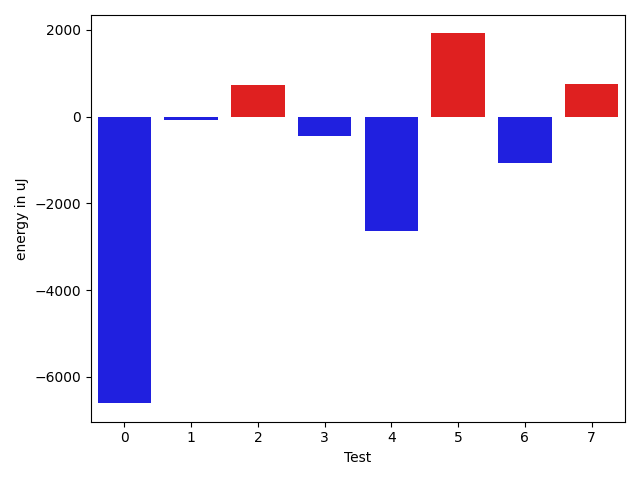
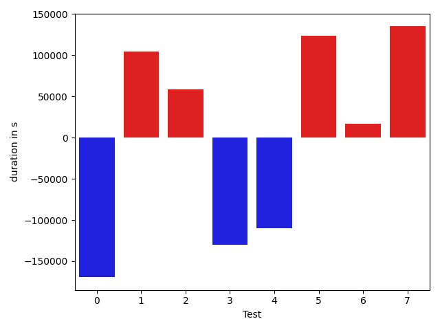

# gson aceada

https://github.com/google/gson/commit/aceada

## Delta Energy per test method

| ID | EnergyV1 | EnergyV2 | DeltaEnergy |
| --- | --- | --- | --- |
| 0 | 95980.10704024292 | 57426.222234017885 | -38553.88480622503 |
| 1 | 120043.1449620186 | 150512.70029612043 | 30469.555334101824 |
| 2 | 38633.072486162186 | 57211.223571777344 | 18578.151085615158 |
| 3 | 220864.66405481508 | 215405.63837297156 | -5459.0256818435155 |
| 4 | 32343.998115265094 | 79650.30461312686 | 47306.30649786177 |
| 5 | 33738.705349103955 | 38553.55431670096 | 4814.848967597005 |
| 6 | 35209.00333070755 | 31539.887840270996 | -3669.115490436554 |
| 7 | 32252.732292592525 | 36975.602840895765 | 4722.870548303239 |

## Delta Duration per test method

| ID | DurationV1 | DurationsV2 | DeltaDuration |
| --- | --- | --- | --- |
| 0 | 2963124.931374875 | 1982926.205065748 | -980198.7263091269 |
| 1 | 4248989.524946843 | 4854079.723995496 | 605090.1990486523 |
| 2 | 584534.2704677582 | 1785879.652999878 | 1201345.3825321198 |
| 3 | 7218430.564553076 | 6334315.26737343 | -884115.2971796468 |
| 4 | 808214.5778140561 | 2188563.2361548995 | 1380348.6583408434 |
| 5 | 878101.7831747521 | 934433.5652386851 | 56331.78206393297 |
| 6 | 562736.6531825066 | 600257.732749939 | 37521.0795674324 |
| 7 | 588459.833083272 | 724139.3793117348 | 135679.54622846283 |

## Misc.

| ID | Test Class | Test Method |
| --- | --- | --- |
| 0 | com.google.gson.internal.LinkedTreeMapTest | testDoubleCapacity |
| 1 | com.google.gson.internal.LinkedTreeMapTest | testRemoveRootDoesNotDoubleUnlink |
| 2 | com.google.gson.internal.LinkedTreeMapTest | testPutNullKeyFails |
| 3 | com.google.gson.internal.LinkedTreeMapTest | testAvlBuilder |
| 4 | com.google.gson.internal.LinkedTreeMapTest | testIterationOrder |
| 5 | com.google.gson.internal.LinkedTreeMapTest | testAvlWalker |
| 6 | com.google.gson.internal.LinkedTreeMapTest | testContainsNullKeyFails |
| 7 | com.google.gson.internal.LinkedTreeMapTest | testContainsNonComparableKeyThrows |

| Test | IterationV1 | IterationV2 | DeltaIteration |
| --- | --- | --- | --- |
| 0 | 84 | 88 | 4 |
| 1 | 98 | 95 | -3 |
| 2 | 23 | 17 | -6 |
| 3 | 99 | 99 | 0 |
| 4 | 47 | 41 | -6 |
| 5 | 51 | 36 | -15 |
| 6 | 22 | 20 | -2 |
| 7 | 25 | 31 | 6 |

| Time Label | Time (s) |
| --- | --- |
| Selection | 27.34842014312744 |
| Injection | 9.834217309951782 |
| Total | 981.1777322292328 |

