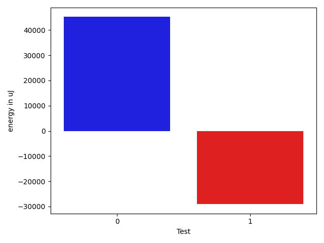

# gson a0493b

https://github.com/google/gson/commit/a0493b

## Delta Energy per test method

| ID | EnergyV1 | EnergyV2 | DeltaEnergy | σV1 | σV2 |
| --- | --- | --- | --- | --- | --- |
| 0 | 116760 | 162902 | 46142 | 39342.31419710325 | 30377.001506852983 |
| 1 | 42175 | 36132 | -6043 | 42522.192212342496 | 23296.19387317017 |

## Delta Duration per test method

| ID | DurationV1 | DurationsV2 | DeltaDuration |
| --- | --- | --- | --- |
| 0 | 3810425.810126582 | 5027682.072164948 | 1217256.262038366 |
| 1 | 2223960.327586207 | 1100882.076923077 | -1123078.25066313 |

## Misc.

| ID | Test Class | Test Method |
| --- | --- | --- |
| 0 | com.google.gson.internal.LinkedTreeMapTest | testRemoveRootDoesNotDoubleUnlink |
| 1 | com.google.gson.internal.LinkedTreeMapTest | testIterationOrder |

| Test | IterationV1 | IterationV2 | DeltaIteration |
| --- | --- | --- | --- |
| 0 | 79 | 97 | 18 |
| 1 | 58 | 52 | -6 |

| Time Label | Time (s) |
| --- | --- |
| Selection | 27.141424894332886 |
| Injection | 9.705869674682617 |
| Total | 976.7290995121002 |

