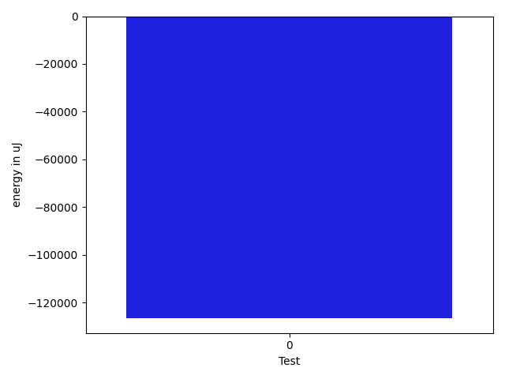

# gson a6ab85

https://github.com/google/gson/commit/a6ab85

## Delta Energy per test method

| ID | EnergyV1 | EnergyV2 | DeltaEnergy | σV1 | σV2 |
| --- | --- | --- | --- | --- | --- |
| 0 | 170592 | 44129 | -126463 | 29038.465921413175 | 73497.89854127161 |

## Delta Duration per test method

| ID | DurationV1 | DurationsV2 | DeltaDuration |
| --- | --- | --- | --- |
| 0 | 5688096.686868687 | 3304743.4833333334 | -2383353.2035353538 |

## Misc.

| ID | Test Class | Test Method |
| --- | --- | --- |
| 0 | com.google.gson.internal.LinkedTreeMapTest | testIterationOrder |

| Test | IterationV1 | IterationV2 | DeltaIteration |
| --- | --- | --- | --- |
| 0 | 99 | 60 | -39 |

| Time Label | Time (s) |
| --- | --- |
| Selection | 26.97301459312439 |
| Injection | 9.842614650726318 |
| Total | 974.7494690418243 |

