# gson 084047

https://github.com/google/gson/commit/084047

## Delta Energy per test method

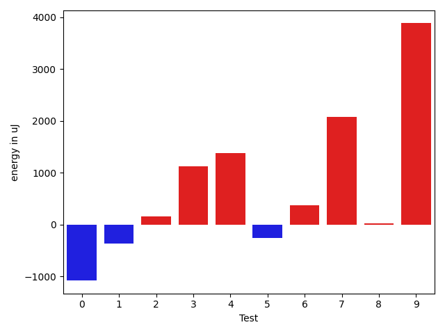

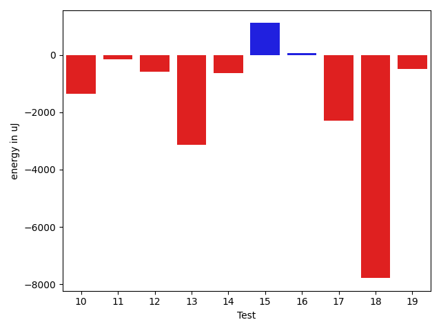

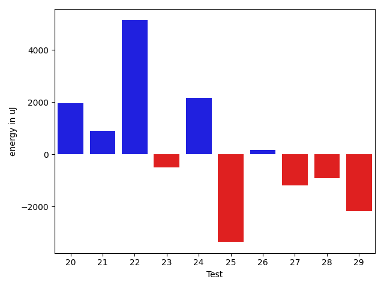

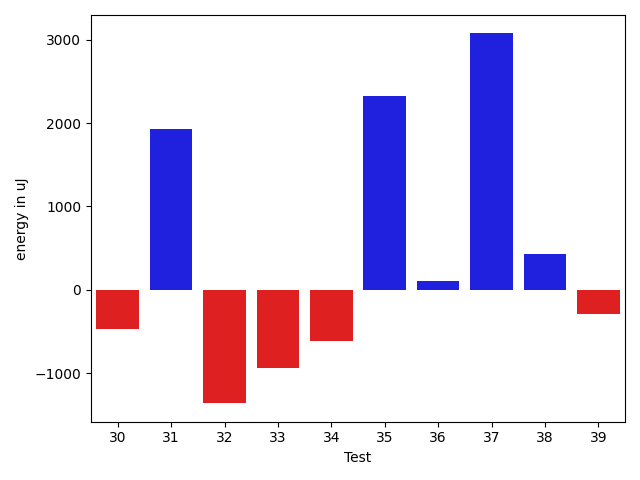

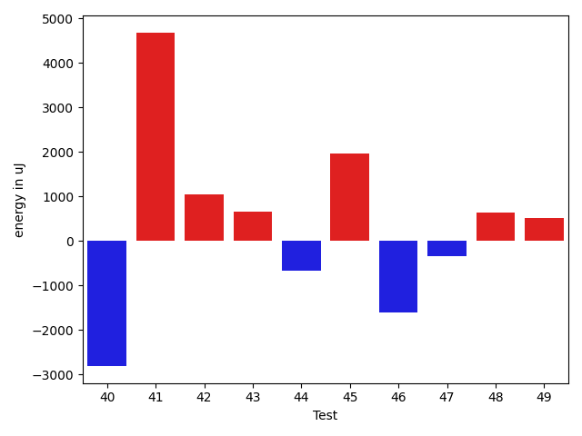

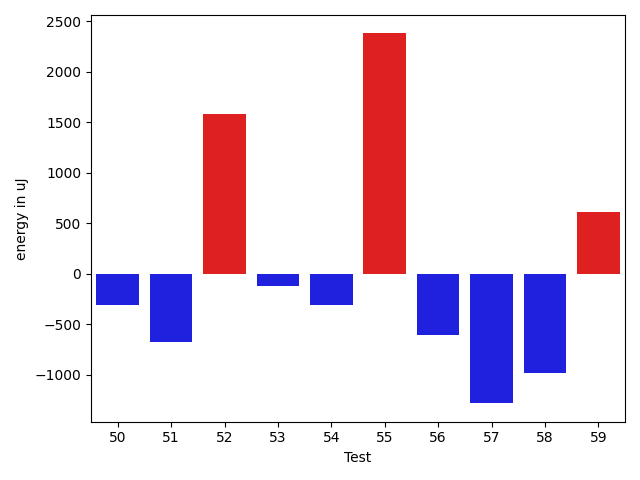

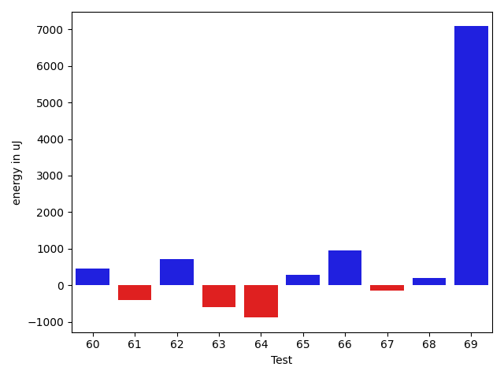

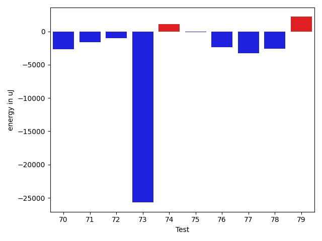

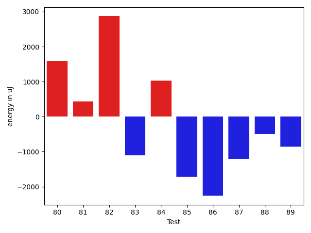

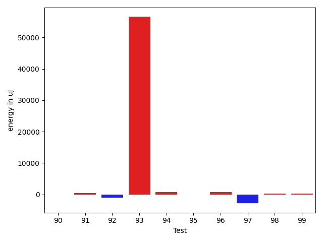

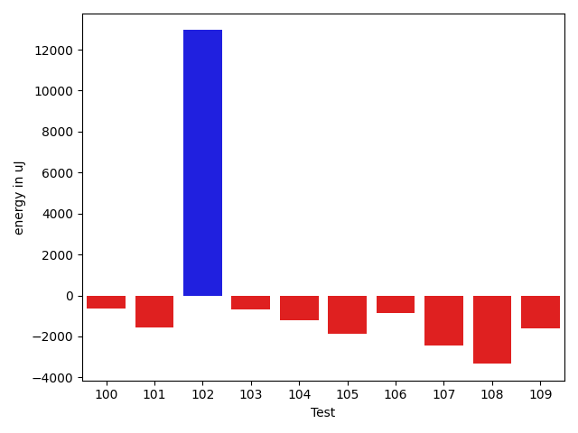

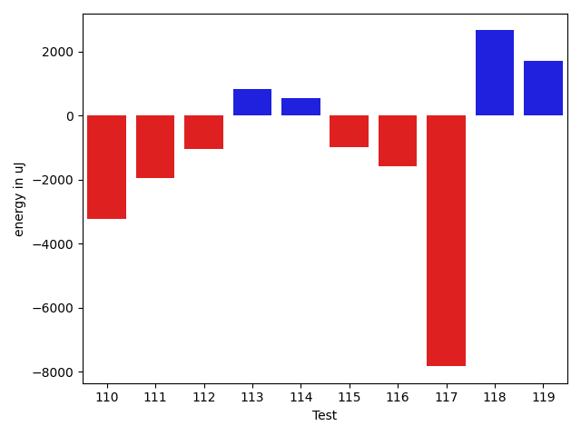

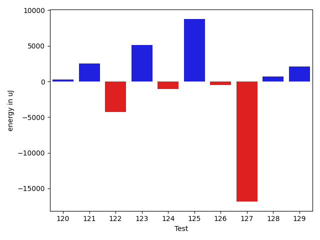

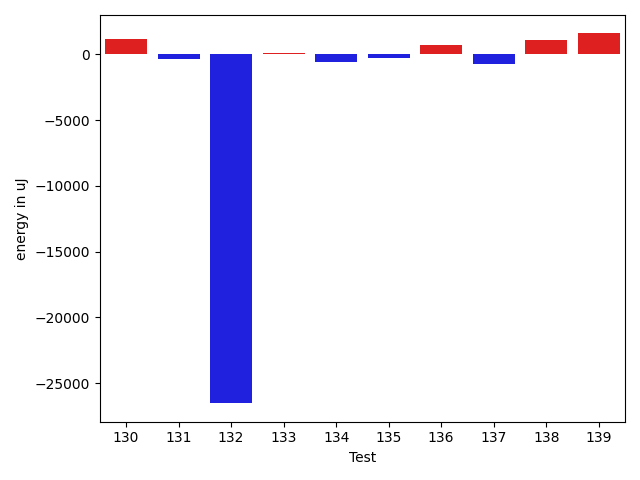

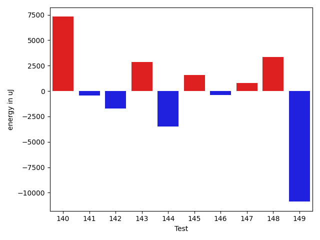

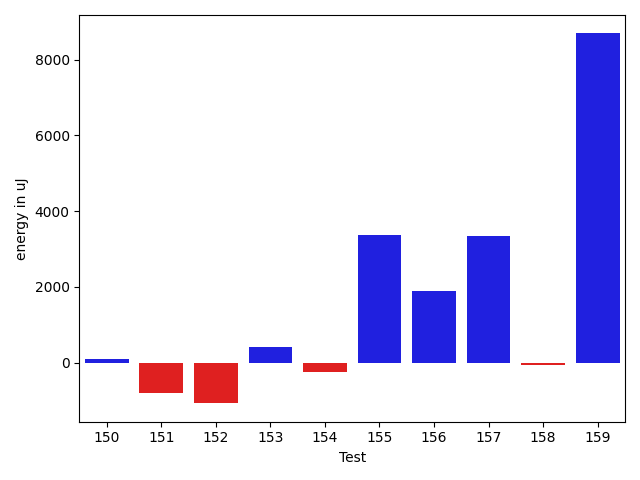

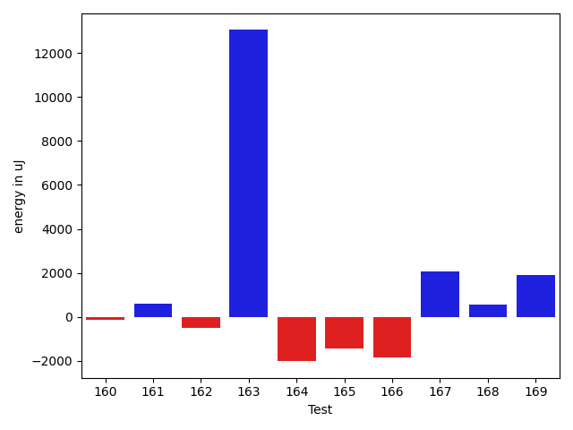

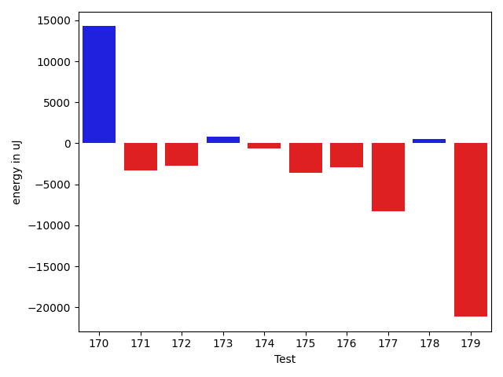

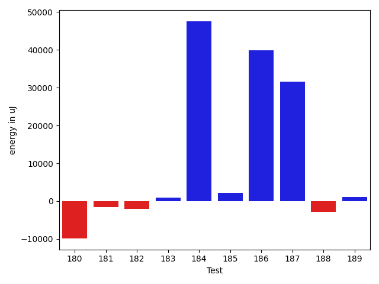

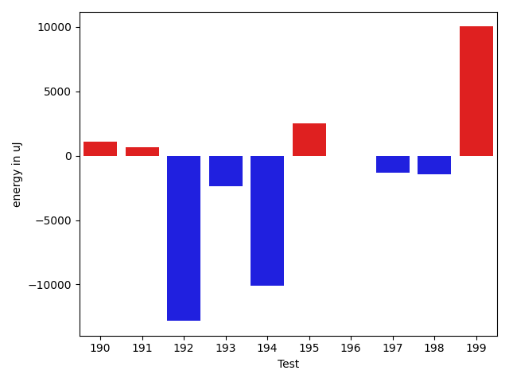

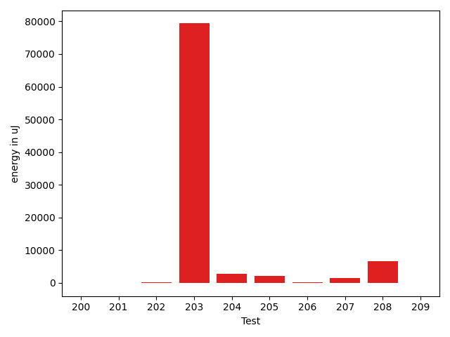

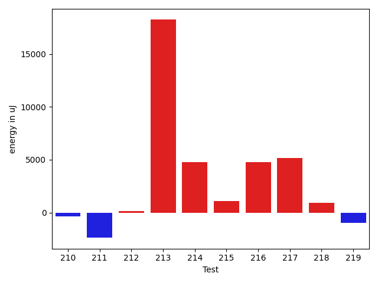

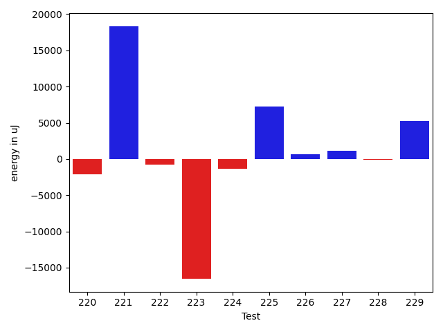

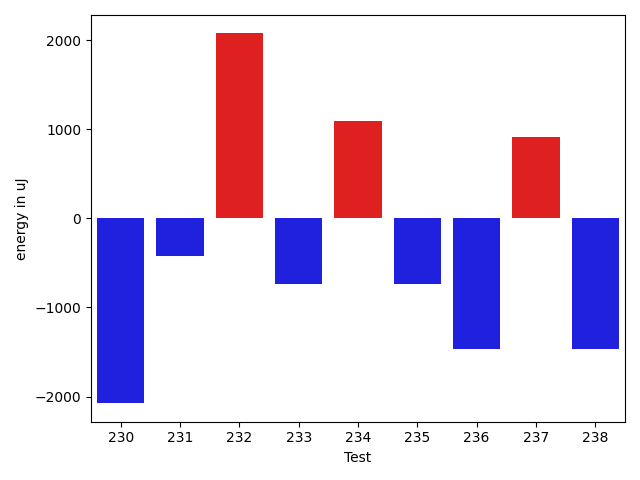

| ID | EnergyV1 | EnergyV2 | DeltaEnergy | σV1 | σV2 |
| --- | --- | --- | --- | --- | --- |
| 0 | 37353 | 37293 | -60 | 7589.865832868639 | 5932.486740906757 |
| 1 | 37475 | 38025 | 550 | 3838.9180369258215 | 4469.467567594353 |
| 2 | 38269 | 37353 | -916 | 4544.5552660618105 | 4833.62603595895 |
| 3 | 36316 | 37414 | 1098 | 3781.4563854501516 | 4374.771378383085 |
| 4 | 39001 | 37781 | -1220 | 20520.56495865117 | 38245.27824763664 |
| 5 | 39489 | 38025 | -1464 | 4218.206846648167 | 4236.579707779657 |
| 6 | 38085 | 38025 | -60 | 4416.005874034383 | 4772.030001286919 |
| 7 | 40527 | 41809 | 1282 | 60068.95943396628 | 69758.68199813941 |
| 8 | 35523 | 35949 | 426 | 4053.3929580537842 | 4014.944490226484 |
| 9 | 39062 | 40222 | 1160 | 44829.97471672824 | 42833.93004023046 |
| 10 | 38269 | 38330 | 61 | 18023.20389761488 | 16616.99800315606 |
| 11 | 36377 | 36560 | 183 | 4538.785968479379 | 4014.1855905157117 |
| 12 | 36560 | 36438 | -122 | 5855.801982981848 | 3854.1779344715137 |
| 13 | 38574 | 35645 | -2929 | 4126.967710705658 | 3792.269893810302 |
| 14 | 41931 | 39856 | -2075 | 14757.673571413547 | 20416.416034970734 |
| 15 | 37964 | 37781 | -183 | 7342.303215124972 | 10296.443467333782 |
| 16 | 36560 | 36438 | -122 | 8447.841429670758 | 11920.48967579464 |
| 17 | 36926 | 34363 | -2563 | 5032.018885221367 | 4341.397118596504 |
| 18 | 37780 | 37354 | -426 | 38157.98448709705 | 4231.658267133101 |
| 19 | 36621 | 35889 | -732 | 5183.250046515934 | 4111.883926782876 |
| 20 | 35156 | 38940 | 3784 | 3734.2997637607486 | 4682.234371536735 |
| 21 | 35340 | 38757 | 3417 | 3201.8667992282253 | 4753.186477485466 |
| 22 | 35705 | 36011 | 306 | 4322.691036682024 | 26468.696375136868 |
| 23 | 36987 | 36316 | -671 | 3645.799133645559 | 3798.459259577703 |
| 24 | 109375 | 113342 | 3967 | 25831.328289076482 | 23422.101375321414 |
| 25 | 142089 | 153320 | 11231 | 263736.55147458095 | 255093.99100011893 |
| 26 | 35461 | 35705 | 244 | 4146.742607591615 | 4445.260540156854 |
| 27 | 37109 | 36682 | -427 | 11293.687933051384 | 9461.280041553116 |
| 28 | 36132 | 36193 | 61 | 3223.200344722962 | 5154.270460926066 |
| 29 | 72082 | 72143 | 61 | 22421.010442878476 | 18846.802604998884 |
| 30 | 36255 | 35705 | -550 | 4117.159827843822 | 4326.855735242394 |
| 31 | 33875 | 38330 | 4455 | 3971.685517370287 | 5096.973501602011 |
| 32 | 37109 | 33752 | -3357 | 3756.156332840087 | 4285.650956000344 |
| 33 | 34973 | 33691 | -1282 | 3999.5793552655514 | 4194.4511699725335 |
| 34 | 37170 | 35828 | -1342 | 4902.348971140494 | 3895.270332849356 |
| 35 | 33692 | 36194 | 2502 | 2701.4782485705855 | 3177.8832601957074 |
| 36 | 36376 | 36987 | 611 | 4539.554372721243 | 3967.091219691228 |
| 37 | 36072 | 38086 | 2014 | 4541.104737087238 | 4248.902098189602 |
| 38 | 34485 | 34668 | 183 | 3517.9170252786753 | 3780.9625080791266 |
| 39 | 36010 | 35705 | -305 | 4103.510008550476 | 3513.2022998967764 |
| 40 | 36743 | 36071 | -672 | 23101.17285871966 | 4282.141043403405 |
| 41 | 36133 | 36377 | 244 | 7226.776375718048 | 29778.237959788625 |
| 42 | 36193 | 37597 | 1404 | 4637.3322310843 | 3960.088048198041 |
| 43 | 35339 | 36438 | 1099 | 4095.700754377711 | 4660.315499085916 |
| 44 | 38086 | 35645 | -2441 | 4174.544848776264 | 3428.4736536248897 |
| 45 | 33936 | 37902 | 3966 | 4986.544730173466 | 3372.9841780396955 |
| 46 | 37659 | 35278 | -2381 | 1556.1985282652724 | 3960.3930814219693 |
| 47 | 35705 | 36499 | 794 | 4293.477432284752 | 3130.4594389125614 |
| 48 | 36377 | 36560 | 183 | 5020.7107690228195 | 8049.611319951437 |
| 49 | 35706 | 36438 | 732 | 8137.643808598706 | 9230.290460019736 |
| 50 | 38513 | 38208 | -305 | 3671.6265469135064 | 4324.3394928690295 |
| 51 | 37781 | 37109 | -672 | 4478.862965349722 | 4382.137785430046 |
| 52 | 38147 | 39734 | 1587 | 110932.3196371137 | 70228.24651221228 |
| 53 | 37293 | 37171 | -122 | 4474.502487086064 | 3972.2964420261155 |
| 54 | 36865 | 36560 | -305 | 4667.716375248534 | 4297.676483288017 |
| 55 | 36438 | 38818 | 2380 | 3389.4417221614344 | 5050.877037750979 |
| 56 | 37048 | 36438 | -610 | 3651.2902155576658 | 3894.062286470145 |
| 57 | 36926 | 35645 | -1281 | 4202.057966443549 | 4479.278038819963 |
| 58 | 39246 | 38269 | -977 | 12357.316601502655 | 9850.678864868423 |
| 59 | 35705 | 36316 | 611 | 8070.990608899814 | 3680.883064483304 |
| 60 | 36072 | 37476 | 1404 | 6121.703441066972 | 5010.252892459621 |
| 61 | 35706 | 35461 | -245 | 3764.0959524300583 | 3705.9681811909827 |
| 62 | 35156 | 37659 | 2503 | 4983.900158941038 | 3714.090356624356 |
| 63 | 36194 | 36254 | 60 | 4004.0240848286285 | 3985.3075477177263 |
| 64 | 37597 | 35949 | -1648 | 4520.681761360779 | 3700.206840568994 |
| 65 | 35767 | 36743 | 976 | 4693.289707486636 | 3248.6875714632492 |
| 66 | 36682 | 37842 | 1160 | 4995.636561655308 | 4667.507744599728 |
| 67 | 37659 | 36804 | -855 | 3823.285052150833 | 3535.619018918579 |
| 68 | 36255 | 36743 | 488 | 3585.667234245145 | 4568.512714322624 |
| 69 | 39673 | 38941 | -732 | 16256.476737546795 | 30593.126593476227 |
| 70 | 40588 | 37903 | -2685 | 18047.722711036644 | 21156.38183168141 |
| 71 | 40711 | 39063 | -1648 | 15806.364635804148 | 18735.437866345812 |
| 72 | 36865 | 35889 | -976 | 4170.167786710528 | 3940.6810016829313 |
| 73 | 66650 | 40954 | -25696 | 48421.111377813264 | 48019.89483705554 |
| 74 | 73364 | 74463 | 1099 | 30011.48226030949 | 25185.185026651096 |
| 75 | 37171 | 37049 | -122 | 15779.90778920249 | 21402.347462605932 |
| 76 | 40222 | 37842 | -2380 | 24932.10131376816 | 13130.927840738357 |
| 77 | 38879 | 35644 | -3235 | 8310.207494756649 | 5008.886741077986 |
| 78 | 39063 | 36499 | -2564 | 4474.470815234902 | 4474.265227541712 |
| 79 | 40771 | 42969 | 2198 | 197241.7391225184 | 170699.6014981042 |
| 80 | 37963 | 39551 | 1588 | 14097.26548262109 | 12219.902048815477 |
| 81 | 39123 | 39551 | 428 | 18467.27531930491 | 7317.297977149762 |
| 82 | 36255 | 39123 | 2868 | 3755.504654327789 | 4746.566582832218 |
| 83 | 40039 | 38940 | -1099 | 4740.060975302615 | 4347.593002647173 |
| 84 | 36621 | 37658 | 1037 | 5148.668817276947 | 5140.341684322059 |
| 85 | 36438 | 34729 | -1709 | 4885.668578640743 | 4397.097435987774 |
| 86 | 38208 | 35949 | -2259 | 4363.944179294689 | 3902.739824647409 |
| 87 | 39612 | 38391 | -1221 | 219762.02041764322 | 306091.93131134263 |
| 88 | 37903 | 37414 | -489 | 4923.435395335732 | 4814.5645373501875 |
| 89 | 38147 | 37292 | -855 | 4105.457238335636 | 4166.006414243696 |
| 90 | 36987 | 36804 | -183 | 4405.043330944657 | 3604.988704906022 |
| 91 | 37475 | 38452 | 977 | 4383.278081876115 | 3226.916075906956 |
| 92 | 38818 | 36316 | -2502 | 3131.7205975033035 | 4643.864014414612 |
| 93 | 41504 | 39611 | -1893 | 264336.92924814037 | 403631.39566465863 |
| 94 | 37781 | 39429 | 1648 | 3582.814508521078 | 5499.726046207514 |
| 95 | 36133 | 37597 | 1464 | 5159.348953760219 | 6225.007695570935 |
| 96 | 36255 | 39856 | 3601 | 5005.016343185661 | 5081.259006372707 |
| 97 | 38086 | 36010 | -2076 | 3542.6388267988673 | 3624.467051819098 |
| 98 | 37598 | 37598 | 0 | 3962.4704091078784 | 4318.094837649773 |
| 99 | 37109 | 37781 | 672 | 4080.2767382457 | 4432.01123874199 |
| 100 | 38391 | 37232 | -1159 | 4324.235739333343 | 3793.7717480451583 |
| 101 | 37292 | 37475 | 183 | 8237.275661590667 | 3755.891995115092 |
| 102 | 41748 | 42968 | 1220 | 18311.777705473978 | 58022.4813204146 |
| 103 | 38086 | 36865 | -1221 | 3626.1275867379454 | 4161.532254312851 |
| 104 | 38147 | 37597 | -550 | 3053.3472368910925 | 4580.033689398012 |
| 105 | 38819 | 37109 | -1710 | 3688.066787449057 | 3869.568908179229 |
| 106 | 39062 | 36560 | -2502 | 8202.342263480468 | 8671.51195839329 |
| 107 | 37598 | 38513 | 915 | 32064.739689854014 | 7594.567778993235 |
| 108 | 36072 | 37720 | 1648 | 25672.064892675317 | 4202.7582931681845 |
| 109 | 38513 | 36804 | -1709 | 4279.393223956422 | 3697.9962912040555 |
| 110 | 38635 | 38879 | 244 | 23961.535667782235 | 3593.141308086358 |
| 111 | 37658 | 37536 | -122 | 13063.611879931253 | 9581.05388327986 |
| 112 | 38575 | 36865 | -1710 | 3786.6921701977217 | 3866.6662667055343 |
| 113 | 37109 | 37231 | 122 | 7812.285794536079 | 7838.565949481767 |
| 114 | 36133 | 36132 | -1 | 7528.069156215414 | 7081.066449453499 |
| 115 | 36926 | 37842 | 916 | 25129.14824692456 | 10138.370101667033 |
| 116 | 37963 | 36621 | -1342 | 9997.50824634831 | 7634.014029350441 |
| 117 | 36621 | 38269 | 1648 | 41726.025245020086 | 5813.837870696829 |
| 118 | 37537 | 37232 | -305 | 9083.786371664246 | 12028.556288232528 |
| 119 | 71595 | 74646 | 3051 | 84547.8706823949 | 71836.26760384144 |
| 120 | 37475 | 36865 | -610 | 7148.231708703126 | 8781.459332340772 |
| 121 | 36499 | 37476 | 977 | 9430.538856868598 | 32177.708782772697 |
| 122 | 37231 | 37537 | 306 | 31350.816092128593 | 4390.289669212253 |
| 123 | 40039 | 40283 | 244 | 10309.97532473624 | 22261.601266181264 |
| 124 | 36743 | 38269 | 1526 | 4376.315617573233 | 4050.06612408581 |
| 125 | 39185 | 40100 | 915 | 3973.818992921564 | 39324.23396663262 |
| 126 | 37415 | 38086 | 671 | 4926.489577017034 | 4847.840150301301 |
| 127 | 99243 | 95093 | -4150 | 324591.4813571698 | 282566.4093438247 |
| 128 | 37353 | 38574 | 1221 | 3669.1493494775254 | 5153.469040086046 |
| 129 | 48157 | 46082 | -2075 | 241474.53808124288 | 267093.9672859717 |
| 130 | 37963 | 37781 | -182 | 10168.151153878332 | 13428.639053591685 |
| 131 | 36560 | 37659 | 1099 | 5696.903621830968 | 4526.495345704251 |
| 132 | 83373 | 77210 | -6163 | 217893.91671291325 | 30454.840030992375 |
| 133 | 39184 | 39306 | 122 | 28349.95590736822 | 22360.757575004587 |
| 134 | 39184 | 38818 | -366 | 3607.932121805447 | 4235.432800060288 |
| 135 | 39062 | 37720 | -1342 | 4634.934288638838 | 4178.423396922651 |
| 136 | 36743 | 37049 | 306 | 4926.882780654521 | 4557.85918119461 |
| 137 | 38513 | 38757 | 244 | 7773.774484066641 | 3966.4360092591737 |
| 138 | 36316 | 40039 | 3723 | 7832.348357982358 | 3629.7415515808143 |
| 139 | 36499 | 38452 | 1953 | 4482.478306115024 | 5894.932620541403 |
| 140 | 37720 | 38940 | 1220 | 5866.4827328171805 | 37824.4542350063 |
| 141 | 37964 | 36865 | -1099 | 4434.540419983382 | 4538.504859515969 |
| 142 | 37109 | 35949 | -1160 | 4138.24692391667 | 3418.7140597338966 |
| 143 | 33753 | 37354 | 3601 | 3831.1372244280105 | 4318.43921787301 |
| 144 | 64148 | 45227 | -18921 | 19513.371463445812 | 19077.878422330796 |
| 145 | 36438 | 38635 | 2197 | 4228.841621839706 | 3029.4628669488957 |
| 146 | 36621 | 35705 | -916 | 8137.807228630951 | 4055.5901299933266 |
| 147 | 36438 | 37415 | 977 | 3095.7008038775366 | 3398.6359185918777 |
| 148 | 34790 | 37292 | 2502 | 3512.24423347175 | 3631.077171064011 |
| 149 | 34119 | 37353 | 3234 | 42866.055763205164 | 2919.4795830783064 |
| 150 | 36804 | 39856 | 3052 | 4568.180182515877 | 3878.7596677288475 |
| 151 | 38025 | 40344 | 2319 | 3773.2053663751335 | 3617.579454198348 |
| 152 | 37109 | 37048 | -61 | 3311.3522705044534 | 5390.963171518302 |
| 153 | 36316 | 38147 | 1831 | 4302.4765053856 | 3943.0863447859815 |
| 154 | 34851 | 37231 | 2380 | 5663.784781361909 | 3527.51319968632 |
| 155 | 35705 | 39551 | 3846 | 3243.729965138081 | 3129.3169296638835 |
| 156 | 38452 | 39856 | 1404 | 2797.049044622688 | 2907.4311834907967 |
| 157 | 34668 | 38085 | 3417 | 3302.4223691303073 | 3439.616047034961 |
| 158 | 39002 | 40100 | 1098 | 4164.119381360509 | 3895.705217144758 |
| 159 | 38452 | 37964 | -488 | 4178.532726927001 | 32667.756315992814 |
| 160 | 36743 | 37415 | 672 | 4213.049133347486 | 4505.512868607044 |
| 161 | 36438 | 38147 | 1709 | 2824.7481332906345 | 4723.162716866739 |
| 162 | 39185 | 40100 | 915 | 4839.776217629767 | 2981.6565419871886 |
| 163 | 36987 | 37720 | 733 | 3905.8468666978933 | 45247.46102275704 |
| 164 | 38513 | 36804 | -1709 | 3015.224568751057 | 3359.978310776558 |
| 165 | 38574 | 36866 | -1708 | 4095.4867618302137 | 3335.795328287127 |
| 166 | 40772 | 38696 | -2076 | 3502.654595423841 | 4362.3395529234085 |
| 167 | 38330 | 39246 | 916 | 3832.4613006648547 | 3424.2380539325827 |
| 168 | 35217 | 35217 | 0 | 3315.6275706870338 | 4120.406946912315 |
| 169 | 36072 | 39001 | 2929 | 4530.1568323425445 | 3069.5466432425037 |
| 170 | 35217 | 38146 | 2929 | 4241.468755531773 | 43609.98039469303 |
| 171 | 39429 | 38086 | -1343 | 9562.47664204502 | 4634.776117207368 |
| 172 | 66223 | 63903 | -2320 | 33908.78281095381 | 29129.5707679952 |
| 173 | 37353 | 36743 | -610 | 4895.479036294312 | 4758.734129503992 |
| 174 | 40589 | 38391 | -2198 | 6109.575723920261 | 7481.363430384865 |
| 175 | 41259 | 38696 | -2563 | 42322.37048856985 | 39986.51004750088 |
| 176 | 39489 | 37964 | -1525 | 81816.63025435687 | 78099.53448762267 |
| 177 | 37049 | 37597 | 548 | 44001.66760985708 | 4415.762141182426 |
| 178 | 38514 | 39306 | 792 | 4705.705312861546 | 4264.48919420603 |
| 179 | 39734 | 40222 | 488 | 66976.9052509724 | 4295.279281883193 |
| 180 | 42236 | 42480 | 244 | 352000.54128107737 | 359380.9998690083 |
| 181 | 37781 | 38513 | 732 | 25015.129827971225 | 23437.142085725092 |
| 182 | 40588 | 40405 | -183 | 19033.073909016355 | 16014.985426276753 |
| 183 | 36865 | 38696 | 1831 | 4049.95724409457 | 4559.666492842603 |
| 184 | 1842341 | 1894526 | 52185 | 198640.8930689332 | 219935.4991075181 |
| 185 | 39673 | 44189 | 4516 | 18550.363658562375 | 20168.955106280933 |
| 186 | 38147 | 39673 | 1526 | 263912.6161412305 | 350504.9914590843 |
| 187 | 315734 | 323608 | 7874 | 130084.65639647515 | 168805.48182362007 |
| 188 | 41015 | 38696 | -2319 | 15030.062193443027 | 9467.653879624824 |
| 189 | 36805 | 38330 | 1525 | 4726.646043084778 | 4783.774785858346 |
| 190 | 38940 | 39246 | 306 | 11785.560766440722 | 13306.479537779605 |
| 191 | 37292 | 38452 | 1160 | 3739.0329659998097 | 5703.040028101695 |
| 192 | 39307 | 36499 | -2808 | 28996.52156357997 | 5252.824957594148 |
| 193 | 39795 | 39001 | -794 | 20197.05028120266 | 20610.36111340015 |
| 194 | 144043 | 126952 | -17091 | 67786.99039708263 | 75205.63486275132 |
| 195 | 38879 | 39489 | 610 | 8195.125223794443 | 12788.230360579326 |
| 196 | 39917 | 40588 | 671 | 3938.5115971783084 | 4134.408217931558 |
| 197 | 38391 | 38635 | 244 | 4950.057237095247 | 3786.3644332395916 |
| 198 | 39368 | 40161 | 793 | 12931.396586051656 | 5303.692329766513 |
| 199 | 40589 | 40833 | 244 | 71597.30907672274 | 96134.04527141018 |
| 200 | 37597 | 39246 | 1649 | 4511.883607735321 | 4684.735865572094 |
| 201 | 39978 | 39124 | -854 | 5033.921699629876 | 4445.421070044997 |
| 202 | 37902 | 37537 | -365 | 4042.2937063385803 | 3776.688069674708 |
| 203 | 38269 | 39368 | 1099 | 7301.297833642698 | 329713.9719442959 |
| 204 | 37049 | 37781 | 732 | 4833.571054419009 | 10032.512138405627 |
| 205 | 39612 | 40588 | 976 | 20454.221399979884 | 24058.81764479503 |
| 206 | 38391 | 37964 | -427 | 3969.9642702002584 | 4819.205454782004 |
| 207 | 36560 | 36621 | 61 | 3758.7590468549656 | 4802.019302352427 |
| 208 | 40588 | 39306 | -1282 | 12751.98279773262 | 26886.56543887465 |
| 209 | 37598 | 36438 | -1160 | 4071.782552698828 | 4105.093606853917 |
| 210 | 38391 | 38024 | -367 | 3946.586080816761 | 4452.884600146542 |
| 211 | 39490 | 37109 | -2381 | 4225.440128086265 | 4181.061810230673 |
| 212 | 38025 | 38147 | 122 | 4608.603540947423 | 3492.05761629953 |
| 213 | 46021 | 64270 | 18249 | 26962.979521439276 | 22702.76481732164 |
| 214 | 38391 | 43151 | 4760 | 4133.995764464378 | 5426.242840900235 |
| 215 | 35828 | 36927 | 1099 | 3817.5055103207965 | 4562.57342406673 |
| 216 | 35950 | 40710 | 4760 | 3609.7373338481516 | 4401.041249112406 |
| 217 | 36865 | 42054 | 5189 | 4754.342944863174 | 5250.5010341276 |
| 218 | 37048 | 37964 | 916 | 3846.817571980606 | 4995.216227552117 |
| 219 | 38147 | 37170 | -977 | 5897.884686491245 | 4841.765226306069 |
| 220 | 39795 | 37476 | -2319 | 4365.217550742015 | 4111.986354226355 |
| 221 | 38330 | 37597 | -733 | 30602.16311453962 | 52381.903480554174 |
| 222 | 38269 | 37414 | -855 | 4302.92524370254 | 4459.348001114213 |
| 223 | 39673 | 39429 | -244 | 59020.87213923892 | 4158.908567056482 |
| 224 | 37720 | 37170 | -550 | 9169.92551693576 | 4429.3457041899 |
| 225 | 39245 | 37597 | -1648 | 4581.398599470415 | 43874.27719866408 |
| 226 | 38635 | 39184 | 549 | 4707.165011388961 | 4215.621791974527 |
| 227 | 37963 | 38086 | 123 | 4134.073257683842 | 8376.576192464387 |
| 228 | 37537 | 38452 | 915 | 14459.775318978585 | 12275.419523386401 |
| 229 | 39612 | 42175 | 2563 | 14803.338976557801 | 19283.146328850064 |
| 230 | 40832 | 38757 | -2075 | 27124.52888454798 | 44854.19628790154 |
| 231 | 37903 | 37476 | -427 | 4824.257266928744 | 3856.77972338462 |
| 232 | 37780 | 39856 | 2076 | 4472.516689025059 | 4933.69529756601 |
| 233 | 38819 | 38086 | -733 | 19478.271923597327 | 5126.1140998643705 |
| 234 | 37537 | 38636 | 1099 | 4196.80800602629 | 4059.8373351034643 |
| 235 | 40466 | 39734 | -732 | 5599.342768352371 | 2772.204675963176 |
| 236 | 38757 | 37293 | -1464 | 3935.9503919038852 | 4474.670100310888 |
| 237 | 37659 | 38574 | 915 | 227649.77193110483 | 238945.36579191018 |
| 238 | 39246 | 37781 | -1465 | 11303.11420988552 | 10503.34749077487 |

## Delta Duration per test method

| ID | DurationV1 | DurationsV2 | DeltaDuration |
| --- | --- | --- | --- |
| 0 | 1006038.8153846153 | 849841.0344827586 | -156197.78090185672 |
| 1 | 823205.3260869565 | 781478.1111111111 | -41727.21497584542 |
| 2 | 848800.5862068966 | 947184.8297872341 | 98384.2435803375 |
| 3 | 730156.3777777777 | 746029.7954545454 | 15873.417676767684 |
| 4 | 1014885.9166666666 | 1065170.1666666667 | 50284.25000000012 |
| 5 | 747793.1923076923 | 752602.1296296297 | 4808.93732193741 |
| 6 | 660523.0222222222 | 674098.3829787234 | 13575.360756501206 |
| 7 | 1885365.0612244897 | 1959490.808080808 | 74125.74685631832 |
| 8 | 768285.3 | 830300.36 | 62015.05999999994 |
| 9 | 1670741.6842105263 | 1743069.037037037 | 72327.35282651079 |
| 10 | 1210322.0875 | 1311290.7945205478 | 100968.70702054794 |
| 11 | 702630.8181818182 | 758652.5869565217 | 56021.768774703494 |
| 12 | 802303.3260869565 | 751458.7826086957 | -50844.543478260865 |
| 13 | 403044.6153846154 | 399542.1 | -3502.515384615399 |
| 14 | 1039126.1296296297 | 1063346.875 | 24220.745370370336 |
| 15 | 1143091.8333333333 | 1192949.1573033708 | 49857.32397003751 |
| 16 | 590604.7619047619 | 937464.7058823529 | 346859.943977591 |
| 17 | 408012.28571428574 | 412337.22222222225 | 4324.936507936509 |
| 18 | 809653.2727272727 | 574444.3428571429 | -235208.9298701298 |
| 19 | 1091053.8205128205 | 1057435.0632911392 | -33618.7572216813 |
| 20 | 451116.5714285714 | 473156.75 | 22040.17857142858 |
| 21 | 417643.6875 | 417200.5263157895 | -443.16118421050487 |
| 22 | 596817.6388888889 | 734079.2 | 137261.56111111108 |
| 23 | 725800.7547169811 | 688419.8846153846 | -37380.87010159646 |
| 24 | 3480271.3636363638 | 3374827.5555555555 | -105443.80808080826 |
| 25 | 9320779.848484848 | 9267494.121212121 | -53285.727272726595 |
| 26 | 636785.2045454546 | 616341.7441860465 | -20443.460359408055 |
| 27 | 1216964.5617977527 | 1208495.4197530865 | -8469.142044666223 |
| 28 | 564943.1333333333 | 563499.9166666666 | -1443.2166666666744 |
| 29 | 2353795.595959596 | 2209911.616161616 | -143883.97979797982 |
| 30 | 717224.4629629629 | 752985.44 | 35760.977037037024 |
| 31 | 340174.4 | 367885.45454545453 | 27711.054545454506 |
| 32 | 548712.0571428571 | 602476.4666666667 | 53764.40952380956 |
| 33 | 596912.717948718 | 629821.074074074 | 32908.35612535605 |
| 34 | 555169.3333333334 | 499852.92307692306 | -55316.41025641031 |
| 35 | 420972.85 | 415628.22222222225 | -5344.627777777729 |
| 36 | 710178.5681818182 | 709213.5909090909 | -964.9772727272939 |
| 37 | 412405.6296296296 | 447926.0 | 35520.370370370394 |
| 38 | 445938.1538461539 | 453634.55 | 7696.396153846115 |
| 39 | 810228.8596491228 | 791666.96 | -18561.899649122846 |
| 40 | 931417.8596491228 | 783145.0 | -148272.8596491228 |
| 41 | 686708.8518518518 | 977750.0357142857 | 291041.1838624339 |
| 42 | 465013.35294117645 | 439549.23529411765 | -25464.117647058796 |
| 43 | 406890.2962962963 | 385804.35714285716 | -21085.939153439132 |
| 44 | 360316.77777777775 | 422181.48 | 61864.70222222223 |
| 45 | 380001.17647058825 | 369626.5 | -10374.676470588252 |
| 46 | 338044.125 | 362373.25 | 24329.125 |
| 47 | 533654.5384615385 | 510413.347826087 | -23241.190635451523 |
| 48 | 1093624.2658227847 | 1066201.9512195121 | -27422.314603272593 |
| 49 | 1014125.3432835821 | 1005447.5230769231 | -8677.820206659031 |
| 50 | 498824.1 | 413600.36363636365 | -85223.73636363633 |
| 51 | 681651.7837837838 | 622301.2195121951 | -59350.56427158869 |
| 52 | 2252889.935483871 | 1669690.1842105263 | -583199.7512733447 |
| 53 | 656621.4324324324 | 693206.6666666666 | 36585.2342342342 |
| 54 | 606113.1153846154 | 523013.2962962963 | -83099.81908831908 |
| 55 | 554552.2962962963 | 591289.9629629629 | 36737.66666666663 |
| 56 | 488293.7894736842 | 508823.5909090909 | 20529.80143540667 |
| 57 | 617964.1818181818 | 570724.5 | -47239.681818181765 |
| 58 | 984720.406779661 | 941384.0 | -43336.40677966096 |
| 59 | 531145.5161290322 | 657716.8 | 126571.2838709678 |
| 60 | 863092.8936170213 | 844854.84 | -18238.0536170213 |
| 61 | 426186.23529411765 | 453769.8 | 27583.564705882338 |
| 62 | 457475.7931034483 | 491372.4827586207 | 33896.689655172406 |
| 63 | 1049213.0638297873 | 751970.4489795918 | -297242.6148501955 |
| 64 | 499809.95 | 509637.54545454547 | 9827.595454545459 |
| 65 | 624938.2 | 610534.0 | -14404.199999999953 |
| 66 | 552493.1794871795 | 499649.3125 | -52843.8669871795 |
| 67 | 445942.35 | 456954.39285714284 | 11012.042857142864 |
| 68 | 551757.9047619047 | 518733.7931034483 | -33024.111658456444 |
| 69 | 933122.18 | 1270438.8863636365 | 337316.7063636364 |
| 70 | 1163130.6226415094 | 1197977.6458333333 | 34847.02319182386 |
| 71 | 896930.96875 | 1019585.7419354839 | 122654.77318548388 |
| 72 | 845596.9772727273 | 811229.6545454545 | -34367.32272727275 |
| 73 | 2319370.552238806 | 1963979.2394366197 | -355391.31280218647 |
| 74 | 2305294.303030303 | 2358046.474747475 | 52752.17171717156 |
| 75 | 1181237.7066666668 | 1173240.0547945206 | -7997.651872146176 |
| 76 | 969151.32 | 653569.7727272727 | -315581.54727272724 |
| 77 | 932355.8113207547 | 877365.1016949152 | -54990.70962583949 |
| 78 | 568003.2916666666 | 497716.7916666667 | -70286.49999999994 |
| 79 | 2261430.4782608696 | 2359672.227272727 | 98241.74901185744 |
| 80 | 709857.45 | 746820.5909090909 | 36963.14090909099 |
| 81 | 609746.4090909091 | 513650.72 | -96095.68909090909 |
| 82 | 473753.04545454547 | 477433.0588235294 | 3680.0133689839276 |
| 83 | 401835.54545454547 | 473722.0833333333 | 71886.53787878784 |
| 84 | 615357.675 | 584638.1315789474 | -30719.54342105263 |
| 85 | 412086.1904761905 | 434026.5909090909 | 21940.40043290041 |
| 86 | 469107.9 | 413231.8333333333 | -55876.06666666671 |
| 87 | 2312668.404761905 | 2830563.912087912 | 517895.50732600736 |
| 88 | 749989.1794871795 | 690507.7391304348 | -59481.440356744686 |
| 89 | 456852.0 | 415688.3448275862 | -41163.6551724138 |
| 90 | 454675.25 | 430423.3125 | -24251.9375 |
| 91 | 400956.8333333333 | 409394.0 | 8437.166666666686 |
| 92 | 427061.1818181818 | 470484.75 | 43423.56818181818 |
| 93 | 2500890.3333333335 | 4402090.661538461 | 1901200.3282051277 |
| 94 | 522453.94444444444 | 427935.25 | -94518.69444444444 |
| 95 | 418900.3333333333 | 426306.7272727273 | 7406.39393939398 |
| 96 | 446787.5333333333 | 448690.5 | 1902.9666666666744 |
| 97 | 423290.0714285714 | 394228.9166666667 | -29061.154761904734 |
| 98 | 956125.4166666666 | 718575.5652173914 | -237549.85144927527 |
| 99 | 717402.7843137255 | 786541.7906976744 | 69139.00638394884 |
| 100 | 630345.756097561 | 675599.1025641026 | 45253.34646654164 |
| 101 | 688164.9574468085 | 704918.9019607843 | 16753.944513975875 |
| 102 | 1510154.448979592 | 1920790.2608695652 | 410635.81188997324 |
| 103 | 676126.0204081633 | 719903.7391304348 | 43777.7187222715 |
| 104 | 674865.7368421053 | 676238.2352941176 | 1372.4984520123107 |
| 105 | 717525.6666666666 | 859477.0 | 141951.33333333337 |
| 106 | 800355.3913043478 | 869719.6666666666 | 69364.27536231885 |
| 107 | 911092.0681818182 | 872498.35 | -38593.71818181826 |
| 108 | 804230.3125 | 703612.7608695652 | -100617.55163043481 |
| 109 | 661281.6666666666 | 734562.5945945946 | 73280.92792792793 |
| 110 | 754890.34 | 725724.1944444445 | -29166.14555555547 |
| 111 | 963610.0980392157 | 946299.1403508772 | -17310.957688338473 |
| 112 | 739337.1020408163 | 714809.7272727273 | -24527.374768089037 |
| 113 | 1153795.1714285715 | 1116892.5625 | -36902.608928571455 |
| 114 | 1030780.7164179104 | 998777.5802469136 | -32003.13617099682 |
| 115 | 1173073.5555555555 | 1135963.6025641025 | -37109.952991453 |
| 116 | 1130583.9012345679 | 1137218.8674698796 | 6634.966235311702 |
| 117 | 1209697.0294117648 | 929929.1549295775 | -279767.8744821873 |
| 118 | 1254314.7362637362 | 1311225.816091954 | 56911.07982821786 |
| 119 | 2603671.96875 | 2584655.824742268 | -19016.14400773216 |
| 120 | 1094229.8181818181 | 1089274.393258427 | -4955.424923391081 |
| 121 | 1214152.5443037974 | 1214075.78313253 | -76.7611712673679 |
| 122 | 832671.6888888889 | 726748.3142857143 | -105923.37460317463 |
| 123 | 639706.3548387097 | 963787.7096774194 | 324081.3548387097 |
| 124 | 644319.7692307692 | 684866.1538461539 | 40546.384615384624 |
| 125 | 587837.6052631579 | 893227.5853658536 | 305389.98010269576 |
| 126 | 698199.8260869565 | 880029.1086956522 | 181829.28260869568 |
| 127 | 4777277.626262627 | 4242266.070707071 | -535011.555555556 |
| 128 | 808064.9591836735 | 788342.7659574468 | -19722.193226226722 |
| 129 | 2744469.3636363638 | 2842873.5555555555 | 98404.19191919174 |
| 130 | 1168900.8194444445 | 1146294.231707317 | -22606.58773712744 |
| 131 | 995150.1774193548 | 919226.2972972973 | -75923.88012205751 |
| 132 | 3240738.0606060605 | 2498515.494949495 | -742222.5656565656 |
| 133 | 1245044.6 | 1282824.125 | 37779.52499999991 |
| 134 | 763369.1333333333 | 766344.1071428572 | 2974.973809523857 |
| 135 | 659845.5 | 670343.8888888889 | 10498.388888888876 |
| 136 | 717363.2391304348 | 726966.06 | 9602.820869565243 |
| 137 | 1138937.6923076923 | 1084627.2222222222 | -54310.470085470006 |
| 138 | 734448.5128205129 | 733868.275862069 | -580.2369584438857 |
| 139 | 738685.3783783783 | 720663.8181818182 | -18021.56019656011 |
| 140 | 763977.5909090909 | 893641.731707317 | 129664.14079822612 |
| 141 | 753673.5853658536 | 763130.0204081633 | 9456.435042309691 |
| 142 | 316243.7272727273 | 392264.4 | 76020.67272727273 |
| 143 | 502151.9285714286 | 454921.2962962963 | -47230.63227513229 |
| 144 | 1750389.9393939395 | 1805323.383838384 | 54933.444444444496 |
| 145 | 400135.84210526315 | 351618.26666666666 | -48517.57543859648 |
| 146 | 834791.3939393939 | 815925.2711864407 | -18866.122752953204 |
| 147 | 353749.82352941175 | 333320.0 | -20429.823529411748 |
| 148 | 700978.6666666666 | 429143.26666666666 | -271835.39999999997 |
| 149 | 867127.0909090909 | 405226.15789473685 | -461900.9330143541 |
| 150 | 398277.0 | 314278.9 | -83998.09999999998 |
| 151 | 403120.3157894737 | 355723.63636363635 | -47396.679425837356 |
| 152 | 364084.875 | 364963.8333333333 | 878.9583333333139 |
| 153 | 374731.52173913043 | 427583.36842105264 | 52851.84668192221 |
| 154 | 391808.8181818182 | 406793.8947368421 | 14985.076555023901 |
| 155 | 414547.85714285716 | 340995.0909090909 | -73552.76623376628 |
| 156 | 355456.55555555556 | 343097.85714285716 | -12358.698412698403 |
| 157 | 430123.45454545453 | 344745.35714285716 | -85378.09740259737 |
| 158 | 342783.6666666667 | 358397.3333333333 | 15613.666666666628 |
| 159 | 317378.6666666667 | 560382.4285714285 | 243003.76190476184 |
| 160 | 408334.0714285714 | 449160.5 | 40826.42857142858 |
| 161 | 369614.45454545453 | 382585.3 | 12970.845454545459 |
| 162 | 310703.4285714286 | 322065.125 | 11361.69642857142 |
| 163 | 364146.25 | 771025.0 | 406878.75 |
| 164 | 335982.3 | 326619.6666666667 | -9362.633333333302 |
| 165 | 367053.9285714286 | 339856.3333333333 | -27197.595238095266 |
| 166 | 359278.5625 | 469719.8125 | 110441.25 |
| 167 | 311915.0 | 350229.85714285716 | 38314.85714285716 |
| 168 | 369691.75 | 351312.0714285714 | -18379.67857142858 |
| 169 | 286881.2727272727 | 358224.45454545453 | 71343.18181818182 |
| 170 | 356340.29411764705 | 714520.1428571428 | 358179.8487394958 |
| 171 | 934975.3548387097 | 640595.4722222222 | -294379.88261648745 |
| 172 | 1991790.707070707 | 1863799.1818181819 | -127991.52525252523 |
| 173 | 766489.8709677419 | 607595.4285714285 | -158894.44239631342 |
| 174 | 900407.6578947369 | 822669.925 | -77737.73289473681 |
| 175 | 1229090.2558139535 | 1206621.3 | -22468.95581395342 |
| 176 | 1559755.8484848484 | 1442961.8695652173 | -116793.9789196311 |
| 177 | 775923.6818181818 | 444844.65 | -331079.03181818174 |
| 178 | 768005.5217391305 | 491770.25 | -276235.2717391305 |
| 179 | 1412571.761904762 | 469294.5625 | -943277.1994047619 |
| 180 | 4277736.671875 | 3661666.9714285713 | -616069.7004464287 |
| 181 | 1187456.7457627119 | 1078221.9672131147 | -109234.77854959713 |
| 182 | 1581116.2121212122 | 1551120.9292929294 | -29995.282828282798 |
| 183 | 810521.0192307692 | 805718.0588235294 | -4802.960407239851 |
| 184 | 54145800.121212125 | 55144099.29292929 | 998299.1717171669 |
| 185 | 1744223.4545454546 | 1770139.383838384 | 25915.92929292936 |
| 186 | 2317038.4736842103 | 3451533.409090909 | 1134494.9354066988 |
| 187 | 9302845.353535354 | 10100600.181818182 | 797754.8282828275 |
| 188 | 964877.3777777777 | 773791.8333333334 | -191085.54444444436 |
| 189 | 650777.1764705882 | 532459.380952381 | -118317.79551820725 |
| 190 | 1071000.5263157894 | 1071887.5211267606 | 886.9948109711986 |
| 191 | 422805.8333333333 | 374190.0 | -48615.833333333314 |
| 192 | 1185765.6896551724 | 572606.9545454546 | -613158.7351097178 |
| 193 | 1261796.2 | 1117684.0845070423 | -144112.11549295764 |
| 194 | 4580249.555555556 | 4411607.252525252 | -168642.30303030368 |
| 195 | 830264.350877193 | 1030049.4237288135 | 199785.0728516205 |
| 196 | 453419.36842105264 | 479628.5625 | 26209.19407894736 |
| 197 | 398269.17647058825 | 374796.3076923077 | -23472.868778280565 |
| 198 | 919952.5757575758 | 720750.5161290322 | -199202.05962854356 |
| 199 | 1779091.793478261 | 2087345.0 | 308253.206521739 |
| 200 | 587427.1578947369 | 540624.7692307692 | -46802.388663967606 |
| 201 | 404332.8095238095 | 481084.15 | 76751.3404761905 |
| 202 | 473127.1176470588 | 481565.4210526316 | 8438.303405572777 |
| 203 | 669718.6944444445 | 2843099.361111111 | 2173380.6666666665 |
| 204 | 787983.8333333334 | 975873.0238095238 | 187889.19047619042 |
| 205 | 1044677.4130434783 | 1188489.8695652173 | 143812.45652173902 |
| 206 | 488884.0333333333 | 546683.5483870967 | 57799.5150537634 |
| 207 | 493989.8181818182 | 557400.2727272727 | 63410.45454545453 |
| 208 | 664423.9615384615 | 1016329.0333333333 | 351905.0717948718 |
| 209 | 724797.2380952381 | 765859.4897959183 | 41062.25170068024 |
| 210 | 493539.45454545453 | 522464.36666666664 | 28924.91212121211 |
| 211 | 478388.2083333333 | 556368.9642857143 | 77980.755952381 |
| 212 | 546456.6538461539 | 573896.5333333333 | 27439.879487179453 |
| 213 | 1613323.9545454546 | 1593282.6666666667 | -20041.287878787844 |
| 214 | 452786.94736842107 | 469194.63157894736 | 16407.68421052629 |
| 215 | 490365.8947368421 | 469594.75 | -20771.144736842078 |
| 216 | 437141.8823529412 | 389013.75 | -48128.132352941204 |
| 217 | 361741.1176470588 | 404793.625 | 43052.507352941204 |
| 218 | 390060.0 | 503818.7 | 113758.70000000001 |
| 219 | 351068.3846153846 | 449060.5333333333 | 97992.1487179487 |
| 220 | 345361.21428571426 | 418507.375 | 73146.16071428574 |
| 221 | 931655.8666666667 | 1798687.4375 | 867031.5708333333 |
| 222 | 430907.0 | 475930.0 | 45023.0 |
| 223 | 970541.4166666666 | 393422.1111111111 | -577119.3055555555 |
| 224 | 781806.5263157894 | 761027.4418604651 | -20779.084455324337 |
| 225 | 589766.3793103448 | 1028806.9523809524 | 439040.5730706076 |
| 226 | 554823.6111111111 | 478301.38095238095 | -76522.23015873018 |
| 227 | 697520.6363636364 | 811282.3863636364 | 113761.75 |
| 228 | 1201193.5492957747 | 1150748.0273972603 | -50445.52189851436 |
| 229 | 1103669.5714285714 | 1257105.75 | 153436.17857142864 |
| 230 | 684478.5 | 1397943.88 | 713465.3799999999 |
| 231 | 429511.92307692306 | 327669.0909090909 | -101842.83216783218 |
| 232 | 532147.3703703703 | 479802.3043478261 | -52345.066022544226 |
| 233 | 1217033.96 | 581459.0967741936 | -635574.8632258064 |
| 234 | 385359.82352941175 | 392409.625 | 7049.801470588252 |
| 235 | 336243.875 | 409610.55555555556 | 73366.68055555556 |
| 236 | 676156.0952380953 | 395120.95652173914 | -281035.13871635613 |
| 237 | 2676103.576923077 | 3700374.272727273 | 1024270.695804196 |
| 238 | 635907.1923076923 | 832254.4516129033 | 196347.25930521102 |

## Misc.

| ID | Test Class | Test Method |
| --- | --- | --- |
| 0 | com.google.gson.functional.CustomTypeAdaptersTest | testCustomAdapterInvokedForCollectionElementDeserialization |
| 1 | com.google.gson.functional.CustomTypeAdaptersTest | testCustomNestedDeserializers |
| 2 | com.google.gson.functional.CustomTypeAdaptersTest | testRegisterHierarchyAdapterForDate |
| 3 | com.google.gson.functional.CustomTypeAdaptersTest | testCustomByteArrayDeserializerAndInstanceCreator |
| 4 | com.google.gson.functional.CustomTypeAdaptersTest | testCustomDeserializers |
| 5 | com.google.gson.functional.CustomTypeAdaptersTest | testCustomAdapterInvokedForMapElementDeserialization |
| 6 | com.google.gson.functional.CustomDeserializerTest | testDefaultConstructorNotCalledOnField |
| 7 | com.google.gson.functional.CustomDeserializerTest | testDefaultConstructorNotCalledOnObject |
| 8 | com.google.gson.functional.CustomDeserializerTest | testCustomDeserializerReturnsNullForArrayElementsForArrayField |
| 9 | com.google.gson.functional.CustomDeserializerTest | testCustomDeserializerReturnsNull |
| 10 | com.google.gson.functional.CustomDeserializerTest | testJsonTypeFieldBasedDeserialization |
| 11 | com.google.gson.functional.CustomDeserializerTest | testCustomDeserializerReturnsNullForArrayElements |
| 12 | com.google.gson.functional.CustomDeserializerTest | testCustomDeserializerReturnsNullForTopLevelObject |
| 13 | com.google.gson.functional.StreamingTypeAdaptersTest | testDeserializeNullObject |
| 14 | com.google.gson.functional.StreamingTypeAdaptersTest | testDeserialize |
| 15 | com.google.gson.functional.StreamingTypeAdaptersTest | testNullSafe |
| 16 | com.google.gson.functional.StreamingTypeAdaptersTest | testDeserializeMap |
| 17 | com.google.gson.functional.StreamingTypeAdaptersTest | testDeserializeNullField |
| 18 | com.google.gson.functional.StreamingTypeAdaptersTest | testDeserializeWithCustomTypeAdapter |
| 19 | com.google.gson.functional.DefaultTypeAdaptersTest | testDefaultJavaSqlTimestampDeserialization |
| 20 | com.google.gson.functional.DefaultTypeAdaptersTest | testUrlDeserialization |
| 21 | com.google.gson.functional.DefaultTypeAdaptersTest | testUuidDeserialization |
| 22 | com.google.gson.functional.DefaultTypeAdaptersTest | testOverrideBigIntegerTypeAdapter |
| 23 | com.google.gson.functional.DefaultTypeAdaptersTest | testSqlDateSerialization |
| 24 | com.google.gson.functional.DefaultTypeAdaptersTest | testDefaultDateDeserializationUsingBuilder |
| 25 | com.google.gson.functional.DefaultTypeAdaptersTest | testNullSerialization |
| 26 | com.google.gson.functional.DefaultTypeAdaptersTest | testDefaultJavaSqlTimeDeserialization |
| 27 | com.google.gson.functional.DefaultTypeAdaptersTest | testDateSerializationInCollection |
| 28 | com.google.gson.functional.DefaultTypeAdaptersTest | testBigDecimalFieldDeserialization |
| 29 | com.google.gson.functional.DefaultTypeAdaptersTest | testDefaultDateDeserialization |
| 30 | com.google.gson.functional.DefaultTypeAdaptersTest | testTreeSetDeserialization |
| 31 | com.google.gson.functional.DefaultTypeAdaptersTest | testStringBuilderDeserialization |
| 32 | com.google.gson.functional.DefaultTypeAdaptersTest | testBigIntegerFieldDeserialization |
| 33 | com.google.gson.functional.DefaultTypeAdaptersTest | testBadValueForBigDecimalDeserialization |
| 34 | com.google.gson.functional.DefaultTypeAdaptersTest | testBitSetDeserialization |
| 35 | com.google.gson.functional.DefaultTypeAdaptersTest | testPropertiesDeserialization |
| 36 | com.google.gson.functional.DefaultTypeAdaptersTest | testTimestampSerialization |
| 37 | com.google.gson.functional.DefaultTypeAdaptersTest | testUriDeserialization |
| 38 | com.google.gson.functional.DefaultTypeAdaptersTest | testOverrideBigDecimalTypeAdapter |
| 39 | com.google.gson.functional.DefaultTypeAdaptersTest | testDateDeserializationWithPattern |
| 40 | com.google.gson.functional.DefaultTypeAdaptersTest | testDefaultJavaSqlDateDeserialization |
| 41 | com.google.gson.functional.DefaultTypeAdaptersTest | testJsonPrimitiveDeserialization |
| 42 | com.google.gson.functional.DefaultTypeAdaptersTest | testLocaleDeserializationWithLanguage |
| 43 | com.google.gson.functional.DefaultTypeAdaptersTest | testLocaleDeserializationWithLanguageCountry |
| 44 | com.google.gson.functional.DefaultTypeAdaptersTest | testJsonObjectDeerialization |
| 45 | com.google.gson.functional.DefaultTypeAdaptersTest | testLocaleDeserializationWithLanguageCountryVariant |
| 46 | com.google.gson.functional.DefaultTypeAdaptersTest | testStringBufferDeserialization |
| 47 | com.google.gson.functional.ObjectTest | testNullObjectFieldsDeserialization |
| 48 | com.google.gson.functional.ObjectTest | testEmptyCollectionInAnObjectDeserialization |
| 49 | com.google.gson.functional.ObjectTest | testSingletonLists |
| 50 | com.google.gson.functional.ObjectTest | testNullArraysDeserialization |
| 51 | com.google.gson.functional.ObjectTest | testArrayOfObjectsDeserialization |
| 52 | com.google.gson.functional.ObjectTest | testJsonInSingleQuotesDeserialization |
| 53 | com.google.gson.functional.ObjectTest | testNestedDeserialization |
| 54 | com.google.gson.functional.ObjectTest | testJsonInMixedQuotesDeserialization |
| 55 | com.google.gson.functional.ObjectTest | testBagOfPrimitivesDeserialization |
| 56 | com.google.gson.functional.ObjectTest | testClassWithTransientFieldsDeserializationTransientFieldsPassedInJsonAreIgnored |
| 57 | com.google.gson.functional.ObjectTest | testPrimitiveArrayInAnObjectDeserialization |
| 58 | com.google.gson.functional.ObjectTest | testTruncatedDeserialization |
| 59 | com.google.gson.functional.ObjectTest | testNullPrimitiveFieldsDeserialization |
| 60 | com.google.gson.functional.ObjectTest | testInnerClassDeserialization |
| 61 | com.google.gson.functional.ObjectTest | testStringFieldWithEmptyValueDeserialization |
| 62 | com.google.gson.functional.ObjectTest | testObjectFieldNamesWithoutQuotesDeserialization |
| 63 | com.google.gson.functional.ObjectTest | testArrayOfArraysDeserialization |
| 64 | com.google.gson.functional.ObjectTest | testStringFieldWithNumberValueDeserialization |
| 65 | com.google.gson.functional.ObjectTest | testBagOfPrimitiveWrappersDeserialization |
| 66 | com.google.gson.functional.ObjectTest | testNullFieldsDeserialization |
| 67 | com.google.gson.functional.ObjectTest | testPrivateNoArgConstructorDeserialization |
| 68 | com.google.gson.functional.ObjectTest | testClassWithTransientFieldsDeserialization |
| 69 | com.google.gson.functional.ReadersWritersTest | testReadWriteTwoObjects |
| 70 | com.google.gson.functional.ReadersWritersTest | testReadWriteTwoStrings |
| 71 | com.google.gson.functional.ReadersWritersTest | testReaderForDeserialization |
| 72 | com.google.gson.functional.EnumTest | testEnumSubclassAsParameterizedType |
| 73 | com.google.gson.functional.EnumTest | testEnumCaseMapping |
| 74 | com.google.gson.functional.EnumTest | testEnumSubclass |
| 75 | com.google.gson.functional.EnumTest | testEnumSubclassWithRegisteredTypeAdapter |
| 76 | com.google.gson.functional.EnumTest | testTopLevelEnumDeserialization |
| 77 | com.google.gson.functional.EnumTest | testCollectionOfEnumsDeserialization |
| 78 | com.google.gson.functional.EnumTest | testClassWithEnumFieldDeserialization |
| 79 | com.google.gson.internal.bind.JsonElementReaderTest | testObject |
| 80 | com.google.gson.internal.bind.JsonElementReaderTest | testNestedObjects |
| 81 | com.google.gson.internal.bind.JsonElementReaderTest | testSkipValue |
| 82 | com.google.gson.internal.bind.JsonElementReaderTest | testNumbersFromStrings |
| 83 | com.google.gson.internal.bind.JsonElementReaderTest | testStrings |
| 84 | com.google.gson.internal.bind.JsonElementReaderTest | testWrongType |
| 85 | com.google.gson.functional.TypeAdapterPrecedenceTest | testSerializeNonstreamingTypeAdapterFollowedByStreamingTypeAdapter |
| 86 | com.google.gson.functional.TypeAdapterPrecedenceTest | testNonstreamingHierarchicalFollowedByNonstreaming |
| 87 | com.google.gson.functional.TypeAdapterPrecedenceTest | testNonstreamingFollowedByNonstreaming |
| 88 | com.google.gson.functional.TypeAdapterPrecedenceTest | testStreamingFollowedByStreaming |
| 89 | com.google.gson.functional.TypeAdapterPrecedenceTest | testStreamingFollowedByNonstreamingHierarchical |
| 90 | com.google.gson.functional.TypeAdapterPrecedenceTest | testStreamingHierarchicalFollowedByNonstreaming |
| 91 | com.google.gson.functional.TypeAdapterPrecedenceTest | testStreamingHierarchicalFollowedByNonstreamingHierarchical |
| 92 | com.google.gson.functional.TypeAdapterPrecedenceTest | testStreamingFollowedByNonstreaming |
| 93 | com.google.gson.JsonParserTest | testReadWriteTwoObjects |
| 94 | com.google.gson.JsonParserTest | testParseString |
| 95 | com.google.gson.JsonParserTest | testParseReader |
| 96 | com.google.gson.JsonParserTest | testParseMixedArray |
| 97 | com.google.gson.JsonParserTest | testParseEmptyString |
| 98 | com.google.gson.functional.MapTest | testMapDeserializationWithDuplicateKeys |
| 99 | com.google.gson.functional.MapTest | testMapOfMapDeserialization |
| 100 | com.google.gson.functional.MapTest | testMapDeserializationWithNullKey |
| 101 | com.google.gson.functional.MapTest | testMapStandardSubclassDeserialization |
| 102 | com.google.gson.functional.MapTest | testMapSubclassDeserialization |
| 103 | com.google.gson.functional.MapTest | testStringKeyDeserialization |
| 104 | com.google.gson.functional.MapTest | testMapDeserialization |
| 105 | com.google.gson.functional.MapTest | testBooleanKeyDeserialization |
| 106 | com.google.gson.functional.MapTest | testNumberKeyDeserialization |
| 107 | com.google.gson.functional.MapTest | testMapDeserializationWithWildcardValues |
| 108 | com.google.gson.functional.MapTest | testMapDeserializationWithIntegerKeys |
| 109 | com.google.gson.functional.MapTest | testReadMapsWithEmptyStringKey |
| 110 | com.google.gson.functional.MapTest | testMapDeserializationWithNullValue |
| 111 | com.google.gson.functional.MapTest | testMapNamePromotionWithJsonElementReader |
| 112 | com.google.gson.functional.MapTest | testDeerializeMapOfMaps |
| 113 | com.google.gson.functional.ParameterizedTypesTest | testVariableTypeArrayDeserialization |
| 114 | com.google.gson.functional.ParameterizedTypesTest | testParameterizedTypeWithReaderDeserialization |
| 115 | com.google.gson.functional.ParameterizedTypesTest | testVariableTypeDeserialization |
| 116 | com.google.gson.functional.ParameterizedTypesTest | testParameterizedTypeGenericArraysDeserialization |
| 117 | com.google.gson.functional.ParameterizedTypesTest | testParameterizedTypeDeserialization |
| 118 | com.google.gson.functional.ParameterizedTypesTest | testVariableTypeFieldsAndGenericArraysDeserialization |
| 119 | com.google.gson.functional.ParameterizedTypesTest | testTypesWithMultipleParametersDeserialization |
| 120 | com.google.gson.functional.ParameterizedTypesTest | testParameterizedTypeWithVariableTypeDeserialization |
| 121 | com.google.gson.functional.ParameterizedTypesTest | testParameterizedTypesWithCustomDeserializer |
| 122 | com.google.gson.functional.VersioningTest | testVersionedGsonMixingSinceAndUntilDeserialization |
| 123 | com.google.gson.functional.VersioningTest | testVersionedUntilDeserialization |
| 124 | com.google.gson.functional.VersioningTest | testVersionedGsonWithUnversionedClassesDeserialization |
| 125 | com.google.gson.functional.VersioningTest | testVersionedClassesDeserialization |
| 126 | com.google.gson.functional.TypeHierarchyAdapterTest | testRegisterSuperTypeFirst |
| 127 | com.google.gson.functional.TypeHierarchyAdapterTest | testTypeHierarchy |
| 128 | com.google.gson.functional.TypeVariableTest | testBasicTypeVariables |
| 129 | com.google.gson.functional.TypeVariableTest | testAdvancedTypeVariables |
| 130 | com.google.gson.functional.TypeVariableTest | testTypeVariablesViaTypeParameter |
| 131 | com.google.gson.functional.MapAsArrayTypeAdapterTest | testMultipleEnableComplexKeyRegistrationHasNoEffect |
| 132 | com.google.gson.functional.MapAsArrayTypeAdapterTest | testSerializeComplexMapWithTypeAdapter |
| 133 | com.google.gson.functional.MapAsArrayTypeAdapterTest | testTwoTypesCollapseToOneDeserialize |
| 134 | com.google.gson.functional.CollectionTest | testFieldIsArrayList |
| 135 | com.google.gson.functional.CollectionTest | testCollectionOfStringsDeserialization |
| 136 | com.google.gson.functional.CollectionTest | testQueueDeserialization |
| 137 | com.google.gson.functional.CollectionTest | testWildcardCollectionField |
| 138 | com.google.gson.functional.CollectionTest | testRawCollectionDeserializationNotAlllowed |
| 139 | com.google.gson.functional.CollectionTest | testNullsInListDeserialization |
| 140 | com.google.gson.functional.CollectionTest | testRawCollectionOfBagOfPrimitivesNotAllowed |
| 141 | com.google.gson.functional.CollectionTest | testLinkedListDeserialization |
| 142 | com.google.gson.stream.JsonReaderTest | testStrictNameValueSeparatorWithSkipValue |
| 143 | com.google.gson.stream.JsonReaderTest | testNextFailuresDoNotAdvance |
| 144 | com.google.gson.stream.JsonReaderTest | testDeeplyNestedObjects |
| 145 | com.google.gson.stream.JsonReaderTest | testMissingValue |
| 146 | com.google.gson.stream.JsonReaderTest | testMalformedDocuments |
| 147 | com.google.gson.stream.JsonReaderTest | testFailWithPosition |
| 148 | com.google.gson.stream.JsonReaderTest | testPrematurelyClosed |
| 149 | com.google.gson.stream.JsonReaderTest | testStrictNameValueSeparator |
| 150 | com.google.gson.stream.JsonReaderTest | testSkipInteger |
| 151 | com.google.gson.stream.JsonReaderTest | testHelloWorld |
| 152 | com.google.gson.stream.JsonReaderTest | testStrictExtraCommasInMaps |
| 153 | com.google.gson.stream.JsonReaderTest | testStrictQuotedNonFiniteDoubles |
| 154 | com.google.gson.stream.JsonReaderTest | testPrematureEndOfInput |
| 155 | com.google.gson.stream.JsonReaderTest | testLenientTopLevelString |
| 156 | com.google.gson.stream.JsonReaderTest | testLenientSingleQuotedStrings |
| 157 | com.google.gson.stream.JsonReaderTest | testReadObject |
| 158 | com.google.gson.stream.JsonReaderTest | testEmptyStringName |
| 159 | com.google.gson.stream.JsonReaderTest | testSkipObject |
| 160 | com.google.gson.stream.JsonReaderTest | testCharacterUnescaping |
| 161 | com.google.gson.stream.JsonReaderTest | testSkipDouble |
| 162 | com.google.gson.stream.JsonReaderTest | testLenientExtraCommasInMaps |
| 163 | com.google.gson.stream.JsonReaderTest | testStrictSemicolonDelimitedNameValuePairWithSkipValue |
| 164 | com.google.gson.stream.JsonReaderTest | testLenientSemicolonDelimitedNameValuePair |
| 165 | com.google.gson.stream.JsonReaderTest | testUnterminatedObject |
| 166 | com.google.gson.stream.JsonReaderTest | testQuotedNumberWithEscape |
| 167 | com.google.gson.stream.JsonReaderTest | testStrictSemicolonDelimitedNameValuePair |
| 168 | com.google.gson.stream.JsonReaderTest | testLenientNameValueSeparator |
| 169 | com.google.gson.stream.JsonReaderTest | testLenientSingleQuotedNames |
| 170 | com.google.gson.stream.JsonReaderTest | testLenientQuotedNonFiniteDoubles |
| 171 | com.google.gson.functional.UncategorizedTest | testGsonInstanceReusableForSerializationAndDeserialization |
| 172 | com.google.gson.functional.UncategorizedTest | testReturningDerivedClassesDuringDeserialization |
| 173 | com.google.gson.functional.EscapingTest | testGsonDoubleDeserialization |
| 174 | com.google.gson.functional.EscapingTest | testGsonAcceptsEscapedAndNonEscapedJsonDeserialization |
| 175 | com.google.gson.functional.EscapingTest | testEscapingObjectFields |
| 176 | com.google.gson.functional.EscapingTest | testEscapingQuotesInStringArray |
| 177 | com.google.gson.GsonTypeAdapterTest | testTypeAdapterProperlyConvertsTypes |
| 178 | com.google.gson.GsonTypeAdapterTest | testTypeAdapterThrowsException |
| 179 | com.google.gson.GsonTypeAdapterTest | testTypeAdapterDoesNotAffectNonAdaptedTypes |
| 180 | com.google.gson.functional.InstanceCreatorTest | testInstanceCreatorReturnsBaseType |
| 181 | com.google.gson.functional.InstanceCreatorTest | testInstanceCreatorReturnsSubTypeForField |
| 182 | com.google.gson.functional.InstanceCreatorTest | testInstanceCreatorForCollectionType |
| 183 | com.google.gson.functional.InstanceCreatorTest | testInstanceCreatorReturnsSubTypeForTopLevelObject |
| 184 | com.google.gson.JavaSerializationTest | testMapIsSerializable |
| 185 | com.google.gson.JavaSerializationTest | testListIsSerializable |
| 186 | com.google.gson.CommentsTest | testParseComments |
| 187 | com.google.gson.functional.ConcurrencyTest | testMultiThreadDeserialization |
| 188 | com.google.gson.functional.ConcurrencyTest | testSingleThreadDeserialization |
| 189 | com.google.gson.functional.ExposeFieldsTest | testExposedInterfaceFieldDeserialization |
| 190 | com.google.gson.ObjectTypeAdapterTest | testDeserialize |
| 191 | com.google.gson.ObjectTypeAdapterTest | testDeserializeNullValue |
| 192 | com.google.gson.functional.PrimitiveCharacterTest | testPrimitiveCharacterAutoboxedDeserialization |
| 193 | com.google.gson.functional.TreeTypeAdaptersTest | testDeserializeId |
| 194 | com.google.gson.DefaultInetAddressTypeAdapterTest | testInetAddressSerializationAndDeserialization |
| 195 | com.google.gson.functional.PrimitiveTest | testStringsAsBooleans |
| 196 | com.google.gson.functional.PrimitiveTest | testLongAsStringDeserialization |
| 197 | com.google.gson.functional.PrimitiveTest | testQuotedStringSerializationAndDeserialization |
| 198 | com.google.gson.functional.CircularReferenceTest | testDirectedAcyclicGraphDeserialization |
| 199 | com.google.gson.functional.DelegateTypeAdapterTest | testDelegateInvoked |
| 200 | com.google.gson.functional.DelegateTypeAdapterTest | testDelegateInvokedOnStrings |
| 201 | com.google.gson.OverrideCoreTypeAdaptersTest | testOverridePrimitiveBooleanAdapter |
| 202 | com.google.gson.OverrideCoreTypeAdaptersTest | testOverrideStringAdapter |
| 203 | com.google.gson.OverrideCoreTypeAdaptersTest | testOverrideWrapperBooleanAdapter |
| 204 | com.google.gson.functional.ExclusionStrategyFunctionalTest | testExclusionStrategyWithMode |
| 205 | com.google.gson.functional.ExclusionStrategyFunctionalTest | testExclusionStrategySerializationDoesNotImpactDeserialization |
| 206 | com.google.gson.functional.ExclusionStrategyFunctionalTest | testExcludeTopLevelClassSerializationDoesNotImpactDeserialization |
| 207 | com.google.gson.functional.NamingPolicyTest | testGsonWithSerializedNameFieldNamingPolicyDeserialization |
| 208 | com.google.gson.functional.NamingPolicyTest | testGsonWithNonDefaultFieldNamingPolicyDeserialiation |
| 209 | com.google.gson.functional.NamingPolicyTest | testComplexFieldNameStrategy |
| 210 | com.google.gson.functional.NamingPolicyTest | testGsonWithLowerCaseUnderscorePolicyDeserialiation |
| 211 | com.google.gson.functional.NamingPolicyTest | testGsonWithUpperCamelCaseSpacesPolicyDeserialiation |
| 212 | com.google.gson.functional.NamingPolicyTest | testGsonWithLowerCaseDashPolicyDeserialiation |
| 213 | com.google.gson.functional.ArrayTest | testArrayOfPrimitivesAsObjectsDeserialization |
| 214 | com.google.gson.functional.ArrayTest | testNullsInArrayDeserialization |
| 215 | com.google.gson.functional.ArrayTest | testMultidimenstionalArraysDeserialization |
| 216 | com.google.gson.functional.ArrayTest | testArrayOfStringsDeserialization |
| 217 | com.google.gson.functional.ArrayTest | testSingleStringArrayDeserialization |
| 218 | com.google.gson.functional.StringTest | testSingleQuoteInStringSerialization |
| 219 | com.google.gson.functional.StringTest | testEscapingQuotesInStringSerialization |
| 220 | com.google.gson.functional.StringTest | testJavascriptKeywordsInStringDeserialization |
| 221 | com.google.gson.functional.StringTest | testStringValueDeserialization |
| 222 | com.google.gson.functional.StringTest | testAssignmentCharDeserialization |
| 223 | com.google.gson.functional.StringTest | testSingleQuoteInStringDeserialization |
| 224 | com.google.gson.functional.NullObjectAndFieldTest | testCustomTypeAdapterPassesNullDesrialization |
| 225 | com.google.gson.functional.NullObjectAndFieldTest | testExplicitDeserializationOfNulls |
| 226 | com.google.gson.functional.NullObjectAndFieldTest | testNullWrappedPrimitiveMemberDeserialization |
| 227 | com.google.gson.functional.InheritanceTest | testSubClassDeserialization |
| 228 | com.google.gson.functional.InheritanceTest | testSubInterfacesOfCollectionDeserialization |
| 229 | com.google.gson.functional.JsonParserTest | testChangingCustomTreeAndDeserializing |
| 230 | com.google.gson.functional.InternationalizationTest | testStringsWithRawChineseCharactersDeserialization |
| 231 | com.google.gson.functional.InternationalizationTest | testStringsWithUnicodeChineseCharactersDeserialization |
| 232 | com.google.gson.MixedStreamTest | testReaderDoesNotMutateState |
| 233 | com.google.gson.MixedStreamTest | testReadMixedStreamed |
| 234 | com.google.gson.JsonStreamParserTest | testIterator |
| 235 | com.google.gson.JsonStreamParserTest | testParseTwoStrings |
| 236 | com.google.gson.JsonStreamParserTest | testCallingNextBeyondAvailableInput |
| 237 | com.google.gson.JsonStreamParserTest | testNoSideEffectForHasNext |
| 238 | com.google.gson.JsonObjectTest | testReadPropertyWithEmptyStringName |

| Test | IterationV1 | IterationV2 | DeltaIteration |
| --- | --- | --- | --- |
| 0 | 65 | 58 | -7 |
| 1 | 46 | 45 | -1 |
| 2 | 58 | 47 | -11 |
| 3 | 45 | 44 | -1 |
| 4 | 48 | 48 | 0 |
| 5 | 52 | 54 | 2 |
| 6 | 45 | 47 | 2 |
| 7 | 98 | 99 | 1 |
| 8 | 50 | 50 | 0 |
| 9 | 57 | 54 | -3 |
| 10 | 80 | 73 | -7 |
| 11 | 44 | 46 | 2 |
| 12 | 46 | 46 | 0 |
| 13 | 13 | 20 | 7 |
| 14 | 54 | 56 | 2 |
| 15 | 84 | 89 | 5 |
| 16 | 21 | 17 | -4 |
| 17 | 14 | 18 | 4 |
| 18 | 33 | 35 | 2 |
| 19 | 78 | 79 | 1 |
| 20 | 21 | 20 | -1 |
| 21 | 16 | 19 | 3 |
| 22 | 36 | 35 | -1 |
| 23 | 53 | 52 | -1 |
| 24 | 99 | 99 | 0 |
| 25 | 99 | 99 | 0 |
| 26 | 44 | 43 | -1 |
| 27 | 89 | 81 | -8 |
| 28 | 30 | 24 | -6 |
| 29 | 99 | 99 | 0 |
| 30 | 54 | 50 | -4 |
| 31 | 15 | 11 | -4 |
| 32 | 35 | 30 | -5 |
| 33 | 39 | 27 | -12 |
| 34 | 27 | 26 | -1 |
| 35 | 20 | 18 | -2 |
| 36 | 44 | 44 | 0 |
| 37 | 27 | 15 | -12 |
| 38 | 26 | 20 | -6 |
| 39 | 57 | 50 | -7 |
| 40 | 57 | 50 | -7 |
| 41 | 27 | 28 | 1 |
| 42 | 17 | 17 | 0 |
| 43 | 27 | 14 | -13 |
| 44 | 18 | 25 | 7 |
| 45 | 17 | 14 | -3 |
| 46 | 8 | 8 | 0 |
| 47 | 26 | 23 | -3 |
| 48 | 79 | 82 | 3 |
| 49 | 67 | 65 | -2 |
| 50 | 20 | 11 | -9 |
| 51 | 37 | 41 | 4 |
| 52 | 31 | 38 | 7 |
| 53 | 37 | 30 | -7 |
| 54 | 26 | 27 | 1 |
| 55 | 27 | 27 | 0 |
| 56 | 19 | 22 | 3 |
| 57 | 33 | 46 | 13 |
| 58 | 59 | 54 | -5 |
| 59 | 31 | 25 | -6 |
| 60 | 47 | 50 | 3 |
| 61 | 17 | 15 | -2 |
| 62 | 29 | 29 | 0 |
| 63 | 47 | 49 | 2 |
| 64 | 20 | 33 | 13 |
| 65 | 25 | 29 | 4 |
| 66 | 39 | 32 | -7 |
| 67 | 20 | 28 | 8 |
| 68 | 21 | 29 | 8 |
| 69 | 50 | 44 | -6 |
| 70 | 53 | 48 | -5 |
| 71 | 32 | 31 | -1 |
| 72 | 44 | 55 | 11 |
| 73 | 67 | 71 | 4 |
| 74 | 99 | 99 | 0 |
| 75 | 75 | 73 | -2 |
| 76 | 25 | 22 | -3 |
| 77 | 53 | 59 | 6 |
| 78 | 24 | 24 | 0 |
| 79 | 23 | 22 | -1 |
| 80 | 20 | 22 | 2 |
| 81 | 22 | 25 | 3 |
| 82 | 22 | 17 | -5 |
| 83 | 11 | 12 | 1 |
| 84 | 40 | 38 | -2 |
| 85 | 21 | 22 | 1 |
| 86 | 20 | 12 | -8 |
| 87 | 84 | 91 | 7 |
| 88 | 39 | 46 | 7 |
| 89 | 18 | 29 | 11 |
| 90 | 20 | 16 | -4 |
| 91 | 12 | 13 | 1 |
| 92 | 11 | 16 | 5 |
| 93 | 60 | 65 | 5 |
| 94 | 18 | 12 | -6 |
| 95 | 15 | 11 | -4 |
| 96 | 15 | 16 | 1 |
| 97 | 14 | 12 | -2 |
| 98 | 36 | 46 | 10 |
| 99 | 51 | 43 | -8 |
| 100 | 41 | 39 | -2 |
| 101 | 47 | 51 | 4 |
| 102 | 98 | 92 | -6 |
| 103 | 49 | 46 | -3 |
| 104 | 38 | 34 | -4 |
| 105 | 42 | 42 | 0 |
| 106 | 46 | 42 | -4 |
| 107 | 44 | 60 | 16 |
| 108 | 48 | 46 | -2 |
| 109 | 51 | 37 | -14 |
| 110 | 50 | 36 | -14 |
| 111 | 51 | 57 | 6 |
| 112 | 49 | 44 | -5 |
| 113 | 70 | 80 | 10 |
| 114 | 67 | 81 | 14 |
| 115 | 81 | 78 | -3 |
| 116 | 81 | 83 | 2 |
| 117 | 68 | 71 | 3 |
| 118 | 91 | 87 | -4 |
| 119 | 96 | 97 | 1 |
| 120 | 77 | 89 | 12 |
| 121 | 79 | 83 | 4 |
| 122 | 45 | 35 | -10 |
| 123 | 31 | 31 | 0 |
| 124 | 26 | 26 | 0 |
| 125 | 38 | 41 | 3 |
| 126 | 46 | 46 | 0 |
| 127 | 99 | 99 | 0 |
| 128 | 49 | 47 | -2 |
| 129 | 99 | 99 | 0 |
| 130 | 72 | 82 | 10 |
| 131 | 62 | 74 | 12 |
| 132 | 99 | 99 | 0 |
| 133 | 60 | 64 | 4 |
| 134 | 45 | 56 | 11 |
| 135 | 40 | 45 | 5 |
| 136 | 46 | 50 | 4 |
| 137 | 78 | 72 | -6 |
| 138 | 39 | 29 | -10 |
| 139 | 37 | 44 | 7 |
| 140 | 44 | 41 | -3 |
| 141 | 41 | 49 | 8 |
| 142 | 11 | 15 | 4 |
| 143 | 28 | 27 | -1 |
| 144 | 99 | 99 | 0 |
| 145 | 19 | 15 | -4 |
| 146 | 66 | 59 | -7 |
| 147 | 17 | 14 | -3 |
| 148 | 18 | 15 | -3 |
| 149 | 11 | 19 | 8 |
| 150 | 17 | 10 | -7 |
| 151 | 19 | 11 | -8 |
| 152 | 16 | 6 | -10 |
| 153 | 23 | 19 | -4 |
| 154 | 11 | 19 | 8 |
| 155 | 14 | 11 | -3 |
| 156 | 9 | 14 | 5 |
| 157 | 11 | 14 | 3 |
| 158 | 6 | 12 | 6 |
| 159 | 12 | 21 | 9 |
| 160 | 14 | 14 | 0 |
| 161 | 11 | 10 | -1 |
| 162 | 14 | 8 | -6 |
| 163 | 16 | 13 | -3 |
| 164 | 10 | 15 | 5 |
| 165 | 14 | 12 | -2 |
| 166 | 16 | 16 | 0 |
| 167 | 16 | 14 | -2 |
| 168 | 8 | 14 | 6 |
| 169 | 11 | 11 | 0 |
| 170 | 17 | 14 | -3 |
| 171 | 31 | 36 | 5 |
| 172 | 99 | 99 | 0 |
| 173 | 31 | 28 | -3 |
| 174 | 38 | 40 | 2 |
| 175 | 43 | 30 | -13 |
| 176 | 33 | 23 | -10 |
| 177 | 22 | 20 | -2 |
| 178 | 23 | 20 | -3 |
| 179 | 21 | 16 | -5 |
| 180 | 64 | 70 | 6 |
| 181 | 59 | 61 | 2 |
| 182 | 99 | 99 | 0 |
| 183 | 52 | 51 | -1 |
| 184 | 99 | 99 | 0 |
| 185 | 99 | 99 | 0 |
| 186 | 57 | 66 | 9 |
| 187 | 99 | 99 | 0 |
| 188 | 45 | 48 | 3 |
| 189 | 34 | 21 | -13 |
| 190 | 76 | 71 | -5 |
| 191 | 12 | 13 | 1 |
| 192 | 29 | 22 | -7 |
| 193 | 70 | 71 | 1 |
| 194 | 99 | 99 | 0 |
| 195 | 57 | 59 | 2 |
| 196 | 19 | 16 | -3 |
| 197 | 17 | 13 | -4 |
| 198 | 33 | 31 | -2 |
| 199 | 92 | 95 | 3 |
| 200 | 19 | 26 | 7 |
| 201 | 21 | 20 | -1 |
| 202 | 17 | 19 | 2 |
| 203 | 36 | 36 | 0 |
| 204 | 36 | 42 | 6 |
| 205 | 46 | 46 | 0 |
| 206 | 30 | 31 | 1 |
| 207 | 22 | 22 | 0 |
| 208 | 26 | 30 | 4 |
| 209 | 42 | 49 | 7 |
| 210 | 33 | 30 | -3 |
| 211 | 24 | 28 | 4 |
| 212 | 26 | 30 | 4 |
| 213 | 44 | 45 | 1 |
| 214 | 19 | 19 | 0 |
| 215 | 19 | 16 | -3 |
| 216 | 17 | 12 | -5 |
| 217 | 17 | 8 | -9 |
| 218 | 9 | 10 | 1 |
| 219 | 13 | 15 | 2 |
| 220 | 14 | 16 | 2 |
| 221 | 15 | 16 | 1 |
| 222 | 11 | 11 | 0 |
| 223 | 12 | 9 | -3 |
| 224 | 38 | 43 | 5 |
| 225 | 29 | 21 | -8 |
| 226 | 18 | 21 | 3 |
| 227 | 44 | 44 | 0 |
| 228 | 71 | 73 | 2 |
| 229 | 42 | 48 | 6 |
| 230 | 22 | 25 | 3 |
| 231 | 13 | 11 | -2 |
| 232 | 27 | 23 | -4 |
| 233 | 25 | 31 | 6 |
| 234 | 17 | 16 | -1 |
| 235 | 8 | 9 | 1 |
| 236 | 21 | 23 | 2 |
| 237 | 26 | 22 | -4 |
| 238 | 26 | 31 | 5 |

| Time Label | Time (s) |
| --- | --- |
| Selection | 26.926233291625977 |
| Injection | 16.832473039627075 |
| Total | 1134.741908788681 |

