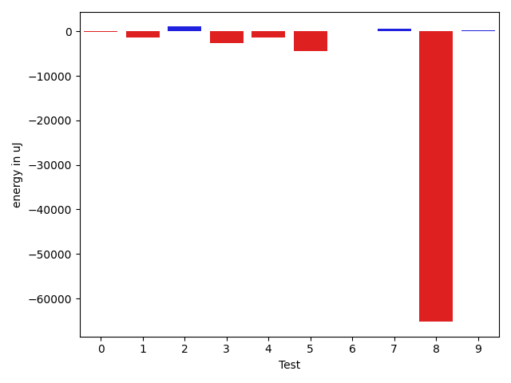
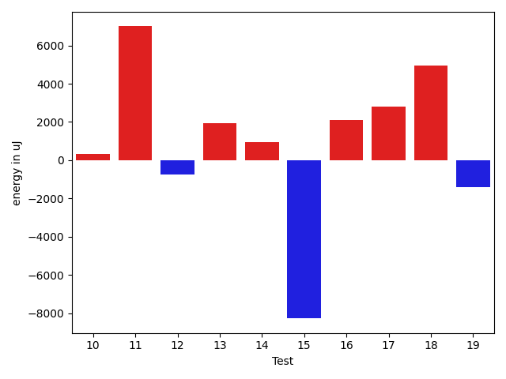
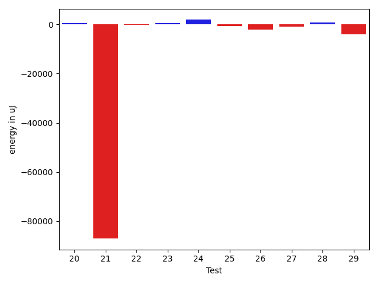
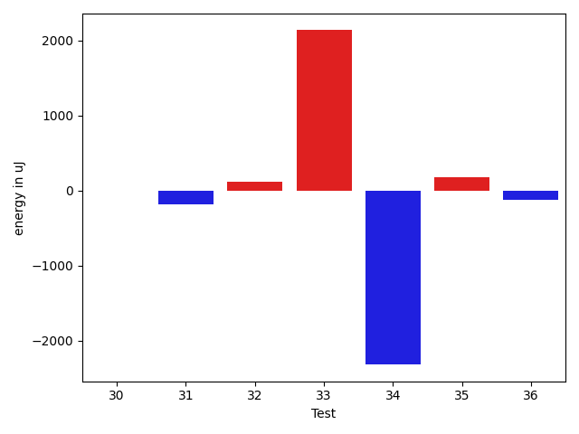

# gson b3b919

https://github.com/google/gson/commit/b3b919

## Delta Energy per test method

| ID | EnergyV1 | EnergyV2 | DeltaEnergy | σV1 | σV2 |
| --- | --- | --- | --- | --- | --- |
| 0 | 40039 | 39612 | -427 | 14920.432697276254 | 14081.114965743987 |
| 1 | 39306 | 40649 | 1343 | 19845.596933495413 | 17045.44370313535 |
| 2 | 38391 | 39429 | 1038 | 16650.256376504756 | 15271.135375370659 |
| 3 | 39063 | 37902 | -1161 | 14240.951505941257 | 12221.661555718523 |
| 4 | 37598 | 37353 | -245 | 13791.667765905835 | 13419.438045526667 |
| 5 | 41382 | 42175 | 793 | 71875.07713307314 | 30200.54098467043 |
| 6 | 37353 | 37354 | 1 | 17843.990196878425 | 12945.51038043625 |
| 7 | 36437 | 37353 | 916 | 4432.267259687955 | 4217.227141258965 |
| 8 | 79285 | 79772 | 487 | 545548.876931785 | 454204.25368069764 |
| 9 | 39795 | 39795 | 0 | 14595.198126648042 | 15399.743782004318 |
| 10 | 37841 | 38208 | 367 | 7470.214879934013 | 8402.398248775462 |
| 11 | 107117 | 115966 | 8849 | 430478.82103820884 | 455099.6493274013 |
| 12 | 38940 | 39001 | 61 | 4355.408365125614 | 4716.115865062352 |
| 13 | 41016 | 41138 | 122 | 14246.143085149753 | 15688.148639193385 |
| 14 | 36743 | 38330 | 1587 | 4883.044162651 | 4785.80718146075 |
| 15 | 37231 | 39001 | 1770 | 46088.53794419465 | 4439.33787909683 |
| 16 | 37963 | 37964 | 1 | 4993.809281860754 | 10418.720089572751 |
| 17 | 36805 | 37903 | 1098 | 3713.1049913755455 | 10640.426677103644 |
| 18 | 42175 | 41077 | -1098 | 43714.99602807228 | 52539.53539435222 |
| 19 | 38146 | 36926 | -1220 | 11278.742879161682 | 8972.5620910669 |
| 20 | 137390 | 133728 | -3662 | 430786.68123470806 | 444906.78968878515 |
| 21 | 40772 | 42176 | 1404 | 508830.46044847544 | 379278.8215478813 |
| 22 | 37659 | 37353 | -306 | 4266.680892105915 | 4918.179638504193 |
| 23 | 37049 | 37659 | 610 | 4352.322288796586 | 4703.289651942413 |
| 24 | 37415 | 38268 | 853 | 4551.652848616752 | 4889.430535714727 |
| 25 | 38940 | 36438 | -2502 | 4864.1313894213135 | 7649.453109445144 |
| 26 | 37963 | 35705 | -2258 | 4147.084986938282 | 4579.647541663806 |
| 27 | 38025 | 38696 | 671 | 4143.86516680516 | 4220.815165984697 |
| 28 | 36194 | 37476 | 1282 | 5271.856496159562 | 3608.874570647568 |
| 29 | 77942 | 78369 | 427 | 140761.2480768738 | 145883.66211504818 |
| 30 | 35217 | 35218 | 1 | 3690.1065395872074 | 4157.311693956812 |
| 31 | 43090 | 42908 | -182 | 530884.9861211737 | 542359.2769226778 |
| 32 | 38208 | 38330 | 122 | 3610.7283559420916 | 3869.965835658113 |
| 33 | 38513 | 40649 | 2136 | 5144.6020136922825 | 4139.337177147806 |
| 34 | 41320 | 39002 | -2318 | 502608.1194320001 | 557212.7493583421 |
| 35 | 37598 | 37781 | 183 | 5732.394848530968 | 6243.8489925073045 |
| 36 | 37964 | 37841 | -123 | 4812.803250291255 | 4641.780875012546 |

## Delta Duration per test method

| ID | DurationV1 | DurationsV2 | DeltaDuration |
| --- | --- | --- | --- |
| 0 | 1621062.175257732 | 1572252.1649484537 | -48810.01030927827 |
| 1 | 1470606.746031746 | 1375503.462686567 | -95103.28334517893 |
| 2 | 1447478.8969072164 | 1522991.9680851065 | 75513.07117789006 |
| 3 | 1448542.2736842106 | 1483537.4897959183 | 34995.216111707734 |
| 4 | 1486192.7171717172 | 1490261.6842105263 | 4068.967038809089 |
| 5 | 2006844.878787879 | 1901372.7575757576 | -105472.12121212133 |
| 6 | 1440006.8673469387 | 1442351.9791666667 | 2345.111819728045 |
| 7 | 1021718.7384615385 | 1010847.0746268657 | -10871.66383467277 |
| 8 | 7757192.04040404 | 5853202.595959596 | -1903989.444444444 |
| 9 | 1519955.4193548388 | 1510596.414893617 | -9359.004461221863 |
| 10 | 1176289.8823529412 | 1219434.7368421052 | 43144.85448916396 |
| 11 | 6363810.444444444 | 6427507.777777778 | 63697.333333333954 |
| 12 | 1027905.0972222222 | 1065733.3698630137 | 37828.27264079149 |
| 13 | 1511958.4395604397 | 1643421.2173913044 | 131462.77783086477 |
| 14 | 795586.36 | 618846.8965517242 | -176739.4634482758 |
| 15 | 1101532.5142857144 | 789799.9444444445 | -311732.56984126987 |
| 16 | 1076824.3823529412 | 1151835.3636363635 | 75010.98128342233 |
| 17 | 771173.6585365854 | 871286.3725490196 | 100112.71401243424 |
| 18 | 1793460.4107142857 | 1908815.9259259258 | 115355.51521164016 |
| 19 | 1228479.873015873 | 1271450.7101449275 | 42970.83712905459 |
| 20 | 7631087.626262627 | 7425826.353535353 | -205261.2727272734 |
| 21 | 6257598.858585859 | 3952099.3020833335 | -2305499.556502525 |
| 22 | 913808.2222222222 | 843453.5625 | -70354.65972222225 |
| 23 | 614428.7916666666 | 599115.2222222222 | -15313.56944444438 |
| 24 | 585697.8333333334 | 565683.1935483871 | -20014.639784946223 |
| 25 | 581903.0454545454 | 702086.64 | 120183.5945454546 |
| 26 | 587730.25 | 546091.5 | -41638.75 |
| 27 | 606144.8636363636 | 599944.8695652174 | -6199.9940711462405 |
| 28 | 581761.9523809524 | 554791.9444444445 | -26970.00793650793 |
| 29 | 3571467.051020408 | 3362400.0606060605 | -209066.9904143475 |
| 30 | 759065.1794871795 | 762876.6666666666 | 3811.4871794871287 |
| 31 | 6803584.043478261 | 6868136.197674419 | 64552.15419615805 |
| 32 | 595284.2068965518 | 531627.7619047619 | -63656.444991789875 |
| 33 | 610826.0370370371 | 603590.0 | -7236.03703703708 |
| 34 | 6169807.461538462 | 8048486.52631579 | 1878679.0647773277 |
| 35 | 1115127.3943661973 | 1156352.445945946 | 41225.051579748746 |
| 36 | 884112.7906976744 | 946602.0 | 62489.20930232562 |

## Misc.

| ID | Test Class | Test Method |
| --- | --- | --- |
| 0 | com.google.gson.functional.StreamingTypeAdaptersTest | testNullSafe |
| 1 | com.google.gson.functional.ReadersWritersTest | testReadWriteTwoObjects |
| 2 | com.google.gson.functional.ParameterizedTypesTest | testVariableTypeArrayDeserialization |
| 3 | com.google.gson.functional.ParameterizedTypesTest | testVariableTypeDeserialization |
| 4 | com.google.gson.functional.ParameterizedTypesTest | testParameterizedTypeGenericArraysDeserialization |
| 5 | com.google.gson.functional.ParameterizedTypesTest | testVariableTypeFieldsAndGenericArraysDeserialization |
| 6 | com.google.gson.functional.ParameterizedTypesTest | testParameterizedTypeWithVariableTypeDeserialization |
| 7 | com.google.gson.functional.TypeVariableTest | testBasicTypeVariables |
| 8 | com.google.gson.functional.TypeVariableTest | testAdvancedTypeVariables |
| 9 | com.google.gson.functional.TypeVariableTest | testTypeVariablesViaTypeParameter |
| 10 | com.google.gson.functional.MapAsArrayTypeAdapterTest | testMultipleEnableComplexKeyRegistrationHasNoEffect |
| 11 | com.google.gson.functional.MapAsArrayTypeAdapterTest | testSerializeComplexMapWithTypeAdapter |
| 12 | com.google.gson.functional.CollectionTest | testFieldIsArrayList |
| 13 | com.google.gson.functional.CollectionTest | testWildcardCollectionField |
| 14 | com.google.gson.GsonTypeAdapterTest | testTypeAdapterProperlyConvertsTypes |
| 15 | com.google.gson.GsonTypeAdapterTest | testTypeAdapterThrowsException |
| 16 | com.google.gson.functional.EscapingTest | testGsonAcceptsEscapedAndNonEscapedJsonDeserialization |
| 17 | com.google.gson.functional.EscapingTest | testGsonDoubleDeserialization |
| 18 | com.google.gson.functional.EscapingTest | testEscapingObjectFields |
| 19 | com.google.gson.functional.CustomTypeAdaptersTest | testRegisterHierarchyAdapterForDate |
| 20 | com.google.gson.functional.TypeHierarchyAdapterTest | testTypeHierarchy |
| 21 | com.google.gson.functional.TypeAdapterPrecedenceTest | testNonstreamingFollowedByNonstreaming |
| 22 | com.google.gson.functional.TypeAdapterPrecedenceTest | testStreamingFollowedByStreaming |
| 23 | com.google.gson.functional.TypeAdapterPrecedenceTest | testSerializeNonstreamingTypeAdapterFollowedByStreamingTypeAdapter |
| 24 | com.google.gson.functional.TypeAdapterPrecedenceTest | testStreamingFollowedByNonstreamingHierarchical |
| 25 | com.google.gson.functional.TypeAdapterPrecedenceTest | testStreamingFollowedByNonstreaming |
| 26 | com.google.gson.functional.TypeAdapterPrecedenceTest | testNonstreamingHierarchicalFollowedByNonstreaming |
| 27 | com.google.gson.functional.TypeAdapterPrecedenceTest | testStreamingHierarchicalFollowedByNonstreaming |
| 28 | com.google.gson.functional.TypeAdapterPrecedenceTest | testStreamingHierarchicalFollowedByNonstreamingHierarchical |
| 29 | com.google.gson.functional.DelegateTypeAdapterTest | testDelegateInvoked |
| 30 | com.google.gson.functional.DefaultTypeAdaptersTest | testBitSetDeserialization |
| 31 | com.google.gson.JsonParserTest | testReadWriteTwoObjects |
| 32 | com.google.gson.JsonParserTest | testParseMixedArray |
| 33 | com.google.gson.OverrideCoreTypeAdaptersTest | testOverridePrimitiveBooleanAdapter |
| 34 | com.google.gson.OverrideCoreTypeAdaptersTest | testOverrideWrapperBooleanAdapter |
| 35 | com.google.gson.functional.NamingPolicyTest | testComplexFieldNameStrategy |
| 36 | com.google.gson.functional.UncategorizedTest | testGsonInstanceReusableForSerializationAndDeserialization |

| Test | IterationV1 | IterationV2 | DeltaIteration |
| --- | --- | --- | --- |
| 0 | 97 | 97 | 0 |
| 1 | 63 | 67 | 4 |
| 2 | 97 | 94 | -3 |
| 3 | 95 | 98 | 3 |
| 4 | 99 | 95 | -4 |
| 5 | 99 | 99 | 0 |
| 6 | 98 | 96 | -2 |
| 7 | 65 | 67 | 2 |
| 8 | 99 | 99 | 0 |
| 9 | 93 | 94 | 1 |
| 10 | 85 | 76 | -9 |
| 11 | 99 | 99 | 0 |
| 12 | 72 | 73 | 1 |
| 13 | 91 | 92 | 1 |
| 14 | 25 | 29 | 4 |
| 15 | 35 | 36 | 1 |
| 16 | 68 | 66 | -2 |
| 17 | 41 | 51 | 10 |
| 18 | 56 | 54 | -2 |
| 19 | 63 | 69 | 6 |
| 20 | 99 | 99 | 0 |
| 21 | 99 | 96 | -3 |
| 22 | 45 | 48 | 3 |
| 23 | 24 | 27 | 3 |
| 24 | 18 | 31 | 13 |
| 25 | 22 | 25 | 3 |
| 26 | 24 | 28 | 4 |
| 27 | 22 | 23 | 1 |
| 28 | 21 | 18 | -3 |
| 29 | 98 | 99 | 1 |
| 30 | 39 | 39 | 0 |
| 31 | 69 | 86 | 17 |
| 32 | 29 | 21 | -8 |
| 33 | 27 | 27 | 0 |
| 34 | 39 | 38 | -1 |
| 35 | 71 | 74 | 3 |
| 36 | 43 | 44 | 1 |

| Time Label | Time (s) |
| --- | --- |
| Selection | 27.885750770568848 |
| Injection | 12.445353031158447 |
| Total | 1027.0395421981812 |

