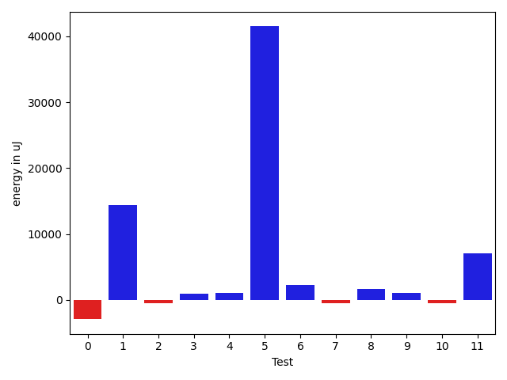
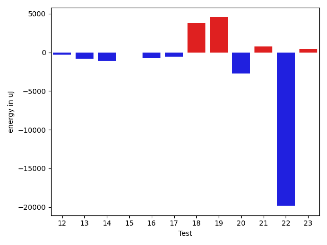
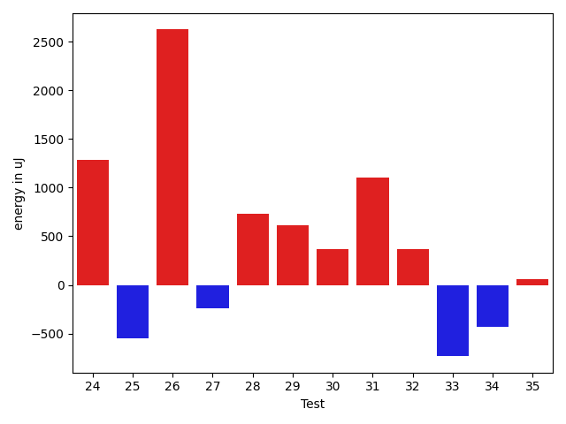
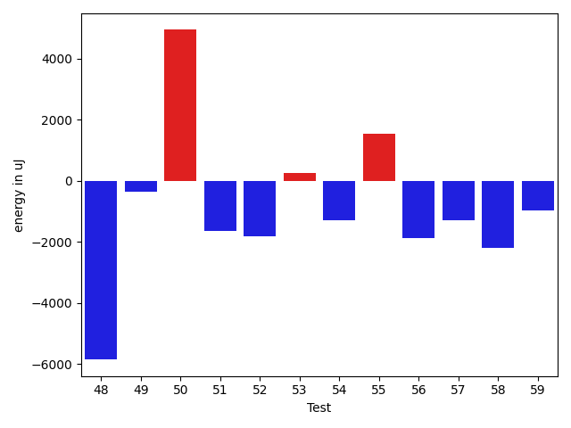
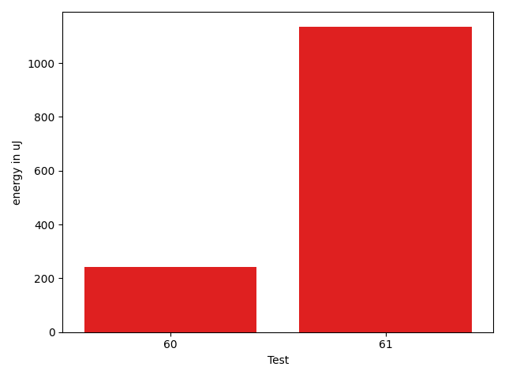

# gson 8daf3a

https://github.com/google/gson/commit/8daf3a

## Delta Energy per test method

| ID | EnergyV1 | EnergyV2 | DeltaEnergy | σV1 | σV2 |
| --- | --- | --- | --- | --- | --- |
| 0 | 43165.27777777778 | 40236.44680851064 | -2928.830969267139 | 15455.441423673969 | 11900.914755308859 |
| 1 | 62923.37373737374 | 77368.92929292929 | 14445.555555555547 | 61849.9103541785 | 91218.2013577027 |
| 2 | 37092.27906976744 | 36638.45714285714 | -453.8219269102992 | 4797.58346789531 | 3956.116893714681 |
| 3 | 37419.954545454544 | 38356.03571428572 | 936.0811688311733 | 5149.092351413832 | 5436.78204115359 |
| 4 | 37530.90909090909 | 38535.62962962963 | 1004.7205387205395 | 4452.881476783431 | 5237.520145090918 |
| 5 | 105934.41463414633 | 147419.46153846153 | 41485.0469043152 | 299004.7992800226 | 376648.11152430513 |
| 6 | 44124.46153846154 | 46383.379310344826 | 2258.917771883287 | 19260.179396941425 | 24100.449848303793 |
| 7 | 45190.555555555555 | 44652.333333333336 | -538.222222222219 | 15581.696319443465 | 15167.515928750132 |
| 8 | 36898.393939393936 | 38557.13888888889 | 1658.7449494949542 | 15391.160398766862 | 18869.89418823419 |
| 9 | 35287.64102564102 | 36370.825 | 1083.1839743589735 | 3656.3891357681077 | 4409.267682322655 |
| 10 | 35344.981132075474 | 34859.192307692305 | -485.7888243831694 | 3286.272054853634 | 3762.738773606583 |
| 11 | 105335.33333333333 | 112362.36363636363 | 7027.030303030304 | 21751.91455871637 | 24728.927693243542 |
| 12 | 310316.7474747475 | 310037.404040404 | -279.34343434346374 | 281379.9021863338 | 270496.18898612703 |
| 13 | 38831.12222222222 | 38043.84375 | -787.2784722222204 | 10157.44084767175 | 10376.987750675495 |
| 14 | 34993.509803921566 | 33882.984375 | -1110.5254289215663 | 3858.0273043715533 | 3164.8763082671744 |
| 15 | 34400.5 | 34346.0 | -54.5 | 2833.260320391236 | 2961.6233095130415 |
| 16 | 35385.041666666664 | 34635.03846153846 | -750.0032051282033 | 3919.3122853289656 | 4486.291722748047 |
| 17 | 35883.890625 | 35306.46268656717 | -577.4279384328329 | 4368.913749138578 | 4869.21848928233 |
| 18 | 103045.03846153847 | 106859.21428571429 | 3814.1758241758216 | 56609.44815235268 | 54039.76016492536 |
| 19 | 85261.59595959596 | 89824.44444444444 | 4562.84848484848 | 28063.42474111789 | 69654.83396514243 |
| 20 | 44478.301204819276 | 41728.28395061728 | -2750.0172542019936 | 19468.69695377558 | 17028.476609357087 |
| 21 | 36454.68965517241 | 37254.52380952381 | 799.8341543513961 | 4771.758001085917 | 5273.067234443054 |
| 22 | 108538.47422680413 | 88697.67010309278 | -19840.80412371135 | 155974.05691894566 | 115406.43346864605 |
| 23 | 36028.142857142855 | 36490.0 | 461.85714285714494 | 4354.166852520909 | 5238.510715701412 |
| 24 | 113597.35483870968 | 131931.78260869565 | 18334.427769985967 | 334314.2410093358 | 374533.0706641917 |
| 25 | 35895.653846153844 | 37495.857142857145 | 1600.203296703301 | 4273.355571645774 | 6043.528890952894 |
| 26 | 35729.8 | 37106.40909090909 | 1376.6090909090854 | 3993.194811175633 | 4121.2205568374 |
| 27 | 36959.291666666664 | 36997.04 | 37.74833333333663 | 3941.8364954164726 | 4556.445215121104 |
| 28 | 35618.0 | 34975.85 | -642.1500000000015 | 4023.161551512096 | 4123.6077198855855 |
| 29 | 36768.64444444444 | 36722.69047619047 | -45.953968253968924 | 4929.542670496617 | 4261.725726287389 |
| 30 | 36414.916666666664 | 35705.7 | -709.2166666666672 | 3634.3759885830314 | 4486.676098182261 |
| 31 | 37434.4 | 38037.2688172043 | 602.8688172042966 | 9721.648015369452 | 10364.496404719152 |
| 32 | 39247.64367816092 | 39185.125 | -62.51867816092272 | 11135.718786680241 | 10438.565145229166 |
| 33 | 38268.188888888886 | 39496.32967032967 | 1228.1407814407867 | 9537.383562585526 | 12078.013185400241 |
| 34 | 45155.34693877551 | 46521.81443298969 | 1366.4674942141792 | 18066.83429917702 | 19093.624062546467 |
| 35 | 37758.833333333336 | 38377.739130434784 | 618.9057971014481 | 8353.65730545514 | 11096.123828567506 |
| 36 | 36315.83076923077 | 35694.80952380953 | -621.0212454212451 | 4887.489481615218 | 3840.7224678216376 |
| 37 | 133868.22222222222 | 100292.18181818182 | -33576.040404040396 | 332431.34887871856 | 217364.94586203017 |
| 38 | 41587.53488372093 | 38721.875 | -2865.6598837209312 | 13596.650354165697 | 9665.187336298177 |
| 39 | 37814.68571428571 | 37011.58666666667 | -803.0990476190418 | 8378.44467247925 | 7472.107030092353 |
| 40 | 201767.57575757575 | 191585.11111111112 | -10182.464646464621 | 423224.63458720903 | 378074.58576023806 |
| 41 | 37617.5625 | 38504.54385964912 | 886.9813596491222 | 3880.0057461096303 | 4819.808677392996 |
| 42 | 45930.88636363636 | 43703.086956521736 | -2227.799407114624 | 16241.206858308266 | 14337.941981097152 |
| 43 | 39168.066666666666 | 38388.333333333336 | -779.7333333333299 | 4527.316960653652 | 5431.7554073757365 |
| 44 | 100543.30769230769 | 56209.354838709674 | -44333.95285359801 | 95719.51042168397 | 56447.09477340671 |
| 45 | 39060.11111111111 | 37652.107142857145 | -1408.0039682539646 | 7758.124044597253 | 7483.305487833213 |
| 46 | 38679.31034482759 | 50229.53571428572 | 11550.22536945813 | 7594.018177230016 | 54625.868200019184 |
| 47 | 38315.34328358209 | 38361.41428571429 | 46.071002132193826 | 4956.344336369684 | 5239.432432437852 |
| 48 | 222324.0909090909 | 180304.1616161616 | -42019.9292929293 | 402614.729925335 | 277622.1782872247 |
| 49 | 37784.21153846154 | 37025.392857142855 | -758.818681318684 | 4554.801635200013 | 4889.182785491762 |
| 50 | 197055.48484848486 | 208584.9797979798 | 11529.494949494925 | 90604.97955894054 | 95441.56437698864 |
| 51 | 153144.02631578947 | 159435.54929577466 | 6291.522979985195 | 432381.1129841898 | 414513.0692922804 |
| 52 | 38210.9 | 36302.94736842105 | -1907.952631578948 | 3969.0879292351283 | 3961.6624165232797 |
| 53 | 39694.732558139534 | 38412.52272727273 | -1282.2098308668064 | 9254.135103914257 | 8927.280898990659 |
| 54 | 37500.64705882353 | 37172.34426229508 | -328.3027965284491 | 5407.338452523424 | 6644.161911365067 |
| 55 | 59481.125 | 69040.13793103448 | 9559.012931034478 | 55449.33540653162 | 57450.15081323751 |
| 56 | 37901.15 | 36277.75555555556 | -1623.3944444444423 | 4581.837827498918 | 4512.710898269246 |
| 57 | 106570.26315789473 | 90674.12195121951 | -15896.141206675224 | 134928.15455908462 | 121975.53493825281 |
| 58 | 38780.35135135135 | 36390.444444444445 | -2389.9069069069083 | 4591.591322902358 | 3969.2987936889117 |
| 59 | 41409.333333333336 | 39090.46 | -2318.8733333333366 | 9836.803278099349 | 9442.118245838696 |
| 60 | 37312.0 | 37555.5625 | 243.5625 | 3722.6950695222354 | 3990.3134740385685 |
| 61 | 37998.71428571428 | 39132.846153846156 | 1134.1318681318735 | 4976.799580174441 | 4025.2099390285766 |

## Delta Duration per test method

| ID | DurationV1 | DurationsV2 | DeltaDuration |
| --- | --- | --- | --- |
| 0 | 1445983.8 | 1386031.8510638298 | -59951.9489361702 |
| 1 | 2047050.878787879 | 2578517.1818181816 | 531466.3030303027 |
| 2 | 825818.9069767442 | 860988.9142857143 | 35170.00730897009 |
| 3 | 592851.9090909091 | 607406.0 | 14554.09090909094 |
| 4 | 560695.7727272727 | 583856.4074074074 | 23160.63468013471 |
| 5 | 2505100.0975609757 | 3782154.4615384615 | 1277054.3639774858 |
| 6 | 1222937.5692307693 | 1335883.2068965517 | 112945.63766578236 |
| 7 | 1268881.138888889 | 1362120.32 | 93239.18111111107 |
| 8 | 836936.6666666666 | 903656.8611111111 | 66720.1944444445 |
| 9 | 695917.3846153846 | 754538.95 | 58621.56538461533 |
| 10 | 811586.679245283 | 821169.5576923077 | 9582.878447024734 |
| 11 | 3537919.0808080807 | 3632833.393939394 | 94914.3131313133 |
| 12 | 9791173.191919193 | 9798920.626262626 | 7747.434343433008 |
| 13 | 1339577.2222222222 | 1362820.7291666667 | 23243.506944444496 |
| 14 | 948490.8039215687 | 955096.75 | 6605.946078431327 |
| 15 | 806668.3793103448 | 836377.2156862745 | 29708.836375929648 |
| 16 | 543966.5 | 580046.9230769231 | 36080.42307692312 |
| 17 | 1015774.515625 | 987098.5522388059 | -28675.963386194082 |
| 18 | 3017519.8076923075 | 3195048.2285714285 | 177528.42087912094 |
| 19 | 2666207.282828283 | 2824813.4343434344 | 158606.15151515137 |
| 20 | 1362233.9277108433 | 1362409.5308641975 | 175.60315335425548 |
| 21 | 690838.8275862068 | 577970.5714285715 | -112868.25615763536 |
| 22 | 3483087.9484536084 | 2911167.793814433 | -571920.1546391756 |
| 23 | 527506.9047619047 | 529602.3333333334 | 2095.428571428638 |
| 24 | 3315066.5268817204 | 3787534.6195652173 | 472468.0926834969 |
| 25 | 481757.5 | 554573.5714285715 | 72816.07142857148 |
| 26 | 540422.04 | 557168.1818181818 | 16746.141818181728 |
| 27 | 535536.2083333334 | 534488.48 | -1047.7283333333908 |
| 28 | 469153.52173913043 | 504423.75 | 35270.22826086957 |
| 29 | 791634.7111111111 | 829415.880952381 | 37781.169841269846 |
| 30 | 487995.0416666667 | 509795.0 | 21799.958333333314 |
| 31 | 1310222.894736842 | 1346578.5376344086 | 36355.64289756655 |
| 32 | 1309837.8045977012 | 1342404.2159090908 | 32566.411311389646 |
| 33 | 1310324.9555555556 | 1359321.2857142857 | 48996.33015873004 |
| 34 | 1577629.142857143 | 1612449.206185567 | 34820.063328424 |
| 35 | 1272456.630952381 | 1295840.6956521738 | 23384.06469979277 |
| 36 | 941829.1230769231 | 909767.3015873015 | -32061.821489621536 |
| 37 | 4137593.404040404 | 3036196.0606060605 | -1101397.3434343436 |
| 38 | 1385865.7906976745 | 1341838.3295454546 | -44027.46115221991 |
| 39 | 1097894.8142857142 | 1092637.0133333334 | -5257.800952380756 |
| 40 | 5749864.888888889 | 5723658.292929293 | -26206.595959596336 |
| 41 | 1012139.8125 | 1018216.0701754387 | 6076.257675438654 |
| 42 | 1497829.9659090908 | 1492905.7608695652 | -4924.205039525637 |
| 43 | 598354.9333333333 | 623139.2083333334 | 24784.275000000023 |
| 44 | 3048478.346153846 | 1390903.0 | -1657575.346153846 |
| 45 | 765625.8888888889 | 677748.8928571428 | -87876.99603174604 |
| 46 | 844831.724137931 | 1162348.4642857143 | 317516.7401477833 |
| 47 | 1082469.6865671643 | 1047470.3571428572 | -34999.3294243071 |
| 48 | 6362532.656565657 | 5231451.707070707 | -1131080.9494949495 |
| 49 | 836390.9615384615 | 854458.25 | 18067.288461538497 |
| 50 | 5827785.464646464 | 6343836.080808081 | 516050.6161616165 |
| 51 | 4352754.078947368 | 4666473.633802817 | 313719.5548554491 |
| 52 | 556980.05 | 552281.8421052631 | -4698.207894736901 |
| 53 | 1298767.558139535 | 1285598.4431818181 | -13169.114957716782 |
| 54 | 944669.9411764706 | 1012305.0163934426 | 67635.07521697204 |
| 55 | 1470234.1666666667 | 1848010.7241379311 | 377776.5574712644 |
| 56 | 776040.325 | 803192.911111111 | 27152.5861111111 |
| 57 | 2872498.6842105263 | 2607536.463414634 | -264962.2207958922 |
| 58 | 917762.8108108108 | 1000380.7333333333 | 82617.92252252251 |
| 59 | 1201217.862745098 | 1126216.28 | -75001.58274509804 |
| 60 | 670377.9032258064 | 610776.75 | -59601.153225806425 |
| 61 | 550490.0 | 504610.6923076923 | -45879.30769230769 |

## Misc.

| ID | Test Class | Test Method |
| --- | --- | --- |
| 0 | com.google.gson.functional.StreamingTypeAdaptersTest | testNullSafe |
| 1 | com.google.gson.functional.CustomDeserializerTest | testDefaultConstructorNotCalledOnObject |
| 2 | com.google.gson.functional.CustomDeserializerTest | testDefaultConstructorNotCalledOnField |
| 3 | com.google.gson.OverrideCoreTypeAdaptersTest | testOverrideStringAdapter |
| 4 | com.google.gson.OverrideCoreTypeAdaptersTest | testOverridePrimitiveBooleanAdapter |
| 5 | com.google.gson.OverrideCoreTypeAdaptersTest | testOverrideWrapperBooleanAdapter |
| 6 | com.google.gson.functional.ReadersWritersTest | testReadWriteTwoObjects |
| 7 | com.google.gson.functional.ReadersWritersTest | testReadWriteTwoStrings |
| 8 | com.google.gson.functional.DefaultTypeAdaptersTest | testBitSetDeserialization |
| 9 | com.google.gson.functional.DefaultTypeAdaptersTest | testOverrideBigIntegerTypeAdapter |
| 10 | com.google.gson.functional.DefaultTypeAdaptersTest | testTimestampSerialization |
| 11 | com.google.gson.functional.DefaultTypeAdaptersTest | testDefaultDateDeserializationUsingBuilder |
| 12 | com.google.gson.functional.DefaultTypeAdaptersTest | testNullSerialization |
| 13 | com.google.gson.functional.DefaultTypeAdaptersTest | testDateSerializationInCollection |
| 14 | com.google.gson.functional.DefaultTypeAdaptersTest | testDateDeserializationWithPattern |
| 15 | com.google.gson.functional.DefaultTypeAdaptersTest | testSqlDateSerialization |
| 16 | com.google.gson.functional.DefaultTypeAdaptersTest | testOverrideBigDecimalTypeAdapter |
| 17 | com.google.gson.functional.EnumTest | testEnumSubclassAsParameterizedType |
| 18 | com.google.gson.functional.EnumTest | testEnumCaseMapping |
| 19 | com.google.gson.functional.EnumTest | testEnumSubclass |
| 20 | com.google.gson.functional.EnumTest | testEnumSubclassWithRegisteredTypeAdapter |
| 21 | com.google.gson.functional.DelegateTypeAdapterTest | testDelegateInvokedOnStrings |
| 22 | com.google.gson.functional.DelegateTypeAdapterTest | testDelegateInvoked |
| 23 | com.google.gson.functional.TypeAdapterPrecedenceTest | testStreamingHierarchicalFollowedByNonstreaming |
| 24 | com.google.gson.functional.TypeAdapterPrecedenceTest | testNonstreamingFollowedByNonstreaming |
| 25 | com.google.gson.functional.TypeAdapterPrecedenceTest | testStreamingFollowedByNonstreamingHierarchical |
| 26 | com.google.gson.functional.TypeAdapterPrecedenceTest | testStreamingFollowedByNonstreaming |
| 27 | com.google.gson.functional.TypeAdapterPrecedenceTest | testSerializeNonstreamingTypeAdapterFollowedByStreamingTypeAdapter |
| 28 | com.google.gson.functional.TypeAdapterPrecedenceTest | testStreamingHierarchicalFollowedByNonstreamingHierarchical |
| 29 | com.google.gson.functional.TypeAdapterPrecedenceTest | testStreamingFollowedByStreaming |
| 30 | com.google.gson.functional.TypeAdapterPrecedenceTest | testNonstreamingHierarchicalFollowedByNonstreaming |
| 31 | com.google.gson.functional.ParameterizedTypesTest | testVariableTypeArrayDeserialization |
| 32 | com.google.gson.functional.ParameterizedTypesTest | testVariableTypeDeserialization |
| 33 | com.google.gson.functional.ParameterizedTypesTest | testParameterizedTypeGenericArraysDeserialization |
| 34 | com.google.gson.functional.ParameterizedTypesTest | testVariableTypeFieldsAndGenericArraysDeserialization |
| 35 | com.google.gson.functional.ParameterizedTypesTest | testParameterizedTypeWithVariableTypeDeserialization |
| 36 | com.google.gson.functional.TypeVariableTest | testBasicTypeVariables |
| 37 | com.google.gson.functional.TypeVariableTest | testAdvancedTypeVariables |
| 38 | com.google.gson.functional.TypeVariableTest | testTypeVariablesViaTypeParameter |
| 39 | com.google.gson.functional.MapAsArrayTypeAdapterTest | testMultipleEnableComplexKeyRegistrationHasNoEffect |
| 40 | com.google.gson.functional.MapAsArrayTypeAdapterTest | testSerializeComplexMapWithTypeAdapter |
| 41 | com.google.gson.functional.CollectionTest | testFieldIsArrayList |
| 42 | com.google.gson.functional.CollectionTest | testWildcardCollectionField |
| 43 | com.google.gson.functional.PrimitiveTest | testQuotedStringSerializationAndDeserialization |
| 44 | com.google.gson.GsonTypeAdapterTest | testTypeAdapterDoesNotAffectNonAdaptedTypes |
| 45 | com.google.gson.GsonTypeAdapterTest | testTypeAdapterProperlyConvertsTypes |
| 46 | com.google.gson.GsonTypeAdapterTest | testTypeAdapterThrowsException |
| 47 | com.google.gson.functional.NamingPolicyTest | testComplexFieldNameStrategy |
| 48 | com.google.gson.functional.TypeHierarchyAdapterTest | testTypeHierarchy |
| 49 | com.google.gson.functional.TypeHierarchyAdapterTest | testRegisterSuperTypeFirst |
| 50 | com.google.gson.DefaultInetAddressTypeAdapterTest | testInetAddressSerializationAndDeserialization |
| 51 | com.google.gson.JsonParserTest | testReadWriteTwoObjects |
| 52 | com.google.gson.JsonParserTest | testParseMixedArray |
| 53 | com.google.gson.functional.ObjectTest | testSingletonLists |
| 54 | com.google.gson.functional.EscapingTest | testGsonAcceptsEscapedAndNonEscapedJsonDeserialization |
| 55 | com.google.gson.functional.EscapingTest | testEscapingObjectFields |
| 56 | com.google.gson.functional.EscapingTest | testGsonDoubleDeserialization |
| 57 | com.google.gson.functional.EscapingTest | testEscapingQuotesInStringArray |
| 58 | com.google.gson.functional.UncategorizedTest | testGsonInstanceReusableForSerializationAndDeserialization |
| 59 | com.google.gson.functional.CustomTypeAdaptersTest | testRegisterHierarchyAdapterForDate |
| 60 | com.google.gson.functional.StringTest | testSingleQuoteInStringSerialization |
| 61 | com.google.gson.functional.StringTest | testEscapingQuotesInStringSerialization |

| Test | IterationV1 | IterationV2 | DeltaIteration |
| --- | --- | --- | --- |
| 0 | 90 | 94 | 4 |
| 1 | 99 | 99 | 0 |
| 2 | 43 | 35 | -8 |
| 3 | 22 | 28 | 6 |
| 4 | 22 | 27 | 5 |
| 5 | 41 | 52 | 11 |
| 6 | 65 | 58 | -7 |
| 7 | 72 | 75 | 3 |
| 8 | 33 | 36 | 3 |
| 9 | 39 | 40 | 1 |
| 10 | 53 | 52 | -1 |
| 11 | 99 | 99 | 0 |
| 12 | 99 | 99 | 0 |
| 13 | 90 | 96 | 6 |
| 14 | 51 | 64 | 13 |
| 15 | 58 | 51 | -7 |
| 16 | 24 | 26 | 2 |
| 17 | 64 | 67 | 3 |
| 18 | 78 | 70 | -8 |
| 19 | 99 | 99 | 0 |
| 20 | 83 | 81 | -2 |
| 21 | 29 | 21 | -8 |
| 22 | 97 | 97 | 0 |
| 23 | 21 | 27 | 6 |
| 24 | 93 | 92 | -1 |
| 25 | 26 | 21 | -5 |
| 26 | 25 | 22 | -3 |
| 27 | 24 | 25 | 1 |
| 28 | 23 | 20 | -3 |
| 29 | 45 | 42 | -3 |
| 30 | 24 | 20 | -4 |
| 31 | 95 | 93 | -2 |
| 32 | 87 | 88 | 1 |
| 33 | 90 | 91 | 1 |
| 34 | 98 | 97 | -1 |
| 35 | 84 | 92 | 8 |
| 36 | 65 | 63 | -2 |
| 37 | 99 | 99 | 0 |
| 38 | 86 | 88 | 2 |
| 39 | 70 | 75 | 5 |
| 40 | 99 | 99 | 0 |
| 41 | 64 | 57 | -7 |
| 42 | 88 | 92 | 4 |
| 43 | 15 | 24 | 9 |
| 44 | 26 | 31 | 5 |
| 45 | 27 | 28 | 1 |
| 46 | 29 | 28 | -1 |
| 47 | 67 | 70 | 3 |
| 48 | 99 | 99 | 0 |
| 49 | 52 | 56 | 4 |
| 50 | 99 | 99 | 0 |
| 51 | 76 | 71 | -5 |
| 52 | 20 | 19 | -1 |
| 53 | 86 | 88 | 2 |
| 54 | 68 | 61 | -7 |
| 55 | 48 | 58 | 10 |
| 56 | 40 | 45 | 5 |
| 57 | 19 | 41 | 22 |
| 58 | 37 | 45 | 8 |
| 59 | 51 | 50 | -1 |
| 60 | 31 | 16 | -15 |
| 61 | 14 | 13 | -1 |

| Time Label | Time (s) |
| --- | --- |
| Selection | 27.309805631637573 |
| Injection | 14.167581796646118 |
| Total | 1046.4725971221924 |

