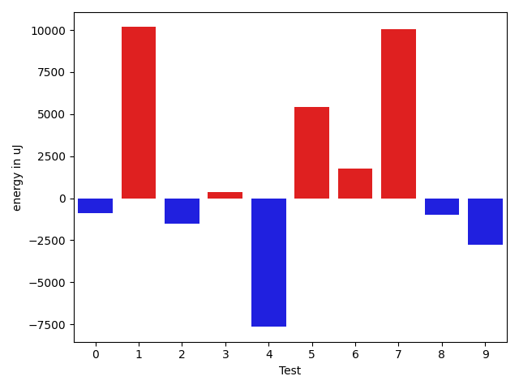
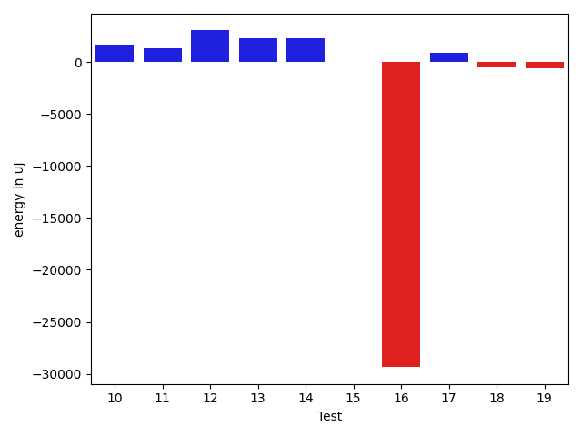
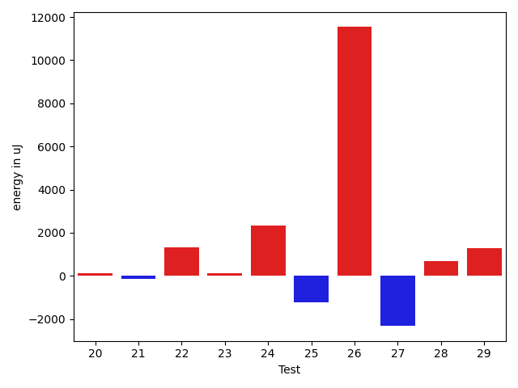
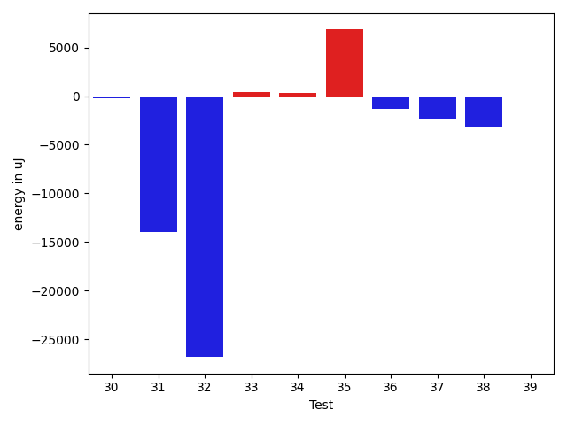
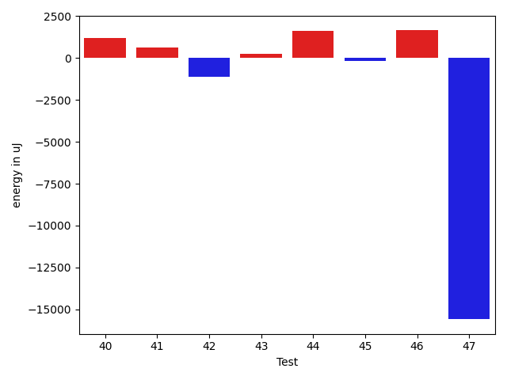

# gson 980796

https://github.com/google/gson/commit/980796

## Delta Energy per test method

| ID | EnergyV1 | EnergyV2 | DeltaEnergy | σV1 | σV2 |
| --- | --- | --- | --- | --- | --- |
| 0 | 37293 | 35400 | -1893 | 12110.76954236654 | 13320.168762786672 |
| 1 | 46020 | 40955 | -5065 | 39055.098800733664 | 83908.92804320567 |
| 2 | 38513 | 36133 | -2380 | 4379.239654104357 | 4761.436064886307 |
| 3 | 36254 | 36010 | -244 | 7992.746572444925 | 8605.831135976146 |
| 4 | 121093 | 123901 | 2808 | 57717.893359022164 | 60569.15042637556 |
| 5 | 75256 | 87585 | 12329 | 28810.674245355538 | 33906.84522577373 |
| 6 | 37842 | 38697 | 855 | 25431.874049857877 | 35842.40871245911 |
| 7 | 42603 | 40467 | -2136 | 387382.34932448843 | 396224.04103694425 |
| 8 | 38940 | 38635 | -305 | 4444.3565137631085 | 5101.989057234056 |
| 9 | 36011 | 35645 | -366 | 17955.138356278978 | 15707.041739418188 |
| 10 | 36010 | 35949 | -61 | 18913.923792706122 | 17362.989730037705 |
| 11 | 36010 | 36438 | 428 | 10368.789085944352 | 12707.823426919374 |
| 12 | 36866 | 37415 | 549 | 18712.03745882373 | 19901.90725333992 |
| 13 | 34729 | 35157 | 428 | 9146.216312823639 | 12215.38372827834 |
| 14 | 36560 | 35522 | -1038 | 6874.98547266647 | 10738.73479616122 |
| 15 | 36438 | 36316 | -122 | 4179.904139617185 | 4600.981678746751 |
| 16 | 131469 | 129761 | -1708 | 400669.8786776754 | 347653.2379214986 |
| 17 | 34057 | 34424 | 367 | 3953.84892802397 | 4641.032957693696 |
| 18 | 35401 | 34973 | -428 | 3744.5214643836557 | 2894.4249087507337 |
| 19 | 106751 | 106018 | -733 | 24813.36134285125 | 27089.131275474138 |
| 20 | 34179 | 34301 | 122 | 4264.439348521399 | 3296.7123785425892 |
| 21 | 35889 | 35766 | -123 | 11344.399471759354 | 14113.646590347738 |
| 22 | 34546 | 35889 | 1343 | 3637.857762685887 | 4002.639497466191 |
| 23 | 34912 | 35034 | 122 | 3527.252091420852 | 3445.459629966429 |
| 24 | 33935 | 36255 | 2320 | 4894.702581881698 | 3790.4285044701737 |
| 25 | 37354 | 36133 | -1221 | 7762.8670363847605 | 6859.500181924745 |
| 26 | 100098 | 111633 | 11535 | 396596.34361428785 | 490986.444945841 |
| 27 | 40893 | 38574 | -2319 | 211917.32418863516 | 174677.1081043232 |
| 28 | 37536 | 38208 | 672 | 13014.621467565255 | 171661.25415022243 |
| 29 | 40222 | 41504 | 1282 | 400260.3236014573 | 318924.9207585971 |
| 30 | 37049 | 36193 | -856 | 4996.718519993133 | 7034.091607198583 |
| 31 | 42663 | 39185 | -3478 | 64887.309042505374 | 58081.87567252705 |
| 32 | 39367 | 37841 | -1526 | 135084.11389118055 | 116549.31325842913 |
| 33 | 35766 | 37415 | 1649 | 11207.200081066412 | 8285.805921434363 |
| 34 | 36316 | 36621 | 305 | 4654.462660396449 | 3830.96042327585 |
| 35 | 182495 | 193664 | 11169 | 78485.45387643094 | 69236.93745690507 |
| 36 | 40222 | 39001 | -1221 | 16398.761157745488 | 15763.908996536078 |
| 37 | 39490 | 37659 | -1831 | 24891.945572007087 | 26198.583916623982 |
| 38 | 39185 | 37598 | -1587 | 14498.222188659487 | 13707.00102249881 |
| 39 | 37841 | 38757 | 916 | 5245.407494603139 | 4358.271360087995 |
| 40 | 42358 | 62988 | 20630 | 108275.93845670295 | 101481.03596106438 |
| 41 | 36133 | 36072 | -61 | 5188.41257390322 | 4399.879319847125 |
| 42 | 38086 | 37109 | -977 | 4536.048059710126 | 5134.3998610931885 |
| 43 | 38208 | 39367 | 1159 | 5342.83082502638 | 5178.46042947706 |
| 44 | 37842 | 38696 | 854 | 3506.740999832936 | 5057.339196405556 |
| 45 | 39307 | 37842 | -1465 | 8268.37130636484 | 6598.761103449011 |
| 46 | 36499 | 37659 | 1160 | 4427.0789922753975 | 4127.445159155738 |
| 47 | 37719 | 43212 | 5493 | 64835.53112627599 | 34803.6260754537 |

## Delta Duration per test method

| ID | DurationV1 | DurationsV2 | DeltaDuration |
| --- | --- | --- | --- |
| 0 | 1419250.247311828 | 1429028.7311827957 | 9778.483870967757 |
| 1 | 1862875.2323232323 | 2364943.6464646463 | 502068.414141414 |
| 2 | 755598.3488372093 | 824405.06 | 68806.71116279077 |
| 3 | 1071472.0338983051 | 1120075.5084745763 | 48603.47457627114 |
| 4 | 3250729.8554216865 | 3044256.7710843375 | -206473.08433734905 |
| 5 | 2608013.797979798 | 2806226.3232323234 | 198212.52525252523 |
| 6 | 1567605.024390244 | 1662430.7717391304 | 94825.74734888645 |
| 7 | 4583321.706666667 | 5209848.47368421 | 626526.7670175433 |
| 8 | 610070.4642857143 | 581439.7142857143 | -28630.75 |
| 9 | 1361281.1875 | 1419360.3404255318 | 58079.152925531846 |
| 10 | 1372332.8260869565 | 1419692.7216494845 | 47359.895562527934 |
| 11 | 1314094.3010752688 | 1415299.3608247424 | 101205.05974947358 |
| 12 | 1586751.878787879 | 1704431.175257732 | 117679.29646985303 |
| 13 | 1284164.5604395603 | 1387012.797752809 | 102848.23731324868 |
| 14 | 1343102.1125 | 1328958.0352941176 | -14144.077205882408 |
| 15 | 859684.6333333333 | 894586.8367346938 | 34902.203401360544 |
| 16 | 6871294.767676768 | 6078637.01010101 | -792657.7575757578 |
| 17 | 816656.7058823529 | 867765.8095238095 | 51109.103641456575 |
| 18 | 829096.3157894737 | 859084.6545454545 | 29988.338755980833 |
| 19 | 3671499.97979798 | 3628249.4646464647 | -43250.51515151514 |
| 20 | 959167.298245614 | 952930.578125 | -6236.720120614045 |
| 21 | 1399193.4845360825 | 1374345.8602150537 | -24847.624321028823 |
| 22 | 710557.2162162162 | 702851.9189189189 | -7705.297297297278 |
| 23 | 852835.2127659575 | 820750.9814814815 | -32084.231284476 |
| 24 | 620203.1904761905 | 580286.35 | -39916.840476190555 |
| 25 | 1142326.0384615385 | 1184722.9350649351 | 42396.89660339663 |
| 26 | 5703039.131313131 | 7805805.919191919 | 2102766.787878788 |
| 27 | 2276532.395604396 | 2318603.404494382 | 42071.0088899862 |
| 28 | 1352964.6875 | 1893799.147368421 | 540834.4598684211 |
| 29 | 4490849.311111111 | 3145612.14893617 | -1345237.162174941 |
| 30 | 1099156.1351351351 | 1123543.6615384615 | 24387.52640332631 |
| 31 | 2212094.18 | 1772042.3541666667 | -440051.8258333334 |
| 32 | 3258874.222222222 | 2135957.870967742 | -1122916.35125448 |
| 33 | 1060766.6862745099 | 1063347.4393939395 | 2580.7531194295734 |
| 34 | 762480.4545454546 | 831244.7352941176 | 68764.280748663 |
| 35 | 5890357.303030303 | 6174824.696969697 | 284467.3939393945 |
| 36 | 1444890.8313253012 | 1365869.831168831 | -79021.00015647011 |
| 37 | 1359003.3076923077 | 1288701.2666666666 | -70302.04102564114 |
| 38 | 1476558.4606741574 | 1471166.3793103448 | -5392.081363812555 |
| 39 | 1049694.7142857143 | 1011209.3428571429 | -38485.37142857141 |
| 40 | 2838651.212121212 | 2749169.525252525 | -89481.6868686867 |
| 41 | 680325.5185185185 | 719015.1351351351 | 38689.61661661661 |
| 42 | 526253.5 | 519785.75 | -6467.75 |
| 43 | 636053.2307692308 | 589702.0 | -46351.23076923075 |
| 44 | 593965.7142857143 | 594747.2 | 781.4857142856345 |
| 45 | 1061203.0 | 922500.4716981133 | -138702.52830188675 |
| 46 | 772194.9230769231 | 636695.8518518518 | -135499.07122507133 |
| 47 | 1715763.7142857143 | 925090.48 | -790673.2342857143 |

## Misc.

| ID | Test Class | Test Method |
| --- | --- | --- |
| 0 | com.google.gson.functional.StreamingTypeAdaptersTest | testNullSafe |
| 1 | com.google.gson.functional.CustomDeserializerTest | testDefaultConstructorNotCalledOnObject |
| 2 | com.google.gson.functional.CustomDeserializerTest | testDefaultConstructorNotCalledOnField |
| 3 | com.google.gson.functional.EnumTest | testEnumSubclassAsParameterizedType |
| 4 | com.google.gson.functional.EnumTest | testEnumCaseMapping |
| 5 | com.google.gson.functional.EnumTest | testEnumSubclass |
| 6 | com.google.gson.functional.EnumTest | testEnumSubclassWithRegisteredTypeAdapter |
| 7 | com.google.gson.JsonParserTest | testReadWriteTwoObjects |
| 8 | com.google.gson.JsonParserTest | testParseMixedArray |
| 9 | com.google.gson.functional.ParameterizedTypesTest | testVariableTypeArrayDeserialization |
| 10 | com.google.gson.functional.ParameterizedTypesTest | testVariableTypeDeserialization |
| 11 | com.google.gson.functional.ParameterizedTypesTest | testParameterizedTypeGenericArraysDeserialization |
| 12 | com.google.gson.functional.ParameterizedTypesTest | testVariableTypeFieldsAndGenericArraysDeserialization |
| 13 | com.google.gson.functional.ParameterizedTypesTest | testParameterizedTypeWithVariableTypeDeserialization |
| 14 | com.google.gson.functional.ObjectTest | testSingletonLists |
| 15 | com.google.gson.functional.TypeHierarchyAdapterTest | testRegisterSuperTypeFirst |
| 16 | com.google.gson.functional.TypeHierarchyAdapterTest | testTypeHierarchy |
| 17 | com.google.gson.functional.DefaultTypeAdaptersTest | testOverrideBigIntegerTypeAdapter |
| 18 | com.google.gson.functional.DefaultTypeAdaptersTest | testTimestampSerialization |
| 19 | com.google.gson.functional.DefaultTypeAdaptersTest | testDefaultDateDeserializationUsingBuilder |
| 20 | com.google.gson.functional.DefaultTypeAdaptersTest | testDateDeserializationWithPattern |
| 21 | com.google.gson.functional.DefaultTypeAdaptersTest | testDateSerializationInCollection |
| 22 | com.google.gson.functional.DefaultTypeAdaptersTest | testBitSetDeserialization |
| 23 | com.google.gson.functional.DefaultTypeAdaptersTest | testSqlDateSerialization |
| 24 | com.google.gson.functional.DefaultTypeAdaptersTest | testOverrideBigDecimalTypeAdapter |
| 25 | com.google.gson.functional.MapAsArrayTypeAdapterTest | testMultipleEnableComplexKeyRegistrationHasNoEffect |
| 26 | com.google.gson.functional.MapAsArrayTypeAdapterTest | testSerializeComplexMapWithTypeAdapter |
| 27 | com.google.gson.functional.TypeVariableTest | testAdvancedTypeVariables |
| 28 | com.google.gson.functional.TypeVariableTest | testTypeVariablesViaTypeParameter |
| 29 | com.google.gson.functional.TypeVariableTest | testBasicTypeVariables |
| 30 | com.google.gson.functional.NamingPolicyTest | testComplexFieldNameStrategy |
| 31 | com.google.gson.functional.EscapingTest | testEscapingObjectFields |
| 32 | com.google.gson.functional.EscapingTest | testEscapingQuotesInStringArray |
| 33 | com.google.gson.functional.EscapingTest | testGsonAcceptsEscapedAndNonEscapedJsonDeserialization |
| 34 | com.google.gson.functional.EscapingTest | testGsonDoubleDeserialization |
| 35 | com.google.gson.DefaultInetAddressTypeAdapterTest | testInetAddressSerializationAndDeserialization |
| 36 | com.google.gson.functional.ReadersWritersTest | testReadWriteTwoStrings |
| 37 | com.google.gson.functional.ReadersWritersTest | testReadWriteTwoObjects |
| 38 | com.google.gson.functional.CollectionTest | testWildcardCollectionField |
| 39 | com.google.gson.functional.CollectionTest | testFieldIsArrayList |
| 40 | com.google.gson.functional.DelegateTypeAdapterTest | testDelegateInvoked |
| 41 | com.google.gson.functional.DelegateTypeAdapterTest | testDelegateInvokedOnStrings |
| 42 | com.google.gson.functional.StringTest | testEscapingQuotesInStringSerialization |
| 43 | com.google.gson.functional.StringTest | testSingleQuoteInStringSerialization |
| 44 | com.google.gson.functional.PrimitiveTest | testQuotedStringSerializationAndDeserialization |
| 45 | com.google.gson.functional.UncategorizedTest | testGsonInstanceReusableForSerializationAndDeserialization |
| 46 | com.google.gson.OverrideCoreTypeAdaptersTest | testOverrideStringAdapter |
| 47 | com.google.gson.GsonTypeAdapterTest | testTypeAdapterDoesNotAffectNonAdaptedTypes |

| Test | IterationV1 | IterationV2 | DeltaIteration |
| --- | --- | --- | --- |
| 0 | 93 | 93 | 0 |
| 1 | 99 | 99 | 0 |
| 2 | 43 | 50 | 7 |
| 3 | 59 | 59 | 0 |
| 4 | 83 | 83 | 0 |
| 5 | 99 | 99 | 0 |
| 6 | 82 | 92 | 10 |
| 7 | 75 | 76 | 1 |
| 8 | 28 | 21 | -7 |
| 9 | 96 | 94 | -2 |
| 10 | 92 | 97 | 5 |
| 11 | 93 | 97 | 4 |
| 12 | 99 | 97 | -2 |
| 13 | 91 | 89 | -2 |
| 14 | 80 | 85 | 5 |
| 15 | 60 | 49 | -11 |
| 16 | 99 | 99 | 0 |
| 17 | 51 | 42 | -9 |
| 18 | 57 | 55 | -2 |
| 19 | 99 | 99 | 0 |
| 20 | 57 | 64 | 7 |
| 21 | 97 | 93 | -4 |
| 22 | 37 | 37 | 0 |
| 23 | 47 | 54 | 7 |
| 24 | 21 | 20 | -1 |
| 25 | 78 | 77 | -1 |
| 26 | 99 | 99 | 0 |
| 27 | 91 | 89 | -2 |
| 28 | 96 | 95 | -1 |
| 29 | 90 | 94 | 4 |
| 30 | 74 | 65 | -9 |
| 31 | 50 | 48 | -2 |
| 32 | 36 | 31 | -5 |
| 33 | 51 | 66 | 15 |
| 34 | 44 | 34 | -10 |
| 35 | 99 | 99 | 0 |
| 36 | 83 | 77 | -6 |
| 37 | 65 | 60 | -5 |
| 38 | 89 | 87 | -2 |
| 39 | 56 | 70 | 14 |
| 40 | 99 | 99 | 0 |
| 41 | 27 | 37 | 10 |
| 42 | 10 | 16 | 6 |
| 43 | 26 | 23 | -3 |
| 44 | 21 | 20 | -1 |
| 45 | 44 | 53 | 9 |
| 46 | 26 | 27 | 1 |
| 47 | 21 | 25 | 4 |

| Time Label | Time (s) |
| --- | --- |
| Selection | 27.227483987808228 |
| Injection | 13.146637439727783 |
| Total | 1036.8098695278168 |

