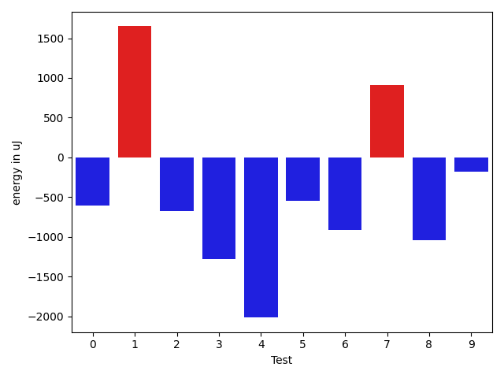
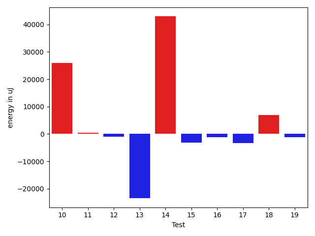
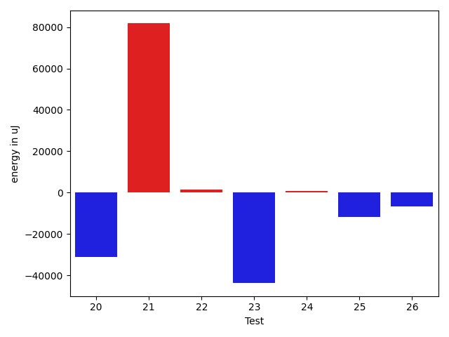
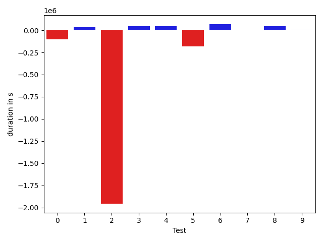
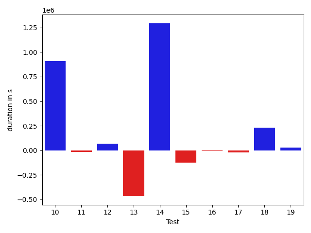
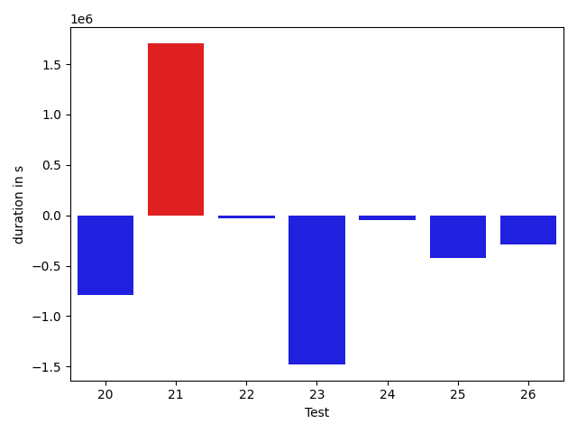

# gson b0a172

https://github.com/google/gson/commit/b0a172

## Delta Energy per test method

| ID | EnergyV1 | EnergyV2 | DeltaEnergy | σ |
| --- | --- | --- | --- | --- |
| 0 | 52817.530303030304 | 52375.45333333333 | -442.0769696969728 | 33462.51524228253 | 27628.027215030914 |
| 1 | 35183.551020408166 | 36897.36111111111 | 1713.8100907029439 | 4107.658725670937 | 5360.652562643521 |
| 2 | 262052.5974025974 | 188117.73076923078 | -73934.86663336662 | 583061.6434896159 | 475720.28951037786 |
| 3 | 39824.275862068964 | 38164.708333333336 | -1659.567528735628 | 5081.386553216598 | 4877.222881920668 |
| 4 | 46540.41836734694 | 45228.20202020202 | -1312.2163471449167 | 21099.650429410813 | 18422.685234023706 |
| 5 | 49269.260416666664 | 44848.494736842105 | -4420.765679824559 | 50103.99753954373 | 16869.41472349086 |
| 6 | 42389.14141414141 | 44237.857142857145 | 1848.7157287157315 | 13250.787473462502 | 16729.59161644603 |
| 7 | 56282.25252525252 | 53159.0101010101 | -3123.242424242424 | 28772.98256531476 | 24641.1530551796 |
| 8 | 41499.448979591834 | 41937.989690721646 | 438.5407111298118 | 12240.898496536065 | 13834.052481903438 |
| 9 | 40339.13953488372 | 39665.45238095238 | -673.6871539313361 | 8343.861425752344 | 7762.579922761262 |
| 10 | 163906.18181818182 | 189826.2626262626 | 25920.08080808079 | 262380.0109532076 | 336795.87470078433 |
| 11 | 39337.47887323944 | 39791.47222222222 | 453.99334898278175 | 4340.821194649679 | 4981.939083028432 |
| 12 | 48522.20212765958 | 47590.32989690721 | -931.872230752364 | 15736.356574708721 | 16059.054235624044 |
| 13 | 74328.98809523809 | 50858.84523809524 | -23470.142857142855 | 180821.49790756512 | 35165.587456751375 |
| 14 | 167363.56565656565 | 210258.08163265305 | 42894.515976087394 | 394016.5862510518 | 454641.4278154992 |
| 15 | 41982.26 | 38831.232142857145 | -3151.027857142857 | 12182.037985181298 | 5942.437252481604 |
| 16 | 40117.02 | 38898.057692307695 | -1218.9623076923017 | 12086.3728628402 | 6426.095690510271 |
| 17 | 43223.61643835616 | 39930.857142857145 | -3292.7592954990178 | 18167.65417614061 | 10231.691720595676 |
| 18 | 59324.9649122807 | 66231.66666666667 | 6906.701754385969 | 47119.00278893146 | 51900.163798561 |
| 19 | 39148.38157894737 | 37903.6 | -1244.781578947368 | 6080.6147282013 | 5393.743154009891 |
| 20 | 292625.202020202 | 261538.0707070707 | -31087.131313131307 | 453856.8361553776 | 436786.30267880816 |
| 21 | 232145.47916666666 | 313889.9761904762 | 81744.49702380956 | 470362.26425034134 | 617713.5047370642 |
| 22 | 36397.25925925926 | 37952.032258064515 | 1554.7729988052524 | 5277.205970843905 | 4731.686792485871 |
| 23 | 147548.05050505052 | 103779.1313131313 | -43768.91919191921 | 190732.31058215478 | 118036.83355756322 |
| 24 | 39739.49206349206 | 40567.90277777778 | 828.4107142857174 | 10630.107731200147 | 9407.174946638283 |
| 25 | 50451.514285714286 | 38558.875 | -11892.639285714286 | 65017.19883686661 | 7374.486493775346 |
| 26 | 43587.47222222222 | 37058.8275862069 | -6528.64463601532 | 33614.60574370587 | 5560.3814249530715 |

## Delta Duration per test method

| ID | DurationV1 | DurationsV2 | DeltaDuration |
| --- | --- | --- | --- |
| 0 | 1648946.0757575757 | 1549030.4666666666 | -99915.60909090913 |
| 1 | 821174.6326530612 | 854110.0 | 32935.367346938816 |
| 2 | 7378169.0 | 5423910.141025641 | -1954258.858974359 |
| 3 | 592295.1724137932 | 639354.5 | 47059.32758620684 |
| 4 | 1539288.6836734693 | 1587154.8484848484 | 47866.16481137904 |
| 5 | 1710114.4166666667 | 1529066.2 | -181048.2166666668 |
| 6 | 1507923.191919192 | 1576344.3979591837 | 68421.2060399917 |
| 7 | 1909844.4545454546 | 1911747.7171717172 | 1903.2626262626145 |
| 8 | 1434387.5102040817 | 1481824.092783505 | 47436.58257942344 |
| 9 | 1235464.6511627906 | 1238699.380952381 | 3234.729789590463 |
| 10 | 4576284.474747474 | 5482463.777777778 | 906179.3030303037 |
| 11 | 1106538.4929577464 | 1090107.9583333333 | -16430.53462441312 |
| 12 | 1600966.2659574468 | 1669970.2886597938 | 69004.02270234702 |
| 13 | 2158923.714285714 | 1693417.761904762 | -465505.9523809522 |
| 14 | 4829618.929292929 | 6123356.6122448975 | 1293737.6829519682 |
| 15 | 1100287.16 | 975121.4642857143 | -125165.6957142856 |
| 16 | 915964.68 | 907372.4038461539 | -8592.276153846178 |
| 17 | 1230786.191780822 | 1211607.4571428571 | -19178.73463796475 |
| 18 | 1731120.6842105263 | 1963057.111111111 | 231936.42690058472 |
| 19 | 1179020.894736842 | 1205271.2571428572 | 26250.362406015163 |
| 20 | 8359855.424242424 | 7566958.343434343 | -792897.0808080807 |
| 21 | 6483460.666666667 | 8190963.428571428 | 1707502.7619047612 |
| 22 | 671716.074074074 | 640469.6774193548 | -31246.396654719254 |
| 23 | 4670237.242424242 | 3191232.9595959596 | -1479004.2828282826 |
| 24 | 1321949.4444444445 | 1275569.8472222222 | -46379.59722222225 |
| 25 | 1450911.7142857143 | 1031514.15625 | -419397.5580357143 |
| 26 | 1100784.3333333333 | 807294.6551724138 | -293489.67816091946 |

## Misc.

| ID | Test Class | Test Method |
| --- | --- | --- |
| 0 | com.google.gson.functional.ReadersWritersTest | testReadWriteTwoObjects |
| 1 | com.google.gson.functional.DefaultTypeAdaptersTest | testBitSetDeserialization |
| 2 | com.google.gson.JsonParserTest | testReadWriteTwoObjects |
| 3 | com.google.gson.JsonParserTest | testParseMixedArray |
| 4 | com.google.gson.functional.ParameterizedTypesTest | testVariableTypeArrayDeserialization |
| 5 | com.google.gson.functional.ParameterizedTypesTest | testVariableTypeDeserialization |
| 6 | com.google.gson.functional.ParameterizedTypesTest | testParameterizedTypeGenericArraysDeserialization |
| 7 | com.google.gson.functional.ParameterizedTypesTest | testVariableTypeFieldsAndGenericArraysDeserialization |
| 8 | com.google.gson.functional.ParameterizedTypesTest | testParameterizedTypeWithVariableTypeDeserialization |
| 9 | com.google.gson.functional.MapAsArrayTypeAdapterTest | testMultipleEnableComplexKeyRegistrationHasNoEffect |
| 10 | com.google.gson.functional.MapAsArrayTypeAdapterTest | testSerializeComplexMapWithTypeAdapter |
| 11 | com.google.gson.functional.CollectionTest | testFieldIsArrayList |
| 12 | com.google.gson.functional.CollectionTest | testWildcardCollectionField |
| 13 | com.google.gson.functional.TypeVariableTest | testAdvancedTypeVariables |
| 14 | com.google.gson.functional.TypeVariableTest | testTypeVariablesViaTypeParameter |
| 15 | com.google.gson.functional.UncategorizedTest | testGsonInstanceReusableForSerializationAndDeserialization |
| 16 | com.google.gson.functional.EscapingTest | testGsonDoubleDeserialization |
| 17 | com.google.gson.functional.EscapingTest | testGsonAcceptsEscapedAndNonEscapedJsonDeserialization |
| 18 | com.google.gson.functional.EscapingTest | testEscapingObjectFields |
| 19 | com.google.gson.functional.NamingPolicyTest | testComplexFieldNameStrategy |
| 20 | com.google.gson.functional.TypeHierarchyAdapterTest | testTypeHierarchy |
| 21 | com.google.gson.OverrideCoreTypeAdaptersTest | testOverrideWrapperBooleanAdapter |
| 22 | com.google.gson.OverrideCoreTypeAdaptersTest | testOverridePrimitiveBooleanAdapter |
| 23 | com.google.gson.functional.DelegateTypeAdapterTest | testDelegateInvoked |
| 24 | com.google.gson.functional.CustomTypeAdaptersTest | testRegisterHierarchyAdapterForDate |
| 25 | com.google.gson.GsonTypeAdapterTest | testTypeAdapterThrowsException |
| 26 | com.google.gson.GsonTypeAdapterTest | testTypeAdapterProperlyConvertsTypes |

| Test | IterationV1 | IterationV2 | DeltaIteration |
| --- | --- | --- | --- |
| 0 | 66 | 75 | 9 |
| 1 | 49 | 36 | -13 |
| 2 | 77 | 78 | 1 |
| 3 | 29 | 24 | -5 |
| 4 | 98 | 99 | 1 |
| 5 | 96 | 95 | -1 |
| 6 | 99 | 98 | -1 |
| 7 | 99 | 99 | 0 |
| 8 | 98 | 97 | -1 |
| 9 | 86 | 84 | -2 |
| 10 | 99 | 99 | 0 |
| 11 | 71 | 72 | 1 |
| 12 | 94 | 97 | 3 |
| 13 | 84 | 84 | 0 |
| 14 | 99 | 98 | -1 |
| 15 | 50 | 56 | 6 |
| 16 | 50 | 52 | 2 |
| 17 | 73 | 70 | -3 |
| 18 | 57 | 63 | 6 |
| 19 | 76 | 70 | -6 |
| 20 | 99 | 99 | 0 |
| 21 | 48 | 42 | -6 |
| 22 | 27 | 31 | 4 |
| 23 | 99 | 99 | 0 |
| 24 | 63 | 72 | 9 |
| 25 | 35 | 32 | -3 |
| 26 | 36 | 29 | -7 |

| Time Label | Time (s) |
| --- | --- |
| Selection | 27.143145322799683 |
| Injection | 12.029534339904785 |
| Total | 1020.7371935844421 |

